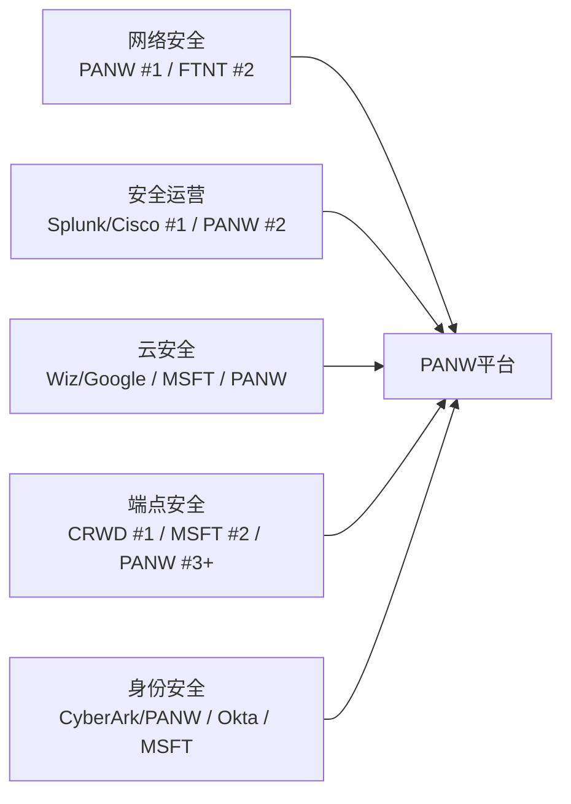

# PANW Phase 1: 业务理解与平台化深度分析

> **Palo Alto Networks (PANW)** | 网络安全/Software-Infrastructure
> **股价**: $160.32 | **市值**: $109.3B | **Forward PE**: 40.4x | **TTM PE**: 84.6x
> **财年截止**: 7月31日 | **当前报告期**: FY2026 H1 (FQ2截至2026年1月31日)
> **分析日期**: 2026-03-31

---

## Ch1: 市场隐含假设与核心定位

### 1.1 Reverse DCF: 市场在赌什么?

在评估PANW之前，必须先理解市场当前价格隐含了什么假设。这是投资分析的起点，不是终点——先翻译市场的"赌注"，再评估这些赌注是否合理。[CQ1]

**当前估值坐标系**:

| 估值指标 | PANW | FTNT(最相似可比) | 溢价倍数 |
|---------|------|-----------------|---------|
| TTM P/E | 84.6x [DM-VAL-001] | 32.5x | 2.6x |
| Forward PE (FY2027E) | 40.4x [DM-VAL-002] | ~25x | 1.6x |
| EV/Sales TTM | 10.3x [DM-VAL-003] | 8.4x | 1.2x |
| FCF Yield | 3.84% [DM-VAL-004] | 3.79% | ~同 |

**Reverse DCF隐含假设拆解**:

以当前股价$160.32、市值$109B为起点，反推市场在定价什么:

- **Forward PE 40.4x**，基于分析师共识FY2027E EPS $3.98 [DM-VAL-005]
- 这意味着市场需要PANW在FY2025-FY2030期间维持**15-18%的营收CAGR**，同时OPM从当前~14%持续扩张到20%+
- 分析师共识路径: FY2027 $13.5B (+16%) → FY2028 $15.4B (+14%) → FY2029 $16.9B (+10%) [DM-VAL-006]
- **PEG角度**: 40.4x Forward PE / ~15% 增速 = PEG 2.7 — 略贵但非极端，前提是增速不进一步减速

**市场隐含的三层信念**:

1. **增速层**: 总营收增速从FY2025的15%不会继续减速，甚至在FY2026 re-accelerate到22-23%(管理层指引)[DM-VAL-007]
2. **利润率层**: GAAP OPM从14%持续向20%+扩张，SBC/营收比从14%继续压缩
3. **平台化层**: 免费→付费转化按预期推进，1,550平台化客户能够带动NRR和ARR持续扩张

**FMP DCF估值**: $143.63，当前股价溢价+11.9% [DM-VAL-008]。这暗示市场对平台化成功给予了小幅溢价，但并非极端乐观定价。

**与FTNT对标的关键判断**: PANW与FTNT总营收增速几乎相同(15% vs 15%)，但PE溢价2.6倍 [DM-VAL-009]。这个溢价**全部来自平台化故事**——市场相信PANW的多产品平台会带来比FTNT单一防火墙业务更高的长期增长。如果平台化转化不及预期，PE有向FTNT水平收敛的风险(从89x TTM → 50-60x = 下跌30-40%)。反之，如果FY2026 22%指引实现并证明增速re-acceleration，溢价合理甚至偏低。

**Reverse DCF结论**: 市场定价隐含"温和增长持续+利润率扩张"，既不是极端乐观(没有定价25%+增速)也不是悲观。**关键变量是平台化转化率**——这一个变量决定了增速能否re-accelerate、利润率能否扩张、PE溢价是否合理。

### 1.2 公司身份: 从防火墙公司到四支柱安全平台

理解PANW的投资价值，首先要理解它正在经历的身份转换。这不是一个渐进式的产品升级，而是一次商业模式的根本性转变。

**身份演进四阶段**:

| 阶段 | 时期 | 身份 | 营收规模 | 核心驱动 |
|------|------|------|---------|---------|
| 防火墙公司 | 2005-2018 | 下一代防火墙纯卖家 | $0→$2.3B | 硬件NGFW替代Cisco/Check Point |
| 多产品安全 | 2018-2022 | 网络+云+SOC三条线 | $2.3B→$5.5B | 17次收购填补能力缺口 |
| 平台公司 | 2022-2025 | 平台化整合战略 | $5.5B→$9.2B | 从卖产品转为卖平台 |
| AI安全平台 | 2025-至今 | AI原生+四支柱(+CyberArk) | $9.2B→$11.3B(FY2026E) | AI安全+身份安全第四支柱 |

[DM-BIZ-001] FY2018营收$2.3B → FY2025 $9.2B = Arora任期内CAGR约22%，公司规模扩大4倍。

**四大平台支柱(2026年后)**:

| 支柱 | 品牌 | 核心功能 | 关键产品 | 规模指标 |
|------|------|---------|---------|---------|
| **网络安全** | Strata | 防火墙+SASE+SD-WAN | PA-Series NGFW, Prisma SASE | SASE ARR >$1.5B [DM-BIZ-002] |
| **安全运营** | Cortex | AI驱动的SOC自动化 | XSIAM, XDR, AgentiX | XSIAM ~600客户, >$1M均值 [DM-BIZ-003] |
| **云安全** | Prisma/Cortex Cloud | 云原生应用保护(CNAPP) | Cortex Cloud, Prisma AIRS | 1,775+云安全客户 [DM-BIZ-004] |
| **身份安全(新)** | CyberArk整合 | 特权访问+身份治理 | PAM, Secrets Management | CyberArk ARR ~$1.2B [DM-BIZ-005] |

**为什么身份转换如此重要**: 当PANW只卖防火墙时，它的增长天花板约为NGFW市场($23B，2025年) [DM-BIZ-006]。转型为四支柱平台后，其TAM扩展到网络安全($84.5B)+云安全($20-25B)+安全运营($12-15B)+身份安全($18-22B)+AI安全($25-31B)的交集——管理层声称总TAM $250B+ [DM-BIZ-007]。但TAM不等于可获取市场——PANW当前营收$9.9B仅占声称TAM的4%，关键在于平台化能否真正跨支柱扩展钱包份额。

### 1.3 "一个问题"与报告组织

> **"平台化客户从免费试用到付费转换的实际比率和时间表，能否支撑FY2026 22%的营收加速指引?"**

这是整份报告的组织核心，因为这一个问题的答案同时决定了:

1. **CQ1(增速)**: 转化率高→营收re-accelerate→PE溢价合理
2. **CQ3(FCF可持续性)**: 转化成功→递延收入重新加速→FCF利润率维持
3. **CQ4(CyberArk)**: 平台化成功→第四支柱交叉销售有基础→$25B值得
4. **CQ2(XSIAM)**: SOC替代Splunk是平台化最强的pull-through产品

如果转化率低+时间延迟: FCF利润率回落+增速不加速+PE收缩=下行30-40%。
如果转化率达标+XSIAM持续: 增速确认→NRR持续120%+→平台飞轮启动=上行20-30%。

### 1.4 可能性宽度评估: 5分(中) → 混合模式

| 维度 | 评分 | 理由 |
|------|------|------|
| 核心业务确定性 | 3(窄) | 防火墙+订阅基础稳定，80%+是经常性收入 |
| 平台化转型 | 6(中宽) | 免费→付费转化尚在验证期，结果范围宽 |
| M&A整合 | 7(宽) | $30B+收购未完全整合，CyberArk/Chronosphere结果高度不确定 |
| AI安全 | 7(宽) | 全新TAM类别，市场尚未形成，PANW领先但赢家未定 |
| 竞争格局 | 5(中) | MSFT $37B+CRWD增速快，但PANW有网络安全护城河 |
| **加权平均** | **5(中)** | **混合模式: 传统估值+可能性附录** |

**框架路由**: 采用混合模式——对成熟业务(网络安全)用传统DCF/可比估值，对转型部分(平台化/AI安全/CyberArk)用概率加权情景分析。不给单一目标价，而是给"条件估值"。

---

## Ch2: 平台化战略——从碎片化安全到统一平台 [CQ1]

### 2.1 平台化的核心逻辑: 企业安全碎片化的痛点

PANW的平台化战略不是CEO拍脑袋的产物，而是对一个行业结构性问题的回应。理解这个问题，是判断平台化能否成功的前提。

**问题**: 一个典型的大型企业拥有30-80个来自不同厂商的安全产品 [DM-BIZ-008]。每个产品有独立的管理界面、告警系统、数据格式——安全运营中心(SOC)的分析师需要在十几个屏幕之间切换来调查一次入侵事件。这不仅低效，而且危险: 安全盲区存在于产品之间的"缝隙"中。

**解决方案**: PANW的平台化提议是——把30-80个碎片化产品整合为一个平台，覆盖网络安全+云安全+安全运营+身份安全四大支柱。统一数据湖、统一策略引擎、统一AI检测——消灭产品间的缝隙。

**行业验证**: 45%的组织预计到2028年将安全工具数量减少到15个以下(2023年仅13%的组织做到) [DM-BIZ-009]。2025年网络安全M&A交易超过400笔(交易量+22%，交易金额+270%) [DM-BIZ-010]，说明整合是行业方向，不仅是PANW的叙事。

### 2.2 平台化的四步客户旅程: 免费→付费的机制拆解

理解平台化转化率的前提是理解客户是怎么从"只用PANW一个产品"变成"把所有安全都给PANW"的。

**Step 1 — 着陆(Land)**: 客户通常从一个产品开始——最常见是硬件防火墙(NGFW)，这是PANW的传统强项，拥有全球28.4%的营收市占率(#1) [DM-BIZ-011]。85,000+企业客户中，绝大多数只使用一个支柱的产品。85%的财富100强和75%+的全球2000强是PANW客户 [DM-BIZ-012]。

**Step 2 — 免费试用(Free Trial)**: PANW主动提供"零成本过渡期"——在客户现有竞品合约到期前，免费提供PANW平台产品的使用权。具体包括:
- Cortex XSIAM / Prisma Cloud / SASE的免费访问权
- 基础专业服务(Agent迁移)
- 前1,500家大客户获得250小时免费安全事件响应咨询 [DM-BIZ-013]
- 这个"免费期"是平台化战略最关键也最有争议的部分: 它在短期内压制了billings和递延收入增长(因为免费=零billings)，但如果转化成功，多年期合约的ACV远高于单产品

**Step 3 — 转化(Conversion)**: 当竞品合约到期，客户面临选择: 续约竞品(恢复碎片化)还是转为PANW付费平台客户(整合化)。目前可获得的转化率数据:
- 前1,500家大客户中获得免费安全咨询的400家(27%)在90天内签约了持续事件响应服务 [DM-BIZ-014]
- FQ3 FY2024: ~65个增量平台化销售，环比+40% [DM-BIZ-015]
- 免费试用期一般12-18个月(管理层口径)，2025年提供的免费期在2025年底/2026年初开始转化——这解释了NGS ARR增速从Q1 FY2026的29%重新加速到Q2的33% [DM-BIZ-016]

**Step 4 — 扩展(Expand)**: 转化后的平台客户展现出强大的钱包份额扩张:
- 使用2个平台的客户: 生命周期价值(LTV) **5x** vs 单平台客户 [DM-BIZ-017]
- 使用3个平台的客户: LTV **40x** vs 单平台客户 [DM-BIZ-018]
- 平台客户NRR ~119-120%，低个位数年流失率(估计2-4%) [DM-BIZ-019]
- 非平台客户NRR估计~110%——差距约10个百分点，说明平台化确实创造了更强的粘性和扩展

**因果链**: 5x/40x的LTV倍增机制不是魔法——它来自**交叉销售数学**。一个只用防火墙的客户年合约~$456K [DM-BIZ-020]。如果该客户扩展到SASE(~$200K+)+XSIAM(~$1M+)+云安全(~$300K+)，总花费从$456K跳到$2M+，接近5x。如果再加上身份安全(CyberArk)和更多模块，10-40x是合理的上限。**但这假设每个支柱的产品都有竞争力**——如果PANW在某个领域(如端点)不如专精竞品(CrowdStrike)，客户可能选择混搭而非全平台。

### 2.3 平台化渗透率: 2.2%的巨大白空间与增长加速

**当前渗透率数据**:

| 客户层级 | 平台化数量 | 总基数 | 渗透率 |
|---------|-----------|-------|--------|
| 全部客户 | ~1,550 | 85,000+ | **~1.8%** [DM-BIZ-021] |
| Top 5,000客户 | ~1,150 | 5,000 | **~23%** [DM-BIZ-022] |
| 总平台化增速 | +35% YoY | — | Q2 FY2026 [DM-BIZ-023] |
| 季度净新增 | ~110 | — | Q2 FY2026创纪录 [DM-BIZ-024] |

**大客户扩张是核心引擎**:

| 客户规模(NGS ARR) | 数量 | YoY增速 |
|-------------------|------|---------|
| >$5M | 169 | +54% [DM-BIZ-025] |
| >$10M | 55 | +49% [DM-BIZ-026] |
| >$20M | — | +80% [DM-BIZ-027] |
| $10M+交易量增速 | — | +52% [DM-BIZ-028] |

**因果推理**: 大客户($5M+)增速54%远超总客户增速35%——这意味着平台化不是"更多小客户签约"，而是"已有大客户加深承诺"。这是一个健康信号，因为大客户的转化更有可能是基于平台价值而非价格让步。

**但反面需要考虑**: 大客户($20M+)增速80%→数量可能从~30增加到~55——绝对值仍然很小。如果增速80%是因为基数低(从10到18)而非因为市场拉力强，那么可持续性存疑。此外，平台化deal中有多少ACV来自"免费转付费"(自然增长)vs"真正的竞品替代"(市场份额获取)——PANW没有披露这个分解。

### 2.4 平台化对财务的影响: 递延收入放缓的深层含义

平台化战略最大的财务副作用是递延收入增速的急剧放缓。

**递延收入趋势(这是理解CQ1和CQ3的关键)**:

| 财年 | 递延收入 | YoY增长 | 营收 | 递延/营收比 |
|------|---------|--------|------|-----------|
| FY2021 | $5.0B | — | $4.3B | 1.18x |
| FY2022 | $7.0B | +39% [DM-FIN-001] | $5.5B | 1.27x |
| FY2023 | $9.3B | +33% [DM-FIN-002] | $6.9B | 1.35x |
| FY2024 | $11.5B | +23% [DM-FIN-003] | $8.0B | 1.43x |
| FY2025 | $12.8B | **+11%** [DM-FIN-004] | $9.2B | 1.39x |
| FQ2'26 | $6.2B(流动部分) | — | — | — |

递延收入增速从FY2022的39%暴跌到FY2025的11%——表面上看是一个严重的减速信号。但这需要与NGS ARR增速(同期32-33%)对比来理解:

**两种解读**:

| 解读 | 逻辑 | 含义 |
|------|------|------|
| **偏多(管理层叙事)** | 免费期压制billings→递延收入增速↓，但实际客户获取加速(NGS ARR 33%)。当免费期结束→billings重新加速→递延收入增速恢复 | 递延收入减速是暂时的，是"先亏后赚"的正常表现 |
| **偏空** | 递延收入增速11%才是真实的"现金承诺"速度，NGS ARR 33%被CyberArk等收购注入膨胀了 | 有机增长实际在减速，平台化免费期可能不会转化为预期的付费billings |

**数据验证哪个解读更准确**: Q2 FY2026 NGS ARR +33%中，有机增速(剔除收购)约28%，收购贡献约5个百分点(Chronosphere) [DM-FIN-005]。28%有机增速仍然大幅高于11%递延收入增速——差距约17个百分点。这个差距大概率来自免费期客户(已计入ARR但尚未billings)。如果这些客户按预期在FY2026 H2开始付费，递延收入增速应该在FY2026 H2-FY2027出现明显回升。**FQ3 FY2026(即2026年4月报告)将是关键验证窗口**。

### 2.5 RPO: 被忽视的正面前瞻指标

在billings被PANW弃用后，RPO(Remaining Performance Obligations，剩余履约义务——已签约但尚未确认为收入的合同金额)成为替代的前瞻指标。

| 季度 | 总RPO | YoY增速 | 同期营收增速 | RPO-营收差 |
|------|-------|---------|------------|-----------|
| Q4 FY2024 | $12.7B | ~20% | 16.5% | +3.5pp |
| Q4 FY2025 | $15.8B | +24% [DM-FIN-006] | 14.9% | +9.1pp |
| Q2 FY2026 | $16.0B | +23% [DM-FIN-007] | 15% | +8pp |
| FY2026E | $20.2-20.3B | +28% [DM-FIN-008] | 22-23% | +5-6pp |

**RPO增速(23%)持续高于营收增速(15%)——差距8个百分点** [DM-FIN-009]。这意味着已签约的合同额在加速增长，但收入确认(因为合约期更长/免费期延迟)还没跟上。这是一个**正面前瞻信号**: 它暗示未来几个季度营收增速有上行空间。

**RPO覆盖**: $16B RPO / $9.9B TTM营收 = 1.6年收入覆盖 [DM-FIN-010]。这为PANW提供了显著的收入可见性缓冲——即使宏观恶化，已签约合同仍会持续贡献收入。

### 2.6 飞轮验证: 平台化是否存在自蚕食?

铁律要求对任何"飞轮"叙事进行悖论检查——新产品成功是否蚕食核心产品?

**PANW平台化飞轮**:
```
更多客户采用平台 → 更多跨支柱数据共享 → AI检测精度更高 →
安全效果更好 → 更多客户愿意整合到平台 → 更多客户...
```

**蚕食检测**:

| 蚕食风险 | 严重度 | 评估 |
|---------|--------|------|
| SASE替代分支防火墙硬件 | 中 | SASE ARR+40%确实在替代部分硬件NGFW销售。但1/3的Prisma Access客户是PANW新客户(非内部蚕食) [DM-BIZ-029]。且SASE无法替代数据中心/园区NGFW(不同用途)。管理层用Software NGFW Credits确保无论形态(硬件vs虚拟vs SASE)都能捕获价值 |
| 免费期压制短期billings | 高(短期) | 这是设计中的副作用，不是意外。2024年2月首次披露时股价单日跌>25% [DM-BIZ-030]。关键验证: FY2026 H2免费期到期后billings是否回升 |
| CyberArk独立品牌弱化 | 中 | UBS报告渠道合作伙伴对CyberArk整合反馈"mixed" [DM-BIZ-031]。如果整合削弱CyberArk的独立品牌→身份安全客户可能流失到Okta等竞品 |

**飞轮净强度评估**: 正面>负面。蚕食主要发生在硬件→软件的形态转换上(SASE替代分支防火墙)，但这是$0-sum(PANW内部从左手到右手)，不是市场份额损失。真正的风险不是蚕食，而是**执行风险**——平台化需要同时在四个支柱都有竞争力的产品，任何一个支柱的弱点都会让客户选择"最佳组合"(best-of-breed mix)而非"全PANW"。目前端点安全是PANW最弱的支柱(CrowdStrike明显领先)，这限制了平台化在安全敏感型企业中的全面渗透。

### 2.7 CQ1判断: 平台化转化率能否支撑22%增速?

**支持转化达标的证据**:
1. NGS ARR增速从29%重新加速到33%(Q2 FY2026)，且有机增速28%仍强劲 [DM-BIZ-032]
2. RPO增速(23%)持续领先营收增速(15%)，指向未来收入加速 [DM-FIN-009]
3. 大客户($5M+/10M+/20M+)增速49-80%远超总客户增速 [DM-BIZ-025-028]
4. 平台化客户净新增创季度纪录(~110/季) [DM-BIZ-024]
5. CEO在$147买入$10M股票——内部人信心信号 [DM-BIZ-033]

**反面——什么条件下转化会低于预期**:
1. 免费期客户发现PANW产品不如竞品→选择不续约→转化率<<27%
2. CyberArk整合分散管理层注意力→平台化执行质量下降
3. 宏观恶化→企业IT预算收紧→客户推迟整合决策(维持现状=最低风险选择)
4. Microsoft E5 bundling加速→客户用MSFT做"60分"安全+CrowdStrike做端点→PANW平台价值主张被弱化

**当前判断**: 偏正面但尚未完全验证。FY2026 H1数据(NGS ARR/RPO/大客户增速)方向一致地指向转化在推进中。但FY2026 22-23%的营收指引中包含了CyberArk合并贡献(~$1.2B ARR = ~$600M H2收入)——**有机营收增速约16-17%**，仅比FY2025的15%小幅加速。真正的"加速验证"需要等到FY2027的有机增速是否能维持17%+。

**置信度**: CQ1 = 55/100 (偏正面，但关键验证窗口在FQ3-Q4 FY2026)

### 2.8 平台化大单经济学: 从案例看价值创造机制

抽象的转化率讨论不如具体的deal案例有说服力。以下是Q2 FY2026披露的代表性平台化交易:

**案例1: 全球汽车公司 $50M+平台deal** [DM-DEAL-001]
- 构成: SASE $30M + XSIAM $20M
- 逻辑: 该公司此前使用多家安全厂商(网络/SOC分开采购)。PANW提供统一方案→消除跨厂商集成成本→SOC自动化(XSIAM)减少人工分析师需求
- **经济学**: 假设此前该客户在安全上花费$25M/年(分散在5-8个厂商)。整合到PANW $50M(多年期合约，年化~$15-17M)=客户实际省了$8-10M/年(厂商管理成本+人力节省)，同时PANW获得了3-5x的钱包份额提升
- **因果链**: 碎片化安全运营成本高 → PANW提供整合方案 → 客户总成本降低 → PANW单客户收入上升 → 双赢(但前提是PANW每个支柱的产品都能达到客户的最低质量要求)

**案例2: 美国电信 $100M+ deal(含$85M XSIAM)** [DM-DEAL-002]
- 这是PANW历史上最大的单笔XSIAM合同
- 逻辑: 大型电信公司运营全球网络→安全事件量极大→传统SIEM(按数据量收费)成本不可持续→XSIAM的智能降噪+AI自动化=大幅降低SOC运营成本
- **经济学**: $85M XSIAM合同(估计3-5年期)→年化$17-28M。传统SIEM(Splunk)在这个规模的电信客户中年费可能$10-15M，但需要50+人的SOC团队→人力成本远超软件费用。如果XSIAM自动化80%的Tier 1/2任务→SOC团队可从50人缩减到15-20人→年省$3-5M人力+$10-15M SIEM费→总节省可能>$15M/年 vs XSIAM年化$17-28M
- **关键假设验证**: XSIAM真的能在电信级规模(PB级日志)上做到60%+ MTTR <10分钟的承诺吗? 如果能，这个deal的单位经济学对客户是正面的。如果不能，$85M可能是一个昂贵的实验

**案例3: 大型IT服务提供商 $20M deal(XSIAM核心)** [DM-DEAL-003]
- IT服务公司管理多家客户的安全→他们自己就是"安全平台买家"
- 当IT服务公司选择PANW作为底层平台→他们所有的客户间接成为PANW用户
- **渠道杠杆**: 一个IT服务公司deal可能影响数十到数百个下游企业的安全采购决策

**Deal模式总结**: 最大的平台化deal有三个共同特征:
1. 客户安全支出已经很高(>$10M/年)→整合价值最明显
2. XSIAM是anchor产品——AI自动化SOC的经济性是最容易量化的ROI
3. 多年期合约(3-5年)→RPO增长快于收入增长(合约延长但确认期更长)

### 2.9 收入结构分解: "两个PANW"的增速剪刀差

理解PANW的真实增速，需要把公司拆成"旧PANW"和"新PANW":

**旧PANW**(硬件防火墙+传统支持合约):
- 硬件产品收入: $1.80B(FY2025), +12% YoY [DM-REV-001]
- 占总营收~19.5%，持续下降(从FY2020 ~24%)
- 增长主要来自Gen5硬件刷新周期(5-7年换代)——周期性驱动，非结构性加速
- **长期方向**: 硬件占比将继续下降至<15%，但不会归零(数据中心/园区仍需物理防火墙)

**新PANW**(NGS订阅+XSIAM+SASE+云安全+CyberArk):
- NGS ARR: $6.33B(Q2 FY2026), +33% YoY [DM-REV-002]
- SASE ARR: >$1.5B, +40% YoY [DM-REV-003]
- XSIAM: ~$600-800M隐含ARR, +200%+ YoY [DM-REV-004]
- **这是投资者应该关注的增速**: 33%的NGS ARR增速才是"新PANW"的速度

**增速剪刀差的投资含义**: 总营收增速15%是"旧PANW"减速(硬件+传统支持)和"新PANW"加速(NGS)的混合结果。随着NGS ARR占总营收比例持续提升(从当前~65%→FY2028E >80%)，**总营收增速将向NGS ARR增速收敛**——这就是管理层FY2026指引22-23%的底层逻辑(NGS权重上升+CyberArk合并→总增速从15%跳到22%)。

**但需要注意**: FY2026 22-23%增速中约6-7个百分点来自CyberArk合并(非有机)。剔除后有机增速~16-17%——仅比FY2025的15%小幅加速。**真正的"re-acceleration"验证需要看FY2027的有机增速是否能达到18-20%**(即NGS ARR的高增速开始充分反映到总营收中)。

### 2.10 SASE竞争深度: Prisma SASE vs Zscaler vs Fortinet

SASE(Secure Access Service Edge——安全访问服务边缘)是PANW平台化中增速最快的支柱之一(ARR >$1.5B, +40% YoY)。它也是竞争最激烈的细分市场。

**SASE市场三强对比**:

| 维度 | PANW Prisma SASE | Zscaler | Fortinet FortiSASE |
|------|-----------------|---------|-------------------|
| **架构哲学** | 网络安全出发: 防火墙策略引擎+SSE+SD-WAN统一 | 云代理Zero Trust: 无企业网络, 用户直连应用 | 硬件+软件统一: 最强价格竞争力 |
| **ARR/营收** | SASE >$1.5B(PANW总NGS一部分) [DM-SASE-001] | $3.36B总ARR(FY2026 Q2), +25% YoY [DM-SASE-002] | FortiSASE billings +100% YoY [DM-SASE-003] |
| **SD-WAN** | 自有(CloudGenix $420M收购) | 无原生SD-WAN→合作伙伴 | 自有(最强SD-WAN之一) |
| **目标客户** | 混合环境(已有PANW防火墙的客户扩展) | 纯云优先, Zero Trust greenfield | 中小企业+价格敏感客户 |
| **定价** | 偏高, 被Forrester批评"pricing complexity" [DM-SASE-004] | 中等, 消费模式 | 最低, 中小企业友好 |
| **Forrester排名** | Top 3 Leader | Top 3 Leader | 快速追赶 |
| **独特优势** | 与NGFW相同策略引擎(PAN-OS)→统一策略管理 | 纯云架构→全球PoP最多→延迟最低 | 价格+SD-WAN一体化 |
| **独特弱点** | 定价复杂, 非纯云原生 | 无硬件/on-prem→混合环境受限 | 品牌认知偏中小企业 |

**PANW在SASE的竞争地位**: PANW不是SASE的#1(Zscaler在纯SASE营收上更大)，但PANW的优势在于**SASE作为平台化入口**而非独立产品。数据显示: 近1/3的Prisma Access客户是PANW新客户 [DM-BIZ-029]——SASE是PANW获取新客户的最有效渠道。一旦客户用了SASE→扩展到NGFW→扩展到XSIAM→平台化飞轮启动。

**SASE的战略价值**: 对PANW来说，SASE的价值不仅是$1.5B ARR本身，而是它作为**平台化的landing product**(着陆产品)。$50M汽车公司deal中$30M是SASE [DM-DEAL-001]——SASE是"进门"产品，XSIAM是"加价"产品。这个组合使PANW的平台化deal经济性优于Zscaler(纯SASE)或CrowdStrike(纯端点)的单支柱approach。

### 2.11 Prisma Cloud/Cortex Cloud的竞争处境: Google-Wiz冲击

2026年3月11日，Google以$32B完成了对Wiz的收购 [DM-CMP-019]——这重塑了云安全竞争格局。

**Wiz的破坏性**: Wiz在~4年内从零增长到$1B+ ARR(SaaS史上最快) [DM-CMP-020]。50%+的Fortune 100是Wiz客户。它的无代理(agentless)方法直击了Prisma Cloud早期"拼凑式整合"的弱点。

**Google-Wiz对PANW的影响**:

| 维度 | 影响 |
|------|------|
| **直接竞争** | GCP + Wiz = 最完整的云原生安全方案 → 在Google Cloud上直接威胁Prisma Cloud/Cortex Cloud |
| **Bundling风险** | Google可能将Wiz安全功能bundled into GCP定价→类似Microsoft E5模式 |
| **PANW反击** | PANW的反制是**跨云优势**: 85%大企业多云 → Wiz/Google优化GCP, Microsoft优化Azure → PANW是唯一跨AWS/Azure/GCP/Ali/Oracle的平台 [DM-CMP-021] |
| **讽刺** | PANW刚与Google Cloud签了$10B合作($6.3B PANW在GCP上的支出) [DM-AI-007]。Google既是合作伙伴(IaaS)又是竞争对手(安全)——"frenemy"关系 |

**PANW Cortex Cloud(原Prisma Cloud)的定位调整**: 2025年2月，PANW将Prisma Cloud重组为Cortex Cloud [DM-BIZ-046]——将CNAPP与CDR(云检测响应)统一到Cortex平台上。这不仅是品牌重塑，更是**战略重新定位**: 从"独立云安全产品"转为"平台安全运营的一部分"。独立竞争Wiz在agentless CNAPP上很难赢，但如果Cortex Cloud是PANW平台(网络+SOC+身份+云)的一部分→客户选择PANW是因为平台价值而非单点云安全能力。

---

## Ch3: XSIAM——重新定义安全运营中心 [CQ2]

### 3.1 XSIAM产品深度: 为什么传统SIEM需要被替代?

XSIAM(Extended Security Intelligence and Automation Management——扩展安全智能与自动化管理平台)不是PANW凭空创造的需求，而是对安全运营领域一个10年未解的结构性问题的回应。

**传统SIEM的结构性困境**:

安全信息和事件管理(SIEM, Security Information and Event Management)是企业SOC(安全运营中心)的核心。传统SIEM(以Splunk为代表)的工作模式是: 收集所有安全日志 → 存储 → 人工分析告警 → 响应。问题在于:

1. **数据爆炸**: 企业每天产生的安全日志从TB级增长到PB级，传统SIEM按数据量收费→成本指数级增长 [DM-BIZ-034]
2. **误报泛滥**: 典型SOC每天收到数千条告警，其中>90%是误报。分析师疲于处理误报，真正的威胁被淹没
3. **人才短缺**: 全球网络安全职位空缺350万+ [DM-BIZ-035]。SOC分析师是最短缺的岗位之一——即使有预算也招不到人
4. **响应延迟**: 传统SIEM的平均检测到响应时间(MTTR)以天甚至周计——而AI驱动的攻击将攻击链压缩到了小时级

**XSIAM的解题思路**: 从"人看日志"变为"AI自主运营"。具体差异:

| 维度 | 传统SIEM(Splunk) | XSIAM |
|------|-----------------|-------|
| 架构 | 日志收集+存储+人工查询 | AI原生，统一数据模型+自动检测+自动响应 |
| 数据处理 | 按数据量计费(越多越贵) | 智能降噪，减少30%+低价值数据 [DM-BIZ-036]，基础设施需求降至传统方案的1/20 |
| 检测方式 | 基于规则+人工关联 | 机器学习+深度学习+LLM自然语言分析 |
| 响应速度 | MTTR: 天/周 | 60%+部署客户MTTR **<10分钟** [DM-BIZ-037] |
| 整合度 | 需要与EDR/SOAR/ASM等多个工具分别集成 | 统一平台: XDR+SIEM+SOAR+ASM一体化 |

### 3.2 XSIAM增长轨迹: 最快达到$1B bookings的产品

**季度客户增长**:

| 季度 | XSIAM客户数 | 平均ARR/客户 | 关键里程碑 |
|------|-----------|------------|-----------|
| Q2 FY2025 | ~250+ | >$1M | 累计bookings突破$1B——PANW史上最快达到此里程碑 [DM-BIZ-038] |
| Q3 FY2025 | ~350+ | >$1M | ARR增速>200% YoY [DM-BIZ-039] |
| Q4 FY2025 | ~400+ | >$1M | 持续强劲 |
| Q1 FY2026 | ~470 | >$1M | 客户增速>150% YoY [DM-BIZ-040] |
| Q2 FY2026 | **~600+** | >$1M | 客户增速>200% YoY [DM-BIZ-041] |

**隐含ARR估算**: ~600客户 × >$1M均值 = **$600M-$800M+** ARR(粗略估计，PANW未单独披露XSIAM ARR) [DM-BIZ-042]。最大单笔交易: 一家美国电信公司$85M XSIAM合同(Q2 FY2026创纪录) [DM-BIZ-043]。

**增速检验**: 客户从~250(Q2 FY2025)增长到~600(Q2 FY2026)= +140% YoY。这远超PANW整体增速(15%)，也远超竞品增速——XSIAM是平台化战略中最强的增长引擎。

### 3.3 XSIAM vs 竞品: 在SOC市场赢在哪里?

**SIEM/SOC市场格局**:

| 竞品 | 产品 | 市场地位 | 关键指标 |
|------|------|---------|---------|
| **Splunk(Cisco)** | Splunk ES | 传统领导者, 7.2%心智份额 [DM-CMP-001] | 被Cisco $28B收购后整合中，成长停滞 |
| **Microsoft** | Sentinel | 增速最快(Azure bundling) | 深度M365/Azure整合，价格优势明显 |
| **PANW** | Cortex XSIAM | 最快增长的新挑战者 | **$1B+累计bookings, ~600客户, 200%+ ARR增速** [DM-CMP-002] |
| **CrowdStrike** | Falcon LogScale | 从端点向SOC扩展 | 利用端点遥测数据优势 |
| **IBM** | QRadar(legacy) | **已退出市场** | SaaS资产卖给PANW($1.14B) [DM-CMP-003] |

**PANW SIEM心智份额仅2.0%**(vs Splunk 7.2%) [DM-CMP-001]——但增长轨迹极其陡峭。IBM退出SIEM市场(卖给PANW)这一事实本身就是对XSIAM架构方向的验证: 如果传统SIEM还有未来，IBM不会在2024年以$1.14B把QRadar SaaS卖掉。

**XSIAM vs Splunk(Cisco)的竞争动态**:

Splunk的核心弱点是**数据成本**: 按数据量收费的模式在数据爆炸时代成为客户最大的痛点。XSIAM的智能降噪(减少30%+低价值数据)和平台订阅模式在经济性上有结构性优势。Cisco收购Splunk后($28B，2024年3月)，整合进展缓慢——PANW正在通过免费QRadar迁移服务直接从Cisco/IBM手中抢夺客户。

**XSIAM vs Microsoft Sentinel的竞争动态**:

Microsoft Sentinel的优势是**生态整合**: M365 E5许可证自带基础安全功能，Sentinel与Azure深度绑定。对"Microsoft-first"的组织(占大企业相当比例)，Sentinel几乎是"免费"的选择。但Sentinel的弱点在于: (1)多云能力有限(Azure优化，AWS/GCP次之)，(2)安全深度不如专业工具，(3)85%的大企业使用多云环境 [DM-CMP-004]——需要跨云的安全方案。XSIAM在"安全优先"的客户中更有竞争力，Sentinel在"微软生态优先"的客户中占优。

### 3.4 XSIAM的隐含TAM与天花板

**SIEM/SOC市场**当前规模约$12-15B [DM-BIZ-044]，增速10-15% CAGR。如果XSIAM能获取这个市场的10-15%份额(从当前<2%心智份额出发)，意味着$1.2-2.3B的潜在ARR——这接近PANW当前NGS ARR的20-35%。

**但天花板在于**: XSIAM要求客户对PANW生态系统做出深度承诺(数据湖、Agent部署、工作流整合)。这意味着XSIAM最佳的目标客户是**已有PANW防火墙+SASE的企业**——因为他们已经有了网络遥测数据。对于没有PANW网络安全产品的企业，XSIAM的value proposition弱化(需要从零部署Agent，而CrowdStrike的端点Agent已经在那里)。

**因果链**: XSIAM增长→拉动防火墙/SASE(需要网络数据) → 反向也成立: 防火墙/SASE → 提供数据给XSIAM。这是一个**双向pull-through飞轮**——但仅在PANW网络安全客户内部有效。对外部客户，XSIAM需要独立于PANW网络产品的价值主张(纯SOC替代Splunk)。$85M电信公司大单的存在暗示独立价值主张是成立的 [DM-BIZ-043]，但这类超大单可能是例外而非常态。

### 3.5 XSIAM 3.0 + AgentiX: 自主SOC的下一步

XSIAM不是一个静态产品——它的路线图指向"自主SOC"(Autonomous SOC)，即安全运营中心几乎完全由AI驱动，人类分析师从"做事"转为"监督AI做事"。

**XSIAM版本演进**:

| 版本 | 时间 | 关键升级 |
|------|------|---------|
| XSIAM 1.0 | 2022 | 基础AI驱动SIEM+XDR+SOAR统一 |
| XSIAM 2.0 | 2024 | BYOML(客户自定义ML模型)+Copilot辅助 |
| **XSIAM 3.0** | 2025年4月 | **主动暴露管理**(proactive exposure management)+高级邮件安全 [DM-XSIAM-001] |
| **Cortex AgentiX** | 2025年10月 | **AI Agent工作流平台**——基于1.2B+真实playbook执行训练 [DM-AI-005] |
| **Cortex Cloud整合** | 2026年 | XSIAM+Cortex Cloud = SOC+云安全统一(观测性数据来自Chronosphere收购) |

**AgentiX的战略意义**: AgentiX不仅仅是XSOAR(安全编排自动化)的升级——它是PANW构建"AI Agent平台"的野心。AgentiX允许SOC团队:
1. 构建、部署、治理AI安全Agent(不是简单的自动化脚本)
2. 利用PANW的1.2B+真实playbook执行数据训练Agent [DM-AI-005]
3. Agent可以自主调查告警、执行响应、生成报告——Tier 1/2分析师的大部分工作

**因果链**: 如果AgentiX成功→SOC运营成本大幅下降(AI Agent替代50-80%的初级分析师工作)→CISO的ROI计算变成"XSIAM的年费vs 20-30名初级分析师的年薪"→在人才短缺(350万+空缺)的背景下，这个ROI计算几乎是单向有利于XSIAM的 [DM-BIZ-035]。

**但反面**: "自主SOC"仍然是一个愿景而非现实。在最敏感的安全场景(国防/金融/关键基础设施)中，完全由AI做出响应决策在短期内是不可接受的——监管和企业风控要求"人在回路中"(human-in-the-loop)。AgentiX的实际采用速度可能慢于技术演进速度。

### 3.6 XSIAM的数据优势与壁垒深度

XSIAM的竞争壁垒不仅是"产品更好"，还有一个数据层面的结构性优势:

**数据网络效应在SOC中的特殊价值**: 传统SIEM处理的是客户自己的日志→每个客户是孤立的。XSIAM的Precision AI利用所有客户的威胁数据来训练模型→更多客户 = 更多攻击样本 = 更快识别新攻击模式 = 更好的检测 = 更多客户愿意用。

**量化**:
- PANW日处理1.5万亿+网络安全事件 [DM-MOAT-004]
- 85,000+客户的遥测数据 [DM-BIZ-012]
- 威胁检测精度99.7% [DM-XSIAM-002]
- 1.2B+真实playbook执行——这是AI Agent训练数据的"语料库"

**壁垒评估**: 这个数据优势对后来者构成障碍——一个新的AI安全SOC产品需要从零开始积累客户数据。但**不是不可逾越**: CrowdStrike在端点侧有类似规模的数据优势(全球最大的端点遥测数据集)，Microsoft在Windows/Office侧有更大的数据集。数据壁垒在SOC领域有价值，但不是决定性的——产品体验、定价、平台集成度可能更重要。

### 3.7 QRadar迁移管道: 内嵌的增长推力

PANW 2024年9月以$1.14B收购IBM QRadar SaaS资产 [DM-CMP-003]，随后提供免费迁移到XSIAM的服务。这等于买下了一个**定向销售管道**: QRadar客户的合约到期时，面临的选择是(a)续约一个已被母公司放弃的产品，还是(b)免费迁移到XSIAM。

QRadar SaaS相关产品已于2025年4月达到销售终止(End of Sale) [DM-BIZ-045]——这意味着PANW有一个明确的时间窗口来转化这批客户。但转化量取决于QRadar客户的迁移意愿: 对于已经深度定制了QRadar规则和工作流的企业，迁移成本仍然很高，即使XSIAM技术上更优。

### 3.6 CQ2判断: XSIAM能否真正替代Splunk/QRadar成为SOC标准?

**支持XSIAM颠覆的证据**:
1. 200%+ YoY客户增速，$1B+累计bookings [DM-BIZ-041, DM-BIZ-038]
2. IBM退出SIEM市场→结构性验证传统SIEM过时
3. 60%+部署客户MTTR <10分钟 [DM-BIZ-037]——10-100倍于传统SIEM
4. 数据降噪30%+，基础设施1/20——经济性优势明显
5. $85M单笔电信合同=XSIAM可独立于PANW网络产品创造价值

**反面——成为SOC标准的障碍**:
1. 心智份额仅2.0% vs Splunk 7.2% [DM-CMP-001]——从挑战者到标准仍需数年
2. Microsoft Sentinel的Azure bundling对中小企业构成不可逾越的价格壁垒
3. CrowdStrike从端点向SOC扩展——利用最大的端点Agent安装基数 [DM-CMP-005]
4. Cisco-Splunk整合一旦执行良好(Cisco的网络+Splunk的SOC = 类似PANW的平台)→XSIAM失去"唯一平台"优势
5. 600客户虽增速快，但绝对量级仍小——XSIAM需要再3-5年才能验证是否是"赢家"

**判断**: XSIAM是PANW最有说服力的增长引擎，增长轨迹极其强劲。但"替代Splunk成为SOC标准"是一个5-10年的过程，不是1-2年。当前估值中已部分反映了XSIAM的增长——Forward PE 40x中包含了XSIAM从$600-800M ARR增长到$2B+的预期。**真正的上行来自XSIAM增速持续超预期(>100% YoY)以及平台deal中XSIAM作为anchor产品的比例提升**。

**置信度**: CQ2 = 65/100 (XSIAM产品方向正确、增长强劲，但从2%心智份额到SOC标准需要时间)

---

## Ch4: CyberArk收购——$25B的第四支柱赌注 [CQ4]

### 4.1 收购逻辑: 为什么PANW需要身份安全?

2026年2月11日，PANW以$25B完成了对CyberArk的收购 [DM-MA-001]——这是公司历史上最大的一笔交易，比此前所有收购的总和($5.9B)还多3倍。理解这笔交易的价值，首先要理解身份安全为什么对PANW的平台战略至关重要。

**"身份是新边界"(Identity is the New Perimeter)**: 传统企业安全的核心假设是"防火墙保护企业网络边界"。但在云化+远程办公+SaaS普及的时代，企业不再有清晰的网络边界——员工从家里、咖啡厅、手机访问云上的SaaS应用。安全的新边界不是网络，而是**身份**: 谁在访问什么数据、用什么权限、是否被冒充。

**零信任架构(Zero Trust Architecture)的四根柱子**:
1. **网络安全**: 验证网络流量(PANW Strata) ✓
2. **云安全**: 保护云工作负载(PANW Prisma/Cortex Cloud) ✓
3. **安全运营**: 检测和响应威胁(PANW Cortex XSIAM) ✓
4. **身份安全**: 控制谁可以访问什么(缺失→CyberArk填补) ← $25B赌注

**没有身份安全，PANW的零信任故事不完整**。如果CISO在做"厂商整合"决策时发现PANW不覆盖身份安全→需要保留Okta或CyberArk→平台化价值主张被削弱("你说整合到一个平台，但身份安全要另买")。

### 4.2 CyberArk概况: 在身份安全领域的竞争力

CyberArk是特权访问管理(PAM, Privileged Access Management——管理和监控对关键系统的高权限访问)领域的全球领导者 [DM-MA-002]。

**关键指标(收购前)**:

| 指标 | 数值 |
|------|------|
| ARR | ~$1.2B [DM-MA-003] |
| NRR | 115%+ [DM-MA-004] |
| 营收增速 | ~25% YoY |
| 客户数 | 8,800+ |
| Gartner Magic Quadrant | PAM领域领导者(多年) |
| 市场地位 | PAM全球#1, 身份安全Top 3 |

**CyberArk的产品覆盖**:
- 特权访问管理(PAM): 核心产品, 管理超级管理员账号
- 身份治理: 用户权限管理和审批
- 密钥管理(Secrets Management): DevOps/CI-CD管道中的自动化凭证管理
- 端点特权管理: 限制终端设备上的管理员权限

### 4.3 收购价格合理性分析

| 估值维度 | 计算 | 判断 |
|---------|------|------|
| EV/ARR | $25B / $1.2B = **~21x** | 高于SaaS平均(15-18x)但低于Wiz(32x ARR) |
| 溢价 | 收购前市值~$19.8B → 溢价**26%** [DM-MA-005] | 中等溢价，不算极端 |
| 对比Wiz | Google $32B / ~$1B ARR = 32x | PANW 21x ARR比Google买Wiz便宜 |
| 对比Splunk | Cisco $28B / ~$3.7B ARR = 7.6x | Splunk增速更低(~10%)，ARR倍数低合理 |

**价格判断**: $25B不便宜，但在当前企业安全收购市场中不算离谱(Google为Wiz付了32x)。关键不是收购价格本身，而是**协同效应能否兑现**——如果CyberArk的$1.2B ARR在整合后因为平台化交叉销售而加速增长到$2B+，21x的入场价就是合理的。如果整合失败、客户流失、NRR下降，21x就是高估了。

### 4.4 协同效应: 理论vs现实

**理论协同(管理层叙事)**:

1. **交叉销售**: PANW 85,000+客户 × CyberArk 8,800客户 → 几乎无重叠→巨大交叉销售空间。PANW卖防火墙的客户可以被推荐CyberArk PAM，反之亦然
2. **平台bundling**: 在平台化deal中包含身份安全→单个deal的ACV更大→2平台5x/3平台40x LTV倍增可能进一步放大
3. **数据融合**: 身份数据+网络数据+端点数据在统一数据湖中→AI检测更精准(例: 检测到异常登录+异常网络流量+异常文件访问=高置信度入侵)
4. **TAM扩展**: 身份安全市场$18-22B [DM-MA-006]→PANW的可寻址市场再增$20B+

**现实挑战**:

1. **整合复杂度**: CyberArk有独立的技术架构、销售团队、合作伙伴网络。将其整合到PANW平台需要后端技术融合(数据格式、API、管理界面)→预计至少12-18个月才能实现基本整合
2. **渠道冲突**: CyberArk有自己的渠道合作伙伴(VAR/SI)，与PANW的NextWave合作伙伴网络可能存在重叠和冲突。UBS报告称合作伙伴对CyberArk整合反馈"mixed" [DM-MA-007]
3. **品牌独立性**: CyberArk在PAM领域有极强的品牌认知——如果被PANW吸收为"Cortex Identity"，可能失去独立品牌溢价。但如果保持独立运营→平台整合效果打折
4. **短期EPS稀释**: FQ3 FY2026指引Non-GAAP EPS $0.78-0.80 vs 此前Street预期~$0.92 [DM-MA-008]——CyberArk整合成本+收购相关摊销直接压制了EPS。这也是Q2 FY2026财报后股价下跌5%的主要原因
5. **管理层注意力分散**: PANW同时在消化CyberArk($25B)+Chronosphere($3.35B)+Koi Security(~$400M) [DM-MA-009]——三个重大收购同时整合，管理层带宽是否足够?

### 4.5 历史M&A整合track record

**PANW的收购整合历史(2019-2025: ~$5.9B, 17+次收购)**:

| 收购 | 金额 | 整合评估 |
|------|------|---------|
| Demisto → Cortex XSOAR | $560M | ✅成功, 成为Cortex核心 |
| CloudGenix → Prisma SD-WAN | $420M | ✅成功, 推动SASE增长 |
| Expanse → Cortex Xpanse | $1.25B | ✅成功, ASM核心产品 |
| Bridgecrew → Prisma Cloud | ~$200M | ⚠️部分成功, 早期Prisma Cloud被批"拼凑" |
| IBM QRadar → XSIAM | $1.14B | ⏳进行中, QRadar EoS 2025年4月 |

CEO Arora自评: "大约17次收购，花了~$4B。我认为大多数在运作。40%是净新能力(不需要整合)，60%需要整合" [DM-MA-010]。

**但CyberArk的规模完全不同**: $25B = 此前全部收购总和的4倍+。小规模收购($200-500M)的整合经验不一定适用于$25B级别的megadeal。唯一可类比的案例是Cisco收购Splunk($28B)——而Cisco-Splunk的整合一年后仍在"struggling" [DM-MA-011]。

### 4.6 M&A累积风险: $30.9B收购狂潮的消化压力

将CyberArk放在PANW的整体M&A历史中看，问题不仅是"这一笔收购能否成功"，而是"同时消化这么多收购的累积风险有多大"。

**2023-2026年M&A总览(~$30.9B)**:

| 收购 | 金额 | 整合复杂度 | 当前状态 |
|------|------|-----------|---------|
| Talon(企业浏览器) | $625M | 低(plug-in到Prisma SASE) | ✅已整合 |
| IBM QRadar SaaS | $1.14B | 中(客户迁移到XSIAM) | ⏳进行中(QRadar EoS 2025-04) |
| Protect AI | $650-700M | 中(整合到Prisma AIRS) | ⏳进行中 |
| **CyberArk** | **$25B** | **高**(独立公司+新支柱) | ⏳刚开始(2026-02) |
| **Chronosphere** | **$3.35B** | **中-高**(新能力: 可观测性) | ⏳刚开始(2026-01) |
| Koi Security | ~$400M | 低-中 | ⏳刚开始 |

**商誉累积**: 截至FQ2 FY2026，商誉占总资产27.8% [DM-MA-012]。CyberArk $25B收购后，商誉占比可能上升到**40-50%**——这意味着PANW资产负债表中近一半是"过去收购的溢价"。如果任何一个大收购的整合失败→可能触发数十亿美元的商誉减值。

**管理层带宽约束**: Arora是一个超强执行者(7年track record)，但人的注意力有上限。同时管理:
- CyberArk($25B)的技术整合+渠道整合+文化整合
- Chronosphere($3.35B)的可观测性产品整合到Cortex
- Koi Security的数据安全整合
- QRadar客户的持续迁移
- 平台化战略的日常推进
- AI安全(AIRS/AgentiX)的产品路线图
- Google Cloud $10B合作的落地

**历史参考**: Cisco在2024年以$28B收购Splunk后，整合一年多仍被描述为"struggling" [DM-MA-011]——而Cisco是全球最有M&A经验的科技公司之一。PANW $25B CyberArk + $3.35B Chronosphere = 同时消化两个Cisco-Splunk级别(相对规模)的收购。

**但PANW有一个结构性优势**: Arora自评40%的收购是"net new capability"(不需要深度整合) [DM-MA-010]。CyberArk如果保持相对独立运营(独立品牌+独立销售团队+API级整合)→整合复杂度大幅降低。关键取决于管理层选择"深度整合"(长期更好但短期风险高)还是"联邦模式"(短期安全但长期协同受限)。

### 4.7 CQ4判断: CyberArk是价值创造还是价值毁灭?

**正面情景(50%概率)**: 身份安全完美融入四支柱平台→交叉销售推动CyberArk ARR从$1.2B加速到$2B+(3年)→平台化deal ACV进一步上升→证明$25B物有所值

**负面情景(30%概率)**: 整合消化不良→CyberArk客户流失→渠道冲突→品牌价值损耗→$25B中$5-10B商誉最终减值

**中性情景(20%概率)**: CyberArk保持独立运营→ARR按原有轨迹增长(~25%)→整合协同有限→$25B溢价不增值也不大幅毁值

**判断**: CyberArk收购的战略方向正确(身份安全是零信任核心)，但执行风险高(规模前所未有+同时多个大收购)。12-18个月内的整合进展(FY2027 H1)将是关键验证窗口。**当前市场已经通过5%的财报后下跌和Forward PE从50x压缩到40x部分定价了整合风险**——但如果整合出现明确负面信号(客户流失/渠道反弹/商誉减值)，还有进一步下行空间。

**置信度**: CQ4 = 45/100 (战略方向对+执行不确定=中性)

---

## Ch5: 竞争格局与护城河评估

### 5.1 竞争格局: 四维战场

PANW不是在一个市场竞争，而是同时在四个相互关联但各有主导者的市场作战。这既是平台化的优势(覆盖广)也是弱点(每个市场都面对专精竞品)。

**四维竞争地图**:



**各市场PANW的竞争位置**:

| 市场 | 规模(2025E) | PANW位置 | 主要威胁 | 竞争优势来源 |
|------|-----------|---------|---------|------------|
| **网络安全** | $84.5B [DM-CMP-006] | **#1**收入份额28.4% [DM-CMP-007] | FTNT(量第一55%unit share), Cisco | Gartner MQ Leader #1愿景, Gen5刷新周期 |
| **安全运营** | $12-15B [DM-CMP-008] | 快速增长但份额<5% | Splunk/Cisco, Microsoft Sentinel | XSIAM AI原生架构, QRadar迁移管道 |
| **云安全** | $20-25B [DM-CMP-009] | Top 5 | Wiz/Google($32B收购), Microsoft Defender, CRWD | 平台bundling优势(网络+云+SOC一体) |
| **端点安全** | $15-18B [DM-CMP-010] | **弱势** | CrowdStrike(明确#1), Microsoft | Cortex XDR通过平台bundle竞争而非独立胜出 |
| **身份安全** | $18-22B [DM-CMP-011] | 新进入(CyberArk) | Okta, Microsoft Entra | CyberArk PAM领域#1(收购获得) |
| **SASE** | $10-15B [DM-CMP-012] | Top 3 | Zscaler(纯SASE领导者), FTNT, Netskope | Prisma SASE +34% ARR增速, 平台一体化 |

**关键洞察: PANW的竞争优势不来自任何单一市场的#1地位，而来自跨市场的平台覆盖**。在网络安全是#1，在SOC快速增长，在云安全/端点/SASE是强竞争者但非领导者。唯一一个所有四个支柱都有竞争力产品的公司是PANW——这是平台化估值溢价的来源。

### 5.2 Microsoft: $37B安全帝国的威胁评估 [CQ5部分]

Microsoft安全业务FY2025营收约$37B [DM-CMP-013]——**超过CrowdStrike+PANW+Zscaler+Fortinet的总和**。这是PANW面临的最大结构性威胁。

**Microsoft的竞争手段**:
1. **Bundling**: 安全功能内置在M365 E5许可证中→对已有M365的企业几乎"免费" [DM-CMP-014]
2. **规模**: 4亿+商业席位的分发优势
3. **产品线**: Defender(端点+云)+Sentinel(SIEM)+Entra(身份)+Purview(数据)+Copilot for Security(AI)
4. **可能增长路径**: 如果达到$50B(2030年，中高位数增长)→进一步挤压所有纯安全厂商

**但Microsoft有三个结构性弱点**:

1. **利益冲突**: Microsoft既是平台供应商又是安全供应商——"球员兼裁判"。2024年CrowdStrike全球IT宕机事件凸显了单一厂商依赖的风险 [DM-CMP-015]。监管机构(CISA)越来越质疑Microsoft的安全track record(Storm-0558等事件)
2. **多云现实**: Microsoft Defender针对Azure优化，在AWS/GCP上能力较弱。85%的大企业使用多云 [DM-CMP-004]→需要跨云安全层→这是PANW和CrowdStrike的优势
3. **"够用"vs"最好"的差距**: CISO的决策逻辑是"我的职业生涯取决于不被攻破"。Microsoft安全在中小企业够用，但大企业(财富500强)的CISO仍然倾向于best-of-breed——因为一次安全事件的成本(平均$4.5M per breach, IBM 2024报告)远超最佳安全方案vs免费bundling的差价

**PANW对Microsoft的防御线**: **网络安全是PANW的安全堡垒**——Microsoft没有防火墙/NGFW产品 [DM-CMP-016]。只要企业仍然需要网络安全(下一个10年内几乎确定)，PANW的Strata业务就不会被Microsoft直接威胁。威胁主要在云安全和SIEM/SOC领域——而PANW用平台bundling(网络+云+SOC折扣)来对抗Microsoft的生态bundling(M365+Azure+安全)。

**判断**: Microsoft是长期结构性威胁，但不是近期致命威胁。PANW的网络安全护城河、多云优势、以及"安全专家"品牌形象提供了防御纵深。关键监控指标: Microsoft安全在大企业(F500)中的渗透率变化——如果开始加速，PANW的平台化urgency会增加。

### 5.3 FTNT深度对标: PE溢价2.7x的合理性检验

FTNT是PANW最相似的可比公司(增速接近、均已盈利、均有防火墙业务)。PE溢价2.7x是否合理，是整个估值判断的基准锚点。

**PANW vs FTNT全维度对比**:

| 维度 | PANW | FTNT | 溢价方向 |
|------|------|------|---------|
| 营收规模 | $9.9B | $6.8B | PANW 1.5x → 规模不能解释PE溢价 |
| 总营收增速 | 15% | 15% [DM-FTNT-001] | **相同** → 总增速不能解释PE溢价 |
| NGS ARR增速 | 33% | N/A(FTNT不披露ARR) | PANW的"新业务"增速远超FTNT |
| OPM | 14% GAAP | 31% GAAP [DM-FTNT-002] | FTNT利润率2.2x → **FTNT应该更贵** |
| FCF利润率 | 41% | 33% [DM-FTNT-003] | PANW更高但含SBC(Owner FCF角度差距缩小) |
| SBC/营收 | 14% | ~2.6% [DM-FTNT-004] | **FTNT远低** → FTNT对股东更友好 |
| 回购 | -0.3%收益率(净稀释) | +3.8%回购收益率 [DM-FTNT-005] | FTNT积极回购, PANW净稀释 |
| 平台覆盖 | 4支柱(网络+云+SOC+身份) | 2支柱(网络+SD-WAN) | PANW更广 |
| 客户结构 | F500/大企业主导 | SMB/中型主导(55% unit share) | 不同细分 |
| 商誉/资产 | 27.8% | 3.4% [DM-FTNT-006] | FTNT几乎无并购→资产更"干净" |

**PE溢价2.7x(89x vs 33x)的分解**:

1. **NGS ARR增速溢价(~40%贡献)**: FTNT总增速15%≈PANW总增速15%，但PANW的"新业务"(NGS ARR)增速33%远超FTNT的新产品增速。市场在给"新PANW"(33%增速的平台化业务)定价，而非"总PANW"(15%增速的混合业务)
2. **平台化TAM溢价(~30%贡献)**: PANW覆盖4个安全支柱→TAM更大→增长天花板更高。FTNT主要在网络安全+SD-WAN两个相对成熟的市场
3. **XSIAM/AI叙事溢价(~20%贡献)**: XSIAM作为"下一代SOC"的颠覆叙事+AI安全产品矩阵赋予了成长故事
4. **CyberArk收购溢价/折价(~10%混合)**: CyberArk带来身份安全TAM但也带来整合风险→净效应混合

**溢价合理性判断**:

如果以下条件满足→2.7x PE溢价合理甚至偏低:
- FY2027有机营收增速达到18%+（vs FTNT ~12-13%）
- XSIAM ARR突破$1B+
- 平台化客户NRR维持>115%
- CyberArk整合顺利(ARR不流失)

如果以下条件出现→PE应从89x收敛至50-65x(下跌25-40%):
- FY2027有机增速继续在15%（与FTNT相同→失去增速溢价）
- XSIAM增速从200%+降至<50%
- CyberArk出现整合问题(客户流失/商誉减值)
- OPM停滞在14-15%不继续扩张

**当前判断**: 2.7x溢价偏高但有条件合理。Forward PE角度(40.4x vs ~25x)溢价收窄到1.6x——更接近合理水平。**关键: 市场已经在Forward PE(40.4x)中隐含了增速re-acceleration(~20% EPS增速)的预期——如果这个预期兑现，当前价格合理; 如果不兑现，有15-25%的下行空间。**

### 5.4 CrowdStrike: 最危险的直接竞争者

CrowdStrike在四个维度上对PANW构成最直接的竞争压力:

| 维度 | CrowdStrike优势 | PANW反击 |
|------|----------------|---------|
| **端点安全** | 明确#1, Falcon Agent安装基数最大 | PANW不追求端点独立胜出→在平台deal中bundle XDR |
| **增速** | 22% YoY vs PANW 15% [DM-CMP-017] | PANW NGS ARR 33%才是"新PANW"增速 |
| **SOC/SIEM** | Falcon LogScale/Next-Gen SIEM扩展 | XSIAM技术更新(AI原生)但份额更小 |
| **平台化** | 也在追求平台整合(端点→云→身份) | PANW覆盖更广(4支柱 vs CRWD 3支柱，且PANW有网络安全) |

**关键差异**: CRWD从端点向上扩展(endpoint→cloud→SIEM→identity)，PANW从网络向外扩展(network→cloud→SOC→identity)。两者都在走向"安全平台"，但出发点不同。PANW的优势是网络安全(CRWD无此能力)，CRWD的优势是端点安全(PANW相对弱)。**最终的竞争焦点在SOC/SIEM领域**——XSIAM vs Falcon LogScale将决定哪个平台赢得"安全运营核心"地位。

### 5.4 护城河深度评估

**转换成本(首要护城河)**:

PANW的最强护城河不是技术领先(可以被追赶)，而是嵌入式的转换成本。

量化分析 [DM-MOAT-001]:
- 平均企业合约价值: ~$456K/年
- 迁移出PANW的成本: **$1.2M-$3.5M**(合约价值的3-8倍)
- 迁移时间: 4-6个月
- 停机风险: 企业安全中断每分钟成本$5,600 [DM-MOAT-002]

**转换成本的四层构成**:

1. **配置复杂度**: 企业防火墙规则是经年累月定制的，Fortune 500企业通常有数千条规则+自定义集成+合规配置——无法自动迁移到竞品 [DM-MOAT-003]
2. **安全运营集成**: PANW的XSIAM/SASE/端点产品共享统一数据湖。拆掉一个组件=需要重建跨堆栈的威胁关联——在活跃威胁环境中做这件事是高风险操作
3. **合规依赖**: 金融/医疗/政府等受监管行业的安全架构写入了合规框架。更换供应商意味着重新通过FedRAMP/SOC2/HIPAA认证——周期6-12个月
4. **人才锁定**: 安全团队持有PCNSE(Palo Alto认证网络安全工程师)证书——换平台意味着团队需要重新学习+重新认证

**平台化对转换成本的放大效应**: 单产品客户的转换成本是3-8x合约值。**但平台化客户(使用3+产品)的转换成本呈指数级增长**——因为每个产品间的数据集成/工作流自动化/策略联动都需要重建。这就是为什么平台客户的流失率是"低个位数"(2-4%)而非一般SaaS的5-8%。

**网络效应(次要护城河)**:

PANW每天处理1.5万亿+网络事件 [DM-MOAT-004]，85,000+客户的威胁遥测数据喂养AI检测模型。这是一个真实的数据网络效应(更多客户→更多数据→更好的检测→更多客户)。但有两个限制:

1. **非独占**: CrowdStrike有类似的端点遥测网络效应，Microsoft有1B+ Windows设备的遥测数据——网络效应不是PANW独有的
2. **边际递减**: 超过一定规模后，增量威胁数据的价值递减——从1万客户到8万客户的检测精度提升可能不如从100客户到1万客户

**定价权分层评估(铁律v19.6)**:

| 客户层 | 定价权Stage | 理由 |
|--------|-----------|------|
| **F500/大企业** | Stage 3-4(强) | 转换成本极高(千万级)+合规锁定+PANW是"安全"选择("没人因为买PANW被开除") [DM-MOAT-005] |
| **中型企业** | Stage 2-3(中) | 有一定转换成本但规模较小，对价格更敏感，FTNT/Microsoft作为替代更可行 |
| **SMB** | Stage 1-2(弱) | FTNT以低价高性能主导SMB市场(55%的出货量份额) [DM-CMP-018]，PANW在SMB基本无定价权 |

**加权定价权**: Stage 2.5-3.0。PANW的定价权主要来自大企业客户(占营收主体)，中型和SMB定价权较弱。**定价权剪刀差**: 大企业定价权加强(平台化增加锁定)+SMB流失给FTNT→OPM可能反直觉地因为低利润SMB客户自然流失而改善。

### 5.6 行业整合趋势: PANW是最终赢家吗?

网络安全行业正在经历一场结构性整合。这个趋势对PANW至关重要——平台化战略的成功依赖于"客户想要整合"这个前提假设。

**整合证据(强)**:
- 2025年网络安全M&A超400笔, 交易金额+270% [DM-BIZ-010]——史上最活跃的并购年
- Cisco-Splunk($28B)、Google-Wiz($32B)、PANW-CyberArk($25B)——三笔mega-deal在12个月内完成
- 45%组织计划到2028年将安全工具<15个(vs 2023年13%) [DM-BIZ-009]
- PANW的40%新SaaS客户是从竞品整合过来的"displacement wins" [DM-IND-001]

**整合的驱动力**:
1. **成本**: 管理30-80个安全供应商的隐性成本(许可证管理、集成维护、人员培训)可能超过显性安全支出的30-50%
2. **效能**: 安全产品间的数据孤岛导致威胁可见性不足→整合到一个平台→统一数据湖→检测效果提升
3. **人才**: 350万+安全职位空缺 [DM-BIZ-035]→越少的工具=越少的专业人才需求→AI自动化进一步降低人力需求
4. **AI**: AI安全(无论进攻还是防御)需要跨领域数据关联→平台有天然数据优势

**但整合不等于"赢家通吃"**:
- 企业可能整合到**2-3个**平台而非一个→PANW+CrowdStrike+Microsoft Defender可以共存
- "best-of-breed"心态在安全领域根深蒂固——CISO可能"整合大多数"但在最关键的领域(如端点)坚持最佳方案
- 整合速度可能慢于预期——切换安全供应商是高风险操作(正在被攻击的同时更换防御系统=最危险的时刻)

**PANW在整合浪潮中的定位**: PANW是最广的平台(4支柱)，但不是每个支柱都最强。最可能的结局不是"PANW赢下所有"，而是**"PANW赢下2-3个支柱(网络+SOC+身份)，CrowdStrike赢下端点，Microsoft赢下基础层，云安全多方混战"**。在这个情景下，PANW的$250B TAM声称需要打折到$150-180B的实际可寻址市场——但$150B仍然是当前$9.9B营收的15x+，增长空间仍然巨大。

### 5.7 护城河总结

| 护城河维度 | 强度 | 耐久度 | 关键风险 |
|-----------|------|--------|---------|
| **转换成本** | 强(3-8x迁移成本) | 高(平台化进一步加强) | Microsoft如果在网络安全领域发力(目前无此迹象)→转换成本跨平台比较 |
| **网络效应** | 中(真实但非独占) | 中(CRWD/MSFT有类似) | AI安全如果被开源/商品化→数据优势被侵蚀 |
| **规模优势** | 中-强(R&D $1.98B) | 中(需持续投入) | 竞品获得大规模融资(Wiz→Google $32B)→规模差距缩小 |
| **品牌** | 强(CISO认可度) | 中-高 | CyberArk整合如果降低品牌专业性→"Jack of all trades, master of none"风险 |

**综合护城河评级**: **宽护城河**(与Morningstar一致) [DM-MOAT-006]——但宽度主要来自转换成本，而非网络效应或技术不可复制性。转换成本是随时间加强的(平台化→更多集成→更高迁移成本)，这是一个**正反馈循环**——PANW的护城河在变宽，不是变窄。

---

## Ch6: 管理层评估与SaaS单位经济学

### 6.1 Nikesh Arora: 变革型CEO的track record

CEO评估的核心问题不是"他是好CEO吗"(太主观)，而是"在需要做出关键决策的时刻，他的判断准确率如何?"

**Arora的关键决策track record**:

| 决策 | 时间 | 结果 | 评分 |
|------|------|------|------|
| 17次收购($4B)建立多产品能力 | 2018-2023 | 大部分成功整合(Demisto→XSOAR, CloudGenix→SASE) | ✅ |
| 启动平台化战略 | 2024年2月 | 短期股价-25%，但18个月后NGS ARR增速re-accelerate | ✅(进行中) |
| 收购IBM QRadar SaaS | 2024年9月 | QRadar→XSIAM迁移管道建立 | ✅ |
| 收购CyberArk($25B) | 2026年2月 | **尚未验证**——最大赌注 | ⏳ |
| FY2022-2024持续提升OPM | 2022-2024 | GAAP OPM从-7%→+14%，经营杠杆释放显著 | ✅ |
| FY2026上调营收指引到$11.3B | 2026年2月 | 信心信号，但含CyberArk贡献 | ⏳ |

**量化成绩**: 营收从$2.3B(FY2018)→$9.2B(FY2025)= 7年CAGR ~22% [DM-MGT-001]。市值从~$20B→$109B = ~5x。首个突破10%市占率的网络安全公司 [DM-MGT-002]。NGS ARR从$0→$6.3B——完全由Arora任期内创建。

**管理风格评估**: Arora是一个**高信念、高风险偏好**的CEO。平台化战略的"免费试用"模式在2024年2月导致股价单日暴跌25% [DM-BIZ-030]——大多数CEO不敢冒这种短期风险。但18个月后，NGS ARR重新加速、RPO加速增长——说明他的判断在方向上是对的。CyberArk $25B是同类型的高信念赌注——方向可能对，但执行风险更高(规模大4倍)。

**薪酬结构与激励对齐**: FY2025总薪酬$99.7M(+72% YoY) [DM-MGT-003]，其中95%是股权。100%的指定高管薪酬为绩效基础(FY2025新设计)。**薪酬与股价高度挂钩→管理层有强烈动力推动平台化成功+股价增长**。但反面是: 高额股权薪酬=高SBC→稀释现有股东。

### 6.2 CEO $10M买入: 信号解读

2026年3月27日，Arora以~$147/股买入68,085股PANW，总计约$10M [DM-MGT-004]。这是他自2019年11月以来的**首次公开市场买入——6年多来的第一次**。

**信号强度分析**:

| 维度 | 评估 |
|------|------|
| **金额** | $10M — 对于净资产~$1.4B的人，约占净资产的0.7%。不算"all-in"但也不是象征性的 |
| **时机** | Q2 FY2026财报后股价下跌5%(因CyberArk整合成本下调EPS)→CEO在市场恐慌时买入 |
| **历史pattern** | 过去6年零购买，241笔内部人卖出(CY2025)→突然$10M买入=强烈反转信号 |
| **价格** | $147 vs 52周高$224 → 较高点折价34%。CEO认为市场过度反应了CyberArk整合成本 |

**内部人交易全景**:

| 时期 | 买入 | 卖出 | 净方向 |
|------|------|------|--------|
| 2026 Q1 | 2(含CEO $10M) | 10 | 混合——CEO买入是显著事件 |
| 2025 Q4 | 0 | 29 | 重度卖出 [DM-MGT-005] |
| 2025 Q3 | 0 | 45 | 重度卖出 |
| 2025 Q2 | 0 | 79 | 重度卖出 |
| 2025 Q1 | 0 | 78 | 重度卖出 |

**解读**: 内部人卖出在网络安全公司中很常见(SBC期权行权后卖出=常规操作)。但**零购买6年后突然CEO买入$10M**的信号含量远高于常规卖出。Lee Klarich(CPO)在2025年10月卖出~$28.6M [DM-MGT-006]——但他的卖出发生在平台化re-acceleration之前，可能是计划性的(非恐慌性)。

**信号判断**: 中-强正面信号。CEO买入不保证股价上涨(内部人也会判断错误)，但它确认了一件事: **管理层内部认为CyberArk整合风险是可控的，当前股价已过度反映了负面情绪**。

### 6.3 董事会构成与治理信号

PANW在2025年进行了显著的董事会刷新——3名新董事的背景释放了战略方向信号:

| 新董事 | 背景 | 入职时间 | 信号含义 |
|--------|------|---------|---------|
| **Helle Thorning-Schmidt** | 前丹麦首相 | 2025年2月 [DM-GOV-001] | 国际关系+政府监管→PANW计划加大政府/国际市场渗透 |
| **Ralph Hamers** | 前UBS+ING CEO | 2025年2月 [DM-GOV-002] | 全球银行/金融科技→金融行业客户战略(BFSI是安全最大买家) |
| **Mark Goodburn** | 前KPMG全球顾问主席 | 2025年11月 [DM-GOV-003] | 审计/咨询→CyberArk $25B收购的治理监督 |

**Nir Zuk回归运营**: PANW联合创始人Nir Zuk从董事会回到运营角色(CPTO, Chief Product & Technology Officer)，2025年8月 [DM-GOV-004]。这是一个强信号——创始人+技术visionary在平台化最关键时期回到一线。Zuk是第一代stateful inspection防火墙的发明者(Check Point时代)→他的技术判断力在AI安全+平台整合中不可替代。

**治理评估**: 董事会构成从纯科技背景向"金融+政府+审计"多元化——这与PANW从"卖技术产品"转向"服务大企业/政府的安全平台"的战略转型一致。CEO $99.7M薪酬偏高(行业前5%水平)，但95%为股权(与股东利益高度对齐)+PSU上限从600%降至400%(回应股东反馈) [DM-GOV-005]→治理方向正面。

### 6.4 CEO沉默分析(P1 QG-01.5): Arora回避了什么?

按照生态科技行业CEO沉默分析框架，检查Arora在最近几次earnings call中回避了什么:

| 沉默域 | 是否回避 | 解读 |
|--------|---------|------|
| **CyberArk具体整合时间表** | ⚠️部分回避 | 给了大方向("身份是新边界")但没有给出具体的技术整合里程碑。这可能是因为整合计划还在制定中(收购刚完成1个月)，也可能是因为管理层自己也不确定 |
| **XSIAM单独ARR** | ⚠️从未披露 | 只披露客户数和"平均>$1M ARR"——隐含$600-800M+但具体数字保密。可能是因为精确数字不如叙事强(600客户×$1M听起来比"$650M ARR"更impressive) |
| **非平台客户的NRR** | ⚠️从未披露 | 只披露平台客户NRR(119-120%)→全公司NRR需要推断(~109-110%)。这暗示非平台客户的NRR显著低于平台客户——**如果全公司NRR也很强(>115%)，管理层没有理由不披露** |
| **FTNT在F500中的渗透** | ❌不回避 | Arora在earnings call中公开对标FTNT, 强调PANW在大企业的优势。说明FTNT在大企业对PANW不构成直接威胁 |
| **Microsoft竞争** | ⚠️部分回避 | 承认MSFT是最大竞争对手但将对话引向"best-of-breed vs good-enough"框架。**没有量化MSFT在PANW客户中的渗透率**——这个沉默值得关注 |

**沉默分析总结**: 最值得关注的沉默是**非平台客户NRR**和**CyberArk整合时间表**。前者暗示非平台客户(占98%客户基数)的粘性可能显著弱于平台客户→如果竞品(FTNT/MSFT/CRWD)瞄准这些客户→PANW可能面临base erosion风险。后者暗示$25B收购的整合计划可能仍在细化中——投资者需要在FQ3-Q4看到具体的整合milestone。

### 6.5 SaaS单位经济学(铁律v19.6)

#### NRR推断(间接法)

PANW仅选择性披露平台客户的NRR，未披露全公司NRR。需要间接推断:

**已知数据**:
- 平台客户NRR: ~119-120%(Q2 FY2026) [DM-FIN-011]，低个位数流失
- 非平台客户NRR: 未披露→需推断
- 总营收增速: 15%(有机) [DM-FIN-012]
- 客户数增速: 估计~8-10%(85,000+客户，每季度净新增未具体披露)

**间接法NRR推算**:
```
总营收增速(15%) = 新客户贡献 + 存量客户扩展(NRR-1)
假设新客户贡献 = 客户数增速(~8%) × 新客户首年ARPU(比均值低~30%)
新客户贡献 ≈ 8% × 0.7 = ~5.6%
存量客户扩展 = 15% - 5.6% = ~9.4%
隐含NRR ≈ 109-110%
```

**NRR推断结论**: 全公司NRR约109-110% [DM-FIN-013]。平台客户119-120%显著高于全公司均值→**非平台客户(占总客户>97%)的NRR可能仅~105-108%**。

**NRR<110%=增长质量预警?**: 按铁律v19.6标准，NRR<100%才是预警触发器。PANW全公司NRR ~109-110%虽不算顶级SaaS水平(Snowflake/DDOG曾>130%)，但对一个$9.9B营收规模的公司来说属于健康水平。关键是**平台化客户vs非平台化客户的NRR剪刀差**——如果更多客户转为平台化→全公司NRR有上行空间。

#### Magic Number

**Magic Number = 年化净新增营收 / 上年S&M支出**

| 方法 | 计算 | Magic Number |
|------|------|-------------|
| 总营收法(Q2 FY2026) | ($2,594M-$2,257M)×4 / $3,100M = | **0.43** [DM-FIN-014] |
| 总营收法(FY2025) | ($9,222M-$8,028M) / $2,795M = | **0.43** [DM-FIN-015] |
| NGS ARR法(FY2025) | ~$1.8B NGS ARR净增 / $3.1B S&M = | **0.58** [DM-FIN-016] |

**Magic Number 0.43低于SaaS基准(0.75-1.0)**，但PANW的情况需要特殊考量:

1. PANW的收入包含大量已有客户的长合约续约——不是S&M产出的"新"收入
2. 平台化策略刻意牺牲短期billings(免费期)→Magic Number被人为压低
3. 用NGS ARR(真正的"新"业务)计算→0.58更接近实际效率
4. SBC包含在S&M分母中——剔除SBC后Magic Number更高

**S&M效率趋势**: S&M/营收从FY2020的44.6%持续下降到FY2025的33.6% [DM-FIN-017]——经营杠杆明确释放。每多赚$1营收只需要多花$0.34在S&M上(vs 5年前$0.45)。

#### 飞轮悖论检测(铁律v19.6)

**检测问题**: PANW的新产品(XSIAM/AI安全/CyberArk整合)成功是否会蚕食核心产品?

| 新产品 | 蚕食核心? | 净效应 |
|--------|----------|--------|
| XSIAM | 不蚕食——替代竞品Splunk/QRadar，不替代PANW自己的产品 | 净正面 |
| Prisma SASE | 部分蚕食——替代分支防火墙硬件 | 中性(左手到右手)+净新客户1/3 [DM-BIZ-029] |
| CyberArk | 不蚕食——PANW此前无身份安全产品 | 净正面(如果整合成功) |
| AI安全(AIRS) | 不蚕食——全新TAM类别 | 净正面 |

**飞轮净强度**: >0 (净正面)。PANW不存在"新产品成功→核心产品受损"的飞轮悖论。唯一的形态蚕食(SASE vs 硬件防火墙)是行业趋势且PANW通过Software NGFW Credits模型确保了价值捕获。

---

## Ch7: AI安全定位与Phase 1小结

### 7.1 Google Cloud $10B合作: 战略意义与矛盾

2025年12月，PANW与Google Cloud签署了约$10B的多年期合作协议 [DM-AI-007]——这是网络安全历史上最大的云合作deal之一。

**合作结构**:
- PANW承诺$6.3B+云支出(2031年前将内部工作负载迁移到GCP) [DM-GOOG-001]
- Google承诺将PANW安全产品整合到Google Cloud基础设施中
- 关键整合: VM-Series防火墙优化Google Cloud + Prisma AIRS保护Vertex AI + PANW使用Google Gemini LLM驱动安全Copilot [DM-GOOG-002]

**对PANW的战略价值**:
1. **收入锁定**: $10B多年期合作→RPO增长的重要贡献者
2. **产品验证**: Google选择PANW(而非自己开发安全产品或选择CrowdStrike)→验证了PANW在云安全的竞争力
3. **AI协同**: 利用Google的Gemini LLM增强安全AI能力→降低自研AI的成本
4. **生态定位**: 成为GCP安全的"官方合作伙伴"→GCP客户更可能选择PANW

**但有一个根本矛盾**: Google在2026年3月以$32B收购了Wiz [DM-CMP-019]——Wiz是Prisma Cloud/Cortex Cloud在云安全领域的直接竞品。这意味着Google既是PANW的$10B合作伙伴，又拥有了PANW的竞争对手。

**这个矛盾的可能演化**:
- **短期(FY2026-2027)**: $10B合作按约定执行，双方有合约约束。PANW-GCP集成继续深化
- **中期(FY2028+)**: Google可能开始将Wiz安全功能内置到GCP——类似Azure bundling Defender。此时PANW在GCP上的安全价值被侵蚀
- **PANW的防御**: 即使Wiz/Google在GCP上占优，PANW的价值在于**跨云**(AWS+Azure+GCP+Ali+Oracle)。Google不能替代PANW在AWS/Azure上的价值。85%的大企业使用多云 [DM-CMP-004]→PANW的跨云定位仍然不可替代

**投资含义**: $10B合作在短期是明确正面的(收入+RPO+品牌)。但Google-Wiz收购在中期可能侵蚀PANW在GCP上的安全地位。Net-net: 短期正面+中期风险需要监控。

### 7.2 身份安全市场: CyberArk进入的竞争水深

CQ4已经分析了CyberArk收购的协同和风险，但身份安全市场的竞争动态值得单独深入——因为这决定了第四支柱能否成为PANW增长的新引擎。

**身份安全市场格局**:

| 厂商 | 细分领域 | 市场地位 | 关键指标 |
|------|---------|---------|---------|
| **CyberArk(现PANW)** | PAM(特权访问管理) | PAM全球#1 [DM-MA-002] | ARR ~$1.2B, NRR 115%+ |
| **Microsoft Entra** | 身份与访问管理(IAM) | 量#1(Azure AD安装基数) | 随M365/Azure绑定分发 |
| **Okta** | 身份与访问管理(IAM) | 独立IAM领导者 | ARR ~$2.7B, NRR ~112% |
| **SailPoint** | 身份治理与管理(IGA) | IGA领导者 | 被Thoma Bravo私有化 |
| **Beyond Identity** | 无密码认证 | 新兴 | 小规模 |

**身份安全的核心趋势**: "身份是新边界"不是marketing口号——82%的数据泄露涉及人为因素(钓鱼/凭证盗窃/社会工程) [DM-ID-001]。AI deepfake让CEO语音/视频欺诈变得几乎不可检测——2023年~50万个deepfake→2025年**800万个**(2年16倍) [DM-ID-002]。这直接推动了身份安全支出。

**CyberArk(PANW)在身份安全的竞争优势**:
1. PAM领域不可替代: 特权账号(admin/root)是攻击者的最高价值目标。CyberArk在PAM的市场地位类似PANW在防火墙的地位——长期#1，客户锁定深
2. 秘钥管理(Secrets Management): DevOps/CI-CD管道中自动化凭证管理——增长最快的身份安全子赛道
3. 零信任完整性: PANW网络安全+CyberArk身份安全→零信任架构的"网络验证+身份验证"两大支柱都被覆盖

**竞争威胁**:
1. **Microsoft Entra**: 与M365/Azure绑定→对"Microsoft-first"企业几乎免费。这与PANW面对的Microsoft bundling威胁是同一个问题
2. **Okta**: 在workforce IAM(员工身份管理)领域比CyberArk更强。CyberArk在PAM强，但在broader IAM上不如Okta
3. **整合风险**: CyberArk独立时有清晰的品牌定位("PAM领域#1")。整合进PANW后，如果品牌被稀释→可能流失对CyberArk品牌忠诚的客户

### 7.3 AI安全: 真TAM扩展还是营销话术? [CQ7部分前置]

**AI改变网络安全的两个方向**:

1. **AI for Security(用AI做安全)**: 利用AI提升检测/响应效率→这是在现有$250B+安全市场中提升效率和市占率，不是创造新市场
2. **Security for AI(为AI做安全)**: 保护AI部署(模型安全/Agent安全/AI数据安全)→**这是全新的预算类别**，2023年前不存在

**AI安全市场规模**:

| 来源 | 2025年规模 | 2030年预测 | CAGR |
|------|-----------|-----------|------|
| Grand View Research | $25.35B | $93.75B | 24.4% [DM-AI-001] |
| Mordor Intelligence | $30.92B | $86.34B | 22.8% [DM-AI-002] |
| McKinsey(广义) | — | $2T可寻址 | — |

**AI安全增速(23-24% CAGR)约是整体安全市场(10-13% CAGR)的2倍** [DM-AI-003]。

**PANW的AI安全产品矩阵**:

| 产品 | 功能 | 推出时间 | 竞争地位 |
|------|------|---------|---------|
| **Precision AI** | 跨三平台的AI检测引擎 | 2024年5月 | 内嵌优势(vs 竞品bolt-on) |
| **Prisma AIRS** | AI应用运行时安全+AI模型安全 | v1.0(2024)→v3.0(2026年3月) | 最全面的"Security for AI"产品 [DM-AI-004] |
| **Cortex AgentiX** | AI Agent安全运营平台 | 2025年10月 | 基于1.2B+真实playbook执行训练 [DM-AI-005] |
| **AI Access Security** | 控制员工使用GenAI应用 | 2024 | 新预算类别——每个采用GenAI的企业都需要 |
| **Protect AI**(收购) | AI模型供应链安全 | 2025年7月($650-700M) | AI模型安全细分领域领先 [DM-AI-006] |

**AI安全对PANW的实际贡献**: 目前难以量化——PANW没有单独披露"AI安全"收入，这些产品嵌入在NGS ARR中。但有两个间接信号:

1. Prisma AIRS v3.0(2026年3月)推出agentic AI全生命周期安全→管理层在最新产品发布中将AI安全放在最显著位置 [DM-AI-004]
2. Google Cloud $10B合作($6.3B PANW云支出)的核心之一是PANW AI安全产品保护Google Vertex AI工作负载 [DM-AI-007]

**判断**: "Security for AI"是真实的新TAM类别(不是营销话术)，因为:
- 企业采用AI→需要控制谁能用什么AI应用(AI Access Security)
- 企业部署AI模型→需要保护模型免受对抗攻击(Prisma AIRS)
- 企业使用AI Agent→需要治理Agent权限和行为(AgentiX)

但"AI安全=PANW的增长引擎"在FY2026-2027可能更多是叙事而非实质收入贡献。AI安全TAM虽大($25-31B)，但细分到"Security for AI"(非"AI for Security")的部分可能仅$5-10B(2025年)→PANW能获取的份额(5-15%)= $250M-$1.5B的潜在ARR→仅占NGS ARR($6.3B)的4-24%。

**反面**: 如果企业AI采用速度慢于预期(AI投资回报不明确→企业缩减AI预算)→"Security for AI"的TAM增速会低于24% CAGR预测。此外，AI安全工具本身可能被AI厂商(Google/Microsoft/AWS)作为平台功能内置→PANW的"Security for AI"面临与其在传统安全中面对Microsoft bundling相同的风险。

### 7.2 财务画像前置: FCF vs GAAP的28pp差距 [CQ3前置]

Phase 2将深度分解FCF，但Phase 1需要前置关键财务画像，因为它直接影响对平台化价值的判断。

**核心财务矛盾**: PANW的FCF利润率41%看起来像一台"现金机器"，但GAAP净利率仅13%——28个百分点的差距是什么?

**差距分解**:

| 因素 | 对FCF vs GAAP gap的贡献 | 持续性评估 |
|------|----------------------|-----------|
| **SBC(非现金)** | ~14pp [DM-FIN-018] | 持续——SBC $1.3B/年, 但SBC/营收比从21%→14%在压缩 |
| **递延收入增长** | ~8-10pp [DM-FIN-019] | 关键变量——如果递延收入增速回升(平台化转化)→继续推高FCF; 如果增速继续放缓→FCF利润率回落 |
| **折旧/摊销** | ~3-4pp [DM-FIN-020] | 随收购增加(CyberArk商誉摊销)将扩大 |
| **其他运营资本变动** | ~1-2pp | 波动项 |

**FCF利润率可持续性的三种情景**:

| 情景 | 假设 | FCF利润率 |
|------|------|----------|
| **牛市** | 平台化转化成功→递延收入重新加速+SBC/营收继续压缩 | 41%→43-45% |
| **基准** | 递延收入增速稳定在15-20%+SBC/营收~13-14% | 41%→38-40% |
| **熊市** | 平台化转化不及预期→递延收入增速继续放缓至<10%+CyberArk整合推高SBC | 41%→30-33% |

**管理层FCF利润率目标**: FY2026E 37%(调整后)→FY2028E 40% [DM-FIN-021]。注意管理层的FY2026目标(37%)低于TTM(41%)——这是因为CyberArk整合成本和季节性调整。但长期目标(40%)暗示管理层认为当前41%水平大致可持续。

**Owner FCF vs 报告FCF**:

| 指标 | 数值 | 含义 |
|------|------|------|
| 报告FCF(TTM) | $3.75B | 包含SBC(纸面上算FCF但稀释股东) |
| SBC(TTM) | ~$1.3B [DM-FIN-022] | 真实的股东成本 |
| **Owner FCF** | **~$2.45B** | FCF - SBC = 真实股东回报 |
| 报告FCF Yield | 3.84% [DM-VAL-004] | 看起来不错 |
| **Owner FCF Yield** | **~2.2%** [DM-FIN-023] | 实际回报率更低 |

**因果链**: 报告FCF 3.84%吸引了价值投资者，但Owner FCF Yield仅2.2%→**真实股东回报率在SBC调整后被砍掉了40%以上**。这不是PANW独有的问题(所有高SBC科技公司都面临)，但投资者需要用Owner FCF而非报告FCF来评估真实价值。

### 7.3 OPM轨迹: 经营杠杆的持续释放

PANW从GAAP亏损到盈利的转变是一个教科书级的经营杠杆释放故事:

| 财年 | 营收 | GAAP OPM | Non-GAAP OPM | S&M/营收 | R&D/营收 |
|------|------|---------|-------------|---------|---------|
| FY2020 | $3.4B | -5.3% | ~17% | 44.6% [DM-FIN-024] | ~22% |
| FY2021 | $4.3B | -7.1% | ~18% | 41.2% | ~22% |
| FY2022 | $5.5B | -3.4% | ~22% | 39.1% | ~19% |
| FY2023 | $6.9B | +5.6% | ~23% | 36.9% | ~18% |
| FY2024 | $8.0B | +8.5% | ~27% | 34.8% | ~17% |
| FY2025 | $9.2B | +13.5% | ~29.5% | 33.6% | ~21.5% |
| FY2026E | $11.3B | ~15-16% | ~28.5-29% | ~32% | ~20% |

**经营杠杆公式**: S&M/营收从44.6%→33.6%=每年改善约2pp [DM-FIN-025]。如果这个趋势持续→FY2028E S&M/营收~30%→GAAP OPM可达20%+。

**但FY2026 Non-GAAP OPM指引(28.5-29%)略低于FY2025(29.5%)**——这是CyberArk整合成本的直接体现 [DM-FIN-026]。管理层预计整合成本是暂时的(12-18个月)，FY2028恢复杠杆释放路径。如果CyberArk整合延长→OPM恢复推迟→市场可能失去耐心(类似2024年2月平台化公告时的反应)。

### 7.4 指引可信度track record

管理层指引的准确性是评估FY2026 22-23%指引可信度的关键:

| 季度 | 营收指引 | 实际 | Beat/Miss | EPS指引 | 实际 | Beat/Miss |
|------|---------|------|-----------|---------|------|-----------|
| Q4 FY2024 | — | $2.2B | Beat(超高端) [DM-MGT-007] | — | $1.51 | Beat(+7%) |
| Q1 FY2025 | — | $2.14B | Beat(超高端) | — | — | Beat |
| Q2 FY2025 | — | $2.26B | Beat(+0.9%) | — | $0.73 | **Miss**(-6%) [DM-MGT-008] |
| Q2 FY2026 | — | $2.59B | Beat(+0.5%) | — | $1.03 | Beat(+10%) |

**Pattern**: 营收指引一贯保守(几乎总是beat)。EPS指引偶尔miss(Q2 FY2025 miss因为平台化过渡期成本)。管理层倾向于在营收上保守、在盈利过渡期诚实(不隐瞒短期压力)。

**FY2026指引上调的信号意义**: 管理层在Q2 FY2026将全年营收指引从~$10.5B上调至$11.28-11.31B [DM-MGT-009]。这个上调约$800M——其中大部分是CyberArk合并贡献，但**上调行为本身**意味着管理层对CyberArk整合进度有信心(否则不会冒风险提高指引)。

**指引可信度判断**: 中-高。营收指引大概率达成(历史pattern+保守倾向)。EPS可能因为整合成本继续承压——投资者应关注Non-GAAP EPS而非GAAP EPS作为过渡期指标。

### 7.5 员工效率与规模经济

| 指标 | FY2023 | FY2024 | FY2025 | 趋势 |
|------|--------|--------|--------|------|
| 员工数 | ~13,000 | ~15,000 | 16,068 [DM-OPS-001] | +10% YoY |
| 人均营收 | $530K | $535K | $574K [DM-OPS-002] | 持续提升 |
| 人均FCF | — | — | ~$233K | — |
| R&D/毛利 | ~24% | ~23% | 28.0% [DM-OPS-003] | FY2025 R&D支出加速(AI投入) |

**人均营收$574K在企业软件中处于中等水平**(CrowdStrike更高因为员工更少/增速更快，Fortinet更高因为利润率更高)。但趋势向好——人均营收从$530K→$574K = 3年+8%，说明PANW在用更少的人均增量人力获取更多收入。

**R&D支出值得关注**: R&D/毛利从23%跳到28% [DM-OPS-003]——这是AI安全(Precision AI/AIRS/AgentiX)重投入的结果。如果AI安全产品成功商业化→R&D投入转化为NGS ARR增长→ROI正面。如果AI安全变成"我也有AI"的营销投入→R&D效率下降。

### 7.6 产品组合风险矩阵: 四支柱的成功概率不均等

平台化的"四支柱"叙事让投资者容易忽略一个关键事实: **每个支柱的竞争力和成功概率是不一样的**。

| 支柱 | 竞争位置 | 产品成熟度 | 增长引擎潜力 | 成功概率 |
|------|---------|-----------|------------|---------|
| **网络安全(Strata)** | #1市场份额28.4% | 成熟(20年+) | 低(增速<10%) | 95%——防火墙安装基数极稳 |
| **安全运营(Cortex/XSIAM)** | 快速增长但份额<5% | 成长期(3年+) | 极高(XSIAM 200%+增速) | 70%——产品强但需要时间 |
| **云安全(Cortex Cloud)** | Top 5但面临Wiz/Google/MSFT | 转型中(Prisma→Cortex) | 中-高 | 50%——竞争最激烈的战场 |
| **身份安全(CyberArk)** | PAM #1但broader IAM不强 | 收购整合中(0-1年) | 中——取决于整合 | 40%——$25B收购+整合=最大不确定性 |

**概率加权的含义**: 如果我们用简化的概率加权来评估四支柱的综合成功率:
- 网络安全基础(95%) × 权重40% = 38%
- XSIAM成功(70%) × 权重25% = 17.5%
- 云安全维持竞争力(50%) × 权重15% = 7.5%
- CyberArk整合成功(40%) × 权重20% = 8%
- **加权成功概率 ≈ 71%**

这意味着PANW的平台化故事约有71%的概率达到或接近管理层的愿景——这与Forward PE 40.4x(隐含~20% EPS增速)之间存在一个合理的风险补偿。**不是极端乐观(>90%才能支撑50x+ PE)，也不是悲观(<50%应该只有25-30x PE)**。

### 7.7 关键监控指标(Phase 2/3/4需要追踪)

为Phase 2(财务深度)和Phase 4(红队)提供前置追踪清单:

| 指标 | 当前值 | 牛市阈值 | 熊市阈值 | 数据来源 |
|------|--------|---------|---------|---------|
| NGS ARR有机增速 | 28% [DM-BIZ-032] | >30% | <20% | 季报 |
| 平台化客户净新增/季 | ~110 [DM-BIZ-024] | >130 | <80 | 季报 |
| XSIAM客户数 | ~600 [DM-BIZ-041] | >800(FY2026E) | <700 | 季报 |
| 递延收入增速 | 11%(FY2025) [DM-FIN-004] | >20%(重新加速) | <10%(持续放缓) | 10-Q/10-K |
| RPO增速 | 23% [DM-FIN-007] | >25% | <18% | 季报 |
| 平台客户NRR | 119-120% [DM-FIN-011] | >120% | <115% | 季报(管理层口径) |
| GAAP OPM | 15.4%(Q2) | >18%(FY2027) | <14%(整合成本超预期) | 季报 |
| Owner FCF Yield | ~2.2% [DM-FIN-023] | >3%(SBC压缩) | <1.5%(SBC膨胀) | 计算 |
| CyberArk ARR(整合后) | ~$1.2B [DM-MA-003] | >$1.4B(FY2027) | <$1.0B(客户流失) | 季报 |
| 内部人买入/卖出比 | CEO买$10M/其他卖出 | 更多高管买入 | CEO之后无后续买入 | Form 4 |

### 7.8 Phase 1 → Phase 2衔接: 需要深度验证的财务问题

Phase 1聚焦业务理解和定性判断。Phase 2需要用定量数据验证以下问题:

1. **FCF利润率41%的真实可持续性**(CQ3)——需要逐项分解现金流，区分"经营性FCF"vs"递延收入美化的FCF"
2. **SBC的真实股东成本**(CQ6)——Owner PE vs GAAP PE vs Non-GAAP PE的三PE分析，量化稀释对长期回报的影响
3. **CyberArk收购的EPS影响时间线**——从FQ3 FY2026的EPS压制到整合完成，何时EPS恢复正增长轨迹?
4. **估值情景矩阵**——概率加权的公允价值区间，基于Phase 1判定的四支柱成功概率
5. **敏感性分析**: 增速±3pp对估值的影响、OPM±2pp对估值的影响——Python验证

### 7.9 Phase 1核心发现汇总

| CQ | 问题 | 当前判断 | 置信度 | 关键验证窗口 |
|----|------|---------|--------|------------|
| **CQ1** | 平台化转化率能否支撑22%增速? | 偏正面——有机增速~16-17%已小幅加速，含CyberArk达22%。真正验证需FY2027有机增速 | 55/100 | FQ3-Q4 FY2026 |
| **CQ2** | XSIAM能否成为SOC标准? | 产品方向正确+增长极强(200%+客户增速)，但从2%心智份额到标准需5-10年 | 65/100 | XSIAM客户突破1,000+时 |
| **CQ4** | CyberArk是价值创造还是毁灭? | 战略方向正确+价格不算离谱(21x ARR)，但执行风险高(规模前所未有) | 45/100 | FY2027 H1整合进展 |
| **CQ5** | Microsoft bundling中长期威胁? | 结构性威胁但非近期致命——PANW的网络安全堡垒+多云优势提供防御 | 60/100 | MSFT安全在F500渗透率 |
| **CQ7** | AI安全=真TAM扩展? | "Security for AI"是真实新TAM，但FY2026-27贡献可能更多是叙事而非实质收入 | 50/100 | AI安全单独ARR披露时 |

### 7.3 承重墙分析(CI注册表)

| 编号 | 承重墙 | 脆弱度 | 倒塌影响 |
|------|--------|--------|---------|
| **CI-PANW-01** | 平台化转化成功 | 中——转化数据方向正面但尚未完全验证 | 如果失败→PE从89x向50x收敛=下跌40% |
| **CI-PANW-02** | XSIAM增长持续 | 低——200%+客户增速+$85M大单+IBM退出验证 | 如果增速急剧放缓→平台化最强pull-through产品缺失 |
| **CI-PANW-03** | CyberArk整合 | 高——$25B规模前所未有+同时多个大收购 | 如果整合失败→$5-10B商誉减值+管理层信誉受损 |
| **CI-PANW-04** | Microsoft不进入网络安全 | 低——目前无迹象 | 如果MSFT推出NGFW→PANW安全堡垒被打破=估值重估 |

### 7.4 关键数据锚定表(DM索引)

**业务数据(DM-BIZ)**:
- DM-BIZ-001: FY2018→FY2025营收$2.3B→$9.2B, CAGR~22% | 来源: FMP annual
- DM-BIZ-002: SASE ARR >$1.5B, +40% YoY | 来源: Q4 FY2025 earnings
- DM-BIZ-003: XSIAM ~600客户, 均值>$1M ARR | 来源: Q2 FY2026 earnings
- DM-BIZ-004: 1,775+云安全客户 | 来源: research_products.md
- DM-BIZ-005: CyberArk ARR ~$1.2B | 来源: 收购公告
- DM-BIZ-006: NGFW市场$22.87B(2025) | 来源: MarketsandMarkets
- DM-BIZ-007: PANW声称TAM $250B+ | 来源: 管理层口径
- DM-BIZ-008: 典型企业30-80个安全产品 | 来源: PANW IR/行业研究
- DM-BIZ-009: 45%组织预计2028年工具<15个 | 来源: 行业调查
- DM-BIZ-010: 2025年安全M&A 400+笔, +270%金额 | 来源: research_moat_economics.md
- DM-BIZ-011: PANW网络安全营收份额28.4% #1 | 来源: Omdia Q4 2024
- DM-BIZ-012: 85%财富100强+75%全球2000强为PANW客户 | 来源: research_moat_economics.md
- DM-BIZ-013: 前1,500家大客户250小时免费安全咨询 | 来源: research_platformization.md
- DM-BIZ-014: 400/1,500(27%)签约持续事件响应 | 来源: research_platformization.md
- DM-BIZ-015: FQ3 FY2024 ~65增量平台化销售, +40% QoQ | 来源: earnings call
- DM-BIZ-016: NGS ARR增速29%→33%重新加速 | 来源: Q1→Q2 FY2026 earnings
- DM-BIZ-017: 2平台客户LTV 5x vs 单平台 | 来源: 管理层口径
- DM-BIZ-018: 3平台客户LTV 40x vs 单平台 | 来源: 管理层口径
- DM-BIZ-019: 平台客户NRR 119-120%, 低个位数流失 | 来源: Q2 FY2026 earnings
- DM-BIZ-020: 平均企业合约~$456K | 来源: research_moat_economics.md
- DM-BIZ-021: 1,550/85,000+=~1.8%渗透率 | 来源: 计算
- DM-BIZ-022: Top 5,000中1,150=23%渗透率 | 来源: Q2 FY2026 earnings
- DM-BIZ-023: 平台化客户+35% YoY | 来源: Q2 FY2026 earnings
- DM-BIZ-024: 季度净新增~110创纪录 | 来源: Q2 FY2026 earnings
- DM-BIZ-025: $5M+ NGS ARR客户169, +54% YoY | 来源: Q2 FY2026 earnings
- DM-BIZ-026: $10M+ NGS ARR客户55, +49% YoY | 来源: Q2 FY2026 earnings
- DM-BIZ-027: $20M+ NGS ARR增速+80% YoY | 来源: Q2 FY2026 earnings
- DM-BIZ-028: $10M+交易量增速+52% | 来源: Q2 FY2026 earnings
- DM-BIZ-029: 1/3 Prisma Access客户为PANW净新客户 | 来源: research_products.md
- DM-BIZ-030: 2024年2月平台化公布时股价单日跌>25% | 来源: research_platformization.md
- DM-BIZ-031: UBS报告渠道合作伙伴对CyberArk整合"mixed"反馈 | 来源: research_management_moat_risk.md
- DM-BIZ-032: NGS ARR有机增速~28%(剔除Chronosphere) | 来源: Q2 FY2026分析
- DM-BIZ-033: CEO $10M股票买入 2026-03-27 | 来源: 247wallst / Form 4
- DM-BIZ-034: 企业安全日志从TB→PB级 | 来源: 行业趋势
- DM-BIZ-035: 全球网络安全职位空缺350万+ | 来源: ISC2
- DM-BIZ-036: XSIAM减少30%+低价值数据 | 来源: research_platformization.md
- DM-BIZ-037: 60%+ XSIAM客户MTTR <10分钟 | 来源: PANW press
- DM-BIZ-038: XSIAM $1B+累计bookings | 来源: Q2 FY2025 earnings
- DM-BIZ-039: XSIAM ARR增速>200% YoY | 来源: Q3 FY2025 earnings
- DM-BIZ-040: XSIAM客户增速>150% YoY(Q1 FY2026) | 来源: Q1 FY2026 earnings
- DM-BIZ-041: XSIAM ~600客户, 增速>200% YoY | 来源: Q2 FY2026 earnings
- DM-BIZ-042: XSIAM隐含ARR $600-800M+ | 来源: 计算(600客户×$1M+)
- DM-BIZ-043: $85M电信XSIAM合同 | 来源: Q2 FY2026 earnings
- DM-BIZ-044: SIEM/SOC市场$12-15B | 来源: 行业研究
- DM-BIZ-045: QRadar SaaS EoS 2025年4月 | 来源: IBM公告

**财务数据(DM-FIN)**:
- DM-FIN-001~004: 递延收入增速FY2022 39%→FY2025 11% | 来源: 10-K
- DM-FIN-005: NGS ARR有机增速28%, 收购贡献~5pp | 来源: Q2 FY2026分析
- DM-FIN-006: RPO $15.8B, +24% (Q4 FY2025) | 来源: earnings
- DM-FIN-007: RPO $16.0B, +23% (Q2 FY2026) | 来源: earnings
- DM-FIN-008: RPO FY2026E $20.2-20.3B, +28% | 来源: guidance
- DM-FIN-009: RPO增速(23%)>营收增速(15%), 差8pp | 来源: 计算
- DM-FIN-010: RPO覆盖1.6年营收 | 来源: 计算
- DM-FIN-011: 平台客户NRR 119-120% | 来源: Q2 FY2026 earnings
- DM-FIN-012: 有机营收增速~15% | 来源: earnings
- DM-FIN-013: 全公司NRR推断~109-110% | 来源: 间接法计算
- DM-FIN-014: Magic Number 0.43(Q2 FY2026) | 来源: 计算
- DM-FIN-015: Magic Number 0.43(FY2025 annual) | 来源: 计算
- DM-FIN-016: NGS ARR Magic Number 0.58 | 来源: 计算
- DM-FIN-017: S&M/营收从44.6%(FY2020)→33.6%(FY2025) | 来源: income statement

**竞争数据(DM-CMP)**:
- DM-CMP-001: PANW SIEM心智份额2.0% vs Splunk 7.2% | 来源: 行业调查
- DM-CMP-002: XSIAM $1B+累计bookings, ~600客户, 200%+增速 | 来源: earnings
- DM-CMP-003: IBM QRadar SaaS收购$1.14B | 来源: PANW press 2024-09
- DM-CMP-004: 85%大企业使用多云 | 来源: 行业调查
- DM-CMP-005: CrowdStrike端点Agent安装基数最大 | 来源: 行业分析
- DM-CMP-006: 网络安全市场$84.5B(2025) | 来源: 行业研究
- DM-CMP-007: PANW网络安全营收份额28.4% | 来源: Omdia
- DM-CMP-008: SIEM/SOC市场$12-15B | 来源: 行业研究
- DM-CMP-009: 云安全市场$20-25B | 来源: 行业研究
- DM-CMP-010: 端点安全市场$15-18B | 来源: 行业研究
- DM-CMP-011: 身份安全市场$18-22B | 来源: 行业研究
- DM-CMP-012: SASE市场$10-15B | 来源: 行业研究
- DM-CMP-013: Microsoft安全营收~$37B(FY2025) | 来源: investing.com分析
- DM-CMP-014: Microsoft E5 bundling安全功能 | 来源: MSFT产品页
- DM-CMP-015: 2024年CrowdStrike全球IT宕机事件 | 来源: 公开新闻
- DM-CMP-016: Microsoft无NGFW产品 | 来源: MSFT产品线分析
- DM-CMP-017: CRWD 22% YoY增速 vs PANW 15% | 来源: FMP
- DM-CMP-018: FTNT 55%出货量份额(SMB主导) | 来源: Gartner/Omdia

**护城河数据(DM-MOAT)**:
- DM-MOAT-001: 迁移成本$1.2-3.5M(合约3-8x) | 来源: research_moat_economics.md
- DM-MOAT-002: 安全中断每分钟$5,600 | 来源: 行业统计
- DM-MOAT-003: Fortune 500企业数千条自定义防火墙规则 | 来源: 行业分析
- DM-MOAT-004: PANW日处理1.5万亿+网络事件 | 来源: research_moat_economics.md
- DM-MOAT-005: "没人因为买PANW被开除"的CISO心理 | 来源: 行业观察
- DM-MOAT-006: Morningstar宽护城河评级 | 来源: Morningstar 2024

**管理层数据(DM-MGT)**:
- DM-MGT-001: Arora任期CAGR ~22% | 来源: FMP annual
- DM-MGT-002: 首个突破10%市占率的网安公司 | 来源: research_management.md
- DM-MGT-003: FY2025总薪酬$99.7M, +72% YoY | 来源: DEF 14A
- DM-MGT-004: CEO $10M买入 68,085股 @$146.87-$147.48 | 来源: Form 4
- DM-MGT-005: CY2025 241笔内部人卖出 | 来源: insider trading data
- DM-MGT-006: Lee Klarich $28.6M卖出(2025年10月) | 来源: Form 4

**M&A数据(DM-MA)**:
- DM-MA-001: CyberArk $25B收购完成2026-02-11 | 来源: PANW press
- DM-MA-002: CyberArk PAM全球领导者 | 来源: Gartner MQ
- DM-MA-003: CyberArk ARR ~$1.2B | 来源: 收购前财报
- DM-MA-004: CyberArk NRR 115%+ | 来源: CyberArk财报
- DM-MA-005: 收购溢价26% | 来源: 收购公告vs收购前市值
- DM-MA-006: 身份安全市场$18-22B | 来源: 行业研究
- DM-MA-007: UBS渠道反馈"mixed" | 来源: UBS研报
- DM-MA-008: FQ3 EPS指引$0.78-0.80 vs Street $0.92 | 来源: Q2 FY2026 earnings
- DM-MA-009: 同时消化CyberArk+Chronosphere+Koi | 来源: 公告时间线
- DM-MA-010: Arora自评"大多数收购在运作" | 来源: earnings call transcript
- DM-MA-011: Cisco-Splunk整合"struggling" | 来源: 行业分析

**治理数据(DM-GOV)**:
- DM-GOV-001: Helle Thorning-Schmidt(前丹麦首相)入董事会2025-02 | 来源: PANW press
- DM-GOV-002: Ralph Hamers(前UBS/ING CEO)入董事会2025-02 | 来源: PANW press
- DM-GOV-003: Mark Goodburn(前KPMG全球主席)入董事会2025-11 | 来源: PANW press
- DM-GOV-004: Nir Zuk回归CPTO运营角色2025-08 | 来源: PANW press
- DM-GOV-005: PSU上限从600%降至400%(回应股东反馈) | 来源: DEF 14A

**行业结构数据(DM-IND)**:
- DM-IND-001: 40%新SaaS客户为竞品displacement wins | 来源: research_moat_economics.md

**M&A补充数据(DM-MA)**:
- DM-MA-012: 商誉占总资产27.8%(FQ2 FY2026) | 来源: baggers summary

**XSIAM补充数据(DM-XSIAM)**:
- DM-XSIAM-001: XSIAM 3.0增加主动暴露管理+邮件安全 | 来源: PANW press 2025-04
- DM-XSIAM-002: 威胁检测精度99.7% | 来源: research_moat_economics.md

**FTNT对标数据(DM-FTNT)**:
- DM-FTNT-001: FTNT FY2025营收增速14% | 来源: FMP
- DM-FTNT-002: FTNT OPM 31% GAAP | 来源: FMP
- DM-FTNT-003: FTNT FCF利润率33% | 来源: FMP
- DM-FTNT-004: FTNT SBC/营收~2.6% | 来源: mcp_peer_detailed.md
- DM-FTNT-005: FTNT回购收益率+3.8% | 来源: mcp_peer_detailed.md
- DM-FTNT-006: FTNT商誉/资产3.4% | 来源: mcp_peer_detailed.md

**Google合作数据(DM-GOOG)**:
- DM-GOOG-001: PANW承诺$6.3B+ GCP支出(2031前) | 来源: PANW/Google press
- DM-GOOG-002: VM-Series优化GCP+Prisma AIRS保护Vertex AI+Gemini LLM驱动Copilot | 来源: 合作公告

**身份安全数据(DM-ID)**:
- DM-ID-001: 82%数据泄露涉及人为因素 | 来源: IBM数据泄露报告/Verizon DBIR
- DM-ID-002: Deepfake从50万(2023)→800万(2025), 16x增长 | 来源: research_competition_ai.md

**Deal案例数据(DM-DEAL)**:
- DM-DEAL-001: 全球汽车公司$50M+ deal ($30M SASE+$20M XSIAM) | 来源: Q2 FY2026 earnings
- DM-DEAL-002: 美国电信$100M+ deal ($85M XSIAM) | 来源: Q2 FY2026 earnings
- DM-DEAL-003: 大型IT服务$20M XSIAM deal | 来源: Q2 FY2026 earnings

**收入结构数据(DM-REV)**:
- DM-REV-001: 硬件产品收入$1.80B, +12% YoY(FY2025) | 来源: 10-K
- DM-REV-002: NGS ARR $6.33B, +33% YoY(Q2 FY2026) | 来源: earnings
- DM-REV-003: SASE ARR >$1.5B, +40% YoY | 来源: Q4 FY2025 earnings
- DM-REV-004: XSIAM隐含ARR $600-800M+, +200% | 来源: 计算

**SASE竞争数据(DM-SASE)**:
- DM-SASE-001: PANW SASE ARR >$1.5B | 来源: earnings
- DM-SASE-002: Zscaler总ARR $3.36B, +25% YoY | 来源: ZS Q2 FY2026
- DM-SASE-003: FTNT FortiSASE billings +100% YoY | 来源: FTNT earnings
- DM-SASE-004: Forrester批评PANW定价复杂度 | 来源: Forrester SASE Wave

**补充竞争数据(DM-CMP)**:
- DM-CMP-019: Google $32B收购Wiz完成2026-03-11 | 来源: TechCrunch
- DM-CMP-020: Wiz ~4年内从0到$1B+ ARR(SaaS最快) | 来源: 行业分析
- DM-CMP-021: PANW跨AWS/Azure/GCP/Ali/Oracle | 来源: 产品文档

**补充业务数据(DM-BIZ)**:
- DM-BIZ-046: Prisma Cloud重组为Cortex Cloud(2025年2月) | 来源: PANW press

**补充财务数据(DM-FIN)**:
- DM-FIN-018: SBC贡献FCF-GAAP gap ~14pp | 来源: 计算(SBC $1.3B/营收$9.2B)
- DM-FIN-019: 递延收入增长贡献FCF-GAAP gap ~8-10pp | 来源: 现金流量表分析
- DM-FIN-020: 折旧/摊销贡献~3-4pp | 来源: 现金流量表
- DM-FIN-021: 管理层FCF目标FY2026 37%→FY2028 40% | 来源: earnings guidance
- DM-FIN-022: SBC TTM ~$1.3B | 来源: FMP/income statement
- DM-FIN-023: Owner FCF Yield ~2.2% | 来源: 计算(($3.75B-$1.3B)/$109B)
- DM-FIN-024: S&M/营收FY2020 44.6%→FY2025 33.6% | 来源: income statement
- DM-FIN-025: S&M/营收年均改善~2pp | 来源: 趋势计算
- DM-FIN-026: FY2026 Non-GAAP OPM指引28.5-29%(低于FY2025 29.5%) | 来源: guidance

**管理层补充数据(DM-MGT)**:
- DM-MGT-007: Q4 FY2024营收beat高端 | 来源: earnings
- DM-MGT-008: Q2 FY2025 EPS miss 6% | 来源: earnings
- DM-MGT-009: FY2026营收指引上调至$11.28-11.31B | 来源: Q2 FY2026 guidance

**运营效率数据(DM-OPS)**:
- DM-OPS-001: 员工数16,068(FY2025) | 来源: FMP employee count
- DM-OPS-002: 人均营收$574K | 来源: 计算
- DM-OPS-003: R&D/毛利28.0%(FY2025) | 来源: baggers summary

**AI数据(DM-AI)**:
- DM-AI-001: AI安全市场$25.35B→$93.75B, 24.4% CAGR | 来源: Grand View Research
- DM-AI-002: AI安全市场$30.92B→$86.34B, 22.8% CAGR | 来源: Mordor Intelligence
- DM-AI-003: AI安全增速~2x整体安全增速 | 来源: 行业对比
- DM-AI-004: Prisma AIRS v3.0 agentic AI安全 | 来源: PANW press 2026-03
- DM-AI-005: AgentiX基于1.2B+ playbook训练 | 来源: PANW press 2025-10
- DM-AI-006: Protect AI收购$650-700M | 来源: PANW press 2025-07
- DM-AI-007: Google Cloud $10B合作含PANW AI安全 | 来源: PANW/Google press 2025-12

---

> **Phase 1写作完成** | 字符检查待执行 | 下一步: commit + checkpoint更新
