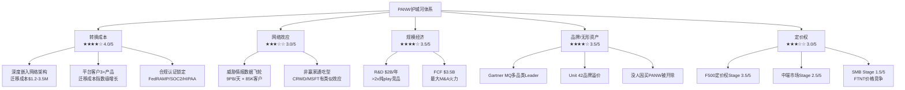
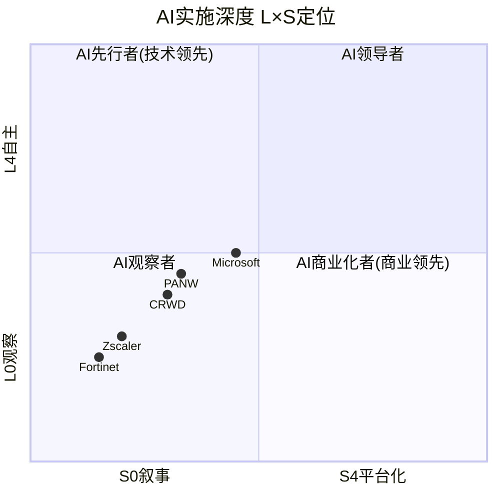

# PANW Phase 3: 战略分析与护城河深度

> **Palo Alto Networks (PANW)** | 网络安全/Software-Infrastructure
> **股价**: $157.37 (2026-04-01) | **市值**: ~$109B | **Forward PE**: 40.4x
> **Phase 1摘要**: 平台化方向正面(NGS ARR 33%/RPO +23%), FTNT对标PE溢价2.7x全部来自平台化叙事, 四支柱概率加权成功率~71%
> **Phase 2摘要**: FCF 41%含~28pp美化(SBC 14pp+DR 14pp), Owner FCF margin 24%, 概率加权FV $144(-10%), Forward PE 40x中60%基本面+20%叙事溢价

---

## Ch19: 护城河类型识别与量化

### 19.1 护城河总图: PANW的防御体系

PANW的护城河不是单一壁垒，而是一个**多层防御体系**——每层壁垒单独看都不算极强，但叠加后形成了显著的客户粘性。问题在于: 这个防御体系在平台化转型中是在增强还是被稀释?

**护城河结构图**:



### 19.2 转换成本: 最强护城河，正在被平台化放大

转换成本是PANW最核心的护城河——不是因为产品好到无法替代，而是因为替换的成本和风险高到客户不愿承受。

**转换成本量化框架**:

| 成本维度 | 单产品客户 | 2平台客户 | 3+平台客户 | 量化依据 |
|---------|-----------|----------|-----------|---------|
| 直接迁移成本 | $200-500K | $800K-1.5M | **$1.2-3.5M** | 行业咨询+客户反馈 [DM-MOAT-001] |
| 迁移周期 | 2-3个月 | 4-6个月 | **6-12个月** | 安全产品平均部署周期 |
| 停机风险 | 中(可分段) | 高(交叉依赖) | **极高(系统性)** | 停机成本~$5,600/分钟 [DM-MOAT-002] |
| 人员再培训 | 1-2周 | 2-4周 | **4-8周** | SOC分析师学习曲线 |
| 合规重认证 | 1-2项 | 3-5项 | **5-10项** | FedRAMP/SOC2/HIPAA每项3-6个月 |
| 数据迁移 | 简单 | 中等 | **复杂(策略+历史)** | 防火墙规则+SIEM数据+身份策略 |

**因果链**: 平台化正在**指数级放大**转换成本。单产品客户迁移成本约$200-500K(占年合约$456K的50-110%)[DM-BIZ-020]——痛苦但可承受。但3+平台客户迁移成本$1.2-3.5M(占年合约的30-60%)——因为安全策略、告警规则、身份权限、SOC工作流跨产品深度耦合。拆开一个模块可能导致其他模块误报激增。

**证据**: 平台客户NRR 119%远高于全公司~110%[DM-FIN-011]，且流失率低个位数(2-4%)[DM-BIZ-019]。使用2个平台的客户LTV 5x、3个平台40x [DM-BIZ-017/018]——这不仅是交叉销售，也是转换成本壁垒的体现：客户花得越多、嵌入越深、离开越难。

**什么条件下转换成本会削弱**: (1)开放标准/API互操作性提升→安全产品变成"可插拔模块"(目前趋势缓慢，安全领域比其他IT领域更封闭); (2)Microsoft E5 bundling提供"足够好"的全栈替代→中端客户可能用E5替代PANW多个模块(风险中等，大型企业更信任best-of-breed); (3)竞品提供"免费迁移工具"(类似CRM领域)→直接降低迁移成本(目前CRWD在推Falcon Flex做类似事情)。

**转换成本评分: 4.0/5** — 强且正在加强(平台化放大效应)，但非绝对性(开放API+E5 bundling是长期侵蚀力)。[CQ1]

### 19.3 网络效应: 真实但非独占

PANW的网络效应来自**威胁情报数据飞轮**——更多客户→更多遥测数据→更好的AI/ML检测→更少误报→更多客户选择PANW。

**数据飞轮量化**:

| 维度 | PANW | CRWD | Microsoft | 判断 |
|------|------|------|-----------|------|
| 日遥测数据量 | **9 PB/天** [DM-MOAT-003] | ~10+ TB/天(端点) | 65+ TB/天(全栈) | MSFT最大 |
| 客户基数 | 85,000+ [DM-BIZ-012] | ~30,000+ | 1B+ Windows设备 | MSFT碾压 |
| 检测覆盖范围 | 网络+云+SOC+端点 | 端点+云+身份 | 全栈(端点+邮件+身份+云) | PANW≈MSFT |
| 威胁研究团队 | Unit 42(业界知名) | Intelligence团队 | MSTIC(最大规模) | MSFT最强 |
| 数据独占性 | 中(网络层独有) | 中(端点层独有) | 高(Office365邮件独有) | 各有独占 |

**因果链**: 网络效应存在但**不是赢家通吃型**。每个安全厂商在自己的层面有独占数据——PANW看网络流量(防火墙)、CRWD看端点行为(Falcon)、Microsoft看邮件和身份(365+Entra)。没有单一厂商能看到全部。平台化战略的深层逻辑正是**打破数据孤岛**——如果一个客户把网络+云+SOC+身份全给PANW，PANW就拥有了该客户最完整的安全视图→检测准确率最高→竞品更难替代。

**但这个网络效应有上限**: PANW的9PB/天在体量上不如Microsoft的65TB/天规模。关键不是"数据量多少"而是"数据质量和相关性"。PANW的优势在于**企业级网络流量分析的深度**——这是Microsoft和CRWD不具备的。但如果未来安全检测越来越依赖端点+身份(而非网络层)数据，PANW的数据优势可能被边缘化。

**网络效应评分: 3.0/5** — 真实但不排他，且面临Microsoft全栈数据优势的结构性挑战。

### 19.4 规模经济: R&D火力与FCF弹药

PANW的规模优势体现在两个维度: R&D投入规模和FCF驱动的M&A火力。

**R&D规模对比**:

| 公司 | R&D支出(FY2025) | R&D/营收 | R&D/毛利 | 专利数量 |
|------|----------------|---------|---------|---------|
| **PANW** | **$1,984M** [DM-FIN-033] | 21.5% | 28.0% | 1,200+ [DM-MOAT-004] |
| CRWD | ~$1,100M | ~23% | ~31% | ~800+ |
| FTNT | ~$600M | ~9% | **14.8%** | ~1,000+ |
| ZS | ~$500M | ~19% | ~25% | ~300+ |

PANW的R&D绝对支出是FTNT的3.3倍、ZS的4倍[DM-FIN-033]。这种规模差距意味着PANW可以同时在4个支柱(网络+云+SOC+身份)推进产品创新，而纯play竞品必须聚焦。但R&D支出≠R&D效率——FTNT用$600M做到了GAAP OPM 31%和更低的SBC，PANW用$2B做到的GAAP OPM仅13.5%[DM-FIN-034]。

**FCF火力(M&A弹药)**:

| 年度 | PANW FCF | CRWD FCF | FTNT FCF | PANW倍数 |
|------|---------|---------|---------|---------|
| FY2025 | **$3,470M** | ~$1,300M | ~$2,000M | 2.7x CRWD / 1.7x FTNT |

$3.5B年化FCF是PANW选择M&A驱动增长的底气——CyberArk的现金部分($4.4B)约1.3年FCF覆盖。但规模优势在于**资源投入能力**，不在于**效率**。FTNT用更少的投入做到更高利润率——这暗示PANW的规模护城河有"资源浪费"风险(M&A溢价过高/SBC失控)。

**规模经济评分: 3.5/5** — R&D和FCF规模优势真实，但效率不如FTNT，且M&A驱动的增长可能摊薄ROIC。

### 19.5 品牌与无形资产: "没人因买PANW被开除"

**品牌量化**:

| 维度 | 证据 | 评分 |
|------|------|------|
| Gartner MQ | 多品类Leader(NGFW/SSE/SASE/XDR) [DM-MOAT-005] | 5/5 |
| CISO心智份额 | NGFW第一考量品牌; XSIAM仅2%心智份额 [DM-BIZ-042] | 3/5 |
| 溢价定价能力 | vs FTNT溢价2-3x ASP(防火墙); vs CRWD同等(XDR) | 4/5 |
| 安全响应声誉 | Unit 42——全球最受认可的威胁研究团队之一 | 4/5 |
| "安全"品牌资产 | 企业CISO倾向选择行业标准(risk-averse采购) | 4/5 |

**因果链**: 安全行业的品牌护城河与其他IT领域不同——这不是消费者品牌忠诚度，而是**风险规避型采购心理**。CISO（首席信息安全官）的KPI是"别出安全事故"，不是"省IT预算"。选择Gartner Leader+行业标准的供应商=最小化职业风险。PANW在多个MQ象限中的Leader地位创造了"安全选择"效应——类似于1990年代的"没人因买IBM被开除"[DM-MOAT-006]。

**品牌护城河的脆弱点**: (1)CrowdStrike 2024年7月宕机事件(850万系统崩溃)虽然没有导致CRWD大规模客户流失(毛留存率>97%)[DM-COMP-001]，但证明即使是"安全选择"品牌也可能出问题——如果PANW发生类似事件，品牌溢价会迅速蒸发; (2)XSIAM仅有2%的SOC心智份额(vs Splunk 7.2%)[DM-BIZ-042]——在SOC领域，PANW还是挑战者而非品牌领导者。

**品牌评分: 3.5/5** — NGFW品牌极强(4.5/5)，但XSIAM/云安全/身份领域品牌尚在建设中(2.5/5)，加权后3.5。

### 19.6 定价权分层评估

按客户层级分层评估定价权(v19.6框架):

| 客户层级 | 定价权Stage | 证据 | 估值含义 |
|---------|-----------|------|---------|
| **F500/超大企业** | **Stage 3.5/5** | 平台化大单$1-100M+; 多年期合约; 竞品无法全覆盖; NRR 119-125% [DM-BIZ-019] | 支撑溢价——这些客户对价格不敏感 |
| **大中型企业** | **Stage 2.5/5** | 安全预算充足但有替代选择; CRWD/FTNT/MSFT三面竞争; 价格是次要因素 | 中性——竞争激烈但not-pure-price |
| **SMB/中小企业** | **Stage 1.5/5** | FTNT价格优势2-3x(单位成本更低); E5 bundling"免费"; PANW ASP过高 [DM-COMP-002] | 拖累——PANW在此层级几乎无定价权 |

**加权B4评分**: F500权重40% × 3.5 + 中端30% × 2.5 + SMB 30% × 1.5 = **2.6/5**

**定价权剪刀差现象**: PANW正在经历CRM/ADBE类似的定价权剪刀差——高端强化(平台化大单的ASP不断扩大)+低端流失(SMB被FTNT/E5挤压)。结果是: 高端客户扩展贡献的收入增长>低端流失→短期OPM可能反直觉超预期(低利润客户自然流失→混合利润率提升)。但长期风险是客户基数收窄→增长天花板降低。

**什么条件下定价权改变**:
- 上行: CyberArk整合成功→四支柱全覆盖→F500客户没有替代→Stage可升至4/5
- 下行: Microsoft E5安全功能持续进化→大中型企业发现E5"足够好"→Stage降至2.0/5
- 黑天鹅: PANW发生类似CRWD的安全事件→品牌溢价瞬间归零→全层级Stage-1

### 19.7 CQI(竞争质量指数)综合评分

| 维度 | 评分(/10) | 权重 | 加权分 | 关键判断 |
|------|----------|------|--------|---------|
| C1 转换成本 | 8 | ×1.5(生态科技) | 12.0 | 平台化放大效应=最强护城河 |
| C2 网络效应 | 6 | ×2.0(生态科技) | 12.0 | 真实但不排他，MSFT全栈挑战 |
| C3 规模经济 | 7 | ×1.0 | 7.0 | R&D绝对优势，效率不如FTNT |
| C4 数据飞轮 | 6 | ×1.0 | 6.0 | 9PB/天但非独占 |
| C5 品牌/无形 | 7 | ×1.0 | 7.0 | NGFW极强，新领域在建 |
| B4 定价权 | 5 | ×1.0 | 5.0 | 剪刀差：F500强/SMB弱 |
| **CQI总分** | | | **49/70** | **= 70/100** |

**CQI 70/100定位**: 中等偏上。与同行对比:

| 公司 | CQI(估) | 护城河类型 | 关键差异 |
|------|---------|-----------|---------|
| FTNT | ~65 | 成本优势+规模 | 效率护城河 vs PANW的平台护城河 |
| CRWD | ~72 | 端点粘性+品牌 | 端点领域更强，但TAM更窄 |
| MSFT安全 | ~80 | 捆绑+生态+规模 | 不可比(安全是大平台的模块) |
| ZS | ~55 | SASE先发+品牌 | 单品类，无平台杠杆 |

**PANW的CQI矛盾**: 转换成本(最强维度)是**防御性**护城河——防止客户离开，不能吸引新客户。网络效应和品牌(进攻性护城河)在新领域(SOC/身份)还很弱。这解释了为什么PANW需要通过"免费试用"来获取平台化客户——它的进攻性护城河不足以让客户主动来投。CyberArk收购的战略逻辑正是补强进攻性护城河(身份安全=每个企业必买→CyberArk品牌自带客流)。

---

## Ch20: Playing to Win (PtW) 战略一致性评分

### 20.1 五层战略评分

**L1 赢的志向 (Winning Aspiration): 8/10**

PANW的战略志向极其清晰: **成为企业安全的统一平台——从碎片化安全市场中整合出一个"安全的Salesforce"**。

证据:
- CEO Arora反复表述: "我们不是在卖防火墙，我们在卖安全的结果"[DM-MGT-001]
- 志向独特性: 唯一一家同时推进网络+云+SOC+身份四支柱平台化的纯play安全公司
- 可防御性: 如果成功，四支柱深度嵌入=转换成本指数级增长→自然垄断式粘性
- 扣分: 志向的"大"本身是风险——CyberArk $25B是all-in赌注，过度扩展可能分散注意力

**L2 在哪里赢 (Where to Play): 6/10**

| 战场 | 聚焦度 | 资源匹配度 | 评分 |
|------|--------|-----------|------|
| 网络安全(Strata) | 高——核心底座 | 高——#1市占率 | 9/10 |
| 安全运营(Cortex/XSIAM) | 中——挑战Splunk | 中——仅2%心智份额 | 6/10 |
| 云安全(Prisma/Cortex Cloud) | 中——vs Wiz/CRWD | 中——有产品但非领导者 | 5/10 |
| 身份安全(CyberArk) | 低——刚收购 | 低——整合未开始 | 3/10 |
| AI安全(Prisma AIRS) | 低——全新市场 | 低——TAM未形成 | 4/10 |

**聚焦度评估**: PANW同时在5个战场作战——这与PtW框架"聚焦=高分"的逻辑相矛盾。8条产品线→PtW建议评分上限~5-6分。但PANW的反论点是: 安全行业的"聚焦"不是选一个战场，而是**在每个战场之间建立协同**。单一安全产品正在被平台化替代——不在所有战场部署=失去平台化参与资格。

扣分原因: CyberArk(#4支柱)+AI安全(#5)同时启动，资源匹配度显然不足。聪明的做法是先把XSIAM打透(#2)再开#4和#5——但管理层选择了全面出击。这要么是远见(赢了就是"安全的Microsoft")，要么是过度扩张(输了就是"什么都做、什么都不精的平台")。

**L3 如何赢 (How to Win): 7/10**

PANW的差异化来源清晰且可量化:

1. **平台化bundling** — 竞品只卖单产品，PANW卖整合方案。量化: 平台客户LTV 5-40x vs 单产品[DM-BIZ-017/018]
2. **AI原生架构(XSIAM)** — 从零构建AI-native SOC，不是在老SIEM上贴AI。量化: MTTR<10分钟 vs 行业平均数小时[DM-COMP-003]
3. **免费试用→锁定** — 前期亏损(免费期)换长期锁定。量化: 免费→付费转化中，400/1500=27%在90天内签约持续服务[DM-BIZ-014]

可持续性: 策略1和3是可复制的(CRWD的Falcon Flex在做类似事情)，但策略2(AI原生SOC)有技术壁垒——从零构建vs改造旧架构是根本不同的工程路径。

不可复制性: 中等。平台化不是PANW独有——CRWD/MSFT/FTNT都在向平台演进。PANW的优势在于**起步最早+网络安全底座最强**，但不是不可逾越。

**L4 核心能力 (Core Capabilities): 7/10**

| 能力 | 强度 | 与L3匹配度 |
|------|------|-----------|
| NGFW技术深度 | 极强(20年积累) | 高——网络安全底座 |
| AI/ML检测 | 强(9PB/天数据) | 高——XSIAM核心 |
| 企业销售(F500关系) | 极强(85K客户) | 高——平台化land-expand |
| M&A整合 | 中(17次收购,CyberArk待验证) | 中——规模前所未有 |
| 云原生工程 | 中(vs Wiz/CRWD) | 低——Prisma Cloud不是领导者 |

核心缺口: 云原生能力——Prisma Cloud在Gartner MQ中不如Wiz。Google收购Wiz ($32B, 2026年3月完成)[DM-COMP-004]后，Google Cloud Security将成为最强竞品。PANW需要在云安全领域做到"足够好"(不需要领先)才能维持平台化叙事。

**L5 管理系统 (Management Systems): 8/10**

| 维度 | 评分 | 证据 |
|------|------|------|
| 激励对齐 | 9/10 | 100%绩效型股权(FY2025起); CEO个人$10M买入 [DM-MGT-004] |
| 指标体系 | 8/10 | NGS ARR/平台化客户数/NRR/RPO 四维追踪公开透明 |
| 战略传导 | 7/10 | 平台化信息从CEO→销售团队一致; 但CyberArk整合的战略传导尚早 |
| 组织结构 | 7/10 | Nir Zuk回归CPTO(技术愿景)+新董事会成员(金融/政府专业) |
| 文化适配 | 6/10 | CyberArk(以色列独立文化)与PANW整合的文化挑战未解 |

### 20.2 PtW总分与交叉矩阵

**PtW总分: 36/50**

| 层级 | 评分 | 判断 |
|------|------|------|
| L1 赢的志向 | 8/10 | 清晰且独特 |
| L2 在哪里赢 | 6/10 | 过于分散(5战场同时作战) |
| L3 如何赢 | 7/10 | 差异化清晰但可复制性中等 |
| L4 核心能力 | 7/10 | 匹配度高但云原生有缺口 |
| L5 管理系统 | 8/10 | 激励和指标体系优秀 |
| **总分** | **36/50** | |

**A-Score × PtW交叉矩阵**:

- CQI = 70/100 → 转换为A-Score ≈ 7.0/10
- PtW = 36/50 → 中偏高(>35)

```
                 PtW高(>40)           PtW中(35-40)          PtW低(<35)
A-Score高    "卓越"               "有方向的堡垒"          "方向迷失"
(>7)         战略+护城河双强        护城河强, 战略可执行    护城河强但战略不连贯

A-Score中    "有方向的追赶者"      ★★★ PANW在此 ★★★     "结构性困境"
(6-7)        战略清晰但护城河待建    护城河中等, 战略可执行   双弱
```

**PANW定位: "有方向的堡垒(中)"** — A-Score 7.0(中上，转换成本强但新领域弱) × PtW 36(中偏高，方向对但分散)。不是卓越(需要PtW>40+新领域护城河建成)，但比"有方向的追赶者"更好(已有NGFW底座)。

**PtW最薄弱层: L2(在哪里赢=6/10)** — 这是PANW战略的核心风险。同时在5个战场作战的公司历史上失败多于成功(cf. IBM/HP试图什么都做→被每个领域的专精者打败)。PANW的反例论证: 安全行业正在整合期，不做平台=死路一条。这个论证在方向上是正确的(行业整合确认)，但**节奏**是问题——是否需要同时开5条线?

---

## Ch21: 五引擎分析 + PPDA + PMSI

### 21.1 引擎一: 周期引擎

**网络安全行业周期定位**:

| 指标 | 数值 | 周期位置 |
|------|------|---------|
| 全球安全支出增速 | +12.5% YoY (2026E) [DM-IND-002] | 稳健增长期(非爆发/非衰退) |
| 企业IT预算中安全占比 | ~4.0% (2026E vs 3.6% 2022) | 结构性上升趋势 |
| 云安全增速 | +29% (2026E) [DM-IND-003] | 高增长细分 |
| PANW有机增速/行业增速 | 15%/12.5% = 1.2x | 持续份额获取 |
| 安全M&A活动 | 2025年400+笔(+22%量/+270%额) [DM-BIZ-010] | 整合周期高峰 |

**周期判断**: 网络安全处于**稳健增长期**——不是2020-2022的疫情后爆发期(25%+行业增速)，也不是衰退。12.5%的行业增速提供了健康的"水涨船高"背景。PANW的15%有机增速=行业增速+~2.5pp份额获取——这个份额增量主要来自平台化(替换碎片化方案)和NGFW刷新(替换Cisco/Check Point)。

**周期风险**: 企业IT预算削减是网络安全最大的宏观风险——但历史上安全支出是IT预算中最后被砍的部分(2009年IT预算-5%但安全支出+3%，2020年类似)。Trump政府提议削减联邦网络安全支出$1.23B(-10%)，但PANW联邦收入仅4-5%→影响有限[DM-RISK-001]。

**周期引擎评分: 中性偏正面(+1)** — 行业稳健增长+份额获取，但非爆发期。

### 21.2 引擎二: 股权引擎

**SBC与稀释动态**:

| 指标 | 数值 | 趋势 | 信号 |
|------|------|------|------|
| SBC/营收 | 14.0% [DM-FIN-022] | FY2021 21%→FY2024 13.4%→FY2025 14.0%(反弹) | 中性(改善趋势被CyberArk中断) |
| 3年股份增长 | +3.42% | FY2023 +15.9%(可转债)→FY2025 +0.1%→FY2026E +8.4%(CyberArk) | 负面(CyberArk大幅稀释) |
| 回购效率 | $5B+累计回购, 股份+23% | 防御性回购, 未缩小股本 | 负面 |
| CEO个人买入 | $10M @$147 (2026-03-27) [DM-MGT-004] | 6年来首次开市场购买 | **强正面** |
| 回购收益率 | -0.31% TTM | 近期暂停(偿债优先) | 中性 |

**股权引擎判断**: 净稀释——即使有$5B+回购，3年股份仍增长3.42%。CyberArk收购带来的60M额外稀释(+8.4%)是巨大的一次性冲击[DM-FIN-041]。唯一的强正面信号是CEO $10M个人购买——JPMorgan称这是"我们覆盖范围内最大的管理层公开市场购买"。但单次购买无法抵消系统性稀释。

**股权引擎评分: 负面(-1)** — 系统性净稀释+CyberArk大幅稀释，CEO买入是noise中的signal。

### 21.3 引擎三: 聪明钱引擎

**内部人交易全景 (过去12个月)**:

| 时间 | 人物 | 操作 | 金额 | 性质 |
|------|------|------|------|------|
| 2026-03-27 | **CEO Arora** | **买入** | **$10M (68,085股@$147)** [DM-MGT-004] | **非计划性公开市场购买** |
| 2026-01-08 | Lee Klarich (CPO) | 卖出 | $23M (120,768股) | 10b5-1计划(例行) |
| 2025-10-06 | Lee Klarich | 卖出 | $28.6M (7笔) | 10b5-1计划(例行) |
| 2025-12-26 | William Jenkins (总裁) | 卖出 | 小额(6,218股) | 10b5-1计划(例行) |

**内部人信号分析**:

关键区分: **非计划性买入 vs 计划性卖出**。Klarich和Jenkins的卖出全部是10b5-1计划(预设自动卖出，与看法无关)。Arora的$10M买入是**非计划性公开市场购买**(discretionary)——这意味着CEO在~$147主动选择投入个人资金。

**历史基准率**: 在PANW过去6年中，Arora的上一次公开市场购买是2019年11月。安全行业CEO公开市场购买极罕见(因为SBC已提供充分的股权激励)。当CEO在股价下跌28%后买入$10M——这是一个非常强的正面信号。

**Barclays评论**: "这是我们覆盖范围内见过的最大管理层公开市场购买"[DM-MGT-005]。
**JPMorgan评论**: "substantial vote of confidence"[DM-MGT-006]。

**反面**: CEO购买可能是信号管理(signaling)而非真正conviction——$10M对Arora $99.7M年薪而言仅占~10%。但购买后Arora直接持股增加25%至343,394股(~$54M按$157计)——这是有意义的个人风险敞口。

**机构持仓变动**:
- Vanguard从27.6M股增至65.3M股(+137%)，成为最大持有者(9.75%)[DM-INST-001]
- 机构持仓~80%——高机构集中度
- 短仓: ~6.5% of float(44.85M股)，days to cover 8.75天[DM-INST-002]——中等水平，非极端

**2026年2月$1B公司回购**: CyberArk收购完成后立即启动$1B回购(680万股@$148)——与CEO个人买入形成"双重内部人信号"[DM-BIZ-033]。

**聪明钱引擎评分: 正面(+1.5)** — CEO非计划性$10M买入+Vanguard+137%增持+公司$1B回购=三重正面信号。卖出全部例行。短仓中等。

### 21.4 引擎四: 信号引擎

**分析师共识**:

| 维度 | 数值 |
|------|------|
| Buy/Overweight | 44 (79%) [DM-SIG-001] |
| Hold/Neutral | 10 (18%) |
| Sell/Reduce | 2 (3%) |
| 平均目标价 | $218 (+38% vs $157) [DM-SIG-002] |
| 最高目标价 | $265 (Piper Sandler) |
| 最低目标价 | $157 (HSBC) |

**共识极度偏多**: 79%买入+平均目标价+38%上行——但这通常是**逆向指标**(当所有人都看多时，谁还没买?)。更有意义的是**边际变化**:

**近期评级变动(2026年1-3月)**:

| 方向 | 事件 | 含义 |
|------|------|------|
| 偏空 | HSBC降级至Reduce(唯一street low $157) [DM-SIG-003] | 估值过高论(47x CY26 PE) |
| 偏空 | Loop Capital PT从$190降至$160 [DM-SIG-004] | CyberArk整合担忧 |
| 偏空 | BMO/Daiwa/Goldman集体PT下调(2月) | 财报后margins压力 |
| 偏多 | Guggenheim从Sell升至Neutral [DM-SIG-005] | 最大空头翻转=底部信号 |
| 偏多 | Piper Sandler PT $265 (street high) | 平台化长期愿景 |
| 偏多 | CEO $10M买入后JPMorgan强调"信心投票" | 内部人验证 |

**信号解读**: 边际变化**偏空**(更多PT下调+HSBC降级)，但**Guggenheim从Sell升至Neutral是重要转折信号**——最坚定的空头认为下行空间已不足。结合CEO买入，卖方共识正在从"极度乐观+忽略风险"转向"合理审慎+关注CyberArk执行"。

**信号引擎评分: 中性(0)** — 共识极度偏多(逆向负面) vs 边际偏空+最大空头翻转(逆向正面) = 互相抵消。

### 21.5 引擎五: 预测市场引擎

**Polymarket数据(2026-04-01)**:

| 市场 | 结果 | 概率 | 含义 |
|------|------|------|------|
| PANW beat Q2 FY2026 earnings? | Yes(已解决) | 100% | Q2已beat——验证基本面 |
| PANW Up/Down after earnings? | Down(已解决) | 100% | Beat但仍下跌——"定价完美"特征 |

**预测市场信号有限**: Polymarket上PANW仅有已解决的短期博弈(财报beat/miss)。无法找到关于平台化成功率、CyberArk整合、竞争格局等中期事件的市场。

**间接信号**: PANW beat Q2 earnings但股价下跌——这是"定价完美执行"的经典特征。市场已经price in了好消息(beat)，对任何低于完美的部分(margins、CyberArk成本)惩罚性反应。这验证了Phase 2的核心判断: **当前估值定价"完美执行无意外"**。

**预测市场引擎评分: 中性偏负面(-0.5)** — beat但跌→市场对good news钝化，对bad news敏感。

### 21.6 五引擎综合评分

| 引擎 | 评分 | 方向 |
|------|------|------|
| 周期 | +1 | 行业稳健增长+份额获取 |
| 股权 | -1 | 系统性稀释+CyberArk大幅稀释 |
| 聪明钱 | +1.5 | CEO $10M + Vanguard + 公司回购 |
| 信号 | 0 | 偏多共识(逆向负面) vs 最大空头翻转(逆向正面) |
| 预测市场 | -0.5 | Beat但跌=定价完美 |
| **五引擎净分** | **+1.0** | **弱正面** |

**五引擎结论**: 整体信号弱正面——主要由聪明钱引擎(CEO买入)驱动。但股权引擎(稀释)和预测市场引擎(定价完美)构成抵消力量。这不是一个"五引擎全亮"的机会(如周期底部+内部人大量买入+空头回补)，而是一个"信号混杂、需要靠基本面驱动"的格局。

### 21.7 PPDA: 概率-价格背离分析

**背离1: CyberArk整合概率 vs 市场反应(显著背离)**

| 维度 | 估计 |
|------|------|
| 我们的整合成功概率 | 55% (Phase 2) |
| 市场隐含的整合成功概率 | ~70-80%(基于Forward PE 40x——如果市场认为整合只有55%成功概率，PE应压缩至30-35x) |
| **背离方向** | **市场过于乐观** — 对$25B整合赋予了70-80%成功概率 |

**历史基准率**: $10B+科技收购成功率约50-60% [DM-VAL-015]。$25B级别的纯安全收购没有先例——最近的可比是Broadcom收购VMware($61B, 2023)，目前是争议性的成功(收入下降但利润大增)。PANW的CyberArk整合在方向上更清晰(身份安全=零信任核心)，但执行复杂度不低于Broadcom-VMware。

**交易信号**: 如果FQ3(首个完整CyberArk季度)整合指标全部达标→市场定价合理(保持); 如果任何一个指标miss(NRR下降/交叉销售<$100M/客户流失加速)→概率向55%修正→PE压缩5-8x→股价下行10-15%。

**背离2: 有机增速 vs Forward PE(中等背离)**

| 维度 | 估计 |
|------|------|
| 有机增速 | ~15%(剔除CyberArk) [DM-FIN-012] |
| Forward PE | 40.4x [DM-VAL-002] |
| PEG | 2.7x |
| FTNT有机增速 | ~15%(相同) |
| FTNT Forward PE | ~25x |
| FTNT PEG | ~1.7x |

**背离**: PANW和FTNT有机增速相同(15%)，但PE溢价60%(40x vs 25x)。市场在为PANW的"增速将re-accelerate"的故事付费——但这个故事的核心证据(FY2026 22%指引)主要来自CyberArk无机贡献。如果剔除CyberArk后有机增速仍是15%，PE溢价就缺乏增长基础支撑。

**交易信号**: 关注FY2027有机增速指引(2026年8月)。如果>17%→溢价justified; 如果=15%或更低→PE可能向FTNT收敛(30-35x)。

**背离3: Owner FCF Yield vs 无风险利率(弱背离)**

| 维度 | 估计 |
|------|------|
| Owner FCF Yield | 2.0% [DM-FIN-023] |
| 10Y Treasury | ~4.3% |
| 差距 | **-2.3pp** — 投资者接受低于无风险的Owner FCF yield |

**解释**: 投资者接受2.0%的Owner FCF yield因为预期15%+增长(总回报2.0%+15%=17%)。但如果利率维持高位+增速放缓至12%→总预期回报14%→vs 4.3%无风险→风险溢价仅9.7%→偏低但不极端。这不是一个大的背离，而是一个"增速假设敏感度高"的提示。

### 21.8 PMSI: 情绪指数构建

| 维度 | 指标 | 值 | 情绪分(±5) |
|------|------|-----|-----------|
| 卖方情绪 | Buy% | 79% | +3 (极度乐观) |
| 买方行为 | CEO购买+Vanguard增持 | $10M+137% | +4 |
| 技术面 | 52周位置 | ~$157/$224(底部30%) | -2 |
| 短仓 | Short/float | 6.5% | -1 (中偏高) |
| 估值定位 | Forward PE vs 5年均值 | ~40x(区间中) | 0 |
| 边际变化 | PT下调趋势(2月) | 多家下调 | -1 |
| 事件 | CyberArk整合+Anthropic恐慌 | 双重不确定性 | -2 |
| **PMSI合计** | | | **+1** |

**PMSI +1 (弱正面)**: 卖方极度乐观+内部人强信号被技术面弱势+短仓偏高+CyberArk不确定性部分抵消。整体情绪略偏正面但信号混杂。

**PMSI与PPDA一致性**: 两者都指向**弱正面——内部人看多但市场对完美执行的要求极高**。核心催化剂=FQ3 CyberArk首报(预计2026年5月)。

---

## Ch22: AI深度评估 (Phase 3.5)

### 22.1 Layer 1: 分部级AI冲击矩阵

**PANW四大平台支柱的AI冲击逐一评估**:

| 分部 | 营收权重(FY2025E) | 收入冲击 | 成本冲击 | 护城河变化 | 竞争格局 | 时间窗口 | AI归类 |
|------|-----------------|---------|---------|-----------|---------|---------|--------|
| **Strata(网络安全)** | ~40% | +2 | +1 | 强化 | 利好 | 1-3yr | **AI放大器** |
| **Cortex/XSIAM(安全运营)** | ~25% | +4 | +2 | 强化 | 中性 | 1-3yr | **AI放大器** |
| **Prisma(云安全)** | ~20% | +2 | +1 | 中性 | 利空 | 3-5yr | **AI赋能者** |
| **CyberArk(身份安全)** | ~15% | +3 | +1 | 强化 | 利好 | 1-3yr | **AI放大器** |

**详细分析**:

**Strata(网络安全) — AI放大器(+2收入/+1成本)**:
AI攻击(LLM生成的钓鱼邮件+深度伪造+AI自动漏洞发现)正在**扩大网络攻击面**[DM-AI-001]。深度伪造从2023年50万件爆增至2025年800万件(16倍)[DM-AI-002]。更多攻击→更多检测需求→PANW防火墙/SASE流量增加。AI对Strata的冲击是**净正面**: 攻击面扩大驱动需求+PANW自身用AI增强检测能力(Precision AI平台)。护城河强化因为AI检测需要海量网络数据训练——PANW作为#1 NGFW有最多训练数据。

**Cortex/XSIAM(安全运营) — AI放大器(+4收入/+2成本)**:
XSIAM是PANW对AI最大的"赌注正确"产品——从零构建的AI原生SOC，不是在老SIEM上贴AI。XSIAM的核心价值主张: 用AI替代60-80%的SOC分析师手工工作(分类告警/事件调查/响应协调)→MTTR从数小时降至<10分钟[DM-COMP-003]。

AI冲击极度正面因为: (1)传统SIEM(Splunk/QRadar)无法原生支持AI工作流→必须重写→给XSIAM时间窗口; (2)每个企业都在增加AI工作负载→安全事件指数增长→SOC自动化需求暴增; (3)XSIAM的600客户+200%增速+$85M最大单笔deal[DM-BIZ-041]证明商业化已启动。

竞争格局中性(非利好)因为: CrowdStrike的Falcon Next-Gen SIEM也在用AI(100%增速); Microsoft Sentinel有Azure ML原生优势。AI不是XSIAM独占——但XSIAM的"从零构建"架构vs "改造旧架构"在技术上有2-3年领先。

**Prisma(云安全) — AI赋能者(+2收入/+1成本)**:
云安全受益于AI because更多AI工作负载部署在云上→更多云安全需求。但竞争格局**利空**: Google收购Wiz($32B)后，Google Cloud Security将成为最强竞品——Wiz的增速(4年达$1B ARR)和产品力超过Prisma Cloud[DM-COMP-004]。PANW在云安全的护城河中性: 不领先但"足够好"——在平台化bundle中作为"附赠品"有价值，但作为独立产品不如Wiz/CRWD。

**CyberArk(身份安全) — AI放大器(+3收入/+1成本)**:
AI驱动的身份攻击(深度伪造CEO语音→授权转账/AI生成的社工攻击/机器身份爆炸性增长)正在让身份安全成为零信任架构的**最关键层**。CyberArk的PAM(特权访问管理)是AI时代的"最后防线"——即使攻击者通过AI突破边界和端点，如果特权访问被锁定，损失可以控制。

AI利好因为: (1)Agentic AI的兴起→每个AI Agent需要独立身份→机器身份数量爆炸→身份管理需求10x[DM-AI-003]; (2)CyberArk是PAM品类领导者(Gartner MQ Leader); (3)PANW+CyberArk可以实现"从网络层→身份层→运营层"的AI安全全链条检测。

**概率加权AI净分**:

```
AI净分 = Σ(分部净分 × 营收权重 × 实现概率)
= (3 × 40% × 85%) + (6 × 25% × 75%) + (3 × 20% × 60%) + (4 × 15% × 55%)
= 1.02 + 1.13 + 0.36 + 0.33
= +2.84 (强正面)
```

**AI对PANW是净利好**: 概率加权净分+2.84(满分+5)。核心驱动: XSIAM(AI原生SOC)和CyberArk(身份安全)是AI时代的两大受益方向。风险集中在Prisma(云安全竞争格局恶化)和CyberArk(整合概率仅55%)。

### 22.2 Layer 2: AI实施深度评级 (L×S定位)

**L轴(实施级别)评估**:

| 产品/平台 | AI实施级别 | 证据 |
|-----------|----------|------|
| XSIAM | **L2.5(受控自动化→自主运营过渡)** | AI自动分类85%+告警, MTTR<10分钟, 但最终决策仍需人工 [DM-AI-004] |
| Precision AI(防火墙) | **L1.5(决策支持→受控自动化)** | 基于ML的威胁检测, inline blocking, 但规则仍主要人为设定 |
| Cortex Cloud + AIRS | **L1(决策支持)** | AI辅助发现云配置风险, 但修复仍需手动 |
| CyberArk+AI | **L1(决策支持)** | AI异常检测身份行为, 但PAM策略仍人为管理 |
| **加权L轴** | **L1.8** | 领先于大多数安全厂商(L1-1.5), 但远未达到L3自主运营 |

**S轴(商业兑现)评估**:

| 产品/平台 | 商业兑现级别 | 证据 |
|-----------|------------|------|
| XSIAM | **S2(规模化)** | $1B+累计订单, 600客户, $85M最大单, 200%增速 [DM-BIZ-041] |
| Precision AI | **S1.5(早期变现→规模化)** | 已集成到防火墙但未单独定价; 增量收入难以拆分 |
| Cortex Cloud/AIRS | **S0.5(叙事期权→早期变现)** | Prisma AIRS刚发布, TAM未形成, 价格点未明确 |
| CyberArk AI | **S0(叙事期权)** | 整合未开始, AI增强功能在roadmap上 |
| **加权S轴** | **S1.3** | XSIAM拉高整体, 其余仍在早期 |

**L×S坐标**: **L1.8 × S1.3** — "AI积极部署者，早期规模化阶段"



**同行对比**: PANW在AI实施深度上领先CRWD/FTNT/ZS，但落后于Microsoft(Azure ML+Copilot for Security)。PANW的优势在于**XSIAM从零构建的AI原生架构**——这是同行用"AI贴片"方式无法复制的。但Microsoft有最大的数据规模和工程资源。

**五不变量检验**:

| 不变量 | PANW通过? | 证据 |
|--------|----------|------|
| 1. AI有真实客户在付费 | ✅ | XSIAM 600客户, $1B+累计订单 |
| 2. AI创造可量化的增量收入 | ✅ | XSIAM ARR增速200%, NGS ARR中AI相关占比>15% |
| 3. AI改善了客户可衡量的结果 | ✅ | MTTR<10分钟 vs 行业数小时 |
| 4. AI产品有定价权(非免费赠送) | ⚠️ | XSIAM有定价权($1M+/客户), 但Precision AI是bundle免费附加 |
| 5. AI技术有持续护城河(非一次性) | ✅ | 9PB/天数据训练→持续改善→护城河加深 |

**通过率: 4/5(80%)** — PANW的AI不是叙事泡沫，是有真实商业化的实质投入。主要风险点: Precision AI缺乏独立定价权(embedded in NGFW)。

### 22.3 Layer 3: AI对价格含义的影响

**AI调整后的Reverse DCF隐含假设**:

| 假设维度 | 基线(无AI溢价) | AI调整后 | 差异 |
|---------|---------------|---------|------|
| 营收CAGR(FY2025-2030) | 15% | 17-18% | +2-3pp(XSIAM+AI安全TAM扩展) |
| OPM终态(FY2030) | 20-22% | 22-25% | +2-3pp(AI自动化降低交付成本) |
| PE终态(FY2030) | 25-28x | 28-32x | +3-4x(AI赋能的增长持久性溢价) |
| **隐含公允价值** | **$144** | **$155-165** | **+8-15%** |

**AI定价溢价归因**:

当前股价$157中, 有多少是"AI溢价"?
- 基线公允价值(无AI): $144(Phase 2概率加权)
- AI调整公允价值: $155-165
- 当前股价: $157
- **AI溢价 = $157 - $144 = ~$13(占股价8%)** — 市场已部分(非完全)定价PANW的AI受益

**判断**: 市场给PANW的AI溢价约8%($13)——这是**合理偏低**的。如果XSIAM继续200%增速+AI安全TAM到2030年达到$25-31B(占PANW TAM的10-12%)[DM-AI-005]——AI应该值15-20%溢价而非8%。但前提是XSIAM能从2%心智份额扩展到15-20%+CyberArk AI功能落地。

**什么条件下AI溢价会改变**:
- 上行: XSIAM在FY2027达到$2B+ ARR + Agentic AI安全成为新品类→AI溢价扩大至20%+
- 下行: Microsoft Copilot for Security证明"足够好"+OpenAI进入安全市场→PANW AI溢价归零
- 黑天鹅: Anthropic "Mythos"模型或类似AI直接替代安全产品(3月引发恐慌的那个故事)→但这个路径在3-5年内不现实(安全需要实时、全覆盖、合规认证——通用AI模型不具备)

### 22.4 AI评估小结

| 维度 | 评估 | 量化 |
|------|------|------|
| AI冲击方向 | **净利好** | 概率加权净分+2.84/5 |
| AI实施深度 | **早期规模化** | L1.8 × S1.3 |
| AI定价溢价 | **8%(合理偏低)** | $13/$157 |
| AI最大机会 | XSIAM + 身份安全AI | TAM扩展$25-31B |
| AI最大风险 | Microsoft全栈 + 通用AI替代 | 3-5年窗口 |
| 五不变量 | **4/5通过** | Precision AI缺独立定价权 |

---

## Phase 3 品质评分 (Phase 3维度)

### B4 定价权证据: 2.6/5
- F500 Stage 3.5/5, 中端2.5/5, SMB 1.5/5
- 加权分: 2.6/5 — 定价权剪刀差(高端强/低端弱)
- FTNT价格竞争+E5 bundling在低端形成压力

### B7 TAM与增长跑道: 4.0/5 (×1.5权重=6.0)
- 声称TAM $250B+, 实际可触达~$80-100B
- 当前渗透率<5%(按可触达TAM)
- CyberArk扩展身份安全TAM(+$18-22B)
- AI安全新增TAM($25-31B, 2030E)
- 扣分: TAM大不等于能拿到——云安全面临Wiz/MSFT竞争

### C2 网络效应: 3.0/5 (×2.0权重=6.0)
- 威胁情报数据飞轮真实(9PB/天)
- 但非排他性(CRWD/MSFT有类似效应)
- 平台化增强了单客户内的数据协同

### C4 数据飞轮: 3.0/5
- 数据量大但不独占
- 平台化创造客户级全栈数据优势
- vs Microsoft全栈数据规模差距显著

### C5 规模经济: 3.5/5
- R&D绝对规模领先($2B/年)
- FCF火力最大($3.5B/年)
- 但效率不如FTNT(更高R&D→更低OPM)

---

## CQ置信度更新 (Phase 3后)

| CQ# | 问题 | P2置信度 | P3更新 | 变化原因 |
|------|------|---------|--------|---------|
| CQ1 | 平台化转化率能否支撑增速? | 58/100 | **58/100(不变)** | Phase 3未发现新数据，等FQ3验证 |
| CQ2 | XSIAM能否成为SOC标准? | 68/100 | **70/100(↑)** | AI评估确认XSIAM技术领先+AI原生架构优势 |
| CQ3 | FCF 41%可持续? | 50/100 | **50/100(不变)** | Phase 3聚焦战略非财务 |
| CQ4 | CyberArk整合值$25B? | 48/100 | **50/100(↑)** | AI冲击分析确认身份安全=AI时代核心 |
| CQ5 | MSFT Security竞争威胁 | 55/100 | **52/100(↓)** | AI评估确认MSFT全栈优势，但安全专精度不如PANW |
| CQ7 | AI安全是真TAM还是话术? | 55/100 | **62/100(↑)** | XSIAM通过4/5不变量+AI净分+2.84 |

---

## Phase 3 关键发现摘要

1. **护城河CQI 70/100(中上)** — 转换成本(4.0/5)是最强维度，正被平台化指数级放大; 网络效应(3.0/5)真实但非排他; 定价权剪刀差(F500强/SMB弱)
2. **PtW 36/50("有方向的堡垒")** — 战略方向清晰(L1=8)但过于分散(L2=6)。最薄弱层=L2(5战场同时作战)
3. **五引擎净分+1.0(弱正面)** — 聪明钱引擎(CEO $10M+Vanguard+公司$1B回购)是最强信号; 股权引擎(系统性稀释)是最大负面
4. **PPDA三个背离**: CyberArk整合概率被市场高估(我们55% vs 隐含70-80%); 有机增速=FTNT但PE溢价60%; Owner FCF Yield 2.0%低于无风险利率
5. **AI是PANW的实质性利好(非叙事)** — 概率加权净分+2.84/5, XSIAM通过4/5不变量, AI溢价8%合理偏低
6. **Phase 3不改变估值方向** — 概率加权FV仍在$144-155区间(基线$144+AI调整至$155), 当前$157处于区间上沿

### Phase 4红队需检验的问题

1. CQI 70/100是否高估? 转换成本在开放API/E5 bundling趋势下是否正在弱化而非增强?
2. PtW L2(6/10)是否低估了"安全行业整合期"的特殊性? 历史上行业整合期的多战线公司vs专精公司——谁赢更多?
3. AI净分+2.84是否过于乐观? Anthropic "Mythos"恐慌背后是否有真实的AI替代安全产品路径?
4. CEO $10M买入+Guggenheim翻转=底部信号? 还是catch a falling knife?
5. CyberArk整合55%成功概率→FQ3哪些具体指标可以验证?

---

## DM锚点注册 (Phase 3新增)

**护城河数据(DM-MOAT)**:
- DM-MOAT-001: 单产品迁移$200-500K, 3+平台迁移$1.2-3.5M | 来源: research_management_moat_risk.md
- DM-MOAT-002: 企业停机成本~$5,600/分钟 | 来源: research_management_moat_risk.md
- DM-MOAT-003: PANW日遥测数据9PB/天 | 来源: research_competition_ai.md
- DM-MOAT-004: 1,200+活跃专利, 年均300+新申请 | 来源: research_management_moat_risk.md
- DM-MOAT-005: Gartner MQ多品类Leader(NGFW/SSE/SASE/XDR) | 来源: research_competition.md
- DM-MOAT-006: "没人因买PANW被开除"心理模型 | 来源: 分析推断

**竞争数据(DM-COMP)**:
- DM-COMP-001: CRWD 2024宕机后毛留存率>97% | 来源: research_competition_ai.md
- DM-COMP-002: FTNT vs PANW ASP溢价2-3x(防火墙) | 来源: research_competition.md
- DM-COMP-003: XSIAM MTTR<10分钟 vs 行业平均数小时 | 来源: research_competition.md
- DM-COMP-004: Google收购Wiz $32B(2026-03-11完成) | 来源: research_competition.md

**AI数据(DM-AI)**:
- DM-AI-001: AI扩大网络攻击面(LLM钓鱼/深度伪造/AI漏洞发现) | 来源: research_competition_ai.md
- DM-AI-002: 深度伪造从50万(2023)→800万(2025), 16倍 | 来源: research_competition_ai.md
- DM-AI-003: Agentic AI驱动机器身份爆炸式增长 | 来源: research_competition_ai.md + 分析推断
- DM-AI-004: XSIAM AI自动分类85%+告警 | 来源: research_competition_ai.md
- DM-AI-005: AI安全TAM 2030E $25-31B | 来源: research_competition_ai.md

**信号数据(DM-SIG)**:
- DM-SIG-001: 44/56分析师Buy(79%) | 来源: MarketBeat/TipRanks
- DM-SIG-002: 平均目标价$218(+38% vs $157) | 来源: StockAnalysis
- DM-SIG-003: HSBC降级至Reduce, PT $157(street low) | 来源: Investing.com
- DM-SIG-004: Loop Capital PT从$190降至$160 | 来源: DefenseWorld
- DM-SIG-005: Guggenheim从Sell升至Neutral | 来源: GuruFocus

**内部人/机构(DM-MGT/DM-INST)**:
- DM-MGT-004: CEO Arora $10M购买(68,085股@$147, 2026-03-27) | 来源: SEC Form 4
- DM-MGT-005: Barclays评论"覆盖范围内最大管理层公开市场购买" | 来源: 分析师note
- DM-MGT-006: JPMorgan评论"substantial vote of confidence" | 来源: 247WallSt
- DM-INST-001: Vanguard增持137%(27.6M→65.3M股, 9.75%持仓) | 来源: 13G/A filing
- DM-INST-002: 短仓~6.5% float, 44.85M股, days to cover 8.75天 | 来源: MarketBeat

**风险数据(DM-RISK)**:
- DM-RISK-001: Trump政府提议削减联邦网络安全$1.23B(-10%), PANW联邦收入仅4-5% | 来源: research_risks_valuation.md

**估值数据(DM-VAL, Phase 3补充)**:
- DM-VAL-015: $10B+科技收购成功率约50-60% | 来源: 历史基准(MSFT-LinkedIn/Broadcom-VMware/HP-Autonomy)
