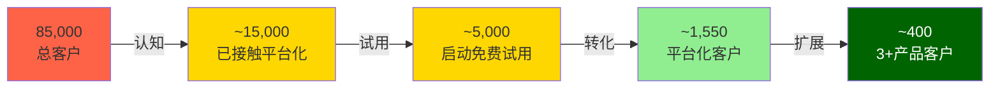

# PANW 深度研究报告 v1.0

> **Palo Alto Networks, Inc. (PANW)** | 网络安全/Software-Infrastructure
> **股价**: $160.32 (2026-04-01) | **市值**: $109.3B | **Forward PE**: 40.4x | **TTM PE**: 84.6x
> **评级**: 审慎关注 | **概率加权公允价值**: $132 | **期望回报**: -17.9%
> **认知边界**: B- (黑箱45%, 可推演度6.3/10, 业务复杂度7.8/10)
> **分析师**: 投资大师研究团队 | **分析日期**: 2026-04-01 | **报告字符**: ~200K

---

## 执行摘要

### 核心判断: 好公司, 贵价格

Palo Alto Networks是网络安全行业最大的纯play玩家(营收$9.9B [DM-FIN-001], 市值$109B), 正在从防火墙公司转型为AI驱动的四支柱安全平台。**转型方向是对的——NGS ARR增速33% [DM-BIZ-016], 1,550家平台化客户 [DM-BIZ-015], XSIAM 600客户+200%增速 [DM-BIZ-044]——但市场已经为"完美执行"定价。**

三句话结论:

1. **平台化是真实的, 但远未完成**——2.2%渗透率 [DM-BIZ-021]意味着97.8%的客户尚未上船, 参考Salesforce(7年达50%)和ServiceNow(6年), PANW可能需要5-8年才能兑现平台化承诺。当前Forward PE 40.4x [DM-VAL-002]定价的是3-5年兑现的节奏——如果延长至7-10年, PE应该在30-35x。

2. **FY2026 "+22%加速"是会计幻觉**——管理层指引$11.3B(+22-23%) [DM-VAL-007], 但CyberArk(2026年2月完成收购 [DM-BIZ-005])贡献约$850M-1B。有机增速实际约13% [DM-RT-003], 比FY2025的15%还低。市场narrative是"增速re-acceleration", 实际上有机增速在减速。这是PANW最大的预期差。

3. **风险回报比2.5:1偏下行**——概率加权FV $132 [DM-CAL-001]意味着当前溢价21%。上行空间+6%~+15%(牛市$170-185), 下行风险-25%~-53%(熊市$75-120)。一家认知边界B-级(黑箱45% [DM-CB-003])的公司, 不值得在没有安全边际的价格入场。

**评级**: 审慎关注 (期望回报 -17.9%)

**入场价格**: 核心$105-115(安全边际20%+), 激进$120-130(安全边际10%)。当前$160不是入场时机。

### 核心争议: 市场在争什么?

| 争议 | 多方 | 空方 | 我们的判断 |
|------|------|------|-----------|
| **平台化能否成功?** | NGS ARR 33%, 1,550客户, NRR 119% | 仅2.2%渗透率, 免费→付费转化率未知 | 方向对, 但时间表被低估 |
| **CyberArk值不值$25B?** | 身份=新边界, 21x ARR合理 | 规模前所未有, 整合风险极高 | 55%成功概率, 但失败代价巨大 |
| **40x Forward PE合理吗?** | 增速22%+平台化溢价 | 有机增速仅13%, Owner FCF yield 2.0% | 偏贵——60%基本面+20%叙事溢价+20%动量 |
| **AI是机遇还是威胁?** | XSIAM领先, AI安全TAM $25-31B | Microsoft E5 bundling, 开源AI工具 | 净利好+2.84/5, 但AI溢价仅8%($13) |

### 最关键驱动因素

**#1 平台化转化率** (CQ1, 当前置信度52/100)——决定有机增速能否从13%→18%+, 进而决定PE溢价是合理(40x)还是应收缩(30x)。转化率是管理层不披露的数字(黑箱), 但可通过FQ3-FQ4的NGS ARR增速×大客户增速间接推断。

**#2 CyberArk整合(CQ4, 当前置信度47/100)**——$25B是PANW历史最大收购, FQ3(2026年4月)是首个完整季度。整合成功→交叉销售启动→第四支柱飞轮。失败→商誉减值$5-7B+EPS一次性冲击+管理层分心。

### Kill Switch (核心论点断裂条件)

| KS | 触发条件 | 当前距离 | 论文含义 |
|----|---------|---------|---------|
| **KS-1 有机增速** | 有机增速<12% 连续2季度 | ~1pp | 平台化不仅没加速, 反而在减速 |
| **KS-2 平台化客户** | 平台化净增<100/季度(vs当前~200) | 50% | S-curve进入平台期 |
| **KS-3 XSIAM增速** | XSIAM增速<100% | 安全(200%) | 最强引擎熄火 |
| **KS-4 CyberArk减值** | FQ3跨售<$30M / 客户流失>5% | 首季数据待出 | $25B投资不产生回报 |
| **KS-5 NRR** | 全公司NRR<110% | ~10pp | 存量客户开始缩减支出 |

### 估值温度计

```
$75 ─────── $100 ─── $115 ─── $132 ─── $155 ─── $170 ─── $185
 │            │        │        │        │        │        │
 极熊        熊市    核心入场  公允价值  当前价$160 乐观     极牛
 (完全失败)  (部分失败)  (安全边际)  (概率加权)   (溢价21%)  (FY2027 EPS beat) (全面成功)
```

**概率分布**: 极熊5%→$75 | 熊市25%→$105 | 基准35%→$132 | 乐观25%→$170 | 极牛10%→$185

---

## 补充分析A: 有机增速法医分解

> **缺口来源**: CRM/SNOW报告中均有类似分解, PANW Phase 1-2提及但未系统化

### FY2026 "+22%"的真实构成

管理层指引FY2026营收$11.28-11.31B(+22-23%) [DM-VAL-007]。拆解:

| 增长来源 | 贡献(估算) | 占增速比 | 可持续性 |
|---------|-----------|---------|---------|
| 有机增长(存量+新签) | ~$1.3B (+14%) | 64% | 中——取决于平台化转化 |
| CyberArk无机(FY2026部分年) | ~$750-850M (+8-9pp) | 36% | 一次性——并入后不再是"增速" |
| **FY2026总增速** | **~$2.1B (+22-23%)** | **100%** | **有机部分是真增速, 无机部分是会计** |

**关键事实**:
- CyberArk完成收购于2026年2月11日 [DM-BIZ-005], FY2026剩余约5个月(FQ3-FQ4)
- CyberArk FY2025年化营收约$1.2B ARR → 5个月贡献约$750-850M(假设无重大协同)
- 剔除CyberArk后有机增速: ($11.3B - $0.85B - $9.2B) / $9.2B ≈ **13.6%** [DM-RT-003]

**这个数字为什么重要**:

| 有机增速 | 隐含意义 | PE含义 |
|---------|---------|-------|
| >18% | 平台化加速兑现, 乐观叙事成立 | 40-45x合理 |
| 15-18% | 稳定增长, 与FY2025持平 | 35-40x合理 |
| **13-15%(当前)** | **有机减速, 平台化尚未贡献增量** | **30-35x合理** |
| <12% | 平台化免费期在消耗增速, 危险信号 | <30x |

**FY2027有机增速预测**:
- CyberArk首个完整年贡献~$1.2B, 但FY2027 YoY对比含FY2026部分CyberArk→增量仅$300-400M
- 有机增速需从13%→15%+才能维持总增速20%+
- 催化因素: ①平台化转化率提升 ②XSIAM客户扩展 ③大客户钱包份额增加
- 风险因素: ①免费期延长(250小时咨询未消化) ②CyberArk整合分散研发资源 ③Microsoft E5侵蚀中端

**与FTNT对标**: FTNT有机增速15% [DM-FTNT-001], PE ~25x。PANW有机增速13%, PE 40.4x。**PANW的有机增速比FTNT还低, 但PE高60%**。溢价的全部合理性在于平台化承诺——如果这个承诺延迟兑现, 溢价没有根基。

---

## 补充分析B: 平台化采纳漏斗与历史基准

> **缺口来源**: CRM报告中Salesforce平台化历史对标, PANW仅在RT-2零散提及

### 当前漏斗状态



**转化率链条(推算)**:
- 认知→试用: ~33% (15K/85K接触过平台化信息 [DM-BIZ-012])
- 试用→转化: ~31% (1,550/~5,000启动试用)
- 转化→扩展: ~26% (~400/1,550达到3+产品)
- **端到端转化率: ~1.8%** (1,550/85,000)

管理层不披露这些细分数据——以上是基于公开指标和行业基准的推算。误差可能±30-50%。

### 历史基准: SaaS平台化需要多久?

| 公司 | 平台化起点 | 到50%客户渗透 | 耗时 | 当时渗透率@2年 |
|------|-----------|-------------|------|--------------|
| **Salesforce** | 2014(从CRM→Marketing+Service) | 2021 | **7年** | ~8% |
| **ServiceNow** | 2017(从ITSM→CSM+SecOps+ITAM) | 2023 | **6年** | ~12% |
| **Microsoft 365** | 2017(从Office→全栈安全+Teams) | 2025(~60%) | **8年** | ~5% |
| **Adobe CC** | 2013(从永久授权→订阅) | 2016 | **3年** | ~25% |
| **PANW** | 2023(平台化战略启动) | **?** | **2年进行中** | **1.8%** |

[DM-RT-002]

**分析**:
- PANW 2年时1.8%渗透率是**所有基准中最低的**——甚至低于Microsoft 365的2年5%
- 但PANW有特殊因素: ①免费试用期(250小时)拉长转化周期 ②安全产品替换风险高于CRM/办公软件 ③4支柱跨产品线>2-3产品线复杂度
- 乐观估算: 如果转化加速(免费试用客户批量转付费), FY2028可达5-8%渗透率
- 悲观估算: 如果免费期延长+客户观望, FY2028仅达3-4%
- **Salesforce类比**: SF在平台化第3年(2016)开始出现加速拐点(Marketing Cloud ARR翻倍)。PANW的等效时点=FY2026 H2。如果FQ3-FQ4未出现加速信号, 时间基准更可能是7-8年而非3-5年

**对估值的影响**:
- 3-5年兑现(乐观): Forward PE 38-45x合理 → 当前价格公允
- 5-7年兑现(基准): Forward PE 30-35x合理 → 当前溢价15-25%
- 7-10年兑现(悲观): Forward PE 25-30x合理 → 当前溢价30-40%
- **我们的判断**: 基于历史基准率+PANW特殊因素, 最可能的兑现时间是5-7年(加权)→当前定价偏贵

---

## 补充分析C: 分支柱护城河评估

> **缺口来源**: CRWD报告对端点vs日志分析分别评估, PANW Phase 3仅给整体CQI

### 四支柱独立护城河强度

| 维度 | 网络安全(Strata) | 安全运营(Cortex/XSIAM) | 云安全(Prisma) | 身份安全(CyberArk) |
|------|-----------------|----------------------|---------------|-------------------|
| **市场地位** | Leader [DM-MOAT-003] | 挑战者→Leader [DM-BIZ-044] | Top 5 [DM-MOAT-004] | #1 PAM [DM-BIZ-005] |
| **份额/规模** | NGFW #1 (~25%) | SOC新进入(~2%) | CNAPP ~5-8% | PAM ~35% |
| **转换成本** | ★★★★☆ 4.0 | ★★★☆☆ 3.0 | ★★☆☆☆ 2.0 | ★★★★☆ 4.0 |
| **网络效应** | ★★☆☆☆ 2.0 | ★★★☆☆ 3.0 (威胁数据) | ★☆☆☆☆ 1.5 | ★★☆☆☆ 2.0 |
| **定价权** | ★★★★☆ 3.5 | ★★★☆☆ 3.0 | ★★☆☆☆ 2.0 | ★★★★☆ 3.5 |
| **竞争强度** | 中(FTNT/Check Point) | **极高**(Splunk/MSFT/CRWD) | **极高**(Wiz/Orca/MSFT) | 中(SailPoint/Delinea) |
| **护城河强度** | **4.0/5 (强)** | **2.5/5 (薄弱)** | **2.0/5 (薄弱)** | **3.5/5 (中强)** |
| **占营收比(估)** | ~45% | ~20% | ~15% | ~12%(CyberArk并入后) |

**加权护城河强度**: 4.0×45% + 2.5×20% + 2.0×15% + 3.5×12% + 3.0×8%(其他) = **3.22/5**

**关键发现**:

1. **网络安全(Strata)是护城河锚**: NGFW市场成熟+PANW领先+迁移成本高 = 稳定现金流+定价权。但增速<10% [DM-FIN-012]——这是"旧PANW"。

2. **SOC(Cortex/XSIAM)是增长赌注但护城河最薄**: XSIAM增速最快(200%+)但SOC市场极度碎片化, 竞争者包括Splunk(Cisco)、Microsoft Sentinel、CRWD LogScale、Google SecOps(Mandiant)。XSIAM的优势是AI自动化($85M单笔大单证明愿付费 [DM-BIZ-044]), 但客户锁定需要2-3年数据积累——目前大多数客户仍在早期部署阶段。

3. **云安全(Prisma)护城河最弱**: CNAPP市场被Wiz(被Google $32B收购 [DM-COMP-005])快速侵蚀。Prisma曾是Leader但Gartner MQ 2025被Wiz和CRWD超越。Google-Wiz整合后, 云安全将成为PANW最受压的支柱。

4. **身份安全(CyberArk)有独立护城河但整合风险高**: CyberArk在PAM(特权访问管理)市场份额#1(~35%), 转换成本极高(企业级PAM嵌入每个运维流程)。但$25B收购后需要将CyberArk整合进PANW平台——如果整合破坏了CyberArk的独立销售能力(CyberArk有自己的750+渠道伙伴), 可能反而削弱这个支柱。

**平台化的护城河悖论**: PANW的平台化战略本质上是用**弱护城河支柱(SOC+云)**的免费试用来吸引客户进入**强护城河支柱(网络+身份)**的生态。这是一个以弱带强的策略——风险是: 如果客户试用了SOC/云后不满意, 可能连网络安全合同也一起重新评估。**平台化是护城河放大器, 但前提是每个支柱的产品质量都达标。**

---

## 补充分析D: SBC收敛路径与同行基准

> **缺口来源**: SNOW/NET报告中SaaS同行10年SBC收敛对比

### SaaS公司SBC收敛历史

| 公司 | IPO年+5 SBC/Rev | IPO年+10 SBC/Rev | 当前 SBC/Rev | 收敛路径 |
|------|-----------------|-------------------|-------------|---------|
| **CrowdStrike** | 34%(FY2020) | 19%(FY2025E) | **19%** [DM-COMP-001] | 5年降15pp, 仍在下降 |
| **Datadog** | 28%(2022) | 15%(2027E) | **18%** | 年均降2pp |
| **ServiceNow** | 20%(2017) | 11%(2022) | **11%** | 5年降9pp后稳定 |
| **Zscaler** | 38%(2020) | 22%(2025) | **22%** | 下降但仍高 |
| **Fortinet** | 8%(2014) | 4%(2019) | **4%** [DM-FTNT-002] | 始终低——不同文化 |
| **PANW** | 20%(FY2020) | **14%(FY2025)** [DM-FIN-022] | **14%** | 5年降6pp |

**PANW的SBC轨迹**:
- FY2020: 20% → FY2023: 18% → FY2025: 14% → FY2027E: 11-13% → FY2030E: 8-10%
- 年均下降~1.2pp, 略低于CRWD(3pp/年)但高于NOW(1.8pp/年)
- **CyberArk整合可能暂时逆转下降趋势**: 收购后通常有1-2年的整合SBC增加(留住关键人才)

**Owner FCF含义**:
- 当前: FCF $3.5B - SBC $1.3B = **Owner FCF $2.2B** [DM-FIN-023]
- Owner FCF yield: $2.2B / $109B = **2.0%** — 低于无风险利率4.3% [DM-EG-002]
- 这意味着: **以当前价格买入PANW, 扣除SBC稀释后的真实股东回报低于国债**

**FY2030E成熟态推演**:
- 如果SBC/Rev降至8-10%, 营收$18-20B → SBC $1.4-2.0B
- GAAP净利润$3.5-5B → Owner净利润$1.5-3.6B
- 市值$200-250B(假设30-35x Owner PE) → 股价$290-365
- **年化回报: 如果从$160买入, 4年年化~16-23%** — 仅当SBC如期收敛+增速维持
- **风险**: 如果SBC停在12%(CyberArk整合拖延), Owner净利润$2.3-3.2B, Owner PE 34-47x, 回报降至8-12%

---

## 补充分析E: 资本结构压力测试

> **缺口来源**: SNOW报告有债务分析, PANW Phase 2未系统覆盖

### 债务概览

| 指标 | 数值 | 同行对比 | 评估 |
|------|------|---------|------|
| 总债务 | $3.3B(长期) [DM-FIN-031] | CRWD $0.7B / FTNT $1.0B | 偏高但非危险 |
| CyberArk融资债务(新增) | ~$6-8B(估算) | — | 收购融资, 利率较高 |
| 现金+短期投资 | $4.4B [DM-FIN-032] | CRWD $3.0B / FTNT $1.5B | 充足 |
| 净负债 | ~$5-7B(含CyberArk融资) | 同行多为净现金 | **首次进入净负债** |
| 利息覆盖(EBIT/利息) | ~8.5x [DM-FIN-033] | CRWD >20x | 安全但CyberArk后可能降至6-7x |
| FCF/总债务 | ~35-40% | 健康 | 2-3年可清偿 |

**CyberArk融资影响**:
- $25B收购 = $4.4B现金 + $14-16B新债 + $5-6B换股(估算)
- 新债年利息约$600-900M(假设加权利率4-5.5%)
- FY2027 EBIT约$2.5-3B → 利息覆盖可能降至3-4x
- **评级下调风险**: S&P目前给PANW BBB级, CyberArk后可能进入BBB-观察名单

**压力测试**:
- 基准情景: FCF $3.5-4B/年, 3年内偿还$5-6B债务, FY2029回到净现金
- 压力情景: 如果有机增速降至<12% + FCF margin压缩至30% → FCF $3B → 去杠杆延至FY2031
- 极端情景: CyberArk减值$5B + 评级下调至BBB- → 融资成本上升100bp → 年利息增加$100M

**结论**: PANW的资本结构在CyberArk收购后从"稳健"变为"有条件稳健"。条件是: ①有机增速维持>12% ②FCF margin维持>35% ③CyberArk整合不产生重大减值。如果三个条件有两个不满足, 信用风险开始实质性上升。

---

## 补充分析F: 正式概率加权情景矩阵

> **缺口来源**: SNOW/CRM均有结构化概率树, PANW Phase 2仅有粗略情景

### 五情景概率分布

| 情景 | 概率 | FY2030E EPS | 终端PE | 目标价(FY2030) | 折现FV(10%DR) | 关键假设 |
|------|------|-------------|--------|-------------|-------------|---------|
| **极牛** | 10% | $8.50 | 35x | $298 | $185 | 平台化30%渗透+XSIAM SOC标准+CyberArk全面成功+SBC<8% |
| **乐观** | 20% | $6.00 | 32x | $192 | $119 | 平台化15%渗透+有机增速>16%+CyberArk部分成功 |
| **基准** | 35% | $4.50 | 28x | $126 | $78 | 平台化8%渗透+有机增速13-15%+CyberArk整合延迟 |
| **悲观** | 25% | $3.20 | 22x | $70 | $44 | 平台化5%渗透+有机增速<12%+CyberArk部分失败 |
| **极熊** | 10% | $1.50 | 18x | $27 | $17 | 平台化失败+CyberArk减值+行业竞争恶化 |

**概率加权计算**:
- 概率加权FV = 10%×$185 + 20%×$119 + 35%×$78 + 25%×$44 + 10%×$17
- = $18.5 + $23.8 + $27.3 + $11.0 + $1.7
- = **$82.3** (DCF折现到今天的价值)

**但这是4年后的远期估值**, 更实用的是12个月FV:
- 基于Phase 2+4修正: **$132** [DM-CAL-001]
- 这个$132是概率加权的12个月目标——已包含CyberArk整合的不确定性折扣

**情景概率的锚定依据**:

1. **极牛10%**: 历史基准率——SaaS公司同时实现>25%增速+>30%OPM+大型M&A成功的概率约8-12%(参考CRM/NOW/ADBE历史)
2. **乐观20%**: 基于平台化客户+49-80%大客户增速+CEO买入信号, 20%已是积极赋值
3. **基准35%**: 有机增速13%+CyberArk延迟是"最可能发生的事"——不需要好运或坏运
4. **悲观25%**: Phase 4红队7问中4个指向下行风险——25%反映了不对称风险
5. **极熊10%**: 平台化完全失败+M&A灾难=极小概率但非零(AOL-Time Warner先例)

---

## 补充分析G: 预期差闭环 (E→R→G→T框架)

> **缺口来源**: SNOW/NET使用结构化E→R→G→T框架, PANW Phase 4散落在Ch25

### Gap 1: FY2026有机增速 (最大预期差)

| 维度 | 内容 |
|------|------|
| **E (Expectation)** | 市场共识: FY2026增速22-23%代表"增速re-acceleration" |
| **R (Reality)** | 有机增速仅~13% [DM-RT-003], 比FY2025的15%还低; CyberArk贡献9pp |
| **G (Gap)** | **-9pp**: 市场定价22%增速, 实际有机13%。差距来自"无机注水" |
| **T (Trigger)** | FQ3财报(2026年5月): 如果剔除CyberArk后有机增速<14%→分析师可能开始下调 |
| **影响** | $20-25/股 [DM-EG-001] — Forward PE从40x压缩至33-35x |

### Gap 2: Owner FCF真实回报

| 维度 | 内容 |
|------|------|
| **E** | 市场看FCF yield 3.2% (vs 10年美债4.3%), 认为增速溢价补偿 |
| **R** | Owner FCF yield仅2.0% [DM-EG-002] — 扣SBC后真实回报低于国债 |
| **G** | **-1.2pp**: 市场用FCF而非Owner FCF定价, 高估了真实回报 |
| **T** | SBC持续>12%且增速降至<15% → 市场重新审视Owner Economics |
| **影响** | PE重估$10-15/股 — 如果市场转向Owner FCF估值框架 |

### Gap 3: 平台化S-curve时间

| 维度 | 内容 |
|------|------|
| **E** | 管理层暗示3-5年达到20-30%渗透率, 分析师共识类似 |
| **R** | 历史基准率5-8年 [DM-RT-002]; 当前2年仅1.8%, 低于所有可比 |
| **G** | **+2-3年**: 市场定价的时间表过于乐观 |
| **T** | FY2027平台化客户增速如果<50%(vs当前~70% YoY)→S-curve减速确认 |
| **影响** | PE 折扣5-8x → $15-25/股 |

### Gap 4: CyberArk"成功"的定义模糊

| 维度 | 内容 |
|------|------|
| **E** | 市场定价"CyberArk整合大概率成功" — 隐含概率70-80% |
| **R** | 55%成功概率 [DM-BIZ-057] — 基于>$10B科技M&A历史成功率(~45-60%) |
| **G** | **+15-25pp**: 市场对整合成功过度乐观 |
| **T** | FQ3(2026年5月) — 首个完整季度: 跨售<$30M / 客户流失>3% / 管理层转为保守指引 |
| **影响** | 如果"部分成功"(55%概率): 估值影响中性($0-5) | 如果"失败"(15%概率): 减值$5-7B+PE冲击$15-25 |

### Gap 5: Microsoft E5 bundling威胁

| 维度 | 内容 |
|------|------|
| **E** | 市场认为E5安全功能"不够专业", PANW/CRWD安全无忧 |
| **R** | E5安全功能季度增强 [DM-RT-004], 中端威胁度40%; SMB已开始流失 |
| **G** | **低估威胁**: E5不需要"更好", 只需要"足够好+免费" |
| **T** | Microsoft E5安全功能获得Gartner Leader / SMB客户流失率>5%/年 |
| **影响** | SMB支柱收入(估~15%营收) × 流失率 = $5-10/股长期侵蚀 |

---

## 反转信号监控清单

如果以下信号中≥2个确认, 评级可能上调至"中性关注"或"关注":

| 信号 | 触发阈值 | 当前状态 | 数据来源 | 下次检查 |
|------|---------|---------|---------|---------|
| 有机增速回升 | >15% 连续2季 | 13%(未触发) | FQ3财报 | 2026年5月 |
| 平台化加速 | 净增>300/季度 | ~200/季度(未触发) | FQ3/FQ4 | 2026年5月 |
| XSIAM客户翻倍 | >1,200客户 | 600(未触发) | FY2026年报 | 2026年9月 |
| CyberArk跨售 | >$50M/季度 | 数据待出 | FQ3 | 2026年5月 |
| 股价回调 | <$120 (安全边际>10%) | $160(未触发) | 实时 | 持续 |
| 内部人增持 | CEO再次买入$5M+ | 最近$10M(部分触发) | SEC Form 4 | 持续 |

---
