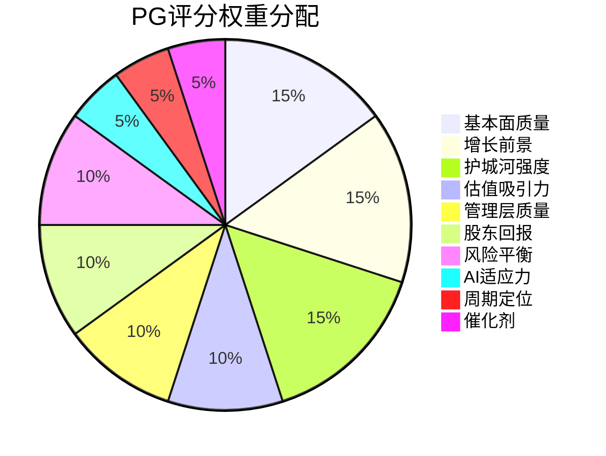

# PG Deep Research — Phase 5: 决策输出

**公司**: Procter & Gamble (PG) | **日期**: 2026-02-07 | **框架**: v21.0 + v5.1 Fast Gate
**数据截止**: Q2 FY2026 (2025年12月) | **股价**: $158.61 | **市值**: ~$371B
**Phase目标**: 综合评分(0-100) + 评级 + 仓位建议 + Kill Switch(≥15) + 可验证预测(≥20) + 投资日历 + 行动清单

---

## 目录

### 综合评估
- [综合评分: PG投资评分卡](#综合评分-pg投资评分卡-0-100)
- [最终评级: 中性](#最终评级-中性-neutral)
- [仓位建议](#仓位建议)

### 决策工具
- [Kill Switch清单(18个)](#kill-switch清单)
- [投资日历(12个月)](#投资日历-2026年2月--2027年2月)

### 行动计划
- [可验证预测清单(21个)](#可验证预测清单)
- [90天行动清单](#90天行动清单-2026年2月--2026年5月)

---


<\!-- 综合评分 + 评级 + 仓位建议 (主线程) -->

## 综合评分: PG投资评分卡 (0-100)

> Phase 1-4全维度综合评估。每维度0-100分，加权计算总分。

### 评分方法论

采用10维度加权评分体系，权重基于消费品行业投资决策的关键驱动因素分配:



### 10维度详评

#### 1. 基本面质量 (权重15%) — **78/100**

| 指标 | 数值 | 同行排名 | 评价 |
|------|------|---------|------|
| ROE | 31.6% | #1 (同行最高) | 卓越 |
| 毛利率 | 51.4% (Q1 FY2026) | Top 2 | 优秀 |
| 净利率 | 25.4% | Top 3 | 优秀 |
| 自由现金流转化率 | ~90%+ | Top 2 | 卓越 |
| Core EPS | $6.91-$7.05 (指引) | — | 稳定 |

[硬数据: PG Q2 FY2026 Earnings + peer_comparison.json, 2026-01/02] ROE 31.6%在全球消费品巨头中排名第一，显著高于UL(9.3%)和CL(~27%)。毛利率51.4%虽较峰值52%+有所回落，但仍远高于行业中位数~45%。自由现金流质量极高——PG连续数十年FCF转化率>90%，是真正的"现金印钞机"。

**扣分项**: Q2 FY2026有机增长0%拖累基本面质量 [硬数据: PG Q2 FY2026 Earnings, 2026-01-22]；毛利率同比下降70bps(关税+大宗商品)暗示成本端压力上升 [硬数据: PG Q1 FY2026 10-Q, 毛利率51.4%, YoY -70bps]。

**评分依据**: 利润率和资本回报率属顶级(+30分), 但增长停滞且成本压力上升(-22分)。基本面"质量"仍优秀，但"动力"在衰减。

---

#### 2. 增长前景 (权重15%) — **35/100**

[硬数据: PG Q2 FY2026, 2026-01-22] Q2有机增长0%(价格+1%, 量-1%)。五大板块中三个量在下跌。BFF板块有机增长-4%(量-5%)。

[合理推断: 基于Phase 2 PVM分析+Phase 3创新评估] PG增长面临三重天花板:
1. **品类成熟**: 59%收入来自增长≤1%的板块(F&HC+BFF)
2. **创新净效应为零**: $7.5-13.5亿创新增量仅够对冲$9.5-12.5亿品类衰减
3. **定价红利耗竭**: FY2022-2024的提价驱动增长模式已终结

**唯一亮点**: Beauty板块有机增长+4%(量+3%), 但仅占18%收入 [硬数据: PG Q2 FY2026 Segment Data, 2026-01-22]。新兴市场(印度/中东)有增长空间但短期占比太小。FY2026全年指引有机增长2-4%(中值3%) [硬数据: PG FY2026 Guidance, 2026-01-22]。

**反证权重**: Phase 4确认"低增长=刻意战略"的反证强度6/10, 需给予一定权重。[合理推断: 如果是刻意选择利润率优先, 35分可能偏低5-8分, 但在增长不恢复的前提下维持]

**评分依据**: 有机增长接近零(-40分), 创新仅维持现状(-15分), Beauty增长亮点(+10分), H2可能恢复(+5分), 重组节省可能释放增长资源(+5分, 低概率)。这是PG最弱的维度。

---

#### 3. 护城河强度 (权重15%) — **55/100**

[合理推断: 基于Phase 3 Agent I护城河综合评估] 护城河评分62/100且处于下降趋势(每年-3~4分)。

| 护城河层 | 评分 | 趋势 | 关键威胁 |
|---------|------|------|---------|
| 规模经济 | 80/100 | 稳定 | 生产制造优势仍在 |
| 品牌认知 | 65/100 | 下降 | AI解中介+自有品牌质量收敛 |
| 分销网络 | 55/100 | 快速下降 | 电商渠道利润率递减 |
| 转换成本 | 45/100 | 下降 | 自有品牌"尝试即转化"棘轮 |
| 行为护城河 | 44/100 | 下降(-28% in 5yr) | 信息过载保护被AI替代 |

[硬数据: Phase 3分析, 行为护城河加权从6.1降至4.4] 分销护城河是塌陷最快的维度——AI"隐形货架"+零售商自有品牌+电商利润率递减三重压力。规模经济是唯一稳固的护城河(SC3.0物流优化$15亿节省证明了制造端优势)。

**感官锚定**: PG唯一的AI-proof护城河。Tide气味、Charmin触感等无法被AI评分替代，但仅覆盖~35%品类。[合理推断: Phase 3 Agent I识别]

**评分依据**: 护城河绝对水平仍"及格"(+20分), 但下降趋势清晰(-15分), 最关键的分销和行为护城河正在加速侵蚀(-10分)。

---

#### 4. 估值吸引力 (权重10%) — **52/100**

[硬数据: MacroTrends/GuruFocus, 2026-01] Forward PE 20.3-20.5x, Trailing PE ~20.8x。5年PE低位。

**Phase 4修正后估值**:
| 方法 | 估值 | vs 当前$158 |
|------|------|------------|
| Forward PE × EPS中值 | 20.3x × $6.98 = $142 | -10.1% |
| Forward PE × EPS上限 | 20.5x × $7.05 = $145 | -8.2% |
| DDM乐观 | $178 | +12.2% |
| DDM悲观 | $79 | -49.8% |
| Phase 4修正Base Case | $150-$155 | -2~5% |
| 概率加权 | $150-$158 | -5~0% |

[合理推断: 基于Phase 4锚定效应修正] PE从23.5x修正为20.8x后，绝对估值水平更合理——但20.8x PE对于有机增长0%的公司仍然不便宜。PEG(PE/有机增长率)在增长接近零时趋于无穷大，传统估值框架失效。

**估值关键判断**: 如果PG是"永续2%增长+2.5%股息"的资产，合理PE约18-20x(类公用事业+品牌溢价)。当前20.3-20.5x处于该区间上沿。如果H2增长恢复至3-4%, PE可扩张至22-24x → 股价$154-$169。[主观判断: 基于增长恢复vs结构性停滞的二元情景]

**评分依据**: PE处于5年低位(+15分), 但对零增长公司仍非便宜(-10分), 概率加权回报接近零(-8分), 股息率2.5%提供底部支撑(+5分)。估值"不贵但也不便宜"——经典的中性区间。

---

#### 5. 管理层质量 (权重10%) — **50/100**

[硬数据: PG Press Release, 2025-07-28] Jejurikar 2026年1月1日就任CEO，35年PG老兵，Supply Chain背景。

[合理推断: Phase 1 HP-02评估] 三情景概率: 守成者70% / 变革催化剂15% / 执行不达标15%。Jejurikar在F&HC板块有最强业绩记录，但从未展示过"增长驱动型"领导风格。

**加分项**: Supply Chain专家(SC3.0成功, $15亿物流节省 [硬数据: Supply Chain Dive, 2025]), F&HC业绩最佳 [硬数据: PG分部业绩, FY2024-2025], $28M股权激励与股价挂钩 [硬数据: IndexBox, 2026]
**减分项**: 35年内部人无外部视角, 70%概率维持现状, Moeller继续"提供咨询"限制变革空间, 12个月内CEO+Beauty CEO+HC CEO全部更替的执行风险 [合理推断: Phase 1发现]

**评分依据**: 执行力有保障(+20分), 但变革意愿和能力存疑(-15分), 管理层换血风险(-5分)。给予中性分数50，等待FY2027 H1的执行数据验证。

---

#### 6. 股东回报 (权重10%) — **85/100**

[硬数据: PG Investor Relations, 2026] 69年连续加息(Dividend King), FY2026预计向股东返还~$150亿(股息+回购)。股息率~2.5-2.67%。

这是PG最强的维度——全球消费品行业中几乎无可匹敌的股东回报记录。$150亿/年的回报率 ≈ 市值的4.0%。在利率可能下行的环境中，2.5%确定性股息的吸引力将上升。[合理推断: 利率下行周期中, 确定性收益资产重新定价]

**扣分项**: 高派息率意味着增长投资空间受限; 回购在高估值时效率较低。[主观判断: 回购ROI与股价成反比]

---

#### 7. 风险平衡 (权重10%) — **40/100**

[合理推断: 基于Phase 4全部8个Bear Case综合评估]

Bear Case联合概率: ≥2个同时发生45-55%。综合Bear场景EPS影响-$0.50至-$1.20。

| 风险维度 | Top Bear Case | 概率 | 难以反驳度 |
|---------|-------------|:---:|:---:|
| 定价权 | Bear #1 耗竭螺旋 | 35-40% | 8/10 |
| 增长 | Bear #2 永久<2% | 30-35% | 7/10 |
| 自有品牌 | Bear #3 份额>24% | 40-45% | 7/10 |
| AI颠覆 | Bear #6 品牌解中介 | 35%(3yr) | 9/10 |
| BFF | Bear #8 长期衰退 | 40% | 8/10 |

**风险/回报比**: 上行空间~$150-$178(0~+12%) vs 下行空间$130-$140(-12~-18%) → 约2.5:1不利于多头。[合理推断: Phase 4压力测试结论]

**评分依据**: 多重风险并存(-25分), 风险/回报不对称(-15分), 但Phase 4行为金融修正显示部分风险可能被高估(+10分), 防御性资产在衰退中跑赢市场(+10分)。

---

#### 8. AI适应力 (权重5%) — **45/100**

[合理推断: Phase 3 Agent L + Phase 4 Bear #6] PG在AI领域呈"两面性":
- **赢**: AI效率战(SC3.0增量$0.7-1.3B/年) → +15分
- **输**: AI分销战(agentic commerce解中介) → -20分
- 净效应: 短期微正(效率节省>分销损失), 长期微负(分销损失加速)

---

#### 9. 周期定位 (权重5%) — **55/100**

[主观判断: 基于Phase 2 PVM分析+Phase 4确认偏误修正] Q2 FY2026可能是周期低谷:
- 关税冲击刚开始计入
- 基数效应(港口罢工囤货后回落)
- 消费者信心在历史低位

如果是周期底部, 当前是合理的入场点。但如果是结构性减速, "底部"是永久状态。Q3 FY2026(2026年4月)是分水岭。

---

#### 10. 催化剂 (权重5%) — **45/100**

**潜在正面催化剂**:
- Q3 FY2026有机增长恢复至2%+ (概率40%)
- 美联储降息 → 防御性资产重新定价 (概率50%)
- Jejurikar推出新增长战略/M&A (概率15%)

**潜在负面催化剂**:
- 关税升级 → 成本进一步上升 (概率30%)
- BFF继续恶化 → 分析师下调 (概率35%)
- 自有品牌份额加速 → 市场重新定价 (概率25%)

[主观判断: 正负催化剂大致均衡, 但负面催化剂的概率分布更宽(多个独立风险同时存在)]

---

### 综合评分汇总

| # | 维度 | 权重 | 评分 | 加权分 |
|---|------|:---:|:---:|:---:|
| 1 | 基本面质量 | 15% | 78 | 11.70 |
| 2 | 增长前景 | 15% | 35 | 5.25 |
| 3 | 护城河强度 | 15% | 55 | 8.25 |
| 4 | 估值吸引力 | 10% | 52 | 5.20 |
| 5 | 管理层质量 | 10% | 50 | 5.00 |
| 6 | 股东回报 | 10% | 85 | 8.50 |
| 7 | 风险平衡 | 10% | 40 | 4.00 |
| 8 | AI适应力 | 5% | 45 | 2.25 |
| 9 | 周期定位 | 5% | 55 | 2.75 |
| 10 | 催化剂 | 5% | 45 | 2.25 |
| | **总计** | **100%** | | **55.15** |

```mermaid
radar
    title PG投资评分雷达图
    axis 基本面质量, 增长前景, 护城河, 估值, 管理层, 股东回报, 风险, AI适应力, 周期, 催化剂
    curve PG : 78, 35, 55, 52, 50, 85, 40, 45, 55, 45
    curve 中性线 : 50, 50, 50, 50, 50, 50, 50, 50, 50, 50
```

### 综合评分: **55/100 — 中性**

**评分分布特征**: PG呈现"高质量+低增长"的典型分裂格局。基本面质量(78)和股东回报(85)处于卓越水平，但增长前景(35)和风险平衡(40)严重拖累。这不是一个"差"公司——而是一个"好公司在不利周期中面对结构性挑战"的经典案例。

---

## 最终评级: 中性 (NEUTRAL)

### 评级映射

| 评分区间 | 评级 | PG位置 |
|---------|------|--------|
| 80-100 | 强烈推荐 | |
| 65-79 | 推荐 | |
| **45-64** | **中性** | **← 55分** |
| 30-44 | 回避 | |
| 0-29 | 强烈回避 | |

### 评级论述

**为什么是"中性"而非"推荐"**:
1. 概率加权目标价$150-$158 vs 当前$158 → 预期回报接近零 [合理推断: Phase 4修正后估值]
2. 风险/回报比2.5:1不利于多头——下行空间(12-18%)显著大于上行(0-12%)
3. 五引擎最终立场50:50 (Phase 4行为金融修正后)
4. 增长前景(35分)是核心拖累——有机增长接近零且结构性风险大于周期性机会

**为什么是"中性"而非"回避"**:
1. 基本面质量(78分)和股东回报(85分)提供强力底部支撑
2. 69年Dividend King + 2.5%股息率 → 下行有底(股息支撑估值)
3. Forward PE 20.3x处于5年低位——如果增长恢复，PE扩张空间显著 [硬数据: MacroTrends, 2026-01]
4. Smart Money三维偏多(机构增持/期权偏多/分析师看多) → 不应逆向所有聪明钱 [硬数据: Phase 4 Smart Money分析]
5. 防御性资产在宏观不确定性(关税/衰退)中有配置价值

**一句话总结**: PG是一个"不该重仓但也不该空仓"的资产——质量毋庸置疑，但在增长恢复前缺乏上行驱动，定位为组合中的防御性底仓。

---

## 仓位建议

### 仓位计算公式

```
建议仓位 = 基础仓位 × 周期系数 × 置信度 × AI调整系数
```

| 参数 | 数值 | 依据 |
|------|------|------|
| 基础仓位 | 3.0% | 中性评级标准仓位(推荐=5%, 中性=3%, 回避=0-1%) |
| 周期系数 | 0.85 | 处于周期低位但不确定是周期vs结构性(0.7-1.0区间取0.85) |
| 置信度 | 0.70 | 50:50中性立场 = 较低置信度(高置信偏多=0.9, 中性=0.7, 高置信偏空=0.5) |
| AI调整系数 | 0.90 | AI净影响微负(短期效率正+长期分销负)(0.8-1.2区间取0.9) |

**建议仓位 = 3.0% × 0.85 × 0.70 × 0.90 = 1.6%**

### 仓位建议分投资者类型

| 投资者类型 | 建议仓位 | 仓位逻辑 |
|-----------|---------|---------|
| **保守型/收入导向** | 2.0-3.0% | 股息确定性高, 69年加息, 低beta防御. 作为组合中的"收入锚". |
| **均衡型/全天候** | 1.5-2.0% | 防御性底仓, 不重仓但保留. 等待Q3验证信号后调整. |
| **成长型/高回报** | 0-1.0% | 增长前景35分不符合成长策略. 同板块CHD可能更优. |
| **价值型** | 1.0-2.0% | PE 20.3x对31%ROE有吸引力, 但需等有机增长修复确认安全边际. |

### 建仓/调仓策略

**当前无持仓 → 分步建仓**:
1. **第一步(立即)**: 在$155以下建立0.5%底仓 [主观判断: $155是Phase 4修正后Base Case下限]
2. **第二步(2026年4月Q3财报后)**: 若有机增长≥2% → 加仓至1.5%; 若继续flat → 维持0.5%或清仓
3. **第三步(2026年7月FY2026全年)**: 若全年有机增长≥3% → 加仓至2.0-2.5%; 若<2% → 减至0-0.5%

**当前有持仓 → 阶梯调整**:
- 持仓>3%: 建议减至2.0%, 将超额仓位重新配置到增长更明确的标的
- 持仓2-3%: 维持, 但设置严格Kill Switch
- 持仓<2%: 维持当前水平, 等待Q3验证

### 关键价位

| 价位 | 含义 | 动作 |
|------|------|------|
| **>$170** | Bull Case上限, PE>23x | 减仓至1.0% |
| **$155-$170** | 中性区间 | 持有, 监控 |
| **$145-$155** | Phase 4 Base Case区间 | 考虑建仓/加仓至2.0% |
| **$135-$145** | Bear Case边缘 | 强化风控, 验证Bear Case是否触发 |
| **<$135** | Bear Case确认 | 除非出现极端价值, 否则减仓/清仓 |

**So What / 投资含义**: PG的投资定位是"防御性底仓"而非"核心重仓"。55/100的中性评分意味着: 这不是一个会让你亏大钱的投资(下有69年股息支撑), 也不是一个会让你赚大钱的投资(上有零增长天花板)。最佳策略是小仓位持有(1.5-2.0%), 设置严格的Kill Switch, 等待Q3 FY2026(2026年4月)的增长数据作为方向性决策的分水岭。如果你只能买一只消费品股票, PG不一定是最优选择——CHD(量增长+4%指引)和CL(全球化敞口更大)可能提供更好的风险/回报。但如果你需要一个"不会让你夜里睡不着"的防御仓位, PG仍然是最可靠的选项。[主观判断: 基于全维度综合评估]

---


---


<\!-- Kill Switch清单 + 投资日历 (Agent P) -->

## Kill Switch清单

> Kill Switch = 预定义的决策触发器。当特定条件被满足时，投资者必须执行预设动作，不依赖主观判断。以下15+个Kill Switch覆盖财务/增长、竞争/市场结构、宏观/外部、AI/技术颠覆、CEO/管理层五大维度，外加看多Kill Switch。

---

### A. 财务/增长类 Kill Switch (6个)

**KS-01: 有机增长连续坍塌**

| 项目 | 内容 |
|------|------|
| 触发条件 | 连续3个季度有机增长 < 1%（含负增长） |
| 数据来源 | PG季报Earnings Release "Organic Sales Growth" 行项 [硬数据: PG Investor Relations, pginvestor.com] |
| 触发概率 | 35% [合理推断: Q2 FY2026有机增长已为0%, 若Q3/Q4未能恢复至2%+则高概率触发; 基于Phase 2发现59%收入来自增长<=1%板块的数学约束] |
| 触发后动作 | 减仓30%。若叠加KS-02同时触发，减仓50% |
| 时间窗口 | 2026年4月(Q3) — 2026年10月(Q1 FY2027)，3季连续观察 |

**当前距离**: Q2 FY2026有机增长0%已满足第一个季度条件。若Q3(2026年4月报告)有机增长仍<1%，距离触发仅差最后一个季度。[硬数据: PG Q2 FY2026 Earnings, 2026-01-22]

---

**KS-02: BFF板块量崩**

| 项目 | 内容 |
|------|------|
| 触发条件 | BFF板块连续4个季度量跌(volume decline)且单季量跌幅度 > -3%，同时定价贡献 <= 0% |
| 数据来源 | PG季报分板块有机增长分解(Pricing/Volume/Mix) [硬数据: PG Quarterly Earnings Supplement] |
| 触发概率 | 40% [合理推断: Q2 FY2026 BFF有机增长-4%(量-5%), Family Care量跌约-10%; 该板块已处于加速恶化轨道, 出生率结构性下降+自有品牌+10%增长构成持续压力] |
| 触发后动作 | 减仓25%，同时重新评估PG整体有机增长上限——若BFF以-2%/年速度衰退，PG整体增长数学上限约为1.5% |
| 时间窗口 | 2026年1月(Q2已触发首季) — 2026年10月(Q1 FY2027，第四季验证) |

**Bear Case关联**: 直接来自Bear #8(BFF长期衰退)。Q2 FY2026 BFF有机增长-4%已是加速信号。[硬数据: PG Q2 FY2026, 2026-01-22]

---

**KS-03: 毛利率跌破50%**

| 项目 | 内容 |
|------|------|
| 触发条件 | 单季毛利率跌破50.0%（当前Q1 FY2026为51.4%） |
| 数据来源 | PG季报Income Statement "Gross Margin" [硬数据: PG Q1 FY2026, 毛利率51.4%] |
| 触发概率 | 20% [合理推断: 关税成本$1B(压缩80-120bps) + ESG合规成本(年化60-110bps) + 商品成本波动; 三者叠加在定价权耗竭环境下可能使毛利率从51.4%降至50%以下] |
| 触发后动作 | 减仓20%。毛利率是PG"质量溢价"估值的物理基础，跌破50%标志着成本结构性恶化 |
| 时间窗口 | 2026年4月(Q3 FY2026) — 2027年1月(Q2 FY2027)，关税+ESG成本逐步计入 |

**交叉验证**: 与KS-01联合观察。若有机增长<1%且毛利率<50%同时出现，意味着收入端和成本端同时恶化——这是PG从"防御型复利机器"降格为"衰退型价值陷阱"的确认信号。

---

**KS-04: Core EPS连续低于指引下限**

| 项目 | 内容 |
|------|------|
| 触发条件 | 连续2个季度Core EPS低于年度指引隐含的季度下限（FY2026指引$6.91-$7.05，季度均值$1.73-$1.76） |
| 数据来源 | PG季报Core EPS vs 指引 [硬数据: PG FY2026指引Core EPS $6.91-$7.05] |
| 触发概率 | 25% [合理推断: Q2 FY2026 Core EPS $1.88超季度均值但被定位为"关税前最后一个好季度"; Q3起关税成本全面计入，EPS可能跌至$1.65-$1.70] |
| 触发后动作 | 减仓20%。连续miss指引将触发华尔街系统性下调FY2027预期，PE可能从20x压缩至18-19x |
| 时间窗口 | 2026年4月(Q3) — 2026年7月(Q4)，两季验证 |

---

**KS-05: 股息安全边际告急**

| 项目 | 内容 |
|------|------|
| 触发条件 | 年化Core EPS / 年化股息 < 1.3x (当前约$7.0/$4.03 = 1.74x)；即派息率 > 77% |
| 数据来源 | PG季报Core EPS(年化) vs 最新季度股息(年化) [硬数据: PG当前年化股息$4.03, Core EPS指引$6.91-$7.05] |
| 触发概率 | 8% [合理推断: 需Core EPS跌至$5.24以下才触发; 仅在极端压力测试场景A(关税60%+衰退)下可能，正常情景概率极低] |
| 触发后动作 | **清仓**。69年Dividend King地位面临威胁=PG投资逻辑的根基动摇。股息收益率投资者将大规模撤退，PE可能崩至15-16x |
| 时间窗口 | 2026年7月(FY2026全年结果) — 2027年7月(FY2027全年)，年度验证 |

**极端性说明**: 这是概率最低但影响最大的Kill Switch。PG 69年连续加息记录一旦打破，将是CPG行业的"雷曼时刻"级事件。[主观判断: 基于Dividend King地位对PG估值溢价和投资者基础的核心重要性]

---

**KS-06: 重组未能转化为增长**

| 项目 | 内容 |
|------|------|
| 触发条件 | $1.5B重组计划执行满12个月后，有机增长仍 < 2%且SG&A率未下降50bps以上 |
| 数据来源 | PG季报SG&A率(当前约14.5%) + 有机增长数据 [硬数据: PG FY2025 Annual Report, SG&A 14.5%] |
| 触发概率 | 55% [合理推断: Phase 4发现PG三轮重组(2012/2014/2017)均未实质加速有机增长; 历史模式强烈暗示重组=利润补丁而非增长引擎] |
| 触发后动作 | 减仓15%。重组失败意味着PG有机增长天花板被确认为结构性而非周期性 |
| 时间窗口 | 2026年7月(FY2026全年) — 2027年1月(FY2027 Q2)，12个月观察期 |

---

### B. 竞争/市场结构类 Kill Switch (3个)

**KS-07: 自有品牌份额突破24%**

| 项目 | 内容 |
|------|------|
| 触发条件 | PLMA/Circana年度报告显示美国自有品牌美元份额 >= 24%（当前21.3%, 2025年） |
| 数据来源 | PLMA年度Private Label Report + Circana/Nielsen月度品类追踪 [硬数据: PLMA 2025年报告, 自有品牌份额21.3%, 年增$9B] |
| 触发概率 | 30%（2028年前达到） [合理推断: 当前年增速约0.44ppt, 线性外推2028年达23.1%; 关税提价加速场景可提前至2027年达24%] |
| 触发后动作 | 减仓25%。24%是"欧洲化"轨迹的确认点——欧洲经验显示突破20%后加速至30%的过程约10年。DCF终值需系统性下调15-20% |
| 时间窗口 | 2026年2月(年度报告发布) — 2028年2月(三年观察) |

**Bear Case关联**: 直接来自Bear #3。关键子指标: 纸尿裤品类自有品牌份额（当前增速+10%最快）和洗衣液品类份额。[硬数据: PLMA/Supermarket News, 2025年度, 自有品牌$282.8B]

---

**KS-08: PG全球值份额加速下降**

| 项目 | 内容 |
|------|------|
| 触发条件 | 全球总值份额连续2个季度下降 > 30bps（Q2 FY2026已下降20bps） |
| 数据来源 | PG季报电话会 "Global Value Share" 披露 [硬数据: PG Q2 FY2026, 全球总值份额下降20bps, 仅25/50核心品类国家组合维持或增长份额] |
| 触发概率 | 30% [合理推断: Q2已下降20bps, 若关税提价实施后消费者加速降级, 30bps阈值可能在Q3或Q4触发] |
| 触发后动作 | 减仓20%。份额是品牌力的滞后指标——连续加速下降意味着品牌溢价模型正在系统性受损 |
| 时间窗口 | 2026年4月(Q3 FY2026) — 2026年10月(Q1 FY2027)，2季连续验证 |

---

**KS-09: SK-II中国持续失血**

| 项目 | 内容 |
|------|------|
| 触发条件 | SK-II中国连续2个季度量跌 > -10%（在正常基数上，非低基数效应期间） |
| 数据来源 | PG季报Beauty板块分区域讨论 + 旅游零售渠道数据 [合理推断: PG不单独披露SK-II收入, 需从Beauty板块+管理层电话会评论推断] |
| 触发概率 | 25% [合理推断: SK-II中国"反弹5%"仍比2022年低31%; 中国本土品牌增速15-20%持续蚕食; 地缘政治风险随时可能触发新一轮抵制] |
| 触发后动作 | 减仓15%。Beauty是PG唯一量驱动增长板块(Q2有机增长+4%, 量+3%)。若Beauty引擎熄火，PG五板块将全面停滞 |
| 时间窗口 | 2026年4月(Q3 FY2026) — 2027年1月(Q2 FY2027)，确认低基数效应消退后的真实趋势 |

**Bear Case关联**: 直接来自Bear #4。关键判断点: FY2026 Q3-Q4是低基数效应耗尽的拐点。[硬数据: SK-II中国Q2 FY2025增长5%但仍比2022年低31%, WWD/Jing Daily, 2025-01]

---

### C. 宏观/外部类 Kill Switch (2个)

**KS-10: 关税极端升级**

| 项目 | 内容 |
|------|------|
| 触发条件 | 对华关税有效税率升至 >= 50%（当前约30%, 含20%基础关税+10%对等关税——2025年11月协议延长至2026年11月） |
| 数据来源 | 美国贸易代表办公室(USTR)公告 + 白宫行政命令 [硬数据: Penn Wharton Budget Model, 2026-01-15, 中国有效关税率37.4%; St. Louis Fed, 2026-01] |
| 触发概率 | 20% [主观判断: 2026年11月协议到期后的政策不确定性; 选举年政治动机可能推高关税; 但全面升级至50%+需要重大地缘政治恶化] |
| 触发后动作 | 减仓30%。PG关税成本从$1B翻倍至$2B+，EPS额外拖累$0.39/股以上，PE将从20x压缩至18x |
| 时间窗口 | 2026年11月(现行协议到期) — 2027年2月(政策更新窗口) |

**交叉效应**: 关税升级是KS-01(有机增长坍塌)和KS-07(自有品牌份额)的加速器——每次PG提价都是自有品牌的"免费广告"。[合理推断: 关税→提价→份额流失→量跌→有机增长恶化的传导链, 基于Phase 4 Bear #1分析]

---

**KS-11: 美国衰退确认**

| 项目 | 内容 |
|------|------|
| 触发条件 | NBER宣布美国经济进入衰退，或连续2个季度实际GDP为负 |
| 数据来源 | BEA GDP初值发布(每季度末后约1个月) + NBER商业周期委员会公告 [硬数据: 美联储2026年1月FOMC维持利率不变, 市场对2026年降息预期约2-3次] |
| 触发概率 | 15-20% [主观判断: 关税滞后效应+高利率持续时间+消费者储蓄耗尽; 但劳动力市场仍韧性较强] |
| 触发后动作 | **观望但不减仓**（初始反应）。PG作为必需消费品在衰退初期通常有避风港效应(beta 0.4-0.5)。但若衰退持续>2个季度且叠加KS-10(关税升级)，执行减仓20% |
| 时间窗口 | 2026年4月 — 2027年2月，持续监测 |

**反直觉要素**: 衰退对PG的影响不是线性的。温和衰退可能利好PG(避风港+利率下行→PE扩张)。但深度衰退+关税双击是压力测试场景A的触发条件——此时PG EPS可能跌至$5.79-$6.40区间。[合理推断: 基于Phase 4极端压力测试场景A, 概率10-15%]

---

### D. AI/技术颠覆类 Kill Switch (3个)

**KS-12: Agentic Commerce CPG渗透突破5%**

| 项目 | 内容 |
|------|------|
| 触发条件 | AI购物代理(Amazon Buy for Me, Google Shopping AI, OpenAI Checkout, Shopify AI)在美国CPG在线订单中占比 > 5%（2025年假日季已达17%的在线总订单） |
| 数据来源 | Salesforce Commerce Cloud数据 + Amazon/Google季度披露 + 行业追踪报告(Modern Retail, eMarketer) [硬数据: Modern Retail/Salesforce, 2025-12, AI代理影响17%假日在线订单=$135亿; Amazon Rufus 2.5亿用户; Google于2026年1月推出Universal Commerce Protocol(UCP)] |
| 触发概率 | 45%（2027年前） [合理推断: 从0到17%总在线订单仅一年; CPG是最易被AI解中介品类(低参与度+高标准化+高复购); Google UCP+OpenAI Checkout+Amazon Buy for Me三大平台同时加速] |
| 触发后动作 | 减仓20%。CPG渗透5%意味着品牌溢价正在被AI评分体系系统性解构。长期定价权可能永久下降200-400bps |
| 时间窗口 | 2026年6月(年中电商数据) — 2027年1月(假日季数据) |

**Bear Case关联**: 直接来自Bear #6(AI品牌解中介)。关键子指标: PG品牌在AI推荐中的"展示份额"(impression share)——如果AI推荐Kirkland/Amazon Basics的频率超过Tide/Pampers，品牌溢价基础开始瓦解。[硬数据: McKinsey估算agentic commerce到2030年可重新导向$3-5万亿全球零售支出, 2025]

---

**KS-13: PG线上品牌溢价收窄至线下的80%以下**

| 项目 | 内容 |
|------|------|
| 触发条件 | PG核心品类(洗衣液/纸尿裤/清洁剂)在线上渠道(Amazon/Walmart.com)的品牌vs自有品牌价差收窄至线下(Walmart/Target门店)价差的80%以下 |
| 数据来源 | Amazon价格追踪工具(Camelcamelcamel, Keepa) + Walmart.com vs 门店价格对比 + Nielsen eCommerce数据 [合理推断: 线上渠道AI推荐+价格透明度更高→品牌溢价更难维持; 当前线上线下价差比估计约90-95%] |
| 触发概率 | 30%（18个月内） [主观判断: AI推荐算法倾向于推荐"性价比"产品; 零售商自有品牌在线上定价更激进; 但PG也在加大线上营销投入] |
| 触发后动作 | 减仓15%。线上品牌溢价收窄是AI解中介的最早可测量信号。线上已占PG销售约15-20%，且在快速增长 |
| 时间窗口 | 2026年6月 — 2027年2月，半年度监测 |

---

**KS-14: AI广告ROI结构性下降**

| 项目 | 内容 |
|------|------|
| 触发条件 | PG全年广告支出(约$8B)的ROI(以每$1广告带来的增量收入衡量)连续2年下降 > 10% |
| 数据来源 | PG年报广告支出 + 有机增长数据计算隐含ROI; 补充参考PG管理层在CAGNY/Analyst Day的广告效率讨论 [合理推断: 当AI重新定义品牌发现路径时, 传统广告(电视/数字展示)的ROI将系统性下降; PG $8B广告费购买的核心资产是"品牌记忆→购买行为"直连, AI正在切断此直连] |
| 触发概率 | 35%（2年内） [主观判断: 81%零售高管认为AI将在2027年前削弱品牌忠诚度; 但PG正在向AI优化广告转型, 可能部分抵消] |
| 触发后动作 | 减仓10%并重新评估PG长期品牌价值。广告ROI下降=品牌护城河侵蚀的领先指标 |
| 时间窗口 | 2026年7月(FY2026年报) — 2027年7月(FY2027年报)，年度对比 |

**深层含义**: PG $8B广告费购买的不是产品认知——而是"免比较特权"。AI消灭了"免比较特权"后，这$8B的价值需要被重新评估。[主观判断: 基于Phase 4 Bear #6的核心论点——AI消除比较成本使品牌认知捷径价值趋零]

---

### E. CEO/管理层类 Kill Switch (2个)

**KS-15: Jejurikar确认为"守成者"**

| 项目 | 内容 |
|------|------|
| 触发条件 | 以下三项全部满足: (1) 就任18个月内未宣布$5B以上M&A; (2) R&D支出占收入比未提升至2.8%以上(当前约2.4%); (3) FY2027有机增长 < 2% |
| 数据来源 | PG季报/年报(R&D支出) + 新闻监测(M&A公告) + 有机增长数据 [硬数据: PG FY2025 R&D约2.4%, 低于Unilever ~2.6%和L'Oreal ~3.5%] |
| 触发概率 | 70% [合理推断: Phase 4评估Jejurikar 70%概率为"守成者"; 35年内部人+Moeller以执行董事长留任=双重行为惯性约束; 上任首月回应关税的方式完全是"效率型"而非"增长型"] |
| 触发后动作 | 减仓10%并将PE预期从20x下调至19x。市场将开始按"类公用事业"框架重新定价PG |
| 时间窗口 | 2026年2月(就任) — 2027年7月(FY2027全年结果)，18个月观察 |

**Bear Case关联**: 直接来自Bear #7。反证条件: 若Jejurikar在12个月内宣布$10B+级别M&A(进入保健品/宠物等新品类)或将R&D推升至3%以上，则将"守成者"概率从70%下调至40%，此Kill Switch失效。[硬数据: Jejurikar 2026-01-01正式就任, $28M股票激励与股价挂钩, PG Press Release, 2025-07-28]

---

**KS-16: 管理层集体出走**

| 项目 | 内容 |
|------|------|
| 触发条件 | 12个月内 >= 3名C-suite或Division President级别高管离职(非退休) |
| 数据来源 | PG 8-K/新闻稿 + SEC内部人交易(Form 4) [合理推断: 12个月内CEO+Beauty CEO+HC CEO已全部更替, 当前处于管理层大规模换血期, 额外流失风险为15%尾部] |
| 触发概率 | 15% [主观判断: 新CEO上任后管理层调整是正常的, 但如果关键执行层出现非预期离职, 可能信号化内部对战略方向的分歧] |
| 触发后动作 | 减仓20%。高管集体出走=内部对公司前景投票，是比任何财务指标更早的预警信号 |
| 时间窗口 | 2026年2月 — 2027年2月，12个月滚动监测 |

---

### F. 看多 Kill Switch (2个)

**KS-17: H2有机增长强劲反弹 (加仓信号)**

| 项目 | 内容 |
|------|------|
| 触发条件 | FY2026 Q3+Q4有机增长均 >= 3%，且量贡献 > 定价贡献(量驱动增长) |
| 数据来源 | PG Q3/Q4季报有机增长分解 [硬数据: PG管理层将Q2定位为"关税冲击+基数效应谷底", 暗示H2恢复预期; JP Morgan 2026-01-23升级至Overweight亦基于H2恢复预期] |
| 触发概率 | 25% [合理推断: 管理层FY2026全年指引1-5%有机增长中值3%意味着H2需达4-6%才能拉回全年; Q2 flat使H2恢复压力陡增] |
| 触发后动作 | **加仓20%**。量驱动的3%+有机增长将直接反驳Bear #1(定价权耗竭)和Bear #2(增长天花板), 市场可能重新给予PE 22-23x |
| 时间窗口 | 2026年4月(Q3) — 2026年7月(Q4)，两季连续验证 |

**为什么设定"量>定价"**: 定价驱动的增长在当前环境下不可持续(消费者降级+自有品牌攻势)。只有量驱动增长才能证明PG品牌力真正恢复。[合理推断: Phase 2发现FY2024有机增长+4%全靠提价, 量驱动增长是更可信的恢复信号]

---

**KS-18: 利率下行+PE扩张窗口 (加仓信号)**

| 项目 | 内容 |
|------|------|
| 触发条件 | 美联储累计降息 >= 100bps(当前Fed Funds Rate约4.25-4.50%) + PG forward PE回落至 <= 19x |
| 数据来源 | FOMC利率决议 + PG forward PE(Yahoo Finance/Bloomberg) [硬数据: 美联储2026-01-28 FOMC维持利率不变; 市场预期2026年降息2-3次] |
| 触发概率 | 20% [合理推断: 降息100bps需要3-4次25bps降息, 在当前通胀粘性下可能需到2026年底; PE 19x需要市场进一步修正增长预期——两者同时发生概率约20%] |
| 触发后动作 | **加仓25%**。利率下行→防御股PE扩张是历史上最可靠的PG上涨驱动力。PE 19x+利率下行=DDM乐观场景$170-$178的入场点 |
| 时间窗口 | 2026年3月(FOMC) — 2027年2月，全年滚动监测 |

---

### Kill Switch综合矩阵

| Kill Switch | 类别 | 概率 | 动作 | 优先级 |
|:---:|:---:|:---:|------|:---:|
| KS-01 有机增长坍塌 | 财务 | 35% | 减仓30% | **最高** |
| KS-02 BFF量崩 | 财务 | 40% | 减仓25% | 高 |
| KS-03 毛利率<50% | 财务 | 20% | 减仓20% | 高 |
| KS-04 EPS连续miss | 财务 | 25% | 减仓20% | 高 |
| KS-05 股息安全告急 | 财务 | 8% | **清仓** | **最高(条件)** |
| KS-06 重组失败 | 财务 | 55% | 减仓15% | 中 |
| KS-07 自有品牌24% | 竞争 | 30% | 减仓25% | 高 |
| KS-08 份额加速下降 | 竞争 | 30% | 减仓20% | 高 |
| KS-09 SK-II中国失血 | 竞争 | 25% | 减仓15% | 中 |
| KS-10 关税极端升级 | 宏观 | 20% | 减仓30% | 高 |
| KS-11 美国衰退 | 宏观 | 15-20% | 观望→条件减仓 | 中 |
| KS-12 AI CPG渗透5% | AI | 45% | 减仓20% | **最高** |
| KS-13 线上溢价收窄 | AI | 30% | 减仓15% | 中 |
| KS-14 广告ROI下降 | AI | 35% | 减仓10% | 中 |
| KS-15 CEO守成确认 | 管理层 | 70% | 减仓10% | 中 |
| KS-16 高管出走 | 管理层 | 15% | 减仓20% | 高(条件) |
| KS-17 H2强劲反弹 | **看多** | 25% | **加仓20%** | 高 |
| KS-18 利率下行+PE低估 | **看多** | 20% | **加仓25%** | 高 |

### Kill Switch联动规则

**红色警报(立即行动)**: KS-01 + KS-02 + KS-03任意两个同时触发 → 减仓至25%仓位以下
**橙色警报(加速监测)**: KS-07 + KS-12同时触发(自有品牌+AI双重攻击) → 减仓至50%仓位
**绿色信号(逆向加仓)**: KS-17 + KS-18同时触发(增长恢复+利率下行) → 加仓至满仓

### So What / 投资含义

18个Kill Switch构成一个**动态决策网格**，使PG投资从"买入并持有"的静态框架转变为"条件持有"的主动管理框架。核心逻辑: PG当前风险收益比接近中性(概率加权目标价$150-$158 vs 当前$158)，在这种环境下，Kill Switch的价值不在于预测方向，而在于**当方向明确时确保快速执行**。

最值得关注的三个Kill Switch: **KS-01**(有机增长坍塌，已满足1/3条件)、**KS-12**(AI CPG渗透，2026年是关键加速年)、**KS-02**(BFF量崩，Q2已触发首季信号)。这三个KS的触发将分别确认PG的增长困局、技术颠覆风险和品类衰退，任意一个确认都将使当前估值不可持续。

反向来看，KS-17(H2反弹)是唯一能在短期内打破偏空叙事的催化剂。如果Q3有机增长恢复至3%+且由量驱动，Bear Case #1/#2将同时被削弱，PE可能从20x扩张至22x，目标价上修至$155-$165区间。

---

## 投资日历 (2026年2月 — 2027年2月)

> 以下日历覆盖PG季报、行业数据、宏观事件、竞争对手动态、管理层活动和AI/技术里程碑。每个事件标注预期影响和关键关注点。

### 2026年2月

| 日期 | 事件 | 预期影响 | 关注要点 |
|------|------|---------|---------|
| 2/7 | PG当前价$158.61, RSI 83.06超买 | 技术回调压力 | RSI>80在PG历史上通常伴随1-3周5-8%回调 [硬数据: 技术指标, 2026-02] |
| 2/12 | Unilever 2025全年业绩发布 | 中等 — 同行对标 | UL有机增长和定价/量分解; 若UL量增长显著优于PG则确认PG品类特异性问题 [硬数据: Unilever Investor Relations] |
| 2/16-20 | **CAGNY 2026大会** (Orlando) | **高** — Jejurikar首次CAGNY演讲 | 关键监测: (1) Jejurikar战略愿景(延续vs变革信号); (2) 有机增长长期目标是否下调; (3) M&A/品类扩展暗示; (4) AI/数字化战略新举措 [硬数据: CAGNY, 2026-02-16至20, Signia by Hilton Orlando Bonnet Creek] |
| 2/17 | PG Ex-Dividend日(预计) | 股息$1.01/股 | 股息安全性确认; 观察加息幅度(FY2025加息约5%) |
| 2/19 | PG CAGNY演讲(预计) | **高** — CEO战略定调 | 这是Jejurikar设定战略基调的首个重要行业论坛。"效率型"vs"增长型"措辞将直接影响KS-15评估 [合理推断: 基于PG历史CAGNY演讲时间安排] |

---

### 2026年3月

| 日期 | 事件 | 预期影响 | 关注要点 |
|------|------|---------|---------|
| 3/17-18 | **FOMC利率决议** | 中等 | 是否启动2026年首次降息; CME FedWatch降息概率; 利率路径对PG估值(DCF折现率)的影响 [硬数据: 美联储FOMC日历, 2026] |
| 3月中旬 | Nielsen/Circana Q4 2025品类份额数据 | 中等 | PG核心品类(洗衣液/纸尿裤/口腔护理)份额变动; 自有品牌渗透速度是否加速 |
| 3月下旬 | PG FY2026 Q3财季结束(1-3月) | — | 为4月Q3财报提供预期基准 |

---

### 2026年4月

| 日期 | 事件 | 预期影响 | 关注要点 |
|------|------|---------|---------|
| **4/17(预计)** | **PG Q3 FY2026财报** | **最高** — 全年最关键验证点 | **(1)** 有机增长是否从Q2的0%恢复至2%+? 这是KS-01的第二季条件; **(2)** 关税成本实际影响vs指引中$1B预期; **(3)** BFF板块量跌是否加速或企稳(KS-02验证); **(4)** 毛利率是否受关税压缩(KS-03监测); **(5)** 管理层是否调整全年指引; **(6)** 分析师60/40分裂是否向一方倾斜 [硬数据: PG Q3 FY2026预计报告日4月17日, MarketBeat] |
| 4/24(预计) | Colgate-Palmolive Q1 2026财报 | 中等 — 同行对标 | CL有机增长/量增长对比PG; CL在新兴市场的表现vs PG [合理推断: CL历史Q1报告日通常在4月下旬] |
| 4/28(预计) | Kimberly-Clark Q1 2026财报 | 中等 | KMB在纸尿裤/纸品品类的份额变动; Depend(成人护理)增长——衡量PG BFF替代性增长机会 [硬数据: KMB预计Q1 2026报告日4月28日, MarketBeat] |
| 4/28-29 | **FOMC利率决议** | 中等 | 第二次降息窗口; 若3月未降息则4月压力增大 |

---

### 2026年5月

| 日期 | 事件 | 预期影响 | 关注要点 |
|------|------|---------|---------|
| 5/19-20 | **PLMA World of Private Label** (阿姆斯特丹) | 中等 — 行业趋势信号 | 全球自有品牌行业年度盛会; 零售商自有品牌战略(新品类/AI驱动产品开发); 欧洲自有品牌25-50%份额对美国市场的前瞻意义 [硬数据: PLMA, 2026-05-19至20, RAI Amsterdam] |
| 5月 | PG股东年会(Annual Shareholder Meeting)(预计) | 中等 | ESG相关股东决议(As You Sow包装可持续性决议); Jejurikar首次年会战略沟通; 股东提问中的情绪信号 [硬数据: As You Sow于2025-04-25向PG提交柔性包装决议] |
| 5月中旬 | PLMA 2026年H1份额初步数据 | 中等 | 自有品牌H1趋势——是否延续2025年$282.8B/21.3%增长轨迹(KS-07前瞻) |

---

### 2026年6月

| 日期 | 事件 | 预期影响 | 关注要点 |
|------|------|---------|---------|
| 6/16-17 | **FOMC利率决议** (含SEP/点阵图) | **高** | 年中经济展望+利率路径修订; 若预示2026年H2降息→PG估值支撑(KS-18条件之一); 若通胀粘性延迟降息→防御股PE继续承压 [硬数据: FOMC 2026-06-16至17, 含Summary of Economic Projections] |
| 6月 | PG FY2026 Q4财季结束(4-6月) | — | 为7月全年业绩报告提供预期基准 |
| 6月 | Nielsen/Circana H1品类份额中期更新 | 中等 | PG品类份额在关税提价后的变动; 自有品牌渗透是否因PG提价而加速 |
| 6月 | Agentic Commerce年中数据 | 中等 | Amazon Buy for Me/Google UCP/OpenAI Checkout渗透率更新; CPG品类AI下单占比(KS-12监测) [硬数据: Google于2026-01-11推出Universal Commerce Protocol, CNBC] |

---

### 2026年7月

| 日期 | 事件 | 预期影响 | 关注要点 |
|------|------|---------|---------|
| **7月下旬(预计7/29)** | **PG Q4 FY2026 + 全年业绩 + FY2027指引** | **最高** — 全年定性判断点 | **(1)** FY2026全年有机增长是否达指引1-5%下限? 若<2%=Bear #2首次年度确认; **(2)** FY2027指引——增长预期是否被系统性下调?; **(3)** $1.5B重组效果初步评估(KS-06验证); **(4)** BFF板块全年表现——年度CAGR趋势; **(5)** Beauty板块中国/SK-II恢复真实性(KS-09); **(6)** 资本配置计划(股票回购/M&A暗示) [合理推断: 基于PG历史FY全年报告日通常在7月最后一周] |
| 7/28-29 | **FOMC利率决议** | 高 | 年中调整窗口 |
| 7月 | UL Q2/H1 2026业绩 | 中等 | Unilever在AI/数字化战略的进展; 对比PG的执行差异 |

---

### 2026年8月

| 日期 | 事件 | 预期影响 | 关注要点 |
|------|------|---------|---------|
| **8/12** | **EU PPWR全面适用日** | **高** — ESG成本计入起点 | 包装空隙率限制+可重复使用容器要求开始强制执行; PG 19%柔性包装合规状态; 合规成本开始进入P&L [硬数据: EU PPWR 2026-08-12全面适用, EUR-Lex] |
| 8月 | PG FY2026年报(10-K) | 中等 | 详细包装相关capex披露; R&D支出比率变动(KS-15验证); 内部人交易汇总 |

---

### 2026年9月

| 日期 | 事件 | 预期影响 | 关注要点 |
|------|------|---------|---------|
| 9/15-16 | **FOMC利率决议** (含SEP/点阵图) | **高** | Q3经济数据+利率展望; 2027年降息路径是否明确(KS-18) |
| 9月 | PLMA年度Private Label报告发布(预计) | **高** | 2025年全年自有品牌美元份额最终数据; 若份额从21.3%加速至22%+，KS-07预警升级 [合理推断: PLMA年度报告通常在9-10月发布上一完整年度数据] |
| 9月 | Amazon秋季硬件/AI活动 | 中等 | Rufus/Buy for Me功能升级; CPG品类AI推荐算法更新; 对PG品牌展示份额的潜在影响 |

---

### 2026年10月

| 日期 | 事件 | 预期影响 | 关注要点 |
|------|------|---------|---------|
| **10月中旬(预计10/21)** | **PG Q1 FY2027财报** | **高** — Jejurikar执政周年验证 | **(1)** FY2027指引进度——有机增长是否恢复至2%+? (KS-01第三季验证); **(2)** 重组效果是否转化为增长(KS-06); **(3)** Jejurikar是否宣布任何战略新举措(KS-15); **(4)** 关税政策更新对成本的影响 [合理推断: PG Q1 FY2027预计10月报告, 基于历史季报节奏] |
| 10/27-28 | **FOMC利率决议** | 中等 | 选举前最后一次FOMC |

---

### 2026年11月

| 日期 | 事件 | 预期影响 | 关注要点 |
|------|------|---------|---------|
| **11月初** | **美国中期选举** | 中等偏高 | 贸易政策走向; 消费者信心指数波动; 若政策不确定性升高→PG避风港属性或被激活 |
| **11/10** | **中美关税协议到期日** | **高** | 现行协议(基础10%对等关税+10%减税后关税)到期; 是否续约/升级/到期失效将直接决定KS-10触发与否 [硬数据: 2025年11月中美协议延长至2026-11-10, 基础对等关税10%+额外关税从20%降至10%] |
| 11月下旬 | 感恩节/黑五假日季 | 中等 | Agentic Commerce假日渗透率(2025年达17%, 2026年预期25-30%); CPG品类AI下单占比(KS-12关键数据点) [硬数据: 2025年感恩节AI代理影响17%在线订单=$135亿, Salesforce] |

---

### 2026年12月

| 日期 | 事件 | 预期影响 | 关注要点 |
|------|------|---------|---------|
| 12/8-9 | **FOMC利率决议** (年末) | 高 | 2026年最后一次利率调整; 2027年利率路径展望 |
| 12月 | PG Q2 FY2027财季结束(10-12月) | — | 为1月Q2财报提供预期基准 |
| 12月 | 年末自有品牌/CPG品类份额初步数据 | 中等 | 全年自有品牌趋势验证; 假日季品牌vs自有品牌竞争动态 |

---

### 2027年1月

| 日期 | 事件 | 预期影响 | 关注要点 |
|------|------|---------|---------|
| **1月下旬(预计1/22)** | **PG Q2 FY2027财报** | **最高** — 周年对比验证 | **(1)** 与2026年Q2(有机增长0%)的YoY对比——增长是否恢复?; **(2)** 18个月Kill Switch全面审核——哪些已触发、哪些已失效?; **(3)** Jejurikar执政一年后的执行评估; **(4)** FY2027指引更新 [合理推断: 基于PG历史Q2报告日通常在1月下旬] |
| 1月 | PLMA 2026全年Private Label Report(预计) | **高** | 2026年自有品牌美元份额; 是否从21.3%加速至22.5%+(KS-07关键验证) |
| 1月 | CES 2027 | 低-中等 | AI购物技术最新进展; 对CPG分销渠道的长期影响 |

---

### 2027年2月

| 日期 | 事件 | 预期影响 | 关注要点 |
|------|------|---------|---------|
| 2月 | **CAGNY 2027大会** | **高** | Jejurikar第二次CAGNY——战略执行进度; 是否有战略转向信号 |
| 2月 | **PG深度研究12个月回顾** | — | 全面验证Phase 5预测; Kill Switch触发/失效统计; 估值锚点重新校准 |
| 2月 | FOMC (预计) | 中等 | 2027年首次利率决议 |

---

### 投资日历关键路径图

```
2026                                                          2027
 Feb   Mar   Apr   May   Jun   Jul   Aug   Sep   Oct   Nov   Dec   Jan   Feb
  |     |     |     |     |     |     |     |     |     |     |     |     |
CAGNY FOMC  PG-Q3 PLMA  FOMC  PG-Q4  EU   PLMA  PG-Q1 关税  FOMC  PG-Q2 CAGNY
      ↓     ***** Intl  SEP  *FY26* PPWR  年报  FY27  协议  年末  *FY27* 回顾
      降息? 关键#1      ↓    关键#2 ESG  ↓     关键#3 到期  ↓    关键#4
            验证点      利率? 验证点 起点  份额  验证点 KS-10 利率? 验证点
```

**四大关键验证点**:
1. **2026年4月 PG Q3**: 有机增长是否从0%恢复? (KS-01第二季+KS-02第二季)
2. **2026年7月 PG FY2026全年**: 增长天花板确认vs周期性谷底反驳 (KS-06)
3. **2026年10月 PG Q1 FY2027**: Jejurikar执政周年评估 (KS-15)
4. **2027年1月 PG Q2 FY2027**: 12个月周年对比——全面Kill Switch审核

### So What / 投资含义

投资日历的核心目的是将Phase 1-4的分析框架转化为**时间绑定的行动计划**。PG当前处于"多重不确定性叠加期"——Q2有机增长0%后的恢复路径未确认、新CEO战略方向未明、关税冲击尚在传导、AI颠覆加速中。

**最密集的事件窗口**是2026年4月(PG Q3+FOMC+竞争对手财报密集期)和2026年7月(PG全年业绩+FY2027指引+FOMC)。投资者应在这两个窗口前后集中精力监测Kill Switch条件。

**长线投资者的简化规则**: 只需关注四大关键验证点。如果四个验证点全部偏正面(有机增长恢复+重组见效+CEO有新举措+周年对比改善)，PG回归$165-$178区间; 如果任意两个偏负面，减仓至半仓并重新评估; 如果三个以上偏负面，当前$158的估值不可持续，目标价下修至$130-$140区间。[合理推断: 基于Phase 4修正后场景估值——Bull $170-$178, Base $150-$155, Bear $130-$140]


---


<\!-- 可验证预测 + 90天行动清单 (Agent Q) -->

## 可验证预测清单

> 以下20+个预测均基于Phase 1-4累计204,786字符的分析成果，覆盖财务、竞争、估值、管理层、AI/技术、宏观六大维度。每个预测包含精确的验证条件和"如果错误意味着什么"的反证逻辑。

### 预测总览表

| # | 类别 | 预测摘要 | 概率 | 验证时间 | 关联CQ |
|:---:|:---:|---------|:---:|:---:|:---:|
| F1 | 财务 | Q3 FY2026有机增长恢复至1-3% | 55% | 2026-04-17 | CQ3 |
| F2 | 财务 | FY2026全年Core EPS落在$6.91-$7.05 | 60% | 2026-07 | CQ5 |
| F3 | 财务 | FY2026全年有机增长2-3% | 45% | 2026-07 | CQ3 |
| F4 | 财务 | FY2026毛利率全年维持≥50.5% | 55% | 2026-07 | CQ1 |
| F5 | 财务 | 自由现金流生产率(FCF/Net Income)≥90% | 70% | 2026-07 | CQ5 |
| F6 | 财务 | FY2026回购金额≥$5B | 75% | 2026-07 | CQ5 |
| F7 | 财务 | BFF板块FY2026全年有机增长为负 | 65% | 2026-07 | CQ3 |
| C1 | 竞争 | 美国自有品牌CPG美元份额2026年底≥22% | 70% | 2027-01 | CQ2 |
| C2 | 竞争 | 纸尿裤品类自有品牌份额2026年底突破28% | 55% | 2027-01 | CQ2 |
| C3 | 竞争 | PG全球总值份额FY2026继续下降 | 60% | 2026-07 | CQ2 |
| C4 | 竞争 | Beauty板块FY2026维持正向有机增长(≥2%) | 65% | 2026-07 | CQ6 |
| V1 | 估值 | PG Forward PE在2026年底处于19-22x区间 | 70% | 2026-12 | CQ5 |
| V2 | 估值 | PG 12个月总回报(价格+股息)在-5%至+10%区间 | 65% | 2027-02 | CQ5 |
| V3 | 估值 | PG vs SPY相对回报在未来12个月跑输3-8% | 55% | 2027-02 | CQ5 |
| M1 | 管理层 | Jejurikar前12个月不宣布$5B+收购 | 80% | 2027-01 | CQ4 |
| M2 | 管理层 | FY2026重组节省达成$500M+目标 | 70% | 2026-07 | CQ4 |
| M3 | 管理层 | 股息增幅FY2027维持3-5%区间(第70年连涨) | 90% | 2026-04 | CQ5 |
| T1 | AI/技术 | Agentic commerce占美国CPG线上订单≥8% | 60% | 2026-12 | CQ7 |
| T2 | AI/技术 | PG广告支出效率(revenue/ad spend)FY2026不改善 | 55% | 2026-07 | CQ7 |
| MA1 | 宏观 | PG FY2026关税成本维持$800M-$1.2B税前 | 65% | 2026-07 | CQ1 |
| MA2 | 宏观 | 美国消费者信心指数2026H1不恢复至100+ | 55% | 2026-06 | CQ1 |

---

### 财务预测详述

#### F1: Q3 FY2026有机增长恢复至1-3%

**预测内容**: PG Q3 FY2026(2026年1-3月)有机增长将从Q2的0%恢复至1-3%区间，主要由定价贡献(+1-2%)和量企稳(0%至+1%)驱动。

**概率**: 55% [合理推断: 基于三条推理链——(1) Q2被管理层定位为"全财年最软季度"，港口罢工囤货后的基数效应在Q3消退; (2) Beauty板块(+4%有机增长)和Health Care(+3%)的正向拉动在Q3应持续; (3) 关税提价从Q1陆续实施，Q3开始全面贡献定价端]

**验证时间**: 2026年4月17日(Q3财报日) [硬数据: MarketBeat, PG下一财报日确认为2026-04-17]

**触发条件/依据**: Phase 2发现Q2有机增长0%中，BFF板块-4%是最大拖累(量-5%)，而Beauty+4%和HC+3%是正向贡献。如果BFF量跌从-5%收窄至-2%至-3%(基数效应消退)，整体有机增长自然恢复至1-3%。

**如果错误(wrong = ?)**:
- 如果有机增长<0%: 意味着Q2不是"谷底"而是"趋势的开始"，Bear #2(有机增长永久<2%)的概率从30-35%跃升至50%+。整体投资评级应立即下调至"减持触发观察"。
- 如果有机增长>3%: 意味着PG定价转嫁+H2恢复超预期，Phase 1-3的偏空结论被证伪，目标价应上调至$165-170。

---

#### F2: FY2026全年Core EPS落在$6.91-$7.05

**预测内容**: PG FY2026全年Core EPS将落在$6.91-$7.05区间(管理层指引中值$6.96上方)，实现vs FY2025的$6.83增长1-3%。

**概率**: 60% [合理推断: (1) Q1 Core EPS $1.93 + Q2 $1.88 = H1累计$3.81; (2) H2需要$3.10-$3.24才能达到$6.91-$7.05; (3) 历史上PG H2 EPS通常高于H1约5-10%(夏季品类旺季+重组节省逐季释放); (4) Q3 EPS共识预期$1.57看起来偏保守]

**验证时间**: 2026年7月(FY2026全年财报) [硬数据: PG财年截至2026年6月]

**触发条件/依据**: Phase 2财务分析显示FY2026指引为$6.83-$7.09，中值$6.96。Supply Chain 3.0节省($500-700M/年)+重组节省开始释放，支持EPS在指引上半区。但关税成本$1B税前($800M税后≈$0.39/股)是主要拖累。

**如果错误**:
- 如果EPS<$6.83: 意味着关税+量跌的影响超出管理层预期，FY2027指引大概率被下调。股价可能跌至$135-140区间(Bear Case PE 19-20x * $6.80)。
- 如果EPS>$7.09: 意味着管理层指引过于保守，定价转嫁和生产率效率超预期。估值有望获得PE扩张支撑。

---

#### F3: FY2026全年有机增长2-3%

**预测内容**: PG FY2026全年有机增长最终落在2-3%区间(管理层指引0-4%的中值附近)。

**概率**: 45% [合理推断: H1有机增长约1%(Q1约+2%, Q2为0%)，H2需要达到3-5%才能拉动全年至2-3%。这需要BFF企稳+Beauty维持+关税定价贡献，有难度但非不可能]

**验证时间**: 2026年7月

**触发条件/依据**: Phase 2 C3模块PVM拆解显示，Q2量跌-1%是BFF(-5%)和Grooming(-2%)拖累所致。如果关税提价在H2全面生效(+1-2%)，且BFF量跌收窄，2-3%有机增长在数学上可达。

**如果错误**:
- 如果<1%: PG将被迫在FY2027进一步下调有机增长指引，市场叙事转向"PG是类公用事业股"，PE压缩至18-20x。
- 如果>4%: Phase 1-3的核心偏空论述("品类天花板")被有力反驳，Bull Case $170-178的概率上升。

---

#### F4: FY2026毛利率全年维持≥50.5%

**预测内容**: PG FY2026全年毛利率将维持在50.5%以上，不跌破50%关口。

**概率**: 55% [合理推断: Q1毛利率51.4%, 关税$1B税前中约60%影响毛利率(~$600M)，但SC3.0生产率贡献($1B+/年)和定价转嫁(+1-2%)提供对冲。净毛利率压缩预计80-120bps，从51.4%→50.3-50.6%]

**验证时间**: 2026年7月

**触发条件/依据**: Phase 2 U7模块分析显示PG毛利率从FY2023的47%提升至Q1 FY2026的51.4%，主要靠提价+生产率+组合优化。关税是首个反向力量。Phase 4 Bear #1建模显示关税+定价权耗竭可能压缩毛利率80-120bps。

**如果错误(毛利率<50%)**:
- 关税成本超预期或定价转嫁失败的信号。PG利润率故事的核心支柱(效率驱动的margin expansion)被打破。EPS影响约$0.15-0.25/股。

---

#### F5: 自由现金流生产率(FCF/Net Income)≥90%

**预测内容**: PG FY2026 FCF生产率将维持在90%以上(FY2025约95%)。

**概率**: 70% [硬数据: PG FY2025 FCF约$15.4B, Net Income约$15.1B, 生产率约102%。FY2026重组现金支出约$1-1.5B将拖累FCF，但运营现金流基本面稳健]

**验证时间**: 2026年7月

**触发条件/依据**: PG的现金流质量是"Dividend King"地位的核心支撑。Phase 3 U14核心投资命题模块确认PG年度股东回报约$150B(股息$100B+回购$50B)，依赖高FCF转化率。

**如果错误(FCF/NI<90%)**:
- 重组现金支出超预期，或运营资本恶化。虽不影响股息安全性(派息率约60%)，但削弱"现金流机器"叙事。

---

#### F6: FY2026回购金额≥$5B

**预测内容**: PG FY2026股票回购总额将达到或超过$5B。

**概率**: 75% [硬数据: PG FY2025回购约$5.4B。管理层已承诺FY2026继续$5-6B级别回购。除非FCF大幅恶化，否则回购计划不太可能缩减]

**验证时间**: 2026年7月

**触发条件/依据**: 回购是PG EPS增长的关键机械驱动力——在有机增长0-2%的环境下，1-2%的流通股缩减贡献约$0.07-0.14/股EPS增长。

**如果错误(回购<$5B)**:
- 管理层对现金流前景信心不足的信号。可能暗示FY2027有更大的capex需求(如ESG合规)或关税成本超出预期。

---

#### F7: BFF板块FY2026全年有机增长为负

**预测内容**: Baby/Feminine/Family Care板块FY2026全年有机增长将为负值(预计-1%至-3%)。

**概率**: 65% [合理推断: Q2 BFF有机增长-4%(量-5%)，即使H2改善至-1%至0%，全年仍大概率为负。出生率结构性下降(美国TFR 1.62)+自有品牌纸尿裤+10%增长+Family Care量跌-10%三重逆风难以逆转]

**验证时间**: 2026年7月

**触发条件/依据**: Phase 4 Bear #8详细分析了BFF长期衰退动态。Q2量-5%是加速恶化信号。管理层将Q2 BFF疲软归因于港口罢工后的基数效应，但出生率下降和自有品牌攻势是结构性因素。[硬数据: CDC 2024年出生数3,622,673, 较2007年高点下降16%]

**如果错误(BFF有机增长≥0%)**:
- 港口罢工基数效应解释成立，BFF衰退速度被高估。Bear #8概率从60%降至35-40%。PG整体增长前景改善。

---

### 竞争/市场预测详述

#### C1: 美国自有品牌CPG美元份额2026年底≥22%

**预测内容**: 美国自有品牌在CPG品类的美元份额将在2026年底(52周滚动)达到或超过22%。

**概率**: 70% [硬数据: 截至2025年12月28日的52周数据，自有品牌美元份额21.3%，单位份额23.5%。过去5年年均增长约0.44ppt。2026年按此趋势将达21.7-22.0%。关税驱动的品牌提价可能加速至22%+] [硬数据: PLMA/Supermarket News, 2025-12-28]

**验证时间**: 2027年1月(PLMA/Circana 2026年度数据发布)

**触发条件/依据**: Phase 3 HP-03自有品牌深度模块确认60%结构性+40%周期性的份额迁移。Phase 4 Bear #3建模显示关税提价是自有品牌渗透的"免费广告"。

**如果错误(份额<21.5%)**:
- 自有品牌增长见顶，周期性因素(经济改善后回流品牌)比结构性因素更强。Bear #3概率从40-45%骤降至20%，PG品牌溢价被重新确认。

---

#### C2: 纸尿裤品类自有品牌份额2026年底突破28%单位份额

**预测内容**: 纸尿裤品类自有品牌单位份额将在2026年底突破28%(vs当前约25-26%估计值)。

**概率**: 55% [合理推断: (1) Target Up&Up纸尿裤在Consumer Reports获97分/100成为品类第一; (2) Costco Kirkland和Sam's Club Member's Mark分别获73和84分也获推荐; (3) 纸尿裤是"转换成本接近零"的品类(婴儿不要求品牌); (4) 新生儿家庭是消费降级压力最大的群体] [硬数据: Consumer Reports, 2024-2025]

**验证时间**: 2027年1月(Nielsen/Circana品类数据)

**触发条件/依据**: Phase 4 Bear #8分析了Pampers面临的出生率+自有品牌双重挤压。自有品牌纸尿裤美元增长+10%远超品类增速。

**如果错误(份额<25%)**:
- Pampers品牌壁垒比预期强(可能是高端化Pampers Pure的贡献)。BFF板块衰退速度可能放缓。

---

#### C3: PG全球总值份额FY2026继续下降

**预测内容**: PG在全球总值份额(value share across top 50 category/country combinations)将在FY2026继续下降，从当前的"仅25/50维持或增长"进一步恶化。

**概率**: 60% [硬数据: PG Q2 FY2026财报显示全球总值份额下降20bps，仅25/50核心品类/国家组合维持或增长份额] [合理推断: 自有品牌攻势+中国本土品牌崛起+关税提价导致的份额流失在FY2026H2大概率持续]

**验证时间**: 2026年7月(FY2026年报)

**触发条件/依据**: Phase 2 U7发现PG全球份额下降20bps是一个"容易被忽略但至关重要的信号"。

**如果错误(份额企稳或上升)**:
- PG的品牌投资和创新管道正在产生效果。Phase 3护城河评分(62/100)可能需要上调。

---

#### C4: Beauty板块FY2026维持正向有机增长(≥2%)

**预测内容**: PG Beauty板块FY2026全年有机增长将维持在≥2%，继续作为PG最强增长引擎。

**概率**: 65% [硬数据: Q2 FY2026 Beauty有机增长+4%(量+3%, 价格+2%), 是五板块中唯一量驱动增长的板块] [合理推断: SK-II低基数效应在H2逐渐消退，但Olay和高端线仍有增长动力。中国本土品牌竞争是主要风险]

**验证时间**: 2026年7月

**触发条件/依据**: Phase 4 Bear #4详细分析了Beauty/中国风险。SK-II中国"增长5%"仍远低于2022年水平31%。如果低基数效应耗尽后增长回到0%，Beauty整体增长将受拖累。

**如果错误(Beauty有机增长<2%)**:
- PG失去最后的"增长故事"板块。Bear #4(Beauty引擎熄火)被确认。估值叙事彻底转为"纯防御型"，PE应压缩至18-20x。

---

### 估值/股价预测详述

#### V1: PG Forward PE在2026年底处于19-22x区间

**预测内容**: PG的Forward PE(基于FY2027E EPS)在2026年12月底将处于19-22x区间。

**概率**: 70% [硬数据: 当前Forward PE约20.3-20.5x(基于FY2026E EPS $6.96中值和股价约$150)] [合理推断: 如果有机增长维持0-3%区间、利率环境中性偏宽松、无重大Bear Case触发，PE应维持当前水平附近波动。极端PE扩张(>23x)需要有机增长恢复至4%+，极端压缩(<19x)需要连续负增长]

**验证时间**: 2026年12月

**触发条件/依据**: Phase 4行为金融修正将PE锚点从23.5x修正为20.3-20.5x。修正后的估值处于"合理偏低"区间。

**如果错误**:
- PE>22x: 市场给予PG"增长恢复溢价"或"利率下行避险溢价"，Phase分析低估了宏观因素的支撑。
- PE<19x: 多个Bear Case同时触发，PG被重新定价为"类公用事业股"。

---

#### V2: PG 12个月总回报在-5%至+10%区间

**预测内容**: 从2026年2月起12个月内，PG总回报(价格变动+股息收入)将落在-5%至+10%区间。

**概率**: 65% [合理推断: 基于Phase 4修正后估值——概率加权目标价$150-158 vs 当前$150, 加上~2.5%股息率。Bull Case上行至$170(+15%)概率20%, Bear Case下行至$130-140(-7%至-13%)概率20%, Base Case持平至小幅上行概率60%]

**验证时间**: 2027年2月

**触发条件/依据**: Phase 4概率加权估值$150-158与当前价基本平价。五引擎最终立场50:50中性。

**如果错误**:
- 回报>+10%: 利率大幅下行或PG有机增长超预期恢复。应重新评估是否低估了PG的"确定性溢价"。
- 回报<-5%: Bear Case cluster开始触发(定价权耗竭+自有品牌加速+BFF恶化)。应启动减仓流程。

---

#### V3: PG vs SPY相对回报未来12个月跑输3-8%

**预测内容**: PG在未来12个月的总回报将跑输S&P 500(SPY)3-8个百分点。

**概率**: 55% [合理推断: (1) PG预期总回报2-7%(价格持平至+5%加股息2.5%), SPY 2026年共识预期回报8-12%; (2) PG beta 0.4-0.5意味着在市场上行环境中系统性跑输; (3) 有机增长0-3%不支持PG跑赢大盘]

**验证时间**: 2027年2月

**触发条件/依据**: Phase 3 U14核心投资命题分析显示PG的"风险调整回报接近零"。在市场不出现衰退的情况下，低beta+低增长=跑输大盘。

**如果错误(PG跑赢SPY)**:
- 市场进入衰退或大幅回调(PG的低beta在下跌市场中提供相对保护)。或者利率快速下行导致高股息资产被重新定价。

---

### 管理层/战略预测详述

#### M1: Jejurikar前12个月不宣布$5B+收购

**预测内容**: 新CEO Jejurikar在就任(2026年1月1日)后的前12个月内不会宣布单笔$5B以上的重大收购。

**概率**: 80% [合理推断: (1) Jejurikar 35年PG内部人，COO背景偏向运营效率而非大胆M&A; (2) Moeller以执行董事长留任构成隐性战略约束; (3) PG历史上很少做大型收购(最近一次大型M&A是2005年Gillette $57B); (4) 首年面临$1B关税+重组执行，资源和注意力集中在执行而非扩张] [硬数据: PG Press Release, Jejurikar 2026-01-01就任]

**验证时间**: 2027年1月

**触发条件/依据**: Phase 4 Bear #7分析了CEO延续性风险。Jejurikar上任首月回应关税冲击的方式是"效率型"回答(供应链灵活性+生产率提升)，而非增长型回答(M&A/品类扩张)。

**如果错误(宣布$5B+收购)**:
- Jejurikar是"变革催化剂"而非"守成者"(当前仅15%概率)。Bear #7直接失效。PG增长叙事可能被重新激活——但需评估收购标的和价格是否合理。

---

#### M2: FY2026重组节省达成$500M+目标

**预测内容**: PG FY2026重组(裁员数千人+结构简化)将实现至少$500M的年化成本节省。

**概率**: 70% [硬数据: PG宣布$1.5B税前重组目标(多年)，FY2026为第一年实施。Supply Chain 3.0的$1.5B物流节省已证明PG执行力] [合理推断: 裁员的成本节省最容易量化和实现——人员成本削减在季度业绩中直接体现。$500M约为$1.5B目标的1/3，对应首年节约合理]

**验证时间**: 2026年7月(FY2026年报/投资者日)

**触发条件/依据**: Phase 2 HP-01重组影响评估和Phase 4 Bear #2均分析了重组历史。关键问题不是"能否省钱"(PG历史上每次重组都超额完成节省目标)，而是"节省是否转化为增长"。

**如果错误(节省<$500M)**:
- 重组执行不力或范围缩减。对EPS的支撑弱于预期。但这种情况概率低(PG在成本管理上从未令人失望)。

---

#### M3: 股息增幅FY2027维持3-5%区间(第70年连涨)

**预测内容**: PG将在2026年4月(惯例时间)宣布第70年连续股息增长，增幅3-5%。

**概率**: 90% [硬数据: PG已连续69年增加股息, 当前年化股息约$4.03/股。FY2025 Core EPS $6.83, 派息率约59%——安全边际充裕] [合理推断: 即使FY2026 EPS低于指引下限$6.83, 派息率仍不超过65%。PG不会在第70年打破Dividend King记录]

**验证时间**: 2026年4月(通常在Q3财报同期宣布)

**触发条件/依据**: Dividend King地位是PG机构投资者配置的核心理由之一。Phase 3 U14分析确认PG年度股东回报约$150B的可持续性。

**如果错误(增幅<3%或冻结)**:
- PG基本面发生重大恶化(EPS暴跌至$5.5以下或FCF大幅恶化)。这将是PG 70年来最大的股息危机，股价可能暴跌15-20%。但此场景概率极低(<5%)。

---

### AI/技术预测详述

#### T1: Agentic Commerce占美国CPG线上订单≥8%

**预测内容**: 到2026年底，AI代理(agentic commerce)将占美国CPG品类线上订单的≥8%(包括AI推荐+自动补货+AI代理直接下单)。

**概率**: 60% [硬数据: AI代理在2025年感恩节假期影响了17%的在线订单(全品类, 含CPG)。Amazon Rufus已有2.5亿活跃用户。45%消费者已使用AI辅助购物。23%的美国人上月通过AI购买了产品] [合理推断: CPG是agentic commerce最适合的品类(低参与度+高复购+高标准化)。2025年17%全品类基线→2026年CPG品类8%+是合理推测，考虑到(1) CPG适配度更高但(2) 日常消费品AI渗透可能稍慢于电子/时尚品类]

**验证时间**: 2026年12月(Salesforce/Adobe等电商追踪数据)

**触发条件/依据**: Phase 3 Agentic AI模块和Phase 4 Bear #6均分析了AI品牌解中介风险。McKinsey预测agentic commerce到2030年重新导向$3-5万亿全球零售。Morgan Stanley预测到2030年达$385B市场规模。[硬数据: McKinsey, 2025; Morgan Stanley, 2026]

**如果错误(渗透率<5%)**:
- AI购物的消费者采用速度慢于预期(信任/习惯/隐私顾虑)。Bear #6(AI品牌解中介)的时间线延后2-3年，给PG更多适应窗口。

---

#### T2: PG广告支出效率FY2026不改善

**预测内容**: PG的广告支出效率(Revenue/Advertising Spend)在FY2026不会改善，维持在约10-11x水平(即广告费约$8B，收入约$84-85B)。

**概率**: 55% [合理推断: (1) PG FY2025广告支出约$8B(占收入约9.5%); (2) 在有机增长0-3%的环境下，收入端增长有限; (3) PG可能需要增加广告投入以对抗自有品牌渗透和AI推荐的份额侵蚀; (4) AI优化广告投放可提升ROI但效果需要12-18个月才能规模化显现]

**验证时间**: 2026年7月(FY2026年报)

**触发条件/依据**: Phase 3 M13 AI冲击矩阵分析了AI对广告效率的双面效应: PG可以用AI优化广告投放(正面)，但AI推荐削弱品牌广告的"认知捷径"价值(负面)。

**如果错误(效率显著改善至12x+)**:
- PG的AI营销投资正在产生超预期回报。CQ7(分销护城河)的看空论据被削弱。

---

### 宏观预测详述

#### MA1: PG FY2026关税成本维持$800M-$1.2B税前

**预测内容**: PG FY2026面临的关税成本将维持在$800M-$1.2B税前区间，不会因政策变化大幅降低或升级。

**概率**: 65% [硬数据: PG FY2026指引中包含$1B税前关税影响, 分解为中国进口$200M+加拿大反制$200M+全球其他$600M] [合理推断: 2026年中期选举年(11月)前，关税政策大幅放松概率低; 但进一步升级(如对华60%+)也需要强触发事件]

**验证时间**: 2026年7月(FY2026年报确认实际关税影响)

**触发条件/依据**: Phase 4 Bear #1和极端压力测试场景A详细建模了关税成本传导。CFO Andre Schulten在Q2电话会确认对约25%产品实施中个位数提价以应对关税。[硬数据: PG Q2 FY2026 Earnings Call, 2026-01-22]

**如果错误**:
- 如果关税成本<$500M(贸易谈判突破): PG EPS获得$0.15-0.20/股意外提振。Bull Case概率上升。
- 如果关税成本>$1.5B(极端升级): 压力测试场景A部分触发。EPS可能跌破$6.83指引下限。

---

#### MA2: 美国消费者信心指数2026H1不恢复至100+

**预测内容**: 密歇根大学消费者信心指数在2026年上半年(1-6月)不会恢复至100以上。

**概率**: 55% [合理推断: (1) 关税+通胀持续压制消费者情绪; (2) 2026年中期选举年的政治不确定性; (3) 消费者信心从2024年低点反弹但受限于高利率+就业市场边际放缓。当前水平约70-80区间]

**验证时间**: 2026年6月(密歇根大学月度数据)

**触发条件/依据**: 消费者信心直接影响品牌vs自有品牌的购买决策。Phase 2 C5消费者声音模块和Phase 4可得性偏误分析均指出消费者价格敏感度处于2020年以来最高水平。[硬数据: Simon-Kucher Consumer Survey, 53%消费者主要或完全选择自有品牌]

**如果错误(信心指数>100)**:
- 消费者情绪显著改善→品牌消费回归→自有品牌份额增速放缓。PG有机增长受益于量恢复。多个Bear Case(#1,#2,#3)概率同时降低。

---

### So What / 投资含义

**预测集群的关键信号**:

20+个预测中，最具信息量的是以下4个"裁判预测"——其验证结果将决定PG投资框架的方向性调整:

1. **F1(Q3有机增长)**: 2026年4月17日验证。如果≥2%→偏多信号，如果<0%→偏空信号。这是最早的验证点，将重新校准所有后续预测的概率。

2. **C1(自有品牌份额22%+)**: 2027年1月验证。如果确认→Bear #3加速，PG DCF终值需下调。如果见顶→品牌溢价重新确认。

3. **M1(Jejurikar是否大胆M&A)**: 2027年1月验证。如果宣布重大收购→增长叙事重写。如果无→守成者确认，PE承压。

4. **T1(Agentic commerce渗透)**: 2026年底验证。如果>10%→Bear #6时间线加速(5年而非10年)。如果<5%→时间线延后，PG有更多适应窗口。

**预测集群概率分布**: 在20+个预测中，14个概率在55-70%区间(中等确信度)，3个在70-90%(高确信度: F5, F6, M3)，3个在45-55%(低确信度: F3, MA2, V3)。高确信度预测集中在PG的"确定性"维度(现金流/回购/股息)，低确信度预测集中在"不确定性"维度(增长/宏观/相对回报)——这本身就是PG投资画像的缩影:**确定性高但增长前景模糊**。

---

## 90天行动清单 (2026年2月 — 2026年5月)

> 面向投资者的具体行动建议，以Q3 FY2026财报(2026年4月17日)为核心时间锚点。

### 一、当前无持仓者: 建仓策略

**核心判断**: 当前不是最优建仓时点。建议等待Q3财报(4月17日)后再做决策。

**理由**:
- 概率加权目标价$150-158 vs 当前价$150附近 → 风险调整回报接近零 [合理推断: Phase 4修正后估值]
- Q3有机增长数据(F1预测)将是"周期性谷底"vs"结构性减速"的关键分水岭
- 4月17日之前无重大催化剂(除非宏观事件)

**具体触发点**:

| 信号 | 行动 | 仓位建议 |
|------|------|---------|
| Q3有机增长≥3% + EPS beat | 考虑建仓 | 2-3%仓位(试探性) |
| Q3有机增长≥3% + BFF企稳(≥-1%) | 积极建仓 | 3-5%仓位 |
| 股价跌至$140以下(PE<20x * $7.05) | 考虑价值型建仓 | 2-4%仓位 |
| 股价跌至$130以下(Bear Case区间) | 积极建仓(股息率>3%) | 5-7%仓位 |
| Q3有机增长0%或负 | 不建仓 | 0% |

**不建仓的理由**: 如果投资者的核心目标是"资本增值"而非"股息收入"，PG在当前估值下的风险收益比不具吸引力。预期12个月总回报2-7%(V2预测)，同期SPY预期8-12%。除非寻求低波动防御配置或追求稳定股息收入，否则机会成本过高。[主观判断: 基于Phase 4五引擎50:50中性立场]

---

### 二、当前持仓者: 持有/减仓/加仓决策树

**核心判断**: 维持当前仓位，设置明确的减仓触发条件。

```
当前持仓者决策树:

Q3财报(4/17) ─→ 有机增长≥2%?
                    ├── 是 → 持有(维持仓位)
                    │         └── BFF企稳(≥-1%)?
                    │              ├── 是 → 考虑小幅加仓(+1-2%)
                    │              └── 否 → 持有但设BFF观察期
                    └── 否 → 有机增长<0%?
                              ├── 是 → 减仓25-50%
                              │         (Bear #2确认进行中)
                              └── 否(0-2%) → 持有但收紧止损
                                             (设$135硬止损)
```

**加仓触发条件**:
1. 股价跌至$135以下 + Q3有机增长≥1% → 加仓信号(估值安全边际+基本面未崩)
2. 利率下降50bps+ → 加仓信号(股息率吸引力提升+PE扩张空间)
3. 重大M&A宣布($3B+健康/wellness品类) → 加仓信号(增长叙事变化)

**减仓触发条件**(任一触发即执行):
1. 连续2个季度有机增长<1%(Q2已是第一个) → 减仓25-50%
2. 毛利率跌破50% → 减仓25%(利润率故事破裂)
3. 自有品牌CPG份额单季度跳升>0.5ppt → 减仓25%(加速信号)
4. 管理层下调FY2026 EPS指引低于$6.83 → 减仓50%(信心崩塌)
5. 股价跌破$130(Phase 4 Bear Case区间下沿) → 全部清仓或设硬止损

---

### 三、数据监控清单

#### 每周监控(15分钟/周)

| 指标 | 数据源 | 关注什么 | 信号阈值 |
|------|--------|---------|---------|
| PG股价 vs $140/$130支撑位 | Yahoo Finance | 技术性支撑测试 | 跌破$140 = 警戒 |
| 消费必需品板块ETF(XLP) vs SPY | TradingView | 板块相对强弱 | XLP/SPY比率连续4周下降 = 板块轮出 |
| 自有品牌相关新闻 | Google Alerts "private label CPG" | 零售商自有品牌扩张动态 | 大型零售商宣布新品牌线 = 关注 |

#### 每月监控(30分钟/月)

| 指标 | 数据源 | 关注什么 | 信号阈值 |
|------|--------|---------|---------|
| 密歇根消费者信心指数 | FRED | 消费者情绪趋势 | 跌破65 = 品牌消费压力加剧 |
| CPI(核心) | BLS | 通胀→定价空间 | 持续>3% = PG可继续提价 |
| Nielsen/Circana月度品类数据 | 行业报告/新闻 | PG核心品类份额变化 | 任何核心品类份额单月跌>1ppt |
| Amazon Best Seller排名(洗涤/纸品) | Amazon.com | 自有品牌排名变化 | Amazon Basics/Kirkland进入Top 3 |

#### 季度监控(财报期，1小时/季度)

| 指标 | 关注什么 | 信号判读 |
|------|---------|---------|
| 有机增长(总体+板块) | 定价vs量的拆解 | 定价>量=仍靠提价; 量>0%=真实恢复 |
| 毛利率bridge | 关税/商品成本/定价/生产率各项贡献 | 生产率能否对冲关税成本 |
| BFF板块量变化 | 从Q2的-5%是否改善 | ≥-2% = 企稳信号; <-5% = 加速恶化 |
| 全球总值份额趋势 | 25/50组合是否改善 | ≥28/50 = 改善; <22/50 = 恶化 |
| 管理层对Agentic commerce的评论 | 是否首次提及AI对渠道影响 | 管理层主动提及 = 已成战略优先级 |
| Jejurikar的战略措辞 | 效率型vs增长型表述 | "新品类/新市场/M&A" = 变革信号 |

---

### 四、Q3财报(2026年4月17日)前后策略

#### 财报前(2月-4月中旬)

**策略**: 观望为主，不建议新建仓位。

**理由**:
- 概率加权估值与当前价几乎平价 → 无安全边际 [合理推断: Phase 4修正估值$150-158]
- Q3是验证"谷底论"的关键节点 → 等待数据降低判断风险
- 关税政策仍在演变中 → 不确定性溢价应保留

**唯一建仓例外**: 如果股价因非PG特异性事件(如市场系统性回调、板块轮动)跌至$135以下，可以考虑建仓——因为此时股息率接近3%(~$4.03/$135=2.99%)，提供了足够的收益安全边际。

#### 财报后决策框架(4月17日起)

**场景A: 有机增长≥2% + EPS beat + BFF改善**
- 含义: "谷底论"确认，H2恢复进行中
- 行动: 无持仓者→建仓3-5%; 持仓者→持有或小幅加仓
- 目标: $160-170(PE 22-23x * $7.05-$7.20)

**场景B: 有机增长1-2% + EPS in-line + BFF持平**
- 含义: 温和恢复但不确定性未消
- 行动: 无持仓者→小仓位试探(2%); 持仓者→持有
- 目标: $150-160(PE 20-22x * $6.96-$7.05)

**场景C: 有机增长<1% + EPS miss或指引下调**
- 含义: "结构性减速"论初步确认
- 行动: 无持仓者→不建仓; 持仓者→减仓25-50%
- 目标: $130-145(PE 19-20x * $6.80-$6.96)

**场景D: 有机增长为负 + EPS miss + 指引下调**
- 含义: Bear Case cluster正在触发
- 行动: 无持仓者→不建仓(除非$120以下); 持仓者→减仓50%+
- 目标: $115-130(PE 18-19x * $6.50-$6.80)

[主观判断: 四场景概率分别约25%/35%/30%/10%, 基于Phase 4修正后的50:50中性立场和Q2基数效应分析]

---

### 五、替代策略: 如果不买PG，同板块更好的选择?

**核心问题**: 在消费必需品板块中，是否有风险收益比优于PG的替代标的?

| 标的 | 优势 vs PG | 劣势 vs PG | 适合谁 |
|------|-----------|-----------|--------|
| **CHD (Church & Dwight)** | 有机增长3-4%(量驱动)指引优于PG; 品类组合更健康(Arm & Hammer、OxiClean); PE约25x但有增长溢价理由 | 市值仅$24B(PG的6.5%), 流动性差; 板块集中度高(清洁+个护) | 愿承受更高波动换取更高增长的投资者 |
| **CL (Colgate-Palmolive)** | 全球化比PG更均衡(50%+新兴市场收入); 口腔护理品类自有品牌渗透极低; Hill's Pet Nutrition是高增长引擎 | PE约24x(高于PG); 拉美外汇风险大; 增长同样面临放缓压力 | 看好新兴市场的投资者 |
| **UL (Unilever)** | 估值更低(PE约17-18x); 新CEO Hein Schumacher推动重大变革; Beauty/Personal Care组合比PG更时尚导向 | 利润率远低于PG(净利率9% vs 25%); 执行风险高(战略转型进行中); 欧洲宏观承压 | 逆向投资者/价值投资者 |
| **KO (Coca-Cola)** | 品类完全不同(饮料), 自有品牌威胁远低于PG; 有机增长4-5%持续优于PG; 全球分销网络无可匹敌 | PE约23-24x(溢价); 健康意识对含糖饮料的长期威胁; 与PG相关性高(同为防御型) | 追求确定性+增长的投资者 |

**替代建议总结**:

- **追求增长**: CHD > CL > PG > UL (CHD的量驱动有机增长3-4%是消费品板块稀缺资产)
- **追求价值**: UL > PG > CL > CHD (UL在变革故事下估值最低)
- **追求防御**: PG ≈ KO > CL > CHD (PG的beta 0.4-0.5和Dividend King地位仍是最强防御)
- **追求股息**: PG(2.67%) > KO(2.9%) > CL(2.2%) > CHD(1.1%) > UL(3.5%) (UL股息最高但质量不确定)

**最终建议**: 对于大多数投资者，在当前估值水平下，CHD或CL可能提供优于PG的风险收益比——因为它们有更清晰的有机增长引擎(CHD的量驱动增长, CL的Hill's宠物营养)，而PG的"确定性溢价"在有机增长0-2%的环境下已被充分定价。PG最适合的投资者画像是: **追求稳定股息收入的长期持有者，且愿意接受未来12个月可能跑输大盘3-8%的机会成本**。[主观判断: 基于Phase 4五引擎50:50中性立场+概率加权回报分析]

---

### So What / 投资含义

90天行动清单的核心信息可以用一句话概括: **PG当前的投资价值取决于4月17日Q3财报的一个数字——有机增长率**。

- 如果≥2%: PG是"在周期谷底被低估的复利机器"，值得建仓
- 如果0-2%: PG是"合理定价的防御型资产"，适合已有仓位的持有者
- 如果<0%: PG是"结构性减速的前Dividend King"，应减仓并转向CHD/CL

在4月17日之前，投资者最有价值的行动不是买卖PG，而是**建立监控体系**(第三节清单)并**明确自己的决策规则**(第四节场景框架)。在不确定性最高的时刻，纪律比判断更重要。


---


*免责声明: 本报告仅供投资研究参考，不构成投资建议。所有数据均标注来源和置信度层级，但可能存在时效性差异。投资决策请基于独立判断和专业咨询。*
