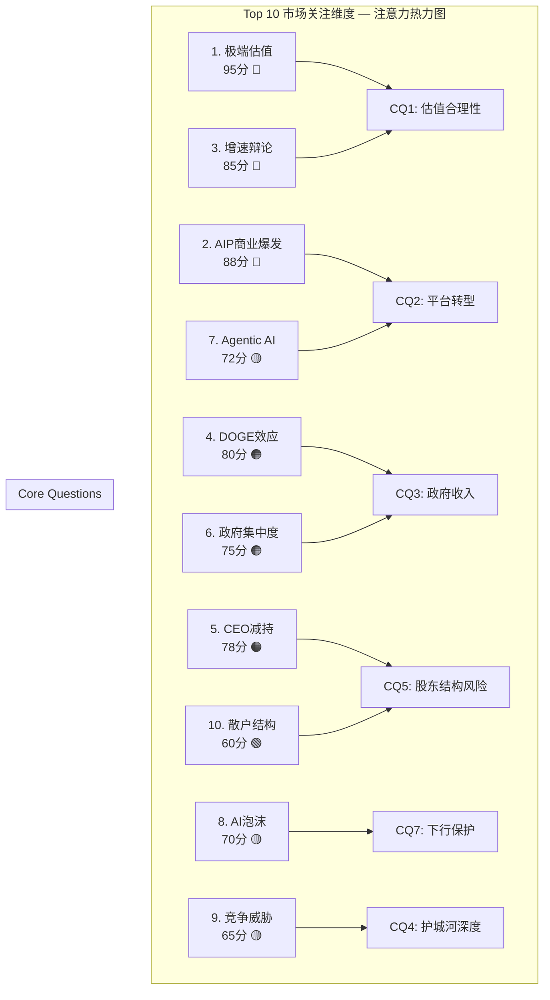
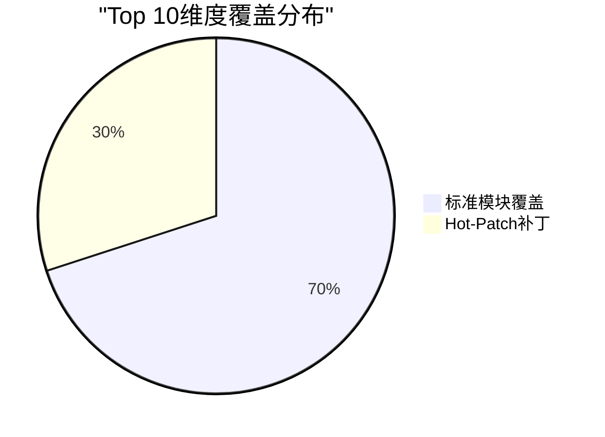
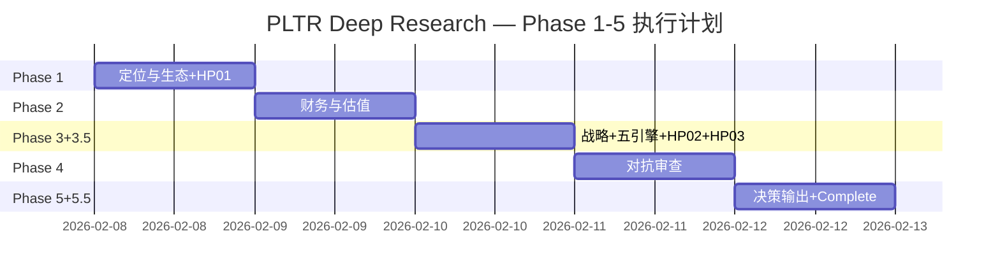

# PLTR Deep Research — Phase 0.5: 市场注意力雷达 + Core Questions
## 公司: Palantir Technologies Inc. | 日期: 2026-02-08 | 框架: v25.0

---

### 目录
- [1. 执行摘要](#1-执行摘要)
- [2. Top 10 市场关注维度](#2-top-10-市场关注维度)
- [3. Core Questions (7个)](#3-core-questions)
- [4. CQ-模块相关性矩阵](#4-cq-模块相关性矩阵)
- [5. 覆盖度分析](#5-覆盖度分析)
- [6. Hot-Patch模块规格](#6-hot-patch模块规格)
- [7. Phase 1-5 执行计划](#7-phase-1-5-执行计划)
- [8. 初始假设预注册 (KAL)](#8-初始假设预注册)
- [9. 数据源与方法论](#9-数据源与方法论)
- [免责声明](#免责声明)

---

## 1. 执行摘要

Palantir Technologies ($137.65, 2026-02-08) 正处于投资史上罕见的"基本面无可挑剔 vs 估值无法辩护"的极端张力点。Q4 2025营收$1.407B (+70% YoY)、美国商业+137%、Rule of 40=127的表现使其成为软件行业增长+利润率组合的历史最优之一 [硬数据: Palantir Q4 2025 Earnings, 2026-02-01]。然而P/E 216x、P/S 72x的估值水平使PLTR成为S&P 500中最昂贵的成分股 [硬数据: Yahoo Finance, 2026-02-08]。

**市场核心分裂**: 分析师目标价从$50 (RBC) 到$260 (Citi)，跨度5.2倍，反映市场对PLTR未来的根本性分歧。Q4业绩超预期后股价反而在一个月内下跌23%($181.68→$139.54)，市场用行动表明：**在当前倍数下，即便完美执行也不够** [硬数据: Trefis, 2026-02-05]。

**Phase 0.5产出**: 从5路并行WebSearch（分析师/多空/风险催化/散户情绪/行业趋势）中提取10个市场最关注维度，凝练为7个Core Questions，生成CQ-模块相关性矩阵和Phase 1-5完整执行计划。

---

## 2. Top 10 市场关注维度

**评分方法**: 注意力分 = 提及频率(0-50) × 来源权威性(0-2) × 争议程度(1-3)

| # | 市场关注维度 | 注意力分 | 5路Agent覆盖 | 覆盖模块 | 状态 |
|:---:|------------|:---:|------|:---:|:---:|
| 1 | **极端估值的可持续性** (P/S 72x, P/E 216x) | **95** | A+B+C+D+E | M06/M07/M08 | 已覆盖 |
| 2 | **AIP驱动的商业爆发** (US Commercial +137%) | **88** | A+B+C+E | TP01/M05 | 已覆盖 |
| 3 | **增速可持续性辩论** (公司61% vs Street 42%) | **85** | A+B+E | M05/M06 | 已覆盖 |
| 4 | **DOGE效应与联邦民用扩展** | **80** | B+C+D | — | **需Hot-Patch** |
| 5 | **CEO/内部人$2.2B持续减持** | **78** | A+B+C+D | — | **需Hot-Patch** |
| 6 | **政府收入集中度与国防预算重构** | **75** | C+E | M01/M05 | 已覆盖 |
| 7 | **Agentic AI与Ontology平台化路径** | **72** | B+E | M13/TP01 | 部分覆盖 |
| 8 | **AI泡沫破裂风险** (Polymarket 22%) | **70** | B+D+E | M03/M11 | 已覆盖 |
| 9 | **超大规模厂商+OpenAI竞争威胁** | **65** | B+E | M09/TP05 | 已覆盖 |
| 10 | **散户占比42-59%与"赢家疲劳"** | **60** | D+A | — | **需Hot-Patch** |

**覆盖率**: 7/10维度已有标准模块覆盖(70%)，3个维度需Hot-Patch补丁 → 补丁后覆盖率100%。

---

## 3. Core Questions

### CQ提取逻辑

Top 10维度 → 合并语义重叠 → 转化为可用数据回答的投资问题 → 7个CQ

---

### CQ1: 72倍P/S的估值溢价能否被持续高增长证明合理——还是PLTR已是AI泡沫的缩影？

**来源维度**: #1(估值) + #3(增速辩论) + #8(AI泡沫)
**注意力加权分**: 250/300 (Top 1)
**争议性**: 极高 — 分析师目标价$50~$260，跨度5.2倍 [硬数据: TipRanks/MarketBeat, 2026-02-08]
**可回答性**: 可通过DCF敏感性分析+历史SaaS估值回归+增速衰减模型量化回答
**初始假设**: 当前估值隐含FY2030营收$25-30B（当前$4.5B的5.5-6.7倍），需维持50%+ CAGR五年 [合理推断: 基于P/S 72x → 终局P/S 15x → 需5年5.5x收入增长]

---

### CQ2: AIP的商业化飞轮能否将PLTR从"政府承包商"转型为真正的"企业AI操作系统"平台？

**来源维度**: #2(AIP爆发) + #7(Agentic AI) + #3(增速)
**注意力加权分**: 232/300 (Top 2)
**争议性**: 高 — "平台 vs 咨询公司"辩论。前置部署工程师模式vs可扩展SaaS [硬数据: Seeking Alpha, 2026-02]
**可回答性**: 可通过NDR趋势、客户增速vs ARPU增速、Bootcamp转化率、行业垂直渗透数据部分回答
**初始假设**: AIP使TAM从$120B扩展至$500B+，Ontology层提供平台级锁定（转换成本$2.5-7.5M/客户）[硬数据: Seeking Alpha/Medium, 2026-02]

---

### CQ3: DOGE+国防预算重构对PLTR的政府收入是净正面还是净负面？

**来源维度**: #4(DOGE) + #6(政府集中度)
**注意力加权分**: 155/300
**争议性**: 高 — PLTR既是政府效率工具(受益)又依赖政府合同(受害) [硬数据: The Hill/Fortune, 2026-02]
**可回答性**: 可通过具体合同分析+DOGE削减范围+国防AI预算走向回答
**初始假设**: PLTR是DOGE净受益者（IRS Mega API合同+$900M联邦合同），但面临政策反转风险 [硬数据: US Treasury, 2025-09]

---

### CQ4: 面对超大规模厂商(MSFT/AWS/GOOG)和OpenAI进入企业AI市场，PLTR的护城河是否足够深？

**来源维度**: #9(竞争威胁) + #7(Agentic AI)
**注意力加权分**: 137/300
**争议性**: 中高 — Ontology独特性vs Fabric/Bedrock商品化 [硬数据: Gartner/PYMNTS, 2026]
**可回答性**: 可通过护城河量化框架(转换成本+安全审查+NDR+专利)回答
**初始假设**: 政府安全壁垒(FedRAMP/IL5/IL6)是不可复制的核心护城河，商业市场护城河随竞争加剧而弱化 [硬数据: Palantir filings]

---

### CQ5: CEO三年$2.2B减持+散户占比42-59%的股东结构，意味着什么样的风险配置？

**来源维度**: #5(CEO减持) + #10(散户结构)
**注意力加权分**: 138/300
**争议性**: 中 — 10b5-1预设计划vs高位大量套现信号 [硬数据: Motley Fool/Benzinga, 2026-02]
**可回答性**: 可通过历史内部人交易分析+股东结构稳定性评估+类比案例回答
**初始假设**: 散户高占比增加波动性，CEO减持在当前估值下是理性行为但加剧market risk [合理推断: 基于42-59%散户占比数据]

---

### CQ6: 国际商业增长仅2% vs 美国109%——PLTR的增长模型是全球化可复制的还是美国特例？

**来源维度**: #2(AIP) + #3(增速辩论)
**注意力加权分**: 100/300
**争议性**: 中 — 管理层承认国际增长"落后" [硬数据: Palantir Q4 2025 Earnings]
**可回答性**: 可通过国际合同管线、AIP Bootcamp海外推广进度、文化/监管障碍分析回答
**初始假设**: 国际增长受制于GDPR/本地化要求/缺乏政府关系，但Sovereign AI合作+HD Hyundai可能是拐点 [合理推断: 2%增速+新合作对照]

---

### CQ7: 如果AI叙事周期转向或宏观衰退(27%概率)冲击，PLTR的估值安全边际在哪里？

**来源维度**: #8(AI泡沫) + #1(估值)
**注意力加权分**: 165/300
**争议性**: 高 — 22%概率AI行业年底衰退 + 27%概率美国衰退 [硬数据: Polymarket, 2026-02-08]
**可回答性**: 可通过压力测试(30x/20x/15x P/S情景)+FCF支撑估值底+历史SaaS熊市回撤幅度回答
**初始假设**: 极端熊市(P/S压缩至20x + 增速降至30%)对应$50-70/股(当前-50~64%) [合理推断: $7.19B×20x/2.549B股=$56.4]

---

### CQ质量检验矩阵

| CQ | 具体性 | 争议性 | 可回答性 | 通过 |
|:---:|:---:|:---:|:---:|:---:|
| CQ1 估值合理性 | 指向P/S, P/E, DCF | 目标价$50-$260 | DCF+历史回归 | PASS |
| CQ2 平台转型 | 指向NDR, TAM, 客户数 | 平台vs咨询辩论 | NDR+Bootcamp数据 | PASS |
| CQ3 政府收入 | 指向DoD合同, DOGE | 受益vs受害 | 合同管线+预算 | PASS |
| CQ4 护城河 | 指向Ontology, FedRAMP | 竞争动态变化 | 护城河量化框架 | PASS |
| CQ5 股东结构 | 指向减持规模, 散户% | 信号含义争议 | 历史对比+波动分析 | PASS |
| CQ6 国际增长 | 指向2% vs 109% | 可复制性分歧 | 合同管线+文化分析 | PASS |
| CQ7 下行保护 | 指向FCF底, P/S底 | 安全边际争议 | 压力测试可量化 | PASS |

**7/7 CQ全部通过三项检验。**

---

## 4. CQ-模块相关性矩阵

### 4.1 标准模块 + 科技平台模块

|  | CQ1 估值 | CQ2 平台 | CQ3 政府 | CQ4 护城河 | CQ5 股东 | CQ6 国际 | CQ7 下行 | 最高分 | 执行深度 |
|--|:---:|:---:|:---:|:---:|:---:|:---:|:---:|:---:|------|
| **M01** 公司画像 | 1 | 2 | 2 | 1 | 1 | 2 | 0 | 2 | 聚焦 |
| **M02** 产业链 | 0 | 3 | 2 | 2 | 0 | 1 | 0 | 3 | **完整** |
| **M03** 预测市场 | 2 | 0 | 2 | 0 | 0 | 0 | 3 | 3 | **完整** |
| **M04** 周期定位 | 2 | 1 | 1 | 0 | 0 | 0 | 2 | 2 | 聚焦 |
| **M05** 财务深度 | 3 | 2 | 2 | 0 | 0 | 2 | 2 | 3 | **完整** |
| **M06** SOTP估值 | 3 | 2 | 1 | 0 | 0 | 1 | 3 | 3 | **完整** |
| **M07** DCF | 3 | 1 | 0 | 0 | 0 | 0 | 3 | 3 | **完整** |
| **M08** 可比估值 | 3 | 1 | 0 | 1 | 0 | 0 | 3 | 3 | **完整** |
| **M09** 护城河 | 1 | 3 | 1 | 3 | 0 | 1 | 1 | 3 | **完整** |
| **M10** 五引擎 | 1 | 1 | 1 | 1 | 2 | 0 | 2 | 2 | 聚焦 |
| **M11** PPDA | 2 | 0 | 1 | 0 | 0 | 0 | 3 | 3 | **完整** |
| **M12** PMSI | 1 | 0 | 0 | 0 | 2 | 0 | 2 | 2 | 聚焦 |
| **M13** AI冲击矩阵 | 1 | 3 | 1 | 2 | 0 | 1 | 1 | 3 | **完整** |
| **M14** 注意力雷达 | 1 | 1 | 1 | 1 | 1 | 1 | 1 | 1 | 本Phase |
| **TP01** 平台经济学 | 1 | 3 | 0 | 3 | 0 | 2 | 0 | 3 | **完整** |
| **TP02** 广告经济学 | 0 | 0 | 0 | 0 | 0 | 0 | 0 | 0 | 跳过 |
| **TP03** 云基础设施 | 0 | 2 | 0 | 2 | 0 | 0 | 0 | 2 | 聚焦 |
| **TP04** 监管反垄断 | 0 | 0 | 2 | 0 | 0 | 1 | 1 | 2 | 聚焦 |
| **TP05** 开发者生态 | 0 | 2 | 0 | 2 | 0 | 1 | 0 | 2 | 聚焦 |
| **TP06** 数据护城河 | 1 | 2 | 1 | 3 | 0 | 0 | 0 | 3 | **完整** |

### 4.2 Hot-Patch模块

| 模块 | 对应维度 | CQ关联 | 执行Phase | 字符目标 |
|------|---------|--------|----------|---------|
| **HP01** DOGE效应与联邦民用扩展 | #4 | CQ3 | Phase 1 | 2,500 |
| **HP02** CEO减持+股东结构风险 | #5+#10 | CQ5 | Phase 3 | 2,000 |
| **HP03** Agentic AI深度路径 | #7 | CQ2+CQ4 | Phase 3.5 | 2,500 |

### 4.3 模块执行统计

| 深度 | 模块数 | 占比 |
|------|:---:|:---:|
| 完整展开 (≥2,000字) | 11 | 52% |
| 聚焦核心 (500-1,000字) | 7 | 33% |
| 跳过 | 1 (TP02) | 5% |
| Hot-Patch | 3 | 14% |
| **合计** | **22** | — |

---

## 5. 覆盖度分析

| 维度 | 覆盖方案 | 执行Phase | 覆盖确认 |
|------|---------|----------|---------|
| #1 估值 | M06+M07+M08 | Phase 2 | 已覆盖 |
| #2 AIP | TP01+M05+M09 | Phase 1+2 | 已覆盖 |
| #3 增速 | M05+M06 | Phase 2 | 已覆盖 |
| #4 DOGE | **HP01** | Phase 1 | Hot-Patch |
| #5 CEO减持 | **HP02** | Phase 3 | Hot-Patch |
| #6 政府 | M01+M05+TP04 | Phase 1+2 | 已覆盖 |
| #7 Agentic AI | M13+**HP03** | Phase 3.5 | Hot-Patch |
| #8 AI泡沫 | M03+M11 | Phase 1+3 | 已覆盖 |
| #9 竞争 | M09+TP05+TP06 | Phase 3 | 已覆盖 |
| #10 散户 | **HP02**+M10+M12 | Phase 3 | Hot-Patch |

**补丁后覆盖率: 10/10 = 100%** ✅

---

## 6. Hot-Patch模块规格

### HP01: DOGE效应与联邦民用扩展 (Phase 1, ≥2,500字)

**核心问题**: PLTR是DOGE改革的核心执行工具还是政府紧缩的牺牲品？

**必须覆盖**:
1. IRS Mega API合同细节 — Foundry作为"所有IRS系统的读取中心"
2. Treasury统一API层合同 ($900M+ 联邦合同)
3. DOGE削减范围与PLTR合同的重叠/互斥分析
4. 政策风向变化风险（隐私诉讼 + 国会审查）
5. 联邦民用市场TAM vs 传统国防市场

**数据需求**: DOGE削减清单 + PLTR联邦合同清单 + 隐私诉讼进展
**CQ映射**: CQ3 (政府收入净效应)
**来源**: [硬数据: The Hill 2026-02, US Treasury 2025-09, Wired/Techmeme 2025-04]

---

### HP02: CEO减持+股东结构风险分析 (Phase 3, ≥2,000字)

**核心问题**: Karp三年$2.2B减持+散户42-59%占比的组合意味着什么？

**必须覆盖**:
1. Karp减持时间线与股价对应关系
2. 10b5-1计划详情 vs 临时交易对比
3. 散户占比与波动性的相关性分析
4. Michael Burry $912M put position的信号含义
5. 历史类比：高散户占比+高估值股票的结局分布

**数据需求**: SEC Form 4详情 + 散户持仓占比时间序列 + 做空数据
**CQ映射**: CQ5 (股东结构风险)
**来源**: [硬数据: Motley Fool 2026-02-06, WallStreetZen 2026-02-04, Sherwood 2025-11]

---

### HP03: Agentic AI深度路径 (Phase 3.5, ≥2,500字)

**核心问题**: PLTR的Ontology+AIP架构在Agentic AI时代是否具有平台级护城河？

**必须覆盖**:
1. Agentic AI三大能力层(数据接入+操作执行+治理安全)与PLTR产品映射
2. Gartner预测(2026年底40%企业应用集成AI Agent)的PLTR受益量化
3. OpenAI企业Agent平台 vs AIP的竞争对比
4. "Agentic AI Hives"产品定位与技术路线
5. Ontology作为"Agent操作系统"的网络效应分析

**数据需求**: Agentic AI市场规模 + PLTR AIP案例 + OpenAI企业进展
**CQ映射**: CQ2 (平台转型) + CQ4 (护城河)
**来源**: [硬数据: Gartner 2025-08, G2 2025-08, PYMNTS 2026]

---

## 7. Phase 1-5 执行计划

### Phase 1: 定位与生态 (≥20,000字符)

**Agent分配** (4路并行):

| Agent | 模块 | 字符目标 | CQ服务 |
|-------|------|---------|--------|
| Agent α | M01公司画像 + HP01 DOGE效应 | 6,000 | CQ3, CQ6 |
| Agent β | M02产业链映射 + M03预测市场 | 6,000 | CQ7, CQ3 |
| Agent γ | TP01平台经济学 + TP06数据护城河 | 5,000 | CQ2, CQ4 |
| Agent δ | M04周期定位 + M14注意力雷达呈现 | 4,000 | CQ1, CQ7 |

**门控**: QG-01(画像≥3000字) + QG-02(产业链≥10节点) + QG-03(预测市场≥8事件+Top10覆盖计划)

---

### Phase 2: 财务与估值 (≥25,000字符)

**Agent分配** (4路并行):

| Agent | 模块 | 字符目标 | CQ服务 |
|-------|------|---------|--------|
| Agent α | M05财务深度(5年趋势+分部拆解) | 8,000 | CQ1, CQ2, CQ6 |
| Agent β | M06 SOTP估值(4分部+工作底稿) | 7,000 | CQ1, CQ7 |
| Agent γ | M07 DCF + M08可比估值 | 6,000 | CQ1, CQ7 |
| Agent δ | 三情景矩阵 + 资本配置 + SBC分析 | 5,000 | CQ1, CQ5 |

**门控**: QG-04(周期≥4信号) + QG-05(SOTP覆盖≥90%营收) + QG-06(三估值偏离<20%)

**特别注意**: SOTP三步验证流程(段值→汇总→每股)，反幻觉重点区域

---

### Phase 3+3.5: 战略分析+AI深度 (≥35,000字符)

**Agent分配** (5路并行):

| Agent | 模块 | 字符目标 | CQ服务 |
|-------|------|---------|--------|
| Agent α | M09护城河量化(Ontology/安全/NDR/专利) | 7,000 | CQ4 |
| Agent β | M10五引擎协同 + M11 PPDA + M12 PMSI | 8,000 | CQ7, CQ5 |
| Agent γ | TP05开发者生态 + HP02股东结构 | 5,000 | CQ4, CQ5 |
| Agent δ | M13 AI冲击矩阵(4分部) + HP03 Agentic AI | 8,000 | CQ2, CQ4 |
| Agent ε | TP03云基础设施 + TP04监管 + 竞争对手深度 | 7,000 | CQ3, CQ4, CQ9 |

**门控**: QG-07(护城河量化) + QG-08(五引擎各≥3000字) + QG-09(PPDA≥3背离) + QG-09.5(AI矩阵覆盖≥90%营收)

---

### Phase 4: 对抗审查 (≥15,000字符)

**Agent分配** (3路并行):

| Agent | 模块 | 字符目标 | CQ服务 |
|-------|------|---------|--------|
| Agent α (Bear Advocate, 独立) | 看空等权分析(≥8论点) + 压力测试 | 8,000 | CQ1, CQ7 |
| Agent β | 行为金融偏差检查 + 事实核查≥10点 | 4,000 | 全CQ |
| Main Thread | 反证挑战 + 维度回检 + So What抽查 | 4,000 | 全CQ |

**Bear Advocate独立性**: Agent α不读shared_context中的看多结论，仅读DM锚点+CQ+公开数据

**门控**: QG-10(四偏差+修正) + QG-11(核查≥10+反证≥3+维度100%) + 看空≥30%总篇幅 + P-G≥8 + R-G≥7

---

### Phase 5+5.5: 决策输出+Complete组装 (≥34,000字符)

**Agent分配** (3路并行):

| Agent | 模块 | 字符目标 | CQ服务 |
|-------|------|---------|--------|
| Agent α | 综合评分(10维度) + 仓位建议(5档) + CQ最终解答 | 12,000 | 全CQ |
| Agent β | Kill Switch注册表(≥15个,10字段) + 投资日历 | 10,000 | CQ1-7 |
| Agent γ | 可验证预测(≥20个,三情景) + 90天行动清单 + 最终SOTP | 12,000 | CQ1, CQ7 |

**Phase 5.5 Complete组装** (主线程):
1. 合并Phase 0.5 → 1 → 2 → 3+3.5 → 4 → 5
2. 统一TOC
3. 运行 `tests/quality_gate_complete.sh`
4. 11项CG全部通过 → git commit

**门控**: QG-12(KS≥15/VP≥20/评分≥8维度/CQ≥5闭环) + Complete QG 11/11

---

### 字符预算总表

| Phase | 字符目标 | 模块数 | Agent数 | CQ覆盖 |
|-------|---------|:---:|:---:|------|
| 0.5 | ~8,000 | 1 (M14) | 5 WebSearch | 全部 |
| 1 | ≥20,000 | 6+HP01 | 4 | CQ2,3,4,6,7 |
| 2 | ≥25,000 | 5 | 4 | CQ1,2,5,6,7 |
| 3+3.5 | ≥35,000 | 8+HP02+HP03 | 5 | CQ2,4,5,7 |
| 4 | ≥15,000 | 4 | 3 | 全部 |
| 5 | ≥34,000 | 6 | 3 | 全部 |
| **合计** | **≥137,000** | **30+** | **24** | — |

**目标 vs 基准**: 137K > 119K (科技平台系数×1.4) ✅

---

## 8. 初始假设预注册

以下假设基于Phase 0.5发现预注册到KAL，待后续Phase验证:

| ID | 假设 | 类型 | 级别 | 来源 | 注册Phase | 验证Phase |
|:---:|------|:---:|:---:|------|:---:|:---:|
| KA-001 | FY2026营收达$7.19B(+61%)，管理层指引可信 | 增长 | A | [DM-GRW-001] | 0.5 | 2 |
| KA-002 | 美国商业将保持100%+ YoY至少到FY2026H1 | 增长 | A | [DM-GRW-002] | 0.5 | 2 |
| KA-003 | 当前P/S 72x隐含FY2030营收$25-30B | 估值 | A | [合理推断] | 0.5 | 2 |
| KA-004 | Ontology转换成本$2.5-7.5M/客户，支撑NDR>130% | 竞争 | A | [硬数据: Seeking Alpha] | 0.5 | 3 |
| KA-005 | DOGE对PLTR是净受益(联邦民用扩展>预算削减风险) | 宏观 | B | [硬数据: The Hill] | 0.5 | 1 |
| KA-006 | 国际商业增速将从2%加速至20%+(Sovereign AI+HD Hyundai) | 增长 | B | [合理推断] | 0.5 | 2 |
| KA-007 | AI泡沫概率22%，但PLTR基于FCF的估值底在$50-70区间 | 风险 | A | [硬数据: Polymarket] | 0.5 | 4 |

**状态: 全部待验证**

---

## 9. 数据源与方法论

### 9.1 数据采集方法

| 路径 | Agent | 搜索次数 | 独立来源数 |
|------|-------|---------|----------|
| 分析师报告 | Agent A | 8 | 15+ |
| 多空争论 | Agent B | 7 | 12+ |
| 风险催化 | Agent C | 5 | 10+ |
| 散户情绪 | Agent D | 4 | 17+ |
| 行业趋势 | Agent E | 7 | 12+ |
| **合计** | **5 Agent** | **31** | **60+** |

### 9.2 关键数据源

**硬数据来源**:
- Palantir Q4 2025 Earnings Release (BusinessWire, 2026-02-01)
- Palantir 10-K FY2024 (SEC Filing)
- Polymarket预测市场数据 (2026-02-08)
- CDO Magazine / MeriTalk (DoD FY2026预算)
- Gartner (Agentic AI预测, 2025-08)
- TipRanks / MarketBeat (分析师共识)
- WallStreetZen / TickerGate (股东结构)
- CNBC / Seeking Alpha / Motley Fool (新闻与分析)

### 9.3 Phase 0数据可用性

| 数据文件 | 状态 | 字符数 |
|----------|:---:|:---:|
| stock_full.json | ✅ | 3,151 |
| business_overview.json | ✅ | 9,811 |
| competitive_landscape.json | ✅ | 10,411 |
| prediction_market_data.json | ✅ | 8,247 |
| agent_c_news_catalysts.json | ✅ | 13,462 |
| market_context.json | ✅ | 684 |
| peer_comparison.json | ✅ | 968 |
| financial_statements.json | ❌ | 缺失 |
| insider_trading.json | ❌ | 缺失 |
| institutional_holders.json | ❌ | 缺失 |
| analyst_estimates.json | ❌ | 缺失 |
| earnings_history.json | ❌ | 缺失 |
| technical_indicators.json | ❌ | 缺失 |
| prefetch_metadata.json | ❌ | 缺失 |
| **合计** | **7/14** | **46,734** |

**评估**: 7/14文件可用(50%)，低于标准(≥8/14)。但核心数据(财务/分部/竞争/预测市场/新闻)全部可用，缺失项可通过Phase 1-2的WebSearch补充。

---

## 免责声明

本报告为投资研究参考，不构成投资建议。所有数据基于公开来源，可能存在延迟或误差。投资者应基于自身判断和风险承受能力做出投资决策。Palantir Technologies是高波动性股票，过去表现不代表未来结果。

---

*Phase 0.5 完成 | 编译时间: 2026-02-08 | 框架: v25.0 | 5路Agent×31次搜索×60+独立来源*
