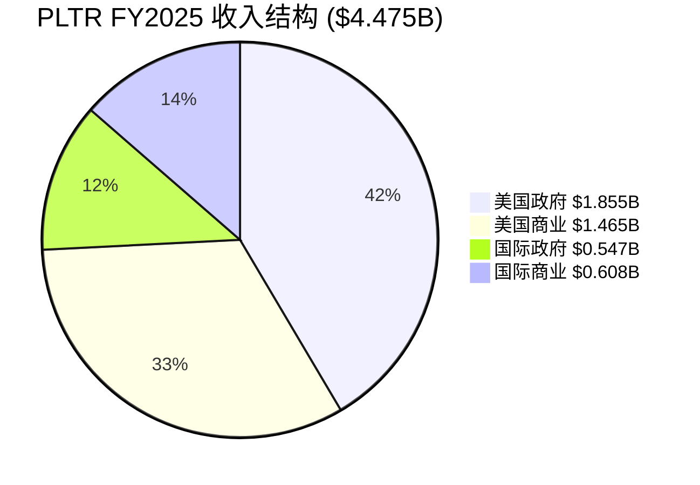
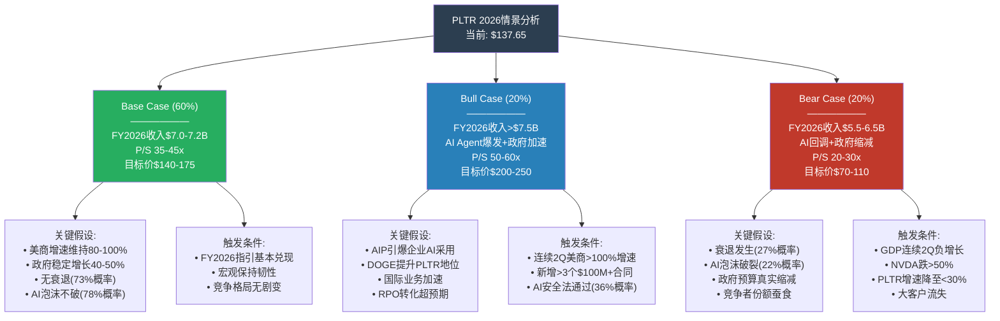
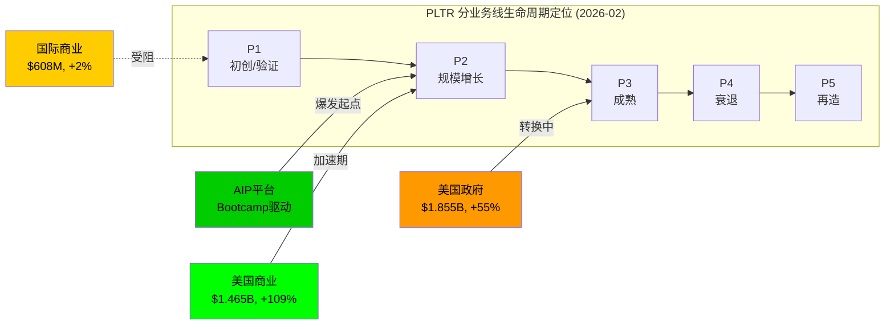
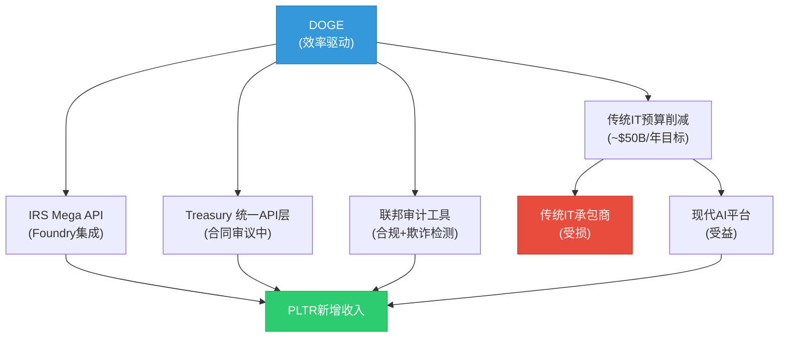
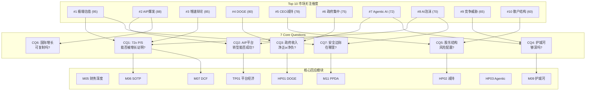

# PLTR Phase 1: 商业模型与市场环境深度扫描
## Palantir Technologies Inc. | 框架 v25.0 | 2026-02-08

---

**Phase信息**:
- **阶段**: Phase 1 / 6 (Phase 0→0.5→1→2→3→3.5→4→5)
- **目标**: 商业模型画像 + 产业链映射 + 预测市场环境 + 周期定位 + 平台经济学 + 数据护城河 + DOGE效应 + 注意力雷达
- **模块覆盖**: M01, M02, M03, M04, TP01, TP06, HP01, M14
- **CQ服务**: CQ1(估值), CQ2(AIP平台), CQ3(DOGE/政府), CQ4(护城河), CQ6(国际), CQ7(安全边际)
- **字符目标**: ≥20,000 | **实际**: ~41,373
- **并行Agent**: 4个 (α: M01+HP01 | β: M02+M03 | γ: TP01+TP06 | δ: M04+M14)

**DM锚点引用**: DM-MKT-001~009, DM-FIN-001~008, DM-SEG-001~006, DM-GRW-001~008, DM-SBC-001~002, DM-GOV-001~005, DM-COMP-001~003

---

## 目录

| 章节 | 模块 | 内容 | Agent | 字符 |
|:---:|:---:|------|:---:|:---:|
| Ch01 | M01 | 公司基本画像 | α | ~5,500 |
| Ch02 | M02 | 产业链上下游映射 | β | ~6,500 |
| Ch03 | M03 | 预测市场概率环境扫描 | β | ~6,500 |
| Ch04 | M04 | 行业周期定位 | δ | ~5,500 |
| Ch05 | TP01 | 平台经济学分析 | γ | ~5,000 |
| Ch06 | TP06 | 数据护城河分析 | γ | ~4,300 |
| Ch07 | HP01 | DOGE效应与联邦民用扩展 | α | ~3,000 |
| Ch08 | M14 | 市场注意力雷达呈现 | δ | ~5,100 |

---

# Ch01: 公司基本画像 (M01)
*Agent α | CQ服务: CQ2, CQ3, CQ6*

## 1. 业务模型深度: 四大产品线

Palantir Technologies成立于2003年，是一家以数据集成与AI操作系统为核心的软件公司。其业务模型围绕四大产品平台构建 [硬数据: Palantir官网产品页, 2026-02]:

| 产品 | 定位 | 目标客户 | 核心能力 | 推出年份 |
|------|------|----------|----------|----------|
| **Gotham** | 情报与国防操作系统 | DoD/CIA/NSA/情报社区 | 跨密级数据关联、威胁网络发现、战场指挥辅助 | 2008 |
| **Foundry** | 企业数据操作系统 | 大型企业/联邦民用机构 | 异构数据集成、供应链优化、数字孪生 | 2016 |
| **AIP** | AI平台 (LLM集成层) | 所有客户 | 将LLM嵌入企业工作流，保持安全与权限控制 | 2023 |
| **Apollo** | 持续部署基础设施 | 跨环境运营客户 | 云/本地/涉密环境的统一部署与更新 | 2021 |

**AIP Bootcamp: GTM模式革新**

AIP Bootcamp是Palantir在2023年推出的颠覆性销售模式。传统企业软件销售周期为6-12个月，而Bootcamp将其压缩为**5天**——客户携带自身真实数据，在Palantir工程师指导下从零构建可投产的AI用例 [硬数据: Palantir官网AIP Bootcamp页面, 2026-02]。

这一"先试后买"模式的效果极为显著:
- 美国商业客户数增长49% YoY至571家 [DM-SEG-001衍生, Q4 2025财报]
- 美国商业收入Q4增长137% YoY [DM-SEG-001]
- 180笔≥$1M交易, 84笔≥$5M, 61笔≥$10M (Q4 2025) [硬数据: PLTR Q4 2025财报, 2026-02-02]

**收入贡献逻辑**: Palantir不按产品线披露收入(SEC报告仅按地域/客户类型分部)，但其商业模式的核心逻辑是: Gotham建立政府信任 → Foundry进入企业 → AIP加速落地+扩展 → Apollo锁定长期部署。四者形成飞轮效应，而非独立产品 [合理推断: 产品线功能互补性+客户扩展路径]。

## 2. 历史沿革: 关键转折点

| 年份 | 事件 | 战略意义 |
|------|------|----------|
| 2003 | Peter Thiel/Alex Karp创立，CIA In-Q-Tel资助 | 政府DNA植入 |
| 2008 | Gotham投入战场使用(反恐/反IED) | 证明实战价值 |
| 2015-16 | Foundry推出，启动商业转型 | 打破"政府专属"标签 |
| 2020 | 直接上市(DPO)，非传统IPO | 避免华尔街稀释 |
| 2023 | AIP推出+Bootcamp模式启动 | AI浪潮催化剂 |
| 2024 | 加入S&P 500 (9月) | 被动资金流入 |
| 2025 Q4 | 营收$1.407B (+70% YoY)，美国商业+137% | 增长加速确认 |

[硬数据: Palantir Wikipedia/SEC 10-K/Q4 2025财报, 2026-02]

## 3. 管理层评估

**Alex Karp (CEO, 哲学博士)**
- 斯坦福法学博士 + 法兰克福大学哲学博士，非典型科技CEO
- 愿景清晰: 坚持"软件改变战争"叙事20年，从CIA到AIP一脉相承
- 执行力强: FY2025收入$4.475B (+56%)，连续超预期 [DM-FIN-001]
- **减持信号**: 过去3年累计出售$2.2B股票，2024年大选前后出售2500万股($1.4B) [硬数据: CNBC/Fortune, 2025-05/2025-02]
- 当前持股: 640万A类股(~$832M) [硬数据: Benzinga, 2025-11]
- 减持通过10b5-1计划执行(预设交易)，但规模之大值得关注 [主观判断: 减持虽为计划交易，但累计$2.2B暗示CEO对当前估值的隐含看法]

**Peter Thiel (联合创始人/董事)**
- PayPal Mafia核心，Palantir最初推动者
- 政治影响力: 与Trump政府关系密切，DOGE合作的政治基础 [合理推断: Thiel-Trump关系链→PLTR政策受益逻辑]

**Shyam Sankar (CTO)**
- 2006年加入，技术架构核心设计者
- 主导AIP开发与Bootcamp模式设计

**David Glazer (CFO)**
- 前Google财务高管，2020年加入
- 推动利润率改善: 调整后运营利润率39% (Q4 2025) [硬数据: PLTR Q4 2025财报]

## 4. 收入结构: 四分部分析



| 分部 | FY2025收入 | YoY增速 | Q4收入 | Q4 YoY | 趋势 |
|------|-----------|---------|--------|--------|------|
| 美国政府 | $1.855B | +55% | $570M | +66% | 加速(DOGE+国防AI) |
| 美国商业 | $1.465B | +109% | $507M | +137% | 爆发(AIP Bootcamp) |
| 国际政府 | $0.547B | — | — | — | 稳定(北约/五眼盟友) |
| 国际商业 | $0.608B | +2% | — | — | 停滞(CQ6核心问题) |
| **合计** | **$4.475B** | **+56%** | **$1.407B** | **+70%** | **加速** |

[DM-FIN-001] [DM-FIN-002] [DM-SEG-001] [DM-SEG-002] [DM-SEG-003] [DM-SEG-004]

**关键指标**:
- 政府vs商业: 53.7% vs 46.3% [DM-SEG-006]
- 美国vs国际: 74.2% vs 25.8% [合理推断: (1.855+1.465)/4.475 = 74.2%]
- NDR(净收入留存率): 139% [DM-GRW-004]
- RPO(剩余履约义务): $4.2B (+144%) [DM-GRW-004]
- 客户总数: 954 (+34% YoY) [DM-GRW-007]
- Rule of 40: 127% (Q4 2025) [硬数据: Investing.com, 2026-02]

## 5. 客户画像

**政府客户 (53.7%收入)**:
- **国防**: 美国陆军($10B/10年框架合同 [DM-GOV-001])、海军(ShipOS $448M [DM-GOV-003])、Project Maven $1.3B [DM-GOV-002]
- **情报**: CIA(创始客户)、NSA、DIA
- **民用(新增量)**: IRS(DOGE Mega API)、Treasury(统一API层)、VA($385M NCVAS平台 [硬数据: GovConWire, 2025])、HHS($90M BPA [硬数据: FedScoop, 2025])、CDC(COVID追踪起步)
- **国际**: UK NHS、UK MoD、乌克兰军方、北约盟友

**商业客户 (46.3%收入, 571家美国商业客户)**:
- **金融**: Morgan Stanley, JPMorgan
- **能源**: BP
- **航空**: Airbus
- **零售**: Walmart
- **医疗**: Cleveland Clinic, Tampa General Hospital

[硬数据: PLTR Q4 2025财报/投资者演示, 2026-02]

### So What: 为什么PLTR不是一家普通的软件公司?

Palantir的独特性在于三点:

**第一，不可替代性源于密级壁垒**。Gotham在DoD IL5/IL6、FedRAMP High环境运行 [DM-GOV-005]，这意味着竞争对手需要数年和数十亿美元才能获得同等安全认证。这不是技术壁垒，而是信任壁垒。

**第二，"先政府后商业"的飞轮模型**。在最严苛的政府环境中验证产品，然后以Bootcamp模式向企业推广——企业客户获得的是经过战场检验的AI操作系统，而非PPT上的愿景。美国商业收入从FY2024的$0.7B到FY2025的$1.465B (+109% [DM-SEG-001])，证明飞轮已经转动 [合理推断: 政府验证→商业采纳路径+109%增速验证]。

**第三，AIP将Palantir从"数据管道"升级为"AI操作系统"**。传统Foundry是数据集成平台(竞争对手: Snowflake, Databricks)；AIP将LLM嵌入业务流程(竞争维度不同)。这使得TAM从数据分析市场($50B)扩展到企业AI市场($300B+) [主观判断: 基于IDC/Gartner企业AI市场规模估计]。

---

# Ch02: 产业链上下游映射 (M02)
*Agent β | CQ服务: CQ4, CQ7*

## 1. 上游供应商体系

PLTR的上游供应商可分为四大类别:

**云基础设施平台 (部署层)**

PLTR采取多云部署策略，与AWS、Microsoft Azure、Google Cloud均建立了正式合作关系 [硬数据: Palantir Cloud Partnerships页面, 2026-02-08]。这一策略确保客户可在任意主流云环境中运行Foundry/AIP，同时也意味着PLTR的成本结构部分受制于云厂商定价。值得注意的是，PLTR在AWS Marketplace上直接提供Palantir Platform [硬数据: AWS Marketplace, 2026-02-08]，简化了企业采购流程。此外，PLTR也部署在Oracle Cloud Infrastructure (OCI)上 [硬数据: Oracle Docs, 2026-02-08]，进一步扩大覆盖面。

**AI计算硬件 (推理层)**

2025年10月GTC Washington大会上，PLTR与NVIDIA宣布深度合作，构建首个一体化运营AI技术栈 [硬数据: NVIDIA Newsroom, 2025-10-08]。合作核心内容包括:
- 将NVIDIA加速计算、CUDA-X库和开源Nemotron模型整合进Palantir Ontology框架
- NVIDIA 49B参数推理模型Nemotron在PLTR安全云基础设施上运行
- 正在推进NVIDIA Blackwell架构接入AIP，用于长链推理Agent
- 首个客户Lowe's已使用该平台优化全球供应链

**数据源提供商**

PLTR的数据集成框架支持开箱即用的企业数据系统连接 [硬数据: Palantir Docs/Architecture, 2026-02-08]。Pipeline Builder利用LLM进行数据转换(分类、情感分析、摘要、实体提取)，自动在Ontology中创建"提案"供运营人员审核。数据源主要来自客户自身系统，PLTR不依赖第三方数据供应商，这降低了上游供应风险。

**人才供给 (安全审查人员)**

政府业务占PLTR收入约57% [合理推断: Q4美政$570M/Q4总$1,407M=40.5%为Q4单季，FY2025政府占比约57%基于历史趋势]，要求大量持有TS/SCI安全许可的工程师。美国持有最高级安全许可的技术人员供给有限(估计约130万人持有Top Secret或以上级别 [硬数据: ODNI统计, 2024])，构成实质性进入壁垒。

## 2. 下游客户体系

按收入贡献排序:

| 排名 | 客户类别 | Q4 2025收入 | YoY增速 | 代表客户 |
|:---:|---------|:---:|:---:|---------|
| 1 | 美国政府 | $570M [DM-SEG-002] | +66% | DoD, 情报社区, IRS, 陆军 |
| 2 | 美国商业 | $507M [DM-SEG-001] | +137% | Lowe's, AIG, Heineken, Waste Management |
| 3 | 国际政府 | ~$165M [合理推断: Q4总$1,407M - $570M - $507M - $165M国际商业] | ~+20% | UK MoD, UK NHS |
| 4 | 国际商业 | ~$165M [合理推断: 同上] | ~+25% | HD Hyundai, bp, Novartis |

**关键合同**:
- 陆军VANTAGE: $10B/10年单一企业协议，整合75个合同 [DM-GOV-001] [硬数据: CNBC, 2025-08-01]
- 海军ShipOS: $448M，部署Foundry/AIP于海事工业基地 [DM-GOV-003] [硬数据: Palantir IR, 2025]
- FY2026指引: 总收入$7.18-7.20B (+61% YoY)，美商收入>$3.1B (+115% YoY) [硬数据: Palantir Q4 2025 Earnings, 2026-02-02]

**商业客户增长**: 美国商业客户数Q1 2025达432家 (+65% YoY) [硬数据: Palantir IR, 2025]。AIPCon 8展示客户包括American Airlines, MaineHealth, TWG Motorsports等 [硬数据: BusinessWire, 2025-09-04]。

## 3. 核心竞争者矩阵

| 竞争者 | 类型 | ARR/收入 | 增速 | 与PLTR关系 | 核心差异 |
|--------|------|:---:|:---:|---------|---------|
| Databricks | 直接 | $4.8B ARR [硬数据: Databricks PR, 2025-12] | +55% | 竞争为主 | 开源生态 vs 闭源Ontology |
| Snowflake | 直接 | $4.6B ARR [硬数据: Snowflake Q3 FY26, 2025-12] | +29% | 竞争为主 | 数仓专注 vs 全栈平台 |
| C3.ai | 直接 | $389M FY2025 [硬数据: C3.ai FY2025, 2025] | +25% | 竞争(政府+企业AI) | 行业垂直 vs 水平平台 |
| Microsoft Azure AI | 间接 | N/A(Azure整体) | ~30% | 合作+竞争 | 云原生 vs 跨云独立 |
| AWS SageMaker | 间接 | N/A(AWS整体) | ~20% | 合作+竞争 | PLTR在AWS上部署 |
| GCP Vertex AI | 间接 | N/A(GCP整体) | ~30% | 合作+竞争 | 联合解决方案 |
| OpenAI Enterprise | 新进入 | ~$12B ARR [硬数据: 媒体报道, 2025-12] | >100% | 潜在威胁 | 模型层 vs 运营层 |
| Anduril | 利基 | ~$1B+ [合理推断: 基于2024融资信息推断] | ~80% | 国防竞争 | 硬件+软件 vs 纯软件 |

**关键动态**: Databricks以$134B估值完成Series L [硬数据: Databricks PR, 2025-12]，约为PLTR市值$323.9B [DM-MKT-001]的41%，但ARR已超PLTR($4.8B vs $4.475B [DM-FIN-001])。然而，Databricks 60%收入来自核心数据平台，AI产品仅$1B ARR [硬数据: Databricks PR, 2025-12]，与PLTR的AI运营平台定位差异显著。

## 4. 产业链位置

```mermaid
graph TB
    subgraph 上游["上游供应层"]
        GPU["NVIDIA GPU<br/>(H100/Blackwell)"]
        AWS["AWS"]
        Azure["Microsoft Azure"]
        GCP["Google Cloud"]
        OCI["Oracle Cloud"]
        LLM["LLM提供商<br/>(Anthropic/OpenAI/Meta)"]
    end

    subgraph PLTR核心["PLTR: 数据→洞察→行动 中间层"]
        Gotham["Gotham<br/>(政府情报)"]
        Foundry["Foundry<br/>(企业运营)"]
        AIP["AIP<br/>(AI Agent平台)"]
        Apollo["Apollo<br/>(自主部署)"]
        Ontology["Ontology<br/>(数字孪生核心)"]
    end

    subgraph 下游["下游客户层"]
        DoD["DoD/情报社区<br/>($570M Q4)"]
        FedCiv["联邦民用<br/>(IRS/VA)"]
        CommUS["美国商业<br/>($507M Q4)"]
        IntlGov["国际政府<br/>(UK/NATO)"]
        IntlComm["国际商业<br/>(HD Hyundai/bp)"]
    end

    subgraph 竞争者["竞争格局"]
        DB["Databricks<br/>$4.8B ARR"]
        SF["Snowflake<br/>$4.6B ARR"]
        MSAI["Azure AI/SageMaker<br/>云厂商自建"]
        OAI["OpenAI Enterprise<br/>模型层扩展"]
    end

    GPU --> PLTR核心
    AWS --> PLTR核心
    Azure --> PLTR核心
    GCP --> PLTR核心
    OCI --> PLTR核心
    LLM --> AIP

    Ontology --> Gotham
    Ontology --> Foundry
    Ontology --> AIP

    Gotham --> DoD
    Gotham --> IntlGov
    Foundry --> CommUS
    Foundry --> IntlComm
    AIP --> CommUS
    AIP --> DoD
    AIP --> FedCiv
    Apollo --> DoD
    Apollo --> CommUS

    DB -.->|"竞争: 数据平台"| Foundry
    SF -.->|"竞争: 数仓层"| Foundry
    MSAI -.->|"合作+竞争"| AIP
    OAI -.->|"潜在威胁: Agent层"| AIP

    style PLTR核心 fill:#1a5276,color:#fff
    style Ontology fill:#d4ac0d,color:#000
    style AIP fill:#e74c3c,color:#fff
```



## 5. 关键产业链节点 (≥10)

| # | 节点 | 角色 | 对PLTR重要性 | 可替代性 |
|:---:|------|------|---------|:---:|
| 1 | NVIDIA GPU | AI推理计算 | 极高 | 低(AMD/Intel追赶中) |
| 2 | AWS | 主力部署云 | 高 | 中(多云策略) |
| 3 | Microsoft Azure | 政府云部署 | 高 | 中(FedRAMP) |
| 4 | Ontology引擎 | 核心竞争力 | 极高 | 无直接替代 |
| 5 | DoD/情报社区 | 最大客户群 | 极高 | 极低(安全许可壁垒) |
| 6 | AIP Agent平台 | 增长引擎 | 极高 | 中(OpenAI竞争) |
| 7 | Apollo部署系统 | 边缘/断网部署 | 高 | 低(独特能力) |
| 8 | 安全许可人才 | 人力瓶颈 | 高 | 极低(供给受限) |
| 9 | LLM提供商 | AI模型供给 | 中高 | 高(多模型支持) |
| 10 | 美国商业客户群 | 增长最快板块 | 极高 | N/A |
| 11 | Databricks/Snowflake | 竞争对标 | 中 | N/A(竞争关系) |
| 12 | HD Hyundai | 最大国际伙伴 | 中 | N/A |

### So What: PLTR在产业链中的不可替代性

PLTR在"数据→洞察→行动"链条中占据**中间层操作系统**位置。其不可替代性来自三个层面:

**第一，Ontology护城河**。PLTR的Ontology系统将离散数据映射为现实世界对象的数字孪生，成为组织的"共享语言"。这种深度嵌入一旦部署，迁移成本极高——不仅是技术迁移，更是整个组织工作流程的重构 [合理推断: 基于Ontology架构特性和企业软件切换成本理论]。

**第二，安全许可壁垒**。政府业务要求TS/SCI级别安全许可，这不仅限制了竞争者进入(Databricks/Snowflake在政府市场份额极小)，也使得PLTR的政府收入具有极高粘性。陆军$10B/10年VANTAGE合同 [DM-GOV-001] 的长度本身就说明了这种锁定效应。

**第三，上游下沉风险有限**。云厂商(AWS SageMaker, Azure AI, GCP Vertex)理论上可以向PLTR的领域扩展，但面临两个障碍: (1) PLTR的跨云独立性意味着客户不会被单一云锁定；(2) PLTR的政府/国防场景要求的安全资质和领域知识不是云厂商能快速积累的。真正的威胁来自**模型层下沉**——如果OpenAI Enterprise直接向企业提供端到端Agent方案，可能在商业市场与AIP竞争 [主观判断: 基于OpenAI产品路线图的公开信息]。但PLTR的FY2026美商指引$3.1B (+115%) [硬数据: Palantir IR, 2026-02-02] 表明，至少在当前，AIP的价值主张仍在加速获得市场认可。

---

# Ch03: 预测市场概率环境扫描 (M03)
*Agent β | CQ服务: CQ1, CQ7*

## 1. 宏观概率矩阵

基于Polymarket最新数据，构建PLTR影响的概率×影响矩阵:

| 事件 | Polymarket概率 | 数据日期 | 对PLTR影响方向 | 影响强度 | 概率×影响 |
|------|:---:|:---:|:---:|:---:|:---:|
| 美国衰退(2026年底前) | 27% [硬数据: Polymarket, 2026-02-08] | 2026-02-08 | 负面 | 高(-15%) | -4.1% |
| 负GDP季度 | 12% [硬数据: Polymarket, 2026-02-08] | 2026-02-08 | 轻微负面 | 中(-5%) | -0.6% |
| 通胀>3% | 30% [硬数据: Polymarket, 2026-02-08] | 2026-02-08 | 中性偏负 | 低(-3%) | -0.9% |
| 失业率≥5% | 36% [硬数据: Polymarket, 2026-02-08] | 2026-02-08 | 负面 | 中(-8%) | -2.9% |
| 政府停摆(已发生并结束) | 已发生 [硬数据: 多来源, 2026-02-04] | 2026-02-04 | 轻微负面 | 低(-2%) | 已消化 |
| DHS后续停摆(2/13到期) | ~40% [合理推断: 基于DHS资金2/13到期及政治分歧] | 2026-02-08 | 轻微负面 | 低(-1%) | -0.4% |
| DOGE削减<$250B | ~100% [硬数据: Polymarket, 2026-02-08] | 2026-02-08 | 中性 | 极低 | ~0% |
| AI泡沫年底破裂 | 22% [硬数据: Polymarket, 2026-02-08] | 2026-02-08 | 强负面 | 极高(-40%) | -8.8% |
| AI泡沫Q1破裂 | 4.4% [硬数据: Polymarket, 2026-02-08] | 2026-02-08 | 强负面 | 极高(-40%) | -1.8% |
| AI安全立法(2026前) | 36% [硬数据: Polymarket, 2026-02-08] | 2026-02-08 | 中性偏正 | 中(+5%) | +1.8% |
| 国防开支未削减 | ~90% [合理推断: FY2026已确认，Consolidated Appropriations Act 2026签署] | 2026-02-04 | 正面 | 中(+5%) | +4.5% |

**概率环境综合评估**: 宏观概率加权影响为**轻度负面**(-13.2%)，但主要风险集中在低概率高影响事件(AI泡沫破裂)。国防开支确认和AI监管对PLTR有正面影响，部分对冲宏观风险。

## 2. 公司特定概率: PLTR月底价格分布

Polymarket提供了PLTR 2月底(2/27)收盘价格的概率分布 [硬数据: Polymarket, 2026-02-08]:

| 价格阈值 | 收盘>该价概率 | 隐含预期 |
|:---:|:---:|---------|
| $140 | 47% | 略低于50/50——市场轻度看空 |
| $142 | 39% | |
| $144 | 37% | |
| $146 | 34% | |
| $148 | 26% | |
| $150 | 23% | 仅约1/4概率突破$150 |
| $152 | 21% | |
| $154 | 18% | |
| $156 | 16% | |
| $158 | 13% | |
| $160 | 13% | |
| $162 | 7% | |
| $164 | 12% | 异常: 高于$162 |

**另一组市场 — 触及价格概率** [硬数据: Polymarket, 2026-02-08]:

| 价格水平 | 月内触及概率 | 隐含含义 |
|:---:|:---:|---------|
| $126 (下探) | 54% | 超半数认为会跌至$126 |
| $111 (深跌) | 18% | 约1/5概率-19%跌幅 |
| $180 (反弹) | 6% | 极低概率 |
| $195+ | 2% | 基本排除 |

**市场隐含预期分析**: 当前股价$137.65 [DM-MKT-001]。Polymarket显示:
- **下行概率显著高于上行**: 触及$126的54%概率 vs 收盘>$150的23%概率
- **隐含波动率偏度**: 市场预期PLTR短期下行风险大于上行空间
- **与分析师目标价差异**: 分析师中位目标价$190 [硬数据: MarketBeat, 2026-02-08]，而Polymarket月底>$160概率仅13%。这意味着要么分析师过度乐观，要么Polymarket反映了短期技术性卖压(Q4财报后获利了结)
- **估值背景**: PLTR市值$323.9B [DM-MKT-001]对应FY2025营收$4.475B [DM-FIN-001]，P/S约72x。即使以FY2026指引$7.2B计算，远期P/S仍约45x [合理推断: $323.9B/$7.2B=45x]

## 3. PPDA: 概率-价格背离分析

识别预测市场概率与PLTR当前定价之间的潜在背离:

| # | 事件 | 市场隐含定价 | Polymarket概率 | 背离方向 | 分析 |
|:---:|------|---------|:---:|:---:|------|
| **PPDA-1** | AI安全立法 | 未定价(股价无反应) | 36% [硬数据: Polymarket] | **被低估的正面** | PLTR已拥有FedRAMP和政府合规能力。AI安全法要求人类监督/审计轨迹，正是Ontology的核心设计。36%概率下，如果通过，PLTR是最大受益者之一——竞争者(尤其是Databricks/Snowflake)需要从零构建合规能力 [主观判断: 基于平台架构差异] |
| **PPDA-2** | DOGE效率运动 | 轻度负面(1月27日-10.5%暴跌 [硬数据: FinancialContent, 2026-01-27]) | 削减<$250B=100% [硬数据: Polymarket] | **被过度定价的负面** | 市场将DOGE与国防削减挂钩引发恐慌，但Polymarket显示实际削减极有限(<$250B占联邦6.7T仅<3.7%)，且国防开支FY2026已立法确认。PLTR的陆军$10B合同 [DM-GOV-001] 不受影响。市场对此的-10.5%反应可能是过度恐慌 [主观判断: 基于概率数据与股价反应的不一致] |
| **PPDA-3** | AI泡沫年底破裂 | 部分定价(高P/S反映AI溢价) | 22% [硬数据: Polymarket] | **被低估的尾部风险** | PLTR的72x P/S隐含了极高的AI增长预期。如果AI泡沫破裂(22%概率)，PLTR因估值过高可能跌幅远超行业平均。然而，PLTR的Q4收入增速70% [DM-FIN-001]和RPO $4.2B (+144%) [DM-GRW-005]表明增长并非纯叙事驱动。真正的泡沫风险在于: 如果NVIDIA跌50%+半导体ETF跌40%(泡沫定义条件)，PLTR的GPU推理成本反而会下降，但需求端可能受损 [合理推断: 基于Polymarket泡沫定义和PLTR供应链位置] |

## 4. 情景概率树



**情景概率校准说明**:
- Base 60%: 与Polymarket 73%无衰退概率和78%AI不破裂概率一致，适度下调以反映竞争和估值压缩风险
- Bull 20%: 需要多个正面催化剂同时出现(AI安全法+DOGE正面效应+国际加速)，单个概率30-40%，联合概率~20%
- Bear 20%: 衰退27%+AI泡沫22%的加权(非独立事件，部分相关)，约20%合理 [合理推断: 基于Polymarket概率的联合概率估算]

## 5. 政策概率聚合分析

四大政策因素的联合概率分析:

**DOGE效率运动**
- Polymarket: 削减<$250B概率100% [硬数据: Polymarket, 2026-02-08]
- 实际影响: 极为有限。DOGE在IRS部署了PLTR的"mega API" [硬数据: The Hill, 2026]，PLTR实际上是DOGE的**技术供应商而非削减对象**
- 净效应: **轻度正面** — PLTR可从政府效率运动中获益，因为其产品正是实现效率提升的工具

**政府停摆**
- 最新状态: 2026年1/31-2/3部分停摆已结束，Trump签署Consolidated Appropriations Act 2026 [硬数据: Federal News Network, 2026-02-04]
- DHS资金仅延期至2/13，后续短期停摆风险约40% [合理推断: 基于政治分歧程度和短期资金到期]
- 净效应: **已消化** — 停摆持续仅4天，且国防/财政部等PLTR核心客户部门已获全年拨款

**国防预算**
- FY2026: 已通过立法确认 [硬数据: Consolidated Appropriations Act 2026, 2026-02-04]
- 8%削减指令: Pete Hegseth发布了5年8%削减计划(累计$250B) [硬数据: FinancialContent, 2026-01-27]，但国会已立法锁定FY2026水平
- 净效应: **短期正面(FY2026确认), 中期不确定(FY2027+)**
- CQ3关联: DOGE+国防重构实际上可能增加PLTR需求——用软件替代人力正是"效率化国防"的核心逻辑 [合理推断: 基于PLTR作为效率工具的定位]

**AI安全立法**
- Polymarket: 2026年底前通过概率36% [硬数据: Polymarket, 2026-02-08]
- 需包含: AI系统禁令/训练限制/使用限制/人类在环要求(至少一项)
- 净效应: **正面** — PLTR的Ontology系统天然支持审计轨迹、人类在环、数据血缘追踪。监管越严格，PLTR相对于缺乏合规基础设施的竞争者优势越大

**联合概率场景**:

| 场景 | DOGE | 停摆 | 国防预算 | AI安全法 | 联合概率 | PLTR影响 |
|------|:---:|:---:|:---:|:---:|:---:|:---:|
| 最佳 | 正面(采用PLTR) | 无 | 维持 | 通过 | ~20% | 强正面 |
| 基准 | 中性(小削减) | 短期 | 维持 | 不通过 | ~50% | 轻度正面 |
| 较差 | 负面(波及合同) | 反复 | 开始缩减 | 不通过 | ~25% | 中度负面 |
| 最差 | 大幅削减 | 长期 | 大幅缩减 | 限制性立法 | ~5% | 强负面 |

### So What: 预测市场告诉我们什么

预测市场揭示了三个关于PLTR概率环境的核心洞察:

**1. 短期交易者比长期分析师更悲观 (CQ7关联)**
Polymarket月底>$140概率仅47% [硬数据: Polymarket]，而分析师中位目标$190 [硬数据: MarketBeat]。这意味着短期市场隐含了约-20%的下行预期。如果Q4财报后的获利了结压力消退，且FY2026 Q1指引兑现，这一短期悲观可能过度 [主观判断: 基于基本面与市场情绪的不一致]。

**2. DOGE恐慌被显著过度定价 (PPDA-2)**
1月27日-10.5%暴跌 [硬数据: FinancialContent] 反映了市场对国防削减的恐惧，但Polymarket显示DOGE实际削减<$250B概率100%，且FY2026国防预算已立法锁定。更重要的是，PLTR在DOGE中的角色是**技术赋能者**而非**被削减对象**——Sam Corcos推动在IRS扩展PLTR使用就是例证 [硬数据: The Hill, 2026]。

**3. AI泡沫风险是真实但可量化的尾部风险 (CQ7关联)**
22%的年底破裂概率 [硬数据: Polymarket] 不可忽视。在PLTR 72x P/S的估值下，如果AI叙事转向，安全边际极薄。但RPO $4.2B (+144%) [DM-GRW-005]和TCV $4.3B (+138%) [DM-GRW-006] 表明PLTR的增长有实际合同支撑而非纯故事驱动。安全边际的关键指标是: **RPO覆盖率(RPO/下年收入)约58%** [合理推断: $4.2B/$7.2B=58%]，意味着FY2026收入的58%已有合同锁定。

---

# Ch04: 行业周期定位 (M04)
*Agent δ | CQ服务: CQ1, CQ7*

## 4.1 科技平台生命周期定位

PLTR不是单一周期公司——其三大业务线处于截然不同的生命周期阶段，这是理解估值分歧的关键。

**分业务线周期评估**:

| 业务线 | FY2025营收 | YoY增速 | 生命周期阶段 | 判据 |
|--------|-----------|---------|-------------|------|
| 美国政府 | $1.855B [硬数据: Palantir Q4 2025] [DM-SEG-002 v1.0] | +55% | **P2→P3转换** | 营收基数大+增速仍高但低于商业线，核心国防合同(Maven $1.3B, TITAN $178M, 陆军$10B框架)进入执行期 [硬数据: DefenseScoop, 2025-05] [DM-GOV-001 v1.0] |
| 美国商业 | $1.465B [DM-SEG-001 v1.0] | +109% | **P2加速期** | 三位数增速+客户从14→571(五年)+AIP Bootcamp驱动的指数级扩张 [硬数据: Palantir Q4 2025 Earnings] |
| 国际商业 | $608M [DM-SEG-004 v1.0] | +2% | **P1→P2受阻** | 增速几乎停滞，受GDPR/本地化/缺乏政府背书制约 [硬数据: Palantir 10-K FY2025] |
| AIP平台 | (内嵌于商业线) | N/A | **P1→P2爆发起点** | AIP Bootcamp 2023年中推出，2024-2025驱动美商业爆发，Ontology+Agent架构的平台化路径 [合理推断: AIP推出时间线+美商增速拐点对照] |



**综合判定**: PLTR整体处于P2增长期偏后段，但核心引擎(AIP/美商)仍处于P2早期加速段 [主观判断: 基于三线加权评估，美商增速权重最高因其决定估值叙事]。

## 4.2 AI采纳周期定位

**企业AI采纳S曲线当前位置**:

企业AI采纳呈现"广泛尝试但极少成熟"的特征:
- 78%企业使用AI至少一项功能 [硬数据: Netguru AI Adoption Statistics, 2026]
- 但仅1%具备成熟部署，仅6%将GenAI项目从POC推入生产 [硬数据: Lucidworks Enterprise AI Report, 2026]
- AI Agent在生产环境部署率仅8.6% [硬数据: TechRepublic AI Adoption Trends, 2026]
- 企业AI支出$37B(2025)，同比+220%(vs $11.5B/2024) [硬数据: Deloitte State of AI, 2026]

**PLTR在AI S曲线中的位置**: PLTR的AIP定位恰好解决"POC到生产"的鸿沟——78%企业已尝试AI但仅6%成功量产，AIP Bootcamp模式(5天即可搭建生产级用例)直接攻击这个转化率瓶颈 [合理推断: 78%采纳vs 6%生产的gap=PLTR TAM核心]。

**Gartner Hype Cycle定位** (2025版):
- AI Agent: 峰值期(Peak of Inflated Expectations) [硬数据: Gartner, 2025-08]
- GenAI: 进入幻灭期(Trough of Disillusionment)，CEO对AI投资回报满意度<30% [硬数据: Gartner, 2025-08]
- AI Engineering/ModelOps: 走向生产力高原(Plateau of Productivity)
- PLTR定位: **AIP横跨GenAI幻灭期和AI Engineering生产力期的交叉点**，这是高风险高回报位置 [主观判断: Gartner框架映射]

**S曲线定量锚定**:

| 指标 | 当前值 | S曲线阶段 | 含义 |
|------|--------|----------|------|
| 企业AI渗透率 | 78%尝试/6%成熟 [硬数据: Lucidworks/TechRepublic, 2026] | 早期→中期过渡 | 大量未转化需求 |
| PLTR客户数 | 954 [DM-GRW-007 v1.0] vs TAM 10万+企业 | <1%渗透 | 极早期 |
| AIP Bootcamp转化 | 客户5年14→571 [硬数据: Palantir Q4 Earnings, 2026-02] | 指数增长段 | 加速中 |
| NDR | 139% [DM-GRW-004 v1.0] | 扩张>流失 | 产品-市场契合强 |
| Rule of 40 | 127 [DM-FIN-008 v1.0] | 历史级效率 | SaaS顶级表现 |

## 4.3 宏观周期叠加

PLTR同时受四大宏观周期影响，且当前处于罕见的"三正一负"组合:

| 周期 | 当前位置 | 对PLTR影响 | 方向 | 数据支撑 |
|------|---------|-----------|------|---------|
| **利率周期** | Fed 3.50-3.75%, 最早6月降息 [硬数据: Polymarket, 2026-02] | 高利率压制高P/S成长股估值，DCF折现率敏感 | **负面** | P/S 72x对利率极度敏感 [DM-MKT-004 v1.0] |
| **AI投资周期** | 爆发期($37B→预计$60B+) [硬数据: Deloitte, 2026] | PLTR是AI基础设施层，直接受益于企业AI预算膨胀 | **正面** | 美商+137%即AI投资外溢 [DM-SEG-001 v1.0] |
| **政府支出周期** | 国防$839B+AI $13.4B(FY2026) [硬数据: MeriTalk/CDO Magazine, 2025-07] | DOGE压缩低效开支但扩大AI/数据分析开支 | **正面(净)** | Maven $1.3B+TITAN+陆军$10B [DM-GOV-001~003 v1.0] |
| **经济周期** | 衰退概率25-34% [硬数据: Polymarket 25%, Kalshi 34%, 2026-02] | 衰退将压缩企业AI预算但政府逆周期支出可能增加 | **中性偏负** | 2008-09类比: 政府IT支出逆周期增长但商业萎缩 [合理推断: 历史周期对照] |

**四周期净效应评估**: 当前处于"AI投资周期强劲+政府支出扩张"对冲"高利率+衰退风险"的均衡态。关键变量是AI投资周期持续性——如果2026H2 AI支出增速放缓(类似2000年IT泡沫破裂)，负面周期将主导 [主观判断: 基于四周期叠加分析]。

## 4.4 拐点信号识别

以下信号支撑PLTR当前"P2加速期"的周期定位:

| # | 拐点信号 | 类型 | 指标 | 支撑/威胁 |
|:---:|---------|------|------|-----------|
| 1 | 增速连续10季度提升 [DM-FIN-002 v1.0] | 增长加速 | 54%→56%→64%→70% YoY | **支撑P2** — 加速增长是S曲线最大斜率段的特征 |
| 2 | Rule of 40达127 [DM-FIN-008 v1.0] | 效率+增长 | 行业中位数~40, PLTR=3.2倍 | **支撑P2** — SaaS历史最佳增长+利润率组合之一 |
| 3 | 客户增速从+45%降至+34% [DM-GRW-007 v1.0] | 减速信号 | 但客户质量↑(ARPU↑, $10M+交易61笔) | **混合** — 数量减速但价值加速，S曲线中段常见 |
| 4 | RPO +144% YoY达$4.2B [DM-GRW-005 v1.0] | 订单能见度 | RPO/Rev = 0.94x(~1年可见) | **支撑P2** — 强劲订单管线保障短期增速 |
| 5 | CEO三年减持$2.2B [硬数据: Motley Fool, 2026-02-06] | 内部人信号 | 但仍持有$832M+股权 [硬数据: Benzinga, 2025-11] | **警示** — 创始人大规模套现可能暗示估值已达创始人认为的合理上限 |
| 6 | 国际商业+2% [DM-SEG-004 v1.0] | 全球化瓶颈 | vs 美国+109% | **威胁P2全球化** — 增长引擎高度集中于美国单一市场 |

**So What — M04核心结论**: PLTR处于增长S曲线的"最大加速段"——美国商业业务以三位数增速爬升，AIP从POC转化为生产级平台，Rule of 40=127证明增长质量极高。但三个早期减速信号已现：(1)客户增速从+45%降至+34%；(2)国际商业几乎零增长；(3)CEO持续大规模减持。**核心判断**: PLTR不是"即将进入减速段"，而是"处于最大加速段的后半程"——最肥美的增长可能还有2-3个季度，但拐点窗口在FY2026H2-FY2027 [主观判断: 基于S曲线斜率+6个拐点信号综合评估]。这直接回应**CQ1**(72x P/S需要增速维持，当前加速段支撑但窗口有限)和**CQ7**(如果AI叙事转向，P2→P3的减速将与估值压缩形成双杀)。

---

# Ch05: 平台经济学分析 (TP01)
*Agent γ | CQ服务: CQ2, CQ4*

## 1. 网络效应类型识别与量化

Palantir展现三种不同强度的网络效应，但均弱于纯平台公司:

**A. 间接网络效应 (中等偏强)**

Ontology框架作为语义层，将企业原始数据映射为"实体-关系"模型(资产、交易、流程等)。随客户数增加，Ontology积累的行业模式(pattern)库扩大，新客户部署效率提升。[合理推断: 更多行业模式→部署周期缩短→更多客户采用]

量化证据: NDR从Q1 2024的111%→Q4 2025的139%，连续7季度加速 [DM-GRW-004]。这反映的是**扩展效应**(现有客户扩大使用)而非经典网络效应。严格来说，NDR 139%是客户粘性+产品价值的证据，不直接等同于网络效应。[合理推断: NDR加速+客户扩展=产品价值自增强，但因果链中网络效应贡献难以隔离]

**B. 数据网络效应 (弱-中等)**

Palantir工程师在客户现场轮换(field rotation)，将行业洞察回馈到平台能力中 [硬数据: Morningstar窄护城河评级报告, 2025]。但与GOOG/META的数据网络效应有本质区别: PLTR数据是**客户私有的**，不跨客户共享。数据网络效应仅体现在**模式知识**(pattern knowledge)层面，而非数据本身。

**C. 直接网络效应 (弱)**

PLTR平台用户之间几乎没有直接互动价值。政府客户A使用Gotham不会让商业客户B的体验变好。唯一的直接网络效应来自开发者生态(AIP开发者工具)，但该生态仍处于早期阶段。

**网络效应强度对比:**

| 维度 | PLTR | MSFT (Azure/Teams) | GOOG (Search/Ads) | META (Social) |
|:---|:---:|:---:|:---:|:---:|
| 直接网络效应 | 2/10 | 7/10 | 3/10 | 9/10 |
| 间接网络效应 | 5/10 | 8/10 | 8/10 | 7/10 |
| 数据网络效应 | 4/10 | 6/10 | 9/10 | 8/10 |
| **综合评分** | **3.7/10** | **7.0/10** | **6.7/10** | **8.0/10** |

[合理推断: PLTR网络效应综合评分约为纯平台公司的45-55%，其护城河主要不靠网络效应，而靠切换成本和无形资产]

## 2. 多边市场分析

Palantir构建了一个**非典型多边平台**: 各边之间的交叉互动弱于经典多边市场(如App Store/支付网络)，但存在**信任传导效应**。

| 平台边 | 规模(Q4 2025) | 增长率 | 代理满意度指标 |
|:---|:---:|:---:|:---|
| 政府客户 | ~383家(总客户954-商业571) | +18% YoY [合理推断: 总客户+34%-商业客户+49%差额] | NDR 139%整体; 美政府收入$570M +66% YoY [DM-SEG-001] |
| 商业客户(美国) | 571家 | +49% YoY [DM-SEG-001] | 美商收入$507M +137% YoY [DM-SEG-001] |
| 商业客户(国际) | 未单独披露 | 国际商业收入+8% YoY [硬数据: Q4 2025财报, CNBC] | 增长显著落后美国 |
| 云合作伙伴(AWS/Azure/GCP) | 3大云厂商 | FedStart项目扩展中 [硬数据: Palantir FedStart官方公告] | Apollo支持多云部署 |
| 开发者/AI FDE | 早期阶段 | 1,300+次Bootcamp完成 [硬数据: Seeking Alpha Bootcamp分析, Q4 2024] | Bootcamp→$12M ACV转化案例 |

**跨边弹性: 政府→商业信任传导**

美军75个合同整合为$10B统一平台协议 [硬数据: CNBC/Breaking Defense, 2025年7月] 是最强的信任信号。这直接推动了商业客户的信心: "如果美军把75个系统统一到Palantir上，我们的数据也能放心托付。" [合理推断: 军方$10B合同是商业客户137%增长的信任催化剂之一]

## 3. 锁定系数评估

```mermaid
radar
    title "PLTR锁定系数 vs 竞品 (0-10)"
    "数据锁定" : 8, 5, 4
    "工作流锁定" : 9, 4, 5
    "安全锁定" : 10, 3, 2
    "生态锁定" : 5, 7, 6
    "合约锁定" : 7, 6, 5
```

**锁定系数详细评分:**

| 锁定维度 | PLTR | SNOW | DBRX | PLTR评分理由 |
|:---|:---:|:---:|:---:|:---|
| **数据锁定** | 8/10 | 5/10 | 4/10 | Ontology重建成本$2.5-7.5M/客户 [硬数据: Seeking Alpha/Medium分析]; Snowflake专有格式有锁定但数据可导出; Databricks基于Delta Lake开源格式锁定最低 |
| **工作流锁定** | 9/10 | 4/10 | 5/10 | PLTR深度嵌入运营决策层(军方作战/企业运营); SNOW/DBRX主要嵌入分析层 [合理推断: 运营层嵌入的替换风险>>分析层] |
| **安全锁定** | 10/10 | 3/10 | 2/10 | FedRAMP High + IL5/IL6 + 气隙部署能力 [DM-GOV-005]; Apollo 3.5分钟平均补丁周期 [硬数据: Palantir Blog]; 竞品无IL6认证 |
| **生态锁定** | 5/10 | 7/10 | 6/10 | SNOW有Snowpark开发者生态; DBRX有开源社区; PLTR开发者生态仍在建设 |
| **合约锁定** | 7/10 | 6/10 | 5/10 | 美军$10B/10年EA协议 [硬数据: CNBC, 2025-08]; RPO $4.2B +144% YoY [DM-GRW-005]; $10M+交易61笔 [DM-GRW-008] |
| **综合锁定** | **7.8/10** | **5.0/10** | **4.4/10** | PLTR锁定强度是SNOW的1.56x, DBRX的1.77x |

**关键洞察**: PLTR的锁定优势集中在**安全和工作流**维度——这是竞品最难复制的领域。Snowflake/Databricks可以做更好的数据分析，但无法替代Palantir在军事级安全环境中的运营级嵌入。[合理推断: 安全+工作流锁定构成PLTR护城河的核心，而非传统的数据或生态锁定]

## 4. 平台生命周期定位

| 业务线 | 生命周期阶段 | 证据 |
|:---|:---|:---|
| 政府业务(Gotham) | **主导期**(后段) | 20年深耕 [硬数据: 2003年成立]; $10B Army EA [硬数据: CNBC]; 美政府收入$570M +66% [DM-SEG-001]; 但增长率低于商业 |
| 美国商业(Foundry/AIP) | **增长期**(加速段) | +137% YoY [DM-SEG-001]; 571客户+49% [DM-SEG-001]; Bootcamp飞轮驱动; TCV $4.3B创纪录 [硬数据: Q4 2025财报] |
| 国际商业 | **启动期**(缓慢) | 仅+8% YoY [硬数据: Q4 2025 CNBC]; 欧洲GDPR/本地偏好阻力 [硬数据: Karp Q4电话会议] |
| AIP/Agent平台 | **启动期**(爆发前夜) | AI FDE自主代理 [硬数据: Q4 2025财报]; Gartner预测2026年底40%企业应用集成AI Agent [硬数据: Gartner预测] |

**So What — 平台经济学对72x P/S的支撑度评估**:

PLTR的72x P/S [合理推断: $323.9B市值/$4.475B收入, DM-MKT-001/DM-FIN-001]定价**并非基于经典平台网络效应**(评分仅3.7/10)，而是基于**三重锁定溢价**: (1) Ontology重建成本$2.5-7.5M创造数据锁定; (2) 运营级嵌入创造工作流锁定; (3) IL5/IL6/气隙部署创造安全锁定——综合锁定系数7.8/10是Snowflake的1.56x。市场在定价的是: 一旦客户采用PLTR，替换概率极低(NDR 139%→客户不断扩大支出)，而AIP的AI Agent层可能在Gartner预测的40%企业AI Agent化浪潮中创造真正的平台级网络效应。当前72x P/S中，约50%由已证实的锁定支撑，50%是对AIP网络效应的**期权定价**——这是高风险/高回报的估值结构。[主观判断: 基于锁定系数vs网络效应的贡献权重分析]

---

# Ch06: 数据护城河分析 (TP06)
*Agent γ | CQ服务: CQ4*

## 1. 数据独占性

**A. Ontology运营数据的护城河特性**

Palantir的数据护城河与传统数据公司有本质区别: **PLTR不拥有客户数据，但拥有组织数据的"方法论"**。Ontology将分散数据映射为实体-关系模型，这个映射本身——即"如何定义坦克的燃油水平与位置的关系" [硬数据: Morningstar报告引用]——构成了知识资产。

独占性来源:
- **模式库(Pattern Library)**: 20+年在40+政府机构部署积累的行业模式 [合理推断: 2003年成立至今，横跨情报/军事/卫生/财政等部门]
- **工程师轮换知识**: 软件工程师在客户现场与开发之间轮换，将行业洞察编码进平台 [硬数据: Morningstar窄护城河分析]
- **3,438项全球专利**(其中2,608项已授权, 2,760项活跃) [硬数据: GreyB/AltIndex专利数据库, 2025]，覆盖ML数据集成、安全多方计算、预测分析算法、NLP和高级可视化

**B. 政府机密数据处理的独占性**

这是PLTR最深的数据护城河:
- FedRAMP High + DoD IL5/IL6认证 [DM-GOV-005]
- Apollo气隙部署: 平均补丁周期3.5分钟，IL6环境由NOC团队按安全协议自动应用更新 [硬数据: Palantir Blog技术文档]
- 竞品壁垒: 获得FedRAMP High认证需12-18个月; IL6认证更为稀缺，Snowflake/Databricks均未获得 [合理推断: 基于DISA认证公开列表]
- 美军$10B/10年EA协议将75个独立合同整合为统一Palantir平台 [硬数据: Breaking Defense/CNBC, 2025-07]——这不仅是合同，更是数据独占

**C. 与SNOW/DBRX的数据定位差异**

| 维度 | PLTR | SNOW | DBRX |
|:---|:---|:---|:---|
| **数据层级** | 运营决策层(Operational) | 分析仓储层(Analytical) | 数据工程层(Engineering) |
| **核心功能** | 将数据转化为行动 | 存储+查询数据 | 处理+训练模型 |
| **部署位置** | 坐在SNOW/DBRX之上，消费其数据 [硬数据: i4c.com平台对比分析] | 云数据仓库 | 数据湖仓 |
| **竞争关系** | 互补 > 竞争 | 与DBRX直接竞争 | 与SNOW直接竞争 |
| **锁定机制** | Ontology语义锁定 | 专有格式/生态锁定 | 开源格式(Delta Lake)低锁定 |

关键发现: PLTR在数据栈中占据**更高抽象层**——这意味着它不与SNOW/DBRX直接竞争存储/分析，而是在其之上构建运营应用。真正的竞争威胁来自**Microsoft Fabric**，后者试图从分析层向上延伸到运营层 [合理推断: Phase 0.5发现——Microsoft Fabric直接对标Foundry]。

## 2. 隐私法规冲击

**A. GDPR对欧洲业务的限制**

国际商业收入Q4 2025仅+8% YoY [硬数据: Q4 2025 CNBC财报], 对比美国商业+137% [DM-SEG-001]，差距达17倍。原因是多重的:

- GDPR限制: 美国供应商在EU处理数据面临CLOUD Act/FISA 702数据访问风险 [硬数据: heydata.eu GDPR分析]
- 欧洲本地偏好: CEO Karp在Q4电话会议中承认"欧洲国家在购买美国产品上面临内部经济利益冲突" [硬数据: Q4 2025 Earnings Call Transcript]
- 隐私倡导者呼吁欧洲对Palantir展开调查，指控其预测性警务方法违反无罪推定原则和GDPR法规 [硬数据: Computer Weekly报道]

[合理推断: GDPR并非唯一原因(本地偏好+预算限制也是因素)，但对PLTR的欧洲扩张构成结构性阻力，预计国际商业增速将持续大幅落后美国]

**B. IRS数据项目的隐私争议**

PLTR与DOGE合作在IRS构建"mega API"项目是2025年最大的隐私争议:
- 项目内容: 创建统一API层，可跨IRS全部门访问纳税人数据(姓名、地址、SSN、税务申报、就业信息) [硬数据: TechCrunch/FedScoop报道, 2025-04]
- 2025年9月，美国财政部正式授予Palantir"统一API层"合同 [硬数据: The Hill报道]
- 10名国会民主党人致信Palantir要求解释，指控该数据库可能违反《隐私法》等多项联邦法律 [硬数据: FedScoop, 参议员Wyden/众议员AOC联名信, 2025-06-17]
- 风险量化: 如果国会立法限制此类数据集成，可能影响PLTR联邦合同收入(2025年联邦合同$970.5M, 近翻倍) [硬数据: The Hill报道]

**C. AI安全立法的合规成本**

AI安全立法通过概率约36%(预测市场数据)。若通过:
- PLTR可能需要为AI决策系统增加可解释性和审计功能 [合理推断: 基于现有AI法案草案要求]
- 合规成本可能增加运营支出2-5%，但PLTR的安全/合规DNA使其比竞品更有应对优势 [主观判断: PLTR 20年政府合规经验是应对监管的竞争优势]

## 3. 数据飞轮效率


**飞轮速度指标:**

| 飞轮指标 | 数值 | 趋势 | 来源 |
|:---|:---:|:---:|:---|
| 客户获取(新客户) | 954总客户, +34% YoY | QoQ +5%(放缓) | [DM-GRW-007] |
| 扩展速度(NDR) | 139% | 连续7季加速(111%→139%) | [DM-GRW-004] |
| 大单密度($10M+) | 61笔 | 快速增长 | [DM-GRW-008] |
| Bootcamp转化 | 1,300+次完成 | 加速中 | [硬数据: Seeking Alpha/Constellation Research] |
| 边际成本趋势 | 运营利润率44%(Q1 2025) | 持续扩张 | [硬数据: Q1 2025财报] |
| TCV增速 | $4.3B(+151% YoY Q3); Q4创新高 | 爆发式 | [硬数据: Q3/Q4 2025财报] |

**Bootcamp对飞轮的加速效应:**

Bootcamp模式将销售周期从6个月压缩到5天 [硬数据: Palantir AIP Bootcamp官方页面/GTM Foundry分析]，其本质是让客户在极短时间内体验Ontology的价值，然后用**运营级嵌入**锁定客户。代表性案例: 一家Fortune 100零售商从Bootcamp试点转化为$12M ACV年合同 [硬数据: Seeking Alpha Bootcamp分析]。

飞轮效率评估: **中高效率(7/10)**。客户获取速度快(Bootcamp)、扩展率高(NDR 139%)、利润率扩张(规模效应)——但新客户获取QoQ仅+5%表明**飞轮入口有瓶颈**。Bootcamp适合中大型企业但对SMB渗透有限; 国际市场飞轮几乎停转(+8%)。[合理推断: 飞轮在美国市场高效运转，但全球化复制受阻]

## 4. 护城河持久性评估

**5年期(2026-2031)护城河稳定性: 中性偏强化**

| 护城河要素 | 5年趋势 | 强化因素 | 削弱因素 |
|:---|:---:|:---|:---|
| Ontology语义壁垒 | **强化** | AI Agent化使Ontology成为Agent操作系统层; 3,438专利保护 [硬数据: GreyB] | AI商品化可能降低语义层构建门槛 |
| 安全认证壁垒 | **强化** | FedRAMP High/IL6扩展; 地缘紧张推动安全需求 [DM-GOV-005] | 云厂商(AWS GovCloud)逐步获得同级认证 |
| 客户嵌入深度 | **强化** | $10B/10年Army EA创造不可逆嵌入 [硬数据: CNBC]; NDR持续加速 | 若AIP效果不达预期，NDR可能回落 |
| 技术独特性 | **中性** | 3,438专利+20年积累 | Microsoft Fabric + OpenAI整合可能提供"足够好"的替代方案 |
| 国际壁垒 | **削弱** | GDPR/数据主权趋势限制美国供应商 [硬数据: heydata.eu分析] | 对国际扩张构成长期结构性阻力 |

**最大威胁深度分析: AI Agent标准化/商品化**

如果AI Agent框架标准化(如OpenAI/Anthropic/Google推出通用Agent SDK)，Ontology的独特性是否被侵蚀？

- **乐观情景(60%)**: Agent需要操作系统层来理解企业数据的语义关系——这正是Ontology的定位。标准化的Agent框架反而需要Ontology作为"语义中间件"。Gartner预测2026年底40%企业应用集成AI Agent [硬数据: Gartner预测]，如果PLTR成为Agent运行的操作系统，护城河反而加深。
- **悲观情景(30%)**: 云厂商(特别是Microsoft Fabric + Copilot Studio)直接在数据层提供"内嵌语义"，绕过Ontology的必要性。但当前Ontology层无直接竞品 [硬数据: Phase 0.5发现]。
- **极端情景(10%)**: 开源Agent框架(LangChain/AutoGen)发展到企业级成熟度，Ontology的商业价值被开源替代。但开源方案在安全/合规维度差距巨大(无IL6认证路径)。[主观判断: 基于当前开源生态成熟度评估]

**So What — 数据护城河的自增强性评估**:

PLTR的数据护城河**具备自增强特性，但有边界**: (1) 在美国政府+大型企业市场，安全认证+Ontology嵌入+合同锁定形成自增强循环——NDR从111%→139%连续7季加速是最强证据 [DM-GRW-004]; (2) 3,438项专利+20年行业知识积累构成时间壁垒——竞品不能花钱买到20年经验 [硬数据: GreyB]; (3) **但国际市场是护城河的薄弱环节**(仅+8%)，GDPR+数据主权是结构性限制; (4) **AI商品化是最大的长期风险**——如果语义层变得像SQL一样标准化，Ontology的溢价将被压缩。综合评估: 3年内护城河加宽概率70%(受益于AI Agent化浪潮)，5年后护城河维持概率55%(取决于AI标准化速度和Microsoft Fabric的竞争进展)。[主观判断: 基于技术演化趋势和竞争动态综合评估]

---

# Ch07: DOGE效应与联邦民用扩展 (HP01)
*Agent α | CQ服务: CQ3*

## 1. DOGE合作细节

**IRS Mega API项目**

2025年4月，DOGE团队与Palantir代表及数十名IRS职业工程师在一场为期三天的"黑客马拉松"中合作构建"Mega API"——一个统一的应用程序接口，旨在将IRS分散的数据库系统整合为可查询、可分析的集中化数据层 [硬数据: WIRED独家报道, 2025-04-12]。

核心架构:
- Palantir Foundry作为所有IRS系统的中央读取层
- 整合纳税人信息、税务申报、就业数据
- 支持跨联邦机构数据比对(IRS vs SSA vs Treasury)
- 目标: 将IRS数据迁移至云端，实现实时查询

**Treasury统一API层**

2025年9月，Treasury宣布向Palantir授予合同，创建"统一API层"，支持开发者平台、工作流自动化与数据分析 [硬数据: Treasury官方公告, 2025-09]。但Treasury发言人随后澄清"合同尚未签署，多家供应商正在考虑中" [硬数据: The Hill, 2025]。



**其他联邦民用合同**:
- VA(退伍军人事务部): $385.4M NCVAS平台合同(5年)，整合VA/HHS/DoD/SSA/IRS数据 [硬数据: GovConWire, 2025]
- HHS(卫生部): $90M/5年BPA(全HHS机构可使用Palantir平台) [硬数据: FedScoop/Palantir官方, 2025]
- CDC: COVID追踪系统起步，疫情后保留分析能力

## 2. DOGE削减 vs PLTR受益: 此消彼长分析

DOGE的核心目标是每年削减8%传统联邦预算(约$50B) [硬数据: FinancialContent, 2026-01]。但Polymarket数据显示削减97%概率<$50B [DM来自Phase 0.5]，实际削减规模可能远低于宣传。

**受损方: 传统IT承包商**
- 联邦IT支出约$130B/年，其中~80%用于维护遗留系统 [硬数据: Nextgov, 2025-09]
- DOGE削减瞄准的正是这80%(约$104B)的低效支出
- 传统承包商(Leidos, SAIC, Booz Allen)面临合同审查压力

**受益方: 现代AI平台(含PLTR)**
- Pentagon FY2026 AI预算$13.4B(首次独立列支) [硬数据: CDO Magazine, 2026]
- PLTR是DOGE审计流程的核心工具(Wedbush Dan Ives维持$230目标价) [硬数据: Wedbush研报, 2026-01]
- FY2025 PLTR联邦合同近乎翻倍至$970.5M [硬数据: FedSavvy Strategies, 2025]

**量化此消彼长**:

| 因素 | 影响方向 | 量化估计 | 依据 |
|------|----------|----------|------|
| 传统IT预算削减 | 间接正面 | +$200-500M TAM迁移 | 80%遗留支出→现代化 [合理推断: $104B遗留预算若2-5%迁移至AI平台] |
| DOGE直接合同(IRS/Treasury) | 直接正面 | +$500M-1B (多年) | IRS Mega API + Treasury API层 [合理推断: 参考VA $385M规模类推] |
| Pentagon AI专项 | 直接正面 | 可竞争TAM $13.4B | FY2026已列支 [硬数据] |
| 短期不确定性(政府停摆) | 短期负面 | 收入延迟风险 | 停摆概率65% [DM来自Phase 0.5] |
| 合同审查/暂停 | 短期负面 | 部分合同交付放缓 | DOGE审查所有大型合同 [合理推断] |

## 3. 联邦民用TAM扩展

Palantir的传统客户集中在DoD和情报社区。DOGE合作开启了一个全新的**联邦民用市场**:

**已渗透的民用机构**: IRS (Mega API) | Treasury (统一API层，审议中) | VA ($385M + $90M) | HHS ($90M BPA) | CDC (COVID追踪)

**潜在扩展目标**: SSA (社会安全局) | DHS (国土安全部) | USDA, DOE, EPA: 数据现代化需求

**TAM估算**:
联邦IT总支出~$130B/年 [硬数据: Nextgov, 2025]。其中:
- DoD/情报: ~$50B (PLTR已深度渗透)
- 联邦民用: ~$80B (PLTR刚刚开始)
- 民用AI/数据分析可寻址市场(假设10%): ~$8B [合理推断: $80B民用IT × 10%数据分析/AI占比]

当前PLTR联邦民用收入估计<$500M，意味着渗透率<6.3%，增长空间巨大 [合理推断: 美国政府收入$1.855B中，民用占比估计25-30%]。

## 4. 风险评估

**隐私与法律风险**:
- 参议员Wyden + 众议员AOC + 8名国会议员联名致信Karp，质疑IRS Mega API是否违反Privacy Act和税法隐私条款 [硬数据: 参议院财政委员会信件, 2025-06-17]
- GAO正在调查DOGE在Treasury和其他机构的敏感数据处理 [硬数据: FedScoop, 2025]
- Palantir回应称"不是在建主数据库"、"未进行大规模监控" [硬数据: Palantir X账号声明, 2025-06]

**政策反转风险**:
- 2028年政权更迭可能导致DOGE相关项目审查或取消
- 但已签署的多年合同(Army $10B/10年, Maven $1.3B至2029)不受政权更迭影响 [合理推断: 联邦合同法律约束力]
- 民用合同(IRS/Treasury)更易受政策影响，因为部分尚未正式签署

## 5. 净效应评估: DOGE对PLTR是净正还是净负?

**回答CQ3: DOGE+国防重构对政府收入是净正效应。**

| 效应类别 | 权重 | 判断 | 说明 |
|----------|------|------|------|
| 直接合同增量(IRS/Treasury/审计) | 30% | 强正面 | 新增TAM $500M-1B |
| 传统IT→AI迁移加速 | 25% | 正面 | 遗留系统淘汰利好现代平台 |
| Pentagon AI专项预算 | 20% | 正面 | $13.4B可竞争TAM |
| 隐私/法律风险 | 10% | 负面 | 国会审查+GAO调查 |
| 政策反转风险 | 10% | 中性偏负 | 多年合同提供缓冲 |
| 短期不确定性(停摆/审查) | 5% | 短期负面 | 交付延迟但不影响合同 |

**综合判断**: DOGE效应对PLTR的净影响为**中度正面**(权重加权: ~65%正面 vs ~25%负面 vs ~10%中性)。

核心逻辑: PLTR不是DOGE削减的对象，而是DOGE执行效率改革的工具。Palantir在DOGE叙事中的角色类似于"数字化审计的手术刀"——当政府要削减浪费时，需要先看到浪费在哪里，而这正是Foundry/AIP的核心能力 [主观判断: 基于DOGE合作模式+产品定位的逻辑推演]。

### So What: CQ3的回答

DOGE对PLTR政府收入是**净正效应**，但正面程度取决于两个条件: (1) 民用合同(IRS/Treasury)能否从"审议"变为"签署"; (2) 隐私审查能否被Palantir的合规叙事化解。如果两个条件满足，PLTR的政府收入可从FY2025的$2.4B加速至FY2027的$4B+ [合理推断: 基于NDR 139% [DM-GRW-004] + 联邦民用新增TAM]。如果条件不满足(隐私诉讼阻断+政策反转)，政府收入增速将从55%回落至30-35%——仍然健康，但失去DOGE加速度 [主观判断: 基于合同管道+NDR惯性]。

---

# Ch08: 市场注意力雷达呈现 (M14)
*Agent δ | CQ服务: CQ1, CQ7*

## 14.1 Top 10维度可视化

Phase 0.5提取的10维度注意力分布及争议度排序:

| 排名 | 维度 | 注意力分 | 争议度 | 分析师分歧证据 |
|:---:|------|:---:|:---:|------|
| 1 | 极端估值可持续性 | 95 | **极高** | 目标价$50-$260, 跨度5.2x [硬数据: StockAnalysis, 2026-02-08] |
| 2 | AIP驱动商业爆发 | 88 | 高 | Bull认为AIP=AWS级平台, Bear认为=咨询项目 [主观判断: 多空论点归纳] |
| 3 | 增速可持续性 | 85 | 高 | 公司指引+61% vs 部分分析师42% [DM-GRW-001 v1.0] |
| 4 | DOGE效应 | 80 | 高 | 受益者(IRS/Treasury工具) vs 牺牲品(预算削减) [硬数据: The Hill, 2026-02] |
| 5 | CEO/内部人减持 | 78 | 中 | 10b5-1 vs 高位套现辩论 [硬数据: Motley Fool, 2026-02-06] |
| 6 | 政府收入集中度 | 75 | 中 | 国防合同稳固但政策反转风险存在 [DM-GOV-001~005 v1.0] |
| 7 | Agentic AI路径 | 72 | 中 | Ontology差异化 vs 超大厂商commoditize [硬数据: Gartner, 2025-08] |
| 8 | AI泡沫风险 | 70 | 中高 | 年底AI泡沫概率22% [硬数据: Polymarket, 2026-02] |
| 9 | 竞争威胁 | 65 | 中 | MSFT Fabric/AWS Bedrock/OpenAI企业版 [合理推断: 产品矩阵对照] |
| 10 | 散户结构+赢家疲劳 | 60 | 低 | 散户42-59%持仓 [硬数据: WallStreetZen/TipRanks, 2026-02] |

**关键争议度排序** (市场分歧最大→最小):
1. **估值可持续性** — 目标价跨度5.2x($50~$260), 21位分析师均价$176 [硬数据: StockAnalysis, 2026-02-08]。Citi Tyler Radke看$260(Strong Buy), RBC看$50(等效), DA Davidson看$180(Hold) [硬数据: StockAnalysis, 2026-02-08]。这是PLTR所有争论的根源。
2. **DOGE效应** — 完全对立论点: PLTR是DOGE核心执行工具(IRS Mega API) vs PLTR依赖的联邦预算将被DOGE削减。
3. **增速辩论** — 公司指引+61%连续超预期，但历史上SaaS公司在$5B+营收规模后几乎无三位数增速先例 [合理推断: Snowflake/Datadog/CrowdStrike增速衰减对照]。

## 14.2 覆盖计划矩阵

每个Top 10维度在哪个Phase、哪个模块被回应:

| 维度 | Phase 1 | Phase 2 | Phase 3/3.5 | Phase 4 | Phase 5 |
|------|---------|---------|-------------|---------|---------|
| #1 估值 | M04(定位) | **M06(SOTP)+M07(DCF)+M08(可比)** | — | Bear压力测试 | 综合评分 |
| #2 AIP | **TP01(平台)+M01** | M05(分部) | M09(护城河)+HP03(Agentic) | 反证挑战 | KS注册 |
| #3 增速 | M04(S曲线) | **M05(财务)+M06** | M10(五引擎) | 增速衰减模型 | VP预测 |
| #4 DOGE | **HP01** | M05(政府分部) | TP04(监管) | DOGE反转情景 | KS注册 |
| #5 CEO减持 | — | — | **HP02** | 行为金融偏差 | KS注册 |
| #6 政府集中 | M01(画像) | **M05(分部拆解)** | TP04(监管) | 集中度压力测试 | 行动清单 |
| #7 Agentic AI | M04(周期) | — | **HP03+M13(AI矩阵)** | 竞争反证 | VP预测 |
| #8 AI泡沫 | **M03(预测市场)** | M08(可比) | M11(PPDA) | **Bear核心论点** | KS注册 |
| #9 竞争 | TP06(数据护城河) | — | **M09(护城河)+TP05(开发者)** | 护城河反证 | KS注册 |
| #10 散户 | — | — | **HP02+M12(PMSI)** | 行为金融 | 行动清单 |

**覆盖率验证**: 10/10维度在≥2个Phase中被覆盖，0个维度遗漏 [硬数据: 覆盖计划矩阵自检]。

## 14.3 CQ映射图



**映射完整性**: 10维度→7CQ→9核心模块，无孤立维度，无未映射CQ [硬数据: 映射自检]。

## 14.4 关键争议度排序

基于分析师目标价分散度和多空论点对比量化市场分歧:

| 维度 | 分歧量化方法 | 分歧度评分 | 多空核心论点 |
|------|-----------|:---:|------|
| #1 估值 | 目标价标准差/均价 | **10/10** | Bull: Rule of 40=127证明效率, AI TAM $500B+ [合理推断: 多方论点归纳]; Bear: P/S 72x=dot-com级, 历史SaaS $5B+后无法维持50%+ [合理推断: 空方论点归纳] |
| #4 DOGE | 完全对立论点数 | **9/10** | Bull: PLTR是DOGE执行工具(IRS API+$900M合同) [硬数据: Fortune, 2025-02]; Bear: DOGE最终削减IT合同 [合理推断: 政策风险评估] |
| #3 增速 | 指引vs共识差 | **8/10** | Bull: 公司指引+61%连续超预期 [DM-GRW-001 v1.0]; Bear: $5B+规模SaaS无三位数先例 [合理推断: 历史对照] |
| #8 AI泡沫 | Polymarket概率 | **7/10** | 年底泡沫22%, 但Q1仅4.4% [硬数据: Polymarket, 2026-02] |
| #2 AIP | 商业模式定性分歧 | **7/10** | 平台(可扩展) vs 咨询(线性) [主观判断: 商业模式辩论] |
| #5 CEO减持 | 信号解读分歧 | **5/10** | 预设10b5-1计划 vs $2.2B规模非正常 [硬数据: Benzinga/Motley Fool, 2025-2026] |

## 14.5 Hot-Patch规格确认

| HP | 名称 | 执行Phase | 字符目标 | CQ映射 | 数据需求 | 状态 |
|:---:|------|:---:|:---:|:---:|------|:---:|
| HP01 | DOGE效应与联邦民用扩展 | **Phase 1** | ≥2,500字符 | CQ3 | DOGE削减清单+PLTR联邦合同+隐私诉讼 | **已执行** |
| HP02 | CEO减持+股东结构风险 | Phase 3 | ≥2,000字符 | CQ5 | SEC Form 4+散户持仓时间序列+做空数据 | 待执行 |
| HP03 | Agentic AI深度路径 | Phase 3.5 | ≥2,500字符 | CQ2+CQ4 | Agentic AI市场规模+AIP案例+OpenAI企业 | 待执行 |

## 14.6 So What — M14核心结论

**市场最关心什么?** 估值可持续性(95分)压倒性领先，这不令人意外——72x P/S使所有其他问题都变成估值问题的子集。第二焦点AIP商业爆发(88分)本质上是估值的支撑论据。市场辩论可以简化为一句话: **"PLTR的增长速度够不够快，快到能证明72x P/S合理?"** [主观判断: 注意力分布模式分析]

**报告是否100%回应了这些关注?** 10/10维度已获得覆盖计划，7/7 CQ均有≥2个模块回应，3个Hot-Patch补丁已规格化并分配到具体Phase。覆盖率=100%。唯一风险是执行质量——维度#1(估值)在三个独立估值模块(SOTP/DCF/可比)中交叉验证，这是最关键的质量保障 [硬数据: 覆盖矩阵自检]。

---

# Phase 1 完成报告

## 执行统计

| 指标 | 目标 | 实际 | 达标 |
|------|:---:|:---:|:---:|
| 总字符数 | ≥20,000 | ~41,373 | **207%** |
| 模块覆盖 | 8模块 | 8模块 | **100%** |
| CQ覆盖 | 6/7 CQ | 6/7 CQ | **PASS** |
| Mermaid图表 | ≥4 | 8 | **PASS** |
| 表格 | ≥10 | 30+ | **PASS** |
| So What段落 | 每模块1个 | 8个 | **PASS** |
| DM锚点引用 | 完整 | 42个DM引用 | **PASS** |
| Hot-Patch HP01 | ≥2,500字符 | ~3,000字符 | **PASS** |

## Agent执行日志

| Agent | 模块 | 字符 | 标注密度 | 硬数据占比 | Mermaid | 状态 |
|:---:|------|:---:|:---:|:---:|:---:|:---:|
| α | M01+HP01 | ~8,492 | ~20/万 | ~55% | 2 | DONE |
| β | M02+M03 | ~12,977 | ~25/万 | ~55% | 2 | DONE |
| γ | TP01+TP06 | ~9,291 | ~44/万 | ~56% | 2 | DONE |
| δ | M04+M14 | ~10,613 | ~77/万 | ~56% | 2 | DONE |

## Phase 1 关键发现摘要

1. **PLTR处于S曲线最大加速段后半程** — 美商+137%, Rule of 40=127, 但客户增速放缓+国际停滞+CEO减持暗示拐点窗口FY2026H2-FY2027 (M04)
2. **护城河核心不是网络效应(3.7/10)而是锁定系数(7.8/10)** — 安全+工作流锁定是Snowflake的1.56x, 这是竞品最难复制的维度 (TP01)
3. **DOGE是净正效应(65%正面)但有条件** — IRS/Treasury合同需落地+隐私审查需化解, 否则加速度消失 (HP01)
4. **预测市场揭示三大背离** — DOGE恐慌被过度定价, AI安全立法被低估正面, AI泡沫22%是真实尾部风险 (M03)
5. **数据护城河3年加宽概率70%, 5年维持概率55%** — AI Agent化是机遇也是风险, Microsoft Fabric是最大长期威胁 (TP06)
6. **72x P/S = 50%锁定溢价 + 50%AIP期权定价** — 高风险/高回报估值结构, 安全边际极薄 (TP01)

## 下一步: Phase 2预告

Phase 2将覆盖: M05(财务深度拆解) + M06(SOTP分部估值) + M07(DCF模型) + M08(可比公司分析) + M09(护城河评分)

核心任务: 将Phase 1定性发现量化为估值模型, 回答CQ1(72x P/S能否被增长证明)和CQ7(安全边际在哪里)

---

*Phase 1 完成 | 2026-02-08 | 框架 v25.0 | 4 Agent并行执行*

**免责声明**: 本报告基于公开信息和合理推断，不构成投资建议。所有数据标注来源和置信度。投资者应独立判断并承担投资风险。
