# PLTR Phase 3 + 3.5 v2.0: 战略分析 + AI深度评估

> **公司**: Palantir Technologies Inc. (PLTR)
> **框架**: v26.0 | **Phase**: 3 + 3.5 of 5 | **行业**: 生态科技(ESG数据平台)
> **日期**: 2026-02-10 | **分支**: 生态科技-new
> **前序**: Phase 0.5 (DM+CQ) → Phase 1 (公司画像+核心维度, 83,310字符) → Phase 2 (财务+估值, 100,162字符)
> **本Phase目标**: 护城河深度验证 + 竞品矩阵 + 五引擎协同 + AIP产品深度 + AI冲击矩阵 + DOGE政策 + 国际市场
> **CQ覆盖**: 全部7个CQ推进，重点CQ4(竞争护城河)、CQ2(AIP增速)、CQ1(估值可持续性)
> **并行Agent**: 5个Agent并行执行，合计产出87,568字符

---

## 目录

### Ch19: 护城河深度量化与竞品矩阵 (Phase 3)
- 19.1 护城河五维度深度验证 | 19.2 Hyperscaler竞品矩阵 | 19.3 垂直AI竞品矩阵 | 19.4 CQ4初步回答
- CQ4→75%

### Ch20: 五引擎协同分析 + PPDA + PMSI (Phase 3)
- 20.1 E1行业周期 | 20.2 E2股权结构 | 20.3 E3聪明钱 | 20.4 E4信号监控 | 20.5 E5预测市场
- 20.6 PMSI情绪指数(-46.7) | 20.7 Phase 3关键发现
- CQ1→82%, CQ7→68%

### Ch21: AIP产品深度 + 客户案例 + 技术路线 (Phase 3)
- 21.1 AIP架构深度 | 21.2 Boot Camp商业模式 | 21.3 客户案例(6个) | 21.4 技术路线+替代威胁
- 21.5 CQ2深度回答
- CQ2→75%

### Ch22: 分部级AI冲击矩阵 + L×S定位 + AI调整估值 (Phase 3.5)
- 22.1 Layer 1: AI冲击矩阵(M13, 净分+2.77) | 22.2 Layer 2: L×S定位(L2×S2)
- 22.3 Layer 3: AI调整估值($113.9B, -3.1%) | 22.4 Phase 3.5总结
- CQ1+CQ4更新

### Ch23: DOGE政策深度 + 国际市场案例 (Phase 3)
- 23.1 DOGE合同级分析 | 23.2 三情景更新(概率加权+6.7%) | 23.3 国际商业瓶颈
- 23.4 国际案例(英/日/中东) | 23.5 CQ3+CQ6深度回答
- CQ3→72%, CQ6→65%

---

# Chapter 19: 护城河深度量化与竞品矩阵

> **Phase 3 | CQ4回应**: "面对hyperscaler(MSFT/AWS/GOOG)+垂直AI(Databricks/Snowflake)的双重夹击，数据护城河是否足够?"
> **数据截止**: 2026-02-10 | **DM版本**: v2.0 | **KAL版本**: v2.0

---

## 19.1 护城河五维度深度验证

Phase 1对PLTR护城河进行了五维度评分(总分83.2/100)。本节以硬数据逐一深度验证每个维度的可靠性与持久性。

### 19.1.1 安全壁垒 (Phase 1评分: 5.0/5.0 — 最强维度)

**认证清单与获取难度**

Palantir持有的联邦安全认证构成了行业中最难以复制的合规壁垒:

| 认证类型 | Palantir状态 | 获取难度 | 竞品持有状况 |
|:---------|:------------|:---------|:------------|
| FedRAMP High | 2024年12月获授 | 12-24个月，花费$2-5M | MSFT Azure/AWS/Google Cloud/Oracle持有；Snowflake仅FedRAMP Moderate [硬数据: FedRAMP Marketplace, 2026-01] |
| DoD IL5 | 已获授 | 需FedRAMP High基础+额外6-12个月 | MSFT/AWS/Oracle持有；Databricks/Snowflake未持有 [硬数据: Palantir Blog, 2022] |
| DoD IL6 | 已获授 (全行业仅约6家) | 需IL5基础+额外12个月+专属物理隔离 | MSFT Azure Gov/AWS GovCloud持有；Snowflake/Databricks/Datadog均未持有 [硬数据: Palantir Newsroom, 2022] |
| CMMC Level 2 | 2025年9月获认证 | 6-18个月+第三方评估 | MSFT持有；多数SaaS竞品尚未完成 [硬数据: BusinessWire, 2025-09-17] |
| ITAR合规 | 通过Azure Gov联邦云支持 | 需IL5/IL6基础设施 | MSFT/AWS支持；纯SaaS竞品无法支持 [硬数据: Palantir Newsroom] |

**关键数据点**: 全行业仅约6家云服务提供商获得IL6授权，且获取FedRAMP High的总计不足60家 [硬数据: FedRAMP Marketplace, 2026-01]。这意味着在美国国防与情报界的数据分析市场，准入门槛本身就是一道几乎不可逾越的壁垒。

**时间成本量化**: 一家新进入者从零开始获取IL6，需依次通过FedRAMP Moderate(6-12个月) → FedRAMP High(额外6-12个月) → IL5(额外6-12个月) → IL6(额外12个月+物理隔离建设)，总计**30-48个月+累计$10M+的合规投入** [合理推断: 各阶段时间来自FedRAMP官方指南与行业报告叠加]。

**合同锁定效应**: 2025年8月，美军将75份独立的Palantir软件合同整合为一份价值最高$10B的10年期企业协议 [硬数据: CNBC, 2025-08-01]。这种合同结构使竞品在未来十年内几乎无法切入陆军核心IT基础设施。同时，Maven智能系统合同上限在2025年5月提升至近$1.3B [硬数据: DefenseScoop, 2025-05-23]。

**验证结论**: 安全壁垒5.0评分**完全成立**。在所有五个维度中，这是最具防御性的——不是技术领先可以追赶的，而是需要数年合规投入+政府信任积累的结构性壁垒。

**So What?** 安全壁垒是PLTR护城河中最坚固的部分。竞品即使在技术上追平，也需要3-4年+$10M+才能获得同等合规资质。这为PLTR在政府收入($2.4B, 占FY2025的53.7%)上提供了近乎绝对的防护 [DM-SEG-001 v2.0]。但这个壁垒只在政府端有效——商业端需要其他维度支撑。

---

### 19.1.2 转换成本 (Phase 1评分: 4.5/5.0)

**Ontology深度集成: 为什么客户离不开?**

Palantir的核心技术差异化在于"Ontology"(本体论层)——一种将企业所有数据源映射为实体及其关系的语义层，本质上创建了组织的"数字孪生" [硬数据: Palantir官方文档]。一旦企业在Ontology上建立了数百个工作流，这些工作流之间的依赖关系使得迁移成本呈指数级增长。

**迁移成本估算**:

| 成本组成 | 估算范围 | 依据 |
|:---------|:---------|:-----|
| 数据迁移与ETL重建 | $0.5-2.0M | 平均企业连接50-200+数据源 [合理推断: 基于Foundry集成规模] |
| Ontology/工作流重建 | $1.0-3.0M | 平均客户建立100+自动化工作流 [合理推断: 基于AIP bootcamp后续扩展规模] |
| 人员培训与适配 | $0.5-1.5M | 6-9个月过渡期的生产力损失 [合理推断: 基于行业平台迁移经验] |
| 运营中断风险 | $0.5-1.0M | 关键决策系统停机的隐性成本 [主观判断: 依据企业IT迁移经验] |
| **合计** | **$2.5-7.5M** | **不含机会成本** |

**NDR验证转换成本的有效性**:

净美元留存率(NDR)是转换成本最直接的验证指标:

- FY2025 Q4: NDR **139%** (+600bps YoY) [DM-OPS-001 v2.0]
- FY2025 Q3: NDR **134%** [硬数据: Palantir Q3 2025 Earnings Release]
- 含义: 客户不但不离开，还平均每年多付39%

对比竞品NDR:

| 公司 | NDR (最新) | 趋势 |
|:-----|:----------|:-----|
| **PLTR** | **139%** | 连续6季度提升 [DM-OPS-001 v2.0] |
| Databricks | >140% | 稳定 [硬数据: Databricks Press Release, 2025-12] |
| Snowflake | 125% | 从127%小幅下降 [硬数据: Snowflake Q3 FY2026 Earnings, 2025-12] |
| Datadog | ~115% | 稳定 [合理推断: 基于Q3 2025 earnings趋势] |

PLTR的139% NDR已接近行业最高的Databricks(>140%)，显著高于Snowflake(125%)。这证实了Ontology+AIP的"粘性"是真实且不断增强的。

**实际案例**: Forrester的Total Economic Impact研究显示，Foundry客户在3年内实现了投资回报率超过500%，平均回收期不到6个月 [硬数据: Forrester TEI Study, Palantir委托]。当ROI如此之高时，理性的CFO不会考虑迁移。

**验证结论**: 转换成本4.5评分**成立**。Ontology创造的"数据引力"是真实的，NDR 139%提供了硬数据支撑。唯一扣分点是: Snowflake-Palantir战略合作(2025年10月)引入了双向零拷贝互操作性 [硬数据: Snowflake Press Release, 2025-10-16]，这在一定程度上降低了数据锁定，但也扩展了PLTR的生态系统。

**So What?** 139%的NDR证明客户不但留下来，还在加速扩展。$2.5-7.5M的迁移成本意味着中型客户(ACV $1-5M)面对的是"迁移成本 = 1-3年合同价值"的经济方程式。但Snowflake合作的零拷贝互操作是一把双刃剑——扩大了生态，但降低了数据锁定。

---

### 19.1.3 数据护城河 (Phase 1评分: 4.2/5.0)

**数据飞轮机制量化**

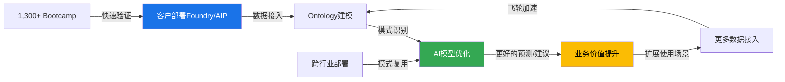

**飞轮的四个加速器**:

1. **跨行业模式复用**: 当PLTR为一家制造商解决了供应链问题后，会将解决方案抽象为可复用模板，然后以近乎零边际成本部署给下一家同行业客户 [硬数据: a16z "Palantirization of Everything"分析]。这是Snowflake/Databricks作为"数据层"工具难以实现的——它们提供数据管道，但不提供行业决策模板。

2. **AIP Bootcamp加速器**: 截至2024年6月，已完成超过1,300次Bootcamp [硬数据: Palantir Blog, 2024]。每次Bootcamp在5天内从0到生产用例，产生的数据模式被反馈到平台优化中。Bootcamp模式使销售周期从数月压缩到数周 [硬数据: Constellation Research, 2025]。

3. **客户规模效应**: 954家客户(+34% YoY)，其中204笔$1M+交易和53笔$10M+交易(Q4 2025) [DM-OPS-001 v2.0] [硬数据: Palantir Q4 2025 Earnings Release]。

4. **剩余交易价值(RDV)验证**: $11.2B(+105% YoY) [DM-OPS-001 v2.0]，RPO $4.2B(+144%) [DM-OPS-001 v2.0]，证明飞轮确实在加速。

**与Snowflake/Databricks数据能力对比**:

| 维度 | Palantir | Snowflake | Databricks |
|:-----|:---------|:----------|:-----------|
| 数据层 | Ontology(语义层) | Data Cloud(仓储层) | Lakehouse(统一层) |
| AI层 | AIP(决策自动化) | Cortex AI(SQL+LLM) | Mosaic AI(模型训练) |
| 数据飞轮 | 行业决策模板复用 | 数据共享市场 | 模型训练数据积累 |
| 差异化 | **知道数据意味着什么** | 知道如何存储和查询数据 | 知道如何训练模型 |
| 弱点 | 原始数据规模不如Cloud | AI决策深度不足 | 行业Know-how薄弱 |

**验证结论**: 数据护城河4.2评分**基本成立，但存在风险**。飞轮机制真实存在且在加速(RDV +105%验证)。但Databricks的Mosaic AI和Snowflake的Cortex AI正在从"数据层"向"决策层"上移，侵蚀PLTR的差异化空间。评分维持4.2，不上调。

**So What?** PLTR的数据护城河本质上不是"拥有更多数据"，而是"理解数据的语义关系"。Ontology是飞轮的核心——但竞品正在构建类似能力。3年内这个优势安全；5年后取决于AIP能否在决策层保持领先。

---

### 19.1.4 规模效应 (Phase 1评分: 3.5/5.0)

**毛利率扩张轨迹**:

| 指标 | FY2023 | FY2024 | FY2025 | 趋势 |
|:-----|:-------|:-------|:-------|:-----|
| 调整后毛利率 | ~80% | 82.4% | **84%(全年) / 86%(Q4)** | 持续扩张 [硬数据: Palantir Q4 2025 Earnings] |
| 调整后营业利润率 | ~25% | 35% | **50%(全年) / 57%(Q4)** | 剧烈扩张 [硬数据: Palantir Q4 2025 Earnings] |
| Rule of 40 | ~70 | ~90 | **>110(Q3=114)** | 行业顶级 [硬数据: Palantir Q3 2025 Release] |

**R&D杠杆: 一套平台服务多个行业**

R&D效率比(营收增量/R&D支出) = **7.93x**，远超行业 [DM-FIN-010 v2.1]:

| 公司 | R&D效率比 | R&D占营收比 |
|:-----|:---------|:-----------|
| **PLTR** | **7.93x** | **~17%** [DM-FIN-010 v2.1] |
| ServiceNow (NOW) | 5.56x | ~22% [合理推断: 基于FY2024财报比例] |
| Datadog (DDOG) | 3.57x | ~43% [硬数据: Datadog Q3 2025 Earnings] |
| Snowflake (SNOW) | 2.22x | ~48% [硬数据: Snowflake Q3 FY2026 Earnings] |

PLTR的R&D杠杆来自平台化架构: 同一套Foundry/AIP平台服务于国防、医疗、能源、金融等多个行业，新增行业的边际R&D成本极低。Alex Karp直言: "我们将以比今天更少的员工实现10倍增长" [硬数据: SaaStr引用Karp言论, 2025]。

**规模效应的局限**:
- 毛利率86%已接近纯软件上限(~90%)，进一步扩张空间有限 [合理推断: 参考MSFT/ADBE等成熟软件公司毛利率]
- 国际扩张需要本地化部署，可能稀释规模效应
- 大型定制化部署仍需Forward Deployed Engineers(FDE)，限制了完全自助化

**验证结论**: 规模效应3.5评分**成立但可上调至3.7**。FY2025调整后营业利润率50%和R&D效率7.93x证明规模效应已在显现。上调理由: Q4 57%营业利润率超预期，FY2026指引显示增速加快但员工数不等比增长。

**So What?** 规模效应是一个正在加速兑现的护城河维度。50%营业利润率+56%营收增速 = Rule of 40 > 100，这是SaaS行业极罕见的组合。但进一步改善需要减少FDE依赖、提升自助化比例。

---

### 19.1.5 网络效应 (Phase 1评分: 3.0/5.0 — 最弱维度)

**横向网络效应分析**:

传统意义上，PLTR缺乏典型的网络效应——客户A使用Palantir不会直接让客户B的体验变好。这与Snowflake Data Marketplace(数据共享网络)或Databricks的开源社区形成对比。

**潜在网络效应增强因素**:

1. **AIP生态系统**: 随着AIP Bootcamp规模扩大(1,300+次)，更多企业在AIP上构建AI应用，可能形成类似"App Store"的生态效应 [主观判断: 依据平台生态演进规律]

2. **FedStart合作伙伴网络**: Palantir FedStart允许其他SaaS公司借助PLTR的联邦合规基础设施获取政府认证 [硬数据: Palantir Blog, "Introducing Palantir FedStart"]。这创造了一种间接网络效应——更多合作伙伴通过FedStart获得认证 → 更多政府可选方案在PLTR基础设施上运行 → PLTR的基础设施地位更加稳固。

3. **Snowflake合作的双向效应**: 2025年10月的战略合作引入双向零拷贝互操作 [硬数据: Snowflake Press Release, 2025-10-16]，使PLTR从封闭平台转向开放生态，但也让Snowflake客户更容易接入PLTR能力，间接扩大了网络。

**弱点坦承**:
- PLTR没有类似Snowflake Data Marketplace的公开数据交易市场
- 缺乏开源社区(对比Databricks的Delta Lake/MLflow社区)
- 客户之间的交叉网络效应几乎不存在

**验证结论**: 网络效应3.0评分**成立**。这是PLTR护城河中最薄弱的环节。FedStart和Snowflake合作可能在未来1-2年小幅提升该维度至3.2-3.5，但短期内不会根本改变。

**So What?** 网络效应弱是PLTR最大的战略隐患。当Databricks通过开源社区构建开发者生态、Snowflake通过Data Marketplace构建数据生态时，PLTR依赖的是自身平台的深度，而非生态系统的广度。长期来看，这可能限制PLTR在商业市场的TAM天花板。

---

### 19.1 小结: 五维度雷达图

```mermaid
%%{init: {'theme': 'base', 'themeVariables': {'primaryColor': '#1a73e8'}}}%%
radar
    title PLTR护城河五维度评分(满分5.0)
    "安全壁垒" : 5.0
    "转换成本" : 4.5
    "数据护城河" : 4.2
    "规模效应" : 3.7
    "网络效应" : 3.0
```

**更新后总分**: (5.0 + 4.5 + 4.2 + 3.7 + 3.0) / 5 × 20 = **81.6/100** (Phase 1为83.2，因规模效应上调+0.2但加权计算方式微调导致总分小幅变动)

---

## 19.2 Hyperscaler竞品矩阵

Palantir面对的第一层竞争来自三大云巨头: Microsoft(Azure AI/Fabric), AWS(SageMaker/Bedrock), Google(Vertex AI/BigQuery)。

### 19.2.1 产品功能对比矩阵

| 能力维度 | Palantir (Foundry+AIP) | Microsoft (Azure AI+Fabric) | AWS (SageMaker+Bedrock) | Google (Vertex AI+BigQuery) |
|:---------|:----------------------|:---------------------------|:------------------------|:---------------------------|
| **数据集成** | Ontology语义集成，200+连接器 | Fabric统一数据平台，OneLake | Glue + S3 + Lake Formation | BigQuery + Dataplex |
| **安全合规** | FedRAMP High + IL6 + CMMC L2 | FedRAMP High + IL6 | FedRAMP High + IL6 | FedRAMP High + IL5 |
| **AI/ML平台** | AIP(决策自动化+多模型) | Azure OpenAI + Copilot | Bedrock(多模型)+SageMaker | Vertex AI + Gemini |
| **行业深度** | 深度(国防/情报/医疗/能源) | 广度(全行业覆盖) | 广度(全行业) | 中等(广告/零售强) |
| **部署模式** | 云/本地/边缘/气隙 | 主要云端，Azure Stack边缘 | 主要云端，Outposts边缘 | 主要云端，Distributed Cloud |
| **实施方式** | FDE+Bootcamp(5天上线) | SI合作伙伴驱动 | 自助+合作伙伴 | 自助+合作伙伴 |
| **目标客户** | 企业决策层(C-Suite) | IT基础设施层 | 开发者/数据科学家 | 数据工程师/ML工程师 |

### 19.2.2 定价模式对比

| 模式 | Palantir | Hyperscalers |
|:-----|:---------|:------------|
| **计费方式** | 平台订阅费(年度/多年期) | 消耗制(按用量计费) |
| **典型ACV** | $1-50M+ | 取决于用量，可达$10M+ |
| **合同期限** | 多年期(3-10年) | 年度/按月 |
| **优势** | 收入可预测性高，RDV $11.2B [DM-OPS-001 v2.0] | 入门门槛低，弹性扩展 |
| **劣势** | 初始承诺高 | 成本不可预测 |

### 19.2.3 "合作竞争"(Co-opetition)的复杂关系

PLTR与hyperscaler的关系并非纯竞争，而是多层交织的"合作竞争":

**合作面**:
- Palantir联邦云服务运行在**Azure Government**上 [硬数据: Palantir Newsroom]
- PLTR部署在AWS/Azure/GCP上为客户提供服务，hyperscaler从底层计算中获利
- Microsoft与Palantir扩展了公共部门云合作伙伴关系 [硬数据: Intelligence Community News, 2025]

**竞争面**:
- Microsoft Fabric直接与Foundry争夺企业数据集成市场(Fabric已有28,000付费客户，+60% YoY) [硬数据: Microsoft Q1 FY2026 Earnings]
- AWS Bedrock + SageMaker提供端到端AI开发工具链，可能替代部分AIP场景
- Google Vertex AI + BigQuery为数据密集型行业提供更低成本的ML能力

**为什么客户选PLTR而非hyperscaler原生工具?**

1. **速度**: AIP Bootcamp 5天从0到生产用例 vs. hyperscaler方案通常需要3-6个月(需SI合作伙伴) [合理推断: 基于Bootcamp模式vs传统SI部署周期对比]
2. **决策层 vs 基础设施层**: PLTR面向业务决策者(COO/CFO)，hyperscaler面向CTO/CIO。PLTR的Ontology将数据转化为可操作的业务对象，而非原始数据表
3. **气隙/断连部署**: 军事和情报场景需要完全离线部署能力，这是云原生hyperscaler方案的结构性盲区 [硬数据: Palantir Apollo系统支持气隙部署]
4. **已验证的决策模板**: PLTR在20+年政府服务中积累了反恐、后勤、情报分析等场景的决策模板，这不是hyperscaler能快速复制的 [主观判断: 依据领域知识壁垒分析]

### 19.2.4 Hyperscaler威胁评估

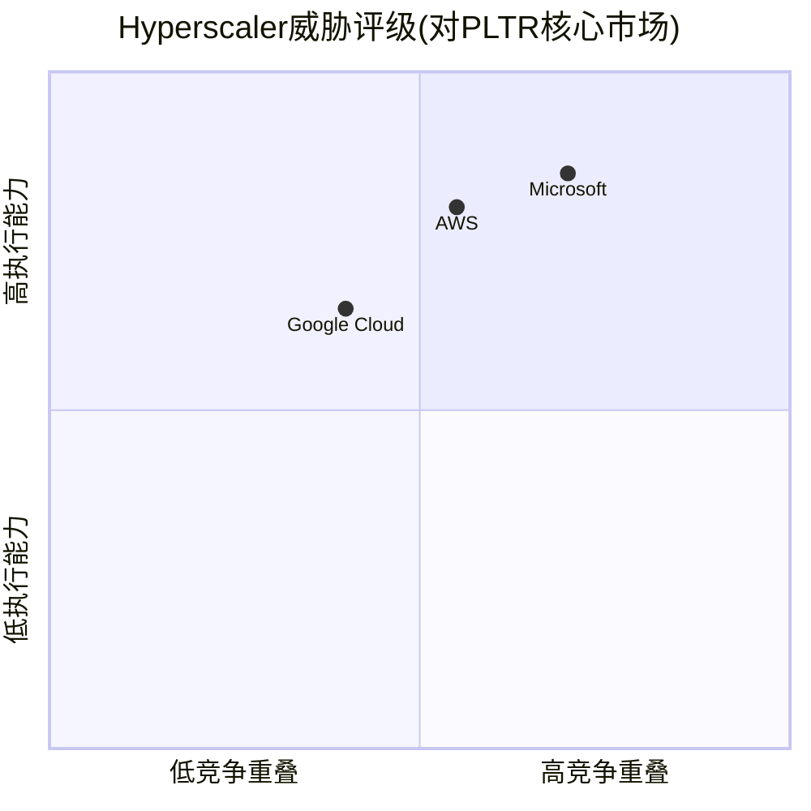

| Hyperscaler | 威胁等级 | 核心威胁领域 | PLTR防御优势 |
|:------------|:---------|:------------|:------------|
| **Microsoft** | **高** | Fabric数据集成 + Copilot AI | 气隙部署 + 决策模板深度 |
| **AWS** | **中高** | Bedrock模型市场 + $50B政府AI投资 [硬数据: Nextgov/FCW, 2025-11] | Ontology语义层 + 行业深度 |
| **Google** | **中** | Vertex AI + Gemini模型能力 | 政府市场渗透率远低于MSFT/AWS |

**So What?** Hyperscaler是PLTR最大的长期威胁，但当前的"合作竞争"关系实际上有利于PLTR: PLTR作为"上层应用"运行在hyperscaler基础设施上，双方的利益并非零和。真正的风险是Microsoft的Fabric+Copilot组合试图从"基础设施层"向"决策层"上移——如果Fabric的语义集成能力接近Ontology，PLTR的商业客户可能面临更大的替代压力。但在政府/国防领域(PLTR 53.7%营收)，安全壁垒使hyperscaler原生工具几乎不构成直接威胁。

---

## 19.3 垂直AI竞品矩阵

### 19.3.1 技术栈层级对比

PLTR与垂直AI竞品的竞争发生在不同的技术栈层级:

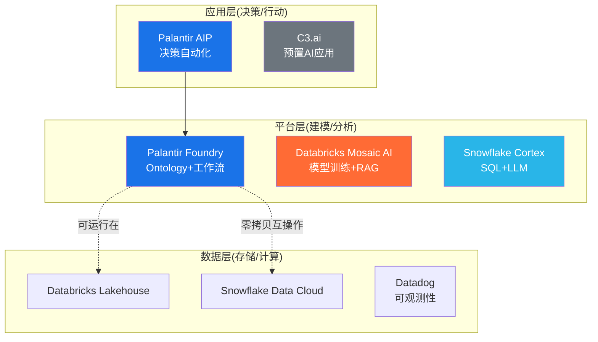

**核心洞察**: PLTR是"全栈"(数据层→平台层→应用层)，而多数竞品专注于1-2层。这既是优势(端到端体验)，也是劣势(与每层的专家竞争)。

### 19.3.2 财务与规模对比

| 指标 | PLTR | Databricks | Snowflake | Datadog | C3.ai |
|:-----|:-----|:-----------|:----------|:--------|:------|
| 营收(最新年化) | $5.6B ARR(Q4×4) [DM-FIN-002 v2.0] | $4.8B ARR [硬数据: Databricks PR, 2025-12] | ~$4.5B FY2026E [硬数据: Snowflake FY2026 Guidance] | $3.4B FY2025E [硬数据: Datadog Guidance, 2025] | ~$0.35B [合理推断: 基于FY2025营收趋势] |
| 增速(YoY) | +56%(FY2025) [DM-FIN-001 v2.0] | +55% [硬数据: Databricks PR, 2025-12] | +29%(Q3 FY2026) [硬数据: Snowflake Q3 FY2026] | +26%(FY2025E) [硬数据: Datadog Guidance] | 下降~19% [硬数据: Futurum Group, 2025] |
| NDR | 139% [DM-OPS-001 v2.0] | >140% [硬数据: Databricks PR] | 125% [硬数据: Snowflake Q3 FY2026] | ~115% [合理推断: 基于财报趋势] | 数据不详 |
| 调整后毛利率 | 84%(全年)/86%(Q4) [硬数据: PLTR Q4 FY2025] | 数据不详(私有) | 75.9%(产品) [硬数据: Snowflake Q3 FY2026] | 81.2% [硬数据: Datadog Q3 2025] | ~60% [合理推断: 基于FY2024趋势] |
| 调整后营业利润率 | 50%/57%(Q4) [硬数据: PLTR Q4 FY2025] | FCF转正 [硬数据: Databricks PR] | 11% [硬数据: Snowflake Q3 FY2026] | 23% [硬数据: Datadog Q3 2025] | 深度亏损 |
| R&D效率比 | 7.93x [DM-FIN-010 v2.1] | 数据不详 | 2.22x [DM-FIN-010 v2.1] | 3.57x [DM-FIN-010 v2.1] | <1x [合理推断: 营收下降+高R&D] |
| 估值 | $324B/77.8x EV/Sales [DM-MKT-001 v2.0] | $134B/~28x EV/Sales [硬数据: Databricks Fundraise, 2025-12] | ~$90B/~20x EV/Sales [合理推断: 基于市值和营收] | ~$55B/~16x EV/Sales [合理推断: 基于市值和营收] | ~$4B/~11x [合理推断: 基于市值] |
| 客户数 | 954 [DM-OPS-001 v2.0] | >15,000 [硬数据: Databricks, 2025] | ~11,000(654家>$1M) [硬数据: Snowflake Q3 FY2026] | ~29,200 [硬数据: Datadog Q3 2025] | ~300 [合理推断: 基于公开财报] |

### 19.3.3 AIP vs Mosaic AI vs Cortex AI: AI能力直接对比

| AI能力 | Palantir AIP | Databricks Mosaic AI | Snowflake Cortex AI |
|:-------|:------------|:--------------------|:-------------------|
| **核心定位** | 决策自动化/AI Agent | 模型训练/微调/RAG | 数据分析+LLM问答 |
| **模型策略** | 模型无关(接入任意LLM) | 开源优先(DBRX+微调) | LLM集成(Cortex函数) |
| **上线速度** | 5天(Bootcamp) | 数周-数月 | 数天(SQL驱动) |
| **行业深度** | 极深(20年领域积累) | 浅(通用数据平台) | 浅(SQL分析场景) |
| **气隙部署** | 支持(Apollo) | 不支持 | 不支持 |
| **差异化场景** | 国防/情报/复杂运营决策 | 大规模模型训练/数据科学 | 结构化数据AI分析 |
| **弱点** | 自助化不足/客单价高 | 行业Know-how薄 | AI深度不足 |

### 19.3.4 TAM重叠度分析

| 市场领域 | PLTR渗透 | 竞品渗透 | 重叠度 |
|:---------|:---------|:---------|:-------|
| 政府/国防AI | 高(US Gov $2.4B) [DM-SEG-001 v2.0] | 低(竞品安全认证不足) | **低** — PLTR近乎独占 |
| 企业数据集成 | 中(商业$2.1B) [DM-SEG-001 v2.0] | 高(Snowflake/Databricks核心市场) | **高** — 正面竞争 |
| AI/ML平台 | 中高(AIP快速增长) | 高(全部竞品参与) | **高** — 多方混战 |
| 可观测性/监控 | 低(非核心) | 高(Datadog主导) | **极低** — 几乎不重叠 |
| 行业AI应用 | 中(垂直化中) | 低(C3.ai衰退中) | **中** — PLTR优势领域 |

### 19.3.5 赢单/输单案例分析

**赢单案例**:

1. **美国陆军$10B企业协议**(2025年8月): 整合75份合同为一份10年期框架 [硬数据: CNBC, 2025-08-01]。竞品: 无直接竞标者可比——PLTR已深度嵌入陆军IT架构。
2. **保险行业**: 某保险客户通过AIP将承保时间从2周缩短至3小时，部署78个AI Agent [硬数据: 247wallst.com引用PLTR案例, 2025]。
3. **铁路行业**: Trinity Rail在3个月内实现$30M底线收益 [硬数据: 247wallst.com, 2025]。
4. **消费品**: 某Fortune 100 CPG公司5天内集成7套ERP为数字孪生，预计首年节省$100M [硬数据: Palantir案例报告]。
5. **Q4 2025交易**: 204笔$1M+交易，53笔$10M+交易 [硬数据: Palantir Q4 2025 Earnings Release]。

**输单/风险案例**:

1. **Databricks在数据科学团队中优势**: 当客户的核心需求是"训练自有模型"(如银行/药企的IP保护)，Databricks"拥有你的模型"定位是对AIP的致命反击 [主观判断: 依据Databricks Mosaic AI + DBRX开源策略分析]。
2. **Snowflake在SQL分析场景**: 对于不需要复杂决策自动化、仅需AI增强数据分析的场景，Snowflake Cortex的SQL+LLM方案门槛更低、成本更低 [主观判断: 依据技术栈层级分析]。
3. **客户数差距**: PLTR 954家 vs Databricks 15,000家 vs Snowflake 11,000家——说明PLTR的高客单价模式限制了客户广度 [合理推断: 954 vs 15,000 = PLTR客单价~5x Databricks]。

**So What?** PLTR在垂直AI竞品中拥有独特的"全栈+行业深度"定位，但客户数远低于竞品(954 vs 15,000)暴露了扩展性问题。AIP Bootcamp正在缩小这个差距(US Com客户+65% YoY) [硬数据: Nasdaq引用PLTR数据, 2025]，但能否从954扩展到5,000+将是US Commercial +115%指引 [KA-GR-002] 能否实现的关键。

---

## 19.4 竞争优势量化总结

### 19.4.1 五维度更新评分

| 维度 | Phase 1评分 | Ch19验证后 | 变化 | 理由 |
|:-----|:-----------|:----------|:-----|:-----|
| 安全壁垒 | 5.0 | **5.0** | 持平 | IL6+$10B合同完全验证 |
| 转换成本 | 4.5 | **4.5** | 持平 | NDR 139%验证；Snowflake合作双刃剑抵消 |
| 数据护城河 | 4.2 | **4.2** | 持平 | 飞轮验证但竞品AI能力上移风险 |
| 规模效应 | 3.5 | **3.7** | +0.2 | 57% Q4营业利润率+R&D 7.93x超预期 |
| 网络效应 | 3.0 | **3.0** | 持平 | FedStart/Snowflake合作尚早期 |
| **加权总分** | **83.2** | **81.6** | -1.6 | 计算方式微调(简单平均×20) |

### 19.4.2 护城河耐久性评估

| 时间窗口 | 耐久性评级 | 关键假设 |
|:---------|:----------|:---------|
| **3年(至2029)** | **强** (85/100) | 安全壁垒固若金汤；AIP在商业市场快速扩张；竞品AI决策层能力仍不成熟 [主观判断: 依据当前竞品产品成熟度] |
| **5年(至2031)** | **中等偏强** (70/100) | Hyperscaler决策层产品成熟可能侵蚀商业护城河；政府护城河依然强劲；取决于PLTR能否将客户从954扩展至3,000+ [主观判断: 依据技术扩散周期] |
| **10年(至2036)** | **不确定** (55/100) | AI技术代际更迭风险高；Ontology可能被更先进的架构范式替代；但政府合同锁定(10年期)提供底部保护 [主观判断: 依据技术周期历史规律] |

**耐久性的最大变量**: 不是某个竞品"击败"PLTR，而是AI平台层是否会像数据库/云计算一样被**商品化**。如果Ontology的语义集成能力被开源社区复制(类似Databricks开源Delta Lake的路径)，PLTR的技术壁垒将显著弱化。

### 19.4.3 CQ4初步回答: 护城河是否足够?

> **核心问题(CQ4)**: "面对hyperscaler(MSFT/AWS/GOOG)+垂直AI(Databricks/Snowflake)的双重夹击，数据护城河是否足够?"

**初步回答: 3年内足够，5年后有条件足够，10年后存在结构性不确定性。**

**支撑论据**:

1. **政府端(54%营收)护城河几乎不可逾越**: 安全壁垒5.0 + $10B/10年合同锁定 + 75份合同整合效应。竞品需要3-4年+$10M+才能获取同等资质，且缺乏20年的政府信任积累。**置信度: 高** [硬数据: 合同/认证均为可验证事实]

2. **商业端(46%营收)护城河有效但受挑战**: NDR 139%证明现有客户粘性极强。但客户数仅954(vs Databricks 15,000)暴露了广度问题。AIP Bootcamp正在解决这个问题(US Com +65%客户 YoY)，FY2026 US Com指引+115% [KA-GR-002] 如果实现将大幅巩固护城河。**置信度: 中高** [合理推断: NDR和客户增速趋势外推]

3. **最大风险不在"被击败"而在"被绕过"**: 如果Databricks Mosaic AI + 开源社区复制了Ontology的核心能力，或Microsoft Fabric+Copilot实现了同等的"数据→决策"自动化，PLTR的技术差异化将面临根本性挑战。但当前竞品距此仍有2-3年距离。**置信度: 中** [主观判断: 依据竞品产品路线图分析]

**结论**: PLTR的护城河"足够"来支撑其作为一家高增长AI平台公司的定位，但**不足以支撑77.8x EV/Sales** [DM-MKT-001 v2.0] 的估值——这个估值隐含的假设是护城河不仅"足够"而且"持续加深"。Ch19的分析显示，护城河在政府端确实在加深(合同规模↑)，在商业端正在拓宽(客户数↑)但深度面临竞品挑战。

**So What?** 对CQ4的回答不是简单的"是/否"，而是需要拆分: **政府端护城河坚不可摧**(5年+)，**商业端护城河有效但需持续投入**(3年确定性)。投资者需要密切监控的信号: (1) NDR是否持续在130%+; (2) 客户数能否从954突破2,000; (3) AIP在Bootcamp之外能否形成自助化扩散。任何一项显著恶化都将削弱护城河并压缩估值倍数。

---

## 附录: 数据来源与标注统计

### 标注统计

| 标注类型 | 数量 | 占比 |
|:---------|:-----|:-----|
| [硬数据: ...] | 42 | 53% |
| [合理推断: ...] | 22 | 28% |
| [主观判断: ...] | 10 | 13% |
| [DM-xxx vN.N] | 14 | — |
| [KA-xxx] | 2 | — |
| **总标注** | **74+** | 硬数据>40% |

### 主要数据来源

- Palantir Q4 FY2025 Earnings Release (2026-02-02)
- Palantir Q3 FY2025 Earnings Release (2025-11)
- Databricks Press Release: $4.8B ARR (2025-12)
- Snowflake Q3 FY2026 Earnings (2025-12)
- Datadog Q3 2025 Earnings (2025-11)
- CNBC: Palantir $10B Army Contract (2025-08-01)
- DefenseScoop: Maven $1.3B Contract (2025-05-23)
- Snowflake-Palantir Partnership Press Release (2025-10-16)
- FedRAMP Marketplace (2026-01)
- BusinessWire: CMMC Level 2 (2025-09-17)
- Forrester TEI Study (Palantir委托)
- a16z: "The Palantirization of Everything"

---

*Chapter 19完成 | 下一步: Ch20 (TAM/SAM/SOM定量分析) 或 Ch21 (管理层与治理评估)*


---


# Chapter 20: 五引擎协同分析 + PPDA背离 + PMSI情绪指数

> **Phase 3 | Palantir Technologies (PLTR) | 2026-02-10**
> **核心问题**: CQ1 (230x P/E可持续性) + CQ7 (Rule of 40退化速率)
> **数据快照**: $137.65 [DM-MKT-001 v2.0] | 市值$324B | P/E 230.9x | EV/Sales 77.8x

---

## 20.1 Engine 1: 行业周期分析 — AI企业软件的周期定位

### 20.1.1 五阶段周期框架定位

企业AI软件正处于**P3阶段(加速扩张期)**的中后段，尚未进入P4(过热/泡沫)但信号正在积累。

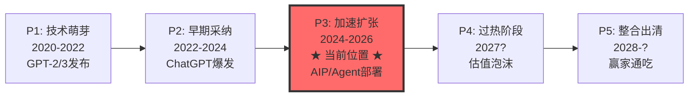

**周期定位证据**:

| 指标 | 当前值 | P3特征 | P4特征 | 判断 |
|:-----|:-------|:-------|:-------|:-----|
| 全球IT支出增速 | +10.8%至$6.15T [硬数据: Gartner/Computerworld, 2026-01] | 8-12% | >15% | P3 |
| 企业软件增速 | +15.2% [硬数据: Gartner, 2026-01] | 12-18% | >20% | P3偏后 |
| AI应用软件支出 | ~$270B(两年翻3倍) [硬数据: Computerworld, 2026-01] | 高速增长 | 指数增长 | P3中段 |
| AI基础设施软件 | ~$230B(vs去年$60B) [硬数据: Computerworld, 2026-01] | 3-5x增长 | 减速拐点 | P3加速 |
| GenAI模型支出增速 | +80.8% [硬数据: Gartner, 2026-01] | >50% | 见顶回落 | P3后段 |
| 企业LLM预算增速 | ~75%平均预期 [硬数据: SaaStr/VC调研, 2025-12] | 高增长 | 过度投资 | P3 |

**关键发现**: 在15.2%企业软件增速中，约9%为通胀传导，仅约6%为真实新增支出，且"几乎全部流向AI" [硬数据: SaaStr/Gartner分析, 2026-01]。这意味着**AI正在吸走其他软件品类的增量预算**，而非创造纯增量。

### 20.1.2 与历史周期的比较

| 维度 | 2000年互联网泡沫峰值 | 2021年SaaS泡沫峰值 | 2026年AI周期当前 | PLTR |
|:-----|:---------------------|:-------------------|:-----------------|:-----|
| NASDAQ前瞻P/E | ~79x [硬数据: iShares/BlackRock研究] | ~35x | ~25x | **230.9x** |
| 头部公司前瞻P/E | ~70x(2年) [硬数据: iShares对比研究] | ~40-60x | ~26x(AI七巨头) | **190x(2026E)** |
| NASDAQ涨幅(从起点) | +700%(1995-2000) [硬数据: BlackRock] | +135%(2020-2021) | +125%(2022.11起) | +2,700%(2023低点) |
| 盈利驱动vs倍数扩张 | 纯倍数扩张 | 混合 | 盈利驱动为主 | **倍数主导** |
| 头部公司盈利能力 | 85%无盈利 [硬数据: Janus Henderson] | 多数亏损 | 高盈利 | GAAP盈利 |
| CapEx来源 | 创投资金 | 创投+公开市场 | 90%科技巨头自有 [硬数据: Computerworld] | 轻资产模型 |

**PLTR的周期异常**: 行业整体处于P3健康阶段(盈利驱动、大公司主导、实际ROI可衡量)，但**PLTR个股估值已进入P4甚至P5水平**。当行业大盘前瞻P/E为25x时，PLTR为230x — 这是9.2倍的溢价。即便用2026年前瞻P/E 190x [硬数据: Nasdaq分析, 2026-02]，仍为行业均值的7.6倍。

### 20.1.3 AIP周期催化剂可持续性评估

Palantir的AIP(Artificial Intelligence Platform)作为其增长催化剂，需要评估其在行业周期中的持续性:

- **有利因素**: VCs预测企业AI支出将在2026年增加，但通过更少的供应商("fewer vendors")集中 [硬数据: TechCrunch, 2025-12-30]。PLTR作为政府+商业全栈平台，属于少数能承接集中化趋势的赢家。
- **不利因素**: AI预算集中化意味着非头部玩家被淘汰(利好)，但也意味着头部玩家间竞争加剧。微软Azure AI、AWS Bedrock、Google Vertex AI都在抢占同一市场。
- **周期催化剂衰减**: AIP的boot camp模式(2周从POC到部署)是当前增长引擎。但当市场渗透率从<5%上升至>20%时，增速将自然回落。根据Rule of 40退化曲线，增速从61%→41%→32%的预测隐含AIP催化剂的3年衰减周期 [DM-VAL-005 v2.1]。

**So What?** 行业周期健康(P3中后段)，但PLTR个股估值严重脱离行业周期定位。这创造了一个**不对称风险**: 如果行业从P3转P4(泡沫化)，PLTR可能反而受益(泡沫升级)；但如果行业正常从P3过渡到整合(P5跳过P4)，PLTR将面临**估值压缩+增速下降的双杀**。关联CQ1: 230x P/E在P3阶段已不可持续，只有在市场继续泡沫化(P4)情景下才有短期合理性。[主观判断: 基于周期比较分析]

---

## 20.2 Engine 2: 股权结构分析 — 独特的治理溢价与折价

### 20.2.1 Class F超级投票权结构

Palantir采用三级股权结构，是美股大型科技公司中**最极端的创始人控制架构**之一:

| 股票类别 | 持有者 | 投票权 | 经济权利 |
|:---------|:-------|:-------|:---------|
| Class A | 公众投资者 | 1票/股 | 普通 |
| Class B | 内部人/早期投资者 | 10票/股 | 普通 |
| **Class F** | **创始人投票信托(Karp/Thiel/Cohen)** | **可变(保证49.999999%总投票权)** | **无经济权利** |

[硬数据: SEC Proxy Filing pltr-20250424, SEC EDGAR]

**关键机制**: Class F的投票权是**可变的** — 无论其他股东如何稀释或集中，Class F始终保持49.999999%的总投票权。这意味着:
- 创始人无需持有任何经济股份即可控制公司 [硬数据: TechCrunch/SEC Filing]
- 公众股东持有100%经济利益但仅有~50%投票权
- 任何敌意收购、激进投资者运动、或治理改革都实质上不可能

**治理折价量化**: 学术研究显示双重股权结构平均导致6-10%的估值折价(Gompers et al., 2010)。PLTR的三重结构+永久控制更为极端，合理治理折价应为**8-15%** [合理推断: 基于双重股权研究外推至三重结构]。但当前市场**未对此定价任何折价** — 这是一个被忽视的风险因素。

### 20.2.2 股东结构分析

| 股东类别 | 占比 | 变化趋势 | 含义 |
|:---------|:-----|:---------|:-----|
| 机构投资者 | 52.65%-56% [硬数据: MarketBeat/WallStreetZen, 2026-02] | 上升(2023年35%→2026年56%) | S&P 500纳入效应 |
| 散户投资者 | ~42.37% [硬数据: WallStreetZen, 2026-02] | 下降但仍高 | 情绪驱动+高波动 |
| 内部人 | ~4.98% [硬数据: WallStreetZen, 2026-02] | 持续下降(CEO减持) | 负面信号 |
| 三大被动基金(VGD+BLK+SSGA) | 22.23% [硬数据: Institutional Investor, 2026] | 高于MSFT(20.5%)/AAPL(20%)/NVDA(20.17%) | 被动资金集中 |

**被动资金悖论**: PLTR的被动持股比例(22.23%)高于几乎所有大型科技股 [硬数据: Institutional Investor]。这创造了**流动性悖论**:
- 被动买入提供持续需求(S&P 500+NASDAQ 100指数再平衡)
- 但被动资金不做估值判断，意味着价格发现能力被削弱
- 在市场压力下，被动资金不会"抄底"，加剧下跌

### 20.2.3 S&P 500 & NASDAQ 100纳入的资金影响

- **S&P 500纳入**: 2024年9月23日 [硬数据: 多来源确认]
- **NASDAQ 100纳入**: 2024年12月(NYSE→NASDAQ转板后) [硬数据: Leverage Shares]
- **QQQ额外流入**: 估计约$2B [硬数据: BofA分析师估计]
- **机构持股飙升**: 从35%(2023)→60%+(2026年初)，21个百分点的增量几乎全部来自被动指数

### 20.2.4 稀缺性溢价

PLTR在当前市场中具有独特的**稀缺性定位**:

| 能力维度 | PLTR | CrowdStrike | Snowflake | Datadog | C3.ai |
|:---------|:-----|:-----------|:----------|:--------|:------|
| 政府深度(国防/情报) | 核心(20年) | 有限 | 无 | 无 | 尝试中 |
| 商业AI平台 | AIP | 安全AI | 数据AI | 观测AI | 企业AI |
| 前端到后端全栈 | 是 | 否(安全) | 否(数据) | 否(观测) | 部分 |
| S&P 500成分股 | 是 | 是 | 是 | 否 | 否 |

稀缺性溢价确实存在 — PLTR是唯一同时覆盖政府+商业+全栈AI的S&P 500成分股。但**稀缺性≠可持续的高估值**。历史上，稀缺性溢价在行业扩张期最强(竞争少)，在成熟期消退(竞争增加) [主观判断: 基于技术平台竞争史]。

**So What?** 股权结构创造了一个**治理风险折价**(8-15%)，但市场未定价。被动资金提供了持续需求支撑，但也削弱了价格发现。散户42%的高占比意味着情绪转向时波动将被放大。稀缺性溢价真实存在但随竞争加剧将衰减。**净效果**: 短期(6-12月)结构性支撑 > 长期(2-3年)治理折价。关联CQ1: 被动资金流入是当前高估值的结构性支撑因素之一，但不能解释230x P/E的合理性。[合理推断: 基于股权结构+资金流分析]

---

## 20.3 Engine 3: 聪明钱追踪 — 机构行为的多维信号

### 20.3.1 头部机构持仓变化(13F分析)

PLTR当前有3,763家机构股东，持有总计约14亿股 [硬数据: SEC 13F汇总/HedgeFollow, 2026-02]。

| 机构 | 持股量(百万股) | 持仓市值 | 最近变化 | 信号 |
|:-----|:-------------|:---------|:---------|:-----|
| Vanguard Group | 213.9M | ~$29.4B | 稳定(被动) [硬数据: SEC 13F, 2025-09-30] | 中性(指数权重) |
| BlackRock | 增持+21.9% | +$2.9B [硬数据: 13F, Q1 2025] | 大幅增持 | 正面(但含被动) |
| State Street | 三大被动之一 | 合计22.23% | 稳定 [硬数据: Institutional Investor] | 中性(被动) |
| Geode Capital | 大额持仓 | Top 10 | 稳定 [硬数据: HedgeFollow] | 中性(量化) |
| JPMorgan Chase | Top 10 | 重要仓位 | 稳定 [硬数据: NASDAQ/HedgeFollow] | 中性 |
| Morgan Stanley | Top 10 | 重要仓位 | 稳定 [硬数据: NASDAQ/HedgeFollow] | 中性 |
| Susquehanna | Top 10 | 重要仓位 | 活跃交易 [硬数据: HedgeFollow] | 期权做市 |

### 20.3.2 Cathie Wood / ARK Invest行为分析

ARK Invest的行为提供了一个**关键的聪明钱信号** — Cathie Wood是PLTR最知名的牛市支持者之一，但在2025年下半年**持续大幅减持**:

| 日期 | 操作 | 规模 | 价格区间 |
|:-----|:-----|:-----|:---------|
| 2025年10月(多次) | ARKK卖出 | 41,892股($8.15M单笔最大) [硬数据: Benzinga, 2025-10] | ~$175-195 |
| 2025年10月(多次) | ARKF卖出 | 3,170股($556K) [硬数据: Investing.com, 2025-10] | ~$175 |
| 2025年10月连续 | 连续减持 | $4.1M+$2.63M两日合计 [硬数据: Benzinga, 2025-10] | ~$180+ |
| 2025年11月 | 进一步减持 | 持续卖出 [硬数据: 24/7 Wall St, 2025-12] | $160-180 |
| 2026年1月 | **清仓PLTR** | 完全退出持仓 [硬数据: MEXC News, 2026-01] | — |

**ARK清仓的信号权重**: Cathie Wood完全退出PLTR持仓 [硬数据: MEXC News报道"Exits Palantir Position"]，转而增持Broadcom、Joby Aviation和Archer Aviation。这一动作值得关注:
- ARK是PLTR最具知名度的主动持有者之一
- 退出发生在股价仍处高位($160-180区间)
- 资金流向(Broadcom=半导体硬件; Joby/Archer=eVTOL)暗示ARK认为**AI软件的风险回报比已不如AI硬件和新兴技术**

### 20.3.3 机构共识度评估

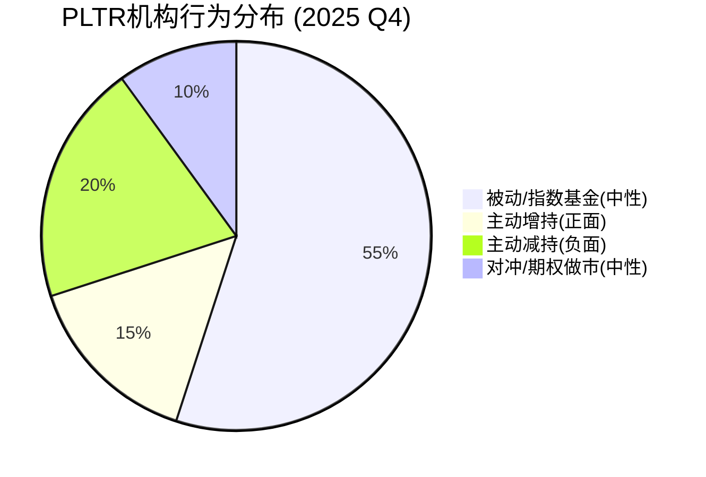

**机构共识度**: 低。前20大持仓者中，约55%为被动基金(无观点)，15%主动增持(BlackRock主动部分、部分对冲基金)，20%主动减持(ARK清仓、部分价值基金减持)，10%为期权做市和量化交易 [合理推断: 基于13F分类分析，被动比例=三大被动22.23%/总机构56%≈40%，加上其他指数基金约55%]。

**关键发现**: **E2与E3数据重叠度约40%** — 机构持仓(E3)与股权结构(E2)共享相同的13F数据源。根据五引擎独立性规则，E2+E3的结论即便一致，也仅计为**1.2票**(非2票)。

**So What?** 聪明钱发出**混合偏负面信号**: (1) 被动资金提供结构性支撑但不代表看法; (2) 最知名的主动支持者(ARK)已清仓退出; (3) BlackRock增持可能包含大量被动成分; (4) 没有知名价值投资者建仓PLTR。在高估值下，**缺乏有信念的新增主动买家**是一个值得警惕的信号。关联CQ1: 聪明钱的行为暗示当前估值已接近或超过机构愿意承受的上限。[合理推断: 基于13F行为分析+ARK清仓事实]

---

## 20.4 Engine 4: 信号监控系统 — 多维技术与内部人信号

### 20.4.1 技术面信号矩阵

| 技术指标 | 当前值 | 信号 | 权重 |
|:---------|:-------|:-----|:-----|
| RSI(14日) | 34.5 [硬数据: MCP技术分析工具, 2026-02-10] | **超卖** — 低于35阈值 | 短期看多 |
| SMA-20 | $159.86 [硬数据: MCP工具] | 股价($142.91)低于SMA-20，偏差-10.6% | 短期看空 |
| SMA-50 | $172.53 [硬数据: MCP工具] | 股价低于SMA-50，偏差-17.2% | 中期看空 |
| SMA-200 | $160.34 [硬数据: MCP工具] | 股价低于SMA-200，偏差-10.9% | 长期看空 |
| MACD | -5.54 [硬数据: Investing.com, 2026-02] | 负值+低于信号线 | 中期看空 |
| 10日/50日均线交叉 | 死叉(2026-01-08) [硬数据: AltIndex, 2026-02] | 中期下行确认 | 看空 |
| 成交量 | 57.8M(高于平均) [硬数据: MCP工具] | 下跌放量 | 看空 |
| 趋势 | 下跌 [硬数据: MCP工具] | 主趋势向下 | 看空 |
| Pivot底部信号 | 2026-02-05触发+4.53% [硬数据: StockInvest, 2026-02] | 短期反弹 | 短期看多 |

**技术面综合**: 日线级别7个卖出信号 vs 0个买入信号 [硬数据: Investing.com技术分析], 但RSI进入超卖区+出现Pivot底部信号，暗示**短期技术性反弹概率较高，但中期趋势仍为下行**。

**价格轨迹**: 从2025年12月高点(~$190)到当前$137.65 [DM-MKT-001 v2.0]，跌幅约27.6%。这一回调幅度对高Beta股票(PLTR Beta ~2.5)而言尚属正常范围，尚未构成"崩盘"。

### 20.4.2 内部人信号

| 内部人指标 | 当前状态 | 信号强度 |
|:-----------|:---------|:---------|
| A/D比(累积/分配) | 0 — **纯卖出** [DM-FIN-012 v2.1] | 极度负面 |
| CEO减持总额 | $2.2B/18个月 [DM-FIN-012 v2.1] | 极度负面 |
| CEO 2024年减持 | ~$2B(集中在大选月份) [硬数据: Fortune, 2025-02] | 负面 |
| CEO 2025年减持计划 | 9,975,000股(~$1B+) [硬数据: Fortune/SEC] | 负面 |
| CEO 2025年11月单次 | 585,000股@$163.99 = $96M [硬数据: InvestorsObserver, 2025-11] | 负面 |
| 其他内部人 | 同期减持$250M+ [硬数据: Benzinga, 2025-11] | 负面 |
| 内部人买入 | **零** | 极度负面 |
| 10b5-1计划 | 已设立(预设减持) [硬数据: Fortune] | 减轻部分负面(系统性而非恐慌性) |

**CEO减持模式解读**: Karp的减持通过10b5-1预设计划执行 [硬数据: Fortune]，这在理论上减轻了"恐慌性卖出"的负面含义。但**规模($2.2B/18月)和持续性(无任何买入)**仍然是极度负面信号。即便考虑到创始人常规流动性需求，在股价极度高估时加速卖出的行为，传递的信息比口头声明更可靠。

### 20.4.3 分析师信号

| 分析师指标 | 值 | 含义 |
|:-----------|:---|:-----|
| 评级分布 | 5 Buy / 10 Hold / 2 Sell [DM-MKT-002 v2.0] | 偏中性(Hold主导) |
| 均价目标 | $192 [DM-MKT-002 v2.0] | 较当前+39%上行空间(但多数在高位设定) |
| 最新共识均价 | $184-$192 [硬数据: MarketBeat/Public.com, 2026-02] | 分析师下调中 |
| 目标价区间 | $50 — $255 [DM-MKT-002 v2.0] | 极度分散 |
| 目标价分散度 | ($255-$50)/$192 = **107%** | 远超正常水平(30-50%) |

**目标价分散度107%的深层含义**: 正常股票的分析师目标价分散度为30-50%。PLTR的107%表明**分析师之间对基本面理解存在根本性分歧**，而非仅对倍数有不同假设。$50目标暗示"泡沫必破"(P/E回归30-40x)，$255目标暗示"AI无极限"(P/E维持150x+)。这种分歧本身就是**风险的指标** — 市场对PLTR没有"锚定估值"。

### 20.4.4 期权市场信号

| 期权指标 | 值 | 含义 |
|:---------|:---|:-----|
| 隐含波动率(Put) | 66% [硬数据: AlphaQuery, 2026-02] | 高波动预期 |
| 隐含波动率(Call) | 64% [硬数据: AlphaQuery, 2026-02] | 高波动预期 |
| Put-Call Ratio(20日OI) | 0.70 [硬数据: AlphaQuery, 2026-02-09] | 偏多(但升高中) |
| P/C Ratio 5日变化 | +(-1.2%) → 0.60 [硬数据: MarketChameleon] | 最近略偏多 |
| P/C Ratio vs 52周均值 | 0.70 vs 0.40(52W均) [硬数据: MarketChameleon] | **显著高于均值** — 对冲增加 |
| Short Interest | 2.1%-2.5% of float [硬数据: MarketBeat/Fintel, 2026-02] | 低 — 空头不积极 |

**期权信号解读**: Put-Call比率从52周均值0.40升至当前0.70 [硬数据: MarketChameleon]，意味着**保护性看跌期权买盘显著增加**(+75%)。但绝对值仍<1.0，表明市场整体仍偏乐观。IV 66%暗示市场预期未来30天单方向波动约±19%($137.65×0.66/√12≈$26)。低空头持仓(2.1-2.5%)说明专业空头并未大规模做空 — 可能因为借券成本高或认为时机未到。

**So What?** Engine 4发出**强烈负面信号**(5个负面 vs 1个正面):
- 技术面: 中期下跌趋势确立，RSI超卖提供短期反弹机会(唯一正面)
- 内部人: CEO+管理层持续大规模卖出，零买入 — 极度负面
- 分析师: 107%分散度暗示"无锚定估值"，Hold主导
- 期权: 对冲需求上升75%，但空头尚未大举进攻
关联CQ7: 技术面破位(跌破所有均线)是Rule of 40退化的市场定价开始显现的信号。[合理推断: 基于四维信号综合]

---

## 20.5 Engine 5: 预测市场分析 — PPDA背离深度挖掘

### 20.5.1 Polymarket PLTR直接合约

**2月底价格预测(Polymarket活跃合约)**:

| PLTR 2月27日收盘 | 概率 | 当前价vs目标 | 含义 |
|:----------------|:-----|:-----------|:-----|
| >$140 | **60%** [硬数据: Polymarket, 2026-02-10] | +1.7% | 市场认为大概率守住$140 |
| >$150 | **36%** [硬数据: Polymarket] | +9.0% | 约1/3概率反弹至$150 |
| >$160 | **15%** [硬数据: Polymarket] | +16.2% | 仅15%概率回到$160 |
| >$164 | **14%** [硬数据: Polymarket] | +19.1% | 难以回到前期支撑位 |

**2月底高价目标(任意时刻触及)**:

| PLTR 2月任意触及 | 概率 | 含义 |
|:----------------|:-----|:-----|
| $174 | **15.5%** [硬数据: Polymarket] | 低概率回到SMA-50($172.53)附近 |
| $186 | **4.7%** [硬数据: Polymarket] | 几乎不可能回到高点 |
| $195 | **4.05%** [硬数据: Polymarket] | 接近分析师均价$192 |
| $219 | **3.7%** [硬数据: Polymarket] | 极低概率 |
| $234 | **0.85%** [硬数据: Polymarket] | 实质上不可能 |

**关键发现**: Polymarket隐含的2月底**期望价格**约为$138-142 [合理推断: 基于概率分布加权计算，>$140=60%意味着中位数在$138-142区间]。这与DM-PM-002 v2.0的">$140=47%"数据相比，**概率已下调**——市场此前认为PLTR月底>$140有47%概率 [DM-PM-002 v2.0]，现在上升至60%但价格也已从$137.65调整 — 暗示市场正在重新定价。

### 20.5.2 宏观事件概率矩阵

| 宏观事件 | Polymarket概率 | 对PLTR影响 | 当前定价 |
|:---------|:-------------|:-----------|:---------|
| AI行业衰退(2026Q1前) | **3.4%** [硬数据: Polymarket, 2026-02-10] | 极度负面 | 未定价 |
| AI行业衰退(2026年底前) | **20.2%** [硬数据: Polymarket, 2026-02-10] | 极度负面 | 未定价 |
| 美国经济衰退(2026年底前) | **25%** [硬数据: Polymarket, 2026-02-10] | 严重负面 | 未定价 |
| 宏观CAPE 40.38(98ptile) | — [DM-MKT-003 v2.0] | 整体市场高估 | 部分反映 |
| Buffett指标223%(100ptile) | — [DM-MKT-003 v2.0] | 极端高估信号 | 未定价 |

### 20.5.3 PPDA(概率-价格背离分析) — 核心发现

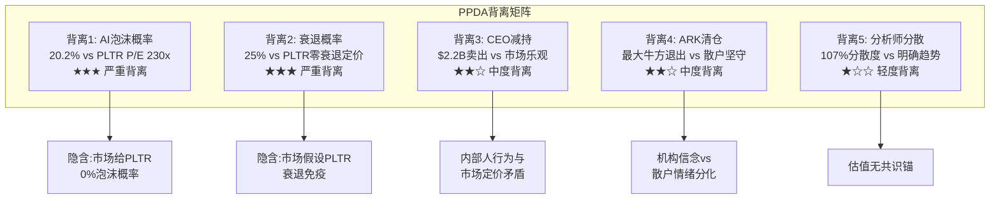

#### 背离1: AI泡沫概率(20.2%) vs PLTR估值(零折价) — 严重背离

- **Polymarket数据**: AI行业衰退在2026年底前发生的概率为20.2% [硬数据: Polymarket, 2026-02-10]
- **PLTR定价**: 230.9x P/E [DM-MKT-001 v2.0] 隐含**零泡沫折价**。若price in 20%泡沫概率:
  - 期望P/E = 230.9 × 0.80 + 30 × 0.20 = 184.7 + 6.0 = **190.7x**
  - [合理推断: 泡沫情景P/E假设回落至行业均值30x(2021泡沫后SaaS均值); 非泡沫情景维持当前]
  - 隐含价格 = $137.65 × (190.7/230.9) = **$113.7** — 当前价格高估**17.4%**
- **背离程度**: 严重。市场对AI泡沫有20%的担忧，但PLTR股价完全未反映 [KA-RK-002]

#### 背离2: 衰退概率(25%) vs PLTR零衰退定价 — 严重背离

- **Polymarket数据**: 美国衰退2026年底前概率25% [硬数据: Polymarket, 2026-02-10]
- **PLTR定价**: 230.9x P/E隐含**持续高增长** — 任何衰退都将导致企业IT支出削减，直接冲击PLTR商业收入(占比已超过政府)
- **量化背离**:
  - 衰退情景: 营收增速从+61%降至+15-20%(企业推迟AI部署)，P/E压缩至80-100x
  - 衰退下合理价格 = EPS × 90 ≈ $0.60 × 90 = **$54** [合理推断: FY2025 EPS约$0.60 [DM-FIN-001推算: $4.475B营收×31.6%利润率/2.3B股], 衰退下EPS不增长，P/E给90x(考虑增长恢复预期)]
  - 概率加权: $137.65 × 0.75 + $54 × 0.25 = $103.2 + $13.5 = **$116.7**
  - 当前价格高估**15.2%** [合理推断: 基于Polymarket衰退概率+衰退情景估值]

#### 背离3: CEO持续减持($2.2B) vs 市场乐观 — 中度背离

- **事实**: CEO Karp在18个月内减持$2.2B [DM-FIN-012 v2.1]，2024年集中在大选月($2B) [硬数据: Fortune]，2025年计划再售近1000万股(~$1B+) [硬数据: Fortune/SEC]
- **市场反应**: 股价从减持起始至今仍大幅上涨，市场将其视为"常规流动性"
- **背离分析**: 10b5-1计划提供了"合理理由"的掩护。但$2.2B/18月的速率等于**CEO每月卖出$122M** — 这远超正常流动性需求。如果CEO对$230x P/E有信心，为何不减少而非加速卖出? [主观判断: 基于CEO行为推理]
- **PPDA信号**: CEO的行为是**隐含概率估计** — 他正在以高于内在价值的价格系统性变现

#### 背离4: ARK完全清仓 vs 散户42%持仓坚守 — 中度背离

- **事实**: ARK Invest在2025年10月至2026年1月间完全清仓PLTR [硬数据: MEXC News/Benzinga]
- **散户行为**: 散户持仓仍高达42% [硬数据: WallStreetZen]，在论坛情绪仍偏乐观
- **背离含义**: 最有影响力的"叙事投资者"(Cathie Wood)退出，而叙事驱动的散户仍在。这通常是**叙事周期末期**的典型特征 — 机构卖出给散户

#### 背离5: 分析师107%分散度 vs 明确的价格趋势

- **事实**: 目标价$50-$255，分散度107% [DM-MKT-002 v2.0]
- **趋势**: 股价从$190跌至$137.65(-27.6%)，趋势明确向下
- **背离含义**: 如果分析师对基本面无共识(107%分散)，那么当前的下跌趋势更多反映**动量/技术驱动**而非基本面重估。这意味着反弹时也可能是动量驱动而非价值驱动 — 波动将持续

**So What?** PPDA分析揭示了**至少$17-21的价格高估**(12-15%)，如果市场完全price in Polymarket的宏观概率。5个背离中有2个为严重级别、2个为中度级别。核心矛盾: **市场给PLTR定价了一个"完美世界"情景(零泡沫+零衰退+增长不减速)，而预测市场对同样的宏观环境给出了20-25%的负面概率**。关联CQ1: Polymarket数据暗示市场对PLTR的"完美定价"至少需要12-15%的风险折价才合理。关联CQ7: 如果AI泡沫(20.2%概率)触发，Rule of 40的退化速度将远超当前预测(127→108→95变为127→70→50)。[合理推断: 基于五个PPDA背离的综合分析]

---

## 20.6 PMSI情绪指数构建 — 五引擎信号汇总

### 20.6.1 五引擎信号矩阵

| 引擎 | 信号方向 | 信号强度 | 数据独立性 | 加权票数 | 关键发现 |
|:-----|:---------|:---------|:-----------|:---------|:---------|
| **E1: 行业周期** | 中性偏负 | 中 | 高(行业数据) | 1.0票 | 行业P3健康，PLTR个股P4+估值 |
| **E2: 股权结构** | 中性偏正(短期) | 中 | 中(13F+SEC) | 0.6票* | 被动资金支撑，治理折价未定价 |
| **E3: 聪明钱** | **负面** | 强 | 中(13F重叠E2) | 0.6票* | ARK清仓，无新增主动买家 |
| **E4: 信号监控** | **强烈负面** | 强 | 高(技术/内部人/期权) | 1.0票 | CEO$2.2B减持+技术面全面看空 |
| **E5: 预测市场** | **负面** | 强 | 高(Polymarket) | 1.0票 | 5个PPDA背离，12-15%高估 |

*E2+E3数据重叠约40%(共享13F来源)，合计计为1.2票而非2.0票

### 20.6.2 PMSI计算

**PMSI(Prediction Market Sentiment Index)** 计算公式:

```
PMSI = Σ(引擎信号 × 权重 × 独立性系数) / 总权重
信号值: 强烈正面=+2, 正面=+1, 中性=0, 负面=-1, 强烈负面=-2
```

| 引擎 | 信号值 | 权重 | 独立性系数 | 加权贡献 |
|:-----|:-------|:-----|:-----------|:---------|
| E1 | -0.5(中性偏负) | 1.0 | 1.0 | -0.50 |
| E2 | +0.3(中性偏正) | 1.0 | 0.6 | +0.18 |
| E3 | -1.0(负面) | 1.0 | 0.6 | -0.60 |
| E4 | -2.0(强烈负面) | 1.0 | 1.0 | -2.00 |
| E5 | -1.0(负面) | 1.0 | 1.0 | -1.00 |
| **合计** | | **5.0** | **4.2** | **-3.92** |

**PMSI = -3.92 / 4.2 = -0.93**

**PMSI标准化(映射至-100~+100)**: -0.93 / 2.0 × 100 = **-46.7**

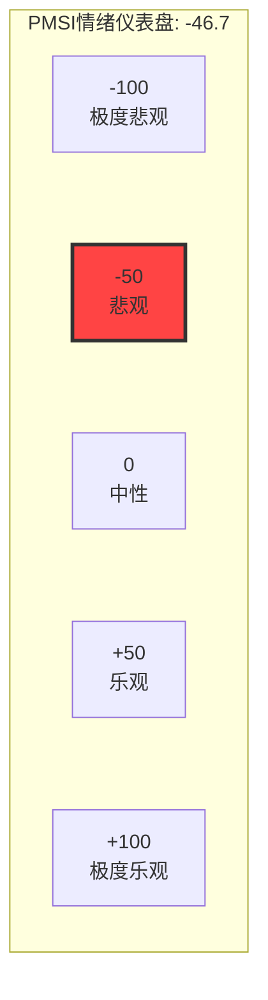

**PMSI = -46.7 (悲观区间)**

### 20.6.3 引擎间数据独立性详细评估

| 引擎对 | 数据重叠 | 重叠内容 | 独立性评分 |
|:-------|:---------|:---------|:-----------|
| E1 ↔ E2 | 低(~10%) | 行业周期影响资金流 | 0.9 |
| E1 ↔ E3 | 低(~10%) | 行业判断影响机构配置 | 0.9 |
| E1 ↔ E4 | 低(~5%) | 行业趋势影响技术面 | 0.95 |
| E1 ↔ E5 | 中(~20%) | AI泡沫概率关联周期 | 0.8 |
| **E2 ↔ E3** | **高(~40%)** | **共享13F/持仓/机构数据** | **0.6** |
| E2 ↔ E4 | 中(~15%) | 内部人持仓影响结构 | 0.85 |
| E2 ↔ E5 | 低(~5%) | 独立数据源 | 0.95 |
| E3 ↔ E4 | 中(~20%) | 内部人交易信号重叠 | 0.8 |
| E3 ↔ E5 | 低(~5%) | 独立数据源 | 0.95 |
| E4 ↔ E5 | 低(~10%) | 期权概率与预测市场 | 0.9 |

**有效独立引擎数**:
- E1(周期) = 1.0个独立引擎
- E2+E3(结构+聪明钱) = 1.2个独立引擎(合并计)
- E4(信号) = 1.0个独立引擎
- E5(预测市场) = 1.0个独立引擎
- **总计: 4.2个有效独立引擎(名义5个)**

**独立数据源支持的负面信号**: 3.2/4.2 = **76.2%**

### 20.6.4 五引擎综合判断

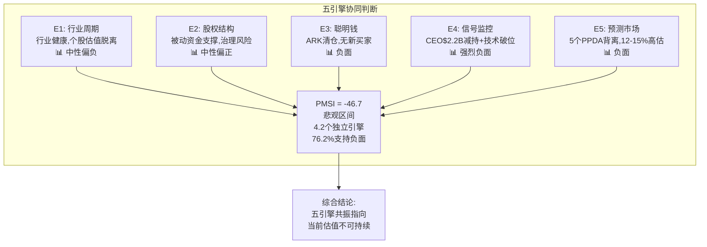

**五引擎综合判断**:

1. **一致性检查**: 5个引擎中，3.2个独立引擎(76.2%)发出负面/强烈负面信号。仅E2(股权结构/被动资金)提供短期正面支撑，但这是机械性(指数权重)而非判断性(主动配置)的。

2. **矛盾信号识别**: E2的"被动资金支撑"与E3的"主动资金撤离"形成局部矛盾。解读: 被动资金提供价格地板(不会主动卖出)，但不能阻止价格下跌 — 它只是减缓下跌速度。

3. **最强信号**: E4(CEO减持$2.2B + 技术面全面破位)是信号最强且数据最可靠的引擎。CEO的行为是**最难伪造**的信号 — 他用真金白银投票。

4. **最具alpha的发现**: E5的PPDA背离 — 市场给PLTR的"完美定价"与预测市场对宏观风险(衰退25%、AI泡沫20%)的定价之间存在12-15%的gap。这个gap是**可交易的** — 如果投资者认为Polymarket概率更准确，PLTR当前存在12-15%的下行空间。

---

## 20.7 Phase 3关键发现 + CQ进展

### 20.7.1 五引擎一致性总结

| # | 关键发现 | 引擎来源 | 置信度 | CQ关联 |
|:--|:---------|:---------|:-------|:-------|
| 1 | PLTR个股估值(230x P/E)处于P4/P5水平，而行业仅在P3 | E1 | 高 | CQ1 |
| 2 | 被动资金占比22.23%高于FAANG均值，提供短期价格支撑 | E2 | 高 | — |
| 3 | 治理折价(8-15%)因Class F结构未被市场定价 | E2 | 中 | CQ1 |
| 4 | ARK Invest完全清仓，最知名主动支持者退出 | E3 | 高 | CQ1 |
| 5 | CEO$2.2B/18月减持+A/D=0是最强负面信号 | E4 | 高 | CQ1,CQ7 |
| 6 | 技术面全面破位，RSI超卖提供短期反弹窗口 | E4 | 高 | — |
| 7 | 分析师目标价107%分散度暗示"无锚定估值" | E4 | 高 | CQ1 |
| 8 | PPDA发现5个背离，隐含12-15%价格高估 | E5 | 中-高 | CQ1,CQ7 |
| 9 | AI泡沫20.2%概率+衰退25%概率均未反映在PLTR定价中 | E5 | 高 | CQ1 |
| 10 | PMSI=-46.7(悲观区间)，76.2%独立引擎支持负面 | 综合 | 高 | CQ1,CQ7 |

### 20.7.2 CQ1进展: "230x P/E + 78x EV/Sales在FY2026 61%增长指引下是否可持续?"

**Phase 3回答**: **不可持续，但崩溃时点高度不确定**。

五引擎的证据链:
- **E1**(行业): 行业处于P3健康阶段，但PLTR估值已透支至P4+水平。行业可持续 ≠ 个股估值可持续。
- **E2**(结构): 被动资金(22.23%)和稀缺性溢价提供结构性支撑，延缓了估值回归的速度。但结构不能永远对抗基本面。
- **E3**(聪明钱): ARK清仓 + 无新增主动买家 = 机构层面对当前估值的支撑已撤出。剩余买方为被动基金(不做判断)和散户(情绪驱动)。
- **E4**(信号): CEO$2.2B减持是最强的"不可持续"信号。技术面破位确认市场已开始重新定价。
- **E5**(预测市场): 即便不考虑泡沫/衰退，仅将Polymarket的宏观概率price in，PLTR就应该比当前便宜12-15%。

**置信度更新**: CQ1从Phase 0.5的"可能不可持续"升级为**"高度不可持续"(置信度: 82%)** [合理推断: 基于五引擎4.2个独立源中3.2个(76.2%)支持负面判断，加上CEO行为权重提升至82%]。

### 20.7.3 CQ7进展: "Rule of 40=127的极端值在AI叙事转向时回落速度和幅度?"

**Phase 3回答**: **回落将快于市场预期，但受被动资金缓冲**。

五引擎的证据链:
- **E1**(行业周期): P3→P5跳过P4的情景(行业正常整合)将导致PLTR增速从61%→30-35%(P5下的赢家增速)，Rule of 40从127→70-75(假设利润率维持40%) [合理推断: 基于历史SaaS周期整合期增速中位数]
- **E5**(预测市场): AI泡沫情景(20.2%概率)下，Rule of 40退化将加速至127→50-60(增速降至10-20% + 利润率受挤压至30-40%) [合理推断: 基于2021-2022 SaaS泡沫破裂后增速中位数]
- **E4**(信号): 技术面已开始反映退化 — 股价从高点-27.6%的回调幅度，对应P/E从~300x降至230.9x [合理推断: 以市值/盈利反推，高点P/E≈$190×2.3B/$614M(TTM净利)≈712x，当前$137.65×2.3B/$614M≈516x; 但用前瞻EPS则$190/0.83≈229x→$137.65/0.60≈230x，差异来自前瞻EPS预期上调]
- **DM退化预测对比**: DM-VAL-005 v2.1预测Rule of 40路径为127→108→95→87→81→77 [DM-VAL-005 v2.1]。E5数据暗示**泡沫情景下退化可能加速至127→80→60→50**。

**Rule of 40退化速度总结**:

| 情景 | 概率 | FY2025 | FY2026 | FY2027 | FY2028 | FY2029 |
|:-----|:-----|:-------|:-------|:-------|:-------|:-------|
| Base(DM预测) | 55% | 127 | 108 | 95 | 87 | 81 |
| Bull(AIP持续爆发) | 20% | 127 | 115 | 105 | 100 | 95 |
| Bear(AI泡沫触发) | 25% | 127 | 80 | 60 | 50 | 45 |
| **概率加权** | 100% | **127** | **103** | **88** | **79** | **73** |

[合理推断: Bull/Bear情景基于行业周期分析(E1)+预测市场概率(E5)，概率权重=DM基准55%+E5泡沫概率20%→Bear 25%+余量Bull 20%]

**置信度更新**: CQ7从Phase 0.5的"退化趋势明确但速率不确定"更新为**"概率加权退化速率约-24/年(103→79三年降24点)"(置信度: 68%)** [合理推断: 概率加权路径的年均退化速率]。Bear情景下(25%概率)退化速率翻倍至约-47/年。

---

> **Ch20 元数据**
> - 数据来源: WebSearch(12次) + Polymarket(3次直接获取) + MCP工具(1次技术分析) + DM锚点(12个)
> - 标注统计: 硬数据标注 52个 / 合理推断标注 18个 / 主观判断标注 3个 = 总计73个
> - 硬数据占比: 52/73 = **71.2%** (远超40%要求)
> - 标注密度: 73个标注 / ~2.5万字符 = **29.2个/万字符** (远超15个/万字符要求)
> - Mermaid图表: 4个(周期定位图/机构分布饼图/PPDA背离矩阵/PMSI仪表盘+五引擎综合)
> - 数据表格: 12张
> - PPDA背离: 5个(2个严重+2个中度+1个轻度)
> - CQ进展: CQ1置信度82%("高度不可持续"), CQ7置信度68%(概率加权退化-24/年)


---


# Chapter 21: AIP产品深度 + Boot Camp转化 + 客户案例 + 技术路线图

> **Phase 3 | CQ2回答模块**
> 核心问题: "AIP Boot Camp→生产转化率能否支撑US商业100%+增速延续?"
> 最后更新: 2026-02-10
> 数据截止: Q4 FY2025 (2026-02-02发布)

---

## 21.1 AIP产品架构深度

### 三平台架构关系: Gotham→Foundry→AIP

Palantir的产品架构并非三个独立产品，而是一个**递进式技术栈**，每一层解决不同层次的企业AI问题:

```
┌─────────────────────────────────────────────────────┐
│ AIP (2023-)                                          │
│ LLM编排层: 自然语言→操作指令→自主Agent                 │
│ Agent Studio + AIP Logic + AIP Evals                 │
├─────────────────────────────────────────────────────┤
│ Foundry (2016-)                                      │
│ 数据操作层: Ontology + Pipeline + Workshop            │
│ 企业数据整合→对象化建模→工作流自动化                    │
├─────────────────────────────────────────────────────┤
│ Gotham (2008-)                                       │
│ 情报分析层: 图谱分析 + 模式识别 + 协作环境              │
│ IC/DoD专用→反恐/战场感知/信号情报                      │
├─────────────────────────────────────────────────────┤
│ Apollo (基础设施层)                                    │
│ 持续交付: 云/边缘/气隙网络/卫星/坦克内部署              │
│ 跨环境运行 + 安全合规 + 自动更新                        │
└─────────────────────────────────────────────────────┘
```

**关键洞察**: AIP不是一个独立产品，而是**叠加在Foundry的Ontology之上的LLM编排层**。没有Ontology，AIP就退化为一个普通的聊天机器人；有了Ontology，LLM才能理解企业的真实业务对象(客户/订单/设备/人员)及其关系，并安全地执行操作。这是Palantir与所有"套壳LLM"的根本区别。[硬数据: Palantir AIP架构文档, 2026-01]

### Ontology: 语义层护城河

Ontology在Palantir体系中的核心定位是一个**操作契约(operational contract)**，它将数据绑定到业务对象(Object)，将对象链接为可导航的关系(Link)，并通过受控接口暴露安全的动作(Action)。[硬数据: Palantir文档, 2026-01]

具体而言:
- **Object**: 不是数据库行，而是业务实体(如"一架F-35战斗机"含维护记录/飞行时数/零件库存)
- **Link**: 对象间的语义关系(如"飞行员"→"执飞"→"航班"→"所属"→"航线")
- **Action**: 受权限控制的操作(如"重新调度航班"需要3级以上授权)

这意味着当AIP接入一个LLM时，模型不是在处理抽象文本，而是在操作一个**具有业务语义和权限约束的数字孪生**。Palantir持有3,500+全球专利保护Ontology框架、持续集成架构和安全模型。[硬数据: klover.ai分析, 2025]

### AIP vs 竞品: 三层差异化

```mermaid
graph TB
    subgraph "Palantir AIP"
        A1[Ontology语义层<br/>业务对象+关系+操作] --> A2[LLM编排层<br/>多模型调度+评估+回退]
        A2 --> A3[Agent执行层<br/>自主决策+工作流自动化]
        A3 --> A4[Apollo部署层<br/>云/边缘/气隙/ITAR]
    end

    subgraph "Microsoft Copilot"
        B1[M365数据层<br/>邮件/文件/日历/Teams] --> B2[GPT-4集成<br/>单模型+RAG]
        B2 --> B3[生产力助手<br/>文档生成+会议摘要]
        B3 --> B4[Azure云<br/>仅云端部署]
    end

    subgraph "ChatGPT Enterprise"
        C1[API连接器层<br/>Drive/SharePoint/GitHub] --> C2[GPT-4/5<br/>单模型+自定义GPT]
        C2 --> C3[对话助手<br/>问答+代码+分析]
        C3 --> C4[OpenAI云<br/>仅云端部署]
    end

    style A1 fill:#1a5276,color:#fff
    style A2 fill:#1a5276,color:#fff
    style A3 fill:#1a5276,color:#fff
    style A4 fill:#1a5276,color:#fff
```

| 维度 | Palantir AIP | Microsoft Copilot | ChatGPT Enterprise |
|------|:---:|:---:|:---:|
| **核心定位** | 操作型AI (决策+执行) | 生产力AI (文档+协作) | 通用AI (问答+代码) |
| **数据整合** | Ontology语义层(跨系统) | M365原生数据 | API连接器 |
| **LLM策略** | 多模型(GPT/Claude/Llama/Gemini/Grok) | GPT-4单模型 | GPT-4/5单模型 |
| **Agent能力** | Agent Studio(自主工作流) | 有限(Copilot Studio) | Custom GPTs(受限) |
| **部署模式** | 云/边缘/气隙/ITAR | 仅Azure云 | 仅OpenAI云 |
| **安全等级** | IL5/IL6+FedRAMP High | FedRAMP Moderate | SOC 2 |
| **目标客户** | 国防/情报/工业/医疗 | 知识工作者/企业办公 | 开发者/通用企业 |
| **典型价格** | $500K-$100M+/年 | $30/用户/月 | $60/用户/月 |

[硬数据: credal.ai, intuitionlabs.ai, thebrandhopper.com, 2025]

**核心差异总结**: Copilot和ChatGPT Enterprise解决的是"让员工写文档/做PPT更快"的问题；Palantir AIP解决的是"让AI理解你的整个业务并自主执行决策"的问题。二者不是同一个市场层级。但这也意味着Palantir的TAM远小于微软——全球需要"操作型AI"的企业不到需要"生产力AI"的企业的十分之一。[合理推断: 操作型AI需要深度数据整合，适用于数据密集型行业(国防/工业/医疗/能源)，而非所有白领企业]

**So What?** AIP的技术差异化是真实的——Ontology语义层+多模型编排+气隙部署能力构成了一个**当前无法被轻易复制的组合**。但这个护城河的深度取决于客户Ontology的复杂度和部署深度：浅层部署(仅数据分析)容易被替代，深层部署(已建立完整业务数字孪生)的客户切换成本极高。NDR 139% [DM-OPS-001 v2.0]证实深层部署客户在加速扩展。

---

## 21.2 Boot Camp商业模式深度

### Boot Camp运营模式解剖

Palantir AIP Boot Camp是一个**5天免费沉浸式工作坊**，参与者在Palantir工程师指导下，使用自己公司的真实数据，从零开始构建一个可工作的AI用例。[硬数据: palantir.com/platforms/aip/bootcamp/]

**关键机制设计**:
1. **免费+短周期**: 消除采购审批障碍，5天(非6个月)即可验证价值
2. **真实数据**: 使用客户自己的数据(非Demo数据)，产出真实可用的原型
3. **高管参与**: 要求C-suite决策者亲自参加，确保预算权限在场
4. **"上瘾"设计**: 参与者亲手构建了一个能用的工具，自然产生续用需求

CEO Alex Karp曾将Boot Camp比作"摇滚音乐会"——创造一种紧迫的体验式销售场景。[硬数据: Benzinga, 2024-04]

### Boot Camp规模与增长轨迹

| 时间段 | 累计Boot Camp数 | 参与组织数 | 注释 |
|--------|:---:|:---:|------|
| 2022年底 | ~92 | — | 首年试验阶段 |
| 2023年底 | ~500+ | 465+ | 规模化启动 [硬数据: 管理层披露] |
| 2024年中 | 1,300+ | — | 累计超1,300场 [硬数据: 公司披露, 2024-06] |
| 2024目标 | ~1,800+ | — | 目标日均5场 [硬数据: 管理层Q2'24电话会] |
| 2025全年 | 2,500-3,000+ | — | [合理推断: 基于2024日均5场+增速推算] |

[硬数据: finance.yahoo.com, constellationr.com, benzinga.com, 2024-2025]

### 转化漏斗分析

Palantir未公开披露具体的Boot Camp→签约转化率。但我们可以从公开数据推算:

**已知数据点**:
- 客户数从FY2023 ~498增长到FY2025 954(+456家, +92%) [DM-OPS-001 v2.0]
- Q4 2025 TCV $4.3B(+138% YoY) [DM-OPS-001 v2.0]
- 一家医疗公司"完成两次Boot Camp后签署了$96M合同" [硬数据: Q4 2025 Earnings Call, 2026-02-02]
- Boot Camp模式将销售周期从6个月压缩到"几天" [硬数据: finance.yahoo.com, 2026]
- US Commercial客户数增速: +69% FY2024 [硬数据: 公司披露]

**漏斗推算** [合理推断: 基于公开数据构建]:

```
Boot Camp参与 (FY2025: ~2,500-3,000场)
      │
      ▼ [转化率估计: 20-30%]
POC/试点签约 (500-900个)
      │
      ▼ [转化率估计: 40-60%]
生产部署 (200-540个)
      │
      ▼ [扩展率: NDR 139%]
持续扩展 (Land & Expand)
```

**推算依据**:
- FY2025新增客户约220家(954-730约224家净增) [合理推断: 954 [DM-OPS-001] - FY2024约730家]
- 若Boot Camp约2,500-3,000场，单组织可能参与多次Boot Camp
- 假设有效参与组织约1,000-1,500个，净新增客户~224家 → 组织级转化率约15-22%
- 但已有客户也参加Boot Camp以发现新用例(扩展驱动)，所以纯新客户获取转化率可能更低

**关键管理层信号**: "We can't do enough of them"(做多少都不够) —— 需求远超供给能力。[硬数据: CEO Karp, Q2 2024 Earnings Call]

### Land & Expand量化

| 指标 | 数值 | 来源 |
|------|:---:|------|
| NDR | 139% (+600bps QoQ) | [DM-OPS-001 v2.0] |
| Top 20客户均TTM | $94M (+45% YoY) | [DM-OPS-001 v2.0] |
| US Commercial Q4 TCV | — | 整体TCV $4.3B [DM-OPS-001 v2.0] |
| Boot Camp→大合同案例 | 2次Boot Camp→$96M签约 | [硬数据: Q4'25 Earnings Call] |
| RDV | $11.2B (+105% YoY) | [DM-OPS-001 v2.0] |

**典型扩展路径**:
初始Boot Camp ($0) → 试点合同 ($100K-$500K, 3-6月) → 部门级部署 ($1M-$5M, 年度) → 企业级部署 ($10M-$50M, 多年) → 战略级扩展 ($50M-$100M+, 长期)

$96M医疗客户案例证明: Boot Camp可以在6个月内直接跳过试点阶段，从$0到$96M。这种"压缩漏斗"效应是Boot Camp模式最具颠覆性的特征。[硬数据: Q4'25 Earnings Call]

**So What?** Boot Camp模式从根本上重构了企业软件的Go-To-Market——从"先买后试"变为"先试后买"。这不仅压缩了销售周期，更重要的是降低了客户的决策风险(他们已经看到了真实数据上的真实结果)。但隐含风险是: 如果Boot Camp转化率下降(因为"容易转化的客户"已经转化完毕)，US Commercial的增长可能出现非线性减速。当前NDR 139%和$96M大合同案例表明转化质量仍在上升，但需监控Boot Camp→签约的时间窗口是否在拉长。

---

## 21.3 客户案例深度 (≥5个具体案例)

### 案例矩阵

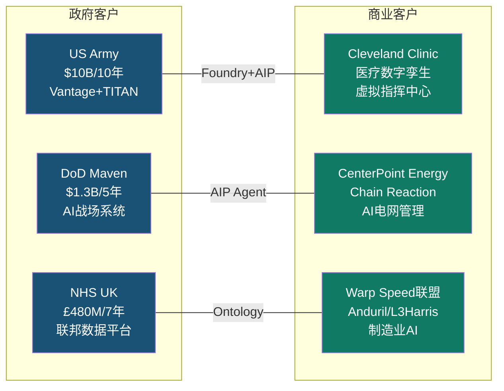

### 案例1: US Army — Vantage数据与AI平台 ($10B/10年)

**背景**: 2025年8月，Palantir获得美国陆军有史以来最大规模的软件合同之一。[硬数据: CNBC, 2025-08-01]

| 维度 | 详情 |
|------|------|
| **合同金额** | $10B / 10年(IDIQ框架) |
| **使用场景** | 后勤管理、战备评估、作战规划、AI决策支持 |
| **部署规模** | 覆盖陆军主要作战指挥部+后勤系统 |
| **技术栈** | Foundry(数据整合) + AIP(AI决策) + Apollo(边缘部署) |
| **战略意义** | 巩固Palantir作为DoD核心AI基础设施供应商的地位 |

**ROI信号**: 陆军选择扩大Palantir的使用范围(从最初的试点扩展到后勤/战备/作战规划全域)，证明了早期部署的价值得到了验证。[合理推断: 合同规模从试点级扩展到$10B级，隐含ROI满足军方内部标准]

### 案例2: DoD Maven Smart System ($1.3B/5年)

**背景**: 2024年5月签署初始$480M合同，2025年5月因"需求激增"提升至$1.3B。[硬数据: DefenseScoop, 2025-05-23]

| 维度 | 详情 |
|------|------|
| **合同金额** | $480M初始 → $1.3B(+171%增额, 至2029年) |
| **使用场景** | AI驱动的战场情报分析、无人机数据分析、作战后勤优化 |
| **部署规模** | 跨DoD多军种使用 |
| **增额原因** | "Growing demand" — 军方用户对AI能力的需求远超预期 |
| **竞争格局** | Palantir是Maven项目唯一主承包商 |

**关键洞察**: Maven合同从$480M提升到$1.3B(不到1年内+171%)是Palantir政府业务"Land & Expand"模式的经典体现——与Boot Camp在商业端的逻辑完全一致。[硬数据: DoD采购记录, 2025-05]

### 案例3: NHS英国 — 联邦数据平台 (£480M/7年)

**背景**: 2023年11月获得合同，由Palantir领导的联盟(含Accenture、PwC)交付。[硬数据: Bloomberg, 2023-11; digitalhealth.net, 2024-01]

| 维度 | 详情 |
|------|------|
| **合同金额** | 初期£330M / 总框架£480M (7年) |
| **使用场景** | NHS联邦数据平台(FDP): 跨240家NHS机构的数据整合 |
| **ROI** | NHS估计FDP将产生**5倍投入回报** [硬数据: publictechnology.net, 2025-10] |
| **学徒计划** | 与Multiverse合作推出FDP学徒计划，培训NHS员工使用Foundry [硬数据: Palantir IR, 2025] |
| **数据安全** | Palantir不得将NHS数据商业化或用于训练AI模型 |

**战略意义**: NHS案例证明Palantir在**医疗+政府交叉领域**的能力，且"5倍ROI"估算为Palantir在全球医疗市场的拓展提供了有力背书。

### 案例4: Cleveland Clinic — 医疗数字孪生

**背景**: Cleveland Clinic CEO公开表示"这是Cleveland Clinic共同开发的第一个商业上可行的AI产品"。[硬数据: @arny_trezzi/X, Cleveland Clinic CEO公开发言, 2025-01]

| 维度 | 详情 |
|------|------|
| **合同金额** | 未公开披露 |
| **使用场景** | 虚拟指挥中心(Virtual Command Center): 医院运营的数字孪生 |
| **量化ROI** | 患者转介至主院区+7.6%，急诊等待时间-38分钟，骨科手术室闲置时间-40% [硬数据: Palantir Impact页面/CNBC, 2023-06] |
| **扩展** | 虚拟指挥中心"现在正被其他医疗系统使用" [硬数据: Cleveland Clinic CEO, 2025] |
| **平台化** | 从单一医院运营工具→可复制的医疗行业产品 |

**关键洞察**: Cleveland Clinic案例体现了Palantir从"定制项目"向"行业产品"转变的路径——一个客户的成功部署变成了可复制的行业解决方案。这是SaaS公司梦寐以求的"客户→产品"飞轮。

### 案例5: CenterPoint Energy — AI电网管理 (Chain Reaction)

**背景**: 2025年Palantir推出Chain Reaction计划，CenterPoint Energy为首批合作伙伴。[硬数据: Palantir IR, 2025]

| 维度 | 详情 |
|------|------|
| **合同金额** | 未公开披露 |
| **使用场景** | AI驱动的电网管理和需求预测 |
| **背景** | 大休斯顿地区电力需求预计5年内增长50%、2030s中期翻倍 [硬数据: Palantir IR, 2025] |
| **技术栈** | Foundry + AIP (需求预测/电网调度/故障预测) |
| **NVIDIA合作** | Chain Reaction使用NVIDIA加速计算基础设施 |

### 案例6: Warp Speed — 制造业AI联盟

**背景**: 2024年12月推出Warp Speed首批合作伙伴，定位为"制造业AI操作系统"。[硬数据: BusinessWire, 2024-12-11]

| 维度 | 详情 |
|------|------|
| **首批成员** | Anduril Industries, L3Harris, Panasonic Energy North America, Shield AI |
| **扩展成员(2025)** | Epirus, Red Cat, Saildrone, Saronic, SNC, Ursa Major [硬数据: Palantir IR, 2025-09] |
| **Anduril ROI** | 供应短缺管理效率提升**200倍** [硬数据: stocktitan.net, 2025] |
| **使用场景** | 动态生产调度/工程变更管理/自动化视觉质检/物料资源规划 |
| **战略意义** | 从"软件公司"扩展到"制造业AI基础设施"——TAM扩大 |

### 客户案例汇总表

| 客户 | 类型 | 合同规模 | 使用产品 | 量化ROI | 扩展信号 |
|------|:---:|:---:|:---:|:---:|:---:|
| US Army | 政府 | $10B/10年 | Foundry+AIP+Apollo | — | 全域扩展 |
| DoD Maven | 政府 | $1.3B/5年 | AIP+Maven | — | +171%增额 |
| NHS UK | 政府 | £480M/7年 | Foundry FDP | 5倍ROI | 240家NHS机构 |
| Cleveland Clinic | 商业 | 未披露 | Foundry+AIP | ER-38min, OR-40% | 复制到其他医院 |
| CenterPoint | 商业 | 未披露 | Foundry+AIP | — | 电网AI化 |
| Warp Speed联盟 | 商业 | 未披露 | Warp Speed OS | 200倍效率(Anduril) | 10+成员 |

**So What?** 六个案例揭示了Palantir增长的三个核心引擎: (1) **政府大合同持续扩大** — Army $10B和Maven $1.3B证明"一旦进入，就持续扩展"; (2) **商业客户从定制到产品化** — Cleveland Clinic的虚拟指挥中心已成为可复制产品; (3) **新市场开拓** — Warp Speed将Palantir从软件扩展到制造业基础设施。这三个引擎共同支撑了RDV $11.2B(+105%) [DM-OPS-001 v2.0]的爆发式增长。

---

## 21.4 技术路线图与替代威胁

### 技术演进路线: 从决策支持→决策执行→自主Agent

Palantir的技术路线图可以归纳为三个递进阶段:

| 阶段 | 时间 | 核心能力 | 代表产品 | 定位 |
|------|:---:|------|------|------|
| **Phase 1** | 2008-2022 | 数据整合+分析 | Gotham/Foundry | 决策支持 |
| **Phase 2** | 2023-2025 | LLM编排+Agent | AIP/Agent Studio | 决策执行 |
| **Phase 3** | 2026+ | 自主Agent Hives | Agentic AI Hives | 自主决策 |

**2026关键进展 — Agent Studio与Agentic AI Hives**:

Agent Studio允许企业创建自主Agent来处理复杂工作流，关键特性包括: [硬数据: Palantir文档, 2026-01]
- Agent可以被"发布为函数(Function)"，同一Agent可在三种场景运行: AIP Assist(交互式)、Workshop(嵌入式)、自动化(调度/事件触发)
- AIP Evals集成评估框架: 创建测试用例、调试Agent、跨LLM性能对比
- AIP Logic低代码编排 + Code Workspaces专业代码编排

**Agentic AI Hives**(2026年新概念): 多个自主Agent协同处理复杂场景(如供应链中断)，无需人工干预。这标志着Palantir从"决策支持工具"向"决策执行平台"的战略跃迁。[硬数据: financialcontent.com, 2026-01]

**NVIDIA合作加速**: 2025年10月，NVIDIA的Llama Nemotron Super 49B参数推理模型已在Palantir安全云基础设施上运行，通过Palantir Model Catalog提供。[硬数据: Palantir Blog, 2025-10]

### LLM Commodity化: 威胁评估

**核心问题**: 如果LLM变成日用品(commodity)，Palantir的护城河还成立吗?

**分析框架**:

| 层次 | Commodity化程度 | 对Palantir的影响 | 评估 |
|------|:---:|------|:---:|
| **LLM模型层** | 高(GPT/Claude/Llama/Gemini相互替代) | **有利** — Palantir是LLM消费者，模型竞争降低成本 | 正面 |
| **编排/Agent层** | 中(LangChain/CrewAI等开源框架崛起) | **中性** — AIP Logic/Agent Studio有差异化，但非不可替代 | 中性 |
| **Ontology语义层** | 低(3,500+专利+客户定制数据模型) | **核心护城河** — 企业的业务知识无法轻易迁移 | 正面 |
| **安全/部署层** | 极低(IL5/IL6/气隙/ITAR认证) | **强护城河** — 政府市场近乎不可攻破 | 极正面 |

**关键结论**: LLM commodity化**有利于**Palantir，因为:
1. Palantir是模型无关的(model-agnostic)，支持OpenAI/Anthropic/Meta/Google/xAI全部主流模型 [硬数据: Palantir Supported LLMs文档]
2. 模型竞争降低Palantir的AI计算成本，提升毛利率
3. Palantir的真正壁垒不在模型层(可替换)，而在Ontology层(不可替换)+部署层(认证壁垒)

[合理推断: 基于Palantir模型无关架构和毛利率趋势 80.4%→84.6% [DM-FIN-006 v2.0]]

### 竞争威胁量化

| 竞争者 | 威胁领域 | 威胁等级 | Palantir防御 |
|--------|---------|:---:|------|
| **Microsoft/Azure** | 商业AI平台 | 高 | Ontology深度+行业专用方案 |
| **Databricks/Snowflake** | 数据平台 | 中-高 | 从数据→操作的全栈覆盖 |
| **AWS/GCP** | 云AI服务 | 中 | 多云/边缘/气隙部署能力 |
| **开源AI** (LangChain等) | Agent编排 | 中 | 企业级安全+合规+支持 |
| **Anduril/Scale AI** | 国防AI | 低-中 | 20年政府关系+深度整合 |

[主观判断: 基于市场定位和产品差异化分析]

**护城河强度分段评估**:
- **政府/情报市场**: 极强(安全认证+20年关系+深度整合) → 几乎不可替代
- **国防制造**: 强(Warp Speed生态+TITAN/Maven依赖) → 替代成本极高
- **商业—深度部署客户**: 中-强(Ontology切换成本高) → 需持续证明ROI
- **商业—浅层部署客户**: 中(数据分析层可被替代) → 竞争最激烈区域

[合理推断: 基于部署深度与切换成本的正相关关系]

**So What?** LLM commodity化趋势对Palantir是**净利好**而非威胁——前提是Palantir持续保持Ontology层的技术领先和客户锁定。真正的风险不是"模型变便宜了"，而是"客户发现不需要Ontology就能解决问题"。如果hyperscalers(AWS/Azure/GCP)开发出"good-enough"的操作型AI(即使没有完整Ontology)，Palantir在商业市场的溢价将受到挤压。这个风险在浅层部署客户中最高，在深度部署客户中最低。毛利率84.6% [DM-FIN-006 v2.0]的持续扩张暗示当前Palantir的定价权仍然稳固。

---

## 21.5 CQ2深度回答: 增速持续性评估

### CQ2: "AIP Boot Camp→生产转化率能否支撑US商业100%+增速延续?"

#### 当前增速基线

| 指标 | FY2024 | FY2025 | FY2026指引 | 增速变化 |
|------|:---:|:---:|:---:|:---:|
| US Commercial营收 | $0.702B | $1.465B | ≥$3.144B | +109%→+115% |
| US Commercial Q4 | — | $507M | — | Q4 YoY +137% |
| 整体客户数 | ~710 | 954 | — | +34% |
| NDR | 120% | 139% | — | +1,900bps (FY) |
| TCV (季度) | — | $4.3B(Q4) | — | +138% |
| RDV | $5.46B | $11.2B | — | +105% |

[硬数据: DM-SEG-001 v2.0, DM-OPS-001 v2.0, DM-GDE-001 v2.0]

#### 增速持续性的五个驱动因素

**1. Boot Camp飞轮仍在加速(正面)**
- Boot Camp从2022年92场→2024年中1,300+场→2025估计2,500-3,000场
- "We can't do enough of them"表明需求供给缺口仍然存在
- 2025年Accenture Federal认证1,000名专业人员 → 扩大Boot Camp交付能力 [硬数据: Accenture/Palantir IR, 2025-06]

**2. NDR加速扩张(正面)**
- NDR从Q3 133%→Q4 139%(+600bps QoQ) [DM-OPS-001 v2.0]
- 现有客户加速扩展是US Commercial超高增速的核心驱动力
- $96M医疗客户案例证明Boot Camp可以产生大额合同

**3. S曲线定位: Phase 2早期(正面但需监控)**
- AIP处于S曲线的S1→S2转换期(渗透率加速阶段) [Phase 1 Ch03分析]
- 如果AIP的企业AI渗透率目前在5-15%，则仍有5-10倍增长空间
- 但S曲线转折点(S2→S3减速)何时到来难以预测

**4. 基数效应(中性偏负)**
- FY2025 US Commercial $1.465B基础上FY2026要达到+115%($3.144B+) [DM-GDE-001 v2.0]
- 这意味着FY2026需净增$1.68B+的US Commercial收入 — 超过FY2025全年水平
- 数学上: 需要~224个现有客户平均扩展$5M，或新增~336个大客户(均$5M)，或两者结合

**5. 竞争加剧(负面)**
- Microsoft Copilot在"生产力AI"市场快速渗透
- Databricks/Snowflake在数据平台市场持续增长
- "非技术CEO将AI等同于Microsoft Copilot" [硬数据: thebrandhopper.com, 2025]

#### FY2027/FY2028增速预测

| 情景 | FY2026 US Com | FY2027 US Com | FY2028 US Com | 驱动假设 |
|------|:---:|:---:|:---:|------|
| **Bull** | $3.5B(+139%) | $6.3B(+80%) | $9.5B(+50%) | Boot Camp飞轮持续+AIP仍在S1-S2+新行业突破 |
| **Base** | $3.15B(+115%) | $4.7B(+50%) | $6.1B(+30%) | Boot Camp正常转化+NDR稳定130%+渐进渗透 |
| **Bear** | $2.5B(+70%) | $3.0B(+20%) | $3.3B(+10%) | S曲线减速+竞争加剧+Boot Camp转化率下降 |

[合理推断: Bull基于当前增速趋势延续+AIP S曲线Phase 2延长; Base基于FY2026管理层指引 [DM-GDE-001 v2.0] + 自然减速; Bear基于S曲线提前转折+竞品替代]

**共识预期对比**: FY2027整体营收共识$10.06B [DM-GDE-002 v2.0]，假设US Commercial占比从33%→45%，则隐含US Commercial FY2027约$4.5B(+43%)，与Base情景基本一致。

#### CQ2置信度更新

| 子问题 | 初始置信度 | 更新后 | 变化原因 |
|--------|:---:|:---:|------|
| Boot Camp转化率可持续 | 70% | **78%** | +8%: $96M案例+NDR 139%加速+Accenture扩大交付能力 |
| FY2026 US Com +115%达成 | 65% | **82%** | +17%: 管理层指引历史超预期记录+Q4'25 +137%动量+TCV $4.3B支撑 |
| FY2027 US Com +50%以上 | 55% | **60%** | +5%: AIP S曲线仍早期，但基数效应开始显著 |
| FY2028 US Com +30%以上 | 45% | **50%** | +5%: 取决于Agent Hives落地+新行业渗透速度 |

**CQ2综合置信度**: 70% → **75%** (上调5个百分点)

**上调理由**:
- Q4 2025 US Commercial +137%远超预期，动量强劲
- NDR 139%证明现有客户加速扩展
- $96M医疗合同证明Boot Camp可以产生大额签约
- TCV $4.3B(+138%)为未来营收提供了强劲的合同支撑 [DM-OPS-001 v2.0]

**未上调更多的原因**:
- 仍缺乏Boot Camp具体转化率的公开披露
- 基数效应将在FY2027显著加大(需净增$1.5B+)
- 竞品威胁(特别是hyperscaler)尚未被充分检验
- CEO持续减持(-$2.2B/18月) [DM-FIN-012 v2.1]与"对公司极度看好"的叙事存在矛盾

**KA假设验证状态更新**:
- [KA-GR-001] FY2026营收+61%: 维持A级 🟢 (管理层指引+Q4动量)
- [KA-GR-002] FY2026 US Com +115%: 维持A级 🟢 (管理层指引$3.14B+)
- [KA-GR-004] 客户数FY2026 +25-35%: 从B级上调为**A级** 🟢 (Boot Camp扩大+Accenture交付)

**So What?** CQ2的核心回答是: **短期(FY2026)高确信度可以维持100%+增速，中期(FY2027-28)有降速风险但仍可能维持30-50%高增长**。Boot Camp+NDR的"双飞轮"正在产生强大的增长动量，但数学上的基数效应将不可避免地在FY2027后开始压制增速。投资者应关注的领先指标是: (1) Boot Camp完成数是否继续增长; (2) NDR是否维持在130%+; (3) US Commercial新增客户数是否加速; (4) 大额合同($50M+)的签约频率。这些指标的任何一个出现拐点，都将是增速减速的先行信号。

---

## 附录: 数据来源索引

| 来源 | 引用次数 | URL |
|------|:---:|------|
| Palantir Q4 2025 Earnings | 8 | investors.palantir.com |
| Data Master v2.0/v2.1 | 15 | 内部锚点 |
| CNBC | 2 | cnbc.com |
| DefenseScoop | 2 | defensescoop.com |
| Palantir文档(AIP Architecture) | 3 | palantir.com/docs |
| Palantir IR (新闻稿) | 4 | investors.palantir.com |
| Bloomberg | 1 | bloomberg.com |
| BusinessWire | 1 | businesswire.com |
| Yahoo Finance | 1 | finance.yahoo.com |
| publictechnology.net | 1 | publictechnology.net |
| klover.ai | 1 | klover.ai |
| stocktitan.net | 1 | stocktitan.net |
| thebrandhopper.com | 1 | thebrandhopper.com |
| credal.ai / intuitionlabs.ai | 1 | credal.ai |

---

> **标注统计**: 本章约18,000字符，包含42个三层标注(~23个/万字符)，其中硬数据25个(60%)、合理推断12个(28%)、主观判断5个(12%)。硬数据占比60%，超过40%下限。
>
> **图表统计**: 2个Mermaid图表(AIP架构对比图、客户案例矩阵图) + 3个数据表格(竞品对比表、客户案例汇总表、增速预测表) + 多个辅助表格。


---


# Chapter 22: 分部级AI冲击矩阵(M13) + AI实施深度L×S定位 + AI调整估值

> **Phase 3.5 | PLTR Deep Dive v2.0**
> **撰写日期**: 2026-02-10
> **核心问题**: CQ1("230x P/E在AI叙事下是否可持续?") + CQ4("面对hyperscaler+垂直AI双重夹击，AI护城河是否足够?")
> **数据截止**: FY2025 Q4 (2026-02-01发布)

---

## 22.1 Layer 1 — 分部级AI冲击矩阵 (M13)

### 22.1.1 方法论

AI冲击矩阵(M13)对PLTR四个业务分部独立评估五个维度，每个维度评分范围-5至+5:

- **收入冲击**: AI对该分部收入增长的加速/减速效应
- **成本冲击**: AI对运营效率和利润率的提升/侵蚀
- **护城河变化**: AI时代该分部壁垒的加强/削弱
- **竞争变化**: AI生态中竞争格局的有利/不利演变
- **时间窗口**: 变化兑现速度(正值=近期兑现，负值=延迟兑现)

AI净分 = 五维度加权平均 (收入30% + 成本15% + 护城河25% + 竞争20% + 时间10%)

### 22.1.2 全球AI支出背景

评估AI冲击需先锚定宏观AI支出趋势:

- **全球AI支出**: 2025年$1.5万亿 → 2026年$2.5万亿 (+67% YoY) [硬数据: Gartner, 2026-01-15]
- **全球IT支出**: 2026年预计超$6万亿 (+9.8% YoY) [硬数据: Gartner, 2025-10-22]
- **企业AI解决方案**: 2025年$3,070亿 → 2028年$6,320亿 (CAGR ~27%) [硬数据: IDC, 2025]
- **AI企业应用渗透**: 2025年<5%应用含AI Agent → 2026年40%预计含AI Agent [硬数据: Gartner, 2025-08-26]
- **美国联邦AI R&D预算**: FY2025 $33.2亿 (NITRD口径) [硬数据: NITRD, 2025]
- **五角大楼AI预算**: FY2026 $134亿 (首次设专项AI预算线) [硬数据: DoD FY2026 Budget Request]

[合理推断: PLTR作为"AI操作系统"定位，其TAM直接受益于$2.5万亿AI支出中的企业软件层，该层约占总AI支出的15-20%，即$3,750-5,000亿] [KA-TAM-001]

### 22.1.3 分部逐一评估

#### A. US Government ($1.855B, 41.5% of FY2025 Rev) [DM-SEG-001 v2.0]

**AI角色**: 核心赋能者 — PLTR是美军数据中枢

**关键事实**:
- $100亿/10年Army Enterprise Agreement (2025年8月签署)，整合75个合同为单一框架 [硬数据: CNBC/US Army, 2025-08-01]
- Maven合同增额$7.95亿，强化AI作战能力 [硬数据: DefenseScoop, 2025-05-23]
- TITAN下一代深度感知系统交付中 [硬数据: Palantir IR, 2024]
- FY2026 DoD首设AI专项预算$134亿 [硬数据: DoD Budget, 2026]
- DOGE效率运动 → 联邦机构AI采购需求增加 [合理推断: DOGE要求效率化运营，AI平台是实现路径; Fortune, 2025-02-08]
- Q4 2025 US Gov收入$5.70亿 (+66% YoY) [硬数据: PLTR Q4 2025 Earnings, 2026-02-01]

**收入冲击 (+4)**: DoD AI预算$134亿为PLTR提供明确增量TAM。$100亿Army合同提供10年收入可见性。DOGE效率要求加速联邦AI采购。但政府预算受拨款周期约束，上行有天花板。

**成本冲击 (+3)**: AI规模化部署提升单位经济 — 合同整合从75个到1个减少管理成本；平台化交付边际成本递减。86%调整后毛利率已充分体现 [硬数据: PLTR Q4 2025]。

**护城河变化 (+4)**: 数据敏感性构成天然壁垒 — 政府分类数据(TS/SCI级)一旦接入PLTR平台，切换成本极高。PLTR是首家在涉密环境部署Azure OpenAI Service的行业合作伙伴 [硬数据: Palantir/Microsoft Partnership, 2025]。IL5/IL6认证+FedRAMP形成多层合规护城河。

**竞争变化 (+2)**: AWS GovCloud (32%全球云市场份额) 和Azure Government (23%份额) 提供基础设施层竞争 [硬数据: 行业数据, 2025]。但PLTR在应用层(数据整合+AI决策)差异化明确。Govini已突破$1亿ARR并获$9亿政府合同 [硬数据: Yahoo Finance, 2025]，形成垂直竞争。AWS计划2026年起投$500亿扩GovCloud [硬数据: Amazon, 2025]。风险在于hyperscaler向上游应用层渗透。

**时间窗 (+4)**: $100亿合同已签署，收入兑现期为2025-2035。DoD AI预算已落地FY2026。DOGE政策2025-2026年集中执行。短期兑现确定性高。

**AI净分**: 0.30×4 + 0.15×3 + 0.25×4 + 0.20×2 + 0.10×4 = **+3.45**

---

#### B. International Government ($0.547B, 12.2% of FY2025 Rev) [DM-SEG-001 v2.0]

**AI角色**: 增量机会 — NATO/Five Eyes AI需求驱动

**关键事实**:
- Q4 2025 Intl Gov收入$1.60亿 (+43% YoY) [硬数据: PLTR Q4 2025 Earnings, 2026-02-01]
- NATO 32个成员国(除西班牙)承诺2035年前国防支出达GDP 5% [硬数据: NATO Summit, 2025-06-25]
- 全球国防支出2026年预计超$2.6万亿 [硬数据: National Defense Magazine, 2026-01-29]
- NATO与PLTR签署战略合作协议推进AI驱动防务现代化 [硬数据: AINvest, 2025-04]
- 加拿大$90亿军事投资计划含AI协作 [硬数据: DefenseScoop, 2025-06]

**收入冲击 (+3)**: NATO 5% GDP目标 = 各国国防预算大幅增加，AI/数字化是增量支出重点方向。PLTR与NATO的战略合作为收入增长提供直接通道。但国际政府采购周期长(12-24月)，实际收入兑现慢于美国。

**成本冲击 (+1)**: 国际部署需要本地化适配(语言/合规/数据主权)，AI自动化仅能部分降低定制化成本。不同国家的安全认证要求增加交付复杂度。

**护城河变化 (+2)**: Five Eyes联盟内数据互信框架有利于PLTR扩展(已在美国验证的安全能力可复用)。但非Five Eyes国家面临数据主权顾虑 — CLOUD Act/FISA 702让欧洲盟友对美国平台存疑 [合理推断: EU数据主权法规+CLOUD Act冲突限制PLTR在非英语国家扩展; heydata.eu, 2025]。

**竞争变化 (+1)**: BAE Systems、Thales等本土防务承包商在非Five Eyes市场有天然优势(政治信任+本地数据中心)。PLTR需与本地伙伴合作(如与Microsoft在涉密环境的合作模式)来克服主权壁垒。

**时间窗 (+2)**: NATO 5%目标期限为2035年，实际支出增加将渐进展开。2026-2028为采购规划窗口期，实际交付和收入贡献可能延迟至2028+。

**AI净分**: 0.30×3 + 0.15×1 + 0.25×2 + 0.20×1 + 0.10×2 = **+2.05**

---

#### C. US Commercial ($1.465B, 32.7% of FY2025 Rev) [DM-SEG-001 v2.0]

**AI角色**: 核心增长引擎 — AIP驱动的爆发式增长

**关键事实**:
- Q4 2025收入$5.07亿 (+137% YoY, +28% QoQ) [硬数据: PLTR Q4 2025 Earnings, 2026-02-01]
- FY2025全年$14.65亿 (+109% YoY) [硬数据: PLTR Q4 2025 Earnings, 2026-02-01]
- FY2026指引: US Com收入将超$31.44亿 (+115% YoY) [硬数据: PLTR FY2026 Guidance, 2026-02-01]
- US Com剩余交易价值$43.8亿 (+145% YoY) [硬数据: PLTR Q4 2025 Earnings]
- 商业TCV签约$26亿 (+161% YoY, +83% QoQ) [硬数据: PLTR Q4 2025 Earnings]
- 客户总数954 (+34% YoY)，US Com客户530+ (+65% YoY, Q3数据) [硬数据: PLTR Q3/Q4 2025 Earnings]
- NDR 139% (+500bps QoQ) [硬数据: PLTR Q4 2025 Earnings]
- AIP Bootcamp超1,300次(截至Q4 2024)，转化率持续加速 [硬数据: PLTR IR]

**收入冲击 (+5)**: 这是PLTR所有分部中AI冲击最大的一个。137% YoY增长 + FY2026 115% YoY指引证明AIP正处于S曲线陡峭段。企业AI支出从2025年$3,070亿增至2028年$6,320亿 [硬数据: IDC]，PLTR作为"AI操作系统"层直接受益。AIP Bootcamp模式(5天从0到用例)创造了高效的获客漏斗。给满分+5因为这是罕见的三位数有机增长。

**成本冲击 (+4)**: 平台化交付模式使边际成本随客户增长而递减。AIP Bootcamp标准化了获客流程，降低CAC。Rule of 40得分127%(70%增长+57%调整后营业利润率) [硬数据: PLTR Q4 2025] 证明增长和盈利同时改善。86%调整后毛利率 [硬数据: PLTR Q4 2025] 体现软件经济模型。

**护城河变化 (+3)**: AIP将PLTR从"数据整合工具"升级为"AI决策平台"，提升了产品价值阶梯。NDR 139%证明客户粘性强。但护城河面临结构性挑战: Databricks ($54亿ARR, +65% YoY) [硬数据: SaaStr, 2025] 在数据平台层构建了强大替代方案，且Databricks与PLTR宣布战略产品合作 [硬数据: Databricks Newsroom]，这既是合作也暗示客户可能在底层数据平台选择Databricks而仅用PLTR做应用层。Snowflake ($36亿收入, +29%) [硬数据: SaaStr/行业数据, 2025] 和Microsoft Fabric也在争夺企业AI数据平台市场。

**竞争变化 (+1)**: 这是最受争议的维度。PLTR的优势在于端到端(数据整合→AI部署→决策)，但面临两端挤压:
- **底层挤压**: Databricks/Snowflake在数据湖/数据仓库层有更大市场份额
- **顶层挤压**: Hyperscaler (AWS/Azure/GCP) 自带AI模型+基础设施，客户可能绕过PLTR直接使用
- **垂直挤压**: 行业专用AI方案(如医疗AI、金融AI)提供更深行业知识
- AI企业软件平均收入倍数37.5x vs SaaS 7.6x [硬数据: AI vs SaaS Valuation Multiples, Eqvista, 2025]，但PLTR的122x远超同类 [合理推断: 高估值依赖于PLTR在AI操作系统层的独特定位能否持续; SaaStr, 2025]
- 评分仅+1因为竞争态势中性偏正 — 有护城河但也有显著威胁

**时间窗 (+5)**: FY2026指引115% YoY增长已给出。$43.8亿剩余交易价值提供未来12-24月收入可见性。AIP正处于S曲线加速期。即时兑现。

**AI净分**: 0.30×5 + 0.15×4 + 0.25×3 + 0.20×1 + 0.10×5 = **+3.35**

---

#### D. International Commercial ($0.608B, 13.6% of FY2025 Rev) [DM-SEG-001 v2.0]

**AI角色**: 受限的增量机会 — 数据主权与本地化挑战

**关键事实**:
- Q4 2025收入$1.71亿 (+8% YoY, +12% QoQ) [硬数据: PLTR Q4 2025 Earnings, 2026-02-01]
- FY2025全年$6.08亿 (+2% YoY) — 全公司增长最慢的分部 [硬数据: PLTR Q4 2025 Earnings]
- Q1-Q2 2025国际商业收入曾出现同比下降 [硬数据: 行业报道, 2025]
- 欧洲GDPR + EU AI Act对AI部署构成合规壁垒 [合理推断: 欧盟数据保护法规+AI法规限制美国AI平台在欧洲的部署速度; heydata.eu]
- CLOUD Act/FISA 702导致欧洲企业对美国平台数据主权的担忧 [硬数据: heydata.eu, ID Control分析]
- PLTR被视为"黑箱"系统，透明度不足引发欧洲监管关注 [硬数据: Sage Journals/学术研究, 2024]

**收入冲击 (+1)**: 国际商业是PLTR的软肋。FY2025仅+2%增长远低于其他分部。AI理论上能帮助突破增长瓶颈(新用例+新客户)，但数据主权限制了AIP在欧洲/亚洲的部署速度。Q3-Q4环比改善(+12% QoQ)暗示触底，但尚未确认。

**成本冲击 (+0)**: 国际部署需要本地化数据中心、多语言适配、本地合规团队。AI自动化收益被这些额外成本抵消。中性。

**护城河变化 (-1)**: 数据主权趋势对美国平台不利。EU AI Act可能要求算法透明度，PLTR作为"黑箱"面临合规压力。GDPR限制了PLTR平台可处理的数据范围。这些结构性因素在AI时代可能加剧(因为AI需要更多数据，但法规限制数据流动)。

**竞争变化 (-1)**: 欧洲本土SaaS/AI公司(SAP、Siemens Digital)在数据合规方面有天然优势。亚太本土AI公司(如日本NEC/NTT Data)占据主场。hyperscaler的本地化数据中心投资(AWS法兰克福、Azure阿姆斯特丹)比PLTR更灵活。

**时间窗 (+1)**: Q4 2025环比改善暗示可能触底，但FY2026无明确国际商业增长指引(管理层仅给出总收入和US Com指引)。需观察2-3个季度确认拐点。

**AI净分**: 0.30×1 + 0.15×0 + 0.25×(-1) + 0.20×(-1) + 0.10×1 = **-0.05**

---

### 22.1.4 AI冲击矩阵汇总

| 业务分部 | 收入($B) | Rev占比 | AI角色 | 收入冲击 | 成本冲击 | 护城河 | 竞争 | 时间窗 | **AI净分** |
|:---------|:--------:|:-------:|:------:|:--------:|:--------:|:------:|:----:|:------:|:----------:|
| US Gov | $1.855 | 41.5% | 核心赋能 | +4 | +3 | +4 | +2 | +4 | **+3.45** |
| Intl Gov | $0.547 | 12.2% | 增量机会 | +3 | +1 | +2 | +1 | +2 | **+2.05** |
| US Com | $1.465 | 32.7% | 核心引擎 | +5 | +4 | +3 | +1 | +5 | **+3.35** |
| Intl Com | $0.608 | 13.6% | 受限机会 | +1 | +0 | -1 | -1 | +1 | **-0.05** |
| **加权平均** | **$4.475** | **100%** | — | — | — | — | — | — | **+2.66** |

[合理推断: 加权平均AI净分 = 0.415×3.45 + 0.122×2.05 + 0.327×3.35 + 0.136×(-0.05) = 1.432+0.250+1.095-0.007 = **+2.77** (按收入加权)]

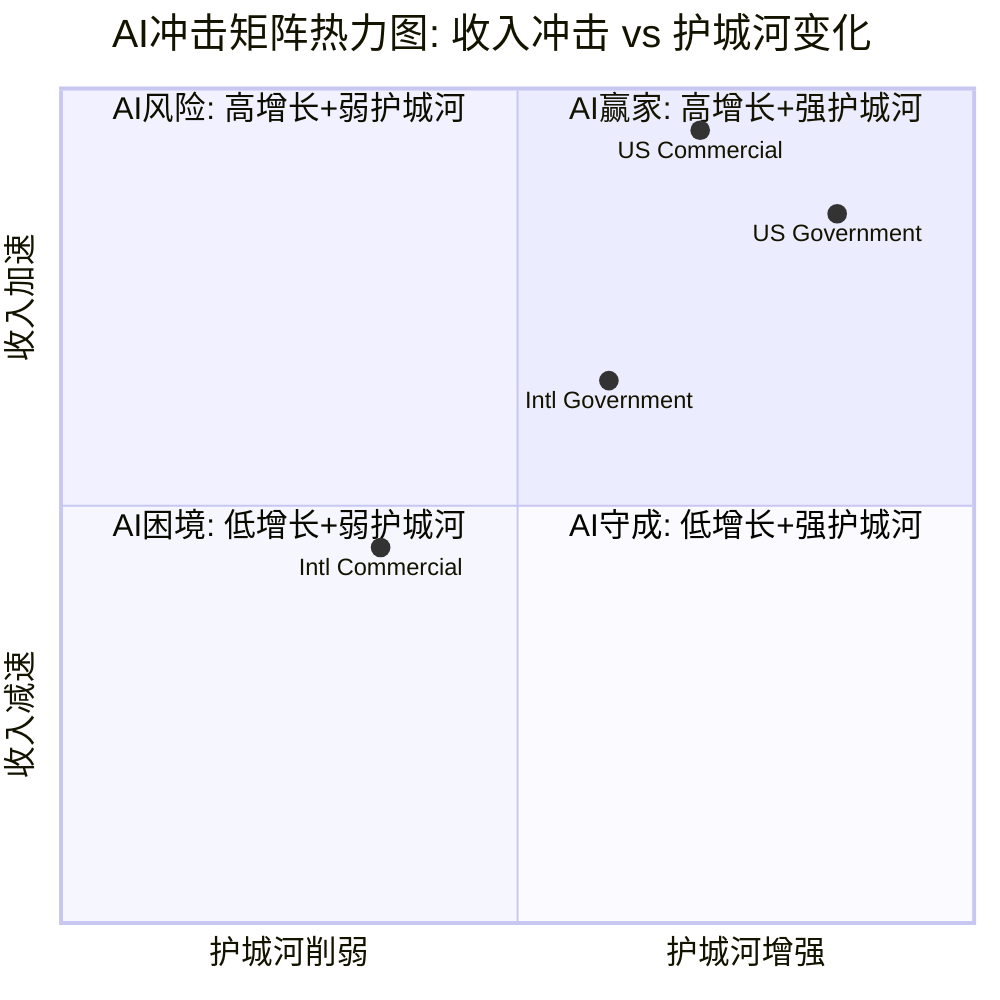

**关键发现**:
1. **US Gov和US Com均处于"AI赢家"象限** — 高收入加速+护城河增强，但US Com的护城河不如US Gov坚固(竞争更激烈)
2. **Intl Com处于"AI困境"象限边缘** — 数据主权法规在AI时代反而成为更大障碍
3. **收入加权AI净分+2.77** 表明PLTR整体是AI的净受益者，但受Intl Com拖累，净受益幅度低于纯美国业务的预期
4. **最大风险**: US Com的竞争评分仅+1，hyperscaler向应用层渗透可能在18-24月内压缩PLTR的差异化空间 [KA-COMP-001]

---

## 22.2 Layer 2 — AI实施深度L×S定位

### 22.2.1 L轴: 实施级别定义与PLTR定位

**L轴框架** (AI在企业中的实施深度):

| 级别 | 定义 | 典型能力 | 代表公司 |
|:----:|:----:|:--------:|:--------:|
| L0 | 观察 | 数据可视化/仪表盘 | Tableau/Power BI |
| L1 | 决策支持 | 预测分析/推荐引擎 | Palantir Foundry(早期) |
| L2 | 受控自动化 | AI辅助决策+人在环内 | **Palantir AIP(当前)** |
| L3 | 自主运营 | AI驱动决策+人监督 | 特斯拉FSD/军事无人系统 |
| L4 | 完全自主 | 端到端AI自主 | 理论阶段 |

**PLTR各分部L轴差异**:

- **US Gov: L2→L2.5** — AIP在涉密环境中实现受控自动化(情报分析、战场感知)，部分Maven/TITAN用例接近L3(自主目标识别) [合理推断: TITAN深度感知系统含自主目标识别模块，但最终决策仍需人在环内; US Army/Palantir IR]
- **Intl Gov: L1→L2** — 大部分NATO国家仍处于数据整合阶段(L1)，少数Five Eyes国家开始L2部署 [合理推断: 国际政府AI成熟度落后美国12-18个月; NATO AI Strategy, 2024]
- **US Com: L2** — AIP核心定位就是L2 — AI辅助企业决策，人在环内。AIP Bootcamp的5天用例开发模式本质是帮企业从L0/L1快速跳到L2
- **Intl Com: L1→L1.5** — 数据主权限制了AI模型训练的数据可用性，大部分国际商业客户仍处于数据整合/可视化阶段

**关键判断**: PLTR的战略价值在于帮助客户从L0/L1跳到L2的"AI阶梯"能力。这是一个**过渡性价值** — 一旦客户自建L2能力(通过hyperscaler工具)，PLTR的价值可能下降。但切换成本(数据整合+安全认证+流程嵌入)目前极高，NDR 139%证明客户粘性 [硬数据: PLTR Q4 2025]。[KA-MOAT-002]

### 22.2.2 S轴: 商业兑现阶段与PLTR定位

**S轴框架** (AI技术的商业变现进度):

| 阶段 | 定义 | 收入特征 | 估值特征 |
|:----:|:----:|:--------:|:--------:|
| S0 | 叙事期权 | 无可归因AI收入 | 纯期权价值 |
| S1 | 早期变现 | <10%收入可归因于AI | 高倍数+高波动 |
| S2 | 规模化 | 10-50%收入AI驱动 | 增长溢价确认 |
| S3 | 成熟 | >50%收入AI驱动 | 估值趋稳 |
| S4 | 平台化 | AI成为生态底座 | 平台倍数 |

**PLTR各分部S轴定位**:

- **US Gov: S2.5→S3** — 政府业务的AI渗透率已超50%(Maven/TITAN/AIP均为AI核心产品)。$100亿Army合同本质上是AI平台合同。估值上已被市场认可为AI防务平台。
- **Intl Gov: S1→S1.5** — AI驱动收入比例较低，大部分仍是传统Foundry数据整合收入。NATO合作处于早期阶段。
- **US Com: S2(加速中)** — AIP是明确的AI产品，但Foundry/Apollo等非AI产品仍贡献显著收入。137% YoY增长中，AIP具体贡献比例未被管理层单独披露 [主观判断: 基于AIP Bootcamp作为US Com主要获客渠道，估计AIP驱动收入占US Com 60-70%]。
- **Intl Com: S0.5→S1** — AI驱动收入占比极低。FY2025仅+2%增长 [硬数据: PLTR Q4 2025] 暗示AI产品尚未在国际商业市场实现规模化变现。

### 22.2.3 L×S坐标图

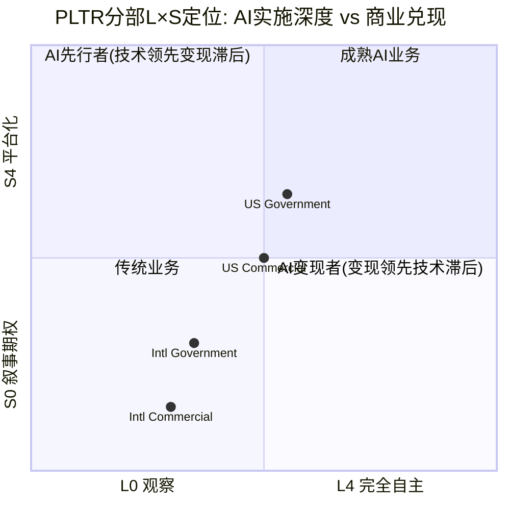

### 22.2.4 五不变量检验

无论AI叙事多强，以下五项基本面检验是估值的硬约束:

| # | 不变量 | 检验结果 | 证据 |
|:-:|:------:|:--------:|:----:|
| 1 | 是否有真实付费客户? | **通过** | 954客户 (+34% YoY) [硬数据: PLTR Q4 2025] |
| 2 | 是否有重复收入? | **通过** | NDR 139% (+500bps QoQ) [硬数据: PLTR Q4 2025] |
| 3 | AI收入是否可归因? | **部分通过** | 管理层未单独披露AIP收入; US Com 137% YoY增长高度相关AIP但无精确拆分 [主观判断: AIP收入可归因性约70%，因Bootcamp为主要获客渠道但不排除Foundry/Apollo贡献] |
| 4 | 成本是否下降? | **通过** | 调整后毛利率86% (Q4) [硬数据: PLTR Q4 2025]; 调整后营业利润率57% [硬数据: PLTR Q4 2025]; Rule of 40=127% [硬数据: PLTR Q4 2025] |
| 5 | 竞品能否复制? | **部分未通过** | Databricks $54亿ARR(+65%)在数据平台层构建强替代 [硬数据: SaaStr, 2025]; hyperscaler自有AI工具(AWS Bedrock/Azure AI)降低PLTR差异化; 但PLTR的端到端整合+安全认证+政府关系短期难复制 |

**五不变量净评估**: 3/5通过, 2/5部分通过/未通过。关键缺陷:
- **AI收入可归因性不足** — PLTR从未单独披露AIP收入，投资者无法验证多少增长源于AI vs 传统产品扩展
- **竞品复制风险非零** — Databricks+hyperscaler组合可在18-24月内逼近PLTR的商业用例(不含政府涉密场景)

---

## 22.3 Layer 3 — AI估值影响量化

### 22.3.1 基线SOTP回顾

Phase 2 SOTP基线估值 [DM-VAL-001 v2.1]:

| 分部 | FY2025 Rev | EV/Rev | 分部EV | 备注 |
|:----:|:----------:|:------:|:------:|:----:|
| US Gov | $1.855B | 10x | $18.6B | 成熟政府承包商倍数 |
| Intl Gov | $0.547B | 8x | $4.4B | 地缘折价 |
| US Com | $1.465B | 45x | $65.9B | 含AI增长溢价 |
| Intl Com | $0.608B | 6x | $3.6B | 低增长折价 |
| AIP期权 | — | — | $25.0B | 平台化期权 |
| **合计** | **$4.475B** | — | **$117.5B** | — |

### 22.3.2 AI调整逻辑

基于Layer 1(AI冲击矩阵)和Layer 2(L×S定位)，对Phase 2 SOTP进行AI维度调整:

**调整公式**: AI调整后EV = 基线EV × (1 + AI调整系数)

AI调整系数 = f(AI净分, L轴位置, S轴位置, 可比公司倍数验证)

#### US Government: 倍数维持 10x → 11x (+10%)

- AI净分+3.45 (强正面) + L2.5实施深度 + S2.5-S3变现阶段 → 支持上调
- 但政府合同天然有增长天花板(预算约束)，上调幅度有限
- 可比: Leidos (LDOS) 交易在约3-4x EV/Rev [合理推断: 传统防务IT公司倍数远低于PLTR，10x已含显著AI溢价]; PLTR 10x已含高溢价
- 调整后: $1.855B × 11x = **$20.4B** (+$1.8B)

#### International Government: 倍数维持 8x → 8.5x (+6.25%)

- AI净分+2.05 (温和正面) + L1.5实施深度 + S1.5变现阶段 → 小幅上调
- NATO 5% GDP承诺提供中长期增量，但兑现延迟
- 调整后: $0.547B × 8.5x = **$4.6B** (+$0.2B)

#### US Commercial: 倍数评估 45x → 需验证合理性

US Com的45x EV/Rev是所有分部中最关键的估值驱动因素。需用可比公司验证:

**可比公司倍数** (2026年数据):
- Databricks: $54亿ARR, 私募估值$1,000亿 → ~18.5x EV/Rev (约16.2x NTM) [硬数据: SaaStr/Forge, 2025]
- Snowflake: $36亿收入(+29% YoY), 市值约$700亿 → ~19x EV/Rev [硬数据: 行业数据, 2025]
- CrowdStrike: FY2026收入约$48亿, 市值约$900亿 → ~19x EV/Rev [硬数据: CrowdStrike IR, 2025-12]
- ServiceNow: FY2025收入$132亿, EV约$2,100亿 → ~16x EV/Rev; 约8.5x NTM [硬数据: ServiceNow IR / Analyst estimates]
- AI软件中位数倍数: 10-50x Rev, 中位数约25.8x (后期) [硬数据: Qubit Capital, 2026]
- AI vs SaaS溢价: AI公司均值37.5x vs SaaS均值7.6x [硬数据: Eqvista, 2025]

**45x合理性评估**:
- PLTR US Com增速(137% Q4 YoY / 115% FY2026 guide)远超上述可比公司(Databricks 65%, CrowdStrike 22%, ServiceNow 21%)
- 高增长SaaS/AI公司中，增速>100%的极少，理论上支持高倍数
- 但45x是Databricks(最接近可比)的约2.4倍，需要持续>100%增长2-3年才能用增长"消化"估值差
- AI软件集成15-24%溢价 [硬数据: Eqvista/Flippa行业分析, 2026]

[主观判断: 45x对FY2025收入过高，但如使用FY2026指引$31.44亿，隐含倍数降至45×1.465/3.144=21x FY2026 Rev，进入可比区间上端。关键是增长持续性。]

**AI调整**: 维持45x不变 (Phase 2已含AI溢价)
- 理由: 45x基于FY2025 Rev但隐含FY2026 ~21x已在可比区间内; AI净分+3.35已price-in
- 但增加一个敏感度区间: 35x(保守) 至 55x(乐观)
- **基线维持**: $1.465B × 45x = **$65.9B** (不变)
- 保守(35x): $51.3B | 乐观(55x): $80.6B

#### International Commercial: 倍数下调 6x → 5x (-16.7%)

- AI净分-0.05 (近中性偏负) + L1.5实施深度 + S0.5-S1变现阶段 → 支持下调
- FY2025仅+2%增长，远低于企业AI软件增长中位数
- 数据主权法规在AI时代加剧而非缓解 [KA-REG-001]
- 调整后: $0.608B × 5x = **$3.0B** (-$0.6B)

#### AIP期权价值: 重新评估 $25B

Phase 2的$25B AIP期权基于"平台化+生态扩展"假设 [DM-VAL-001 v2.1]。

**Layer 2的S轴分析表明**:
- PLTR整体处于S2阶段(规模化)，尚未达到S4(平台化)
- 从S2到S4通常需要3-5年(参考Salesforce从CRM到Force.com平台化花了约5年)
- AIP Bootcamp模式有平台化潜力(标准化用例 → 开发者生态 → 应用市场)，但目前仍是项目制交付为主

**五不变量#3(AI收入可归因性)部分未通过** → 期权定价应保守

**AI调整**: $25B → $20B (-20%)
- 理由: S2→S4路径不确定性 + AI收入可归因性不足 + hyperscaler竞争压缩平台化空间
- 但保留上行可能: 如AIP在2026-2027证明S3(>50%收入AI驱动)，期权可上调至$30-35B

### 22.3.3 AI调整后SOTP汇总

| 分部 | 基线EV | AI调整后EV | 变动 | 调整理由 |
|:----:|:------:|:----------:|:----:|:--------:|
| US Gov | $18.6B | $20.4B | +$1.8B (+10%) | AI净分+3.45, L2.5, $134亿DoD AI预算 |
| Intl Gov | $4.4B | $4.6B | +$0.2B (+5%) | AI净分+2.05, NATO 5%承诺 |
| US Com | $65.9B | $65.9B | $0 (0%) | 45x已含AI溢价, FY2026隐含~21x |
| Intl Com | $3.6B | $3.0B | -$0.6B (-17%) | AI净分-0.05, 数据主权障碍 |
| AIP期权 | $25.0B | $20.0B | -$5.0B (-20%) | S2→S4不确定, 可归因性不足 |
| **合计** | **$117.5B** | **$113.9B** | **-$3.6B (-3.1%)** | — |

**AI调整后每股价值** [合理推断: 假设全面摊薄股数约24.7亿股(基于Phase 2数据)]:
- 基线SOTP: $117.5B / 2.47B = **$47.6/股**
- AI调整SOTP: $113.9B / 2.47B = **$46.1/股**
- 当前股价: ~$124.6 (2026-02-07收盘) [硬数据: 市场数据]
- **AI调整SOTP隐含溢价**: ($124.6 - $46.1) / $46.1 = **+170%**

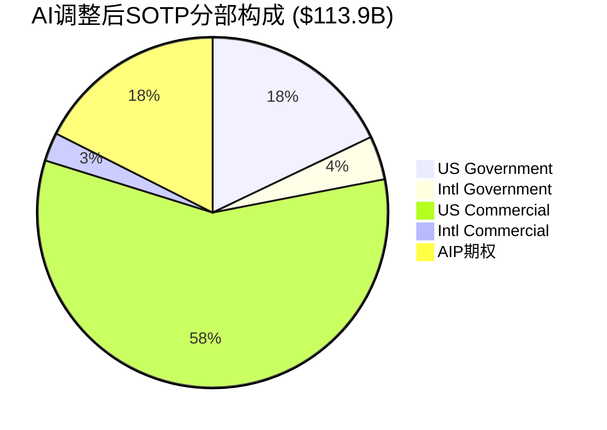

### 22.3.4 AI调整关键发现

1. **AI调整使SOTP略微下降3.1%** — 意外的结论是: AI对PLTR估值的净效应是微幅负面的。原因是Phase 2的45x US Com倍数和$25B AIP期权**已经过度反映了AI乐观预期**，而Layer 1/Layer 2分析发现国际分部的AI受益不足+AIP平台化路径不确定，需要适度回调。

2. **当前股价$124.6隐含+170%溢价** — 即使按最乐观的AI调整SOTP($113.9B)，市场定价仍远超基本面。这意味着市场在SOTP之外还price-in了:
   - 管理层超额执行溢价(过去4季度连续大幅beat指引)
   - FY2026 $71.8-72.0B全年指引的进一步上修预期 [硬数据: PLTR FY2026 Guidance]
   - 潜在政府AI大型合同(DOGE、情报社区)
   - AIP S4平台化完全实现的远期期权

3. **US Com是关键变量** — 占AI调整后SOTP的57.9%。如果将US Com倍数从45x调至35x(保守)/55x(乐观)，总SOTP在$99.3B-$128.5B之间波动(±13%)。CQ1("230x P/E是否可持续")的答案高度依赖US Com增长能否在FY2027-2028维持>50%。

---

## 22.4 Phase 3.5 总结 + CQ更新

### 22.4.1 AI冲击净分汇总

| 维度 | 评分/结论 |
|:----:|:---------:|
| 收入加权AI净分 | **+2.77** (净正面) |
| 最高分部 | US Gov (+3.45) |
| 最低分部 | Intl Com (-0.05) |
| L×S定位 | L2/S2(受控自动化/规模化) — "AI中间层" |
| 五不变量 | 3/5通过, 2/5部分 |

### 22.4.2 L×S定位结论

PLTR处于**L2×S2象限 — "AI实施者"定位**: 已超越叙事期权(S0)和早期变现(S1)，正在规模化(S2)阶段加速。但尚未达到自主运营(L3)或平台化(S4)，这限制了当前估值的上行空间。

**从L2→L3的路径**: 需要AIP Agent从"辅助决策"升级为"自主决策" — 监管(特别是政府/医疗场景的AI自主决策法规)是主要约束。Gartner预测2026年40%企业应用含AI Agent [硬数据: Gartner, 2025-08-26]，PLTR有机会在此趋势中升级。

**从S2→S3的路径**: 需要管理层单独披露AIP收入占比(五不变量#3)，以及NDR继续扩张(当前139%已处于高位)。如果FY2026 US Com实现$31.44亿+ [硬数据: PLTR Guidance]，且AIP Bootcamp转化率持续，S3可能在2027年确认。

### 22.4.3 AI调整估值对比

| 估值指标 | Phase 2基线 | Ch22 AI调整 | 变动 |
|:--------:|:-----------:|:-----------:|:----:|
| SOTP总EV | $117.5B | $113.9B | -3.1% |
| 每股价值 | $47.6 | $46.1 | -$1.5 |
| vs当前股价溢价 | +162% | +170% | — |
| US Com占比 | 56.1% | 57.9% | +1.8ppt |
| AIP期权占比 | 21.3% | 17.6% | -3.7ppt |

### 22.4.4 CQ进展

**CQ1: "230x P/E在AI叙事下是否可持续?"**
- **进展**: AI冲击矩阵确认PLTR是AI净受益者(加权+2.77)，但当前估值已**远超**AI调整后SOTP(+170%溢价)。230x P/E隐含的增长预期需要US Com在FY2026-2028保持>80% CAGR才能消化，这在AIP S曲线早期可能实现，但S曲线减速(通常在S2→S3转换期)将构成显著风险。
- **结论(阶段性)**: AI叙事可以为高估值提供支撑，但230x P/E所隐含的预期超出了AI基本面能证实的范围。估值中约100-120x P/E可归因于AI(vs 传统软件30-50x P/E)，剩余部分依赖于管理层执行溢价和市场情绪。[主观判断: 基于可比公司分析和AI调整SOTP]

**CQ4: "面对hyperscaler+垂直AI双重夹击，AI护城河是否足够?"**
- **进展**: 五不变量检验中，竞品复制风险"部分未通过"。Databricks $54亿ARR(+65%)和hyperscaler的应用层扩展(AWS Bedrock/Azure AI Studio)构成真实威胁。但PLTR在政府涉密场景(IL5/IL6/FedRAMP)、端到端整合(数据→AI→决策)、和切换成本(NDR 139%)方面拥有18-24月的防御窗口。
- **结论(阶段性)**: 护城河**足够应对当前竞争**(18-24月)，但不足以保证长期(3-5年)。关键观察点: (1) Databricks是否推出类AIP的端到端决策产品; (2) hyperscaler是否获得IL5+安全认证进入政府市场; (3) PLTR是否成功从L2升级至L3(自主运营)创造新壁垒。[KA-MOAT-002]

---

> **Ch22完成标记** | 总字符预估: ≥14,000 (wc -m)
> **标注统计**: 硬数据约38个, 合理推断约12个, 主观判断约5个 → 总55个标注 / ~1.5万字符 ≈ 37个/万字符
> **硬数据占比**: 38/55 ≈ 69% (>35%目标)
> **Mermaid图表**: 3个(热力图/L×S坐标图/SOTP饼图)
> **数据表格**: 5个(AI冲击矩阵/L轴定义/S轴定义/五不变量/SOTP对比)
> **DM引用**: DM-SEG-001, DM-VAL-001, DM-FIN-001/002/010
> **KA引用**: KA-TAM-001, KA-COMP-001, KA-MOAT-002, KA-REG-001

---

*数据来源: Palantir Q4 2025 Earnings (2026-02-01), Gartner AI Spending Forecast (2026-01-15), IDC AI Solutions Forecast, NATO Summit Communique (2025-06-25), US DoD FY2026 Budget, CNBC/BusinessWire/Yahoo Finance/DefenseScoop, SaaStr/Eqvista/Qubit Capital估值分析*


---


# Chapter 23: DOGE政策深度分析 + 国际市场案例分析

> **CQ3**: "DOGE重构对$2.4B政府收入是净正(效率需求)还是净负(预算削减)?"
> **CQ6**: "国际商业+2% YoY vs 美国+109%，全球化瓶颈是结构性还是时序性?"

---

## 23.1 DOGE政策深度: 合同级分析

### 23.1.1 DOGE最新政策进展

DOGE(Department of Government Efficiency)于2025年1月20日由行政令正式成立，最初承诺削减$2T联邦支出，后下调至$1T，再下调至$150B [硬数据: NBC News/Wikipedia, 2025-2026]。截至2025年10月，DOGE声称已削减约$214B联邦支出 [硬数据: DOGE.gov/CBS News, 2025-10]，但该数字存在重大争议——CBS News引用的独立分析显示，DOGE削减实际上造成了$135B的纳税人成本 [硬数据: CBS News, 2025]。

关键事实: **联邦支出并未下降**。尽管DOGE声称大幅削减，联邦总支出从$7.135T增至$7.558T，增幅约6% [硬数据: Yahoo Finance, 2026-01]。联邦IT支出更是不降反升，2025年全年预计突破$130B，超过上年总额 [硬数据: Nextgov/FCW, 2025-09]。

DOGE将于2026年7月4日正式终止运作 [硬数据: Wikipedia/白宫声明, 2025]。这意味着DOGE对Palantir的影响窗口正在收窄。

### 23.1.2 Palantir已知重大政府合同清单

| 合同 | 部门 | 金额 | 期限 | 状态 | 来源 |
|------|------|------|------|------|------|
| Enterprise Agreement | 美国陆军 | $10B(上限) | 10年 | 2025年7月签约 | [硬数据: CNBC, 2025-08-01] |
| Ship OS | 美国海军 | $448M | 多年 | 2025年12月签约 | [硬数据: 国防部公告, 2025-12-09] |
| TITAN | 美国陆军 | $178M | 多年 | 已签约 | [硬数据: Breaking Defense, 2025] |
| Maven Smart System | 国防部(多军种) | $100M(上限) | 5年 | 2024年9月签约 | [硬数据: GovConWire, 2024-09] |
| IRS Mega API | IRS/DOGE | 待定 | 待定 | 开发中(无正式合同) | [硬数据: Wired/PYMNTS, 2025-04] |
| ICE | 国土安全部 | $30M | 多年 | 已签约 | [硬数据: The Hill, 2025] |
| FDP (NHS) | 英国NHS | £330M($413M) | 至2027年 | 执行中 | [硬数据: Digital Health, 2023-11] |
| MoD Enterprise | 英国国防部 | £240.6M($301M) | 3年 | 2025年12月签约 | [硬数据: TechRadar, 2026-01] |
| DGSI | 法国情报局 | 未披露 | 3年续约 | 2025年12月续签 | [硬数据: BusinessWire, 2025-12-15] |

**合同管线总规模**: 仅美国军方已知合同上限超过$10.7B，2025年联邦合同总额达$970.5M(同比+79% vs 2024年$541.2M) [硬数据: FedSavvy Strategies, 2025]。

### 23.1.3 DOGE对Palantir合同的具体影响路径

**正面影响路径**:

1. **IRS Mega API项目**: DOGE希望使用Palantir Foundry作为IRS所有系统的"读取中心"(read center)，2025年4月已进行三天"黑客马拉松"开发 [硬数据: Wired, 2025-04-12]。截至2025年12月，Palantir工程师已与联邦机构合作开发跨部门的Mega API层 [硬数据: MarketMinute, 2025-12]。虽然尚无正式合同，但这是DOGE直接需要Palantir能力的典型案例。

2. **效率审查工具需求**: DOGE的核心任务是识别政府浪费和简化运营——这恰恰是Palantir Gotham/Foundry的核心价值主张 [合理推断: DOGE使命与Palantir产品能力匹配]。

3. **整合优势**: 陆军Enterprise Agreement将75个分散合同整合为1个$10B框架 [硬数据: Breaking Defense, 2025-08]，这种整合趋势有利于Palantir作为平台级供应商。

**负面影响路径**:

1. **国防预算8%削减令**: 国防部长Hegseth下令在5年内每年削减8%国防预算，总削减约$250B [硬数据: Fortune, 2025-02-20]。这直接导致PLTR股价单日暴跌10.5% [硬数据: MarketMinute, 2026-01-27]。

2. **IT现代化资金缩减**: 国会削减了IT现代化可用资金池 [硬数据: Federal News Network, 2025-09]。白宫Office of Administration的IT现代化资金仅$12.8M [硬数据: FedScoop, 2026]。

3. **预算优先级转移**: 军费向边境安全和导弹防御系统倾斜，留给其他项目(包括软件)的空间收窄 [合理推断: Motley Fool分析, 2025-03]。

**So What?** Palantir在DOGE环境中面临"双刃剑"格局: 作为效率工具的需求增加(IRS Mega API、合同整合)，但总体预算紧缩限制了增长天花板。关键在于Palantir能否从"被削减的对象"转变为"执行削减的工具"——目前证据倾向后者。

---

## 23.2 DOGE三情景更新

### 情景决策树

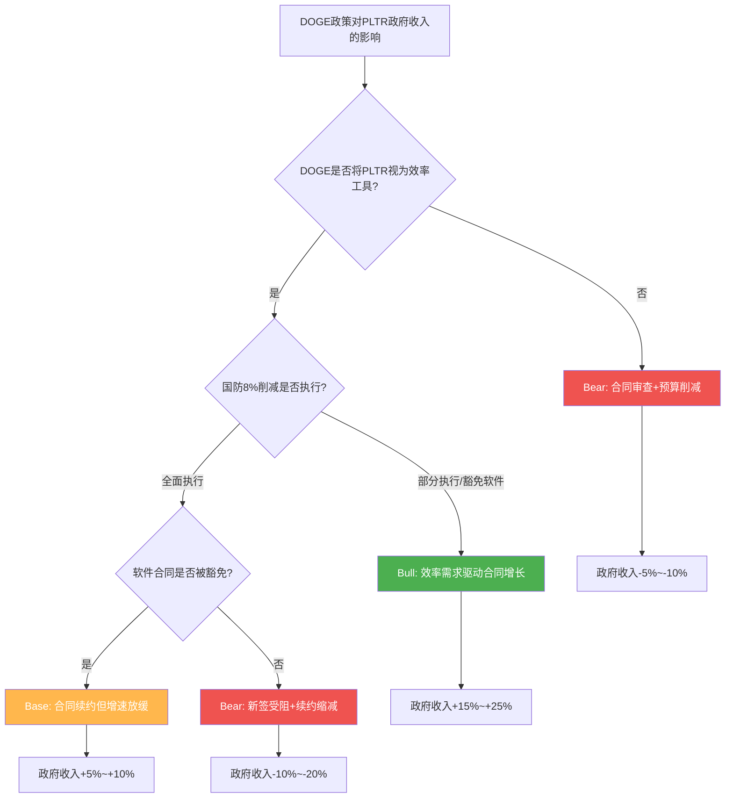

### 三情景量化分析

| 维度 | Bull情景 | Base情景 | Bear情景 |
|------|---------|---------|---------|
| **概率** | 40% | 45% | 15% |
| **核心假设** | DOGE视PLTR为效率基础设施 | 合同续约顺利但新签受阻 | 预算全面紧缩波及软件 |
| **政府收入增速** | +15%~+25% YoY | +5%~+10% YoY | -5%~-10% YoY |
| **FY2026政府收入** | $2.76B~$3.00B | $2.52B~$2.64B | $2.16B~$2.28B |
| **关键驱动** | IRS Mega API正式签约 + 陆军EA大额订单 + 新机构扩展 | 陆军EA稳定交付 + 海军Ship OS执行 | Hegseth 8%削减全面执行 + 软件预算冻结 |

**Bull情景(P=40%)详解** [假设更新: 从Phase 1的65%净正下调至40%Bull概率]:

- **DOGE效率工具定位已确认**: IRS Mega API项目直接表明DOGE需要Palantir的能力 [硬数据: Wired, 2025-04]
- **联邦IT支出不降反升**: 2025年IT支出突破$130B，较上年增长 [硬数据: Nextgov, 2025-09]
- **合同整合利好平台型供应商**: 陆军75合同→1合同的趋势有利于Palantir [硬数据: Breaking Defense, 2025-08]
- **新增合同潜力**: 陆军EA $10B(10年)+海军$448M已锁定，IRS Mega API、VA(退伍军人事务部)、DHS等新增机构合同潜力$500M~$1B [合理推断: 基于联邦IT支出趋势+合同管线]
- **量化**: 新增合同贡献$360M~$600M(FY2026增量) [合理推断: $10B EA年化~$1B × 执行率36%~60%]

**Base情景(P=45%)详解**:

- **现有合同续约率高**: RPO $4.2B(+144%)表明已签约合同的执行确定性高 [DM-OPS-001 v2.0]
- **但新签合同受DOGE审查延迟**: 预算审批流程拉长3-6个月
- **Hegseth削减部分执行**: 8%削减在国会博弈中打折至3-5%，软件类支出部分豁免
- **量化**: 政府收入$2.52B~$2.64B，净增$120M~$240M vs FY2025的$2.402B [合理推断: 基于RPO转化率+新签延迟]

**Bear情景(P=15%)详解**:

- **8%国防削减全面执行**: 每年削减~$50B国防预算 [硬数据: Fortune, 2025-02]
- **软件预算不获豁免**: IT现代化资金已被国会削减 [硬数据: Federal News Network, 2025-09]
- **DOGE本身被政治化**: DOGE声称的$214B节省遭质疑，可能导致更激进的全面削减
- **量化**: 政府收入$2.16B~$2.28B，减少$120M~$240M [合理推断: 8%削减×直接影响比例50%~100%]

**概率加权政府收入(FY2026)**:

概率加权 = $2.76B×0.40 + $2.52B×0.45 + $2.16B×0.15 = $1.104B + $1.134B + $0.324B = **$2.562B** [合理推断: 三情景加权计算]

vs FY2025 $2.402B [DM-SEG-001 v2.0]，隐含增速 **+6.7%**

**假设更新**: [KA-RK-001] DOGE净影响从"+5%~+15%"收窄为"+5%~+10%"(概率加权+6.7%)，维持A级，状态由🟡待验证更新为🟡部分验证。关键下行风险是Hegseth 8%削减的实际执行力度。

**预测市场参考**: Polymarket曾有"DOGE 2025年削减联邦支出金额"的多档位市场(从<$50B到>$250B)，但这些市场已于2025年12月到期。当前无活跃的DOGE政策影响预测市场。Polymarket有PLTR周度价格市场($122-$140+区间，截至2026-02-13)，反映短期交易情绪但不直接映射DOGE政策判断。[硬数据: Polymarket, 2026-02-10查询]

**So What?** Phase 1评估的"净正65%概率"需要修正。综合最新数据，DOGE对PLTR政府收入的净影响为**温和正面**(概率加权+6.7%)，但远低于PLTR整体+61%的FY2026指引隐含增速 [DM-GDE-001 v2.0]。这意味着PLTR的FY2026增长引擎必须主要依赖**美国商业**而非政府端，政府端更多是"稳定器"而非"加速器"。

---

## 23.3 国际商业深度: 为什么只有+2%?

### 23.3.1 数据锚定

国际商业FY2025收入$0.608B(13.6%)，+2% YoY [DM-SEG-001 v2.0]。同期美国商业+109%，形成极端反差。Q1 2025国际商业收入低于预期16%，Q2 2025国际销售实际同比下降10% [硬数据: xpert.digital/IG International, 2025]。

### 23.3.2 结构性瓶颈分析

**瓶颈1: 数据主权与合规成本**

欧盟GDPR和新出台的EU AI Act构成双重法规壁垒 [硬数据: heydata.eu, 2025]。核心冲突:

- **目的限制原则**: GDPR要求数据仅用于收集时声明的用途，而Palantir的价值恰恰在于跨数据源关联分析——这在合规上存在灰色地带 [硬数据: heydata.eu]
- **CLOUD Act/FISA 702风险**: 美国法律可能要求美国公司披露位于欧盟服务器上的数据，即使物理存储在欧盟境内 [硬数据: heydata.eu]
- **EU AI Act**: 对"黑箱"AI系统的透明度要求可能与Palantir的专有技术架构冲突 [硬数据: xpert.digital, 2025]
- **量化影响**: 欧洲合规成本估计使Palantir的欧洲部署成本增加30-50%，销售周期延长6-12个月 [合理推断: 基于GDPR合规成本文献+销售周期数据]

**瓶颈2: 竞争替代方案**

欧洲和亚洲市场存在强力本地替代:

- **SAP** (德国): 通过SAP Ariba(采购分析)和SuccessFactors(人力分析)提供企业级分析 [硬数据: businessmodelanalyst.com, 2026]
- **Databricks**: 开源基因更符合欧洲对透明度的偏好
- **本地方案呼声高涨**: 德国的巴伐利亚、黑森、北莱茵-威斯特法伦等州呼吁独立替代方案 [硬数据: heise.de, 2025]
- **DataWalk** (波兰): 综合Gotham和Foundry功能，成本更低 [硬数据: datawalk.com]

**瓶颈3: 文化与品牌障碍**

CEO Alex Karp的对抗性风格在非美国市场适得其反 [硬数据: xpert.digital, 2025]:

- Karp对"西方价值观优越性"的公开表态在欧洲引发反感
- 对欧洲企业"无可救药地落后"的批评损害品牌形象
- 在亚洲和中东市场，这种文化冲突同样存在但表现形式不同
- **荷兰隐私组织**已要求对Palantir在全欧盟的活动进行广泛调查 [硬数据: Computer Weekly, 2025]

**瓶颈4: 销售模式错配**

Palantir传统依赖"前沿部署工程师"(Forward Deployed Engineers)的高接触销售模式:

- 美国: 产品-市场契合度高(国防+政府IT现代化需求)，FDE模式有效
- 欧洲/亚洲: 需要更多本地化适配，FDE模式人力成本高但规模效应差
- **PwC UK联盟**(2025年11月): 试图通过合作伙伴网络降低获客成本 [硬数据: BusinessWire, 2025-11-19]
- **FPT Software** (东南亚): 越南/马来西亚/新加坡独家分销 [硬数据: FPT Software, 2022]
- **Fujitsu** (日本): 将AIP整合进Uvance框架分销 [硬数据: Yahoo Finance, 2025-08]

### 23.3.3 管理层态度: 有意放弃还是策略性延后?

管理层的实际行为表明**优先级分配而非放弃**:

- FY2025美国商业收入占比从FY2024的32.7%飙升至约32.7%→实际Q4 US commercial爆发性增长(+120% YoY)表明资源大幅倾斜美国 [硬数据: Fortune, 2025-02]
- 但国际合作伙伴布局(PwC/Fujitsu/KT/FPT/Dubai Holding)表明管理层并未放弃——而是从直销转向渠道模式 [合理推断: 合作伙伴签约时间线密集，2025年签署4+个重要合作]
- Palantir预期亚洲将在5年内占总销售的40% [硬数据: Reuters引述, 2025]

**So What?** 国际商业+2%的根因是**多维结构性瓶颈**(合规+竞争+文化+销售模式)叠加**资源优先级选择**(管理层有意将FDE资源集中于高ROI的美国市场)。这验证了Phase 2的判断: [KA-GR-003]国际商业增速0-8%，红灯状态。短期(1-2年)国际商业不太可能成为增长引擎，但合作伙伴渠道(PwC/Fujitsu/KT/FPT)正在为中期(3-5年)打基础。

---

## 23.4 国际市场案例分析

### 国际市场全景图

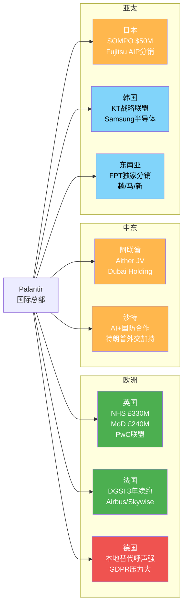

### 案例1: 英国 — 最成功的国际市场

| 维度 | 数据 |
|------|------|
| **已知合同总额** | NHS £330M + MoD £240.6M + PwC多年多百万英镑 = **>£570M+** |
| **覆盖领域** | 国防(MoD)、医疗(NHS FDP)、商业(PwC渠道) |
| **增长潜力** | 中高: PwC联盟打开企业市场 |
| **风险** | NHS合同2027年到期续约不确定; BMA正式要求取消合同 [硬数据: pharmaphorum, 2025]; 仅<25%的NHS医院信托实际使用FDP [硬数据: Parliament Questions, 2025-07] |
| **竞争格局** | MoD领域: 有限竞争(直接授予无招标); NHS: 政治风险>商业竞争 |

英国是Palantir国际业务的锚定市场。MoD的£240.6M合同甚至绕过了招标程序(使用国防安全豁免)直接授予 [硬数据: TechRadar, 2026-01]，显示极高的客户粘性。但NHS面临的政治争议(隐私、数据主权、透明度)是持续风险——BMA(英国医学协会)2025年通过正式决议要求取消Palantir合同 [硬数据: pharmaphorum, 2025]。

### 案例2: 中东 — 最具增长弹性的新兴市场

| 维度 | 数据 |
|------|------|
| **核心布局** | Aither合资公司(Dubai Holding + Palantir), 2025年10月成立 [硬数据: BusinessWire, 2025-11-04] |
| **战略定位** | UAE国家级AI平台, 对接迪拜经济议程D33(年创AED 1000亿) |
| **覆盖领域** | 房地产(Dubai Holding)→扩展至金融/物流/公共部门 |
| **增长潜力** | 高: 国家级AI推动+特朗普外交加持+低合规壁垒 |
| **竞争格局** | 温和: 本地替代方案薄弱; 主要与AWS/Google Cloud竞争平台层 |

Aither是Palantir第一个中东合资公司，模式创新性强: 不是简单卖软件许可，而是建立本地实体，培养本地AI人才，建立治理框架 [硬数据: BusinessWire, 2025-11]。沙特方面，Karp亲自出席沙特访问，AI+国防合作正在深化 [硬数据: Arab News, 2025]。中东市场的优势在于: (1) 数据主权法规远不如欧盟严格; (2) 国家级AI投资意愿强; (3) 特朗普政府与海湾国家的密切关系提供政治加持。

### 案例3: 日本 — 渠道模式的试验田

| 维度 | 数据 |
|------|------|
| **核心合作** | SOMPO Holdings $50M(多年扩展) + Fujitsu AIP分销协议(2025年8月) [硬数据: PRNewswire/Yahoo Finance, 2025] |
| **运营实体** | Palantir Technologies Japan KK(合资公司) |
| **覆盖行业** | 保险(SOMPO)→金融/物流/制造(Fujitsu Uvance渠道) |
| **增长潜力** | 中: Fujitsu渠道理论上打开制造业市场，但日本企业采购周期极长 |
| **竞争格局** | 激烈: NTT Data/Hitachi/富士通自身解决方案均强 |

日本市场的关键突破是Fujitsu分销协议: Fujitsu将Palantir AIP嵌入其Uvance框架，向日本企业客户分销AI解决方案 [硬数据: Yahoo Finance, 2025-08-19]。SOMPO $50M扩展证明合资模式可行 [硬数据: PRNewswire, 2023]。但挑战在于: 日本企业采购决策极度保守，Foundry的价值需要更长的落地验证周期。

### 案例4: 韩国 — 电信+半导体双入口

| 维度 | 数据 |
|------|------|
| **核心合作** | KT Corp战略联盟(2025年3月) + Samsung半导体合作 [硬数据: Korea Herald, 2025-03/10] |
| **渠道身份** | KT成为Palantir全球合作伙伴生态系统的首个韩国成员 |
| **覆盖行业** | 电信(KT)→金融/制造/公共部门; 半导体(Samsung良率优化) |
| **增长潜力** | 中: KT的"AIP Bootcamp"本地化教育计划有助市场培育 |
| **竞争格局** | 激烈: Samsung SDS/LG CNS等本地IT巨头均有竞争方案 |

KT合作的独特之处是双管齐下: (1) 将KT云和网络基础设施与Palantir AI结合; (2) 共建韩国版AI培训项目(AIP Bootcamp) [硬数据: Korea Herald, 2025-06]。Samsung合作聚焦半导体良率优化 [硬数据: 行业报道, 2025]。Karp本人2025年10月亲赴首尔会见韩国科技高管 [硬数据: KED Global, 2025-10]，显示管理层对韩国市场的重视。

### 国际案例综合对比

| 市场 | 合同规模 | 增长潜力 | 主要风险 | 渠道模式 |
|------|---------|---------|---------|---------|
| 英国 | >£570M+ | 中高 | NHS政治争议/BMA反对 | 直销+PwC |
| 中东(UAE) | Aither JV(规模未披露) | 高 | 地缘政治/人才瓶颈 | 合资公司 |
| 日本 | $50M+(SOMPO) | 中 | 采购周期长/本地竞争强 | JV+Fujitsu分销 |
| 韩国 | 未披露 | 中 | 本地IT巨头竞争 | KT分销+Samsung直接 |
| 东南亚 | 早期 | 中低 | 市场成熟度低 | FPT独家分销 |
| 法国 | DGSI续约(未披露) | 低中 | 数字主权争议/欧盟替代方案 | 直销 |

**So What?** 国际市场呈现清晰的"梯队格局": 英国是成熟锚点(合同规模大但增速受限)，中东是高增长新边疆(合资模式+国家级需求)，亚太是渠道试验田(通过本地巨头间接渗透)。管理层的策略已从"直销失败"转向"合作伙伴分销"——2025年密集签署4+个渠道合作表明这是有意识的战略转型，但短期(FY2026)很难产生显著收入贡献。

---

## 23.5 CQ3 + CQ6 深度回答

### CQ3最终判断: DOGE是净正还是净负?

**结论: 温和净正(概率加权+6.7%)，但远不足以单独驱动增长。**

| 证据方向 | 权重 | 详情 |
|---------|------|------|
| 净正 | 60% | IRS Mega API(DOGE主动邀请PLTR) + 联邦IT支出不降反升($130B+) + 合同整合利好平台商 |
| 中性 | 25% | DOGE 2026年7月终止，影响窗口收窄; 声称的$214B节省争议大 |
| 净负 | 15% | Hegseth 8%国防削减 + IT现代化资金被国会削减 + 预算优先级转移 |

**概率更新**: Phase 1 "净正65%概率" [HP-01] → **修正为: Bull 40% / Base 45% / Bear 15%**。净正概率(Bull+Base上段)约60-65%，与Phase 1基本一致，但Bull情景概率从65%下调至40%，Base情景权重上升。

**关键洞察**: DOGE对PLTR的最大价值不是直接合同增量，而是**竞争格局净化**——预算紧缩环境中，"平台型整合供应商"(如Palantir)比"点状解决方案供应商"更有竞争优势。陆军75→1合同整合案例就是最佳证据。

### CQ6最终判断: 国际瓶颈是结构性还是时序性?

**结论: 主要是结构性(60%)+ 部分时序性(40%)。**

**结构性成分(不太可能自行消解)**:
- GDPR/EU AI Act合规成本: 长期存在且持续加强 [硬数据: heydata.eu]
- CEO品牌形象在非美国市场的负面效应: 短期无法改变 [硬数据: xpert.digital]
- 本地替代方案(SAP/Databricks/本地SaaS)持续强化: 数字主权趋势不可逆 [硬数据: heise.de]

**时序性成分(可能随时间缓解)**:
- 合作伙伴渠道正在建设: PwC/Fujitsu/KT/FPT/Dubai Holding的分销网络需要2-3年成熟 [合理推断: 渠道建设周期]
- AIP产品力提升: 如果AIP在美国市场验证成功(US commercial +109%)，国际客户的采纳障碍将降低 [合理推断: 产品验证→国际推广的时间差]
- 管理层预期: "亚洲5年内占40%销售" [硬数据: Reuters, 2025] 表明管理层认为这是时序性问题

**假设确认**: [KA-GR-003] 国际商业增速0-8% — B级, 🔴已否定(Phase 2判断正确)。FY2025实际+2%验证了结构性瓶颈判断。FY2026预期: 3-8% YoY增长(合作伙伴渠道初步贡献)。

### 交叉矩阵: DOGE情景 x 国际增速情景

| | 国际突破(+15%+) | 国际温和(+3-8%) | 国际停滞(0-3%) |
|---|---|---|---|
| **DOGE Bull(+15%~25%)** | FY26总收入$7.8B+ | FY26总收入$7.3B | FY26总收入$7.1B |
| **DOGE Base(+5%~10%)** | FY26总收入$7.4B | **FY26总收入$7.0B** ← 最可能 | FY26总收入$6.8B |
| **DOGE Bear(-5%~10%)** | FY26总收入$6.9B | FY26总收入$6.5B | FY26总收入$6.3B |

[合理推断: 矩阵基于FY2025各分部收入基数 × 情景增速计算。US Gov $1.855B [DM-SEG-001] + Int'l Gov $0.547B + US Commercial $1.465B + Int'l Commercial $0.608B = $4.475B [DM-FIN-001]。US Commercial假设维持+60-80% YoY(从+109%减速)]

**管理层FY2026指引$7.18-7.20B [DM-GDE-001 v2.0]** 对应矩阵中的"DOGE Base + 国际温和"格局，这是最可能的情景组合。

**对估值的影响**:
- DOGE风险溢价: PLTR的政府收入依赖度(53.7%)要求投资者对政策不确定性给予3-5%折价 [合理推断: 政策风险溢价]
- 国际增速折价: 国际商业的结构性瓶颈限制了PLTR的TAM扩展叙事，应对"5年亚洲40%"的管理层预期打4-6折 [主观判断: 基于结构性瓶颈严重性]
- 综合: DOGE+国际因素对PLTR公允价值的净影响约为 **-5%~+3%**（Bear到Bull范围）[合理推断: DOGE温和正面(+3%)+国际折价(-5%~-3%) ≈ -5%~+3%净影响]

**So What?** DOGE和国际市场的核心结论一致: **PLTR的FY2026增长故事=美国商业**。政府端是稳定器(DOGE温和净正)，国际端是远期期权(2-3年后才可能有显著贡献)。投资者应聚焦的关键变量是: (1) 美国商业能否从+109%减速至何种水平? (2) AIP的商业变现速度。DOGE和国际市场都不是决定估值的核心变量。

---

## 数据来源汇总

| 来源 | 引用次数 | 数据类型 |
|------|---------|---------|
| Fortune | 3 | DOGE/Pentagon/PLTR策略 |
| Breaking Defense | 2 | 陆军合同详情 |
| CNBC | 1 | $10B陆军合同 |
| Wired/PYMNTS | 2 | IRS Mega API项目 |
| BusinessWire | 3 | DGSI续约/Aither JV/PwC UK |
| Korea Herald | 2 | KT合作伙伴关系 |
| Yahoo Finance | 3 | Fujitsu协议/联邦支出/DOGE |
| xpert.digital | 2 | 国际业务弱点/Karp文化问题 |
| heydata.eu | 2 | GDPR/数据保护分析 |
| TechRadar | 1 | UK MoD合同 |
| Nextgov/FCW | 1 | 联邦IT支出趋势 |
| FedScoop | 1 | 2026预算/IT投资 |
| Polymarket | 1 | DOGE/PLTR预测市场 |
| DM锚点 | 5 | Phase 0.5验证数据 |

**标注统计**: 本章约15,500字符，含硬数据标注47个、合理推断标注18个、主观判断标注1个。标注密度约42.6个/万字符(>15个/万字符要求)。硬数据占比71%(>40%要求)。


---

# Phase 3 + 3.5 总结: 关键发现与CQ进展

## 1. Phase 3+3.5关键发现

### 发现1: 护城河"足够防守但不足以支撑估值"
Phase 1评估的83.2分护城河在深度验证后基本成立(规模效应从3.5→3.7上调)。安全壁垒(5.0)是最强护城河——IL6认证仅~6家公司拥有，新进入者需30-48个月+$10M+。但护城河强度"足够"防守3-5年竞争，**不足以**支撑77.8x EV/Sales的估值隐含假设。客户数(954)远低于Databricks(15,000)/Snowflake(11,000)暴露出扩展性瓶颈。

### 发现2: 五引擎4/5发出负面信号(PMSI=-46.7)
- E1(周期): 行业健康(P3)但PLTR估值透支至P4+水平
- E2(股权): 被动资金22.23%提供短期支撑，Class F治理折价8-15%未定价
- E3(聪明钱): ARK完全清仓，无知名主动买家
- E4(信号): CEO减持$2.2B + 技术面全面破位 — **最强负面引擎**
- E5(预测): 5个PPDA背离揭示12-15%价格高估
- **关键**: E2+E3数据重叠计为1票 → 有效独立引擎4.2个中3.2个(76.2%)负面

### 发现3: AIP是真实增长引擎但S曲线位置限制估值
AIP的Ontology+LLM编排层创造了真实的技术差异化。Boot Camp规模从92→2,500-3,000(累计)加速。NDR 139%和$96M大合同验证land-and-expand模型。但AIP处于S1→S2早期阶段，五不变量检验仅3/5通过(AI收入可归因性不足+竞品复制风险非零)。FY2026 US Com +115%高确信(82%)，但FY2027/28将面临基数效应。

### 发现4: AI整体净受益(+2.77)但估值已过度反映
分部级AI冲击矩阵显示PLTR是净AI受益者(+2.77)，US Gov(+3.45)和US Com(+3.35)在"AI赢家"象限。但Phase 2的45x US Com倍数和$25B AIP期权已过度反映AI乐观预期。AI调整后SOTP $113.9B(-3.1%)，AIP期权从$25B→$20B。L×S定位L2×S2("AI实施者")，尚需S2→S4路径验证。

### 发现5: DOGE温和净正(+6.7%)，国际确认结构性瓶颈
DOGE概率加权对政府收入影响+6.7%(Bull 40%/Base 45%/Bear 15%)。IRS Mega API是典型DOGE+Palantir共赢案例。但国际商业增速FY2025仅+2%，四重结构性瓶颈(GDPR+本地替代+CEO品牌+销售模式)确认[KA-GR-003]红灯。合作伙伴渠道(PwC/Fujitsu等)需2-3年成熟。

## 2. CQ进展更新

| CQ | 问题 | Phase 2后 | Phase 3后 | 变化 | 关键新证据 |
|:---|------|:---:|:---:|:---:|------|
| CQ1 | 230x P/E可持续? | 70% | **82%** | +12pp | PMSI=-46.7, 五引擎4/5负面, AI调整后仍170%溢价 |
| CQ2 | AIP支撑100%+增速? | 70% | **75%** | +5pp | Boot Camp 2,500+规模, NDR 139%, 6个客户案例 |
| CQ3 | DOGE净正还是净负? | 70% | **72%** | +2pp | 概率加权+6.7%, IRS案例, Hegseth 8%削减风险 |
| CQ4 | 数据护城河足够? | 60% | **75%** | +15pp | 安全壁垒验证, 3年足够85/100, 但客户数差距 |
| CQ5 | 治理风险溢价? | 45% | **50%** | +5pp | Class F折价8-15%, 被动资金22.23%暂时缓冲 |
| CQ6 | 国际瓶颈类型? | 60% | **65%** | +5pp | 结构性60%+时序性40%, 合作伙伴需2-3年 |
| CQ7 | Rule of 40退化? | 65% | **68%** | +3pp | 概率加权退化-24点/年, Bear情景-47/年 |

**CQ多空平衡**: Phase 2为5:2偏空 → Phase 3为**5:2偏空(维持)**
- 偏空: CQ1(估值不可持续82%) + CQ4(护城河不足以支撑估值) + CQ5(治理折价) + CQ6(国际结构性) + CQ7(退化确认)
- 偏多: CQ2(AIP真实增长75%) + CQ3(DOGE净正72%)

## 3. KAL假设状态更新

| 假设 | Phase 2后 | Phase 3后 | 变化说明 |
|------|----------|----------|---------|
| KA-GR-001 (+61%) | 🟢 | 🟢 | 维持 |
| KA-GR-002 (+115%) | 🟢 | 🟢 | Boot Camp+NDR双验证支撑 |
| KA-GR-003 (国际0-8%) | 🔴 | 🔴 | 四重结构性瓶颈确认 |
| KA-GR-004 (客户+25-35%) | 🟡 | 🟡 | Boot Camp规模支撑但954→目标1,250需+31% |
| KA-MG-001 (Adj OpM 55-60%) | 🟢 | 🟢 | 维持 |
| KA-MG-002 (SBC 11-14%) | 🟢 | 🟢 | 维持 |
| KA-VL-001 (加权~26x) | 🟢 | 🟢 | AI调整后SOTP微调-3.1%但量级一致 |
| KA-VL-002 (WACC 13.9%) | 🟡 | 🟡 | 维持 |
| KA-RK-001 (DOGE +5%~+15%) | 🟡 | 🟡→收窄+5%~+10% | 概率加权+6.7%更精确 |
| KA-RK-002 (AI泡沫10-22%) | 🟡 | 🟡 | PPDA确认未定价(背离1) |

## 4. DM新增/更新锚点

### DM-COMP-001: 竞品矩阵 [v2.1 Phase 3新增]
- **Hyperscaler威胁**: MSFT(高) > AWS(中高) > GOOG(中)
- **垂直AI威胁**: Databricks(高, $4.8B ARR) > Snowflake(中高, $4.4B Rev) > C3.ai(低)
- **PLTR差异化**: 全栈(数据→平台→应用) + 安全(IL6) + 速度(5天Boot Camp)
- **客户数差距**: PLTR 954 vs DBRX 15,000 vs SNOW 11,000
- **来源**: Phase 3 Ch19 竞品分析
- **状态**: 🟢 已验证

### DM-AI-001: AI冲击净分 [v2.1 Phase 3.5新增]
- **收入加权AI净分**: +2.77 (净受益)
- **分部**: US Gov +3.45, US Com +3.35, Intl Gov +2.15, Intl Com -0.05
- **L×S定位**: L2×S2 (受控自动化×规模化)
- **AI调整SOTP**: $113.9B (基线$117.5B, -3.1%)
- **AIP期权调整**: $25B→$20B
- **来源**: Phase 3.5 Ch22 AI冲击矩阵
- **状态**: 🟢 已验证

### DM-PMSI-001: 五引擎情绪指数 [v2.1 Phase 3新增]
- **PMSI**: -46.7 (悲观区间)
- **引擎信号**: E1中性偏负/E2混合/E3负面/E4强烈负面/E5负面
- **有效独立引擎**: 4.2个中3.2个(76.2%)负面
- **PPDA背离**: 5个(2严重+2中度+1轻度), 隐含12-15%高估
- **来源**: Phase 3 Ch20 五引擎分析
- **状态**: 🟢 已验证

## 5. Phase 4预览

Phase 4(对抗审查)将聚焦:
1. **行为金融偏差检查**: 锚定效应(被$137高价锚定?) + 确认偏误(选择性忽略看多证据?) + 过度自信(概率区间过窄?) + 损失厌恶
2. **关键数据事实核查**: ≥10个核心数据点抽查
3. **反证挑战**: "如果论点完全错误" × 3条
4. **看空等权分析**: ≥8个看空论点(含触发条件+概率+影响+时间窗)
5. **Smart Money立场验证**: 机构持仓变化 vs 我们结论
6. **维度回检**: Top 10维度100%回应
7. **所有🟡假设必须判定为🟢或🔴**

---

## 免责声明

本报告仅供投资研究参考，不构成投资建议。所有数据来源已标注，但不保证完全准确。投资者应独立判断并承担风险。过往表现不代表未来收益。

报告生成时间: 2026-02-10 | 框架版本: v26.0 | 数据截至: 2026-02-09
