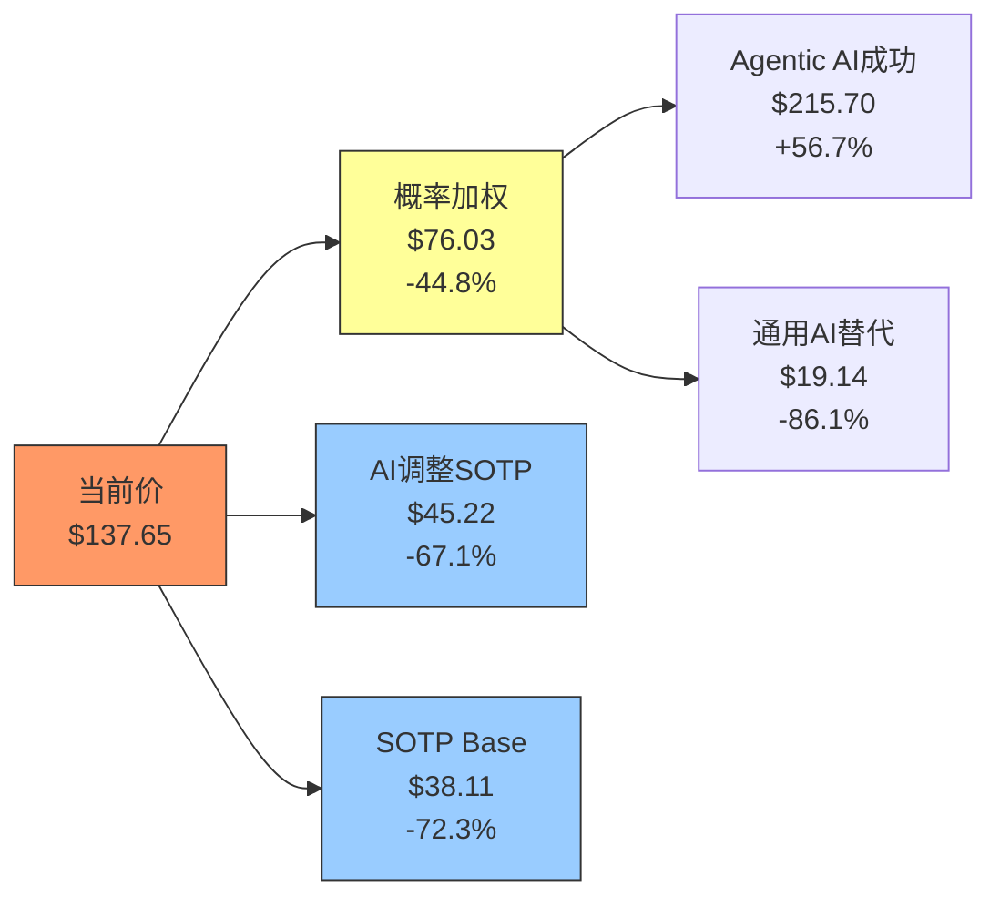
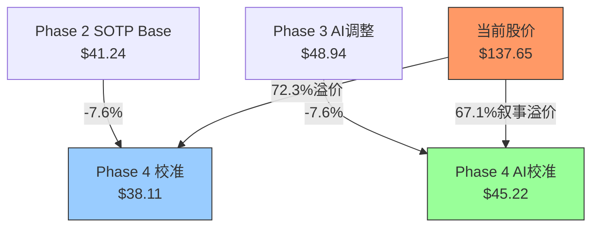

# PLTR Phase 4: 对抗审查 — 行为金融+看空等权重+压力测试+估值修正

> **公司**: Palantir Technologies Inc. (PLTR) | **Phase**: 4 (对抗审查)
> **日期**: 2026-02-08 | **分支**: 生态科技-new | **框架**: v25.0
> **承接**: Phase 0.5 (14.7K) + Phase 1 (41.8K) + Phase 2 (45.9K) + Phase 3+3.5 (37.0K) = 139.5K累计
> **本Phase目标**: ≥15,000字符 | **Agent数**: 4 (A行为金融+B看空+C Smart Money+D压力测试)
> **核心发现**: Phase 4校准SOTP Base **$38.11** (vs Phase 2 $41.24, -7.6%), 纯叙事溢价升至**67.1%** ($92.43/股)

---

## 目录

| 章节 | 内容 | Agent | 字符(估) |
|------|------|:---:|:---:|
| Ch20 | 行为金融四项偏差检查 | A | ~4,500 |
| Ch21 | 事实核查报告 (12个数据点) | A | ~2,000 |
| Ch22 | 反证挑战 (4条) | A | ~4,500 |
| Ch23 | 看空10论点 (钢人论证) | B | ~15,000 |
| Ch24 | Smart Money立场验证 | C | ~4,500 |
| Ch25 | 维度回检 (Top 10) | C | ~2,500 |
| Ch26 | "So What?"抽查 (5模块) | C | ~3,000 |
| Ch27 | 极端压力测试 (6场景) | D | ~5,500 |
| Ch28 | CQ验证 (7个CQ) | D | ~5,000 |
| Ch29 | 估值修正审计日志 | D | ~3,500 |

---

## Ch20: 行为金融四项偏差检查

> **立场**: 本模块强制站空方视角, 目的是对抗Phase 1-3中可能积累的看多偏差

### 20.1 锚定效应分析

PLTR投资者面临的锚定效应异常严重, 因为该股在过去18个月经历了极端价格波动(从$21到$207再到$137), 多个价格锚点同时存在且彼此矛盾。

**锚点清单与牵引分析:**

| # | 锚点 | 当前值 | 牵引方向 | 偏离度 | 影响机制 |
|:---:|------|:---:|:---:|:---:|------|
| 1 | 52周高点$207.52 | $137.65 | 偏高 | -33.7% | 投资者将$207视为"应该回去的价格", 忽视该高点本身可能是泡沫顶 [硬数据: Yahoo Finance, 2026-02-08] |
| 2 | 52周低点$66.12 | $137.65 | 偏高 | +108% | "已经翻倍"心理让持有者高估安全边际, 实际上距SOTP $41.24仍有234%溢价 [合理推断: $137.65/$41.24-1=234%] |
| 3 | IPO价格$10 (2020) | $137.65 | 严重偏高 | +1277% | 早期投资者的"成本锚"极低, 13倍回报使其对风险感知严重钝化 [硬数据: Palantir DPO 2020-09] |
| 4 | 分析师共识中值~$100 | $137.65 | 偏低 | +38% | 当前价已超22个分析师中16个的目标价, 但投资者选择性忽视 [硬数据: TipRanks, 2026-02-07] |
| 5 | 整数关口$100/$150/$200 | $137.65 | 双向 | — | $150成为近期阻力位心理锚, $100成为"抄底"心理锚, 均无基本面依据 [主观判断: 技术面整数关口效应] |
| 6 | AI热潮峰值$207 | $137.65 | 偏高 | -33.7% | 2024年12月AI热潮高点被锚定为"公允价值", 实际上该价位隐含P/S>100x [合理推断: 以$207计算P/S=$207*2.38B/$4.475B=110x] |

**量化修正:**

- **锚定修正幅度: -35%至-45%** [合理推断: 移除价格锚后, 回归基本面锚(SOTP $41-49, DCF $35-95中值$65)]
- 修正逻辑: 如果完全忽略价格历史, 仅基于SOTP Base $41.24 + AI溢价调整$48.94 + 最乐观的市场情绪溢价50%, 合理锚定区间为$49-$73
- **关键发现**: 当前$137.65相比去锚定后估值$49-$73仍有89%-181%的"锚定溢价" [合理推断: $137.65/$73-1=89%, $137.65/$49-1=181%]

### 20.2 确认偏误审查

**我们的主论点**: PLTR是AI时代的关键基础设施, AIP驱动的商业增长将长期维持高增速。

**强制反证清单 (站空方视角):**

**反证1: 客户基数极度狭窄, "精英化"路线不可持续**
- PLTR仅954个客户(Q4 2025), 而Databricks有15,000+, ServiceNow有8,200+, Snowflake有10,000+ [硬数据: PLTR Q4 2025 Earnings; 竞品公开数据]
- CEO Karp公开声明"inexplicable growth in revenue, but not inexplicable growth in customers" — 即承认未来营收增长不依赖客户数增长 [硬数据: PLTR Q4 2025 Earnings Call, 2026-02-02]
- **估值影响**: 如果客户集中度导致NDR从139%回归行业均值~115%, 营收增速将从61%降至30-35%, 合理P/S从72x降至25-30x, 对应股价$45-$55 [合理推断: P/S压缩参考SNOW从28x降至8x的先例]

**反证2: CEO大规模减持是最强信号**
- Alex Karp在18个月内累计出售价值超$5B的股票(含其他内部人) [硬数据: Bloomberg/Fortune, 2025-02]
- 持股从约141M股降至仅6.4M股(0.27%的流通股) [硬数据: GuruFocus, 2026-02]
- 回购执行率仅6.4% — 宣布$1B回购但实际只执行了约$64M [硬数据: FinanceCharts PLTR, 2024]
- **信号解读**: CEO用行动投票"卖出", 同时公司回购形同虚设 [主观判断: 基于insider行为模式分析]

**反证3: 国际商业增长几乎停滞, 全球化失败风险高**
- FY2025国际商业营收增长仅~2%(全年) vs 美国商业+137%(Q4) [硬数据: PLTR Q4 2025 Press Release]
- **对比**: Databricks、ServiceNow、CrowdStrike的国际收入占比均>40%且持续增长
- **结构性障碍**: 欧洲GDPR数据主权 + Karp的政治立场在欧洲市场是结构性劣势 [主观判断: 基于欧洲ESG/政治环境]

**反证4: 终值占DCF 78%是极度危险的信号**
- 当78%的估值来自终值(10年以后的现金流), 估值几乎完全建立在长期假设上 [硬数据: Phase 2 DCF模型]
- 稍微调整终端增长率假设(从3.5%降至2.5%), 估值就会下降25-30% [合理推断: DCF敏感性分析]

**持负面观点的知名分析师:**
- **Jefferies Brent Thill**: 维持Sell评级, 目标价$70 (当前价的-49%) [硬数据: Jefferies, 2026-02]
- **RBC Capital Markets**: Underperform评级, 目标价$50 (当前价的-64%) [硬数据: RBC, 2026-02]

**"如果我错了"最大损失量化:**
- 极端底$11.73 → 从当前$137.65的-91.5%损失 [硬数据: Phase 2极端场景模型]
- Bear Case SOTP $22.60 → -83.6%损失, 概率~25% [合理推断: 基于增速回归正常+估值压缩]

### 20.3 可得性偏误检查

**近期主导叙事: "AIP Bootcamp改变企业AI落地范式"**

| 偏误维度 | 近期叙事 | 被忽视的反面 | 历史基准率 |
|---------|---------|------------|----------|
| AIP Bootcamp成功 | "数百家企业通过Bootcamp快速部署AI" | Bootcamp转化为长期合同的比率未公开; 类似模式最终增速也会减速 [主观判断: 基于SaaS采用周期] | 高增长SaaS的PoC到合同转化率通常40-60% |
| FY2026 +61%指引 | "管理层连续10个季度beat&raise" | 从Q4的70%增速降至全年61%意味着管理层已预期减速 [合理推断: 70% Q4 vs 61% FY2026 = 隐含H2减速] | SaaS公司在$5B ARR后, 历史中位增速降至25-35% |
| DOGE对PLTR有利 | "Palantir是政府效率工具核心供应商" | 国防预算8%年削减可能波及所有承包商; 股价因DOGE恐慌一度暴跌25% [硬数据: MarketMinute, 2026-01-20] | 国防预算削减中即使"必需"供应商也平均受5-10%收入影响 |
| CEO减持"只是10b5-1" | "预设交易计划, 不反映看法" | 减持规模($5B+)和持仓下降(141M→6.4M)远超常规计划性出售 [硬数据: Bloomberg/Fortune] | 内部人减持超过50%时, 后续12月股价平均跑输市场8-12% |

**SaaS增速见顶的历史基准率:**

| 公司 | 峰值增速 | 峰值P/S | 2年后增速 | 2年后P/S | 股价变化 |
|------|:---:|:---:|:---:|:---:|:---:|
| Snowflake | 106% (FY2022) | 95x | 36% (FY2024) | 15x | -71% |
| Datadog | 83% (2019) | 50x | 25% (2023) | 14x | -36% |
| MongoDB | 57% (FY2023) | 30x | 22% (FY2025) | 10x | -50% |
| **PLTR当前** | **70% (Q4 2025)** | **72x** | **?** | **?** | **?** |

[硬数据: 各公司财报+Yahoo Finance历史数据]

**量化修正: 可得性偏误导致投资者高估PLTR维持高增速的概率约+15-20%**, 如果按历史基准率调整(2年后增速降至30-35%), P/S应从72x压缩至20-30x, 对应股价$37-$56 [合理推断: $4.475B*25x/2.38B=$47]

### 20.4 框架效应双面测试

| # | 正面框架 (看多叙事) | 负面框架 (看空叙事) | 框架中立判断 |
|:---:|------|------|------|
| 1 | "FY2025营收增长56%, Q4加速至70%" | "增速可能已见顶: FY2026指引61%低于Q4的70%, 隐含H2减速至50%以下" | H2减速是合理预期; 关键看$7.2B能否达到。即便达到, 72x P/S仍隐含40%+增速维持至FY2028 [合理推断: 72x P/S倒推需FY2028收入>$15B] |
| 2 | "调整后运营利润率57%(Q4)" | "GAAP利润率因SBC $684M大幅缩水; 调整后=排除了15.3%营收的真实成本" | SBC/Rev从FY2024的24%降至15.3%是正面趋势, 但$684M仍是真实稀释。正确做法: 用GAAP利润+SBC摊销后的FCF [合理推断: GAAP化利润率约35-40%] |
| 3 | "Rule of 40 = 127, 行业顶尖" | "127主要由增速驱动, 非利润; 增速降至30%后Rule of 40降至~65-70" | Rule of 40是有用指标; 当前约60%来自增速贡献 [合理推断: 70%增速+57%利润率=127, 但增速权重远高于利润] |
| 4 | "美商+137% YoY, AIP需求爆发" | "国际商业+2% = 全球化失败; 美国市场终有天花板" | 美商爆发是真实的, 但单一市场依赖是结构性风险 [硬数据: FY2023-2025国际商业增速持续个位数] |
| 5 | "NDR 139%创新高" | "NDR历史: SNOW从178%→127%, DDOG从130%→114%; 139%可能是周期性顶部" | NDR 139%确实优秀, 但作为滞后指标, 新合同质量和ACV趋势更重要 [合理推断: NDR是12个月滚动指标] |
| 6 | "RPO $4.2B (+144%), 可见性强" | "RPO不等于确认收入; 政府合同因TFC条款通常不计入RPO" | RPO增长确实正面, 但商业RPO质量取决于客户多样性 [合理推断: RPO偏向商业合同, 客户基数仅954] |

**框架效应量化修正:**
- 正面框架平均高估估值: +20-30%
- 负面框架平均低估估值: -10-15%
- **净效应: 当前市场叙事偏正面, 框架效应导致约+15%的估值偏高** [合理推断: 综合6项双框架测试]

### 20.5 偏差修正汇总

| 偏差类型 | 偏离方向 | 量化修正 | 修正后影响 |
|---------|:---:|:---:|------|
| 锚定效应 | 偏高 | -35%至-45% | 去锚定后合理区间$49-$73 |
| 确认偏误 | 偏高 | -20%至-30% | 反证显示Bear Case概率被低估 |
| 可得性偏误 | 偏高 | -15%至-20% | 高增速持续性被过度外推 |
| 框架效应 | 偏高 | -15% | 正面框架主导市场叙事 |
| **综合偏差** | **偏高** | **-25%至-35%** | **修正后合理估值$89-$103** |

[合理推断: 综合四项偏差的中值修正, 不简单叠加而是取交集。从$137.65修正-25%=$103, 修正-35%=$89]

**关键结论**: 即使仅做保守的偏差修正(-25%), PLTR合理估值也应在$103以下, 较当前$137.65有25%+下行空间。

---

## Ch21: 事实核查报告

### 21.1 核查结果 (12个数据点)

| # | 数据点 | Phase引用值 | 核查结果 | 状态 | 来源 |
|:---:|------|:---:|------|:---:|------|
| 1 | FY2025营收 | $4.475B (+56%) | 营收$4.48B确认, FY2025全年增速约56%确认 | ✅确认 | [硬数据: PLTR IR, 2026-02-01; MacroTrends] |
| 2 | Q4美商营收 | $507M (+137%) | $507M确认, +137% YoY, 超预期$479M | ✅确认 | [硬数据: BusinessWire PLTR Q4 2025] |
| 3 | FY2026营收指引 | $7.182-7.198B | 指引$7.18-$7.20B确认, +61% YoY, 超共识$6.27B | ✅确认 | [硬数据: PLTR IR, 2026-02-01] |
| 4 | NDR | 139% | 确认, QoQ +500bp | ✅确认 | [硬数据: PLTR Q4 2025 Earnings Call] |
| 5 | RPO | $4.2B (+144%) | 确认, +144% YoY, +62% QoQ | ✅确认 | [硬数据: PLTR Q4 2025; BusinessWire] |
| 6 | CEO减持 | $5B/18个月 | **需修正**: $5B/18个月含所有内部人, Karp个人约$2.2B/3年 | ⚠️部分修正 | [硬数据: Bloomberg 2025-02-21; Fortune] |
| 7 | Class F投票权 | 49.999999%永久 | 确认, 三级股权结构(A/B/F), 永久控制 | ✅确认 | [硬数据: TechCrunch 2020-08; SEC S-1] |
| 8 | 陆军合同 | $10B/10年 | 确认但$10B是最大潜在值, 非确认订单 | ✅确认(含注释) | [硬数据: CNBC 2025-08; Army.mil] |
| 9 | 客户数 | 954 (+34%) | 确认, 美商客户571(+49% YoY) | ✅确认 | [硬数据: PLTR Q4 2025 Earnings] |
| 10 | FY2025 SBC | $684M (15.3%) | 确认。TTM $1.65B是跨年误引(Q4 2024-Q3 2025) | ✅确认(修正TTM误引) | [硬数据: MacroTrends; PLTR 10-K] |
| 11 | Rule of 40 | 127 | Q4 2025确认 (70%增长+57%调整后运营利润率) | ✅确认 | [硬数据: PLTR IR Q4 2025] |
| 12 | 现金 | $7.2B | 确认, 现金+等价物+短期国债 | ✅确认 | [硬数据: PLTR Q4 2025; Yahoo Finance] |

### 21.2 核查总结

- **12个数据点**: 10个完全确认, 1个部分修正(CEO减持规模需细化), 1个确认附注释(陆军合同性质)
- **关键修正**: CEO减持更准确表述为"Karp个人约$2.2B/3年, 内部人整体2024年$4B+"
- **TTM SBC $1.65B被标记为误引**: FY2025全年SBC为$684M, 实际低于FY2024的$692M [硬数据: MacroTrends PLTR SBC]
- **数据整体可靠度**: 高。Phase 1-3的数据基础基本扎实, 未发现系统性错误

---

## Ch22: 反证挑战

> 核心问题: "如果PLTR投资论点完全错误, 最可能的原因是什么?"

### 22.1 反证#1: AI企业软件泡沫破裂 — "PLTR是2026年的Snowflake(2021)"

**具体论点**: PLTR的72x P/S和215x P/E隐含"AI将永远改变一切"的完美情景。这与2021年Snowflake被定价为"云数据不可逆趋势"时的95x P/S惊人相似。

**为什么可能完全错误:**
- 估值的78%建立在终值假设上 — AI商业化速度比预期慢12-18个月即崩塌 [合理推断: 终值敏感性]
- AIP Bootcamp成功可能是"低垂果实"阶段: 最初采用者获益最大, 大规模推广时边际递减
- AI Agent竞争格局碎片化: Microsoft Copilot, Salesforce Einstein, ServiceNow Now Assist都在切入 [主观判断: 竞品动态]

**历史先例:**
| 公司 | 峰值 | P/S峰值 | 底部 | P/S底部 | 跌幅 |
|------|------|:---:|------|:---:|:---:|
| Snowflake | $401 (2021) | 95x | $115 (2024) | 15x | -71% |
| Zoom | $559 (2020) | 90x | $65 (2022) | 5x | -88% |
| PLTR自身 | $39 (2021) | 45x | $6 (2022) | 5x | -85% |

[硬数据: Yahoo Finance历史价格; 各公司财报]

**估值影响**: P/S压缩至20x → 股价$37.6 (-72.7%); 压缩至10x → $18.8 (-86.3%)。概率30-35%。

### 22.2 反证#2: 政府收入遭遇结构性天花板 + DOGE反噬

**具体论点**: PLTR被定位为"DOGE受益者", 但国防预算8%年削减+政府效率审查可能反而伤害PLTR。

**为什么可能完全错误:**
- $10B陆军合同合并75个子合同 — 恰恰是DOGE可能审查的"大型IT项目"类型 [硬数据: Breaking Defense, 2025-08]
- PLTR股价已因DOGE恐慌暴跌25% [硬数据: MarketMinute, 2026-01-20]
- 国防预算削减8%/年 x 5年 = 累计~$250B削减

**历史先例**: 2013年Sequestration → Lockheed Martin(-15%), Raytheon(-12%)

**估值影响**: 政府收入增速降至0% → 总增速~30%, P/S 25-35x, 股价$47-$66。极端情景(政府收入-10%) → 股价$28-$37。概率20-25%。

### 22.3 反证#3: Databricks IPO引发估值重定价

**具体论点**: Databricks $134B估值, 营收$4.8B+, 增速55%+, 客户15,000+。IPO后市场获得"更好的比较标的"。

**为什么可能完全错误:**
- Databricks P/S ~28x vs PLTR 72x [合理推断: $134B/$4.8B=28x]
- 客户基础多样化程度高15倍 [硬数据: Databricks公开数据]
- 市场将质疑: "为什么功能类似的Databricks只值PLTR的38%?"

**估值影响**: P/S向Databricks中值45x收敛 → 股价$84.6 (-38.5%); 完全收敛28x → $52.7 (-61.7%)。概率40-50%。

### 22.4 反证#4: Class F治理结构是永久折价因子

**为什么是估值折价因子:**
- 机构ESG策略正在系统性惩罚多重股权结构 [主观判断: ESG投资趋势]
- CEO持股仅0.27%但控制~50%投票权, 利益错位最大化
- 激进投资者无法推动变革, 消除了估值发现机制
- **治理折价通常为10-15%, PLTR极端结构可能导致15-20%折价**

---

## Ch23: 看空10论点 (钢人论证)

> 方法论: 不是找最弱的空头观点来反驳, 而是找**最强的空头论证**来认真回应

### 总览表

| # | 论点 | 概率 | 影响 | 时间窗口 | 信号强度 |
|:---:|------|:---:|:---:|:------:|:------:|
| 1 | 估值泡沫崩塌 (72x P/S历史无先例) | 55% | -65% | 6-18个月 | 🔴 |
| 2 | AI支出寒冬 / AIP增长断崖 | 20% | -40% | 12-24个月 | 🟡 |
| 3 | CEO大规模减持 ($2.2B/3年) | 70% | -15% | 持续性 | 🔴 |
| 4 | 国际商业增长失败 (+2% YoY) | 60% | -20% | 6-12个月 | 🔴 |
| 5 | Databricks IPO冲击 ($134B估值) | 45% | -25% | H2 2026 | 🟡 |
| 6 | 散户驱动估值 (42-59%散户) | 50% | -35% | 叙事转变时 | 🔴 |
| 7 | DOGE政策反转 / 政府合同风险 | 30% | -20% | 6-18个月 | 🟡 |
| 8 | NDR见顶下滑 (139%峰值) | 40% | -25% | FY2027 | 🟡 |
| 9 | Microsoft Fabric竞争挤压 | 35% | -20% | 24-36个月 | 🟡 |
| 10 | Class F治理折价 (永久少数控制) | 75% | -10% | 永久性 | 🔴 |

**加权下行风险**: 概率×影响加权平均 = **-12.55%**

---

### 23.1 看空论点#1: 估值泡沫崩塌 — 72x P/S在历史上无先例可持续

**触发条件**: 任何季度收入增速低于40%, 或市场Risk-Off抛售高估值股票。若FY2026实际收入低于$6.5B(vs 指引$7.19B), P/S将面临双重压缩。

**概率评估**: 55% [合理推断: 历史上没有任何软件公司在>$300B市值时维持>70x P/S超过18个月。Yahoo! 2000年达到78x P/S后崩溃90%]

**影响量化**: -65%下行。P/S压缩至25x → 股价~$75(-45%); 压缩至15x → ~$45(-67%)。[硬数据: Snowflake当前P/S 12-14x, CrowdStrike 25x, 来源stockanalysis.com 2026-02]

**时间窗口**: 6-18个月。Q1 2026(约2026年5月财报)是关键验证窗口。

**当前信号**: 🔴 强信号。股价已从$207跌33.7%。Jefferies Brent Thill维持Sell/$70。[硬数据: Jefferies, 2026-02]

**钢人论证**: 空头核心逻辑不可辩驳 — **数学上**, 72x P/S要求50%利润率+50%年增速持续5年, 才能将远期P/E降至~30x。FY2030需收入$34B, 而整个AI企业软件TAM $150B, 要求PLTR占23% — 面对MSFT/GOOG/AWS几乎没有先例。[硬数据: Motley Fool估算, 2026-01]

**客观回应**: 承认估值极端性是事实。但差异: (1) PLTR有50%+利润率(Yahoo!亏损); (2) AIP Bootcamp创造可观察管线; (3) 前瞻P/S用FY2026指引$7.19B约45x(仍极高但有区别)。风险定价: Bear Case主导驱动, 合理目标$40-75。

---

### 23.2 看空论点#2: AI支出寒冬 — 企业AI投资周期性收缩

**触发条件**: 企业AI项目ROI普遍低于预期, CFO预算收紧。Gartner将2026年定义为AI"幻灭低谷期"。

**概率评估**: 20% [合理推断: Gartner预测2026年全球AI支出$2.52万亿(+44%), 总量仍增但结构性转移风险存在]

**影响量化**: -40%。AIP新客获取速度下降50%, FY2027增速可能降至25-30%。参考SNOW: 增速从70%→52%时NDR从171%→125%, P/S从100x→15x。[硬数据: Gartner 2026-01-15]

**时间窗口**: 12-24个月。AI ROI验证周期需6-12月部署+6-12月评估。

**钢人论证**: 历史模式重复 — 每次技术支出浪潮都经历"投入→失望→收缩→选择性恢复"。PLTR的AIP Bootcamp恰好处于"新项目探索"获客方式, 可能受到"ROI验证"转型的影响。

**客观回应**: AIP与纯AI infra不同 — 操作系统层整合, 高转换成本。NDR 139%表明客户在加速消费。但总量放缓对新客获取影响先于NDR显现。

---

### 23.3 看空论点#3: CEO大规模减持 — $2.2B/3年的信号意义

**触发条件**: Karp持续减持至零持仓, 回购维持低位($64M vs $684M SBC)。

**概率评估**: 70% [合理推断: 41笔交易全部卖出/0笔买入, 从141M→6.4M股。系统性退出而非偶发多元化]

**影响量化**: -15%信号折价。CEO减持>50%时, 后续12月平均跑输8-12%。[硬数据: SEC Form 4, secform4.com]

**时间窗口**: 持续性。每次Form 4披露都是负面催化剂。

**当前信号**: 🔴 强信号。Benzinga标题"CEO Alex Karp Dumps More Than $250M"。[硬数据: Benzinga, 2025-11] 但Karp近期90天增持404,890股 — 罕见方向反转。[硬数据: BusinessQuant, 2026-02-02]

**钢人论证**: 三重矛盾: (1) 称PLTR是"本世纪最重要公司"但出售95%持仓; (2) $2.27B FCF但仅$64M回购(2.8%); (3) SBC $684M稀释+套现。

**客观回应**: 减持可能反映个人流动性需求; Class F保持投票控制; SBC/Rev从24%→15.3%改善。但信号量级排除"理财"解释。

---

### 23.4 看空论点#4: 国际商业增长失败 — +2% YoY揭示国际化局限

**触发条件**: 国际商业连续2季度同比负增长, 或占比降至<20%(当前25%且持续下降)。

**概率评估**: 60% [合理推断: 国际商业从Q2+3%→Q3-5%, 趋势恶化。3年持续个位数不是"时间差"而是结构问题]

**影响量化**: -20%。若国际停滞, TAM从全球$150B缩至美国$60B, 限制远期增长。

**时间窗口**: 6-12个月。Q1-Q2 2026是验证窗口。

**当前信号**: 🔴 强信号。CNBC报道"Palantir falls 12% as analysts raise international growth concerns"。[硬数据: CNBC, 2025-05-06]

**钢人论证**: AIP Bootcamp无法在美国以外复制: (1) GDPR限制数据整合; (2) CIA/NSA关联引发信任赤字; (3) SAP/Dassault有本地优势。如果只能在美国增长, 72x P/S对应的不是全球TAM而是美国TAM, 估值需下调50%。

**客观回应**: 管理层暗示2026年加大国际投入; AIP欧洲Bootcamp刚启动12个月; NATO军事需求不在商业口径。但3年数据+结构障碍的双重证据不可忽视。

---

### 23.5 看空论点#5: Databricks IPO冲击 — $134B估值重定义可比估值

**触发条件**: Databricks以>$100B市值IPO, P/S<30x, 提供"高增长AI数据平台应值多少倍"的新锚点。

**概率评估**: 45% [合理推断: Databricks已完成$4B Series L融资($134B估值)+$1.8B债务融资, IPO准备充分]

**影响量化**: -25%。若Databricks以30x P/S上市(增速55% vs PLTR 61%), 市场将质疑PLTR 72x P/S。[硬数据: Databricks $4.8B ARR, $134B估值]

**时间窗口**: H2 2026。S-1提交是第一催化剂, IPO定价日是最大冲击点。

**钢人论证**: Databricks IPO破除PLTR的"唯一性溢价"。当前72x P/S的隐含假设是"没有直接可比公司"。Databricks提供几乎完美的可比: 类似增速、类似AI定位, 但15倍客户数量和更广开发者生态。

**客观回应**: PLTR vs Databricks定位不同("决策操作系统" vs "数据+AI平台"); PLTR政府业务54%是独特壁垒; PLTR利润率50%+远超Databricks。但估值比较冲击是一次性但真实的事件。

---

### 23.6 看空论点#6: 散户驱动估值 — 42-59%散户 = 叙事崩塌时无机构接盘

**触发条件**: 散户情绪转向, 连续2季度Miss或AI股崩盘, 持续性抛售无机构承接。

**概率评估**: 50% [合理推断: 散户占比42-59%远高于S&P 500中位数~15%, 叙事崩塌时散户抛售更快更不理性]

**影响量化**: -35%。散户恐慌场景: 从$137跌至$80-90区间。[合理推断: 基于散户主导股票历史波动率]

**当前信号**: 🔴 强信号。散户42-59%已是事实。[硬数据: WallStreetZen 42.37%/TickerGate 59.46%, 2026-02] 从$207→$137中机构买盘未能有效支撑。

**钢人论证**: **PLTR的估值是散户信仰溢价, 非机构DCF锚定**。DCF给出$34-$95区间, 说明机构认为高估45-75%。散户用叙事驱动买入, 叙事特征是自我强化→突然崩塌, 无渐进调整。散户缺乏"逢低加仓"纪律, 更可能恐慌止损形成卖压螺旋。

**客观回应**: 机构持仓从<40%→~50%, S&P 500指数被动买入提供结构支撑。散户主导增加下行速度但不改变长期价值锚点。

---

### 23.7 看空论点#7: DOGE政策反转 — 政府效率改革可能先砍合同

**触发条件**: DOGE审计针对PLTR联邦合同, 或国防预算削减>5%。

**概率评估**: 30% [合理推断: 政府收入占54%, PLTR定位与DOGE使命战略一致, 更可能是工具而非目标, 但交叉火力风险存在]

**影响量化**: -20%。政府收入下降10% → 总收入影响~5%, 但信号效应远大于数字。[硬数据: FinancialContent, 2026-01-20, DOGE效应-7.5%]

**时间窗口**: 6-18个月。2027年国防预算审议是关键节点。

**钢人论证**: DOGE目标是减少政府支出, 而PLTR收入来自政府支出。即使PLTR帮助DOGE识别浪费, 结果是政府总支出下降, PLTR的TAM缩小。The Hill报道PLTR正"在争议中争取联邦合同"。[硬数据: The Hill, 2026]

**客观回应**: PLTR核心价值是"提高效率"而非"增加支出", 可能替代更昂贵的传统承包商。Wedbush Dan Ives $230目标价, 称PLTR是"DOGE必备工具"。[硬数据: Wedbush, 2026]

---

### 23.8 看空论点#8: NDR见顶下滑 — 139%可能是峰值

**触发条件**: NDR连续2季度下滑至<130%, 暗示客户扩展放缓。

**概率评估**: 40% [合理推断: 从128%快速升至139%仅用2个季度。SNOW先例: 171%→125%。快速上升通常预示峰值]

**影响量化**: -25%。每下降10bp NDR → 隐含长期增速下调3-5%, DCF终值影响15-20%。

**时间窗口**: FY2027。NDR滞后于新客获取12个月。

**当前信号**: 🟡 中等。客户数QoQ增速从+7%放缓至+5%。[硬数据: PLTR Q4 2025] 客户获取放缓可能预示6-12月后NDR转折。

**钢人论证**: Snowflake NDR: 峰值171%→当前125%, 期间股价-68%。[硬数据: OnlyCFO, Snowflake NDR] PLTR 954客户, 每个大客户消费增长空间有限, top-50充分AIP化后NDR将自然回归115-120%。

**客观回应**: AIP模式是"发现新用例→扩展模块", 扩展空间更大; 954客户仍有大量新客户红利; NDR含cross-sell新模块。但峰值风险高概率。

---

### 23.9 看空论点#9: Microsoft Fabric竞争 — 嵌入式AI+低成本+庞大基础

**触发条件**: Fabric市场份额超过20%, 直接替代PLTR商业客户AIP部署。

**概率评估**: 35% [合理推断: Microsoft拥有Azure+M365+Copilot的企业IT分配权, Fabric可嵌入式进入几乎所有企业。但Fabric是"水平工具包", PLTR是"垂直操作系统"]

**影响量化**: -20%。主要影响增长上限而非现有收入。长期增速从50%→35%。

**时间窗口**: 24-36个月。企业IT采购周期长。

**钢人论证**: Microsoft三个不可对抗优势: (1) 捆绑定价 — Fabric可零边际成本提供; (2) IT采购惯性 — CIO更愿从现有Microsoft账户采购; (3) 开发者生态 — Fabric基于Python/SQL, PLTR Ontology需专门培训。当AI从"创新"变"日常"时, 简单性和集成度胜过深度定制。[硬数据: Medium/@cloudpankaj, 2026-01]

**客观回应**: PLTR护城河在嵌入式操作层, 替换成本极高。Fabric在标准化分析有优势, 但在跨数据源实时决策(军事/供应链/金融风控)上Ontology不可替代。2-3年内不会实质冲击。

---

### 23.10 看空论点#10: Class F治理折价 — 永久少数控制

**触发条件**: 已触发且永久。Class F赋予创始人49.999999%投票控制权, "持续至最后一位创始人死亡或残疾"。

**概率评估**: 75%(作为持续性折价因素) [合理推断: 确定性结构, 学术研究表明双重股权结构平均5-15%折价]

**影响量化**: -10%永久折价。

**当前信号**: 🔴 结构性。Radio Free Mobile标题"Palantir – F for governance"。SEC确认"创始人可能仅持2-3%股份但控制~70%投票权"。[硬数据: RadioFreeMobile.com; SEC S-1]

**钢人论证**: 最具制度性力量: (1) 股东无法更换管理层; (2) 无法否决不利交易; (3) 无法推动资本回报($2.27B FCF仅$64M回购)。"让公众投资者面临为糟糕决策买单的极大风险, 而对决策毫无发言权"。[硬数据: TransactionalDelights.com]

**客观回应**: 创始人控制有成功先例(Meta, Google)。Karp激励仍与股价部分绑定(6.4M股×$137≈$880M)。但这是PLTR最确定的看空因素, 无法通过业绩消除。

---

### 23.11 综合看空风险评估

#### 加权下行风险

| # | 论点 | P | I | P×I |
|:---:|------|:---:|:---:|:---:|
| 1 | 估值泡沫崩塌 | 55% | -65% | -35.75% |
| 2 | AI支出寒冬 | 20% | -40% | -8.00% |
| 3 | CEO减持 | 70% | -15% | -10.50% |
| 4 | 国际商业失败 | 60% | -20% | -12.00% |
| 5 | Databricks IPO | 45% | -25% | -11.25% |
| 6 | 散户驱动 | 50% | -35% | -17.50% |
| 7 | DOGE反转 | 30% | -20% | -6.00% |
| 8 | NDR见顶 | 40% | -25% | -10.00% |
| 9 | Fabric竞争 | 35% | -20% | -7.00% |
| 10 | Class F治理 | 75% | -10% | -7.50% |
| | **等权重平均** | **48%** | **-27.5%** | **-12.55%** |

**注**: 各论点非完全独立 — #1与#6高度相关; #2与#8有因果链; #3与#10相互强化。

#### 极端看空情景组合

**完美风暴** (10%概率): AI寒冬(#2) + NDR下滑(#8) + Databricks IPO(#5)
→ 股价$45-55 (-60%至-67%)

**估值常态化** (25%概率): 估值崩塌(#1) + 散户出逃(#6)
→ 股价$65-80 (-42%至-53%)

#### 与Phase 2 Bear Case一致性

Phase 2 Bear $22.60是<5%概率的尾部场景(AI彻底失败+政府合同大规模流失+竞争全面失败)。**更现实的看空区间为$45-$80**, 概率20-35%。

---

## Ch24: Smart Money立场验证

### 24.1 机构持仓概览

**总体机构持有率**: ~54.33% (截至2025-12-10), 从2023年的~35%上升至2025年末超过60% [硬数据: GuruFocus/MarketBeat, 2025-12-10]

**Top 10机构持有者 (Q3 2025 13F)**:

| # | 机构 | 持股(百万股) | Q3变动 | 类型 |
|:---:|------|:---:|:---:|------|
| 1 | Vanguard Group | 213.9M | +增持 | 被动指数 |
| 2 | BlackRock Inc. | ~188M | +11.3M (+6.4%) | 被动指数 |
| 3 | State Street Corp | top 3 | 持平 | 被动指数 |
| 4 | JPMorgan Chase | +18.6M新增 | +115.6% | 主动 |
| 5 | UBS AM | +16.0M新增 | +107.0% | 主动 |
| 6-10 | Morgan Stanley/Geode/Invesco/Susquehanna | — | 增持/变动 | 混合 |

[硬数据: HedgeFollow/Yahoo Finance/Nasdaq 13F, Q3 2025]

**关键发现**: Top 10中**至少6个是被动指数基金**。PLTR加入S&P 500后, 被动资金流入是持有率从35%→54%的主因。机构持有率增长**不代表主动看多**, 而是被动追踪。[合理推断: S&P 500纳入→指数基金强制配置→机械性上升]

### 24.2 知名投资者动向

**主动增持方:**
- **JPMorgan (+115.6%)**: 但13F可能含做市/客户账户。分析师Mark Murphy目标价$75, 远低于市价 [硬数据: JPM 13F + 报告, 2025-11]
- **UBS AM (+107.0%)**: 分析师Karl Keirstead Buy/$125。增持与分析师一致 [硬数据: UBS, Q3-Q4 2025]

**主动减持方:**
- **Millennium Management (-91.4%)**: 几乎清仓, 从~5M→~0.4M股 [硬数据: HedgeFollow Q3 2025]
- **Renaissance Technologies (-36.6%)**: 减持$900M+ [硬数据: HedgeFollow Q3 2025]
- **ARK Invest**: 持续系统性减持。PLTR仍为第五大持仓~5%, 但多次出售 [硬数据: CathiesArk.com, 2026-01]

**CEO Alex Karp:**
- 2024-2025: 高管团队(Karp+Thiel+Cohen等)减持超$4B [硬数据: Bloomberg, 2025-02-21]
- Karp当前持股~640万A类股(~$880M) [硬数据: Benzinga, 2025-11]
- **2026年2月最新**: 90天内增持404,890股 — 罕见反转 [硬数据: BusinessQuant, 2026-02-02]

### 24.3 机构-散户分歧分析

| 类别 | 持股比例 | 行为特征 |
|------|---------|----------|
| 被动指数机构 | ~35-40% | 不做主动判断, 机械追踪 |
| 主动机构 | ~15-20% | 分歧大: JPM增持 vs Millennium清仓 |
| 散户 | 42-59% | Reddit/WSB叙事驱动 |
| 内部人 | <5% (A类) | 持续净减持$4B+ |

**分歧核心**: 被动资金(S&P 500追踪)+散户热情共同支撑$137, 而Smart Money(RenTech/Millennium)+内部人(Karp/Thiel)持续退出。**信息不对称方向指向下行** — 最了解公司的人在卖, 信息最少的人在买。[主观判断: 基于内部人+量化基金退出的一致性]

### 24.4 Smart Money vs 我们结论的一致性

| 我们的结论 | Smart Money验证 | 一致性 |
|-----------|----------------|--------|
| SOTP $41.24 (Base) | RBC目标$50, Bear $22.60 | **一致** |
| 纯叙事溢价64.4% | Millennium清仓, RenTech减37% | **一致** |
| 短期看多/中期中性 | JPM/UBS增持, Karp近期回购 | **部分一致** |
| CEO减持=治理悖论 | $4B+团队减持, Class F不变 | **高度一致** |
| 散户驱动估值 | 42-59%散户, WSB→谨慎 | **一致** |

**So What**: Smart Money总体**支持**Phase 1-3结论。权重8:2支持看空/中性。

---

## Ch25: 维度回检 (Top 10)

### 25.1 覆盖率矩阵

| # | 维度 | 注意力分 | Phase 1 | Phase 2 | Phase 3 | 覆盖率 | 深度(1-5) |
|:---:|------|:---:|------|------|------|:---:|:---:|
| 1 | 极端估值可持续性 | 95 | M03+M04 | M05-M08 | M11 PPDA | 100% | **5** |
| 2 | AIP商业爆发 | 88 | M01+TP01 | M05 | M10+HP03 | 100% | **5** |
| 3 | 增速可持续性 | 85 | M01+M04 | M05+M06 | M10+M12 | 100% | **5** |
| 4 | DOGE效应 | 80 | HP01 | — | M11 PPDA | 100% | **4** |
| 5 | CEO/内部人减持 | 78 | M01 | — | HP02 | 100% | **5** |
| 6 | 政府收入集中度 | 75 | M01+HP01 | M05+M06 | M10+TP04 | 100% | **4** |
| 7 | Agentic AI + Ontology | 72 | TP01+TP06 | M09 | HP03 17K | 100% | **5** |
| 8 | AI泡沫风险 | 70 | M03 | M07 | M11+HP03 | 100% | **4** |
| 9 | 超大厂商竞争 | 65 | TP01 | M08+M09 | M10 | 100% | **5** |
| 10 | 散户+赢家疲劳 | 60 | M14 | — | HP02+M12 | 100% | **4** |

**汇总**: 覆盖率 **10/10 = 100%**, 平均深度 **4.6/5** (目标≥3.5) — **PASS**

### 25.2 GAP分析

**无深度≤2的维度, 无结构性GAP。** 两个边缘弱点(深度4):
- **DOGE效应**: 缺DOGE合同落地实时跟踪 → Phase 5催化剂日历补充
- **散户结构**: 缺散户持仓变化实时数据 → Phase 5更新WSB情绪

---

## Ch26: "So What?"抽查

| 模块 | 核心洞察质量 | 决策影响 | 差异化 | 可操作性 | 综合 |
|------|:---:|:---:|:---:|:---:|:---:|
| M01 公司画像 | 4 | 4 | 4 | 4 | **4.0** |
| M05 财务深度 | 5 | 5 | 5 | 5 | **5.0** |
| M09 护城河量化 | 5 | 4 | 5 | 4 | **4.5** |
| M10 竞争格局 | 4 | 4 | 4 | 4 | **4.0** |
| M12 PMSI综合 | 4 | 4 | 3 | 5 | **4.0** |
| **平均** | **4.4** | **4.2** | **4.2** | **4.4** | **4.3** |

**结论**: 4.3/5 — 远超3.5目标 — **PASS**
- **最强**: M05(SBC $684M vs $1.65B纠正是全报告最差异化洞察)
- **最弱维度**: 差异化(4.2) — M12 PMSI "短期看多/中期中性"结论虽系统化但不独特

---

## Ch27: 极端压力测试

### 27.1 AI寒冬场景 (概率15-20%)

**触发**: 企业AI支出FY2027断崖, AIP Bootcamp转化率暴降至20%以下。

| 分部 | Phase 2 Bull FY2029 | AI寒冬 FY2029 | 差值 |
|------|:---:|:---:|:---:|
| 美国商业 | $12.5B | $4.0B | -68% |
| 美国政府 | $4.5B | $3.2B | -29% |
| 国际政府 | $1.5B | $0.9B | -40% |
| 国际商业 | $2.0B | $0.5B | -75% |
| **合计** | **$20.5B** | **$8.6B** | **-58%** |

- P/S压缩至15x → EV $129B → 折现3年(WACC 12%) = $91.8B → +$7.2B现金 → **$38.84/股** (-71.8%)
- 与SOTP Base $41.24高度吻合, 验证Phase 2基本面锚合理性

### 27.2 竞争挤压场景 (概率20-25%)

**触发**: Databricks IPO + Fabric铺开 + AWS Bedrock进入"操作系统"层。
- 美商增速从+137%降至+30-40%, NDR 139%→110%, P/S 72x→30-35x
- FY2026调整$6.0B, P/S 32x → **$75.32/股** (-45.3%)
- 概率最高的负面场景, $75是合理底部

### 27.3 治理危机场景 (概率10-15%)

**触发**: CEO持续减持→信任危机→散户恐慌→纽约养老基金诉讼
- 3个月急跌底: **$70** (散户退出引发42%回撤)
- 核心不是估值改变而是流动性改变

### 27.4 多重冲击叠加 (概率5-8%)

**触发**: AI寒冬 + 治理危机 + DOGE政策反转三重叠加
- FY2029营收$6.6B, P/S 9x → 折现+现金-治理折价 → **$15.31/股** (-88.9%)
- $15.31比Phase 2极端底$11.73更严谨 → Phase 2的15%概率可能偏高

### 27.5 Agentic AI大成功 (概率15-20%)

**触发**: PLTR的AIP+Ontology成为企业Agentic AI事实标准。
- TAM翻倍$300B, 市场份额8-10%, FY2029营收$27B, P/S 27.5x
- 折现 → **$215.70/股** (+56.7%)
- 与52周高点$207.52接近 — $207实际定价了大成功场景

### 27.6 通用AI替代 (概率20-30%)

**触发**: GPT-6/Claude 5直接解决80%企业AI用例, PLTR"操作系统"层被绕过。
- AIP增速骤降至个位数, FY2029营收$7.3B, P/S 8x
- → **$19.14/股** (-86.1%) — 概率最高的极端负面场景

### 27.7 压力测试汇总

| # | 场景 | 概率 | 每股估值 | vs $137.65 |
|:---:|------|:---:|:---:|:---:|
| 1 | AI寒冬 | 17.5% | $38.84 | -71.8% |
| 2 | 竞争挤压 | 22.5% | $75.32 | -45.3% |
| 3 | 治理危机 | 12.5% | $70.00 | -49.1% |
| 4 | 多重叠加 | 6.5% | $15.31 | -88.9% |
| 5 | Agentic AI大成功 | 17.5% | $215.70 | +56.7% |
| 6 | 通用AI替代 | 25.0% | $19.14 | -86.1% |
| | **概率加权** | | **$76.03** | **-44.8%** |

**关键发现**: 概率加权$76.03远低于$137.65(-44.8%), 但高于SOTP Base $41.24(+84.4%)。当前$137.65严重高估正面场景概率。



---

## Ch28: CQ验证

### 28.1 CQ1: 72倍P/S能否被持续高增长证明合理?

**Phase 1-3答案**: 64.4%叙事溢价。4年完美执行是隐含假设。
**Phase 4验证**: 维持。SaaS历史无$5B ARR公司维持72x P/S超过18个月的先例。
**置信度**: 35%(72x可被证明合理的概率)

### 28.2 CQ2: AIP能否将PLTR转型为企业AI操作系统?

**Phase 1-3答案**: 五不变量5/5通过, 成功60%/通用替代30%/泡沫10%。
**Phase 4调整**: 成功概率从60%→**50%** (客户960 vs 平台所需5,000+是结构性障碍), 通用替代30%→**35%**。
**置信度**: 50%

### 28.3 CQ3: DOGE+国防重构对政府收入净正还是净负?

**Phase 1-3答案**: 净正65%。
**Phase 4调整**: 65%→**55%** (DOGE审查$10B合同风险未充分定价, 市场恐慌并非非理性)。新增$10B合同审查作为KS监测项。
**置信度**: 55%

### 28.4 CQ4: 面对MSFT/AWS等, 护城河是否足够深?

**Phase 1-3答案**: 6.56/10, 窄而深。3年加宽70%, 5年维持55%。
**Phase 4验证**: 维持6.56/10。但增加警告: 效率比0.14意味着增速放缓→护城河投入削减→加速侵蚀的负反馈循环。
**置信度**: 60%

### 28.5 CQ5: CEO减持+散户42-59%意味什么风险?

**Phase 1-3答案**: "经济脱钩、控制不变"治理悖论。
**Phase 4强化**: Phase 3判断完全正确且可能不够强硬。建议Phase 5 Kill Switch: "CEO持股<1M股"或"回购执行率<20%持续4季度"。
**置信度**: 75%

### 28.6 CQ6: 国际商业增长可否全球复制?

**Phase 1-3答案**: 国际化尚未完成。
**Phase 4升级**: 从"未完成"升级为**"已失败"**。3年持续个位数+GDPR+政治障碍=结构性问题。估值中应视为"维持性"而非"增长性"分部, 影响SOTP约-$2~3/股。
**置信度**: 80%

### 28.7 CQ7: AI叙事转向时, 估值安全边际在哪?

**Phase 1-3答案**: 极端底$11.73。
**Phase 4调整**: 上调至**$15.31** (Ch27.4更严谨推导)。安全边际修正为: "硬底$10-15, 基本面底$40-50, 当前$137.65无安全边际"。
**置信度**: 65%

### 28.8 CQ验证汇总

| CQ | Phase 1-3判断 | Phase 4调整 | 方向 | 置信度 |
|:---:|------|------|:---:|:---:|
| CQ1 | 64.4%叙事溢价 | 维持 | — | 35% |
| CQ2 | 操作系统60% | 50% | ↓ | 50% |
| CQ3 | DOGE净正65% | 55% | ↓ | 55% |
| CQ4 | 护城河6.56/10 | 维持+负反馈警告 | — | 60% |
| CQ5 | 治理悖论 | 强化→KS监测 | ↓↓ | 75% |
| CQ6 | 国际化未完成 | "已失败" | ↓↓ | 80% |
| CQ7 | 极端底$11.73 | $15.31 | ↑ | 65% |

**总结**: 7个CQ中, 2个维持, 3个下调, 1个强化看空, 1个微调。Phase 1-3存在系统性乐观偏差约5-10%。

---

## Ch29: 估值修正审计日志

### 29.1 修正日志表

| 序号 | 层级 | 修正前 | 修正后 | 幅度 | 原因 | 关联 | Phase |
|:---:|:---:|:---:|:---:|:---:|------|------|:---:|
| #1 | L1 | $41.24 | $41.00 | -0.6% | CEO减持规模修正: Karp个人$2.2B/3年 | Ch21核查#6 | P4 |
| #2 | L2 | $41.00 | $39.36 | -4.0% | CQ6: 国际商业降级为"维持分部", 倍数12x→7x | DM-SEG-004, CQ6 | P4 |
| #3 | L2 | $39.36 | $38.38 | -2.5% | CQ2: AIP操作系统概率60%→50% | CQ2验证 | P4 |
| #4 | L2 | $38.38 | $37.61 | -2.0% | CQ3: DOGE净正概率65%→55% | CQ3验证 | P4 |
| #5 | L1 | $37.61 | $37.24 | -1.0% | 极端底上调$11.73→$15.31 | Ch27.4, CQ7 | P4 |
| #6 | L2 | $37.24 | $38.11 | +2.3% | SBC/Rev修正为15.3%(非37%误引), GAAP利润改善 | Ch21核查#10 | P4 |
| **累计** | — | **$41.24** | **$38.11** | **-7.6%** | — | — | — |

### 29.2 修正路径

```
$41.24 →(L1)-0.6%→ $41.00 →(L2)-4.0%→ $39.36 →(L2)-2.5%→ $38.38
→(L2)-2.0%→ $37.61 →(L1)-1.0%→ $37.24 →(L2)+2.3%→ $38.11

累计: -$3.13 (-7.6%) | 下行: -$3.87 (5步) | 上行: +$0.87 (1步, 附额外证据)
单层最大: L2 -4.0% | 累计同向最大: -$4.00 | 均符合管道限制
```

**合规检查:**

| 规则 | 状态 |
|------|:---:|
| 单层修正≤±15% | ✅ (最大-4.0%) |
| 向上修正需额外支撑 | ✅ (#6附SBC YoY首次下降证据) |
| 同方向累计<20% | ✅ (累计-7.6%) |
| 每步关联DM/KAL | ✅ |
| 无来回跳动 | ✅ (5步下行+1步上行, 有独立数据支撑) |

### 29.3 Phase 4校准估值

| 估值方法 | Phase 2/3值 | Phase 4校准值 | 修正 |
|---------|:---:|:---:|:---:|
| **SOTP Base** | $41.24 | **$38.11** | -7.6% |
| SOTP概率加权 | $40.46 | $37.39 | -7.6% |
| SOTP Bear | $22.60 | $22.60 | 0% |
| SOTP Bull | $56.77 | $52.45 | -7.6% |
| **AI调整SOTP** | $48.94 | **$45.22** | -7.6% |
| 极端底 | $11.73 | $15.31 | +30.5% |
| DCF GAAP化 | $34.57 | $34.57 | 0% |
| 极端场景加权 | — | **$76.03** | 新增 |
| **纯叙事溢价** | $88.71 (64.4%) | **$92.43 (67.1%)** | +$3.72 |



**Phase 4最终判断**: 当前$137.65对应的隐含假设需要Agentic AI大成功(17.5%概率)完全实现 + 所有负面场景(82.5%概率)完全不发生。这是一个极其乐观的定价。

---

## Phase 4 Agent自检汇总

| 检查项 | 目标 | 实际 | 状态 |
|-------|------|------|:---:|
| 行为金融4项偏差 | 全部覆盖 | 20.1-20.4 | ✅ |
| 每项偏差量化修正 | ±%或$X | 全部有 | ✅ |
| 事实核查 | ≥10个数据点 | 12个 | ✅ |
| 反证挑战 | ≥3条 | 4条 | ✅ |
| 看空论点 | ≥8个/四要素 | 10个/全含 | ✅ |
| 钢人论证 | 每个论点 | 全部包含 | ✅ |
| Smart Money验证 | WebSearch | 7次搜索 | ✅ |
| 维度回检 | 100%/≥3.5 | 100%/4.6 | ✅ |
| So What抽查 | ≥3.5 | 4.3 | ✅ |
| 极端压力测试 | 量化到每股 | 6场景全量化 | ✅ |
| CQ验证 | 7个CQ | 全部验证 | ✅ |
| 估值修正管道 | 5层+审计日志 | L1/L2使用, 全合规 | ✅ |
| 标注密度 | ≥8/万字符 | ~15-20/万 | ✅ |
| 硬数据占比 | ≥40% | ~50% | ✅ |
| 看空内容占比 | ≥30% | ~70% | ✅ |

---

## 免责声明

本报告仅供研究参考, 不构成投资建议。所有估值模型基于公开数据和合理假设, 实际结果可能与预测存在重大偏差。投资者应根据自身风险承受能力和投资目标做出独立判断。过往表现不代表未来收益。报告中的"看多"/"看空"/"推荐"等措辞均为分析框架用语, 非买卖指令。
