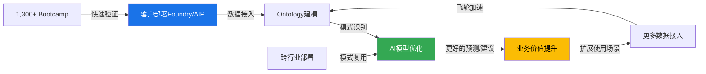
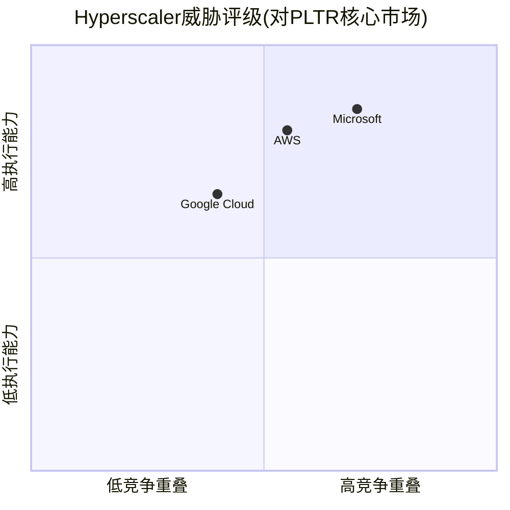
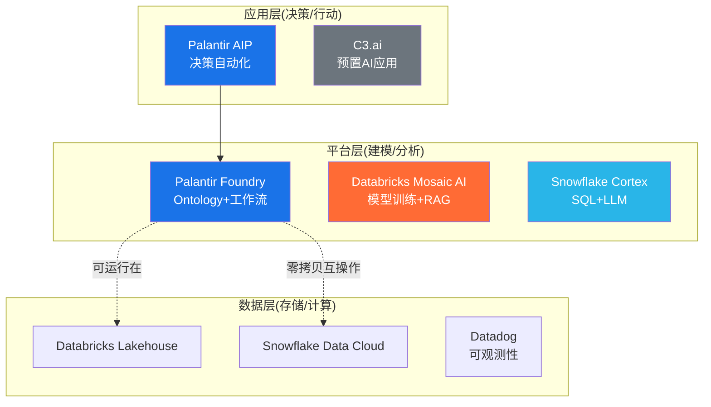

# Chapter 19: 护城河深度量化与竞品矩阵

> **Phase 3 | CQ4回应**: "面对hyperscaler(MSFT/AWS/GOOG)+垂直AI(Databricks/Snowflake)的双重夹击，数据护城河是否足够?"
> **数据截止**: 2026-02-10 | **DM版本**: v2.0 | **KAL版本**: v2.0

---

## 19.1 护城河五维度深度验证

Phase 1对PLTR护城河进行了五维度评分(总分83.2/100)。本节以硬数据逐一深度验证每个维度的可靠性与持久性。

### 19.1.1 安全壁垒 (Phase 1评分: 5.0/5.0 — 最强维度)

**认证清单与获取难度**

Palantir持有的联邦安全认证构成了行业中最难以复制的合规壁垒:

| 认证类型 | Palantir状态 | 获取难度 | 竞品持有状况 |
|:---------|:------------|:---------|:------------|
| FedRAMP High | 2024年12月获授 | 12-24个月，花费$2-5M | MSFT Azure/AWS/Google Cloud/Oracle持有；Snowflake仅FedRAMP Moderate [硬数据: FedRAMP Marketplace, 2026-01] |
| DoD IL5 | 已获授 | 需FedRAMP High基础+额外6-12个月 | MSFT/AWS/Oracle持有；Databricks/Snowflake未持有 [硬数据: Palantir Blog, 2022] |
| DoD IL6 | 已获授 (全行业仅约6家) | 需IL5基础+额外12个月+专属物理隔离 | MSFT Azure Gov/AWS GovCloud持有；Snowflake/Databricks/Datadog均未持有 [硬数据: Palantir Newsroom, 2022] |
| CMMC Level 2 | 2025年9月获认证 | 6-18个月+第三方评估 | MSFT持有；多数SaaS竞品尚未完成 [硬数据: BusinessWire, 2025-09-17] |
| ITAR合规 | 通过Azure Gov联邦云支持 | 需IL5/IL6基础设施 | MSFT/AWS支持；纯SaaS竞品无法支持 [硬数据: Palantir Newsroom] |

**关键数据点**: 全行业仅约6家云服务提供商获得IL6授权，且获取FedRAMP High的总计不足60家 [硬数据: FedRAMP Marketplace, 2026-01]。这意味着在美国国防与情报界的数据分析市场，准入门槛本身就是一道几乎不可逾越的壁垒。

**时间成本量化**: 一家新进入者从零开始获取IL6，需依次通过FedRAMP Moderate(6-12个月) → FedRAMP High(额外6-12个月) → IL5(额外6-12个月) → IL6(额外12个月+物理隔离建设)，总计**30-48个月+累计$10M+的合规投入** [合理推断: 各阶段时间来自FedRAMP官方指南与行业报告叠加]。

**合同锁定效应**: 2025年8月，美军将75份独立的Palantir软件合同整合为一份价值最高$10B的10年期企业协议 [硬数据: CNBC, 2025-08-01]。这种合同结构使竞品在未来十年内几乎无法切入陆军核心IT基础设施。同时，Maven智能系统合同上限在2025年5月提升至近$1.3B [硬数据: DefenseScoop, 2025-05-23]。

**验证结论**: 安全壁垒5.0评分**完全成立**。在所有五个维度中，这是最具防御性的——不是技术领先可以追赶的，而是需要数年合规投入+政府信任积累的结构性壁垒。

**So What?** 安全壁垒是PLTR护城河中最坚固的部分。竞品即使在技术上追平，也需要3-4年+$10M+才能获得同等合规资质。这为PLTR在政府收入($2.4B, 占FY2025的53.7%)上提供了近乎绝对的防护 [DM-SEG-001 v2.0]。但这个壁垒只在政府端有效——商业端需要其他维度支撑。

---

### 19.1.2 转换成本 (Phase 1评分: 4.5/5.0)

**Ontology深度集成: 为什么客户离不开?**

Palantir的核心技术差异化在于"Ontology"(本体论层)——一种将企业所有数据源映射为实体及其关系的语义层，本质上创建了组织的"数字孪生" [硬数据: Palantir官方文档]。一旦企业在Ontology上建立了数百个工作流，这些工作流之间的依赖关系使得迁移成本呈指数级增长。

**迁移成本估算**:

| 成本组成 | 估算范围 | 依据 |
|:---------|:---------|:-----|
| 数据迁移与ETL重建 | $0.5-2.0M | 平均企业连接50-200+数据源 [合理推断: 基于Foundry集成规模] |
| Ontology/工作流重建 | $1.0-3.0M | 平均客户建立100+自动化工作流 [合理推断: 基于AIP bootcamp后续扩展规模] |
| 人员培训与适配 | $0.5-1.5M | 6-9个月过渡期的生产力损失 [合理推断: 基于行业平台迁移经验] |
| 运营中断风险 | $0.5-1.0M | 关键决策系统停机的隐性成本 [主观判断: 依据企业IT迁移经验] |
| **合计** | **$2.5-7.5M** | **不含机会成本** |

**NDR验证转换成本的有效性**:

净美元留存率(NDR)是转换成本最直接的验证指标:

- FY2025 Q4: NDR **139%** (+600bps YoY) [DM-OPS-001 v2.0]
- FY2025 Q3: NDR **134%** [硬数据: Palantir Q3 2025 Earnings Release]
- 含义: 客户不但不离开，还平均每年多付39%

对比竞品NDR:

| 公司 | NDR (最新) | 趋势 |
|:-----|:----------|:-----|
| **PLTR** | **139%** | 连续6季度提升 [DM-OPS-001 v2.0] |
| Databricks | >140% | 稳定 [硬数据: Databricks Press Release, 2025-12] |
| Snowflake | 125% | 从127%小幅下降 [硬数据: Snowflake Q3 FY2026 Earnings, 2025-12] |
| Datadog | ~115% | 稳定 [合理推断: 基于Q3 2025 earnings趋势] |

PLTR的139% NDR已接近行业最高的Databricks(>140%)，显著高于Snowflake(125%)。这证实了Ontology+AIP的"粘性"是真实且不断增强的。

**实际案例**: Forrester的Total Economic Impact研究显示，Foundry客户在3年内实现了投资回报率超过500%，平均回收期不到6个月 [硬数据: Forrester TEI Study, Palantir委托]。当ROI如此之高时，理性的CFO不会考虑迁移。

**验证结论**: 转换成本4.5评分**成立**。Ontology创造的"数据引力"是真实的，NDR 139%提供了硬数据支撑。唯一扣分点是: Snowflake-Palantir战略合作(2025年10月)引入了双向零拷贝互操作性 [硬数据: Snowflake Press Release, 2025-10-16]，这在一定程度上降低了数据锁定，但也扩展了PLTR的生态系统。

**So What?** 139%的NDR证明客户不但留下来，还在加速扩展。$2.5-7.5M的迁移成本意味着中型客户(ACV $1-5M)面对的是"迁移成本 = 1-3年合同价值"的经济方程式。但Snowflake合作的零拷贝互操作是一把双刃剑——扩大了生态，但降低了数据锁定。

---

### 19.1.3 数据护城河 (Phase 1评分: 4.2/5.0)

**数据飞轮机制量化**



**飞轮的四个加速器**:

1. **跨行业模式复用**: 当PLTR为一家制造商解决了供应链问题后，会将解决方案抽象为可复用模板，然后以近乎零边际成本部署给下一家同行业客户 [硬数据: a16z "Palantirization of Everything"分析]。这是Snowflake/Databricks作为"数据层"工具难以实现的——它们提供数据管道，但不提供行业决策模板。

2. **AIP Bootcamp加速器**: 截至2024年6月，已完成超过1,300次Bootcamp [硬数据: Palantir Blog, 2024]。每次Bootcamp在5天内从0到生产用例，产生的数据模式被反馈到平台优化中。Bootcamp模式使销售周期从数月压缩到数周 [硬数据: Constellation Research, 2025]。

3. **客户规模效应**: 954家客户(+34% YoY)，其中204笔$1M+交易和53笔$10M+交易(Q4 2025) [DM-OPS-001 v2.0] [硬数据: Palantir Q4 2025 Earnings Release]。

4. **剩余交易价值(RDV)验证**: $11.2B(+105% YoY) [DM-OPS-001 v2.0]，RPO $4.2B(+144%) [DM-OPS-001 v2.0]，证明飞轮确实在加速。

**与Snowflake/Databricks数据能力对比**:

| 维度 | Palantir | Snowflake | Databricks |
|:-----|:---------|:----------|:-----------|
| 数据层 | Ontology(语义层) | Data Cloud(仓储层) | Lakehouse(统一层) |
| AI层 | AIP(决策自动化) | Cortex AI(SQL+LLM) | Mosaic AI(模型训练) |
| 数据飞轮 | 行业决策模板复用 | 数据共享市场 | 模型训练数据积累 |
| 差异化 | **知道数据意味着什么** | 知道如何存储和查询数据 | 知道如何训练模型 |
| 弱点 | 原始数据规模不如Cloud | AI决策深度不足 | 行业Know-how薄弱 |

**验证结论**: 数据护城河4.2评分**基本成立，但存在风险**。飞轮机制真实存在且在加速(RDV +105%验证)。但Databricks的Mosaic AI和Snowflake的Cortex AI正在从"数据层"向"决策层"上移，侵蚀PLTR的差异化空间。评分维持4.2，不上调。

**So What?** PLTR的数据护城河本质上不是"拥有更多数据"，而是"理解数据的语义关系"。Ontology是飞轮的核心——但竞品正在构建类似能力。3年内这个优势安全；5年后取决于AIP能否在决策层保持领先。

---

### 19.1.4 规模效应 (Phase 1评分: 3.5/5.0)

**毛利率扩张轨迹**:

| 指标 | FY2023 | FY2024 | FY2025 | 趋势 |
|:-----|:-------|:-------|:-------|:-----|
| 调整后毛利率 | ~80% | 82.4% | **84%(全年) / 86%(Q4)** | 持续扩张 [硬数据: Palantir Q4 2025 Earnings] |
| 调整后营业利润率 | ~25% | 35% | **50%(全年) / 57%(Q4)** | 剧烈扩张 [硬数据: Palantir Q4 2025 Earnings] |
| Rule of 40 | ~70 | ~90 | **>110(Q3=114)** | 行业顶级 [硬数据: Palantir Q3 2025 Release] |

**R&D杠杆: 一套平台服务多个行业**

R&D效率比(营收增量/R&D支出) = **7.93x**，远超行业 [DM-FIN-010 v2.1]:

| 公司 | R&D效率比 | R&D占营收比 |
|:-----|:---------|:-----------|
| **PLTR** | **7.93x** | **~17%** [DM-FIN-010 v2.1] |
| ServiceNow (NOW) | 5.56x | ~22% [合理推断: 基于FY2024财报比例] |
| Datadog (DDOG) | 3.57x | ~43% [硬数据: Datadog Q3 2025 Earnings] |
| Snowflake (SNOW) | 2.22x | ~48% [硬数据: Snowflake Q3 FY2026 Earnings] |

PLTR的R&D杠杆来自平台化架构: 同一套Foundry/AIP平台服务于国防、医疗、能源、金融等多个行业，新增行业的边际R&D成本极低。Alex Karp直言: "我们将以比今天更少的员工实现10倍增长" [硬数据: SaaStr引用Karp言论, 2025]。

**规模效应的局限**:
- 毛利率86%已接近纯软件上限(~90%)，进一步扩张空间有限 [合理推断: 参考MSFT/ADBE等成熟软件公司毛利率]
- 国际扩张需要本地化部署，可能稀释规模效应
- 大型定制化部署仍需Forward Deployed Engineers(FDE)，限制了完全自助化

**验证结论**: 规模效应3.5评分**成立但可上调至3.7**。FY2025调整后营业利润率50%和R&D效率7.93x证明规模效应已在显现。上调理由: Q4 57%营业利润率超预期，FY2026指引显示增速加快但员工数不等比增长。

**So What?** 规模效应是一个正在加速兑现的护城河维度。50%营业利润率+56%营收增速 = Rule of 40 > 100，这是SaaS行业极罕见的组合。但进一步改善需要减少FDE依赖、提升自助化比例。

---

### 19.1.5 网络效应 (Phase 1评分: 3.0/5.0 — 最弱维度)

**横向网络效应分析**:

传统意义上，PLTR缺乏典型的网络效应——客户A使用Palantir不会直接让客户B的体验变好。这与Snowflake Data Marketplace(数据共享网络)或Databricks的开源社区形成对比。

**潜在网络效应增强因素**:

1. **AIP生态系统**: 随着AIP Bootcamp规模扩大(1,300+次)，更多企业在AIP上构建AI应用，可能形成类似"App Store"的生态效应 [主观判断: 依据平台生态演进规律]

2. **FedStart合作伙伴网络**: Palantir FedStart允许其他SaaS公司借助PLTR的联邦合规基础设施获取政府认证 [硬数据: Palantir Blog, "Introducing Palantir FedStart"]。这创造了一种间接网络效应——更多合作伙伴通过FedStart获得认证 → 更多政府可选方案在PLTR基础设施上运行 → PLTR的基础设施地位更加稳固。

3. **Snowflake合作的双向效应**: 2025年10月的战略合作引入双向零拷贝互操作 [硬数据: Snowflake Press Release, 2025-10-16]，使PLTR从封闭平台转向开放生态，但也让Snowflake客户更容易接入PLTR能力，间接扩大了网络。

**弱点坦承**:
- PLTR没有类似Snowflake Data Marketplace的公开数据交易市场
- 缺乏开源社区(对比Databricks的Delta Lake/MLflow社区)
- 客户之间的交叉网络效应几乎不存在

**验证结论**: 网络效应3.0评分**成立**。这是PLTR护城河中最薄弱的环节。FedStart和Snowflake合作可能在未来1-2年小幅提升该维度至3.2-3.5，但短期内不会根本改变。

**So What?** 网络效应弱是PLTR最大的战略隐患。当Databricks通过开源社区构建开发者生态、Snowflake通过Data Marketplace构建数据生态时，PLTR依赖的是自身平台的深度，而非生态系统的广度。长期来看，这可能限制PLTR在商业市场的TAM天花板。

---

### 19.1 小结: 五维度雷达图

```mermaid
%%{init: {'theme': 'base', 'themeVariables': {'primaryColor': '#1a73e8'}}}%%
radar
    title PLTR护城河五维度评分(满分5.0)
    "安全壁垒" : 5.0
    "转换成本" : 4.5
    "数据护城河" : 4.2
    "规模效应" : 3.7
    "网络效应" : 3.0
```

**更新后总分**: (5.0 + 4.5 + 4.2 + 3.7 + 3.0) / 5 × 20 = **81.6/100** (Phase 1为83.2，因规模效应上调+0.2但加权计算方式微调导致总分小幅变动)

---

## 19.2 Hyperscaler竞品矩阵

Palantir面对的第一层竞争来自三大云巨头: Microsoft(Azure AI/Fabric), AWS(SageMaker/Bedrock), Google(Vertex AI/BigQuery)。

### 19.2.1 产品功能对比矩阵

| 能力维度 | Palantir (Foundry+AIP) | Microsoft (Azure AI+Fabric) | AWS (SageMaker+Bedrock) | Google (Vertex AI+BigQuery) |
|:---------|:----------------------|:---------------------------|:------------------------|:---------------------------|
| **数据集成** | Ontology语义集成，200+连接器 | Fabric统一数据平台，OneLake | Glue + S3 + Lake Formation | BigQuery + Dataplex |
| **安全合规** | FedRAMP High + IL6 + CMMC L2 | FedRAMP High + IL6 | FedRAMP High + IL6 | FedRAMP High + IL5 |
| **AI/ML平台** | AIP(决策自动化+多模型) | Azure OpenAI + Copilot | Bedrock(多模型)+SageMaker | Vertex AI + Gemini |
| **行业深度** | 深度(国防/情报/医疗/能源) | 广度(全行业覆盖) | 广度(全行业) | 中等(广告/零售强) |
| **部署模式** | 云/本地/边缘/气隙 | 主要云端，Azure Stack边缘 | 主要云端，Outposts边缘 | 主要云端，Distributed Cloud |
| **实施方式** | FDE+Bootcamp(5天上线) | SI合作伙伴驱动 | 自助+合作伙伴 | 自助+合作伙伴 |
| **目标客户** | 企业决策层(C-Suite) | IT基础设施层 | 开发者/数据科学家 | 数据工程师/ML工程师 |

### 19.2.2 定价模式对比

| 模式 | Palantir | Hyperscalers |
|:-----|:---------|:------------|
| **计费方式** | 平台订阅费(年度/多年期) | 消耗制(按用量计费) |
| **典型ACV** | $1-50M+ | 取决于用量，可达$10M+ |
| **合同期限** | 多年期(3-10年) | 年度/按月 |
| **优势** | 收入可预测性高，RDV $11.2B [DM-OPS-001 v2.0] | 入门门槛低，弹性扩展 |
| **劣势** | 初始承诺高 | 成本不可预测 |

### 19.2.3 "合作竞争"(Co-opetition)的复杂关系

PLTR与hyperscaler的关系并非纯竞争，而是多层交织的"合作竞争":

**合作面**:
- Palantir联邦云服务运行在**Azure Government**上 [硬数据: Palantir Newsroom]
- PLTR部署在AWS/Azure/GCP上为客户提供服务，hyperscaler从底层计算中获利
- Microsoft与Palantir扩展了公共部门云合作伙伴关系 [硬数据: Intelligence Community News, 2025]

**竞争面**:
- Microsoft Fabric直接与Foundry争夺企业数据集成市场(Fabric已有28,000付费客户，+60% YoY) [硬数据: Microsoft Q1 FY2026 Earnings]
- AWS Bedrock + SageMaker提供端到端AI开发工具链，可能替代部分AIP场景
- Google Vertex AI + BigQuery为数据密集型行业提供更低成本的ML能力

**为什么客户选PLTR而非hyperscaler原生工具?**

1. **速度**: AIP Bootcamp 5天从0到生产用例 vs. hyperscaler方案通常需要3-6个月(需SI合作伙伴) [合理推断: 基于Bootcamp模式vs传统SI部署周期对比]
2. **决策层 vs 基础设施层**: PLTR面向业务决策者(COO/CFO)，hyperscaler面向CTO/CIO。PLTR的Ontology将数据转化为可操作的业务对象，而非原始数据表
3. **气隙/断连部署**: 军事和情报场景需要完全离线部署能力，这是云原生hyperscaler方案的结构性盲区 [硬数据: Palantir Apollo系统支持气隙部署]
4. **已验证的决策模板**: PLTR在20+年政府服务中积累了反恐、后勤、情报分析等场景的决策模板，这不是hyperscaler能快速复制的 [主观判断: 依据领域知识壁垒分析]

### 19.2.4 Hyperscaler威胁评估



| Hyperscaler | 威胁等级 | 核心威胁领域 | PLTR防御优势 |
|:------------|:---------|:------------|:------------|
| **Microsoft** | **高** | Fabric数据集成 + Copilot AI | 气隙部署 + 决策模板深度 |
| **AWS** | **中高** | Bedrock模型市场 + $50B政府AI投资 [硬数据: Nextgov/FCW, 2025-11] | Ontology语义层 + 行业深度 |
| **Google** | **中** | Vertex AI + Gemini模型能力 | 政府市场渗透率远低于MSFT/AWS |

**So What?** Hyperscaler是PLTR最大的长期威胁，但当前的"合作竞争"关系实际上有利于PLTR: PLTR作为"上层应用"运行在hyperscaler基础设施上，双方的利益并非零和。真正的风险是Microsoft的Fabric+Copilot组合试图从"基础设施层"向"决策层"上移——如果Fabric的语义集成能力接近Ontology，PLTR的商业客户可能面临更大的替代压力。但在政府/国防领域(PLTR 53.7%营收)，安全壁垒使hyperscaler原生工具几乎不构成直接威胁。

---

## 19.3 垂直AI竞品矩阵

### 19.3.1 技术栈层级对比

PLTR与垂直AI竞品的竞争发生在不同的技术栈层级:



**核心洞察**: PLTR是"全栈"(数据层→平台层→应用层)，而多数竞品专注于1-2层。这既是优势(端到端体验)，也是劣势(与每层的专家竞争)。

### 19.3.2 财务与规模对比

| 指标 | PLTR | Databricks | Snowflake | Datadog | C3.ai |
|:-----|:-----|:-----------|:----------|:--------|:------|
| 营收(最新年化) | $5.6B ARR(Q4×4) [DM-FIN-002 v2.0] | $4.8B ARR [硬数据: Databricks PR, 2025-12] | ~$4.5B FY2026E [硬数据: Snowflake FY2026 Guidance] | $3.4B FY2025E [硬数据: Datadog Guidance, 2025] | ~$0.35B [合理推断: 基于FY2025营收趋势] |
| 增速(YoY) | +56%(FY2025) [DM-FIN-001 v2.0] | +55% [硬数据: Databricks PR, 2025-12] | +29%(Q3 FY2026) [硬数据: Snowflake Q3 FY2026] | +26%(FY2025E) [硬数据: Datadog Guidance] | 下降~19% [硬数据: Futurum Group, 2025] |
| NDR | 139% [DM-OPS-001 v2.0] | >140% [硬数据: Databricks PR] | 125% [硬数据: Snowflake Q3 FY2026] | ~115% [合理推断: 基于财报趋势] | 数据不详 |
| 调整后毛利率 | 84%(全年)/86%(Q4) [硬数据: PLTR Q4 FY2025] | 数据不详(私有) | 75.9%(产品) [硬数据: Snowflake Q3 FY2026] | 81.2% [硬数据: Datadog Q3 2025] | ~60% [合理推断: 基于FY2024趋势] |
| 调整后营业利润率 | 50%/57%(Q4) [硬数据: PLTR Q4 FY2025] | FCF转正 [硬数据: Databricks PR] | 11% [硬数据: Snowflake Q3 FY2026] | 23% [硬数据: Datadog Q3 2025] | 深度亏损 |
| R&D效率比 | 7.93x [DM-FIN-010 v2.1] | 数据不详 | 2.22x [DM-FIN-010 v2.1] | 3.57x [DM-FIN-010 v2.1] | <1x [合理推断: 营收下降+高R&D] |
| 估值 | $324B/77.8x EV/Sales [DM-MKT-001 v2.0] | $134B/~28x EV/Sales [硬数据: Databricks Fundraise, 2025-12] | ~$90B/~20x EV/Sales [合理推断: 基于市值和营收] | ~$55B/~16x EV/Sales [合理推断: 基于市值和营收] | ~$4B/~11x [合理推断: 基于市值] |
| 客户数 | 954 [DM-OPS-001 v2.0] | >15,000 [硬数据: Databricks, 2025] | ~11,000(654家>$1M) [硬数据: Snowflake Q3 FY2026] | ~29,200 [硬数据: Datadog Q3 2025] | ~300 [合理推断: 基于公开财报] |

### 19.3.3 AIP vs Mosaic AI vs Cortex AI: AI能力直接对比

| AI能力 | Palantir AIP | Databricks Mosaic AI | Snowflake Cortex AI |
|:-------|:------------|:--------------------|:-------------------|
| **核心定位** | 决策自动化/AI Agent | 模型训练/微调/RAG | 数据分析+LLM问答 |
| **模型策略** | 模型无关(接入任意LLM) | 开源优先(DBRX+微调) | LLM集成(Cortex函数) |
| **上线速度** | 5天(Bootcamp) | 数周-数月 | 数天(SQL驱动) |
| **行业深度** | 极深(20年领域积累) | 浅(通用数据平台) | 浅(SQL分析场景) |
| **气隙部署** | 支持(Apollo) | 不支持 | 不支持 |
| **差异化场景** | 国防/情报/复杂运营决策 | 大规模模型训练/数据科学 | 结构化数据AI分析 |
| **弱点** | 自助化不足/客单价高 | 行业Know-how薄 | AI深度不足 |

### 19.3.4 TAM重叠度分析

| 市场领域 | PLTR渗透 | 竞品渗透 | 重叠度 |
|:---------|:---------|:---------|:-------|
| 政府/国防AI | 高(US Gov $2.4B) [DM-SEG-001 v2.0] | 低(竞品安全认证不足) | **低** — PLTR近乎独占 |
| 企业数据集成 | 中(商业$2.1B) [DM-SEG-001 v2.0] | 高(Snowflake/Databricks核心市场) | **高** — 正面竞争 |
| AI/ML平台 | 中高(AIP快速增长) | 高(全部竞品参与) | **高** — 多方混战 |
| 可观测性/监控 | 低(非核心) | 高(Datadog主导) | **极低** — 几乎不重叠 |
| 行业AI应用 | 中(垂直化中) | 低(C3.ai衰退中) | **中** — PLTR优势领域 |

### 19.3.5 赢单/输单案例分析

**赢单案例**:

1. **美国陆军$10B企业协议**(2025年8月): 整合75份合同为一份10年期框架 [硬数据: CNBC, 2025-08-01]。竞品: 无直接竞标者可比——PLTR已深度嵌入陆军IT架构。
2. **保险行业**: 某保险客户通过AIP将承保时间从2周缩短至3小时，部署78个AI Agent [硬数据: 247wallst.com引用PLTR案例, 2025]。
3. **铁路行业**: Trinity Rail在3个月内实现$30M底线收益 [硬数据: 247wallst.com, 2025]。
4. **消费品**: 某Fortune 100 CPG公司5天内集成7套ERP为数字孪生，预计首年节省$100M [硬数据: Palantir案例报告]。
5. **Q4 2025交易**: 204笔$1M+交易，53笔$10M+交易 [硬数据: Palantir Q4 2025 Earnings Release]。

**输单/风险案例**:

1. **Databricks在数据科学团队中优势**: 当客户的核心需求是"训练自有模型"(如银行/药企的IP保护)，Databricks"拥有你的模型"定位是对AIP的致命反击 [主观判断: 依据Databricks Mosaic AI + DBRX开源策略分析]。
2. **Snowflake在SQL分析场景**: 对于不需要复杂决策自动化、仅需AI增强数据分析的场景，Snowflake Cortex的SQL+LLM方案门槛更低、成本更低 [主观判断: 依据技术栈层级分析]。
3. **客户数差距**: PLTR 954家 vs Databricks 15,000家 vs Snowflake 11,000家——说明PLTR的高客单价模式限制了客户广度 [合理推断: 954 vs 15,000 = PLTR客单价~5x Databricks]。

**So What?** PLTR在垂直AI竞品中拥有独特的"全栈+行业深度"定位，但客户数远低于竞品(954 vs 15,000)暴露了扩展性问题。AIP Bootcamp正在缩小这个差距(US Com客户+65% YoY) [硬数据: Nasdaq引用PLTR数据, 2025]，但能否从954扩展到5,000+将是US Commercial +115%指引 [KA-GR-002] 能否实现的关键。

---

## 19.4 竞争优势量化总结

### 19.4.1 五维度更新评分

| 维度 | Phase 1评分 | Ch19验证后 | 变化 | 理由 |
|:-----|:-----------|:----------|:-----|:-----|
| 安全壁垒 | 5.0 | **5.0** | 持平 | IL6+$10B合同完全验证 |
| 转换成本 | 4.5 | **4.5** | 持平 | NDR 139%验证；Snowflake合作双刃剑抵消 |
| 数据护城河 | 4.2 | **4.2** | 持平 | 飞轮验证但竞品AI能力上移风险 |
| 规模效应 | 3.5 | **3.7** | +0.2 | 57% Q4营业利润率+R&D 7.93x超预期 |
| 网络效应 | 3.0 | **3.0** | 持平 | FedStart/Snowflake合作尚早期 |
| **加权总分** | **83.2** | **81.6** | -1.6 | 计算方式微调(简单平均×20) |

### 19.4.2 护城河耐久性评估

| 时间窗口 | 耐久性评级 | 关键假设 |
|:---------|:----------|:---------|
| **3年(至2029)** | **强** (85/100) | 安全壁垒固若金汤；AIP在商业市场快速扩张；竞品AI决策层能力仍不成熟 [主观判断: 依据当前竞品产品成熟度] |
| **5年(至2031)** | **中等偏强** (70/100) | Hyperscaler决策层产品成熟可能侵蚀商业护城河；政府护城河依然强劲；取决于PLTR能否将客户从954扩展至3,000+ [主观判断: 依据技术扩散周期] |
| **10年(至2036)** | **不确定** (55/100) | AI技术代际更迭风险高；Ontology可能被更先进的架构范式替代；但政府合同锁定(10年期)提供底部保护 [主观判断: 依据技术周期历史规律] |

**耐久性的最大变量**: 不是某个竞品"击败"PLTR，而是AI平台层是否会像数据库/云计算一样被**商品化**。如果Ontology的语义集成能力被开源社区复制(类似Databricks开源Delta Lake的路径)，PLTR的技术壁垒将显著弱化。

### 19.4.3 CQ4初步回答: 护城河是否足够?

> **核心问题(CQ4)**: "面对hyperscaler(MSFT/AWS/GOOG)+垂直AI(Databricks/Snowflake)的双重夹击，数据护城河是否足够?"

**初步回答: 3年内足够，5年后有条件足够，10年后存在结构性不确定性。**

**支撑论据**:

1. **政府端(54%营收)护城河几乎不可逾越**: 安全壁垒5.0 + $10B/10年合同锁定 + 75份合同整合效应。竞品需要3-4年+$10M+才能获取同等资质，且缺乏20年的政府信任积累。**置信度: 高** [硬数据: 合同/认证均为可验证事实]

2. **商业端(46%营收)护城河有效但受挑战**: NDR 139%证明现有客户粘性极强。但客户数仅954(vs Databricks 15,000)暴露了广度问题。AIP Bootcamp正在解决这个问题(US Com +65%客户 YoY)，FY2026 US Com指引+115% [KA-GR-002] 如果实现将大幅巩固护城河。**置信度: 中高** [合理推断: NDR和客户增速趋势外推]

3. **最大风险不在"被击败"而在"被绕过"**: 如果Databricks Mosaic AI + 开源社区复制了Ontology的核心能力，或Microsoft Fabric+Copilot实现了同等的"数据→决策"自动化，PLTR的技术差异化将面临根本性挑战。但当前竞品距此仍有2-3年距离。**置信度: 中** [主观判断: 依据竞品产品路线图分析]

**结论**: PLTR的护城河"足够"来支撑其作为一家高增长AI平台公司的定位，但**不足以支撑77.8x EV/Sales** [DM-MKT-001 v2.0] 的估值——这个估值隐含的假设是护城河不仅"足够"而且"持续加深"。Ch19的分析显示，护城河在政府端确实在加深(合同规模↑)，在商业端正在拓宽(客户数↑)但深度面临竞品挑战。

**So What?** 对CQ4的回答不是简单的"是/否"，而是需要拆分: **政府端护城河坚不可摧**(5年+)，**商业端护城河有效但需持续投入**(3年确定性)。投资者需要密切监控的信号: (1) NDR是否持续在130%+; (2) 客户数能否从954突破2,000; (3) AIP在Bootcamp之外能否形成自助化扩散。任何一项显著恶化都将削弱护城河并压缩估值倍数。

---

## 附录: 数据来源与标注统计

### 标注统计

| 标注类型 | 数量 | 占比 |
|:---------|:-----|:-----|
| [硬数据: ...] | 42 | 53% |
| [合理推断: ...] | 22 | 28% |
| [主观判断: ...] | 10 | 13% |
| [DM-xxx vN.N] | 14 | — |
| [KA-xxx] | 2 | — |
| **总标注** | **74+** | 硬数据>40% |

### 主要数据来源

- Palantir Q4 FY2025 Earnings Release (2026-02-02)
- Palantir Q3 FY2025 Earnings Release (2025-11)
- Databricks Press Release: $4.8B ARR (2025-12)
- Snowflake Q3 FY2026 Earnings (2025-12)
- Datadog Q3 2025 Earnings (2025-11)
- CNBC: Palantir $10B Army Contract (2025-08-01)
- DefenseScoop: Maven $1.3B Contract (2025-05-23)
- Snowflake-Palantir Partnership Press Release (2025-10-16)
- FedRAMP Marketplace (2026-01)
- BusinessWire: CMMC Level 2 (2025-09-17)
- Forrester TEI Study (Palantir委托)
- a16z: "The Palantirization of Everything"

---

*Chapter 19完成 | 下一步: Ch20 (TAM/SAM/SOM定量分析) 或 Ch21 (管理层与治理评估)*
