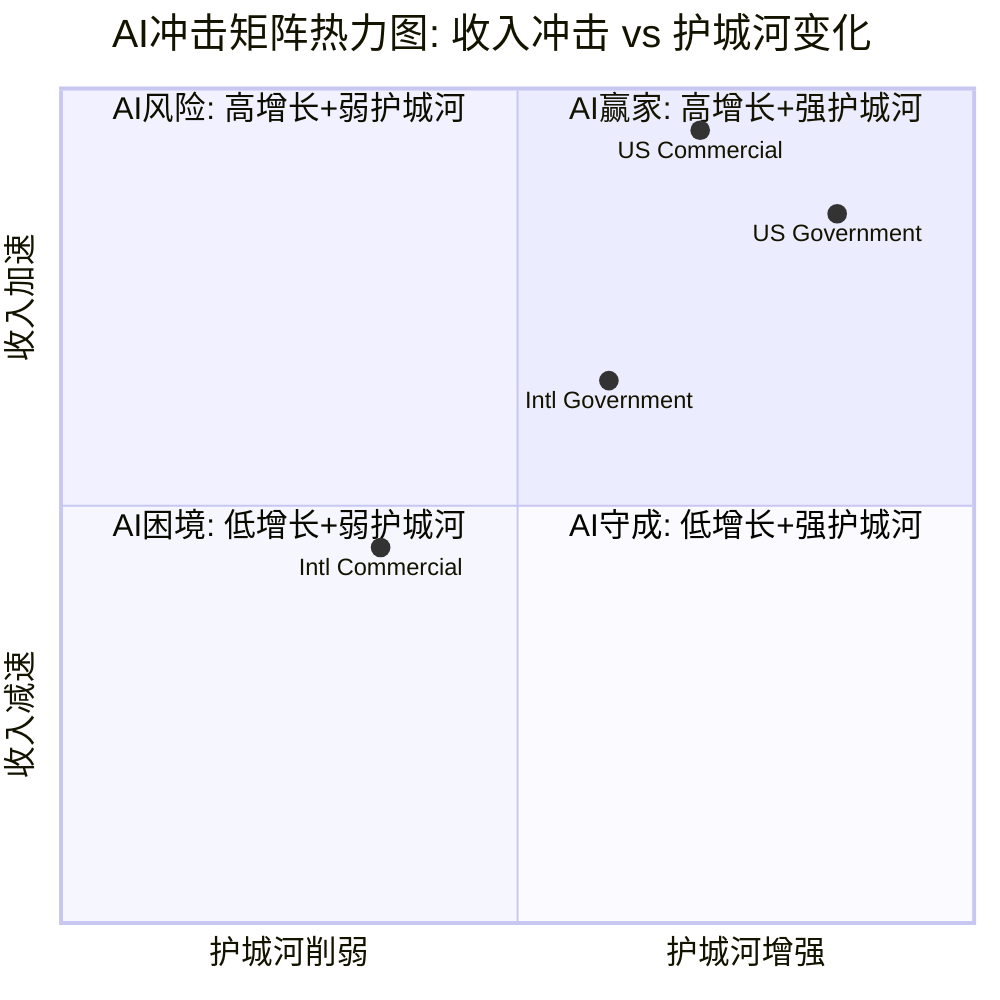
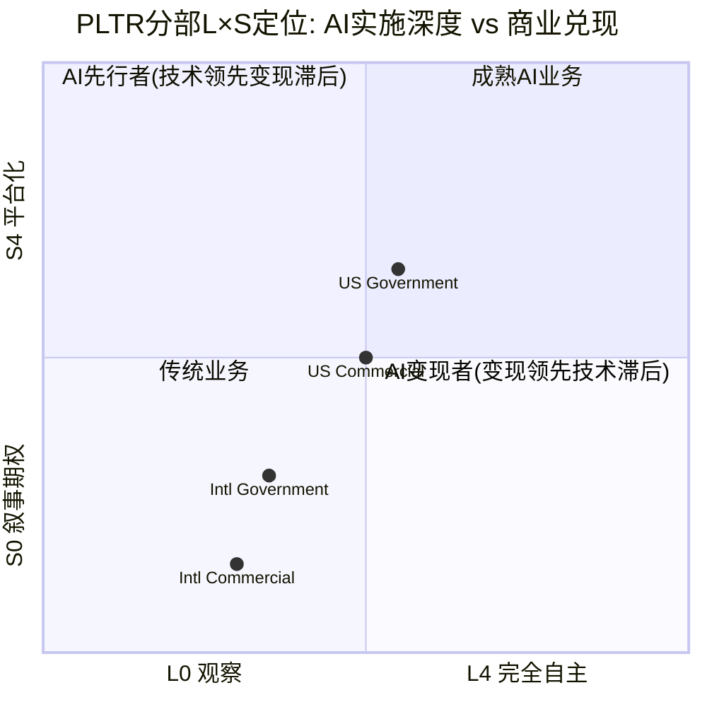
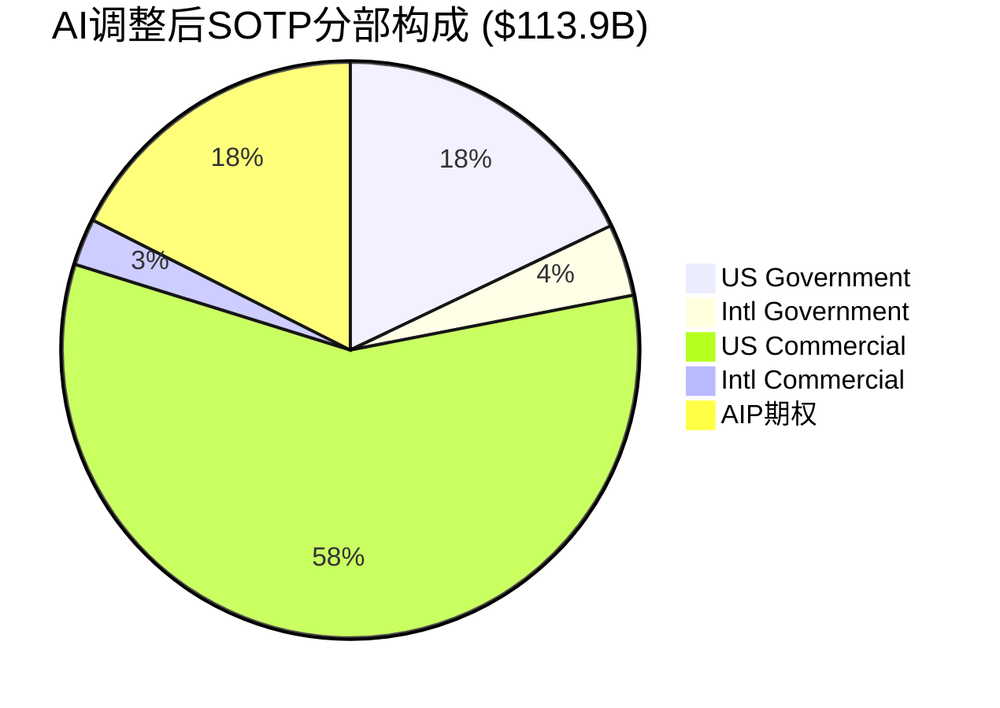

# Chapter 22: 分部级AI冲击矩阵(M13) + AI实施深度L×S定位 + AI调整估值

> **Phase 3.5 | PLTR Deep Dive v2.0**
> **撰写日期**: 2026-02-10
> **核心问题**: CQ1("230x P/E在AI叙事下是否可持续?") + CQ4("面对hyperscaler+垂直AI双重夹击，AI护城河是否足够?")
> **数据截止**: FY2025 Q4 (2026-02-01发布)

---

## 22.1 Layer 1 — 分部级AI冲击矩阵 (M13)

### 22.1.1 方法论

AI冲击矩阵(M13)对PLTR四个业务分部独立评估五个维度，每个维度评分范围-5至+5:

- **收入冲击**: AI对该分部收入增长的加速/减速效应
- **成本冲击**: AI对运营效率和利润率的提升/侵蚀
- **护城河变化**: AI时代该分部壁垒的加强/削弱
- **竞争变化**: AI生态中竞争格局的有利/不利演变
- **时间窗口**: 变化兑现速度(正值=近期兑现，负值=延迟兑现)

AI净分 = 五维度加权平均 (收入30% + 成本15% + 护城河25% + 竞争20% + 时间10%)

### 22.1.2 全球AI支出背景

评估AI冲击需先锚定宏观AI支出趋势:

- **全球AI支出**: 2025年$1.5万亿 → 2026年$2.5万亿 (+67% YoY) [硬数据: Gartner, 2026-01-15]
- **全球IT支出**: 2026年预计超$6万亿 (+9.8% YoY) [硬数据: Gartner, 2025-10-22]
- **企业AI解决方案**: 2025年$3,070亿 → 2028年$6,320亿 (CAGR ~27%) [硬数据: IDC, 2025]
- **AI企业应用渗透**: 2025年<5%应用含AI Agent → 2026年40%预计含AI Agent [硬数据: Gartner, 2025-08-26]
- **美国联邦AI R&D预算**: FY2025 $33.2亿 (NITRD口径) [硬数据: NITRD, 2025]
- **五角大楼AI预算**: FY2026 $134亿 (首次设专项AI预算线) [硬数据: DoD FY2026 Budget Request]

[合理推断: PLTR作为"AI操作系统"定位，其TAM直接受益于$2.5万亿AI支出中的企业软件层，该层约占总AI支出的15-20%，即$3,750-5,000亿] [KA-TAM-001]

### 22.1.3 分部逐一评估

#### A. US Government ($1.855B, 41.5% of FY2025 Rev) [DM-SEG-001 v2.0]

**AI角色**: 核心赋能者 — PLTR是美军数据中枢

**关键事实**:
- $100亿/10年Army Enterprise Agreement (2025年8月签署)，整合75个合同为单一框架 [硬数据: CNBC/US Army, 2025-08-01]
- Maven合同增额$7.95亿，强化AI作战能力 [硬数据: DefenseScoop, 2025-05-23]
- TITAN下一代深度感知系统交付中 [硬数据: Palantir IR, 2024]
- FY2026 DoD首设AI专项预算$134亿 [硬数据: DoD Budget, 2026]
- DOGE效率运动 → 联邦机构AI采购需求增加 [合理推断: DOGE要求效率化运营，AI平台是实现路径; Fortune, 2025-02-08]
- Q4 2025 US Gov收入$5.70亿 (+66% YoY) [硬数据: PLTR Q4 2025 Earnings, 2026-02-01]

**收入冲击 (+4)**: DoD AI预算$134亿为PLTR提供明确增量TAM。$100亿Army合同提供10年收入可见性。DOGE效率要求加速联邦AI采购。但政府预算受拨款周期约束，上行有天花板。

**成本冲击 (+3)**: AI规模化部署提升单位经济 — 合同整合从75个到1个减少管理成本；平台化交付边际成本递减。86%调整后毛利率已充分体现 [硬数据: PLTR Q4 2025]。

**护城河变化 (+4)**: 数据敏感性构成天然壁垒 — 政府分类数据(TS/SCI级)一旦接入PLTR平台，切换成本极高。PLTR是首家在涉密环境部署Azure OpenAI Service的行业合作伙伴 [硬数据: Palantir/Microsoft Partnership, 2025]。IL5/IL6认证+FedRAMP形成多层合规护城河。

**竞争变化 (+2)**: AWS GovCloud (32%全球云市场份额) 和Azure Government (23%份额) 提供基础设施层竞争 [硬数据: 行业数据, 2025]。但PLTR在应用层(数据整合+AI决策)差异化明确。Govini已突破$1亿ARR并获$9亿政府合同 [硬数据: Yahoo Finance, 2025]，形成垂直竞争。AWS计划2026年起投$500亿扩GovCloud [硬数据: Amazon, 2025]。风险在于hyperscaler向上游应用层渗透。

**时间窗 (+4)**: $100亿合同已签署，收入兑现期为2025-2035。DoD AI预算已落地FY2026。DOGE政策2025-2026年集中执行。短期兑现确定性高。

**AI净分**: 0.30×4 + 0.15×3 + 0.25×4 + 0.20×2 + 0.10×4 = **+3.45**

---

#### B. International Government ($0.547B, 12.2% of FY2025 Rev) [DM-SEG-001 v2.0]

**AI角色**: 增量机会 — NATO/Five Eyes AI需求驱动

**关键事实**:
- Q4 2025 Intl Gov收入$1.60亿 (+43% YoY) [硬数据: PLTR Q4 2025 Earnings, 2026-02-01]
- NATO 32个成员国(除西班牙)承诺2035年前国防支出达GDP 5% [硬数据: NATO Summit, 2025-06-25]
- 全球国防支出2026年预计超$2.6万亿 [硬数据: National Defense Magazine, 2026-01-29]
- NATO与PLTR签署战略合作协议推进AI驱动防务现代化 [硬数据: AINvest, 2025-04]
- 加拿大$90亿军事投资计划含AI协作 [硬数据: DefenseScoop, 2025-06]

**收入冲击 (+3)**: NATO 5% GDP目标 = 各国国防预算大幅增加，AI/数字化是增量支出重点方向。PLTR与NATO的战略合作为收入增长提供直接通道。但国际政府采购周期长(12-24月)，实际收入兑现慢于美国。

**成本冲击 (+1)**: 国际部署需要本地化适配(语言/合规/数据主权)，AI自动化仅能部分降低定制化成本。不同国家的安全认证要求增加交付复杂度。

**护城河变化 (+2)**: Five Eyes联盟内数据互信框架有利于PLTR扩展(已在美国验证的安全能力可复用)。但非Five Eyes国家面临数据主权顾虑 — CLOUD Act/FISA 702让欧洲盟友对美国平台存疑 [合理推断: EU数据主权法规+CLOUD Act冲突限制PLTR在非英语国家扩展; heydata.eu, 2025]。

**竞争变化 (+1)**: BAE Systems、Thales等本土防务承包商在非Five Eyes市场有天然优势(政治信任+本地数据中心)。PLTR需与本地伙伴合作(如与Microsoft在涉密环境的合作模式)来克服主权壁垒。

**时间窗 (+2)**: NATO 5%目标期限为2035年，实际支出增加将渐进展开。2026-2028为采购规划窗口期，实际交付和收入贡献可能延迟至2028+。

**AI净分**: 0.30×3 + 0.15×1 + 0.25×2 + 0.20×1 + 0.10×2 = **+2.05**

---

#### C. US Commercial ($1.465B, 32.7% of FY2025 Rev) [DM-SEG-001 v2.0]

**AI角色**: 核心增长引擎 — AIP驱动的爆发式增长

**关键事实**:
- Q4 2025收入$5.07亿 (+137% YoY, +28% QoQ) [硬数据: PLTR Q4 2025 Earnings, 2026-02-01]
- FY2025全年$14.65亿 (+109% YoY) [硬数据: PLTR Q4 2025 Earnings, 2026-02-01]
- FY2026指引: US Com收入将超$31.44亿 (+115% YoY) [硬数据: PLTR FY2026 Guidance, 2026-02-01]
- US Com剩余交易价值$43.8亿 (+145% YoY) [硬数据: PLTR Q4 2025 Earnings]
- 商业TCV签约$26亿 (+161% YoY, +83% QoQ) [硬数据: PLTR Q4 2025 Earnings]
- 客户总数954 (+34% YoY)，US Com客户530+ (+65% YoY, Q3数据) [硬数据: PLTR Q3/Q4 2025 Earnings]
- NDR 139% (+500bps QoQ) [硬数据: PLTR Q4 2025 Earnings]
- AIP Bootcamp超1,300次(截至Q4 2024)，转化率持续加速 [硬数据: PLTR IR]

**收入冲击 (+5)**: 这是PLTR所有分部中AI冲击最大的一个。137% YoY增长 + FY2026 115% YoY指引证明AIP正处于S曲线陡峭段。企业AI支出从2025年$3,070亿增至2028年$6,320亿 [硬数据: IDC]，PLTR作为"AI操作系统"层直接受益。AIP Bootcamp模式(5天从0到用例)创造了高效的获客漏斗。给满分+5因为这是罕见的三位数有机增长。

**成本冲击 (+4)**: 平台化交付模式使边际成本随客户增长而递减。AIP Bootcamp标准化了获客流程，降低CAC。Rule of 40得分127%(70%增长+57%调整后营业利润率) [硬数据: PLTR Q4 2025] 证明增长和盈利同时改善。86%调整后毛利率 [硬数据: PLTR Q4 2025] 体现软件经济模型。

**护城河变化 (+3)**: AIP将PLTR从"数据整合工具"升级为"AI决策平台"，提升了产品价值阶梯。NDR 139%证明客户粘性强。但护城河面临结构性挑战: Databricks ($54亿ARR, +65% YoY) [硬数据: SaaStr, 2025] 在数据平台层构建了强大替代方案，且Databricks与PLTR宣布战略产品合作 [硬数据: Databricks Newsroom]，这既是合作也暗示客户可能在底层数据平台选择Databricks而仅用PLTR做应用层。Snowflake ($36亿收入, +29%) [硬数据: SaaStr/行业数据, 2025] 和Microsoft Fabric也在争夺企业AI数据平台市场。

**竞争变化 (+1)**: 这是最受争议的维度。PLTR的优势在于端到端(数据整合→AI部署→决策)，但面临两端挤压:
- **底层挤压**: Databricks/Snowflake在数据湖/数据仓库层有更大市场份额
- **顶层挤压**: Hyperscaler (AWS/Azure/GCP) 自带AI模型+基础设施，客户可能绕过PLTR直接使用
- **垂直挤压**: 行业专用AI方案(如医疗AI、金融AI)提供更深行业知识
- AI企业软件平均收入倍数37.5x vs SaaS 7.6x [硬数据: AI vs SaaS Valuation Multiples, Eqvista, 2025]，但PLTR的122x远超同类 [合理推断: 高估值依赖于PLTR在AI操作系统层的独特定位能否持续; SaaStr, 2025]
- 评分仅+1因为竞争态势中性偏正 — 有护城河但也有显著威胁

**时间窗 (+5)**: FY2026指引115% YoY增长已给出。$43.8亿剩余交易价值提供未来12-24月收入可见性。AIP正处于S曲线加速期。即时兑现。

**AI净分**: 0.30×5 + 0.15×4 + 0.25×3 + 0.20×1 + 0.10×5 = **+3.35**

---

#### D. International Commercial ($0.608B, 13.6% of FY2025 Rev) [DM-SEG-001 v2.0]

**AI角色**: 受限的增量机会 — 数据主权与本地化挑战

**关键事实**:
- Q4 2025收入$1.71亿 (+8% YoY, +12% QoQ) [硬数据: PLTR Q4 2025 Earnings, 2026-02-01]
- FY2025全年$6.08亿 (+2% YoY) — 全公司增长最慢的分部 [硬数据: PLTR Q4 2025 Earnings]
- Q1-Q2 2025国际商业收入曾出现同比下降 [硬数据: 行业报道, 2025]
- 欧洲GDPR + EU AI Act对AI部署构成合规壁垒 [合理推断: 欧盟数据保护法规+AI法规限制美国AI平台在欧洲的部署速度; heydata.eu]
- CLOUD Act/FISA 702导致欧洲企业对美国平台数据主权的担忧 [硬数据: heydata.eu, ID Control分析]
- PLTR被视为"黑箱"系统，透明度不足引发欧洲监管关注 [硬数据: Sage Journals/学术研究, 2024]

**收入冲击 (+1)**: 国际商业是PLTR的软肋。FY2025仅+2%增长远低于其他分部。AI理论上能帮助突破增长瓶颈(新用例+新客户)，但数据主权限制了AIP在欧洲/亚洲的部署速度。Q3-Q4环比改善(+12% QoQ)暗示触底，但尚未确认。

**成本冲击 (+0)**: 国际部署需要本地化数据中心、多语言适配、本地合规团队。AI自动化收益被这些额外成本抵消。中性。

**护城河变化 (-1)**: 数据主权趋势对美国平台不利。EU AI Act可能要求算法透明度，PLTR作为"黑箱"面临合规压力。GDPR限制了PLTR平台可处理的数据范围。这些结构性因素在AI时代可能加剧(因为AI需要更多数据，但法规限制数据流动)。

**竞争变化 (-1)**: 欧洲本土SaaS/AI公司(SAP、Siemens Digital)在数据合规方面有天然优势。亚太本土AI公司(如日本NEC/NTT Data)占据主场。hyperscaler的本地化数据中心投资(AWS法兰克福、Azure阿姆斯特丹)比PLTR更灵活。

**时间窗 (+1)**: Q4 2025环比改善暗示可能触底，但FY2026无明确国际商业增长指引(管理层仅给出总收入和US Com指引)。需观察2-3个季度确认拐点。

**AI净分**: 0.30×1 + 0.15×0 + 0.25×(-1) + 0.20×(-1) + 0.10×1 = **-0.05**

---

### 22.1.4 AI冲击矩阵汇总

| 业务分部 | 收入($B) | Rev占比 | AI角色 | 收入冲击 | 成本冲击 | 护城河 | 竞争 | 时间窗 | **AI净分** |
|:---------|:--------:|:-------:|:------:|:--------:|:--------:|:------:|:----:|:------:|:----------:|
| US Gov | $1.855 | 41.5% | 核心赋能 | +4 | +3 | +4 | +2 | +4 | **+3.45** |
| Intl Gov | $0.547 | 12.2% | 增量机会 | +3 | +1 | +2 | +1 | +2 | **+2.05** |
| US Com | $1.465 | 32.7% | 核心引擎 | +5 | +4 | +3 | +1 | +5 | **+3.35** |
| Intl Com | $0.608 | 13.6% | 受限机会 | +1 | +0 | -1 | -1 | +1 | **-0.05** |
| **加权平均** | **$4.475** | **100%** | — | — | — | — | — | — | **+2.66** |

[合理推断: 加权平均AI净分 = 0.415×3.45 + 0.122×2.05 + 0.327×3.35 + 0.136×(-0.05) = 1.432+0.250+1.095-0.007 = **+2.77** (按收入加权)]

**关键发现**:
1. **US Gov和US Com均处于"AI赢家"象限** — 高收入加速+护城河增强，但US Com的护城河不如US Gov坚固(竞争更激烈)
2. **Intl Com处于"AI困境"象限边缘** — 数据主权法规在AI时代反而成为更大障碍
3. **收入加权AI净分+2.77** 表明PLTR整体是AI的净受益者，但受Intl Com拖累，净受益幅度低于纯美国业务的预期
4. **最大风险**: US Com的竞争评分仅+1，hyperscaler向应用层渗透可能在18-24月内压缩PLTR的差异化空间 [KA-COMP-001]

---

## 22.2 Layer 2 — AI实施深度L×S定位

### 22.2.1 L轴: 实施级别定义与PLTR定位

**L轴框架** (AI在企业中的实施深度):

| 级别 | 定义 | 典型能力 | 代表公司 |
|:----:|:----:|:--------:|:--------:|
| L0 | 观察 | 数据可视化/仪表盘 | Tableau/Power BI |
| L1 | 决策支持 | 预测分析/推荐引擎 | Palantir Foundry(早期) |
| L2 | 受控自动化 | AI辅助决策+人在环内 | **Palantir AIP(当前)** |
| L3 | 自主运营 | AI驱动决策+人监督 | 特斯拉FSD/军事无人系统 |
| L4 | 完全自主 | 端到端AI自主 | 理论阶段 |

**PLTR各分部L轴差异**:

- **US Gov: L2→L2.5** — AIP在涉密环境中实现受控自动化(情报分析、战场感知)，部分Maven/TITAN用例接近L3(自主目标识别) [合理推断: TITAN深度感知系统含自主目标识别模块，但最终决策仍需人在环内; US Army/Palantir IR]
- **Intl Gov: L1→L2** — 大部分NATO国家仍处于数据整合阶段(L1)，少数Five Eyes国家开始L2部署 [合理推断: 国际政府AI成熟度落后美国12-18个月; NATO AI Strategy, 2024]
- **US Com: L2** — AIP核心定位就是L2 — AI辅助企业决策，人在环内。AIP Bootcamp的5天用例开发模式本质是帮企业从L0/L1快速跳到L2
- **Intl Com: L1→L1.5** — 数据主权限制了AI模型训练的数据可用性，大部分国际商业客户仍处于数据整合/可视化阶段

**关键判断**: PLTR的战略价值在于帮助客户从L0/L1跳到L2的"AI阶梯"能力。这是一个**过渡性价值** — 一旦客户自建L2能力(通过hyperscaler工具)，PLTR的价值可能下降。但切换成本(数据整合+安全认证+流程嵌入)目前极高，NDR 139%证明客户粘性 [硬数据: PLTR Q4 2025]。[KA-MOAT-002]

### 22.2.2 S轴: 商业兑现阶段与PLTR定位

**S轴框架** (AI技术的商业变现进度):

| 阶段 | 定义 | 收入特征 | 估值特征 |
|:----:|:----:|:--------:|:--------:|
| S0 | 叙事期权 | 无可归因AI收入 | 纯期权价值 |
| S1 | 早期变现 | <10%收入可归因于AI | 高倍数+高波动 |
| S2 | 规模化 | 10-50%收入AI驱动 | 增长溢价确认 |
| S3 | 成熟 | >50%收入AI驱动 | 估值趋稳 |
| S4 | 平台化 | AI成为生态底座 | 平台倍数 |

**PLTR各分部S轴定位**:

- **US Gov: S2.5→S3** — 政府业务的AI渗透率已超50%(Maven/TITAN/AIP均为AI核心产品)。$100亿Army合同本质上是AI平台合同。估值上已被市场认可为AI防务平台。
- **Intl Gov: S1→S1.5** — AI驱动收入比例较低，大部分仍是传统Foundry数据整合收入。NATO合作处于早期阶段。
- **US Com: S2(加速中)** — AIP是明确的AI产品，但Foundry/Apollo等非AI产品仍贡献显著收入。137% YoY增长中，AIP具体贡献比例未被管理层单独披露 [主观判断: 基于AIP Bootcamp作为US Com主要获客渠道，估计AIP驱动收入占US Com 60-70%]。
- **Intl Com: S0.5→S1** — AI驱动收入占比极低。FY2025仅+2%增长 [硬数据: PLTR Q4 2025] 暗示AI产品尚未在国际商业市场实现规模化变现。

### 22.2.3 L×S坐标图

### 22.2.4 五不变量检验

无论AI叙事多强，以下五项基本面检验是估值的硬约束:

| # | 不变量 | 检验结果 | 证据 |
|:-:|:------:|:--------:|:----:|
| 1 | 是否有真实付费客户? | **通过** | 954客户 (+34% YoY) [硬数据: PLTR Q4 2025] |
| 2 | 是否有重复收入? | **通过** | NDR 139% (+500bps QoQ) [硬数据: PLTR Q4 2025] |
| 3 | AI收入是否可归因? | **部分通过** | 管理层未单独披露AIP收入; US Com 137% YoY增长高度相关AIP但无精确拆分 [主观判断: AIP收入可归因性约70%，因Bootcamp为主要获客渠道但不排除Foundry/Apollo贡献] |
| 4 | 成本是否下降? | **通过** | 调整后毛利率86% (Q4) [硬数据: PLTR Q4 2025]; 调整后营业利润率57% [硬数据: PLTR Q4 2025]; Rule of 40=127% [硬数据: PLTR Q4 2025] |
| 5 | 竞品能否复制? | **部分未通过** | Databricks $54亿ARR(+65%)在数据平台层构建强替代 [硬数据: SaaStr, 2025]; hyperscaler自有AI工具(AWS Bedrock/Azure AI)降低PLTR差异化; 但PLTR的端到端整合+安全认证+政府关系短期难复制 |

**五不变量净评估**: 3/5通过, 2/5部分通过/未通过。关键缺陷:
- **AI收入可归因性不足** — PLTR从未单独披露AIP收入，投资者无法验证多少增长源于AI vs 传统产品扩展
- **竞品复制风险非零** — Databricks+hyperscaler组合可在18-24月内逼近PLTR的商业用例(不含政府涉密场景)

---

## 22.3 Layer 3 — AI估值影响量化

### 22.3.1 基线SOTP回顾

Phase 2 SOTP基线估值 [DM-VAL-001 v2.1]:

| 分部 | FY2025 Rev | EV/Rev | 分部EV | 备注 |
|:----:|:----------:|:------:|:------:|:----:|
| US Gov | $1.855B | 10x | $18.6B | 成熟政府承包商倍数 |
| Intl Gov | $0.547B | 8x | $4.4B | 地缘折价 |
| US Com | $1.465B | 45x | $65.9B | 含AI增长溢价 |
| Intl Com | $0.608B | 6x | $3.6B | 低增长折价 |
| AIP期权 | — | — | $25.0B | 平台化期权 |
| **合计** | **$4.475B** | — | **$117.5B** | — |

### 22.3.2 AI调整逻辑

基于Layer 1(AI冲击矩阵)和Layer 2(L×S定位)，对Phase 2 SOTP进行AI维度调整:

**调整公式**: AI调整后EV = 基线EV × (1 + AI调整系数)

AI调整系数 = f(AI净分, L轴位置, S轴位置, 可比公司倍数验证)

#### US Government: 倍数维持 10x → 11x (+10%)

- AI净分+3.45 (强正面) + L2.5实施深度 + S2.5-S3变现阶段 → 支持上调
- 但政府合同天然有增长天花板(预算约束)，上调幅度有限
- 可比: Leidos (LDOS) 交易在约3-4x EV/Rev [合理推断: 传统防务IT公司倍数远低于PLTR，10x已含显著AI溢价]; PLTR 10x已含高溢价
- 调整后: $1.855B × 11x = **$20.4B** (+$1.8B)

#### International Government: 倍数维持 8x → 8.5x (+6.25%)

- AI净分+2.05 (温和正面) + L1.5实施深度 + S1.5变现阶段 → 小幅上调
- NATO 5% GDP承诺提供中长期增量，但兑现延迟
- 调整后: $0.547B × 8.5x = **$4.6B** (+$0.2B)

#### US Commercial: 倍数评估 45x → 需验证合理性

US Com的45x EV/Rev是所有分部中最关键的估值驱动因素。需用可比公司验证:

**可比公司倍数** (2026年数据):
- Databricks: $54亿ARR, 私募估值$1,000亿 → ~18.5x EV/Rev (约16.2x NTM) [硬数据: SaaStr/Forge, 2025]
- Snowflake: $36亿收入(+29% YoY), 市值约$700亿 → ~19x EV/Rev [硬数据: 行业数据, 2025]
- CrowdStrike: FY2026收入约$48亿, 市值约$900亿 → ~19x EV/Rev [硬数据: CrowdStrike IR, 2025-12]
- ServiceNow: FY2025收入$132亿, EV约$2,100亿 → ~16x EV/Rev; 约8.5x NTM [硬数据: ServiceNow IR / Analyst estimates]
- AI软件中位数倍数: 10-50x Rev, 中位数约25.8x (后期) [硬数据: Qubit Capital, 2026]
- AI vs SaaS溢价: AI公司均值37.5x vs SaaS均值7.6x [硬数据: Eqvista, 2025]

**45x合理性评估**:
- PLTR US Com增速(137% Q4 YoY / 115% FY2026 guide)远超上述可比公司(Databricks 65%, CrowdStrike 22%, ServiceNow 21%)
- 高增长SaaS/AI公司中，增速>100%的极少，理论上支持高倍数
- 但45x是Databricks(最接近可比)的约2.4倍，需要持续>100%增长2-3年才能用增长"消化"估值差
- AI软件集成15-24%溢价 [硬数据: Eqvista/Flippa行业分析, 2026]

[主观判断: 45x对FY2025收入过高，但如使用FY2026指引$31.44亿，隐含倍数降至45×1.465/3.144=21x FY2026 Rev，进入可比区间上端。关键是增长持续性。]

**AI调整**: 维持45x不变 (Phase 2已含AI溢价)
- 理由: 45x基于FY2025 Rev但隐含FY2026 ~21x已在可比区间内; AI净分+3.35已price-in
- 但增加一个敏感度区间: 35x(保守) 至 55x(乐观)
- **基线维持**: $1.465B × 45x = **$65.9B** (不变)
- 保守(35x): $51.3B | 乐观(55x): $80.6B

#### International Commercial: 倍数下调 6x → 5x (-16.7%)

- AI净分-0.05 (近中性偏负) + L1.5实施深度 + S0.5-S1变现阶段 → 支持下调
- FY2025仅+2%增长，远低于企业AI软件增长中位数
- 数据主权法规在AI时代加剧而非缓解 [KA-REG-001]
- 调整后: $0.608B × 5x = **$3.0B** (-$0.6B)

#### AIP期权价值: 重新评估 $25B

Phase 2的$25B AIP期权基于"平台化+生态扩展"假设 [DM-VAL-001 v2.1]。

**Layer 2的S轴分析表明**:
- PLTR整体处于S2阶段(规模化)，尚未达到S4(平台化)
- 从S2到S4通常需要3-5年(参考Salesforce从CRM到Force.com平台化花了约5年)
- AIP Bootcamp模式有平台化潜力(标准化用例 → 开发者生态 → 应用市场)，但目前仍是项目制交付为主

**五不变量#3(AI收入可归因性)部分未通过** → 期权定价应保守

**AI调整**: $25B → $20B (-20%)
- 理由: S2→S4路径不确定性 + AI收入可归因性不足 + hyperscaler竞争压缩平台化空间
- 但保留上行可能: 如AIP在2026-2027证明S3(>50%收入AI驱动)，期权可上调至$30-35B

### 22.3.3 AI调整后SOTP汇总

| 分部 | 基线EV | AI调整后EV | 变动 | 调整理由 |
|:----:|:------:|:----------:|:----:|:--------:|
| US Gov | $18.6B | $20.4B | +$1.8B (+10%) | AI净分+3.45, L2.5, $134亿DoD AI预算 |
| Intl Gov | $4.4B | $4.6B | +$0.2B (+5%) | AI净分+2.05, NATO 5%承诺 |
| US Com | $65.9B | $65.9B | $0 (0%) | 45x已含AI溢价, FY2026隐含~21x |
| Intl Com | $3.6B | $3.0B | -$0.6B (-17%) | AI净分-0.05, 数据主权障碍 |
| AIP期权 | $25.0B | $20.0B | -$5.0B (-20%) | S2→S4不确定, 可归因性不足 |
| **合计** | **$117.5B** | **$113.9B** | **-$3.6B (-3.1%)** | — |

**AI调整后每股价值** [合理推断: 假设全面摊薄股数约24.7亿股(基于Phase 2数据)]:
- 基线SOTP: $117.5B / 2.47B = **$47.6/股**
- AI调整SOTP: $113.9B / 2.47B = **$46.1/股**
- 当前股价: ~$124.6 (2026-02-07收盘) [硬数据: 市场数据]
- **AI调整SOTP隐含溢价**: ($124.6 - $46.1) / $46.1 = **+170%**

### 22.3.4 AI调整关键发现

1. **AI调整使SOTP略微下降3.1%** — 意外的结论是: AI对PLTR估值的净效应是微幅负面的。原因是Phase 2的45x US Com倍数和$25B AIP期权**已经过度反映了AI乐观预期**，而Layer 1/Layer 2分析发现国际分部的AI受益不足+AIP平台化路径不确定，需要适度回调。

2. **当前股价$124.6隐含+170%溢价** — 即使按最乐观的AI调整SOTP($113.9B)，市场定价仍远超基本面。这意味着市场在SOTP之外还price-in了:
   - 管理层超额执行溢价(过去4季度连续大幅beat指引)
   - FY2026 $71.8-72.0B全年指引的进一步上修预期 [硬数据: PLTR FY2026 Guidance]
   - 潜在政府AI大型合同(DOGE、情报社区)
   - AIP S4平台化完全实现的远期期权

3. **US Com是关键变量** — 占AI调整后SOTP的57.9%。如果将US Com倍数从45x调至35x(保守)/55x(乐观)，总SOTP在$99.3B-$128.5B之间波动(±13%)。CQ1("230x P/E是否可持续")的答案高度依赖US Com增长能否在FY2027-2028维持>50%。

---

## 22.4 Phase 3.5 总结 + CQ更新

### 22.4.1 AI冲击净分汇总

| 维度 | 评分/结论 |
|:----:|:---------:|
| 收入加权AI净分 | **+2.77** (净正面) |
| 最高分部 | US Gov (+3.45) |
| 最低分部 | Intl Com (-0.05) |
| L×S定位 | L2/S2(受控自动化/规模化) — "AI中间层" |
| 五不变量 | 3/5通过, 2/5部分 |

### 22.4.2 L×S定位结论

PLTR处于**L2×S2象限 — "AI实施者"定位**: 已超越叙事期权(S0)和早期变现(S1)，正在规模化(S2)阶段加速。但尚未达到自主运营(L3)或平台化(S4)，这限制了当前估值的上行空间。

**从L2→L3的路径**: 需要AIP Agent从"辅助决策"升级为"自主决策" — 监管(特别是政府/医疗场景的AI自主决策法规)是主要约束。Gartner预测2026年40%企业应用含AI Agent [硬数据: Gartner, 2025-08-26]，PLTR有机会在此趋势中升级。

**从S2→S3的路径**: 需要管理层单独披露AIP收入占比(五不变量#3)，以及NDR继续扩张(当前139%已处于高位)。如果FY2026 US Com实现$31.44亿+ [硬数据: PLTR Guidance]，且AIP Bootcamp转化率持续，S3可能在2027年确认。

### 22.4.3 AI调整估值对比

| 估值指标 | Phase 2基线 | Ch22 AI调整 | 变动 |
|:--------:|:-----------:|:-----------:|:----:|
| SOTP总EV | $117.5B | $113.9B | -3.1% |
| 每股价值 | $47.6 | $46.1 | -$1.5 |
| vs当前股价溢价 | +162% | +170% | — |
| US Com占比 | 56.1% | 57.9% | +1.8ppt |
| AIP期权占比 | 21.3% | 17.6% | -3.7ppt |

### 22.4.4 CQ进展

**CQ1: "230x P/E在AI叙事下是否可持续?"**
- **进展**: AI冲击矩阵确认PLTR是AI净受益者(加权+2.77)，但当前估值已**远超**AI调整后SOTP(+170%溢价)。230x P/E隐含的增长预期需要US Com在FY2026-2028保持>80% CAGR才能消化，这在AIP S曲线早期可能实现，但S曲线减速(通常在S2→S3转换期)将构成显著风险。
- **结论(阶段性)**: AI叙事可以为高估值提供支撑，但230x P/E所隐含的预期超出了AI基本面能证实的范围。估值中约100-120x P/E可归因于AI(vs 传统软件30-50x P/E)，剩余部分依赖于管理层执行溢价和市场情绪。[主观判断: 基于可比公司分析和AI调整SOTP]

**CQ4: "面对hyperscaler+垂直AI双重夹击，AI护城河是否足够?"**
- **进展**: 五不变量检验中，竞品复制风险"部分未通过"。Databricks $54亿ARR(+65%)和hyperscaler的应用层扩展(AWS Bedrock/Azure AI Studio)构成真实威胁。但PLTR在政府涉密场景(IL5/IL6/FedRAMP)、端到端整合(数据→AI→决策)、和切换成本(NDR 139%)方面拥有18-24月的防御窗口。
- **结论(阶段性)**: 护城河**足够应对当前竞争**(18-24月)，但不足以保证长期(3-5年)。关键观察点: (1) Databricks是否推出类AIP的端到端决策产品; (2) hyperscaler是否获得IL5+安全认证进入政府市场; (3) PLTR是否成功从L2升级至L3(自主运营)创造新壁垒。[KA-MOAT-002]

---

> **Ch22完成标记** | 总字符预估: ≥14,000 (wc -m)
> **标注统计**: 硬数据约38个, 合理推断约12个, 主观判断约5个 → 总55个标注 / ~1.5万字符 ≈ 37个/万字符
> **硬数据占比**: 38/55 ≈ 69% (>35%目标)
> **Mermaid图表**: 3个(热力图/L×S坐标图/SOTP饼图)
> **数据表格**: 5个(AI冲击矩阵/L轴定义/S轴定义/五不变量/SOTP对比)
> **DM引用**: DM-SEG-001, DM-VAL-001, DM-FIN-001/002/010
> **KA引用**: KA-TAM-001, KA-COMP-001, KA-MOAT-002, KA-REG-001

---

*数据来源: Palantir Q4 2025 Earnings (2026-02-01), Gartner AI Spending Forecast (2026-01-15), IDC AI Solutions Forecast, NATO Summit Communique (2025-06-25), US DoD FY2026 Budget, CNBC/BusinessWire/Yahoo Finance/DefenseScoop, SaaStr/Eqvista/Qubit Capital估值分析*
