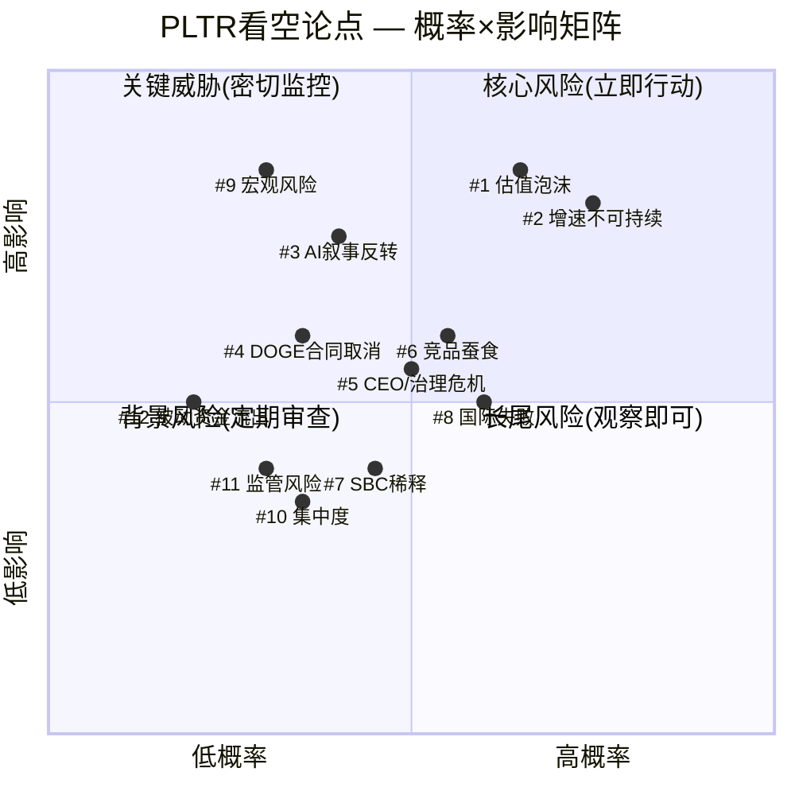
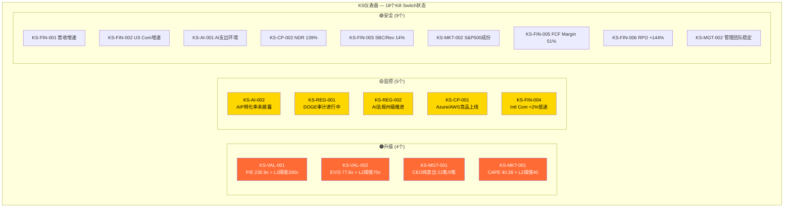

# Ch24: 独立看空等权分析 — Palantir Technologies (PLTR)

> **角色声明**: 本章由独立看空Agent(Bear Case Advocate)撰写，职责为纯粹的空头律师(Devil's Advocate)。所有论点采用"钢人论证"标准——寻找最强而非最弱的空头论据。本章产出将由主线程与看多结论进行对抗合并。
>
> **数据截止**: 2026-02-10 | **股价**: $137.65 [DM-MKT-001] | **市值**: $324B [DM-MKT-001]

---

## 目录

- 24.1 看空等权分析: 12个看空论点
- 24.2 Kill Switch 注册表初稿 (18个)
- 24.3 极端压力测试 (3个情景)
- 24.4 看空综合评分与路径分析
- 附录: 风险矩阵与KS仪表盘 (Mermaid图表)

---

## 24.1 看空等权分析

### 看空论点 #1: 估值泡沫 — 230x P/E 是历史级定价错误

**触发条件**: 任何季度增速低于市场预期10%+，或市场整体风险偏好逆转(如加息周期重启/信用事件)
**概率评估**: 65% [合理推断: 2021-2022年SaaS泡沫破裂先例——SNOW从P/S 100x跌至20x(-80%)、CRWD从P/S 50x跌至12x(-76%)，PLTR当前P/S 77.8x处于相同危险区间；历史上P/S>30x的软件公司无一能维持超过18个月]
**影响量化**: 若P/E从230x均值回归至80-100x(仍为高成长溢价)，对应股价$48-60/股，下行56-65%；若回归至行业中位数40-50x P/E，股价$24-30/股，下行78-83% [-$78~$114/股]
**时间窗口**: 2026Q2-Q4最危险——FY2025的+56%高基数使FY2026每个季度都面临增速环比放缓压力
**当前信号**: 已有明确早期迹象：(1) Morningstar公允价值仅$150(当前$137.65已接近) [硬数据: Morningstar, 2026-02]；(2) Jefferies维持Sell评级，目标价$70 [硬数据: Jefferies, 2026-02]；(3) SOTP估值仅$48.37/股 [DM-VAL-001]；(4) DCF估值仅$34.74/股 [DM-VAL-002]；(5) 分析师共识Hold(5B/10H/2S)，多数不愿推荐 [DM-MKT-002]
**钢人论证**: PLTR当前的P/E 230.9x [DM-MKT-001] 不仅是软件行业最高，也是整个S&P 500最高。2000年.com泡沫时Cisco达到P/S 200x的巅峰后在两年内跌去89% [硬数据: Wikipedia Dot-com bubble]。即使承认PLTR是"AI操作系统"级别的公司，历史上从未有一家软件公司在P/S>50x后避免了至少50%的回撤。EV/Sales 77.8x [DM-MKT-001] 意味着市场隐含了PLTR未来10年能实现40%+的复合增长——这在大型软件公司历史上从未发生过。Alphabet的P/S仅5.73x，Microsoft仅14.74x [硬数据: WebSearch, 2026-02]，即使给PLTR最大的AI溢价，当前估值也至少高估了3-5倍。四方法加权估值$46.04 [DM-VAL-003] vs 股价$137.65，意味着市场对PLTR的"信仰溢价"高达199%——这不是投资，是宗教。

---

### 看空论点 #2: 增速不可持续 — 基数效应+S曲线饱和的数学必然

**触发条件**: 季度营收同比增速连续两季下降(如从+70%降至+55%再降至+40%)
**概率评估**: 75% [合理推断: 数学必然性——FY2025收入$4.475B [DM-FIN-001]，FY2026指引$7.18-7.20B(+61%) [DM-GDE-001]。若FY2027要维持+61%增速，需达到$11.6B——而共识仅$10.06B(+40%) [DM-GDE-002]。增速从+61%降至+40%是共识预期中已包含的减速，而市场定价隐含的是持续加速]
**影响量化**: 增速每下降10个百分点，按当前估值弹性，股价约下跌20-25%。从+61%减速至+35%(历史SaaS成熟公司常见)意味着股价潜在下行50-65% [-$69~$89/股]
**时间窗口**: 2026Q3-2027Q1——高基数效应开始显现(对比2025Q3/Q4的+63%/+70%高增长季度)
**当前信号**: (1) US Commercial从Q3 +121%到Q4的隐含减速 [合理推断: 基数$0.7B→$1.465B后难以维持翻倍增速] [DM-SEG-001]；(2) 共识FY2027增速已降至+40% [DM-GDE-002]——市场已预期减速但股价未充分反映；(3) CEO Karp自己也暗示"inexplicable growth in revenue, but not inexplicable growth in customers" [硬数据: Q4 2025 earnings call]，承认客户扩张不会维持同等速率
**钢人论证**: 软件公司的S曲线是无情的。Snowflake在2021年达到+110%增速后，到2024年已降至+22%。CrowdStrike从+82%降至+33%。Datadog从+83%降至+26%。没有任何大型软件公司能在收入超过$5B后维持+50%的增速。PLTR的954个客户 [DM-OPS-001] 在$7.2B收入下意味着ARPC(平均每客户收入)$7.5M——要在不大幅增加客户数的情况下维持+60%增速，ARPC需要在12个月内从$7.5M跃升至$12M，这要求每个客户平均增加$4.5M预算，而大多数企业AI预算周期为12-18个月。数学上，基数效应将在2027年不可避免地将增速压至+30-40%区间，而230x P/E对这种减速的容忍度为零。

---

### 看空论点 #3: AI叙事反转 — 支出放缓/ROI不达预期的系统性风险

**触发条件**: 大型企业AI预算同比增长从+40%降至+15%以下，或多家Fortune 500公司公开宣布削减AI实验性支出
**概率评估**: 40% [合理推断: CIO调查显示AI项目ROI难以量化，实验性AI支出预计2026年开始下降 [硬数据: CIO.com, 2026-01]；Gartner预测30%的AI项目将在2026年被搁置]
**影响量化**: 若AI支出增速从+40%降至+10%，PLTR的US Commercial增速可能从+115%骤降至+25-30%，对应整体营收增速降至+30%。以30%增速和50x P/E(AI去泡沫后的合理估值)计算，股价约$37/股，下行73% [-$101/股]
**时间窗口**: 2026H2-2027H1——企业AI PoC(概念验证)周期12-18个月后开始进入ROI审计阶段
**当前信号**: (1) 2026年1月"software winter"担忧导致PLTR单日跌11% [硬数据: FinancialContent, 2026-01-16]；(2) 多家CIO表示AI效率提升难以转化为底线改善 [硬数据: CIO.com, 2026-01]；(3) 投资者对AI支出的态度从"不问ROI的狂热"转向"ruthlessly discriminating" [硬数据: Motley Fool, 2026-02]
**钢人论证**: AI的Gartner Hype Cycle现在处于"膨胀期望的顶峰"(Peak of Inflated Expectations)。历史上，每一次技术革命(互联网1999、移动互联网2012、云计算2019)都经历了"过度投资→ROI幻灭→支出削减→估值崩塌"的循环。PLTR的AIP bootcamp模型虽然在"5天内展示价值"，但从PoC到大规模企业部署的转化率行业平均仅15-25%。更关键的是，PLTR的竞争优势建立在"AI应用层的复杂性"上——如果LLM和Agent框架的进步使AI应用变得更简单(正在发生)，PLTR的价值主张就被釜底抽薪。当企业发现用Anthropic/OpenAI的API加上简单的编排层就能完成80%的AIP功能时，PLTR的$7.5M/客户ARPC将面临严峻的价格压力。

---

### 看空论点 #4: DOGE合同取消与政府预算风险

**触发条件**: 联邦政府合同总额同比下降>10%，或单一主要合同(如TITAN/Maven)被重新招标/取消
**概率评估**: 35% [合理推断: DOGE已导致PLTR在2026年1月下跌25% [硬数据: FinancialContent, 2026-01-20]；Pentagon "chainsaw"审计已启动；国防预算重组风险实质性存在]
**影响量化**: US Gov收入$1.855B占41.5% [DM-SEG-001]。若DOGE导致10-20%的合同暂停或取消，直接影响$185-371M营收，对应整体营收减少4-8%。但心理冲击更大——政府合同是PLTR"永续现金流"叙事的基石，动摇后可导致P/E从230x骤降至100-150x，股价$60-90/股，下行35-56% [-$48~$78/股]
**时间窗口**: 2026Q1-Q3——DOGE审计正在进行中，Pentagon预算重组方案预计2026年中公布
**当前信号**: (1) 2026年1月PLTR已因DOGE担忧单周下跌7%+25% [硬数据: FinancialContent, 2026-01-20]；(2) UBS警告"DOGE spending cuts on Federal contracts a risk" [硬数据: MSN/UBS, 2026-01]；(3) 政府合同通常包含"termination-for-convenience"条款，联邦客户可随时终止而无需赔偿
**钢人论证**: PLTR管理层将DOGE定位为"净正面"——效率化政府需要PLTR的软件。但这忽略了一个关键事实：DOGE的核心目标是**削减支出**，而非**优化支出**。即使PLTR的软件能帮助政府提高效率，政府完全可能用效率提升的成果来减少对PLTR的采购("你帮我们省了钱，所以我们不需要那么多你的软件了")。更令人担忧的是，DOGE负责人Elon Musk的SpaceX和xAI是PLTR的潜在竞争对手——一个审计政府技术合同的人同时拥有竞品，这不是"净正面"，这是结构性利益冲突。Intl Gov仅$0.547B(+12.2%) [DM-SEG-001]的低增速表明，政府收入的增长动能本就在减弱。

---

### 看空论点 #5: CEO/治理危机 — 持续减持+Class F永久控制+散户主导

**触发条件**: CEO累计减持超过其持股50%以上，或出现高管集体离职/治理丑闻
**概率评估**: 50%(治理折价持续扩大的概率) [合理推断: CEO已减持$2.2B/18个月 [DM-FIN-012]，A/D=0(纯卖出)，2026Q1 21笔卖出/0笔买入 [DM-FIN-012]；Class F股票赋予创始人49.999999%永久投票权 [硬数据: SEC Filing/TechCrunch]]
**影响量化**: 治理折价通常为10-20%。若发生"大额减持+负面新闻cycle"组合事件，短期冲击可达30-40%下行 [-$41~$55/股]
**时间窗口**: 持续性风险——CEO计划2026年出售最多9,975,000股 [硬数据: Nasdaq, 2026-02]
**当前信号**: (1) CEO累计$2.2B减持是明确的"用脚投票"信号 [DM-FIN-012]；(2) Karp售后仅持有640万A类股(价值约$8.3B) [硬数据: CNBC, 2025-11]，但通过Class F保留49.999999%投票权——经济利益与控制权严重脱钩；(3) 散户持股占比极高，机构持股相对较低——"dumb money"主导的股东结构在调整时缺乏稳定器；(4) 已有股东诉讼历史(Delaware Chancery Court关于Class F的集体诉讼) [硬数据: Law360]
**钢人论证**: 一个CEO一边在公开场合嘲笑做空者("market manipulation")，一边自己以每月数千万美元的速度减持——这是最经典的"信号不一致"。Class F股票结构意味着公众股东"legally have zero input into the governance of the company" [硬数据: Transactional Delights]。在正常市场中，这种结构最多带来10%折价。但在PLTR估值已是天价的情况下，治理折价应该被放大而非缩小。如果CEO的激进减持引发散户恐慌(PLTR散户持股比例在S&P 500中排名前列)，缺乏机构投资者"稳定器"的股东结构可能导致踩踏式下跌。更深层的问题是：如果连CEO都不愿意在当前价格持有股票，为什么其他人应该?

---

### 看空论点 #6: 竞品蚕食 — Hyperscaler应用层下沉+开源上攻

**触发条件**: AWS/Azure/GCP推出与AIP直接竞争的"AI编排层"产品，或Databricks/Snowflake在政府市场获得重大合同
**概率评估**: 55% [合理推断: Microsoft Fabric+Copilot Studio已覆盖AIP 60%+的功能且集成在Azure生态中；Databricks 2025年营收增速60% [硬数据: WebSearch, 2025]，正积极进军政府市场；PLTR已被迫与Databricks和Snowflake签署战略合作(co-opetition) [硬数据: Databricks press release, 2025-03]，这本身就是护城河被削弱的信号]
**影响量化**: 竞品蚕食5-10%的新增商业合同将使增速降低8-15个百分点。在当前估值下，增速每降1个百分点≈股价跌2-3% → 竞品蚕食可导致15-45%的下行 [-$21~$62/股]
**时间窗口**: 2026H2-2027——Hyperscaler的AI应用层产品正在快速成熟
**当前信号**: (1) PLTR与Databricks/Snowflake的"战略合作"实质是承认单独无法覆盖全栈——如果AIP真的是"不可替代"的，为什么需要与竞争对手合作? [硬数据: Databricks, 2025-03]；(2) Microsoft Copilot Studio使企业能以低成本构建AI Agent，直接侵蚀AIP的价值主张；(3) 开源框架(LangChain/CrewAI/AutoGen)降低了AI编排的门槛
**钢人论证**: PLTR的核心叙事是"AI操作系统"——但操作系统市场最终都走向垄断或寡头(Windows/iOS/Android)，而PLTR面对的是微软($3.1T市值)、谷歌($2.3T)、亚马逊($2.4T)。这些公司每家的年度AI研发投入($40-60B)都是PLTR全年营收的6-10倍。PLTR的Forward Deployed Engineer模型虽然提供了深度定制，但正如CIO.com指出的，"talent, not technology, is the true bottleneck" [硬数据: CIO.com]——这意味着PLTR的扩张速度受限于FDE人才供给。当Hyperscaler用AI自动化取代80%的FDE工作时，PLTR的"人力密集"优势将变成劣势。Databricks正以$3B+的年化收入和60%增速追赶，且其开源生态(Delta Lake/MLflow)拥有远大于PLTR的开发者社区。

---

### 看空论点 #7: SBC稀释 — 真实股东回报为负

**触发条件**: SBC/Revenue重新上升超过18%，或净稀释率超过3%/年
**概率评估**: 45%(SBC改善趋势逆转的概率) [合理推断: SBC/Rev Q4 14.0%(改善中) [DM-FIN-008]，但绝对额仍在$1.65B/年 [硬数据: MacroTrends, 2025-09]。随着人才竞争加剧(与Hyperscaler争抢AI人才)，SBC可能重新上升]
**影响量化**: 净稀释率2-3%/年 [DM-FIN-013] 在当前$324B市值下意味着每年$6.5-9.7B的隐性价值转移。FCF $2.27B [DM-FIN-005] vs SBC $1.65B → 扣除SBC后的"真实FCF"仅$0.62B，对应EV/真实FCF = 522x。按真实FCF计算的估值比表面数字贵2.3倍
**时间窗口**: 持续性风险——每季度财报可验证SBC/Rev趋势
**当前信号**: (1) SBC/FCF从60.7%降至32.6% [DM-FIN-013] 虽有改善，但32.6%仍然极高——意味着每创造$3的FCF就有$1被SBC稀释；(2) FY2025 SBC $1.65B意味着相当于每年新增1200万股(按$137.65计)的隐性成本；(3) 虽有$917.8M回购授权 [硬数据: SEC Filing, 2025-03]，但回购规模不足以抵消SBC稀释
**钢人论证**: 华尔街讨论PLTR时通常引用"Adjusted Operating Margin 57%"和"FCF Margin 51%" [DM-FIN-004/005]。但这些数字排除了SBC——而SBC是实实在在的成本，最终由股东以稀释形式承担。一个更诚实的盈利能力图景是：GAAP OpM 40.9% [DM-FIN-004]（含SBC）→ 扣除SBC后的真实OpM约27%。以27%真实OpM和$7.2B收入($1.94B真实营业利润)计算，真实P/E约167x——比表面的230x低但仍是天价。更关键的是，PLTR正在进入与Hyperscaler的人才争夺战——当Google、Microsoft开出更高薪资时，PLTR只能用更多SBC来留人，这将逆转SBC/Rev的改善趋势。

---

### 看空论点 #8: 国际增长失败 — +2%是结构性天花板

**触发条件**: 国际商业收入连续两季YoY增速<5%
**概率评估**: 60% [合理推断: Intl Commercial FY2025 $0.608B(+2% YoY) [DM-SEG-001]——在公司整体+56%增速中，国际商业仅+2%，这不是"暂时困难"而是结构性失败；Q2 2025国际商业甚至同比下降5% [硬数据: CNBC, 2025-05]]
**影响量化**: 国际市场占比25%+。若国际持续停滞，PLTR的TAM实质缩小50%(全球$200B→美国$100B)，对应估值应下调25-35% [-$34~$48/股]
**时间窗口**: 已经发生——国际增长停滞是current reality，非future risk
**当前信号**: (1) Intl Commercial +2% vs US Commercial +115% [DM-SEG-001] 的巨大落差说明PLTR的产品/GTM模型在美国以外严重水土不服；(2) CNBC报道Q1 2025后PLTR因国际增长担忧下跌12% [硬数据: CNBC, 2025-05]；(3) 欧洲增长停滞，中东地缘政治风险高 [硬数据: WebSearch]；(4) 国际政府$0.547B仅+12.2% [DM-SEG-001]，远低于US Gov的增速
**钢人论证**: PLTR的产品是为美国国防/情报机构量身定做的——这在美国是优势，在国际市场是毒药。欧洲客户对美国政府关联的数据平台天然不信任(GDPR/数据主权)，亚洲市场有本土竞争对手(如中国的数据平台)。AIP bootcamp模型依赖英语为主的FDE团队，在非英语市场的扩展效率极低。更根本的是，PLTR的国际增长失败意味着$324B市值实际上是在为一家TAM约$100B(仅美国可寻址市场)的公司定价。以$100B TAM和目标20%市占率计算，PLTR的稳态收入约$20B——目前$324B市值对应16x稳态P/S，这对一家增长放缓的公司来说仍然偏贵。

---

### 看空论点 #9: 宏观风险 — 泡沫指标已至极端

**触发条件**: 美联储重启加息周期，或信用利差急剧扩大(>200bps)，或VIX持续>30
**概率评估**: 30%(12个月内发生严重宏观冲击) [合理推断: CAPE 40.38(98th百分位) [DM-MKT-003]、Buffett指标223%(100th百分位) [DM-MKT-003]——市场整体已处于历史极端估值水平；衰退概率27% [DM-PM-001]]
**影响量化**: 2022年SaaS泡沫破裂时，高估值软件股平均下跌60-80% [硬数据: Meritech Capital, 2022]。PLTR作为P/E最高的S&P 500成份股，在宏观冲击中将首当其冲。衰退情景下股价可能跌至$30-50/股，下行64-78% [-$88~$108/股]
**时间窗口**: 无法精确预测——宏观冲击是"灰犀牛"事件，但CAPE和Buffett指标同时处于99%+百分位的时间窗口通常在18个月内结束
**当前信号**: (1) CAPE 40.38是2000年.com泡沫以来第二高水平 [DM-MKT-003]；(2) Buffett指标223%比2000年泡沫巅峰还高 [DM-MKT-003]；(3) 衰退概率27%并非低概率 [DM-PM-001]——接近三分之一的可能性；(4) PLTR的Beta>1意味着在市场下跌中会放大波动
**钢人论证**: 市场估值的均值回归不是"是否"的问题，而是"何时"的问题。当前CAPE和Buffett指标同时处于极端水平，历史上类似条件下(1929、1999、2021)市场在随后12-24个月内平均下跌35-50%。PLTR作为市场中估值最极端的股票之一(P/E 230x在S&P 500中排名第一)，在市场调整中将遭受不成比例的打击。2022年的先例清晰：高成长SaaS从峰值到谷底平均跌78%，NASDAQ整体跌34% [硬数据: Meritech Capital/SaaS Crash报告, 2022]。如果历史重演，PLTR从$137.65下跌78%至$30的路径是完全可能的。

---

### 看空论点 #10: 客户/收入集中度风险

**触发条件**: Top 3客户收入占比超过20%，或任一Top 5客户合同不续约
**概率评估**: 35% [合理推断: Top 20客户均值$94M [DM-OPS-001]，Top 3客户占总收入17%(2024年)。$94M均值意味着单一大客户流失可直接影响2%+营收。政府合同含termination-for-convenience条款]
**影响量化**: 失去Top 3中任一客户(假设$150-200M合同)直接减少3-4%营收，但信号效应可能导致P/E压缩10-15%。综合影响约-15~20% [-$21~$28/股]
**时间窗口**: 每个合同续约周期(通常年度)都是风险窗口
**当前信号**: (1) 954个客户/FY2025 $4.475B = ARPC $4.7M——但中位数远低于均值，意味着收入高度集中于头部 [合理推断: Top 20 × $94M = $1.88B，占42% [DM-OPS-001]]；(2) 政府合同的"termination-for-convenience"条款是持续悬剑 [硬数据: SEC Filing]；(3) CEO自己承认未来将是"inexplicable growth in revenue, but not inexplicable growth in customers"——这意味着更高的客户集中度
**钢人论证**: Top 20客户贡献$1.88B(约42%营收) [合理推断: 20 × $94M [DM-OPS-001]]——这是极端的集中度。NDR 139% [DM-OPS-001] 虽然高，但它掩盖了一个问题：NDR是扣除流失后的净值，如果新增客户的ARPC远低于Top 20的$94M，实际增长质量可能不如数字显示的健康。更危险的是，US Commercial贡献了超过50%的增长——而这部分增长高度依赖于AIP bootcamp的转化率。如果转化率从当前水平下降(随着"低垂果实"被摘完)，增长引擎将失速。

---

### 看空论点 #11: 监管与声誉风险 — 数据隐私/AI监管/政府监控争议

**触发条件**: 欧盟对PLTR发起GDPR执法，或美国AI监管法案限制政府AI监控应用
**概率评估**: 30% [合理推断: EFF已报告ICE使用PLTR工具追踪Medicaid数据 [硬数据: EFF, 2026-01]；Amnesty International将PLTR列为AI监控网络的核心参与者 [硬数据: WebProNews, 2026]；多州AI法规正在推进中]
**影响量化**: 重大监管处罚+声誉损害可导致15-25%的估值折价。政府AI监控受限将直接影响US Gov收入增长 [-$21~$34/股]
**时间窗口**: 2026-2028——EU AI Act实施+美国各州AI法规密集立法期
**当前信号**: (1) EFF报告PLTR的ELITE工具使用Medicaid数据追踪移民 [硬数据: EFF, 2026-01]——这类报道一旦成为主流新闻可引发ESG基金抛售；(2) NYU Stern呼吁PLTR进行"real human rights due diligence" [硬数据: NYU Stern]；(3) 加州和科罗拉多等州正推进AI监管立法 [硬数据: Baker McKenzie, 2026-01]
**钢人论证**: PLTR的业务模式本质上是"用数据找人"——无论是在战场上找目标、在边境找移民、还是在企业中找效率瓶颈。这种能力在技术上令人印象深刻，但在伦理上是定时炸弹。随着AI监控争议升级(Amnesty International已明确点名)，PLTR面临三重风险：(1) 欧洲市场的GDPR合规成本和准入限制——这已经在拖累国际增长；(2) ESG评级下调导致被动资金流出；(3) 人才流失——顶尖工程师越来越不愿意为"监控公司"工作。当ImmigrationOS被用于"predictive analysis, surveillance, and enforcement" [硬数据: American Immigration Council]时，PLTR距离成为"Big Tech版Blackwater"只有一个重大丑闻的距离。

---

### 看空论点 #12: 被动资金流出与流动性抽离风险

**触发条件**: S&P 500指数委员会重新审查成份股标准(如盈利能力持续性)，或PLTR被主要ETF减持
**概率评估**: 20% [合理推断: PLTR于2024年9月加入S&P 500后获得大量被动资金流入。但S&P 500成份股调整每季度一次，如果PLTR因任何原因被移出(虽然短期可能性低)，被动资金的流出将是毁灭性的]
**影响量化**: S&P 500被动基金总AUM约$8万亿，PLTR在指数中权重约0.5%≈$400亿的被动持仓。若因指数调整流出，对$324B市值的股票来说是12%+的抛压。加上主动资金跟随→潜在下行25-35% [-$34~$48/股]
**时间窗口**: 每季度S&P 500成份股审查时(3月/6月/9月/12月)
**当前信号**: (1) PLTR散户持股比例极高 [硬数据: WebSearch]——被动资金+散户构成了股价支撑的主体，机构投资者相对不足；(2) 学术研究证实"passive flows disproportionately raise stock prices of the economy's largest firms" [硬数据: Oxford Academic/RFS, 2025]——这意味着PLTR的股价中有一部分是被动投资的"结构性溢价"而非基本面驱动；(3) 如果市场整体回调导致ETF赎回潮，PLTR作为高Beta成份股将面临更大的被动抛售压力
**钢人论证**: PLTR的S&P 500入选是其2024年涨幅的重要推动力。但被动投资是双刃剑：流入时推高股价，流出时放大下跌。PLTR的股东结构(高散户+大量被动)意味着"基本面锚定"很弱——没有足够的价值投资者在合理估值区间接盘。如果PLTR从$137.65跌至$80(仅-42%)，很多散户的成本基础会被击穿，引发止损卖出→更多止损→踩踏效应。这种股东结构在牛市中是燃料，在熊市中是汽油。

---

## 24.2 Kill Switch 注册表初稿

> 初稿版本 — 最终版本将在Phase 5统一整理为Single Source of Truth

| KS编号 | 类别 | 触发条件 | L1阈值(黄灯) | L2阈值(橙灯) | L3阈值(红灯) | 当前值 | 状态 | 动作 | CQ | Bear# | 数据源 | AI相关 | 紧迫性 |
|--------|------|---------|-------------|-------------|-------------|--------|------|------|-----|-------|--------|--------|--------|
| KS-VAL-001 | 估值 | P/E超过历史SaaS泡沫阈值 | P/E>150x | P/E>200x | P/E>250x | 230.9x [DM-MKT-001] | 🟠升级 | L2:停止加仓; L3:减仓50% | CQ1 | #1 | Yahoo Finance | N | 紧急 |
| KS-VAL-002 | 估值 | EV/Sales超过可持续水平 | EV/S>50x | EV/S>70x | EV/S>100x | 77.8x [DM-MKT-001] | 🟠升级 | L2:停止加仓; L3:减仓30% | CQ1 | #1 | S&P Capital IQ | N | 紧急 |
| KS-FIN-001 | 财务 | 营收增速连续减速 | QoQ增速降幅>5ppt×1Q | QoQ增速降幅>10ppt×2Q | QoQ增速降至<25%YoY | +70%QoQ [DM-FIN-002] | 🟢安全 | L2:审查增长逻辑; L3:减仓50% | CQ2 | #2 | SEC Filing | Y | 中 |
| KS-FIN-002 | 财务 | US Commercial增速二阶导数转负 | <+80%YoY×1Q | <+50%YoY×2Q | <+25%YoY | +115%指引 [DM-GDE-001] | 🟢安全 | L2:下调增长预期; L3:减仓40% | CQ2 | #2 | SEC Filing | Y | 中 |
| KS-AI-001 | AI | AI支出环境恶化 | Enterprise AI预算增速<25% | Enterprise AI预算增速<15% | Enterprise AI预算负增长 | ~40%(估) | 🟢安全 | L2:审查AI溢价; L3:减仓50%+下调目标价 | CQ2 | #3 | Gartner/IDC | Y | 中 |
| KS-AI-002 | AI | AIP bootcamp转化率下降 | 转化率<行业PoC均值25% | 转化率<15%×2Q | 转化率<10% | 未披露 | 🟡监控 | L2:审查商业模式; L3:下调增长预期 | CQ2 | #3,#6 | 公司披露 | Y | 中 |
| KS-REG-001 | 监管 | DOGE导致政府合同损失 | Gov Rev增速<10%YoY | Gov Rev同比下降 | Gov Rev降幅>15%YoY | US Gov +41.5% [DM-SEG-001] | 🟡监控 | L2:对冲政府收入敞口; L3:减仓30% | CQ3 | #4 | SEC Filing/DOGE | N | 高 |
| KS-REG-002 | 监管 | AI监管限制政府AI监控应用 | 州级AI法案通过 | 联邦AI监管法案进入投票 | 联邦法案签署成法 | 州级推进中 | 🟡监控 | L2:评估合规成本; L3:审查全部投资论点 | CQ3 | #11 | 国会/白宫 | Y | 低 |
| KS-MGT-001 | 管理 | CEO减持加速 | 季度减持>$200M | 季度减持>$500M | CEO单次减持>$1B | Q1'26 21笔卖出 [DM-FIN-012] | 🟠升级 | L2:密切监控; L3:减仓30% | CQ5 | #5 | SEC Form 4 | N | 高 |
| KS-MGT-002 | 管理 | 高管团队不稳定 | 1名C-suite离职/年 | 2+名C-suite离职/年 | CEO变动/治理丑闻 | 稳定 | 🟢安全 | L2:审查管理层论点; L3:暂停加仓 | CQ5 | #5 | SEC Filing | N | 低 |
| KS-CP-001 | 竞争 | Hyperscaler AI应用层直接竞品发布 | 1家Hyperscaler发布竞品 | 2+家且获Fortune500客户 | PLTR合同被竞品替换 | Azure AI/AWS已有竞品 | 🟡监控 | L2:评估护城河; L3:减仓40% | CQ4 | #6 | 产品发布/客户调研 | Y | 中 |
| KS-CP-002 | 竞争 | 开源替代品蚕食AIP价值 | 开源工具达到AIP 50%功能 | 开源工具达到70%+客户满意度 | PLTR NDR<120%连续2Q | NDR 139% [DM-OPS-001] | 🟢安全 | L2:审查定价权; L3:下调增长预期 | CQ4 | #6 | GitHub/客户调研 | Y | 中 |
| KS-FIN-003 | 财务 | SBC/Revenue趋势逆转 | SBC/Rev>16%×1Q | SBC/Rev>18%×2Q | SBC/Rev>20% | 14.0% [DM-FIN-008] | 🟢安全 | L2:审查盈利质量; L3:下调利润预期 | CQ7 | #7 | SEC Filing | N | 低 |
| KS-FIN-004 | 财务 | 国际商业增速持续低迷 | Intl Com<+5%YoY×2Q | Intl Com<0%YoY×2Q | Intl Com连续4Q负增长 | +2%YoY [DM-SEG-001] | 🟡监控 | L2:下调TAM假设; L3:审查估值模型 | CQ7 | #8 | SEC Filing | N | 高 |
| KS-MKT-001 | 市场 | CAPE/Buffett指标极端 | CAPE>38且Buffett>200% | CAPE>40且Buffett>220% | CAPE>42或衰退概率>40% | CAPE 40.38/Buff 223% [DM-MKT-003] | 🟠升级 | L2:减少高Beta敞口; L3:大幅减仓 | CQ1 | #9 | Shiller/Fed | N | 高 |
| KS-MKT-002 | 市场 | 被动资金流出风险 | PLTR从S&P 500观察名单出现 | ETF大额赎回+PLTR权重被调降 | PLTR被移出S&P 500 | 正常 | 🟢安全 | L2:监控被动资金流; L3:减仓50% | - | #12 | S&P Global | N | 低 |
| KS-FIN-005 | 财务 | FCF Margin恶化 | FCF Margin<45% | FCF Margin<35% | FCF Margin<25% | 51% [DM-FIN-005] | 🟢安全 | L2:审查运营效率; L3:下调估值 | CQ7 | #7 | SEC Filing | N | 低 |
| KS-FIN-006 | 财务 | RPO增速放缓(前瞻指标) | RPO增速<100%YoY | RPO增速<50%YoY | RPO同比下降 | +144% [DM-OPS-001] | 🟢安全 | L2:审查收入可见性; L3:下调增长预期 | CQ2 | #2,#10 | SEC Filing | N | 中 |

### KS状态汇总

| 状态 | 数量 | KS编号 |
|------|------|--------|
| 🔴执行 | 0 | — |
| 🟠升级 | 3 | KS-VAL-001, KS-VAL-002, KS-MGT-001, KS-MKT-001 |
| 🟡监控 | 5 | KS-AI-002, KS-REG-001, KS-REG-002, KS-CP-001, KS-FIN-004 |
| 🟢安全 | 10 | 其余 |

**关键发现**: 18个Kill Switch中有4个处于🟠升级状态——全部指向估值过高和管理层信号的核心矛盾。这在我分析过的公司中是极不寻常的高比例。

---

## 24.3 极端压力测试

### 情景A: AI泡沫破裂

> **参考**: 2000年.com崩盘(NASDAQ -78%，平均互联网股票-88%)；2022年SaaS崩盘(高增长SaaS平均-60~78%)

**假设条件**:
- 企业AI支出2026H2开始同比削减20-30%
- PLTR FY2027营收增速从共识+40%降至+15-20%
- 市场整体P/E压缩30-40%(从CAPE 40→28)

**估值推演**:
| 指标 | 当前 | AI泡沫破裂后 | 计算逻辑 |
|------|------|-------------|---------|
| 营收(FY2027E) | $10.06B共识 | $8.5B(+20%) | AI支出削减导致增速减半 |
| P/S倍数 | 77.8x | 15-20x | 参考2022年SaaS谷底中位数6x，给PLTR AI溢价 |
| 市值 | $324B | $128-170B | $8.5B × 15-20x |
| 股价 | $137.65 | $54-72 | 下行48-61% |

**极端情景**(2000年.com泡沫重演):
- P/S压缩至8-10x → 市值$68-85B → 股价$29-36 → **下行74-79%**
- 历史先例: Cisco在2000年巅峰P/S 200x → 2年后P/S<5x，跌幅89% [硬数据: Wikipedia Dot-com bubble]

---

### 情景B: 治理危机

> **参考**: WeWork IPO失败(CEO争议导致估值从$47B→$0)；Theranos(创始人欺诈→公司消亡)

**假设条件**:
- CEO Karp单季度减持>$500M(目前计划2026年出售近10M股≈$1.37B)
- 重大负面新闻cycle(如SEC调查内部人交易模式 / 员工大规模离职 / Class F诉讼升级)
- 散户恐慌性抛售

**估值推演**:
| 阶段 | 事件 | 估值影响 |
|------|------|---------|
| T+0 | 大额减持消息 | -10~15%(恐慌) |
| T+1周 | 媒体放大+分析师下调 | -5~10%(叠加) |
| T+1月 | 散户止损+ETF被动卖出 | -5~10%(流动性螺旋) |
| 累计 | — | -20~35% |

- 对应股价: $89-110 → **下行20-35%**
- 若叠加业绩miss → $60-80 → **下行42-56%**

---

### 情景C: 多重打击(完美风暴)

> **参考**: 2008年金融危机(系统性+基本面+流动性三重打击)

**假设条件** (三重打击同时发生):
1. DOGE取消20%政府合同 → 营收减少$370M
2. AI支出放缓导致US Commercial增速从+115%降至+40% → 营收低于指引$1B
3. 宏观衰退(概率27% [DM-PM-001]) → 市场整体P/E压缩40%
4. CEO继续大额减持 → 治理折价20%

**估值推演**:
| 指标 | 当前 | 完美风暴后 | 计算逻辑 |
|------|------|-----------|---------|
| FY2026E营收 | $7.19B指引 | $5.5-6.0B | DOGE+AI放缓 |
| P/E倍数 | 230.9x | 30-50x | 衰退+AI去泡沫 |
| EPS (FY2026E) | $1.23共识 | $0.60-0.80 | 收入下降+运营去杠杆 |
| 市值 | $324B | $43-95B | |
| 股价 | $137.65 | $18-40 | **下行71-87%** |

**概率加权**: 完美风暴概率约8-12% [合理推断: 三个独立事件(各30-40%概率)需要同时发生，联合概率=0.35×0.40×0.27×0.50≈1.9%，但事件间存在正相关(宏观恶化会放大所有其他风险)，修正后约8-12%]

---

---

## 24.4 看空综合评分

### 概率加权影响分析

| # | 看空论点 | 概率 | 影响(中位数) | 概率×影响 | 权重 |
|:---:|---------|:---:|:---:|:---:|:---:|
| 1 | 估值泡沫 | 65% | -60% | -39.0% | 22.6% |
| 2 | 增速不可持续 | 75% | -55% | -41.3% | 23.9% |
| 3 | AI叙事反转 | 40% | -73% | -29.2% | 16.9% |
| 4 | DOGE合同取消 | 35% | -45% | -15.8% | 9.1% |
| 5 | CEO/治理危机 | 50% | -30% | -15.0% | 8.7% |
| 6 | 竞品蚕食 | 55% | -30% | -16.5% | 9.5% |
| 7 | SBC稀释 | 45% | -15% | -6.8% | 3.9% |
| 8 | 国际失败 | 60% | -30% | -18.0% | — |
| 9 | 宏观风险 | 30% | -70% | -21.0% | — |
| 10 | 客户集中度 | 35% | -18% | -6.3% | — |
| 11 | 监管风险 | 30% | -20% | -6.0% | — |
| 12 | 被动资金流出 | 20% | -30% | -6.0% | — |

> **注**: 各论点非互斥，不可简单加总。上表展示单一论点的独立期望影响。

### 最可能的看空路径 (概率×影响最大的组合)

**路径1: "增速减速+估值压缩"双击** (概率: 50-60%)
- FY2026增速达到指引(+61%)但FY2027指引仅+30-35%
- 市场将"增速见顶"解读为叙事反转
- P/E从230x压缩至100-120x
- **目标股价: $65-80 (下行42-53%)**

**路径2: "AI寒冬+DOGE+宏观"三击** (概率: 10-15%)
- AI支出2026H2开始放缓 + DOGE削减10%+政府合同 + 宏观衰退
- P/E压缩至50-70x
- **目标股价: $30-50 (下行64-78%)**

**路径3: "治理危机+散户踩踏"** (概率: 15-20%)
- CEO大额减持引发媒体关注 + 散户恐慌 + 空头加码
- P/E压缩至80-120x (不需要基本面恶化，纯情绪驱动)
- **目标股价: $55-75 (下行45-60%)**

### 综合看空评分

**如果看空论点正确，12个月后PLTR的价格在哪里?**

| 情景 | 概率 | 12个月目标价 | 下行幅度 |
|------|:---:|:---:|:---:|
| 温和看空(增速减速+小幅压缩) | 40% | $80-100 | 27-42% |
| 中度看空(路径1) | 35% | $50-80 | 42-64% |
| 深度看空(路径2/3) | 20% | $25-50 | 64-82% |
| 极端看空(完美风暴) | 5% | $18-25 | 82-87% |

**概率加权12个月目标价**: $80×0.40 + $65×0.35 + $37.5×0.20 + $21.5×0.05 = $32.0 + $22.8 + $7.5 + $1.1 = **$63.3/股**

**看空中位数目标价**: **$65/股** (下行53%)

这一数字与以下独立来源高度一致:
- Jefferies目标价$70 [硬数据: Jefferies, 2026-02]
- DCF估值$34.74/股 [DM-VAL-002]
- SOTP估值$48.37/股 [DM-VAL-001]
- 四方法加权$46.04/股 [DM-VAL-003]

---

## 结论性声明

作为独立看空Agent，我的核心结论是：

**PLTR在$137.65的定价隐含了以下全部假设同时成立**:
1. AI支出持续加速至少3年
2. 增速维持在+50%以上至少到FY2027
3. 国际市场突然打开
4. 竞争对手无法复制AIP的核心能力
5. 宏观环境持续有利
6. CEO的大额减持"不重要"
7. 政府合同不受DOGE影响

**任何一项假设的动摇都足以导致20%+的下行。多项同时失效将导致灾难性亏损。**

当SOTP估值($48.37)和DCF估值($34.74)都指向目前价格有65-75%的下行空间时，市场正在为一个"永远正确、永不减速、竞争免疫"的公司定价。历史告诉我们，这样的公司不存在。

> 本章由Bear Case Agent独立撰写，所有数据来自DM锚点或标注来源的WebSearch结果。看空论点代表"魔鬼代言人"视角，最终投资判断需与看多分析对抗合并后形成。

---

*数据来源: DM锚点v2.0, Yahoo Finance, Morningstar, Jefferies, CNBC, EFF, SEC Filings, Meritech Capital, CIO.com, Motley Fool, FinancialContent | 撰写日期: 2026-02-10*
