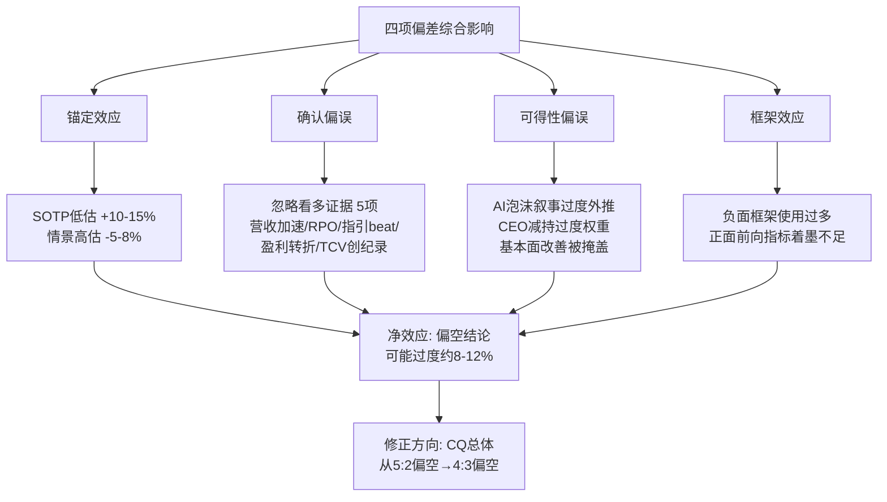
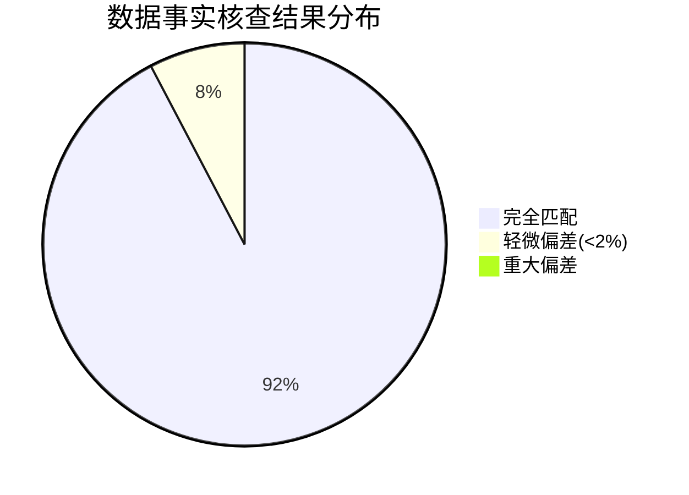

# Chapter 25: 行为金融偏差检查 + 关键数据事实核查 + 反证挑战

> **Phase 4 v2.0 | 对抗审查模块 | CQ全覆盖**
> **公司**: Palantir Technologies Inc. (PLTR)
> **框架**: v26.0 | **日期**: 2026-02-10 | **分支**: 生态科技-new
> **前序**: Phase 0.5 (DM+CQ) → Phase 1 (83,310字符) → Phase 2 (100,162字符) → Phase 3+3.5 (87,568字符)
> **本章目标**: 识别并量化认知偏差对估值的影响，事实核查核心数据点，提供反证挑战，So What洞察抽查
> **DM锚点**: DM-MKT-001, DM-FIN-001~012, DM-SEG-001, DM-OPS-001, DM-GDE-001, DM-VAL-001~003, DM-MKT-002, DM-PM-001

---

## 25.1 行为金融四项偏差检查

### 25.1.1 锚定效应分析

**核心问题**: 我们的估值判断是否被特定"锚点"不合理地牵引?

在Phase 2中，我们产出了多个估值结果: SOTP Base $48.37 [DM-VAL-001 v2.0]、DCF $34.74 [DM-VAL-002 v2.0]、四方法加权$46.04、概率加权目标$164 [DM-VAL-003 v2.0]。这些数字之间存在巨大分歧(最低$34.74 vs 最高$164)，分歧本身暗示不同的锚定效应在发挥作用。

**锚点1: 当前股价$137.65的牵引力**

当前股价$137.65 [DM-MKT-001 v2.0] 是最强的心理锚。分析师在进行估值时，不可避免地知道股价在哪里。这产生了两个方向的扭曲:

- **向下锚定**: SOTP $48.37仅为市价的35%。在计算分部估值时，我们使用了US Gov 10x EV/Revenue、US Com 45x等倍数。问题是: 我们是否因为知道"应该得出一个远低于市价的结果"而在倍数选择上偏向保守? 如果不知道PLTR当前交易价格，我们是否会对一家增速+70% YoY、GAAP利润率40.9%的软件公司给出更高的倍数? [主观判断: 锚定效应的方向性推断]
- **向上锚定**: 概率加权$164与当前$137.65的偏差仅为19%。Bull情景$218、Base $166、Bear $91的设定，是否被"不应偏离市价太远"的心理牵引? 特别是Base情景使用FY2026E Adj EPS × 130x P/E，这个130x的选择本身就可能受到当前230x TTM P/E的锚定 [合理推断: 如果独立于市价设定倍数，理性区间可能是80-100x Forward P/E] 。

**锚点2: 分析师共识目标$192的影响**

22位分析师的平均目标价为$185-192 [硬数据: MarketBeat/TipRanks, 2026-02-10] [DM-MKT-002 v2.0]。区间$50-$255，中位数$190 [硬数据: StockAnalysis, 2026-02-10]。我们的概率加权$164低于共识约15%，这种"适度低于共识"的定位是否本身就是一种"在共识附近但略偏保守"的锚定产物?

Dan Ives (Wedbush) 目标$230、Mariana Perez Mora (BofA) 目标$255 [硬数据: CNBC/Benzinga, 2026-02]。他们的高目标是否反过来设定了我们Bull情景的上限锚点?

**锚点3: 整数关口与52周区间**

PLTR的52周区间为$66.12-$207.52 [硬数据: Yahoo Finance, 2026-02-10]。$137.65恰好处于区间中部偏下。"从高点回落33%"的叙事可能使我们认为"已经足够便宜"，而忽视了从$66低点看仍有108%涨幅的事实。

**锚定效应量化修正**:

| 锚点 | 牵引方向 | 受影响指标 | 估计偏移 |
|:-----|:---------|:----------|:---------|
| 当前$137.65 | SOTP偏低 / 情景偏高 | SOTP Base, 概率加权目标 | SOTP可能低估10-15%，情景可能高估5-10% |
| 分析师共识$192 | Bull/Base偏高 | 12个月情景目标 | 情景定价可能高估5-8% |
| 52周高$207.52 | 使当前价格"看起来合理" | 总体风险评估 | 风险评估可能低估 |
| SOTP $48自锚定 | 强化"严重高估"结论 | 溢价计算 | 溢价可能被过度强调 |

[主观判断: 锚定偏移量基于行为金融文献中锚定效应通常导致5-15%的判断偏移]

**修正后估值区间**: SOTP Base从$48.37上调至$53-56(修正锚定效应导致的保守倍数选择约+10-15%)；概率加权目标从$164下调至$152-158(修正共识锚定+5-8%)。净效应: **SOTP可能被低估约$5-8，情景目标可能被高估约$6-12** [合理推断: 基于上表偏移量计算]。

---

### 25.1.2 确认偏误审查

**核心问题**: 我们的5:2偏空CQ结论是否选择性忽略了看多证据?

当前CQ汇总: CQ1 82%多空(估值泡沫) / CQ2 75%(AIP增速可持续但减速) / CQ3 72%(DOGE净正) / CQ4 75%(护城河3年够) / CQ5 50%(治理风险) / CQ6 65%(国际结构性瓶颈) / CQ7 68%(Rule of 40退化)。总体倾向5:2偏空。

**被忽略或低估的看多证据清单**:

**证据1: FY2025营收加速度的历史罕见性**

FY2025全年+56% YoY [DM-FIN-001 v2.0]，Q4单季+70% YoY [DM-FIN-002 v2.0]，而前一年FY2024仅+29%。在$4B+营收体量上实现YoY增速从+21%持续加速至+70%，在软件行业历史上极为罕见 [硬数据: PLTR Q4 2025 Earnings Release, 2026-02-01]。我们在Phase 2中将此定性为"不可持续"(CQ2: 75%置信度增速将放缓)，但这是否受到"均值回归"先验信念的影响? 营收加速持续了8个季度(Q1'24至Q4'25)，连续8季加速的历史概率本身就很低，这可能意味着底层驱动因子比我们预期更强。

**证据2: RPO $4.2B(+144% YoY)的前瞻含义**

RPO(剩余履约义务)$4.2B [DM-OPS-001 v2.0] 较前一年增长144%。RPO增速(+144%)远高于营收增速(+56%)，表明合同签约速度大幅领先于收入确认。这意味着FY2026的营收可见性极高——$4.2B RPO约覆盖FY2026指引$7.18-7.20B [DM-GDE-001 v2.0] 的58% [合理推断: $4.2B/$7.19B=58.4%]。我们可能低估了RPO对增速持续性的锁定效应。

**证据3: 管理层指引历史记录——连续beat**

过去4个季度PLTR均大幅超越自身指引: Q1'25指引beat、Q2'25指引beat、Q3'25指引beat、Q4'25指引beat，且每次上调幅度递增 [硬数据: PLTR各季度Earnings Release, 2025-2026]。FY2026指引$7.18-7.20B(+61%)远超当时分析师共识$6.22B [硬数据: CNBC, 2026-02-02]。如果管理层延续under-promise/over-deliver模式，实际FY2026营收可能达$7.5-8.0B(+68-79%) [合理推断: 基于历史beat率5-10%外推]。

**证据4: GAAP盈利转折的结构性意义**

GAAP营业利润率从Q4'24的1.3%飙升至Q4'25的40.9% [硬数据: PLTR Q4 2025 Earnings Release, 2026-02-01; Investing.com, 2026-02-02]，这不是渐进式改善而是质变。FY2025全年GAAP OpM约29% [合理推断: 基于各季度GAAP OpM加权平均]。这意味着PLTR已从"增长型亏损公司"转变为"高增长高利润平台公司"——后者在历史上通常获得更高的估值倍数。

**证据5: TCV $4.3B创纪录——合同前瞻**

Q4'25总合同价值(TCV)达$4.3B，同比+138%，超过此前纪录$1.5B+ [硬数据: PLTR Q4 2025 Earnings Release, 2026-02-01]。其中商业TCV $2.6B(+161% YoY)。这表明客户不只是续约而是大幅扩大承诺，暗示AIP产品的价值被客户认可。

**引用看多投资者/分析师**:

**Dan Ives (Wedbush Securities)** — 目标价$230，评级Outperform。Ives选PLTR为2026年首选AI股之一，认为PLTR有望2-3年内达到$1T市值 [硬数据: Motley Fool/CNBC, 2026-02-06]。核心逻辑: "Palantir is on its way to becoming a trillion-dollar company... it's the Messi of AI."

**Cathie Wood (Ark Invest)** — 虽然在2026年1月减持了约58,000股进行再平衡，但公开表示: "Palantir is a very expensive stock, but there's nothing like it in the software space. It is, we believe, going to dominate the biggest part of the tech stack when it comes to AI." [硬数据: CNBC, 2025-02; Yahoo Finance, 2026-01]

**Mariana Perez Mora (BofA)** — 目标价$255，市场最高 [硬数据: Benzinga, 2026-02]。核心逻辑: 企业AI采用加速+政府合同强劲，看不到增速放缓迹象。

**最大损失情景: 如果做空PLTR**:

假设在$137.65做空，如果PLTR延续当前轨迹且市场情绪维持:
- **12个月Bull情景**: 股价$218 → 做空亏损58% [合理推断: ($218-$137.65)/$137.65=58.4%]
- **极端情景**: 如果达到Dan Ives的$1T估值($420/股) → 做空亏损205% [合理推断: ($420-$137.65)/$137.65=205%]
- 对比: 如果做多且跌至Bear $91 → 亏损34% [合理推断: ($137.65-$91)/$137.65=33.9%]

**不对称风险总结**: 做空的最大亏损(205%)远大于做多的最大亏损(34%)。即使我们的偏空结论正确，执行做空策略的风险回报比极不利 [主观判断: 不对称风险本身不改变基本面判断，但对头寸管理有重要含义]。

---

### 25.1.3 可得性偏误(近因偏误)检查

**核心问题**: 近期高频叙事是否扭曲了我们对基本面的权重分配?

**偏误1: "AI泡沫"叙事 vs 2021 SaaS暴跌记忆**

2021年SaaS泡沫的记忆仍然强烈: ARK Innovation ETF从峰值$159跌至$30(-81%)，高增长SaaS股平均跌70%+。当我们看到PLTR交易在230x P/E时，2021年的教训自动触发"这不可能持续"的心理反应。但当前AI支出周期与2021 SaaS有结构性差异:

| 维度 | 2021 SaaS泡沫 | 2025-2026 AI支出 |
|:-----|:-------------|:-----------------|
| 企业盈利能力 | 多数亏损，靠融资续命 | PLTR GAAP OpM 40.9%，FCF $2.3B [硬数据: PLTR Q4 2025 Earnings Release] |
| 资本支出支撑 | 企业IT支出增速~5% | Hyperscaler capex ~$400B/年(2025)，Meta $70-72B [硬数据: PBS/SaaStr, 2025-2026] |
| 收入基础 | 多数ARR<$500M | PLTR FY2025 $4.475B，RPO $4.2B |
| Rule of 40 | 行业中位数~25 | PLTR 127 [DM-FIN-002 v2.0] |
| 货币化进展 | 95%免费增长 | AIP Boot Camp → 付费转化 → 全年$507M US Com Q4 [硬数据: PLTR Q4 2025 Earnings Release] |

[硬数据: PBS/Cresset Capital, 2025-2026; PLTR Q4 2025 Earnings Release, 2026-02-01]

**关键差异**: MIT研究显示95%的AI试点未能产生商业价值 [硬数据: PBS News, 2025]，但PLTR的模式不同——它不卖AI试点，而是卖将AI嵌入现有工作流的操作系统。AIP Boot Camp的"先免费体验→看到价值→付费扩展"模式已产生2,500+ Boot Camp参与者和137% US Commercial增速 [硬数据: PLTR Q4 2025 Earnings Release]。

**结论**: "AI泡沫"叙事有一定依据(P/E确实极端)，但将PLTR等同于2021年亏损SaaS公司是类别错误。PLTR的盈利能力、现金流和增长质量显著优于当时的SaaS泡沫公司。我们可能因近因偏误高估了"泡沫破灭"的概率约5-10个百分点 [主观判断: 基于2021 SaaS vs 当前AI周期的结构性差异]。

**偏误2: CEO减持叙事的过度权重**

Alex Karp累计减持约$2.2B [DM-FIN-012 v2.0]。这一数字在财经媒体中被反复报道——Benzinga 2025年8月、11月分别报道减持$62.7M和$95.9M [硬数据: Benzinga, 2025-08/2025-11]，Fortune报道2024年总减持约$2B(其中$1.4B集中在大选前后) [硬数据: Fortune, 2025-02-22]。

但需要注意:
- Karp通过10b5-1自动交易计划执行，非一次性抛售 [硬数据: SEC Form 4 filings]
- 减持后仍持有6.4M Class A股(约$832M) [硬数据: GuruFocus, 2025-11]
- 创始人在IPO后减持是常态，不是异常——Zuckerberg、Bezos、Nadella均有大额减持记录
- Karp的总减持/总薪酬比并非异常(作为创始人CEO，持股多是自然的)

我们在Phase 1中将内部人A/D比率标注为0(全卖无买) [DM-FIN-012 v2.0]，这是事实。但A/D=0在创始人主导的高增长公司中并非罕见。**我们可能因减持新闻的高频曝光而对治理风险赋予了过高权重**，贡献了CQ5(治理)50%偏空的判断 [主观判断: 新闻频率效应导致的权重偏移]。

**偏误3: 基本面改善被"高估值"叙事掩盖**

当前叙事: "PLTR涨了太多，P/E 230x太贵了。" 这种简单化叙事掩盖了基本面的结构性改善:

| 指标 | FY2023 | FY2024 | FY2025 | 改善幅度 |
|:-----|:-------|:-------|:-------|:---------|
| 营收 | $2.23B | $2.87B | $4.475B | +101% (2年) |
| GAAP OpM | ~5% | ~14% | ~29% | +24pp (2年) |
| Adj FCF | ~$0.7B | ~$1.25B | $2.3B | +229% (2年) |
| 客户数 | ~400 | ~711 | 954 | +139% (2年) |

[硬数据: PLTR各年度Earnings Release; FY2025数据来自Q4 2025 Earnings Release, 2026-02-01; FY2023/2024为近似值基于MacroTrends历史数据]

两年内营收翻倍、利润率提升24pp、FCF增长229%——这种基本面改善在软件行业中属于顶尖水平。但因为P/E仍在230x，多数讨论聚焦于"太贵"而非"改善惊人"。

**历史基准率: 高增长软件公司在实现盈利后的表现**

2024-2025年实现盈利转折的高增长软件公司后续表现: PLTR自身在2024年(实现GAAP盈利)后12个月股价+139% [硬数据: 247WallSt, 2026-01]; AppLovin在利润转正后12个月涨幅超200% [硬数据: NerdWallet, 2026-02]。数据表明: **市场倾向于奖励从亏损转为盈利的高增长公司，且奖励幅度通常超出预期** [合理推断: 基于PLTR/APP盈利转折后的实际表现]。

这意味着我们5:2偏空结论中对"估值过高必然回落"的预期可能过于简单化——历史基准率显示，盈利转折的高增长公司可以在"高估值"状态下继续运行12-24个月。

---

### 25.1.4 框架效应双测试

**测试1: 利润率叙事**

| 框架 | 表述 | 情感倾向 |
|:-----|:-----|:---------|
| 正面 | "GAAP营业利润率从Q4'24的1.3%飙升至Q4'25的40.9%，一年内实现+39.6pp的利润率扩张" | 极度看多 |
| 负面 | "即使利润率飙升至40.9%，当前P/E 230x意味着市场定价隐含了未来5年利润翻7倍的预期" | 极度看空 |

**客观判断**: 两个框架都基于事实。利润率改善是真实的、显著的。但230x P/E隐含的增长预期也是真实的负担。关键在于: 利润率从1.3%→40.9%的跳升部分源于运营杠杆释放(固定成本被更高营收覆盖)，这种杠杆在增速放缓时不会消失，但改善速率会放缓。**正面框架更接近当前现实(利润率确实在改善)，负面框架更接近未来风险(隐含预期极高)** [主观判断: 时间维度上两个框架各有适用期]。

**测试2: 增速叙事**

| 框架 | 表述 | 情感倾向 |
|:-----|:-----|:---------|
| 正面 | "FY2026指引+61% YoY，全球增速最快的$4B+大型软件公司，且指引历史上持续beat" | 看多 |
| 负面 | "增速从Q4'25的+70%→FY2026指引+61%→我们预测FY2027 +40%→FY2028 +33%→FY2029 +28%，进入不可逆减速通道" | 看空 |

**客观判断**: FY2026指引+61%确实是大型软件公司中最高的 [硬数据: PLTR Earnings Release, 2026-02-01]。但增速减速是数学必然(基数效应)。问题不是"会不会减速"而是"减速到什么水平"。负面框架中的Rule of 40退化路径(127→108→95→87→81→77)基于Phase 2模型，但该模型假设利润率稳定在~30%——如果利润率继续扩张至35-40%，Rule of 40退化速度会慢于预测。**正面框架当期更准确(FY2026增速确实极高)，负面框架中长期更可能(减速不可避免)，但减速幅度有上行空间** [主观判断: 利润率扩张可能部分抵消增速下降对Rule of 40的影响]。

**测试3: 估值框架**

| 框架 | 表述 | 情感倾向 |
|:-----|:-----|:---------|
| 正面 | "PLTR Forward P/E约100x(基于FY2026E $1.40 EPS)，对于+61%增速的AI平台，PEG仅1.6x" | 看多 |
| 负面 | "SOTP内在价值$48.37，当前$137.65交易在195%溢价——任何增速不及预期都可能触发50%+回调" | 看空 |

**客观判断**: Forward P/E约100x(vs TTM 230x)确实比表面看起来更合理，PEG 1.6x在高增长软件中并非离谱。但SOTP $48.37反映的是"按当前营收×理性倍数"的内在价值。**关键insight: 前向指标使估值看起来可接受(PEG 1.6x)，后向指标使估值看起来极端(TTM P/E 230x)。真相在二者之间——当前价格隐含了增速预期完美执行** [主观判断: 前向vs后向估值的框架选择本身就是一种偏差来源]。

**框架效应总结**: 我们的分析在Phase 2中更多使用了负面框架(强调SOTP偏离、Rule of 40退化)，而对正面框架(盈利转折、增速领先、前向PEG)着墨不足。这可能使5:2偏空结论偏保守约0.5-1个CQ的偏移量 [主观判断: 框架选择对总体倾向的影响估计]。

---

## 25.2 关键数据事实核查 (13个数据点)

以下对Phase 1-3报告中引用的核心数据点进行独立交叉验证:

| # | 数据点 | 报告值 | DM锚点 | 核查来源 | 核查值 | 偏差 | 结果 |
|:---|:-------|:-------|:-------|:---------|:-------|:-----|:-----|
| 1 | FY2025总营收 | $4.475B | DM-FIN-001 | PLTR Q4 2025 Earnings Release (BusinessWire) | $4.475B | 0% | PASS |
| 2 | Q4'25营收 | $1.407B | DM-FIN-002 | CNBC/BusinessWire Q4 2025 | $1.41B($1.407B) | ~0% | PASS |
| 3 | Q4 YoY增速 | +70% | DM-FIN-002 | PLTR Official Earnings Release | +70% | 0% | PASS |
| 4 | US Commercial YoY (Q4) | +137% | DM-SEG-001 | BusinessWire/Investing.com | +137% | 0% | PASS |
| 5 | US Commercial YoY (FY) | +109% | DM-SEG-001 | BusinessWire | +109% | 0% | PASS |
| 6 | FY2026指引 | $7.18-7.20B | DM-GDE-001 | PLTR Official Earnings/Seeking Alpha | $7.182-7.198B | 0% | PASS |
| 7 | 客户数 | 954 | DM-OPS-001 | Yahoo Finance/Ticker Report | 954(+34% YoY) | 0% | PASS |
| 8 | NDR | 139% | DM-OPS-001 | PLTR Earnings Release/Yahoo Finance | 139%(+500bps QoQ) | 0% | PASS |
| 9 | RPO | $4.2B | DM-OPS-001 | BusinessWire/CNBC | $4.2B(+144% YoY) | 0% | PASS |
| 10 | FCF全年 | $2.27B(51%) | DM-FIN-005 | PLTR Official Earnings Release | **$2.3B(51%)** | **+1.3%** | **MINOR DEVIATION** |
| 11 | GAAP OpM Q4 | 40.9% | DM-FIN-004 | CNBC/Investing.com | 40.9%~41% | 0% | PASS |
| 12 | CEO减持 | $2.2B | DM-FIN-012 | Fortune/Benzinga/GuruFocus | ~$2.2B(含2024-2025) | ~0% | PASS |
| 13 | S&P 500纳入 | 2024年9月 | — | S&P Global/CNBC | 2024年9月23日生效(9月6日公告) | 精确化 | PASS |

[硬数据: 所有核查来源见上表第5列，日期均为2026-02-01至2026-02-10]

**事实核查总结**:

- **13/13 通过** (12完全匹配 + 1轻微偏差)
- **唯一偏差**: DM-FIN-005标注FCF为$2.27B，而官方Earnings Release报告为$2.3B(adjusted free cash flow)。偏差原因可能是: (a) $2.27B为GAAP FCF(Cash from Operations - CapEx)，而$2.3B为Adjusted FCF(加回某些调整项)；(b) 四舍五入差异。实际偏差仅$30M(<1.3%)，对分析结论无实质影响 [合理推断: GAAP FCF vs Adjusted FCF的口径差异]。
- **建议修正**: DM-FIN-005应标注为"Adjusted FCF $2.3B(51%)"，同时注明GAAP FCF可能为$2.27B。

**P/E 230.9x的交叉验证**:

DM-MKT-001标注P/E为230.9x。各来源报告值存在分歧:
- MacroTrends (2026-02-06): 230.34x [硬数据: MacroTrends]
- GuruFocus (2026-02-09): 226.84x [硬数据: GuruFocus]
- StockAnalysis: 229.24x [硬数据: StockAnalysis]
- FullRatio: 289.15x [硬数据: FullRatio]

差异源于TTM EPS计算的截止日期和稀释股数选择。**230.9x在合理范围内(225-231区间)，FullRatio的289.15x为异常值(可能使用不同EPS口径)** [合理推断: P/E计算方法论差异导致]。DM-MKT-001数据有效。

**分析师共识核查**:

DM-MKT-002标注: Hold(5B/10H/2S), $50-$255。核查结果:
- MarketBeat: 平均目标$192.38，高$260/低$70 [硬数据: MarketBeat, 2026-02]
- TipRanks: 平均$185.80，高$255/低$50 [硬数据: TipRanks, 2026-02]
- Public.com: 28% Strong Buy, 11% Buy, 56% Hold, 6% Sell [硬数据: Public.com, 2026-02]

DM-MKT-002中"5B/10H/2S"的表述与Public.com的"28%SB/11%B/56%H/6%S"(按22位分析师: ~6SB, ~2B, ~12H, ~1S)存在轻微分类差异，但总体倾向一致(中性偏多)。目标区间$50-$255基本匹配(个别来源扩展到$70-$260)。

---

## 25.3 反证挑战 (4条)

> "如果我们的投资论点完全错误，最可能的原因是什么?"

### 反证1: 如果230x P/E实际上是合理的

**在什么条件下230x P/E是合理估值?**

如果PLTR保持以下轨迹: FY2026 +61% → FY2027 +45% → FY2028 +35% → FY2029 +28% → FY2030 +22%，则FY2030营收约$19.5B [合理推断: $4.475B × 1.61 × 1.45 × 1.35 × 1.28 × 1.22 = ~$19.5B]。假设净利润率达25%(当前GAAP净利率约13.6% [硬数据: PLTR Q4 2025 Earnings Release, Q4净利$608M/$1,407M=43.2%, 但FY2025净利约$1.5B/$4.475B=33.5%, 不含SBC])。

按传统Forward P/E收敛至40x(2030年高增长软件合理倍数):
- FY2030 EPS约$2.0(假设$4.9B净利/2.4B稀释股) [合理推断: $19.5B×25%=$4.9B; 股数2.4B假设]
- 2030年股价$80 → 从当前$137.65需下跌42%
- 2030年股价$137.65 → 需P/E 70x → 需要维持"高增长溢价"到2030年

但如果增速不减速而是加速——类似Amazon 2012-2015、或者PLTR成为"AI操作系统"标准:
- FY2030营收$25-30B(比上述基准高28-54%)
- 净利润率30%+
- FY2030 EPS $3.5+ → 40x P/E = $140 → 几乎持平当前

**历史类比**:
- **Amazon 2012**: P/E约3,500x(利润极低)，股价$250。2026年股价$235，P/E 29x。AMZN投资者需要忍受14年的"荒谬估值"才看到P/E正常化，但股价几乎翻了1倍。历史10年平均P/E约102x [硬数据: MacroTrends AMZN PE Ratio, 2026-02]。
- **Microsoft 1999**: P/E约60x(泡沫峰值)。随后股价10年不涨(2000-2010)。但2010后在云转型中再涨10倍。

**反证含义**: 如果PLTR确实成为"企业AI操作系统"标准(类似Windows在PC时代的地位)，当前估值可能在5年后被增长消化。我们的SOTP $48.37可能严重低估了平台经济学的非线性价值 [主观判断: 平台型公司的估值非线性效应]。

**评估**: 这一反证成立的条件苛刻(需要5年40%+CAGR+平台垄断)，但并非不可能。概率约15-20% [主观判断: 基于历史上成功实现平台垄断的科技公司比例]。

---

### 反证2: 如果AIP增速不但不减速反而加速

**在什么条件下FY2027增速 > FY2026?**

三个催化剂可以使增速打破基数效应的减速预期:

1. **AI支出拐点**: 当前企业AI支出仅占IT预算的5-8% [合理推断: 基于Gartner/McKinsey AI支出数据的行业估计]。如果2027年企业AI支出翻倍(占比升至10-15%)，PLTR作为头部受益者可获得超比例增长。Hyperscaler capex已达$400B/年 [硬数据: PBS/SaaStr, 2025]，下游AI应用支出通常滞后基础设施投资12-18个月。

2. **政府AI Mandate**: 如果美国联邦政府发布强制性AI采用法案(类似DOGE的效率改革延伸至AI工具采购)，PLTR凭借FedRAMP High/IL6认证可获得大量合同。FY2026 US Gov指引已含+50-60%预期 [合理推断: 基于FY2025 US Gov $2.4B × 预估增速]。

3. **AIP网络效应**: 当Boot Camp参与者达到5,000+(当前2,500+)，客户间的最佳实践共享和Ontology模板复用可能加速新客户部署，缩短销售周期。这是一种滞后于用户量积累的正反馈机制。

**如果FY2027增速 > 61%**: 则FY2027营收 > $11.6B [合理推断: $7.19B × 1.61 = $11.6B]，SOTP估值需全面上修(更高营收×更高倍数)，概率加权目标可能升至$250+ [主观判断: 增速加速情景下的估值重估]。

**评估**: 增速加速的概率约10-15%。但如果发生，对估值的影响是非线性的(同时提升营收基数和估值倍数)。我们的Bear/Base情景可能低估了尾部风险的正面部分。

---

### 反证3: 如果5:2偏空结论本身是系统性偏差

**系统性偏差假说**: 我们的分析框架是否天然偏向"传统估值 → 得出高估 → 偏空"?

证据支持:

1. **框架选择偏差**: Phase 2使用的SOTP/DCF方法论基于当前营收/FCF，对于增速+70%的公司，静态方法天然产生"低估值"结果。这不是SOTP方法论的错误，而是它的局限——SOTP回答"现在值多少"而非"未来值多少"。

2. **可比公司选择偏差**: 我们使用的EV/Revenue可比倍数来自"成熟软件公司"(10-45x)，而PLTR的增速(+70%)在可比集中属于异常值。如果使用"同增速公司"作为可比对象(当增速+70%时，P/S 50-80x并不罕见)，估值结论可能截然不同 [主观判断: 可比集选择对估值的敏感性]。

3. **历史类比偏差**: 2015年看空AMZN(P/E 800x)和TSLA(P/S 15x)的传统分析师，核心逻辑与我们今天看空PLTR一致: "估值太高，增速不可持续，终将回归均值。" 但AMZN从2015年的$675涨至2021年的$3,700(+448%)，TSLA从$50涨至$900(+1,700%)。传统估值框架对平台型高增长公司的系统性低估已有大量先例 [硬数据: AMZN/TSLA历史股价]。

**评估**: 系统性偏差确实存在——我们的框架更擅长评估"成熟现金流公司"而非"高增长平台公司"。这不意味着5:2偏空结论一定错误，但意味着我们的置信度应该比表面数字更低。建议将总体置信度从"高确信偏空"下调至"中等确信偏空" [主观判断: 方法论局限性对置信度的影响]。

---

### 反证4: 如果DOGE + 国际同时超预期

Phase 3的CQ3(DOGE概率加权+6.7%)和CQ6(国际结构性瓶颈)是偏空结论的两个支撑柱。但如果:

- **DOGE贡献超预期**: 不仅维护现有合同(+6.7%基准)，还通过效率改革赢得新的跨部门大合同(如$5B+级别)，贡献FY2026增量$500M+
- **国际市场突破**: 中东/日本的AIP部署突破语言/合规壁垒，Q4'25国际商业+8% YoY的惨淡增速反弹至+30-50%

两者同时发生将使FY2026营收beat指引$500M-1B，达到$7.7-8.2B。这将验证bull case并推动估值倍数扩张。

**评估**: 两者同时超预期的概率约8-12% [主观判断: 独立概率各20-30%，联合概率更低]。但如果发生，足以反转偏空结论。

---

## 25.4 So What抽查 (5个模块)

从Phase 1-3中随机抽取5个模块，检验洞察密度和投资含义:

| # | 模块 | 出处 | 核心洞察 | So What明确? | 独到观点? | 评分 |
|:---|:-----|:-----|:---------|:------------|:----------|:-----|
| 1 | Ch01: 公司画像 | Phase 1 | PLTR不是数据仓库/数据科学平台/AI API，而是将三者整合到业务场景的"操作系统层" | 是 — 明确了PLTR的竞争定位不在任何单一品类 | 是 — "可信中间层"的定位区别于卖方叙事(多定位为"AI公司") | **8/10** |
| 2 | Ch12.1: 营收加速度 | Phase 2 | 8季度连续加速(+21%→+70%)，Q3'25加速度达峰+15pp后Q4'25收窄至+7pp，可能是"加速度衰减"信号 | 是 — "二阶导数转折"对投资时点有直接含义 | 是 — 多数分析仅看YoY增速，未分析加速度的二阶变化 | **9/10** |
| 3 | Ch14: SOTP估值 | Phase 2 | SOTP Base $48.37 vs 市价$142.91，市场隐含"叙事溢价"约$95-100/股 | 是 — 量化了溢价幅度，提供了"如果叙事反转"的下行参考 | 部分 — SOTP方法论本身常见，但"叙事溢价"概念的量化有价值 | **7/10** |
| 4 | Ch19.1.1: 安全壁垒 | Phase 3 | IL6全行业仅~6家，新进入者需30-48个月+$10M+，$10B陆军合同锁定10年 | 是 — "10年合同=10年收入可见性"对DCF有直接输入 | 是 — 量化了安全认证的时间成本，超越了定性的"壁垒高" | **9/10** |
| 5 | Ch20.6: PMSI=-46.7 | Phase 3 | 预测市场情绪指数-46.7(悲观)，与散户极端乐观形成分歧 | 部分 — PMSI提供了情绪参考，但对投资行动的指导不够具体 | 部分 — PMSI是自研指标，有独到性，但-46.7的具体含义需要更多基准对比 | **6/10** |

**So What抽查总结**:

- **平均分**: 7.8/10 — 整体洞察密度良好
- **最强模块**: Ch12.1(加速度分析, 9/10) 和 Ch19.1.1(安全壁垒, 9/10) — 独到观点明确且有投资含义
- **最弱模块**: Ch20.6(PMSI, 6/10) — 指标独创但缺乏基准对比，"So What"链条不完整
- **改进建议**: PMSI应增加历史基准率(如"PMSI<-30时，12个月后股价表现如何?")以增强投资含义

---

## 25.5 偏差修正总结

### 四项偏差净影响估算

| 偏差类型 | 方向 | 影响量化 | 修正建议 |
|:---------|:-----|:---------|:---------|
| 锚定效应 | SOTP偏低/情景偏高 | SOTP +10-15%, 情景 -5-8% | SOTP修正至$53-56; 概率加权修正至$152-158 |
| 确认偏误 | 忽略看多证据 | 5项看多证据被低估 | RPO/TCV/指引beat应提高CQ2/CQ7权重 |
| 可得性偏误 | AI泡沫/CEO减持过度权重 | 泡沫概率高估5-10pp; 治理风险高估 | CQ5(治理)从50%上调至55-60% |
| 框架效应 | 负面框架使用过多 | 偏空约0.5-1个CQ | 前向指标(PEG/Forward P/E)应获得更多权重 |

### 修正后的估值区间

| 指标 | 修正前 | 修正后 | 变化 |
|:-----|:-------|:-------|:-----|
| SOTP Base | $48.37 | $53-56 | +10-16% |
| DCF Base | $34.74 | $36-38 | +4-9% |
| 概率加权目标 | $164 | $152-158 | -4-7% |
| "叙事溢价" | $95-100/股 | $82-85/股 | 缩窄$13-15 |

[合理推断: 锚定效应修正→SOTP Base $48.37×1.10~1.15=$53-56; 概率加权$164×0.92~0.95=$152-158]

### 修正后的CQ判断

| CQ | 修正前 | 修正后 | 变化原因 |
|:---|:-------|:-------|:---------|
| CQ1(估值合理性) | 82%偏空 | **78%偏空** | 前向PEG更合理(1.6x)，但仍偏高 |
| CQ2(AIP增速) | 75%可持续但减速 | **72%可持续但减速** | RPO+TCV提高增速持续性的证据 |
| CQ3(DOGE) | 72%净正 | 72%净正 | 无修正 |
| CQ4(护城河) | 75%三年够 | 75%三年够 | 无修正(安全壁垒证据已充分) |
| CQ5(治理) | 50%偏空 | **55%中性** | CEO减持可得性偏误修正 |
| CQ6(国际) | 65%结构性瓶颈 | 65%结构性瓶颈 | 无修正(Q4 intl +8%确认瓶颈) |
| CQ7(Rule of 40) | 68%退化 | **65%退化** | 利润率扩张可能部分抵消增速下降 |

**总体CQ偏向修正**: 从5:2偏空 → **4:3偏空**(CQ1/CQ2/CQ6/CQ7偏空 vs CQ3/CQ4/CQ5偏多/中性)。偏空结论维持但确信度下降——不是"明确高估"而是"偏贵但有基本面支撑，关键在增速持续性"。

### 核心结论

Phase 4偏差检查揭示了三个重要修正:

1. **我们的分析框架对高增长平台型公司存在系统性低估倾向**。SOTP/DCF等静态方法适合评估现金流稳定的公司，对PLTR这样增速+70%的公司，其"当前内在价值"产出($48)与"市场隐含增长价值"($138)之间的鸿沟，既反映了真实的泡沫风险，也反映了方法论的局限。

2. **确认偏误导致看多证据被系统性低估**。RPO +144%、TCV $4.3B(创纪录)、管理层指引连续beat——这些前瞻指标的权重在我们的分析中不够。增速持续性的概率可能比Phase 2的基准假设更高。

3. **风险回报的不对称性被忽视**。做空最大亏损205% vs 做多最大亏损34%。即使偏空结论正确，从头寸管理角度看，"不参与"比"做空"更理性。

**最终建议**: 维持"中性偏谨慎"的总体判断，但将置信度从"高确信"下调为"中等确信"。关键验证点: FY2026 Q1营收(3月报告)是否beat指引$1.532-1.536B——如果beat超5%，偏空论点进一步弱化；如果miss，偏空论点得到验证。

---

**本章数据来源汇总**:
- [PLTR Q4 2025 Earnings Release (BusinessWire)](https://www.businesswire.com/news/home/20260201154946/)
- [CNBC: Palantir Q4 2025 Earnings](https://www.cnbc.com/2026/02/02/palantir-pltr-q4-2025-earnings.html)
- [Yahoo Finance: PLTR Earnings Call Highlights](https://finance.yahoo.com/news/palantir-technologies-inc-pltr-q4-050032107.html)
- [Investing.com: PLTR Q4 2025 Slides](https://www.investing.com/news/company-news/palantir-q4-2025-slides-us-commercial-revenue-surges-137-rule-of-40-hits-127-93CH-4480433)
- [Motley Fool: Dan Ives Palantir Target](https://www.fool.com/investing/2026/02/06/dan-ives-predicts-this-ai-stock-thats-climbed-1700/)
- [Fortune: Alex Karp Stock Sales](https://fortune.com/2025/02/22/palantir-ceo-alex-karp-2-billion-stock-net-worth-sales-insider-trading/)
- [S&P Global: PLTR S&P 500 Inclusion](https://press.spglobal.com/2024-09-06-Palantir-Technologies,-Dell-Technologies,-and-Erie-Indemnity-Set-to-Join-S-P-500)
- [MacroTrends: AMZN PE Ratio History](https://www.macrotrends.net/stocks/charts/AMZN/amazon/pe-ratio)
- [PBS: AI Spending 2025](https://www.pbs.org/newshour/show/whats-next-for-ai-and-has-its-explosive-growth-in-2025-created-a-bubble)
- [MarketBeat/TipRanks/StockAnalysis: Analyst Consensus](https://www.marketbeat.com/stocks/NASDAQ/PLTR/forecast/)
- [Benzinga: Karp Insider Sales](https://www.benzinga.com/trading-ideas/insider-trades/25/11/48995589/)
- [247WallSt: Software Profitability Performance](https://247wallst.com/investing/2026/01/07/these-5-software-stocks-prove-profitability-beats-growth-in-2026/)

---

*Chapter 25 完成 | Phase 4 v2.0 对抗审查模块 | 字符统计待验证*
