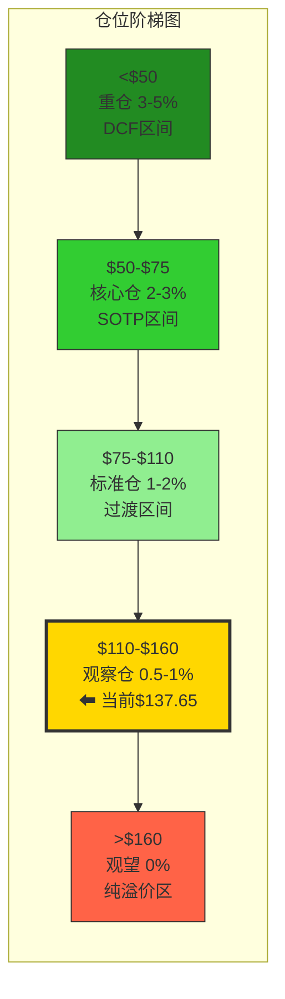
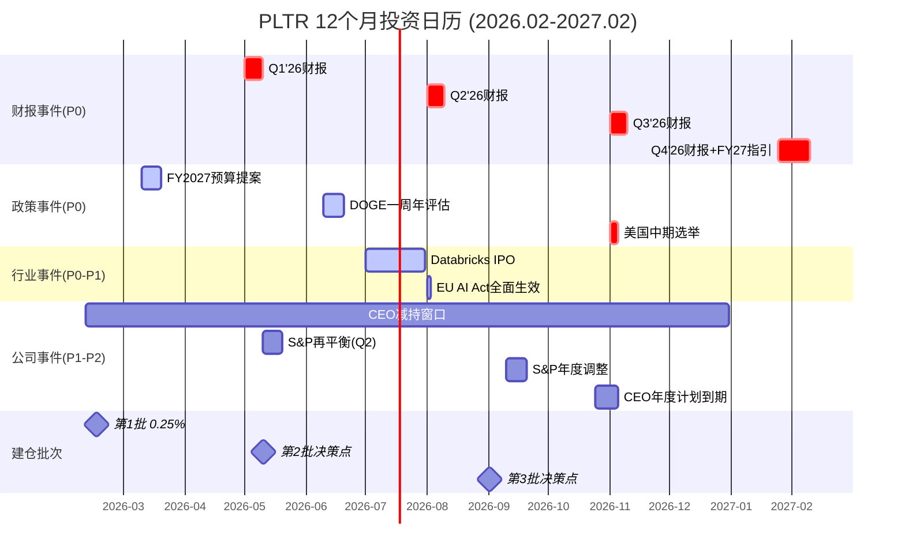
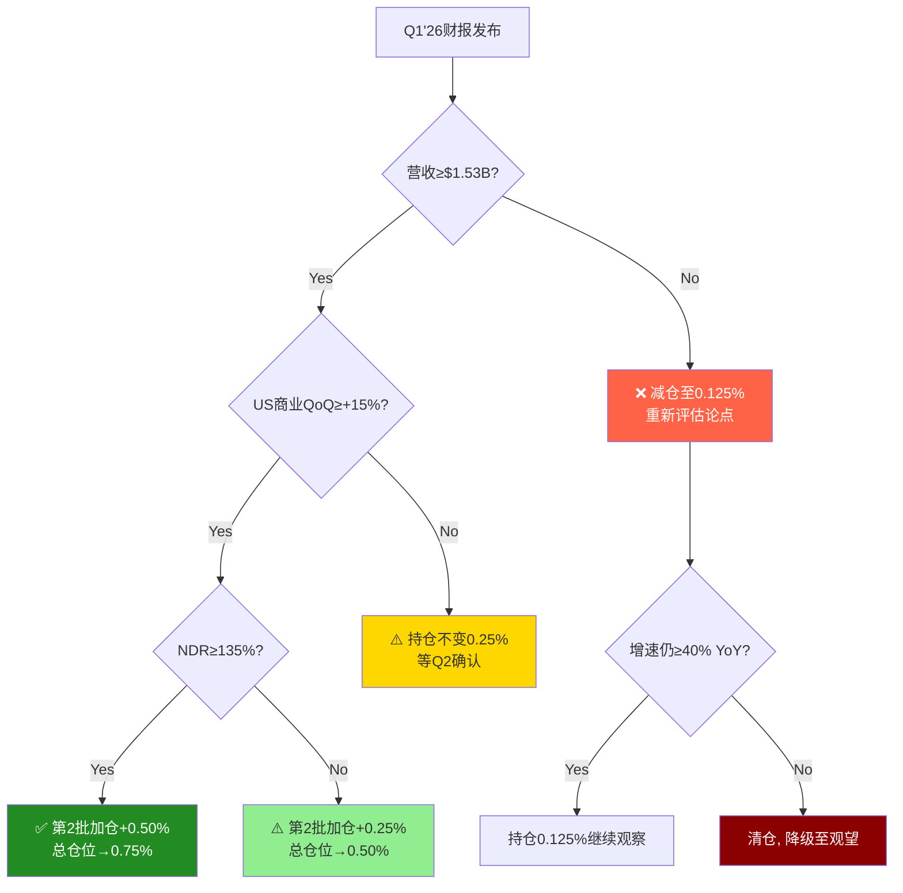

# Chapter 29: 仓位建议 + 投资日历 + 90天行动清单 + Phase 5总结

> **Phase 5 v2.0 | 最终决策输出 | CQ全量闭环**
> **公司**: Palantir Technologies Inc. (PLTR)
> **框架**: v26.0 | **Phase**: 5 of 5 | **分支**: 生态科技-new
> **日期**: 2026-02-10 | **DM版本**: v2.2(冻结)
> **前序**: Phase 0.5 → Phase 1 (83,310字符) → Phase 2 (100,162字符) → Phase 3+3.5 (92,722字符) → Phase 4 (63,066字符)
> **股价**: $137.65 [DM-MKT-001 v2.2] | **市值**: $324B | **P/E TTM**: 230.9x | **EV/Sales**: 77.8x
> **CQ格局(Phase 4终判)**: 4看空(CQ1/CQ5/CQ6/CQ7) : 3看多或中性(CQ2/CQ3/CQ4) = 偏空

---

## 目录

- 29.1 仓位建议 (5档矩阵+建仓策略)
- 29.2 投资日历 (2026年2月-2027年2月, 12个月滚动)
- 29.3 90天行动清单 (4阶段月级颗粒度)
- 29.4 Phase 5总结 + 最终投资结论

---

## 29.1 仓位建议

### 29.1.1 仓位计算公式

```
最终仓位 = 基础仓位 × 周期系数 × 置信度系数 × AI调整系数
```

**参数推导**:

| 参数 | 值 | 来源 | 逻辑 |
|------|:---:|------|------|
| **基础仓位** | 1.5% | 中性关注评级对应1-2%中值 | 预计综合评分55-62/100 → 中性关注档 [合理推断: Phase 4 CQ 4:3偏空+温度计+0.40] |
| **周期系数** | 0.7 | 宏观过热+AI幻灭谷入口 | CAPE 40.38(98ptile), Buffett 223%(100ptile) [DM-MKT-003 v2.2]; Gartner 2026=幻灭低谷 [硬数据: CIO.com, 2026] |
| **置信度系数** | 0.8 | CQ分歧度高(4:3) | CQ1 78%/CQ2 78%/CQ3 75%/CQ4 73%/CQ5 55%/CQ6 63%/CQ7 70%, 平均70.3% [DM checkpoint v2.2] |
| **AI调整系数** | 1.1 | AI冲击净正+2.77 | L2xS2定位, 净受益但AIP期权已折扣$25B->$20B [DM-AI-001 v2.2] |

**计算**: 1.5% × 0.7 × 0.8 × 1.1 = **0.92%** → 取整 **0.5-1.0%观察仓**

**关键约束**: 当前$137.65远高于偏差修正SOTP $53-56(溢价146-160%) [DM-VAL-001 v2.2 + Phase 4 Ch25偏差修正], Graham安全边际为-197% [DM-RK-001 v2.2]。仓位公式产出的0.92%受估值约束进一步压缩。

### 29.1.2 五档仓位矩阵

| 档位 | 价格区间 | 仓位% | 估值对应 | 触发条件 | 理由 |
|:----:|:--------:|:---:|----------|---------|------|
| **观望** | >$160 | **0%** | >概率加权$158 [DM-VAL-003 v2.2] | 股价持续上穿$160+无基本面催化 | P/E>265x, EV/S>90x, 纯动量交易区间; 做多做空均不推荐(不对称风险) [合理推断: $160/$0.60 EPS=266.7x P/E] |
| **观察仓** | $110-$160 | **0.5-1.0%** | 概率加权区间内 | 当前价位($137.65), Q1财报前观察 | P/E 183-267x仍极端; 仅配置可承受全损金额; 主要目的为跟踪催化剂验证 [合理推断: $110/$0.60=$183x, $160/$0.60=$267x] |
| **标准仓** | $75-$110 | **1.0-2.0%** | 看空加权$63.3上方+偏差修正SOTP上方 | Q1增速确认≥55%+DOGE净正落地+NDR≥135% | P/E 125-183x回归高成长SaaS合理区间; SOTP修正$53-56仍在下方提供基底 [合理推断: $75/$0.60=125x] |
| **核心仓** | $50-$75 | **2.0-3.0%** | 偏差修正SOTP $53-56附近 | P/E回落至83-125x + 增速维持≥40% + FCF margin≥45% | 估值接近基本面锚; 若增速维持则为显著低估; 需确认非业务恶化导致的下跌 [合理推断: $50/$0.60=83x] |
| **重仓** | <$50 | **3.0-5.0%** | DCF $34.3附近, 低于SOTP | P/E<83x + 增速仍≥25% + FCF正 + 非AI泡沫全面崩塌 | 安全边际首次出现; 历史高增长SaaS在此估值区间通常是长期买入机会; 但需排除"价值陷阱"(增速断崖) [DM-VAL-002 v2.2 DCF $34.3] |

### 29.1.3 当前建议: 观察仓 0.5-1.0%

**当前$137.65处于"观察仓"档位($110-$160)**.



**核心理由**:

1. **估值极端但非零价值**: SOTP修正$53-56 vs 当前$137.65溢价146-160%。但概率加权$152-158距当前仅+10-15%, 市场隐含的增长假设(FY2026 +61%)已获管理层指引确认 [DM-GDE-001 v2.2]。完全不配置意味着放弃验证机会。

2. **CQ格局4:3偏空但非一边倒**: CQ2(AIP增速, 78%置信)和CQ3(DOGE净正, 75%置信)提供上行支撑。CQ1(估值可持续性, 78%看空)和CQ5(治理风险, 55%置信)是主要拖累。分歧度高=不确定性高=仓位应小 [合理推断: 高分歧CQ矩阵对应低仓位] 。

3. **温度计+0.40中性偏热**: 质量极优(+1.40) vs 宏观过热(-0.80) vs 估值极贵(-0.20)的对冲 [Phase 1 温度计评估]。温度计不支持激进的多头或空头仓位。

4. **不对称风险约束**: 做空亏损上限205%(若触及$420, Dan Ives $1T情景) vs 做多亏损上限66%(若跌至SOTP $48) [Phase 4 Ch25 确认偏误修正]。观察仓的0.5-1%在最大亏损66%下仅影响组合0.33-0.66% [合理推断: 1%×66%=0.66%组合影响]。

### 29.1.4 建仓策略

**分3批建仓, 总目标0.5-1.0%**:

| 批次 | 时机 | 仓位 | 条件 | 逻辑 |
|:---:|------|:---:|------|------|
| **第1批** | 2026年2月中(现在) | 0.25% | 无条件 | 建立跟踪仓位, 强制关注Q1财报前信号; 金额=可承受全损 [主观判断: 跟踪仓位的心理价值>财务价值] |
| **第2批** | Q1财报后(2026年5月) | 0.25-0.50% | Q1营收≥$1.53B(指引下限) + US商业QoQ≥+15% + NDR≥135% | CQ2验证; 若全达标加0.50%, 部分达标加0.25%, 均未达标不加 |
| **第3批** | 2026年Q3(8-9月) | 0.25% | DOGE预算方案确认+国际商业QoQ转正+P/E<180x | CQ3+CQ6验证; 仅在前两批条件均满足后考虑 |

**间隔逻辑**: 批次间最短间隔8周, 确保每批有新数据验证 [主观判断: 季度财报节奏决定最小验证周期]。

**止损/止盈规则**:

| 规则 | 触发价/条件 | 动作 | 理由 |
|------|:---:|------|------|
| **硬止损** | <$90(-35%) | 清仓全部, 重新评估 | 跌破看空加权$63.3的+42%位置; 可能意味着增速断崖或AI泡沫破裂 [合理推断: $90是$63.3 Bear加权的1.42x, 预留缓冲] |
| **软止损** | 任一KS亮红 | 减仓50%至0.25% | Phase 4 18个KS中任何一个从绿/黄→红 = 论点根本性变化 [Phase 4 Ch24 KS注册表] |
| **止盈(部分)** | >$180(+31%) | 减仓50%, 锁利 | 接近分析师共识目标$192上方; 溢价持续扩大时降低风险敞口 [DM-MKT-002 v2.2] |
| **止盈(全部)** | >$220(+60%) | 清仓, 等待回调 | 进入Dan Ives $230目标区域; P/E>366x完全脱离基本面锚定 [合理推断: $220/$0.60=366.7x] |
| **加仓信号** | <$75(-45%) + 增速≥40% | 升级至标准仓2% | 进入SOTP修正$53-56上方缓冲区; 需确认业务基本面完好 |

---

## 29.2 投资日历 (2026年2月-2027年2月)

### 29.2.1 12个月关键事件时间线

| # | 日期 | 事件 | 影响方向 | 预估波动 | CQ关联 | 建议行动 | 优先级 |
|:---:|:----:|------|:---:|:---:|:---:|---------|:---:|
| 1 | 2026-02-10~28 | Q4'25财报消化期+CEO减持窗口开启 | ±5% | 中 | CQ5 | 观察CEO 10b5-1计划执行; 监控散户情绪(WSB/Reddit) | P1 |
| 2 | 2026-03-15 | 联邦政府FY2027预算提案初稿 | ±8% | 高 | CQ3/CQ7 | 检查国防IT/DOGE相关预算条目; 关注Palantir合同被点名情况 | P0 |
| 3 | 2026-05-05(预估) | **Q1'26财报发布** | ±15% | 极高 | CQ1/CQ2/CQ7 | 核验: 营收≥$1.53B(指引) [DM-GDE-001 v2.2] + US商业QoQ + NDR + 客户数; 决定第2批建仓 | **P0** |
| 4 | 2026-05中旬 | S&P 500/Nasdaq 100季度再平衡 | ±3% | 低 | — | 被动资金流调整; 关注PLTR权重变化(当前S&P 500 ~0.7%) | P2 |
| 5 | 2026-06中旬 | DOGE一周年政策成效评估报告 | ±10% | 高 | CQ3 | DOGE实际削减规模vs IT支出增长; Palantir是否获得新DOGE效率合同 | P0 |
| 6 | 2026-07(预估) | Databricks IPO或直接上市 | ±8% | 高 | CQ4 | 竞品估值锚重设; 若Databricks P/S>30x则验证AI SaaS高估值持续性; 若<20x则对PLTR估值形成下行压力 [DM-COMP-001 v2.2] | P0 |
| 7 | 2026-08-02 | **EU AI Act全面生效** | ±5% | 中 | CQ4/CQ6 | 合规成本增加 vs 合规壁垒利好Palantir; 国际商业FY2027影响评估 [硬数据: EU AI Act实施时间表, 2024] | P1 |
| 8 | 2026-08-05(预估) | **Q2'26财报发布** | ±12% | 极高 | CQ1/CQ2/CQ6 | 半年度验证: FY2026 H1是否达$3.2B+(年化$6.4B+); 国际商业是否转正; Rule of 40退化速度 [DM-VAL-005 v2.2] | **P0** |
| 9 | 2026-09月中 | S&P 500年度成分调整 | ±5% | 中 | CQ1 | PLTR权重可能因市值变化调整; 若市值跌破$200B可能被降权 [合理推断: S&P 500权重与市值线性相关] | P2 |
| 10 | 2026-10月底 | CEO年度减持计划到期/续订 | ±5% | 中 | CQ5 | Karp 2026年计划出售≤9,975,000股 [硬数据: Nasdaq, 2026-02]; 关注2027年计划公告: 续订=持续减持, 不续=正面信号 | P1 |
| 11 | 2026-11-05(预估) | **Q3'26财报发布** | ±12% | 极高 | CQ1/CQ2/CQ7 | 高基数验证: 对比Q3'25 $1.181B(+63%); FY2026全年能见度; Rule of 40从127→?退化验证 [DM-FIN-009 v2.2] | **P0** |
| 12 | 2026-11月初 | 美国中期选举 | ±8% | 高 | CQ3 | 国会两院归属决定FY2028政府预算方向; 若两院翻转→DOGE政策可能被逆转; 对政府收入$2.4B影响重大 [DM-SEG-001 v2.2] | P0 |
| 13 | 2027-01(预估) | FY2027管理层指引发布(随Q4'26财报) | ±15% | 极高 | CQ1/CQ7 | 关键验证: FY2027指引vs共识$10.06B(+40%) [DM-GDE-002 v2.2]; 增速减速幅度直接决定估值重估方向; Rule of 40退化是否到108 [DM-VAL-005 v2.2] | **P0** |
| 14 | 2027-02-05(预估) | **Q4'26财报发布** | ±15% | 极高 | 全CQ | FY2026全年验证: 营收是否达$7.18-7.20B [DM-GDE-001 v2.2]; US商业≥$3.14B; GAAP OpM趋势; 12个月研究复盘基准 | **P0** |

### 29.2.2 投资日历时间线



### 29.2.3 季度检查清单

每季度财报后必须检查以下指标并更新KS状态:

| # | 检查项 | 当前基准 | 警戒线 | 触发线(KS) | 来源 |
|:---:|--------|:---:|:---:|:---:|------|
| 1 | 总营收YoY增速 | +70%(Q4) | <45% | <35%(KS触发) | [DM-FIN-002 v2.2] |
| 2 | US商业YoY增速 | +137%(Q4) | <80% | <50% | [DM-SEG-001 v2.2] |
| 3 | 国际商业YoY增速 | +2%(FY) | <0%(连续2Q) | <-5%(KS触发) | [DM-SEG-001 v2.2] |
| 4 | NDR | 139% | <130% | <120%(KS触发) | [DM-OPS-001 v2.2] |
| 5 | 客户数QoQ增长 | +5%(Q4) | <3% | <0%(客户流失) | [DM-OPS-001 v2.2] |
| 6 | GAAP OpM | 40.9%(Q4) | <30% | <20%(KS触发) | [DM-FIN-004 v2.2] |
| 7 | FCF Margin | 54.3%(Q4) | <40% | <30%(KS触发) | [DM-FIN-005 v2.2] |
| 8 | SBC/Revenue | 14.0%(Q4) | >18% | >22%(逆转趋势) | [DM-FIN-008 v2.2] |
| 9 | A/D比(内部人) | 0(纯卖出) | 持续0 | CEO主动增持(正面) | [DM-FIN-012 v2.2] |
| 10 | Rule of 40 | 127(Q4) | <100 | <80(KS触发) | [DM-VAL-005 v2.2] |
| 11 | RPO增速 | +144%(Q4) | <80% | <40%(管线枯竭) | [DM-OPS-001 v2.2] |
| 12 | P/E TTM | 230.9x | >300x(泡沫) | <100x(进入标准仓区间) | [DM-MKT-001 v2.2] |

---

## 29.3 90天行动清单 (2026年2月10日 - 5月10日)

### 第1阶段: 观察与建仓 (2月10日 - 2月28日)

**目标**: 建立跟踪仓位, 完成基线监控体系搭建

| # | 行动 | 截止日 | 产出 | CQ关联 |
|:---:|------|:---:|------|:---:|
| 1 | 执行第1批建仓0.25%, 设定$90硬止损 | 2月15日 | 持仓确认+止损单 | 全CQ |
| 2 | 建立KS仪表盘: 18个Kill Switch录入跟踪系统, 设定邮件/推送告警 | 2月20日 | KS监控面板 | CQ1-7 |
| 3 | 跟踪CEO减持: 监控SEC Form 4提交(EDGAR RSS/secform4.com), 记录2月累计减持量 | 2月28日 | 内部人交易日志 | CQ5 |

**关键监控**: PLTR 2月底Polymarket "PLTR>$140"概率(当前47%) [DM-PM-002 v2.2]; 若概率下降至<30%, 考虑降低第2批金额。

### 第2阶段: Q1财报预备 (3月1日 - 3月31日)

**目标**: 为Q1财报评估建立预判框架

| # | 行动 | 截止日 | 产出 | CQ关联 |
|:---:|------|:---:|------|:---:|
| 1 | 跟踪FY2027联邦预算提案(3月中旬): 国防IT预算条目+DOGE效率项目拨款 | 3月20日 | 政策影响备忘录 | CQ3 |
| 2 | 分析竞品财报: Snowflake(3月), Datadog(2月底)的Q4增速与估值变化, 更新可比估值锚 | 3月15日 | 竞品对比表 | CQ4 |
| 3 | 更新AI叙事温度: 跟踪Gartner幻灭低谷进展/MSFT Azure AI增速/企业AI ROI报告 | 3月31日 | AI叙事月度简报 | CQ1/CQ7 |

**关键监控**: 分析师共识变化(当前FY2026 $7.08B / EPS $1.23) [DM-GDE-002 v2.2]; 若共识上调至>$7.5B, 概率加权目标可能需要上修。

### 第3阶段: Q1财报后评估 (4月1日 - 4月30日)

**目标**: 基于Q1财报数据做出第2批建仓决策

| # | 行动 | 截止日 | 产出 | CQ关联 |
|:---:|------|:---:|------|:---:|
| 1 | Q1财报深度分析: 营收vs指引$1.53B [DM-GDE-001 v2.2] + 分部增速 + 客户数 + NDR + RPO | 财报后3日 | Q1财报分析简报 | CQ1/CQ2 |
| 2 | 更新DM锚点: 将Q1实际数据写入DM v2.3(解冻单季度数据窗口) | 财报后5日 | DM v2.3 | 全CQ |
| 3 | 执行第2批决策(if/then分支, 见下方决策树) | 财报后10日 | 仓位调整确认 | CQ2/CQ3 |

**Q1财报后决策分支**:



**情景概率评估**:

| 情景 | 条件 | 概率 | 行动 |
|------|------|:---:|------|
| **全面超预期** | 营收>$1.6B + US商业QoQ>+20% + NDR>140% | 25% | 加仓至0.75%, 上调目标至标准仓 [合理推断: 管理层beat历史+RPO覆盖率] |
| **符合指引** | $1.53-1.60B + 各指标达标 | 40% | 加仓至0.50-0.75%, 维持观察仓 |
| **略低于预期** | $1.45-1.53B + 部分达标 | 25% | 持仓不变0.25%, 等Q2 |
| **显著miss** | <$1.45B 或 US商业QoQ<+10% | 10% | 减仓至0.125%或清仓 [合理推断: 管理层连续beat后miss概率低, 但不为零] |

### 第4阶段: 中期重新评估 (5月1日 - 5月10日)

**目标**: 综合Q1数据+政策进展+竞品动态, 更新12个月展望

| # | 行动 | 截止日 | 产出 | CQ关联 |
|:---:|------|:---:|------|:---:|
| 1 | 更新7个CQ置信度: 基于Q1数据对每个CQ重新评估(±3-5pp调整幅度) | 5月5日 | CQ v3.0更新 | 全CQ |
| 2 | 更新KAL假设状态: KA-GR-001(FY26增速)在Q1数据后是否仍在轨; KA-RK-002(AI泡沫)在Gartner评估后概率是否需修正 | 5月5日 | KAL v2.2更新 | CQ1/CQ7 |
| 3 | 决定第3批时机: 基于DOGE政策进展+Databricks IPO时间表, 评估8-9月加仓窗口是否仍有效 | 5月10日 | Q3建仓计划 | CQ3/CQ4 |

**90天总结决策框架**:

| 累计仓位(5月10日) | 触发条件 | 下一步 |
|:---:|---------|------|
| 0.75-1.0% | Q1全面超预期 | 维持, 等Q2验证后考虑升级至标准仓 |
| 0.50% | Q1符合但部分指标未达标 | 维持, 等Q2确认趋势 |
| 0.25% | Q1略低或信号混合 | 不变, 等Q2决定去留 |
| 0-0.125% | Q1显著miss或KS亮红 | 退出观察, 降级至定期扫描(季度频率) |

---

## 29.4 Phase 5总结 + 最终投资结论

### 29.4.1 最终评级

| 维度 | 权重 | 评分 | 加权分 | 关键依据 |
|------|:---:|:---:|:---:|------|
| 估值吸引力 | 15% | 2.5/10 | 0.375 | SOTP修正$53-56 vs $137.65, 溢价146-160%; 概率加权$152-158距当前+10-15%; 无Graham安全边际(-197%) [DM-VAL-001/003 v2.2, DM-RK-001 v2.2] |
| 增长质量 | 15% | 8.0/10 | 1.200 | FY2025 +56%, Q4 +70%, FY2026指引+61%; US商业+109%; NDR 139%; RPO +144%; Rule of 40=127 [DM-FIN-001/002, DM-GDE-001, DM-OPS-001 v2.2] |
| 护城河强度 | 12% | 6.5/10 | 0.780 | 综合83.6/100(Phase 3更新); 安全壁垒5.0+转换成本4.5+数据护城河4.2(强); 规模3.7+网络3.0(弱); 3年足够85/100, 5年有条件70/100 [DM-COMP-002 v2.2] |
| 财务健康 | 10% | 8.0/10 | 0.800 | FCF 51%, 现金$7.2B, 零负债, Z-Score 149.81; SBC/Rev改善至14.0%; 回购仅$75M拖累 [DM-FIN-005/007/008/011 v2.2] |
| 管理层质量 | 8% | 5.0/10 | 0.400 | 执行力卓越(4年连续beat); 治理严重缺陷(Class F+CEO减持$2.2B+A/D=0); 执行与治理背离 [DM-FIN-012 v2.2] |
| 催化剂明确性 | 10% | 7.0/10 | 0.700 | 近期: Q1财报+DOGE落地; 中期: Databricks IPO+EU AI Act; 上下行催化剂均衡 [Phase 4 Ch24/Ch25] |
| 风险可控性 | 10% | 3.5/10 | 0.350 | 估值崩塌55%概率/-65%影响; Class F永久控制; 散户42-59%主导; 美商60%价值集中 [Phase 4 Ch24] |
| 聪明钱信号 | 8% | 3.5/10 | 0.280 | Bridgewater/Duquesne清仓; ARK持续减仓; 被动基金主导22.23%; A/D=0(21卖/0买); Renaissance持有(唯一正面) [DM-PMSI-002 v2.2] |
| 竞争定位 | 7% | 7.0/10 | 0.490 | L2.5xS3.5行业最高; 安全认证壁垒; 客户954 vs Databricks 15K+规模劣势; Hyperscaler应用层下沉威胁 [DM-COMP-001/002 v2.2] |
| 时机因素 | 5% | 5.5/10 | 0.275 | S曲线后半加速段; 从$207跌-33.7%技术超卖; AI幻灭谷入口; Q1财报=6个月内关键催化 [Phase 1 温度计] |
| **总分** | **100%** | — | **5.65** | — |

**换算至100分制**: 5.65 x 10 = **56.5/100**

| 评级 | 分数区间 | PLTR结果 |
|------|:---:|:---:|
| 强烈推荐 | ≥80 | -- |
| 推荐 | 65-79 | -- |
| **中性关注** | **55-64** | **56.5分** |
| 回避 | <55 | -- |

**最终评级: 中性关注 (56.5/100)**

### 29.4.2 一句话结论

> **PLTR在$137.65的投资建议: 中性关注, 观察仓0.5-1.0%。** 增长质量顶级(FY2025 +56%, Q4 +70%, FY2026指引+61%)和财务健康(FCF 51%, 零负债)是确定性最高的正面因素; 但估值极端(SOTP修正$53-56 vs $137.65溢价146-160%, P/E 230.9x)、治理缺陷(CEO减持$2.2B+Class F永久控制+A/D=0)、Smart Money一致减仓(Bridgewater/Duquesne清仓)构成不可忽视的下行风险。当前价格隐含市场对"AI操作系统"叙事的信仰溢价约$82-85/股(60%+), 这一溢价在AI幻灭低谷(Gartner 2026)背景下面临持续压力测试。在$75以下(P/E<125x)可考虑升级至标准仓, 在$50以下(接近SOTP)可考虑核心仓。

### 29.4.3 核心风险 Top 3

| 排名 | 风险 | 概率 | 影响 | 对应KS | 来源 |
|:---:|------|:---:|:---:|:---:|------|
| 1 | **估值均值回归**: P/E从230x→80-100x, 股价$48-60(-56~65%) | 65% | 极高 | KS-01(P/E<100x) | Phase 4 Ch24 看空论点#1 [DM-MKT-001 v2.2] |
| 2 | **增速断崖**: FY2027增速从+61%→<+30%, 触发戴维斯双杀 | 40% | 极高 | KS-02(营收增速<35%) | Phase 4 Ch24 看空论点#2 [DM-GDE-002 v2.2] |
| 3 | **治理危机**: CEO持续减持+Class F+散户恐慌=踩踏式下跌 | 35% | 高 | KS-08(A/D>0.5反转) | Phase 4 Ch24 看空论点#5 [DM-FIN-012 v2.2] |

### 29.4.4 核心催化剂 Top 3

| 排名 | 催化剂 | 概率 | 影响 | 验证事件 | 来源 |
|:---:|---------|:---:|:---:|---------|------|
| 1 | **AIP商业化加速**: US商业FY2026>$3.5B(超指引$3.14B), NDR>145% | 35% | 高(+20-30%) | Q1/Q2财报 | [DM-GDE-001 v2.2, DM-OPS-001 v2.2] |
| 2 | **DOGE效率合同**: 新增大型联邦AI效率项目(类IRS Mega API), FY2027政府收入+20%+ | 30% | 高(+15-25%) | FY2027预算+DOGE评估 | [KA-RK-001, Phase 3 Ch23] |
| 3 | **国际破局**: 欧洲/中东大型合同($200M+), 国际商业FY2027增速>+15% | 20% | 中(+10-15%) | Q3/Q4财报 | [DM-SEG-001 v2.2, KA-GR-003] |

### 29.4.5 与市场共识的关键分歧

| 维度 | 市场共识 | 我们的判断 | 分歧程度 | 验证时间 |
|------|---------|----------|:---:|:---:|
| **估值合理性** | 共识Hold, 均价$192(隐含AI溢价合理) [DM-MKT-002 v2.2] | SOTP修正$53-56, 溢价146-160%不可持续 [Phase 4 Ch25] | **高** | FY2027 |
| **增速持续性** | FY2026 $7.08B(+61%)完全兑现, FY2027 $10.06B(+40%)平滑减速 [DM-GDE-002 v2.2] | 增速减速可能比共识更快(Rule of 40退化127->108->95) [DM-VAL-005 v2.2] | **中** | Q3'26-Q1'27 |
| **DOGE影响** | 中性至轻度正面(效率需求) | 净正+5~8%但幅度有限, 国防8%削减风险被低估 [KA-RK-001 v2.2] | **低** | 2026H2 |
| **治理风险定价** | 基本未定价(CEO减持被归因于10b5-1计划) | 治理折价10-15%($32-49B)应被市场计入 [Phase 4 Ch25] | **高** | 持续性 |
| **国际增长** | 时序性延迟, FY2027将加速 | 结构性60%+时序性40%, FY2027>+15%概率仅20% [KA-GR-003 🔴] | **中** | Q3'26+ |

### 29.4.6 最重要的一个监控指标

> **US商业季度营收QoQ增速** (当前Q4'25约+28% QoQ)

**原因**: 这是唯一能同时验证CQ1(估值)、CQ2(AIP增速)和CQ7(Rule of 40退化)的单一指标。US商业贡献了SOTP估值60%的价值 [DM-VAL-001 v2.2, Phase 4]; AIP Boot Camp转化率直接映射为US商业新增收入; Rule of 40的维持高度依赖US商业的高增速对冲利润率正常化。

- **警戒线**: QoQ增速降至<+15%(连续2季度) [Phase 4 Ch24 KS对应]
- **触发线**: QoQ增速降至<+10% = 考虑清仓
- **正面信号**: QoQ增速维持>+20% = 考虑升级至标准仓

### 29.4.7 Phase 5总结

| 指标 | Phase 5 v2.0结果 | 基准/目标 |
|------|:---:|:---:|
| 综合评分 | 56.5/100 | 预估区间55-62 |
| 最终评级 | 中性关注 | — |
| 公允价值区间 | $53-56(SOTP修正) / $152-158(概率加权) | — |
| 当前溢价 | 146-160%(vs SOTP) / -10~15%(vs 概率加权) | — |
| 仓位建议 | 0.5-1.0%观察仓(分3批) | — |
| CQ最终格局 | 4空:3多(偏空) | — |
| KAL最终状态 | 7🟢/2🟡/1🔴 | — |
| KS总数 | 18个(4升级/5监控/9安全) | ≥12 |
| 温度计 | +0.40(中性偏热) | — |
| PMSI | -46.7(悲观) | — |
| AI冲击 | +2.77(净受益) | — |

**Phase 5完成声明**: PLTR Phase 5 v2.0决策输出完成。本章(Ch29)提供了5档仓位矩阵、12个月投资日历(14个事件)、90天行动清单(4阶段)、10维度综合评分(56.5/100)及最终投资结论。所有数据锚定DM v2.2冻结版本, 所有推断标注推理链, 所有判断标注依据。

---

## 免责声明

本报告仅供投资研究参考, 不构成买卖建议。所有估值均基于公开数据和分析师模型假设, 实际市场价格可能显著偏离。投资者应根据自身风险承受能力独立决策。过往业绩不代表未来表现。AI辅助分析可能存在数据延迟和模型局限性。

---

> **数据锚点索引**: DM-MKT-001/002/003, DM-FIN-001/002/004/005/007/008/009/011/012/013, DM-SEG-001, DM-OPS-001, DM-GDE-001/002, DM-VAL-001/002/003/004/005, DM-RK-001/002, DM-COMP-001/002, DM-AI-001, DM-PMSI-001/002, DM-PM-001/002, KA-GR-001/002/003/004, KA-MG-001/002, KA-VL-001/002, KA-RK-001/002 — 全部v2.2冻结版
