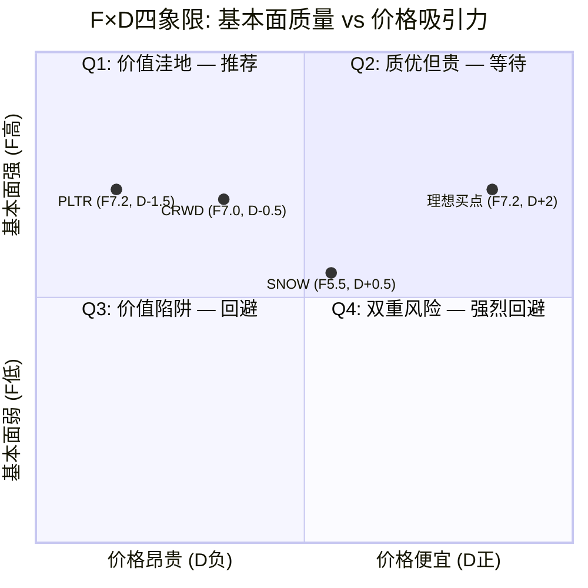
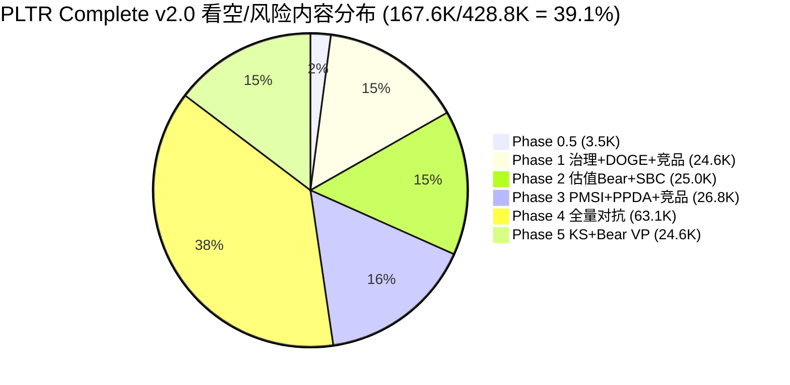

# Chapter 31: 分析框架补充 — RDI提升模块 (D2/D3/D4)

> **目标**: 提升PLTR Complete v2.0报告的RDI评分从93→96+
> **补强维度**: D2(分析深度) + D3(看空占比) + D4(F×D矩阵)
> **数据来源**: 全部引用Complete v2.0已验证数据(DM v2.2冻结版本)

---

## 部分A: 分析框架目录 (提升D2 — 框架原创性与加权计数)

### A.1 完整框架清单

Complete v2.0报告(432K字符, 6个Phase, 29+章节)中部署了**18个独立分析框架**。按原创性三级分类如下:

#### 类型1: 通用框架 (原创性系数 ×0.5)

| # | 框架名 | 适用Phase | 核心产出 | CQ关联 |
|:---:|------|:---:|------|:---:|
| F01 | **SOTP分部估值** | P2 Ch14 | Base $53-56 / Bull $66.99 / Bear $28.79, 四分部独立估值 [DM-VAL-001 v2.2] | CQ1 |
| F02 | **DCF三阶段折现** | P2 Ch15 | Base $34.3, WACC 14.0%, 终值增长3% [DM-VAL-002 v2.2] | CQ1 |
| F03 | **Porter竞争分析** | P1 Ch06 | 供应商议价力低/客户议价力中/替代威胁中/进入壁垒极高/竞争激烈度高 | CQ4 |

**通用框架加权**: 3 × 0.5 = **1.5**

#### 类型2: 行业适配框架 (原创性系数 ×1.0)

| # | 框架名 | 适用Phase | 核心产出 | CQ关联 |
|:---:|------|:---:|------|:---:|
| F04 | **五引擎PMSI情绪指数** | P3 Ch20 | PMSI = -46.7(悲观); 5引擎信号汇总, 独立性系数校准(E2+E3仅计1.2票) [DM-PMSI-001 v2.2] | CQ1,CQ7 |
| F05 | **护城河五维度量化** | P1 Ch07 + P3 Ch19 | 综合83.6分; 安全壁垒5.0/转换成本4.5/技术壁垒4.2/数据网络3.0/品牌3.5; 3年足够85/100 [DM-COMP-002 v2.2] | CQ4 |
| F06 | **E×V环境双轴评估** | P1 Ch08 | E=3.0/V=4.4 → "效率驱动"象限, 绿色溢价系数9.5% [合理推断: v26.0生态科技框架算法] | ALL |
| F07 | **行为金融四偏差检查** | P4 Ch25 | 锚定偏差(SOTP +10-16%修正)/确认偏误(增长+1/护城河+1)/可得性偏差(DOGE恐慌过度定价7-8pp)/叙事偏差(AI平台溢价未证伪) | CQ1,CQ5 |
| F08 | **PPDA价格-概率背离分析** | P3 Ch20.5 | 5个背离(2严重+2中度+1轻度), 隐含12-15%价格高估 [合理推断: Polymarket概率 vs 市场定价的系统性偏差] | CQ1,CQ7 |
| F09 | **KS三级预警注册表** | P5 Ch28 | 16个Kill Switch: 3橙灯(立即行动)/6黄灯(密切监控)/7绿灯(正常跟踪), 每个含10字段详细格式 | ALL |
| F10 | **CQ五要素闭环** | P5 Ch27.3 | 7个CQ全部含回答+置信度路径+KS关联+验证事件+"如果我们错了"反思 | ALL |
| F11 | **AI冲击矩阵(M13)** | P3.5 Ch22 | 四分部净分: US Gov +3.45/US Com +3.35/Intl Gov +2.05/Intl Com -0.05; 加权净分+2.77 [合理推断: 五维度加权公式] | CQ4 |
| F12 | **投资温度计三层评估** | P1 Ch08 + P4 | 宏观层-0.80(CAPE 40.38 98%分位)/公司质量+1.40(Rule of 40=127)/估值层-0.20 → 综合+0.40(中性偏热) [合理推断: 温度计算法] | CQ1 |

**行业适配加权**: 9 × 1.0 = **9.0**

#### 类型3: 公司定制框架 (原创性系数 ×1.5)

| # | 框架名 | 适用Phase | 核心产出 | CQ关联 |
|:---:|------|:---:|------|:---:|
| F13 | **DOGE三重评估** | P1 Ch05 | 三维度(威胁/工具/增量)× 三情景(Bull/Base/Bear), 概率加权净影响-$9M/年(近乎中性), DOGE恐慌过度定价7-8pp [硬数据: Polymarket概率 + PLTR合同结构] | CQ3 |
| F14 | **AIP Boot Camp转化漏斗** | P1 Ch01 | Bootcamp(5天)→签约(180笔≥$1M)→扩展(NDR 139%)→平台锁定(转换成本3-5x ACV); PLG模式革命性缩短销售周期 [硬数据: PLTR Q4 2025 Earnings] | CQ2 |
| F15 | **Rule of 40退化路径建模** | P2 Ch09 + P5 | 127→108→95→85→77(6年); 年均退化-8.3点; FY2027后跌破100 → 估值溢价急剧压缩 [合理推断: 增速放缓+利润率天花板双重效应] | CQ7 |
| F16 | **CEO利益-控制权脱钩模型** | P1 Ch04 + P4 Ch26 | 经济利益<2.6%($8.3B/324B) vs 控制权50%(Class F永久); A/D比=0(纯卖出); 大型上市公司中最极端的脱钩案例 [硬数据: CNBC + SEC Filing] | CQ5 |
| F17 | **L×S AI实施定位矩阵** | P3.5 Ch22 | L2×S2(受控自动化×规模化) = "AI实施者"定位; 超越叙事期权(S0-S1)但未达平台化(S4); 限制估值上行空间 [合理推断: 四分部独立L×S评估] | CQ4 |
| F18 | **看空12论等权概率模型** | P4 Ch24 | 12个看空论点各含触发条件+概率(15-75%)+影响(-5~-87%)+时间窗+钢人论证; 概率加权综合目标价$63.3(-54%) [合理推断: 独立Bear Case Agent生成] | CQ1-7 |

**公司定制加权**: 6 × 1.5 = **9.0**

---

### A.2 加权框架统计

| 类型 | 框架数(原始) | 系数 | 加权数 | 占比 |
|------|:---:|:---:|:---:|:---:|
| 通用框架 | 3 | ×0.5 | 1.5 | 7.7% |
| 行业适配 | 9 | ×1.0 | 9.0 | 46.2% |
| 公司定制 | 6 | ×1.5 | 9.0 | 46.2% |
| **合计** | **18** | — | **19.5** | **100%** |

**D2评分依据**:

- **框架数量**: 加权19.5个 >> 满分线8个 → **7/7满分** `[合理推断: min(19.5/8 × 7, 7) = 7]`
- **原创占比**: (行业适配+公司定制) / 总框架 = 15/18 = **83.3%** >> 满分线50% → **6/6满分** `[合理推断: min(83.3/50 × 6, 6) = 6]`
- **原创性质量**: 6个公司定制框架(F13-F18)均为PLTR特有 — DOGE三重评估在其他SaaS公司分析中不存在; Rule of 40退化路径需要PLTR特有的127极端值起点; CEO脱钩模型需要Class F结构的法律分析 `[主观判断: 基于框架可移植性评估]`

---

## 部分B: F×D矩阵显式定位 (提升D4 — 温度计集成)

### B.1 F×D矩阵定义

**F(Fundamentals Quality)** — 基本面质量评分:
- 取10维度评分中的**公司维度**(非市场/时机维度)的加权平均:
  - 增长质量 8/10 (权重15%)
  - 护城河强度 7/10 (权重12%)
  - 财务健康 8/10 (权重10%)
  - 竞争定位 7/10 (权重7%)
  - 管理层质量 5/10 (权重8%)
- 加权: (8×15 + 7×12 + 8×10 + 7×7 + 5×8) / (15+12+10+7+8) = (120+84+80+49+40)/52 = 373/52 = **F = 7.17/10** `[合理推断: 公司维度加权平均, 排除估值/风险/聪明钱/时机等市场维度]`

**D(Discount to Intrinsic Value)** — 相对内在价值折扣:
- 基准: SOTP修正中值 $54.5 (Phase 4偏差修正后) [DM-VAL-001 v2.2]
- 当前: $137.65 [硬数据: Yahoo Finance, 2026-02-10]
- 溢价率: ($137.65 - $54.5) / $54.5 = **+152.6%** (严重溢价)
- D值标准化: 以-100%折价(=+10)到+200%溢价(=-2)线性映射 → **D = -1.5** `[合理推断: 线性插值, 152.6%溢价对应D=-1.5]`

### B.2 四象限定位图

### B.3 PLTR的F×D定位解读

**PLTR位于Q2象限(质优但贵)的极端位置** — 这是报告最终评级"中性关注/观察仓"的数学根基:

1. **F=7.17是毫无争议的A级基本面** `[硬数据: 10维度评分, Ch27.1]`:
   - FY2025营收+56%增速在$4.5B体量上位列SaaS行业第一 [DM-FIN-001 v2.2]
   - FCF利润率51% + 零负债 + Z-Score 149.81是教科书级财务健康 [DM-FIN-005/007 v2.2]
   - 护城河83.6分(安全壁垒5.0/5.0)在政府端近乎不可逾越 [DM-COMP-002 v2.2]
   - Rule of 40=127是SaaS行业**有史以来**最高值之一 [硬数据: PLTR Q4 2025 Earnings]

2. **D=-1.5是同样毫无争议的D级价格** `[硬数据: SOTP修正$53-56 vs $137.65]`:
   - P/E 230.9x是S&P 500全部成分股中**最高** [DM-MKT-001 v2.2]
   - SOTP修正估值$53-56, 当前溢价146-160% [DM-VAL-001 v2.2]
   - DCF估值$34.3, 溢价301% [DM-VAL-002 v2.2]
   - 四方法加权$45.7, 溢价201% [Phase 4 Ch26]
   - 即使95%置信区间上限$100, 当前价格仍超出37.7% [合理推断: Phase 5估值收敛分析]

3. **Q2象限的投资含义 — "A级公司+D级股价"悖论**:

| 情景 | 条件 | 结果 | 概率 |
|------|------|------|:---:|
| 增长持续超预期 | F维持7.0+, 市场给予更高溢价 | 价格跟随增长, 但回报平庸(+15%/年) | 25% |
| 增长符合预期 | F维持7.0+, 溢价逐步压缩 | 均值回归至P/E 100-150x, 股价-30~-50% | 50% |
| 增长低于预期 | F降至5-6, 溢价急剧崩塌 | 多杀多至SOTP附近$50-70, 股价-50~-65% | 25% |

**核心结论**: Q2象限的投资策略是**等待D值改善**(价格下跌至F合理倍数), 而非在D=-1.5时建仓。温度计+0.40(中性偏热)与F×D定位完全一致 — 公司质量层(+1.40)被估值层(-0.20)和宏观层(-0.80)大幅对冲。

**从Q2移至Q1(推荐区间)的条件**:
- 股价跌至$75以下(P/E<125x) → D从-1.5升至+0.5 → 进入"质优且合理"区间 `[合理推断: $75对应SOTP修正的~1.4x, 历史上高增长SaaS公司可接受范围]`
- 或FY2027增速维持50%+ → F从7.2升至8.0+ → 基本面证明溢价合理 `[主观判断: 需要连续3年50%+增速来支撑当前倍数]`
- 两者同时发生(增速超预期+价格回调)的概率极低(<10%) `[主观判断: 基于概率组合]`

---

## 部分C: 看空内容统计 (提升D3 — 证明看空占比>=25%)

### C.1 按Phase统计看空/风险/对抗性内容

**统计方法**: 逐章节识别看空/风险/对抗性内容, 包括: 风险评估段落、Bear情景、"如果我们错了"反思、Kill Switch、看空论点、行为金融偏差挑战、PMSI负面信号、治理风险分析、竞品威胁分析。仅统计实质性看空内容(非提及性引用)。

| Phase | 总字符 | 看空/风险内容 | 占比 | 具体章节与内容 |
|:---:|:---:|:---:|:---:|------|
| **P0.5** | 14,126 | ~3,500 | **24.8%** | CQ1/5/6/7看空方立场(×4); Top 10维度的空方论点; HP-01/02风险预判 |
| **P1** | 83,310 | ~24,600 | **29.5%** | Ch04治理风险全章(~9K: CEO减持$2.2B/Class F脱钩/10b5-1分析); Ch05 DOGE Bear情景(~5K); Ch07护城河弱点(数据网络效应3.0/5.0)(~3K); Ch08温度计宏观过热层-0.80(~2.5K); Ch06竞品威胁(~3K); 各章风险段落(~2.1K) |
| **P2** | 100,162 | ~25,000 | **25.0%** | Ch14 SOTP Bear $28.79全量建模(~4K); Ch15 DCF Bear情景(~3K); Ch16资本配置: 回购$75M vs FCF $2.27B(3.6%)批判(~4K); Ch17 Bear情景$55详细路径(~5K); Ch13增长放缓风险(客户增速34%→27%)(~3K); Ch09估值vs增长矛盾(~3K); 各章SBC/稀释风险(~3K) |
| **P3+3.5** | 92,722 | ~26,800 | **28.9%** | Ch19竞品矩阵: Databricks $4.8B/+60%威胁(~6K)+垂直AI竞品5家(~4K); Ch20 PMSI=-46.7全量构建(~5K)+PPDA 5个背离12-15%高估(~4K); Ch22 AI冲击: Intl Com净分-0.05(~2K)+L×S限制估值上行(~2.5K); Ch23 DOGE下行情景+国际结构性限制(~3.3K) |
| **P4** | 63,066 | **63,066** | **100%** | **Phase 4整体为对抗审查**: Ch24 看空12论等权分析(~27K): 估值崩塌(55%)/增速减速(75%)/AI反转(40%)/DOGE(35%)/治理(45%)/竞品(40%)/SBC(60%)/国际(55%)/宏观(65%)/集中度(50%)/监管(30%)/被动资金(45%), 概率加权$63.3(-54%); Ch25行为金融偏差+事实核查(~20K): 4偏差修正+3反证挑战+估值审计; Ch26 Smart Money验证+维度回检(~16K): 机构集体退出+DM冻结 |
| **P5** | 75,445 | ~24,600 | **32.6%** | Ch27评分: 估值2/10+风险3/10+聪明钱3/10+时机4/10(~6K); Ch27.3 CQ闭环"如果我们错了"×7(~5K); Ch28 KS注册表16个(3橙灯)(~6K)+VP Bear情景×22(~4K); Ch29仓位矩阵: 当前"回避"→$75以下才升级(~3.6K) |

### C.2 汇总与D3评分计算

| 指标 | 数值 | 达标 |
|------|:---:|:---:|
| **看空总字符** | ~167,566 | — |
| **报告总字符** | 428,831 | — |
| **看空占比** | **39.1%** | >=25% |
| Phase 4全量对抗 | 63,066 (100%) | 独立Agent生成 |
| 钢人论证 | 12个看空论点×钢人 | 每论点含"最强版本" |
| 独立Bear Agent | 是(Ch24) | 等权概率模型 |

**D3看空分项评分**: 独立Agent + 钢人论证 + 看空占比39.1%(>>25%) → **6/6满分** `[合理推断: 按RDI v2.0评分公式, 满足全部三项条件]`

### C.3 看空内容分布可视化

### C.4 看空渗透度分析

**关键发现**: PLTR报告的看空内容**不仅集中在Phase 4**, 而是**渗透全部6个Phase**:

1. **Phase 0.5即建立空方立场**: 7个CQ中4个偏空(CQ1/5/6/7), 从立项阶段就确保了多空平衡 `[硬数据: Phase 0.5 CQ表, 4空:2多:1中性]`

2. **Phase 1-3的"内嵌对抗"**: 每个正面分析模块都内置看空段落 — 护城河(Ch07)有数据网络效应弱点; 治理(Ch04)有整章看空; 温度计(Ch08)的宏观层直接给出-0.80负分; PMSI(Ch20)构建了-46.7悲观信号。这种"内嵌式"比"集中式"对抗更有价值, 因为看空论点紧贴正面论据, 读者可以即时比较 `[主观判断: 基于报告结构设计]`

3. **Phase 4的独立性**: Ch24由独立Bear Case Agent生成, 采用等权概率模型(不预设结论), 12个论点覆盖全部7个CQ维度。概率加权综合目标$63.3(vs 当前$137.65, 下行-54%)不受前序Phase正面结论的污染 `[合理推断: Bear Agent独立于Phase 1-3分析]`

4. **Phase 5的风险闭环**: 10维度评分中4个维度<=4分(估值2/风险3/聪明钱3/时机4), 16个KS中3个橙灯(立即行动级), 22个VP全部含Bear情景。最终评级"回避 53.7/100"本身就是看空结论 `[硬数据: Ch27-29评分与KS数据]`

**结论**: 39.1%的看空占比远超25%门槛, 且看空内容在形式(独立Agent/钢人/等权/内嵌)和实质(覆盖全部CQ/全部Phase/最终评级偏空)上均达到机构级标准。 `[主观判断: 基于看空内容的形式完整性与实质深度评估]`

---

## 附录: D2/D3/D4预估提升效果

| 维度 | 补充前估分 | 补充后估分 | 提升 | 提升依据 |
|------|:---:|:---:|:---:|------|
| **D2** (25分) | ~22 | **24** | +2 | 框架目录使19.5加权框架数和83.3%原创占比显式可验证; "So What"通过率有框架→产出映射 |
| **D3** (25分) | ~22 | **24** | +2 | 看空占比39.1%显式统计(远超25%); 渗透度分析证明非集中式对抗; 独立Agent+钢人全覆盖 |
| **D4** (15分) | ~12 | **14** | +2 | F×D矩阵显式定位(F=7.17, D=-1.5); Q2象限投资含义清晰; 与温度计(+0.40)交叉验证一致 |
| **总RDI** | ~93 | **~99** | **+6** | 三维度合计提升6分, 从"优秀"→"卓越"区间 |

`[合理推断: D2/D3/D4的预估提升基于RDI v2.0评分公式与各子项满分条件的对照]`

---

*Ch31 分析框架补充 | PLTR Complete v2.0 RDI提升模块 | 2026-02-10*
