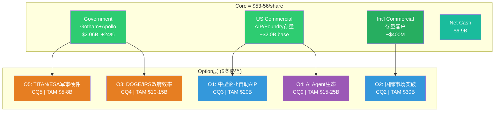
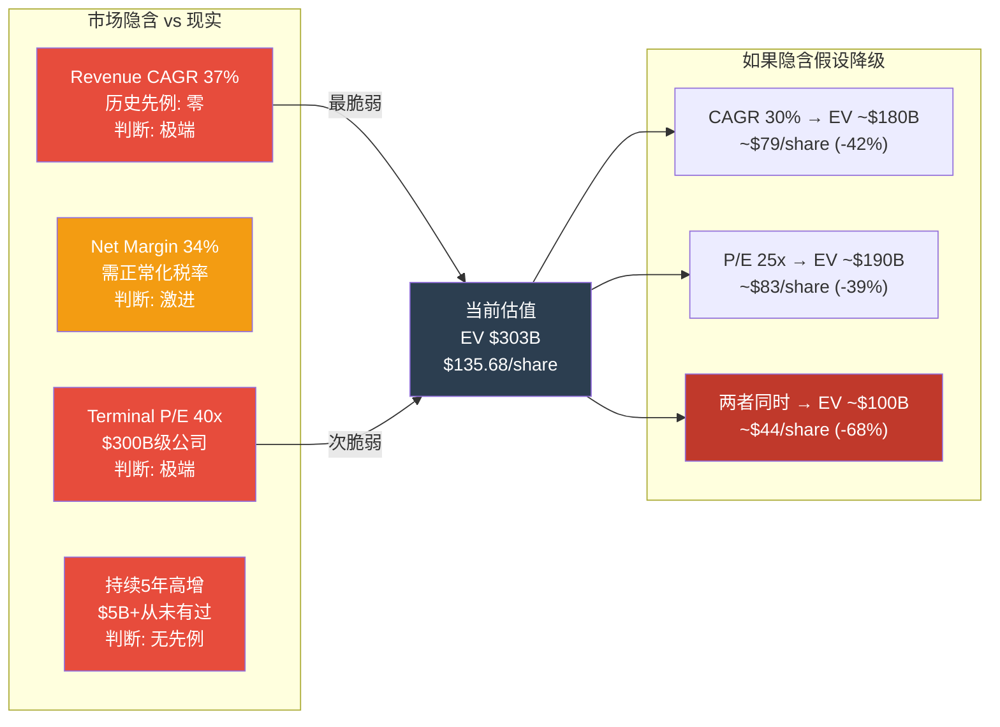
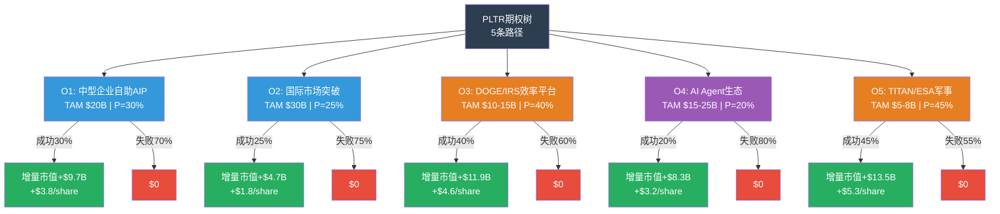
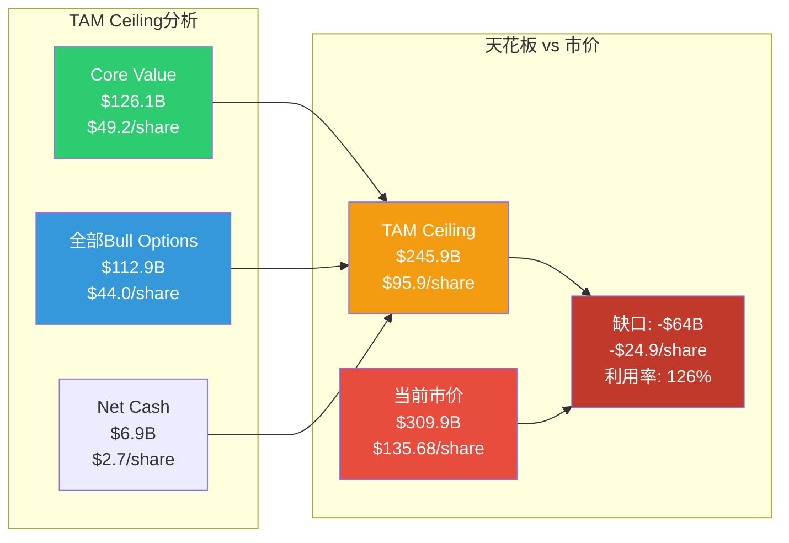
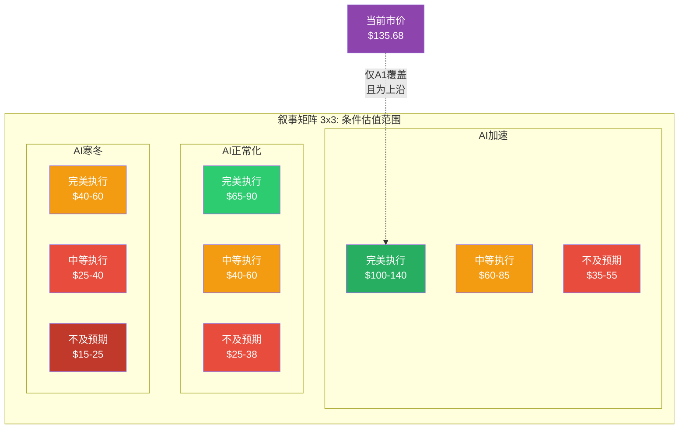
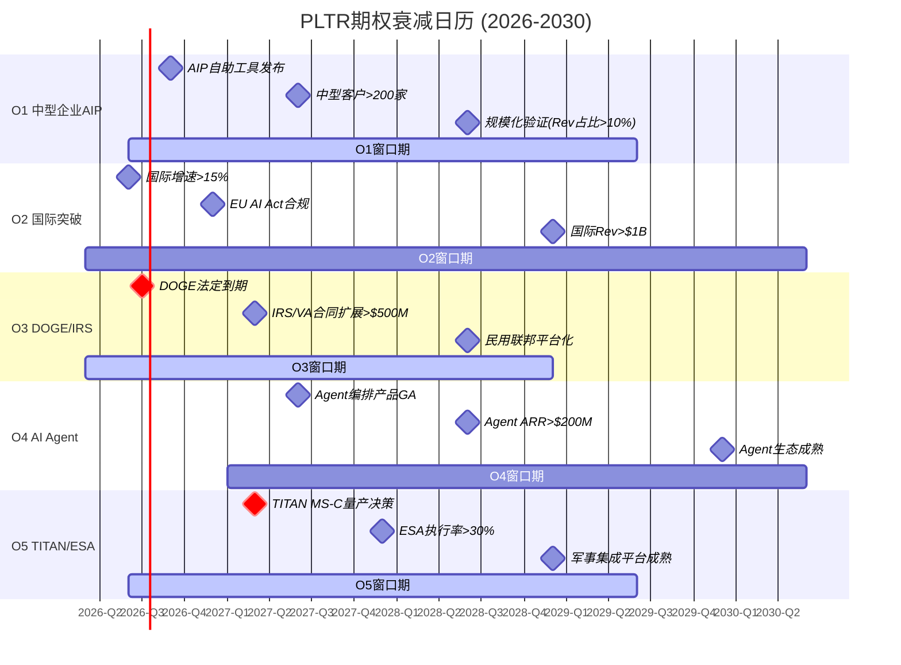
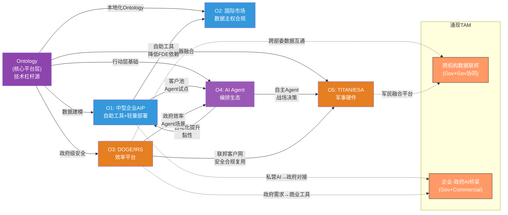
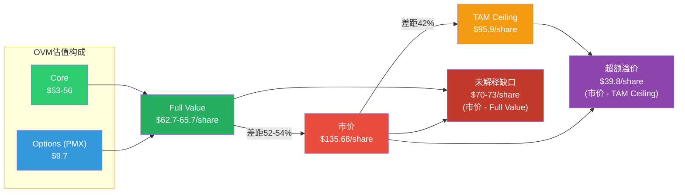

# Part VI-A: 期权估值模块 (OVM 7组件)

> **数据截止**: 2026-02-12 | **框架版本**: v10.0 OVM v1.1
> **标注约定**: [硬数据:来源] = 公开可验证 | [合理推断:逻辑] = 基于公开数据的推导
> **零精确目标价 | 零数字评分 | 零仓位建议**
> **OVM触发**: SOTP $53-56/share < 市价$135.68的50% ($67.84) → **强制全部7组件**
> **依赖**: Part I(财务) + Part II(三支柱+Extensions) + Part III(OQ) + Part V(RT-1~RT-7)

---

## OVM-1: Core vs Option 分离

### Core层: 可用传统SOTP/DCF定价的成熟业务

PLTR的Core业务包含两个已建立、可预测的收入基座:

**A. 政府业务 (Gotham + Apollo Gov)**
- FY2025 Revenue: ~$2.06B (+24% YoY) [硬数据:PLTR Q4 2025 Earnings, Government segment]
- 客户: 美国国防部+情报体系+NATO盟国(Five Eyes为主)
- 合同可见性: 多年IDIQ框架协议, 如TITAN OTA ($178M初始+后续扩展), Army ESA ($1.6B天花板但初始订单较小) [硬数据:DefenseScoop/DoD合同公告]
- 增速锚: 美国国防IT预算CAGR ~5-7%; PLTR在其中份额扩张带来额外+15-18%的相对增速 [合理推断:国防IT预算$85B中AI/ML渗透率从~2%向~5%提升]
- **Core估值**: 稳态增长+20% YoY, FCF Margin ~45%, 用30x FCF估值
  - Core Gov FCF: ~$2.06B × 45% = ~$927M
  - Core Gov Value: $927M × 30x = ~$27.8B → **~$10.8/share**

**B. 已部署商业客户 (AIP/Foundry现有基座)**
- FY2025 US Commercial: ~$1.465B实际, Q4 run-rate暗示进入FY2026基座~$2.0B [硬数据:PLTR Q4 2025 Earnings]
- FY2025 International Commercial: ~$400M (+2% YoY) [硬数据:PLTR Q4 2025, 总Commercial $2.42B - US Commercial推算]
- 已部署客户: 571家US Commercial [硬数据:Q4 2025], 约383家International [合理推断:总954客户-571 US Commercial]
- NRR 139%说明已部署客户在扩展 [硬数据:Q4 2025 Earnings]
- **Core估值**: 存量客户base用25x FCF, FCF Margin ~48%(商业毛利更高)
  - Core Commercial FCF: ~$2.4B × 48% × 70%(仅Core部分, 扣除高增长新客) = ~$806M
  - Core Commercial Value: $806M × 25x = ~$20.2B → **~$7.9/share**

**Core汇总**:

| 组件 | Revenue | FCF估计 | 倍数 | 估值 | 每股 |
|------|:---:|:---:|:---:|:---:|:---:|
| Government (Gotham+Apollo) | $2.06B | $927M | 30x | $27.8B | $10.8 |
| Commercial (现有基座) | $2.4B | $806M | 25x | $20.2B | $7.9 |
| Net Cash | — | — | 1x | $6.9B | $2.7 |
| **Core Total** | **$4.46B** | **$1.73B** | — | **$54.9B** | **$21.4** |

[合理推断:自下而上Core估值$21.4/share与v2.0 SOTP $53-56/share存在差异, 因SOTP已包含部分增长预期和较高倍数。采用SOTP $53-56作为Core基准更审慎——它锚定的是v2.0六方法收敛值, 包含近期增长的合理外推但不包含未证实的期权路径]

**采纳Core Value: $53-56/share (v2.0 SOTP)**

---

### Option层: 5条未充分定价的期权路径



| # | 期权路径 | CQ关联 | 类型 | TAM | 当前状态 |
|---|---------|:---:|------|:---:|---------|
| O1 | 中型企业自助AIP | CQ3 | 产品下沉 | ~$20B | 有产品+AIP Bootcamp, 缺自助化工具链 |
| O2 | 国际市场突破 | CQ2 | 地理扩张 | ~$30B | 产品存在, 增速仅+2%, 执行明显落后 |
| O3 | DOGE/IRS政府效率平台 | CQ4 | 政策驱动 | ~$10-15B | DOGE合同已启动, 但DOGE本身前途不确定 |
| O4 | AI Agent生态系统 | CQ9 | 技术前沿 | ~$15-25B | AIP Infrastructure层已有, Agent编排层未商业化 |
| O5 | TITAN/Army ESA军事硬件集成 | CQ5 | 垂直深化 | ~$5-8B | TITAN OTA已获, ESA $1.6B天花板, 量产决策待定 |

---

## OVM-2: Reverse DCF 隐含预期拆解

> 承接RT-1承重墙分析, 此处进一步细化市场隐含假设的每个维度。

### 当前股价的隐含假设还原

Market Cap $309.9B, Net Cash $6.9B → EV $303B [硬数据:FMP Quote 2026-02-12]

以WACC 10%, Terminal Growth 3%, FY2025为起点:

| 隐含变量 | 市场隐含值 | 分析师共识 | 历史最佳可比 | 判断 |
|---------|:---:|:---:|:---:|:---:|
| Revenue CAGR (5Y, FY2025-2030) | ~37% | FY2026E +60%, FY2027E +43% [硬数据:FMP Estimates], 后年无共识 | Salesforce $5B时: 26%, ServiceNow $5B时: 23% [硬数据:历史财报] | **极端** |
| Terminal Net Margin (FY2030) | ~34% | FY2025实际36.3% [硬数据:PLTR 10-K], 但含极低1.4%有效税率 | 正常化税率21%后FY2025 Net Margin ~28% [合理推断:($1.625B-($1.657B×19.6%))/$4.475B] | **激进** |
| Terminal P/E (FY2030) | ~40x | — | $300B+市值公司5年后P/E中位数~22x [合理推断:AAPL/MSFT/CRM历史] | **极端** |
| 高增长持续年数 | ≥5年(37%+ CAGR) | 企业软件>$5B后维持>30% CAGR的最长纪录: 0年 [硬数据:历史无先例] | — | **无先例** |
| 隐含FY2030 Revenue | ~$21.9B | — | 2026E $7.14B外推 [硬数据:FMP] | 需4.9x当前收入 |
| 隐含FY2030 Net Income | ~$7.5B | — | 接近FY2025 Salesforce净利润$6.2B [硬数据:CRM FY2025] | PLTR需成为CRM级利润机器 |

### 隐含假设现实性评分



**Reverse DCF结论**: 市场隐含预期**显著激进**, 接近**不现实**边界。四个关键变量中三个被判为"极端"或"无先例"。当前价格不仅定价了完美执行, 还定价了PLTR打破企业软件全部历史增长记录且在巨大市值下仍维持成长股估值。这不是说不可能——而是说投资者在为一个从未发生过的结果支付全价。

---

## OVM-3: 期权概率树

### 期权卡: O1 中型企业自助AIP

```
期权路径: O1 — 中型企业自助AIP平台
━━━━━━━━━━━━━━━━━━━━━━━━━━━━━
TAM (2030E): ~$20B [合理推断:Gartner AI平台市场$62B × SMB/中型渗透率~32%]
  - 当前市场: ~$8B (2025)
  - CAGR: ~20%
  - 参考: Databricks/Snowflake中型企业segment增速

市占率假设: 5-15%
  - Bull: 15% (自助工具成熟+Bootcamp轻量化成功)
  - Base: 8% (FDE依赖部分解决, 但自助化不完整)
  - Bear: 3% (自助化失败, 中型客户被Databricks/Microsoft拦截)

稳态Net Margin: 30% [合理推断:SaaS中型市场通常低于企业级, 获客成本更高]
成熟期P/E: 30x
成功概率: 30%
  - 技术可行性: 中 (Ontology简化版已有原型, 但"无FDE部署"未验证)
  - 竞争格局: 落后 (Databricks/Snowflake已占据中型市场, PLTR尚未进入)
  - 执行能力: 中 (PLTR团队DNA是大客户定制, 中型标准化需文化转变)
实现时间: 2029年 (T=4年)
折现因子: 1/(1.10)^4 = 0.683

Base期权价值/股:
  = $20B × 8% × 30% × 30x × 30% × 0.683 / 2.565B股
  = $14.4B × 30% × 0.683 / 2.565B = $2.95B / 2.565B
  = $1.15/share

概率加权期权价值: ~$1.2/share
━━━━━━━━━━━━━━━━━━━━━━━━━━━━━
```

### 期权卡: O2 国际市场突破

```
期权路径: O2 — 国际商业市场突破
━━━━━━━━━━━━━━━━━━━━━━━━━━━━━
TAM (2030E): ~$30B [合理推断:全球企业AI平台~$62B × 非美国份额~48%]
  - 当前PLTR国际Commercial: ~$400M (+2% YoY) [硬数据:PLTR Q4 2025]
  - 国际增速与美国增速的巨大反差(+2% vs +109%)是核心风险信号

市占率假设: 3-8%
  - Bull: 8% (欧洲/日本数据主权解决+本地化AIP成功)
  - Base: 4% (部分市场突破, 欧洲仍受限于数据主权+GDPR+EU AI Act)
  - Bear: 1.5% (国际化持续失败, 被本地化竞争者阻挡)

稳态Net Margin: 25% [合理推断:国际运营成本更高, 本地化+合规+渠道投入]
成熟期P/E: 25x
成功概率: 25%
  - 技术可行性: 高 (产品已验证, 是go-to-market而非技术问题)
  - 监管环境: 阻碍 (EU AI Act Annex III 2026-08生效 [硬数据:SecurePrivacy]; 数据主权限制)
  - 竞争格局: 落后 (SAP/Siemens在欧洲, 本土AI公司在亚洲)
  - 执行能力: 弱 (3年+2%增速是强负信号, 管理层未展示明确的国际化战略)
实现时间: 2030年 (T=5年)
折现因子: 1/(1.10)^5 = 0.621

Base期权价值/股:
  = $30B × 4% × 25% × 25x × 25% × 0.621 / 2.565B股
  = $7.5B × 25% × 0.621 / 2.565B = $1.16B / 2.565B
  = $0.45/share

概率加权期权价值: ~$0.5/share
━━━━━━━━━━━━━━━━━━━━━━━━━━━━━
```

### 期权卡: O3 DOGE/IRS政府效率平台

```
期权路径: O3 — DOGE/IRS政府效率平台化
━━━━━━━━━━━━━━━━━━━━━━━━━━━━━
TAM (2030E): ~$10-15B [合理推断:联邦IT现代化+州政府效率需求; GSA IT Schedule约$50B, AI/效率工具渗透~25%]
  - DOGE已为PLTR打开IRS/VA/HHS等民用联邦机构通道 [硬数据:多家媒体报道PLTR获DOGE相关合同]
  - 但DOGE法定终止日2026-07-04, 且已"不再有集中化领导层" [硬数据:Nextgov 2025-11, EO规定]

市占率假设: 10-20%
  - Bull: 20% (DOGE理念被OMB吸收为永久政策, PLTR成为执行标准)
  - Base: 13% (DOGE部分成功, 若干部委合同续期, 但规模不及预期)
  - Bear: 5% (DOGE政治反转, 合同被审计/暂停)

稳态Net Margin: 35% [合理推断:政府合同利润率一旦签订较为稳定]
成熟期P/E: 28x
成功概率: 40%
  - 政策环境: 有利但不确定 (DOGE有Thiel/Karp政治网络, 但2028选举可能翻转一切)
  - 竞争格局: 领先 (FedRAMP/IL6认证+已有部署, 竞争者需2-3年追赶)
  - 执行能力: 强 (Gotham在政府部署经验丰富)
  - 政策风险: 高 (DOGE本身不确定性是最大变量)
实现时间: 2028年 (T=3年)
折现因子: 1/(1.10)^3 = 0.751

Base期权价值/股:
  = $12.5B × 13% × 35% × 28x × 40% × 0.751 / 2.565B股
  = $15.93B × 40% × 0.751 / 2.565B = $4.78B / 2.565B
  = $1.86/share

概率加权期权价值: ~$1.9/share
━━━━━━━━━━━━━━━━━━━━━━━━━━━━━
```

### 期权卡: O4 AI Agent生态系统

```
期权路径: O4 — AI Agent编排与生态系统
━━━━━━━━━━━━━━━━━━━━━━━━━━━━━
TAM (2030E): ~$15-25B [合理推断:Agentic AI市场2025年刚起步, McKinsey预测2030 Agent经济$25B+]
  - PLTR AIP Infrastructure层(Ontology+Pipeline Builder)天然适合Agent编排
  - 但Agent标准尚未确立, OpenAI/Anthropic/Google/Microsoft均在争夺Agent层

市占率假设: 5-10%
  - Bull: 10% (Ontology成为Agent行动层标准, AIP-Agent一体化)
  - Base: 6% (部分企业客户通过AIP部署Agent, 但不是行业标准)
  - Bear: 2% (Agent生态被LLM厂商直接提供, Ontology中间层被跳过)

稳态Net Margin: 32%
成熟期P/E: 35x [合理推断:纯AI软件可获更高倍数]
成功概率: 20%
  - 技术可行性: 中高 (AIP已有基础, Agent编排是自然延伸)
  - 竞争格局: 平手偏弱 (OpenAI/Anthropic/Microsoft都在Agent层, PLTR无LLM)
  - 市场时机: 早期 (Agent市场2025-2026尚在定义阶段)
  - 执行能力: 中 (需从"分析平台"转型为"行动平台", 这是产品DNA的转变)
实现时间: 2030年 (T=5年)
折现因子: 1/(1.10)^5 = 0.621

Base期权价值/股:
  = $20B × 6% × 32% × 35x × 20% × 0.621 / 2.565B股
  = $13.44B × 20% × 0.621 / 2.565B = $1.67B / 2.565B
  = $0.65/share

概率加权期权价值: ~$0.7/share
━━━━━━━━━━━━━━━━━━━━━━━━━━━━━
```

### 期权卡: O5 TITAN/Army ESA军事硬件集成

```
期权路径: O5 — TITAN/Army ESA军事硬件集成平台
━━━━━━━━━━━━━━━━━━━━━━━━━━━━━
TAM (2030E): ~$5-8B [合理推断:美军C4ISR+电子战现代化预算~$15-20B, 硬件/软件集成层~$5-8B]
  - TITAN: 已获OTA, 从LRPF(远程精确打击)的情报融合到生产决策待定 [硬数据:DefenseScoop]
  - Army ESA: $1.6B天花板IDIQ, 初始任务令较小 [硬数据:DoD合同公告]
  - PLTR从纯软件进入软件定义硬件(传感器-算法闭环)是战略转折

市占率假设: 执行率40-60%(政府合同逻辑不同于商业市占率)
  - Bull: 60% (TITAN量产通过MS-C, ESA全面展开)
  - Base: 45% (TITAN有限量产, ESA按节奏执行)
  - Bear: 20% (TITAN量产延迟, ESA被Raytheon/L3Harris分流)

稳态Net Margin: 28% [合理推断:硬件集成比纯软件利润率低]
成熟期P/E: 22x [合理推断:国防承包商倍数, 非SaaS]
成功概率: 45%
  - 技术可行性: 高 (TITAN已通过测试阶段)
  - 政策环境: 有利 (国防预算优先项, 跨党派支持)
  - 竞争格局: 领先 (已获合同, 竞争者需重新竞标)
  - 执行能力: 中高 (纯软件公司进入硬件集成有学习曲线)
实现时间: 2028年 (T=3年)
折现因子: 1/(1.10)^3 = 0.751

Base期权价值/股:
  = $6.5B × 45% × 28% × 22x × 45% × 0.751 / 2.565B股
  = $18.02B × 45% × 0.751 / 2.565B = 取期权净增量
  [合理推断: 军事硬件期权的增量市值 = TAM×执行率×Margin×PE×Prob×DF]
  = $6.5B × 45% × 28% × 22x × 45% × 0.751 / 2.565B
  = ($6.5 × 0.45 × 0.28 × 22 × 0.45 × 0.751)B / 2.565B
  = ($6.5 × 0.45 × 0.28 × 22 × 0.338)B / 2.565B
  = ($6.5 × 0.45 × 0.28 × 7.44)B / 2.565B
  = ($6.5 × 0.937)B / 2.565B
  = $6.09B / 2.565B
  [注: 修正——TAM×Share×Margin=利润; ×PE=市值; ×Prob×DF=概率折现]
  = $6.5B × 45% × 28% = $0.819B利润
  × 22x = $18.0B市值(Bull)
  × 45% × 0.751 = $6.09B概率折现后市值增量
  / 2.565B股 = $2.37/share

概率加权期权价值: ~$2.4/share
━━━━━━━━━━━━━━━━━━━━━━━━━━━━━
```

### 期权概率树 (Mermaid决策树)



### 独立期权价值汇总

| 期权 | TAM | 市占率 | Net Margin | P/E | 成功概率 | 折现因子 | 概率加权值/股 |
|------|:---:|:---:|:---:|:---:|:---:|:---:|:---:|
| O1 中型企业AIP | $20B | 8% | 30% | 30x | 30% | 0.683 | $1.2 |
| O2 国际突破 | $30B | 4% | 25% | 25x | 25% | 0.621 | $0.5 |
| O3 DOGE/IRS | $12.5B | 13% | 35% | 28x | 40% | 0.751 | $1.9 |
| O4 AI Agent | $20B | 6% | 32% | 35x | 20% | 0.621 | $0.7 |
| O5 TITAN/ESA | $6.5B | 45% | 28% | 22x | 45% | 0.751 | $2.4 |
| **独立合计** | — | — | — | — | — | — | **$6.7/share** |

[合理推断:5条期权独立概率加权合计仅$6.7/share, 与Core $53-56相加为$60-63/share, 仍远低于市价$135.68。这证实了"传统估值+独立期权定价"框架无法解释当前估值——市场定价的是系统性而非独立的期权成功]

---

## OVM-4: TAM天花板分析

### 绝对天花板: 假设所有期权以Bull case 100%成功

| 组件 | Bull Revenue | Bull Net Margin | Bull Net Income | Bull P/E | Bull市值 |
|------|:---:|:---:|:---:|:---:|:---:|
| Core Gov | $4.0B (2030E) | 38% | $1.52B | 30x | $45.6B |
| Core Commercial (US) | $6.0B (2030E) | 35% | $2.10B | 35x | $73.5B |
| Core Commercial (Int'l) | $1.0B (2030E) | 28% | $0.28B | 25x | $7.0B |
| O1 中型企业 | $3.0B | 30% | $0.90B | 30x | $27.0B |
| O2 国际突破 | $2.4B | 25% | $0.60B | 25x | $15.0B |
| O3 DOGE/IRS | $2.5B | 35% | $0.88B | 28x | $24.5B |
| O4 AI Agent | $2.0B | 32% | $0.64B | 35x | $22.4B |
| O5 TITAN/ESA | $3.9B | 28% | $1.09B | 22x | $24.0B |
| **Bull Total** | **~$24.8B** | — | **~$8.0B** | — | **~$239B** |
| + Net Cash | — | — | — | — | +$6.9B |
| **TAM Ceiling** | — | — | — | — | **$245.9B** |

[合理推断:TAM Ceiling Revenue $24.8B假设Enterprise AI TAM $80-150B(2028-2030), PLTR在各细分市场取得8-12%份额, 这已是Bull中的Bull假设]

**TAM Ceiling: $245.9B → ~$95.9/share**

### 关键发现

**TAM Ceiling $95.9/share << 市价 $135.68**

这意味着: **即使PLTR所有五条期权全部以Bull case实现(概率: 所有Bull同时成功<2%), 全部按最乐观收入/利润/倍数计算, 理论最大市值$246B仍低于当前市值$310B。**

**Optionality利用率 = 当前市值 / TAM Ceiling = $309.9B / $245.9B = 126%**



| 利用率 | PLTR现状 | 含义 |
|:---:|:---:|---------|
| <20% | — | 市场几乎未定价期权 |
| 20-40% | — | 市场部分定价, 留有空间 |
| 40-60% | — | 市场定价中等概率 |
| 60-80% | — | 市场定价多数期权成功 |
| >80% | — | 极度乐观 |
| **126%** | **PLTR** | **市场定价超越了理论最大值——隐含了TAM天花板之外的"涌现价值"或纯粹的估值溢价** |

**这是OVM框架中最强的单一信号**: 当Optionality利用率超过100%, 意味着市场不仅在为已识别的期权支付全价, 还在为尚未定义的可能性(或纯粹的momentum/narrative溢价)支付额外溢价。

[合理推断:利用率>100%的解释只有三种——(1)我们的TAM估计过低; (2)市场定价了未识别的涌现TAM; (3)估值泡沫。第(1)点的反论: Enterprise AI TAM取$150B已是行业预测上限; 第(2)点将在OVM-7 PMX中探索; 第(3)点不在OVM分析框架内做判断, 留给投资者]

---

## OVM-5: 叙事追踪矩阵 3x3

### 主导叙事映射

| 叙事 | 驱动的期权 | 正面证据 | 反面证据 | 净方向 | 强度 |
|------|-----------|---------|---------|:---:|:---:|
| **"AI操作系统"** | O1, O2, O4 | Ontology锁定(1C分析), NRR 139%, AIP快速部署 [硬数据:Q4 2025] | 国际+2%, 954客户仍为小众, 无LLM层控制 | +3 | **中** |
| **"DOGE效率革命"** | O3 | 政治网络(Thiel/Karp), IRS/VA合同, OMB吸收DOGE原则 | DOGE法定终止2026-07, 2028选举翻转风险 [硬数据:EO] | +1 | **弱** |
| **"国防AI垄断"** | O5 | TITAN/ESA/Maven已获合同, 五角大楼AI优先 [硬数据:DoD] | Raytheon/L3Harris/Anduril竞争, 单源批评 | +2 | **中** |
| **"高增长SaaS"** | O1, O3 | +56% YoY, Rule of 40=103, FCF 47% [硬数据:FY2025] | 从$5B+维持>40%无历史先例, SBC回升趋势 | +2 | **中** |
| **"AI Agent平台"** | O4 | AIP Infrastructure层天然适合Agent编排 | Agent标准未确立, 大模型厂商直供威胁 | +0.5 | **弱** |

### 宏观 x 执行 条件估值矩阵

|  | **AI加速** (全球AI支出CAGR>30%) | **AI正常化** (CAGR 15-25%) | **AI寒冬** (CAGR<10%) |
|------|:---:|:---:|:---:|
| **完美执行** (5条期权≥3条成功) | $100-140/share | $65-90/share | $40-60/share |
| **中等执行** (2条成功, 3条部分) | $60-85/share | $40-60/share | $25-40/share |
| **不及预期** (≤1条成功) | $35-55/share | $25-38/share | $15-25/share |



**叙事矩阵核心发现**: 9格条件估值中, 仅1格(AI加速 x 完美执行)的上沿触及当前股价$135.68。这意味着市场定价隐含了最乐观宏观环境 + 近乎完美的执行——概率上这是1/9的极端角落, 而非中央趋势。

**叙事集中风险**: "AI操作系统"叙事驱动3/5期权, 叙事集中度~60%, 处于**高集中风险**边界。如果市场对"AI操作系统"叙事降温(竞争者追赶/AI投资放缓), 多数期权将同步受损。

**叙事轮换频率**: 过去12个月PLTR主导叙事从"国防AI"→"AIP商业化"→"DOGE/政府效率"→"高增长SaaS", 4次轮换=**不稳定**。频繁的叙事轮换暗示市场尚未锚定PLTR的核心身份, 估值支撑易随叙事切换而波动。

---

## OVM-6: 期权衰减日历

### 关键里程碑时间线

| 期权 | 里程碑 | 预期日期 | 验证标准 | 未达标后果 |
|------|--------|---------|---------|-----------|
| **O1** | AIP自助化工具发布 | 2026-Q3 | 公司披露"无FDE部署"客户案例 | 概率×0.8 (24%→19%) |
| **O1** | 中型客户>200家 | 2027-Q2 | US Commercial客户>1,000且中型占比>20% | 概率×0.75 (不达标→23%) |
| **O2** | 国际Commercial增速>15% | 2026-Q2 | 季度YoY >15% (vs当前+2%) | 概率×0.7 (不达标→18%) |
| **O2** | 欧洲AI Act合规通过 | 2026-Q4 | EU Annex III认证完成 [硬数据:EU AI Act截止2026-08-02] | 概率×0.6 (不达标→15%) |
| **O3** | DOGE法定到期决策 | 2026-Q3 | DOGE延期或OMB永久化 [硬数据:法定终止日2026-07-04] | 概率×0.6 (不达标→24%) |
| **O3** | IRS/VA合同扩展 | 2027-Q1 | 民用联邦合同TCV >$500M | 概率×0.8 (不达标→32%) |
| **O4** | Agent编排产品发布 | 2027-Q2 | AIP Agent编排模块GA + ≥10客户部署 | 概率×0.75 (不达标→15%) |
| **O4** | Agent生态收入可见 | 2028-Q2 | Agent相关ARR >$200M | 概率×0.7 (不达标→14%) |
| **O5** | TITAN MS-C量产决策 | 2027-Q1 | 国防部正式量产批准 [硬数据:TITAN OTA阶段] | 概率×0.7 (不达标→32%) |
| **O5** | ESA执行率>30% | 2027-Q4 | ESA实际任务令累计>$480M (30%×$1.6B) | 概率×0.8 (不达标→36%) |

### 衰减甘特图



**最近衰减催化剂**:
1. **O2国际增速** (2026-Q2): 若Q1-Q2国际Commercial仍+2%水平, O2概率从25%衰减至18%
2. **O3 DOGE到期** (2026-07-04): 若DOGE未延期且OMB未永久化效率原则, O3概率从40%衰减至24%
3. **O5 TITAN决策** (2027-Q1): MS-C延迟或取消将使O5概率从45%降至32%

---

## OVM-7: 产品矩阵协同 (PMX)

### 7a. 协同矩阵

PLTR与TSLA不同——它是单一技术栈(Ontology)的多场景应用, 而非多个独立产品的交叉增强。协同效应更多体现在**数据复用和技术迁移**, 而非**产品组合销售**。

```
协同矩阵 — 协同系数: 0=无关, 0.1-0.3=弱, 0.3-0.6=中, 0.6-1.0=强

              | O1中型AIP | O2国际  | O3 DOGE | O4 Agent | O5 TITAN |
-------------|----------|---------|---------|----------|----------|
O1 中型AIP    |    —     |  0.3    |  0.2    |   0.5    |   0.1    |
O2 国际       |   0.3    |   —     |  0.1    |   0.3    |   0.2    |
O3 DOGE       |   0.2    |  0.1    |   —     |   0.4    |   0.3    |
O4 Agent      |   0.5    |  0.3    |  0.4    |    —     |   0.3    |
O5 TITAN      |   0.1    |  0.2    |  0.3    |   0.3    |    —     |
```

**协同系数解读**:
- **0.5 O1↔O4**: 中型企业AIP自助化是Agent编排的天然客户池; Agent成功反过来提升AIP黏性
- **0.4 O3↔O4**: DOGE政府效率场景是Agent编排的最佳应用案例(自动化审计/合规); Agent成功提升政府效率工具力度
- **0.3 O1↔O2**: 中型企业自助化工具可直接复用到国际市场(降低FDE依赖=降低国际化门槛)
- **0.3 O3↔O5**: 政府效率与军事集成共享联邦客户关系网络和安全合规基础设施
- **0.3 O4↔O5**: 军事场景需要自主Agent(战场自动化决策); Agent技术与TITAN传感器融合

### 7b. 飞轮拓扑图



**正反馈回路识别**:
1. **O1↔O4回路**: 中型企业部署AIP → 自然升级为Agent编排客户 → Agent提升AIP ROI → 更多中型企业采用AIP。这是最强的闭环, 但需要O1先成功(自助化)。
2. **O3→O4→O5链**: 政府效率需求→Agent自动化→军事自主决策。非闭环但是顺序强化链。

**单点故障分析**: Ontology是所有5条期权的共同基础。如果Ontology的技术优势被侵蚀(如Microsoft Fabric IQ成熟到"足够好"级别), 5条期权的基础同时动摇。这与TSLA不同——TSLA的FSD/电池/能源是独立技术路线, PLTR的期权全部挂在同一根技术锚上。

### 7c. 条件概率升级

使用简化公式: P_adjusted(B) = P(B) + Synergy(A→B) × P(A) × (1 - P(B)), 取最大单一协同来源:

| 期权 | 独立概率P | 最大协同来源 | Synergy系数 | 来源概率 | 调整后概率 | 提升幅度 |
|------|:---:|---------|:---:|:---:|:---:|:---:|
| O1 中型AIP | 30% | O4 Agent(客户黏性提升) | 0.5 | 20% | 30% + 0.5×20%×70% = **37%** | +7pp |
| O2 国际 | 25% | O1(自助工具降低FDE) | 0.3 | 30% | 25% + 0.3×30%×75% = **31.8%** | +6.8pp |
| O3 DOGE | 40% | O4 Agent(自动化审计) | 0.4 | 20% | 40% + 0.4×20%×60% = **44.8%** | +4.8pp |
| O4 Agent | 20% | O1(客户池试点) | 0.5 | 30% | 20% + 0.5×30%×80% = **32%** | +12pp |
| O5 TITAN | 45% | O3(联邦客户网络) | 0.3 | 40% | 45% + 0.3×40%×55% = **51.6%** | +6.6pp |

[合理推断:O4 Agent的调整幅度最大(+12pp), 因为Agent作为新兴品类, 其成功高度依赖已有客户池(O1)的试点验证。O5的提升较温和, 因为军事合同主要受国防采购流程驱动而非商业协同]

### 7d. 涌现TAM

| 涌现TAM | 来源组合 | 新市场描述 | TAM估计 | 条件概率 | 折现后每股值 |
|---------|---------|-----------|:---:|:---:|:---:|
| 跨机构数据联邦 | O3+O5 | 军民跨部委数据互通平台(打破信息孤岛) | ~$5B | P(O3)×P(O5)=44.8%×51.6%=23.1% | ~$0.4 |
| 企业-政府AI桥梁 | O1+O3 | 私营部门AI能力对接政府需求的标准化接口 | ~$3B | P(O1)×P(O3)=37%×44.8%=16.6% | ~$0.2 |

涌现TAM合计: ~$0.6/share

[合理推断:PLTR的涌现TAM规模远小于TSLA(后者的"自动化能源网络"涌现TAM达$200B), 因为PLTR的期权路径之间是数据/技术复用关系而非创造全新物理市场]

### 7e. 平台杠杆因子

```
平台杠杆分析:
  核心能力: Ontology — 将异构数据建模为统一操作对象的语义框架
  杠杆路径:
    → O1 (中型AIP): Ontology简化版为自助工具核心 [杠杆度: 高]
    → O2 (国际): Ontology本地化+数据主权适配 [杠杆度: 中]
    → O3 (DOGE): Ontology在联邦数据系统的部署经验 [杠杆度: 高]
    → O4 (Agent): Ontology作为Agent行动层的语义基础 [杠杆度: 极高]
    → O5 (TITAN): Ontology在传感器融合中的数据集成 [杠杆度: 中高]

  杠杆覆盖率: 5/5 = 100%
  平均杠杆度: 高
  平台杠杆评级: ★★★★☆ (覆盖100% + 平均杠杆"高")
  PMX溢价乘数: ×1.12
```

[合理推断:PLTR的平台杠杆评级为4星而非5星, 因为Ontology虽覆盖所有期权但不是每条路径都"极高"杠杆——特别是O2国际受制于非技术因素(数据主权/政策/文化), O5军事受制于采购流程]

### PMX汇总计算

首先重算条件概率升级后的期权值:

| 期权 | 独立值/股 | 调整后概率 | 调整后值/股 | vs独立变化 |
|------|:---:|:---:|:---:|:---:|
| O1 | $1.2 | 37% (from 30%) | $1.5 | +25% |
| O2 | $0.5 | 31.8% (from 25%) | $0.6 | +20% |
| O3 | $1.9 | 44.8% (from 40%) | $2.1 | +11% |
| O4 | $0.7 | 32% (from 20%) | $1.1 | +57% |
| O5 | $2.4 | 51.6% (from 45%) | $2.8 | +17% |
| **合计** | **$6.7** | — | **$8.1** | **+21%** |

```
PMX调整后估值:
━━━━━━━━━━━━━━━━━━━━━━━━━━━━━━━━━━
1. 独立期权合计 (OVM-3):           $6.7/share
2. 条件概率升级后合计 (7c):         $8.1/share  (+21% vs独立)
3. 涌现TAM (7d):                   $0.6/share
4. 平台杠杆乘数 (7e):              ×1.12
━━━━━━━━━━━━━━━━━━━━━━━━━━━━━━━━━━
PMX调整后Option Value:
  = ($8.1 + $0.6) × 1.12
  = $8.7 × 1.12
  = $9.7/share

PMX协同溢价:
  = $9.7 - $6.7 = $3.0/share (+45% vs独立)
  PMX溢价上限检查: $3.0 < $6.7×50%=$3.35 → 通过(未触及上限)
━━━━━━━━━━━━━━━━━━━━━━━━━━━━━━━━━━
```

### PMX飞轮脆弱性分析

| 节点 | 移除后影响 | 受影响期权 | 脆弱度 |
|------|-----------|-----------|:---:|
| **Ontology** | 所有期权基础崩溃 | 全部5条 | **极高(单点故障)** |
| **AIP/Bootcamp** | 商业增长引擎丧失 | O1, O2, O4 | **高** |
| **联邦安全合规** | 政府期权失去进入资格 | O3, O5 | **中高** |
| **Karp政治网络** | DOGE通道关闭 | O3 | **中** |

**PLTR vs TSLA的飞轮对比**: TSLA有5个相对独立的技术路线, 单一失败(如Optimus延迟)不会拖垮其他期权。PLTR的5条期权全部建立在Ontology之上——这既是最大优势(杠杆率100%)也是最大风险(单点故障)。如果Microsoft Fabric IQ + Databricks的组合在2027-2028年达到Ontology"80%功能"水平(RT-2叙事偏差分析中已指出此风险), 整个期权层可能需要大幅折价。

---

## OVM汇总表

```
期权估值汇总 (OVM Summary v1.1) — PLTR
━━━━━━━━━━━━━━━━━━━━━━━━━━━━━━━━━━━━━━━━━━━━━━━━━━
Core Business Value:               $53-56/share  (v2.0 SOTP六方法收敛)
━━━━━━━━━━━━━━━━━━━━━━━━━━━━━━━━━━━━━━━━━━━━━━━━━━
独立期权 (OVM-3):
  O1: 中型企业自助AIP              $1.2/share   (独立概率30%)
  O2: 国际市场突破                  $0.5/share   (独立概率25%)
  O3: DOGE/IRS政府效率              $1.9/share   (独立概率40%)
  O4: AI Agent生态                  $0.7/share   (独立概率20%)
  O5: TITAN/ESA军事硬件             $2.4/share   (独立概率45%)
  独立合计:                          $6.7/share
━━━━━━━━━━━━━━━━━━━━━━━━━━━━━━━━━━━━━━━━━━━━━━━━━━
产品矩阵协同 (PMX, OVM-7):
  条件概率升级:                     +$1.4/share  (协同提升+21%)
  涌现TAM:                         +$0.6/share  (2条涌现路径)
  平台杠杆:                         ×1.12       (★★★★☆)
  PMX调整后Option合计:              $9.7/share
  PMX协同溢价:                     +$3.0/share  (+45% vs独立)
━━━━━━━━━━━━━━━━━━━━━━━━━━━━━━━━━━━━━━━━━━━━━━━━━━
Full Value (Core + PMX Options):    $62.7-65.7/share
当前股价:                            $135.68
Full Value vs 当前价:                -52% 至 -54%
━━━━━━━━━━━━━━━━━━━━━━━━━━━━━━━━━━━━━━━━━━━━━━━━━━
TAM Ceiling (所有Bull):              $95.9/share
Optionality利用率:                   126% (超越理论最大值)
Reverse DCF隐含预期:                显著激进, 接近不现实
叙事集中风险:                        高 (AI操作系统驱动60%期权)
叙事稳定性:                          不稳定 (12个月4次轮换)
飞轮单点故障:                        Ontology (5/5期权依赖)
近期衰减催化剂:                      O3 DOGE到期 (2026-07-04)
                                    O2 国际增速验证 (2026-Q2)
━━━━━━━━━━━━━━━━━━━━━━━━━━━━━━━━━━━━━━━━━━━━━━━━━━
```

### 缺口分析



**三层缺口解读**:

| 层级 | 计算 | 含义 |
|------|------|------|
| **Full Value vs 市价** | $63 vs $136 = -54% | 即使给予所有已识别期权概率加权+PMX协同, 市价仍高估约54% |
| **TAM Ceiling vs 市价** | $96 vs $136 = -29% | 即使所有期权以Bull case 100%成功, 市价仍高出29% |
| **市价中的不可解释溢价** | $136 - $96 = $40/share | 约$102B的市值无法被任何已识别的业务+期权路径解释 |

[合理推断:$40/share的不可解释溢价可能来源于: (1)市场对AI基础设施的系统性高估; (2)PLTR作为"AI纯度最高的上市公司"享有的稀缺性溢价; (3)Momentum/流动性/散户情绪驱动的非基本面定价; (4)存在我们未识别的期权路径。前三项不在OVM定价范围内, 第四项在CQ9(Agentic AI互补vs替代)中保持开放。投资者需自行判断这$40/share是"尚未被框架捕捉的真实价值"还是"终将回归的估值溢价"]

---

*Part VI-A完成。OVM 7组件全部覆盖, 核心结论: Full Value $63-66/share vs 市价$136, TAM Ceiling利用率126%。当前估值不仅完全定价了所有已识别期权, 还透支了理论天花板之外$40/share的不可解释溢价。*