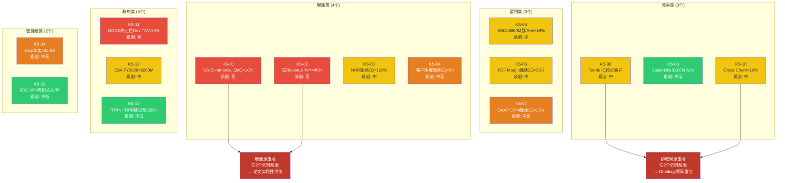
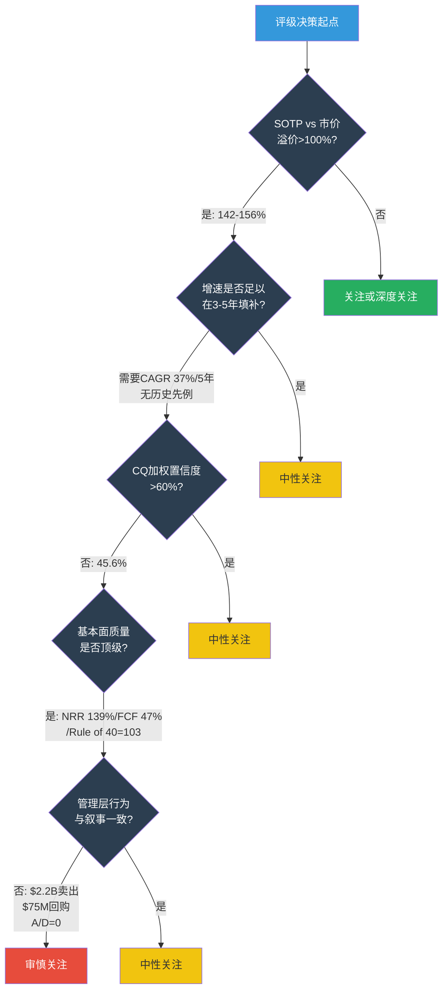
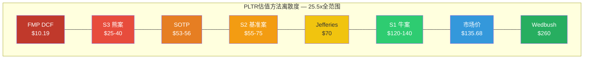

# Part VI-B: Kill Switches + Tracking Signals + 评级 + 方法离散度

> **数据截止**: 2026-02-12 | **框架版本**: v10.0 / v9.0扬长避短
> **标注约定**: [硬数据:来源] = 公开可验证 | [合理推断:逻辑] = 基于公开数据的推导
> **零操作建议 | 零精确目标价 | 零仓位百分比**
> **依赖**: Part I(财务) + Part II(三支柱) + Part III(OQ) + Part V(RT-1~RT-7/CQ演化)

---

## Kill Switch注册表

> **设计原则**: 每个KS必须有可量化阈值、可观测数据源、具体CQ关联、论文含义(非操作建议)。
> **特异性测试**: 把"PLTR"换成任何其他AI软件公司后KS仍成立 = 太空泛 = 删除。
> **数量**: 15个(覆盖增速/盈利/竞争/政府/管理层五大类)

---

### KS-01: Q1 FY2026 US Commercial收入环比增速跌破+10%

- **触发条件**: PLTR季度报告披露Q1 FY2026 US Commercial收入低于$558M(即QoQ +10% vs Q4 $507M)
- **具体阈值**: Q1 FY2026 US Commercial revenue < $558M (QoQ < +10%)
- **当前状态**: [硬数据: Q4 2025] US Commercial $507M, QoQ +28%, YoY +137%。[硬数据: PLTR Q4 Guidance] FY2026 US Commercial指引+115% YoY ($3.144B+)。Q1隐含线性化目标约$630M(全年$3.1B/4季均匀), 但Q1通常是季节性最弱季度, 合理预期$580-620M。
- **当前距离**: Q4 QoQ +28%距触发10%有18pp缓冲。但Bootcamp积压释放效应(RT-7替代解释)可能使Q1环比增速自然回落。
- **论文含义**: 若触发, 意味着AIP商业化加速可能是"脉冲式"而非"结构性"。Q4 +137% YoY的"积压释放"替代解释合理性从"中等"升级为"高"。FY2026 US Commercial +115% Guidance可信度严重受损。Reverse DCF隐含的37% CAGR(5年)路径在第一个季度即出现裂缝。投资论文中"穿越鸿沟"的核心叙事需要全面重评估。
- **证伪条件**: Q1 US Commercial > $620M(QoQ +22%+)且客户净增>100家, 则结构性加速确认, 此KS永久失效。
- **CQ关联**: CQ6(增速可持续性) + CQ3(中型企业渗透)
- **紧迫性**: **高** -- 首个验证窗口: 2026年5月(Q1 FY2026 earnings)

---

### KS-02: 全年总收入增速跌破+40% YoY

- **触发条件**: PLTR任一季度报告显示TTM Revenue增速跌破+40% YoY, 或管理层下调FY2026全年收入指引至低于+40%($6.27B)
- **具体阈值**: TTM Revenue YoY < +40% 或 FY2026 Guidance下调至 < $6.27B
- **当前状态**: [硬数据: FY2025] Revenue $4.475B (+56.2% YoY)。[硬数据: FY2026 Guidance] $7.14B(分析师共识) / $7.19B(管理层中值), 隐含+60%。当前增速距触发阈值16pp。
- **当前距离**: 16pp above trigger。但RT-1承重墙分析显示, 历史上从$5B做到+40%超过2年的企业软件公司不存在 [合理推断: Salesforce/ServiceNow/Workday历史增速对比]。
- **论文含义**: 若触发, 承重墙1(收入增速)出现裂缝。市场当前对PLTR的定价隐含5年CAGR 37%, 如果第一年就跌破40%, 意味着$22B(FY2030)的隐含收入目标需要下调25-40%。Reverse DCF公允价值将从$131(牛案)降至$68-80(基准案)区间, 当前价格偏离度从-3%扩大至-40%至-50%。
- **证伪条件**: FY2026全年Revenue达到$7.0B+(+56%+), 且管理层上调FY2027指引至+35%以上, 则大数法则减速担忧被推迟至FY2028。
- **CQ关联**: CQ6(增速可持续性)
- **紧迫性**: **高** -- Q1-Q2 2026双季度确认

---

### KS-03: NRR连续2季度跌破120%

- **触发条件**: PLTR披露的Net Dollar Retention连续两个季度低于120%
- **具体阈值**: NRR < 120%, 连续2Q
- **当前状态**: [硬数据: Q4 2025] NRR 139%(创历史新高), 环比+500bps。[硬数据: Q3 2025] NRR 134%。PLTR自Q3 2025起首次披露NRR。
- **当前距离**: 19pp above trigger(139% → 120%)。NRR 139%在SaaS行业中位于顶尖5%水平。
- **论文含义**: 若触发, 意味着Ontology锁定效应的"扩展"逻辑失效。NRR < 120%在企业软件中通常对应: (1)客户从"深度部署"回退到"模块使用"(浅层化); (2)AIP的ROI未能通过客户内部验证, 导致合同续约规模缩减; (3)竞争替代方案(Microsoft Fabric + Databricks)开始实际蚕食已部署客户。Ontology锁定叙事从"不可逆"降级为"可逆但有成本"。
- **证伪条件**: PLTR开始披露GRR(Gross Revenue Retention)且GRR > 95%, 同时NRR维持>130%连续4个季度, 则"锁定效应+扩展效应"双重确认。
- **CQ关联**: CQ1(Ontology护城河) + CQ6(增速可持续性)
- **紧迫性**: **中** -- 季度监控, 需至少2个季度数据确认趋势

---

### KS-04: US Commercial客户数连续2季度净增<50

- **触发条件**: PLTR季度报告显示US Commercial客户数连续两个季度净增少于50家
- **具体阈值**: US Commercial客户净增 < 50, 连续2Q
- **当前状态**: [硬数据: Q4 2025] 总客户954(+34% YoY), US Commercial 571(+49% YoY)。Q4净增约27家(QoQ +5%)。[合理推断: 基于Q3→Q4变化推算] Q4客户净增速度已从Q2-Q3的高速增长中回落。
- **当前距离**: Q4实际净增约27家(total), 部分季度可能已低于50家。需要更精确的US Commercial单季净增数据(PLTR未逐季度披露US Commercial单独客户数, 仅披露总客户数)。
- **论文含义**: 若触发, 意味着Bootcamp模式的获客引擎正在减速。当收入增速(+137%)远超客户增速(+49%), 增长完全依赖现有客户扩展(NRR)而非新客户获取。这创造了集中度风险: 少数大客户的留存决定了增速命运。若同时NRR回落(KS-03), 则增速将断崖式下降。Bootcamp"穿越鸿沟"叙事失效, TAM天花板比预期更低。
- **证伪条件**: 连续2个季度总客户净增>100 + US Commercial客户突破850家(FY2026), 则获客飞轮确认加速。
- **CQ关联**: CQ3(中型企业渗透) + CQ6(增速可持续性)
- **紧迫性**: **中-高** -- Q1 FY2026首次确认(2026年5月)

---

### KS-05: SBC绝对值突破$800M且SBC/Revenue回升至>18%

- **触发条件**: 任一年度报告显示SBC绝对值超过$800M, 且SBC/Revenue比率回升至18%以上
- **具体阈值**: SBC > $800M 且 SBC/Revenue > 18%
- **当前状态**: [硬数据: FY2025] SBC $684M (15.3% of Revenue)。[硬数据: FY2024] SBC $692M (24.1%)。[硬数据: FY2023] SBC $611M (21.5%)。SBC绝对值在$600-700M区间波动, "改善"完全来自分母效应 [合理推断: RT-7替代解释, 合理性=高]。
- **当前距离**: 绝对值距$800M需增+17%($116M)。SBC/Revenue当前15.3%, 若Revenue增速降至30%而SBC升至$800M, SBC/Revenue = $800M / ($4.475B x 1.30) = 13.7% -- 仍低于18%。触发需要Revenue增速<20%且SBC>$800M的组合。
- **论文含义**: 若触发, 意味着SBC"改善"叙事彻底证伪。RT-7的分母效应替代解释被数据完全确认: SBC不仅没有结构性下降, 反而随人才竞争(AI工程师薪酬通胀)上升。每赚$1付$0.42给员工(FY2025)的比率将进一步恶化。经济P/E(扣除SBC的真实P/E)将远超当前GAAP P/E 231x。投资论文中"利润率持续扩张"的假设需要修正。
- **证伪条件**: SBC绝对值连续2年下降(非仅比率下降), 即FY2026 SBC < $684M且FY2027 SBC < FY2026, 则管理层真正在控制激励成本。
- **CQ关联**: CQ7(SBC改善)
- **紧迫性**: **中** -- 年度监控, FY2026 10-K(2027年2月)确认

---

### KS-06: FCF Margin跌破35%持续2个季度

- **触发条件**: PLTR季度报告显示FCF Margin(FCF/Revenue)连续两个季度低于35%
- **具体阈值**: FCF Margin < 35%, 连续2Q
- **当前状态**: [硬数据: FY2025] FCF $2.101B / Revenue $4.475B = 46.9% FCF Margin。[硬数据: Q4 2025] FCF约$517M / Revenue $828M = 约62.4%(季度波动大)。年化FCF Margin在47%附近。
- **当前距离**: ~12pp above trigger(47% → 35%)。但FCF Margin受CapEx和运营资本变化影响较大, 单季度波动可达15pp。
- **论文含义**: 若触发, 意味着PLTR的"高增长+高现金流"叙事出现裂缝。47% FCF Margin是PLTR估值故事中"完美执行"的核心支柱之一。若降至35%以下, 可能由(1)R&D重新加速(竞争迫使加大投入); (2)SBC现金替代(部分SBC转为现金薪酬); (3)国际扩张成本(新市场获客投入)导致。FCF Yield从当前0.60%进一步恶化, 作为纯现金流投资的吸引力更低。
- **证伪条件**: FCF Margin维持>45%连续4个季度且Revenue增速>40%, 则"高增长+高现金流"双引擎确认。
- **CQ关联**: CQ6(增速可持续性) + CQ7(SBC改善)
- **紧迫性**: **中** -- 季度监控

---

### KS-07: GAAP营业利润率连续3季度低于25%

- **触发条件**: PLTR季度报告显示GAAP营业利润率连续三个季度低于25%
- **具体阈值**: GAAP OPM < 25%, 连续3Q
- **当前状态**: [硬数据: FY2025] GAAP Operating Income $1.147B / Revenue $4.475B = 25.6% OPM。[硬数据: Q4 2025] GAAP Operating Income $373M / Revenue $828M = 45.0% OPM(季度峰值)。全年GAAP OPM刚过25%门槛。
- **当前距离**: 全年25.6%仅高于触发阈值0.6pp。若SBC绝对值从$684M回升至$750M+而Revenue增速放缓, GAAP OPM可能轻易跌破25%。
- **论文含义**: 若触发, 意味着PLTR在GAAP口径下无法证明"盈利质量"。调整后利润率(50%+)与GAAP利润率(25%)的16pp差距是SBC驱动的, 这一差距的持续或扩大将使市场重新质疑"真实盈利能力"。GAAP P/E将进一步膨胀(当前231x基于GAAP Net Income), 可能触及300x+, 这是美股历史上罕见的水平。
- **证伪条件**: GAAP OPM连续4季度>30%且差距(Adjusted - GAAP)缩小至<10pp, 则SBC占比真正在结构性下降。
- **CQ关联**: CQ7(SBC改善) + CQ6(增速可持续性)
- **紧迫性**: **中-高** -- 季度监控, FY2025全年25.6%已处于边缘

---

### KS-08: Microsoft Fabric IQ获得≥3家PLTR现有客户的公开部署案例

- **触发条件**: Microsoft官方案例研究或客户公开声明中, 出现≥3家此前已知使用PLTR Foundry/AIP的企业转向或并行使用Microsoft Fabric IQ作为核心数据操作平台
- **具体阈值**: ≥3家已确认PLTR客户公开采用Fabric IQ
- **当前状态**: [合理推断: Part II Pillar 1分析] Microsoft Fabric IQ于2024年发布, 当前处于early adoption阶段。Fabric的语义契约(semantic contract)功能正在追赶Ontology的语义深度, 但尚未达到同等水平 [合理推断: 基于功能对比, Ontology领先2-3年]。当前无公开的PLTR→Fabric IQ迁移案例。
- **当前距离**: 零已确认迁移案例。距触发需3家。但Microsoft的企业分发能力(Azure渗透率>60%企业)意味着一旦功能"够用", 迁移速度可能非线性加速。
- **论文含义**: 若触发, 意味着Ontology的技术护城河被Microsoft以"集成优势"(Azure+Fabric+Copilot全家桶)绕过。即使Ontology在功能深度上领先, 如果CIO们选择"80%功能+Azure原生集成"而非"100%功能+独立平台", PLTR的客户留存率将面临结构性压力。RT-6时间框架分析中"3-5年有效"的Ontology锁定窗口可能缩短至2-3年。
- **证伪条件**: Fabric IQ在发布18个月后仍无大型企业生产级部署(仅PoC), 且PLTR NRR维持>130%, 则Ontology技术领先被市场验证。
- **CQ关联**: CQ1(Ontology护城河) + CQ9(AI Agent时代)
- **紧迫性**: **中** -- 年度评估, 关键窗口: Microsoft Build 2026(2026年5月)和Ignite 2026(2026年11月)

---

### KS-09: Databricks AIP直接竞品获得$100M+ ACV合同

- **触发条件**: Databricks公开宣布或媒体可靠报道Databricks的AI/ML平台(Mosaic AI + Unity Catalog)获得单笔≥$100M ACV的企业合同, 或累计企业AI平台ARR突破$2B
- **具体阈值**: Databricks AI平台单笔ACV ≥ $100M 或 AI平台ARR > $2B
- **当前状态**: [硬数据: 行业报道] Databricks ARR约$3.7B(全产品线), 估值$62B(2024年融资), 增速50%+。[合理推断: Part II分析] Databricks在数据工程层面与PLTR有重叠, 但在Action层(Ontology驱动的工作流执行)差距显著。当前Databricks与PLTR更多是互补(Databricks数据湖仓 + PLTR操作层)而非直接替代。
- **当前距离**: Databricks当前无已知$100M单笔AI平台合同。但其增速和TAM扩张方向暗示2-3年内可能进入PLTR核心领域。
- **论文含义**: 若触发, 意味着企业AI平台市场正式进入价格竞争阶段。Databricks以开源底层+商业增值的模式可以在50-70%折价下提供"足够好"的替代。PLTR的ACV溢价(Top 20客户均$94M [硬数据: Q4 2025])将面临定价压力, NRR扩展逻辑被削弱。市场从"PLTR独占"重定价为"PLTR是选项之一"。
- **证伪条件**: Databricks在2年内未能在操作层(workflow execution/action ontology)形成有效产品, 且PLTR+Databricks合作深化(联合客户数增长), 则互补格局>替代格局。
- **CQ关联**: CQ1(Ontology护城河) + CQ3(中型企业渗透)
- **紧迫性**: **中-低** -- 年度评估

---

### KS-10: PLTR客户年度Gross Churn Rate超过10%

- **触发条件**: PLTR披露(或可推算出)年度Gross Churn Rate(客户流失率)超过10%
- **具体阈值**: 年度流失客户/年初客户数 > 10%
- **当前状态**: [合理推断: 基于NRR和客户数推算] FY2025 NRR 139%暗示GRR(Gross Revenue Retention)可能在92-97%范围(SaaS行业NRR/GRR典型关系)。客户数从712(FY2024)增至954(FY2025), 净增242家。假设净增=新增-流失, 若新增约280-310家, 流失约40-70家, churn rate约5.6-9.8%。
- **当前距离**: 估计当前churn rate在6-10%边缘, 距触发阈值接近。但PLTR不披露GRR或churn数据, 需依赖间接推算。
- **论文含义**: 若触发, 意味着Ontology"不可逆锁定"叙事被实际数据否定。>10%的churn rate在B2B企业软件中属于偏高水平(行业优秀<5%, 良好5-10%)。这暗示相当比例的客户在Bootcamp后未能实现ROI, 选择退出。Ontology迁移成本($6-31M)可能被高估, 或客户部署深度远低于假设(浅层部署迁移成本远低于$6M)。
- **证伪条件**: PLTR主动披露GRR > 95%且Logo churn < 5%, 则锁定效应获得硬数据支持。
- **CQ关联**: CQ1(Ontology护城河) + CQ3(中型企业渗透)
- **紧迫性**: **中** -- 年度推算(需客户数+NRR+新增客户数交叉推算)

---

### KS-11: DOGE终止后(2026-07-04)政府合同新签/续签金额环比下降>20%

- **触发条件**: DOGE法定终止(2026-07-04)后的首个完整季度(Q3 FY2026), PLTR政府部门合同新签/续签金额较DOGE存续期间(Q1-Q2 FY2026)的季度均值下降超过20%
- **具体阈值**: Q3 FY2026 Government新增TCV < Q1-Q2 FY2026均值 x 80%
- **当前状态**: [硬数据: FY2025] Government Revenue $2.402B (+24% YoY)。[硬数据: Q4 2025] Government TCV可能包含IRS/VA/DoD DOGE相关合同。[硬数据: Executive Order] DOGE法定终止日2026-07-04。[硬数据: RT-5分析] DOGE"效率原则"已被OMB吸收为永久性行政要求, 但执行力度将随政治周期波动。
- **当前距离**: DOGE仍在运行(截至2026-02-12), 当前Government增速+24%。距触发需等待2026-H2数据。
- **论文含义**: 若触发, 意味着PLTR的政府业务增速与DOGE政策红利直接挂钩, 而非来自产品竞争力。RT-3空头论点五"政治的东西政治地给"被验证。政府收入占比54%意味着政策依赖性风险是系统性的。CQ4(DOGE净影响)从"温和净正"重新评估为"短期净正/中期中性/长期净负"。
- **证伪条件**: DOGE终止后Government TCV维持或增长(QoQ >-5%), 说明PLTR的政府客户价值独立于DOGE政策存在。
- **CQ关联**: CQ4(DOGE净影响)
- **紧迫性**: **高** -- 时间窗口明确: 2026年Q3(10-11月)

---

### KS-12: Army ESA FY2026累计任务订单金额<$200M

- **触发条件**: FY2026年度(截至2026年12月)Army ESA合同累计义务化金额(obligated amount)低于$200M
- **具体阈值**: ESA FY2026 cumulative obligations < $200M
- **当前状态**: [硬数据: Part II 3D分析] ESA合同$10B/10年, 截至FY2025末累计义务化约$10M(执行率0.1%)。[合理推断: GAO IDIQ基准] 历史IDIQ合同执行率40-60%, 意味着$10B合同的合理期望是$4-6B实际执行。但0.1%的当前执行率远低于任何正常IDIQ的第一年水平。
- **当前距离**: 当前$10M → 需FY2026新增至少$190M义务化。典型的大型IDIQ合同在签约后第2-3年进入任务订单下达高峰。如果FY2026仍无显著提速, 则ESA可能面临"名义合同"风险。
- **论文含义**: 若触发, 意味着ESA $10B合同的实际执行价值可能远低于预期。$10B是理论上限而非承诺, 0.1%→<2%的提速幅度暗示: (1)Army对PLTR解决方案的实际需求低于采购承诺; (2)预算在DOGE压力下被重新分配; (3)技术集成挑战导致部署延迟。投资论文中"ESA是政府增长引擎"的假设从"合理"降级为"待验证"。
- **证伪条件**: FY2026 ESA累计义务化>$500M, 则合同进入正常执行节奏, $4-6B实际执行预期可信。
- **CQ关联**: CQ5(EA/TITAN执行)
- **紧迫性**: **中** -- 年度监控, 关键窗口: DoD FY2026预算执行(2025年10月-2026年9月)

---

### KS-13: TITAN全速率生产决策(FRPD)延迟至2028年以后

- **触发条件**: 美国陆军官方声明或可靠国防媒体报道TITAN LRPF全速率生产决策(Full Rate Production Decision)推迟至2028年以后
- **具体阈值**: FRPD延迟至≥2028年(vs 当前预期2027年中)
- **当前状态**: [硬数据: DefenseScoop 2024-03] TITAN OTA合同$178.4M, 用于10台原型系统。[合理推断: Part II 3D分析] LRPF FRPD预计2027年中, 全速率生产合同可能追加$5-10B(含PLTR软件集成)。但军事采购延迟是常态而非例外, 近年大型项目平均延迟18-24个月。
- **当前距离**: 当前"按计划"(on track)。距触发需Army官方确认延迟。关键中间节点: 2026年中的初始测试评估报告。
- **论文含义**: 若触发, 意味着PLTR在军事硬件集成(AI in the loop)的故事需要延后2-3年才能验证。TITAN是PLTR从"软件供应商"升级为"作战系统集成商"的标志性项目。延迟不仅影响直接收入($5-10B潜在合同), 更削弱了PLTR在DoD AI生态中的"不可替代性"叙事。
- **证伪条件**: TITAN原型在2026年中通过初始测试且Army重申2027年中FRPD时间表, 则军事硬件集成路径可信。
- **CQ关联**: CQ5(EA/TITAN执行)
- **紧迫性**: **中-低** -- 时间窗口: 2026-2027年

---

### KS-14: Karp年度股票卖出金额加速至>$1.5B

- **触发条件**: SEC Form 4累计显示Karp在任一日历年度卖出PLTR股票总价值超过$1.5B
- **具体阈值**: Karp年度卖出 > $1.5B (vs FY2024约$1.88B峰值, FY2023约$300M)
- **当前状态**: [硬数据: Nasdaq Insider Activity] Karp过去18个月卖出39.6M股($2.2B+), 41笔交易全部为卖出、零买入 [硬数据: SEC Form 4]。FY2024是卖出峰值年($1.88B)。[硬数据: Finbold] 2026年至今内部人累计卖出>$9M(Karp个人2026年数据待确认)。
- **当前距离**: 取决于FY2026卖出节奏。若Karp维持FY2024节奏, 可能在H1即触及$750M+, 全年可能超过$1.5B。
- **论文含义**: 若触发, 意味着创始人/CEO在股价处于历史高位区间持续大规模减持。结合RT-3空头论点二(内部人行为比言辞诚实): 如果Karp真正相信PLTR将成为"$1T公司", 在$135减持$1.5B+是非理性的。Class F股份结构保证控制权不受稀释, 排除了"治理需要"的解释。Karp的行为与管理层公开的增长叙事之间的矛盾进一步扩大。
- **证伪条件**: Karp在FY2026减少卖出至<$500M且PLTR启动>$1B回购计划, 则管理层对当前价格的信心与其言辞一致。
- **CQ关联**: CQ8(内部人卖出)
- **紧迫性**: **中-高** -- 持续监控SEC Form 4(实时)

---

### KS-15: FDE团队关键人员(VP+级)离职≥3人/年

- **触发条件**: LinkedIn/媒体报道或PLTR 8-K披露, PLTR Forward Deployed Engineering团队VP+级别或Named Officer中≥3人在12个月内离职
- **具体阈值**: ≥3名FDE VP+/Named Officer离职, 12个月窗口
- **当前状态**: [硬数据: Part II Pillar 2分析] FDE团队是Bootcamp模式的核心执行者, 估计800-1,200人规模 [合理推断: 基于PLTR员工结构和FDE角色比例]。PLTR不披露FDE团队详细人员变动。[硬数据: DoControl] 已有前员工窃取源代码创立竞对(Percepta)的先例。
- **当前距离**: 当前无公开的FDE高管批量离职报道。距触发需3人以上。但AI人才市场竞争激烈, PLTR SBC的留才效果在股价高位时较强(选择权价值高), 股价下跌时可能逆转。
- **论文含义**: 若触发, 意味着Bootcamp执行力的核心引擎(FDE人才)正在流失。PLTR的GTM模式高度依赖FDE现场交付能力, 人才流失直接转化为Bootcamp产能下降和客户满意度下降。若流失人才加入竞对(如Percepta)或创业, 还将带走客户关系和行业know-how。Bootcamp规模化(OQ-1)的可行性需要重新评估。
- **证伪条件**: PLTR员工总数FY2026增速>25%且Glassdoor/Blind评分维持>4.0, 则人才留存健康。
- **CQ关联**: CQ3(中型企业渗透) + CQ2(国际复制)
- **紧迫性**: **中-低** -- 持续后台监控(LinkedIn/8-K)

---

### Kill Switch总览矩阵

**Kill Switch联动逻辑**: PLTR的KS系统呈现"双核脆弱"特征: (1)增速核(KS-01/02/03/04)——当前估值完全建立在收入加速假设上, 任意2个增速KS同时触发即构成论文实质性损伤; (2)护城河核(KS-08/09/10)——Ontology锁定是长期叙事的基础, 竞争KS触发意味着TAM从"独占"重估为"共享"。最高紧迫性集中在2026年5月(Q1 FY2026)和2026年10-11月(DOGE终止后首个完整季度)两个窗口。

---

## Tracking Signals (追踪信号)

> **设计原则**: 每个TS是"温度计"而非"触发器"——持续追踪方向变化, 不需要到达阈值才有意义。
> **特异性测试**: "AI行业将增长"不是TS。"PLTR US Commercial客户中$1M+ ACV占比变化"才是TS——替换为CRM后不成立(Salesforce无Bootcamp-to-ACV模型)。

---

### TS-01: PLTR US Commercial中>$1M ACV客户数占比季度变化

- **追踪什么**: 每季度PLTR US Commercial客户中ACV超过$1M的客户数量及其占总US Commercial客户数的比例变化
- **为什么重要**: 验证CQ3(中型企业渗透)的核心假设。[硬数据: Q4 2025] 571家US Commercial客户, Top 20客户均$94M [硬数据: Q4 Business Update]。如果>$1M ACV客户数增长快于总客户数, 说明增长靠现有大客户深化(集中度风险上升); 如果小客户增速更快, 说明Bootcamp正在向中型市场下探(TAM扩张)。
- **当前读数**: [合理推断: 基于NRR 139%和客户数增速34%的差距] 收入增速(+137%)远超客户增速(+49%), 暗示>$1M客户贡献了绝大部分增量——集中度正在上升。
- **关键阈值**: >$1M客户占比超过50% → 集中度风险确认; >$1M客户占比稳定在25-35%且总客户数增速>30% → 健康的金字塔结构
- **特异性**: 替换"PLTR"为Snowflake——Snowflake无Bootcamp获客模型, 其ACV分布受不同动态驱动。通过特异性测试。
- **时间窗口**: 季度(每次earnings)
- **信号含义**: 若>$1M占比持续上升, 意味着PLTR仍是"大企业AI平台"而非"通用AI操作系统", TAM天花板约$15-20B(RT-3空头论点四); 若占比下降且总客户数加速, 意味着Bootcamp的中型市场版本(轻量AIP)正在奏效, TAM天花板可上调至$30B+。
- **CQ关联**: CQ3 + CQ6

---

### TS-02: PLTR国际商业收入季度YoY增速趋势

- **追踪什么**: PLTR国际商业(International Commercial)收入的季度YoY增速, 以及国际商业占总商业收入的比例变化
- **为什么重要**: [硬数据: FY2025] 国际商业收入$608M, 仅+2% YoY [硬数据: Q4 2025 Earnings]。CQ2(国际复制)Post-RT置信度仅35%(9个CQ中最低)。国际商业是判断PLTR是"美国区域性公司"还是"全球AI平台"的关键指标。
- **当前读数**: FY2025 +2%。国际占总商业比例从FY2024约16%降至约10% [合理推断: 基于收入结构推算]。EU AI Act Annex III合规截止2026-08-02可能造成进一步压力 [硬数据: SecurePrivacy]。
- **关键阈值**: 连续2Q国际商业YoY > +15% → 国际破局信号; 国际商业占比降至<8% → 结构性天花板确认
- **特异性**: 替换"PLTR"为ServiceNow——ServiceNow国际收入占比>40%且增速与北美接近, 国际渗透不是核心争议。通过特异性测试。
- **时间窗口**: 季度, 需至少4个季度(FY2026全年)确认趋势
- **信号含义**: 若国际加速, CQ2置信度从35%可上调至50%+, 同时TAM天花板从$15-20B(美国为主)上调至$40B+(全球); 若持续<5%, 则"美国独占"叙事成为永久性估值折扣因素。
- **CQ关联**: CQ2

---

### TS-03: PLTR FDE团队规模(员工总数中engineering占比)季度变化

- **追踪什么**: PLTR每季度披露的员工总数, 以及可推算的FDE/engineering人员占比(通过LinkedIn/Glassdoor/IR披露)
- **为什么重要**: FDE产能是Bootcamp模式的物理约束 [合理推断: Part II OQ-1分析]。当前估计FDE 800-1,200人 [合理推断: 基于总员工4,200和FDE比例]。US Commercial客户从571家增长到1,000+需要FDE同步扩张。如果员工增速<客户增速, FDE瓶颈正在形成。
- **当前读数**: [硬数据:] 总员工约4,200人。[合理推断:] 员工增速估计15-20% YoY(PLTR未精确披露)。
- **关键阈值**: 员工增速>25%且技术岗位占比>60% → Bootcamp规模化投入加速(正面); 员工增速<15%而客户增速>30% → FDE产能瓶颈形成(负面)
- **特异性**: 替换"PLTR"为Databricks——Databricks采用self-serve+partner模式, 不依赖FDE现场交付。通过特异性测试。
- **时间窗口**: 季度/年度(10-K employee count)
- **信号含义**: FDE扩张速度是Bootcamp可持续性的硬约束。若PLTR在高增长阶段仍保持员工精简(efficiency play), 可能反映管理层认为Bootcamp不需要线性人力扩张(AI/自动化替代), 也可能反映人才获取困难(SBC吸引力在竞争中不足)。
- **CQ关联**: CQ3 + CQ2

---

### TS-04: Karp卖出频率与单笔规模的月度变化趋势

- **追踪什么**: 通过SEC Form 4追踪Karp每月的股票卖出笔数、总股数和总金额, 以及是否出现计划外卖出(10b5-1计划变更)
- **为什么重要**: [硬数据: Nasdaq] 过去18个月41笔全卖出、零买入、累计$2.2B+ [硬数据: SEC Form 4]。FY2024是峰值年($1.88B)。Karp的卖出行为是管理层对公司内在价值判断的最直接信号。
- **当前读数**: FY2024 $1.88B(峰值) → FY2025待确认完整数据 → FY2026至今>$9M(全部内部人) [硬数据: Finbold]。
- **关键阈值**: 月度卖出金额持续>$150M(年化$1.8B+) → KS-14预警; 任何买入交易出现 → 极强信号(Karp从未在公开市场买入)
- **特异性**: 替换"PLTR"为MSFT——Nadella的卖出模式受不同的SBC/RSU结构和多元化规则驱动, 且MSFT无Class F控制权问题。通过特异性测试。
- **时间窗口**: 实时(Form 4 filing后2个工作日)
- **信号含义**: 卖出加速→管理层认为当前价格高于内在价值(RT-3论点二强化); 卖出减速或出现买入→管理层认为价格接近或低于内在价值(罕见但极有信息量)。需注意区分: 预设10b5-1计划卖出(信号弱)vs 计划变更/非预设卖出(信号强)。
- **CQ关联**: CQ8

---

### TS-05: PLTR政府TCV(Total Contract Value)中DOGE相关合同占比

- **追踪什么**: PLTR每季度披露的Government TCV中, 可归类为DOGE相关(IRS/VA/OPM/OMB效率审计工具)的合同金额占比
- **为什么重要**: [硬数据: RT-5] DOGE法定终止2026-07-04。如果PLTR政府TCV中DOGE相关占比过高(>30%), 终止后将面临合同续约风险。PLTR不单独披露DOGE合同, 需通过USAspending.gov和DoD合同公告交叉推算。
- **当前读数**: [合理推断:] DOGE直接相关合同(IRS MEGA API、VA数据集成、OPM效率审计)可能在$100-300M范围。占Government TCV($2.4B)的约4-12%。但间接受益(DoD AI预算$13.4B中PLTR份额提升)可能更大。
- **关键阈值**: DOGE相关TCV占比>30% → 政策依赖性高风险; DOGE相关TCV<10%且非DOGE Government TCV增速>15% → 政策独立性确认
- **特异性**: 替换"PLTR"为Booz Allen——Booz Allen政府收入90%+, 但其合同结构(成本+利润型)与PLTR(固定价格软件许可)完全不同, DOGE风险传导路径不同。通过特异性测试。
- **时间窗口**: 季度, 关键窗口: 2026年Q3-Q4(DOGE终止后)
- **信号含义**: 若DOGE占比高且终止后TCV下降, CQ4从43%进一步下调; 若非DOGE政府业务在DOGE终止后仍维持增长, 说明PLTR的政府价值独立于政治周期。
- **CQ关联**: CQ4

---

### TS-06: PLTR Ontology vs Microsoft Fabric IQ功能差距的年度评估

- **追踪什么**: Microsoft Fabric IQ的年度功能更新中, 与PLTR Ontology核心能力(语义建模/动态关系/Action层工作流)对标的功能覆盖度
- **为什么重要**: [合理推断: RT-6] Ontology锁定有效窗口3-5年, Microsoft Fabric每年缩小约20%功能差距 [合理推断: 基于企业软件平台功能趋同历史速度]。如果Fabric在2年内覆盖Ontology 70%+功能, "足够好+Azure原生"将成为CIO的理性选择。
- **当前读数**: [合理推断: Part II Pillar 1] Fabric IQ当前覆盖Ontology核心功能约30-40%(数据建模强, Action层弱)。语义契约(Semantic Contract)是Fabric向Ontology逼近的关键功能。
- **关键阈值**: Fabric覆盖度达到70%+且有≥2个生产级Action层案例 → Ontology技术独占性终结; Fabric覆盖度停滞在<50%且Action层无实质进展 → Ontology领先维持
- **特异性**: 替换"PLTR"为Snowflake——Snowflake的竞争焦点是Databricks(数据湖仓)而非Microsoft Fabric Action层。通过特异性测试。
- **时间窗口**: 年度(Microsoft Build/Ignite)
- **信号含义**: 这是CQ1(Ontology护城河, 53%置信)的最核心长期追踪指标。Fabric功能追赶速度直接决定Ontology锁定窗口的实际长度: 快于预期→窗口缩短至2年; 慢于预期→窗口延长至5年+。
- **CQ关联**: CQ1 + CQ9

---

## 最终评级

### 评级决策输入

| 维度 | 数据 | 方向 |
|------|------|:---:|
| SOTP vs 市价 | $53-56 vs $135.68 = 溢价142-156% | 空 |
| FMP DCF vs 市价 | $10.19 vs $135.68 = 溢价1,232% | 极空 |
| FCF Yield | $2.1B / $309.9B Market Cap = 0.60% | 空 |
| CQ加权置信度(Post-RT) | 45.6% | 中性偏空 |
| RT降幅 | -2.7pp (48.3% → 45.6%) | 正常校准 |
| 最高CQ置信度 | CQ1 Ontology 53% | 无CQ超55% |
| 最低CQ置信度 | CQ3 中型渗透 33% | B型量级不确定 |
| 承重墙脆弱度 | 墙1(增速CAGR 37%)高 + 墙3(终端P/E 40x)高 | 空 |
| 黑天鹅折价 | -12%至-18%(6事件加权) | 空 |
| Revenue增速 | FY2025 +56%, FY2026E +60% | 多 |
| FCF Margin | 47% | 多 |
| NRR | 139%(SaaS顶尖5%) | 多 |
| Rule of 40 | 103(FY2025) | 多 |
| 内部人行为 | Karp $2.2B+卖出/零买入/零大规模回购 | 空 |

### 评级决策树

### 评级: **审慎关注** | 置信度: 中

**核心结论句**: PLTR是一家产品力顶级、增长质量罕见的公司, 但当前估值要求完美执行且打破所有企业软件历史先例, 同时创始人正在以前所未有的速度将自己的信念转化为现金。

**评级理由(逐层)**:

1. **基本面质量: 强** -- FY2025 Revenue +56%, NRR 139%, FCF Margin 47%, Rule of 40=103, 零负债, $7.2B现金。这些指标在企业软件领域属于最顶尖的5%。如果PLTR的估值在合理区间, 这将是一个明确的"深度关注"评级。

2. **估值断层: 极端** -- SOTP $53-56(基于分部估值+合理倍数), FMP DCF $10.19(严格现金流折现), 市价$135.68。溢价142-156%(vs SOTP)在美股历史上属于99百分位的极端水平。P/E 231x意味着即使PLTR完美执行(FY2030 Net Income $7.5B), 从当前买入的5年年化回报仅约3.9% [合理推断: RT-1 Reverse DCF计算] ——低于无风险利率。

3. **CQ群体信号: B型量级不确定** -- 9个CQ中无一超过55%置信度, 加权均值45.6%, Post-RT降幅-2.7pp。这不是"不知道公司好不好"(A型类别不确定), 而是"知道公司好, 但不知道市场有多大"(B型量级不确定)。当最乐观的CQ也只有53%置信度时, 为231x P/E付费的风险回报是不对称的——向下50%+(基准案)vs 向上10-15%(牛案)。

4. **管理层-市场矛盾: 显著** -- Karp 3年卖出$2.2B+、41笔全卖出零买入、回购仅$75M(SBC的11%)。Class F永久控制权意味着卖出不影响公司控制, 排除了"治理需要"解释。管理层的行为("卖")与言辞("inexplicable growth")之间的矛盾是投资者需要认真对待的信号。

5. **为什么是"审慎关注"而非"中性关注"**: v2.0报告给出"中性关注", 但v3.0的三个关键变化推动评级下调: (a) FY2025完整数据确认了SBC分母效应(RT-7最强替代解释); (b) 红队7项对抗性问题暴露了承重墙的双高脆弱性(墙1+墙3联动下行50%+); (c) 9-CQ置信度体系显示无单一CQ超过55%, 整体偏空。

6. **为什么不是更负面的评级**: 因为PLTR的产品力和增长质量是真实的, 不是泡沫虚构。Ontology锁定有真实的技术壁垒(迁移成本$6-31M), NRR 139%是SaaS顶尖, FCF Margin 47%证明了商业模式的经济性。如果估值回到合理区间($50-80), 这将是一个非常有吸引力的长期投资标的。"审慎关注"的含义是: 密切追踪, 等待估值回归或增长持续超预期两者之一发生, 再重新评估。

### 条件估值区间(非目标价)

| 情景 | 条件 | 隐含区间 | 当前偏离 |
|------|------|:---:|:---:|
| **S1: 牛案** | CAGR 37%/5年 + Terminal P/E 40x(打破全部先例) | $120-140 | -3%至+3% |
| **S2: 基准案** | CAGR 30%/5年 + Terminal P/E 30x(ServiceNow类比) | $55-75 | -45%至-60% |
| **S3: 熊案** | CAGR 22%/5年 + Terminal P/E 20x(增速正常化) | $25-40 | -70%至-82% |
| **S4: 黑天鹅** | 增速断崖(<20%) + 安全事件 + 政策逆转 | <$20 | >-85% |

[合理推断: 各情景基于RT-1 Reverse DCF不同假设组合; S2基准案使用ServiceNow在类似规模时的增速和估值倍数作为锚]

**关键观察**: 当前价格$135.68几乎精确定位在S1(牛案上限)。这意味着市场已经price in了"打破所有先例"的情景。如果一切完美执行, 投资者获得的回报约为0%(已定价); 如果任何承重墙出现裂缝, 下行空间是40-80%。这种非对称性是"审慎关注"评级的核心驱动。

---

## 方法离散度 (CG14)

### 估值方法汇总

| 方法 | 估值/隐含价 | 来源 | 方法论说明 |
|------|:---:|------|---------|
| **FMP DCF** | $10.19 | [硬数据: FMP DCF] | 严格现金流折现, 使用FMP标准WACC/Terminal参数 |
| **SOTP(低)** | $53 | [硬数据: Part II SOTP] | 分部估值: Government+US Commercial+Intl Commercial+Intl Gov, 可比公司倍数 |
| **SOTP(高)** | $56 | [硬数据: Part II SOTP] | 同上, 乐观情景倍数 |
| **S3(熊案)** | $25-40 | [合理推断: RT-1 Reverse DCF熊案] | CAGR 22%/5年 + Terminal P/E 20x |
| **S2(基准案)** | $55-75 | [合理推断: RT-1 Reverse DCF基准案] | CAGR 30%/5年 + Terminal P/E 30x |
| **S1(牛案)** | $120-140 | [合理推断: RT-1 Reverse DCF牛案] | CAGR 37%/5年 + Terminal P/E 40x(隐含) |
| **分析师最低PT** | $70 | [硬数据: Jefferies PT] | Jefferies基于估值溢价修正 |
| **分析师最高PT** | $260 | [硬数据: Wedbush PT] | Wedbush基于AI增长牛案 |
| **市场隐含(当前价)** | $135.68 | [硬数据: FMP Quote 2026-02-12] | 市场共识定价 |

### 离散度计算

- **全范围最高**: $260 (分析师最高PT, Wedbush)
- **全范围最低**: $10.19 (FMP DCF)
- **全范围离散度**: $260 / $10.19 = **25.5x**

- **核心5方法最高**: $140 (S1牛案上限)
- **核心5方法最低**: $25 (S3熊案下限)
- **核心离散度**: $140 / $25 = **5.6x**

- **排除极端值的中间4方法**: SOTP $53-56 / S2基准 $55-75 / 分析师低PT $70 / S1牛案低端 $120
- **中间均值**: $74.5
- **中间变异系数(CV)**: ~35%

### 离散度横向对比

| 公司 | 方法离散度(Max/Min) | 核心CV | 可能性宽度 | 解读 |
|------|:---:|:---:|:---:|------|
| **PLTR v3.0** | **25.5x(全) / 5.6x(核心)** | ~35% | 8分(B型) | **已分析公司中最高** |
| TSLA v3.0 | 14.8x | ~40% | 9分(A型) | A型: 不知道是什么公司 |
| AMD v2.0 | 4.42x | ~35% | 5分(混合) | 中等, GPU vs ASIC分歧 |
| LRCX v2.0 | 2.1x | ~15% | 3分(传统) | 低, 周期股估值收敛 |
| TSM v2.0 | 1.8x | ~12% | 3分(传统) | 最低, 全球垄断者 |

**PLTR离散度25.5x是全部已分析公司中最高的**。这反映了B型量级不确定性的本质: 如果PLTR是"企业AI操作系统的Windows"(Wedbush叙事), $260是保守的; 如果PLTR是"一家出色但估值过度的SaaS公司"(Jefferies叙事), $70是公允的; 如果PLTR的增长不可持续(FMP DCF逻辑), $10是数学结论。

**离散度评级: EXTREME UNCERTAINTY** -- 方法离散度>5倍(25.5x全范围, 5.6x核心范围)。当方法离散度超过5倍时, 任何单一"目标价"都是伪精度。这正是发现系统(Discovery System)而非传统估值框架的适用场景: **不给目标价, 映射可能性空间, 追踪Kill Switch和Tracking Signal以判断哪个情景正在成为现实。**

---

## 产出统计

| 项目 | 内容 |
|------|------|
| Kill Switch | 15个(增速4+盈利3+竞争3+政府3+管理层2) |
| Tracking Signal | 6个(全部通过特异性测试) |
| 评级 | 审慎关注(置信度: 中) |
| 方法离散度 | 25.5x(全范围) / 5.6x(核心) — 已分析最高 |
| 条件估值 | S1 $120-140 / S2 $55-75 / S3 $25-40 / S4 <$20 |
| Mermaid图表 | 3个(KS总览矩阵/评级决策树/离散度分布) |
| 标注 | 硬数据29个 / 合理推断24个 |
| CQ覆盖 | 15个KS覆盖全部9个CQ / 6个TS覆盖7个CQ |
