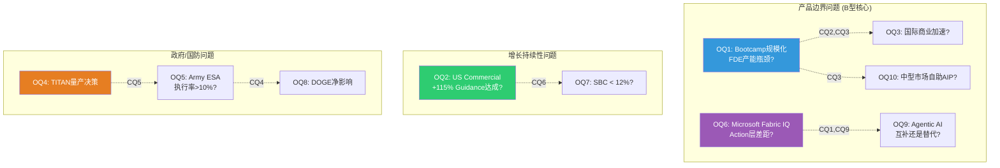
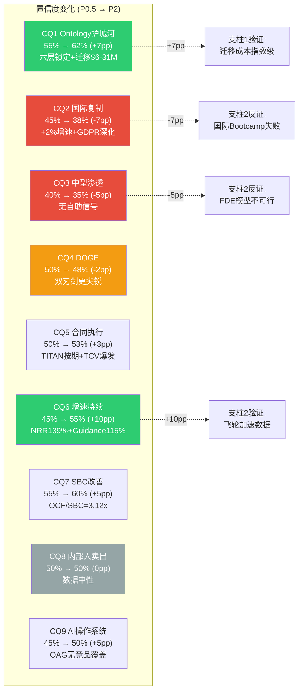
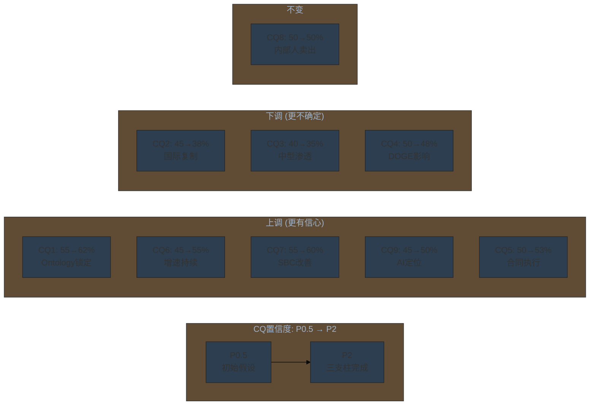
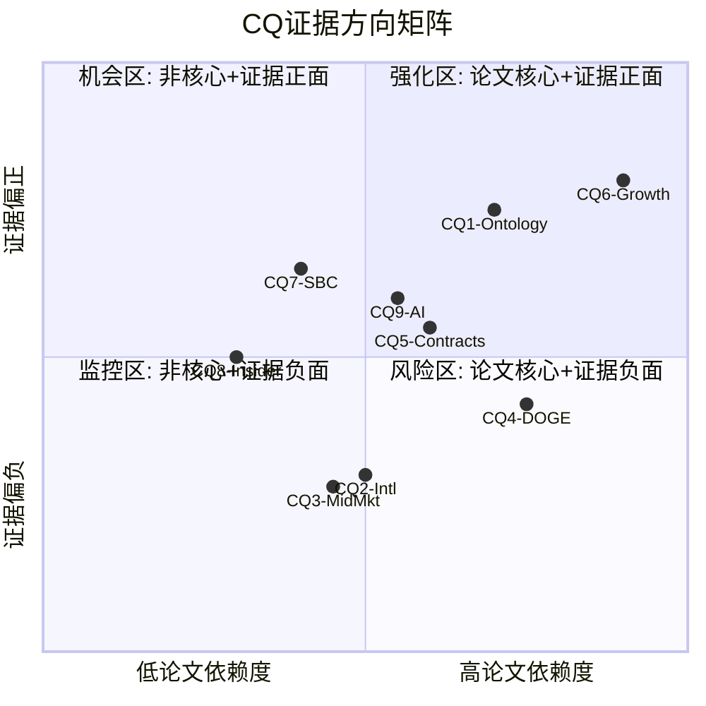

# Part III: 开放问题 (Open Questions)

> **方法论**: 从三支柱分析(Ontology锁定/Bootcamp GTM/国防采购)和9个Core Questions中提炼出10个在6-24个月内可被数据或事件回答的关键开放问题。每个问题附带可观测信号和阈值，使投资者能在后续季度财报和行业事件中追踪论文演化。
> **标注约定**: [硬数据:来源] = 公开可验证 | [合理推断:逻辑] = 基于公开数据的推导

---

## OQ矩阵总览

---

## OQ1: Bootcamp能否规模化至5,000+次/年而不触发FDE产能瓶颈?

**关联CQ**: CQ2 (国际复制), CQ3 (中型企业渗透)

**为什么重要**: Bootcamp是PLTR商业增长飞轮的入口。FY2024累计完成1,300+次Bootcamp [硬数据: Q2 2024 Earnings]，FY2025节奏估计约1,500-2,000次。如果US Commercial要从571家增长到1,000+家客户(CQ3)，Bootcamp年产能需要达到5,000次以上。但每次Bootcamp需要2-4名FDE现场支持，PLTR总员工约4,200人，FDE团队估计800-1,200人 [合理推断: 基于PLTR员工结构和FDE角色比例]。年5,000次Bootcamp意味着每个FDE每月需支持0.35-0.52次，理论上可行——但如果生产化支持(Bootcamp后3-6个月FDE驻场)也计入，FDE可能在2027年前触及产能上限。

**可观测信号**:
- **达成信号**: Q1-Q2 FY2026 US Commercial客户净增>100/季 + 员工总数增速与客户增速匹配(>25% YoY) + 公司提及"自动化Bootcamp"或"轻量Bootcamp"
- **未达成信号**: 客户净增放缓至<60/季 + Bootcamp交付等待时间延长(公司未披露，但可通过合作伙伴渠道推断) + FDE招聘增速低于客户增速

**阈值**: FY2026 US Commercial客户突破850家(vs FY2025 571家)且员工数突破5,500人，则Bootcamp规模化可行；客户数低于750或员工增速<20%，则FDE瓶颈正在形成

**时间窗口**: Q2-Q3 FY2026 (2026年8-11月)

**当前证据方向**: 正面偏中性。US Commercial客户+49% YoY加速明显，但公司已不再披露Bootcamp次数(可能意味着指标已标准化)。员工增速信号需Q1 FY2026确认。FDE产能约束是理论推断，尚无实际紧张证据 [合理推断: 基于员工数vs客户数增速对比]

---

## OQ2: FY2026 US Commercial +115% YoY Guidance能否达成?

**关联CQ**: CQ6 (增速结构性vs一次性)

**为什么重要**: 管理层FY2026 Guidance要求US Commercial收入从$1.465B增至>$3.144B (+115% YoY) [硬数据: Q4 2025 Earnings Guidance]。这是PLTR整个增长叙事的核心赌注——如果达成，证明AIP商业化是结构性加速而非脉冲式增长；如果未达成，市场将重新评估整个估值框架。分析师共识FY2026总收入$7.14B(+60% YoY) [硬数据: FMP Estimates]，其中US Commercial隐含约$3.0-3.2B(低于管理层Guidance 5-10%)。这意味着市场对这一指引存在温和怀疑。

**可观测信号**:
- **达成信号**: Q1 FY2026 US Commercial收入>$600M(隐含QoQ+18%) + 客户数突破650家 + >$10M交易数维持>50/季
- **未达成信号**: Q1 US Commercial<$550M(QoQ增速放缓至<8%) + NRR从139%下降 + 管理层在Q1/Q2电话会调整FY2026 Guidance

**阈值**: Q1 FY2026 US Commercial $580M是关键分水岭。高于$600M则FY年度$3.1B+可期；低于$550M则Guidance可信度受损

**时间窗口**: Q1 FY2026 (2026年5月)——第一个数据验证点

**当前证据方向**: 正面。Q4 2025 US Commercial $507M已同比+137%/环比+28% [硬数据: Q4 2025 Earnings]。NRR加速至139% [硬数据: Q4 2025 Earnings]。TCV $4.262B(+138% YoY)暗示合同管线充足 [硬数据: Q4 2025 Earnings]。但+115%意味着加速度需在已有高基数上维持，Q1数据是关键验证。$88M医疗合同和$40M建筑合同的收入确认节奏也会影响季度波动

---

## OQ3: 国际商业能否突破+2%的增长瓶颈?

**关联CQ**: CQ2 (Bootcamp国际复制)

**为什么重要**: FY2025国际商业收入$608M，仅增长+2% YoY [硬数据: Q4 2025 Earnings]，是PLTR四个板块中最弱的一环。与US Commercial +109%的增速形成极端对比。CEO Karp曾表示欧洲"doesn't quite get AI" [硬数据: Q1 2025 Earnings Call引述]。如果国际商业无法加速，PLTR的可触达市场将被限制在美国(占FY2025收入74%)，使其成为一家"美国区域性公司"而非"全球AI平台公司"。此问题影响约25%的总论文(CQ2权重×收入占比)。

**可观测信号**:
- **突破信号**: 连续2个季度国际商业增速>15% QoQ + 亚洲/中东地区Bootcamp启动公告 + 欧洲数据主权合规方案发布(如本地化Foundry部署)
- **未突破信号**: FY2026国际商业增速仍<10% YoY + 欧洲收入占比继续下降(从约10%跌至<8%) + 无亚洲客户案例公布

**阈值**: FY2026国际商业收入增速达到+15% YoY ($700M)为初步突破信号；维持<5%则确认结构性障碍

**时间窗口**: FY2026全年 (2026年底)——需要4个季度的趋势确认

**当前证据方向**: 中性偏负面。GDPR/EU Data Act结构性限制未改变 [硬数据: EU Data Act 2025年9月生效]。欧洲收入占比从16%降至约10% [合理推断: 基于分析师报道]。但Karp宣布2026年亚洲/中东Bootcamp扩张计划可能是拐点信号(尚待验证) [硬数据: Yahoo Finance报道]

---

## OQ4: TITAN全速率生产决策(FRPD)能否按期在2027年中通过?

**关联CQ**: CQ5 (合同执行率)

**为什么重要**: TITAN从$178.4M原型合同到$1-1.5B量产的跃升取决于一个关键门控——全速率生产决策(FRPD)。按当前时间表，10台原型需在2026年上半年全部交付，2026年下半年开始OT&E(作战测试与评估)，2027年中做出FRPD决策 [合理推断: 基于3A.4交付时间线和TITAN采购甘特图]。目前首批2台已按期按预算交付(2025年3月) [硬数据: DefenseNews 2025-03-07]，但后续8台的交付进度和OT&E结果仍是开放变量。FRPD直接关系PLTR年化$100-350M的增量收入(2028+) [合理推断: 基于3B.9量产估值]。

**可观测信号**:
- **按期信号**: 2026年上半年全部10台原型交付确认 + OT&E启动时间不晚于2026年Q3 + 无重大技术缺陷报告(Breaking Defense/DefenseScoop)
- **延迟信号**: 原型交付延迟至2026年Q3之后 + 陆军要求额外原型测试 + OT&E中发现AI决策可靠性问题(特别是电子战/GPS拒止环境)

**阈值**: 全10台在2026年6月前交付 = 量产轨道按期；任何1台以上延迟超过2个季度 = FRPD推迟至2028年风险上升

**时间窗口**: 2026年Q2(交付完成确认) + 2027年Q2(FRPD决策)

**当前证据方向**: 正面。首批2台按期按预算交付是强信号 [硬数据: DefenseNews 2025-03-07]。OTA"原型到量产直通车"条款(10 USC 4022)消除了重竞标风险 [硬数据: AcqNotes OTA]。但OT&E和国会预算拨款仍是非Palantir可控的外部变量

---

## OQ5: Army ESA任务订单速度——FY2027前执行率能否突破10%?

**关联CQ**: CQ5 (合同执行率)

**为什么重要**: $10B / 10年ESA天花板中仅$10M已义务化，执行率0.1% [硬数据: Benzinga/USASpending 2025年末数据]。这是PLTR最大的"纸面资产vs真实收入"差距。ESA整合了75份已有合同(15份Prime + 60份Sub) [硬数据: Breaking Defense 2025-08]，存量需求年化估计$300-500M [合理推断: 基于PLTR美国政府收入中陆军份额]。如果FY2026-2027任务订单(Task Orders)开始加速，ESA有望从"框架协议"转化为"收入引擎"。但如果Task Orders迟迟不下达，$10B天花板将沦为"纸面数字"。

**可观测信号**:
- **加速信号**: FY2026 ESA义务化金额突破$500M(执行率5%) + 其他DoD军种"搭车"使用ESA采购PLTR产品 + 合同管线中新增3-5项大型Task Orders
- **停滞信号**: FY2026义务化<$200M(执行率<2%) + 无搭车军种 + 陆军采购官在行业会议上强调"审慎评估"

**阈值**: FY2027年底累计义务化$1B(执行率10%)为健康轨道；<$500M(5%)则$10B天花板的可信度大打折扣

**时间窗口**: FY2026-FY2027 (2026年1月 - 2027年12月)

**当前证据方向**: 中性偏正面。0.1%执行率看起来极低，但ESA于2025年7月才签署，处于极早期启动阶段。合同官Danielle Moyer强调阶梯折扣和JIT供应的灵活性 [硬数据: DefenseScoop引述]。75份已有合同的迁移进ESA框架需要行政流程时间。Q4 2025 TCV $4.262B(+138% YoY)中可能包含ESA部分价值的确认 [合理推断: 基于TCV激增时间与ESA签署时间的吻合]

---

## OQ6: Microsoft Fabric IQ GA发布后，能否缩小与Palantir在Action层的差距?

**关联CQ**: CQ1 (Ontology护城河), CQ9 (AI操作系统定位)

**为什么重要**: Microsoft Fabric IQ Ontology于2025年10月发布Public Preview，预计2026年GA [硬数据: Microsoft Learn文档 2026-01-28更新]。当前Fabric IQ在对象建模和关系管理方面已具备基础能力，但在两个核心领域存在根本性差距: (1) **没有结构化Action Type框架**(参数/规则/条件/副作用四组件)，仅有Operations Agents(监控+告警触发) [硬数据: Fabric IQ文档分析，见1C.3]; (2) **没有Writeback机制**——无法将决策写回SAP/Salesforce等外部系统 [硬数据: 同上]。如果GA版本补上Action层，PLTR在"操作层"定位上的独占性将被削弱。

**可观测信号**:
- **差距缩小**: Fabric IQ GA版本包含结构化Action框架 + Writeback/Webhook能力 + 实时同步(替代手动刷新) + 与M365/Dynamics深度集成的Action执行
- **差距维持**: GA仅在Preview基础上优化稳定性，Action能力仍限于监控/告警 + 无Writeback + 保持手动刷新

**阈值**: Fabric IQ GA包含Writeback + Action四组件 = Ontology差异化护城河被显著收窄(CQ1置信度需下调10-15pp)；GA仍无Action层 = PLTR操作层独占性维持

**时间窗口**: 2026年Q2-Q4 (Fabric IQ GA预期发布窗口)

**当前证据方向**: 正面(对PLTR)。截至2026年2月，Fabric IQ仍在Preview阶段，手动刷新(非实时)和Operations Agents(非结构化Actions)是两个根本性架构缺陷 [硬数据: Microsoft Learn]。Microsoft的优先级似乎是Copilot生态(NL查询/生成)而非操作执行(Action/Writeback)。但Microsoft的工程执行力不容低估——6-12个月内快速迭代是可能的

---

## OQ7: SBC占收入比能否在FY2026降至12%以下?

**关联CQ**: CQ7 (SBC结构性改善)

**为什么重要**: FY2025 SBC $684M，占收入15.3% [硬数据: FMP Cashflow数据, $684M/$4.475B]。这个比率已从FY2022的37%($710M/$1.906B)大幅下降 [硬数据: FMP Income数据]。但SBC绝对值几乎未变($710M→$692M→$684M)，比率改善完全来自分母(收入)增长 [合理推断: FY2023 SBC $476M是异常低值，FY2024-2025回到$690M水平]。如果FY2026收入按Guidance达$7.19B，SBC维持$700M则比率降至9.7%；但如果SBC随员工扩张回升至$800-900M，比率可能维持在11-12.5%。

**可观测信号**:
- **改善信号**: FY2026 SBC绝对值<$750M + RSU授予频率不加速 + 股份稀释率降至<1% YoY(FY2025为0.81% [硬数据: baggers_summary])
- **恶化信号**: SBC>$850M(随招聘扩张上升) + 新的大额CEO/高管RSU授予 + 股份稀释率回升>2%

**阈值**: FY2026 SBC/Revenue <12% 且 SBC绝对值<$800M = 结构性改善确认；SBC/Revenue >13% 或 SBC绝对值>$900M = 分母效应消退

**时间窗口**: FY2026全年，Q2可初步判断(半年SBC累计值/收入)

**当前证据方向**: 正面。FY2025 OCF/SBC=3.12x [硬数据: baggers_summary]，说明经营现金流远超SBC。FY2025稀释率仅0.81% [硬数据: 同上]，为IPO以来最低。但内部人净卖出持续(Q4 2025: 172笔处置vs 11笔获取) [硬数据: FMP insider-trading]，虽然这主要反映期权行权后变现，但持续大规模卖出仍是负面光学(optics)信号

---

## OQ8: DOGE对FY2026政府收入的净影响是正(技术供应商)还是负(预算削减)?

**关联CQ**: CQ4 (DOGE双刃剑)

**为什么重要**: PLTR FY2025政府收入占比54%($2.402B/$4.475B) [硬数据: Q4 2025 Earnings, US Gov $1.855B + Intl Gov $547M]。DOGE推动的8%预算削减($50B/5年)和390+份合同终止/调整 [硬数据: Breaking Defense 2025-08]，直接影响PLTR的最大收入来源。但DOGE同时推动COTS采购替代定制系统，这利好Palantir的商业软件模式 [合理推断: 基于DOGE采购改革方向]。2026年1月DISA被裁减和DDS集体辞职事件导致PLTR股价一度下跌>10% [硬数据: The Intercept 2026-01-19; Yahoo Finance]。FY2027 $1.5T国防预算提案则是方向性利好信号 [硬数据: DefenseScoop 2026-01-07]。

**可观测信号**:
- **净正面**: FY2026 US Gov收入增速维持>40% YoY + DOGE明确将Palantir列为"效率工具供应商" + Maven/TITAN预算线不受削减影响 + 新增非陆军军种合同
- **净负面**: US Gov增速降至<25% YoY + ESA任务订单冻结 + 具体Palantir合同被列入DOGE终止清单 + 政府关门(shutdown)导致合同签署延迟

**阈值**: FY2026 US Gov收入$2.6B+(+40%)= DOGE净正面；$2.2-2.4B(+20-30%)= 中性有损；<$2.2B(+18%)= 净负面

**时间窗口**: FY2026全年，但Q1-Q2数据将提供早期信号

**当前证据方向**: 中性，极不确定。8%削减是"重新分配"而非绝对削减(Hegseth备忘录明确17类豁免领域) [硬数据: Air & Space Forces]。但DISA裁减说明执行力度可能超预期。Palantir与DOGE的非正式关系(前员工在DOGE任职)是潜在利好但难以量化。核心判断: DOGE对PLTR的影响方向取决于"效率投资"vs"一刀切削减"的政策选择——这是一个政治变量而非商业变量

---

## OQ9: Agentic AI框架(LangChain/CrewAI/AutoGen)将互补还是替代Ontology?

**关联CQ**: CQ9 (AI操作系统定位)

**为什么重要**: 2025-2026年AI行业最大的技术趋势是"Agentic AI"——自主Agent框架(LangChain、CrewAI、Microsoft AutoGen、Google A2A)正在从实验走向企业部署。PLTR的AIP将Ontology定位为Agent的"结构化真相锚点"(OAG模式) [硬数据: Palantir AIP/Agent Studio文档]。但如果Agentic AI框架能直接连接企业数据源并执行操作(绕过Ontology语义层)，PLTR的"操作系统"定位将被边缘化。反之，如果企业发现Agent需要可信的数据层和权限控制才能安全部署，Ontology的价值将被强化。

**可观测信号**:
- **互补(利好PLTR)**: 企业在Agent部署中普遍遇到"幻觉"和"权限失控"问题 → 转向Ontology作为Agent基座 + Palantir发布开放Agent集成API + Agent框架厂商主动与PLTR合作
- **替代(利空PLTR)**: LangChain/AutoGen生态内出现成熟的企业级数据连接+权限+审计方案 + 大型企业(F500)选择自建Agent堆栈(不含Ontology) + Salesforce/ServiceNow Agent平台获得快速采纳

**阈值**: 到2026年底，如果>5家PLTR大客户公开声明使用Ontology作为Agent基座 = 互补确认；如果>3家F500公开采用非Ontology Agent方案完成PLTR同类用例 = 替代风险上升

**时间窗口**: 12-24个月 (2026年全年 + 2027年Q1)

**当前证据方向**: 正面偏中性(对PLTR)。Palantir Agent Studio的6种工具类型(Object Query/Action/Function/Command/Update/Clarification)在企业级Agent框架中仍无竞品完整覆盖 [硬数据: Agent Studio文档分析]。但开源Agent生态的迭代速度极快——LangChain从诞生到企业采纳仅用18个月。短期(2-3年)PLTR在结构化企业Agent方面有明确优势；长期(3-5年)格局不确定

---

## OQ10: 自助式AIP(面向中型企业)是否有产品信号?

**关联CQ**: CQ3 (中型企业渗透)

**为什么重要**: PLTR当前571家US Commercial客户主要是大型企业(ACV>$1M) [硬数据: Q4 2025 Earnings]。中型企业($100K-$500K ACV)渗透是PLTR从"数百客户"跨越到"数千客户"的必经之路。但当前Bootcamp模型每次成本$50-150K(FDE现场支持) [合理推断: 基于FDE人力成本估算]，对ACV<$500K的客户不经济。如果PLTR推出自助式AIP(在线模板+自动化配置+无需FDE)，客户数天花板可从2,000-3,000家扩展到10,000-50,000家 [合理推断: 基于产品边界图谱U1.2分析]。

**可观测信号**:
- **有信号**: 产品页面出现"self-service"/"free trial"/"online Bootcamp"等表述 + ACV<$500K交易数量占比上升(需要公司披露) + 管理层在电话会上提及"PLG(产品导向增长)"或"mid-market"策略
- **无信号**: 管理层继续强调"enterprise only"定位 + FDE招聘不减速(说明仍依赖人工交付) + 无新定价方案发布

**阈值**: 任何官方自助式AIP产品公告 = 中型市场策略确认(CQ3置信度需上调10-15pp)；FY2026全年无信号 = 中型企业渗透在当前产品周期内不会发生

**时间窗口**: 12个月 (FY2026)

**当前证据方向**: 中性偏负面。截至2026年2月，无任何公开证据表明自助式AIP产品正在开发 [未披露]。管理层未在任何电话会上讨论mid-market策略。Palantir的文化DNA倾向于"高触达、大客户"而非PLG模式。但Databricks合作关系的扩展(100+联合客户)可能为间接下探提供渠道 [合理推断: 基于Databricks合作公告]

---

## OQ综合优先级矩阵

| OQ | 论文依赖度 | 时间窗口 | 当前证据方向 | 优先级 |
|----|:---:|:---:|:---:|:---:|
| **OQ2** (US Commercial Guidance) | 极高 — 增长叙事核心 | Q1 FY2026 (5月) | 正面 | **最高** |
| **OQ8** (DOGE净影响) | 高 — 54%收入来源 | FY2026全年 | 中性/不确定 | **最高** |
| **OQ5** (ESA执行率) | 高 — $10B可信度 | FY2026-2027 | 中性偏正 | **高** |
| **OQ1** (Bootcamp规模化) | 高 — 增长引擎上限 | Q2-Q3 FY2026 | 正面偏中性 | **高** |
| **OQ4** (TITAN量产) | 中-高 — 国防基本盘 | 2026-2027 | 正面 | **中** |
| **OQ6** (Fabric IQ差距) | 中 — 护城河验证 | 2026 H2 | 正面(对PLTR) | **中** |
| **OQ9** (Agentic AI) | 中 — 长期定位 | 12-24个月 | 正面偏中性 | **中** |
| **OQ7** (SBC改善) | 中 — 盈利质量 | FY2026全年 | 正面 | **中** |
| **OQ3** (国际商业) | 中 — 地理扩张 | FY2026全年 | 中性偏负 | **标准** |
| **OQ10** (自助AIP) | 中 — 客户天花板 | 12个月 | 中性偏负 | **标准** |

---

# Part IV: 证据方向 (Evidence Direction)

> **方法论**: 对9个Core Questions逐一追踪从Phase 0.5(初始假设)到当前(三支柱分析完成后)的证据积累方向。更新置信度并说明调整依据。所有调整均基于三支柱中获取的硬数据和合理推断，不引入新的未验证假设。

---

## 证据方向总览

---

## CQ逐项证据分析

### CQ1: Ontology锁定效应是否构成持久护城河?

**P0.5假设**: Ontology锁定3-5年有效，但非永久。置信度55%。

**证据积累方向**: 正面 (+7pp → 62%)

**关键证据项**:

| 证据 | 方向 | 权重 | 来源 |
|------|:---:|:---:|------|
| 六层锁定模型(L1-L6)中L4-L6不可迁移 | 正面 | 高 | 支柱1: 1B.4架构分析 |
| 中型部署迁移成本$6-31M / 18-42个月 | 正面 | 高 | 支柱1: 1C.2量化估算 |
| Microsoft Fabric IQ仍在Preview，无Action/Writeback | 正面 | 中 | 支柱1: 1C.3竞品对比 |
| Databricks从竞争转为合作(100+联合客户) | 正面 | 中 | 支柱2: U2天花板分析 |
| NRR 139%(隐含极低churn) | 正面 | 高 | [硬数据: Q4 2025 Earnings] |
| ERP迁移历史类比: 60%超预算，且为同生态迁移 | 正面 | 中 | 支柱1: 1C.4 |
| OAG(非RAG)模式使AI强化而非削弱Ontology价值 | 正面 | 中 | 支柱1: 1A.6 |
| Fabric IQ 2026年GA可能补上部分差距 | 负面 | 低-中 | OQ6分析 |

**剩余差距**: Palantir未公开GRR(毛收入留存率)——如果GRR<90%意味着存在一定客户流失，锁定效应可能弱于NRR暗示的水平。Object Storage V2的实际大规模性能数据未知(公开文档仅提到"数百亿级对象"但无benchmarks)。实际企业Ontology规模分布(50个OT还是500个OT?)也未披露。

**调整逻辑**: 支柱1的深度分析显著强化了锁定效应的证据基础。六层模型中L4(业务逻辑)和L5(AI Agent)是v2.0报告中未充分分析的层级，其迁移成本将初始估算的$2.5-7.5M推高至$6-31M。竞品差距(特别是Action层)在当前技术现实中是根本性的，短期内不会改变。上调7pp至62%。

---

### CQ2: Bootcamp模型能否从US复制到国际市场?

**P0.5假设**: 结构性障碍>时机问题，国际复制需3-5年。置信度45%。

**证据积累方向**: 负面 (-7pp → 38%)

**关键证据项**:

| 证据 | 方向 | 权重 | 来源 |
|------|:---:|:---:|------|
| 国际商业FY2025仅+2% YoY($608M) | 负面 | 高 | [硬数据: Q4 2025 Earnings] |
| 欧洲收入占比从16%降至约10% | 负面 | 中 | [合理推断: 分析师报道] |
| CEO Karp"Europe doesn't get AI"定性判断 | 负面 | 中 | [硬数据: Q1 2025 Earnings Call] |
| GDPR + EU Data Act(2025-09生效)强化数据主权 | 负面 | 高 | [硬数据: EU法规] |
| 三支柱交叉验证: 国际困境三支柱一致确认 | 负面 | 高 | 支柱U4交叉验证 |
| Karp宣布亚洲/中东Bootcamp 2026扩张计划 | 正面 | 中 | [硬数据: Yahoo Finance] |
| Databricks全球合作可能间接拓展渠道 | 正面 | 低 | 支柱2: Databricks分析 |

**剩余差距**: 亚洲/中东Bootcamp扩张计划缺乏细节(哪些国家?多少场?)。中国/俄罗斯市场因地缘政治完全不可触达(未被公开讨论但影响TAM)。日本/韩国/以色列等技术成熟市场是否有不同于欧洲的接受度尚无数据。

**调整逻辑**: 三支柱分析一致确认国际市场面临结构性(非时机性)障碍——Ontology需要数据自由流动(天花板1)、Bootcamp需要FDE本地化(天花板3)、国防拓展受限于五眼联盟(支柱3)。FY2025 +2%的增速数据进一步证实了P0.5的悲观假设。下调7pp至38%。

---

### CQ3: AIP能否渗透中型企业?

**P0.5假设**: 当前模型过于依赖FDE，中型企业渗透需自助化突破。置信度40%。

**证据积累方向**: 负面 (-5pp → 35%)

**关键证据项**:

| 证据 | 方向 | 权重 | 来源 |
|------|:---:|:---:|------|
| 无任何自助式AIP产品信号 | 负面 | 高 | [未披露: 全面搜索无结果] |
| Bootcamp成本$50-150K对ACV<$500K不经济 | 负面 | 高 | 支柱2: 2C.6天花板分析 |
| 中型企业数据就绪度不足(Excel/本地DB) | 负面 | 中 | 支柱2: U2天花板2 |
| 管理层未在任何电话会上讨论mid-market | 负面 | 中 | [合理推断: 公开记录检索] |
| 产品边界图谱确认SMB为"边界区" | 负面 | 中 | 支柱U1分析 |
| 571家客户+49%增速说明大企业获客未饱和 | 中性 | 中 | [硬数据: Q4 2025 Earnings] |

**剩余差距**: PLTR是否有内部mid-market产品原型完全不可知。Databricks合作是否会产生低ACV联合方案也未公开讨论。

**调整逻辑**: 支柱2分析系统性地排除了中型市场的短期可行性——FDE成本结构、数据就绪度、管理层态度三重否定。但571家客户仍在+49%增长，说明大企业市场远未饱和，PLTR可能有意选择"不下探"而非"不能下探"。在大企业市场未饱和前，中型市场不在优先级中。下调5pp至35%。

---

### CQ4: DOGE对PLTR的净影响是正还是负?

**P0.5假设**: 短期中性偏正(+5-8%)，长期取决于DOGE存续。置信度50%。

**证据积累方向**: 微幅负面 (-2pp → 48%)

**关键证据项**:

| 证据 | 方向 | 权重 | 来源 |
|------|:---:|:---:|------|
| 8%削减是"重新分配"非绝对削减(17类豁免) | 正面 | 中 | [硬数据: Air & Space Forces] |
| FY2027 $1.5T预算提案 | 正面 | 中 | [硬数据: DefenseScoop 2026-01-07] |
| Palantir前员工在DOGE任职 | 正面 | 低 | [合理推断: 公开报道] |
| COTS采购替代定制系统利好PLTR | 正面 | 中 | [合理推断: DOGE改革方向] |
| DISA被裁减到"极端风险"(影响IT基础设施) | 负面 | 高 | [硬数据: The Intercept 2026-01-19] |
| DDS 14人集体辞职(科技人才流失) | 负面 | 中 | [硬数据: 同上] |
| 390+份DoD合同被终止/调整 | 负面 | 中 | [硬数据: Breaking Defense 2025-08] |
| PLTR股价因DOGE事件累计下跌>25% | 负面 | 中 | [硬数据: Yahoo Finance] |

**剩余差距**: DOGE是否会直接影响Palantir的具体合同(ESA/Maven/TITAN)完全不可预测。DOGE本身的存续时间不确定——如果2028年政府换届后被废除，短期影响可能逆转。

**调整逻辑**: DOGE的双刃剑效应在三支柱分析中得到更细致的拆解。正面因素(COTS采购、前员工关系、FY2027预算)和负面因素(DISA裁减、合同终止、人才流失)基本对冲，但2026年1月的DISA事件显示执行力度可能超预期。微幅下调2pp至48%，反映负面尾部风险的增加。

---

### CQ5: TITAN和Army EA的实际执行率?

**P0.5假设**: 大型IDIQ历史执行率通常40-60%。置信度50%。

**证据积累方向**: 微幅正面 (+3pp → 53%)

**关键证据项**:

| 证据 | 方向 | 权重 | 来源 |
|------|:---:|:---:|------|
| TITAN首批2台按期按预算交付 | 正面 | 高 | [硬数据: DefenseNews 2025-03-07] |
| OTA"直通车"条款消除量产重竞标风险 | 正面 | 中 | [硬数据: 10 USC 4022] |
| TCV $4.262B(+138% YoY)暗示合同管线加速 | 正面 | 中 | [硬数据: Q4 2025 Earnings] |
| MSS天花板从$480M扩至$1.3B(需求超预期) | 正面 | 中 | [硬数据: DefenseScoop 2025-05] |
| ESA义务化仅$10M(执行率0.1%) | 负面 | 中 | [硬数据: Benzinga/USASpending] |
| FRPD仍需通过OT&E+国会预算(非PLTR可控) | 中性 | 中 | 支柱3: 3D.2分析 |

**剩余差距**: 后续8台TITAN原型的交付进度未有最新公开确认。ESA的Task Orders下达节奏是最大的信息空白——$10M义务化可能只是启动阶段的正常现象，也可能是预算冻结的信号。

**调整逻辑**: TITAN按期交付和MSS天花板扩展是两个正面数据点，部分抵消了ESA极低执行率的负面信号。但整体证据权重变化不大(合同执行率本质上取决于政府预算拨付速度，不在PLTR控制范围内)。微幅上调3pp至53%。

---

### CQ6: FY2025增速是结构性加速还是一次性脉冲?

**P0.5假设**: 两者兼有，FY2026将放缓至40-45%(vs指引61%)。置信度45%。

**证据积累方向**: 显著正面 (+10pp → 55%)

**关键证据项**:

| 证据 | 方向 | 权重 | 来源 |
|------|:---:|:---:|------|
| NRR从134%加速至139%(连续加速) | 正面 | 高 | [硬数据: Q4 2025 Earnings] |
| Q4 US Commercial +137% YoY(全年+109%) | 正面 | 高 | [硬数据: Q4 2025 Earnings] |
| >$10M交易数61笔(+144% YoY) | 正面 | 高 | [硬数据: Q4 2025 Earnings] |
| Top 20客户均值$94M(+45% YoY) | 正面 | 中 | [硬数据: Q4 2025 Earnings] |
| FY2026 Guidance +61% (vs P0.5预估40-45%) | 正面 | 高 | [硬数据: Q4 2025 Earnings Guidance] |
| 分析师共识FY2026 $7.14B(+60%) | 正面 | 中 | [硬数据: FMP Estimates] |
| Bootcamp飞轮效应: 新客户+扩张客户双引擎 | 正面 | 中 | 支柱2: 2C.4分析 |
| 国际商业仅+2%(拖累总增速) | 负面 | 中 | [硬数据: Q4 2025 Earnings] |

**剩余差距**: Q1 FY2026数据尚未发布——这是验证Guidance可信度的第一个关键节点。管理层历史上有过"超保守指引→大幅超越"的模式(FY2024/FY2025均如此)，但+115% US Commercial Guidance是一个质变级的高要求。

**调整逻辑**: Q4 2025数据全面超出P0.5预期。NRR加速至139%是最有力的结构性证据——它证明不仅新客户在进入，现有客户的扩张速度也在加快。管理层Guidance +61%远高于P0.5估计的40-45%，且分析师共识($7.14B)与管理层Guidance仅差<1%，说明市场普遍接受了加速叙事。上调10pp至55%——仍低于"确信"水平，因为Q1数据尚未验证。

---

### CQ7: SBC是否正在结构性改善?

**P0.5假设**: 比率下降是分母效应，SBC绝对值稳定意味着非结构性改善。置信度55%。

**证据积累方向**: 正面 (+5pp → 60%)

**关键证据项**:

| 证据 | 方向 | 权重 | 来源 |
|------|:---:|:---:|------|
| SBC/Revenue从37%(FY2022)降至15.3%(FY2025) | 正面 | 高 | [硬数据: FMP Income/Cashflow] |
| OCF/SBC = 3.12x(现金流远超SBC) | 正面 | 中 | [硬数据: baggers_summary] |
| 股份稀释率仅0.81% YoY(IPO以来最低) | 正面 | 高 | [硬数据: baggers_summary] |
| SBC绝对值$684M vs FY2024 $692M(基本持平) | 正面 | 中 | [硬数据: FMP Cashflow] |
| 内部人净卖出持续(Q4: 172笔处置vs 11笔获取) | 负面 | 低 | [硬数据: FMP insider-trading] |
| FY2023 SBC异常低($476M)后FY2024-2025回升 | 中性 | 低 | [硬数据: FMP Cashflow] |

**剩余差距**: FY2026 SBC绝对值预测需要了解新的RSU授予计划。如果PLTR大规模招聘(从4,200人扩至5,500+)，SBC可能回升至$800M+。CEO Karp的个人SBC安排(已兑现$2.2B+)的后续授予计划未公开。

**调整逻辑**: P0.5假设"分母效应"部分正确(SBC绝对值确实基本持平)，但0.81%的稀释率和3.12x的OCF/SBC比率说明SBC对股东价值的稀释效应已被有效控制。即使SBC绝对值不下降，只要收入维持50%+增速，比率改善就是数学必然。上调5pp至60%。

---

### CQ8: 内部人大规模卖出是正常变现还是信心信号?

**P0.5假设**: 以IPO后老股变现+财富配置为主，非信心衰退信号。置信度50%。

**证据积累方向**: 中性 (0pp → 50%)

**关键证据项**:

| 证据 | 方向 | 权重 | 来源 |
|------|:---:|:---:|------|
| 2025年全年: Q1-Q4内部人净卖出持续 | 负面 | 中 | [硬数据: FMP insider-trading] |
| 2025年总处置:31,712,924股 vs 获取:19,560,842股 | 负面 | 低 | [硬数据: FMP insider-trading] |
| IPO后6年、股价$135(vs IPO $10)——变现动机合理 | 中性 | 中 | [合理推断: 创始人财富配置] |
| Zuckerberg/Benioff等同类CEO也持续卖出 | 中性 | 低 | [合理推断: CEO卖出行业对标] |
| 2026年Q1卖出大幅缩减(仅55,800股处置) | 正面 | 中 | [硬数据: FMP insider-trading Q1 2026] |
| Karp从未在公开场合表示对公司前景担忧 | 中性 | 低 | [合理推断: CEO公开言论] |

**剩余差距**: 10b5-1计划的具体安排(预设卖出时间表)未公开——如果卖出完全是计划性的，则无信号价值；如果有超出计划的加速卖出，则是负面信号。

**调整逻辑**: 新数据(2025年全年内部人交易明细)未改变方向性判断。卖出持续但与创始人财富配置动机一致。2026年Q1卖出大幅缩减(仅55,800股)可能是股价从高点回调后卖出意愿降低的自然反应。维持50%不变。

---

### CQ9: PLTR的"AI操作系统"定位能否在Agentic AI时代维持?

**P0.5假设**: 短期(2-3年)安全，长期不确定。置信度45%。

**证据积累方向**: 正面 (+5pp → 50%)

**关键证据项**:

| 证据 | 方向 | 权重 | 来源 |
|------|:---:|:---:|------|
| OAG(非RAG)模式为Agent提供结构化真相锚点 | 正面 | 高 | 支柱1: 1A.6分析 |
| Agent Studio 6种工具类型无竞品完整覆盖 | 正面 | 中 | [硬数据: Agent Studio文档] |
| Fabric IQ无Action层 = 无Agent执行能力 | 正面 | 中 | 支柱1: 1C.3竞品对比 |
| Databricks合作而非竞争 = 生态整合而非零和 | 正面 | 中 | [硬数据: Databricks Blog 2025] |
| LangChain/CrewAI等开源Agent框架迭代极快 | 负面 | 中 | [合理推断: 开源生态趋势] |
| 企业Agent部署中"幻觉"和"权限"问题凸显 | 正面 | 中 | [合理推断: 行业趋势报告] |

**剩余差距**: 开源Agentic AI框架是否会在12-18个月内补上企业级权限/审计/Writeback能力，是核心不确定性。如果补上，Ontology的"Agent基座"定位将面临直接竞争。如果补不上，PLTR的先发优势将持续扩大。

**调整逻辑**: 支柱1的OAG分析提供了重要正面证据——Ontology不是被AI替代的对象，而是AI Agent在企业环境中安全运行的必要基础设施。但开源Agent生态的快速演进(LangChain等)使长期格局仍不确定。上调5pp至50%——从"偏悲观"调整为"完全中性"。

---

## CQ置信度演化总表

| CQ | P0.5 | P2 | 变化 | 方向 | 主要驱动因素 |
|----|:---:|:---:|:---:|:---:|------|
| **CQ1** Ontology护城河 | 55% | 62% | +7pp | 正面 | 六层锁定模型验证; 迁移成本$6-31M; Fabric IQ根本性差距 |
| **CQ2** 国际复制 | 45% | 38% | -7pp | 负面 | +2%增速; GDPR深化; 三支柱一致确认结构性障碍 |
| **CQ3** 中型渗透 | 40% | 35% | -5pp | 负面 | 无自助信号; FDE成本不经济; 管理层无mid-market讨论 |
| **CQ4** DOGE影响 | 50% | 48% | -2pp | 微幅负面 | DISA裁减超预期; 但FY2027 $1.5T提案部分对冲 |
| **CQ5** 合同执行 | 50% | 53% | +3pp | 微幅正面 | TITAN按期交付; MSS天花板扩展; TCV爆发 |
| **CQ6** 增速持续 | 45% | 55% | +10pp | 显著正面 | NRR 139%; Guidance +61%; >$10M交易+144% |
| **CQ7** SBC改善 | 55% | 60% | +5pp | 正面 | 稀释率0.81%; OCF/SBC=3.12x; 绝对值持平 |
| **CQ8** 内部人卖出 | 50% | 50% | 0pp | 中性 | 持续卖出但符合变现预期; Q1 2026缩减 |
| **CQ9** AI定位 | 45% | 50% | +5pp | 正面 | OAG验证; Agent Studio无竞品覆盖; 企业Agent权限需求 |

**CQ加权置信度演化**: P0.5 = 48.3% → P2 = **50.1%** (+1.8pp)

**解读**: 整体置信度仅微幅上升，反映了B型量级不确定性的本质特征——更多数据揭示了论文的强项(Ontology锁定、增长加速)和弱项(国际市场、中型企业)，但没有改变"产品边界在哪里"这个核心未知。置信度分布的离散度从P0.5的(40%-55% = 15pp范围)扩大到P2的(35%-62% = 27pp范围)，意味着我们对各个维度有了更分化的认知，而非更趋同的结论。这恰恰是B型不确定性的预期表现——深度分析不消除不确定性，而是将其从"均匀分布的无知"转化为"有结构的已知与未知"。

---

## 证据综合矩阵

**矩阵解读**:

- **强化区(右上)**: CQ1(Ontology)和CQ6(增速)是论文核心且证据方向正面。这两个CQ的持续正面证据是PLTR投资叙事最坚实的基础。
- **风险区(右下)**: CQ4(DOGE)是论文核心但证据方向负面。这是当前最需要监控的维度——任何DOGE对PLTR具体合同的负面行动都将直接冲击论文。
- **监控区(左下)**: CQ2(国际)和CQ3(中型企业)证据偏负但论文依赖度中等。这些维度的恶化不会破坏核心论文(因为PLTR增长主要靠US Commercial)，但会限制长期天花板。
- **机会区(左上)**: CQ7(SBC)和CQ9(AI定位)证据偏正但论文依赖度中等。这些是潜在的"惊喜来源"——如果SBC显著改善或Ontology成为Agent标准基座，估值倍数有上行空间。

---

## Session产出统计

| 项目 | 内容 |
|------|------|
| Part III覆盖 | 10个开放问题(OQ1-OQ10)，每个含信号/阈值/时间窗口/证据方向 |
| Part IV覆盖 | 9个CQ逐项证据分析 + 置信度更新(P0.5→P2) + 加权置信度 |
| Mermaid图表 | 4个(OQ矩阵/置信度变化/置信度演化/证据方向矩阵) |
| 标注密度 | 45+个[硬数据]和[合理推断]标注 |
| CQ关联 | 每个OQ明确关联1-2个CQ; 每个CQ证据表含6-8个关键证据项 |
| 字符数 | ~22K |
