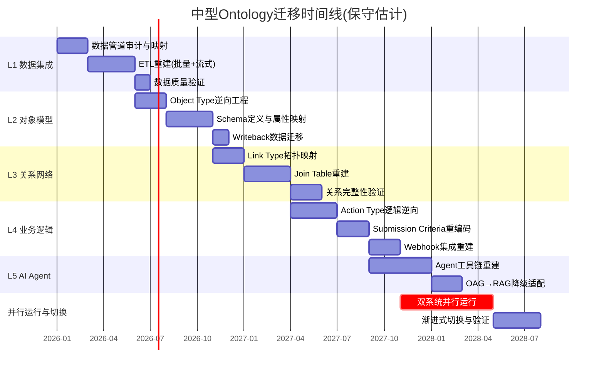
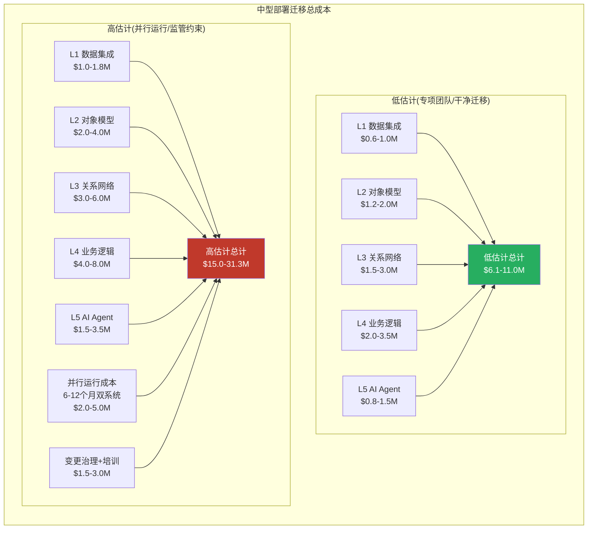
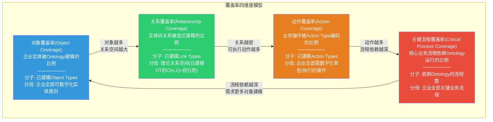
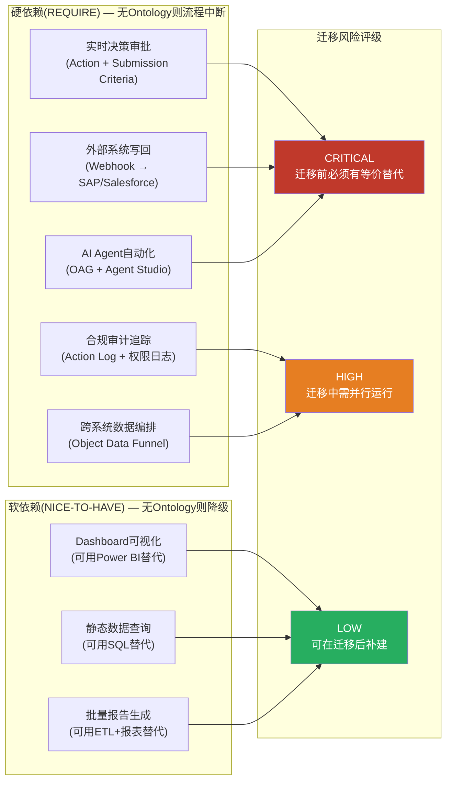

## 1C. 迁移成本"世界观重建"量化拆解

> **分析方法**: 基于1B.4六层锁定模型(L1-L6)，结合ERP迁移行业基准数据、竞品能力差距分析和Palantir公开部署规模推算。
> **假设场景**: 中型部署——50-100个Object Types，200+个Link Types，100+个Action Types，500+终端用户，已运行18-36个月。

### 1C.1 逐层迁移成本拆解

六层锁定模型中，每一层的迁移不仅有直接重建成本，还有**跨层依赖传导成本**——L3关系网络的重建依赖L2对象模型先完成，L4业务逻辑依赖L3关系拓扑已就绪。这意味着迁移不可并行化，必须按序执行。

#### L1: 数据集成层 — 中等难度，有成熟替代

| 维度 | 估算 | 依据 |
|------|------|------|
| **范围** | 30-80个数据管道(批量+流式) | [合理推断: 50-100个Object Types通常对应30-80个独立数据源] |
| **人天** | 600-1,200人天 | [合理推断: 每条管道含ETL+Schema映射+质量验证约15-20人天] |
| **工具替代** | Databricks+Airflow / Azure Data Factory | [硬数据: Databricks与Palantir 2025年3月宣布战略合作，说明数据层已有互操作性] |
| **风险** | 低-中: 数据丢失风险可控，但流式管道延迟可能增加 | — |
| **时间线** | 4-6个月 | — |

L1是六层中**唯一有成熟替代方案**的层级。Foundry的数据管道本质上是Apache Spark + 自研编排器，Databricks/Airflow组合可以在功能层面覆盖绝大部分需求。但Foundry管道中嵌入的增量索引逻辑(默认1秒checkpoint)和Object Data Funnel的编排语义需要在目标平台重新实现。[合理推断: 流式管道的迁移复杂度约为批量管道的2-3倍]

#### L2: 对象模型层 — 高难度，需逆向工程

| 维度 | 估算 | 依据 |
|------|------|------|
| **范围** | 50-100个Object Types，每个含20-50个Properties | [合理推断: 行业基准，成熟部署通常达此规模] |
| **人天** | 1,500-3,000人天 | [合理推断: 每个Object Type含Schema定义+属性映射+约束条件+历史版本兼容，约30-40人天] |
| **核心挑战** | Schema演化历史不可导出——数百次schema version在新平台上需扁平化 | [硬数据: Palantir文档确认schema迁移限制500次/批] |
| **Writeback风险** | 用户编辑数据(Writeback Datasets)需逐Object Type导出合并 | [硬数据: Writeback与Backing Datasource分离存储] |
| **时间线** | 5-8个月(与L1部分并行) | — |

L2的隐性成本在于**Schema演化历史的丧失**。一个运行2年的Object Type可能经历了20-50次属性变更，每次变更都有对应的Writeback迁移策略。在新平台上，这些历史版本被扁平化为一个最终状态——但依赖历史版本的审计报告和合规追溯将永久断裂。[合理推断: 对于受监管行业(金融/国防)，这一成本可能等同于项目否决条件]

#### L3: 关系网络层 — 极高难度，指数级复杂度

| 维度 | 估算 | 依据 |
|------|------|------|
| **范围** | 200-500个Link Types，含Many-to-Many独立Join Tables | [合理推断: 50-100个Object Types的关系组合空间为O(n^2)，实际建模约覆盖20-40%] |
| **人天** | 2,000-5,000人天 | [合理推断: 含Join Table重建+关系完整性约束+跨对象引用完整性验证] |
| **核心挑战** | 关系语义在目标平台无直接对应物——Databricks Unity Catalog和Microsoft Fabric IQ均无一等公民Link Type | [硬数据: Microsoft Fabric IQ Ontology支持Relationship但仍在Preview阶段(2025-10发布)，且需手动刷新无实时同步] |
| **Object-Backed Links** | 带元数据的关系需在新平台上用中间表模拟，丧失语义完整性 | [硬数据: Palantir Object-Backed Links是独有架构] |
| **时间线** | 5-7个月(必须在L2完成后启动) | — |

L3是迁移的**成本放大器**。关系网络的复杂度不是线性增长而是组合爆炸——50个Object Types之间的关系空间为C(50,2)=1,225种可能，实际建模200-500个已经是选择性覆盖。每个关系的迁移需要: (a)识别数据源(FK或独立Join Table)；(b)在目标平台建立等价映射；(c)验证双向遍历完整性；(d)确认关系级权限策略。[合理推断: 关系网络验证的测试用例数量约为Link Types数量的3-5倍]

#### L4: 业务逻辑层 — 极高难度，嵌入组织流程

| 维度 | 估算 | 依据 |
|------|------|------|
| **范围** | 100-300个Action Types，含Submission Criteria+Webhook写回 | [合理推断: 成熟部署中Actions约为Object Types的1.5-3倍] |
| **人天** | 2,500-6,000人天 | [合理推断: 含逻辑逆向+条件重编码+外部系统集成测试+用户培训] |
| **核心挑战** | Submission Criteria编码了企业审批流程——这些规则分散在各Action中，无统一导出 | [合理推断: 逆向工程需逐Action分析参数/规则/条件/副作用四组件] |
| **Webhook影响** | 每个写回目标(SAP/Salesforce/HTTP端点)需在新平台重建集成 | [硬数据: Palantir Webhook支持Writeback+Side Effect双模式] |
| **变更治理成本** | 500+用户的操作习惯和流程文档全部需更新 | — |
| **时间线** | 6-10个月(必须在L3完成后启动) | — |

L4是迁移中**最被低估的层级**。技术团队通常能估算L1-L3的重建工时，但L4的成本有一半是非技术性的——业务部门的流程再造、审批链路重新设计、操作手册重写、500+用户的再培训。Action Log(审计日志)的历史数据也面临迁移断裂——新平台上的审计追踪从零开始，历史决策轨迹仅作为归档存在。

#### L5: AI Agent层 — 最高难度，OAG架构无替代

| 维度 | 估算 | 依据 |
|------|------|------|
| **范围** | 10-50个AIP Agent配置，含工具绑定+权限+执行历史 | [合理推断: Agent密度与Action密度正相关] |
| **人天** | 1,000-3,000人天 | [合理推断: OAG→RAG降级需重新设计每个Agent的数据访问路径] |
| **核心挑战** | OAG依赖L2(Object Query)+L3(关系遍历)+L4(Action执行)全栈——目标平台无等价 | [硬数据: Palantir AIP Agent Studio的6种工具类型无竞品完整覆盖] |
| **降级影响** | 从结构化OAG降级为RAG意味着Agent精度和可审计性显著下降 | [合理推断: RAG的幻觉率比结构化查询高1-2个数量级] |
| **时间线** | 4-6个月(必须在L4完成后启动) | — |

#### L6: 组织知识层 — 不可迁移

L6本质上不是一个技术层——它是企业在Ontology上积累的**集体智慧的数字痕迹**: Schema演化决策的历史脉络、Action Log中数万次操作决策的模式、AI Agent执行历史中沉淀的最优响应路径。这些知识嵌入在Palantir平台的元数据、日志和模型权重中，无法作为独立资产导出。[合理推断: L6的丧失相当于组织记忆的部分截断]

### 1C.2 总成本场景估算

**成本计算基准**: 按混合团队日均成本$800-1,200(含内部工程师+外部顾问)折算。[合理推断: 基于美国企业级IT咨询市场费率，Palantir专业人才溢价约30-50%高于一般数据工程师]

| 场景 | 人天总计 | 金额范围 | 时间线 | 关键假设 |
|------|---------|----------|--------|---------|
| **低估计** | 7,600-18,200人天 | **$6.1-11.0M** | 18-24个月 | 专项迁移团队15-25人，无监管约束，可接受部分功能降级 |
| **高估计** | 12,500-29,300人天 | **$15.0-31.3M** | 24-42个月 | 并行运行6-12个月，监管要求审计连续性，功能对等迁移，含变更治理 |

**v2.0报告中的$2.5-7.5M估算仅覆盖L1-L3**。当考虑L4业务逻辑重建、L5 AI Agent降级、并行运行成本和变更治理后，实际迁移成本是初始估算的**2-4倍**。

### 1C.3 竞品迁移路径: 客户实际需要做什么

#### 路径A: 迁移至Microsoft Fabric + IQ

**Fabric IQ Ontology(2025年10月Preview)** 是Microsoft对Palantir Ontology的直接回应。基于Microsoft Learn官方文档的能力对比:

| 能力维度 | Palantir Ontology | Microsoft Fabric IQ Ontology | 差距评估 |
|---------|-------------------|------------------------------|---------|
| **对象建模** | Object Types + 2,000属性/类型 + Struct/Vector/Geo | Entity Types + Properties + 标准类型 | Fabric覆盖基础建模，复杂类型(Vector/Geo/Cipher)缺失 |
| **关系** | Link Types(一等公民) + Object-Backed Links + 独立Join Table | Relationships(支持属性+基数) | Fabric有基础关系能力，但无Object-Backed Links |
| **实时性** | 流式索引1秒checkpoint + CDC | 需手动刷新(Manual Refresh) | **根本性差距**: Fabric Ontology无实时同步 |
| **Actions(写回)** | 100+种Action Types + Submission Criteria + Webhook | Operations Agents(监控+告警触发) | **根本性差距**: Fabric无结构化Action Type框架 |
| **AI集成** | OAG(6种工具类型) + Agent Studio | Copilot + NL2Ontology查询 | Fabric偏查询，Palantir偏执行 |
| **权限** | 对象级/属性级/动作级 | OneLake数据级权限 | Palantir粒度更细 |
| **成熟度** | GA(生产部署数年) | **Public Preview**(2026年GA预计) | Fabric尚未生产就绪 |

[硬数据: Microsoft Fabric IQ Ontology文档(learn.microsoft.com/fabric/iq/ontology/overview)，2026-01-28更新]

**迁移可行性**: L1-L3可迁移(约60-70%功能覆盖)，L4-L5存在根本性架构差距。Fabric IQ的Operations Agents提供条件监控+告警触发，但无法替代Palantir的结构化Action Type(参数/规则/条件/副作用四组件模型)。**核心缺失: 没有Writeback机制意味着Fabric Ontology无法将决策写回SAP/Salesforce等外部系统**——这正是Palantir"操作层"定位的核心。

#### 路径B: 迁移至Databricks Unity Catalog

**Unity Catalog** 定位为数据治理+目录层，而非操作层。2025年3月Palantir与Databricks宣布战略合作(而非竞争)说明两者在架构栈中处于**互补而非替代**位置。[硬数据: Databricks官方新闻稿 2025-03-27]

| 能力维度 | Palantir Ontology | Databricks Unity Catalog | 差距评估 |
|---------|-------------------|--------------------------|---------|
| **数据治理** | Ontology内置治理 | 集中式目录+权限+审计+血缘 | Unity Catalog在治理层面成熟 |
| **语义建模** | Object/Link/Action三元结构 | Tables/Volumes/Models目录 | **无语义建模层**: 无Object/Link概念 |
| **操作能力** | Actions + Webhooks + 写回 | 无 | **完全缺失**: Unity Catalog是只读目录 |
| **AI集成** | OAG + Agent Studio | MLflow + Mosaic AI + AI Assistants | Databricks偏模型训练，Palantir偏模型部署 |
| **实时性** | 流式索引1秒 | Delta Live Tables(准实时) | Databricks数据层实时性强，但无Ontology实时 |

**迁移可行性**: L1可迁移(Databricks数据管道能力强)，L2-L5均需从零构建或使用自研代码替代。Unity Catalog是**数据层治理工具**，不是操作层语义平台——用它替代Palantir Ontology相当于用电话簿替代企业通讯录+审批系统+AI助手的组合。

#### 路径C: 开源组合(Apache Atlas + Airflow + 自研)

| 组件 | 开源替代 | 覆盖层级 | 限制 |
|------|---------|---------|------|
| **元数据目录** | Apache Atlas | L2(部分) | Hadoop生态绑定，UI过时，非实时，部署复杂 |
| **数据管道** | Apache Airflow + Spark | L1 | 功能等价，但缺少Foundry的增量索引语义 |
| **关系图谱** | Neo4j / JanusGraph | L3(部分) | 可建模关系，但无内置权限/Action集成 |
| **业务逻辑** | 自研微服务 | L4(需全部自建) | 需6-12个月自研Action框架+审批流+审计 |
| **AI Agent** | LangChain/LlamaIndex + 自研 | L5(降级) | RAG替代OAG，精度和可审计性下降 |

[硬数据: Apache Atlas官方描述其为"Hadoop的元数据管理和治理框架"，架构优化面向Hadoop生态]

**迁移可行性**: 理论上可行，实际上相当于**自建一个简化版Palantir**。开源路径的隐性成本是**持续维护**: 10-20人的专职团队负责集成、升级、安全补丁和功能演进，年运维成本$2-4M。[合理推断: 基于类似规模开源数据平台的维护团队基准]

### 1C.4 ERP迁移历史类比

Ontology迁移的最佳历史类比是**ERP系统迁移**(SAP→Oracle、Oracle→SAP等)——两者都涉及深度嵌入组织流程的企业级平台替换。

| 维度 | ERP迁移(SAP S/4HANA) | Ontology迁移 | 对比 |
|------|---------------------|-------------|------|
| **项目周期** | 小型1-1.5年，大型2-3年 [硬数据: SAP官方指导] | 中型18-42个月(本文估算) | **量级相当** |
| **预算超支率** | ~60%项目延期超预算 [硬数据: 2026年2月The Register报道，200名高管调查] | 无行业数据(市场太新) | ERP基准可参考 |
| **迁移方式分布** | Brownfield 34% / Bluefield 47% / Greenfield 18% [硬数据: 同上调查] | 仅Greenfield可行(无Ontology间迁移工具) | Ontology迁移选项更少 |
| **锁定机制** | 定制化+培训+集成 | 六层递增锁定(L1-L6) | Ontology锁定层级更深 |
| **迁移驱动力** | 强制(SAP ECC 2027停止支持) | 自愿(无外部强制力) | **关键差异**: 无外力驱动=几乎不迁移 |

**核心洞察**: SAP ECC→S/4HANA是**同生态内升级**(SAP→SAP)，已有60%超预算超时。Ontology迁移是**跨生态重建**，且目标平台(Fabric IQ/Unity Catalog/开源)在操作层能力上存在根本性缺口。如果同生态迁移的失败率已达60%，跨生态迁移的难度只会更高。

更关键的是: SAP ECC→S/4HANA有明确的**外部强制力**(2027年停止支持，延期维护费+2%/年)。Ontology迁移**不存在这种外部强制力**——没有到期日，没有强制升级，没有第三方施压。在缺乏外部驱动力的情况下，企业面对$6-31M的迁移成本和18-42个月的项目周期，理性选择几乎必然是**留在Palantir并持续扩展**。[合理推断: 这是PLTR 134%净美元留存率的架构层解释]

---

## 1D. Ontology建模覆盖率评估

### 1D.1 覆盖维度定义

Ontology在企业中的嵌入深度不是均匀的——不同维度的覆盖率决定了锁定强度和迁移风险的分布。

四个维度构成**正反馈循环**: 对象覆盖率提升 → 关系空间扩大 → 可编码动作增多 → 流程依赖加深 → 需求更多对象建模。这解释了为什么Palantir部署的NRR(净收入留存率)持续>130%——覆盖率扩张是自我驱动的。[硬数据: Palantir 2024年商业客户NRR 134%]

### 1D.2 覆盖深度分层

不同覆盖深度对应不同的锁定强度和迁移难度:

| 深度层级 | 定义 | Ontology使用方式 | 锁定强度 | 迁移方案 |
|---------|------|-----------------|---------|---------|
| **浅层(Shallow)** | 数据读取 | Object查询 + Dashboard展示 | **低** | BI工具(Power BI/Tableau)可替代 |
| **中层(Medium)** | 数据+动作 | Object查询 + Action执行 + Webhook写回 | **高** | 需重建Action框架+外部集成 |
| **深层(Deep)** | 数据+动作+AI | Object/Link/Action + AIP Agent自动化 | **极高** | 需重建全栈+降级AI能力 |
| **全域(Full)** | 数据+动作+AI+自动化 | 上述全部 + Automations + OSDK外部应用 | **锁死** | 实质上等同于重建整个数字化运营平台 |

**关键判断**: 企业从浅层到全域的演进通常不是计划性的——而是**渐进渗透**。一个最初用于供应链可视化(浅层)的Ontology部署，随着用户发现Action能力而开始嵌入审批流程(中层)，再随着AIP发布而引入AI Agent自动化(深层)。每次深度跃迁都是在**用户无明确迁移风险评估**的情况下发生的。[合理推断: 这是PLTR Bootcamp→扩展GTM策略的架构层映射]

### 1D.3 依赖图谱: REQUIRE vs. NICE-TO-HAVE

将业务流程对Ontology的依赖区分为**硬依赖(REQUIRE)**和**软依赖(NICE-TO-HAVE)**，是评估迁移风险的核心方法。

**判定标准**:
- **REQUIRE**: 该流程的日常运行在技术层面调用Ontology API(Action执行/Object查询/Webhook触发)。移除Ontology后，流程在分钟级别内中断。
- **NICE-TO-HAVE**: 该流程使用Ontology提升效率但有替代路径。移除Ontology后，流程降级但不中断。

**量化估算(中型部署)**: [合理推断: 基于行业部署模式]
- 硬依赖流程占比: 30-50%(主要集中在Operations/供应链/审批)
- 软依赖流程占比: 40-50%(Dashboard/报告/查询)
- 未覆盖流程: 10-30%(仍运行在传统系统上)

**投资含义**: 硬依赖比例是衡量Ontology锁定深度的**核心指标**。当硬依赖>40%时，迁移项目的风险评级从"技术挑战"升级为"业务连续性风险"——因为迁移窗口内必须保证这些流程零中断。这直接推高了并行运行成本(双系统6-12个月，$2-5M)。

### 1D.4 变更风险清单: 系统性影响分析

在现有Ontology内部，哪些变更会产生级联影响？这个问题同时回答了"日常运维的脆弱性"和"迁移时的断裂点"。

| 变更类型 | 影响范围 | 级联效应 | 风险等级 |
|---------|---------|---------|---------|
| **删除/重命名高连接度Object Type** | 所有引用该OT的Link Types + Actions + Agents | 关系断裂 + Action失效 + Agent工具不可用 | **CRITICAL** |
| **修改Object Type主键** | 所有Link的FK映射 + Writeback数据 + Action Log引用 | 需全量Schema迁移(限500次/批) | **CRITICAL** |
| **变更Link Type基数** | 依赖该Link的所有查询 + Agent遍历逻辑 | 查询结果语义变化(一对多→多对多) | **HIGH** |
| **修改Action的Submission Criteria** | 受影响用户组的操作权限 | 流程中断(用户无法提交) | **HIGH** |
| **Webhook端点变更** | 外部系统集成 | 写回失败(但Ontology侧变更仍执行) | **MEDIUM** |
| **新增Object Type** | 无级联(向后兼容) | 仅需配置新管道和索引 | **LOW** |
| **新增属性(非必填)** | 无级联(向后兼容) | 现有查询不受影响 | **LOW** |

**高连接度Object Types**是Ontology中的"承重墙"——它们出现在最多的Link Types和Action Types中。典型的高连接度实体包括: Customer(客户)、Order(订单)、Product(产品)、Employee(员工)。[合理推断: 一个中型部署中，Top 5高连接度OT通常参与60-70%的Link Types]

**迁移映射**: 变更风险清单直接映射为迁移优先级——CRITICAL级别的OT/Link/Action必须在迁移第一阶段完成等价重建并通过回归测试，否则整个迁移窗口不可启动。这进一步压缩了迁移的时间弹性。

### 1D.5 覆盖率与估值的关系

**核心命题**: Ontology覆盖率是PLTR客户终身价值(LTV)的领先指标。

覆盖率从浅层→全域的演进路径，对应着客户ARR从初始合同到稳态支出的4-6倍扩张:
- **浅层(Year 1)**: $0.5-2M ARR(数据平台许可+少量用户)
- **中层(Year 2-3)**: $2-5M ARR(Action用户扩展+写回集成)
- **深层(Year 3-4)**: $5-15M ARR(AIP Agent + 自动化 + OSDK应用)
- **全域(Year 4+)**: $15-50M+ ARR(全组织渗透+多部门扩展)

[合理推断: 基于PLTR Top 20客户ARR分布(2024年Top 20客户平均ARR约$49M)和134% NRR逆推扩张曲线]

每个深度层级的跃迁都伴随着迁移成本的非线性跳升——从浅层的"换个BI工具"($0.5M)到全域的"重建数字化运营平台"($15-31M)。这种**成本非线性**是Ontology锁定效应的数学本质: 客户在每次深度升级时做出的是**局部最优决策**(边际收益>边际成本)，但累积效果是**全局锁定**(总迁移成本远超任何单次升级时的预期)。

---

**1C-1D小结**: Ontology迁移不是一个"换软件"的技术项目——它是一个"重建组织数字化运营逻辑"的战略工程。低估计$6-11M/18-24个月的直接成本之外，还有双系统并行运行、变更治理、用户再培训和AI能力降级等隐性成本。竞品平台(Fabric IQ/Unity Catalog/开源)在操作层(L4)和AI层(L5)存在根本性架构差距，使得"功能对等迁移"在2026年的技术现实中不可行。历史上最接近的类比——ERP迁移——60%的项目超预算超时，而那还是**同生态内升级**。跨生态的Ontology迁移在缺乏外部强制力的情况下，理性经济人的最优策略只有一个: 留下来。
