# 支柱1: Ontology锁定效应 — 架构深度拆解

> **数据来源**: Palantir官方文档(docs.palantir.com), Palantir Architecture Center, Palantir Blog, 第三方技术分析
> **撰写日期**: 2026-02-12 | **字符目标**: ~15K

---

## 1A. 官方定义与架构边界

### 1A.1 Ontology的精确定义

根据Palantir官方文档的定义:

> **"The Palantir Ontology is an operational layer for the organization. The Ontology sits on top of the digital assets integrated into the Palantir platform (datasets, virtual tables, and models) and connects them to their real-world counterparts."**
> — [Palantir Ontology Overview](https://www.palantir.com/docs/foundry/ontology/overview)

这个定义中有三个关键词需要精确理解:

**"Operational Layer"(操作层)** — 不是分析层(BI)，不是存储层(数据湖)，不是可视化层(Dashboard)。"操作"意味着Ontology的设计目标是**在数据上执行动作并影响真实业务流程**，而不仅仅是"看到"数据。这是Ontology区别于Snowflake/Databricks等分析平台的架构层级差异。

**"Sits on top of digital assets"(位于数字资产之上)** — Ontology不替代底层数据存储，而是在datasets(数据集)、virtual tables(虚拟表)、models(模型)之上构建一个语义抽象层。底层数据源可以是ERP、CRM、IoT传感器、数据湖、实时流——Ontology不关心数据的物理存储方式，只关心语义映射。

**"Connects them to their real-world counterparts"(连接到现实世界对应物)** — 这是数字孪生(Digital Twin)的核心思想。一个Ontology中的"Aircraft"对象不是一行数据库记录，而是对真实世界中一架飞机的完整数字建模——包含其属性(型号、位置、维护状态)、关系(所属航空公司、当前航班、分配机组)和可执行动作(调度、维护下线、航线变更)。

### 1A.2 Ontology在技术栈中的位置

根据[Palantir Architecture Center](https://www.palantir.com/docs/foundry/architecture-center/ontology-system)的描述，Ontology系统由三层构成:

**Language(语言层)**: 定义组织的语义模型——对象(Objects)、属性(Properties)、链接(Links)构成静态语义；动作(Actions)、自动化(Automations)、逻辑(Logic/Functions)构成动态执行能力。这一层是客户投入最大的定制层——每家企业的Ontology模型都是独特的业务知识编码。

**Engine(引擎层)**: 将Language层定义的每一个组件实体化。读侧支持高规模SQL查询、状态变更的实时订阅、为人类+AI混合团队的各种物化视图；写侧支持原子级持久事务更新、高规模批量变更、高规模流式写入、以及通过Change Data Capture(CDC)实现与外部运营系统的极低延迟镜像同步([来源: Palantir Architecture Center](https://www.palantir.com/docs/foundry/architecture-center/ontology-system))。

**Toolchain(工具链)**: 通过Ontology SDK(OSDK)将Language和Engine的能力暴露给开发者，支持TypeScript、Python、Java和OpenAPI，使开发者可以将Ontology作为后端直接调用([来源: Palantir OSDK文档](https://www.palantir.com/docs/foundry/ontology-sdk/overview))。

### 1A.3 "Operational Layer"的技术含义

"Operational Layer"不是营销话术——它在架构上有精确含义:

| 对比维度 | 分析层(BI/Analytics) | 操作层(Ontology) |
|---------|---------------------|------------------|
| 核心动词 | 看/查/报 | 看/查/报 + **做/改/执行** |
| 数据方向 | 单向读取 | **双向读写** (Read + Write-back) |
| 延迟要求 | 分钟-小时级 | **秒级** (流式索引默认1秒checkpoint) |
| 权限粒度 | 报表级/数据集级 | **对象级/属性级/动作级** |
| AI集成 | 提示词+RAG | **Ontology Augmented Generation(OAG)** |
| 外部系统交互 | 被动接收数据 | **主动写回** (Webhook → SAP/Salesforce等) |

关键技术指标([来源: Palantir Object Storage V2文档](https://www.palantir.com/docs/foundry/object-backend/overview)):
- Object Storage V2支持**数百亿级对象**(tens of billions of objects)
- 单个Action可编辑**10,000个对象**(单次原子事务)
- 流式索引延迟: **默认1秒checkpoint**，索引吞吐量限制为每对象类型2MB/s
- 单个对象类型支持最多**2,000个属性**
- 列级权限控制(column-level permissions)

这些指标说明Ontology的Engine层被设计为可处理企业级生产负载的实时系统，而非离线分析工具。

### 1A.4 建模范围: 物理资产 vs 业务概念

根据官方定义，Ontology的建模范围同时覆盖:

- **物理资产**: plants(工厂)、equipment(设备)、products(产品)
- **业务概念**: customer orders(客户订单)、financial transactions(金融交易)
- **组织实体**: personnel(人员)、departments(部门)
- **事件**: missions(任务)、incidents(事件)、alerts(告警)

这意味着Ontology不是一个特定领域的数字孪生——它是整个组织运营的数字孪生。一个大型制造企业的Ontology可能同时包含:
- 数千种设备对象(含传感器实时状态)
- 数百万条订单对象(关联客户/产品/仓库)
- 数千名员工对象(关联权限/部门/技能)
- 以及它们之间的数百万条关系链接

这种**全域建模能力**是Ontology锁定效应的核心来源——一旦企业将其完整运营模型编码进Ontology，迁移的不是一个软件工具，而是整个组织的数字化运营逻辑。

### 1A.5 与Foundry数据管道的连接

Ontology不独立存在——它嵌入在Foundry平台的数据流水线中:

**Object Data Funnel(数据漏斗)**: 核心编排微服务，负责从Foundry数据源(datasets、restricted views、streaming sources)和用户编辑(Actions)读取数据，索引到对象数据库中。Funnel确保索引数据与底层数据源的更新保持同步。支持**增量索引**(incremental indexing，默认启用)和**流式管道**(streaming pipelines)([来源: Palantir Funnel文档](https://www.palantir.com/docs/foundry/object-indexing/overview))。

**Ontology Metadata Service(OMS)**: 统管所有本体论实体的元数据定义——对象类型、链接类型、动作类型的schema定义都由OMS维护。

**Object Storage V2**: 从第一性原理重新构建的下一代对象数据库，核心改进是**分离了索引和查询的关注维度**，使系统可以更容易地水平扩展。相比V1(Phonograph)，V2支持增量索引、数百亿对象、列级权限、更高编辑吞吐量和流式数据源。

**Object Set Service(OSS)**: 处理所有读操作——搜索、过滤、聚合、加载对象，支持静态对象集和动态对象集。

### 1A.6 与AIP的关系: AI如何使用Ontology

AIP(Artificial Intelligence Platform)与Ontology的关系是PLTR估值叙事的核心——它回答"为什么Ontology在AI时代更有价值而非更容易被替代"。

根据[Palantir AIP文档](https://www.palantir.com/docs/foundry/aip/aip-features)和[Agent Studio文档](https://www.palantir.com/docs/foundry/agent-studio/tools)，AIP的技术路径是**Ontology Augmented Generation(OAG)**——区别于简单的RAG(Retrieval Augmented Generation):

AIP Agent Studio中，AI Agent可使用六种工具类型与Ontology交互:

| 工具类型 | 能力 | Ontology交互方式 |
|---------|------|-----------------|
| **Object Query** | 查询、过滤、聚合、链接遍历 | 读取对象和关系 |
| **Action** | 执行Ontology编辑(自动或需确认) | **写回对象属性/链接** |
| **Function** | 调用任意Foundry函数(含AIP Logic) | 执行业务逻辑 |
| **Command** | 触发其他Palantir应用操作 | 跨应用编排 |
| **Update App Variable** | 更新应用状态变量 | 应用层状态管理 |
| **Request Clarification** | 暂停执行请求用户输入 | 人类在环控制 |

([来源: Palantir Agent Studio Tools](https://www.palantir.com/docs/foundry/agent-studio/tools))

**工具调用模式**支持两种:
- **Prompted Tool Calling**: 将工具说明嵌入提示词，支持所有模型但限于单次顺序调用
- **Native Tool Calling**: 利用模型原生function calling能力，支持并行调用，但限于特定Palantir模型和工具类型

**投资含义**: OAG模式意味着Ontology在AI时代的价值不是被LLM替代，而是成为LLM落地企业场景的**必要基础设施**。LLM提供推理能力，Ontology提供结构化企业真相(structured ground truth)、权限控制和可审计的执行路径。企业越是依赖AI Agent做运营决策，就越需要一个可信的Ontology层作为"真相锚点"——这强化而非削弱了锁定效应。

---

## 1B. Objects / Relationships / Actions 三元结构拆解

Ontology的核心数据模型由三类一等公民(first-class citizens)构成: **Objects(对象)**、**Links(关系)**、**Actions(动作)**。官方将前两者称为**语义元素(Semantic Elements)**，将Actions称为**动能元素(Kinetic Elements)**，加上Functions和Dynamic Security共同构成完整的Ontology语言。

```mermaid
erDiagram
    OBJECT_TYPE ||--o{ OBJECT : "实例化"
    OBJECT_TYPE ||--o{ PROPERTY : "定义属性"
    OBJECT_TYPE ||--o{ LINK_TYPE : "参与关系"
    LINK_TYPE ||--o{ LINK : "实例化"
    ACTION_TYPE ||--o{ ACTION : "实例化"
    ACTION_TYPE }o--|| OBJECT_TYPE : "可修改"
    ACTION_TYPE }o--o{ SIDE_EFFECT : "触发"
    FUNCTION }o--|| OBJECT_TYPE : "读取/计算"

    OBJECT_TYPE {
        string api_name PK
        string display_name
        string primary_key
        datasource backing_source
        datasource writeback_dataset
    }

    PROPERTY {
        string api_name PK
        string base_type
        boolean required
        boolean edit_only
        string render_hint
    }

    LINK_TYPE {
        string api_name PK
        string cardinality
        string source_object_type FK
        string target_object_type FK
        datasource backing_source
    }

    ACTION_TYPE {
        string api_name PK
        parameter[] parameters
        rule[] rules
        submission_criteria[] criteria
        side_effect[] effects
    }
```

### 1B.1 Objects(对象): 语义建模的基本单元

#### 定义与结构

官方定义: **"An object type defines an entity or event in an organization."** 对象类型(Object Type)是schema定义，对象(Object)是单个实例，对象集(Object Set)是实例的集合。

类比关系数据库:
- Object Type ≈ 表(Table)
- Object ≈ 行(Row)
- Property ≈ 列(Column)
- Primary Key ≈ 主键(唯一标识每个对象实例)

([来源: Palantir Core Concepts](https://www.palantir.com/docs/foundry/ontology/core-concepts))

但Ontology对象比数据库行**丰富得多**——它携带的不仅是数据值，还有语义元数据、权限策略、可执行动作和链接关系。

#### 属性(Properties)系统

Object Storage V2支持丰富的属性基础类型([来源: Palantir Properties文档](https://www.palantir.com/docs/foundry/object-link-types/properties-overview)):

| 类别 | 支持的类型 | 投资分析意义 |
|------|-----------|-------------|
| **基础类型** | String, Integer, Short, Long, Boolean, Byte | 标准业务数据建模 |
| **浮点类型** | Float, Double, Decimal | 财务/精密计算 |
| **时间类型** | Date, Timestamp | 时序分析/审计追踪 |
| **复杂类型** | Vector, Array, Struct, Attachment | AI向量嵌入、嵌套结构 |
| **空间类型** | Geopoint, Geoshape | 地理空间分析(军事/物流) |
| **媒体类型** | Media Reference, Time Series | 多模态数据(视频/传感器曲线) |
| **安全类型** | Marking, Cipher | 分级标记/加密 |

**属性配置能力**: 值格式化、条件格式化、仅编辑属性(edit-only)、必填属性(required)、跨对象类型共享属性(shared properties)、属性聚合器(property reducers)。

**限制**: 单个对象类型最多2,000个属性；Struct类型不支持嵌套；Array不能包含null元素；Vector和Struct不能作为标题键(title key)。

#### 对象与底层数据源的绑定

这是理解Ontology锁定效应的关键机制:

每个Object Type有两个关键数据源:
1. **Backing Datasource(支撑数据源)**: 提供对象数据的主数据源，可以是批量dataset或流式数据源
2. **Writeback Dataset(回写数据集)**: 存储用户通过Actions做出的编辑。**编辑写入writeback dataset，而非原始backing datasource** — 这是一个关键的架构决策，确保用户编辑与原始数据源解耦

([来源: Palantir Allow Editing文档](https://www.palantir.com/docs/foundry/object-link-types/allow-editing))

对象的最终呈现状态 = backing datasource的数据 + writeback dataset中的编辑覆盖。有writeback权限的用户看到编辑后的最新状态，仅有backing datasource权限的用户看到未修改的原始数据。

#### 对象类型的演化(Schema Evolution)

企业的Ontology不是静态的——业务变化要求对象类型持续演化。Palantir提供了结构化的[schema迁移框架](https://www.palantir.com/docs/foundry/object-edits/schema-migrations):

**破坏性变更(Breaking Changes)**需要迁移:
- 更改属性数据类型
- 更改主键
- 更改backing datasource
- 重命名/删除有用户编辑的属性
- 更改Struct字段的数据类型

**非破坏性变更**无需迁移:
- 修改显示名称、渲染提示
- 删除从未有用户编辑的属性

**迁移选项**: Drop all edits(丢弃编辑) | Move edits(移动编辑) | Cast to new type(类型转换) | Revert migration(回退迁移)

**版本管理流程**: 用户在Ontology Manager保存schema变更 → 系统创建新schema版本 → 编排替换Funnel批量管道更新索引 → 新版本在管道完成并声明完全水合(fully hydrated)后可被查询 → 限制: 单次最多500个schema迁移。

**投资含义**: schema迁移的复杂性本身就是转换成本的一部分。企业在Ontology中积累的不仅是数据，还有**数百次schema演化的历史和对应的writeback编辑**——这些在迁移到其他平台时几乎不可能完整保留。

### 1B.2 Relationships(Links/关系): 语义网络的连接组织

#### 关系是否为一等公民?

**是的。** Link Types在Ontology中与Object Types并列，拥有独立的schema定义、独立的元数据服务(OMS管理)、独立的数据源支撑。这与传统数据库中关系仅通过外键隐式表达有本质区别。

官方定义: **"A link type is the schema definition of a relationship between two object types. A link refers to a single instance of that relationship between two objects in the same Ontology."**([来源: Palantir Link Types Overview](https://www.palantir.com/docs/foundry/object-link-types/link-types-overview))

#### 基数(Cardinality)选项

| 基数类型 | 数据支撑方式 | 示例 |
|---------|------------|------|
| **One-to-One** | 外键(FK→PK) | Aircraft ↔ Current Flight |
| **Many-to-One** | 外键(FK→PK) | Flights → Aircraft |
| **One-to-Many** | 外键(反向) | Aircraft → Flights |
| **Many-to-Many** | **独立Join Table数据源** | Students ↔ Courses |

([来源: Palantir Create Link Type文档](https://www.palantir.com/docs/foundry/object-link-types/create-link-type))

**关键架构决策**: One-to-One和Many-to-One通过对象类型自身的外键属性实现(类似传统FK→PK)；但Many-to-Many关系需要**独立的数据源支撑链接类型本身**——需要一个包含两个对象类型主键配对的join table。系统可自动生成具有正确schema的join table以加速实现。

#### 自引用关系与Object-Backed Links

**自引用关系**: 链接可以连接同类型的两个对象。例如，`Direct Report ↔ Manager`链接类型可以定义在`Employee`对象类型与自身之间——用于建模组织层级。

**Object-Backed Links(对象支撑链接)**: 扩展了Many-to-One链接类型，使用一个中间对象类型(backing object type)来存储链接元数据。要求:
- 两个端点对象类型
- 一个支撑对象类型
- 两个Many-to-One链接连接端点到支撑对象

这种设计允许在关系本身上附加属性——例如"学生选课"关系可以携带"成绩"、"学期"等元数据，而不仅仅是两个ID的配对。

**跨Ontology限制**: 不支持跨不同Ontology实例的对象链接。这意味着一个企业的所有关联数据必须在同一个Ontology中建模，进一步强化了单一Ontology的中心地位和不可替代性。

#### 关系的创建与维护模式

根据公开文档，关系的创建和维护有以下模式:

| 维护模式 | 机制 | 特点 |
|---------|------|------|
| **数据源驱动** | backing datasource中的FK/join table自动索引 | 随数据管道更新自动更新 |
| **用户编辑驱动** | 通过Action Types手动创建/修改链接 | 需writeback dataset支撑 |
| **流式驱动** | 流式数据源中的关系实时索引 | 默认1秒延迟 |

公开信息不足以确认是否存在基于规则引擎或ML模型自动生成/推断关系的机制。官方文档中未提及"computed links"或"derived links"等概念——所有链接似乎都基于数据源中明确存在的键值关系。

**投资含义**: 关系网络的复杂度随对象类型数量呈指数级增长。一个拥有50个对象类型的制造业Ontology可能有200+个链接类型，每个都有独立的数据源、基数配置和权限——这构成了迁移成本的指数级放大器。

### 1B.3 Actions(动作): 从"看数据"到"改世界"的桥梁

Actions是Ontology区别于所有BI/分析平台的核心差异化——它们赋予Ontology**写能力**，使其从被动的数据映射变为主动的决策执行引擎。

#### 定义与结构

官方定义: **"An action is a single transaction that changes the properties of one or more objects, based on user-defined logic."** Action Type是schema定义——定义一组可以一次性执行的对象/属性/链接变更，以及提交时触发的副作用行为。([来源: Palantir Action Types Overview](https://www.palantir.com/docs/foundry/action-types/overview))

Action的核心组件:

#### Submission Criteria(提交条件): 业务逻辑的编码

Submission Criteria是Ontology安全模型的关键组件——它将**业务规则**编码为**系统级执行约束**([来源: Palantir Submission Criteria文档](https://www.palantir.com/docs/foundry/action-types/submission-criteria)):

**条件类型**:
- **当前用户条件**: 基于用户ID、组成员资格(直接或继承)、Multipass属性(组织、自定义属性)
- **参数条件**: 基于传入Action的参数值，支持业务逻辑验证

**支持的运算符**: is / is not / matches / is less than / is greater than or equals(单值) | includes / includes any / is included in / each is / each is not(多值)

**具体案例**: 航空公司限制飞机调度变更——仅飞行调度员(Flight Controller)用户组成员可以提交，且飞机状态必须为"运营中(Operational)"。系统通过组成员资格验证(includes运算符) + 飞机状态确认(is运算符)的组合条件，同时确保安全性和数据完整性。

**失败信息**: 每个条件和逻辑运算符有独立的可定制失败消息，向用户解释Action为何无法提交。

#### 外部系统写回(Write-back)机制

Actions通过**Webhook**实现向外部系统的写回——这是Ontology作为"操作层"而非"分析层"的技术证明。

根据[Palantir Webhook文档](https://www.palantir.com/docs/foundry/action-types/webhooks)，Webhook在Action中有两种配置模式:

| 模式 | 行为 | 原子性保证 | 限制 |
|------|------|-----------|------|
| **Writeback(写回)** | 先执行外部请求，成功后再修改Ontology | 外部失败→Ontology不变更；但外部成功→Ontology**可能**失败 | **单个Action仅可配置一个Writeback Webhook** |
| **Side Effect(副作用)** | 先执行Ontology修改，再执行外部请求 | Ontology变更在前，外部调用在后 | 可配置多个 |

**可写回的目标系统**: Salesforce、SAP、或任何配置了HTTP端点的外部系统。本质上是HTTP请求——任何暴露REST API的系统都可以作为写回目标。

**投资分析关键发现**: Writeback模式的原子性是**不完美的**——存在"外部成功但Ontology失败"的边缘情况。这意味着PLTR在分布式事务一致性上采用的是"尽力而为"策略，而非严格的两阶段提交(2PC)。对于大多数企业场景这是可接受的，但对于金融交易等强一致性场景可能需要额外补偿逻辑。

#### Action执行日志(Audit Trail)

每个Action提交自动生成一个Action Log对象，默认捕获([来源: Palantir Action Log文档](https://www.palantir.com/docs/foundry/action-types/action-log)):

| 字段 | 内容 | 审计价值 |
|------|------|---------|
| Action RID | 唯一标识符 | 精确追踪每次操作 |
| Action Type RID | 动作类型标识 | 分类统计 |
| Action Type Version | 自增版本号 | 追踪schema变更 |
| Timestamp | UTC提交时间 | 时间线审计 |
| UserId | Multipass用户ID | **谁做的** |
| Edited Objects | 所有被修改对象的主键值 | **改了什么** |
| Summary(可选) | 自定义描述 | **为什么** |
| Parameter Values(可选) | 传入的参数值 | 操作上下文 |
| Property Values(可选) | 非Action编辑的对象属性 | 业务背景(如告警优先级) |

**关键能力**: Action Log对象类型可以自动链接到所有被该Action修改的对象；支持在Workshop中以时间线形式展示；支持多个Action Log类型的联合查询，实现跨用例/跨Ontology的完整变更可见性。

**回退机制**: 官方文档提及"Revert functionality"——能力是回退已执行的Actions。但公开信息不足以确认回退的技术实现细节——是简单的反向编辑，还是基于Action Log的状态恢复，还是更复杂的补偿事务机制。

#### Function-Backed Actions

除了基于Rules的标准Action，PLTR还支持**Function-Backed Actions**——由Ontology Edit Function支撑的Action类型([来源: Palantir Function-Backed Actions](https://www.palantir.com/docs/foundry/action-types/function-actions-getting-started)):

- Function规则不能与其他Ontology规则组合(互斥)
- 函数的所有输入自动创建为Action参数
- 支持批量执行(batched execution)
- 需要配置Edits provenance以支持Action Log

这意味着Actions的逻辑复杂度**没有上限**——任何能用TypeScript/Python编写的业务逻辑都可以作为Action的执行体，同时保留Ontology的权限控制和审计追踪。

### 1B.4 三元结构的协同效应与锁定机制

Objects、Links、Actions不是三个独立组件——它们构成一个**自我强化的复杂系统**:

**锁定层级模型**:

| 层级 | 锁定内容 | 迁移难度 | 可替代性 |
|------|---------|---------|---------|
| **L1: 数据集成** | 数据管道、ETL | 中 | 有替代(Databricks/Airflow) |
| **L2: 对象模型** | Object Types + Properties + Schema版本 | 高 | 需完全重建 |
| **L3: 关系网络** | Link Types + Join Tables + 关系语义 | **极高** | 指数级复杂度 |
| **L4: 业务逻辑** | Actions + Submission Criteria + Webhooks | **极高** | 嵌入企业流程 |
| **L5: AI Agent** | OAG工具链 + Agent配置 + 执行历史 | **最高** | 依赖L2-L4全部 |
| **L6: 组织知识** | Schema演化历史 + Action Log + 决策轨迹 | **不可迁移** | 属于企业自身 |

迁移一个成熟的Ontology实例需要重建L1-L4的全部内容，而L5-L6本质上不可迁移。v2.0报告中估算的$2.5-7.5M迁移成本主要覆盖L1-L3；如果考虑L4-L6的重建成本，实际迁移代价可能远高于此。

---

**小结**: Ontology不是一个功能(feature)，而是一个**架构范式(architectural paradigm)**。它将企业的数据资产、业务逻辑、决策流程和AI能力统一在一个语义框架下，通过Objects/Links/Actions的三元结构和六层递增的锁定机制，构建了一个迁移成本随使用深度指数增长的系统。这是PLTR在高达230x P/E下最核心的多头论据——不是"增长快"，而是"一旦嵌入就无法拔出"。

**数据诚实声明**: 以上分析基于Palantir公开文档(docs.palantir.com)和官方博客。以下方面公开信息不足以确认:
- 是否存在基于规则/ML模型自动推断的关系类型(computed/derived links)
- Action回退(Revert)的具体技术实现机制
- Object Storage V2的具体水平扩展架构细节
- 流式索引在大规模场景下的实际延迟表现
- Webhook写回失败后的自动重试/补偿策略
