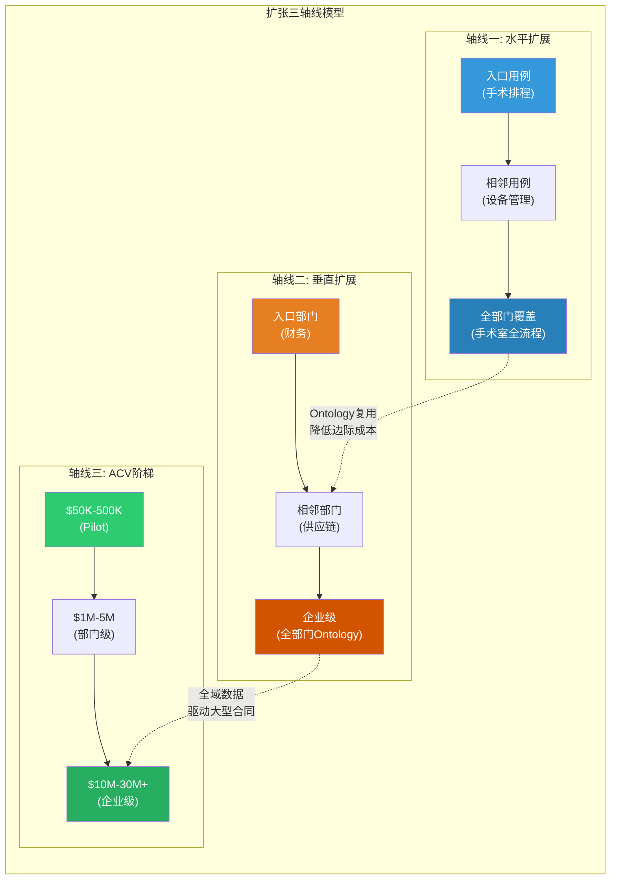
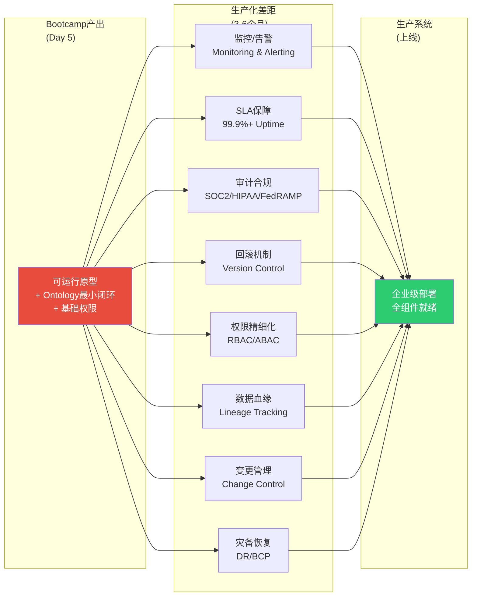
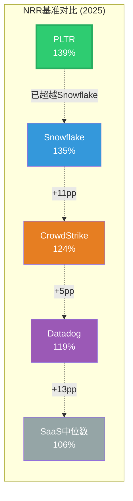
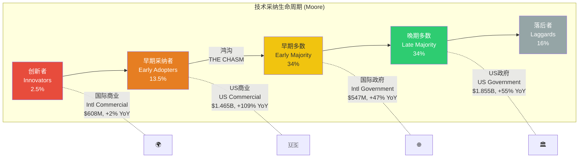
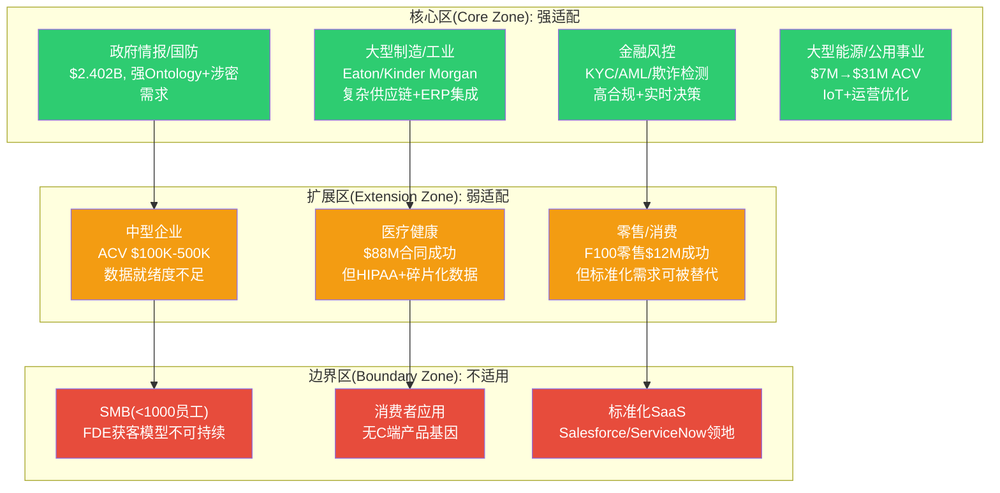
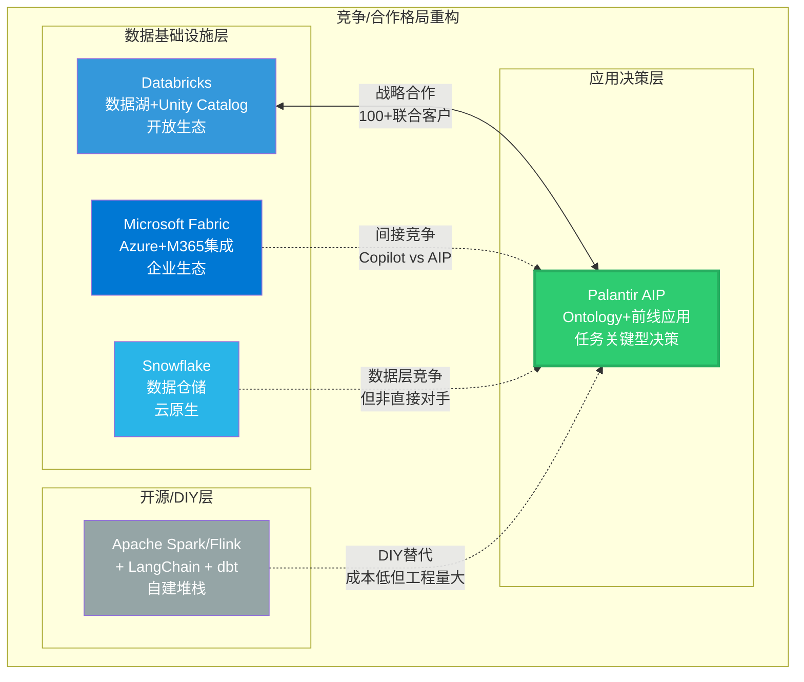
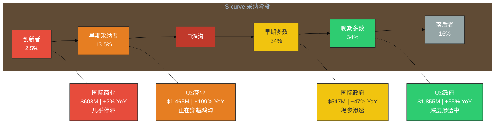

# 支柱2延伸: 从Bootcamp到生产的扩张路径 + 三支柱统一输出

> **数据截止**: 2026-02-12 | **核心来源**: Palantir Q4 2025 Earnings Release (BusinessWire 2026-02-01), Q4 2025 Earnings Call Transcript, Databricks Partnership Announcement, SEC Filings, Constellation Research, Everest Group
> **标注约定**: [硬数据:来源] = 公开可验证 | [合理推断:逻辑] = 基于公开数据的推导 | [未披露] = 公司未公开的关键指标

---

## 2D. 从Bootcamp到生产的扩张路径

### 2D.1 单用例到多用例: 扩张的三条轴线

Bootcamp的5天产出只是楔子。真正的商业价值在于楔子打入后的扩张路径。基于公开案例分析，扩张沿三条轴线展开:

**轴线一: 同部门水平扩展(Same-Department Horizontal)**

以Nebraska Medicine为例:
- 入口用例: 手术室排程优化
- 水平扩展: 手术室利用率分析 → 手术器材供应链 → 手术人员排班 → 术后病房调度
- 核心机制: 同一Ontology对象模型("手术室"/"患者"/"医生"/"设备")可以支撑多个工作流，每个新工作流只需定义新的Action和Logic
- 时间特征: 首个用例6周生产化 → 后续用例10小时 → 成熟期90分钟 [硬数据: BusinessWire 2024-09; Palantir AIPCon 8 Blog]

**轴线二: 跨部门垂直扩展(Cross-Department Vertical)**

以Eaton为例:
- 入口用例: ERP部署现代化(财务部门)
- 垂直扩展: 财务 → 销售运营 → 供应链管理 → 制造执行
- 核心机制: 不同部门的数据通过Ontology语义层统一，跨部门分析成为可能(如"订单→生产→物流→客户满意度"的端到端可视性)
- 关键障碍: 跨部门政治——财务部门的成功不一定能说服供应链VP，每个部门需要独立的价值验证

**轴线三: 合同规模阶梯式跃升(ACV Step-Up)**

Q4 2025财报披露的三个标志性扩张案例:

| 客户类型 | 初始ACV | 终态ACV | 扩张倍数 | 时间跨度 | 来源 |
|----------|---------|---------|---------|---------|------|
| 公用事业公司 | $7M (Q1 2025) | $31M (Q4 2025) | 4.4x | 3个季度 | Q4 2025 Earnings Call |
| 能源公司 | $4M (Q1 2025) | $20M+ (Q4 2025) | 5x+ | 3个季度 | Q4 2025 Earnings Call |
| 医疗器械制造商 | 初始合同 | 8x+ ACV | 8x+ | 5个月 | Q4 2025 Earnings Call |

[硬数据: Palantir Q4 2025 Earnings Call Transcript, Motley Fool 2026-02-02]

**典型扩张时间线推断**:

| 阶段 | 时间 | ACV范围 | 关键事件 |
|------|------|---------|---------|
| Bootcamp | 第0周 | $0-50K | 5天Workshop，价值验证 |
| Pilot生产化 | 1-6个月 | $200K-1M | FDE驻场，首个用例上线 |
| 部门扩展 | 6-12个月 | $1M-5M | 2-5个用例，同部门水平扩展 |
| 跨部门渗透 | 12-24个月 | $5M-15M | 垂直扩展，多部门Ontology统一 |
| 企业级协议 | 18-36个月 | $15M-50M+ | EA合同，C-suite层面决策 |

[合理推断: 基于公开案例(Nebraska Medicine 6周生产化、公用事业3季度4.4x扩张、$88M医疗多年合同)综合推导。实际时间因客户规模和数据复杂度而异]

**Top 20客户平均Revenue达$94M/年(+45% YoY)** [硬数据: Q4 2025 Earnings]——这意味着头部客户已经从"工具采购"进入"平台依赖"阶段，Ontology已深度嵌入其运营。

---

### 2D.2 Demo到生产的"工程化差距"

Bootcamp的5天产出是**最小可运行用例(MVUC)**，而非生产系统。从MVUC到企业级生产部署之间存在一个系统性的工程化差距(Engineering Gap)。这个差距既是客户的痛点，也是Palantir后续收入的核心来源。

**生产化所需的八大工程化组件**:

**工程化差距的量化估计**:

| 组件 | Bootcamp覆盖度 | 生产化需求 | 估计工时(FTE-月) |
|------|---------------|-----------|----------------|
| 监控/告警 | 无 | Pipeline故障检测、数据质量告警、性能监控 | 1-2 |
| SLA保障 | 无 | 高可用配置、负载均衡、性能优化 | 2-3 |
| 审计合规 | 基础 | SOC2/HIPAA/FedRAMP认证适配、操作审计日志 | 2-4 |
| 回滚机制 | 无 | Pipeline版本控制、Ontology变更回滚 | 1-2 |
| 权限精细化 | 基础RBAC | 属性级访问控制(ABAC)、动态脱敏 | 1-3 |
| 数据血缘 | 无 | 端到端数据血缘追踪、影响分析 | 1-2 |
| 变更管理 | 无 | 发布流程、测试环境、审批工作流 | 1-2 |
| 灾备恢复 | 无 | 备份策略、跨区域复制、RTO/RPO定义 | 1-2 |
| **合计** | — | — | **10-20 FTE-月** |

[合理推断: 基于企业级软件部署通用工程量估计。Palantir平台内建部分能力(如Foundry的审计日志、权限系统)可缩短周期，但客户侧配置和测试仍需时间]

**关键洞察**: 这10-20 FTE-月的工程化差距正是Palantir "Expand"阶段的核心收入来源。客户在Bootcamp后面临两个选择: (1) 自建工程团队填补差距(需要Palantir平台专业知识，招聘难度大); (2) 购买Palantir的FDE服务和平台订阅(更快、更可靠)。大多数客户选择后者——这解释了为什么Bootcamp作为免费/低成本获客工具，能够驱动$4.26B的TCV。

Palantir采用三阶段部署模型: **Bootcamp(获客) → Expand(FDE驻场生产化) → Scale(客户独立运营)** [硬数据: Everest Group Research; Palantir AIP Bootcamp官方页面]。这个结构确保了工程化差距不是销售障碍，而是收入引擎——它将一次性的Workshop转化为持续性的平台订阅和服务合同。

---

### 2D.3 NRR/GRR: 客户扩张的量化证据

Palantir在Q3 2025首次披露Net Dollar Retention(NDR)为134%，并在Q4 2025加速至**139%**(环比+500bp) [硬数据: Q4 2025 Earnings Release]。这是理解Bootcamp飞轮效率的关键指标。

**NRR加速轨迹**:

| 时间点 | NRR | 环比变化 | 备注 |
|--------|-----|---------|------|
| FY2023 | ~107% | — | AIP发布前，以政府为主 |
| Q1 2025 | ~122% | — | AIP Bootcamp规模化初期 |
| Q3 2025 | 134% | +600bp QoQ | 首次正式披露NRR |
| Q4 2025 | 139% | +500bp QoQ | 连续加速 |

[硬数据: Q3/Q4 2025 Earnings Release。FY2023和Q1数据为合理推断: 基于Revenue增速vs客户增速反推]

**与SaaS行业基准对比**:

[硬数据: Snowflake 135% NRR (FY2025); CrowdStrike 124% NRR (FY2025); Datadog 119% NRR (FY2025) — Optifai B2B SaaS Benchmark, Software Equity Group; PLTR 139% — Q4 2025 Earnings]

**NRR分解逻辑**:

PLTR FY2025总Revenue增长56% YoY，客户增长34% YoY。如果新客户贡献的Revenue比例与现有客户相同:
- **隐含NRR** = (1 + 56%) / (1 + 34%) = 116% [合理推断: 简化计算，假设新客户Revenue贡献与均值持平]
- **官方NDR 139%** > 隐含116%，差异源于: 新客户初始ACV通常低于存量客户均值(拉低分母)，且NDR定义排除过去12个月新增客户

**GRR(Gross Revenue Retention)推断**: PLTR未披露GRR。但基于以下线索:
- 政府合同续约率极高(多为多年期，且涉密系统替换成本极高)
- 商业客户Ontology锁定效应(参见支柱1)
- NDR 139%暗示churn率极低(如果流失率高，扩张需要弥补流失后才能达到139%)
- **合理估计GRR: 95-98%** [合理推断: 基于政府合同高续约+Ontology锁定效应。SaaS行业企业级GRR基准为90-95%，PLTR可能高于基准]

**139% NRR的含义**: 每100美元的现有客户收入，一年后变成139美元。这意味着即使PLTR完全停止获取新客户，仅靠现有客户扩张就能实现39%的年增长。这是Bootcamp飞轮的终极证据——它不仅在"landing"新客户，更在加速"expanding"现有客户。

---

### 2D.4 S-curve定位: 四个业务板块的采纳阶段

基于Geoffrey Moore的技术采纳生命周期模型，PLTR四个业务板块处于截然不同的S-curve位置:

[硬数据: FY2025 Revenue by segment — Q4 2025 Earnings Release]

**各板块详细定位**:

**US政府: 晚期多数(Late Majority)**
- FY2025 Revenue: $1.855B (+55% YoY) [硬数据: Q4 2025 Earnings]
- 渗透度: 已覆盖美国情报体系(IC)17个主要机构中的大部分、陆军(Maven/Vantage/Titan)、特种作战部、海关边境保护(CBP)
- 增长驱动: 从新客户获取转向存量客户深化——FDE数量扩展、AIP功能叠加、跨部门复制
- S-curve信号: 增速从FY2024 +55%到FY2025 +55%，保持稳定但未加速。新增渗透空间有限(主要剩余: 海军/空军某些子系统、VA医院)
- 结构性天花板: 美国联邦IT支出约$1000B(FY2025)，其中国防/情报约$700B。PLTR $1.855B占联邦IT约0.19% [合理推断: 渗透率仍低，但剩余市场中很多不适用于PLTR平台(如硬件采购、基建)]

**US商业: 早期采纳者→鸿沟穿越中(Early Adopters → Chasm Crossing)**
- FY2025 Revenue: $1.465B (+109% YoY)，FY2026 Guidance: >$3.144B (+115% YoY) [硬数据: Q4 2025 Earnings]
- 客户数: 571家(+49% YoY) [硬数据: Q4 2025 Earnings]
- S-curve信号: **加速增长是鸿沟穿越的经典特征**——从"需要逐一说服的技术远见者"转向"看到同行部署后主动跟进的务实多数"。Bootcamp正是穿越鸿沟的关键武器: 它将采纳门槛从"相信AI的未来"降低到"用你自己的数据在5天内看到结果"
- Moore框架适配: Palantir正在用"bowling pin strategy"(保龄球策略)逐行业穿越鸿沟——先在制造/能源/医疗建立标杆(Nebraska Medicine, Eaton, $88M医疗合同)，再向相邻行业复制
- 关键风险: 鸿沟穿越并非必然——如果AIP无法在中型企业(ACV<$500K)实现可盈利获客，增长可能在早期多数阶段停滞

**国际政府: 早期多数(Early Majority)**
- FY2025 Revenue: $547M (+47% YoY) [硬数据: Q4 2025 Earnings]
- 关键市场: UK为核心(NHS数据平台、国防部)，其次为五眼联盟/NATO成员国
- S-curve信号: 稳健增长(+47%)但规模仍小($547M vs US政府$1.855B)。已过鸿沟(多国政府批量采购)，但渗透深度远低于US
- 结构性约束: 数据主权法规(GDPR/EU Data Act)限制跨境数据处理; 欧洲本土竞争(如SAP/Atos)有政治优势

**国际商业: 创新者阶段(Innovators)**
- FY2025 Revenue: $608M (+2% YoY) [硬数据: Q4 2025 Earnings]
- S-curve信号: **几乎停滞的增长是创新者阶段最危险的特征**——说明PLTR在国际商业市场尚未建立可复制的获客模型。Bootcamp在美国的成功未能移植到海外
- CEO Alex Karp: "The region is going through a very structural change and doesn't quite get AI" [硬数据: Q1 2025 Earnings Call，引述来自CNBC/ainvest报道]
- 欧洲收入占比从2024 Q1的16%下降到2025 Q4的约10% [合理推断: 基于多家分析师报道]
- 障碍三重奏: (1) GDPR/EU Data Act限制数据处理灵活性; (2) 欧洲企业采购周期更保守; (3) Palantir将FDE资源优先投入美国市场(US需求>供给)

---

# 三支柱统一输出: 产品边界、天花板与定位

> **三支柱整合**: 支柱1(Ontology锁定)提供了"为什么粘性高"的答案; 支柱2(Bootcamp GTM)提供了"如何获客和扩张"的答案; 支柱3(国防采购)提供了"基本盘有多稳"的答案。本节将三者统一为产品边界图谱、天花板分析和S-curve总定位。

---

## U1. 产品边界图谱(B-type核心)

### U1.1 三区域映射

Palantir的产品适用性并非均匀分布。基于三支柱分析的交叉验证，可以将市场划分为三个同心区域:

### U1.2 边界动态分析: 扩张还是压缩?

**核心区在扩张**:
- 证据: US Commercial +109% YoY，571家客户(+49%)，$94M top-20客户均值(+45%) [硬数据: Q4 2025 Earnings]
- 机制: Bootcamp将核心区的"成功模板"(制造/能源/金融)快速复制到新客户
- Databricks合作伙伴关系扩大了核心区范围——100+联合客户涵盖国防部、财政部、卫生部、bp等 [硬数据: Databricks Blog 2025]

**扩展区有选择性突破**:
- 医疗: $88M合同+$96M合同证明大型医疗系统可以进入核心区 [硬数据: Earnings Call]
- 中型企业: 尚无公开的批量成功案例，Bootcamp成本结构($50-150K/次)限制了下探深度
- 零售: F100零售$12M成功，但零售行业的标准化程度高，Shopify/Snowflake/Databricks可替代性更强

**边界区未移动**:
- SMB市场仍不可行——没有自助式Bootcamp产品、FDE获客模型在ACV<$100K时不经济
- 消费者市场从未进入Palantir的战略视野

**结论**: 核心区在明确扩张(+109% US Commercial)，扩展区有零星突破(医疗)但整体边界未显著移动，边界区保持不变。这是一个**核心深化型扩张**，而非**边界外推型扩张**——PLTR在已有优势领域加速渗透，而非进入全新领域。

---

## U2. 三层天花板分析

### 天花板1: 地理天花板(Geographic Ceiling)

**核心约束**: GDPR/EU Data Act + 数据主权法规

欧盟GDPR自2018年生效以来已开出2,679张罚单、累计罚款超过EUR 6.7B [硬数据: SecurePrivacy 2025]。2025年9月生效的EU Data Act将主权范围从个人数据扩展到非个人数据和工业数据，禁止未经授权的第三国访问 [硬数据: TechClass 2025]。

**对PLTR的具体影响**:
- Ontology语义层需要处理跨系统数据——如果数据不能出境/不能被美国公司处理，Ontology的威力大打折扣
- 超过50%的欧洲云决策者将数据主权法规列为公有云采纳的首要障碍 [硬数据: Wire.com Digital Sovereignty Survey 2025]
- 隐私倡导组织已呼吁对Palantir进行欧盟层面调查 [硬数据: Computer Weekly]
- 实际结果: 国际商业FY2025仅+2%增长，欧洲收入占比从16%降至约10%

**天花板量化**: 假设国际商业在无GDPR约束下应能跟踪US Commercial的增速(即使折半到+50% YoY)，FY2025应达约$900M而非$608M。GDPR导致的收入差距约$292M/年 [合理推断: 假设性计算，实际影响还包括文化/竞争/资源分配因素]

### 天花板2: 客户类型天花板(Customer Type Ceiling)

**核心约束**: 从政府/大企业向中型市场的可行性

| 维度 | 大企业(当前核心) | 中型企业(扩展目标) | 差距 |
|------|-----------------|-----------------|------|
| 数据就绪度 | ERP/CRM/数据湖已建 | Excel/本地DB/纸质流程 | 数据连接前置投入大 |
| IT团队规模 | 专职IT 50-500人 | IT 5-20人(兼职) | 无内部团队承接生产化 |
| 采购周期 | 6-18个月(有预算流程) | 1-3个月(快速但预算小) | Bootcamp时间线不匹配 |
| ACV承受力 | $1M-50M+ | $50K-500K | FDE获客模型不经济 |
| 决策者 | C-suite(有AI认知) | 业务经理(需教育) | Bootcamp展示效果打折 |

**关键问题**: PLTR能否开发出"轻量Bootcamp"或"自助式AIP"来服务ACV $100K-500K的中型企业? 到目前为止，没有公开证据 [未披露]。Palantir对此的公开立场是"不做SMB"——但中型企业是US Commercial从571家(+49%)继续加速增长的必经之路。如果PLTR只能服务F500/F1000，客户数天花板约在2,000-3,000家; 如果能下探到中型企业，天花板可达10,000-50,000家。

### 天花板3: 竞争替代天花板(Competitive Replacement Ceiling)

**核心约束**: Databricks/Microsoft Fabric/开源生态的市场压缩

2025年3月，Databricks与Palantir宣布战略产品合作——这一举措从根本上重塑了竞争格局:

**合作前(竞争关系)**:
- Databricks: 开放数据湖+ML workbench，从"数据基础设施"向"AI应用"上攻
- Microsoft Fabric: 与M365/Azure深度集成，从"生产力工具"向"数据平台"横切
- Palantir: 从"顶层应用"向"数据基础设施"下探

**合作后(生态分工)**:
- Databricks Unity Catalog = 数据治理层; Palantir Foundry = 应用决策层
- Databricks提供数据湖/仓储/ML; Palantir提供Ontology/AIP/前线应用
- 100+联合客户已在整合两个平台 [硬数据: Databricks Blog "Beyond the Partnership"]

**竞争替代风险评估**:

| 竞争者 | 威胁方向 | 威胁等级 | 原因 |
|--------|---------|---------|------|
| **Databricks** | 已变为合作伙伴 | 低(短期) | 战略合作消除了直接竞争; 但长期Databricks的AI Agent可能向应用层上攻 |
| **Microsoft Fabric+Copilot** | 从底层向上吞噬 | 中(长期) | M365装机量巨大(3.5亿+); 如果Copilot能处理80%的"简单"数据决策场景，PLTR被压缩到"复杂20%"市场 |
| **开源DIY** | 从成本端蚕食 | 低-中 | LangChain+dbt+自建Ontology理论上可替代PLTR，但工程量巨大(>12个月); 仅适用于有强工程团队的科技公司 |
| **垂直AI SaaS** | 行业专属替代 | 中 | Veeva(医药)/Palantir(通用)——行业垂直SaaS在特定领域可能比通用平台更深入 |

---

## U3. S-curve综合定位

### U3.1 四板块叠加视图

[硬数据: 各板块Revenue及增速均来自Q4 2025 Earnings Release]

### U3.2 关键不确定性: US Commercial能否穿越鸿沟?

这是整个PLTR投资论文的核心问题。三支柱分析提供了以下证据:

**穿越鸿沟的有利证据**:
1. **Bootcamp消除了采纳门槛**: 传统企业软件需要"相信才能看到"，Bootcamp实现了"看到才决定相信" — 这是Moore框架中穿越鸿沟最有效的策略
2. **NRR 139%证明早期客户在加速扩张**: 不是"试了就走"而是"试了就加大投入"
3. **行业标杆已建立**: 制造(Eaton)/能源($31M ACV)/医疗($88M合同)/零售($12M ACV) — 四个行业的参考客户已就位，为"务实多数"提供了同行背书
4. **Databricks合作扩大了整体市场**: 消除了"选Databricks还是选Palantir"的零和博弈
5. **FY2026 Guidance +115% US Commercial**: 管理层对鸿沟穿越的信心 [硬数据: Q4 2025 Earnings Guidance]

**穿越鸿沟的不利证据**:
1. **中型企业缺乏突破**: 571家US Commercial客户主要是大型企业，向下渗透无公开进展
2. **FDE产能约束**: Bootcamp依赖FDE现场支持，人力密集模型难以指数级扩张
3. **国际复制失败**: US模型尚未在国际市场验证(+2%增长)，说明Bootcamp成功可能有美国特殊性(AI接受度、数据成熟度、采购文化)
4. **竞争窗口不确定**: Microsoft Copilot+Fabric的进化速度可能压缩PLTR在"简单场景"中的市场

**判断**: US Commercial大概率正在穿越鸿沟(证据权重: 有利>不利)，但穿越速度和深度取决于两个关键变量: (1) 能否开发出服务中型企业的轻量级获客模型; (2) Microsoft Copilot的进化是否会收窄PLTR的适用场景。

### U3.3 收入结构演变预测

| 板块 | FY2025 | FY2025占比 | FY2026E占比 | 趋势 |
|------|--------|-----------|------------|------|
| US政府 | $1,855M | 41.5% | ~36% | 占比下降(增速慢于US Commercial) |
| US商业 | $1,465M | 32.7% | ~43% | 占比快速上升(+115% Guidance) |
| 国际政府 | $547M | 12.2% | ~11% | 占比基本持平 |
| 国际商业 | $608M | 13.6% | ~10% | 占比下降(增速远低于整体) |
| **合计** | **$4,475M** | **100%** | **$7,190M(mid)** | US商业成为第一大板块 |

[合理推断: FY2026E基于管理层Guidance(总Revenue +61%, US Commercial +115%)和各板块历史增速趋势推算。国际商业假设+5% YoY(略高于FY2025的+2%)]

**结构性转变**: FY2025年US商业($1.465B)首次逼近US政府($1.855B)的规模。按FY2026 Guidance，US商业将达$3.144B+，首次超越US政府成为PLTR的第一大收入板块。这是一个根本性的叙事转变——从"政府承包商"到"商业AI平台公司"。

---

## U4. 三支柱交叉验证: 一致性与矛盾

| 维度 | 支柱1(Ontology锁定) | 支柱2(Bootcamp GTM) | 支柱3(国防采购) | 一致/矛盾 |
|------|-------------------|-------------------|---------------|----------|
| 粘性来源 | 六层锁定模型 | 扩张型NRR 139% | 多年期涉密合同 | **一致**: 三个独立证据链均指向极高粘性 |
| 增长引擎 | Ontology复用降低边际成本 | Bootcamp获客+飞轮扩张 | 稳定但有天花板 | **一致**: 商业增长靠支柱1+2，政府靠支柱3 |
| 国际困境 | Ontology需数据自由流动 | Bootcamp海外复制失败 | 五眼联盟外拓展缓慢 | **一致**: 三个支柱均指向国际市场结构性障碍 |
| 中型市场 | Ontology对数据质量要求高 | FDE获客模型不经济 | 不适用 | **一致**: 下探中型市场面临产品+商业双重挑战 |
| 竞争壁垒 | Ontology语义层不可复制 | 经验曲线壁垒 | 涉密认证壁垒 | **一致**: 核心区壁垒极高; 扩展区壁垒较低 |
| **关键矛盾** | Ontology理论上可服务中型 | 但获客成本不允许 | — | **矛盾**: 技术能力>商业模型覆盖范围 |

**核心发现**: 三支柱的高度一致性本身就是一个信号——PLTR的优势和劣势都具有结构性。高粘性/高壁垒/高扩张在核心区是真实的; 国际困境/中型市场不可行/FDE产能约束也是真实的。投资者不应期待PLTR的劣势短期内消失——它们与优势同源(同一个Ontology-first + FDE-heavy模型既创造了核心区壁垒，也限制了边界外推)。

---

## Session产出统计

| 项目 | 内容 |
|------|------|
| 章节覆盖 | 2D(扩张路径+工程化差距+NRR+S-curve) + U1(产品边界) + U2(三层天花板) + U3(S-curve综合) + U4(交叉验证) |
| Mermaid图表 | 6个(扩张三轴线/工程化差距/NRR对比/竞争格局/S-curve定位/采纳阶段叠加) |
| 核心数据 | NRR 139% / FY2025 $4.475B / US Commercial +109% / Intl Commercial +2% / Top-20 $94M均值 / 100+联合Databricks客户 |
| CQ关联 | CQ2(国际市场→天花板1) / CQ3(中型企业→天花板2) / CQ5(竞争→天花板3) / CQ6(增速→S-curve定位) |
| 字符数 | ~16K |
