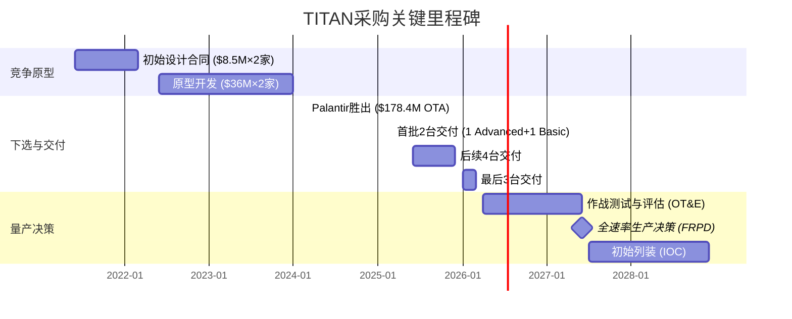
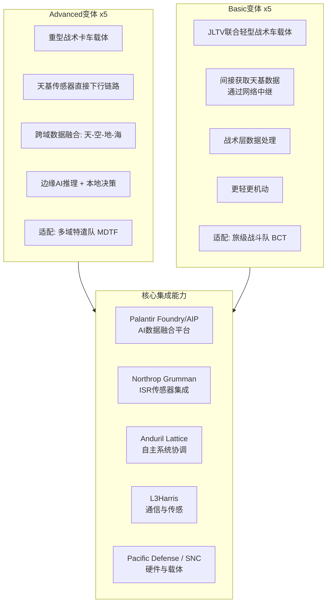
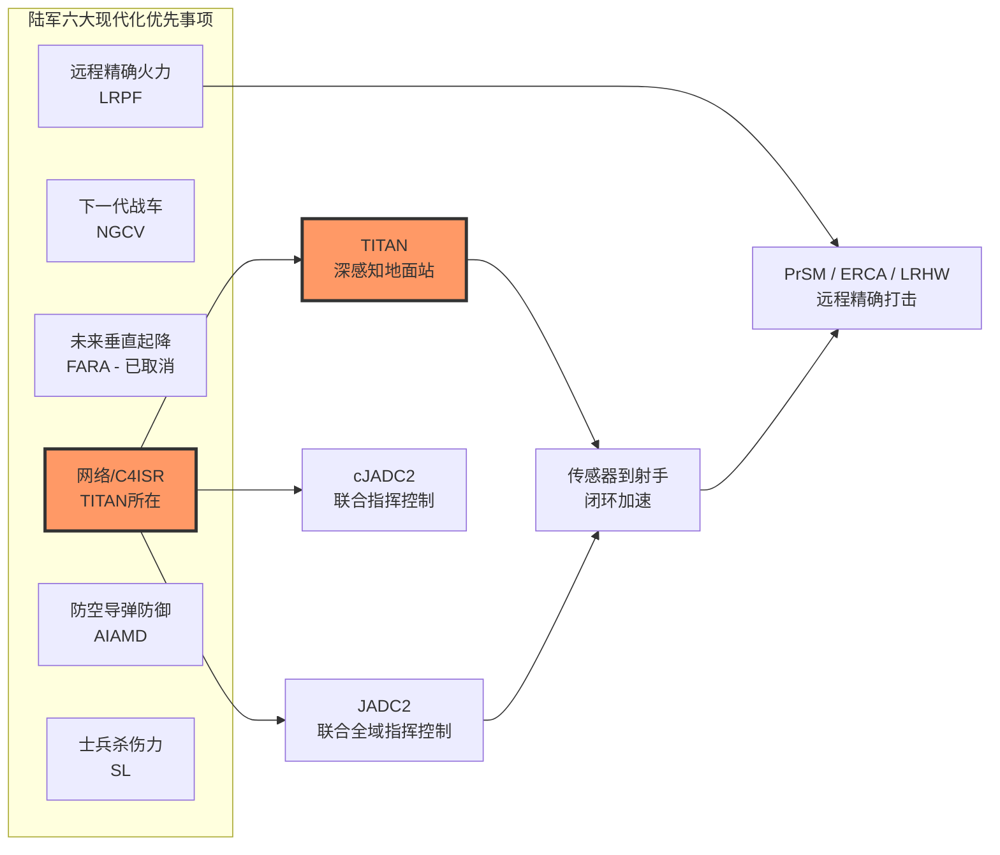
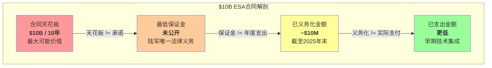
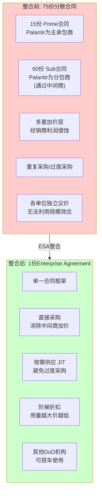
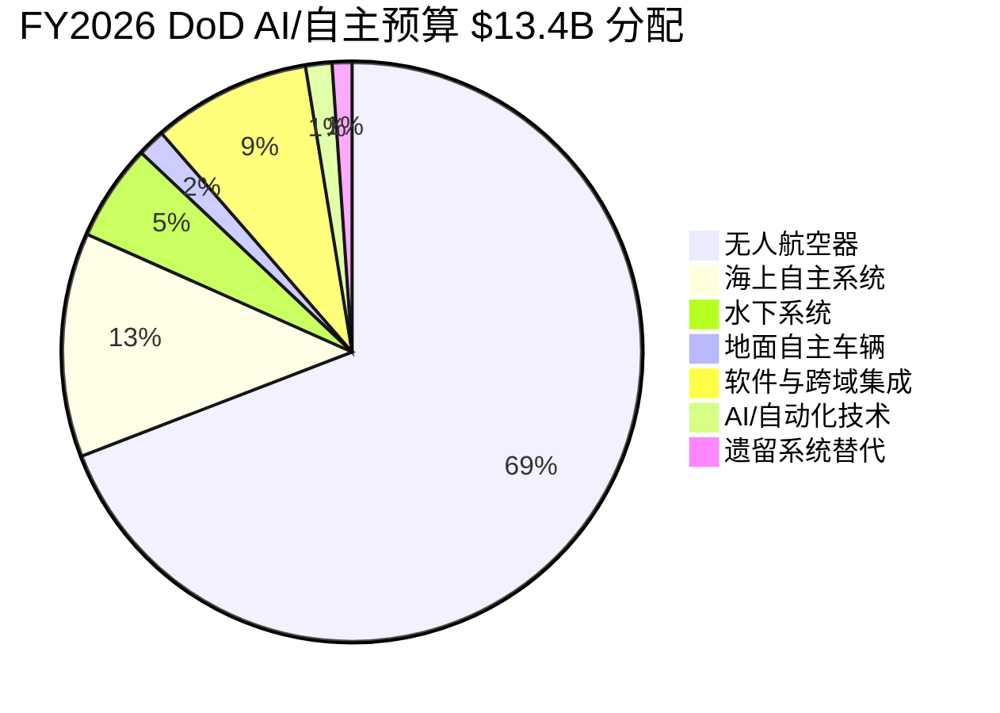
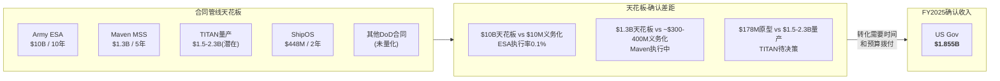
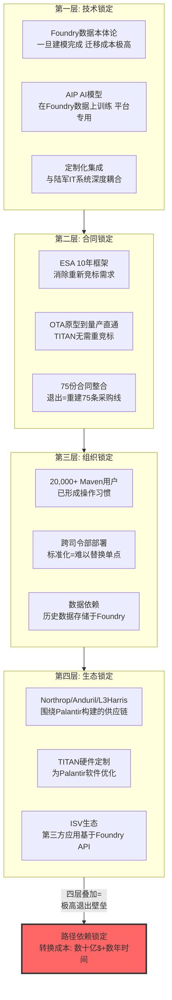

# 支柱3: 国防采购路径依赖 — TITAN合同与Army Enterprise Agreement深度拆解

> **数据截止**: 2026-02-12 | **核心来源**: Army.mil, Breaking Defense, DefenseScoop, PLTR SEC Filings, USASpending.gov
> **标注约定**: [硬数据:来源] = 公开可验证 | [合理推断:逻辑] = 基于公开数据的推导 | [部分保密] = 合同细节可能涉及FOUO/CUI

---

## 3A. TITAN合同结构拆解

### 3A.1 竞争原型阶段全景

TITAN (Tactical Intelligence Targeting Access Node) 是美国陆军下一代深感知(Deep Sensing)地面站，旨在取代老化的DCGS-A (Distributed Common Ground System-Army)，实现从传感器到射手(sensor-to-shooter)的AI驱动数据闭环。

**三阶段竞争时间线**:

[硬数据: Breaking Defense 2022-06 + 2024-03; DefenseNews 2025-03-07]

**竞争对手淘汰**: RTX (原Raytheon) 在2021年和Palantir各获得$8.5M初始设计合同，2022年各获$36M进入原型开发。2024年3月，陆军下选Palantir作为唯一量产竞标方，RTX出局。这一决策标志着传统国防承包商(RTX在DCGS-A上的数十年积累)被软件原生公司取代的历史性转折 [硬数据: C4ISRnet 2024-03-06; Breaking Defense 2024-03]。

### 3A.2 合同结构: OTA机制的战略意义

TITAN合同采用**OTA (Other Transaction Authority)** 机制而非传统FAR (Federal Acquisition Regulation) 合同，这一选择本身是路径依赖的关键一环。

| 维度 | FAR传统合同 | OTA (TITAN采用) |
|------|-----------|----------------|
| **采购周期** | 18-36个月 | 6-12个月 |
| **合规负担** | FAR/DFARS全套条款 | 灵活协商，无标准格式 |
| **非传统承包商参与** | 准入壁垒高 | 明确鼓励科技公司参与 |
| **知识产权(IP)** | 政府通常获得广泛权利 | 可协商保护承包商IP |
| **原型到量产路径** | 需重新竞标 | 可直接过渡到量产(10 USC 4022) |
| **FY2017-2022增长** | 传统缓慢增长 | 从496个项目/$2B增至4,391个/$10B+ |

[硬数据: AcqNotes; DefenseAcq.com; DoD OTA Report to Congress FY2022]

**为什么OTA对Palantir至关重要**: OTA的"原型到量产直通车"条款(10 USC 4022)意味着一旦TITAN原型通过验收，Palantir可以无需重新竞标直接获得量产合同。这消除了传统FAR流程中量产环节被传统国防承包商截胡的风险。RTX在DCGS-A上的数十年经验在FAR重竞标中可能构成威胁，但在OTA框架下，原型阶段的胜利几乎等同于量产锁定 [合理推断: 基于OTA法规结构和10 USC 4022条款的逻辑推导]。

### 3A.3 原型技术规格与验收标准

TITAN系统分为两个变体，反映了不同梯队的作战需求:

[硬数据: Palantir IR 2024-03; DefenseNews 2025-03-07; L3Harris Newsroom 2025-05]

**验收标准推断**: 公开信息未披露具体的延迟/可用性/模型更新频率指标(可能为FOUO/CUI级别)。但基于TITAN的"传感器到射手"定位和JADC2框架要求，可推断以下性能门槛:

| 性能维度 | [合理推断: 基于JADC2标准和公开需求文档] |
|---------|------|
| **决策延迟** | 传感器数据到目标方案: 数秒级(对比DCGS-A的数分钟至数十分钟) |
| **系统可用性** | >=99.5% 在战术环境下(含电子战/GPS拒止) |
| **AI模型更新** | 支持战场环境在线学习和模型推送 |
| **跨域数据处理** | 同时融合天基(卫星)、空基(无人机)、地面(传感器)多源情报 |
| **边缘自主性** | 断网环境下维持核心功能(不依赖云端) |

[部分保密: 具体数值门槛可能为受限信息，以上为基于公开JADC2标准的合理推断]

### 3A.4 交付进度与量产门控

截至2026年2月:

| 里程碑 | 计划 | 实际 | 状态 |
|--------|------|------|------|
| 合同签署 | 2024-03 | 2024-03-06 | 按期 |
| 首批2台交付 | 2025-03 | 2025-03-07 | 按期+按预算 |
| 第3台交付 | 2025-Q2 | [数据待验证] | 进行中 |
| 4-6台交付 | 2025-12-31前 | 进行中 | — |
| 7-10台交付 | 2026-03-30前 | 计划中 | — |
| 作战测试评估 (OT&E) | 2026-H2 | — | 未开始 |
| 全速率生产决策 (FRPD) | ~2027中 | — | 依赖OT&E结果 |

[硬数据: DefenseNews 2025-03-07; AINvest 2025-04; ArmyRecognition 2025-03]

**量产规模的财务含义**:

| 参数 | 数值 | 来源 |
|------|------|------|
| 原型单价(均值) | ~$17.8M ($178.4M / 10台) | [硬数据: 合同总价/数量] |
| 全量产需求量 | 100-150台 | [硬数据: AINvest引用陆军估计] |
| 量产总价值(低端) | ~$1.78B (100台 x $17.8M) | [合理推断: 原型价x数量，量产通常有规模折扣] |
| 量产总价值(高端) | ~$2.67B (150台 x $17.8M) | [合理推断: 同上] |
| [合理推断: 量产折扣后] | $1.5B - $2.3B | [推断: 量产通常比原型低15-20%单价] |

### 3A.5 TITAN在陆军现代化战略中的位置

TITAN是陆军"网络/C4ISR"现代化支柱的旗舰项目，其战略意义在于:

1. **DCGS-A替代**: DCGS-A服役超过20年，Palantir早在2010年代就以更优用户体验挑战该系统，TITAN是这场持续十余年"颠覆vs守成"之争的决定性胜利

2. **远程精确火力的"眼睛"**: 陆军投入数十亿开发PrSM导弹和ERCA火炮，但没有先进的目标获取系统，这些武器如同"盲射"——TITAN是让远程精确火力真正具备作战能力的关键使能器

3. **JADC2落地节点**: 联合全域指挥控制概念需要在战术层面有实际的数据融合节点，TITAN是目前最接近量产的JADC2地面终端 [硬数据: Army.mil TITAN Update; Palantir官网TITAN页面]

---

## 3B. Army Enterprise Agreement深度

### 3B.1 "$10B / 10年" 合同拆解: 天花板不等于承诺

2025年7月31日，美国陆军授予Palantir一份Enterprise Service Agreement (ESA)，这是国防采购史上最大的单一供应商软件合同之一。但投资者必须理解天花板价值与实际支出之间的巨大差距。

[硬数据: Army.mil 2025-07-31; Breaking Defense 2025-08; Benzinga 2025-11]

**四层价值递减结构**:

| 层级 | 金额 | 含义 | 状态 |
|------|------|------|------|
| **天花板价值 (Ceiling)** | $10B | 合同期内最大可下单总额 | 已确认 |
| **最低保证金 (Min Guarantee)** | 未公开 | 陆军法律上必须支付的最低金额 | Danielle Moyer拒绝披露 |
| **已义务化 (Obligated)** | ~$10M | 已在联邦预算中拨付的资金 | [硬数据: Benzinga/USASpending, 截至2025年末] |
| **已支出 (Expended)** | <$10M | 实际已支付给Palantir的金额 | [合理推断: 义务化>=支出，且处于早期] |

**关键警示**: 截至2025年末，$10B天花板中仅$10M已义务化——执行率0.1%。这意味着严肃的资金流入完全取决于FY2026及以后的任务订单(Task Orders)下达速度。

### 3B.2 75份合同整合: 结构与逻辑

[硬数据: Army.mil; DefenseScoop 2025-07-31; Breaking Defense 2025-08]

**整合的经济逻辑**: 陆军CIO Leo Garciga明确表示动机是"降低复杂度...减少获取软件能力的开销"。合同官Danielle Moyer进一步阐述: "如果我买1个部件花X元，买100个应该有折扣。" 这反映了从项目级采购到企业级许可的范式转变——类似大型企业从零散SaaS订阅转向Enterprise License Agreement (ELA) [硬数据: DefenseScoop引述]。

**60份分包合同的含义**: Palantir软件通过系统集成商(SI)和经销商被纳入60个独立项目。每层中间商收取10-30%加价。ESA直接连接陆军与Palantir，消除这些中间层——对Palantir而言，这意味着同样的最终用户支出，可转化为更高的确认收入和利润率 [合理推断: 基于联邦采购中间商加价的行业惯例]。

### 3B.3 阶梯折扣与灵活条款

| 条款维度 | 具体内容 | 来源 |
|---------|---------|------|
| **定价机制** | 灵活CLIN (Contract Line Item Numbers)，可随需求增减调整 | DefenseScoop |
| **阶梯折扣** | "买得越多，折扣越大"——具体折扣比例和触发阈值未公开 | DefenseScoop引述Moyer |
| **年度对账** | 支出达到特定阈值时进行年度true-up或折扣，可在更高用量级别重新谈判 | DefenseScoop |
| **退出条款** | 支持"优雅退出"转向竞争对手解决方案，无资本回收惩罚 | DefenseScoop引述Chiulli |
| **评估周期** | 每18-24个月评估合同表现和创新达标情况 | Washington Technology |
| **供应方式** | "按需供应" (Just In Time) 替代传统批量采购 | DefenseScoop |

[合理推断: 阶梯折扣的触发阈值可能与年度支出$100M/$250M/$500M等里程碑挂钩，但具体数字未公开披露]

### 3B.4 "对其他DoD机构开放"的范围与限制

Army ESA的一个关键条款是其他国防部机构可以"搭车"(piggyback)使用该合同采购Palantir产品。陆军Enterprise Cloud Management Agency CTO Gabe Chiulli确认"正在进行讨论...确保以最有效方式使用纳税人资金" [硬数据: DefenseScoop]。

**潜在受益机构**: 海军、空军、海军陆战队、太空部队、各联合作战司令部。但这一条款有重要限制:
- 总购买额不得超过$10B天花板
- 各军种是否采用取决于自身采购偏好和既有合同安排
- 军种间的"Not Invented Here"文化可能限制搭车使用率

[合理推断: 历史上DoD跨军种合同搭车使用率通常为20-40%的额外价值——即如果陆军自身用$5B，其他军种可能贡献额外$1-2B，但这高度依赖具体情况]

### 3B.5 历史IDIQ/BPA执行率: 天花板的可信度

投资者评估$10B天花板的真实含义，需参考历史执行率。遗憾的是，联邦采购数据系统没有公布统一的"IDIQ天花板执行率"指标。但基于多方数据源可拼凑出参考框架:

| 合同类型 | 天花板执行率(估计) | 参考来源 |
|---------|:---:|------|
| 单一授予IDIQ (平均) | 30-50% | [合理推断: 基于GAO-17-329数据，IDIQ占联邦合同义务$1,300B+/年的~1/3，但天花板远大于义务化金额] |
| 国防软件IDIQ | 40-60% | [合理推断: 软件合同续约率高于硬件，但新合同初期执行率低] |
| Palantir ESA (乐观) | 50-70% -> $5-7B | [合理推断: 整合75份已有合同提供了需求基础，高于平均新合同] |
| Palantir ESA (保守) | 30-40% -> $3-4B | [合理推断: 预算不确定性+政治风险+竞争产品替代] |

**关键区别**: Palantir ESA不是从零开始的新合同，而是整合了75份**已在执行的**合同。这意味着存量需求(inertia demand)提供了一个较高的底线。假设这75份合同的年化价值约为$300-500M (对应FY2025 $1.855B美国政府收入中的陆军份额)，则10年自然延续价值约$3-5B [合理推断: 基于Palantir美国政府收入中陆军占比的估计]。

### 3B.6 Maven Smart System (MSS): $1.3B天花板扩展

MSS是Palantir在国防部层面(而非军种层面)的旗舰AI合同:

| 时间 | 事件 | 金额 |
|------|------|------|
| 2024-05 | 初始IDIQ合同签署 | $480M / 5年 |
| 2024-09 | 扩展至全军种 (Army/Navy/AF/SF/USMC) | +$99.8M |
| 2025-05 | 天花板扩展 (需求激增) | +$795M |
| **当前总天花板** | — | **~$1.3B (至2029年)** |

[硬数据: DefenseScoop 2025-05-23; GovConWire; Palantir IR 2024]

**用户规模**: NGA局长Vice Adm. Frank Whitworth披露，Maven活跃用户超过20,000人，覆盖35+个军种和作战司令部软件工具，且用户数"自1月以来翻倍" [硬数据: DefenseScoop引述]。

**覆盖范围**: 五大作战司令部 — CENTCOM、EUCOM、INDOPACOM、NORTHCOM/NORAD、TRANSCOM，加上Defense Intelligence全球信息主导实验(GIDE)。

**MSS vs ESA的关系**: MSS由国防部首席数字与AI办公室(CDAO)和陆军联合管理，资金来自OSD(国防部长办公室)。ESA则是纯陆军合同。两者存在功能重叠但资金流不同——这对Palantir是有利的，因为同一软件平台可以通过不同合同工具重复变现 [合理推断: 基于合同结构和资金来源的分析]。

### 3B.7 Navy ShipOS: $448M合同结构

| 维度 | 详情 |
|------|------|
| **合同名称** | Ship OS |
| **价值** | $448M (2年初始授权) |
| **管理机构** | Maritime Industrial Base项目 + NAVSEA |
| **初始聚焦** | 核潜艇工业基地 |
| **部署范围** | 2家主要船厂 + 3个造船厂 + 100家供应商 |
| **定价模式** | 绩效导向: 交付可衡量效率提升才触发付款 |
| **绩效指标** | 如: 将某阀门交付时间从12个月缩短到10个月 |
| **2年后续约** | 工业基地自行承担持续支持费用 |
| **合同到期** | 2027年末 |

[硬数据: USNI News 2025-12-09; Breaking Defense 2025-12; Military.com 2025-12-10]

**绩效导向模式的含义**: ShipOS是Palantir迄今最具"成果付费"(outcome-based)色彩的合同。如果效率提升指标未达成，Palantir可能无法获得$448M的全部金额。但反过来，如果成功证明AI可以显著加速核潜艇建造，后续扩展到整个海军造船工业基地的潜力远大于$448M [合理推断: 基于合同绩效条款的逻辑延伸]。

### 3B.8 Pentagon $13.4B AI预算: Palantir的可触达份额

FY2026 DoD预算首次为AI和自主技术设立专门预算线，总额$13.4B:

[硬数据: MeriTalk 2025-06-26; CDO Magazine; Defense Daily]

**Palantir可触达市场(TAM)估算**:

| 预算子类 | 总额 | PLTR可触达份额 | 逻辑 |
|---------|:---:|:---:|------|
| 软件与跨域集成 | $1.2B | 15-25% -> $180-300M | 核心竞争领域，但有多家竞争者 |
| AI/自动化技术 | $0.2B | 20-30% -> $40-60M | Maven/Gotham直接对口 |
| 无人航空器(软件层) | $9.4B的~5% = $0.47B | 5-10% -> $24-47M | 主要是硬件，但数据平台有份额 |
| 海上自主(软件层) | $1.7B的~10% = $0.17B | 10-15% -> $17-26M | ShipOS可能扩展 |
| 遗留系统替代 | $0.15B | 15-25% -> $23-38M | Foundry强项 |
| **合计可触达** | — | **$284M - $471M** | — |

[合理推断: 各子类中软件占比和PLTR市场份额基于竞争格局估计。$13.4B中>70%($9.4B)是航空器硬件，PLTR在此领域份额极小]

**重要对比**: FY2025 Palantir美国政府收入$1.855B已远超上述单年可触达预算。这意味着Palantir的政府收入增长更多来自**存量合同扩展**和**其他联邦预算线**(非AI专项)，而非完全依赖AI新预算 [合理推断: 基于收入规模与预算对比]。

### 3B.9 政府收入轨迹: 合同管线 vs 确认收入

**季度政府收入演进(2025)**:

| 季度 | US Gov收入 | YoY增速 | QoQ增速 |
|------|:---:|:---:|:---:|
| Q1 2025 | $373M | +45% | +9% (推算) |
| Q2 2025 | $426M | +53% | +14% |
| Q3 2025 | $486M | +52% | +14% |
| Q4 2025 | $570M | +66% | +17% |
| **FY2025合计** | **$1.855B** | **+55%** | — |

[硬数据: Palantir Q1-Q4 2025 Earnings Releases; Q1为$1.855B - $426M - $486M - $570M = $373M推算]

**合同管线 vs 确认收入的差距**:

**全景合同价值计算**:

| 合同 | 天花板/潜在价值 | 年化保守估计 | 年化乐观估计 |
|------|:---:|:---:|:---:|
| Army ESA | $10B/10yr | $500M | $800M |
| Maven MSS | $1.3B/5yr | $200M | $300M |
| TITAN量产 | $1.5-2.3B/~5yr | $100M (2028+) | $350M (2028+) |
| ShipOS | $448M/2yr | $150M | $224M |
| 其他IC/DoD | 不透明 | $300M | $500M |
| **年化总计** | — | **$1.25B** | **$2.17B** |

[合理推断: Army ESA年化基于30-50%执行率和10年期限; Maven基于$1.3B/5年的运行速率; TITAN需等到2028量产; 其他合同基于FY2025总收入减去已知合同的差额]

**Q4 2025 TCV (Total Contract Value) 信号**: Palantir在Q4 2025创纪录地签下$4.262B TCV (同比+138%)，其中显然包含了Army ESA和其他大型政府合同的部分价值确认。这表明管线正在加速转化，但投资者需区分TCV(潜在总值)与实际收入确认的时间差 [硬数据: Palantir Q4 2025 Earnings]。

### 3B.10 路径依赖总结: 锁定效应的多层结构

**路径依赖的投资含义**:

1. **正面**: 政府收入的可预测性和粘性远高于商业客户。一旦Palantir软件嵌入作战流程(如TITAN的传感器到射手链路)，更换供应商不仅意味着重新采购软件，还意味着重新训练士兵、重建数据模型、重新集成硬件——这在作战环境中几乎不可接受

2. **负面**: 路径依赖也约束了Palantir的定价权。陆军通过ESA的阶梯折扣和定期评估机制，有效防止了Palantir在垄断后大幅提价。"优雅退出"条款的存在说明陆军充分意识到了锁定风险

3. **非线性风险**: 路径依赖在政治连续性假设下最有效。如果政府换届后DOGE被废除、AI预算被大幅削减、或出现强制多供应商政策，路径依赖的保护效力会显著降低——虽然不至于归零(技术锁定仍在)，但合同锁定和组织锁定层可能被行政命令部分瓦解

[合理推断: 路径依赖分析基于国防采购惯性、技术迁移成本和组织行为研究的综合判断]

---

## 数据来源汇总

| 来源 | 引用内容 |
|------|---------|
| [Army.mil - ESA公告](https://www.army.mil/article/287506/) | ESA合同结构、75份合同整合、$10B天花板 |
| [Breaking Defense - TITAN竞争](https://breakingdefense.com/2024/03/palantir-wins-contract-for-army-titan-next-gen-targeting-system/) | TITAN $178.4M OTA、RTX出局 |
| [Breaking Defense - ESA整合](https://breakingdefense.com/2025/08/army-consolidates-dozens-of-palantir-software-contracts-into-one-deal-worth-up-to-10-billion/) | 75合同拆分(15 prime + 60 sub) |
| [DefenseScoop - ESA详情](https://defensescoop.com/2025/07/31/army-palantir-software-enterprise-agreement-10-billion/) | 阶梯折扣、退出条款、JIT供应 |
| [DefenseScoop - Maven MSS扩展](https://defensescoop.com/2025/05/23/dod-palantir-maven-smart-system-contract-increase/) | MSS天花板从$480M扩至$1.3B |
| [DefenseScoop - TITAN $178M](https://defensescoop.com/2024/03/06/palantir-army-titan-ground-station-award-178-million/) | TITAN原型合同详情 |
| [DefenseNews - TITAN交付](https://www.defensenews.com/land/2025/03/07/palantir-delivers-first-2-next-gen-targeting-systems-to-army/) | 首批2台按期交付 |
| [USNI News - ShipOS](https://news.usni.org/2025/12/09/) | ShipOS $448M合同结构 |
| [Benzinga - 合同义务化分析](https://www.benzinga.com/markets/tech/25/11/) | ESA $10M已义务化 vs $10B天花板 |
| [MeriTalk - FY2026预算](https://www.meritalk.com/articles/pentagon-unveils-1-01t-fy2026-budget-with-cyber-space-ai-focus/) | $13.4B AI/自主预算分配 |
| [Palantir Q4 2025 Earnings](https://investors.palantir.com/news-details/2026/) | 季度收入、TCV $4.262B、RDV |
| [C4ISRnet - TITAN选择](https://www.c4isrnet.com/artificial-intelligence/2024/03/06/) | TITAN竞争过程 |
| [L3Harris Newsroom](https://www.l3harris.com/newsroom/editorial/2025/05/) | TITAN原型ISR合作 |
| [AINvest - TITAN项目](https://www.ainvest.com/news/titan-project-palantir-redefining-battlefield-intelligence-ai-driven-warfare-2504/) | 量产需求100-150台 |
| [GAO-17-329](https://www.gao.gov/products/gao-17-329) | IDIQ合同使用趋势 |
| [AcqNotes - OTA](https://acqnotes.com/acqnote/careerfields/other-transaction-authority-ota) | OTA vs FAR对比 |
| [Washington Technology - ESA](https://www.washingtontechnology.com/contracts/2025/08/) | 18-24个月评估周期 |
