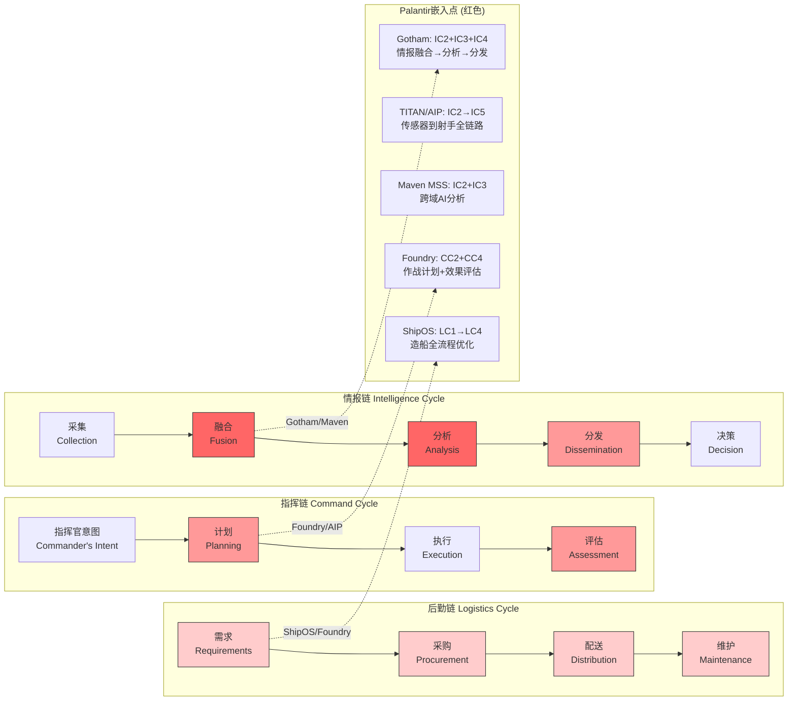
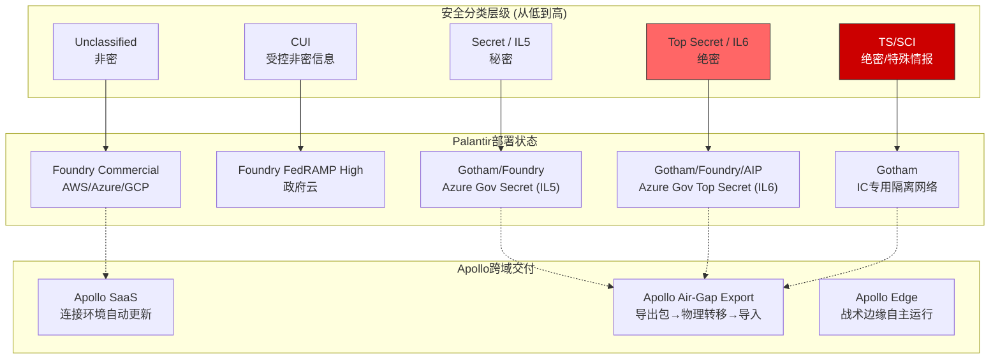
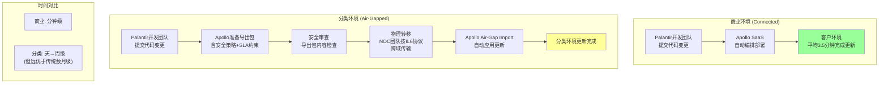
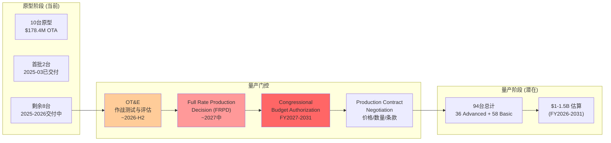
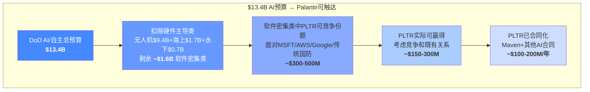

# 支柱3 (续): 体制嵌入与口径风险

> **数据截止**: 2026-02-12 | **核心来源**: Palantir Blog/IR, DefenseScoop, The Intercept, Breaking Defense, DoD CIO, GAO
> **标注约定**: [硬数据:来源] = 公开可验证 | [合理推断:逻辑] = 基于公开数据的推导 | [部分保密] = 合同细节可能涉及FOUO/CUI

---

## 3C. 体制嵌入的技术与组织接口

### 3C.1 军事决策链中的Palantir位置

Palantir并非一个单一功能的软件供应商，而是同时嵌入军事体系三条核心决策链的基础设施层。理解这一点是评估其"可替换性"的前提。

**嵌入深度评估**:

| 决策链 | 嵌入环节 | 嵌入深度 | 替换难度 | 代表产品/合同 |
|--------|---------|---------|---------|-------------|
| **情报链** | 融合+分析+分发 | 极深 | 极高 | Gotham (20年积累), Maven MSS ($1.3B), TITAN |
| **指挥链** | 计划+评估 | 深 | 高 | Foundry/AIP, JADC2节点 |
| **后勤链** | 全流程 | 中 | 中 | ShipOS ($448M), 但仅限海军造船 |

情报链是Palantir嵌入最深的领域。Gotham自2008年部署以来，已成为IC (Intelligence Community) 多个机构的核心分析工具。Maven MSS将这一能力从单一机构扩展到跨军种——20,000+活跃用户覆盖35+个军种和作战司令部工具，且用户数"自2025年1月以来翻倍" [硬数据: DefenseScoop引述NGA局长Vice Adm. Frank Whitworth]。

关键在于: Palantir不只是提供"一个应用"，而是作为数据融合的基础设施层存在。当传感器数据进入系统、经过清洗/融合/分析/产生决策建议的全过程都在Palantir平台上完成时，替换Palantir意味着替换整条数据管线——这在作战节奏下几乎不可接受 [合理推断: 基于情报链运行时依赖性分析]。

### 3C.2 多安全域运行: 从非密到绝密

Palantir的差异化壁垒之一是其软件在多个安全分类级别上同时运行的能力。美国国防/情报体系的安全分类构成了一个严格的层级结构:

[硬数据: Palantir Blog "How Palantir Meets IL6 Security Requirements with Apollo"; Palantir-Microsoft 2024年8月联合公告 — Foundry/Gotham/Apollo/AIP部署至Azure Government Secret和Top Secret云]

**跨域数据流的关键挑战**: 不同分类级别之间的数据流动受到严格的物理和逻辑隔离控制。Palantir的解决方案包括:

1. **分级访问控制**: Gotham在对象属性级别实施访问限制——一栋建筑的地址可能是Secret级，而其功能描述可能是TS/SCI级。同一数据对象的不同属性可在不同安全域中选择性暴露 [硬数据: Palantir Gotham Service Definition Document, UK G-Cloud-14]

2. **时限访问窗口**: 访问权限可设置时间限制，确保临时授权不会永久留存

3. **审计追踪**: 每一次数据访问、查询、导出操作都生成不可篡改的审计日志，对接军方责任链体系

**DDIL (断联/拒止/间歇性)环境能力**: 在大国冲突场景下(如台海危机)，前线部队可能面临通信被干扰或完全切断的局面。DDIL不再是偶发情况，而是"许多作战行动的默认环境" [硬数据: FedTech Magazine 2025-03]。TITAN的Advanced变体和Gotham的边缘部署版本专为此设计:

- **本地AI推理**: 在断网状态下维持核心情报融合和目标建议能力
- **存储转发**: 恢复连接后自动同步积压数据
- **模型缓存**: 预加载多个AI模型，无需实时下载即可切换分析任务
- **硬件适配**: 从战术卡车(TITAN Advanced)到JLTV轻型车辆(TITAN Basic)的不同载体

[合理推断: 基于TITAN技术规格和JADC2 DDIL要求推导。具体断网持续时间和离线能力指标可能为受限信息]

### 3C.3 组织整合深度: 从"工具"到"体制"

软件产品成为体制基础设施的标志不是合同金额，而是以下四个维度的渗透程度:

**维度一: 用户规模与训练投入**

| 系统 | 已训练用户数 | 覆盖范围 | 来源 |
|------|:---:|---------|------|
| Maven MSS | 20,000+ (且翻倍中) | 35+军种/司令部工具, 3个安全域 | [硬数据: NGA局长披露] |
| Army Foundry | 160,000 (目标) | 陆军全域, 整合14个遗留系统 | [硬数据: Army-Technology.com] |
| Gotham (IC) | 数万 (未公开精确数字) | CIA, NSA, DIA, NGA等 | [合理推断: 部署超15年, IC人员基数] |
| **合计估算** | **50,000-100,000+ 活跃用户** | 跨军种+IC | [合理推断: 三个系统用户有重叠] |

每个训练完成的用户代表: 数周的专业培训时间 + 形成的操作肌肉记忆 + 基于平台的分析工作流。军事人员轮岗周期为2-3年，这意味着Palantir培训是持续性开销——但也意味着越来越多的军事人员在职业生涯中使用过Palantir，回到新岗位后会倾向于延续使用 [合理推断: 基于军事人员轮岗与技术采纳惯性]。

**维度二: SOP (标准操作程序) 嵌入**

当军事SOP——即士兵在特定场景下必须遵循的操作步骤——直接引用特定软件平台时，该平台就从"可选工具"升级为"体制组件"。虽然美军SOP文件多为受限信息(FOUO)，但以下间接证据表明Palantir已达到SOP级嵌入:

- DCGS-A替代: TITAN正式取代DCGS-A成为陆军深感知地面站，原有引用DCGS-A的SOP将需要更新为引用TITAN/Palantir
- Maven作为Program of Record: 2023年Maven从项目转为正式采办记录(Program of Record)，这意味着相关作战程序文件将正式引用Maven系统
- "Palantir it"现象: 多方报道指出，情报分析人员在工作中使用"Palantir it"来指代"进行数据融合和情报分析"，类似于"Google it"指代搜索——这是软件品牌成为动词的最强体制化信号

[合理推断: SOP嵌入基于DCGS-A替代逻辑和Maven Program of Record地位推导; "Palantir it"用法来自多篇国防媒体报道中军方人员引述]

**维度三: 审计追踪与责任链**

军事行动——特别是涉及打击决策的行动——需要完整的决策追溯链(kill chain accountability)。当指挥官批准一次打击时，必须能回溯: 情报来源是什么? 谁做的分析? 依据什么数据? 何时做出的判断?

Palantir Gotham的审计日志系统直接对接这一需求:
- 每次查询、分析、标注、共享操作均有时间戳+操作者ID记录
- 日志不可回溯修改(immutable audit trail)
- 支持事后审查(post-action review)和调查(investigation)
- 这些审计记录成为军方合规体系(如LOAC法律审查)的基础数据

当审计系统与军方责任链整合后，更换平台不仅意味着技术迁移，还意味着历史审计数据的可访问性中断——这在法律和合规维度上几乎不可接受 [合理推断: 基于军事打击审计要求和Gotham审计功能描述]。

**维度四: 生态嵌入——"围绕Palantir构建"**

TITAN系统是最直观的例子: Northrop Grumman提供ISR传感器、Anduril提供Lattice自主协调、L3Harris提供通信——这些硬件厂商的集成接口都是围绕Palantir Foundry/AIP平台设计的。更换Palantir意味着这些硬件厂商也需要重新集成，形成"多米诺效应" [硬数据: 3A.3中的TITAN集成架构]。

### 3C.4 分类环境的补丁/更新机制: Apollo的关键角色

在商业环境中，软件更新是即时推送(OTA)。但在分类环境中，一次简单的安全补丁可能需要数周甚至数月才能部署——这是传统国防软件的致命弱点。Palantir的Apollo平台试图解决这一问题。

[硬数据: Palantir Apollo官网 — "平均3.5分钟完成服务更新"; Palantir Blog — Apollo IL6导出/导入流程描述; Carahsoft转载]

**Apollo的差异化**: 传统国防软件的更新周期以月甚至季度计算。每次更新需要完整的安全审查和重新认证。Apollo通过"合规感知变更管理引擎"(compliance-aware change management engine)将安全策略编码为自动化规则——一旦导出包通过物理传输到达分类环境，Apollo自动验证合规性并应用更新，无需人工逐项审查 [硬数据: Palantir Apollo文档]。

**ATO (Authority to Operate) 与 cATO**: 传统ATO流程要求每次重大软件更新都经过完整的安全认证——耗时6-18个月 [合理推断: 基于DoD ATO历史周期]。DoD正在推行cATO (continuous ATO)，即通过持续监控和DevSecOps流水线实现"持续授权"而非"周期性授权"。DoD CIO的FY2025-2026软件现代化计划明确将"增加cATO平台数量"列为关键目标 [硬数据: DoD CIO Software Modernization Implementation Plan FY25-26]。

Palantir Apollo是少数能在分类环境中实现cATO级持续交付的平台之一。如果DoD全面推行cATO，Apollo的先发优势将转化为更深的体制嵌入——因为获得cATO认证的平台天然获得了竞争壁垒，新进入者需要从零开始走完认证流程 [合理推断: 基于cATO认证壁垒和Apollo部署现状]。

---

## 3D. 口径风险与不确定性

### 3D.1 合同价值 vs 实际支出: 四层递减会计

投资者在评估Palantir政府合同时最常犯的错误是将"天花板价值"等同于"确定收入"。下图展示了四个核心合同从天花板到实际支出的递减关系:

```mermaid
graph TD
    subgraph TITAN_Waterfall["TITAN"]
        T1["天花板: $178.4M<br/>(原型阶段)"]
        T2["义务化: ~$178.4M<br/>(固定价格OTA)"]
        T3["已支出: ~$100M<br/>(6台已交付)"]
        T4["量产潜在: $1-1.5B<br/>(94台, 待FRPD)"]
        T1 --> T2 --> T3
        T1 -.->|"量产另议"| T4
    end

    subgraph ESA_Waterfall["Army ESA"]
        E1["天花板: $10B / 10年"]
        E2["义务化: ~$10M<br/>(截至2025末)"]
        E3["已支出: <$10M"]
        E4["执行率: 0.1%"]
        E1 --> E2 --> E3
        E2 -.-> E4
    end

    subgraph Maven_Waterfall["Maven MSS"]
        M1["天花板: $1.3B / 5年"]
        M2["义务化: ~$300-400M<br/>(估算, 运行中)"]
        M3["已支出: ~$200-300M"]
        M1 --> M2 --> M3
    end

    subgraph Ship_Waterfall["ShipOS"]
        S1["天花板: $448M / 2年"]
        S2["义务化: 绩效挂钩"]
        S3["已支出: 早期阶段"]
        S1 --> S2 --> S3
    end

    style E4 fill:#ff6666,stroke:#333
    style T4 fill:#ffff99,stroke:#333
```

**关键数据汇总**:

| 合同 | 天花板 | 期限 | 年化天花板 | 义务化 | 执行率 |
|------|:---:|:---:|:---:|:---:|:---:|
| Army ESA | $10B | 10年 | $1B/年 | ~$10M | 0.1% |
| Maven MSS | $1.3B | 5年 | $260M/年 | ~$300-400M (累计) | 23-31% |
| TITAN原型 | $178.4M | 2年 | $89M/年 | ~$178.4M (固定价) | ~100% |
| ShipOS | $448M | 2年 | $224M/年 | 绩效挂钩 | 待观察 |
| **合计天花板** | **~$11.9B** | — | — | — | — |

[硬数据: 各合同来源见3A-3B; Maven义务化为合理推断基于运行时间和合同扩展模式]

**投资者必须理解的层级**:

1. **天花板(Ceiling)**: 法律上允许的最大下单金额。ESA的$10B是理论上限，不是承诺
2. **义务化(Obligated)**: 已在联邦预算中拨付、法律上承诺支付的金额。只有义务化资金才具有法律约束力
3. **已支出(Expended)**: 实际已支付给承包商的金额。通常滞后于义务化
4. **年化运行速率(Run Rate)**: 近期义务化/支出的年化推算，是预测未来收入的最佳指标

**历史IDIQ执行率参考**: 联邦IDIQ合同(ESA属于此类)的天花板执行率没有官方统一数据。但基于GAO和行业分析:

| 合同类型 | 典型天花板执行率 | 来源 |
|---------|:---:|------|
| 多授予IDIQ (竞争性) | 25-40% | [合理推断: 多家中标, 订单分散] |
| 单一授予IDIQ (新合同) | 30-50% | [合理推断: GAO-17-329, IDIQ占联邦合同义务$130B+/年] |
| 单一授予IDIQ (整合既有) | 40-60% | [合理推断: ESA整合75份已有合同, 存量需求提供底线] |
| 国防软件IDIQ | 40-65% | [合理推断: 软件续约粘性高于硬件] |

ESA的关键区别: 它不是从零开始的新合同，而是整合了75份正在执行的合同。假设这些合同年化价值$300-500M(基于Palantir美国政府收入中的陆军份额)，则10年自然延续值为$3-5B，对应30-50%的天花板执行率。增量取决于新任务订单(Task Orders)的下达速度 [合理推断: 基于Palantir FY2025美国政府收入$1.855B中陆军占比估计]。

### 3D.2 原型到量产的鸿沟: TITAN案例

10台原型系统成功交付不等于100+台量产系统确定落地。从原型到量产之间存在多个关键门控:

[硬数据: DefenseScoop 2024-08 — 陆军RFI列出94台量产需求(36 Advanced + 58 Basic); 量产估值$1-1.5B来自Defense industry RFI]

**每个门控的风险评估**:

| 门控 | 时间 | 风险等级 | 关键不确定性 |
|------|------|:---:|------------|
| **OT&E** | 2026-H2 | 中 | 10台原型需在实战条件下通过验收; AI系统的可靠性和电子战环境下的性能是关键考验 |
| **FRPD** | ~2027中 | 中-高 | 即使OT&E通过, 国防部Milestone Decision Authority仍可延迟或缩减量产批次 |
| **国会预算** | FY2027-2031 | 高 | 每年预算拨款需国会批准; DOGE削减优先级、党派政治、其他优先事项均可压缩TITAN拨款 |
| **量产合同谈判** | FRPD后 | 中 | OTA"直通车"条款有利于Palantir, 但量产单价和总量仍需谈判 |

**量产价格的不确定性**: 原型阶段单价~$17.8M包含大量一次性工程成本(NRE)。量产阶段:
- 规模效应: 94台 vs 10台，硬件成本可能下降15-25%
- 但软件许可+持续维护费用不受数量影响
- 陆军RFI估算$1-1.5B / 94台 = $10.6-16.0M/台
- 对比原型阶段$17.8M，隐含10-40%的量产折扣

[合理推断: 量产价格基于陆军RFI估算和国防硬件量产折扣历史惯例]

### 3D.3 Pentagon AI预算: Palantir的实际可触达份额

FY2026 DoD预算首次设立AI和自主技术专项线，总额$13.4B。但这个数字对Palantir的含义远比表面看起来复杂:

[硬数据: MeriTalk 2025-06-26 — $13.4B AI/自主预算分配; Washington Technology — DoD $66B IT预算]

**关键洞察**: FY2025 Palantir美国政府收入$1.855B已远超AI专项预算中的可触达份额。这意味着:

1. Palantir的政府收入大部分来自**非AI专项预算线**——数据分析、情报系统、企业软件等传统IT预算
2. AI专项预算中70%($9.4B)是航空器硬件，Palantir在此份额极小
3. DoD总IT预算$66B (FY2026) 才是Palantir的真正TAM，其中AI是增长最快但非唯一的驱动力
4. 空军AI预算$415M(同比+21.7%)、海军AI预算$308M(同比+22.7%)——各军种AI投入增速远超总预算增速

[硬数据: Washington Technology — 各军种AI预算增速]

### 3D.4 DOGE与预算不确定性: 双刃剑

DOGE (Department of Government Efficiency) 对Palantir的影响是当前最具争议性的不确定性因素。2026年1月的市场反应——PLTR从高点暴跌25%——证明了这一风险的市场定价威力。

**时间线**:

| 日期 | 事件 | PLTR影响 |
|------|------|---------|
| 2025-02 | Hegseth发布8%预算削减备忘录 | 股价下跌12%单日 |
| 2025-02-24 | 各军种提交削减方案截止 | 市场焦虑持续 |
| 2025-06 | FY2026预算$961.6B(含$113B调节资金) | 部分缓解 — 总额未降 |
| 2025-H2 | Hegseth宣布$5.1B DoD合同终止/调整 | DOGE实际执行开始 |
| 2026-01-07 | 特朗普提出FY2027 $1.5T国防预算 | 方向逆转信号 |
| 2026-01-19 | DOGE裁减重创DISA(国防信息系统局) | PLTR再跌10.5% |
| 2026-01-20 | 国防数字服务(DDS)14人团队集体辞职 | 科技人才流失担忧 |

[硬数据: Breaking Defense 2025-08; The Intercept 2026-01-19; Air & Space Forces Magazine; Yahoo Finance]

**DOGE对Palantir的双向作用**:

| 维度 | 正面(效率工具提供商) | 负面(预算削减对象) |
|------|:---|:---|
| **角色定位** | DOGE正使用前Palantir员工; Palantir被传为DOGE技术供应商之一 | Palantir >50%收入来自政府, 预算削减直接影响 |
| **合同影响** | DOGE推动COTS采购替代定制系统 → 利好Palantir商业软件模式 | 390+合同被DOGE终止/调整, Palantir合同不保证豁免 |
| **IT预算** | 削减"遗留浪费"可释放资金给现代AI平台 | DISA (军方IT核心机构) 被裁减到"服务中断极端风险" |
| **人才** | DDS集体辞职 → 政府更依赖外部承包商(如Palantir) | 科技人才出走削弱政府消化AI工具的能力 |
| **长期方向** | FY2027 $1.5T预算 → 8%削减是"重新分配"非"绝对削减" | 政治不确定性: 换届后DOGE本身可能被废除 |

[硬数据: The Intercept引述DISA内部警告; NPR/FedScoop — Palantir与DOGE关系; Air & Space Forces — 8%削减细节; Nasdaq — 反面观点分析]

**核心判断**: 8%削减($50B/5年)的本质是**预算重新分配**而非绝对削减——Hegseth备忘录列出17类豁免领域(边境、核武、导弹防御、无人机)。Palantir的风险在于: 它的合同横跨豁免和非豁免领域。Maven(AI/情报)和TITAN(C4ISR现代化)更可能属于保护范围; 但Army ESA这样的大型企业软件合同可能成为"遗留IT"的替罪羊——尽管它恰恰是整合遗留合同的产物。

**政治风险定价**: PLTR 25%的跌幅中蕴含了市场对DOGE不确定性的过度反应(FY2027 $1.5T预算提案已部分抵消)，但也反映了一个结构性风险: Palantir的政府收入增长叙事高度依赖"华盛顿的政策连续性"。当这一连续性被质疑时，估值倍数首当其冲 [合理推断: 基于股价反应和政策信号的综合分析]。

---

## 数据来源汇总 (3C-3D新增)

| 来源 | 引用内容 |
|------|---------|
| [Palantir Apollo官网](https://www.palantir.com/platforms/apollo/) | Apollo部署能力, 空气隔离, 3.5分钟更新 |
| [Palantir Blog — Apollo IL6](https://blog.palantir.com/how-palantir-meets-il6-security-requirements-with-apollo-f6c3f0c51fe) | IL6安全要求, 导出/导入流程 |
| [Palantir-Microsoft联合公告](https://investors.palantir.com/news-details/2024/Palantir-and-Microsoft-Partner-to-Deliver-Enhanced-Analytics-and-AI-Services-to-Classified-Networks-for-Critical-National-Security-Operations/) | Azure Gov Secret/TS部署 |
| [DoD CIO Software Modernization Plan FY25-26](https://dodcio.defense.gov/Portals/0/Documents/Library/SW-Mod-I-Plan25-26.pdf) | cATO推行目标, DevSecOps参考设计 |
| [FedTech — DDIL环境](https://fedtechmagazine.com/article/2025/03/ddil-environments-managing-cloud-edge-computing-defense-agencies-perfcon) | DDIL是默认环境, 战术边缘计算 |
| [The Intercept — DOGE裁减DISA](https://theintercept.com/2026/01/19/doge-cuts-pentagon-it-military/) | DISA J6被裁减到"极端风险", DDS集体辞职 |
| [Air & Space Forces — Hegseth 8%](https://www.airandspaceforces.com/hegseth-reviewing-shift-8-percent-pentagon-budget/) | $50B/5年削减, 17类豁免 |
| [Breaking Defense — FY2026预算](https://breakingdefense.com/2025/06/pentagon-formally-unveils-961-6-billion-budget-for-2026-with-reconciliation-help/) | $961.6B总额含$113B调节资金 |
| [DefenseScoop — FY2027 $1.5T](https://defensescoop.com/2026/01/07/trump-calls-for-1-5-trillion-defense-budget-2027/) | 特朗普FY2027预算提案 |
| [Washington Technology — DoD IT $66B](https://www.washingtontechnology.com/opinion/2026/02/dods-66b-it-budget-pivots-ai-and-efficiency/411370/) | DoD IT总预算, 各军种AI增速 |
| [Nasdaq — 反面观点](https://www.nasdaq.com/articles/contrarian-opinion-president-trumps-pentagon-budget-reductions-will-benefit-palantir-heres) | DOGE正面论据: 削减遗留浪费利好PLTR |
| [DefenseScoop — 陆军TITAN生产RFI](https://defensescoop.com/2024/08/20/army-queries-industry-inform-titan-system-production/) | 94台量产需求, $1-1.5B估算 |
| [Palantir Gotham Service Definition](https://assets.applytosupply.digitalmarketplace.service.gov.uk/g-cloud-14/documents/92736/801146272055049-service-definition-document-2024-11-26-1253.pdf) | 属性级访问控制, 分类数据处理 |
| [GAO-17-329](https://www.gao.gov/products/gao-17-329) | IDIQ合同使用趋势和义务化数据 |
| [Army-Technology.com](https://www.army-technology.com/news/palantir-us-dod-units-ai-ml-capabilities/) | 陆军160,000用户目标, 14遗留系统整合 |
