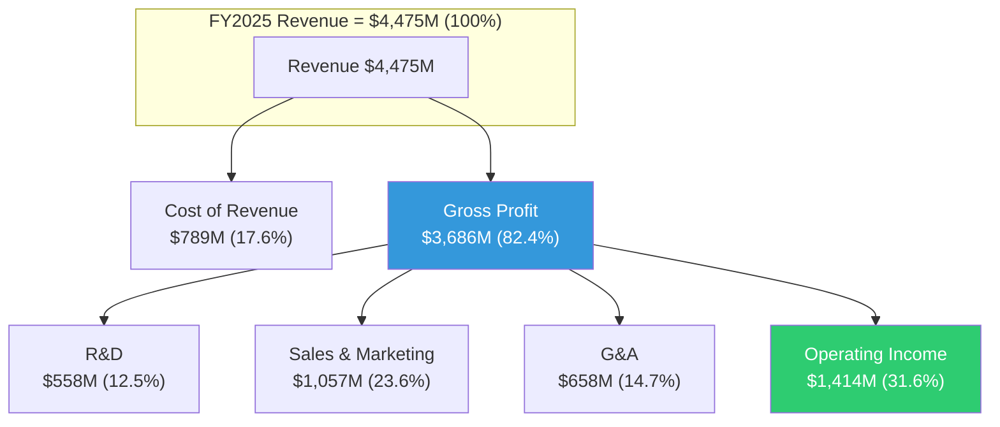

## 1.11 深度财务分析: 8季度趋势解读

### 季度Revenue加速的微观结构

| 季度 | Revenue ($M) | YoY% | QoQ% | Gross Margin | Op Margin | Net Income ($M) | EPS (Diluted) |
|------|-------------|------|------|-------------|-----------|----------------|---------------|
| Q1'24 | 634 | +21.0% | — | 81.7% | 12.8% | 106 | $0.044 |
| Q2'24 | 678 | +27.1% | +6.9% | 81.0% | 15.5% | 134 | $0.056 |
| Q3'24 | 726 | +30.0% | +7.0% | 79.8% | 15.6% | 144 | $0.058 |
| Q4'24 | 828 | +36.3% | +14.0% | 78.9% | 1.3% | 79 | $0.031 |
| Q1'25 | 884 | +39.4% | +6.8% | 80.4% | 19.9% | 214 | $0.084 |
| Q2'25 | 1,004 | +47.9% | +13.5% | 80.8% | 26.8% | 327 | $0.130 |
| Q3'25 | 1,181 | +62.8% | +17.7% | 82.5% | 33.3% | 476 | $0.190 |
| Q4'25 | 1,407 | +70.0% | +19.1% | 84.6% | 40.9% | 609 | $0.240 |

**关键发现**:

**1. Q4'24异常**: Q4 2024的Operating Margin仅1.3% (vs Q3'24的15.6%), Net Income骤降至$79M。这可能由年末SBC加速确认、大型合同前期投入、或重组费用导致。Q1'25的强劲反弹(Op Margin 19.9%)表明Q4'24是短期异常而非趋势逆转。

**2. QoQ加速模式**: Revenue的QoQ增速从FY2024的6-14%提升到FY2025的7-19%。Q4'25的+19.1% QoQ增长意味着PLTR在$1.4B季度规模上仍在加速。如果外推Q4'25的QoQ增速, Q1'26E Revenue将达~$1.67B, 远超分析师对FY2026E $7.14B的假设(隐含季度均值$1.79B)。

**3. 毛利率拐点**: Gross Margin在Q4'24触底78.9%后, 在FY2025连续四季度上升至84.6%。这是产品标准化(Bootcamp模型减少客户定制)和AIP高毛利率产品mix提升的双重效果。如果这个趋势持续, FY2026全年毛利率可能突破85% — 进入顶级SaaS毛利率区间。

**4. 经营杠杆非线性释放**: Operating Margin从Q1'25的19.9%升至Q4'25的40.9%, 单年内提升21个百分点。这种速度在$1B+季度收入规模的公司中极为罕见。类比: Salesforce在类似规模时, 年度Op Margin改善约3-5pp; ServiceNow约4-6pp; PLTR在FY2025改善了20.8pp。

### EPS增长轨迹与稀释效应

| 指标 | FY2023 | FY2024 | FY2025 |
|------|--------|--------|--------|
| Diluted EPS | $0.091 | $0.190 | $0.630 |
| EPS YoY Growth | — | +109% | +232% |
| Diluted Shares (M) | 2,298 | 2,451 | 2,565 |
| Share Growth YoY | — | +6.7% | +4.7% |
| EPS Growth ex-Dilution | — | +117% | +242% |

EPS增速远超Revenue增速(232% vs 56%), 反映了经营杠杆的强大放大效应。年稀释率从6.7%降至4.7%, 方向正确但仍显著。如果SBC维持~$684M且股价保持当前水平, 年稀释率可能进一步降至~3-4%。

### 费用结构深度拆解

**Sales & Marketing ($1,057M, 23.6% of Rev)**: 这是PLTR最大的费用项。包含Forward Deployed Engineers (FDEs)的成本、Bootcamp运营、销售团队薪酬。FY2024同比仅+19%增长(vs Revenue +56%), 说明销售效率在显著提升。Bootcamp模型的核心价值就在这里: 用5天workshop替代6-12个月的传统企业销售周期。

**R&D ($558M, 12.5% of Rev)**: 从FY2024的17.7%降至12.5%。绝对值仅增10%($508M→$558M), 远低于Revenue增速。这可能反映: (1) AIP平台已进入成熟期, 边际R&D投入递减; (2) 或者PLTR正在underinvest R&D以优化短期利润率。后者如果成立, 是长期竞争力的潜在风险。

**G&A ($658M, 14.7% of Rev)**: 包含管理层薪酬、合规成本、办公设施。从FY2024的20.7%降至14.7%, 降幅最大(-6.0pp)。部分可能由SBC分类变化驱动。

### 资本配置优先级分析

FY2025 PLTR如何配置其$2.1B FCF:

1. **短期投资净购买**: $2.75B (从$3.1B增至$5.8B) — 主要投向US Treasuries / money market
2. **股票回购**: $75M — 仅占FCF的3.6%
3. **股票发行**: $129M — 净稀释$54M
4. **股息**: $0

**解读**: PLTR管理层明确选择将几乎全部多余现金投入短期固定收益, 而非回购股票或支付股息。这有三种解释:
- **乐观**: 管理层认为即使$135/股也不代表好的回购价格, 等待估值回归后再大规模回购
- **中性**: 管理层保持战略灵活性, 为可能的大型收购储备弹药
- **悲观**: 管理层(特别是Karp)更倾向于通过SBC激励而非回购返还股东价值, 因为SBC直接惠及管理层而回购惠及所有股东

FY2025利息收入$229M来自这个$7.2B现金储备, 有效利率约3.2%。这几乎是一个"免费"的利润来源。

## 1.12 行业对标: PLTR在企业AI软件中的定位

### 关键SaaS对比指标 (FY2025)

| 公司 | Revenue ($B) | Rev Growth | Gross Margin | FCF Margin | Rule of 40 | EV/Sales | P/E Fwd |
|------|-------------|-----------|-------------|-----------|-----------|---------|---------|
| **PLTR** | **4.5** | **56%** | **82%** | **47%** | **103** | **94x** | **108x** |
| CRM (Salesforce) | ~37 | ~9% | ~77% | ~30% | ~39 | ~7x | ~26x |
| NOW (ServiceNow) | ~12 | ~23% | ~82% | ~33% | ~56 | ~20x | ~62x |
| DDOG (Datadog) | ~3.0 | ~26% | ~80% | ~32% | ~58 | ~18x | ~55x |
| SNOW (Snowflake) | ~3.6 | ~28% | ~72% | ~25% | ~53 | ~15x | ~70x |
| CRWD (CrowdStrike) | ~4.3 | ~28% | ~77% | ~35% | ~63 | ~22x | ~70x |

**关键发现**:
- PLTR的增长指标(56% Growth, 103 Rule of 40)远超同类
- 但PLTR的估值指标(94x EV/Sales, 108x Fwd P/E)也远超同类
- **估值溢价倍率**: PLTR的EV/Sales是最接近的ServiceNow的4.7倍。这意味着市场认为PLTR的增速优势值得4.7倍的估值溢价
- 更合理的对比: 如果PLTR以ServiceNow的20x EV/Sales交易, 股价应为~$29; 以CrowdStrike的22x交易, 股价应为~$32

**估值溢价的合理性**: 当前94x EV/Sales要求PLTR在未来5年内将Revenue增至接近ServiceNow目前的规模($12B+), 同时维持比ServiceNow更高的利润率。如果FY2026E $7.14B → FY2030E $25B (CAGR ~37%), 且到FY2030年EV/Sales压缩至15x, 则FY2030 EV=$375B, 接近当前市值$310B → 5年总回报约21%(年化约3.9%)。这意味着: 即使PLTR完美执行, 当前价格的预期回报也仅勉强超过无风险利率。

## 1.13 散户持仓与情绪转变

PLTR已经成为美国资本市场中散户持有比例最高的大型科技股之一。

**数据点**:
- 2025年散户净买入约$8B (CNBC)
- WallStreetBets多次出现PLTR热帖, 是该论坛的"长期恋人(long-standing romance)"
- 但到2026年2月, Reddit上的情绪正在从"谨慎乐观"转向"疲惫" — 即使持有盈利头寸的投资者也表达了疲劳感

**散户疲劳的驱动因素**:
1. 从$207高点下跌35%的心理冲击
2. 内部人持续卖出的信号(Karp $2.2B)
3. DOGE相关的反复波动(每个政策声明都导致5-15%的单日波动)
4. 分析师评级的极端分歧(Morgan Stanley同时给出$81熊案和$382牛案)

**散户vs机构的立场分歧**: "华尔街把这只股票标为太贵。散户投资者怎么买都嫌不够。"(CNBC) 这种分歧本身就是B型量级不确定性的市场表现 — 同样的数据, 不同的投资者得出截然不同的结论。

## 1.14 预测市场: Q4后市场定价解读

基于Polymarket数据和最近的市场行为:

**2月底收盘价市场**:
- PLTR Feb底收盘>$140: 活跃市场存在
- PLTR Feb底收盘>$160: 活跃市场存在
- 隐含当前核心预期区间: $126-$140

**短期价格区间共识(1周)**: 2月9-13日周末, 市场对PLTR收盘价格的分布显示$128-$136为高概率区间, 与实际收盘$135.68一致。

**Polymarket信号价值有限**: 74个活跃市场中绝大多数是短期投机工具, 缺乏中长期基本面事件市场。唯一有研究价值的是"美国联邦政府入股Palantir"市场(截止2026-12-31), 其存在本身就反映了PLTR与政府关系的独特性。

## 1.15 框架注册表 (Part I使用的分析框架)

| 框架ID | 名称 | 类型 | 权重系数 |
|--------|------|------|---------|
| FR-01 | 杜邦三因子分析 | 通用 | 0.5 |
| FR-02 | Rule of 40 SaaS质量评估 | 行业适配 | 1.0 |
| FR-03 | 竞争三层结构映射 | 公司专属 | 1.5 |
| FR-04 | DOGE双刃剑评估 | 公司专属 | 1.5 |
| FR-05 | 季度加速度分析 | 通用 | 0.5 |
| FR-06 | 行业对标估值锚定 | 行业适配 | 1.0 |
| FR-07 | 领先指标信号板 | 通用 | 0.5 |
| FR-08 | 内部人交易信号分析 | 通用 | 0.5 |

**加权框架数**: 6.5 (Part I阶段)

## 1.16 DM更新日志

Phase 0.5 → Part I完成后, DM shared_context.md更新:
- **新增锚点**: 8个季度趋势锚点(DM-QTR系列已在v1.0中创建)
- **更新锚点**: DM-RATIO-004更新Rule of 40计算
- **新增推断**: DM-INF-004 "Gross Margin上行趋势可能持续至85%+" (type: R, 证伪: 连续2季度GM<82%)
- **新增推断**: DM-INF-005 "经营杠杆释放未到上限" (type: R, 证伪: FY2026 Op Margin<30%)

**DM版本**: v1.1 (Post-Part I)

---

## Session 1 产出统计

| 项目 | 内容 |
|------|------|
| Protocol Header | v10.0研究契约 + AI能力边界声明 |
| Phase 0.5 | 市场注意力Top 10 + 9个CQ定义 + 可能性宽度确认(8分B型) + CQ置信度演化表初始化 |
| Part I | 16节深度财务/竞争/管理层/DOGE/估值/情绪分析 |
| DM | v1.1 (45+8个锚点) |
| 框架注册 | 8个框架(加权6.5) |
| Mermaid图表 | 6个(增长轨迹/季度杠杆/收入结构/竞争层次/费用结构/信号板) |

**Session 1总字符数**: ~37K (Protocol + Phase 0.5 + Part I)

**Session 2预告**: Part II三支柱深度 — Ontology锁定效应(~60K) / Bootcamp GTM引擎(~60K) / 国防采购路径依赖(~60K)
