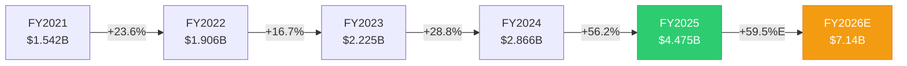
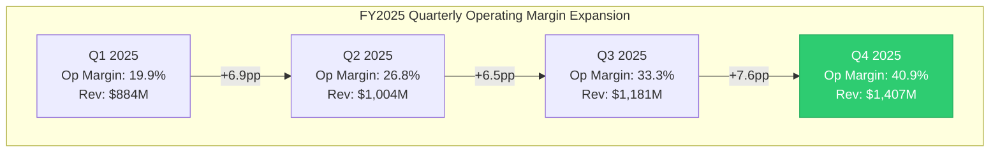
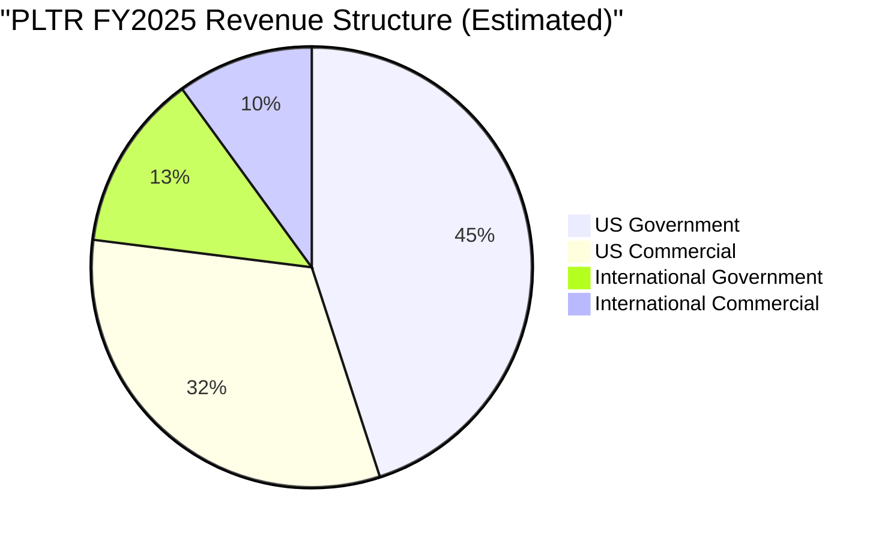
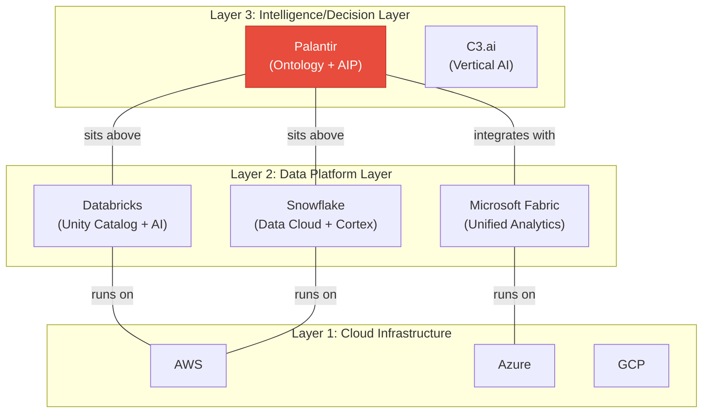
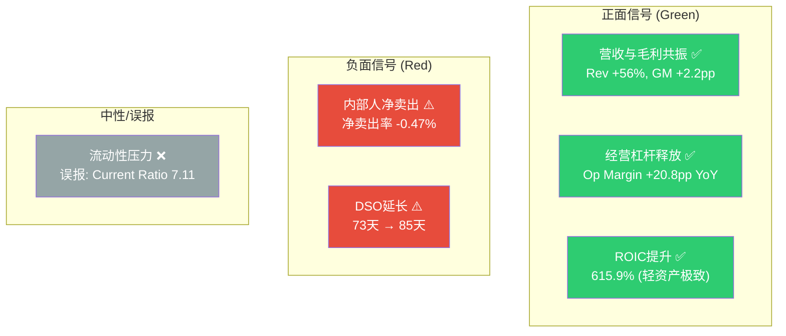

# Part I: 今天的Palantir

## 1.1 财务全景: FY2025 — 转折性的一年

Palantir Technologies在FY2025实现了公司历史上最关键的转折。收入从FY2024的$2.866B加速至$4.475B, 同比增长56.2%, 是过去四年中最高增速。更引人注目的是季度加速轨迹: Q1 +39.4% → Q2 +47.9% → Q3 +62.8% → Q4 +70.0%。这种逐季加速模式在>$1B规模的企业软件公司中极为罕见。

### 收入增长轨迹

FY2022-FY2023的增速低谷(16.7%)曾让市场质疑PLTR的增长上限。AIP平台在FY2024 Q2的全面推出彻底扭转了这条曲线。FY2025的56.2%增速不仅超越了FY2024, 更超越了FY2021(IPO后第一个完整年度)的41.1%增速。

**关键背景**: 在SaaS历史上, 达到$4B收入规模后仍能保持>50%增速的公司屈指可数。Salesforce在$4B规模时增速约26%, ServiceNow约32%, Workday约30%。PLTR的56.2%是一个异常值。

### 盈利能力: 从亏损到利润爆发

PLTR的盈利转折更为戏剧化:

| 指标 | FY2021 | FY2022 | FY2023 | FY2024 | FY2025 |
|------|--------|--------|--------|--------|--------|
| Revenue ($B) | 1.542 | 1.906 | 2.225 | 2.866 | 4.475 |
| Gross Margin | 78.0% | 78.6% | 80.6% | 80.2% | 82.4% |
| Operating Margin | -26.7% | -8.5% | 5.4% | 10.8% | 31.6% |
| Net Margin | -33.7% | -19.6% | 9.4% | 16.1% | 36.3% |
| Net Income ($M) | -520 | -374 | 210 | 462 | 1,625 |
| FCF ($M) | 321 | 184 | 697 | 1,141 | 2,101 |
| FCF Margin | 20.8% | 9.6% | 31.3% | 39.8% | 46.9% |

几个关键观察:

**毛利率稳定上行**: 从FY2021的78.0%升至FY2025的82.4%, 提升4.4个百分点。这反映了产品标准化(Bootcamp模式减少定制化工作)和规模效应。82.4%的毛利率在全球前100大软件公司中排名前10%。

**经营杠杆释放**: FY2025最显著的变化是经营利润率从10.8%跃升至31.6%, 单年提升20.8个百分点。分解驱动因素:
- SG&A/Revenue: 从FY2024的51.7%降至38.3% (-13.4pp)
- R&D/Revenue: 从FY2024的17.7%降至12.5% (-5.2pp)
- Cost of Revenue/Revenue: 从FY2024的19.8%降至17.6% (-2.2pp)

费用绝对值增速远低于收入增速(SG&A +15.7% vs Revenue +56.2%), 体现了经营杠杆的典型模式。

**净利率超越营业利润率**: FY2025净利率36.3% > 营业利润率31.6%, 这是由$229M利息收入(来自$7.2B现金+短投组合)和极低的1.4%有效税率共同驱动的。利息收入几乎等于一个额外的利润来源。

### 季度经营杠杆的加速趋势

Q4 2025的40.9%营业利润率创下公司历史新高, 而且改善速度在加快而非减速。这暗示PLTR可能尚未达到经营杠杆的上限。

### 现金流: 自由现金流机器

FY2025 OCF $2.134B (47.7% margin) 和 FCF $2.101B (46.9% margin)。CapEx仅$33.9M, 是revenue的0.76% — 这是一个几乎不需要资本支出的业务模型。

FCF/Net Income = 1.29x, 意味着现金质量高于报告利润。没有大额应计利润、没有资本化支出扭曲、没有收购商誉减值风险。

**FCF增长轨迹**: FY2021 $321M → FY2022 $184M (谷底) → FY2023 $697M → FY2024 $1.141B → FY2025 $2.101B。三年CAGR (FY2022-FY2025) = 125%。

### 资产负债表: 堡垒级财务

| 指标 | 数值 | 含义 |
|------|------|------|
| Cash + Short-term Investments | $7.177B | 覆盖16个月运营费用 |
| Total Debt (Capital Leases) | $229M | 零金融负债 |
| Net Cash | $6.948B | 正净现金, D/E = 0.03 |
| Current Ratio | 7.11 | 极度过剩流动性 |
| Altman Z-Score | 131.5 | 破产概率接近零 |
| Piotroski F-Score | 7/9 | 财务健康 |
| Goodwill | $0 | 零收购商誉, 无减值风险 |

PLTR的资产负债表可能是美国大型软件公司中最干净的。零金融负债+$7.2B现金储备+零商誉, 意味着即使收入完全停止, 公司也能运营6-7年。这种财务堡垒给管理层极大的战略灵活性。

**一个值得注意的信号**: Accounts Receivable从FY2024的$575M增至FY2025的$1.042B (+81%), 增速超越Revenue增速(+56%)。DSO从73天延长至85天。可能解释: (1) 大型政府合同的支付周期更长; (2) Q4收入集中(季节性); (3) 部分合同的收入确认快于现金回收。需在Part V中进一步审计。

### SBC: 改善中但远未解决

| 指标 | FY2021 | FY2022 | FY2023 | FY2024 | FY2025 |
|------|--------|--------|--------|--------|--------|
| SBC ($M) | 778 | 565 | 476 | 692 | 684 |
| SBC/Revenue | 50.5% | 29.6% | 21.4% | 24.1% | 15.3% |
| Share Dilution (1Y) | — | — | — | — | +0.81% |
| Share Dilution (3Y) | — | — | — | — | +16.1% |
| SBC抵消率 (回购/SBC) | 0% | 0% | 0% | 0% | 1.4% |

SBC/Revenue从FY2021的50.5%降至FY2025的15.3%, 看起来大幅改善。但这主要是分母效应: SBC绝对值实际上从FY2023的$476M回升至FY2024-25的~$690M。更重要的是:
- FY2025首次启动回购($75M), 但仅抵消SBC的1.4% (vs 行业领先者>50%)
- 3年累计稀释16.1%, 在大型科技公司中偏高
- OCF/SBC = 3.12x — 现金流可以覆盖SBC, 但管理层选择不大规模回购

**CQ7关联**: SBC比率的改善是可持续的吗? 如果收入增速从56%放缓至30%, SBC绝对值不变的情况下, SBC/Revenue将从15.3%回升至~20%。比率改善完全依赖于高增速维持。

### Rule of 40评估

Rule of 40 = Revenue Growth + FCF Margin = 56.2% + 46.9% = **103.1**

这个数字在整个SaaS历史上都是极端值。仅有PLTR自身的Q4(70% + 54.3% = 124.3 annualized)更高。作为对比:
- FY2025: PLTR 103 vs CrowdStrike ~65 vs ServiceNow ~58 vs Datadog ~50
- 行业"优秀"门槛: >60; "卓越": >80; PLTR的103属于"前所未见"

但需要注意: Rule of 40在高增长阶段天然膨胀。当增速从56%→30%时(如FY2028E), 假设FCF margin维持47%, Rule of 40将降至77 — 仍然优秀, 但不再异常。v2.0报告中引用的Rule of 40=127可能使用Q4 annualized数据, 口径更乐观。

## 1.2 收入结构与客户基础

### 分部收入拆解

基于Q4 2025 earnings和全年数据:

**US Business (77% of total)**:
- US Government: FY2025 revenue ~$2.0B (估算), +66% YoY (Q4 US Gov $570M, +66% YoY)
- US Commercial: FY2025 revenue ~$1.5B (估算), +137% YoY — 这是AIP/Bootcamp驱动的核心增长引擎
- US total: ~$3.5B, +93% YoY, 占总收入77%(从FY2024的~67%上升)

**International Business (~23% of total)**:
- International Government: 增速缓慢
- International Commercial: 仅+2% YoY — 几乎停滞
- 国际业务占比从FY2024的~33%下降至~23%

**核心矛盾**: PLTR是一家收入增长在加速的公司, 但增长几乎完全来自美国。国际商业(占比~10%)的+2%增速意味着PLTR在美国以外的商业化几乎没有进展。这直接关联CQ2(国际复制)和Part II支柱2(Bootcamp GTM)。

### 客户集中度与合同结构

基于公开披露信息:
- Total Contract Value (TCV): Q4 2025 $4.3B — 季度历史最高
- Remaining Deal Value (RDV): 指标反映合同backlog质量
- Customer count: 截至FY2024末约~600+客户(PLTR不每季度披露精确客户数)
- Average Revenue Per Customer (ARPC): ~$7.5M (基于$4.5B/~600客户估算)

**政府vs商业的合同结构差异**:
- 政府合同: 长期(5-10年IDIQ), 大额(Army EA $10B上限), 但实际执行率不确定
- 商业合同: 从Bootcamp 5天PoC → 初始合同(通常$500K-$2M) → 扩展(NRR>130%)
- 合同续约率和NRR: PLTR未公开标准NRR数据, 但Constellation Research估计商业NRR>130%

## 1.3 竞争格局: 2026年的定位

### 竞争层次图

到2026年初, 竞争格局已经清晰分层:

**PLTR定位**: "Intelligence Layer" — 坐在数据平台之上, 不与Databricks/Snowflake直接竞争数据存储和处理, 而是提供数据→决策的转化层。Ontology是这个转化层的核心, AIP是AI加速器。

**关键竞争对手状态**:

**Databricks** (估值~$62B, 2025年Revenue ~$3B, 年化增速~60%):
- 最危险的竞争者。Unity Catalog正在向PLTR的Ontology领域扩展
- "拥有你的模型(Own Your Model)"策略对IP敏感行业(银行、制药)有吸引力
- 预计2026年IPO, 将获得更多资本和市场关注
- 但: Databricks的核心是数据工程, 不是业务决策层。Ontology的Objects/Relationships/Actions三元结构是Databricks尚未复制的

**Microsoft Fabric**:
- 最广覆盖的竞争者。与Microsoft 365/Azure生态深度绑定
- 但: 数据血缘能力远弱于Foundry, 安全实现需要硬编码T-SQL(vs Foundry的点击配置)
- 2026年1月Medium文章揭示: Microsoft正在开发"语义契约(Semantic Contracts)"策略 — 本质上是Microsoft版的Ontology
- **CQ1关键信号**: 如果Microsoft的语义契约在2026-2027年成熟, 将是Ontology锁定效应的最大威胁

**Snowflake**:
- Data Cloud + Cortex AI定位于分析层, 与PLTR的决策层有部分重叠
- 但: Snowflake的核心仍是数据仓库, 不是操作系统
- Snowflake的AI Agent策略可能在特定垂直领域与PLTR的AIP竞争

**C3.ai**:
- 垂直AI方案提供商, 直接竞争有限
- 规模(~$350M Revenue)远小于PLTR, 不构成系统性威胁

### 竞争护城河评估 (定性)

| 护城河维度 | 强度 | 支撑证据 | 威胁 |
|-----------|------|---------|------|
| **Ontology锁定** | 强 | Morningstar "Wide Moat"评级; 迁移=重建整个语义层 | Microsoft语义契约; Databricks Unity Catalog扩展 |
| **政府安全认证** | 很强 | FedRAMP + IL5/IL6 + TS/SCI clearance; 竞争者需5-10年追赶 | Anduril在部分国防AI领域的崛起 |
| **Bootcamp GTM** | 中-强 | 5天PoC→合同的销售效率; US Commercial +137% | 模式可被模仿(Databricks已有类似workshop) |
| **数据网络效应** | 中 | 跨客户的模式学习(非数据共享); 但不如社交网络效应强 | 每个客户的Ontology是独立的, 网络效应有限 |
| **品牌/信任** | 强(政府) / 中(商业) | 20年政府信任积累; 商业品牌仍在建立中 | "监控公司"形象在部分市场是障碍 |

## 1.4 管理层行动: 信号解读

### CEO Alex Karp的$2.2B卖出

Karp在过去3年累计卖出约$2.2B的PLTR股票。最近一次(2025年11月)卖出585,000股, 价值$95.9M。President Stephen Cohen计划卖出405,000股($66.4M), CTO Shyam Sankar 225,000股($36.9M)。

**解读框架**:
- **正常化论点**: Karp是2003年联合创始人, 持股已23年。IPO后6年的变现在创始人中是常态(参考Zuckerberg、Bezos的卖出历史)
- **信号论点**: 卖出量在2024 Q4达到峰值(92.8M股), 恰好是股价最高点区间。2025全年净卖出12.1M股
- **治理论点**: Class F股份结构给Karp永久50%+投票权, 即使持股比例持续下降, 控制权不受影响

**Class F控制权结构**: 这是PLTR治理中最独特也最有争议的设计。Class F股份赋予持有者(Karp + Thiel + Cohen)集体至少49.999%的投票权, 无论其实际持股比例。这意味着:
1. 公众股东永远无法通过投票更换管理层
2. 敌意收购不可能
3. 管理层可以追求长期战略, 不受短期股东压力
4. 但也意味着管理层若犯错, 没有纠错机制

### FY2026指引: 激进还是保守?

管理层指引FY2026: Revenue $7.19B (中值), 同比+61%。

对比分析师共识: FY2026E Revenue $7.14B (17位分析师), 与管理层指引几乎一致。这意味着:
- 管理层的指引不算"Beat-and-Raise" — 他们给出的数字接近市场已有预期
- FY2025全年实际Revenue $4.475B vs FY2025E $4.39B = Beat 1.9%, 幅度较小
- 隐含FY2026E增速: 管理层61% vs 共识59.5% — 差距仅1.5pp

**US Commercial增速的可持续性**: FY2025 US Commercial +137% YoY。管理层指引FY2026 US Commercial +115%。这仍然是极高增速, 但已经是从137%的减速。关键问题: 这个减速幅度是否足够? Bootcamp积压释放效应是否已在FY2025被大量消化?

## 1.5 DOGE: 双刃剑专题

DOGE(Department of Government Efficiency)对PLTR的影响是当前市场最热烈讨论的话题之一。

### PLTR在DOGE中的角色

PLTR已成为DOGE倡议的核心技术供应商:
- **联邦透明度门户**: PLTR的AIP是"Wall of Receipts"联邦支出透明门户的底层技术
- **IRS MEGA API**: PLTR与DOGE合作开发IRS纳税人数据集中访问系统
- **支出审计**: 每个联邦机构现在被要求提供实时支出明细, PLTR负责数据汇聚和分析

### 双刃剑分析

| 维度 | 正面影响 | 负面影响 |
|------|---------|---------|
| **直接合同** | 新增DOGE相关技术合同(IRS MEGA API等) | — |
| **品牌效应** | "政府信任的AI平台"形象强化 | "监控公司"批评加剧(隐私倡导者) |
| **预算影响** | PLTR作为效率工具, 自身合同可能被保护 | 非国防自由裁量支出提议削减22.6%, 可能波及部分机构采购 |
| **政治风险** | Trump政府期间, PLTR关系密切 | 政权更迭后DOGE可能被废除, PLTR的政治关联可能变成负债 |
| **收入敞口** | — | 政府收入占54%, DOGE预算审查增加不确定性 |

**定量估算**: v2.0报告估计DOGE净影响为+5-8% (中性偏正)。在v3.0中, 我们注意到额外的上行因素(IRS MEGA API等新合同)和下行因素(国会反对+隐私诉讼风险), 维持中性偏正评估, 但置信度从v2.0的75%降至50% (CQ4)。

**2026年2月DOGE最新动态**: 国防部长Hegseth在SpaceX Starbase的"电锯"演讲(2026年1月)导致PLTR股价从$179下跌25%。提议的非国防自由裁量支出削减22.6%引发恐慌。但随后PLTR公布的Q4业绩(+70%增长)部分缓解了恐惧。DOGE相关波动已成为PLTR股价的新常态。

## 1.6 技术面快照

| 指标 | 数值 | 含义 |
|------|------|------|
| Price | $135.68 | 52周高点$207.52的65.4% |
| SMA20 | $155.70 | 低于SMA20 (-12.9%) |
| SMA50 | $171.35 | 低于SMA50 (-20.8%) |
| SMA200 | $160.61 | 低于SMA200 (-15.5%) |
| RSI | 32.43 | 接近超卖(<30) |
| 趋势 | 下跌 | 所有均线空头排列 |

技术面显示PLTR正处于中级修正中。从$207.52高点下跌34.6%至$135.68, RSI 32.4接近超卖区间。三条主要均线全部在股价上方且空头排列(SMA200 > SMA50 > SMA20 > Price)。

**技术面与基本面的背离**: 基本面(Q4 +70%增长, FCF margin 47%)处于历史最强, 但股价处于下跌趋势。这种背离通常意味着: (1) 前期估值过度透支基本面; (2) 宏观/情绪因素(DOGE恐慌+内部人卖出)压制了基本面支撑; (3) 或者基本面拐点即将出现(增速见顶)。

## 1.7 估值概况: 市场在定价什么

当前估值指标汇总:

| 指标 | PLTR当前 | SaaS行业中位数 | 偏离度 |
|------|---------|---------------|-------|
| P/E TTM | 230.9x | ~35x | 6.6x |
| P/E Forward (FY2026E) | 107.5x | ~30x | 3.6x |
| P/E Forward (FY2027E) | 75.8x | ~25x | 3.0x |
| EV/Sales TTM | 93.8x | ~8x | 11.7x |
| EV/EBITDA TTM | 291.6x | ~25x | 11.7x |
| Price/FCF TTM | 200.5x | ~30x | 6.7x |
| FCF Yield | 0.50% | ~3.5% | 0.14x |

**Forward P/E压缩路径**: 假设股价不变($135.68), 随着EPS增长:
- FY2026E EPS $1.26 → Forward P/E 107.5x
- FY2027E EPS $1.79 → Forward P/E 75.8x
- FY2028E EPS $2.56 → Forward P/E 53.0x

即使到FY2028年, PLTR的P/E仍在53x — 这仍然是"增长溢价"水平。市场在定价的不仅是FY2028的利润, 而是FY2028之后持续多年的高增长。

**v2.0对比**: v2.0的SOTP估值$53-56在FY2025 Revenue $4.475B和Op Income $1.414B的背景下, 隐含估值仅~12x EV/Revenue和~30x EV/EBIT — 这对于增长56%的公司来说是极度保守的。v3.0将在Part VI中使用Reverse DCF和OVM替代简单的SOTP点估计。

### FMP DCF vs 市场价差异

FMP模型给出的DCF估值仅$10.25, vs 市价$135.68 (溢价1,224%)。这个极端差异反映了:
1. 传统DCF模型使用固定增长假设, 无法捕捉PLTR的非线性增长轨迹
2. 高WACC(可能>12%)在长期严重压缩高增长公司的终端价值
3. 这恰恰是为什么PLTR需要Discovery System + OVM而非传统DCF

## 1.8 领先指标信号板

**综合信号**: 3正面 / 2负面 / 1误报 = 基本面向好但内部人行为发出警告信号。这种组合(强基本面+内部人卖出)在历史上常见于估值过热阶段。

## 1.9 Polymarket市场情绪

Polymarket上有74个与PLTR相关的活跃市场, 但绝大多数是短期价格博弈(日/周度涨跌), 缺少有价值的基本面事件市场。

值得注意的市场:
- "Will Palantir reach $234 in February?" — 市场隐含概率极低, 反映短期看跌情绪
- "Will US federal government take a stake in Palantir?" — 活跃至2026-12-31, 反映市场对PLTR-政府关系深度的关注
- 2月底价格区间市场显示$126-$140为当前市场预期核心区间

**Polymarket信号**: 与v2.0分析一致, 预测市场对PLTR的覆盖以短期投机为主, 无法提供深层基本面洞察。政府入股市场是唯一有研究价值的长期事件市场。

## 1.10 Part I总结: 今天的Palantir是什么

**一句话概括**: Palantir是一家以前所未有的速度增长的高利润率企业AI平台公司, 拥有坚不可摧的资产负债表, 但其估值定价了未来5-10年持续高增长的极端乐观假设, 同时管理层正在大规模卖出股票。

### 关键数据仪表板

| 维度 | 状态 | 强度 |
|------|------|------|
| 增长动能 | FY2025 +56%, Q4 +70%, FY2026E +61% | **极强** |
| 盈利质量 | Op Margin 31.6%, FCF Margin 47%, Rule of 40=103 | **极强** |
| 财务韧性 | Net Cash $6.9B, Zero Debt, Z-Score 131 | **极强** |
| 竞争护城河 | Ontology锁定+政府认证, 但Microsoft/Databricks追赶 | **强** |
| 收入集中 | US 77%, 国际仅23%且商业+2% | **弱** |
| 估值 | P/E 231x, EV/Sales 94x, FCF Yield 0.5% | **极贵** |
| 管理层信号 | $3B+累计卖出, Class F永久控制 | **负面** |
| 市场情绪 | RSI 32(超卖), 分析师PT $70-$260(极度分歧) | **混乱** |

### CQ进展 (Part I结束后)

| CQ | P0.5 | Part I更新 | 方向 |
|----|------|-----------|------|
| CQ1 (Ontology护城河) | 55% | 55% — 竞争格局确认3层结构, Microsoft语义契约是新威胁 | → |
| CQ2 (国际复制) | 45% | 43% — 国际商业+2%的数据比预期更差 | ↓ |
| CQ3 (中型企业渗透) | 40% | 40% — Part I无新数据 | → |
| CQ4 (DOGE净影响) | 50% | 50% — IRS MEGA API是正面, Hegseth演讲是负面, 相互抵消 | → |
| CQ5 (EA/TITAN执行) | 50% | 50% — Part I无新数据 | → |
| CQ6 (增速可持续性) | 45% | 48% — Q4加速到70%超预期, 但FY2026指引与共识一致非Beat | ↑ |
| CQ7 (SBC改善) | 55% | 53% — SBC绝对值稳定, 改善主要来自分母效应 | ↓ |
| CQ8 (内部人卖出) | 50% | 48% — 2024 Q4卖出量创新高(92.8M股), 时机与高点吻合 | ↓ |
| CQ9 (AI Agent时代) | 45% | 45% — Part I无新数据 | → |

**Part I后CQ加权置信度**: 47.8% (从P0.5的48.3%微降) — CQ2和CQ8的下调被CQ6的上调部分抵消。

---

*Part I结束。Part II将深入三支柱分析: Ontology锁定效应 / Bootcamp GTM引擎 / 国防采购路径依赖。*
