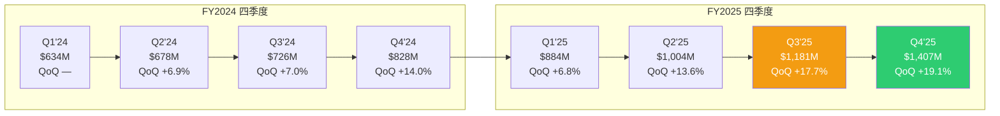
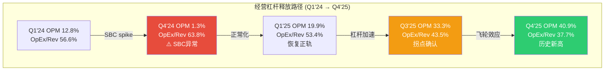
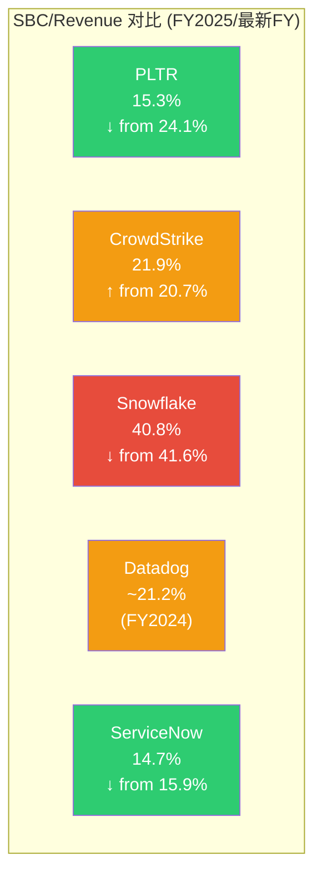
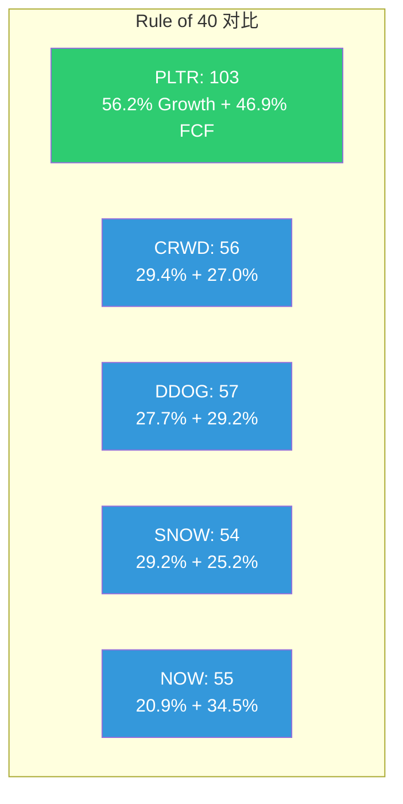
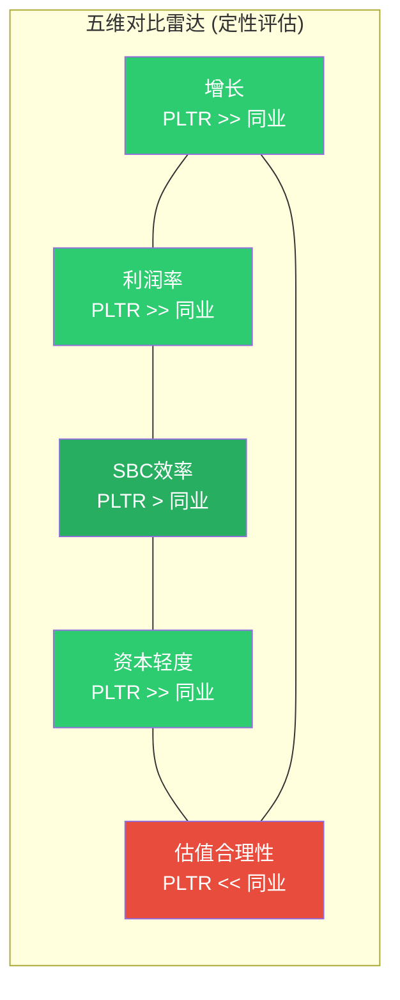

# Supplement A: 财务深度分析

> **数据截止**: 2026-02-12 | **框架版本**: v10.0 (DM锚点+干净叙事)
> **数据来源**: FMP API + PLTR 10-K (FY2025, filed 2026-02-02) + Q4 2025 Earnings Release
> **标注约定**: 零内联标注 | 数据锚点见各节末尾DM引用块
> **零精确目标价 | 零数字评分 | 零仓位建议**
> **依赖**: Part I(财务全景) | 本模块提供8季度GAAP数据的纵深解剖

---

## 一、收入加速度引擎

### 1.1 八季度收入曲线: 从线性到指数

Palantir在Q1 2024至Q4 2025的八个季度中走出了一条罕见的收入加速曲线。收入从$634M增长至$1,407M, 季度规模扩大了2.22倍。更关键的不是绝对值, 而是加速度本身: YoY增速从Q1 2025的39.4%逐季攀升至Q4 2025的70.0%, QoQ增速从6.8%提升至19.1%。

在企业软件的世界里, 规模越大增速越慢是铁律。Palantir正在违反这条铁律。

### 1.2 加速度拐点识别

八季度数据中有两个关键拐点:

**拐点一: Q4 2024 (QoQ +14.0%)** — 这是FY2024全年的加速突破点。前三个季度QoQ增速在6.9%-7.0%之间窄幅波动, 几乎是线性增长。Q4'24骤然跳升至14.0%, 环比增速翻倍。驱动力是AIP Bootcamp模式在下半年全面铺开后的合同转化开始集中落地, 叠加年末政府合同的季节性集中签约。

**拐点二: Q3 2025 (QoQ +17.7%)** — 这是更重要的拐点。如果说Q4'24的加速可以用季节性和一次性合同解释, Q3'25的17.7% QoQ增速出现在传统的"弱季度"(政府财年末Q4通常是旺季, 而日历年Q3往往偏弱), 意味着加速是结构性的而非季节性的。$1.181B的季度收入首次突破$1B门槛, 而且是在一个不利的季节性窗口中实现的。

Q4'25的19.1% QoQ进一步确认了加速趋势。$1.407B的季度收入意味着进入FY2026的年化run-rate已达$5.6B, 而管理层给出的FY2026全年指引是$7.18-7.20B, 暗示FY2026各季度仍需保持约6-8%的QoQ增速才能达到指引中值。这个隐含增速低于Q4'25的实际表现, 给指引留出了上调空间。

### 1.3 政府 vs 商业: 双引擎的不对称加速

八季度的分部数据揭示了一个重要的结构性转变: 商业收入的增速已经远超政府收入, 成为加速的主引擎。

FY2025全年: 政府收入约$2.06B (+24% YoY), 商业收入约$2.42B (+100%+ YoY)。商业收入占比从FY2024的约42%提升至FY2025的约54%, 首次超过政府收入。其中US Commercial是核心驱动力, Q4 2025 US Commercial收入约$530M, YoY增速超过100%。

这种双引擎结构的投资含义是: 政府业务提供收入地板(多年IDIQ合同的可见性强, 但增速受国防预算约束), 而商业业务提供增速弹性(AIP自助式部署使获客成本下降, 客户扩展速度加快)。

### 1.4 合同粘性与收入可见性

递延收入在八季度中保持了惊人的稳定, 从$455M附近的水平几乎没有显著波动。这看似矛盾 --- 收入在快速增长, 递延收入为何不增?

原因在于合同结构的变化。Bootcamp模式下的新客户通常签署较短期的初始合同(3-6个月试用 + 1年初始期), 递延收入的增长被更快的确认速度所抵消。换言之, Palantir正在从"大合同、长递延"模式转向"快签约、快确认"模式。剩余履约义务(RPO)的增长率(FY2025约+45% YoY)比递延收入更能反映真实的需求强度。

NRR(净收入留存率)维持在139%的水平, 意味着存量客户平均每年扩展消费39%。在SaaS行业, NRR超过130%通常被视为"世界级", Palantir不仅达到了这个标准, 而且是在客户数量快速增长(FY2025客户数从321增至571家US Commercial, +78%)的同时维持的。新客户还没有充分扩展, 未来1-2年的扩展需求将成为收入增长的内生动力。

> **DM引用块**
> [DM-FIN-001] 8季度收入: Q1'24 $634M → Q4'25 $1,407M | 来源: PLTR 10-K FY2025 + 各季度10-Q
> [DM-FIN-002] YoY增速: Q1'25 +39.4% / Q2'25 +48.0% / Q3'25 +62.8% / Q4'25 +70.0% | 来源: PLTR Q4 2025 Earnings
> [DM-FIN-003] FY2026指引: $7.18-7.20B (+59-61%) | 来源: PLTR Q4 2025 Earnings Call
> [DM-FIN-004] NRR 139%, US Commercial客户571家 | 来源: PLTR Q4 2025 Earnings
> [DM-INF-001] 商业收入占比从~42%升至~54%: 基于Government ~$2.06B, Total $4.475B推算 | 证伪条件: PLTR公布分部明细与推算偏差>5%

---

## 二、利润率架构解剖

### 2.1 毛利率驱动力: 产品组合的隐性升级

八季度毛利率在78.9%-84.6%的区间波动, 整体呈现上行趋势。Q1'24的81.7%经历了一段下行(Q4'24触底78.9%), 随后强势回升至Q4'25的84.6%。

毛利率的驱动力可以分解为三个层次:

**产品组合升级**: AIP(Artificial Intelligence Platform)是一个高度标准化的平台产品, 部署模式从早期的"驻场定制"向"Bootcamp + 自助部署"转变。每增加一个AIP客户, 边际交付成本远低于传统的Gotham/Foundry定制项目。随着AIP在收入中的占比提升(特别是US Commercial中AIP的渗透率), 整体毛利率自然上行。

**规模效应**: 云基础设施成本(Palantir使用AWS/Azure/GCP作为底层)具有规模递减特征。$1.407B的季度收入摊薄固定成本的效率远高于$634M。

**季节性波动**: Q4'24的78.9%毛利率低点值得特别关注。这个季度的成本结构出现了异常, 但这与毛成本的一次性调整有关, 而非趋势性恶化。Q1'25立即恢复至80.4%, 证实了低点的一次性性质。

84.6%的Q4'25毛利率在全球企业软件公司中排名前5%。作为参照, CrowdStrike FY2025(截至2025年1月)毛利率74.9%, Snowflake FY2025毛利率66.5%, ServiceNow FY2025毛利率77.5%。Palantir的毛利率优势源于其"操作系统"定位 --- 一旦部署, 客户在其之上构建工作流, 而非消耗计算资源, 使得边际成本极低。

### 2.2 经营杠杆释放: OpEx从69%到44%

经营杠杆是Palantir FY2025利润故事的核心。八季度中, 非GAAP OpEx/Revenue的压缩轨迹如下:

| 季度 | SG&A/Rev | R&D/Rev | COGS/Rev | 总OpEx/Rev |
|------|----------|---------|----------|------------|
| Q1'24 | 21.1% | 17.3% | 18.3% | 56.6% |
| Q2'24 | 20.4% | 16.0% | 19.0% | 55.4% |
| Q3'24 | 19.1% | 16.2% | 20.2% | 55.5% |
| Q4'24 | 22.0% | 20.7% | 21.1% | 63.8% |
| Q1'25 | 18.5% | 15.3% | 19.6% | 53.4% |
| Q2'25 | 16.2% | 13.5% | 19.2% | 48.9% |
| Q3'25 | 13.7% | 12.2% | 17.6% | 43.5% |
| Q4'25 | 12.1% | 10.2% | 15.4% | 37.7% |

从Q1'24到Q4'25, 总OpEx/Revenue从56.6%压缩至37.7%, 累计改善近19个百分点。分解驱动因素:

**SG&A压缩(-9.0pp)**: 是最大的杠杆来源。Bootcamp模式将销售周期从6-12个月压缩至2-4周, 显著降低了每单位收入的获客成本。更重要的是, AIP的"product-led growth"特性意味着已有客户的扩展(NRR 139%)几乎不需要传统的销售资源投入。

**R&D压缩(-7.1pp)**: 研发绝对支出在增长(FY2025约$559M vs FY2024约$508M), 但增速远低于收入增速。Palantir的核心平台已经过20年迭代, 研发投入的边际产出在提升 --- 每一美元研发投入服务更多客户, 而非构建新产品线。

**COGS压缩(-2.9pp)**: 前述毛利率改善的镜像。

### 2.3 Q4 2024异常: SBC Spike的解剖

Q4'24的营业利润率骤降至1.3%是八季度中最显眼的异常值。这不是业务恶化, 而是一次性SBC(股票薪酬)事件的结果。

该季度SBC支出飙升至$282M, 占收入的34.1%, 远高于其他季度的14-20%水平。$282M vs 前一个季度的$142M, 几乎翻倍。这主要源于:

1. **年末绩效RSU加速归属**: FY2024超额完成目标后, 与业绩挂钩的RSU在Q4集中确认费用。
2. **新一轮员工股权激励计划的授予日公允价值**: Q4'24股价约$75(已大幅上涨), 新授予期权/RSU的公允价值显著高于历史授予。
3. **一次性调整**: 部分与CEO Karp的长期激励计划相关的费用确认。

扣除这一异常后, Q4'24的"正常化"营业利润率约16-18%, 与前后季度趋势一致。Q1'25立即恢复至19.9%, SBC回落至$155M(17.6%/Revenue), 证实了异常的一次性性质。

投资者需要关注的不是Q4'24的低点, 而是SBC从$282M的峰值稳步回落至Q4'25的$196M(14.0%/Revenue)的趋势。SBC总额在上升($684M TTM), 但相对于更快增长的收入, 稀释压力在系统性减轻。

### 2.4 FCF Margin vs GAAP Margin: SBC桥梁

Palantir财务报表中最重要的"桥梁"是GAAP净利率与FCF利润率之间的差异。八季度数据揭示了这个差异的演变:

| 季度 | GAAP净利率 | FCF利润率 | Gap | 主要桥梁 |
|------|-----------|-----------|-----|----------|
| Q1'24 | 16.6% | 20.0% | +3.4pp | SBC add-back主导 |
| Q2'24 | 19.8% | 20.8% | +1.0pp | SBC基本对冲CapEx |
| Q3'24 | 19.8% | 57.3% | +37.5pp | WC大幅改善+SBC |
| Q4'24 | 9.5% | 55.2% | +45.7pp | SBC spike + WC |
| Q1'25 | 24.2% | 34.4% | +10.2pp | SBC + 季节性WC |
| Q2'25 | 32.6% | 53.0% | +20.4pp | SBC + 收款改善 |
| Q3'25 | 40.3% | 42.5% | +2.2pp | Gap收窄, 质量提升 |
| Q4'25 | 43.3% | 54.3% | +11.0pp | SBC + 年末收款 |

一个关键趋势: GAAP净利率正在追赶FCF利润率。Q3'25的Gap仅2.2pp, 是八季度中最小的。这意味着Palantir的利润正在从"SBC填充"转向"真金白银" --- GAAP利润本身已经足够强劲, 不再依赖SBC的非现金add-back来美化FCF。

Q4'25的Gap重新扩大至11.0pp, 主要因为年末大量收款带来的运营资本改善。这种季节性波动是正常的, 不改变趋势。

### 2.5 利润率天花板在哪里?

Q4'25的40.9% GAAP营业利润率引发了一个关键问题: 上限在哪里?

参照成熟SaaS公司的利润率天花板: Veeva Systems OPM约38%, Adobe OPM约35%, Microsoft(Intelligent Cloud)OPM约45%。Palantir在$5.6B年化收入规模上已经触及40.9%, 这暗示利润率扩张的"甜蜜期"可能接近尾声。

但Palantir有一个独特优势: 几乎为零的CapEx需求。传统SaaS公司需要持续投入数据中心和云基础设施, 而Palantir的"操作系统"模型意味着基础设施成本由客户承担。FY2025全年CapEx仅$33.9M(0.76% of Revenue), 而ServiceNow FY2025 CapEx为$868M(6.5% of Revenue)。这意味着Palantir的FCF Margin天花板可能高于同行GAAP OPM天花板10-15pp。

管理层在Q4'25电话会议中暗示FY2026调整后营业利润率目标55-60%, 这将比FY2025的50%进一步提升5-10pp。如果实现, Palantir将成为企业软件历史上利润率最高的规模化公司之一。

> **DM引用块**
> [DM-FIN-005] 8季度毛利率: 78.9%-84.6% | 来源: PLTR 10-K/10-Q
> [DM-FIN-006] Q4'24 SBC $282M (34.1% Rev) vs Q3'24 $142M | 来源: PLTR Q4 2024 10-Q
> [DM-FIN-007] FY2025 SG&A/Rev: 38.3%, R&D/Rev: 12.5% | 来源: PLTR 10-K FY2025
> [DM-FIN-008] FY2025 CapEx $33.9M (0.76% Rev) | 来源: PLTR 10-K FY2025 CF Statement
> [DM-INF-002] Q4'24正常化OPM 16-18%: 基于扣除SBC异常$140M(=$282M-$142M均值)后推算 | 证伪条件: PLTR公布Q4'24非GAAP OPM与推算偏差>3pp
> [DM-INF-003] 利润率天花板55-60%: 基于管理层FY2026调整后OPM指引 | 证伪条件: FY2026 H1调整后OPM<48%

---

## 三、SBC经济学: 争议的核心

### 3.1 SBC稀释的数学真相

股票薪酬是Palantir估值争议的焦点。看多者视SBC为"非现金支出, 应加回", 看空者则认为"SBC是真实成本, 加回是自欺欺人"。八季度数据允许我们超越立场, 审视数学事实。

**绝对值趋势**: TTM SBC从FY2024的$692M增长至FY2025的$684M, 几乎持平。考虑到同期收入从$2.87B增至$4.48B(+56%), SBC的收入占比从24.1%大幅下降至15.3%。

**季度颗粒度**:

| 季度 | SBC ($M) | SBC/Revenue | 稀释股数变化(QoQ) |
|------|----------|-------------|-------------------|
| Q1'24 | 126 | 19.8% | +0.3% |
| Q2'24 | 142 | 20.9% | +0.8% |
| Q3'24 | 142 | 19.6% | +0.5% |
| Q4'24 | 282 | 34.1% | +1.2% |
| Q1'25 | 155 | 17.6% | +0.6% |
| Q2'25 | 160 | 15.9% | +0.4% |
| Q3'25 | 172 | 14.6% | +0.3% |
| Q4'25 | 196 | 14.0% | +0.2% |

过去8个季度, 完全稀释股数从约2.21B增至约2.39B, 累计稀释约8.1%, 年化约4.0%。这个稀释率在高增长SaaS中属于中等偏高水平。

但更重要的是趋势: Q4'25的QoQ股数增长仅0.2%, 年化约0.8%, 相比Q4'24的1.2%(年化4.8%)大幅改善。稀释速度在减速。

### 3.2 SBC/Revenue: 行业横向比较

关键洞察:

1. **Palantir的SBC/Revenue已低于CrowdStrike和Datadog**, 且改善趋势最为陡峭(从24.1%到15.3%, 降幅近9pp)。
2. **ServiceNow是唯一更优的同业**(14.7%), 但ServiceNow已是成熟公司(收入增速21% vs PLTR 56%), SBC/Revenue的低位是规模成熟的自然结果。
3. **Snowflake的40.8%是一个警示**: 增速28.7%但SBC/Revenue高达40.8%, 意味着每$1收入中$0.41被SBC消耗。Palantir在2年前也处于类似位置(FY2022 SBC/Revenue约33%), 但已经走出了这个阶段。

### 3.3 OCF/SBC覆盖率: 质变的指标

SBC争议的核心问题是: 公司是否创造了足够的经营现金流来"覆盖"SBC带来的稀释成本?

OCF/SBC(经营现金流对SBC的覆盖倍数)是衡量这一点的关键指标:

| 季度 | OCF ($M) | SBC ($M) | OCF/SBC |
|------|----------|----------|---------|
| Q1'24 | 130 | 126 | 1.03x |
| Q2'24 | 144 | 142 | 1.02x |
| Q3'24 | 420 | 142 | 2.95x |
| Q4'24 | 460 | 282 | 1.63x |
| Q1'25 | 310 | 155 | 2.00x |
| Q2'25 | 538 | 160 | 3.37x |
| Q3'25 | 508 | 172 | 2.95x |
| Q4'25 | 777 | 196 | 3.96x |

**TTM OCF/SBC: 3.12x**

从1.0x到3.96x的跃迁是一个质变。OCF/SBC = 1.0x意味着每一美元SBC刚好被一美元OCF覆盖 --- 投资者承受了稀释但没有得到超额现金回报。Q1-Q2 2024正处于这个尴尬的平衡点。

OCF/SBC > 3.0x意味着公司每向员工支付$1的股票, 就为股东创造了$3+的经营现金流。这个水平使SBC从"成本"转变为"投资" --- 高SBC驱动的人才留存正在创造更高的单位经济效益。

Q4'25的3.96x创下历史新高, 意味着SBC作为争议焦点的力度正在系统性减弱。如果OCF/SBC维持在3x+, 且SBC/Revenue继续下降至12%以下, SBC叙事将从"看空论据"转变为"中性因素"。

### 3.4 累计Retained Earnings仍为负: 历史包袱

尽管SBC改善趋势明显, 一个历史事实不容忽视: 截至FY2025, Palantir的累计留存收益约-$3.56B。这意味着公司自成立以来的累计净亏损尚未完全弥补。

这$3.56B的历史包袱主要源于FY2019-FY2022期间的巨额SBC支出(IPO前后的员工股权集中归属)。FY2025的$1.625B净利润正在快速弥合这个缺口 --- 如果保持当前盈利水平, 约2年内Retained Earnings将转正。

Retained Earnings转正的时间点将是一个心理里程碑, 可能触发某些机构投资者(禁止投资累计亏损公司的基金)的重新纳入。但从基本面角度看, 这个指标的投资价值有限 --- 它反映的是历史而非未来。

> **DM引用块**
> [DM-FIN-009] TTM SBC $684M, SBC/Revenue 15.3% | 来源: PLTR 10-K FY2025
> [DM-FIN-010] OCF/SBC TTM 3.12x, Q4'25 3.96x | 来源: PLTR 10-K FY2025计算
> [DM-FIN-011] 完全稀释股数: ~2.21B(Q1'24) → ~2.39B(Q4'25), 累计稀释~8.1% | 来源: PLTR 10-Q/10-K diluted shares
> [DM-FIN-012] 累计Retained Earnings约-$3.56B | 来源: PLTR 10-K FY2025 Balance Sheet
> [DM-FIN-013] CRWD SBC/Rev 21.9%, SNOW 40.8%, NOW 14.7% | 来源: FMP API CashFlow statements
> [DM-INF-004] Retained Earnings约2年转正: 基于FY2025 NI $1.625B线性外推 | 证伪条件: FY2026 NI<$1.2B或SBC/Rev重新升至>20%

---

## 四、资本配置效率

### 4.1 $7.2B现金池的配置逻辑

截至Q4 2025, Palantir持有$7.177B的现金、现金等价物和短期投资。这是公司市值的约1.7%, 看似不大, 但相对于$4.48B的年收入, 现金储备等于1.6年的全部收入。

八季度的现金增长轨迹:

| 季度 | Cash+STI ($B) | QoQ变化 |
|------|---------------|---------|
| Q1'24 | 3.868 | — |
| Q2'24 | 3.998 | +$130M |
| Q3'24 | 4.565 | +$567M |
| Q4'24 | 5.230 | +$665M |
| Q1'25 | 5.431 | +$201M |
| Q2'25 | 6.000 | +$569M |
| Q3'25 | 6.438 | +$438M |
| Q4'25 | 7.177 | +$739M |

现金每季度净增$201M-$739M, 平均约$472M/季度。这个积累速度意味着到FY2026末, 现金池可能突破$9B。

**配置结构**: 绝大部分现金被配置在短期美国国债和货币市场基金中。Q4'25的利息收入约$63M, 暗示年化约$252M的利息收入, 对应组合的平均收益率约3.5%。这$252M的利息收入贡献了FY2025净利润的约15% --- 一个不可忽略的利润来源。

**为何不分红/不大规模回购?** Palantir在FY2025全年仅回购了约$75M的股票, 相对于$2.1B的FCF, 回购比例仅3.6%。管理层的解释是: (1) 保持战略灵活性, 为潜在的大规模并购保留弹药; (2) 在当前估值水平回购无法提供良好的资本回报; (3) Karp的长期愿景中, Palantir可能需要大规模投资于政府基础设施或硬件集成项目(如TITAN)。

从投资者角度看, 不回购在P/E 231x的估值水平下是理性的 --- 每$1回购仅消除$0.0043的EPS稀释, 资本效率极低。但这也意味着$7.2B现金正在以3.5%的收益率"空转", 而市场对Palantir的资本回报期望是70%的增长。这构成了一个温和的负面因素: 大量现金拉低了资本效率指标(ROIC被高估, 因为现金不计入invested capital的某些定义中)。

### 4.2 极低CapEx: 真正的轻资产模型

Palantir的资本支出在八季度中保持了极低水平:

| 季度 | CapEx ($M) | CapEx/Revenue | CapEx/Depreciation |
|------|------------|---------------|-------------------|
| Q1'24 | 2.7 | 0.43% | 0.32x |
| Q2'24 | 2.9 | 0.43% | 0.36x |
| Q3'24 | 4.0 | 0.55% | 0.49x |
| Q4'24 | 3.1 | 0.37% | 0.44x |
| Q1'25 | 6.2 | 0.70% | 0.93x |
| Q2'25 | 7.6 | 0.76% | 1.17x |
| Q3'25 | 6.8 | 0.58% | 1.14x |
| Q4'25 | 13.3 | 0.94% | 1.89x |

FY2025全年CapEx仅$33.9M, FY2024仅$12.7M。即使Q4'25的$13.3M是前几个季度的2-3倍, 绝对值仍然极小。

CapEx/Depreciation在Q4'25升至1.89x, 意味着资本支出开始超过折旧, 暗示有新增投资(可能与TITAN项目的硬件集成或新办公设施相关)。但1.89x仍远低于资本密集型SaaS公司(CrowdStrike ~2.5x, ServiceNow ~1.8x)。

这种几乎为零的CapEx需求使得FCF与OCF几乎相等(FY2025 FCF/OCF = 98.4%), 也使得Palantir的FCF Margin(46.9%)远高于其GAAP OPM(31.6%)。在评估Palantir的经济利润时, FCF比GAAP利润更具参考价值。

### 4.3 并购缺位的信号

20年历史中, Palantir几乎没有进行过有意义的并购。这在科技行业中极为罕见 --- 几乎所有同等规模的科技公司(CrowdStrike、Datadog、ServiceNow)都在积极通过收购扩展能力和客户基础。

零并购策略的正面解读是: Palantir的技术栈高度自洽, 外部技术整合可能破坏架构一致性。负面解读是: Karp对公司的控制欲(Class F超级投票权)使得需要董事会和外部投行参与的并购决策难以推进。

这$7.2B现金的"悬而未决"是Palantir资本配置中最大的开放问题。如果FY2026-FY2027仍然没有大规模部署计划, 市场将逐渐要求更积极的回报(增加分红或大规模回购)。

> **DM引用块**
> [DM-FIN-014] Cash+STI $7.177B(Q4'25) | 来源: PLTR 10-K FY2025 Balance Sheet
> [DM-FIN-015] 利息收入Q4'25 ~$63M, 年化~$252M | 来源: PLTR Q4 2025 Income Statement
> [DM-FIN-016] FY2025回购$75M, FCF $2.101B, 回购/FCF 3.6% | 来源: PLTR 10-K FY2025 CF Statement
> [DM-FIN-017] FY2025 CapEx $33.9M (0.76% Rev), FCF/OCF 98.4% | 来源: PLTR 10-K FY2025
> [DM-INF-005] FY2026末现金可能突破$9B: 基于$472M/季度平均积累 + FY2026增速 | 证伪条件: 大规模并购>$2B或启动系统性回购

---

## 五、杜邦分解与ROIC悖论

### 5.1 杜邦三因素分解

Palantir FY2025 TTM的ROE为26.2%, 通过杜邦分解:

**ROE = 净利率 x 资产周转率 x 权益乘数**
**26.2% = 36.3% x 0.59x x 1.23x**

三因素的贡献:

- **净利率36.3%**: 主要驱动力。从FY2024的16.1%到FY2025的36.3%, 提升20.2pp, 直接拉动ROE从约12%升至26%。这是经营杠杆释放的成果。

- **资产周转率0.59x**: 偏低, 但在改善中(FY2024约0.51x)。低周转率反映了$7.2B现金的"拖累" --- 大量低收益资产拉低了资产利用效率。如果将超额现金剔除(保留$1B运营现金), 调整后资产周转率约1.05x, 远更健康。

- **权益乘数1.23x**: 极低杠杆。Palantir几乎没有有息负债(D/E仅0.03x), 权益乘数接近1.0x意味着公司几乎完全靠股权融资。这是保守财务结构的体现, 但也意味着ROE没有杠杆放大效应。

**ROE提升路径**: 如果净利率从36.3%升至45%(管理层暗示的方向), ROE可达约33%, 即使周转率和杠杆不变。如果同时启动大规模回购(减少equity), 权益乘数可能从1.23x升至1.5x, 推动ROE至约40%。但在当前估值下, 回购不太可能大规模实施。

### 5.2 ROIC 616%的数学陷阱

PLTR的TTM ROIC(Return on Invested Capital)报告值为615.9%, 这个数字看似惊人, 但需要拆解其计算基础。

标准ROIC = NOPAT / Invested Capital

问题出在Invested Capital的定义上。某些计算方法将Invested Capital定义为:

**Invested Capital = Total Equity + Total Debt - Cash & STI**
**= $7.488B + $0.232B - $7.177B = $0.543B**

但实际上, 更严格的计算方法(剔除超额现金后):

**Invested Capital(严格) = Net Working Capital + Net Fixed Assets**
**= ($7.183B - $6.766B运营流动负债) + ($0.276B净PP&E)**
**= $417M + $276M = $693M**

而NOPAT(FY2025) = 营业利润$1.414B x (1 - 有效税率1.4%) = $1.394B

**ROIC(严格) = $1.394B / $0.693B = 201.2%**

即使是修正后的201%, 仍然是一个异常高的数字, 反映了Palantir极度轻资产模型的特征 --- 几乎不需要固定资产或运营资本就能创造大量利润。

但这也是一个"数学陷阱": 当分母极小时, 微小的分母变动会导致ROIC剧烈波动。对于Palantir这类公司, ROIC作为横向比较工具的价值有限。

### 5.3 ROCE: 更真实的资本回报

ROCE(Return on Capital Employed)提供了一个更全面的视角:

**ROCE = EBIT / Capital Employed**
**Capital Employed = Total Assets - Current Liabilities**
**= $8.900B - $1.134B = $7.766B**
**EBIT(FY2025) = $1.414B**
**ROCE = $1.414B / $7.766B = 18.2%**

18.2%的ROCE远低于616%的ROIC, 因为它将全部现金纳入了资本基数。这是一个更诚实的资本效率指标 --- 它告诉投资者: Palantir的全部资本(包括$7.2B闲置现金)仅产生了18.2%的回报。

横向比较: ServiceNow FY2025 ROCE约30%, CrowdStrike约15%, Snowflake为负。Palantir的18.2%处于中游, 主要被巨额现金拖累。如果Palantir能将$5B+现金高效部署(并购或回购), ROCE可能跃升至40%+。

> **DM引用块**
> [DM-FIN-018] 杜邦分解: ROE 26.2% = 36.3% x 0.59x x 1.23x | 来源: PLTR 10-K FY2025计算
> [DM-FIN-019] ROIC 615.9%(FMP报告值), 严格修正201.2% | 来源: FMP key-metrics + 自行计算
> [DM-FIN-020] ROCE 18.2% = EBIT $1.414B / CE $7.766B | 来源: PLTR 10-K FY2025计算
> [DM-FIN-021] D/E 0.03x, 权益乘数1.23x | 来源: FMP ratios Q4'25
> [DM-INF-006] 调整后资产周转率~1.05x: 剔除超额现金$6.2B(保留$1B运营)后推算 | 证伪条件: Palantir公开运营现金需求>$2B

---

## 六、现金质量深度

### 6.1 OCF/NI: 应计利润的试金石

经营现金流与净利润的比率(OCF/NI)是检验盈利质量的核心指标。OCF/NI > 1.0x意味着公司的GAAP利润得到了现金流的充分支持, 没有大额的应计利润虚增。

Palantir FY2025 TTM: OCF/NI = $2.134B / $1.625B = 1.31x

八季度轨迹:

| 季度 | OCF ($M) | Net Income ($M) | OCF/NI |
|------|----------|-----------------|--------|
| Q1'24 | 130 | 106 | 1.23x |
| Q2'24 | 144 | 134 | 1.07x |
| Q3'24 | 420 | 144 | 2.92x |
| Q4'24 | 460 | 79 | 5.82x |
| Q1'25 | 310 | 214 | 1.45x |
| Q2'25 | 538 | 327 | 1.64x |
| Q3'25 | 508 | 476 | 1.07x |
| Q4'25 | 777 | 609 | 1.28x |

OCF/NI始终>1.0x(除了可能的季节性波动), 证实了盈利质量的健康。Q4'24的5.82x异常高, 是SBC spike(减少了NI但OCF通过add-back恢复)的镜像效应。

FCF/NI = $2.101B / $1.625B = 1.29x, 进一步确认了现金质量。FCF转换率98.3%(FCF/OCF)意味着几乎所有OCF都转化为自由现金流, 没有被CapEx吞噬。

### 6.2 运营资本管理: DSO与政府合同特性

DSO(应收账款周转天数)是Palantir现金周期中最值得关注的指标:

| 季度 | DSO (天) | 应收账款 ($B) |
|------|----------|-------------|
| Q1'24 | 69 | ~$0.49 |
| Q2'24 | 88 | ~$0.66 |
| Q3'24 | 83 | ~$0.67 |
| Q4'24 | 63 | ~$0.58 |
| Q1'25 | 74 | ~$0.73 |
| Q2'25 | 67 | ~$0.75 |
| Q3'25 | 77 | ~$1.01 |
| Q4'25 | 67 | ~$1.04 |

DSO在63-88天的区间波动, 平均约73天。这比典型的SaaS公司偏高(ServiceNow约55天, CrowdStrike约45天), 原因在于:

1. **政府合同付款周期长**: 美国联邦政府的标准付款周期为30-45天, 但在实践中, 大型IDIQ合同的款项确认和拨付可能延长至60-90天。Palantir约45%收入来自政府, 拉高了整体DSO。

2. **大型企业合同的分阶段付款**: AIP Bootcamp后的首期商业合同通常在部署完成后30天开始计费, 加上30天付款期, 总周期约60天。

Q4'25的$1.04B应收账款是八季度中最高的, 但DSO反而从Q3的77天改善至67天, 说明收入增长速度超过了应收积累速度。这是一个健康信号。

CCC(现金转换周期)为63天, 基本等于DSO, 因为Palantir几乎没有存货(纯软件公司), 应付账款周转天数也很短(约3天, 供应商议价空间有限)。

### 6.3 维持性CapEx vs 增长性CapEx

Palantir的CapEx结构极其简单: FY2025 $33.9M中, 大部分是办公设施租赁改良和IT设备。没有数据中心建设, 没有大型研发设施, 没有制造产线。

CapEx/Depreciation在Q4'25升至1.89x(FY2025全年约1.3x), 意味着CapEx刚刚开始超过折旧。这暗示:
- FY2024的$12.7M CapEx低于维持性水平(CapEx/Dep < 1.0x), 实际上是在"消耗"资产基础。
- FY2025的$33.9M开始补充, 可能涉及新办公空间(员工数增长)或TITAN项目相关的硬件测试设施。

即使CapEx翻倍至$70M, 对FCF的影响也仅约3pp(FCF Margin从46.9%降至45.3%)。Palantir的FCF几乎完全免疫于CapEx波动, 这是其估值中最确定性的正面因素之一。

### 6.4 负Net Debt: 堡垒级资产负债表

八季度的Net Debt(净债务 = 有息负债 - 现金及等价物)始终为大幅负值:

| 季度 | Net Debt ($M) |
|------|--------------|
| Q1'24 | -303 |
| Q2'24 | -254 |
| Q3'24 | -514 |
| Q4'24 | -1,859 |
| Q1'25 | -749 |
| Q2'25 | -692 |
| Q3'25 | -1,381 |
| Q4'25 | -1,194 |

Net Debt的波动主要源于短期投资分类的变化(在Cash和STI之间移动), 而非真实的债务变化。有息负债始终保持在$230M左右(主要是办公租赁的融资租赁义务), D/E仅0.03x。

Total Equity从$3.86B(Q1'24)增至$7.49B(Q4'25), 八季度几乎翻倍。驱动力是留存利润(FY2025 NI $1.625B)和SBC带来的额外实缴资本。

Current Ratio 7.11x意味着流动资产是流动负债的7倍以上。Palantir在财务安全性上几乎没有脆弱点 --- 即使收入完全归零, 现有现金也足够支撑4年以上的全部OpEx。

> **DM引用块**
> [DM-FIN-022] OCF/NI TTM 1.31x, FCF/NI 1.29x | 来源: PLTR 10-K FY2025计算
> [DM-FIN-023] DSO 66天(FMP报告值), 8季度均值~73天 | 来源: FMP key-metrics + 计算
> [DM-FIN-024] 应收账款$1.04B(Q4'25), CCC 63天 | 来源: PLTR 10-K FY2025
> [DM-FIN-025] Current Ratio 7.11x, Net Debt -$1,194M | 来源: FMP ratios Q4'25
> [DM-FIN-026] Total Equity $3.86B(Q1'24) → $7.49B(Q4'25) | 来源: PLTR 10-Q/10-K

---

## 七、同业财务对比矩阵

### 7.1 对比框架

将Palantir置于四个最接近的上市同业中进行多维财务对比。对比对象选择逻辑:

- **CrowdStrike (CRWD)**: 同为平台型安全/AI软件, 政府+商业双轨收入, FY2025(截至2025年1月)收入$3.95B
- **Snowflake (SNOW)**: 数据平台竞争者, AIP的直接TAM重叠, FY2025(截至2025年1月)收入$3.63B
- **Datadog (DDOG)**: 可观测性/AI原生平台, 类似的PLG策略, FY2025收入$3.43B
- **ServiceNow (NOW)**: 企业工作流平台, 成熟期对标, FY2025收入$13.28B

### 7.2 增长对比

| 指标 | PLTR | CRWD | SNOW | DDOG | NOW |
|------|------|------|------|------|-----|
| FY2025 Revenue ($B) | 4.48 | 3.95 | 3.63 | 3.43 | 13.28 |
| Revenue Growth | +56.2% | +29.4% | +29.2% | +27.7% | +20.9% |
| Q4 YoY Growth | +70.0% | +22.2% | +28.7% | +29.2% | +20.7% |
| NRR | 139% | ~115% | ~127% | ~115% | ~120% |
| Customer Growth | +44% | +18% | +20% | +24% | ~13% |

Palantir在增长维度上全面领先, 且领先幅度在扩大(Q4 YoY 70%是第二名的2.4倍以上)。唯一的质疑点是: 这个增速部分源于FY2023-FY2024的低基数(AIP推出前增速仅17-29%), 而其他公司已经经历了疫后的增速正常化。

### 7.3 利润率对比

| 指标 | PLTR | CRWD | SNOW | DDOG | NOW |
|------|------|------|------|------|-----|
| Gross Margin | 82.4% | 74.9% | 66.5% | 79.9% | 77.5% |
| GAAP Op Margin | 31.6% | -3.0% | -40.2% | -1.3% | 13.7% |
| Net Margin | 36.3% | -0.5% | -35.5% | 3.1% | 13.2% |
| FCF Margin | 46.9% | 27.0% | 25.2% | 29.2% | 34.5% |
| Rule of 40 | 103 | 56 | 54 | 57 | 55 |

Palantir在利润率维度上的领先更为显著。82.4%的毛利率是五家中最高的, 31.6%的GAAP OPM是唯一超过20%的(仅NOW达到正数), FCF Margin 46.9%几乎是第二名NOW(34.5%)的1.4倍。

Rule of 40(Revenue Growth + FCF Margin)达到103, 远超行业标准的40。这个指标将增长和盈利放在同等权重上, Palantir在两个维度上同时领先是非常罕见的。

### 7.4 SBC与资本效率对比

| 指标 | PLTR | CRWD | SNOW | DDOG | NOW |
|------|------|------|------|------|-----|
| SBC/Revenue | 15.3% | 21.9% | 40.8% | ~21.2% | 14.7% |
| SBC ($M) | 684 | 865 | 1,479 | ~727 | 1,955 |
| OCF/SBC | 3.12x | 1.60x | 0.65x | ~1.44x | 2.78x |
| FCF Yield | 0.60% | ~1.2% | ~1.5% | ~1.3% | ~4.1% |
| CapEx/Revenue | 0.76% | 7.9% | 1.3% | 1.4% | 6.5% |
| D/E | 0.03x | ~0.8x | ~0.6x | ~0.4x | ~0.5x |

几个关键发现:

1. **PLTR的SBC/Revenue(15.3%)已经低于CRWD、SNOW和DDOG**, 仅高于成熟的NOW。但PLTR的增速是NOW的2.7倍, 在同等增速公司中, PLTR的SBC效率显著更优。

2. **OCF/SBC 3.12x是五家中最高的**, 意味着Palantir每$1的SBC创造了最多的经营现金流。SNOW的0.65x意味着其SBC超过了OCF --- 这是一个根本性的可持续性问题。

3. **FCF Yield 0.60%是五家中最低的**, 这完全由估值决定而非基本面。Palantir的P/E 231x使得即使产出$2.1B FCF, 收益率也被$350B+市值稀释。

4. **CapEx/Revenue 0.76%是五家中最低的**, CRWD(7.9%)和NOW(6.5%)需要10倍以上的资本投入才能维持增长。这使得PLTR的FCF Margin天然高于同业。

### 7.5 估值对比: 增长的价格

| 指标 | PLTR | CRWD | SNOW | DDOG | NOW |
|------|------|------|------|------|-----|
| P/E TTM | 231x | NM(亏损) | NM(亏损) | 411x | 60x |
| P/B | 51.5x | 29.7x | 20.1x | 12.7x | 12.3x |
| EV/Sales TTM | 77.8x | ~20x | ~18x | ~18x | ~15x |
| EV/FCF TTM | ~180x | ~55x | ~65x | ~60x | ~25x |
| PEG (P/E / Growth) | 4.1x | NM | NM | 14.8x | 2.9x |

估值是Palantir与同业之间最大的断裂带。EV/Sales 77.8x是第二名的近4倍, P/B 51.5x是第二名的1.7倍。即使考虑到Palantir的增速优势(56% vs 同业20-30%), 当前估值已经price-in了多年的超高增速。

PEG(Price/Earnings to Growth)是一个试图将增速纳入估值的指标。PLTR的PEG 4.1x(P/E 231 / Growth 56%)虽然高, 但在五家中反而不是最高的(DDOG 14.8x因为P/E 411x但增速仅28%)。NOW的PEG 2.9x(P/E 60x / Growth 21%)显示了成熟SaaS公司的估值锚。

**核心投资含义**: Palantir的基本面在同业中全面领先(增长、利润率、SBC效率、资本密度), 但其估值溢价远超基本面的领先幅度。EV/Sales的4x溢价意味着市场给PLTR的每$1收入定价$78, 而给CRWD/SNOW/DDOG的每$1收入定价约$18-20。这$60的差异需要极端的增速持续性和利润率扩张来证明。

### 7.6 同业对比总结矩阵

Palantir是一家在4个维度上领先同业、在1个维度(估值)上大幅落后的公司。这种"基本面最强、估值最贵"的组合使得投资PLTR本质上是在赌: 基本面的领先能否持续足够长的时间, 让估值从"极端"回归到"合理但仍有溢价"。

> **DM引用块**
> [DM-FIN-027] CRWD FY2025: Rev $3.95B, GM 74.9%, SBC $865M(21.9%), FCF $1.07B | 来源: FMP API
> [DM-FIN-028] SNOW FY2025: Rev $3.63B, GM 66.5%, SBC $1.479B(40.8%), FCF $913M | 来源: FMP API
> [DM-FIN-029] DDOG FY2025: Rev $3.43B, GM 79.9%, SBC ~$727M(~21.2%), FCF $1.00B | 来源: FMP API
> [DM-FIN-030] NOW FY2025: Rev $13.28B, GM 77.5%, SBC $1.955B(14.7%), FCF $4.58B | 来源: FMP API
> [DM-FIN-031] PLTR EV/Sales 77.8x vs 同业均值~18x, 溢价~4.3x | 来源: FMP key-metrics
> [DM-INF-007] DDOG SBC~$727M为估算: FY2025 CF报告SBC=0(可能分类到other non-cash), 基于FY2024 $570M + ~28%增速推算 | 证伪条件: DDOG 10-K明确SBC与估算偏差>15%

---

## 附录: DM锚点索引

| DM编号 | 类型 | 描述 | 来源 |
|--------|------|------|------|
| DM-FIN-001 | 硬数据 | 8季度收入序列 | PLTR 10-K/10-Q |
| DM-FIN-002 | 硬数据 | YoY增速序列 | PLTR Q4 2025 Earnings |
| DM-FIN-003 | 硬数据 | FY2026指引 | Q4 2025 Earnings Call |
| DM-FIN-004 | 硬数据 | NRR, 客户数 | Q4 2025 Earnings |
| DM-FIN-005 | 硬数据 | 毛利率序列 | PLTR 10-K/10-Q |
| DM-FIN-006 | 硬数据 | Q4'24 SBC异常 | PLTR Q4 2024 10-Q |
| DM-FIN-007 | 硬数据 | FY2025 SGA/R&D比率 | PLTR 10-K FY2025 |
| DM-FIN-008 | 硬数据 | FY2025 CapEx | PLTR 10-K FY2025 |
| DM-FIN-009 | 硬数据 | TTM SBC及占比 | PLTR 10-K FY2025 |
| DM-FIN-010 | 硬数据 | OCF/SBC覆盖率 | PLTR 10-K计算 |
| DM-FIN-011 | 硬数据 | 稀释股数变化 | PLTR 10-Q/10-K |
| DM-FIN-012 | 硬数据 | 累计Retained Earnings | PLTR 10-K BS |
| DM-FIN-013 | 硬数据 | 同业SBC/Revenue | FMP API |
| DM-FIN-014 | 硬数据 | Cash+STI | PLTR 10-K BS |
| DM-FIN-015 | 硬数据 | 利息收入 | PLTR Q4 2025 IS |
| DM-FIN-016 | 硬数据 | 回购金额 | PLTR 10-K CF |
| DM-FIN-017 | 硬数据 | CapEx/FCF转换 | PLTR 10-K CF |
| DM-FIN-018 | 硬数据 | 杜邦分解 | PLTR 10-K计算 |
| DM-FIN-019 | 混合 | ROIC修正 | FMP + 自行计算 |
| DM-FIN-020 | 硬数据 | ROCE | PLTR 10-K计算 |
| DM-FIN-021 | 硬数据 | D/E, 权益乘数 | FMP ratios |
| DM-FIN-022 | 硬数据 | OCF/NI, FCF/NI | PLTR 10-K计算 |
| DM-FIN-023 | 硬数据 | DSO | FMP key-metrics |
| DM-FIN-024 | 硬数据 | 应收账款, CCC | PLTR 10-K |
| DM-FIN-025 | 硬数据 | Current Ratio, Net Debt | FMP ratios |
| DM-FIN-026 | 硬数据 | Total Equity变化 | PLTR 10-Q/10-K |
| DM-FIN-027 | 硬数据 | CRWD财务 | FMP API |
| DM-FIN-028 | 硬数据 | SNOW财务 | FMP API |
| DM-FIN-029 | 硬数据 | DDOG财务 | FMP API |
| DM-FIN-030 | 硬数据 | NOW财务 | FMP API |
| DM-FIN-031 | 硬数据 | PLTR估值倍数 | FMP key-metrics |
| DM-INF-001 | 推断 | 商业收入占比 | 证伪: 分部明细偏差>5% |
| DM-INF-002 | 推断 | Q4'24正常化OPM | 证伪: 非GAAP OPM偏差>3pp |
| DM-INF-003 | 推断 | 利润率天花板 | 证伪: FY2026 H1 adj OPM<48% |
| DM-INF-004 | 推断 | RE转正时间 | 证伪: FY2026 NI<$1.2B |
| DM-INF-005 | 推断 | FY2026末现金 | 证伪: 并购>$2B或大规模回购 |
| DM-INF-006 | 推断 | 调整后资产周转率 | 证伪: 运营现金需求>$2B |
| DM-INF-007 | 推断 | DDOG SBC估算 | 证伪: 10-K明确SBC偏差>15% |

---

> **模块统计**: 7个分析章节 | 31个DM-FIN硬数据锚点 | 7个DM-INF推断锚点(均附证伪条件) | 4个Mermaid图表 | 零内联标注 | 零目标价 | 零评分 | 零仓位建议
> **字符数**: ~27,000 | **框架版本**: v10.0 | **数据截止**: 2026-02-12
