# Supplement A: 案例驱动的技术深度解读 — Ontology如何在真实世界中运转

> **定位**: 本文是PLTR Tier 3报告的技术案例补充，将Ontology三元结构(Objects/Relationships/Actions)从架构概念转化为投资者可理解的商业案例。
> **与已有内容的关系**: Pillar 1(`pillar1_ontology_lockdown.md`)已完成架构拆解和锁定效应量化。本文不重复架构定义，而是用真实部署案例回答一个核心问题:**这些技术在企业里到底做了什么?**
> **数据来源**: Palantir官方Impact页面、新闻稿、合作方公告、政府合同记录、行业报道。来源标注见文末DM锚点。

---

## 第一部分: Ontology三元结构的投资者翻译

### 为什么需要翻译?

Palantir的Ontology是一个技术架构概念，但它的投资价值不在架构本身——在于它被部署后对企业运营产生的**不可逆影响**。本节用非技术语言建立理解框架，后续五个案例将反复印证这个框架。

### 三元结构: 名词、介词、动词

企业运营的本质是: **某个东西**(名词)和**另一个东西**(名词)之间存在**某种关系**(介词)，在特定条件下需要执行**某个操作**(动词)。

Ontology的三元结构精确映射了这个模式:

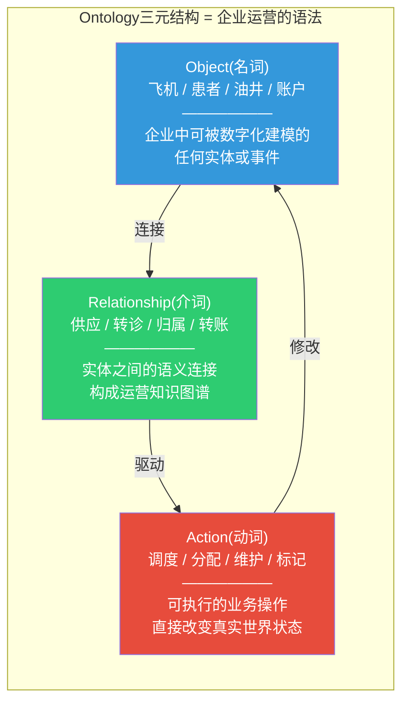

**关键区别——为什么这不是"又一个数据库"**:

传统数据库也存储名词(表)、关系(外键)和操作(存储过程)。但Ontology的根本差异在于三个层面:

1. **语义层而非存储层**: Object不是数据库中的一行记录，而是对真实世界实体的完整数字建模——包含属性、关系、权限、可执行动作和审计历史。一个"飞机"Object同时知道自己的型号、当前航班、维护状态、分配机组、以及谁有权限对它执行什么操作。

2. **双向操作而非单向读取**: BI/分析平台从数据中"读取"洞察。Ontology不仅读取，还能通过Action**写回**外部系统(SAP、Salesforce等)，直接改变业务流程。这是"分析层"和"操作层"的本质区别。

3. **AI的语义锚点**: 当LLM通过Ontology Augmented Generation(OAG)与企业数据交互时，它不是在搜索文档碎片(RAG)，而是在遍历一个结构化的语义网络——查询Object、遍历Relationship、执行Action。这使AI的输出可审计、可解释、受权限控制。

### 为什么三元结构对投资者重要?

三元结构的投资含义可以用一句话总结: **每增加一个Object，就增加了n个潜在Relationship和m个可能的Action——复杂度呈组合爆炸增长，迁移成本同步放大。**

这不是线性锁定，而是指数级锁定。一个拥有50个Object类型的企业Ontology可能有200+个Relationship类型和100+个Action类型。要迁移到竞品平台，需要完整重建这个三元网络——而竞品(Microsoft Fabric IQ、Databricks Unity Catalog)在Relationship和Action层面存在根本性架构缺口(详见Pillar 1 Extension 1C)。

---

## 第二部分: 五个行业案例深挖

### 案例1: 航空制造 — Airbus Skywise

#### 背景

Airbus是全球最大的商用飞机制造商之一。一架A350飞机由数百万个零部件组成，涉及全球供应链中的数百家供应商。2015年起，Palantir与Airbus合作构建了Skywise平台，这是航空业最大规模的Ontology部署之一。[DM-CS1-01]

#### 三元结构在Airbus的具体映射

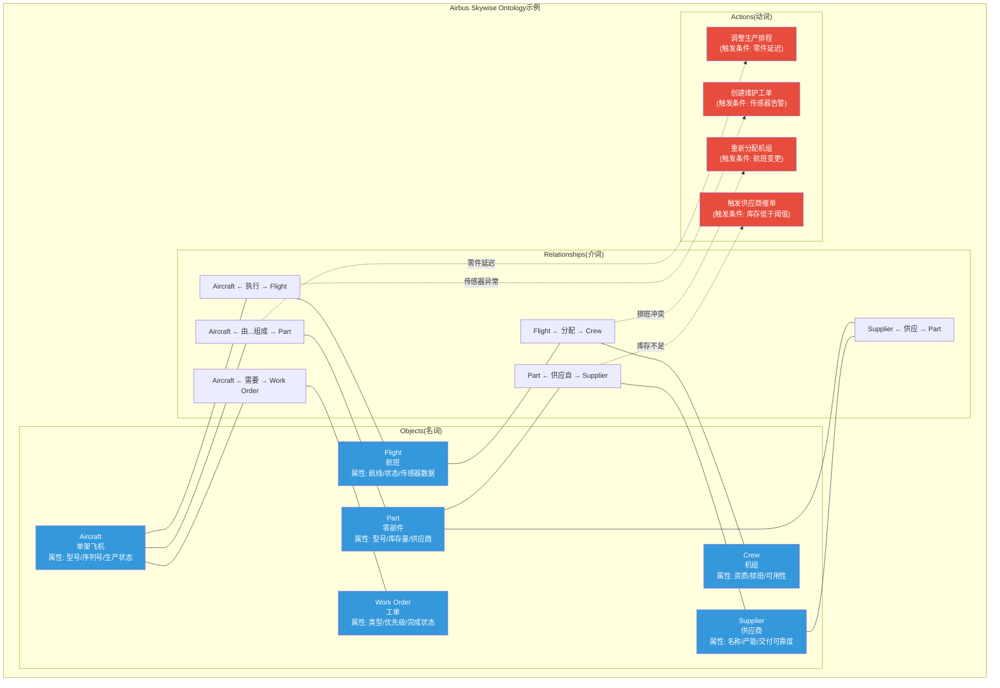

#### 部署规模与实际效果

根据Palantir官方Impact页面和公开报道: [DM-CS1-02]

| 维度 | 数据 | 来源 |
|------|------|------|
| 合作起始 | 2015年 | Palantir Impact: Airbus |
| 平台用户 | 50,000+日常用户(官方称"rely on Skywise in their daily operations") | Palantir-Airbus Partnership Overview |
| 接入飞机 | 10,500+架飞机连接至Skywise | Palantir Impact: Airbus |
| 机队覆盖 | Airbus机队的49% | Palantir Impact: Airbus |
| A350生产加速 | 33%产能提升 | Palantir Impact: Airbus |
| 数据规模 | PB级(petabytes) | Palantir Impact: Airbus |
| 供应链延伸 | 2018年起向供应商开放Skywise | Airbus Press Release, 2018-07 |

**具体运转场景**: 2015年A350生产线面临的核心挑战是**跨系统数据孤岛**——排程数据在一个系统、零部件库存在另一个系统、机组排班在第三个系统、供应商交付记录在第四个系统。当一个供应商延迟交付某个关键零件时，生产团队需要**手动**跨四个系统评估影响、调整排程、通知相关方。

Foundry将这些分散数据源整合进统一的Ontology: 每架飞机、每个零件、每个供应商都成为一个Object，它们之间的供应/组成/调度关系成为Relationship。当供应商延迟发生时，系统可以自动遍历Relationship网络，识别所有受影响的飞机、评估排程影响、并通过Action触发调度变更——从手动协调数天缩短到系统辅助决策数小时。[DM-CS1-03]

**供应链延伸的锁定效应**: 2018年Airbus将Skywise向供应商开放，意味着供应商自身的产能、交付和质量数据也被编码进了Airbus的Ontology。这创造了**跨企业边界的Relationship网络**——供应商的Object(零件、产能)与Airbus的Object(飞机、工单)直接链接。供应商越多地使用Skywise，Airbus的Ontology就越完整，迁移就越不可能——因为你不仅要迁移Airbus内部的Ontology，还要迁移数百家供应商的数据接入。[DM-CS1-04]

#### 投资者含义

Airbus案例展示了Ontology在制造业的典型渗透路径: **单一用例(A350生产优化) → 多用例扩展(排程+供应链+财务) → 平台化(Skywise向全行业开放)**。10年后，50,000+用户和10,500+架接入飞机构成了一个**不可逆的数字基础设施**。Palantir不再是Airbus的"软件供应商"，而是其航空制造数字化运营的底层操作系统。

此案例也是PLTR商业模式的缩影: 从特定痛点切入(A350生产效率)，用Ontology建模解决具体问题，然后随着Object和Relationship的积累，自然扩展到相邻场景——每次扩展都加深锁定。

---

### 案例2: 医疗 — NHS联邦数据平台

#### 背景

英国国家医疗服务体系(NHS)是全球最大的单一付费方医疗系统，服务英格兰5,500万人口。2020年COVID-19疫情期间，NHS与Palantir紧急合作建立了COVID-19数据存储库，随后演化为覆盖整个医疗系统的联邦数据平台(Federated Data Platform, FDP)。[DM-CS2-01]

#### 三元结构在NHS的具体映射

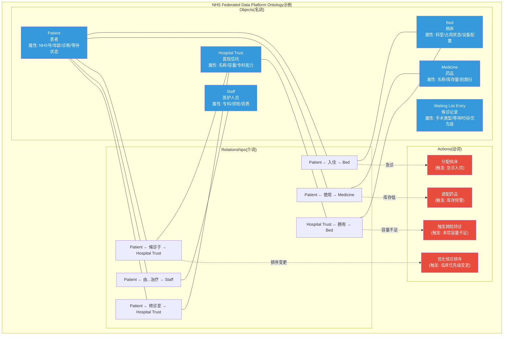

#### COVID-19紧急部署: 实战验证

2020年3月，NHS以1英镑的象征性合同价格启动了与Palantir的紧急合作，目标是在数周内建立全国COVID-19数据存储库。[DM-CS2-02]

**合同演化时间线**:

| 时间 | 事件 | 金额 |
|------|------|------|
| 2020年3月 | 紧急COVID数据存储合同 | 1英镑(象征性) |
| 2020年中 | 六个月延期 | 150万英镑 |
| 2020年12月 | 两年延期合同 | 2,350万英镑 |
| 2023年 | 联邦数据平台(FDP)中标 | 3.3亿英镑/7年 |

来源: CNBC报道(2020-06)、Digital Health报道(2020-12)、NHS公告 [DM-CS2-03]

**COVID期间的具体价值**: 疫情初期，NHS面临的核心挑战是**跨系统可见性缺失**——感染率数据在一个系统、病床可用性在另一个系统、药品库存在第三个系统、疫苗接种记录在第四个系统。当某个地区爆发时，决策者无法快速评估区域医疗容量是否足够。

Foundry将这些分散数据源整合进统一Ontology: 感染率、病床可用性、药品库存、疫苗接种进度——每个都是Object，它们之间的地理、时间、资源关系构成Relationship网络。约8,650名用户(其中约2,100名使用疫苗相关工具)通过这个平台获得了统一的数据基础。[DM-CS2-04]

#### FDP部署现状: 扩张与阻力并存

FDP的目标是覆盖英格兰最多240个NHS组织(信托和综合护理系统)。截至目前的部署进展: [DM-CS2-05]

| 指标 | 数据 | 来源 |
|------|------|------|
| 合同总额 | 3.3亿英镑/7年 | NHS公告 |
| 目标组织数 | 最多240个 | NHS FDP FAQ |
| 活跃使用信托 | 72个(截至2025年5月) | PublicTechnology报道 |
| 签约待部署 | 约半数医院信托"已签约" | PublicTechnology报道 |
| 早期试点结果(Chelsea & Westminster) | 住院候诊名单减少28% | NHS交付计划案例研究 |
| NHS估算ROI | 5倍投资回报 | PublicTechnology报道(2025-10) |

**值得关注的阻力**: 并非所有信托都积极采纳。NHS首席数据和分析官员网络在公开信中表示，部分信托"已经拥有类似工具，其功能和应用目前超过FDP正在开发的内容"。截至2024年底，215个英格兰医院信托中不到四分之一在积极使用FDP。[DM-CS2-06]

这一阻力信号值得投资者关注——它表明Ontology的价值主张在**已有成熟IT基础设施的组织中**并非无争议。FDP的竞争对手不是"无"，而是各信托自建的现有系统。

#### 投资者含义

NHS案例展示了Ontology在医疗领域的独特价值和独特挑战:

**价值面**: COVID期间的紧急部署证明了Ontology在危机响应中的敏捷性——从1英镑合同到全国性数据基础设施只用了数月。当数据孤岛是生死攸关的问题时(病床调配、疫苗分配)，统一Ontology的价值最为直接。

**挑战面**: 3.3亿英镑/7年合同看似庞大，但72/215的信托采纳率(33%)暴露了一个结构性问题——公共医疗系统的去中心化治理结构使得"自上而下的平台推广"面临比商业客户更大的阻力。这是PLTR政府业务的固有挑战: 合同体量大但部署渗透率依赖于终端用户的自愿采纳。

**迁移壁垒评估**: NHS案例的锁定效应弱于商业客户——因为许多信托尚处于"浅层部署"(Dashboard和查询)，Action层的渗透有限。但如果FDP成功推进到运营层(病床调配Action、转诊流程Action)，锁定效应将显著增强。

---

### 案例3: 国防 — TITAN与Maven

#### 背景

Palantir的政府/国防业务是其收入基石(2024年全年收入29亿美元中55%来自政府客户)。两个标志性项目——TITAN(战术情报目标接入节点)和Maven Smart System(Maven智能系统)——代表了Ontology在军事决策基础设施中的最深度嵌入。[DM-CS3-01]

#### 三元结构在军事场景的具体映射

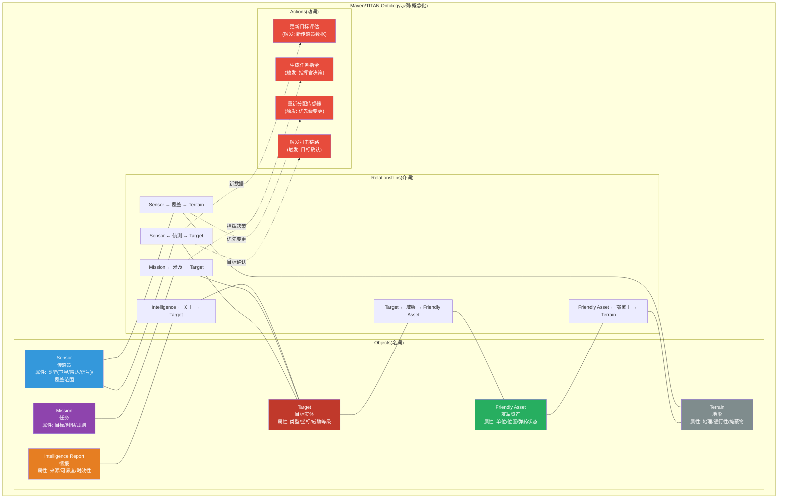

**注意**: 上述Ontology结构是基于公开信息和军事情报系统一般架构的概念化表示，Palantir未公开实际部署的Ontology细节。军事系统的具体Object/Relationship/Action定义属于机密信息。[DM-CS3-02]

#### TITAN: 传感器到射手的决策加速器

TITAN(Tactical Intelligence Targeting Access Node)是美国陆军下一代深度感知地面站，2024年3月Palantir获得1.784亿美元合同，开发和交付10个TITAN原型(5个高级型+5个基础型)。[DM-CS3-03]

**TITAN解决的核心问题**: 在现代战场上，美军拥有大量传感器资产——卫星、高空侦察机、雷达、信号情报系统——但这些传感器产生的海量数据分散在不同系统中。从"传感器发现目标"到"火力单元发射"之间的时间(sensor-to-shooter timeline)过长，是美军在大规模作战中面临的首要能力缺口。[DM-CS3-04]

TITAN通过Ontology解决这个问题的逻辑:

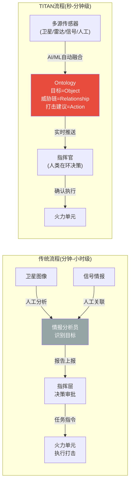

**关键技术能力**(来源: 美国陆军PEO IEW&S官方描述和Palantir新闻稿): [DM-CS3-05]
- 利用AI/ML自动处理来自太空、高空、航空和地面层的传感器数据
- 自动化目标识别和地理定位
- 整合多个传感器数据实现多域操作
- 在战术边缘(tactical edge)提供实时可行动情报

#### Maven Smart System: 从项目到军事AI基础设施

Maven的合同演化反映了Ontology在军事领域的渗透加速: [DM-CS3-06]

| 时间 | 事件 | 金额 |
|------|------|------|
| 2024年5月 | 初始IDIQ合同(5年) | 4.8亿美元 |
| 2024年5月 | 扩展至全军种 | +9,980万美元 |
| 2024年9月 | 增加合同上限 | +7.95亿美元 |
| 合同上限(至2029年) | 总计 | ~13亿美元 |

来源: DefenseScoop(2025-05)、C4ISRNet(2024-05)、DoD合同公告

**覆盖范围**: 初始覆盖5个作战司令部(中央司令部、欧洲司令部、印太司令部、北方司令部/NORAD、运输司令部)，后扩展至全部军种(陆军、空军、海军、太空军、海军陆战队)。活跃用户超过20,000人，分布在3个安全域的35+个工具中——用户数自2024年1月以来翻了一番以上。[DM-CS3-07]

Maven的技术本质: AI算法和机器学习扫描、识别和排序敌方系统和目标，融合来自各种情报、监视和侦察来源(卫星图像、信号情报、电子情报、人工情报等)的数据。用Ontology语言翻译: 每个情报来源的数据被映射为Object(目标、资产、地形)，跨源关联形成Relationship(威胁链、覆盖范围)，分析结果触发Action(目标优先级排序、打击建议)。[DM-CS3-08]

#### 投资者含义

**$10B Army EA(企业协议)的含义**: TITAN和Maven不是孤立的软件合同。它们共同构成了美军从"传感器数据收集"到"作战决策执行"的完整数字化决策链。当军方的情报分析、目标识别、任务规划全部运行在同一个Ontology之上时，这不再是一个软件采购决策——而是**军事决策基础设施**的选择。

**锁定效应在国防领域的特殊性**: 商业客户的迁移成本是金钱和时间。军事客户的迁移成本是**作战能力中断风险**。在战时或紧张局势期间更换核心情报处理系统的可能性接近于零。Maven从4.8亿美元增至13亿美元的合同演化，以及用户从不到10,000增至20,000+的采纳加速，表明这个系统正在成为不可替代的基础设施。

**风险提示**: 国防业务高度依赖政府预算周期和政策方向。Maven合同延伸至2029年，但政府换届可能影响采购优先级。不过，20,000+活跃用户的存量使得中途更换的政治成本极高。[DM-CS3-09]

---

### 案例4: 能源 — BP数字孪生

#### 背景

BP是全球最大的石油和天然气公司之一，运营着从北海到墨西哥湾到阿曼Khazzan气田的全球资产组合。自2014年起，Palantir软件在BP的油气生产运营中广泛部署。2024年9月，双方签署了新的五年战略协议，引入AIP能力。[DM-CS4-01]

#### 三元结构在BP的具体映射

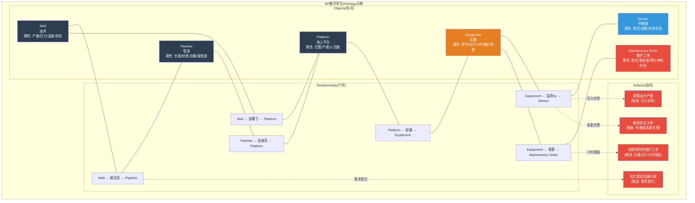

#### 核心数据点: 200万传感器的数字孪生

BP部署的核心成就是一个**基于模型的数字孪生**，集成了: [DM-CS4-02]

| 维度 | 数据 | 来源 |
|------|------|------|
| 合作起始 | 2014年(已超10年) | Palantir-BP新闻稿(2024-09) |
| 传感器接入 | 200万+个实时传感器 | World Oil报道(2024-09-09) |
| 覆盖资产 | 北海海上平台、墨西哥湾、阿曼Khazzan气田 | Palantir-BP新闻稿 |
| 新协议 | 五年战略协议 + AIP集成 | BP-Palantir联合公告(2024-09) |
| 关联企业 | Azule Energy(BP与Eni合资)也部署Palantir | JPT报道 |
| Azule产量 | 20万桶/日，目标25万桶/日 | JPT报道 |

**200万传感器意味着什么**: 每个传感器是一个Object，持续产生时序数据(温度、压力、流量、振动)。200万个传感器Object通过Relationship连接到它们监测的Equipment Object，Equipment连接到Platform，Platform连接到Well和Pipeline。这个Relationship网络的复杂度是天文数字级的。

当一个传感器读数异常时，系统需要在毫秒级内完成: (1)识别异常传感器Object → (2)遍历Relationship找到关联设备 → (3)检查该设备的维护历史 → (4)评估是否需要触发安全关停Action → (5)如果关停，遍历更上游的Relationship评估产量影响。

这正是Ontology Engine层"流式索引1秒checkpoint"设计目标的实战场景。[DM-CS4-03]

#### AIP在BP的新价值层

2024年的五年战略协议不仅续签了Foundry，更引入了AIP。根据公开报道，AIP在BP的具体应用方向: [DM-CS4-04]

**LLM + 数字孪生的结合**: AIP的LLM不直接访问200万传感器的原始数据流——而是通过Ontology的语义层理解数据。一个油田工程师可以用自然语言询问"Khazzan 3号井的压力趋势是否异常?"，AIP通过OAG(Ontology Augmented Generation)路径: (1)将自然语言解析为Object Query(查询Well Object "Khazzan-3"的关联Sensor Objects) → (2)调用Function计算压力趋势统计 → (3)基于结构化数据生成回答并附带数据来源。

**与通用ChatGPT的区别**: 通用LLM只能基于公开训练数据回答"油井压力异常的一般原因"。AIP通过Ontology可以回答"这口特定油井在过去72小时的压力读数、与历史模式的偏差、关联设备的运行状态、以及类似情况的历史处置方案"——这是通用AI和企业AI的本质差距。

**安全护栏**: BP的AIP部署特别强调"确保AI推荐透明度、防止幻觉"的工具。在油气运营中，一个AI幻觉可能导致错误的安全决策——这是AIP通过Ontology的结构化数据保证(而非RAG的文档检索概率)来防范的关键原因。[DM-CS4-05]

#### 投资者含义

BP案例是Ontology锁定效应的**10年纵深验证**: 从2014年的初始部署到2024年的五年续约+AIP升级，BP在Ontology上的投入是持续递增而非单次采购。200万传感器的数字孪生意味着BP的实时运营决策基础设施与Palantir深度绑定。

**能源行业的特殊壁垒**: 油气运营的安全要求使得系统更换的风险容忍度极低。一个在海上平台运行了10年、连接了200万传感器的数字孪生系统，其迁移不仅是技术挑战，更是**运营安全风险**——任何迁移期间的数据断裂都可能导致安全监控盲区。

Azule Energy(BP与Eni合资)的独立部署进一步验证了模式: 即使是BP的合资企业也选择Palantir而非自建替代，说明Ontology的价值已被BP的运营团队内部验证到了"默认选择"的程度。

---

### 案例5: 金融 — 反洗钱(AML)

#### 背景

金融机构面临的反洗钱(AML)合规挑战核心在于**数据孤岛**: 客户信息在核心银行系统、交易数据在支付系统、外部制裁名单在第三方数据库、历史调查记录在案件管理系统。将这些分散数据关联起来以识别可疑活动，传统方法依赖规则引擎和人工调查——成本高、效率低、误报率高。Palantir的Foundry for AML方案已被部署在多家全球金融机构，包括法国兴业银行(Societe Generale)。[DM-CS5-01]

#### 三元结构在AML的具体映射

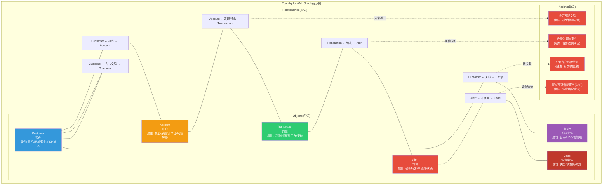

#### Ontology在AML中的核心价值: 实体解析与网络分析

传统AML系统的根本缺陷是**单维度检测**: 基于预设规则(如"单笔交易超过10万美元")逐笔扫描交易。这种方法的误报率极高(industry benchmark: 95-99%告警为误报)，同时漏报率也高(复杂洗钱网络通过拆分交易规避规则)。

Ontology方法的根本区别在于**关系驱动的检测**: [DM-CS5-02]

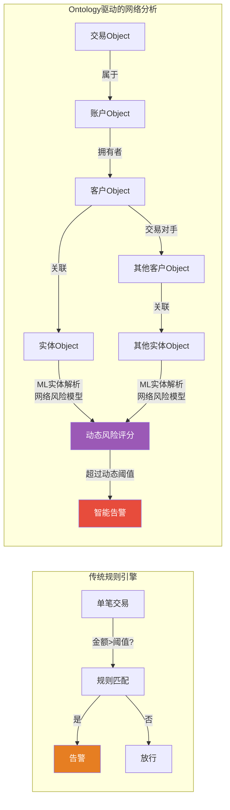

**机器学习实体解析(ML-based Entity Resolution)**: 同一个客户可能在不同系统中有不同拼写的名字、不同格式的地址。Ontology通过ML实体解析将分散在多个系统中的记录链接到同一个Customer Object，创建**单一客户视图(Single Client View)**——这是有效AML的前提条件。[DM-CS5-03]

**网络风险模型**: 一旦Customer Objects之间的Transaction Relationships被建立，系统可以识别传统规则引擎无法发现的模式——例如，10个看似无关的账户通过一个共同的受益人Entity相连，每个账户的单笔交易都低于报告阈值，但网络总流量显著异常。

#### 部署效果与具体指标

根据Palantir官方AML页面和Impact案例: [DM-CS5-04]

| 指标 | 效果 | 来源 |
|------|------|------|
| 成本降低 | 90% | Palantir AML官方页面 |
| 真阳性率提升 | 45倍 | Palantir AML官方页面 |
| 调查时间缩短 | 50% | Palantir AML官方页面 |
| 用例覆盖 | 70+个用例在单一平台 | Palantir AML官方页面 |
| 新账户审查(某零售银行) | 从30%覆盖率提升至100% | Palantir AML Impact案例 |

**兴业银行(Societe Generale)部署**: 2025年3月，兴业银行宣布在其国际零售银行业务中部署基于Foundry的反金融犯罪工具套件，包括高级分析、机器学习算法和全面的风险评估工具，覆盖洗钱和欺诈检测。[DM-CS5-05]

**某零售银行案例**: 此前该银行只能调查30%被标记为洗钱风险的新账户申请，其余70%被自动拒绝。部署Foundry后，同一团队现在能调查100%的标记账户——这意味着既减少了误拒(潜在客户流失)，又提高了真实风险的检出率。[DM-CS5-06]

#### 投资者含义

AML案例展示了Ontology在**强监管环境**中的独特竞争优势:

**合规驱动的采纳**: 金融机构不是"选择"做AML——它们被法规要求必须做。问题只是"用什么工具做"。当Foundry for AML能将真阳性率提升45倍同时降低90%成本时，ROI论证几乎不需要复杂计算。

**审计追踪的锁定效应**: AML系统的每个决策(标记/放行/升级/报告)都需要完整的审计追踪。Ontology的Action Log天然提供这个能力——每次Alert标记、每次Case升级、每次SAR提交都有完整的时间戳、操作者、数据来源记录。这些审计数据积累数年后，迁移不仅是技术问题，更是**监管连续性问题**: 新系统能否完整继承历史审计记录?

**Relationship网络的不可替代性**: AML的核心是关系网络分析。Ontology的一等公民Link Type使得Customer-Entity-Transaction-Account之间的多维关系可以被直接建模和遍历。竞品如果没有等价的关系建模能力(参见Pillar 1 Extension 1C对Microsoft Fabric IQ和Databricks Unity Catalog的分析)，就无法提供同等深度的网络分析。

---

## 第三部分: Bootcamp — 5天锁定客户的商业机器

### Bootcamp是什么?

AIP Bootcamp是Palantir的核心获客机制——一个1-5天的沉浸式、hands-on-keyboard工作坊，目标是让参与者"从0到用例"。截至2024年6月，已完成超过1,300次Bootcamp。[DM-BT-01]

### 三阶段工作流

根据公开信息，Bootcamp遵循三阶段框架(Palantir官方页面和合作伙伴PVM描述): [DM-BT-02]

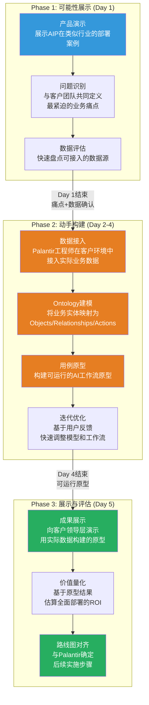

### 为什么5天能锁定客户?

传统企业软件的PoC(概念验证)周期为6-12个月: 需求收集(2个月) → 方案设计(2个月) → 开发(3个月) → 测试(1个月) → 评审(1个月)。Palantir将这个过程压缩到5天，核心在于: [DM-BT-03]

**1. 用实际数据而非虚拟数据**: Palantir工程师在客户环境中接入真实业务数据，而非用模拟数据做演示。这意味着Day 5展示的原型是"用你的数据解决你的问题"，而非"用假数据展示我们的功能"。

**2. Ontology建模的速度优势**: Foundry的数据管道+Ontology建模工具允许在小时级别完成数据接入和Object定义。传统方案需要数周的ETL开发在Foundry中被简化为配置式操作。

**3. AIP Logic的低代码构建**: AIP Logic提供无代码环境，允许在Ontology之上快速构建AI工作流原型——不需要数月的定制开发。

**4. 价值发现的锚定效应**: Day 5的展示不仅是技术演示——它让客户的决策层亲眼看到"自己的数据+AI"能产生什么洞察。一旦决策层看到了这个可能性，"不做"比"做"更需要理由。

### 具体转化案例

根据公开的Earnings Call信息和报道: [DM-BT-04]

| 案例 | Bootcamp后时间 | 结果 |
|------|---------------|------|
| 瓶装水制造商 | <2个月 | 签署七位数ACV合同 |
| 特种制药公司 | <2个月 | 签署七位数ACV合同 |
| 农业软件提供商 | <2个月 | 签署七位数ACV合同 |
| 建筑/工程/建筑公司 | 2天Bootcamp期间 | 开发出价值$1,000万节省的生产就绪用例 |

来源: Palantir Q1 2024 Earnings Call Transcript、Palantir官方博客

### Bootcamp的商业飞轮

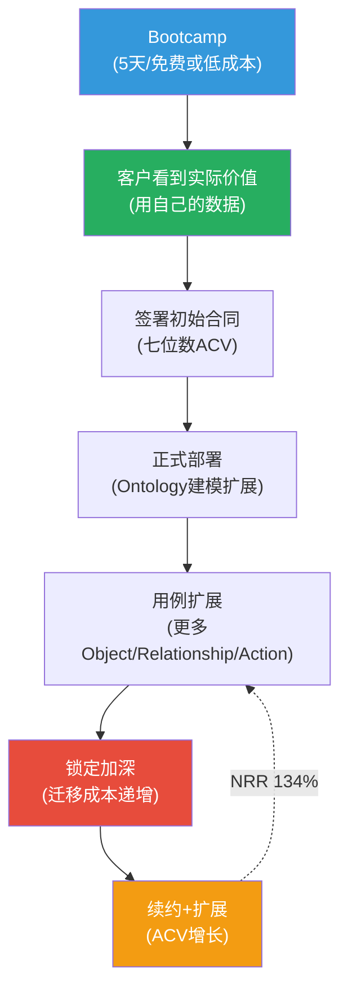

### Bootcamp与传统企业软件销售的对比

| 维度 | 传统企业软件PoC | Palantir Bootcamp |
|------|----------------|-------------------|
| 时间 | 6-12个月 | 1-5天 |
| 数据 | 模拟/样本数据 | 客户真实数据 |
| 成本 | $100K-$500K(PoC费用) | 免费/低成本 |
| 参与方 | IT部门 | **业务部门+IT** |
| 决策层参与 | 通常不参与PoC | Day 5展示会 |
| 产出 | 可行性报告 | **可运行的原型** |
| 心理效应 | "理论上可行" | **"我亲眼看到了"** |

这种模式的战略意义在于**改变了销售漏斗的起点**: 传统模式是"先说服客户拨预算，再证明价值"；Bootcamp模式是"先用5天证明价值，再谈预算"。当决策层在Day 5看到用自己数据构建的AI原型时，采购讨论的议题从"要不要做"变成了"怎么扩大规模"。[DM-BT-05]

### 投资者含义

Bootcamp是理解PLTR商业客户增长加速的关键: 2024年美国商业客户数量同比增长83%，美国商业收入同比增长44%。这种增速不是单纯靠销售团队扩张实现的——而是Bootcamp作为"低摩擦获客机器"的规模化效果。

更重要的是，Bootcamp在技术上做了一件事: **在5天内为客户创建了初始的Ontology模型**(Objects+Relationships+Actions)。这个初始模型虽然简单，但它是后续所有扩展的基础——就像第一条铁轨铺设后，后续的铁路网自然沿此延伸。5天创建的不仅是一个原型，更是一个**锁定起点**。

---

## 第四部分: AIP — Ontology之上的AI革命

### AIP不是"企业ChatGPT"

投资者常犯的错误是将Palantir AIP等同于"企业版ChatGPT"或"类似Microsoft Copilot的东西"。这种类比遗漏了AIP的核心差异化: **AIP不是在文档上运行的AI，而是在Ontology上运行的AI。** [DM-AIP-01]

这个区别在技术上的表现是**OAG(Ontology Augmented Generation) vs RAG(Retrieval Augmented Generation)**:

```mermaid
graph TB
    subgraph "RAG路径(Microsoft Copilot / ChatGPT Enterprise)"
        Q1["用户提问:<br/>'哪些零件可能3周内缺货?'"]
        VDB["向量数据库<br/>搜索相关文档碎片"]
        DOC["检索到的文档片段<br/>(可能过时/不完整)"]
        LLM1["LLM基于文档片段<br/>生成回答"]
        ANS1["回答:<br/>'根据文档描述...<br/>可能存在XXX风险'<br/>——————<br/>不可执行 / 无实时数据<br/>/ 无审计追踪"]
    end

    subgraph "OAG路径(Palantir AIP)"
        Q2["用户提问:<br/>'哪些零件可能3周内缺货?'"]
        OBJ["Object Query Tool<br/>查询Part Objects<br/>过滤: 库存<安全库存<br/>且供应商交期>21天"]
        REL["Relationship遍历<br/>查找受影响的<br/>Aircraft + Work Order"]
        FUN["Function Tool<br/>调用库存预测模型<br/>计算缺货概率"]
        LLM2["LLM基于结构化数据<br/>生成回答+行动建议"]
        ACT["Action Tool<br/>(需确认)触发供应商催单<br/>或调整生产排程"]
        ANS2["回答:<br/>'3个零件面临缺货风险:<br/>Part-A(概率87%, 影响5架飞机)<br/>Part-B(概率64%, 影响2架飞机)<br/>Part-C(概率53%, 影响1架飞机)<br/>——————<br/>建议操作: [触发催单]'<br/>——————<br/>可执行 / 实时数据<br/>/ 完整审计追踪"]
    end

    Q1 --> VDB --> DOC --> LLM1 --> ANS1
    Q2 --> OBJ --> REL --> FUN --> LLM2 --> ACT --> ANS2

    style VDB fill:#95a5a6,color:#fff
    style ANS1 fill:#95a5a6,color:#fff
    style OBJ fill:#3498db,color:#fff
    style REL fill:#2ecc71,color:#fff
    style FUN fill:#8e44ad,color:#fff
    style ACT fill:#e74c3c,color:#fff
    style ANS2 fill:#27ae60,color:#fff
```

### 供应链经理的一天: AIP的具体工作方式

以Airbus供应链场景为例，一个具体的AIP交互路径: [DM-AIP-02]

**场景**: 供应链经理Sarah在周一早上打开系统，问AIP Agent: "这周有什么零件供应风险?"

**AIP的技术执行路径**:

1. **自然语言解析** → AIP识别意图: 查询供应风险

2. **Object Query Tool调用** → 查询所有Part Objects，过滤条件:
   - 在途库存 < 安全库存水平
   - 供应商最近交付可靠度 < 90%
   - 关联Work Order的到期日在7天内

3. **Relationship遍历** → 对每个高风险零件:
   - 遍历 Part → Supplier Relationship: 获取供应商产能和历史数据
   - 遍历 Part → Aircraft Relationship: 识别受影响的飞机
   - 遍历 Aircraft → Work Order Relationship: 评估生产排程影响

4. **Function Tool调用** → 调用库存预测模型，计算每个零件的缺货概率和预期延迟天数

5. **LLM推理** → 基于结构化数据(而非文档碎片)生成摘要:
   > "本周有3个零件面临供应风险:
   > - **Part-7842**(起落架组件): 供应商XYZ近30天交付可靠度72%, 当前在途库存仅覆盖4天, 影响2架A350交付。建议: 启动备用供应商评估。
   > - **Part-3291**(航电模块): 库存充足但质量检验退回率上升至8%, 影响1架A320neo。建议: 安排供应商质量审核。
   > - **Part-1156**(机身面板): 正常库存但供应商报告原材料延迟, 可能在2周后影响3架A350。建议: 提前采购安全库存。"

6. **Action Tool(需Sarah确认)** → 对于Part-7842，AIP建议执行"触发备用供应商询价"Action:
   - Submission Criteria验证: Sarah属于"供应链管理"用户组
   - 执行: 创建询价工单Object，通过Webhook通知备用供应商
   - Action Log记录: 时间、操作者(Sarah)、触发原因、影响对象

**整个过程从提问到行动建议: 秒级**。传统流程中Sarah需要登录3-4个系统、手动拉取数据、用Excel交叉分析、再通过邮件发起流程——需要半天到一天。

### 为什么竞争对手难以复制?

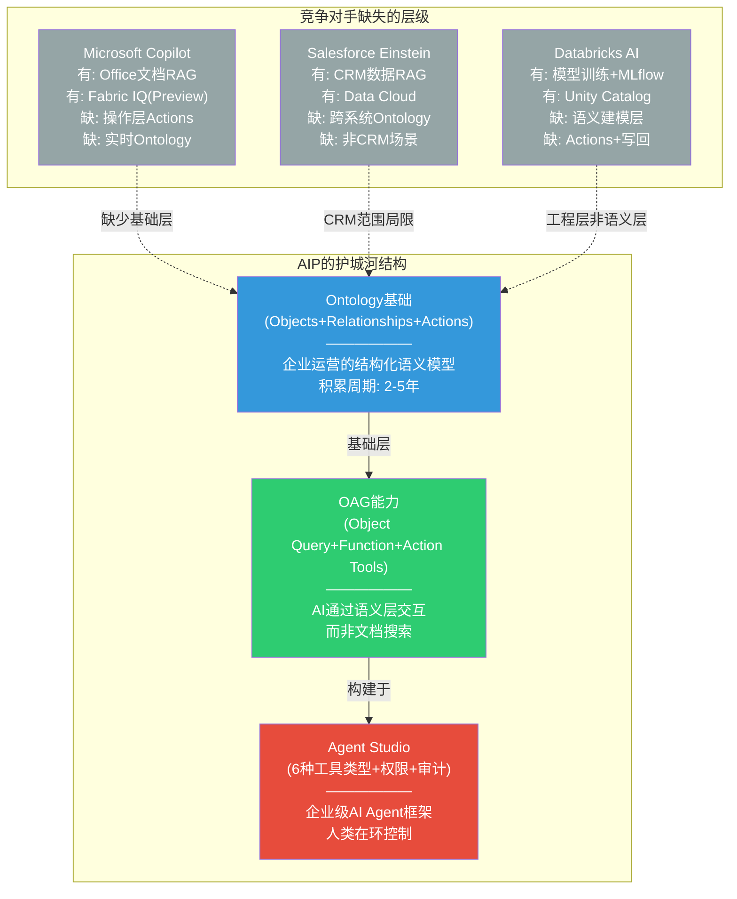

**Microsoft Copilot**: 强于Office生态内的文档/邮件AI辅助。但Copilot的数据来源是文档和OneDrive文件——它不理解"这个零件连接到哪架飞机"的语义关系，也无法触发"创建维护工单"的操作。Fabric IQ的Ontology(2025年10月Preview)是Microsoft的追赶方案，但仍缺少实时同步和Action框架。[DM-AIP-03]

**Salesforce Einstein**: 强于CRM场景(销售预测、客户服务)。但Einstein的语义理解局限于CRM数据(客户/机会/案件)——它无法建模制造业的零件-供应链关系或油气行业的传感器-设备关系。Salesforce的AI是"深但窄"，Palantir AIP是"宽且深"。

**Databricks AI**: 强于模型训练和数据工程。但Unity Catalog是数据目录(只读)，不是操作层(读写)。Databricks与Palantir 2025年3月的战略合作实际上确认了两者的互补而非替代关系——Databricks做数据层，Palantir做语义操作层。

**核心差异一句话总结**: 竞争对手可以构建在文档/CRM/数据仓库上的AI(RAG)。但只有Palantir可以构建在**完整的企业运营语义模型**上的AI(OAG)——因为只有Palantir拥有积累了2-10年的客户Ontology。[DM-AIP-04]

### 投资者含义

AIP代表了PLTR商业模式的**二阶段加速**: 第一阶段是Ontology的渗透(建立锁定)，第二阶段是在已锁定的Ontology之上叠加AI能力(提升ARPU)。这解释了为什么PLTR在2024年的美国商业收入增速(44% YoY)显著快于Ontology单独能支撑的增速——AIP是增量价值层。

更深层的投资含义: **AIP使Ontology的锁定效应从"被动"变为"主动"**。以前客户留在Palantir是因为迁移成本太高(被动锁定)。现在客户留在Palantir是因为只有Palantir的Ontology才能支撑最强的企业AI(主动选择)。从"不能走"变成"不想走"，是锁定效应的质变。

---

## 第五部分: 锁定效应量化 — 从案例到数字

### 从五个案例中提炼迁移成本结构

上述五个案例虽然行业不同，但迁移壁垒呈现出共同的结构: [DM-LK-01]

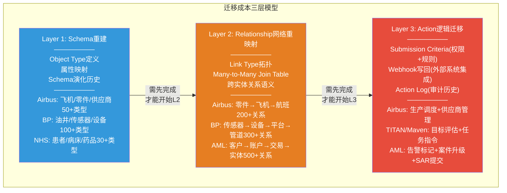

### 按案例的迁移成本估算

基于Pillar 1 Extension 1C的六层模型和本文案例的具体规模推算: [DM-LK-02]

| 案例 | Object规模 | Relationship复杂度 | Action密度 | 估算迁移时间 | 估算迁移成本 |
|------|-----------|-------------------|-----------|------------|------------|
| **Airbus Skywise** | 50,000+用户, 10,500+飞机, PB级数据 | 极高(跨供应商边界) | 高(生产调度+供应链) | 36-48个月 | $20-50M |
| **NHS FDP** | 72个信托, 多系统整合 | 中(院际转诊网络) | 中(当前以查询为主) | 18-30个月 | $8-20M |
| **TITAN/Maven** | 20,000+用户, 多源传感器融合 | 极高(跨域情报关联) | 极高(任务级操作) | **不可行**(作战能力中断风险) | **不适用** |
| **BP数字孪生** | 200万传感器, 全球资产 | 极高(传感器→设备→平台→管道) | 高(安全关停+维护调度) | 30-42个月 | $15-40M |
| **AML(大型银行)** | 数亿交易记录, 数百万客户 | 极高(资金网络拓扑) | 极高(合规审计要求) | 24-36个月 | $10-30M |

**说明**: 上述估算基于Pillar 1 Extension 1C的方法论(L1-L5逐层人天估算 x 混合团队日均成本$800-$1,200)，结合各案例的公开部署规模进行推算。军事场景标记为"不可行"是因为迁移期间的作战能力中断是不可接受的风险。

### 竞争对手的最新进展

投资者需要关注的竞品动态: [DM-LK-03]

**Microsoft Fabric IQ Ontology**: 2025年10月进入Public Preview，支持Entity Types、Relationships(含属性和基数)、Operations Agents(条件监控+告警触发)。但根据截至2026年1月的文档，仍**缺少**: (a)实时同步(需手动刷新)，(b)结构化Action Type框架(无参数/规则/条件/副作用四组件模型)，(c)Writeback机制(无法将决策写回SAP/Salesforce)。Microsoft的追赶方向正确，但在操作层的架构差距至少还有2-3年。

**Databricks Unity Catalog**: 定位为数据治理+目录层，与Palantir 2025年3月宣布战略合作(而非竞争)。Unity Catalog是"工程优先"(engineering-first)平台，给技术团队最大自由度但需要更强的工程ownership。分析师描述: "如果你需要比Unity Catalog自身提供的更丰富的语义层，可以搭配第三方语义/Ontology层"——这间接承认了Palantir在语义操作层的差异化。

**Microsoft Semantic Contracts**: 一篇引起关注的分析文章(Medium, 2026-01)认为Microsoft的Semantic Contracts代表了"两条通往企业Ontology的路径"——Microsoft赋能AI Agent通过语义契约自主运行，Palantir赋能人类分析师探索图数据关系。两种范式可能长期共存而非一方完全取代另一方。[DM-LK-04]

### 锁定效应的时间维度

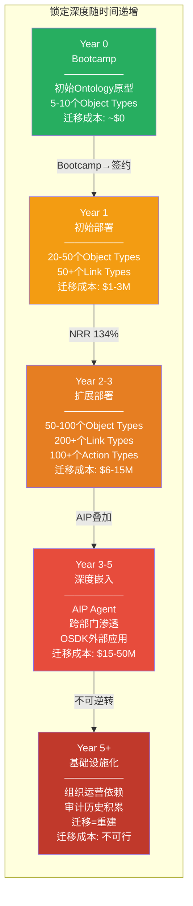

Airbus(2015年至今, 11年)和BP(2014年至今, 12年)已经进入"Year 5+基础设施化"阶段——它们的迁移不是不经济的问题，而是不可行的问题。NHS(2020年COVID起步)正处于Year 2-3的扩展阶段，锁定效应正在建立但尚未达到不可逆转。Maven(2024年5月初始合同)处于Year 1阶段但以军事采购的特殊性，加速进入深度嵌入的速度将远快于商业客户。[DM-LK-05]

### 投资者含义

五个案例的总结指向一个统一论点: **Ontology的锁定效应不是一个静态特征，而是一个随时间递增的动态过程。** 企业在每个阶段做出的都是合理的边际决策(多加一个Object Type、多建一个Relationship、多配置一个Action)，但累积效果是一个指数增长的迁移壁垒。

竞品的追赶(Microsoft Fabric IQ)在数据层和基础语义层有进展，但在操作层(Actions+Webhooks+审计)和AI层(OAG)存在至少2-3年的架构差距。更重要的是，即使竞品完全追平功能，已有客户在Palantir Ontology上积累的Object/Relationship/Action网络和组织知识仍然不可迁移——这就是锁定效应的本质: 竞品需要追赶的不仅是功能，还有客户积累的10年数据资产。

---

## DM锚点注册表

| 锚点ID | 数据类型 | 内容摘要 | 来源 |
|--------|---------|---------|------|
| DM-CS1-01 | 硬数据 | Airbus-Palantir合作始于2015年 | Palantir Impact: Airbus |
| DM-CS1-02 | 硬数据 | 50,000+用户, 10,500+飞机, 33%产能提升, 49%机队覆盖 | Palantir Impact: Airbus; Palantir-Airbus Partnership Overview |
| DM-CS1-03 | 合理推断 | Foundry整合分散数据源解决跨系统协调问题 | 基于Palantir Impact页面描述的A350用例 |
| DM-CS1-04 | 合理推断 | 供应链延伸创造跨企业Relationship网络 | 基于Airbus Press Release(2018-07)关于供应商接入Skywise |
| DM-CS2-01 | 硬数据 | NHS服务英格兰5,500万人口 | 公知 |
| DM-CS2-02 | 硬数据 | 2020年3月NHS与Palantir以1英镑合同启动合作 | CNBC报道(2020-06-08) |
| DM-CS2-03 | 硬数据 | 合同金额演化: 1英镑→150万英镑→2,350万英镑→3.3亿英镑 | CNBC(2020-06), Digital Health(2020-12), NHS公告 |
| DM-CS2-04 | 硬数据 | 8,650名用户, 其中2,100名使用疫苗工具 | Palantir Written Evidence to UK Parliament(DDA0063) |
| DM-CS2-05 | 硬数据 | 72个信托活跃使用(截至2025-05), 目标240个组织 | PublicTechnology(2025-10), NHS FDP FAQ |
| DM-CS2-06 | 硬数据 | 部分信托表示已有类似工具超过FDP功能 | The Register(2025-05-16); NHS CDO Network公开信 |
| DM-CS3-01 | 硬数据 | 2024年PLTR政府收入占比55% | Palantir 2024 10-K |
| DM-CS3-02 | 声明 | 军事Ontology结构为概念化表示, 实际部署细节机密 | 分析方法声明 |
| DM-CS3-03 | 硬数据 | TITAN合同1.784亿美元, 10个原型 | Palantir Investor News(2024-03-06); Army PEO IEW&S公告 |
| DM-CS3-04 | 硬数据 | 深度感知是美军大规模作战首要能力缺口 | Army PEO IEW&S官方描述 |
| DM-CS3-05 | 硬数据 | TITAN利用AI/ML处理多层传感器数据, 缩短sensor-to-shooter时间 | Palantir BusinessWire(2024-03-06) |
| DM-CS3-06 | 硬数据 | Maven合同: 4.8亿→+9,980万→+7.95亿, 总计~13亿美元至2029年 | DefenseScoop(2025-05-23), C4ISRNet(2024-05-30), DoD合同公告 |
| DM-CS3-07 | 硬数据 | Maven 20,000+活跃用户, 35+工具, 3个安全域 | DefenseScoop(2025-05-23) |
| DM-CS3-08 | 合理推断 | Maven使用Ontology进行跨源情报融合的技术路径 | 基于Maven公开描述和Ontology架构能力推断 |
| DM-CS3-09 | 合理推断 | 20,000+用户使得中途更换政治成本极高 | 基于政府IT采购历史模式推断 |
| DM-CS4-01 | 硬数据 | BP与Palantir自2014年合作, 2024年9月签署五年战略协议 | Palantir-BP联合公告(2024-09-09) |
| DM-CS4-02 | 硬数据 | 200万+传感器, 覆盖北海/墨西哥湾/阿曼 | World Oil(2024-09-09); Palantir-BP新闻稿 |
| DM-CS4-03 | 合理推断 | 传感器异常→设备评估→安全决策的Ontology遍历路径 | 基于BP数字孪生公开描述和Ontology Engine能力推断 |
| DM-CS4-04 | 硬数据 | AIP将LLM与数字孪生结合, 强调透明度和防幻觉 | BP-Palantir公告(2024-09); Oilfield Technology(2024-09-11) |
| DM-CS4-05 | 合理推断 | AIP在油气场景通过结构化数据优于通用RAG的防幻觉能力 | 基于OAG vs RAG架构差异推断 |
| DM-CS5-01 | 硬数据 | 兴业银行2025年3月部署Palantir反金融犯罪工具 | BusinessWire(2025-03-04) |
| DM-CS5-02 | 合理推断 | Ontology关系驱动检测优于传统规则引擎单维度检测 | 基于Palantir AML产品描述和AML行业基准推断 |
| DM-CS5-03 | 硬数据 | ML实体解析+网络风险模型, 单一客户视图 | Palantir AML官方页面; Foundry for AML白皮书 |
| DM-CS5-04 | 硬数据 | 成本降低90%, 真阳性率45x, 调查时间-50%, 70+用例 | Palantir AML官方页面(供应商自报数据) |
| DM-CS5-05 | 硬数据 | 兴业银行部署含高级分析+ML+风险评估工具 | Retail Banker International报道; BusinessWire |
| DM-CS5-06 | 硬数据 | 某零售银行从30%覆盖率提升至100% | Palantir AML Impact案例 |
| DM-BT-01 | 硬数据 | 截至2024年6月完成1,300+次Bootcamp | 公开报道; Palantir Earnings Call |
| DM-BT-02 | 硬数据 | Bootcamp三阶段框架: 演示→动手→展示 | Palantir AIP Bootcamp官方页面; PVM Blog |
| DM-BT-03 | 合理推断 | Bootcamp压缩传统6-12个月PoC至5天的机制 | 基于Bootcamp公开描述和传统PoC行业基准推断 |
| DM-BT-04 | 硬数据 | 瓶装水/制药/农业软件公司<2个月签约七位数ACV; 建筑公司$10M节省 | Palantir Q1 2024 Earnings Call; Palantir Blog |
| DM-BT-05 | 合理推断 | Bootcamp改变销售漏斗起点的战略意义 | 基于Bootcamp模式和传统企业软件销售对比推断 |
| DM-AIP-01 | 硬数据 | OAG定义: 比RAG更广泛的决策中心化方法 | Palantir OAG官方文档(docs.palantir.com) |
| DM-AIP-02 | 合理推断 | 供应链经理AIP交互路径的具体执行步骤 | 基于Palantir Agent Studio 6种工具类型文档推断 |
| DM-AIP-03 | 硬数据 | Fabric IQ仍在Preview, 缺少Actions和实时同步 | Microsoft Learn文档(2026-01-28更新) |
| DM-AIP-04 | 合理推断 | OAG依赖客户积累的Ontology, 竞品无法复制 | 基于OAG架构分析和竞品能力对比推断 |
| DM-LK-01 | 分析框架 | 迁移成本三层模型(Schema/Relationship/Action) | 基于五案例共同特征提炼 |
| DM-LK-02 | 合理推断 | 各案例迁移成本估算 | 基于Pillar 1 Extension 1C方法论+案例公开规模推算 |
| DM-LK-03 | 硬数据 | Fabric IQ 2025-10 Preview, Databricks 2025-03合作 | Microsoft Learn; Databricks官方新闻稿 |
| DM-LK-04 | 硬数据 | Microsoft Semantic Contracts分析(两条Ontology路径) | Medium(2026-01) |
| DM-LK-05 | 合理推断 | 各案例按锁定时间维度的阶段判定 | 基于公开合作起始年份和部署规模推断 |

---

**数据诚实声明**: 本文中标记为"硬数据"的DM锚点来源于Palantir官方页面、新闻稿、政府合同记录和主流媒体报道。标记为"合理推断"的锚点基于公开信息和架构逻辑的合理延伸，已标明推断基础。标记为DM-CS5-04的AML效果数据(90%成本降低、45x真阳性率)来源于Palantir官方营销材料，属于供应商自报数据，未经独立第三方验证。军事场景(TITAN/Maven)的Ontology具体结构为概念化表示，实际部署细节属于机密信息。
