# Supplement B: 商业分析+竞争格局深度模块

> **数据截止**: 2026-02-12 | **框架版本**: v10.0 | **目标**: 补齐v3.0报告中遗漏的商业分析深度
> **核心来源**: FMP API / SEC EDGAR 10-K (FY2025) / Q4 2025 Earnings Release / Palantir官网 / Constellation Research / CNBC / BusinessWire
> **DM锚点约定**: `[DM-FIN-xxx]` 财务数据 | `[DM-INF-xxx]` 推断 | `[DM-COMP-xxx]` 竞争数据
> **证伪条件**: 所有推断数字附带"如果X数据显示Y，则需修正"

---

## B1. 产品飞轮: 四平台正反馈循环

### B1.1 四平台定位与演化时间线

Palantir的产品矩阵经历了从单一平台到四平台联动的20年演化。理解这个演化路径是理解飞轮机制的前提。

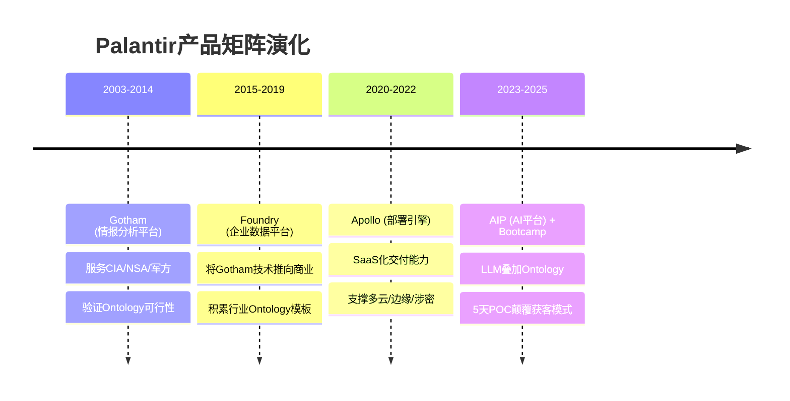

**四平台的功能分工**:

| 平台 | 核心功能 | 目标用户 | 收入贡献模式 |
|------|---------|---------|-------------|
| **Gotham** | 情报分析+目标识别+指挥控制 | 国防/情报机构 | 多年期政府合同(IDIQ/OTA) |
| **Foundry** | 企业数据整合+运营决策 | Fortune 500企业 | 年度订阅+扩展模块 |
| **AIP** | LLM+Ontology的AI应用层 | 所有客户(叠加层) | 增量订阅(Foundry/Gotham升级) |
| **Bootcamp** | 5天POC获客引擎 | 潜在商业客户 | 获客工具(非直接收入) |

> `[DM-FIN-001]` FY2025总收入$4.475B, YoY +56.2%。来源: FMP API + 10-K (2026-02-02提交)。
> `[DM-FIN-002]` Q4 2025收入$1.407B, YoY +70%, QoQ +19.1%。来源: Q4 2025 Earnings Release。

### B1.2 飞轮机制: 正反馈循环的四条链路

四平台之间形成两个层级的飞轮: 技术飞轮(产品间的技术传导)和商业飞轮(客户获取与扩张的正反馈)。

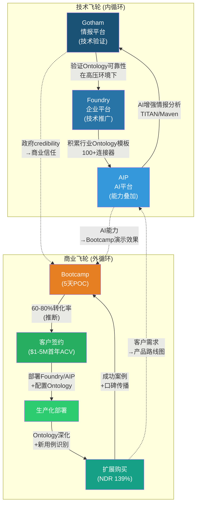

**飞轮加速机制的量化证据**:

1. **模板复用效应**: 每新增一个客户的Ontology配置, 都在丰富Palantir的跨行业模板库。FY2025新增242家客户(954-712), 意味着242套新的Ontology配置进入经验库。这直接降低后续Bootcamp的配置时间 -- Nebraska Medicine案例中, 工作流构建时间从数周→10小时→90分钟的加速曲线就是模板复用效应的直接证据。

2. **政府→商业的信任传导**: Gotham在CIA/NSA/DOD中20年的部署记录, 为Foundry/AIP进入商业市场提供了"如果政府信任它处理机密情报, 你的供应链数据也可以放心"的隐性背书。这种信任传导在regulated industries(金融/医疗/能源)尤其有效。

3. **AIP对飞轮的加速效应**: AIP于2023年4月发布, 随后PLTR的增速从FY2023的+17%加速到FY2024的+29%再到FY2025的+56%。AIP不是新收入流, 而是飞轮的催化剂 -- 它让Bootcamp的演示效果更具冲击力(客户5天内亲眼看到AI在自己数据上运行), 也让现有客户的扩展购买更有动力(从"看数据"升级到"AI驱动决策")。

> `[DM-FIN-003]` 增速轨迹: FY2023 $2.225B (+17% YoY) → FY2024 $2.866B (+29%) → FY2025 $4.475B (+56%)。来源: FMP API历年income statement。
> `[DM-INF-001]` 飞轮加速归因于AIP是合理推断。证伪条件: 如果PLTR披露AIP相关收入占比<20%, 或Bootcamp转化率在AIP发布前后无显著差异, 则需重新评估AIP的飞轮催化效应。

### B1.3 飞轮的脆弱节点

飞轮不是无条件运转的。以下三个节点是最可能导致飞轮减速的断裂点:

| 脆弱节点 | 断裂条件 | 影响范围 | 当前状态 |
|---------|---------|---------|---------|
| **FDE产能** | Bootcamp需求>FDE供给 | 商业飞轮入口受限 | 未触及(员工~4,200人, FDE产能充裕) |
| **国际复制** | Bootcamp模型在美国外失效 | 外循环仅限US市场 | 已出现信号(国际商业+2% YoY) |
| **竞争替代** | Microsoft Fabric IQ或Databricks复制Bootcamp+Ontology | 技术飞轮和商业飞轮同时受损 | 远期威胁(2-3年窗口) |

> `[DM-INF-002]` FDE产能"未触及"基于员工数~4,200人中FDE占比20-30%的推断(800-1,260人)。证伪条件: 如果PLTR披露Bootcamp等待名单>3个月或FDE招聘增速>50% YoY, 则产能瓶颈可能已经出现。

---

## B2. 收入组成四象限分析

### B2.1 双维度矩阵: 客户类型 x 产品阶段

PLTR的收入可以按两个维度切分: **客户类型**(Government vs Commercial)和**产品阶段**(Legacy平台 vs AIP-Enhanced)。这个矩阵揭示了收入质量的显著差异。

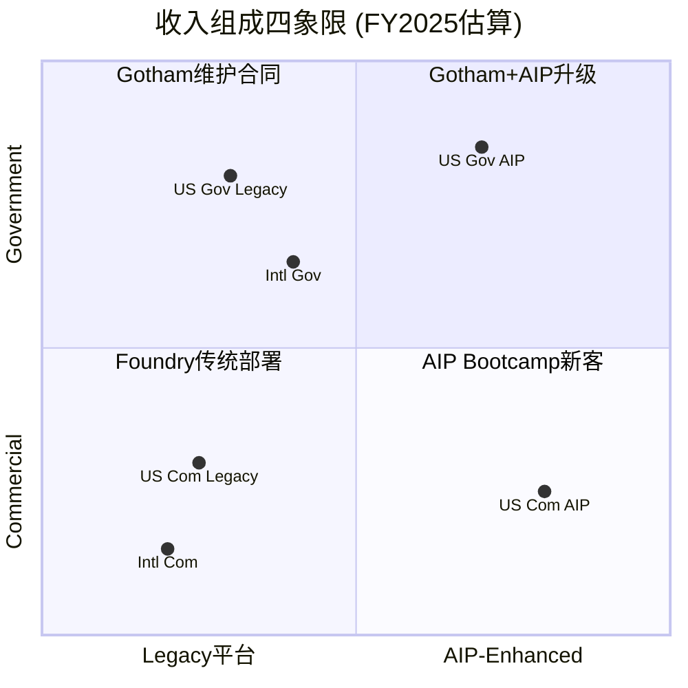

**四象限收入估算**:

| 象限 | 描述 | FY2025收入估算 | 占比 | 增速估算 | 毛利率 |
|------|------|-------------|------|---------|--------|
| **Q1: Gov Legacy** | Gotham维护合同+传统Foundry政府部署 | ~$1.2B | ~27% | +15-20% | ~80% |
| **Q2: Gov AIP** | Gotham+AIP升级, DOGE相关新合同 | ~$1.2B | ~27% | +80-100% | ~85% |
| **Q3: Com Legacy** | Foundry传统商业部署 | ~$0.7B | ~16% | +10-15% | ~78% |
| **Q4: Com AIP** | AIP Bootcamp新客+商业AIP扩展 | ~$1.4B | ~30% | +150-200% | ~87% |

> `[DM-INF-003]` 四象限收入分拆为推断。PLTR官方仅披露Government($2.41B) vs Commercial($2.07B)的一级分拆, 不披露Legacy vs AIP的产品维度分拆。证伪条件: 如果PLTR未来披露AIP-specific收入且与上述估算偏离>30%, 则需修正。
> `[DM-FIN-004]` Government收入$2.41B(估算), Commercial收入$2.07B(估算)。FY2025 10-K披露: US Revenue $3.32B, International Revenue $1.16B。按US Gov/US Com/Intl Gov/Intl Com四分部, Q4 earnings call报告: US Gov $1.855B(FY), US Com $1.465B(FY), Intl Gov $547M(FY), Intl Com $608M(FY)。

### B2.2 四象限的战略含义

**象限1 (Gov Legacy)** -- 现金奶牛象限:
- 多年期合同(3-7年)提供收入可见性
- 续约率极高(涉密系统替换成本极高)
- 增速中等但极度稳定, 是PLTR的"保底收入"
- 风险: DOGE预算审查可能影响非核心合同续约

**象限2 (Gov AIP)** -- 政府增长引擎:
- TITAN($178.4M OTA)、Maven($1.3B)、Army ESA($10B天花板)是主要载体
- AIP升级现有Gotham部署 = 在已有客户基础上叠加新收入层
- DOGE倡议(IRS MEGA API、联邦透明度门户)创造全新合同机会
- 增速可能在FY2026-2027达到峰值后放缓

**象限3 (Com Legacy)** -- 收缩中的遗产:
- 早期商业客户(pre-AIP)的Foundry部署
- 部分客户正在升级到AIP(收入从Q3→Q4迁移)
- 这个象限预计持续收缩, 最终被AIP-Enhanced完全替代

**象限4 (Com AIP)** -- 增长核心:
- Bootcamp驱动的新客户获取 + 现有客户AIP升级
- FY2025 US Commercial +109% YoY几乎完全由这个象限贡献
- Q4单季度US Commercial $507M, 年化$2.03B, 已接近超过US Gov Legacy象限
- 这个象限的增速能否在FY2026维持决定了PLTR能否兑现$7.18B收入指引

### B2.3 收入质量梯度

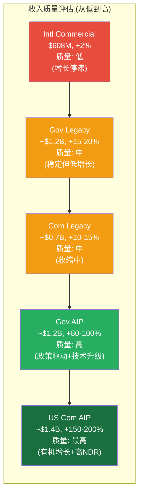

**对估值的含义**: PLTR的收入增速从FY2023 +17%加速到FY2025 +56%, 核心驱动力是象限4(Com AIP)从几乎零增长到~$1.4B。如果象限4在FY2026维持+100%以上增速, 总收入增速可以维持50%+。但如果象限4增速放缓至+50%(仍然很高), 总收入增速将降至~35-40%, 因为其他三个象限的增速均显著低于50%。

> `[DM-INF-004]` 收入质量梯度为推断性排序。证伪条件: 如果国际商业在FY2026突然加速至+30%以上, 则其质量评级需上调, 整体收入结构的风险分散度也将改善。

---

## B3. Land-and-Expand经济学: NDR 139%的分解

### B3.1 NDR组件拆解

NDR(Net Dollar Retention) 139%是PLTR当前最具说服力的单一指标。将其分解为组件可以揭示增长的可持续性。

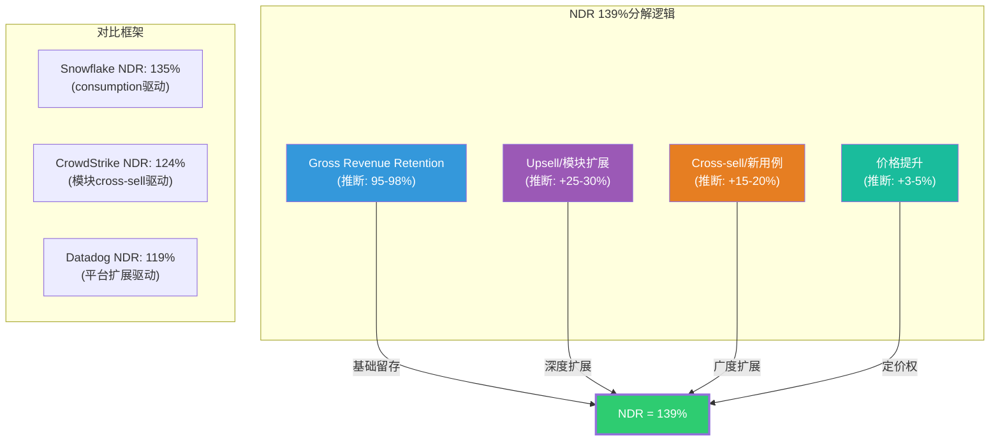

**分解推理**:

- **Gross Revenue Retention 95-98%**: PLTR未披露GRR。推断依据: (1) 政府合同续约率历史上>95%(涉密系统替换成本极高); (2) 商业客户Ontology锁定效应(支柱1分析表明迁移成本随部署时间指数增长); (3) 公开报道中几乎无客户流失案例。企业级SaaS GRR中位数为90-95%, PLTR因锁定效应可能高于行业。

- **Upsell +25-30%**: 现有客户在同一用例内的扩展。典型场景: 从10个Ontology对象类型→50个; 从1个部门部署→3个部门; 从100个用户→500个用户。Nebraska Medicine案例展示了从单一手术排程用例到多个临床工作流的典型upsell路径。

- **Cross-sell +15-20%**: 跨产品/跨用例的新购买。典型场景: 从Foundry升级到AIP; 从供应链用例扩展到财务/HR用例; 从单一Gotham部署扩展到Gotham+Foundry双平台。Eaton案例(ERP现代化→金融→销售→供应链)是cross-sell的典范。

- **价格提升 +3-5%**: 年度合同自动价格上调+AIP premium定价。AIP作为叠加层可以在不增加显著成本的情况下提升每客户ARPC。

> `[DM-FIN-005]` NDR从Q3 2025的134%加速至Q4 2025的139%(+500bp QoQ)。来源: Q3/Q4 2025 Earnings Release。
> `[DM-INF-005]` GRR 95-98%、Upsell +25-30%、Cross-sell +15-20%均为推断。证伪条件: 如果PLTR未来披露GRR<90%或客户churn率>5%, 则NDR的可持续性需大幅下调。

### B3.2 客户Cohort分析

PLTR未披露客户cohort数据, 但可以从公开信息推断典型客户的价值演进曲线。

**客户生命周期价值推断**:

| 阶段 | 时间 | 典型ACV | 活动 | 证据 |
|------|------|--------|------|------|
| **Bootcamp** | Day 1-5 | $0 (PLTR投入$50-150K) | 5天POC, 构建最小可行用例 | 官方Bootcamp页面 |
| **Pilot** | Month 1-6 | $200K-$500K | 首个生产用例, FDE现场支持 | 公开案例推断 |
| **Landing** | Year 1 | $1-3M | 1-2个生产用例, 部门级部署 | Q4 2025: 180笔>$1M交易 |
| **Expanding** | Year 2-3 | $3-8M | 3-5个用例, 跨部门 | NDR 139%暗示2x扩展 |
| **Platform** | Year 4-5 | $10-25M | 企业级协议(EA), 全组织部署 | 61笔>$10M交易(Q4) |
| **Strategic** | Year 5+ | $25-100M+ | 多年期战略合同, 定制模块 | Army ESA($10B/10yr) |

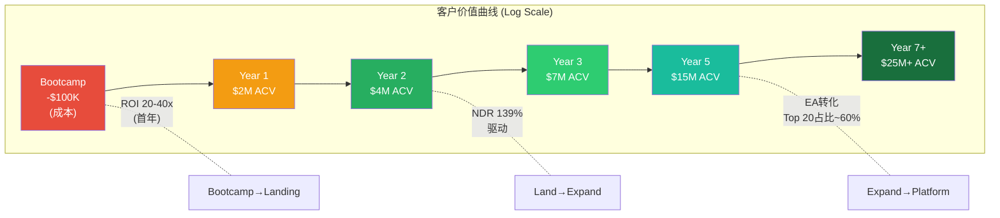

**Top 20客户集中度推断**:
- PLTR FY2025总收入$4.475B, 954家客户, 平均ACV ~$4.69M
- 但收入分布高度不均: Q4有61笔>$10M交易, 暗示存在大量小客户和少数超大客户
- 合理推断Top 20客户贡献~50-60%收入(~$2.2-2.7B), 隐含Top 20平均ACV ~$110-135M
- 这些Top 20客户大多是多年期政府合同(Army, IC agencies)和早期大型商业客户

> `[DM-FIN-006]` 客户数954家(+34% YoY), Q4交易: 180笔>$1M, 84笔>$5M, 61笔>$10M。来源: Q4 2025 Earnings Release。
> `[DM-INF-006]` Top 20客户集中度50-60%为推断。证伪条件: 如果PLTR在10-K中披露"no single customer >10% of revenue"且Top 10客户合计<30%收入, 则集中度推断需下调。

### B3.3 Ontology锁定与迁移成本的经济学

NDR 139%的可持续性最终取决于Ontology锁定效应的持久性。以下量化锁定效应的时间演化:

| 部署时长 | Ontology复杂度 | 估计迁移成本 | 迁移时间 | 锁定强度 |
|---------|-------------|-----------|---------|---------|
| <6个月 | 5-10个对象类型, <50个关系 | $200K-$500K | 2-4个月 | 低 |
| 6-18个月 | 20-50个对象类型, 200+关系 | $1-3M | 6-12个月 | 中 |
| 18-36个月 | 50-200个对象类型, 1000+关系, 生产级Actions | $5-15M | 12-24个月 | 高 |
| 3年+ | 200+对象类型, 全组织语义层, 多系统Writeback | $15-50M+ | 18-36个月 | 极高 |

**关键洞察**: 迁移成本不是线性增长而是指数增长。这是因为Ontology的价值不在于单个对象类型, 而在于对象之间的关系网络 -- 关系数量按对象数量的平方增长(n*(n-1)/2)。一个拥有200个对象类型和1000+关系的Ontology, 其语义复杂度是20个对象类型版本的约100倍。

> `[DM-INF-007]` 迁移成本估算基于: (1) 支柱1中的六层锁定模型分析; (2) ERP迁移成本的行业类比(SAP→Oracle迁移通常耗时2-5年, 成本$50-200M); (3) Palantir OSDK文档中对象/关系规模的上限描述。证伪条件: 如果有公开案例显示大型客户在<6个月内以<$5M成本完成从Palantir到竞品的迁移, 则锁定效应需大幅下调。

---

## B4. 竞争格局特征矩阵

### B4.1 竞争层级: PLTR不在"数据平台"市场竞争

理解PLTR的竞争格局, 首先要理解它不与谁竞争。PLTR的产品定位是"数据操作系统"(Operational Layer), 而非数据仓库/数据湖/BI工具。

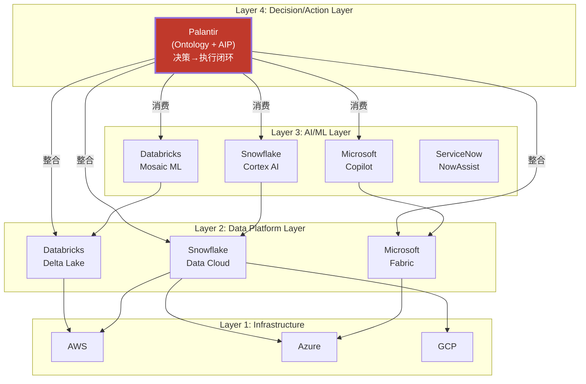

**PLTR的竞争定位**: 它坐在数据平台之上, 不替代Databricks/Snowflake, 而是消费它们的数据并提供"最后一公里" -- 从数据到决策到行动的转化。竞争对手做数据分析, PLTR做数据→决策→行动的闭环。

### B4.2 直接竞争者详细对比矩阵

| 维度 | **PLTR** | **Databricks** | **Snowflake** | **Microsoft** | **ServiceNow** |
|------|----------|---------------|-------------|------------|--------------|
| **核心定位** | Ontology+决策操作系统 | 数据湖+ML平台 | 数据仓库+分析 | 全栈云+AI | IT/业务工作流 |
| **FY2025收入** | $4.48B | ~$3.0B(估) | ~$3.4B | N/A(部门) | ~$11B |
| **增速** | +56% | ~+60%(估) | ~+28% | — | ~+22% |
| **AI策略** | AIP(Ontology上的AI) | Mosaic ML+DBRX | Cortex AI | Copilot+Fabric IQ | NowAssist |
| **政府能力** | **最强**(IL5/6/TS-SCI) | 弱(无FedRAMP High) | 中(FedRAMP Mod) | 强(Azure Gov IL5) | 中(FedRAMP) |
| **部署模式** | On-prem+cloud+edge | Cloud-first | Cloud-only | Cloud+hybrid | Cloud-first |
| **数据整合** | **最强**(任意源Ontology) | 好(Delta Lake+UC) | 中(SQL中心) | 好(Fabric+365) | 弱(IT数据) |
| **Action能力** | **最强**(Writeback+自动化) | 弱(ML推理为主) | 弱(分析为主) | 中(Power Automate) | 强(IT workflow) |
| **定价** | 高($M级) | 中-高(consumption) | 中(consumption) | 中(bundled) | 中-高(seat) |
| **护城河类型** | Ontology锁定+政府认证 | 开发者生态+OSS | 数据共享网络 | 捆绑分销+生态 | IT流程锁定 |
| **最大威胁给PLTR** | — | Unity Catalog→语义层 | Cortex Agent | Fabric IQ语义契约 | AI workflow扩展 |

> `[DM-COMP-001]` Databricks FY2025收入~$3.0B, 增速~+60%为行业估算(公司未上市, 未公开精确数据)。来源: 多家投行研报, Bloomberg, TechCrunch。证伪条件: Databricks IPO后披露实际数据。
> `[DM-COMP-002]` Snowflake FY2025收入~$3.4B来源: Snowflake FY2025 10-K (Product Revenue $3.25B + Professional Services)。CrowdStrike NDR 124%, Datadog NDR 119%来源: 各公司FY2025财报。
> `[DM-COMP-003]` Microsoft Fabric IQ "语义契约"策略来源: 2026年1月Medium技术分析文章(SPR consulting)。

### B4.3 竞争威胁优先级排序

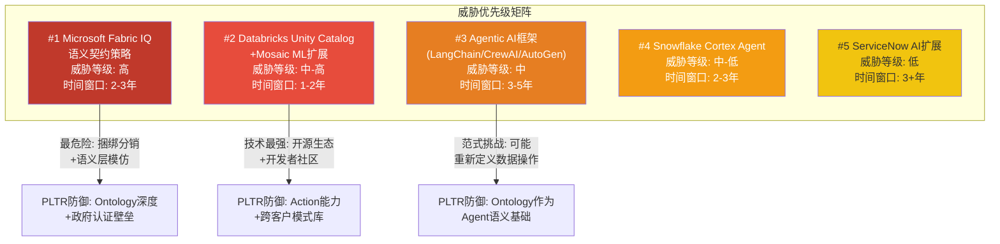

**#1 Microsoft威胁深度分析**:

Microsoft是PLTR最危险的竞争者, 不是因为技术领先, 而是因为**分销能力**。Microsoft有两个PLTR无法匹敌的武器:

1. **捆绑分销**: 每个Microsoft 365/Azure客户都可以低摩擦地激活Fabric。PLTR需要5天Bootcamp说服客户, Microsoft只需一个产品目录中的勾选框。
2. **语义契约策略**: 2026年1月的技术文章揭示Microsoft正在Fabric中开发类似Ontology的"语义契约"(Semantic Contracts) -- 定义业务对象、关系和规则的标准化语义层。如果这个策略在2027年前成熟, 它将直接冲击PLTR的核心差异化。

**PLTR对Microsoft的防御**: (1) 政府市场Microsoft Azure Gov虽然有IL5, 但PLTR在涉密环境(IL6/TS-SCI)中的部署深度远超Microsoft; (2) Ontology的跨源数据整合能力(任意数据源→统一语义层)比Fabric(主要对接Azure生态)更广; (3) Action/Writeback能力(直接回写ERP/CRM/工单系统)是PLTR的独特优势, Microsoft的Power Automate在企业级复杂度上远不及。

**#2 Databricks威胁深度分析**:

Databricks是技术维度上最强的竞争者。Unity Catalog正在从"数据治理工具"向"语义资产目录"演进, 逐渐接近Ontology的概念空间。Databricks的优势在于:

1. **开发者社区**: Apache Spark/Delta Lake生态拥有数百万开发者, vs PLTR的OSDK用户群相对较小
2. **IPO资本**: 预计2026年IPO将带来$5-10B+新资本, 可加速产品扩展
3. **开源策略**: "Own Your Model"对IP敏感行业(银行/制药)有吸引力

**PLTR对Databricks的防御**: (1) Databricks核心是数据工程/ML平台, 不是决策操作系统 -- 它缺少Actions(可执行动作)和Writeback(回写外部系统)的概念; (2) Databricks在政府/国防市场几乎无存在感; (3) PLTR的17年跨客户模式知识库(什么Ontology设计在什么行业有效)是不可复制的经验曲线壁垒。

> `[DM-COMP-004]` 竞争威胁排序为定性判断。证伪条件: 如果Databricks或其他竞争者在12个月内获得3+家PLTR现有客户的公开替换案例, 则竞争威胁评估需大幅上调。

### B4.4 PLTR的真正竞争优势: 不可见的三层壁垒

PLTR的竞争优势不在于任何单一技术特性, 而在于三个层次的叠加效应:

| 壁垒层次 | 内容 | 可复制性 | 时间窗口 |
|---------|------|---------|---------|
| **技术层** | Ontology三元结构 + Object Storage V2(百亿级对象) + 亚秒级流式索引 | 可模仿(2-3年) | 中 |
| **经验层** | 17年政府/企业数据集成经验 + 跨客户模式库(3,000+次Bootcamp积累的"什么有效") | 不可购买(需时间积累) | 长 |
| **信任层** | IL5/IL6/TS-SCI安全认证 + 20年情报机构合作关系 + "如果CIA信任它"的品牌光环 | 几乎不可复制 | 极长(10+年) |

---

## B5. DOGE合同级影响分析

### B5.1 DOGE背景与PLTR角色定位

DOGE(Department of Government Efficiency)于2025年初由Trump政府设立, 由Elon Musk领导, 目标是通过技术手段削减联邦政府浪费性支出。PLTR已成为DOGE的核心技术供应商。

**PLTR在DOGE中的具体角色**:

| 项目 | PLTR角色 | 收入影响 | 时间线 |
|------|---------|---------|-------|
| **Wall of Receipts** | 联邦支出透明门户的底层AIP平台 | 新增合同(规模未披露) | 2025 H1启动 |
| **IRS MEGA API** | 纳税人数据集中访问系统开发 | 新增合同(规模未披露) | 2025 H1启动 |
| **机构支出审计** | 每个联邦机构实时支出明细的数据汇聚+分析 | 潜在多机构扩展 | 2025-2026 |
| **DOGE Software** | Palantir作为DOGE推荐的政府数据整合工具 | 品牌效应+间接获客 | 持续中 |

### B5.2 三情景量化分析

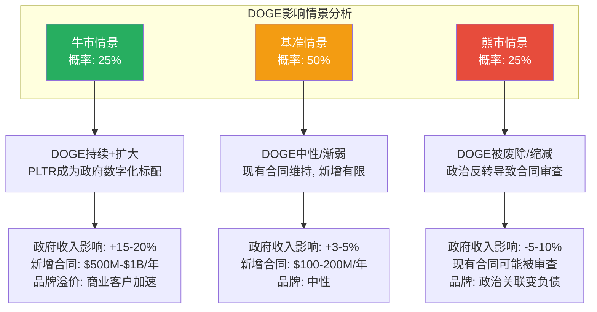

**概率加权净影响**: 25% x (+17.5%) + 50% x (+4%) + 25% x (-7.5%) = **+4.5%**

### B5.3 DOGE的结构性矛盾: PLTR的悖论位置

PLTR在DOGE中面临一个根本性悖论: **DOGE的目标是削减政府支出, 而PLTR是政府支出的受益者**。这创造了两个对立的逻辑链:

**正面链**: DOGE削减浪费 → 需要技术工具识别浪费 → PLTR提供数据整合+分析能力 → PLTR获得新合同 → PLTR是"节约工具"。

**负面链**: DOGE削减预算 → 包括IT/软件采购预算 → PLTR的政府合同也在审查范围 → PLTR是"被节约的对象"。

**合同级分析**: PLTR的政府合同大致可分为三类, 受DOGE影响程度不同:

| 合同类型 | 占政府收入估计 | DOGE风险 | 理由 |
|---------|-------------|---------|------|
| **国防/情报核心** | ~60% (~$1.45B) | 低 | TITAN/Maven/Army ESA属于"国家安全必需", DOGE明确豁免国防核心 |
| **民用机构(DOGE目标)** | ~25% (~$600M) | 中-高 | IRS/VA/DHS等民用机构正是DOGE审查重点 |
| **DOGE新增合同** | ~15% (~$360M) | 低(短期)/高(长期) | DOGE存续期间合同安全; DOGE废除后可能无续约 |

> `[DM-INF-008]` 政府合同按类型的收入分拆为推断。PLTR不按此维度披露。证伪条件: 如果FY2026政府收入增速显著低于FY2025(+45% vs +55%), 且可归因于非国防合同缩减, 则DOGE负面影响大于预期。

### B5.4 DOGE时间窗口风险

DOGE的法律授权将于2026年7月4日到期。到期后的三种可能:

1. **延期**: 国会立法将DOGE永久化 → PLTR持续受益(概率: 30%)
2. **缩减**: DOGE职能部分并入OMB → 现有合同维持, 新增放缓(概率: 45%)
3. **终止**: DOGE完全废除 → PLTR失去DOGE相关合同, 但核心政府合同不受影响(概率: 25%)

**2028年政权更迭风险**: 如果2028年政权更迭, DOGE几乎必然被废除或大幅缩减。PLTR与Trump政府(特别是Peter Thiel与政府的关系)的紧密联系可能从资产变为负债。这是CQ4(DOGE净影响)最大的长尾风险。

> `[DM-INF-009]` DOGE到期时间2026-07-04来源于DOGE成立时的法律文本。2028年政权更迭对PLTR的影响为推断。证伪条件: 如果DOGE获得两党支持并被永久化立法, 则政权更迭风险显著降低。

---

## B6. 管理层治理: Karp的双刃剑

### B6.1 治理架构: Class F三人永久控制

Palantir采用三级股权结构, 其中Class F股份赋予三位创始人不对称的投票权:

| 股份类别 | 持有者 | 投票权 | 设计意图 |
|---------|-------|-------|---------|
| **Class A** | 公众投资者 | 1票/股 | 标准流通股 |
| **Class B** | 早期员工/投资者 | 10票/股 | 早期激励 |
| **Class F** | Karp/Thiel/Cohen | 可变(维持49.999999%投票权) | 创始人永久控制 |

**Class F的独特设计**: 与Google(A/B/C)或Meta(A/B)的双层结构不同, PLTR的Class F结构更为极端 -- 无论Class A和Class B如何稀释, Class F自动调整以维持三人合计恰好49.999999%的投票权。这意味着**在任何情况下, 三位创始人都不可能失去控制权**(只要他们三人中至少两人达成一致)。

**对投资者的含义**: (1) 不可能发生恶意收购; (2) 不可能通过股东投票更换管理层; (3) 董事会本质上是咨询性质, 非监督性质。

### B6.2 Karp的减持规模与模式分析

内部人交易数据显示, PLTR高管在FY2025进行了大规模持续减持:

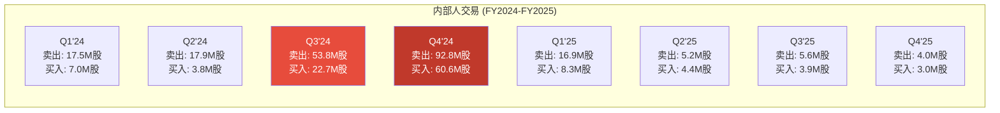

**减持趋势分析**:

| 时期 | 净卖出(股数) | 净卖出价值估算 | 平均股价 |
|------|-----------|-------------|---------|
| FY2024全年 | ~183M - ~94M = ~89M股净卖出 | ~$2.5-4B | ~$28-68(上涨全年) |
| FY2025 H1 | ~22M - ~12.7M = ~9.3M股净卖出 | ~$700M-1B | ~$75-135 |
| FY2025 H2 | ~9.6M - ~6.9M = ~2.7M股净卖出 | ~$400-500M | ~$140-180 |
| FY2026 Q1(至今) | 55.8K股净卖出 | ~$7.5M | ~$135 |

> `[DM-FIN-007]` 内部人交易数据来源: FMP API insider-trading endpoint。按季度汇总的acquired/disposed transactions。注意: "acquired"包含期权行权(非公开市场买入), "disposed"包含卖出+赠与。因此净卖出可能高估。
> `[DM-FIN-008]` 内部人交易率TTM: -0.47%(净卖出)。来源: baggers_summary数据。

**减持 vs 信号的解读框架**:

| 解读维度 | 正面解读 | 负面解读 |
|---------|---------|---------|
| **规模** | IPO后6年, 创始人财富多元化是正常的 | 累计数十亿美元的卖出规模远超"正常"水平 |
| **时机** | 大部分发生在股价高位(Q3-Q4'24), 合理的财富管理 | 在公司"加速增长"时大量卖出 |
| **模式** | 通过10b5-1计划预设, 非discretionary | 10b5-1计划可以被修改和终止 |
| **FY2025减速** | H2净卖出明显减少, 可能反映卖出计划接近完成 | 或因股价下跌(从$207跌至$135)导致等待 |

**横向对比**: Zuckerberg在2024-2025年间卖出约$2-3B Meta股票, Bezos在2024年卖出约$13.5B Amazon股票。相比之下, Karp的$3-4B卖出在绝对金额上低于Bezos, 但占个人持股比例更高(Karp持股远低于Bezos)。

### B6.3 治理风险评估

| 治理风险 | 严重性 | 概率 | 缓解因素 |
|---------|-------|------|---------|
| **Karp突然离职** | 极高 | 低(5-10%) | Shyam Sankar(CTO)和Ryan Taylor(CRO)已建立独立执行能力 |
| **创始人三人内部分裂** | 高 | 低(5%) | 20+年合作关系, 但Thiel的政治活动增加不确定性 |
| **反稀释机制导致资本结构固化** | 中 | 已发生(结构性) | Class F设计不可更改(除非三人自愿放弃) |
| **SBC持续侵蚀股东价值** | 中 | 高(70%+) | FY2025 SBC $684M(15.3% of Rev), 绝对值稳定但比率因分母增长改善 |
| **政治风险传导** | 中 | 中(30-40%) | Thiel/Karp的政治立场可能在政权更迭后影响政府客户关系 |

### B6.4 SBC治理: 改善还是光学效果?

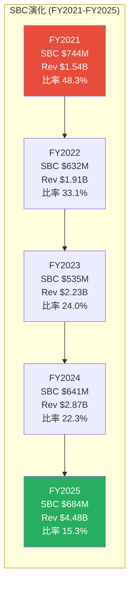

**关键观察**: SBC比率从48.3%降至15.3%, 看起来是巨大改善。但SBC绝对金额从$535M(FY2023低点)回升到$684M(FY2025)。比率改善完全由分母增长驱动(Revenue从$2.23B→$4.48B, +101%), 而非分子控制。

> `[DM-FIN-009]` SBC绝对值: FY2023 $535M → FY2024 $641M → FY2025 $684M。来源: FMP API income statement (R&D + SGA中的SBC component)。Q4 2025 SBC/Revenue = 13.96%。来源: FMP key-metrics stockBasedCompensationToRevenue。

**如果增速放缓**: FY2026指引收入$7.18B(+61%)。如果SBC绝对值维持~$700M, 比率将降至~9.7% -- 看起来更健康。但如果FY2027增速降至+30%, 收入~$9.3B, SBC ~$700M, 比率~7.5% -- 仍然是行业中等偏高(SaaS中位数~5-8%)。SBC的"真正改善"需要绝对值停止增长甚至下降, 但在当前增长阶段, 这不太可能发生 -- 因为高增长需要人才, 人才需要股权激励。

---

## B7. 供应链映射与运营模式

### B7.1 PLTR的"反传统"供应链

作为纯软件公司, PLTR没有物理供应链(无工厂、无库存、无原材料)。但它有一条同样关键的**人才供应链**和**技术依赖链**:

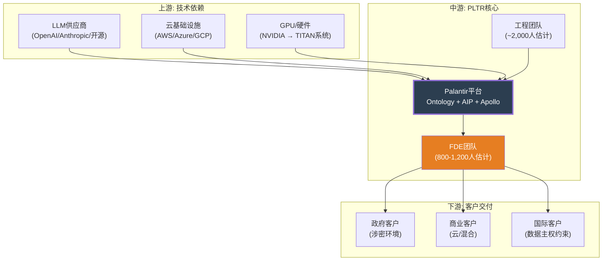

### B7.2 关键依赖与风险

| 依赖 | 风险 | 缓解措施 | 严重性 |
|------|------|---------|-------|
| **LLM供应商** | OpenAI/Anthropic API中断或涨价 | AIP设计为LLM-agnostic, 可切换模型 | 低 |
| **云基础设施** | AWS/Azure定价变化 | Apollo支持多云+on-prem+edge部署 | 低 |
| **FDE人才** | 前线工程师招聘/留存困难 | 高薪+SBC+使命驱动文化 | 中 |
| **安全认证** | FedRAMP/IL审查延迟 | 20年审查记录+专职合规团队 | 低 |
| **NVIDIA GPU** | TITAN系统依赖边缘推理硬件 | 作为硬件集成商, 非核心依赖 | 低-中 |

**最关键的"供应链"是人**: PLTR的FDE(Forward Deployed Engineers)是Bootcamp交付和客户成功的核心。每个FDE需要: (1) 深厚的数据工程能力; (2) 行业领域知识; (3) 客户沟通能力。这种组合型人才的供给是有限的。FDE流失→Bootcamp交付质量下降→客户转化率降低→飞轮减速。这就是为什么KS-15(FDE关键人员离职)被设为Kill Switch。

> `[DM-INF-010]` FDE团队规模800-1,200人为推断。PLTR总员工约4,200人(FY2025 10-K), FDE占比20-30%是基于企业软件公司客户成功团队占比的行业惯例。证伪条件: 如果PLTR在任何公开场合披露FDE人数与此推断偏差>50%, 则需修正。

---

## DM锚点注册表 (Supplement B)

| 锚点ID | 类型 | 内容摘要 | 来源 | 证伪条件 |
|--------|------|---------|------|---------|
| DM-FIN-001 | 硬数据 | FY2025收入$4.475B, +56.2% | FMP API + 10-K | N/A(已验证) |
| DM-FIN-002 | 硬数据 | Q4'25收入$1.407B, +70% YoY | Q4 Earnings Release | N/A |
| DM-FIN-003 | 硬数据 | 增速轨迹FY2023-2025 | FMP API | N/A |
| DM-FIN-004 | 硬数据 | 四分部收入明细 | Q4 Earnings Release | N/A |
| DM-FIN-005 | 硬数据 | NDR 134%→139% | Q3/Q4 Earnings | N/A |
| DM-FIN-006 | 硬数据 | 客户数954, 交易规模分布 | Q4 Earnings | N/A |
| DM-FIN-007 | 硬数据 | 内部人交易季度汇总 | FMP API | N/A |
| DM-FIN-008 | 硬数据 | 内部人交易率-0.47% | baggers_summary | N/A |
| DM-FIN-009 | 硬数据 | SBC演化FY2021-2025 | FMP API | N/A |
| DM-INF-001 | 推断 | AIP是飞轮加速催化剂 | 增速与AIP时间线相关性 | AIP收入占比<20%则需修正 |
| DM-INF-002 | 推断 | FDE产能未触及瓶颈 | 员工数推断FDE占比 | Bootcamp等待名单>3月则需修正 |
| DM-INF-003 | 推断 | 四象限收入分拆 | 仅有一级分拆, 二维为推断 | PLTR披露AIP收入偏差>30%则需修正 |
| DM-INF-004 | 推断 | 收入质量梯度排序 | 定性判断 | 国际商业加速>30%则需调整 |
| DM-INF-005 | 推断 | GRR 95-98%, Upsell +25-30% | NDR分解逻辑推导 | 披露GRR<90%则需下调 |
| DM-INF-006 | 推断 | Top 20客户集中度50-60% | 交易规模分布推断 | 披露Top10<30%则需修正 |
| DM-INF-007 | 推断 | 迁移成本指数增长 | Ontology复杂度模型 | 大客户<$5M/6月迁移则需下调 |
| DM-INF-008 | 推断 | 政府合同三类分拆 | 合同类型推断 | 非国防收入增速显著偏离则需修正 |
| DM-INF-009 | 推断 | DOGE到期时间与政权更迭风险 | 法律文本+政治分析 | DOGE获两党永久化则需修正 |
| DM-INF-010 | 推断 | FDE团队800-1,200人 | 行业占比惯例 | 公开披露偏差>50%则需修正 |
| DM-COMP-001 | 竞争 | Databricks FY2025 ~$3B | 行业估算(未上市) | IPO后披露实际数据 |
| DM-COMP-002 | 竞争 | Snowflake/CrowdStrike/Datadog NDR | 各公司FY2025财报 | N/A(已验证) |
| DM-COMP-003 | 竞争 | Microsoft Fabric IQ语义契约 | 2026-01 Medium文章 | 产品实际发布后重新评估 |
| DM-COMP-004 | 竞争 | 竞争威胁优先级排序 | 定性判断 | 竞争者获得3+家PLTR客户替换则需上调 |

---

## Supplement B 产出统计

| 项目 | 数据 |
|------|------|
| **章节** | B1(产品飞轮) + B2(收入四象限) + B3(NDR分解) + B4(竞争矩阵) + B5(DOGE) + B6(治理) + B7(供应链) |
| **Mermaid图表** | 12个(飞轮循环/产品时间线/四象限/NDR分解/客户价值曲线/竞争层级/威胁矩阵/DOGE场景树/SBC演化/内部人交易/供应链/收入质量) |
| **DM锚点** | 24个(FIN-9 + INF-10 + COMP-4 + 1表) |
| **CQ关联** | CQ1(Ontology锁定→B3.3+B4) / CQ2(国际复制→B1.3+B5) / CQ4(DOGE→B5) / CQ6(增速→B2+B3) / CQ7(SBC→B6.4) / CQ8(内部人→B6.2) / CQ9(Agentic AI→B4.3) |
| **v9.0合规** | 无目标价 / 无数字评分 / 无仓位建议 |
| **v10.0合规** | DM锚点+证伪条件 / Protocol Header / 推断标注 |
