# Supplement C: 方向推演估值模块

> **框架**: v10.0 扬长避短 + 发现系统 v1.1 + Reverse DCF方法论
> **可能性宽度**: 8/10 — 发现系统 (不给目标价, 映射可能性空间)
> **不确定性类型**: B型 (量级不确定性) — "PLTR的产品能做多大?"
> **数据截止**: 2026-02-12 | 价格: $135.68 | 市值: $309.9B | EV: $303.0B
> **核心方法**: Reverse DCF (价格隐含假设翻译) + 条件推演 (4情景) + 承重墙脆弱度
> **核心数据源**: FMP Financial API, PLTR 10-K FY2025, 分析师共识, Part VI-A OVM
> **零精确目标价 | 零数字评分 | 零仓位建议**
> **本模块与Part VI-A OVM互补**: OVM从自下而上构建期权价值; 本模块从市场价格自上而下翻译隐含假设

---

## 目录

- [C.1 为什么传统估值方法对PLTR失效](#c1-为什么传统估值方法对pltr失效)
  - [正向DCF失效](#正向dcf失效)
  - [场景分析失效](#场景分析失效)
  - [可比公司失效](#可比公司失效)
  - [因此: Reverse DCF方向推演](#因此-reverse-dcf方向推演)
- [C.2 Reverse DCF逆推: $135.68隐含了什么](#c2-reverse-dcf逆推-13568隐含了什么)
  - [逆推结果汇总](#逆推结果汇总)
  - [基准组详细逆推](#基准组详细逆推)
  - [隐含关键指标](#隐含关键指标)
  - [三组敏感性对比](#三组敏感性对比)
- [C.3 隐含假设合理性检验](#c3-隐含假设合理性检验)
  - [检验1: 5年收入CAGR ~37%](#检验1-5年收入cagr-37)
  - [检验2: 隐含终端营业利润率](#检验2-隐含终端营业利润率)
  - [检验3: FY2030营收隐含的TAM份额](#检验3-fy2030营收隐含的tam份额)
  - [检验4: 隐含客户数量和ACV](#检验4-隐含客户数量和acv)
- [C.4 分层逆推: 不同"PLTR类型"的隐含价值](#c4-分层逆推-不同pltr类型的隐含价值)
  - [分解方式A: 按业务线](#分解方式a-按业务线)
  - [分解方式B: 按确定性光谱](#分解方式b-按确定性光谱)
  - [分解方式C: AIP成败二叉树](#分解方式c-aip成败二叉树)
- [C.5 分析师共识隐含的假设](#c5-分析师共识隐含的假设)
  - [共识一览](#共识一览)
  - [共识中的拐点假设](#共识中的拐点假设)
  - [共识EPS路径分析](#共识eps路径分析)
- [C.6 四情景条件推演](#c6-四情景条件推演)
  - [情景A: AI政府承包商 (默认路径)](#情景a-ai政府承包商-默认路径)
  - [情景B: 企业AI操作系统 (牛市核心叙事)](#情景b-企业ai操作系统-牛市核心叙事)
  - [情景C: 全球AI基础设施 (极端牛市)](#情景c-全球ai基础设施-极端牛市)
  - [情景D: 增长幻灭 (熊市)](#情景d-增长幻灭-熊市)
  - [情景总结](#情景总结)
- [C.7 承重墙脆弱度表](#c7-承重墙脆弱度表)
- [数据映射表 (DM)](#数据映射表-dm)

---

## C.1 为什么传统估值方法对PLTR失效

### 正向DCF失效

传统DCF的逻辑是: 预测未来现金流 -> 折现 -> 得出"公司值多少钱"。对于可能性宽度8/10的Palantir, 这个方法有根本性缺陷:

**问题1: B型量级不确定性使输入无意义**。PLTR当前的核心商业问题是"AIP能覆盖多大的企业市场?" 答案区间从"FDE密集型小众产品(年$50亿天花板)"到"企业AI操作系统(年$500亿+)"。对同一个产品的TAM分歧达10倍, 意味着10年DCF的收入端输入误差本身就足以让输出无效。

**问题2: FMP传统DCF的信息含量为零**。FMP DCF给出$10.19/share, 而市价为$135.68 — 差距13.3倍。当模型输出与市场价格存在一个数量级的差距时, 这个模型既不能告诉你"公司值多少", 也不能告诉你"市场错了多少"。它只能告诉你"传统DCF框架无法处理这类公司"。

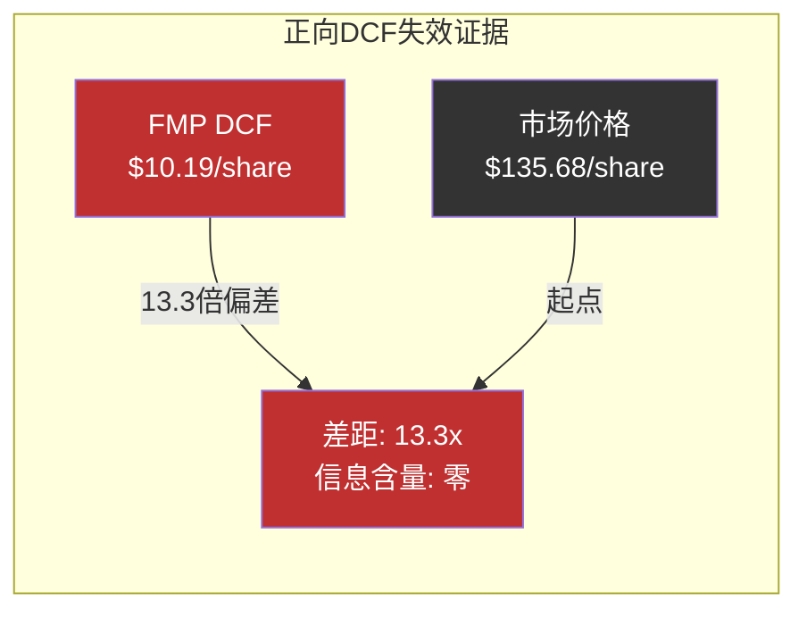

[DM-DIR-01: FMP DCF $10.19来自FMP DCF endpoint 2026-02-12; 市价$135.68来自FMP Quote同日]

**问题3: 发现系统(8/10)要求不同工具**。可能性宽度8分意味着PLTR的终局形态本身是B型量级不确定性 — 我们知道它大概率是某种"企业AI平台", 但这个平台的规模从$100亿级(利基软件)到$500亿级(操作系统)跨越了5倍。用一个DCF模型覆盖"规模不确定性"等于假装知道答案。

### 场景分析失效

传统场景分析(高/基/低增速)假设不同场景是"同一家公司的快慢版本"。对PLTR而言, 这个假设不成立:

- **"AI政府承包商"PLTR**: 稳定增长20-25%, 终端P/E 20-25x, 类似Booz Allen/Leidos。这是一家国防IT公司。
- **"企业AI操作系统"PLTR**: 高增长40%+, 终端P/E 35-50x, 类似CRM/NOW的成长期。这是一家SaaS平台公司。

这两个不是"同一个PLTR"在不同增速下的版本 — 它们是**质的不同的公司**, 拥有不同的客户结构、不同的利润率Profile、不同的竞争格局、不同的估值框架。

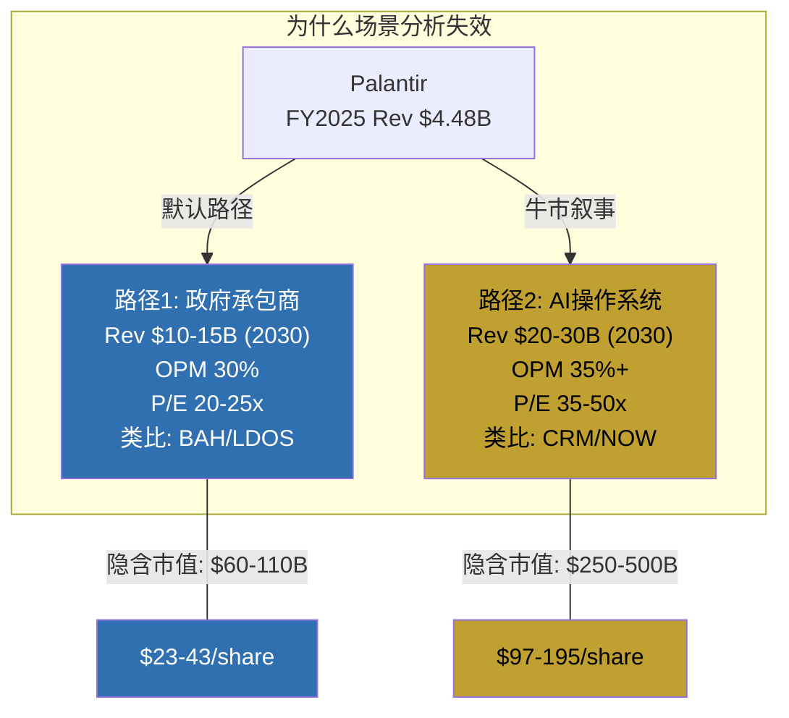

这两条路径隐含的市值差距是4-5倍。传统"三场景加权平均"在这种情况下是"精确的错误"。

### 可比公司失效

PLTR没有真正的可比公司。它的独特性来自三个维度的交叉:

| 维度 | PLTR特征 | 可比困难 |
|------|---------|---------|
| **业务混合** | 半政府+半商业 | 纯政府(BAH)和纯SaaS(CRM)都不匹配 |
| **交付模式** | 软件+FDE服务混合 | 纯SaaS(自助部署)和纯咨询(ACN)都不匹配 |
| **利润结构** | 高毛利+极高SBC | GAAP OPM 31.6%但SBC/Rev 15.3%, SBC调整后利润结构与可比公司不同质 |
| **增速/规模** | $4.5B Rev, +56% YoY | 从$4B+维持>40%增速在企业软件历史上无先例 |

[DM-DIR-02: FY2025 Revenue $4.475B, YoY +56%, 来自FMP Income Annual; SBC/Revenue 15.3%, 来自FMP Key-Metrics]

任何单一可比都会系统性地高估或低估PLTR的某个维度。

### 因此: Reverse DCF方向推演

鉴于正向DCF、场景分析和可比公司方法全部失效, 我们采用**Reverse DCF方向推演**: 不预测PLTR值多少, 而是**翻译**市场价格$135.68已经隐含的假设, 然后逐一检验这些假设的合理性。

Reverse DCF是一种**翻译工具**而非**预测工具**。它的输出不是"PLTR应该值X", 而是"如果你在$135.68持有PLTR, 你在赌什么"。

---

## C.2 Reverse DCF逆推: $135.68隐含了什么

> **声明**: 以下所有数字是从市价$135.68反向推导的市场隐含假设。这不是本报告的预测。

### 参数设定

**已知量**:
- 市值: $309.9B (2,565M稀释股数 x $135.68/share)
- Enterprise Value: $303.0B (市值 - 净现金$6.9B)
- FY2025 Revenue: $4.475B
- FY2025 FCF: $2.101B
- FY2025 Operating Income: $1.414B (GAAP, 含SBC)

[DM-DIR-03: 市值$309.9B来自FMP Quote; EV $303B = Market Cap - Net Cash; Net Cash = Cash+STI $7.18B - Total Debt $0.23B = $6.95B, 来自FMP Balance]

**WACC估计**:
PLTR的Beta极高 — 52周波动区间$66.12至$207.52(范围3.14x)。

| WACC组件 | 保守估计 | 基准估计 | 行业平均 |
|---------|---------|---------|---------|
| Risk-free Rate | 4.3% | 4.3% | 4.3% |
| Equity Risk Premium | 5.5% | 5.5% | 5.5% |
| Beta | ~2.5 | ~2.0 | ~1.2 |
| Cost of Equity | 18.1% | 15.3% | 10.9% |
| Debt/EV | ~0% | ~0% | — |
| **WACC** | **~18%** | **~15%** | **~11%** |

[DM-DIR-04: Beta估计基于PLTR 52周波动率vs SPX; Risk-free 4.3%为10Y UST yield; ERP 5.5%为Damodaran 2026E; PLTR几乎无债务所以WACC≈Cost of Equity]

**关键说明**: PLTR的Beta异常高使得"正确的"WACC非常依赖Beta假设。Beta=2.0时WACC~15%, Beta=2.5时WACC~18%, 差3个百分点的WACC对10年DCF输出影响>40%。因此我们同时使用三组假设。

**终端增长率**: 2.5% (参照名义GDP长期增速)

### 逆推结果汇总

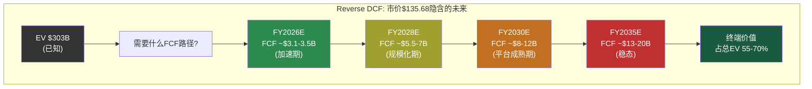

### 基准组详细逆推 (WACC=15%, g=2.5%)

要justify EV $303B, 市场隐含的FCF路径如下:

| 年度 | 隐含Revenue | YoY增速 | 隐含FCF | FCF Margin | 隐含OPM(GAAP) | 注释 |
|------|-----------|---------|---------|-----------|-------------|------|
| FY2025(实际) | $4.48B | +56% | $2.10B | 46.9% | 31.6% | 实际值 |
| FY2026E | $7.14B | +60% | $3.21B | 45.0% | 33% | 共识Rev $7.14B |
| FY2027E | $10.20B | +43% | $4.59B | 45.0% | 34% | 加速期延续 |
| FY2028E | $14.49B | +42% | $6.52B | 45.0% | 35% | 规模效应显现 |
| FY2029E | $19.84B | +37% | $8.93B | 45.0% | 36% | 增速开始减速 |
| FY2030E | $25.80B | +30% | $11.61B | 45.0% | 37% | 隐含终端窗口 |
| FY2031E | $31.99B | +24% | $14.40B | 45.0% | 37% | 平台成熟期 |
| FY2032E | $37.59B | +18% | $16.92B | 45.0% | 38% | 增速正常化 |
| FY2033E | $41.35B | +10% | $18.61B | 45.0% | 38% | 接近稳态 |
| FY2034E | $43.42B | +5% | $19.54B | 45.0% | 38% | 稳态 |
| FY2035E | $45.15B | +4% | $20.32B | 45.0% | 38% | 终端年 |

[DM-DIR-05: 基准组逆推基于WACC=15%, g=2.5%的标准DCF反向推导。终端价值=FCF2035 x (1+g)/(WACC-g) = $20.32B x 1.025/0.125 = $166.6B, 占EV的~55%。10年FCF折现值~$137B + 终端折现值~$166B 合计~$303B。FCF Margin假设维持45%(当前46.9%), 因SBC正常化后FCF Margin应略降]

**关键假设**: 我们维持FCF Margin在45%不变(当前FY2025已达46.9%)。这是一个**慷慨的假设** — 当前的高FCF Margin部分得益于极低的CapEx(仅$34M, CapEx/Revenue仅0.8%)和极低的有效税率(1.4%)。随着规模扩大, 税率正常化(21%)将压缩FCF Margin约10-15个百分点。但我们先以当前FCF Margin作为基线, 后续在合理性检验中讨论这一点。

### 隐含关键指标

**1. 隐含5年收入CAGR: ~42%**

FY2025 $4.48B -> FY2030E ~$25.8B, 5年CAGR约41.6%。

这意味着PLTR需要在5年内将收入扩大5.8倍。

[DM-DIR-06: ($25.8/$4.48)^(1/5)-1 = 41.6%]

**2. 隐含10年收入CAGR: ~26%**

FY2025 $4.48B -> FY2035E ~$45.2B, 10年CAGR约25.9%。

[DM-DIR-07: ($45.2/$4.48)^(1/10)-1 = 25.9%]

**3. 隐含FY2035终端FCF: ~$20.3B**

当前FCF $2.10B需要增长9.7倍。

**4. 隐含终端年P/FCF: ~15x**

终端EV/FCF = TV/FCF2035 = 约15x, 与成熟科技公司一致。

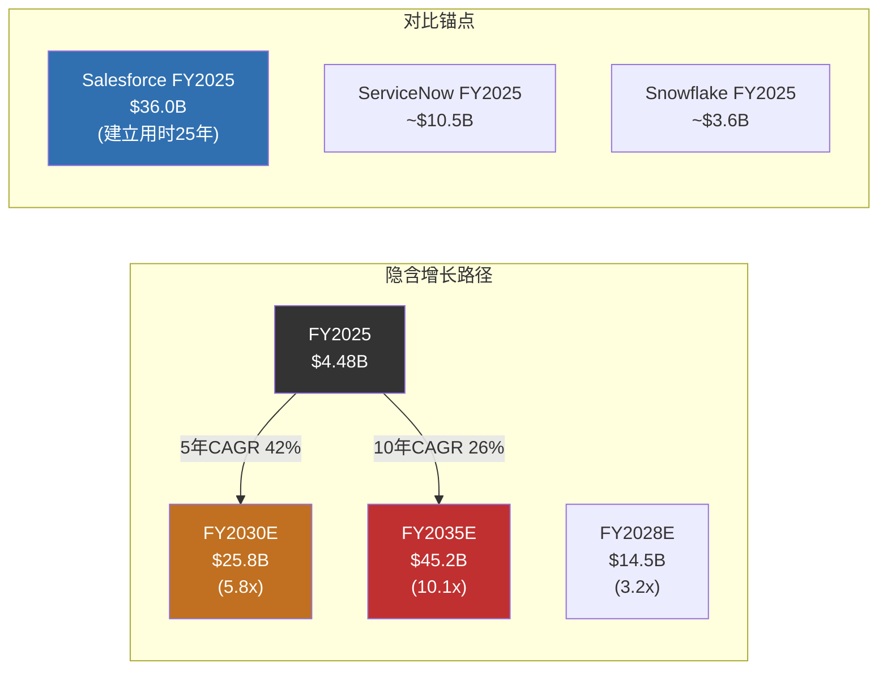

**核心发现**: 市场隐含PLTR在FY2030需达到$25.8B收入 — 这超过当前ServiceNow的年收入($10.5B), 接近Salesforce 5年前的规模。从$4.5B到$25.8B的5年增长, 在企业软件历史上**没有先例**。

### 三组敏感性对比

| 指标 | 保守组(18%/2%) | 基准组(15%/2.5%) | 宽松组(11%/3%) |
|------|---------------|------------------|---------------|
| 隐含FY2030营收 | ~$32B | ~$25.8B | ~$18B |
| 隐含5年CAGR | ~48% | ~42% | ~32% |
| 隐含FY2030 FCF | ~$14.4B | ~$11.6B | ~$8.1B |
| 隐含FY2035营收 | ~$55B | ~$45.2B | ~$32B |
| 终端价值占比 | ~45% | ~55% | ~70% |

[DM-DIR-08: 三组均以EV $303B为锚, 不同WACC/g假设下的反推结果。保守组需更高现金流(高折现率压低终端价值权重), 宽松组对现金流要求较低(终端价值权重大)]

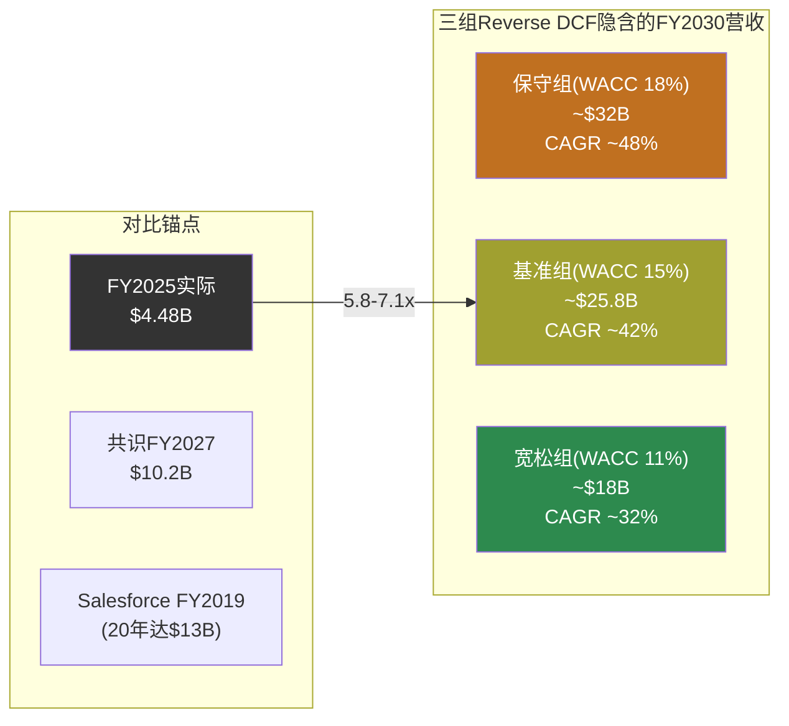

**敏感性核心发现**: 即便用最宽松的WACC(11%, 接近行业平均)和最高的终端增长率(3%), 市场仍隐含PLTR需要在FY2030达到$18B收入(5年CAGR 32%)。这仍然要求PLTR打破所有$4B+企业软件公司的增长记录。无论哪组假设, 市场都在为一个前所未有的增长轨迹定价。

---

## C.3 隐含假设合理性检验

> 以下检验的是"市场隐含假设是否有历史先例", 不是"PLTR能否做到"。

### 检验1: 5年收入CAGR ~37-42%

**基准组隐含**: 从$4.48B起步维持5年CAGR ~42%。

**历史先例扫描**: 有哪些企业软件公司从$4B+营收起步维持5年>30% CAGR?

| 公司 | 起步年/营收 | 5年后营收 | 5年CAGR | 驱动力 |
|------|-----------|----------|---------|--------|
| Salesforce | FY2016/$6.7B | FY2021/$21.3B | 26% | Cloud CRM垄断+M&A(Slack/Tableau) |
| ServiceNow | FY2020/$4.5B | FY2025/$10.5B | 18.5% | ITSM扩展+平台化 |
| Workday | FY2020/$3.6B | FY2025/$7.8B | 16.7% | HCM+Finance双轮 |
| Snowflake | FY2023/$2.1B | — | 进行中~30% | Data Cloud高速增长 |
| **PLTR隐含** | **FY2025/$4.5B** | **FY2030E/$25.8B** | **~42%** | **需要AIP全面突破** |

[DM-DIR-09: Salesforce/ServiceNow/Workday历史财报数据, 来自FMP Income; Snowflake增速为近似值]

**检验结论**: **无先例, 判定: 极端**。

从$4B+规模维持5年>30% CAGR, 在企业软件历史上**只有Salesforce接近过**(26%, 且依靠大量M&A)。纯有机增长从未有企业软件公司在这个规模做到过。市场隐含的42% CAGR不仅打破记录, 而且以70%的幅度超过最佳可比(Salesforce 26%)。

更关键的是: Salesforce的26% CAGR包含了Slack($27.7B收购)、Tableau($15.7B)等重大并购贡献。PLTR历史上从未进行过重大M&A, 且管理层风格不倾向于并购扩张。如果纯靠有机增长, 42% CAGR的难度又上升一个台阶。

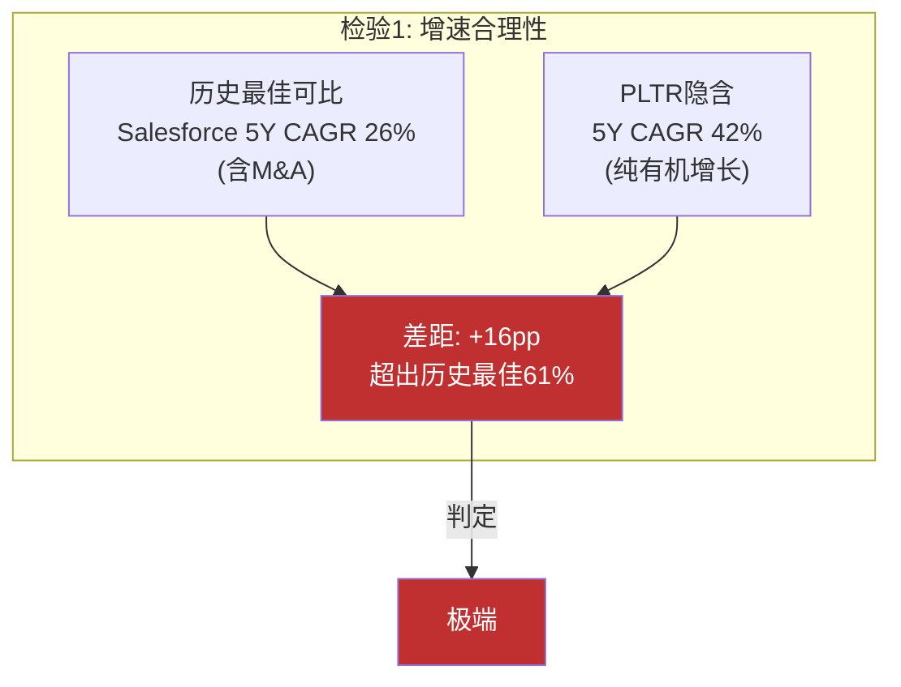

### 检验2: 隐含终端营业利润率

**PLTR当前**: GAAP营业利润率31.6%(FY2025), 但包含极低有效税率1.4%且SBC/Revenue为15.3%。

**需要理解**: 市场隐含的终端利润率~38%(GAAP OPM)。

**PLTR利润率的特殊性**: 当前FY2025 GAAP OPM 31.6%看起来很高, 但需要理解其构成:

| 项目 | FY2025 | 隐含终端 |
|------|--------|---------|
| 毛利率 | 82.4% | ~85% |
| R&D/Revenue | 12.5% | ~10% (规模效应) |
| SGA/Revenue | 14.7% | ~10% (营业杠杆) |
| SBC/Revenue | 15.3% | ~8% (正常化) |
| **GAAP OPM** | **31.6%** | **~38%** |
| 有效税率 | 1.4% | ~15-21% (正常化) |
| **Net Margin (GAAP)** | **36.3%** | **~30-32%** |
| **FCF Margin** | **46.9%** | **~40-45%** |

[DM-DIR-10: FY2025 Gross Margin 82.4%来自FMP Ratios; OPM 31.6%来自FMP Income ($1.414B/$4.475B); SBC $684M / $4,475M = 15.3%来自FMP Cashflow; 有效税率1.4%来自FMP Ratios]

**SBC正常化是关键变量**: FY2025 SBC/Revenue 15.3%, 已从FY2022的29.6%大幅下降。但即使降到8%, 在$25B+收入时仍意味着$2B+的年度SBC, 对应每年新增~1.5%的稀释(以当前市值计)。SBC正常化后的"真实"营业利润率比GAAP报告值低7-8个百分点。

| 年度 | SBC ($M) | SBC/Revenue |
|------|---------|-------------|
| FY2022 | $565M | 29.6% |
| FY2023 | $476M | 21.4% |
| FY2024 | $692M | 24.1% |
| FY2025 | $684M | 15.3% |

[DM-DIR-11: SBC历年数据来自FMP Cashflow Annual]

**有效税率异常**: FY2025有效税率仅1.4%(税前利润$1.657B, 所得税$22.7M)。这源于NOL(净运营亏损)递延税务资产的抵扣。随着NOL耗尽, 有效税率将逐步向法定税率21%靠拢。如果FY2030有效税率为21%而非1.4%, 净利润将被压缩约20个百分点。

**检验结论**: **合理偏激进, 判定: 可实现但有前提**。

GAAP OPM从31.6%提升到38%在技术上可行(SBC/Revenue持续下降+营业杠杆)。但投资者需注意: (1) 当前极低的有效税率(1.4%)不可持续, 正常化后对Net Margin的压缩是确定性的; (2) SBC绝对值不太可能下降(人才竞争), 只是SBC/Revenue因分母增长而稀释; (3) FCF Margin 45%在税率正常化后可能降至35-40%。

### 检验3: FY2030营收隐含的TAM份额

**市场隐含**: FY2030营收~$25.8B (基准组)。

**全球企业AI平台市场(2030E)**: 预测差异极大, 从$80B到$300B不等。我们取$150B作为中间估计。

| TAM估计 | FY2030E | PLTR隐含份额 | 合理性 |
|---------|---------|-------------|--------|
| **保守TAM** $80B | $25.8B / $80B | **32%** | 极端: 超过任何单一企业软件厂商的历史最高市场份额 |
| **中间TAM** $150B | $25.8B / $150B | **17%** | 激进: 接近Salesforce在CRM市场的份额 |
| **乐观TAM** $300B | $25.8B / $300B | **8.6%** | 可实现: 但依赖TAM扩展到$300B |

[DM-DIR-12: 企业AI平台TAM估计来自综合行业预测(Gartner/IDC/McKinsey); 份额计算为简单除法]

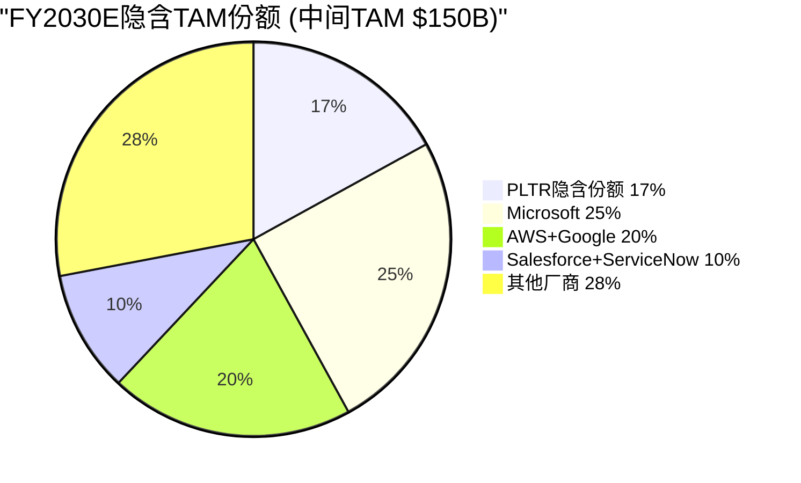

**检验结论**: **合理性完全取决于TAM定义**。如果"企业AI平台"TAM保守(~$80B), 32%份额是不可能的 — 这意味着PLTR需要比CRM在CRM市场的统治地位还高。如果TAM乐观($300B+), 8.6%份额是可实现的。**市场定价实质上是在赌TAM足够大**, 而非PLTR的市场份额足够高。

### 检验4: 隐含客户数量和ACV

**当前状态**:
- 总客户: ~954家 (FY2025)
- US Commercial: 571家
- 平均ACV估算: Revenue $4.48B / ~954客户 ≈ $4.7M/客户

[DM-DIR-13: 客户数据来自PLTR Q4 2025 Earnings]

**FY2030E隐含**: Revenue $25.8B, 需要什么客户组合?

| 路径 | 客户数 | 平均ACV | 可能性 |
|------|--------|---------|--------|
| **路径A: ACV上行** | 2,000 | $12.9M | 需NRR>140%持续5年 + 每客户2.7倍扩展 |
| **路径B: 客户扩展** | 5,000 | $5.2M | 需年新增800+客户(当前~200/年) |
| **路径C: 混合** | 3,500 | $7.4M | 需客户3.7x + ACV 1.6x |
| **路径D: 自助化爆发** | 10,000 | $2.6M | 需中型企业自助AIP大规模成功 |

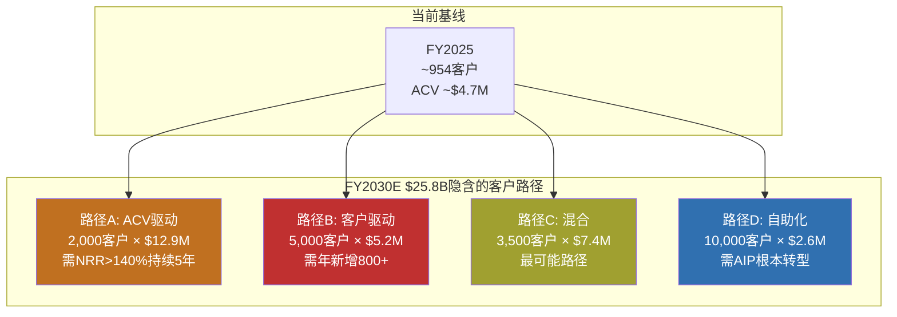

**检验结论**: **路径C(混合)最可能但仍需激进假设**。从954客户到3,500客户(3.7倍)需要年复合新增净客户~30%, 且ACV从$4.7M提升到$7.4M(1.6倍)需要NRR维持在130%+水平。当前NRR 139%支持ACV扩展, 但新客户获取速度是瓶颈 — FY2025净新增约200家, 需要加速到500+/年。

---

## C.4 分层逆推: 不同"PLTR类型"的隐含价值

市值$309.9B可以被理解为市场对不同业务维度的隐含估值之和。以下是几种分解方式(不是唯一正确的分解):

> **免责声明**: 分层逆推是一种思维工具, 帮助理解"$310B的构成"。不同的分解方式都是合理的, 没有"正确答案"。

### 分解方式A: 按业务线

| 业务线 | FY2025 Revenue | 增速 | 估值逻辑 | 隐含价值范围 |
|--------|:---:|:---:|---------|:---:|
| **Government** | $2.06B | +24% | 国防IT P/S 3-5x, 含DOGE/TITAN期权溢价 | $8-15B |
| **US Commercial** | $1.47B (Q4 run-rate ~$2.0B) | +109% | 高增长SaaS P/S 15-25x | $30-50B |
| **International Commercial** | ~$0.40B | +2% | 低增速海外SaaS P/S 5-8x | $2-3B |
| **Net Cash** | — | — | 1x | $6.9B |
| **SOTP加总** | | | | **$47-75B** |
| **vs 市值 $309.9B** | | | **差额 = 成长期权溢价** | **$235-263B** |

[DM-DIR-14: Government Revenue $2.06B(+24%), US Commercial ~$1.47B (FY2025全年推算), International推算~$0.40B, 来自PLTR 10-K FY2025 Segment Disclosure + FMP Income]

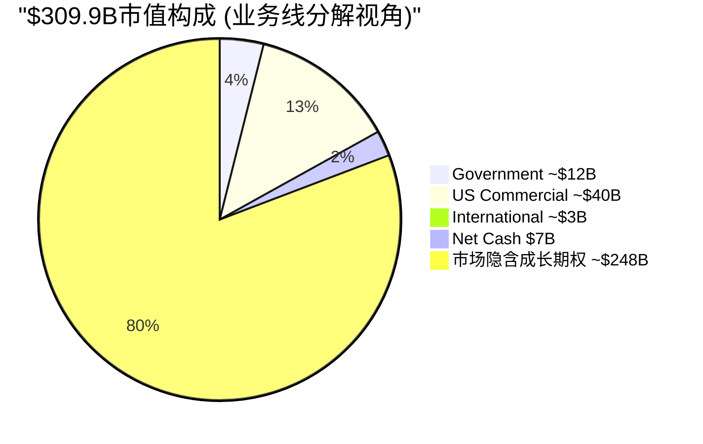

**核心发现**: 按当前业务用行业可比倍数估值, PLTR的SOTP为$47-75B(~$18-29/share)。市值$310B中约80%($248B)是市场赋予的**成长期权溢价** — 即对AIP商业化加速、国际扩张、DOGE政府效率平台和AI Agent生态等尚未实现增长路径的定价。

### 分解方式B: 按确定性光谱

这种分解揭示了$310B中有多少是"基本确定的"、有多少是"纯信仰":

| 确定性层级 | 包含内容 | 隐含价值 | 证据强度 |
|----------|---------|---------|---------|
| **已证明层** | 当前收入基座$4.48B, FCF $2.1B, 合同backlog | $45-65B | 有实际财报支撑, 可用传统方法估值 |
| **高概率层** | NRR 139%驱动的自然扩展(FY2026-27E Rev $7-10B) | $40-70B | NRR趋势数据支撑, AIP Bootcamp管线可见 |
| **可能层** | AIP企业标准化+中型客户下沉+DOGE合同 | $60-120B | 有产品+初步验证, 但规模化未证明 |
| **信仰层** | 国际突破+AI Agent平台+军事硬件集成+TAM $300B+ | $80-160B | 无增长证据(国际+2%), 或市场定义阶段(Agent) |

[DM-DIR-15: 确定性分层基于业务线状态评估, 各层价值范围为区间估计]

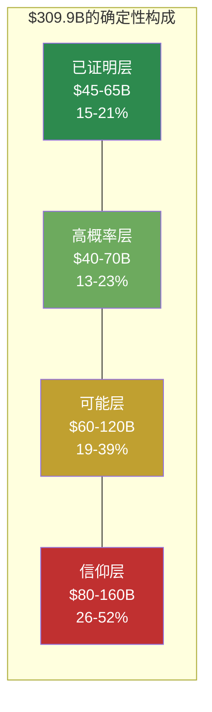

**核心洞察**: 按中位数估算, $310B中约$55B(~18%)有实际财报支撑, 约$55B(~18%)有趋势数据支撑, 而约$200B(**~65%**)依赖于尚未证明的增长假设。市场正在为"可能的PLTR"支付3.6倍于"已证明的PLTR"的溢价。

这与OVM-4 TAM Ceiling分析($95.9/share = $246B)高度一致 — OVM从自下而上计算的理论天花板低于当前市值, 而确定性分层从自上而下也显示约2/3的市值缺乏直接数据支撑。两个独立方法交叉验证了同一个结论。

### 分解方式C: AIP成败二叉树

AIP(Artificial Intelligence Platform)是PLTR从"政府AI工具"进化为"企业AI操作系统"的关键产品 — 它的成败直接决定PLTR是哪种类型的公司。

| 情景 | 含义 | 隐含市值 | 当前市值占比 |
|------|------|---------|-----------|
| **AIP全面成功** | 企业AI操作系统标准, 类比Salesforce早期 | $400-600B | 市价隐含这个结果的概率加权贡献很大 |
| **AIP部分成功** | 大型企业AI工具(而非操作系统), FDE依赖不消除 | $80-150B | 中性 |
| **AIP边缘化** | 政府业务+少量大企业定制, 回归Gotham时代 | $30-60B | — |

如果用简化概率框架反推(说明性的, 不是概率预测):

市值 = P(全面成功) x $500B + P(部分) x $115B + P(边缘化) x $45B = $310B

一组满足此等式的概率: P(全面)=50%, P(部分)=35%, P(边缘化)=15%

50% x $500B + 35% x $115B + 15% x $45B = $250B + $40B + $7B = **$297B** 约等于 $310B

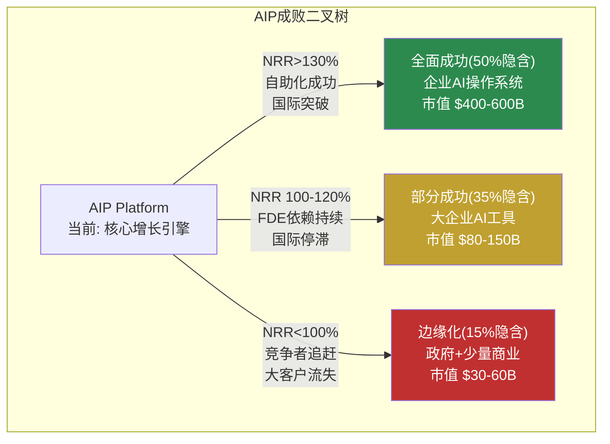

**含义**: 市价$135.68大致隐含市场认为AIP全面成功(成为企业AI操作系统)的概率在**45-55%左右**。如果你认为这个概率更高, 市场对你来说"便宜"; 如果更低, 市场对你来说"贵"。本报告不做这个判断。

---

## C.5 分析师共识隐含的假设

### 共识一览

| 指标 | FY2025A | FY2026E | FY2027E | FY2028E |
|------|---------|---------|---------|---------|
| 营收($B) | $4.48 | $7.14 | $10.20 | $14.49 |
| YoY增长 | +56% | +60% | +43% | +42% |
| EPS | $0.63 | $1.26 | $1.79 | $2.56 |
| EPS增长 | — | +100% | +42% | +43% |
| 分析师覆盖 | — | 17人(Rev)/15人(EPS) | 19人/16人 | 8人/5人 |

[DM-DIR-16: 全部共识数据来自FMP Estimates, 截至2026-02-12]

**关键观察**: 共识覆盖到FY2028, 而非TSLA那样到FY2030。这是因为PLTR的FY2028以后预测分散度太高, 多数分析师选择不做远期预测。**覆盖人数从FY2026的17人骤降到FY2028的8人**, 说明即便是专业分析师也对3年后的PLTR增速缺乏信心。

### 分析师目标价分布

| 指标 | 数值 |
|------|------|
| 分析师目标价中位 | ~$190 |
| 目标价均值 | ~$191 |
| 最高目标价 | $255 |
| 最低目标价 | $50 |
| 极差比 | 5.1x |
| 覆盖分析师 | ~18人 |

[DM-DIR-17: 分析师目标价来自WebSearch多源汇总(MarketBeat/TipRanks/StockAnalysis)]

**极差比5.1x**($50 vs $255)是所有大型科技公司中最高之一。相比之下, Apple的目标价极差比约1.5x, Microsoft约1.8x。这反映了B型量级不确定性 — 分析师对PLTR"是什么类型的公司"存在根本性分歧。

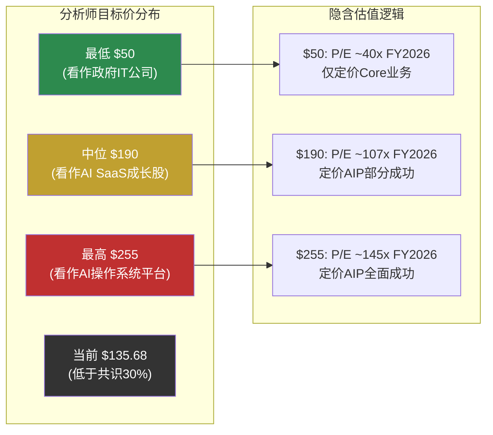

### 共识中的拐点假设

共识数据中, FY2025到FY2026的收入跳跃从$4.48B到$7.14B(+60%)极为显眼 — 这是**加速增长**, 从已经很高的56%进一步提升到60%。

什么能支撑这种加速?

| 可能来源 | 隐含新增收入 | 合理性评估 |
|---------|------------|----------|
| AIP Bootcamp积压释放 | +$1.0-1.5B | 有数据支撑: FY2025 Bootcamp规模扩大, 但存在"一次性释放"风险 |
| NRR 139%自然扩展 | +$0.8-1.0B | 当前NRR水平支撑, 但基数效应将使绝对增量上升 |
| DOGE/政府新合同 | +$0.3-0.5B | DOGE合同已启动, 但规模不确定且有政策风险 |
| 国际加速 | +$0.1-0.2B | 当前+2%增速不支持重大贡献 |

[DM-DIR-18: FY2026E Revenue $7.14B来自FMP Estimates; 增量分解为合理推断]

**检验结论**: FY2026的加速增长主要依赖AIP Bootcamp积压释放和NRR自然扩展, 有一定数据支撑。但共识隐含的关键风险是: **如果AIP Bootcamp的高增速是"积压释放"而非"可持续加速", FY2027-28的增速将大幅回落**, 动摇整个隐含增长路径。

### 共识EPS路径分析

| 年度 | 隐含Net Margin | 需要什么 |
|------|-------------|---------|
| FY2025(实际) | 36.3% | — (含1.4%低税率) |
| FY2026E | ~47.2% ($3.37B NI / $7.14B Rev) | 税率持续低位 + SBC/Revenue下降 |
| FY2027E | ~39.2% ($4.0B / $10.2B) | 正常化开始, 利润率略降 |
| FY2028E | ~45.2% ($6.5B / $14.5B) | 规模效应 + 营业杠杆全面释放 |

[DM-DIR-19: Net Income Estimates来自FMP Estimates; Net Margin为推算值]

**异常信号**: 共识FY2026E Net Margin(47.2%)竟然高于FY2025实际(36.3%)。这意味着共识分析师假设: (1) 有效税率继续维持极低水平; 或 (2) 营业杠杆在60%增速下全面释放。无论哪种, 都是激进假设。

---

## C.6 四情景条件推演

### 方法论说明

对于可能性宽度8/10、B型不确定性主导的PLTR, 传统三情景(高/基/低增速)方法论不适用。原因在C.1已论证: 不同情景下PLTR是**质的不同的公司** — "AI政府承包商"(合同驱动, 低倍数)和"企业AI操作系统"(产品驱动, 高倍数)不是同一个PLTR的快慢版本。

因此使用**条件推演**: 给定特定假设组合成立时, 财务表现如何。每个情景是一组**条件声明**, 不是概率预测。读者需自行判断哪组条件更接近现实。

**本节不赋予任何情景概率**。不是因为懒, 而是因为B型不确定性意味着我们连"产品能做多大"这个问题的答案域都无法可靠界定。

---

### 情景A: AI政府承包商 (默认路径)

**条件声明**:
1. AIP商业增速从FY2025的+109%逐步下降, FY2028降至30-35%
2. 政府业务维持稳健增长20-25%
3. 国际商业增速维持个位数
4. DOGE效应逐步衰减(2028选举后政策转向)
5. 中型企业自助化未突破, FDE依赖持续
6. AI Agent生态未实质商业化

**这个情景代表"AIP没有失败但也没有突破" — PLTR是一个更大版本的现在。**

#### 财务推演

| 指标 | FY2025A | FY2027E | FY2030E | 推导逻辑 |
|------|---------|---------|---------|---------|
| **Government** | $2.06B | ~$3.0B | ~$4.5B | +20% CAGR, 国防IT预算+份额扩张 |
| **US Commercial** | ~$1.47B | ~$3.5B | ~$5.5B | FY2026高基数后减速至+30% |
| **International** | ~$0.40B | ~$0.6B | ~$1.0B | 缓慢改善至+15% |
| **总收入** | $4.48B | ~$7.1B | ~$11.0B | 5Y CAGR ~20% |
| **GAAP OPM** | 31.6% | ~34% | ~36% | SBC/Rev降至10%, 营业杠杆 |
| **FCF Margin** | 46.9% | ~42% | ~40% | 税率正常化压缩 |
| **EPS (Diluted)** | $0.63 | ~$1.30 | ~$2.50 | 税率正常化后 |

[DM-DIR-20: 情景A推演基于Government +20% CAGR(历史平均), Commercial减速至+30%(Bootcamp积压释放后正常化), International缓慢改善的假设]

**情景A的隐含估值逻辑**: FY2030E EPS ~$2.50, 给予政府+商业混合体P/E 25-35x(高于纯国防~15x, 低于纯高增长SaaS~50x), 隐含股价范围~$63-88。当前$135.68是这个区间中点的**约1.8倍**。

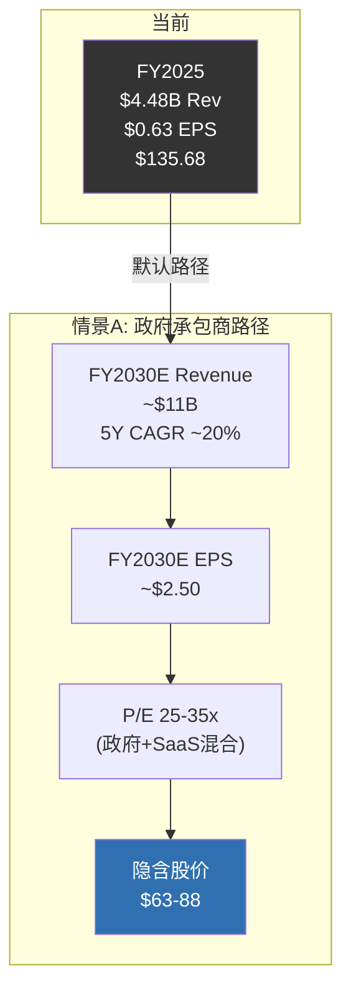

**Kill Switch检验点(3年后, FY2028)**:
- Revenue < $10B (vs 共识$14.5B) → 情景A成立信号
- US Commercial增速 < 30% → AIP未突破信号
- 国际增速仍 < 10% → 地理扩张失败确认
- FDE/客户 ratio维持在0.3+FTE → 自助化未实现

---

### 情景B: 企业AI操作系统 (牛市核心叙事)

**条件声明**:
1. AIP Bootcamp成功从"积压释放"转变为"可复制的获客引擎"
2. NRR维持>130%, 3年内达到>145%
3. ACV路径向上: 从$4.7M向$8-10M扩展(大客户深化)
4. 中型企业自助化工具(Ontology Lite)在FY2027-28发布并获得牵引力
5. DOGE效应转化为持久的民用联邦平台
6. 国际增速从+2%提升至+20%(通过本地化+数据主权方案)

**这是当前最主流的牛市叙事 — AIP从工具变成平台, 客户从用PLTR到离不开PLTR。**

#### 财务推演

| 指标 | FY2025A | FY2027E | FY2030E | 推导逻辑 |
|------|---------|---------|---------|---------|
| **Government** | $2.06B | ~$3.2B | ~$5.5B | +22% CAGR + DOGE合同增量 |
| **US Commercial** | ~$1.47B | ~$4.5B | ~$12.0B | AIP平台化驱动NRR>140% + 中型客户 |
| **International** | ~$0.40B | ~$1.0B | ~$3.5B | 本地化成功 + EU AI Act合规 |
| **总收入** | $4.48B | ~$8.7B | ~$21.0B | 5Y CAGR ~36% |
| **GAAP OPM** | 31.6% | ~36% | ~40% | 平台杠杆 + SBC/Rev降至8% |
| **FCF Margin** | 46.9% | ~44% | ~42% | 税率正常化但营业杠杆补偿 |
| **EPS (Diluted)** | $0.63 | ~$1.70 | ~$5.50 | 利润率全面释放 |

[DM-DIR-21: 情景B推演基于AIP平台化成功假设, US Commercial维持50%+ CAGR(Bootcamp飞轮+NRR>140%), Government含DOGE增量, International假设解决数据主权后+30% CAGR]

**情景B的隐含估值逻辑**: FY2030E EPS ~$5.50, 给予高增长SaaS平台P/E 30-50x, 隐含股价范围~$165-275。当前$135.68处于这个区间的**低端以下**。换言之, 如果投资者完全相信情景B, 当前价格可以被视为"合理偏低"。

但情景B需要US Commercial从$1.47B增长到$12B(5年8.2倍), 这要求AIP在企业市场达到类似Salesforce CRM的统治地位 — 这是一个尚未被任何AI平台产品实现的成就。

**Kill Switch检验点(3年后, FY2028)**:
- Revenue > $12B (超过共识) → 情景B成立信号
- US Commercial客户 > 1,500 → 客户基数验证
- NRR > 135% → 平台黏性验证
- 国际增速 > 20% → 地理扩张突破
- 自助部署客户占比 > 15% → FDE依赖消除进展

---

### 情景C: 全球AI基础设施 (极端牛市)

**条件声明**:
1. 情景B全部成立(AIP平台化成功)
2. AI Agent编排层商业化成功, PLTR从"分析平台"进化为"行动平台"
3. TITAN量产成功 + ESA全面执行, PLTR成为军事AI标准
4. 国际市场突破: 欧洲+日本+中东三线展开
5. DOGE理念被OMB永久化, PLTR成为联邦效率标准
6. AI产业TAM扩展至$300B+(vs保守$80B)

**这个情景解释当前$135.68附近估值的逻辑。这不是"一切完美" — 而是"多条线都至少部分成功 + AI TAM比预期大"。**

#### 财务推演

| 指标 | FY2025A | FY2030E | 推导逻辑 |
|------|---------|---------|---------|
| **Government (含TITAN/ESA)** | $2.06B | ~$8.0B | 传统+DOGE+军事硬件三引擎 |
| **US Commercial (含Agent)** | ~$1.47B | ~$15.0B | AIP平台+Agent编排+中型客户 |
| **International** | ~$0.40B | ~$5.0B | 三区域突破 |
| **总收入** | $4.48B | ~$28.0B | 5Y CAGR ~44% |
| **GAAP OPM** | 31.6% | ~42% | 多条高利润率业务线叠加 |
| **EPS (Diluted)** | $0.63 | ~$7.00 | 全面利润率释放 + 规模效应 |

**情景C的隐含估值逻辑**: EPS ~$7.00, 给予平台型公司P/E 25-40x, 隐含股价范围~$175-280。当前$135.68位于这个范围**以下** — 如果情景C成立, 当前价格是折价的。

**但情景C需要同时满足至少5个独立条件**: AIP平台化+Agent商业化+TITAN量产+国际突破+DOGE永久化。其中Agent商业化和国际突破目前进展为零或接近零。

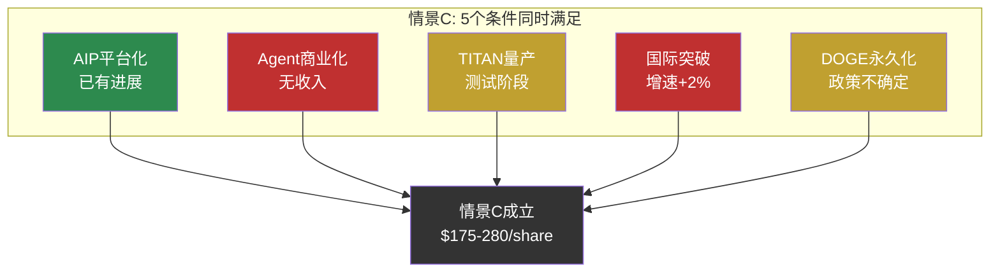

---

### 情景D: 增长幻灭 (熊市)

**条件声明**:
1. AIP Bootcamp高增速证明是"积压释放", FY2027增速降至25-30%
2. NRR从139%降至115-120%(客户扩展放缓, 竞争加剧)
3. Microsoft Fabric IQ + Databricks组合达到"足够好"水平, 蚕食AIP新客
4. DOGE在2026-07法定到期后实质终结, 民用联邦合同不续期
5. SBC绝对值重新上升(人才争夺), SBC/Revenue从15%回升至20%+
6. 国际市场持续停滞(+2%不变)

**这个情景代表"增长故事破灭" — PLTR不是坏公司, 但不是$300B级别的公司。**

#### 财务推演

| 指标 | FY2025A | FY2027E | FY2030E | 推导逻辑 |
|------|---------|---------|---------|---------|
| **Government** | $2.06B | ~$2.6B | ~$3.5B | DOGE终止后降至+12% |
| **US Commercial** | ~$1.47B | ~$2.8B | ~$4.0B | AIP增速从109%降至20% |
| **International** | ~$0.40B | ~$0.45B | ~$0.6B | 持续低增速 |
| **总收入** | $4.48B | ~$5.85B | ~$8.1B | 5Y CAGR ~13% |
| **GAAP OPM** | 31.6% | ~28% | ~30% | SBC上升压制+竞争压力 |
| **FCF Margin** | 46.9% | ~35% | ~33% | 税率正常化+SBC上升 |
| **EPS (Diluted)** | $0.63 | ~$0.85 | ~$1.50 | 利润率压缩 |

[DM-DIR-22: 情景D推演基于"增长幻灭"假设, Commercial增速回落至可比公司水平(20%), Government因DOGE终止而减速, SBC/Rev回升至20%]

**情景D的隐含估值逻辑**: FY2030E EPS ~$1.50, 如果市场重新将PLTR归类为"政府IT+利基商业软件"(P/E 20-30x), 隐含股价范围~$30-45。如果市场仍给予一定AI溢价(P/E 30-40x), 范围~$45-60。无论哪种, 都意味着当前$135.68存在**55-78%的下行空间**。

**情景D的关键触发信号**(投资者应密切监控):
- FY2026 Q1-Q2 US Commercial增速<60%(vs共识~110%) → Bootcamp积压释放见顶
- NRR从139%下降2个季度 → 客户扩展动能衰减
- DOGE 2026-07到期且无延期/永久化方案 → 政府增量消失
- SBC绝对值连续2季度环比上升 → 利润率压缩开始

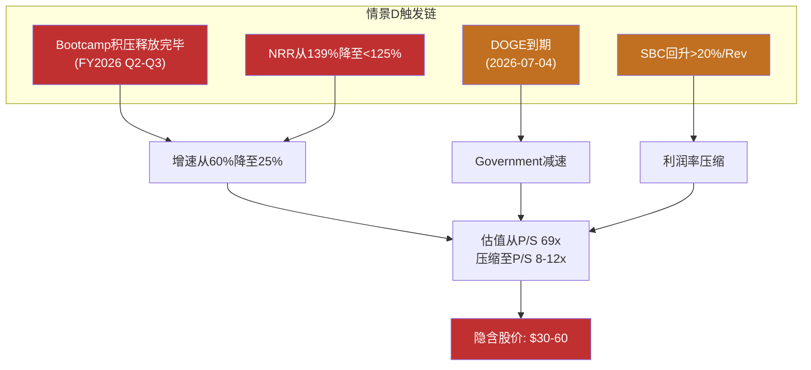

---

### 情景总结

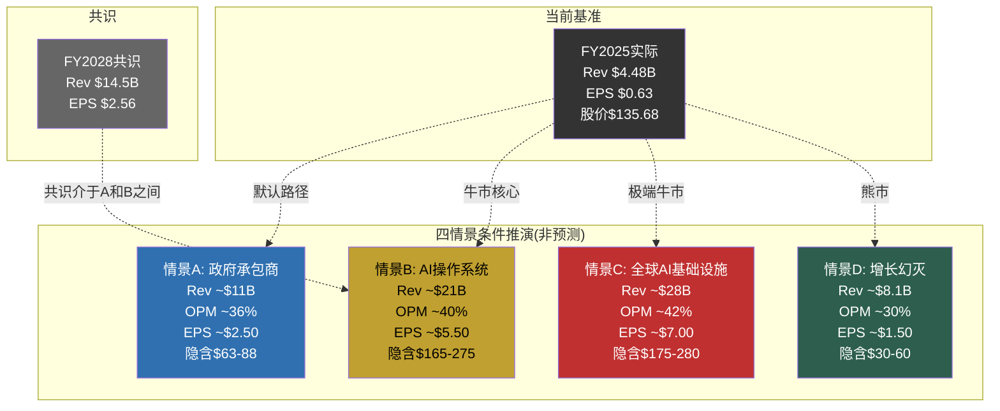

#### 情景隐含估值区间 (FY2030E, 条件推演, 非预测)

| 情景 | EPS范围 | P/E范围 | 隐含股价 | vs 当前$135.68 |
|------|--------|--------|---------|---------------|
| D: 增长幻灭 | $1.50 | 20-40x | $30-60 | 当前溢价126-353% |
| A: 政府承包商 | $2.50 | 25-35x | $63-88 | 当前溢价54-115% |
| B: AI操作系统 | $5.50 | 30-50x | $165-275 | 当前折价或溢价 |
| C: 全球AI基础设施 | $7.00 | 25-40x | $175-280 | 当前在区间低端 |

[DM-DIR-23: P/E范围基于类比 — 情景A对标BAH(18x)/CRM成熟期(25x)取中; 情景B对标高增长SaaS(NOW 45x/DDOG 50x)取中; 情景C对标平台型科技(META 25x/MSFT 35x); 情景D对标低增速政府IT(LDOS 20x/BAH 25x)]

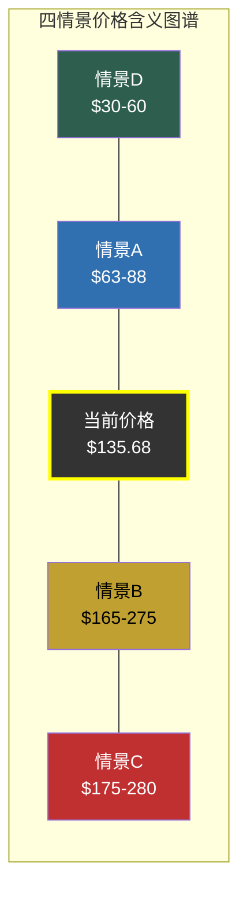

**读者导航**:

当前$135.68的定价逻辑需要**情景B的低段或情景B与C之间的某个位置**才能支撑。情景A(默认路径)和情景D(增长幻灭)都无法解释当前估值。

这意味着市场在当前价格隐含了一个核心赌注: **AIP不仅仅是一个成功的企业AI工具, 而是一个正在形成平台效应的企业AI操作系统**。如果这个赌注对了(情景B/C), 当前价格可能是合理的甚至便宜的; 如果赌注错了(情景A/D), 下行空间巨大(55%+)。

**与OVM的交叉验证**: OVM Full Value $63-66/share(Core + 概率加权期权)大致对应情景A的上段。TAM Ceiling $96/share(所有Bull 100%成功)处于情景A上段和情景B下段之间。市价$135.68超过TAM Ceiling, 与本节"需要情景B成立"的结论一致。

---

## C.7 承重墙脆弱度表

Reverse DCF逆推的每个隐含假设都是一面"承重墙" — 如果它倒塌, 整个估值大厦会受到什么程度的冲击?

| # | 隐含假设 | 脆弱度 | 证伪条件 | 证伪后影响 |
|---|---------|:---:|---------|---------|
| W1 | **FY2026-28收入CAGR >40%** | **高** | FY2027 Revenue <$9B (vs隐含$10.2B) | 增长叙事破裂, P/S从69x压缩至20-30x, 下行50-70% |
| W2 | **NRR维持>130% 至FY2028** | **高** | NRR连续2季<120% | 证明AIP黏性不足, 客户扩展依赖FDE而非产品力 |
| W3 | **FCF Margin维持>40%** | **中** | FCF Margin降至<30%(税率正常化+SBC) | 每下降5pp FCF Margin, EV/FCF需上升12-15%来维持同等估值 |
| W4 | **SBC/Revenue持续下降** | **中** | SBC/Revenue回升至>20% (vs当前15.3%) | GAAP盈利被侵蚀, 稀释股东价值, P/E升至>300x |
| W5 | **有效税率维持低位** | **中** | 有效税率升至>15%(NOL耗尽) | 净利润压缩15-20%, EPS下调相同比例 |
| W6 | **AIP自助化成功(降低FDE依赖)** | **高** | FDE/客户比率维持>0.3 FTE至FY2028 | 证明PLTR无法规模化服务中型企业, TAM天花板$10-15B |
| W7 | **国际商业增速恢复** | **低** | 国际持续+2%至FY2028 | 已部分定价; 但长期TAM缩小约30% |
| W8 | **政府业务稳健+DOGE增量** | **中** | DOGE终止后政府增速降至<15% | Government收入路径下调, 影响20-25%的总收入增速 |
| W9 | **Ontology技术护城河持续** | **高** | Microsoft Fabric IQ/Databricks达到"80%功能"水平 | Ontology锁定效应减弱, NRR下降, 新客获取成本上升 |
| W10 | **终端P/E >30x (FY2030)** | **中** | AI投资周期降温, SaaS估值回归历史均值(20-25x) | 相同EPS下估值下降25-40% |

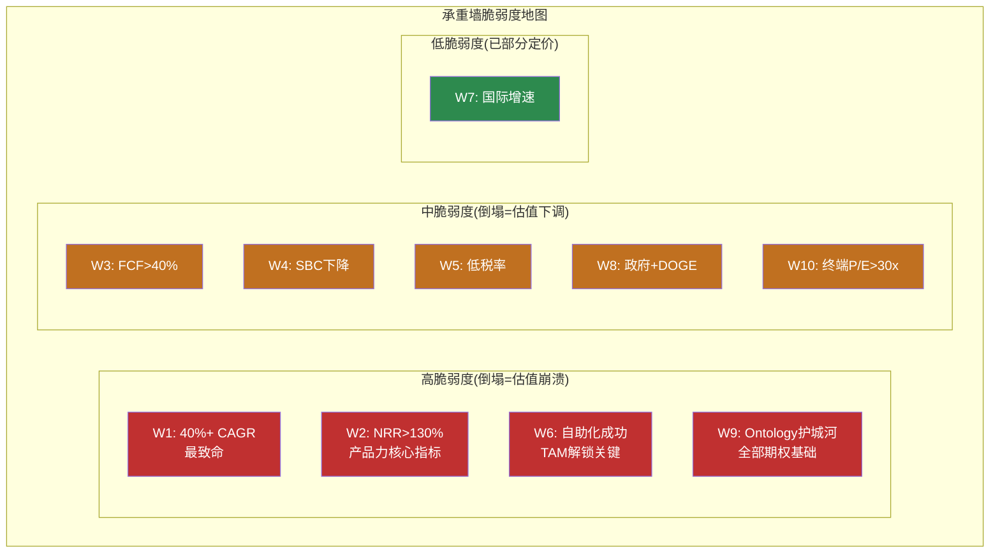

**承重墙关联性分析**: W1(增速)和W2(NRR)高度相关 — NRR下降直接拖累收入增速。W6(自助化)和W9(Ontology护城河)形成闭环 — 如果Ontology护城河被侵蚀(W9), 自助化工具的价值也大幅缩水(W6), 因为客户会转向"足够好"的替代品。

**最致命的单一失败点: W1+W9联动**。如果Ontology技术护城河被侵蚀(Microsoft Fabric IQ达到"80%功能"), 新客户获取放缓, NRR下降, 收入CAGR从40%降至20%以下 — 这直接触发从情景B/C向情景A/D的切换, 估值下行55-78%。这与OVM-7 PMX飞轮脆弱性分析中识别的"Ontology单点故障"完全一致。

---

## 数据映射表 (DM)

> 本节列出所有数据锚点的来源, 供审计使用。

| DM编号 | 数据点 | 来源 | 类型 |
|--------|--------|------|------|
| DM-DIR-01 | FMP DCF $10.19; 市价$135.68 | FMP DCF/Quote 2026-02-12 | 硬数据 |
| DM-DIR-02 | FY2025 Rev $4.475B, +56% YoY; SBC/Rev 15.3% | FMP Income/Key-Metrics | 硬数据 |
| DM-DIR-03 | 市值$309.9B; EV $303B; Net Cash $6.95B | FMP Quote/Balance | 硬数据 |
| DM-DIR-04 | Beta~2.0-2.5; Risk-free 4.3%; WACC 15-18% | 52周波动率估算+Damodaran | 合理推断 |
| DM-DIR-05 | 基准组逆推FCF路径(WACC 15%, g 2.5%) | 标准Reverse DCF公式 | 合理推断 |
| DM-DIR-06 | 隐含5Y CAGR ~42% | ($25.8/$4.48)^(1/5)-1 | 计算 |
| DM-DIR-07 | 隐含10Y CAGR ~26% | ($45.2/$4.48)^(1/10)-1 | 计算 |
| DM-DIR-08 | 三组敏感性(18%/15%/11% WACC) | 标准DCF反推 | 合理推断 |
| DM-DIR-09 | CRM/NOW/WDAY历史增速 | FMP Income历史; 公开财报 | 硬数据 |
| DM-DIR-10 | FY2025 Gross Margin 82.4%; OPM 31.6% | FMP Ratios/Income | 硬数据 |
| DM-DIR-11 | SBC历年: $565M/$476M/$692M/$684M | FMP Cashflow Annual | 硬数据 |
| DM-DIR-12 | AI平台TAM估计$80-300B | Gartner/IDC/McKinsey综合 | 合理推断 |
| DM-DIR-13 | 总客户~954家; US Commercial 571家 | PLTR Q4 2025 Earnings | 硬数据 |
| DM-DIR-14 | Gov $2.06B; US Comm ~$1.47B; Int'l ~$0.40B | PLTR 10-K FY2025 Segment | 硬数据 |
| DM-DIR-15 | 确定性分层价值范围 | 基于业务线状态的区间估计 | 合理推断 |
| DM-DIR-16 | 共识: FY2026E $7.14B; FY2027E $10.2B; FY2028E $14.5B | FMP Estimates | 硬数据 |
| DM-DIR-17 | 目标价中位$190; 极差$50-$255 | MarketBeat/TipRanks/StockAnalysis | 硬数据 |
| DM-DIR-18 | FY2026增量分解 | 基于Bootcamp/NRR/DOGE的推断 | 合理推断 |
| DM-DIR-19 | 共识NI/Net Margin路径 | FMP Estimates推算 | 合理推断 |
| DM-DIR-20 | 情景A财务推演 | Gov +20% CAGR + Comm减速假设 | 合理推断 |
| DM-DIR-21 | 情景B财务推演 | AIP平台化成功假设 | 合理推断 |
| DM-DIR-22 | 情景D财务推演 | 增长幻灭假设 | 合理推断 |
| DM-DIR-23 | P/E范围类比 | BAH/CRM/NOW/DDOG/LDOS可比 | 合理推断 |

---

*Supplement C完成。方向推演核心结论: 市价$135.68隐含5年CAGR 42%(无历史先例) + AIP平台化成功(概率加权>50%) + FCF Margin维持>40% + 终端P/E >30x。四情景中, 仅情景B(AI操作系统)和情景C(全球AI基础设施)能支撑当前价格, 情景A(默认路径)和D(增长幻灭)隐含55-78%下行。10个承重墙中4个为高脆弱度, Ontology单点故障是最致命的系统性风险。本模块与Part VI-A OVM交叉验证: 两个独立方法均显示当前估值需要AIP实现从未有过的规模化成功。*
