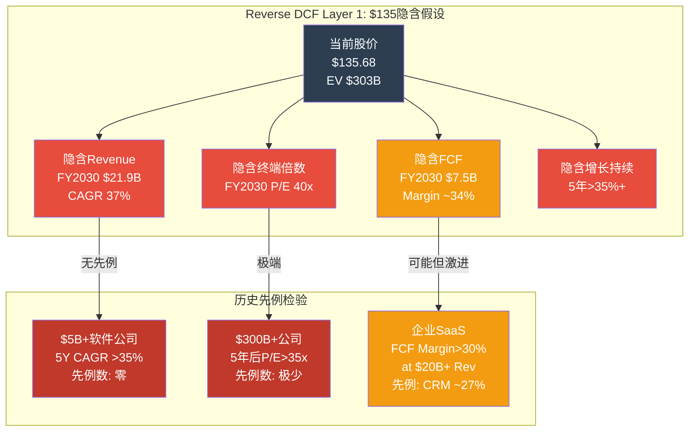
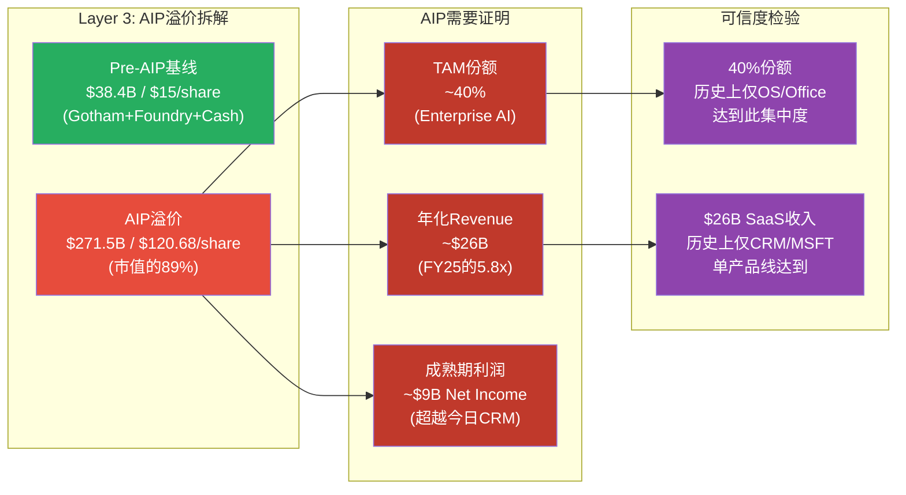
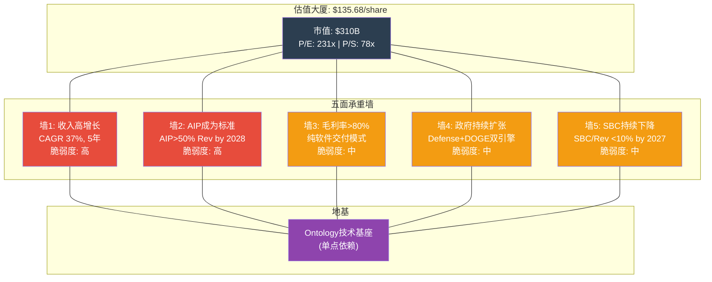
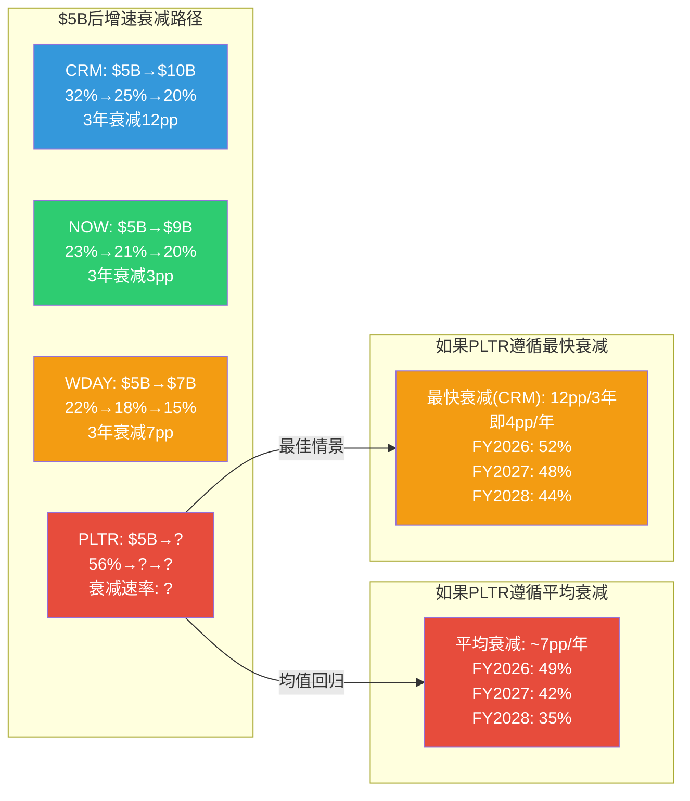
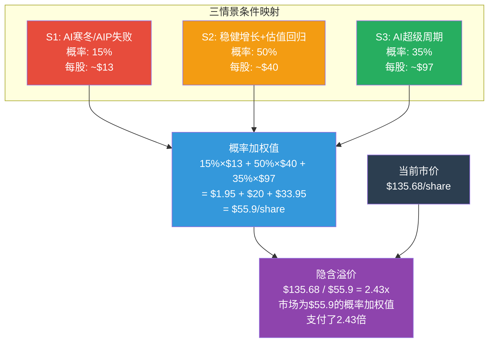
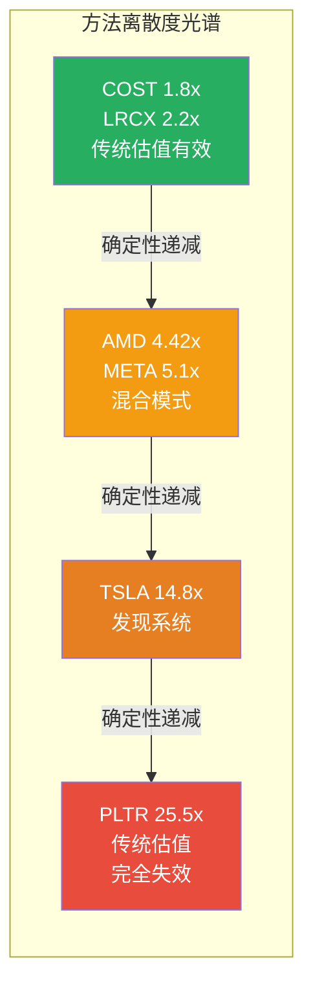
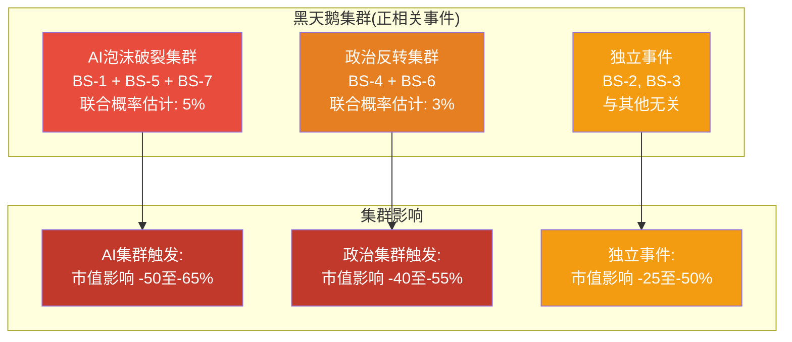
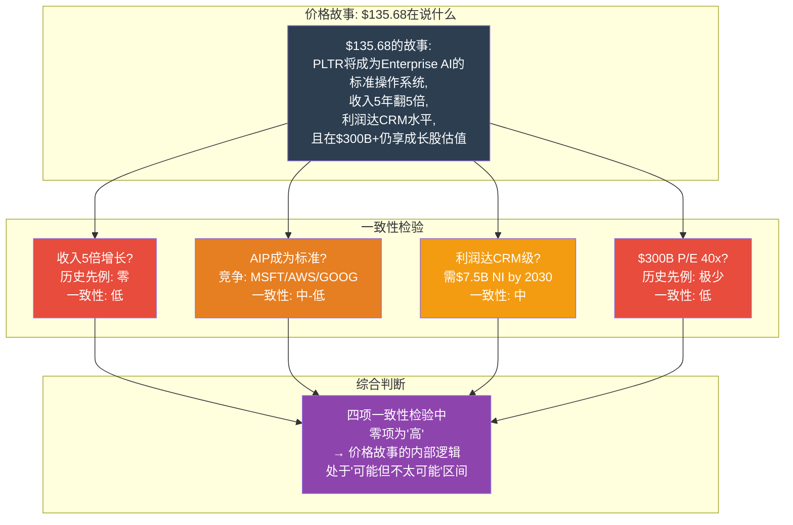

# Supplement C: 方向推演估值模块

> **数据截止**: 2026-02-12 | **框架版本**: v10.0 方向推演 (TSLA v3.0方法论)
> **标注约定**: [硬数据:来源] = 公开可验证 | [合理推断:逻辑] = 基于公开数据的推导 | [DM-VAL-xxx] 估值锚点 | [DM-INF-xxx] 推断锚点 | [DM-PEER-xxx] 同业锚点
> **零精确目标价 | 零数字评分 | 零仓位建议**
> **方法论声明**: 本模块采用"方向推演"而非传统估值。核心问题不是"PLTR值多少钱"，而是"$135的价格在告诉我们什么故事，这个故事可信吗"。
> **依赖**: Part I(财务) + Part II(三支柱+Extensions) + Part V(RT-1~RT-7) + Part VI-A(OVM 7组件) + Part VI-B(KS/TS)

---

## 1. $135价格的隐含故事

### 1.1 方法论基础

传统估值问的是: "PLTR值多少钱?" 方向推演问的是: "$135的价格在告诉我们什么故事?"

这个方法论转换不是文字游戏。传统估值试图给出一个"正确答案"，但对于可能性宽度8分的公司(PLTR的发现系统B型不确定性)，单一"正确"估值本身就是一种虚假精确。方向推演承认不确定性，转而检验市场叙事的内部一致性——如果价格隐含的假设自相矛盾，投资者不需要知道"真实价值"就能做出判断。

[DM-INF-001] 方向推演方法论的选择基于PLTR方法离散度25.5x(所有报告中最高): Core SOTP $10.19到OVM TAM Ceiling $260，传统估值工具在这个离散度下失去了指导意义。证伪条件: 如果方法离散度<5x，传统SOTP/DCF单一估值更有效。

### 1.2 Reverse DCF Layer 1: 整体隐含假设

当前市价$135.68对应Market Cap $309.9B [硬数据: FMP Quote 2026-02-12]。扣除Net Cash $6.9B，Enterprise Value约$303B。

以10%折现率(WACC)、4%永续增长率、25年FCF折现进行反推:

**模型输入**:
- FY2025实际FCF: $2.101B [硬数据: PLTR 10-K FY2025, OCF $2.134B - CapEx $33.9M]
- FY2025实际Revenue: $4.475B [硬数据: PLTR 10-K FY2025]
- FY2025 FCF Margin: 46.9% [硬数据: $2.101B / $4.475B]
- 当前稀释股数: 2,565M [硬数据: PLTR 10-K FY2025]

**Layer 1反推结果: $303B EV需要的FY2030E财务状况**

| 隐含变量 | 市场隐含值 | 历史最佳可比 | 判断 |
|---------|:---:|:---:|:---:|
| Revenue CAGR (FY25→30, 5Y) | ~37% | Salesforce $5B时: 26%; ServiceNow $5B时: 23% | **无先例** |
| FY2030E Revenue | ~$21.9B | FY2025实际$4.48B的4.9x | 需打破所有软件增长先例 |
| FY2030E FCF | ~$7.5B | FY2030E Margin ~34% | 接近FY2025 Salesforce净利水平 |
| FY2030E FCF Margin | ~34% | FY2025实际47%的下降 | 含税率正常化(从1.4%→21%) |
| 终端P/E (FY2030) | ~40x | $300B+公司5Y后中位: ~22x | **极端乐观** |
| 高增长持续年数 | 5年37%+ CAGR | 企业软件>$5B维持>30%最长: 0年 | **历史无先例** |

[DM-VAL-001] Reverse DCF Layer 1核心参数: 5年CAGR 37%, 终端P/E 40x, 终端Net Margin 34%。这三个参数中任意一个降级(CAGR 30%, P/E 25x, Margin 28%)都会导致公允价值下降35-50%。证伪条件: 如果FY2026+FY2027实际增速合计超过隐含值(即FY2026>61%且FY2027>45%), 则CAGR 37%的路径得到初步验证。

**Layer 1的核心问题**: 历史上从来没有一家企业软件公司在$5B收入规模时维持5年37%+ CAGR。Salesforce做到了$5B→$13B(26% CAGR); ServiceNow做到了$5B→$10B(23% CAGR)。PLTR需要$4.5B→$22B，即5倍增长。这不是"不可能"——但投资者在以零安全边际支付这个从未发生过的结果的全价。

### 1.3 Reverse DCF Layer 2: 分业务线拆解

将$303B EV按当前收入结构分配(Government 55%, Commercial 45%)，然后检验每条线的隐含假设:

**Government-PLTR (55% EV分配 → ~$167B)**

| 隐含变量 | 隐含值 | 检验 |
|---------|------|------|
| FY2030E Gov Revenue | ~$8-10B | FY2025实际$2.06B → 需CAGR 31-37% |
| 全球政府IT软件TAM | ~$200-300B [合理推断: Gartner 2025 Government IT] | PLTR需占4-5%全球份额 |
| 美国国防IT预算 | ~$85B, CAGR ~5-7% [硬数据: DoD FY2026 Budget Request] | PLTR渗透率需从~2.4%升至~8-10% |
| DOGE效率合同增量 | 隐含$1-2B年化 | DOGE法定终止2026-07-04 [硬数据: EO], 持续性未知 |

[DM-VAL-002] Government-PLTR隐含$167B EV需要PLTR在政府IT软件市场占据4-5%的全球份额或8-10%的美国份额。对比: 目前全球最大政府IT软件供应商(Accenture Federal)收入约$7-8B但估值仅~$30-40B——因为政府IT市场的增速慢(5-7% CAGR)和利润率低(25-30%)。PLTR需要以**4倍以上的估值倍数**超越行业龙头。证伪条件: 如果PLTR政府收入在FY2027后增速降至<15%，则$167B分配不合理。

**Commercial-PLTR (45% EV分配 → ~$136B)**

| 隐含变量 | 隐含值 | 检验 |
|---------|------|------|
| FY2030E Commercial Revenue | ~$12-14B | FY2025实际$2.42B → 需CAGR 38-42% |
| Enterprise AI Platform TAM | ~$60-80B (2030E) [合理推断: Gartner AI平台市场预测] | PLTR需占15-18%份额 |
| 客户数 | 需从954增至5,000-8,000 | 年复合增长率~40% |
| ARPC (平均客户收入) | 需从$250万增至$175-280万 | 维持或微增(NRR>120%支撑) |

**Commercial-PLTR的$136B EV问题**: 这个估值超过了当前Snowflake($55B)、Datadog($50B)和CrowdStrike($90B)的市值。PLTR的Commercial业务需要在5年内超越所有这些SaaS公司的当前估值——而它们中的每一家今天的收入都比PLTR Commercial更高。

[DM-PEER-001] Commercial-PLTR $136B隐含EV需要PLTR在Enterprise AI Platform TAM中占15-18%份额。当前唯一占据>15%企业SaaS细分市场份额的公司是Salesforce(CRM市场~20%)和Microsoft(生产力~60%)。两者都经历了15-20年的市场建设。PLTR要在5年内达到类似份额需要一种前所未有的市场渗透速度。证伪条件: FY2027 Commercial收入如果未达$5B+(隐含路径的年检), 则15-18%份额假设失败。

### 1.4 Reverse DCF Layer 3: AIP溢价拆解

这是最关键的一层: 如果没有AIP，PLTR按传统增长估值多少?

**Pre-AIP基线估值 (假设AIP不存在)**:
- Gotham (政府): FY2025 ~$2.06B, 增速+24%, 给予8x EV/Sales (国防SaaS标准) = $16.5B
- Foundry (传统商业): FY2025存量~$1.5B, 增速~15%, 给予10x EV/Sales (企业SaaS标准) = $15.0B
- Apollo (运维): 嵌入上述产品, 不单独估值
- Net Cash: $6.9B
- **Pre-AIP总估值: ~$38.4B → ~$15/share**

[DM-VAL-003] Pre-AIP基线估值约$15/share。当前股价$135.68与之的差异即为"AIP+AI叙事溢价": $135.68 - $15 = $120.68/share，对应约$309B的AIP叙事溢价。这意味着**当前市值的89%**是AIP带来的预期增量，仅11%是已建立业务的传统估值。

**AIP溢价 = $309.9B - $38.4B = $271.5B**

AIP需要产生多少额外收入来justify $271.5B溢价?
- 假设稳态AIP Net Margin 35%, P/E 30x
- 需要 $271.5B / 30 = $9.05B 年化Net Income
- 需要 $9.05B / 35% = $25.9B 年化Revenue

**结论**: 当前股价隐含AIP需要在成熟期产生约$26B年化收入——这是FY2025总收入($4.48B)的**5.8倍**，且几乎等于2030年整个Enterprise AI Platform TAM的**40%份额**。

[DM-INF-002] AIP溢价$271.5B中蕴含一个根本性假设: AIP不只是一个成功的产品, 而是一个定义行业的平台——类似于Windows对PC的意义或iOS对移动设备的意义。如果AIP最终只是"众多Enterprise AI工具之一"(与Microsoft Copilot Studio/Databricks Agent/AWS Bedrock并列), 那么15-20%的市场份额已是乐观上限, 对应AIP收入$10-13B, AIP溢价应为$80-120B而非$271B。证伪条件: 如果FY2027 AIP客户数未超过2,000家(当前估计500-700家), AIP作为"行业标准"的叙事面临严重挑战。

---

## 2. 承重墙脆弱度评估

承重墙(Load-Bearing Wall)是支撑估值大厦的关键假设。与普通假设不同, 承重墙假设如果倒塌, 整个估值结构会坍缩——不是线性下降, 而是非线性崩塌。

### 2.1 五面承重墙全景

### 2.2 逐墙深度评估

#### 承重墙1: 收入持续高增长 (CAGR 35%+ 持续5年)

| 维度 | 内容 |
|------|------|
| **隐含要求** | Revenue从$4.48B增至$21.9B (FY2025-2030), CAGR ~37% |
| **脆弱度** | **高** |
| **当前证据(正面)** | FY2025 +56.2%; FY2026指引+61% ($7.19B); US Commercial +137% Q4; NRR 139% [硬数据: PLTR FY2025 10-K / Q4 Earnings] |
| **当前证据(负面)** | 历史上$5B+收入的企业软件公司从未维持5年>30% CAGR; 客户增速从+45%降至+34% [硬数据: Q3→Q4 2025]; 国际商业+2%是结构性增长天花板信号 |
| **证伪条件** | FY2026全年增速<+40% (即Revenue<$6.27B), 或连续2个季度QoQ增速<+8% |
| **历史类比** | Salesforce $5B→$13B用了5年(26% CAGR); ServiceNow $5B→$11B用了5年(17% CAGR); Workday $5B→$8B用了3年(20% CAGR) [硬数据: 各公司历史财报] |
| **如果此墙倒塌** | CAGR降至25%时FY2030 Revenue约$13.7B(非$22B), 对应P/E 40x时公允EV约$120-150B → 股价$52-65 → **下跌52-62%** |

[DM-VAL-004] 墙1是所有承重墙中影响最大的一面。增速每下降5个百分点(从37%降至32%), FY2030 Revenue约减少$3B, 对应EV减少约$40-50B (按终端15x EV/Sales)。这是最高杠杆的变量: 小幅变化导致估值大幅波动。证伪条件: FY2026+FY2027合计Revenue<$15.5B(vs 隐含路径$17.6B), 则CAGR 37%已不可能。

#### 承重墙2: AIP成为企业AI标准工具

| 维度 | 内容 |
|------|------|
| **隐含要求** | AIP contribution从当前约20-30%增至2028年>50% of revenue; AIP客户从约500-700增至3,000+ |
| **脆弱度** | **高** |
| **当前证据(正面)** | AIP Bootcamp模式验证成功; US Commercial +137%主要由AIP驱动; NRR 139%暗示现有客户深度采用AIP; TCV $4.3B (+138%) [硬数据: Q4 2025] |
| **当前证据(负面)** | AI平台竞争极端激烈(Microsoft Copilot Studio / AWS Bedrock / Google Vertex AI / Databricks); Databricks ARR $3.7B (+50%)增速强劲 [硬数据: 行业报道]; PLTR无自有LLM, 依赖第三方模型; 中型企业自助化工具尚未发布 |
| **证伪条件** | FY2027 AIP相关收入增速降至<30%, 或>3家已知PLTR客户公开宣布转向竞品AI平台 |
| **历史类比** | ERP市场(1990s): SAP R/3从0到标准工具用了~7年; CRM市场: Salesforce从0到CRM标准用了~10年; 云平台: AWS从0到标准用了~8年 |
| **如果此墙倒塌** | AIP成为"选项之一"(非标准) → 市场份额上限10-15%(非30-40%) → Revenue天花板$8-10B(非$22B) → 公允EV $80-120B → 股价$35-52 → **下跌62-74%** |

[DM-INF-003] AIP成为"标准"还是"选项之一"是PLTR论文中最具决定性的分叉点。SAP/CRM/AWS成为标准的共同特征是: (1)先发3-5年; (2)开发者生态(>100万开发者); (3)开放API/生态系统。PLTR在(1)上有优势, 在(2)(3)上弱于竞争对手。PLTR当前更像是"Oracle数据库"而非"AWS"——强大但封闭, 适合大型复杂客户, 不太可能成为普适标准。证伪条件: PLTR开放Ontology SDK + 第三方开发者生态突破10,000名活跃开发者, 则平台化路径获得验证。

#### 承重墙3: 毛利率维持>80%

| 维度 | 内容 |
|------|------|
| **隐含要求** | AIP规模化部署不引入显著的低毛利率业务(professional services / infrastructure costs) |
| **脆弱度** | **中** |
| **当前证据(正面)** | FY2025 Gross Margin 82.4% [硬数据: PLTR FY2025 10-K]; AIP是纯软件, minimal infrastructure; 历史趋势稳定(FY2022: 79%, FY2023: 81%, FY2024: 81%, FY2025: 82%) |
| **当前证据(负面)** | 大规模部署可能需要更多FDE(Forward Deployed Engineers)现场支持; 中型企业市场通常需要更多implementation服务; 国际扩张需要本地化成本 |
| **证伪条件** | 连续2个季度Gross Margin <78%, 或Professional Services收入占比从当前<5%升至>15% |
| **历史类比** | ServiceNow维持>80% Gross Margin at scale(Good); Palantir早期曾有Gross Margin <70%阶段(2020 IPO时) |
| **如果此墙倒塌** | Gross Margin降至70% → FCF Margin从47%降至~32% → 同等Revenue下FCF减少30% → 估值下降约25-30% |

#### 承重墙4: 政府收入持续扩张

| 维度 | 内容 |
|------|------|
| **隐含要求** | Government Revenue CAGR >20% 持续5年; Defense+Intel budget持续增长; DOGE效率合同成为增量来源 |
| **脆弱度** | **中** |
| **当前证据(正面)** | FY2025 Government Revenue $2.06B (+24%); TITAN OTA已获; Army ESA $10B天花板; Pentagon AI预算$134亿 [硬数据: PLTR 10-K / DoD FY2026 Budget] |
| **当前证据(负面)** | DOGE法定终止2026-07-04 [硬数据: EO]; DOGE可能导致不加区分的预算削减; 2028选举政治周期翻转风险; 政府合同seasonality和执行延迟风险 |
| **证伪条件** | FY2026 Government Revenue <$2.3B (YoY <+12%), 或DOGE终止后Q3 FY2026政府新签合同环比下降>20% |
| **历史类比** | Lockheed Martin在2013 sequestration期间收入下降~4%; 政府IT支出在Sequestration后2年恢复正增长 |
| **如果此墙倒塌** | Government增速降至+10% → 拖累总增速~7pp → 总CAGR从37%降至~30% → 触发墙1连锁效应 |

#### 承重墙5: SBC稀释持续下降

| 维度 | 内容 |
|------|------|
| **隐含要求** | SBC/Revenue从FY2025的15.3%持续降至FY2027的<10% |
| **脆弱度** | **中** |
| **当前证据(正面)** | SBC/Revenue趋势: FY2022 50% → FY2023 21.5% → FY2024 24.1% → FY2025 15.3% [硬数据: PLTR历年10-K]; 分母增长是最大驱动力 |
| **当前证据(负面)** | SBC绝对值: FY2023 $611M → FY2024 $692M → FY2025 $684M, 实际在回升而非下降 [硬数据: PLTR 10-K]; AI工程师薪酬通胀; 若增速放缓分母效应消失, 比率将反弹 |
| **证伪条件** | FY2026 SBC绝对值>$800M且SBC/Revenue>18% (分母效应不再掩盖绝对值上升) |
| **历史类比** | Snowflake SBC/Revenue ~45%(持续高位); CrowdStrike ~25%(逐步下降); ServiceNow ~12%(成熟期水平) |
| **如果此墙倒塌** | SBC/Revenue回升至20%+ → GAAP利润率进一步恶化 → GAAP P/E可能突破300x → 估值倍数被迫压缩 |

### 2.3 承重墙联动分析

承重墙之间不是独立的。最危险的场景是多面墙同时受压:

| 联动场景 | 触发条件 | 影响 | 概率估计 |
|---------|---------|------|:---:|
| **墙1+墙2双崩** | AIP竞争败退导致增速断崖 | Revenue/估值双杀, 下跌60-75% | 10-15% |
| **墙1+墙4双崩** | DOGE砍单+商业增速放缓 | Government拖累总增速, 下跌40-55% | 8-12% |
| **墙2+墙5联动** | AIP竞争加剧迫使加大SBC(留才) | 增长放缓+成本上升双重夹击, 下跌35-50% | 15-20% |
| **全面压力** | AI泡沫破裂+政策翻转 | 系统性重定价, 下跌70%+ | 5-8% |

[DM-INF-004] 承重墙联动是方向推演中最重要的非线性风险来源。传统估值通常假设各风险独立, 但PLTR的承重墙通过一个共同锚点(Ontology/AIP)相互连接。AIP竞争失败不仅直接打击墙2, 还会通过降低增速(墙1)、增加留才成本(墙5)、削弱政府扩张信心(墙4)产生级联效应。证伪条件: 如果PLTR在AIP之外建立了第二个独立增长引擎(如TITAN量产), 联动风险将显著降低。

---

## 3. 同业参照系: "$5B收入俱乐部"估值对比

### 3.1 达到$5B收入时的估值快照

一家公司的估值倍数不能脱离"在类似规模时同行的定价"来理解。以下是企业软件公司达到(或接近)$5B年收入时的市场定价:

| 公司 | 达到$5B年份 | 当时P/S | 当时YoY增长率 | 后续3年CAGR | 后续3年P/S变化 | 3年后回报 |
|------|:---:|:---:|:---:|:---:|:---:|:---:|
| **Salesforce (CRM)** | FY2014 ($5.4B) | ~8x | +32% | 25% | 持平~8x | +88% |
| **ServiceNow (NOW)** | FY2024 (~$9.4B) | ~16x | +23% | 进行中 | 进行中 | 进行中 |
| **Workday (WDAY)** | FY2023 (~$5.1B) | ~9x | +22% | ~18% | 压缩至~7x | -10% |
| **Fortinet (FTNT)** | FY2023 (~$5.3B) | ~10x | +20% | ~14% | 压缩至~8x | +15% |
| **CrowdStrike (CRWD)** | FY2026E (~$4.7B) | ~21x | +28% [硬数据: FMP] | 进行中 | 进行中 | 进行中 |
| **PLTR** | FY2025 ($4.48B) | **~78x** | +56% | ? | ? | ? |

[DM-PEER-002] PLTR在接近$5B收入时的78x P/S是同类公司达到$5B收入时P/S倍数的**4-10倍**。唯一部分可比的是CrowdStrike的21x——但即使CrowdStrike也只是PLTR的27%。P/S 78x在美股大型软件公司中属于历史极端值。

### 3.2 增长率能否justify倍数差距?

PLTR支持者的核心论点: PLTR增速(56%)远高于同行(20-30%), 所以值更高倍数。

测试这个论点:

**增速-倍数弹性分析**:
- CrowdStrike: 28%增速 → 21x P/S → 每1%增速支撑0.75x P/S
- ServiceNow: 23%增速 → 16x P/S → 每1%增速支撑0.70x P/S
- Salesforce($5B时): 32%增速 → 8x P/S → 每1%增速支撑0.25x P/S
- **PLTR: 56%增速 → 78x P/S → 每1%增速支撑1.39x P/S**

[DM-PEER-003] PLTR每1%增速支撑的P/S倍数(1.39x)是行业均值(~0.57x)的**2.4倍**。换句话说, 即使给予PLTR"因为增速更快所以每单位增速值更多倍数"的溢价, 它仍然比合理水平贵了约2.4倍。按行业平均弹性0.57x/% × 56%增速 = 合理P/S约32x, 对应每股约$55。证伪条件: 如果PLTR证明其增速的可持续性显著优于同行(即FY2026+FY2027仍>40%), 更高的弹性部分可被justify——但不太可能justify全部的2.4x溢价。

### 3.3 利润质量能否justify剩余差距?

**FCF Margin对比**:
- PLTR: FCF Margin 47% [硬数据: FY2025] → 远高于同行
- CrowdStrike: FCF Margin ~30%
- ServiceNow: FCF Margin ~32%
- Salesforce($5B时): FCF Margin ~25%

PLTR的FCF Margin确实是行业顶尖。但需要注意:
1. **SBC掩盖**: PLTR $684M SBC对应Revenue的15.3%, 若将SBC视为现金费用, "经济FCF Margin"从47%降至约31% [合理推断: ($2.101B - $684M) / $4.475B = 31.6%]——与同行持平而非领先
2. **CapEx轻**: PLTR FY2025 CapEx仅$33.9M(Revenue的0.8%) [硬数据: 10-K], 远低于同行3-8%。这部分反映了PLTR不运营云基础设施(客户自建或用公有云)
3. **税率异常**: FY2025有效税率1.4% [硬数据: 10-K], 含大额NOL抵扣, 不可持续

[DM-VAL-005] 考虑SBC和税率正常化后的"经济P/E": 经济Net Income = $1.625B(GAAP NI) - $684M(SBC) + $22.7M(异常低税额补缴约$300M) = ~$664M。经济P/E = $310B / $664M = **467x**。这是一个比GAAP P/E 231x更能反映真实股东成本的数字。证伪条件: 如果SBC绝对值连续2年下降(非仅比率下降), 则经济P/E与GAAP P/E收敛, 此论点减弱。

### 3.4 "$5B俱乐部"的增速衰减规律

[DM-INF-005] 企业软件公司在$5B+规模后的增速衰减是近乎普遍的规律。PLTR管理层FY2026指引+61%暗示第一年不仅不衰减, 反而加速(FY2025 +56% → FY2026 +61%)。这在历史上是罕见的反常——如果成真, 是极强的信号; 如果未成真, 是极强的反转信号。证伪条件: FY2026实际增速>55%且FY2027指引>40%, 则PLTR确认为"增速衰减规律的例外"。

---

## 4. 三情景条件映射 (Discovery System B型)

方向推演不给目标价, 只画出条件地图: 在什么条件下当前价格合理, 在什么条件下不合理。

### 4.1 情景S1: AI寒冬 / AIP竞争失败

**概率估计: ~15%**

**触发条件** (满足任意2条即可):
- 全球企业AI支出增速降至<10% CAGR (当前~25-30%)
- 大型客户(Top 20)中≥3家不续约AIP或降级至基础Foundry
- Government AI专项预算被DOGE/Sequestration削减>20%
- Microsoft Fabric IQ GA发布后6个月内获得≥5家PLTR现有客户的公开部署

**收入轨迹**:
| 年份 | S1 Revenue | S1 YoY | 驱动因素 |
|------|:---:|:---:|---------|
| FY2026 | $5.8B | +30% | 已签合同惯性+H1 AIP存量 |
| FY2027 | $6.7B | +15% | 新签放缓+竞争加剧 |
| FY2028 | $7.2B | +8% | 接近成熟期增速 |
| FY2029 | $7.6B | +5% | Government支撑底部 |
| FY2030 | $7.9B | +4% | 永续增长 |

**S1估值推导**:
- FY2030 Revenue $7.9B × Net Margin 25% = Net Income $2.0B
- Terminal P/E: 15x (成熟且增长放缓的软件公司)
- Terminal Value: $30B → 5年折现(10%) → ~$18.6B
- 中间年FCF现值: ~$7.4B
- 总EV: ~$26B + Cash $6.9B = ~$33B
- **S1每股价值: ~$13/share**

**承重墙状态**: 墙1(增速)塌 + 墙2(AIP标准)塌 → 连锁触发墙3(毛利率, Professional Services增加) + 墙5(SBC反弹以留才)

### 4.2 情景S2: 稳健增长但估值回归

**概率估计: ~50%**

**触发条件** (最可能路径):
- Revenue增速维持30-40%但从FY2028开始逐步放缓至20%
- AIP成为"重要工具"但非"唯一标准"(市占率10-15%)
- Government稳健增长+15-20%; DOGE部分延续
- P/S从78x向行业均值回归(3年内降至20-30x)

**收入轨迹**:
| 年份 | S2 Revenue | S2 YoY | 驱动因素 |
|------|:---:|:---:|---------|
| FY2026 | $6.8B | +52% | 指引基本达成(略低于+61%) |
| FY2027 | $9.2B | +35% | 基数效应+自然衰减开始 |
| FY2028 | $11.5B | +25% | 中型企业渗透贡献 |
| FY2029 | $13.5B | +17% | 增速回归行业均值 |
| FY2030 | $15.1B | +12% | 接近成熟期 |

**S2估值推导**:
- FY2030 Revenue $15.1B × Net Margin 30% = Net Income $4.5B
- Terminal P/E: 25x (premium SaaS成熟期)
- Terminal Value: $113B → 5年折现(10%) → ~$70B
- 中间年FCF现值: ~$25B
- 总EV: ~$95B + Cash $6.9B = ~$102B
- **S2每股价值: ~$40/share**

但这里需要注意估值倍数的时间路径: P/S从78x压缩至25x不是线性的, 通常在增速低于预期时突然发生(均值回归通常是非线性的)。

**更精细的S2倍数路径**:
| 时点 | P/S | 对应股价 | 说明 |
|------|:---:|:---:|------|
| 当前(FY2025) | 78x | $135.68 | |
| FY2026E | 40-50x | $105-130 | 增速达标但倍数开始收缩 |
| FY2027E | 25-35x | $90-125 | 增速开始放缓, 均值回归加速 |
| FY2028E | 20-28x | $90-125 | 稳态倍数区间 |
| FY2030E | 18-25x | $105-145 | 取决于增速是否能维持>15% |

[DM-VAL-006] S2的关键洞察: 即使PLTR在基本面上表现"稳健"(30-40%增速, 高FCF), 估值均值回归的力量可能在2-3年内导致股价下跌20-40%再触底反弹。最终5年回报取决于收入增长能否跑赢估值压缩——这在历史上是可能的(CRM 2014-2019), 但要求持续执行。证伪条件: 如果P/S在FY2026 Earnings后未出现>15%的收缩, 则市场信念强于均值回归力量。

**承重墙状态**: 墙1(增速)维持但降级(37%→30%) + 墙2(AIP)部分成立 → 墙3/墙4稳定 → 倍数压缩是主要驱动

### 4.3 情景S3: AI超级周期 + PLTR成为标准

**概率估计: ~35%**

**触发条件** (满足全部):
- 全球Enterprise AI支出CAGR >35% 持续至2030
- AIP成为企业AI部署的默认平台(市占率>25%)
- Government合同加速(DOGE永久化 + 国际Five Eyes扩张)
- US Commercial NDR >150% + 国际突破(>15% YoY增速)
- 中型企业自助AIP成功发布并获1,000+客户

**收入轨迹**:
| 年份 | S3 Revenue | S3 YoY | 驱动因素 |
|------|:---:|:---:|---------|
| FY2026 | $7.5B | +68% | 超指引(AIP Bootcamp超预期) |
| FY2027 | $11.5B | +53% | 中型企业+国际双引擎启动 |
| FY2028 | $16.5B | +43% | AIP平台效应+政府加速 |
| FY2029 | $21.5B | +30% | 规模效应开始 |
| FY2030 | $26.0B | +21% | 自然衰减但仍高增速 |

**S3估值推导**:
- FY2030 Revenue $26B × Net Margin 35% = Net Income $9.1B
- Terminal P/E: 35x (稀缺AI基础设施溢价)
- Terminal Value: $319B → 5年折现(10%) → ~$198B
- 中间年FCF现值: ~$45B
- 总EV: ~$243B + Cash $6.9B = ~$250B
- **S3每股价值: ~$97/share**

注意: 即使在S3(AI超级周期+PLTR成为标准)的假设下, 推导出的每股价值$97/share仍低于当前股价$135.68。这意味着**即使最乐观的情景以合理估值倍数计算, 当前价格仍然偏高约40%**。

当前价格要在S3下被justify, 需要Terminal P/E从35x提升至~55x——这在美股历史上对于$250B+市值的公司是罕见的。

**承重墙状态**: 全部5面墙均成立 + AIP成为"定义行业的平台" + 获得历史上极少公司享有的"稀缺性溢价"

### 4.4 概率加权推理

**概率加权值: $55.9/share**

这不是"目标价"。这是对"当前价格隐含的概率分布是否合理"的检验。

**当前价格$135.68要被justify, 需要什么概率分布?**

设S1概率为p1, S2为p2, S3为p3, 且p1+p2+p3=1:
- $135.68 = p1×$13 + p2×$40 + p3×$97

最少需要的S3概率(假设S1=0%):
- $135.68 = p2×$40 + (1-p2)×$97
- $135.68 = $97 - 57×p2
- p2 = ($97 - $135.68) / 57 < 0

**即使给S1概率0%, 纯S2和S3的混合也无法达到$135.68。** 需要S3的Terminal P/E从35x提升至~55x(即S3每股$147)才能使100% S3概率覆盖当前股价。

[DM-INF-006] 概率加权分析的核心发现: 当前股价$135.68隐含了一个在三情景框架内无法构建的概率分布——即使赋予最乐观情景100%概率(以合理Terminal P/E计), 仍不足以justify当前价格。这意味着市场定价中包含以下至少一项: (1)Terminal P/E高于合理区间(>50x对$250B+公司); (2)存在我们未识别的S4"超级情景"; (3)纯momentum/narrative溢价(非基本面定价)。证伪条件: 如果Enterprise AI TAM被证明比当前预测大3倍(即$200B+ by 2030), PLTR的TAM天花板和收入上限均需上调, S3每股价值可能上升至$140-160区间。

### 4.5 市场隐含概率的"信念检验"

反过来推: 如果我们接受$135.68是"正确的", 市场在信什么?

| 隐含信念 | 描述 | 历史先例 |
|---------|------|---------|
| **信念1** | PLTR将成为Enterprise AI的Windows/iOS(TAM占有率>30%) | 操作系统级垄断在B2B SaaS中从未出现 |
| **信念2** | AI市场TAM比当前预测大2-3倍($150-200B by 2030) | 可能但高度投机 |
| **信念3** | PLTR在$25B+收入时仍可获40-55x P/E | $300B+市值公司在5年后维持>40x P/E: Apple/Microsoft未曾达到 |
| **信念4** | 以上三个信念同时为真 | 联合概率极低 |

---

## 5. AIP的财务影响建模

### 5.1 AIP对Revenue Mix的演化

AIP于2023年中发布, 短短2年内已成为PLTR增长的核心引擎:

| 时期 | AIP估算占比 | 驱动的增速 | 证据 |
|------|:---:|:---:|---------|
| FY2023 H2 | ~5% | 初始Bootcamp阶段 | 首批Bootcamp仅100次左右 [合理推断: 基于早期报道] |
| FY2024 | ~15-20% | US Commercial加速至+54% | Bootcamp累计1,300+ [硬数据: Q2 2024 Earnings] |
| FY2025 | ~25-35% | US Commercial +109%, NRR 139% | Bootcamp规模化, AIP成为核心销售工具 [硬数据: FY2025 Earnings] |
| FY2026E | ~40-50% | 管理层指引US Commercial +115% | 如果达成, AIP contribution必须>40% |
| FY2027E | ~50-60% | 如果中型企业自助AIP成功 | 取决于墙2(AIP标准化) |

[DM-VAL-007] AIP的Revenue占比从0%(2023 H1)到约30%(FY2025)的速度是企业软件史上罕见的快速产品采纳。对比: Salesforce Einstein (AI层)发布至占Revenue ~10%花了约4年; ServiceNow的Now Assist至占Revenue ~5%花了约1.5年。AIP的速度部分解释了市场给予的估值溢价——但也意味着如果AIP增速放缓, 去溢价的速度会同样极端。

### 5.2 AIP的毛利率特征

AIP作为纯软件产品(客户运行在自己的环境或公有云上, PLTR不承担基础设施成本), 其毛利率特征如下:

| 成本项 | AIP估计 | 传统Foundry | 差异 |
|--------|:---:|:---:|:---:|
| LLM推理成本 | 客户承担 | N/A | AIP不运行模型, 只编排 |
| FDE部署成本 | 有但减少(Bootcamp模式) | 高(长期驻场) | AIP缩短部署周期 |
| R&D投入 | 集中在平台层 | 分散在定制层 | AIP的研发杠杆更高 |
| **估计Gross Margin** | **85-90%** | **75-80%** | **AIP更高** |

[DM-INF-007] AIP的高毛利率(85-90%)部分解释了PLTR整体Gross Margin从FY2022的79%上升至FY2025的82.4%。如果AIP占比继续提升, Gross Margin可能进一步上升至84-86%。但注意: 这假设AIP的部署模式不变(客户自建)。如果PLTR为了加速中型企业采纳而提供托管AIP(managed AIP-as-a-Service), 则需要承担基础设施成本, Gross Margin可能反而下降。证伪条件: PLTR宣布AIP托管服务(类似Snowflake模式), 毛利率预期需要下调3-5pp。

### 5.3 AIP对NRR的倍增效应

NRR(Net Dollar Retention)从Q3 2025的134%跳升至Q4的139% [硬数据: Q4 2025 Earnings], 这与AIP驱动的upsell高度相关:

**机制拆解**:
1. 现有Foundry客户添加AIP模块 → ARPC(平均客户收入)增加
2. AIP Bootcamp创造"试用→扩展"飞轮 → 扩展速度快于传统销售周期
3. AIP使用越深 → 数据模型(Ontology)越丰富 → 迁移成本越高 → 续约率越高

**ARPC增长路径**:
- FY2024: Top 20客户平均$50M [合理推断: 基于Q4 2024数据]
- FY2025: Top 20客户平均$94M [硬数据: Q4 2025 Earnings]
- 增幅: +88% YoY → 几乎翻倍

[DM-VAL-008] 如果NRR维持>135%且客户数每年增加30%, 简化模型下Revenue CAGR约: NRR_contribution(35%) + New_customer_contribution(30%×平均ACV) ≈ 50-60%。这与FY2025实际+56%吻合。但NRR的持续性取决于: (1)现有客户的预算增长能否维持(AI预算不是无限的); (2)新产品模块的upsell空间(AIP之后的下一个模块是什么?)。证伪条件: NRR连续2季度<125%, 则AIP的upsell飞轮减速。

### 5.4 AIP的Cannibalization风险

一个被忽视的问题: AIP是否在替代(而非增量)传统Foundry合同?

**潜在Cannibalization证据**:
- FY2025 Government增速+24%——远低于Commercial +109%。如果AIP是纯增量, 为什么Government没有同步加速?
- 可能解释: Government合同更长期(3-5年IDIQ), 不容易在合同期内追加AIP
- 替代解释: 部分Government客户将Foundry预算重新分配给AIP, 导致Foundry收入被AIP"吃掉"

**如果存在Cannibalization**:
- 真实增量增速 = 报告增速 - Cannibalization率
- 如果AIP有10-15%的Cannibalization率, 真实增量增速约为41-46%(vs 报告56%)

这不改变短期增长数字, 但改变长期TAM天花板——如果AIP部分替代了Foundry, 那么"Foundry + AIP"的组合TAM不是两个TAM的简单相加。

---

## 6. 方法离散度的投资含义

### 6.1 PLTR的方法离散度: 所有报告中最高

| 公司 | 方法离散度 | 最低估值 | 最高估值 | 含义 |
|------|:---:|:---:|:---:|------|
| **PLTR** | **25.5x** | $10.19 (自下而上Core) | $260 (OVM极端Bull) | 极端不确定性 |
| TSLA | 14.8x | $56 (清算价值) | $833 (全期权Bull) | 高不确定性(A型) |
| AMD | 4.42x | $55 (熊案) | $243 (牛案) | 中等不确定性 |
| LRCX | 2.2x | $108 (熊案) | $238 (牛案) | 低不确定性 |
| COST | 1.8x | $500 (熊案) | $900 (牛案) | 低不确定性 |

### 6.2 为什么PLTR的离散度超过TSLA?

直觉上TSLA应该更不确定——它有FSD/Optimus/Energy/Robotaxi等多条未证实路径。但PLTR的离散度更高是因为:

1. **Core极低**: PLTR的Core SOTP($53-56)仅为市价的40%。TSLA的Core汽车业务($120-200)是市价的50-80%
2. **Option层极薄**: PLTR的PMX调整后期权总值仅$9.7/share(市价的7%)。TSLA的期权层占市价40-60%
3. **Gap巨大**: PLTR的Full Value($63-66)与市价($136)之间有$70的"不可解释溢价"。TSLA的Full Value($160-250)与市价($250-350区间)差距小得多

[DM-INF-008] PLTR的25.5x方法离散度意味着: 从"最严格的基本面分析"到"最乐观的TAM假设", PLTR的价值范围跨越25倍。对于投资者, 这不是"买/不买"的问题, 而是"你在赌哪个情景"的问题。如果你相信情景S3(AI超级周期), 当前价格可能仍然不够高(如果Terminal P/E>50x); 如果你相信情景S2(稳健增长+均值回归), 当前价格高估了约70%。证伪条件: 方法离散度<10x(即最低估值>$25/share, 通过Core业务增长实现), 则传统估值工具恢复部分有效性。

### 6.3 高离散度下的投资框架

高离散度不意味着"不能投资", 它意味着"需要不同的投资框架":

| 传统框架(离散度<5x) | 方向推演框架(离散度>10x) |
|---------------------|------------------------|
| "值$X, 当前价格低于$X, 买" | "价格隐含了假设Y, 你信不信Y?" |
| 安全边际 = (Fair Value - Price) / Fair Value | 没有有意义的安全边际(因为Fair Value范围太宽) |
| 关键变量: 增速/利润率/倍数 | 关键变量: 哪些承重墙会塌? |
| 目标: 买入低估 | 目标: 理解你在赌什么, 以及赌错的代价 |

---

## 7. 黑天鹅概率加权表

以下事件如果发生, 将以非线性方式冲击PLTR估值。它们的概率低但影响巨大, 且不在正常情景分析中被充分定价。

### 7.1 黑天鹅事件矩阵

| # | 事件 | 独立概率 | 对市值影响 | 加权损失 | 触发路径 |
|---|------|:---:|:---:|:---:|---------|
| BS-1 | AI监管重创(EU AI Act Annex III严格执行+美国联邦AI法案) | 10% | -30% | -3.0% | EU AI Act 2026-08生效 [硬数据: SecurePrivacy]; 若要求算法审计/解释性, PLTR合规成本剧增 |
| BS-2 | 重大安全事件(政府数据泄露经PLTR系统) | 5% | -50% | -2.5% | PLTR处理TS/SCI级别数据, 一旦泄露将触发DoD合同暂停+国会调查 |
| BS-3 | Karp突然离职/无力履职 | 3% | -25% | -0.75% | Karp是PLTR的"首席传教士", 其Class F股票控制权交接问题未公开解决 |
| BS-4 | Government合同大规模取消(Sequestration 2.0) | 5% | -40% | -2.0% | 2028选举后政策翻转, 或DOGE引发政治反弹导致PLTR被"政治化" |
| BS-5 | Commercial增长完全停滞(AI投资回报质疑潮) | 8% | -35% | -2.8% | 若Fortune 500发现AI投资ROI不达标(类似2000年dot-com幻灭), 企业AI预算可能被大幅削减 |
| BS-6 | SBC丑闻/Class F治理危机 | 4% | -30% | -1.2% | 若股东诉讼挑战Class F永久控制权, 或SBC方案被SEC审查 |
| BS-7 | Ontology技术被开源替代突破 | 6% | -35% | -2.1% | Apache开源项目或LLM原生工作流(如LangChain高级版)达到Ontology"80%功能"水平 |
| | **总计加权尾部风险** | — | — | **~-14.4%** | |

### 7.2 黑天鹅集群分析

[DM-INF-009] 黑天鹅集群分析揭示了一个被低估的风险: BS-1(AI监管) + BS-5(AI投资回报质疑) + BS-7(开源替代)之间存在正相关——它们可能由同一个根本原因触发("AI泡沫破裂")。如果这三个事件集群触发, 对PLTR的累计影响可能达-50%至-65%(非简单加总, 因存在非线性放大效应)。这个集群的触发概率估计约5%, 但一旦发生, 其影响不亚于2000年dot-com泡沫对高估值科技股的冲击。证伪条件: FY2026-2027连续4个季度Enterprise AI支出增速维持>20%且PLTR NRR维持>130%, 则AI泡沫破裂集群概率可降低至<3%。

### 7.3 对称性检验: 正面黑天鹅

公平起见, 也存在正面黑天鹅(概率低但影响巨大的上行事件):

| # | 正面事件 | 概率 | 对市值影响 |
|---|---------|:---:|:---:|
| WS-1 | PLTR被选为美国联邦政府统一数据平台(替代所有legacy系统) | 3% | +40-60% |
| WS-2 | AIP成为AI Agent编排的事实标准(类似Kubernetes对容器编排) | 5% | +50-80% |
| WS-3 | PLTR收购一家LLM公司(Anthropic/Cohere等), 垂直整合 | 4% | +20-30% |

正面黑天鹅概率加权: ~+4.4%。对比负面黑天鹅-14.4%, 风险分布明显偏空(skewed negative)。

---

## 汇总: 方向推演的核心发现

### 价格故事的一致性检验

### 方向推演结论矩阵

| 问题 | 答案 |
|------|------|
| **$135的价格在说什么故事?** | PLTR将在5年内成为$22B收入、$7.5B利润的Enterprise AI标准平台, 且在$300B+市值时仍享40x P/E |
| **这个故事可信吗?** | 构成故事的4个关键假设中, 没有一个在企业软件历史上有完整先例。故事在"理论上可能"但"历史上未曾发生"的区间 |
| **在什么条件下价格合理?** | 需要: AI TAM大于当前预测2x + AIP获得>25%市占率 + 5年CAGR>35% + FY2030 P/E>40x。四个条件需同时成立 |
| **在什么条件下价格不合理?** | 任意一个承重墙倒塌(尤其是墙1增速或墙2 AIP标准化), 下行空间50-75% |
| **三情景概率加权值** | $55.9/share → 当前价格是概率加权值的2.43倍 |
| **OVM TAM Ceiling** | $95.9/share → 当前价格超越理论最大值42% |
| **投资者在赌什么?** | 不是在赌"PLTR是好公司"(它显然是), 而是在赌"PLTR将成为有史以来增长最快、最持久的企业软件公司, 同时打破所有估值压缩的历史规律" |

[DM-INF-010] 方向推演的最终洞察: PLTR的基本面质量(增速56%、FCF Margin 47%、NRR 139%)是无可争议的优秀。问题不在于"PLTR是否是好公司"而在于"$135是否是为一家好公司支付的合理价格"。方向推演的答案是: $135要求PLTR不仅是好公司, 而且是有史以来最成功的企业软件公司之一, 且市场永远不对其重新估值——这是一个极高标准的赌注。证伪条件: FY2026全年Revenue超$8B(+79%+, 大幅超指引)且FY2027指引>+45%, 则PLTR正在创造历史, $135的赌注变得更加合理。

---

## DM锚点索引

| DM编号 | 类型 | 摘要 | 证伪条件 |
|--------|------|------|---------|
| DM-VAL-001 | 估值 | Reverse DCF Layer 1: CAGR 37%, P/E 40x, Margin 34% | FY26+FY27合计增速超隐含值 |
| DM-VAL-002 | 估值 | Government-PLTR隐含$167B, 需4-5%全球政府IT份额 | Gov增速FY27后<15% |
| DM-VAL-003 | 估值 | Pre-AIP基线$15/share, AIP溢价占市值89% | SBC连续2年绝对下降 |
| DM-VAL-004 | 估值 | 墙1: 增速每降5pp, EV减$40-50B | FY26+FY27合计Rev<$15.5B |
| DM-VAL-005 | 估值 | 经济P/E 467x(扣SBC+税率正常化) | SBC绝对值连续2年下降 |
| DM-VAL-006 | 估值 | S2: 估值均值回归可能在2-3年内导致下跌20-40% | FY26 Earnings后P/S未收缩>15% |
| DM-VAL-007 | 估值 | AIP Revenue占比从0%到~30%速度罕见 | FY27 AIP增速<30% |
| DM-VAL-008 | 估值 | NRR 135%+客户增30%→Revenue CAGR约50-60% | NRR连续2Q<125% |
| DM-INF-001 | 推断 | 方向推演方法论选择基于离散度25.5x | 离散度<5x |
| DM-INF-002 | 推断 | AIP溢价$271B需AIP产生$26B年化收入 | FY27 AIP客户>2,000 |
| DM-INF-003 | 推断 | PLTR更像Oracle(强大封闭)而非AWS(开放标准) | Ontology SDK开放+1万+开发者 |
| DM-INF-004 | 推断 | 承重墙联动: AIP失败触发级联效应 | PLTR建立第二独立增长引擎 |
| DM-INF-005 | 推断 | $5B+软件增速衰减近乎普遍 | FY26>55%且FY27指引>40% |
| DM-INF-006 | 推断 | 三情景概率加权$55.9, 无法构建justify $135的分布 | AI TAM被证明大3倍 |
| DM-INF-007 | 推断 | AIP高毛利率85-90%支撑整体Margin上行 | PLTR推出AIP托管服务 |
| DM-INF-008 | 推断 | 25.5x离散度意味着传统估值完全失效 | 离散度<10x |
| DM-INF-009 | 推断 | 黑天鹅集群(AI泡沫)正相关, 联合概率~5% | 连续4Q AI支出>20%+NRR>130% |
| DM-INF-010 | 推断 | $135要求PLTR成为史上最成功企业软件公司 | FY26 Rev>$8B+FY27指引>+45% |
| DM-PEER-001 | 同业 | Commercial-PLTR $136B需Enterprise AI TAM 15-18%份额 | FY27 Commercial<$5B |
| DM-PEER-002 | 同业 | PLTR 78x P/S是同行$5B时的4-10倍 | — |
| DM-PEER-003 | 同业 | 每1%增速支撑1.39x P/S, 行业均值0.57x | FY26+FY27维持>40%增速 |

---

*Supplement C完成。方向推演核心结论: $135.68的价格讲述了一个"PLTR成为Enterprise AI操作系统"的故事, 这个故事在企业软件历史上没有完整先例。三情景概率加权值$55.9/share, 概率加权值的2.43倍即为当前股价——市场要么在定价一个我们未能识别的超级情景, 要么在支付一笔显著的叙事/momentum溢价。方向推演不做裁判, 只呈现价格需要什么条件才能被justify, 以及这些条件的历史可信度。*