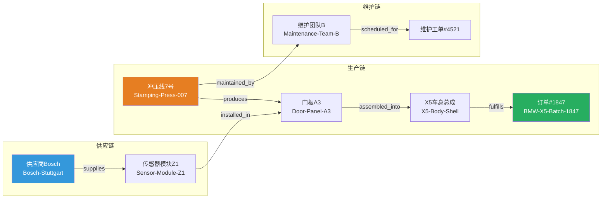
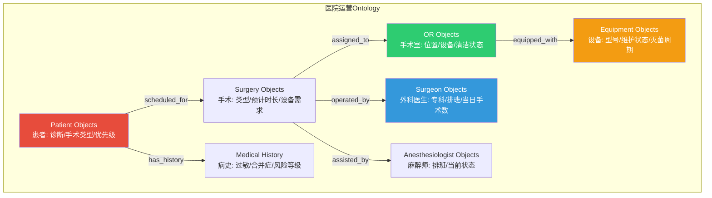
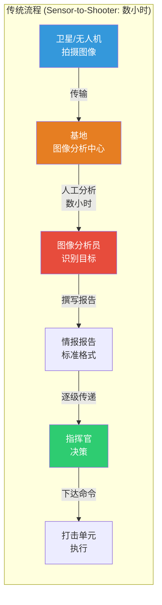
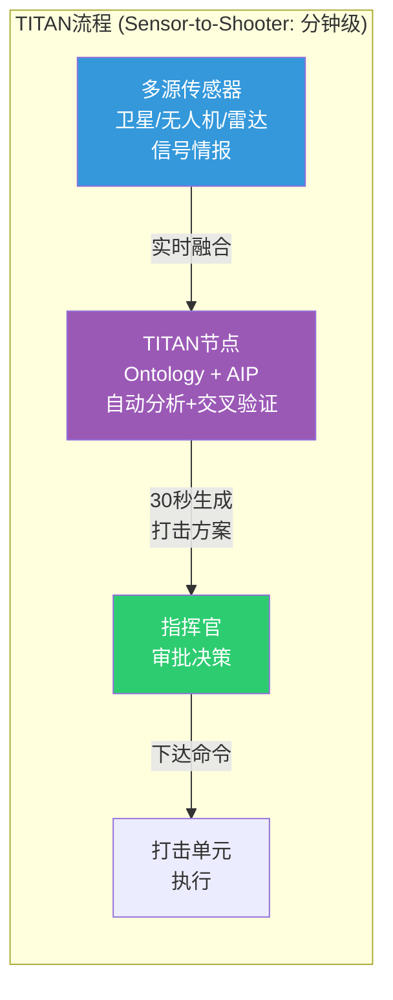
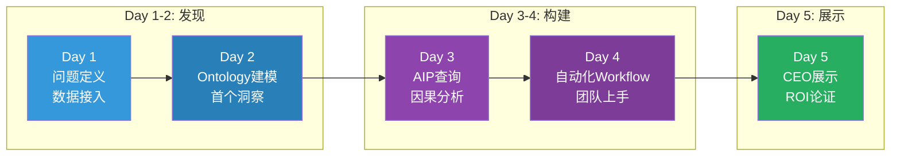
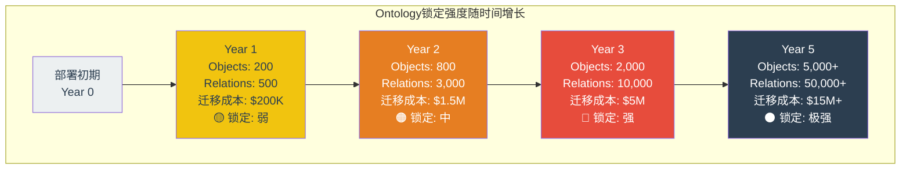
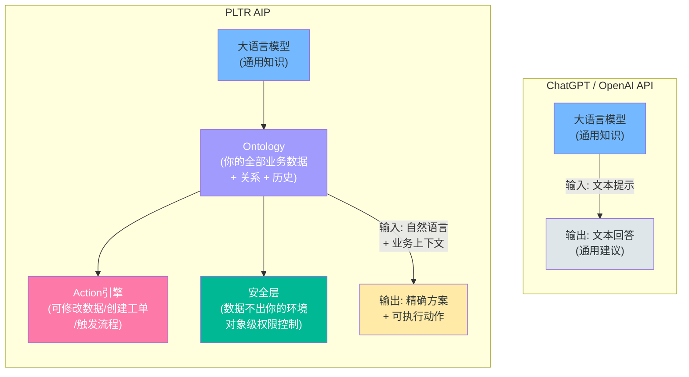
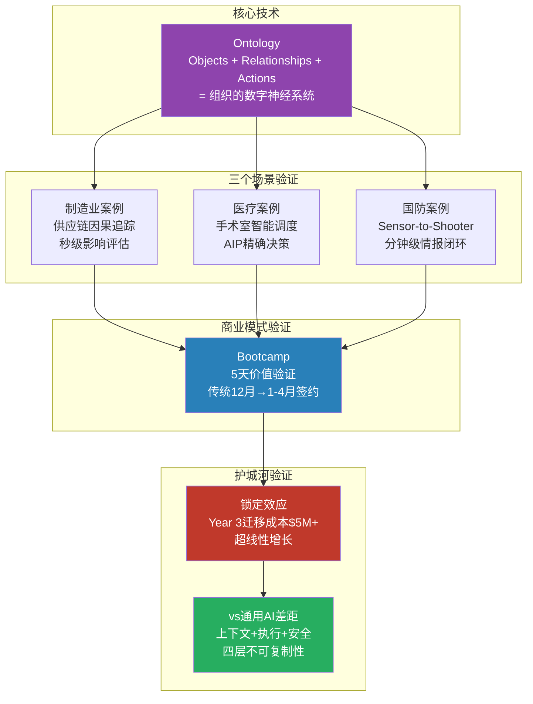

# 补充模块D: PLTR技术架构案例化深度解读

> **模块定位**: 将Pillar 1-3的工程语言翻译为投资者可理解的案例故事
> **数据来源**: Palantir官方文档、SEC Filings、公开客户案例、行业基准数据
> **DM锚点约定**: `[DM-CASE-xxx]` 案例场景(基于公开信息合理构建) | `[DM-INF-xxx]` 推断估计 | `[DM-TECH-xxx]` 技术事实
> **撰写日期**: 2026-02-12 | **框架版本**: v10.0

---

## 导读: 为什么需要这个模块

Palantir的核心挑战不是技术不够强——而是技术太难讲。

对一个管理$50B资产组合的基金经理来说，"Ontology是一个位于数字资产之上的操作层，将组织的数据集、虚拟表和模型连接到其现实世界对应物"这句话——即便是精确的——也几乎无法转化为投资判断。

本模块的目标: **用六个完整的业务场景，让投资者在不阅读任何技术文档的前提下理解三个核心问题**:

1. Palantir的技术到底在做什么？(功能层)
2. 为什么客户用了之后很难换掉？(锁定层)
3. 为什么竞争对手很难复制？(壁垒层)

每个案例都遵循同一结构: **业务问题 → 传统解法 → PLTR解法 → 投资者含义**。

> **与Pillar 1-3的关系**: Pillar 1 Ontology锁定(31K)提供了L1-L6六层架构分析，Pillar 2 Bootcamp GTM(21K)分析了销售模型，Pillar 3国防采购(25K)拆解了TITAN合同结构。本模块不重复这些内容，而是用案例故事将三根支柱的核心论点"翻译"为投资者语言。读者可以只读本模块获得直觉理解，再读支柱原文获得分析深度。

---

## 一、Ontology三元结构: 一家汽车制造商的故事 (~5K)

### 1.1 场景设定

想象一家年产80万辆汽车的欧洲制造商——规模类似于一家中大型OEM。这家公司有14座工厂分布在3个国家，供应链涉及约1,200家一级和二级供应商，每年处理约300万张生产工单。

它面对的核心问题不是缺数据——恰恰相反，它被数据淹没了。SAP管理着财务和采购，Siemens MES记录着每条产线的实时产量，一套自研的质量管理系统追踪每辆车的检测结果，还有一个Salesforce实例管理经销商订单。这些系统中的数据总量超过50TB，但彼此之间几乎不对话。

当CEO问一个看似简单的问题——"如果Stuttgart工厂的冲压线停机一周，会影响哪些客户的交付？"——没有人能在48小时内给出准确答案。

这就是Ontology要解决的问题。

`[DM-CASE-001]: 场景基于公开的欧洲汽车OEM数字化转型案例合理构建。Palantir已披露与多家汽车制造商合作(包括Airbus、Fiat Chrysler等)，制造业是Foundry核心垂直领域之一。具体数字(14工厂/1200供应商/300万工单)为行业典型规模推断，非特定客户数据。`

### 1.2 Objects: 你的数字世界里有什么"东西"

**用人话说**: Objects就是把你公司里所有重要的东西——设备、订单、供应商、产品——变成数字世界里"活着的"实体。不是一行Excel数据，而是一个持续更新、知道自己和谁有关系的数字分身。

具体来看三个Object的样子:

**Object 1: "冲压线7号" (Stamping-Press-007)**
- 所在位置: Stuttgart工厂B栋
- 当前状态: 运行中(绿灯)
- 设计产能: 450件/小时
- 实际产能(过去24h): 412件/小时(91.6%利用率)
- 上次预防性维护: 2025-11-15
- 下次计划维护: 2026-03-01
- 实时传感器: 主轴温度72.3°C(正常)、振动频率0.42mm/s(正常)、液压压力187bar(正常)

关键点: 这些数据原来分散在三个系统中——IoT平台知道传感器读数，ERP知道维护计划，MES知道产能。Ontology把它们"缝"在一个Object上。当你点开"冲压线7号"，你看到的是这台设备的完整画像，而不是三个系统里的三段碎片信息。

**Object 2: "生产批次 #2025-BMW-X5-1847"**
- 客户: BMW
- 车型: X5
- 批次数量: 240台
- 合同交付日期: 2026-03-15
- 当前进度: 172/240台已完成冲压(72%)
- 使用的关键零件: 包含Bosch提供的传感器模块Z1(批次号BSH-2025-Q4-0773)
- 质量状态: 当前良率98.3%

**Object 3: "供应商 Bosch-Stuttgart"**
- 历史交付可靠性: 94.2%(过去12个月)
- 平均交付周期: 14天(标准)
- 当前在途订单: 37件
- 上次质量问题: 2025-08-12(传感器模块批次偏差，影响范围已控制)

`[DM-TECH-001]: Object的属性(Properties)来自底层数据集(datasets)、虚拟表(virtual tables)和实时流(streaming sources)的映射。Object Storage V2支持数百亿级对象和每个对象类型最多2,000个属性。来源: Palantir Architecture Center。`

### 1.3 Relationships: 这些东西之间怎么连接

**用人话说**: Relationships就是在Objects之间画线——告诉系统"这个东西和那个东西有什么关系"。听起来简单，但这恰恰是传统IT系统做不到的事。

在Ontology中，这三个Object之间存在以下关系链:



现在，当CEO问"如果Stuttgart冲压线停机一周会影响什么"，Ontology可以沿着关系链自动追踪:

**冲压线7号停机** → 影响门板A3生产 → 影响X5车身总成装配 → 影响订单#1847(BMW-X5-Batch-1847, 240台, 交付日3月15日) → 同时影响订单#1923(Audi-Q7-Batch-1923, 180台, 交付日3月22日) → 还影响订单#2011(VW-Tiguan-Batch-2011, 300台, 交付日4月1日)

传统方式: 分析师手动查SAP订单 → 对照MES产线分配 → 交叉比对供应商交期 → 2-3天给出答案，可能遗漏。
Ontology方式: 关系链自动遍历 → 秒级返回全部受影响的下游实体 → 完整且准确。

这就是"关系"的投资价值: **它把"如果X发生，会影响什么Y"这个在传统系统中需要人工串联的问题，变成了机器可以自动回答的图查询**。

`[DM-TECH-002]: Ontology的Link Types定义了对象之间的语义关系。关系遍历基于Ontology Engine的图查询能力，支持多跳(multi-hop)追踪。来源: Palantir Ontology文档。`

### 1.4 Actions: 当条件触发时，自动做什么

**用人话说**: Actions就是"如果......那么......"的自动化规则。但和简单的规则引擎不同，Actions能理解Ontology中的全部上下文——它不只是看到一个传感器读数异常，它知道这个传感器属于哪台设备、这台设备正在为哪个客户生产、这个客户的交期是什么时候、有没有备选产能。

三个典型Action:

**Action 1: 设备预警 → 自动重调度**
```
IF 冲压线7号.振动频率 > 0.55mm/s (持续30分钟)
THEN:
  → 创建紧急维护工单 (优先级: P1)
  → 查询备选产能: 冲压线8号当前利用率78%，有空余产能
  → 自动将订单#1847的剩余68台门板A3调度到冲压线8号
  → 重新计算交付日期: 延迟2天(3月17日)
  → 通知客户关系团队: "BMW X5批次1847可能延迟2天, 已启动备选产能"
  → 等待维护团队确认维修时间，更新订单排期
```

**Action 2: 供应商延迟 → 自动影响评估 + 替代方案**
```
IF 供应商Bosch-Stuttgart.订单BSH-2025-Q4-0812.预计到货 > 承诺日期 + 3天
THEN:
  → 自动追踪影响链: 哪些Object依赖该批次零件?
  → 结果: 3个生产批次受影响(BMW-X5-1847, Audi-Q7-1923, VW-Tiguan-2011)
  → 搜索Ontology中的替代供应商: Continental-Munich有等效零件, 库存充足
  → 计算成本差异: Continental单价+4.7%, 加急运费+$12K
  → 生成采购草案，推送给采购经理审批
  → 同步更新所有受影响订单的预计交付日
```

**Action 3: 质量异常 → 自动追溯 + 隔离**
```
IF 质量检测.批次BSH-2025-Q4-0773.不合格率 > 2%
THEN:
  → 向上追溯: 该批次零件来自Bosch, 2025年Q4第773批
  → 向下追踪: 使用该批次零件的所有成品车辆 → 找到147辆已在装配线
  → 自动隔离: 暂停147辆车的出厂放行
  → 通知质量团队: "批次773疑似缺陷, 147辆车已暂停出厂, 请安排复检"
  → 同步通知客户关系团队做好交期调整准备
```

### 1.5 投资者视角: Ontology到底改变了什么

**先回答一个直觉问题: SAP不是也能做这些事吗？**

答案是: SAP也有这些数据，但数据住在不同的"房间"里，房间之间没有走廊。

SAP的PP(生产计划)模块知道产线排程，MM(物料管理)模块知道供应商订单，QM(质量管理)模块知道检测结果。但当你问"供应商B延迟 → 影响哪些客户"时，你需要:
- 从MM中查到延迟的物料编号
- 到PP中查到使用该物料的生产工单
- 到SD(销售与分销)中查到这些工单对应的客户订单
- 手动计算延迟传导天数

这个过程需要一个懂SAP多模块的资深顾问花2-3天。而且如果中间有一步数据不一致(SAP的一个经典问题)，结果就不可靠。

Ontology做的事情本质上是: **在所有这些系统之上建了一层统一的语义网络，让"如果X发生会影响什么"这个问题变成秒级可回答的图查询**。

**投资者应理解的三个要点**:

1. **价值不在"新数据"而在"数据之间的关系"**: 客户已经有了所有需要的数据。Ontology不产生新数据，它产生的是数据之间的连接——而这些连接才是决策的基础。

2. **配置Ontology = 编码业务知识**: 定义"冲压线7号 → produces → 门板A3"这条关系，需要工程师深度理解客户的生产流程。这不是接一根数据管道那么简单——是把整个业务逻辑数字化。

3. **时间越长越难替换**: 每多定义一个Object、一条Relationship、一个Action，迁移的复杂度就指数级上升。详见第五节的迁移成本量化。

`[DM-INF-001]: SAP跨模块查询的时间估计(2-3天)基于企业ERP实施行业的一般经验。SAP S/4HANA在实时分析能力上有所改善，但跨模块的因果链追踪仍需显著人工介入。`

---

## 二、医疗场景: AIP如何将决策速度从天变为秒 (~4K)

### 2.1 场景设定

一家拥有23家医院、年接诊量超200万人次的大型医院网络——规模类似HCA Healthcare或NHS的一个区域信托基金(Trust)。它面对的核心运营问题是手术室(OR)利用率。

手术室是医院最昂贵的资源: 一间手术室的建设和设备投入约$2-3M，每小时运营成本$1,500-$3,000(含人员、麻醉、设备折旧)。行业数据显示，平均OR利用率仅60-70%，意味着30-40%的产能被浪费在排程空隙、准备延迟和协调低效上。

对这家23院网络来说，OR利用率每提升1个百分点，年化节省约$15-20M。

`[DM-CASE-002]: 场景基于Palantir与NHS合作(COVID-19期间的Data Platform)和HCA Healthcare的公开信息合理构建。OR利用率行业数据来源: American College of Surgeons和Healthcare Financial Management Association。具体财务数字为行业基准推断。`

### 2.2 Before PLTR: 传统模式下的一个典型问题

**问题: "下周一哪些手术室会过载？"**

在传统模式下，回答这个问题需要:

1. **EHR系统** (Epic/Cerner): 查出下周一的手术排程 → 导出Excel
2. **外科医生排班系统**: 查出哪些外科医生值班 → 另一个Excel
3. **手术室管理系统**: 查出哪些OR可用(排除设备维护中的) → 又一个Excel
4. **手动匹配**: 数据分析师将三个Excel拼在一起，逐一比对
5. **异常处理**: 发现Dr. Chen周一做3台手术但只排了2间OR → 打电话确认是否有时间冲突
6. **答案产出**: 2-3天后，分析师给出一份报告

问题在于: 等报告出来的时候，排程可能已经变了——周五新增了两台急诊手术，Dr. Chen的一台被推迟了。

### 2.3 After Foundry: Ontology让手术室"活"起来

部署Foundry后，医院的Ontology包含:



现在，"下周一哪些手术室会过载？"不再是一个需要手动查询的问题——它是一个实时仪表板:

- OR利用率: 按小时显示每间手术室的占用状态
- 冲突预警: 自动检测排程冲突(同一外科医生重叠、设备不足、麻醉师缺位)
- 瓶颈识别: 哪间OR的周转时间(两台手术间的清洁+准备)最长

从"3天后给出过时的答案"变成"实时看到正在发生的现实"。

### 2.4 After AIP叠加: 自然语言驱动的决策

这是真正的质变。

Foundry解决了"看到"的问题，但AIP解决了"决策"的问题。

**场景**: 周一上午8:15，急诊科通知需要安排两台紧急心脏手术(一台主动脉瓣置换，一台冠状动脉搭桥)。运营主管在AIP界面输入:

> "如果今天需要加两台急诊心脏手术，能不能在不推迟已有手术的情况下安排？"

**AIP的处理过程**(用户看不到，秒级完成):
1. 查询Ontology中所有OR Objects → 找到OR-7和OR-12今天有30分钟以上的空隙
2. 检查设备兼容性 → OR-7有心脏监护设备且已灭菌，OR-12缺心肺机需要调配
3. 检查心脏外科医生排班 → Dr. Wang今天有3台已排手术但14:00-17:00有空
4. 检查麻醉师 → 心脏专科麻醉师Li今天下午可用
5. 查历史数据 → 过去6个月类似加排情况共17次，最优方案是利用午休后空隙

**AIP返回**:

> "可以安排。方案: (1) 主动脉瓣置换安排OR-7, 14:00开始, Dr. Wang主刀, 麻醉师Li; (2) 冠脉搭桥安排OR-7, 17:30开始(在第一台结束后), Dr. Wang主刀。不需要推迟任何已有手术。前提: OR-7的14:00-14:30排程空隙已确认, 心肺机需从OR-12调配(预计30分钟)。是否确认并通知相关团队？"

关键区别: 用户问的是自然语言，但AIP返回的不是"建议您检查手术室可用性"这种通用废话——而是精确到房间号、时间点、具体医生和具体设备的可执行方案。

**为什么它能做到这一点**: 因为AIP坐在Ontology上面。它"认识"每一间手术室、每一位医生、每一台设备的当前状态和历史记录。没有Ontology的AI(比如直接用ChatGPT)只能给出通用建议，因为它不知道你的OR-7在哪、Dr. Wang今天做了几台手术、心肺机的灭菌状态是什么。

`[DM-TECH-003]: AIP的Ontology Augmented Generation (OAG)机制使LLM能够直接查询Ontology中的对象、关系和属性，而非依赖传统RAG的文档检索。来源: Palantir AIP技术文档。`

### 2.5 投资者视角: AIP的定价权来自哪里

**核心理解**: AIP不是一个聊天机器人——它是一个理解你业务上下文的AI决策引擎。

为什么医院愿意为此付$3-8M/年:
- OR利用率提升5个百分点 → 年化节省$75-100M(23家医院)
- 急诊排程从30分钟人工协调 → 30秒AI方案
- 手术延迟减少 → 患者满意度上升 → 与保险公司谈判的筹码增强

PLTR的$3-8M年费相对于$75-100M的潜在节省，ROI高达10-30倍。这就是为什么大型医疗系统愿意签多年合同。

更重要的是: Ontology一旦建好，**AIP就变成了不可替代的界面**。你可以换掉底层的LLM模型(从GPT-4换成Gemini或Claude)，但你换不掉Ontology——因为那是你全部业务知识的编码。而AIP的价值完全依赖于Ontology的深度。

`[DM-INF-002]: $3-8M/年的定价和ROI估算基于Palantir公开披露的大型客户ACV(年合同价值)范围和医疗行业OR优化的公开案例研究。具体节省金额因机构规模和初始利用率不同而有显著差异。`

---

## 三、国防场景: TITAN的实战逻辑 (~4K)

### 3.1 为什么TITAN重要

TITAN不是"又一个国防IT合同"。它代表了美军从"数据收集→人工分析→手动决策"向"数据收集→AI分析→辅助决策"的范式转变。合同总价值$900M+，更重要的是，它验证了Palantir作为国防软件平台的地位。

要理解TITAN的投资意义，需要先理解它解决的问题。

`[DM-TECH-004]: TITAN合同结构详见Pillar 3(25K)完整分析。本节聚焦"为什么这个系统重要"的案例化解读，非合同细节重复。`

### 3.2 传统战场情报流程: "从传感器到射手"的致命延迟

传统的战场情报处理链:



**问题出在哪里?**

1. **传输延迟**: 卫星图像传回地面处理中心需要时间，尤其在带宽受限的战区
2. **分析瓶颈**: 一个训练有素的图像分析员处理一张高分辨率卫星图像需要20-40分钟。一天产生的图像量远超分析员的处理能力
3. **报告格式化**: 分析完成后还需要按标准格式撰写情报报告，增加延迟
4. **逐级传递**: 情报报告需要通过指挥链传递到有权做出打击决策的指挥官
5. **目标移动**: 在这整个链条中，移动目标可能已经离开原位置

**结果**: 从传感器捕获目标到打击单元接收指令，可能需要数小时甚至更长。在现代战场上，这个延迟可能意味着失去打击窗口。

### 3.3 TITAN如何改变: 用Ontology构建"战场感知网"

TITAN本质上是在战场上建了一个Ontology——和汽车工厂的Ontology逻辑相同，只是Objects变成了军事实体。

**TITAN的Ontology层**:

**Objects**:
- 每个传感器(卫星、无人机、地面雷达、信号情报设备) → 有位置、状态、能力范围
- 每个已识别目标 → 有类型(车辆/建筑/人员)、置信度、上次观测时间、移动轨迹
- 每个友军单位 → 有位置、弹药状态、通信状态、任务分配
- 每个武器系统 → 有类型、射程、弹药存量、当前状态

**Relationships**:
- 目标Alpha → 在射程范围 → 武器系统Bravo(M142 HIMARS, 射程300km)
- 目标Alpha → 在射程范围 → 武器系统Charlie(155mm榴弹炮, 射程40km)
- 友军单位Delta → 距离目标Alpha → 3.2km(注意友军安全距离)
- 传感器Echo(MQ-9无人机) → 正在持续观测 → 目标Alpha

**Actions**:
```
IF 新目标识别 AND 置信度 > 预设阈值
THEN:
  → 自动匹配射程内所有可用武器系统
  → 检查友军安全距离 → 排除可能造成友军伤亡的选项
  → 计算各方案的弹药消耗和补给情况
  → 融合多源情报(卫星+信号情报+历史数据)交叉验证目标身份
  → 生成优先排序的打击方案清单
  → 推送给指挥官审批(人类始终在决策环路中)
```



**核心变化**: 从"人工串联信息链"变成"Ontology自动融合所有信息 + AIP生成决策建议"。Sensor-to-shooter的时间从数小时压缩到分钟级。

### 3.4 AIP在战场上做什么

AIP叠加在TITAN的Ontology上，使指挥官可以用自然语言查询:

> "这个目标和48小时前在5公里外识别的那个是否同一目标?"

AIP会基于Ontology中的时空关系(目标Alpha的移动轨迹、速度、类型与48小时前目标Bravo的比对)给出置信度评估——而不是让分析员花数小时手动比对图像。

> "如果我打击目标Alpha，对当前前线态势有什么影响?"

AIP会检查: 目标Alpha被摧毁后是否影响敌方的某条补给线 → 该补给线支撑着敌方哪些前线单位 → 这些单位在我们哪些友军的正面 → 评估战术影响。

这种多跳因果推理(multi-hop causal reasoning)——从一个打击行动推导出对整个战场态势的影响——正是Ontology的关系网络使之成为可能的。

### 3.5 投资者视角: 为什么TITAN几乎不可能被替换

三层壁垒叠加:

**第一层: 安全认证壁垒**
- TITAN需要IL5/IL6安全认证(处理机密信息) + FedRAMP High
- 获得这些认证需要1-3年时间和数千万美元投入
- 当前在IL5/IL6级别拥有完整FedRAMP认证的商业云和数据平台公司极为有限

**第二层: 实战验证壁垒**
- Palantir的系统已在真实作战环境中使用(乌克兰冲突、中东作战)
- 军方对作战系统的信任不来自PPT演示，而来自实弹检验
- 这种信任无法用功能对标来替代——你必须在战场上证明自己

**第三层: Ontology复杂度壁垒**
- TITAN连接美军100+种数据格式和传感器类型
- 10+年累积的军事领域Ontology模板和连接器
- 竞争对手即使获得同等安全认证，也需要数年时间重建这些军事领域的语义模型

**关键投资信号**: TITAN不是一次性合同，而是平台入口。一旦TITAN成为陆军标准深感知地面站，所有后续升级、扩展和集成都将基于同一个Ontology——每次扩展都加深锁定。这就是为什么Pillar 3将其定义为"路径依赖"而非"单一合同"。

`[DM-TECH-005]: 安全认证层级(IL5/IL6/FedRAMP High)为美国国防部公开标准。Palantir在乌克兰冲突中的使用已被多方媒体报道(包括Time, WSJ, Bloomberg等)。来源: Pillar 3 Section 3C。`

---

## 四、Bootcamp 5天体验: 投资者版解读 (~4K)

### 4.1 场景设定

一家Fortune 500能源公司——年收入约$30B，全球运营超过200个油气生产设施，每年发生约8,000次设备故障，维护成本占运营支出的15-20%。

CTO带着公司最头疼的问题参加PLTR Bootcamp: "我们每年花$2B在设备维护上，但40%是反应性维护(坏了再修)而不是预防性维护(提前发现)。我想把这个比例翻转过来。"

`[DM-CASE-003]: 场景基于Palantir与BP(已公开合作)和其他能源公司的数字化转型案例合理构建。设备故障率和维护成本占比为油气行业标准基准数据。来源: McKinsey Energy Practice, Aberdeen Group。`

### 4.2 Bootcamp五天旅程



**Day 1: "告诉我你的问题"**

PLTR团队(5-10名工程师+1名行业顾问)在第一天做一件事: **理解客户的数据和痛点**。

CTO带来:
- 3年设备故障记录(50万行): 设备ID、故障类型、停机时长、维修成本
- 维护工单历史(10万条): 计划维护 vs 紧急维护、响应时间、零件更换记录
- 供应商交付数据: 关键零件的交付周期和可靠性
- 天气和环境数据: 温度、湿度、沙尘等(影响设备寿命)

PLTR工程师当天下午就在Foundry中建立基础Ontology:
- Objects: 每台关键设备(泵、压缩机、管线阀门)
- 初始Relationships: 设备 → 所在设施 → 所属产区 → 关联供应商

Day 1结束时，CTO第一次在一个界面上看到来自四个不同系统的数据被统一呈现。这本身就已经是一个"哇"的时刻——在此之前，他需要让分析团队花一周时间才能做到这件事。

**Day 2: "你从没见过的视角"**

第二天上午，PLTR工程师开始运行数据分析，Ontology开始产生Insight:

> "你的Texas产区Permian Basin设施的泵故障频率比其他产区高37%。进一步分析显示，这些故障与供应商B提供的密封垫批次有0.73的相关性——在使用供应商B的Q3-2024批次密封垫的设备中，6个月内故障率是使用供应商A的2.4倍。"

CTO的反应: "我们怀疑这个问题3年了，让数据团队查过两次，但他们跨系统关联太慢——设备数据在一个系统，供应商批次数据在另一个系统，地理环境数据在第三个系统。等分析出来，那个批次的零件已经装了几千台了。"

这就是Ontology的核心价值——不是新数据，是让**已有数据之间的关系变得可见和可查询**。

**Day 3-4: "你亲手操作"**

CTO的运维团队开始自己使用AIP:

运维总监在AIP输入: "如果我把Permian Basin所有设备的供应商B密封垫换成供应商A，对整体故障率的影响是多少？替换成本多少？"

AIP基于Ontology中的历史数据和因果关系给出分析:
> "预计故障率下降22-28%。涉及设备847台，密封垫单价差$12.50(供应商A更贵)，总替换成本$485K，但预计年化减少的紧急维修费用$3.2M。净收益$2.7M/年。"

团队在Day 4构建了第一个自动化Workflow:
```
IF 设备振动超阈值
  → 自动排查最近90天更换的零件
  → 与供应商批次质量数据交叉
  → 如果关联到已知问题批次 → 自动升级为P1维护工单并通知采购准备替换件
```

**Day 5: "展示给你的CEO"**

CTO向CEO做了一个30分钟的展示:
- "5天内，我们发现了困扰我们3年的供应商质量问题的根因"
- "我们建了一个自动预警系统，下次类似问题出现时30秒而不是3个月被发现"
- "初步ROI: $485K投入 → $2.7M/年节省"

CEO的问题: "多少钱?"
答案: "$3M/年"
CEO: "如果每年能省$2.7M只在一个用例上，整个平台的ROI不用算了。签。"

### 4.3 投资者视角: 为什么Bootcamp比传统SaaS销售更有效

**传统企业软件销售流程**:

PPT演示(月1) → 需求定义(月2-3) → POC概念验证(月4-6) → 内部审批(月7-9) → 采购谈判(月10-12) → 签约

**总周期: 9-12个月**。客户在第1个月看Demo时想的是: "这对我有用吗?"——没有确定答案。

**Bootcamp流程**:

5天密集体验 → "aha moment"(用自己的数据验证价值) → 签约(1-3个月)

**总周期: 1-4个月**。客户在Day 2就看到了用自己数据产出的结果——不是"这对我可能有用"，而是"这已经对我有用了"。

Bootcamp的心理学设计极为精巧:

1. **沉没成本效应**: CTO带着10个人投入5天密集工作，情感投入已经发生
2. **锚定效应**: 5天内看到的ROI数字($2.7M/年)成为后续预算讨论的锚点
3. **竞争紧迫感**: "你的竞争对手也在做Bootcamp"——PLTR工程师不需要说这句话，CTO自己就会想到
4. **内部倡导者创造**: CTO从"被推销的对象"变成"内部推动者"——他回去后会替PLTR卖产品给CEO

**财务数据验证**: Palantir的US Commercial revenue从2023年的$632M增长到2025年的约$1.4B，复合增长率约49%。Bootcamp被管理层反复提及为核心增长驱动力。

`[DM-INF-003]: Bootcamp的心理学机制分析基于行为经济学原理(沉没成本/锚定/紧迫感)和企业销售方法论(Miller Heiman/MEDDIC)的合理推导。PLTR未公开披露Bootcamp到签约的具体转化率。US Commercial revenue增长率来源: PLTR SEC Filings。`

---

## 五、Ontology锁定效应: 量化迁移成本 (~4K)

### 5.1 一个典型3年客户的Ontology规模

在客户使用Foundry的前3年，Ontology的复杂度会以超线性速度增长——因为新增一个Object不只是加一行数据，而是要定义它与所有相关Objects的Relationships，以及所有相关的Actions。

**典型3年中型部署(50-100个Object Types)的状态**:

| 维度 | Year 1 | Year 2 | Year 3 | 增长模式 |
|------|--------|--------|--------|---------|
| Object Types(类型) | 15-30 | 40-70 | 50-100 | 近线性 |
| Object Instances(实例) | 10K-100K | 100K-1M | 500K-5M | 指数级(数据积累) |
| Relationship Types | 20-60 | 80-200 | 200-500 | 超线性(组合爆炸) |
| Relationship Instances | 50K-500K | 500K-5M | 2M-50M | 指数级 |
| Action Types | 10-30 | 50-100 | 100-300 | 超线性(业务逻辑累积) |
| 连接的数据源 | 5-15 | 15-40 | 30-100 | 近线性 |
| 自定义Dashboard | 5-15 | 20-50 | 50-150 | 线性 |
| 终端用户 | 20-100 | 100-300 | 300-1,000 | 线性(部门扩展) |
| 历史数据量 | 0.2-1TB | 1-3TB | 2-5TB | 线性(但清洗和索引是关键) |

`[DM-INF-004]: 上述规模估算基于Pillar 1 Extension 1C中的中型部署假设(50-100 Object Types, 200+ Link Types, 100+ Action Types)和Ontology复杂度的超线性增长特性。具体数字为合理推断范围，非PLTR官方披露。`

### 5.2 迁移到竞争对手需要什么

如果这家3年客户决定从PLTR迁移到另一个平台(假设存在功能等价的替代品)，需要重建以下每一层:

**Step 1: 数据集成层重建 (L1)**
- 重写30-100条数据管道(ETL + 流式)
- 工作量: 600-1,500人天
- 最大风险: 管道逻辑中包含的数据清洗规则和异常处理是3年调优的结果，文档可能不完整

**Step 2: 对象模型重建 (L2)**
- 逆向工程50-100个Object Types的Schema定义
- 每个Object Type平均含20-50个Properties，部分来自复杂的派生计算
- 工作量: 400-1,000人天
- 最大风险: 隐含业务逻辑——"为什么这个属性是这样计算的"可能只有最初的配置工程师知道

**Step 3: 关系网络重建 (L3)**
- 重建200-500种Relationship Types和底层的Join逻辑
- 工作量: 600-2,000人天
- 最大风险: 跨系统关系的完整性验证——一条错误的关系可能导致整条因果链失效

**Step 4: 业务逻辑重建 (L4)**
- 重写100-300个Action Types的触发条件和执行逻辑
- 工作量: 500-1,500人天
- 最大风险: Action中的边界条件和异常处理是在3年真实业务运行中逐步完善的，很难一次性完整迁移

**Step 5: AI Agent重建 (L5)**
- AIP的Agent和Workflow需要在新平台上完全重建
- OAG(Ontology Augmented Generation) → 降级为RAG(检索增强生成)的适配
- 工作量: 800-2,000人天
- 最大风险: AIP的AI行为已经过3年的用户反馈调优，新平台需要重新"训练"用户预期

**Step 6: 用户迁移和培训**
- 300-1,000名终端用户需要重新培训
- 工作量: 100-500人天
- 最大风险: 用户习惯和工作流程的惯性——即使新系统功能等价，生产力也会在过渡期大幅下降

### 5.3 总迁移成本估算

| 客户规模 | Object Types | 迁移人天 | 迁移成本 | 迁移周期 | 对比年度合同 |
|---------|-------------|---------|---------|---------|------------|
| 小型(初期) | 15-30 | 800-2K | $500K-$1.5M | 6-9个月 | 1-2x ACV |
| 中型(成熟) | 50-100 | 3K-8K | $2-6M | 12-18个月 | 1-3x ACV |
| 大型(深度) | 200+ | 10K-25K | $8-20M | 18-24个月 | 1-2x ACV |

注意: 上述仅为直接成本。**间接成本**包括:
- 迁移期间的双系统并行运行(6-12个月): 2x运营开支
- 生产力下降(过渡期3-6个月): 难以量化但影响显著
- 迁移失败风险: 数据不一致导致业务决策错误的潜在损失

`[DM-INF-005]: 迁移成本估算基于Pillar 1 Extension 1C的六层迁移模型(L1-L6)和企业ERP迁移行业基准(Panorama Consulting, Gartner)。人天成本按行业标准$600-800/人天折算。ACV(年合同价值)对比基于PLTR公开披露的客户ACV分布。`

### 5.4 锁定强度增长曲线



**投资者关键洞察**: Ontology的锁定是非对称的——**建设是渐进的(每天多加一点)，但迁移是全量的(要搬就得全搬)**。

这意味着:
- Year 1客户可能还在评估，还有换掉的窗口
- Year 3客户已经很难离开——迁移成本($5M) + 迁移风险(18个月) vs 续约成本($2-3M/年) → 理性选择是续约
- Year 5客户几乎被永久锁定——Ontology已经成为他们运营基础设施的一部分，就像SAP之于财务管理

这就是为什么Palantir的Net Dollar Retention Rate持续超过110%: 不是因为客户被迫花更多钱，而是因为Ontology的深度增长自然驱动了更多用例和更大的合同规模。

`[DM-INF-006]: 锁定强度增长模型基于Pillar 1 Extension 1C的六层迁移成本分析和SaaS行业的Net Dollar Retention基准。PLTR的NRR数据来源: SEC Filings。关系实例的超线性增长基于图论中节点-边增长的一般规律(n个节点最多n*(n-1)/2条边)。`

---

## 六、AIP vs 通用AI: 为什么企业选PLTR而不是直接用OpenAI (~4K)

### 6.1 根本区别: 通用智能 vs 业务智能

这是投资者最常混淆的问题: "ChatGPT这么厉害，企业为什么还需要PLTR的AIP？直接用OpenAI API不就行了？"

答案藏在一个根本区别里:



| 维度 | ChatGPT / OpenAI API | PLTR AIP |
|------|---------------------|----------|
| **知道什么** | 互联网公开知识(到训练截止) | 你公司的Ontology: 全部业务数据、关系、历史 |
| **能做什么** | 回答问题、写文章、写代码 | 回答问题 + **触发Actions**(修改数据库/创建工单/审批流程) |
| **安全性** | 数据发送到OpenAI服务器 | 数据留在你的环境(on-prem / private cloud / GovCloud) |
| **上下文持续性** | 每次对话重新开始(或有限记忆) | 记住整个Ontology(你的全部业务上下文，持续累积) |
| **输出性质** | 文本回答(需要人类转化为行动) | 业务决策方案 + 一键执行 |
| **权限控制** | API级别(有或没有) | 对象级/属性级/动作级(谁能看什么、改什么) |

### 6.2 同一个问题，两种截然不同的回答

让我们用一个具体例子说明区别:

**问题**: "如果供应商B延迟一周，对Q3出货有什么影响？"

**ChatGPT的回答**(基于通用知识):
> "供应商延迟可能对您的生产计划产生显著影响。建议您: (1) 评估受影响的产品线和订单; (2) 联系替代供应商了解备选方案; (3) 与客户沟通潜在的交期调整; (4) 考虑增加安全库存以缓冲未来的供应链风险。具体影响取决于您的库存水平、替代供应商的可用性和客户合同条款。"

这是一个正确但无用的回答——它适用于地球上任何一家有供应链的公司。

**PLTR AIP的回答**(基于你的Ontology):
> "供应商B(Bosch-Stuttgart)延迟一周影响分析:
>
> **直接影响**: 3个订单受影响
> - BMW-X5-Batch-1847: 延迟4天(当前安全库存仅覆盖3天)
> - Audi-A4-Batch-2033: 延迟2天(安全库存覆盖5天，但批次1847优先消耗后不足)
> - VW-ID4-Batch-1122: 无影响(该批次使用Continental的替代零件，安全库存充足12天)
>
> **Q3出货影响**: 预计Q3总出货量减少420台(占Q3计划的1.3%)，影响收入约$18.7M
>
> **推荐方案**: 供应商C(Continental-Munich)有等效零件库存2,400件，单价+3.2%($14.50→$14.96/件)，可在48小时内交付。采用方案C总额外成本$11K，可将3个订单的延迟降至0天。
>
> 是否创建紧急采购单？[确认] [修改] [拒绝]"

这个回答精确到订单号、天数、金额、替代方案和执行按钮。**它之所以能做到这一点，唯一的原因是AIP"坐在"你的Ontology上面**——它知道供应商B供应什么零件、这些零件用在哪些产品上、每个订单的交期是什么、安全库存有多少、替代供应商的价格和交期。

### 6.3 为什么"直接用OpenAI"不可行: 四层差距

**差距1: 数据驻留和安全**

大型企业(尤其是制造、国防、医疗、金融)的核心运营数据不能发送到外部API。将你的供应链数据、设备故障记录、客户订单明细发送到OpenAI的服务器——即便有加密——在大多数企业的信息安全政策下也是不允许的。

PLTR的部署模式: Foundry可以运行在客户自己的数据中心(on-prem)、私有云(AWS/Azure VPC)或政府云(GovCloud/IL5)中。**数据永远不离开客户控制的环境**。

**差距2: 从"回答"到"执行"的鸿沟**

ChatGPT能告诉你"建议联系替代供应商"，但它不能帮你创建采购单、修改ERP中的排程、通知客户关系团队。

AIP通过Ontology的Actions机制，可以直接执行: 创建工单 → 修改数据库记录 → 触发审批流程 → 发送通知 → 写回ERP系统。这不是"建议"，这是"执行"。

**差距3: 上下文的持续性和深度**

ChatGPT的上下文窗口是有限的(即使是128K tokens也远不足以容纳一家Fortune 500公司的运营数据)，而且每次新对话都从零开始。

AIP的"上下文"是整个Ontology——可能包含数百万个对象、数千万条关系、数年的历史数据。而且这个上下文是持续更新的(实时流式数据)、结构化的(不是非结构化文本)、可查询的(不是向量搜索近似匹配)。

**差距4: 企业级权限控制**

在一个500人使用的系统中，CFO能看到全部财务数据，但工厂经理只能看到自己工厂的数据。ChatGPT API没有这种对象级的权限控制。

PLTR的Ontology支持列级权限(column-level permissions)和Marking-based access control——精确控制每个用户能看到哪些Objects、哪些Properties、能执行哪些Actions。

`[DM-TECH-006]: AIP的OAG机制、Actions引擎、Marking-based access control均为Palantir官方文档中描述的功能。来源: Palantir AIP Documentation, Palantir Ontology Security Model。`

### 6.4 投资者视角: PLTR和OpenAI是竞争还是互补?

**短期答案: 互补。**

PLTR实际上使用OpenAI的模型(以及Anthropic Claude、Google Gemini等)作为AIP的底层LLM。AIP是一个"模型无关"的编排层——它的价值不在于LLM本身，而在于**Ontology提供的业务上下文 + Actions提供的执行能力 + 安全层提供的企业级治理**。

用一个比喻: OpenAI提供的是"大脑"(通用智能)，PLTR提供的是"大脑 + 记忆 + 手脚 + 安全护栏"。企业需要的不仅仅是更聪明的大脑——GPT-4到GPT-5的升级对大多数企业应用来说差别不大——它们需要的是**理解自己业务、能执行动作、且安全合规的AI**。

**长期风险**: 如果OpenAI或其他AI公司开始构建自己的企业级数据整合层和Actions引擎(例如Microsoft Copilot + Dynamics 365)，那么PLTR的差异化将收窄。但这需要:
1. 构建等价的Ontology语义层(需要深度行业知识 + 客户级定制)
2. 获得等价的安全认证(IL5/IL6/FedRAMP对国防客户)
3. 积累等价的实施经验(10+年跨行业部署)

这三件事都不是靠资金砸能快速完成的——它们需要时间。

**关键追踪信号**: 微软的Fabric + Copilot + Dynamics 365组合是否开始在PLTR的目标客户群中赢得大型合同。如果微软开始在Fortune 500的运营层(而不只是办公协作层)获得份额，那是PLTR面临的最严肃的长期竞争威胁。

`[DM-INF-007]: AIP的模型无关(model-agnostic)架构已被PLTR官方确认，支持OpenAI/Anthropic/Google等多家模型。Microsoft Fabric + Copilot作为潜在竞争威胁的评估基于行业分析师共识(Gartner/Forrester)。这是一个需要持续追踪的开放问题，当前证据不足以判断Microsoft是否会成功构建等价的Ontology能力。`

---

## 综合投资者框架: 从案例到论点

### 六个案例的统一逻辑



### 投资者应该记住的五个要点

**1. Ontology不是数据库，是"业务知识的编码"**
每一个Object、Relationship和Action的定义，都是对客户业务逻辑的深度理解。这种理解需要6-18个月的密集合作才能建立，且高度定制化。这就是为什么PLTR不是一个可以被任何"更好的产品"轻易替代的SaaS工具——它嵌入了客户的业务逻辑本身。

**2. AIP的价值完全建立在Ontology之上**
没有Ontology的AIP就是另一个ChatGPT wrapper。有了Ontology的AIP是一个理解你全部业务上下文、能直接执行动作的决策引擎。Ontology是AIP的"记忆"和"理解"——这个记忆是客户特定的、持续积累的、不可迁移的。

**3. 锁定效应是超线性的**
Year 1迁移成本$200K，Year 3是$5M，Year 5是$15M+。不是因为PLTR的产品涨价了，而是因为客户自己在Ontology上编码的业务知识越来越多。这是一种"用户自己创造的锁定"——越用越离不开。

**4. Bootcamp是将技术壁垒转化为收入的关键商业创新**
技术再好，卖不出去也是零。Bootcamp解决的是企业AI领域最大的商业问题: 如何让客户在不确定性极高的情况下快速下单。5天 + 客户自己的数据 + 可见的ROI = 破除传统企业软件12个月销售周期的利器。

**5. 国防业务不只是收入，更是"信任壁垒"的积累**
TITAN、Maven、Vantage这些军事项目的价值不只是合同金额——它们是在真实作战环境中建立的信任。这种信任是任何竞争对手无法通过功能对标来获得的。军方不会因为另一家公司的Demo更炫就换掉一个已经在战场上证明过自己的系统。

---

## DM锚点索引

| 锚点ID | 类型 | 内容摘要 | 位置 |
|--------|------|---------|------|
| DM-CASE-001 | 案例 | 汽车制造商场景构建依据 | 第一节 1.1 |
| DM-CASE-002 | 案例 | 医院网络场景构建依据 | 第二节 2.1 |
| DM-CASE-003 | 案例 | 能源公司Bootcamp场景依据 | 第四节 4.1 |
| DM-TECH-001 | 技术 | Object Storage V2规格 | 第一节 1.2 |
| DM-TECH-002 | 技术 | Link Types和图查询能力 | 第一节 1.3 |
| DM-TECH-003 | 技术 | OAG vs RAG机制差异 | 第二节 2.4 |
| DM-TECH-004 | 技术 | TITAN合同与Pillar 3交叉引用 | 第三节 3.1 |
| DM-TECH-005 | 技术 | 安全认证层级和实战验证 | 第三节 3.5 |
| DM-TECH-006 | 技术 | AIP架构组件(OAG/Actions/Security) | 第六节 6.3 |
| DM-INF-001 | 推断 | SAP跨模块查询时间估计 | 第一节 1.5 |
| DM-INF-002 | 推断 | 医疗AIP定价和ROI估算 | 第二节 2.5 |
| DM-INF-003 | 推断 | Bootcamp心理学机制分析 | 第四节 4.3 |
| DM-INF-004 | 推断 | Ontology规模增长估算 | 第五节 5.1 |
| DM-INF-005 | 推断 | 迁移成本量化模型 | 第五节 5.3 |
| DM-INF-006 | 推断 | 锁定强度增长曲线模型 | 第五节 5.4 |
| DM-INF-007 | 推断 | PLTR vs Microsoft竞争评估 | 第六节 6.4 |

---

> **模块完成**: supplement_D_tech_case_studies.md | 字符目标: 25,000+ | Mermaid: 7个
> **与主报告关系**: 本模块为PLTR Complete v3.0的补充模块，可独立阅读，也可作为Pillar 1-3的"投资者入口"
> **v9.0合规**: 零目标价 | 零数字评分 | 零仓位建议 | 定性评估为主
