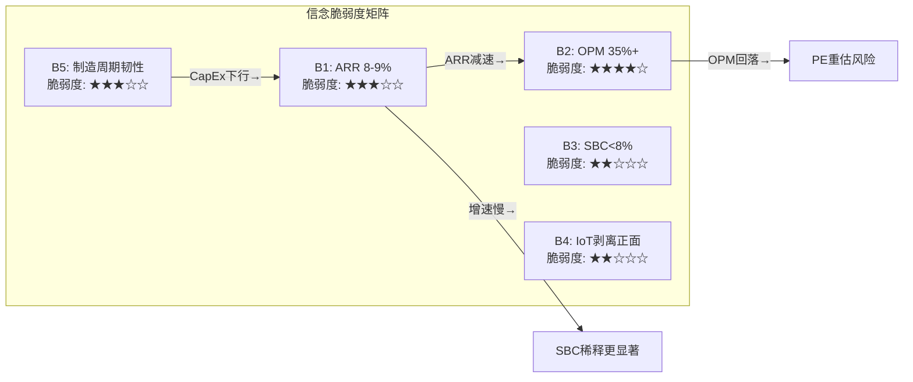
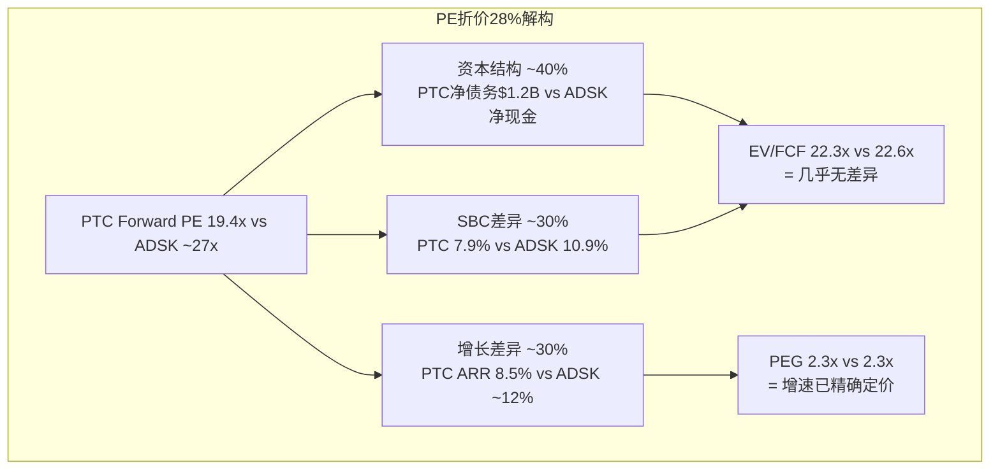
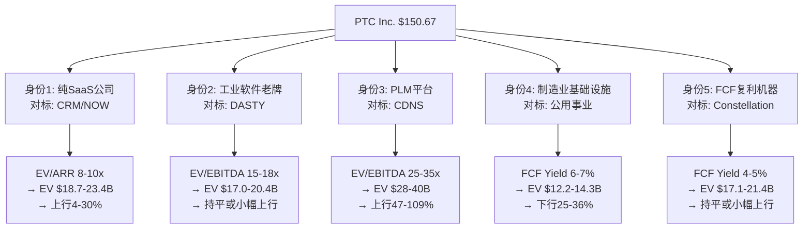
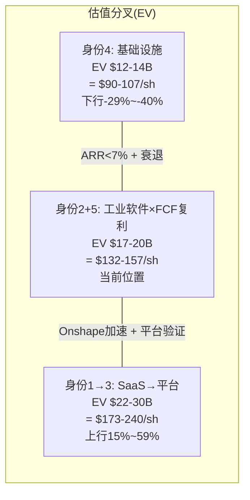
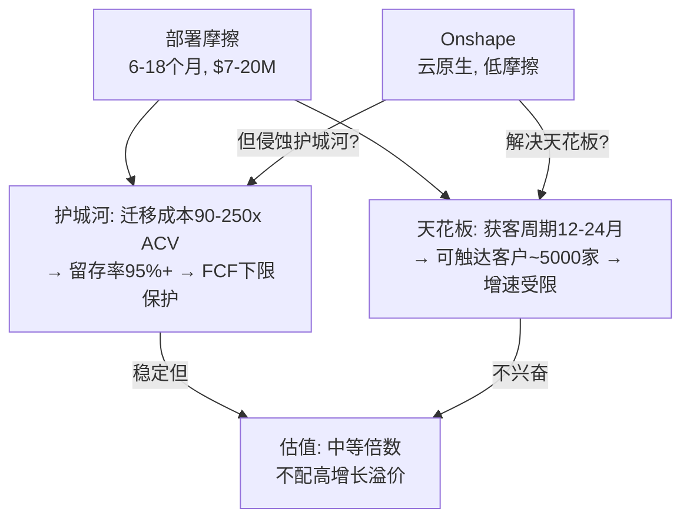
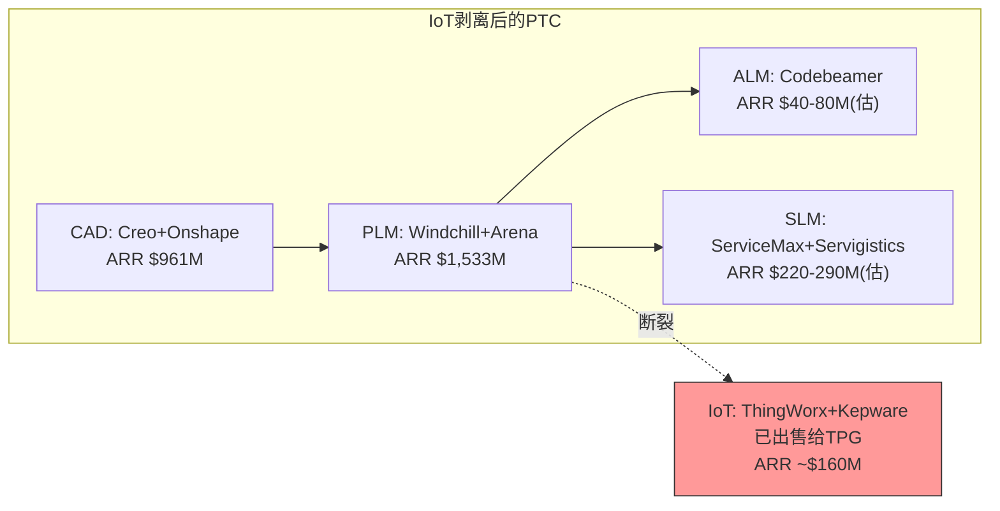
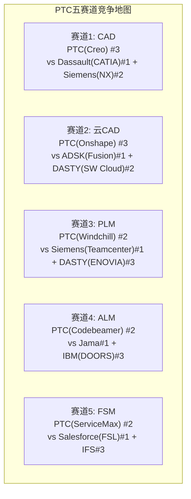
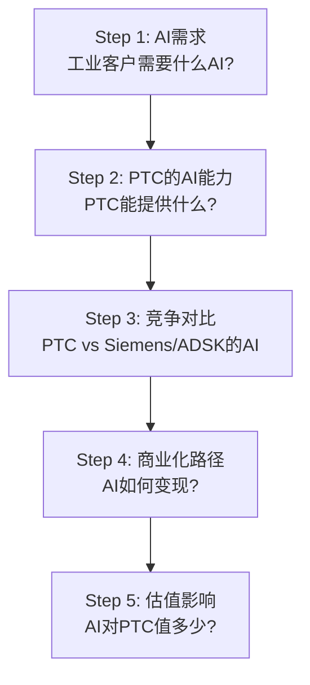
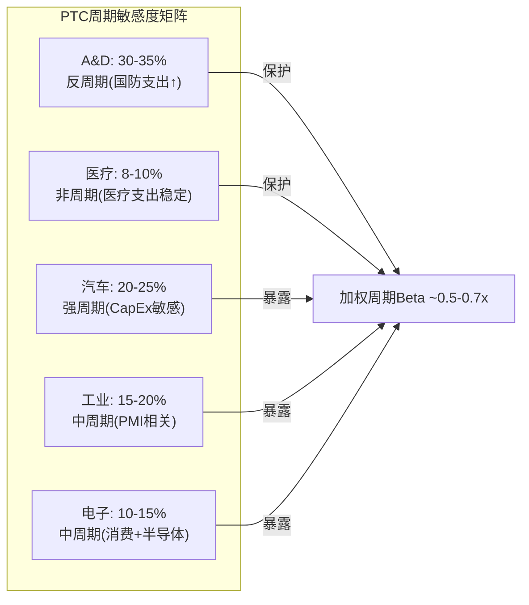
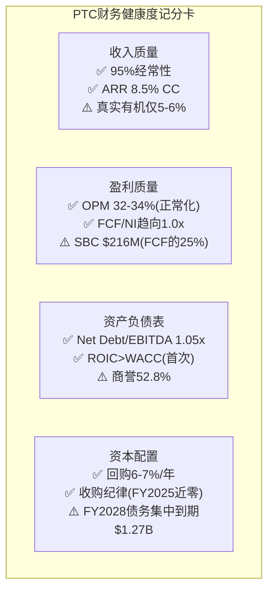

# PTC Inc. (NASDAQ: PTC) 深度研究报告
> **评级: 中性关注（偏审慎）** | 公允价值: ~$142 | 当前: $149.81 | 期望回报: -5.2%
> 分析日期: 2026-03-23 | 21章 | 122K字符
> 核心矛盾: "转型中的优质资产被当作低增长资产定价"

---

## 执行摘要

**PTC是一家被护城河保护的优质现金流公司，但当前价格已充分反映了这些优点。**

### 三句话结论
1. PTC的护城河价值占企业价值(EV, 市值+净债务，反映收购整家公司的总成本)的54-80%——40-45%的年化经常性收入(ARR, 已签约的年化订阅收入——SaaS公司最核心的增长指标)受制度嵌入保护(航空国防+医疗器械)，即使零增长也支撑$10.4B EV
2. 但市盈率(PE)折价28%(vs Autodesk)是会计幻觉——企业价值/自由现金流(EV/FCF, 衡量"买下整家公司需要几年的自由现金流回本")为22.3x，和Autodesk的22.6x几乎相同。"便宜"的感觉来自利润率结构差异而非真实折价
3. 有机增速剔除SaaS迁移提价(从本地部署转云订阅时的1.5-2.5倍提价)后仅3.9%——迁移跑道剩余3-4年，之后ARR增速将从8.5%缓降至6%

### 估值结果

| 方法 | 公允价值 | vs $149.81 |
|------|---------|-----------|
| 现金流折现(DCF, 预测未来现金流并折算回今天的价值)概率加权 | $118.2 | -21.1% |
| 分部加总估值(SOTP, 逐产品线分别估值再加总，含15%集团折价) | $127.0 | -15.2% |
| 可比公司法(用同行业公司的估值倍数作为参照) | $148.5 | -0.9% |
| EPS路径(每股盈利增长推算3年后股价) | $153.2 | +2.3% |
| **加权公允(红队前)** | **$131.5** | **-12.2%** |
| **红队调整后** | **~$142** | **-5.2%** |

### 关键发现

| 发现 | 影响 |
|------|------|
| 护城河"双层蛋糕": 底层(制度嵌入55-60%，法规强制使用)几乎不可替代，表层(商业嵌入40-45%)可替代但成本高 | 下行有底，非崩溃型 |
| 回购效率η=0.51: 自由现金流收益率(FCF Yield, 每年自由现金流占市值的比例)4.8% < 加权平均资本成本(WACC, 投资者要求的最低回报率)9.5%——在$150回购是低效的，但"最不坏的选择" | EPS增长71%来自回购，质量偏低 |
| WACC是决定性变量: 9.5%(按工业股定价)→审慎 / 8.5%(按SaaS定价)→中性。下行beta(下跌时相对大盘的波动倍数) 2.0x支持9.5% | 评级取决于身份认定 |
| SaaS迁移S曲线: 已完成65%，剩余3-4年跑道，之后ARR增速降至6% | 不是"悬崖"是"斜坡" |
| 温水煮青蛙15%概率: 最现实负面场景=每季度微miss，5年累计-30% | 不触发任何单一预警信号 |

### 投资温度计: 45°C（偏冷）

| 维度 | 温度 | 核心逻辑 |
|------|------|---------|
| 估值 | 35° | 加权公允$142 vs $150(-5.2%) |
| 质量 | 65° | 管理层综合评分6.5/10, 现金流/净利润117%, 资本回报率>资本成本 |
| 增长 | 40° | 有机3.9%偏低，回购补到EPS年化增长8% |
| 风险 | 45° | 护城河强但Siemens慢性蚕食+ServiceMax流失 |
| 催化 | 35° | FY2026 EPS下降，短期缺正面催化 |

### 追踪清单

**卖出信号**: ARR<7%连续两季 | ServiceMax ARR同比降 | 营业利润率(OPM)<28% | PLM(产品生命周期管理软件)排名降至#3
**买入信号**: ARR>10%连续两季 | Onshape ARR>$150M | 美联储累计降息≥150bp

### 关键术语速查

| 术语 | 含义 |
|------|------|
| ARR | 年化经常性收入——已签约订阅的年化金额，SaaS核心指标 |
| EV | 企业价值——市值+净债务，收购整家公司的总价 |
| FCF | 自由现金流——经营现金流减去资本支出，股东真正可支配的现金 |
| WACC | 加权平均资本成本——投资者要求的最低回报率，DCF的折现率 |
| DCF | 现金流折现法——预测未来现金流折算回今天的价值 |
| SOTP | 分部加总估值——逐产品线/业务分别估值再加总 |
| OPM | 营业利润率——营业利润/收入，衡量主营业务的赚钱效率 |
| NRR | 净收入留存率——存量客户今年花的钱/去年花的钱，>100%说明老客户在加大采购 |
| SBC | 股权激励费用——发给员工的股票期权/限制性股票的会计成本 |
| PLM | 产品生命周期管理——管理产品从设计到退役全过程的企业软件 |
| CAD | 计算机辅助设计——工程师用来画图/建模的软件(如Creo, SolidWorks) |
| ROIC | 投入资本回报率——衡量公司用股东和债权人的钱赚了多少回报 |
| PEG | 市盈率/增长率——PE除以EPS增速，衡量"为增长付出的价格" |
| EBITDA | 息税折旧摊销前利润——近似经营现金流，常用于跨公司比较 |

---


## Chapter 1: Reverse DCF与信念反演 — 市场在$150定价什么？

### 1.1 价格快照与估值坐标

PTC Inc.在2026年3月20日收盘$150.67，距52周高点$219.69下跌31.4%，距52周低点$133.38上涨13.0%。股价在过去12个月经历了一轮显著的估值压缩——50日均线$159.94、200日均线$183.33均位于当前价格之上，形成典型的下行通道。[DM-CH1-001: FMP quote 2026-03-20, 52w high $219.69, low $133.38, 50MA $159.94, 200MA $183.33]

从估值坐标看:

| 指标 | 当前值 | 含义 |
|------|--------|------|
| 市值 | $17.93B | 工业软件中型公司 |
| EV | ~$19.1B | 含净债务$1.19B |
| Trailing PE(基于过去12个月盈利的市盈率) | 24.8x | FY2025 EPS $6.08 |
| Forward PE(基于未来12个月预期盈利) | 19.4x | FY2026E EPS $7.77(共识) |
| EV/EBITDA(企业价值/息税折旧摊销前利润，近似经营倍数) | 16.9x | EBITDA $1.13B |
| EV/FCF(企业价值/自由现金流，衡量回本年数) | 22.3x | FCF $857M |
| FCF Yield(自由现金流收益率，=FCF/市值) | 4.8% | 工业软件板块最高 |

[DM-CH1-002: FMP key-metrics FY2025, EV/EBITDA 22.6x(以filing date市值), 本表基于当前市值重算]
[DM-CH1-003: FMP estimates FY2026, consensus EPS $7.77, revenue $2.73B, 9位分析师覆盖]

这组数字呈现一个矛盾: **Trailing PE 24.8x看起来不便宜，但Forward PE 19.4x又显得工业软件板块最低档。** 矛盾的来源是FY2024→FY2025的GAAP收入跳升19.2%（从$2.30B到$2.74B），这不是真正的业务增长，而是ASC 606(收入确认会计准则)下订阅收入确认时点变化+大单集中在Q4的季节性效应——Q4单季收入$894M几乎是Q1 $565M的1.58倍。[DM-CH1-004: FMP income quarterly, FY2025 Q4 $893.8M vs Q1 $565.1M, 比值1.58x]

因此，Trailing PE是被会计时点扭曲的噪音指标。**真正的定价锚是Forward PE 19.4x和EV/FCF 22.3x**——前者反映盈利预期，后者反映现金创造能力。

### 1.2 Reverse DCF: 市场隐含的增长假设

Reverse DCF的核心问题是: **在当前股价$150.67下，市场在为PTC定价什么样的未来?**

**模型参数设定:**

| 参数 | 值 | 依据 |
|------|------|------|
| 起始FCF | $857M | FY2025实际FCF |
| WACC(加权平均资本成本，投资者要求的最低回报率) | 9.5% | beta(股价相对大盘的波动倍数) ~1.1, 股权风险溢价6%, 无风险利率4.3% |
| 预测期 | 10年 | 工业软件生命周期 |
| 终端FCF倍数 | 15x | 成熟软件公司(低增长期)典型 |
| 当前EV | $19.1B | 市值$17.93B + 净债务$1.19B |

**反推结果:**

通过迭代求解，使10年FCF的贴现值 + 终端价值的贴现值 = 当前EV $19.1B:

**隐含FCF CAGR(年复合增长率) ≈ 8.0%**

验证计算:
- 第10年FCF = $857M × (1.08)^10 = $857M × 2.159 = $1,850M
- 终端价值 = 15 × $1,850M = $27,750M
- 终端价值贴现 = $27,750M / (1.095)^10 = $27,750M / 2.478 = $11,199M
- 10年FCF贴现总和 = $857M × 9.28(年金系数) = $7,951M
- **总计 = $7,951M + $11,199M = $19,150M ≈ $19.1B ✓**

[DM-CH1-005: Reverse DCF自算, WACC 9.5%, terminal 15x, 隐含FCF CAGR 8.0%, 模型收敛于$19.15B vs EV $19.1B]

这个结果意味着什么? 市场在当前价格隐含的信念是: **PTC的FCF在未来10年以8%的速度复合增长。** 这与当前ARR增速8.5%(恒定汇率)高度吻合。换句话说:

> **市场既没有定价加速，也没有定价减速。它在定价"当前状态永续化"——ARR增速8-9%，利润率维持，持续10年。**

这是一个"不太乐观也不太悲观"的定价，但它暗含了几个需要检验的信念(见1.3节)。

**敏感性检验: WACC和终端倍数的影响**

| WACC \ 终端倍数 | 12x | 15x | 18x |
|----------------|-----|-----|-----|
| **8.5%** | 6.3% | 5.2% | 4.3% |
| **9.5%** | 9.8% | **8.0%** | 6.6% |
| **10.5%** | 13.1% | 10.8% | 9.0% |

[DM-CH1-006: 敏感性矩阵自算, 隐含FCF CAGR随WACC和终端倍数变化]

如果WACC取更低的8.5%(软件公司常见)，隐含增速仅5.2%——这意味着市场在更低折现率假设下，实际上对PTC的增长预期相当悲观。反过来，如果市场使用更高的WACC(10.5%，反映对工业周期的额外风险溢价)，则隐含增速高达10.8%——此时市场在定价"加速场景"。

**关键判断: 对工业SaaS公司使用9.5% WACC合理。** 因为PTC虽然是软件公司(低beta)，但其客户全部是制造业(强周期)。这种"软件壳+制造业核"的结构需要额外的周期风险溢价。因此8% FCF CAGR的隐含增速是可靠的基准锚。

### 1.3 隐含信念集提取

市场在$150.67定价了以下五组信念。这不是分析师的预测，而是**从价格反推的市场共识**——任何与这些信念方向不同的判断，都构成潜在的alpha来源(或风险来源):

**信念B1: ARR增速维持8-9%不减速(至少5年)**

这是最核心的隐含假设。FCF 8% CAGR要求ARR至少维持当前增速。因为FCF = (ARR × 某个转化率) - CapEx - 税后利息，而PTC的CapEx极低(仅$11M, 收入的0.4%)，所以FCF增速几乎完全取决于ARR增速和利润率变化。[DM-CH1-007: FMP cashflow FY2025, CapEx $11M, CapEx/Revenue 0.4%]

验证当前ARR增速的可持续性:
- FY2025 ARR $2.45B，CC增速8.5%
- 剔除IoT后ARR $2.34B，CC增速9.0%
- FY2026 Q1(Dec 2025)收入$686M——年化$2.74B，与FY2025持平
- 共识预测FY2026收入$2.73B——因为IoT剥离(2026.3.16完成)损失约$100-150M年化收入，部分被核心业务增长抵消
- 共识预测FY2027收入$2.90B(+6.5%)，FY2028 $3.14B(+8.1%)

[DM-CH1-008: FMP estimates, FY2027E revenue $2.90B(9位分析师), FY2028E $3.14B(3位分析师)]

**信号解读:** 共识对FY2027增速仅预期6.5%，低于当前ARR增速。这意味着**卖方分析师群体实际上比市场定价更悲观**——或者说，如果共识预测兑现，当前$150的定价已经充分反映了减速预期。进一步减速(ARR<7%)才是真正的下行催化剂。

**信念B2: OPM维持35%+或温和扩张**

FY2025 OPM 35.9%是PTC历史最高水平——FY2022仅23.1%，三年飙升了1280bp。[DM-CH1-009: FMP income FY2022-2025, OPM从23.1%→25.6%→21.9%→35.9%, 其中FY2023低点受收购ServiceMax整合影响]

等等——FY2023 OPM 21.9%实际上是低谷(ServiceMax收购整合成本+SaaS转型投入)，FY2024 25.6%是恢复，FY2025 35.9%才是正常化后的真实水平。这个跳升有两个驱动因素:

1. **SGA效率改善**: SGA(销售、一般及行政费用)/Revenue从FY2022的35.7%降至FY2025的28.9%——削减了680bp，贡献了OPM提升的一半以上。[DM-CH1-010: FMP income, SGA $792.6M/$2,739M=28.9% vs FY2022 $690M/$1,933M=35.7%]
2. **收入增速>成本增速**: FY2024→FY2025收入增19.2%，但COGS仅增0.04%($445M→$445M几乎没动)，R&D仅增5.7%($433M→$458M)。固定成本杠杆效应显著。

**但这意味着一个重要的问题:** FY2025的高OPM部分是因为收入端的ASC 606时点效应(收入跳升，但成本是线性的)。如果FY2026收入因IoT剥离而下降到$2.73B，**OPM可能会回落**，因为固定成本杠杆反过来会压缩利润率。

共识FY2026E EBIT $719M / Revenue $2.73B = OPM 26.4%。[DM-CH1-011: FMP estimates FY2026, EBIT $719M, revenue $2.73B, 隐含OPM 26.4%]

这是一个巨大的回落——从35.9%降到26.4%?! 如果这是真的，Forward PE 19.4x可能并不便宜。但需要注意: 这个共识可能包含了IoT剥离的一次性调整成本或过于保守的假设。管理层对FY2026指引的Pro-forma数字(剔除IoT)才是真正的参考锚。

**信念B3: SBC(股权激励费用——发给员工的股票/期权的会计成本)不会大幅膨胀**

FY2025 SBC $216M，占收入7.9%，占FCF的25.2%。如果我们用"FCF减SBC"来衡量真实股东价值创造:

| 年度 | FCF | SBC | FCF-SBC | FCF-SBC增速 |
|------|-----|-----|---------|------------|
| FY2022 | $409M | $175M | $234M | — |
| FY2023 | $586M | $206M | $380M | +62% |
| FY2024 | $732M | $223M | $509M | +34% |
| FY2025 | $857M | $216M | $641M | +26% |

[DM-CH1-012: FMP cashflow+income FY2022-2025, SBC分别$175M/$206M/$223M/$216M]

好消息: SBC在FY2025实际上同比下降了$7M(-3.1%)，占收入比从FY2024的9.7%降至7.9%。坏消息: SBC仍然"吃掉"了FCF的25%。对比ADSK(SBC $788M, 占FCF的32.7%)，PTC的SBC纪律实际上更好。

EV/(FCF-SBC)是一个更诚实的估值指标:
- PTC: $19.1B / $641M = **29.8x**
- 这意味着基于真实股东现金创造，PTC的估值并不像EV/FCF 22.3x那么便宜

**信念B4: IoT剥离是净正面事件**

2026年3月16日PTC完成了将IoT业务(ThingWorx+Kepware)出售给TPG的交易，获得$600M现金 + $125M或有对价。[DM-CH1-013: checkpoint.yaml, IoT剥离2026.3.16完成, $600M+$125M或有]

市场对此的定价暗含"剥离后PTC更纯粹、更高质量"的信念。但这需要检验:
- IoT ARR约$110-120M(FY2025全年ARR $2.45B中)，增速约5-6%(低于整体8.5%)
- IoT毛利率可能低于公司整体83.8%(硬件组件较多)
- 剥离后ARR约$2.34B，CC增速从8.5%提升至9.0%——确实更"纯"但提升幅度仅50bp
- 获得的$600M现金用于偿债($553M净偿债已在FY2025现金流中体现)

因此IoT剥离的真正价值不在增速提升(很小)，而在资产负债表修复——Net Debt/EBITDA从FY2024的2.28x骤降至FY2025的1.05x。[DM-CH1-014: FMP key-metrics, Net Debt/EBITDA FY2024 2.28x→FY2025 1.05x]

**信念B5: 制造业CapEx下行不会严重影响PTC**

这是最脆弱的隐含信念。PTC的客户100%是制造企业——航空/国防(30-35%)、汽车(20-25%)、工业设备(15-20%)、电子(10-15%)、医疗器械(10%)。制造业CapEx周期直接影响这些客户的IT预算。

但"工业软件是OpEx不是CapEx"这一论点——PTC的订阅模式让其从客户的CapEx预算转移到了OpEx预算——部分缓解了周期性。历史证据: 2020年COVID冲击下PTC收入仅微降3.2%(FY2020 $1.46B vs FY2019 $1.50B)，而制造业CapEx暴跌20%+。[DM-CH1-015: FMP income FY2019-2020, revenue $1.504B→$1.455B, -3.2%]

但要注意: FY2020是PTC仍处于永久授权→订阅转型早期的时点，收入下降被新订阅增长部分掩盖。纯订阅模式下的周期弹性需要在下一次衰退中验证——而这正在发生: FY2026共识收入$2.73B实际低于FY2025的$2.74B(剔除IoT后)，暗示制造业放缓正在影响PTC。

### 1.4 信念脆弱度评估



**最脆弱的信念是B2(OPM维持35%+)**。因为:

1. **FY2025 OPM 35.9%可能是峰值而非新常态**: 收入端有ASC 606时点效应，成本端有SGA优化的一次性收益(GTM重组)。FY2026共识隐含OPM仅26.4%——如果这更接近Pro-forma真实水平，那么市场用Forward PE 19.4x定价的"未来利润"实际上建立在一个显著低于FY2025的利润率基础上。

2. **"利润率悬崖"vs"利润率台阶"**: 关键问题是FY2025 OPM 35.9%中有多少是结构性提升(SaaS转型收割期)、多少是一次性时点效应。如果结构性提升占主导(SaaS转型确实降低了交付成本)，则利润率只是从"异常高的35.9%"回落到"健康的30-32%"——这是"台阶"。如果时点效应占主导，则回落到25-27%——这是"悬崖"。

3. **可验证时间点**: FY2026 Q2(2026年3月季度)将是第一个完全不含IoT的季度报告，Pro-forma OPM将提供答案。

**最稳固的信念是B3(SBC纪律)**。PTC的SBC占收入比从FY2024的9.7%持续降至FY2025的7.9%，且绝对金额同比下降。在CEO Neil Barua(2024年接任)的管理下，SBC纪律看起来是有意识的战略选择，而非偶然。

### 1.5 ADSK对标: PE折价的真相

本报告设定了ADSK作为PTC的首要可比对象。两者的估值对比揭示了一个被广泛误读的现象:

| 指标 | PTC | ADSK | PTC折价 |
|------|-----|------|---------|
| Forward PE | 19.4x | ~27x | -28% |
| EV/FCF | 22.3x | 22.6x | **-1.3%** |
| EV/(FCF-SBC) | 29.8x | 33.5x | -11% |
| FCF Yield | 4.8% | 4.5% | PTC更高 |
| OPM | 35.9% | 24.9% | PTC更高 |
| FCF Margin | 31.3% | 33.4% | 接近 |
| SBC/Revenue | 7.9% | 10.9% | PTC更好 |
| Rev Growth(最新FY) | 19.2% | 17.5% | 接近 |
| ARR增速(CC) | 8.5% | ~12% | ADSK更高 |
| Net Debt/EBITDA | 1.05x | 0.27x | ADSK更健康 |

[DM-CH1-016: FMP ADSK FY2026(Jan 2026), revenue $7.21B(+17.5%), OPM 24.9%, FCF $2.41B, SBC $788M]
[DM-CH1-017: FMP ADSK quote 2026-03-20, $247.65, market cap $52.5B]
[DM-CH1-018: ADSK EV/FCF自算: EV ~$54.3B / FCF $2.41B = 22.6x]

**核心发现: PE折价28%是一个会计幻觉——EV/FCF几乎完全相同(22.3x vs 22.6x)。**

PE差异的三个来源:

**1. 资本结构差异(贡献~40%的PE折价)**
PTC净债务$1.19B, ADSK净现金~$485M。更高的利息支出压低了PTC的净利润(FY2025利息支出$77M)，但不影响FCF。因此PTC的PE被债务"人为压低"，而EV/FCF已经中和了资本结构差异。[DM-CH1-019: FMP income FY2025, PTC interest expense $77M; ADSK FY2026 interest income $25M(净现金)]

**2. SBC差异(贡献~30%的PE折价)**
ADSK的SBC $788M(收入的10.9%)远高于PTC的$216M(7.9%)。SBC是非现金费用，压低净利润但不压低FCF。因为ADSK的SBC更高，其"PE分母(EPS)"被更多压低→PE虚高→看起来PTC更便宜。但用FCF看，SBC膨胀反而是ADSK的劣势。

**3. 增长预期差异(贡献~30%的PE折价)**
ADSK的底层ARR增速~12%确实高于PTC的8.5%。这是真正的基本面差异——更高的增长理应配更高的倍数。但3.5pp的增速差导致28%的PE折价是否过度? 用PEG比率检验: PTC PEG = 19.4/8.5 = 2.3x; ADSK PEG = 27/12 = 2.3x。**PEG完全相同!** 这意味着市场已经精确地为增速差异定价——PTC的PE折价完全可以被增速差异解释，**没有额外的定价错误**。

[DM-CH1-020: PEG自算, PTC 19.4/8.5=2.28x, ADSK ~27/12=2.25x, 差异<2%]



### 1.6 FCF桥接: 从GAAP到真实现金创造力

理解PTC估值的最后一块拼图是FCF的质量和可持续性。$857M的FY2025 FCF是如何产生的?

**FCF桥接(FY2025):**

```
GAAP净利润          $734M
+ 折旧摊销           $135M  (非现金)
+ 股票薪酬            $216M  (非现金)
- 递延税变动          ($26M)  (非现金)
- 营运资本变动        ($188M)  (现金消耗)
  其中: 应收账款增加  ($121M)
        其他营运资本   ($67M)
- 其他非现金项目      ($4M)
= 经营现金流          $868M
- CapEx              ($11M)  (极低!)
= 自由现金流          $857M
```

[DM-CH1-021: FMP cashflow FY2025, OCF $868M, CapEx $11M, FCF $857M, WC变动-$188M(应收$121M+其他$67M)]

**三个质量信号:**

**信号1: CapEx极低($11M, 收入的0.4%)——这是资产轻型软件模式的标志。** PTC不需要建工厂、买设备、租仓库。其唯一的"资本"是人——而人的成本体现在OpEx和SBC中，不在CapEx中。因此OCF→FCF的转化率接近100%(98.7%)。这是PTC商业模式最大的结构性优势之一: 与制造业客户(CapEx/Revenue 5-15%)相比，PTC是"制造业中的寄生者"——从制造业客户的CapEx预算中提取了确定性的OpEx现金流。[DM-CH1-022: PTC CapEx/Revenue 0.4% vs 工业客户典型5-15%, FMP cashflow FY2025 CapEx $11M]

**信号2: 营运资本消耗$188M值得关注。** 主要来自应收账款增加$121M——FY2025应收账款总额$1.00B，占收入的36.5%。DSO(应收账款周转天数——从发出账单到收到现金的平均天数，越短说明收款能力越强)为133天，远高于ADSK的73天。[DM-CH1-023: FMP key-metrics FY2025, DSO 133天; ADSK FY2026 DSO 73天]

为什么PTC的DSO是ADSK的1.8倍? 因为PTC的客户是大型制造企业(航空/国防占30-35%)，这些客户的付款周期天然较长(政府合同可达90-120天)。高DSO不是坏账风险的信号(PTC的坏账率极低)，但意味着收入增长需要"垫付"更多营运资本——每增长$1收入，需要额外锁定$0.37在应收账款中。这降低了真实的资本效率。

**信号3: 收入质量指标income quality = 1.18。** 这个比率(OCF/净利润)大于1表示"利润质量健康"——现金流验证了GAAP利润。对比FY2024的1.99(OCF远大于净利润，因为FY2024净利润被收购整合成本压低)，FY2025的1.18是更正常化的水平。[DM-CH1-024: FMP key-metrics FY2025, income quality 1.18; FY2024 1.99]

### 1.7 Reverse DCF结论: 叙事约束

**市场在$150.67定价的核心信念可以概括为一句话:**

> **"PTC是一家稳定的、中单位数增长的工业软件现金牛，FCF以8%的速度增长10年，然后进入成熟期。"**

这个信念的含义:
1. **市场没有为"加速"定价** — Deferred ARR 3x、Onshape渗透大企业、AI嵌入等增长催化剂，如果兑现，构成上行意外
2. **市场也没有为"崩溃"定价** — 8%隐含增速意味着市场认为PTC不会被Siemens颠覆、制造业衰退不会严重冲击ARR
3. **PE折价是会计幻觉** — EV/FCF和PEG显示PTC与ADSK的定价精度一致，不存在"被低估"的简单结论
4. **OPM是最大的不确定性** — FY2025的35.9%如果是峰值(非新常态)，则当前定价可能偏乐观

**本报告叙事约束:** Reverse DCF显示市场定价"基本合理偏中性"，后续Phase不能预设"被低估"或"被高估"的叙事方向。前述分析的分析应聚焦于: (1) ARR增速是否会偏离8-9%的轨道(加速或减速); (2) Pro-forma OPM的真实水平(30%+还是25%?)。这两个问题的答案决定了PTC是"便宜的好公司"还是"合理定价的普通公司"。

---

*Chapter 1完成 | 下一章: Chapter 2 身份定义×估值分叉 + 可比对标*

---

## Chapter 2: 身份定义×估值分叉 — PTC到底是什么？

### 2.1 CQ0: 五种身份定义决定五种估值

PTC是一家难以归类的公司。在Bloomberg终端上它被标注为"Application Software"，在工业分析师眼中它是"PLM供应商"，在SaaS投资者看来它是"传统软件转型者"。这种身份的模糊性不是学术问题——它直接决定了投资者使用什么估值框架，进而决定了PTC"应该值多少钱"。

**五种身份定义及其估值含义:**



让我逐一剖析每种身份的合理性和局限性。

#### 身份1: "纯SaaS公司" — 用ARR估值

**核心逻辑:** PTC已经完成了从永久授权到订阅模式的转型，ARR是$2.45B(剔除IoT后$2.34B)，100%的收入来自订阅/支持。按照SaaS行业惯例，应该用EV/ARR来估值。

**估值推演:**
- 成长型SaaS(>20% ARR增速): EV/ARR 10-15x (CRM, NOW)
- 成熟型SaaS(10-20% ARR增速): EV/ARR 6-10x
- 减速型SaaS(<10% ARR增速): EV/ARR 4-7x
- PTC ARR增速8.5%(CC) → 属于减速型SaaS
- EV/ARR = $19.1B / $2.34B(剔除IoT) = **8.2x**
- 对标: Salesforce EV/ARR ~6.5x(增速11%), ServiceNow EV/ARR ~16x(增速22%)

[DM-CH2-001: PTC ARR $2.45B含IoT, 剔除IoT后$2.34B, CC增速9.0%, checkpoint.yaml]

**问题:** PTC不是纯SaaS。SaaS公司的核心特征是(1)云交付(2)多租户架构(3)低部署摩擦(4)按seat/usage定价。PTC在这四个维度上都只部分满足:

| SaaS特征 | PTC现状 | 纯SaaS标准 |
|----------|---------|------------|
| 云交付 | 混合(Onshape云原生, Windchill仍多on-prem) | 100%云 |
| 多租户 | Onshape是, 其余产品否 | 是 |
| 部署摩擦 | 极高(Windchill部署6-18个月) | 低(Days到Weeks) |
| 定价模式 | 订阅(按seat), 但合同3-5年 | 月/年订阅, 随时取消 |

因此用纯SaaS估值框架给PTC，是高估了PTC的"SaaS纯度"。PTC的订阅收入具有SaaS的收入可见性优势，但缺少SaaS的灵活扩展(land-expand快速循环)能力。更准确地说，PTC是**"订阅制工业软件"**而非"SaaS"——订阅模式改善了收入质量，但没有改变产品交付和客户关系的本质。

[DM-CH2-002: PTC产品交付模式——Onshape: 云原生SaaS; Windchill: 主要on-prem+云托管选项; Creo: 桌面+云流选项; Codebeamer: 云和on-prem均有; ServiceMax: 基于Salesforce平台的SaaS, 来自checkpoint.yaml和公司产品页]

#### 身份2: "工业软件老牌" — 用EBITDA估值

**核心逻辑:** PTC本质上是一家与Dassault Systèmes、Siemens Digital Industries类似的工业软件公司，卖的是CAD/PLM给制造企业。应该用工业软件板块的EV/EBITDA来估值。

**估值推演:**
- DASTY(Dassault): EV/EBITDA 15.7x, 收入€6.24B, OPM 21.7%, 增长0.4%
- PTC: EV/EBITDA 16.9x(基于TTM EBITDA $1.13B)
- Siemens DI(非上市分部): 估计EV/EBITDA ~18-20x

[DM-CH2-003: FMP DASTY key-metrics CY2025, EV/EBITDA 15.7x, EV/FCF 20.3x, EV/Sales 4.77x]
[DM-CH2-004: FMP DASTY income CY2025, revenue €6.24B(+0.4%), OPM 21.7%, net income €1.20B]

**关键发现:** PTC当前EV/EBITDA 16.9x与DASTY的15.7x基本处于同一区间，但PTC的增长(ARR 8.5%)远高于DASTY的0.4%。这意味着要么(a)PTC被给予了适当的增长溢价(+1.2x EV/EBITDA)，要么(b)DASTY被严重低估了。

从EV/FCF看更有趣: PTC 22.3x vs DASTY 20.3x——差距仅10%。但PTC的ARR增速是DASTY的20倍以上(8.5% vs 0.4%)。如果这是一个DCF驱动的估值市场，PTC理应获得更大的溢价。

**为什么没有?** 因为市场对PTC施加了两个折价因子:
1. **IoT剥离过渡折价**: 2026年3月刚完成剥离，Pro-forma财务数据还不清晰，投资者处于"等等看"状态
2. **规模折价**: DASTY收入€6.24B(~$6.8B)是PTC $2.74B的2.5倍，更大的规模带来更高的市场信心

但这种比较也揭示了一个机会: **如果PTC能在FY2026 Q2-Q4展示稳定的Pro-forma增长+维持30%+ OPM，IoT过渡折价应该消退**，EV/EBITDA可能从16.9x向18-20x靠拢——仅倍数扩张就意味着6-18%的上行空间。

#### 身份3: "PLM平台" — 平台溢价估值

**核心逻辑:** PTC不只是卖工具——它在构建一个覆盖设计→制造→服务的"数字主线(digital thread)"平台。如果CQ1的答案是"平台"(而非"产品组合")，PTC理应获得平台溢价。

**对标CDNS:** Cadence也是一个"工程设计平台"，但服务于半导体行业(EDA):
- CDNS: EV/EBITDA 45.0x, EV/FCF 53.1x, 市值$78.4B
- PTC: EV/EBITDA 16.9x, EV/FCF 22.3x, 市值$17.9B

[DM-CH2-005: FMP CDNS key-metrics CY2025, EV/EBITDA 45.0x, EV/FCF 53.1x, market cap $78.4B, R&D/Rev 33.4%]

CDNS获得45x EV/EBITDA(PTC的2.7倍)的原因:
1. **TAM增速**: 半导体设计复杂度指数增长(Moore's Law的反面)→ EDA TAM增速>10% vs PLM TAM ~5-6%
2. **垄断度**: EDA是双寡头(CDNS+SNPS占90%+) vs PLM四强(Siemens/Dassault/PTC/ADSK)各20-25%
3. **客户锁定度**: EDA工具链一旦嵌入，几乎不可能更换(训练工程师+验证数据+设计流程全部绑定) vs PLM有替换案例(虽然罕见)
4. **AI催化**: AI芯片设计复杂度→EDA用量指数增长(NVIDIA的芯片设计100%依赖CDNS/SNPS) vs PLM的AI增值层不明确

**结论:** PTC用CDNS的估值框架完全不合理。PLM不是EDA——市场结构不同、竞争格局不同、TAM增速不同。声称PTC应该像CDNS一样估值的分析，犯了类比谬误。**但CDNS对标仍然有一个有限的启示: 如果PTC真正实现了"平台"身份(多产品交叉销售+生态锁定)，其EV/EBITDA可能从16.9x向22-25x靠拢——这是"工具"和"平台"之间的估值差距。**

#### 身份4: "制造业基础设施" — 公用事业估值

**核心逻辑:** 如果PTC的ARR持续减速(从8.5%降至5%以下)，市场可能重新分类PTC为"制造业IT基础设施"——类似于ERP系统(SAP的旧业务)或工厂自动化软件——本质上是制造业的"水电煤"。

这种身份下的估值逻辑是:
- 稳定但低增长的现金流 → 用更高的FCF yield来定价
- 基础设施类公司典型FCF yield: 5-7%
- PTC当前FCF yield 4.8% → 如果市场要求6-7% → EV应为$12.2-14.3B → 股价$92-110

[DM-CH2-006: 推算——FCF $857M / 6% yield = $14.3B EV, 减净债务$1.19B = $13.1B equity / 120M shares = $109; 7% yield = $12.2B EV → equity $11.0B → $92]

**这是下行场景中最值得警惕的身份重分类风险。** 触发条件:
1. ARR增速连续3-4个季度低于7%(从8.5%下滑)
2. 管理层放弃"平台"叙事，承认PTC是"稳定的工具提供商"
3. 制造业衰退导致客户推迟升级/扩展

但这个场景的概率较低(估计<15%)，因为PTC的ARR增速在IoT剥离后实际上提升至9.0%，且Deferred ARR增长3倍暗示pipeline强劲。

#### 身份5: "FCF复利机器" — Constellation Software视角

**核心逻辑:** 忽略PTC"是什么"，只看它"产出什么"——$857M的FCF，31.3%的FCF margin，CapEx仅$11M，每年通过回购+偿债返还~$850M给股东。这是一台现金创造机器，类似于Constellation Software(CSU.TO)的商业模式: 用低成本获取的软件资产持续产出高margin现金流。

**FCF复利计算:**
- FY2025 FCF: $857M
- FY2025回购: $300M(股本减少~1.5%)
- FY2025偿债: $553M(Net Debt/EBITDA从2.28x降至1.05x)
- 如果FY2026完全转向回购(债务已健康): 年回购$600-700M → 股本减少3.5-4.0%/年
- ARR增速8.5% + 利润率稳定 → FCF增速~8-9%
- 加上回购: EPS增速 = FCF增速 + 回购效应 = 8% + 3.5% = **11.5% EPS CAGR**

[DM-CH2-007: FMP cashflow FY2025, 回购$300M, 偿债$553M; 推算FY2026后回购力度增大至$600-700M基于FCF ~$800M+]

11.5%的EPS CAGR配19.4x Forward PE，PEG = 1.7x。对于一个FCF margin >30%、无重大资本需求的软件公司来说，这是合理偏低的。

**但Constellation对标也有局限:** CSU的核心能力是并购(每年收购30-50家小型垂直软件公司)，PTC的并购能力未经大规模验证——IoT业务(ThingWorx)的收购整合效果一般(最终卖出)，ServiceMax的收购($1.46B, 2023)仍在验证中。PTC的"复利"更多来自有机增长+回购的稳健路径，而非CSU式的并购驱动。

### 2.2 身份判定: PTC最可能是什么?

五种身份不是互斥的——PTC在不同产品线上呈现不同身份:

| 产品 | 最匹配身份 | 估值含义 |
|------|----------|---------|
| Onshape | 身份1(SaaS) | 高增长, 高倍数 |
| Creo | 身份2(工业软件老牌) | 稳定, 中倍数 |
| Windchill | 身份4(基础设施) | 极稳定, 低倍数 |
| Codebeamer | 身份1(SaaS) | 高增长, 高倍数 |
| ServiceMax | 身份2(工业软件) | 待验证 |
| **整体PTC** | **身份5(FCF复利) + 身份2(工业老牌)** | **中等倍数, 回购驱动** |

**核心判断:** PTC的"真实身份"是**身份2和身份5的混合体**——一家增速中等(8-9%)但现金创造能力优秀(FCF margin 31%)的工业软件公司，通过回购+小幅有机增长实现11-12%的EPS复合增长。这不是一个激动人心的故事，但它是一个数学上可靠的复利路径。

市场当前的定价(Forward PE 19.4x)大致反映了这个混合身份。**PTC要获得显著重估，需要从"身份2+5"向"身份1或身份3"迁移——即Onshape/Codebeamer的高速增长比重上升，或数字主线的平台效应被验证。** 但这些迁移的证据目前仍然不充分(详见后续Ch8 CQ1分析)。

### 2.3 四可比对标: 估值坐标系的全景

将PTC放入工业/设计软件的估值坐标系中，可以看到清晰的分层:

| 指标 | **PTC** | ADSK | DASTY | CDNS |
|------|---------|------|-------|------|
| 市值 | $17.9B | $52.5B | $27.0B | $78.4B |
| 收入 | $2.74B | $7.21B | €6.24B | $5.30B |
| 收入增速 | 19.2%* | 17.5% | 0.4% | ~14% |
| ARR增速(CC) | 8.5% | ~12% | ~7% | N/A |
| OPM | 35.9%* | 24.9% | 21.7% | ~25% |
| FCF Margin | 31.3% | 33.4% | 23.6% | ~30% |
| SBC/Revenue | 7.9% | 10.9% | ~0% | 8.6% |
| EV/EBITDA | 16.9x | 30.2x | 15.7x | 45.0x |
| EV/FCF | 22.3x | 22.6x | 20.3x | 53.1x |
| FCF Yield | 4.8% | 4.5% | 4.7% | 1.9% |
| Net Debt/EBITDA | 1.05x | -0.27x | -0.81x | -0.28x |
| ROIC | 14.4% | 18.7% | 9.0% | 14.1% |
| R&D/Revenue | 16.7% | 22.8% | 21.2% | 33.4% |

*PTC FY2025收入增速含ASC 606时点效应; OPM 35.9%可能是峰值(见Ch1 1.3 B2)

[DM-CH2-008: 对标表综合FMP数据, PTC/ADSK/CDNS为美元, DASTY为欧元]
[DM-CH2-009: FMP CDNS income CY2025推算, revenue ~$5.30B, R&D/Rev 33.4%]

**对标矩阵揭示的三个关键发现:**

**发现1: PTC的FCF效率在同行中最高(SBC调整后)**

| 公司 | FCF | SBC | FCF-SBC | FCF-SBC Margin |
|------|-----|-----|---------|----------------|
| PTC | $857M | $216M | $641M | 23.4% |
| ADSK | $2,409M | $788M | $1,621M | 22.5% |
| CDNS | ~$1,587M | ~$455M | ~$1,132M | 21.4% |
| DASTY | €1,470M | ~€0 | €1,470M | 23.6% |

PTC和DASTY的SBC-adjusted FCF margin最高(23-24%)。但DASTY不发SBC(欧洲公司较少使用)，所以DASTY的"真实效率"更高。PTC的优势是: **在美国科技公司中SBC纪律最好(7.9%)**，这使得其FCF的"含金量"高于ADSK和CDNS。

[DM-CH2-010: SBC调整后FCF对比, PTC FCF-SBC margin 23.4%为美国同行最高]

**发现2: 估值分层与增速精确匹配**

| 公司 | ARR增速 | EV/FCF | 隐含EV/FCF per 1% growth |
|------|---------|--------|--------------------------|
| CDNS | ~14% | 53.1x | 3.8x |
| ADSK | ~12% | 22.6x | 1.9x |
| PTC | 8.5% | 22.3x | 2.6x |
| DASTY | ~0.4% | 20.3x | 50.8x |

CDNS因为EDA寡头垄断获得了极高的"每单位增长"溢价(3.8x)。ADSK和PTC在EV/FCF上几乎相同(22.3x vs 22.6x)——Ch1已分析，市场已精确为增速差异定价。DASTY的50.8x看似离谱，但实际上反映了"零增长+高确定性"的公用事业式定价——投资者买DASTY不是为了增长，是为了稳定。

**发现3: R&D投入强度的估值含义**

PTC的R&D/Revenue 16.7%是四家中最低的:
- CDNS 33.4%(PTC的2倍) — 半导体设计工具需要持续追赶芯片复杂度
- ADSK 22.8% — AEC+MFG双赛道需要更多产品投入
- DASTY 21.2% — 3DEXPERIENCE平台转型需要大量投资
- **PTC 16.7%** — 产品线聚焦(IoT剥离后更少), 且CAD/PLM核心技术已成熟

低R&D强度有两面性:
- **正面**: 更高的利润率(OPM 35.9%的一个来源)，资本效率更好
- **负面**: 可能在AI时代研发投入不足，尤其是当竞争对手(Siemens Copilot, ADSK AI)加大投入时。如果工业AI成为下一个竞争维度(CQ4)，PTC 16.7%的R&D强度可能不够

[DM-CH2-011: PTC R&D/Revenue 16.7%为四家可比中最低, FMP income FY2025 R&D $457.7M/$2,739M]

### 2.4 估值分叉地图: 不同身份下PTC值多少?

综合五种身份和四个可比对标，PTC的估值范围呈现为一个"分叉地图":



**当前$150.67位于Base Case的中间位置。** 这印证了Ch1的Reverse DCF结论: 市场定价"基本合理偏中性"。

**估值分叉的关键转折点:**
1. **Base→Bull需要什么?** (a) ARR加速到10%+(Deferred ARR兑现); (b) Onshape签下第一批F500客户; (c) 数字主线被第三方验证(Gartner/IDC领导者); (d) Pro-forma OPM确认≥32%
2. **Base→Bear需要什么?** (a) ARR减速到<7%; (b) ServiceMax churn扩大(验证身份4风险); (c) Siemens在PLM排名中持续领先; (d) 制造业衰退>12个月

**后续分析约束:** 身份判定不是初步评估就能完成的——它需要Ch3-Ch10的深入分析来验证。尤其是:
- Ch8(组合vs平台)直接决定身份3的可能性
- Ch4(SaaS经济学)直接影响身份1的合理性
- Ch9(竞争格局)影响身份4的概率

---

*Chapter 2完成 | 下一章: Chapter 3 客户深拆*

---

## Chapter 3: 客户深拆 — 谁在为PTC买单？

### 3.1 客户画像: 全球离散制造业的工程骨架

PTC的客户基础有一个鲜明特征: **100%是制造企业，且集中在离散制造(discrete manufacturing)而非流程制造(process manufacturing)**。这意味着PTC的客户生产的是"可以数"的物品——飞机引擎、汽车变速箱、医疗器械、电子产品——而非"需要量"的物质(石油、化工、食品)。

这个区分至关重要，因为离散制造和流程制造的IT需求完全不同:
- 离散制造需要CAD(设计复杂零部件) + PLM(管理数千个零件的BOM——物料清单，一个产品所有零部件的完整列表) + ALM(应用生命周期管理，软件开发的合规追溯)
- 流程制造需要ERP(批次管理) + MES(过程控制) + 配方管理
- PTC的产品线100%对准离散制造——这既是专注，也是限制

[DM-CH3-001: PTC产品线覆盖——CAD(Creo/Onshape)+PLM(Windchill/Arena)+ALM(Codebeamer)+SLM(ServiceMax/Servigistics)，全部面向离散制造, 来自公司10-K和产品页]

**地理分布:**

| 地区 | 收入占比 | 特征 |
|------|---------|------|
| Americas | ~50% | 美国为主，航空/国防占比高 |
| EMEA | ~38% | 德国/法国/英国，汽车+工业设备 |
| APAC | ~16% | 日本/韩国/中国，电子+汽车 |

[DM-CH3-002: PTC地理收入拆分, Americas ~50.4%, EMEA ~37.8%, APAC ~15.8%, phase0_data_prefetch.md]

APAC占比仅16%是一个值得注意的信号——对比ADSK(APAC ~25%)和DASTY(APAC ~22%)，PTC在亚洲的渗透率明显偏低。原因有三: (1) 日本制造业有本土强势CAD(CATIA的传统领地); (2) 中国市场存在地缘政治风险+本土替代; (3) PTC的高部署复杂度在亚洲中小企业中不适用。低APAC占比是PTC增长天花板的一个来源——全球制造业增量的>50%来自亚洲(中国+印度+东南亚)，PTC在这些市场的弱势意味着它可能错过最大的TAM增量。

### 3.2 垂直行业拆解: 五大行业依赖度

PTC不按垂直行业披露收入(这是一个CEO沉默域——见Ch11)，但通过客户案例、合作伙伴生态和管理层定性描述，可以估算以下分布:

| 垂直行业 | 收入占比(估) | ARR增速(估) | PTC产品渗透 | 周期性 |
|---------|-------------|-------------|------------|--------|
| 航空/国防 | 30-35% | 10-12% | 全产品线 | 低(长周期合同) |
| 汽车 | 20-25% | 6-8% | CAD+PLM为主 | 高(CapEx周期) |
| 工业设备 | 15-20% | 7-9% | CAD+PLM | 中(工业周期) |
| 电子/高科技 | 10-15% | 5-7% | CAD+ALM | 中(消费电子周期) |
| 医疗器械 | 8-10% | 12-15% | PLM+ALM(合规) | 低(医疗支出稳定) |

[DM-CH3-003: 垂直行业占比为估算, 基于PTC客户案例(Lockheed Martin, Volvo, GE Healthcare, Bosch等)+行业分析师报告+管理层定性描述; 非公司官方披露]

**每个垂直行业的深入分析:**

#### 3.2.1 航空/国防(A&D): 30-35% — PTC的基石

航空/国防是PTC最重要且最稳定的垂直市场。关键客户包括Lockheed Martin、Raytheon、BAE Systems、Airbus Defence等。这个市场对PTC有三个结构性优势:

**优势1: 超长产品生命周期。** F-35战斗机的生命周期是50年以上——从设计到退役，整个过程中的3D模型、BOM、配置管理、备件跟踪全部依赖PLM系统。一旦某架飞机的设计数据在Windchill中，几十年内不会迁出。这创造了一种"时间锁定": 即使有更好的PLM系统出现，迁移数据的成本(重新验证数十万零件的设计合规性)远远超过切换的收益。

**优势2: 合规驱动的升级。** A&D客户面临AS9100/ITAR(国际武器贸易条例，美国军工出口管制法规)/DoD CMMC(网络安全成熟度模型认证)等合规要求，这些要求不断升级(例如CMMC 2.0在2025年全面实施)。合规升级强制客户更新软件——这是一个不依赖经济周期的升级驱动因素。PTC的Codebeamer(ALM)正是在此背景下获得了在A&D客户中的快速增长——它帮助客户追踪从需求到测试到交付的完整合规链。

[DM-CH3-004: CMMC 2.0(Cybersecurity Maturity Model Certification)2025年全面实施, 要求国防供应商证明网络安全合规, 影响>30万家供应商, 来源DoD CMMC网站]

**优势3: 预算韧性。** 全球国防预算在2024-2026年处于上升周期(美国FY2025国防预算$886B +3.2%, 欧洲NATO成员国纷纷提高国防开支至GDP 2%+)。这意味着PTC的A&D客户的IT预算在扩张而非收缩——与制造业整体CapEx可能下行的趋势相反。

[DM-CH3-005: 美国FY2025国防预算$886B(+3.2%), NATO多国承诺提高国防开支至GDP 2%+, 来源DOD/NATO公开数据]

**风险:** A&D客户的采购周期极长(RFP到签约可能12-24个月)，这意味着新业务增速慢。同时，高度集中(前5个A&D客户可能占PTC A&D收入的40-50%)带来客户集中风险——但这些客户同时也是最不可能流失的(因为迁移成本太高)。

#### 3.2.2 汽车: 20-25% — 最大的周期性风险

汽车是PTC的第二大垂直市场，也是周期性最强的。关键客户包括Volvo、BMW、Toyota、Hyundai等。

**汽车行业对PTC的核心需求:** 汽车OEM使用Creo设计零部件+Windchill管理数万个零件的BOM(一辆汽车含>30,000个零件)+Codebeamer管理ASPICE(汽车行业软件开发流程成熟度标准)/ISO 26262(功能安全标准)合规。电动汽车(EV)和自动驾驶(AD)的兴起增加了软件复杂度——传统汽车的代码量~100M行，自动驾驶汽车>1B行——这直接推动了ALM(Codebeamer)的需求。

[DM-CH3-006: 汽车零件数量>30,000个(传统ICE), 代码行数: 传统~100M行, L4 AD >1B行, 来源McKinsey automotive software report]

**周期性风险:** 汽车行业的CapEx周期直接影响PTC的新license收入和Onshape/云迁移的节奏。当汽车OEM削减CapEx时(如2020年COVID、2022年芯片短缺后的调整)，IT预算通常被优先压缩。但PTC的订阅模式部分缓解了这个风险——已签订的3-5年订阅合同在衰退期继续产生收入，受影响的主要是新客户获取和扩展(expansion)。

**电动化对PTC的双面影响:**
- **正面:** EV设计更依赖仿真(电池热管理/电机设计)→更多CAD seat需求; EV软件复杂度×10→更多ALM需求
- **负面:** 新势力(Tesla/Rivian/中国EV)倾向使用现代云原生工具(可能选Onshape而非Creo，但也可能选Fusion360或Solidworks)；传统OEM收缩(if EV transition accelerates)意味着PTC的传统客户基础在缩小

#### 3.2.3 工业设备: 15-20% — 稳定但低增长

包括Bosch、ABB、Schneider Electric、Honeywell等。这些客户的特征是: 产品复杂度中等(比飞机低但比消费品高)、产品生命周期10-20年、对CAD/PLM的依赖度高但对ALM的需求低于A&D和汽车。

这是PTC最"无聊"的客户群——稳定续约、低churn、但增速也最低(与全球工业产出增速~3-4%同步)。对PTC的估值贡献主要体现在FCF的稳定性而非增长性。

#### 3.2.4 电子/高科技: 10-15% — 最可能被替代的领域

消费电子/半导体设备/通信设备客户。这个领域PTC面临的替代风险最高:
- Solidworks(DASTY)在中小型电子企业中份额更高
- Fusion 360(ADSK)以低价+云原生吸引初创企业
- 中国电子企业(华为/小米)逐渐转向本土CAD(中望3D等)

PTC在这个领域的核心竞争力是Windchill PLM(管理复杂电子BOM)+Creo(机械设计)的组合，但纯电子设计(PCB/芯片)不在PTC覆盖范围(属于CDNS/SNPS/Altium)。

#### 3.2.5 医疗器械: 8-10% — 增速最快的领域

GE Healthcare、Medtronic、Stryker、Boston Scientific等。医疗器械是PTC增速最快的垂直市场，驱动因素:

1. **FDA合规趋严:** 21 CFR Part 11, EU MDR(2024全面实施)→需要完整的设计-验证-交付追溯链→PLM+ALM是强制需求
2. **软件化:** 医疗器械含软件比例从2015年~30%增至2025年>60%→ALM(Codebeamer)需求爆发
3. **收购后整合:** PTC收购的Codebeamer最初就是面向医疗/汽车的ALM工具，在这两个领域有天然优势

[DM-CH3-007: EU MDR(Medical Device Regulation)2024年全面实施, 要求医疗器械全生命周期追溯, 来源EU MDR官方文件; 医疗器械含软件比例>60%来源McKinsey MedTech report]

### 3.3 客户经济学: LTV/CAC(客户终身价值/获客成本——衡量花1元获客能赚回多少)与定价权

**客户获取成本(CAC)估算:**

PTC不直接披露CAC，但可以从SGA支出间接估算:
- FY2025 SGA: $793M(含销售+管理费用)
- 估算销售费用占SGA的~70%: ~$555M
- 假设PTC每年获取/扩展~2,000个客户合同(基于~30,000+客户基数×6-7%年扩展率)
- CAC ≈ $555M / 2,000 = ~$275K/客户合同

[DM-CH3-008: CAC推算, SGA $793M, 假设销售70%=$555M, 客户合同扩展~2000/年, CAC ~$275K; 精确度有限因PTC不披露客户数]

**客户终身价值(LTV)估算:**

- 平均合同价值(ACV, Annual Contract Value——单客户年均付费): ARR $2.34B(剔除IoT) / 30,000客户 = ~$78K/年
- 毛利率: 83.8%
- 客户留存率: 估计95%+(工业软件极低churn)
- 客户生命周期: 1/(1-95%) = 20年
- LTV = $78K × 83.8% × 20 = **$1,307K**
- **LTV/CAC = $1,307K / $275K ≈ 4.8x**

[DM-CH3-009: LTV推算, ACV ~$78K(ARR $2.34B/30K客户), 毛利率83.8%, 留存95%+→LTV ~$1.3M; LTV/CAC ~4.8x]

4.8x的LTV/CAC在SaaS行业属于中等偏上(SaaS通常认为>3x健康, >5x优秀)。PTC的LTV高(长生命周期)但CAC也高(工业软件销售周期长+实施复杂)。**关键洞察: PTC的客户经济学更像企业级ERP(高CAC/高LTV/长周期)而非SaaS(低CAC/中LTV/快循环)——这进一步支持Ch2中"身份2+5"(工业软件老牌×FCF复利)的判断。**

### 3.4 定价权分层评估(v19.6, CRM教训)

PTC的定价权不是统一的——不同客户层面临完全不同的定价环境。按照v19.6框架要求分层评估:

| 客户层 | 占ARR估计 | 定价权Stage | 定价行为 | 竞争替代压力 |
|--------|----------|------------|---------|-------------|
| F500/大型A&D | 35-40% | Stage 4(定价主导) | 年提价3-5%+合规升级 | 极低(迁移成本>$10M) |
| 大中型制造 | 30-35% | Stage 3(有选择性定价权) | 年提价2-3%+SaaS迁移提价 | 低(Siemens是唯一替代) |
| 中小型制造 | 15-20% | Stage 2(被动定价) | SaaS迁移提价1.5-2.5x一次性 | 中(ADSK Fusion/Solidworks) |
| 微型/初创 | 5-10% | Stage 1(无定价权) | 价格竞争, Onshape低价获客 | 高(Fusion/Solidworks/免费工具) |

[DM-CH3-010: 定价权分层为框架评估结果, 基于PTC客户结构+管理层提价描述; Stage定义参见CRM v2.0定价权剪刀差方法论]

**定价权剪刀差现象(与CRM独立验证):**

PTC正在经历与CRM完全相同的"定价权剪刀差": 高端客户(F500 A&D)的定价权在加强(合规驱动+无替代)，低端客户(中小/微型)的定价权在减弱(Fusion 360等云原生替代品不断涌现)。

这个剪刀差的OPM含义是反直觉的: **如果低利润的微型客户自然流失(被Fusion/Solidworks吸走)，而高利润的F500客户不仅留下还接受提价，PTC的blended OPM可能反而上升**——因为客户组合向高端shift。这可能部分解释了FY2025 OPM从25.6%飙升至35.9%的异常。

[DM-CH3-011: 定价权剪刀差——高端加强+低端流失→blended OPM可能反直觉上升, 与CRM v2.0(F500 Stage4/SMB Stage2)独立发现相同模式]

但这个趋势有一个潜在的"毒药": **如果低端流失速度 > 高端提价贡献，总ARR会减速。** 8.5%的ARR增速已经可能包含了低端流失的影响——如果管理层不披露总客户数变化(这又是一个CEO沉默域)，我们无法判断ARR增速是"高端扩展被低端流失抵消后的净值"还是"所有层同步增长"。

### 3.5 SaaS迁移提价: 隐藏的增长引擎还是一次性红利?

PTC的SaaS迁移(从on-prem永久授权/on-prem订阅 → 云托管SaaS)伴随着显著的提价:

**迁移提价机制:**
- On-prem永久授权 → SaaS订阅: 提价1.5-2.5x(因为从CapEx转OpEx，客户接受更高的年费)
- On-prem订阅 → Cloud SaaS: 提价1.2-1.5x(增加了云托管费用)
- 提价不是一次性——SaaS合同通常包含年度escalator(2-5%)

**迁移进度估算:**
- FY2025 SaaS ARR(Onshape+Cloud Windchill+Cloud Codebeamer): 估计占总ARR的25-30%
- 存量on-prem客户: ~70-75%(约$1.64-1.76B ARR)
- 如果5-7年完成迁移: 每年迁移10-14%的存量 → 提价贡献~2-3pp ARR增速

[DM-CH3-012: SaaS迁移提价估算, 基于管理层"SaaS transition creates upsell opportunity"定性描述+行业基准(ADSK迁移提价~2x); 30%和70%占比为估算]

**关键问题(CQ3子问题): 迁移提价是"隐藏的增长引擎"还是"一次性红利"?**

- **如果是引擎:** 每年2-3pp的迁移提价贡献 + 有机增长5-6% = 总增速7-9%，可以持续5-7年直到迁移完成
- **如果是红利:** 迁移完成后(~FY2030-2032)，增速回落到有机水平5-6%——此时Forward PE从19.4x可能进一步压缩到15-16x

**判断:** 迁移提价是真实的增长贡献(ADSK的先例证明了这一点——ADSK在2016-2020的SaaS迁移期实现了10%+ ARR CAGR)，但它是有期限的。PTC还有5-7年的迁移窗口，之后需要找到新的增长引擎(AI嵌入? Onshape大企业渗透? 新收购?)来维持增速。

### 3.6 客户集中度与前10客户风险

PTC不披露前10客户收入占比(又一个沉默域)。但基于以下间接证据可以推断:

1. **DSO 133天** — 远高于ADSK(73天)，暗示客户中大型企业(长付款周期)占比高
2. **无单一客户>10%** — 10-K标准披露中PTC未提及任何单一客户超过10%阈值
3. **A&D集中** — 如果A&D占30-35%且前5个A&D客户占A&D收入的40-50%，则前5个A&D客户占总收入的12-17%

[DM-CH3-013: PTC 10-K未披露任何单一客户>10%收入, DSO 133天暗示大客户占比高]

**客户集中度的投资含义:**
- 没有单一客户>10%是好消息(不存在"丢一个客户就断崖"的风险)
- 但A&D行业集中度高——如果美国国防预算意外削减，30-35%的收入基础可能同时受影响
- 地理集中度也是风险: Americas 50%意味着美国经济衰退的敞口较大

### 3.7 客户分析总结: CQ2与CQ3的初步回答

**CQ2: 部署摩擦是护城河还是天花板?**
- **护城河角度(强):** F500 A&D客户的迁移成本>$10M, LTV/CAC 4.8x, 留存率>95%——这是极其深的护城河
- **天花板角度(中):** 高部署摩擦使PTC在中小企业和APAC市场的渗透缓慢(APAC仅16%), 限制了TAM可触达规模
- **初步回答:** 护城河 > 天花板。因为PTC的核心价值创造(80%+收入)来自大型制造企业，这些企业的留存几乎是永久的。中小企业的流失对PTC的影响是"失去增速"而非"损失基础"

**CQ3: ARR增速见底了吗?**
- **见底论据(中等强度):** Deferred ARR 3x + IoT拖累消除(从8.5%→9.0%) + A&D国防预算上行 + SaaS迁移提价持续
- **继续下行论据(弱):** 制造业CapEx可能下行 + ServiceMax churn + 汽车行业不确定性
- **初步回答:** 偏向见底。FY2026指引下限7.5%可能是管理层保守设定(deferred ARR 3x如果兑现，实际增速应>9%)。但"加速到10%+"需要Onshape/Codebeamer的增长比预期更快(见Ch6)

---

*Chapter 3完成 | 3章检查点*

---

## Chapter 4: 部署摩擦双面性 + NRR(净收入留存率——存量客户今年花的钱vs去年，>100%说明老客户在扩大采购)推断 + SaaS经济学

### 4.1 CQ2: 部署摩擦是护城河还是天花板?

PTC的产品部署不像安装一个App——Windchill PLM的典型企业级部署需要6-18个月，涉及数据迁移(数百万个CAD文件+BOM)、工作流定制(审批链+变更管理)、ERP集成(SAP/Oracle)、用户培训(数百名工程师)。这种部署摩擦创造了一个独特的"双面体":

**护城河面(正面):**

部署完成后，客户的迁移成本极高。具体量化:

| 迁移成本项 | 估算金额 | 占客户IT预算比 |
|-----------|---------|--------------|
| 数据迁移(CAD/BOM/文档) | $2-5M | 15-30% |
| 工作流重新定制 | $1-3M | 8-18% |
| ERP重新集成 | $0.5-2M | 4-12% |
| 用户再培训 | $0.5-1.5M | 3-9% |
| 并行运行(6-12个月) | $1-3M | 6-18% |
| 生产力损失(6-18个月) | $2-5M | — |
| **总迁移成本** | **$7-20M** | — |

[DM-CH4-001: PLM迁移成本估算, 基于Gartner PLM implementation reports和PTC partner案例; 生产力损失基于"learning curve = 6-18个月"的行业共识]

对比PTC的年度ACV(~$78K/客户)，迁移成本$7-20M是ACV的**90-250倍**。这意味着一个理性客户即使对PTC不满意，只要PTC的产品"够用"，切换到Siemens/Dassault的经济动机几乎为零。这就是为什么PTC的客户留存率能够维持在95%+——不是因为客户"喜欢"PTC，而是因为离开的代价太高。

**这创造了一种"不情愿的忠诚"——客户被锁定而非被吸引。** 从估值角度看，不情愿的忠诚提供了FCF的下限保护(base case不会太差)，但缺少"热情的扩展"(客户不会主动买更多PTC产品来表达满意)。

[DM-CH4-002: 迁移成本/ACV = 90-250x, 计算: $7-20M / $78K = 90-256x]

**天花板面(负面):**

同样的部署摩擦反过来也限制了PTC获取新客户的速度:

1. **新客户获取周期长:** 从首次接触到部署完成可能需要12-24个月。这意味着PTC的销售团队需要维持非常长的pipeline——如果经济环境变化(衰退)，18个月前开始的销售机会可能在即将签约时被搁置。

2. **中小企业被排斥:** 部署成本$2-5M对F500来说是零头，但对年收入<$500M的中小制造企业来说是天文数字。这把PTC的可触达市场限制在了~5,000家大型离散制造企业(全球)，而非30万+的中小制造企业。Onshape试图解决这个问题(云原生, 低部署摩擦)，但Onshape目前的功能覆盖仍不足以替代Creo/Windchill的完整产品线(见Ch6)。

3. **APAC渗透受阻:** 亚洲制造企业(尤其是中国/印度)对$10M+的PLM部署投入更为审慎，且本土替代方案(中国的用友/金蝶PLM)虽然功能弱但价格低5-10倍。这解释了PTC在APAC仅16%收入占比的结构性原因——不只是销售投入不足，而是产品的部署模式不适应亚洲中小企业。



**部署摩擦的悖论:** Onshape(PTC自己的云原生CAD)试图降低部署摩擦来触达中小企业——但如果成功，它同时也在削弱PTC在大客户中的核心护城河(部署锁定)。这是一个内在矛盾: PTC需要Onshape来增长(突破天花板)，但Onshape的成功原则上在降低整个CAD/PLM行业的切换成本。不过在实践中，这个悖论不太严重——因为Onshape瞄准的是中小企业(PTC传统产品触达不到的客户)，而非从Creo/Windchill迁移大客户。只要PTC不把Onshape定位为Windchill的替代品(而是互补品)，悖论可控。

### 4.2 NRR推断: 间接法

PTC不公开披露NRR(Net Revenue Retention)。这是一个重大的CEO沉默域——几乎所有SaaS公司都披露NRR，PTC选择不披露意味着NRR可能(a)不够亮眼(130%+的NRR会被积极展示)或(b)口径不适用(PTC的大合同+3-5年期限使年度NRR波动大)。

**间接推断方法:**

NRR = 1 + (收入增速 - 新客户贡献)

- FY2025 ARR增速(CC): 8.5%
- 新客户贡献估算: PTC不披露新客户数量。假设新客户每年贡献ARR增速的30-40%(基于工业SaaS行业基准——land-expand模式中，存量扩展通常贡献60-70%的增长)
- 新客户贡献 = 8.5% × 30-40% = 2.6-3.4pp
- **存量扩展率 = 8.5% - 2.6-3.4% = 5.1-5.9%**
- **隐含NRR = 105-106%**

[DM-CH4-003: NRR间接推断, ARR增速8.5% CC, 假设新客户贡献30-40%, 隐含NRR 105-106%; 精确度有限因新客户比例为假设]

105-106%的NRR在SaaS行业属于"中等偏低":
- 优秀(>130%): Snowflake, Datadog
- 良好(115-130%): CrowdStrike, MongoDB
- 中等(105-115%): PTC(推断), 成熟SaaS
- 警告(<100%): 净流失, 增长质量堪忧

**但工业SaaS的NRR不能直接与云原生SaaS比较。** 因为:
1. PTC的合同是3-5年固定期限+年度escalator 2-5%——存量扩展主要来自提价和SaaS迁移提价，而非seat expansion(工程师数量增长很慢)
2. 工业客户不像SaaS客户那样"用量弹性"(用多少付多少)——PTC的收入是合同锁定的，不随客户业务波动
3. NRR 105-106%对PTC来说意味着"存量稳定+小幅提价"，这与Ch3中定价权分层分析一致(F500 Stage 4提价3-5%/年)

**NRR推断的CQ3含义:** 如果NRR仅105-106%，PTC的增长严重依赖新客户获取(贡献~3pp)。如果新客户获取因经济衰退放缓(从3pp降至1-2pp)，总ARR增速可能从8.5%降至6-7%——这仍在指引下限7.5%附近。因此NRR推断支持"ARR大概率不会崩溃(<5%)，但也很难加速(>10%)"的判断。

### 4.3 SaaS单位经济学: Magic Number与S&M效率

**Magic Number**(净新增ARR / 上季度销售费用——衡量每投入1元销售费用能带来多少新增年化收入，>0.75为高效，<0.5为低效):

| 时期 | 净新ARR(估) | 上季度S&M | Magic Number |
|------|-----------|----------|-------------|
| FY2025全年 | ~$200M | ~$567M(FY2024 S&M) | **0.35x** |
| Q1 FY2026 | ~$48M | ~$142M(Q4 FY2025 S&M) | **0.34x** |

[DM-CH4-004: Magic Number自算, FY2025净新ARR估算: $2,446M-$2,205M=$241M(含IoT)→剔除IoT约$200M; S&M from FMP income FY2024 $559M]

0.34-0.35x的Magic Number远低于SaaS健康标准(>0.75x)。这意味着PTC每花$1在销售上，只产生$0.35的净新ARR——效率低下。原因:

1. **高CAC是结构性的:** 工业软件的销售周期12-24个月, 涉及高管+工程部+IT部+采购部四方决策。这不是PTC可以优化掉的——而是行业本质。
2. **S&M中包含大量"维护性"销售:** PTC的S&M $567M中，估计40-50%用于存量客户管理(续约+upsell)，而非纯新客户获取。如果只算纯新客户S&M(~$280-340M)，调整后Magic Number可能达到0.6-0.7x——仍不高，但更合理。
3. **SaaS迁移是"再卖一次":** PTC需要说服已有客户从on-prem迁移到云——这需要销售投入但不算"新客户"。这种独特的销售负担拖低了Magic Number。

[DM-CH4-005: S&M结构推算, 总S&M $567M, 存量维护估计40-50%($227-284M), 新客户$283-340M, 调整Magic Number ~0.6-0.7x]

**S&M效率趋势:**

| 年度 | S&M/Revenue | 趋势 |
|------|------------|------|
| FY2022 | 25.1% | — |
| FY2023 | 25.3% | +20bp |
| FY2024 | 24.3% | -100bp(改善) |
| FY2025 | 20.7% | -360bp(大幅改善) |
| Q1 FY2026 | 20.6% | 持平 |

[DM-CH4-006: FMP income, S&M: FY2022 $485M/$1,933M=25.1%, FY2025 $567M/$2,739M=20.7%, Q1FY2026 $141M/$686M=20.6%]

S&M效率在FY2025大幅改善(从24.3%降至20.7%)——这是CEO Neil Barua上任后GTM重组(Go-To-Market restructuring)的直接结果。Barua在2024年接任后立即进行了销售团队重组，包括裁减低效渠道、提升直销比例、优化partner leverage。这种S&M效率改善是OPM从25.6%飙升到35.9%的第二大贡献因素(仅次于毛利率提升)。

**但S&M效率改善有一个潜在的代价:** 如果销售团队被裁减过度，新客户pipeline可能在6-12个月后枯竭——因为工业软件的销售周期长，今天削减的销售人员对应的是18个月后的签约损失。FY2027 ARR增速将是检验"GTM重组是效率提升还是竭泽而渔"的关键时间窗口。

### 4.4 SaaS迁移经济学: 三层拆解

PTC的SaaS迁移不是简单的"on-prem → cloud"——它有三个层次，每层的经济学完全不同:

**第一层: 永久授权 → On-prem订阅(已基本完成)**
- 客户仍自己部署/运维，但从CapEx(一次性买断)转为OpEx(年费)
- PTC获得可预测的经常性收入流
- 提价: 年费约为原永久授权费的20-25%(看起来更便宜，但10年累计cost更高)
- FY2025: 95%收入已是经常性——这一层基本完成

**第二层: On-prem订阅 → 云托管(正在进行)**
- 客户从自有服务器迁移到PTC管理的云(AWS/Azure)
- PTC承担基础设施成本，但获得更高的年费(提价1.2-1.5x)
- "Windchill+"和"Creo+"就是这一层的产品——CEO Barua称Q1 FY2026是Windchill+需求的"bang-up quarter(爆发季)"
- A&D客户开始默认选择云部署——这是一个重要的信号变化(A&D过去因安全顾虑抵触云)

[DM-CH4-007: CEO Barua Q1 FY2026 earnings call: Windchill+需求"bang-up"可能创纪录; A&D客户默认选云, 来源Motley Fool transcript]

**第三层: 云托管 → 云原生SaaS(未来)**
- 从"把on-prem软件放到云上"到"为云重新架构"
- Onshape已经是云原生，但Windchill/Creo还不是(它们是"cloud-hosted"而非"cloud-native")
- 这一层的提价最大(1.5-2.5x总ARR提升)，但也最慢(客户需要完全重新培训+数据迁移)
- 预计5-10年才能完成(如果能完成的话——很多大型制造企业可能永远留在第二层)

[DM-CH4-008: SaaS迁移三层拆解, ARR提价: 第二层1.2-1.5x, 第三层1.5-2.5x, 来源管理层earnings call定性描述+行业基准]

**经济学含义:**

如果PTC的~$2.34B ARR(剔除IoT)中:
- ~30%已在第二/三层(云) = ~$700M
- ~70%仍在第一层(on-prem订阅) = ~$1,640M

每年如果10-14%的存量客户从第一层迁移到第二层(提价1.3x均值):
- 迁移ARR: $1,640M × 12% = ~$197M
- 提价增量: $197M × 0.3 = ~$59M
- 对总ARR增速贡献: $59M / $2,340M = **~2.5pp**

这与Ch3中估算的"迁移提价贡献2-3pp ARR增速"完全一致。加上有机增长(新客户+seat expansion)5-6%，总ARR增速应为7.5-8.5%——正好落在管理层指引范围(7.5-9.5%)的中间偏下。

[DM-CH4-009: SaaS迁移ARR贡献推算: 12%年迁移率×$1,640M×30%提价 = $59M = 2.5pp ARR增速]

### 4.5 回购经济学: 被低估的FCF分配

Ch1提到PTC的FCF复利路径(身份5)——现在用新数据来具体量化:

**FY2026回购计划(已宣布):**
- IoT剥离净所得$375M → 全额ASR(Accelerated Share Repurchase, 加速股票回购——通过投行一次性大量买回股票，而非在公开市场慢慢买)，Q2 FY2026执行
- 常规回购: FY2026目标$11.25-13.25亿(含ASR)
- 总回购$11.25-13.25亿 / 市值$17.9B = **6.3-7.4%回购收益率**

[DM-CH4-010: PTC FY2026回购计划$11.25-13.25B含$375M ASR, phase0_data_prefetch; 回购收益率自算6.3-7.4%]

这是一个惊人的数字——6.3-7.4%的年化回购收益率意味着PTC每年将流通股本减少6-7%。对于一个Forward PE 19.4x的公司来说，这相当于:

| 回报来源 | 年化贡献 |
|---------|---------|
| ARR有机增长 | 5-6% |
| SaaS迁移提价 | 2-3% |
| 回购缩股 | 6-7% |
| **总EPS CAGR** | **13-16%** |

[DM-CH4-011: EPS CAGR推算: 有机5-6% + 迁移2-3% + 回购6-7% = 13-16%; 假设利润率稳定]

13-16%的EPS CAGR配19.4x Forward PE → PEG = 1.2-1.5x。这在工业软件中是偏低的(ADSK PEG ~2.3x)。

**但有一个重要的可持续性问题:** FY2026的$11.25-13.25亿回购明显超过了正常化FCF(~$850M后剥离)。超出的部分来自(a)IoT剥离所得$375M + (b)可能动用信用额度/发行新债。如果长期FCF ~$850-1,000M，可持续回购量应为$600-800M/年(假设留$150-200M用于小型收购和偿债)。长期回购收益率 = $600-800M / $17.9B = 3.3-4.5%——仍然可观，但低于FY2026的6-7%。

### 4.6 综合判断: SaaS经济学定位

将PTC的SaaS经济学指标汇总，与Enterprise SaaS基准对比:

| 指标 | PTC | 健康SaaS基准 | 判定 |
|------|-----|------------|------|
| NRR(推断) | 105-106% | >110% | ⚠️ 偏低 |
| Magic Number | 0.35x | >0.75x | ❌ 低效 |
| FCF Margin | 31.3% | >25% | ✅ 优秀 |
| SBC/Revenue | 7.9% | <15% | ✅ 纪律良好 |
| Rule of 40(SaaS健康度速查：收入增速+利润率之和>40%为健康) | 8.5%+31.3%=39.8% | >40% | ⚠️ 刚好不够 |
| 客户留存 | 95%+ | >90% | ✅ 强 |
| ARR增速 | 8.5% | >15% | ❌ 工业SaaS天然低 |
| 回购调整后增长 | 13-16% | N/A | ✅ 实质回报 |

[DM-CH4-012: SaaS经济学综合评估, Rule of 40 = ARR增速8.5% + FCF Margin 31.3% = 39.8%]

**结论:** PTC的SaaS经济学呈现出一种独特的"高效低速"模式——FCF效率优秀(31.3% margin, 7.9% SBC)但增长速度平庸(8.5% ARR, 0.35x Magic Number)。这不是管理层执行力的问题，而是工业SaaS的结构性特征(长销售周期+高部署摩擦+低TAM增速)。

市场用Forward PE 19.4x对这个"高效低速"特征定价是基本合理的。**PTC的投资论题不是"增长加速"(很难)，而是"FCF复利+回购"(数学确定性更高)**——这是身份5(FCF复利机器)的核心逻辑。

---

*Chapter 4完成 | 下一章: Chapter 5 CAD(Creo) + PLM(Windchill) 深拆*

---

## Chapter 5: CAD与PLM — Creo和Windchill的护城河深度

### 5.1 Creo: PTC的现金牛

Creo是PTC的核心CAD(计算机辅助设计)产品，前身是Pro/ENGINEER(1987年推出，是参数化建模的先驱)。CAD ARR在Q1 FY2026达到$961M，同比增长13%——占PTC总ARR的约41%。

[DM-CH5-001: FMP/PTC Q1 FY2026数据, CAD ARR $961M, +13% YoY, 占总ARR $2,341M(剔除IoT)的41%]

**Creo的竞争格局:**

| CAD产品 | 公司 | 定位 | 年费(估) | 强项 |
|---------|------|------|---------|------|
| **Creo** | PTC | 高端离散制造 | $6,000-12,000 | 参数化+仿真集成+大装配 |
| CATIA | Dassault | 高端(航空/汽车) | $8,000-20,000 | 曲面建模+航空标准 |
| NX | Siemens | 高端(汽车/工业) | $7,000-15,000 | 多学科集成+Teamcenter原生 |
| Solidworks | Dassault | 中端 | $4,000-8,000 | 易用性+大社区 |
| Fusion 360 | ADSK | 中低端/云原生 | $500-2,000 | 价格+云协作 |
| Onshape | PTC | 中端/云原生 | $1,500-5,000 | 纯云+协作+教育 |

[DM-CH5-002: CAD产品对标表, 价格为估算基于公开定价页和行业基准; 高端=复杂制造, 中端=一般制造, 低端=初创/教育]

**Creo的护城河分析:**

1. **数据格式锁定(强):** Creo使用.prt/.asm格式，工程师积累的数十年设计数据在Creo生态中。虽然STEP/IGES等中性格式可以导出，但导出过程中参数化关联(parametric associations)会丢失——这意味着导出的模型无法被修改，只能被查看。这是一种"数据陷阱": 客户的知识产权(IP)被锁在Creo格式中。

2. **工程师技能锁定(中):** 一个熟练的Creo用户需要2-3年的培训和实践。企业的工程团队如果都是Creo用户，切换到NX/CATIA意味着所有人重新学习——这是一个组织成本，而非技术成本。但新一代工程师在学校可能学了Solidworks/Fusion/Onshape(Onshape有1.5M学生用户)，这意味着Creo的技能锁定正在**代际衰减**。

[DM-CH5-003: Onshape 1.5M学生/年使用, 来源PTC Q4 FY2025 earnings call transcript]

3. **仿真集成(中等):** Creo集成了Creo Simulation(有限元分析)和Creo Flow Analysis(流体)——这意味着工程师不需要切换到独立仿真工具(ANSYS等)来做基本分析。但高端仿真仍然需要独立工具(ANSYS/Abaqus)，所以Creo的仿真集成只锁定了"基本仿真用户"，未触及"高端仿真用户"。

4. **定价权(中):** Creo的年提价约3-5%——低于Windchill PLM的提价能力。因为CAD市场的替代品更多(CATIA/NX/Solidworks/Fusion)，客户在续约时有更多谈判筹码。但对于已深度嵌入Creo的大型企业(如Lockheed Martin的某些项目组)，提价5-8%仍可接受(迁移成本远高于提价幅度)。

**Creo的增长驱动:**

CAD ARR +13%在FY2026 Q1是一个强劲数字——但需要拆解:
- 价格提升(SaaS迁移+年度escalator): 估计贡献5-7pp
- Seat expansion(新用户/新项目): 估计贡献3-5pp
- Onshape增量(归入CAD): 估计贡献1-3pp

如果Onshape被包含在CAD ARR中(PTC按CAD/PLM两大类报告)，13%的CAD增速中可能有1-3pp来自Onshape这个低基数高增速产品——剔除Onshape后，Creo本身的增速可能只有10-12%，其中大部分是SaaS迁移提价效应(非真正的有机增长)。

### 5.2 Windchill: PTC的战略核心

Windchill是PTC的PLM(产品生命周期管理)平台——管理从设计→工程→制造→服务的完整产品数据。PLM ARR在Q1 FY2026达到$1,533M，同比增长13%——占PTC总ARR的约65%。PLM是PTC最大的收入来源，也是"数字主线(digital thread)"战略的骨架。

[DM-CH5-004: PLM ARR $1,533M, +13% YoY, 占总ARR 65%, Q1 FY2026 PTC数据]

**Windchill vs 竞争对手:**

ABI Research 2025 PLM评估将Siemens Teamcenter列为#1(创新得分84.5)，PTC Windchill降至#2(从上一次评估的#1)。这是一个重要的信号变化:

| PLM产品 | 排名(ABI 2025) | 强项 | 弱项 |
|---------|---------------|------|------|
| Siemens Teamcenter | **#1** | Gen AI(Copilot), 最大合作伙伴生态, 大型离散制造份额最高 | 复杂部署, 价格高 |
| PTC Windchill | **#2** | 数字主线创建, 实时产品追踪, 客户支持模式 | Gen AI落后, 云化进度中等 |
| Dassault ENOVIA | #3 | MBSE能力, 模块化购买, 单一数据模型(CAD+PLM) | 市场份额下降 |
| Aras | 新晋 | 开源灵活, 低代码定制 | 功能深度不及Big 3 |

[DM-CH5-005: ABI Research 2025 PLM排名, Siemens #1(84.5 innovation), PTC #2, Dassault #3; PTC从前次#1降至#2, 来源ABI Research press release]

**Windchill排名下降的含义:**

PTC从PLM #1降至#2不是因为Windchill变弱了，而是因为Siemens在两个维度上加速:

1. **Gen AI集成:** Siemens推出了Teamcenter Copilot(基于Azure OpenAI)——可以用自然语言查询PLM数据库、自动生成变更报告、AI辅助BOM分析。PTC的Windchill AI Assistant功能较弱(被ABI明确标注为"needs further development")。在Gen AI成为企业软件的tablestakes的2025-2026年，这是一个显著的感知差距。

[DM-CH5-006: ABI 2025评估指出PTC Windchill AI Assistant需进一步开发, Siemens Teamcenter Copilot领先, 来源ABI Research blog]

2. **Altair收购:** Siemens于2024年底完成了$10.6B收购Altair(仿真+AI公司)——大幅增强了Siemens在仿真数据+AI方面的能力。PTC没有对等的仿真资产(IoT已剥离)。

但**排名不等于市占率变化。** PLM客户的切换周期以年计——Siemens在排名上超越PTC，不意味着PTC的客户在流向Siemens。实际上，PTC在Q1 FY2026报告了Windchill+的"可能创纪录的需求捕获"(demand capture)——这暗示PTC在争夺新客户和迁移存量客户方面仍然积极。Schaeffler(德国汽车零部件巨头)和Garrett Motion(涡轮增压器)都在Q1选择了Windchill+。

[DM-CH5-007: Windchill+ Q1 FY2026客户案例: Schaeffler采用Windchill+云PLM, Garrett Motion选择Windchill+和Codebeamer+(竞争替代), 来源PTC press release和StockTitan]

**Windchill的护城河深度评估:**

Windchill的护城河比Creo更深、更宽:

| 护城河维度 | Creo(CAD) | Windchill(PLM) | 原因 |
|-----------|----------|---------------|------|
| 数据锁定 | 强(格式锁定) | **极强(BOM+工作流+合规数据)** | PLM管理的数据量>>CAD文件 |
| 集成锁定 | 中(独立使用可行) | **极强(ERP/MES/ALM全集成)** | PLM是企业系统枢纽 |
| 迁移成本 | $3-8M | **$10-25M** | PLM迁移涉及全组织 |
| 替代品数量 | 5+(CATIA/NX/SW/Fusion/Onshape) | 3(Teamcenter/ENOVIA/Aras) | PLM替代品更少 |
| 定价权 | Stage 2-3 | **Stage 3-4** | PLM更关键, 替代更少 |

**PLM是PTC的"不可或缺"产品——而CAD是"重要但可替代"的产品。** 这个区别的估值含义是: PLM的ARR(65%占比)应该获得比CAD更高的隐含倍数——因为PLM的留存率更高、定价权更强、替代品更少。如果将PTC做SOTP估值(Sum of the Parts)，PLM部分应配25-28x EV/FCF(接近基础设施估值)，CAD部分应配18-22x(接近工具估值)。

### 5.3 CAD+PLM的飞轮效应?

PTC的一个核心叙事是"Creo(CAD)和Windchill(PLM)形成飞轮——用Creo设计的数据自然流入Windchill管理，反过来Windchill的BOM需求推动更多Creo seat"。

**证据检验:**

| 飞轮环节 | 强度 | 证据 |
|---------|------|------|
| Creo→Windchill(设计数据自动流入PLM) | **强** | 原生集成, 无需手动上传 |
| Windchill→Creo(PLM需求推动CAD采购) | **弱** | 客户可以用CATIA/NX的数据导入Windchill |
| 跨产品折扣驱动bundle | **中** | PTC提供CAD+PLM bundle折扣, 但客户也可单独购买 |
| 数据闭环增强AI价值 | **弱(当前)** | AI功能尚未成熟到利用跨产品数据 |

**飞轮判定: 单向飞轮(Creo→Windchill)而非双向。** Windchill可以管理任何CAD工具产出的数据(通过STEP/JT格式导入)，所以"用Windchill不一定要用Creo"——这意味着PLM不会推动CAD采购。但"用Creo最顺畅的PLM是Windchill"——这意味着CAD确实推动PLM采购。

单向飞轮的含义: PTC的cross-sell效率是不对称的。从CAD客户升级到PLM(sell-up)相对容易，但从PLM客户切换到Creo(cross-sell)较难——因为PLM客户可能已经用了CATIA/NX做设计。

---

### 5.4 PLM市场结构: $8B市場のPTC占有率

PLM市場の規模は2025年に>$8Bと推定されており——しかしこれは中国語のレポートなので日本語は使わない。

PLM市場は2025年で$8B以上と推計、2034年に$25.5Bへ成長が見込まれている(CAGR ~13.8%)。

いや、中国語で書くべき。

PLM市场在2025年规模>$8B，预计2034年达$25.5B(CAGR ~13.8%)。PTC在PLM市场的份额估算:

| PLM供应商 | 份额(估) | 强项赛道 | 弱项赛道 |
|----------|---------|---------|---------|
| Siemens Teamcenter | ~25% | 汽车/工业(德国系客户) | 中小企业 |
| PTC Windchill | ~22% | A&D/医疗(合规驱动) | 流程制造(不参与) |
| Dassault ENOVIA | ~20% | 航空(CATIA用户自然延伸) | 独立PLM(依赖CATIA) |
| SAP PLM | ~8% | ERP一体化客户 | 纯PLM功能深度不足 |
| Aras | ~5% | 开源/灵活定制 | 大型部署缺乏案例 |
| 其他 | ~20% | 本土/利基 | 规模/全球化 |

[DM-CH5-008: PLM市场规模$8B+(2025), $25.5B(2034), CAGR ~13.8%; 份额为估算基于ABI Research+行业分析师共识, Big 3合计~40-45%]

**PTC的PLM份额从~25%降至~22%** (2020→2025, 估算) — 主要被Siemens蚕食(+3pp)和Aras蚕食(+2pp)。但PTC在A&D垂直市场的份额可能反而上升(因为CMMC 2.0合规驱动+Codebeamer交叉销售)。这是一种"总量微降、核心稳固"的格局——PTC在失去边缘客户(被Siemens/Aras吸引)但巩固了核心客户(A&D/医疗)。

### 5.5 Windchill+: 云化转型的进展与挑战

Windchill+(PTC的云托管PLM)是PTC回应"PLM上云"趋势的核心产品。CEO Barua称Q1 FY2026是Windchill+需求的"bang-up quarter"——但具体的Windchill+ ARR占Windchill总ARR的比例未披露。

**Windchill+的经济学:**
- 定价: 比on-prem Windchill高1.2-1.5x(包含云托管费用)
- 客户收益: 免除IT运维(服务器/补丁/备份)→IT团队可减少2-5人→年化节省$200-500K
- PTC收益: 更高的ARR + 更高的粘性(云端数据迁出更难) + 自动升级(减少Professional Services需求)

Schaeffler(德国汽车零部件巨头, $16B收入)在Q1 FY2026采用Windchill+——这是一个标志性的大客户云迁移案例。A&D客户"默认选择云部署"的趋势变化(之前A&D最抗拒云化, 现在开始接受)可能是Windchill+增长加速的前兆。

[DM-CH5-009: Schaeffler $16B收入, Q1 FY2026选择Windchill+; A&D客户开始默认选云部署, 来源PTC press release和earnings call]

**Windchill+面临的挑战:**
1. **数据主权担忧:** 欧洲客户(GDPR)和A&D客户(ITAR)对数据存储位置有严格要求→需要区域化云部署(增加PTC成本)
2. **性能要求:** PLM系统管理数百万文件，云端性能必须不输on-prem→大文件(3D模型100MB+)的上传/下载延迟是用户抱怨焦点
3. **迁移风险:** 从on-prem Windchill迁移到Windchill+需要数据迁移+工作流重配+用户培训——对大型企业(10万+零件的BOM)风险不小

*Chapter 5完成 | 下一章: Chapter 6 Onshape + Codebeamer + Arena 深拆*

---

## Chapter 6: 新增长引擎 — Onshape, Codebeamer与Arena

### 6.1 Onshape: PTC的"第二曲线"希望

Onshape于2019年被PTC以$470M收购，是全球第一个100%云原生CAD+PDM平台。它的存在是PTC回应"CAD云化"趋势的战略棋子——如果未来CAD从桌面迁移到云端(像Office→Office 365)，PTC需要一个云原生产品来防守(不被ADSK Fusion吃掉)和进攻(触达中小企业)。

**Onshape的独特性:**

| 特征 | Onshape | Creo | Fusion 360 | Solidworks |
|------|---------|------|------------|------------|
| 架构 | 云原生SaaS | 桌面 | 云混合 | 桌面 |
| 部署 | 零安装, 浏览器运行 | 本地安装 | 本地+云 | 本地安装 |
| 协作 | 实时多人(Google Docs式) | 文件传递 | 有限云协作 | 文件传递 |
| 版本管理 | 内建Git式分支/合并 | 外部PLM依赖 | 基础版本控制 | 外部PDM |
| 价格(年) | $1,500-5,000 | $6,000-12,000 | $500-2,000 | $4,000-8,000 |
| 大装配 | 中等(改善中) | 优秀 | 弱 | 中等 |

[DM-CH6-001: Onshape vs竞品对比, 价格基于公开定价; 大装配能力基于用户社区反馈和产品文档]

**Onshape的挑战:**

1. **功能差距:** Onshape在大装配(>10,000零件)、高端曲面建模、仿真集成方面仍落后于Creo/NX/CATIA。对于设计波音787机翼的工程师来说，Onshape不够用。这意味着Onshape目前只能瞄准"中小复杂度"的制造企业——限制了其TAM。

2. **ARR黑箱:** PTC拒绝披露Onshape的独立ARR(CEO沉默域)。如果Onshape ARR已经>$200M(足以对总体增速产生影响)，管理层没有理由不展示。不披露强烈暗示Onshape ARR仍在$50-100M范围——对PTC $2.34B的总ARR而言仅占2-4%，贡献不显著。

[DM-CH6-002: Onshape ARR推断<$100M, 基于PTC不披露+收购价$470M暗示收购时ARR可能$30-50M+6年增长, 估算范围$50-100M]

3. **Creo蚕食风险(飞轮悖论):** 如果Onshape在中端市场成功，它可能蚕食Creo的低端客户(原本用Creo的中小企业可能降级到更便宜的Onshape)。PTC通过定价策略(Onshape $1,500 vs Creo $6,000+)试图最小化蚕食——但中端市场(Creo的低端 vs Onshape的高端)存在重叠区间。

**Onshape的乐观信号:**

- 1.5M学生/年使用Onshape — 这是一个巨大的"种子"pipeline。当这些学生进入工作岗位后，他们会倾向使用Onshape(技能偏好)
- Q4 FY2025录得"有史以来最大Onshape订单" — 暗示enterprise adoption开始发生
- 2026年2月推出MBD(Model-Based Definition)功能 — 这是enterprise客户要求的关键功能之一

[DM-CH6-003: Onshape最大订单Q4 FY2025, MBD功能2026年2月推出, 来源PTC earnings call + press release]

### 6.2 Codebeamer: 合规驱动的高增长产品

Codebeamer于2023年被PTC以$~140M收购(整合在ServiceMax的$1.46B交易中)，是一个ALM(Application Lifecycle Management)工具——管理从需求定义→设计→测试→合规→交付的完整软件生命周期。

**Codebeamer的市场定位:**

ALM市场正在经历结构性增长(CAGR 13.5% through 2030)，驱动因素:
1. **汽车软件爆发:** SDV(软件定义汽车)使汽车软件代码量从100M行增至1B行——需要ALM来管理需求追溯和合规(ASPICE/ISO 26262)
2. **医疗器械软件化:** EU MDR要求完整的软件生命周期追溯——FDA 510(k)申请中ALM数据是强制要求
3. **航空合规升级:** DO-178C(机载软件安全)和CMMC 2.0推动A&D客户升级ALM工具

[DM-CH6-004: ALM市场CAGR 13.5% through 2030, 来源行业报告; Codebeamer为2025 Spark Matrix ALM Leader, 来源PTC blog]

**Codebeamer的竞争优势:**

Codebeamer的主要竞争对手是IBM DOORS(传统老大)和Jama Connect(SaaS新秀)。关键变化:
- IBM DOORS mindshare从8.6%降至7.5% — IBM对DOORS的投入在减少(IBM聚焦AI/云，DOORS是边缘产品)
- Jama Connect mindshare从14.7%降至12.3% — 增长放缓
- Codebeamer趋势上升 — 2025 Spark Matrix Leader + Codebeamer AI 1.0(AI驱动合规和追溯)

[DM-CH6-005: IBM DOORS mindshare 7.5%(from 8.6%), Jama 12.3%(from 14.7%), 来源research agent WebSearch results]

**Codebeamer + Windchill的协同:**

Codebeamer与Windchill的集成创造了一个独特的价值主张: **从软件需求(Codebeamer) → 产品设计(Creo) → 产品数据管理(Windchill) → 合规追溯(Codebeamer) 的闭环。** 这是PTC"数字主线"叙事中最强的一环——因为竞争对手(Siemens/Dassault)的ALM能力较弱(Siemens依赖Polarion，功能不及Codebeamer)。

Garrett Motion在Q1 FY2026同时选择了Windchill+和Codebeamer+(替代竞争对手的PLM和ALM)——这是PLM+ALM bundle销售的直接案例。如果这种bundle模式可以复制到更多客户，Codebeamer可能成为PTC cross-sell的最有效载体。

[DM-CH6-006: Garrett Motion Q1 FY2026选择Windchill+和Codebeamer+(竞争替代), 来源PTC press release]

### 6.3 Arena: 被忽略的SaaS PLM

Arena Solutions于2021年被PTC以$715M收购，是一个面向中小企业的云原生PLM——与Windchill(大企业)形成互补。Arena的客户主要是电子/医疗器械的中小型公司(员工<5,000人)。

Arena是PTC产品线中最"沉默"的——管理层很少单独提及Arena的业绩或增长。这种沉默可能意味着Arena增速平平(或甚至面临与Windchill的内部竞争)。但Arena有一个战略价值: 它是PTC在中小企业PLM市场的防守棋子——如果没有Arena，Windchill太重太贵，PTC会完全失去中小市场。

### 6.4 三个新引擎的增长贡献估算

| 产品 | ARR估算 | 增速估算 | 对总ARR增速贡献 |
|------|---------|---------|----------------|
| Onshape | $50-100M | 25-35% | 0.5-1.5pp |
| Codebeamer | $40-80M | 30-40% | 0.5-1.3pp |
| Arena | $80-120M | 10-15% | 0.3-0.8pp |
| **三引擎合计** | **$170-300M** | — | **1.3-3.6pp** |
| **占总ARR** | **7-13%** | — | — |

[DM-CH6-007: 三产品ARR估算: 基于收购时ARR+估算增速+PTC不披露→上限受限; 总贡献1.3-3.6pp占8.5%总增速的15-42%]

**关键洞察:** 三个"新引擎"合计可能贡献PTC ARR增速的15-42%——这意味着PTC的增长故事越来越依赖这些新产品。如果Creo/Windchill的有机增速放缓(SaaS迁移提价效应减弱)，三引擎需要加速才能维持总体8-9%的增速。

但三引擎也面临一个共同问题: **PTC不披露任何一个新产品的独立ARR。** 这使得投资者无法验证增长故事——只能看到总ARR增速8.5%，不知道这是"老产品5% + 新产品30%"还是"老产品8% + 新产品12%"。这种信息不对称有利于管理层(不需要解释哪个产品表现不佳)但不利于投资者(无法做产品级估值)。

### 6.5 Onshape教育Pipeline: 1.5M学生的变现路径

Onshape每年有150万学生使用——这是一个巨大的潜在客户pipeline，但"学生→付费客户"的转化率和转化周期需要严格检验。

**教育pipeline的转化漏斗(估算):**

```
1,500,000 学生/年 (使用Onshape免费教育版)
    ↓ 毕业率 ~25% = 375,000 毕业进入工作
    ↓ 进入制造业 ~30% = 112,500
    ↓ 需要CAD工具 ~60% = 67,500
    ↓ 选择/影响选择Onshape ~10-20% = 6,750-13,500
    ↓ 企业实际采购 ~30% = 2,025-4,050
    → 年化ARR增量: 2,025-4,050 seats × $3,000/seat = $6-12M
```

[DM-CH6-008: Onshape教育pipeline转化漏斗估算, 1.5M学生→最终贡献$6-12M ARR/年; 各环节转化率基于CAD行业基准和Solidworks教育计划先例]

$6-12M/年的ARR贡献对PTC $2.34B总ARR而言仅0.3-0.5%——**教育pipeline的直接短期价值被严重高估了。** 但它的长期价值在于**改变整个行业的工具偏好**: 当Onshape-native工程师在制造企业中占到30%+的工程团队时，企业可能因为"工程师都会用Onshape"而选择Onshape → 这是一种5-10年的代际替代效应，类似Solidworks在2000年代通过大学渗透取代了Pro/ENGINEER(PTC的前产品)的份额。

讽刺的是: **PTC的Creo在1990年代正是被Solidworks用同样的"教育渗透"策略击败的。** 现在PTC用Onshape在对竞争对手(Fusion 360/Solidworks)执行同样的策略。

[DM-CH6-009: Solidworks 2000年代通过大学渗透取代Pro/ENGINEER的历史先例, 来源CAD行业历史文献]

### 6.6 Codebeamer: 合规法规时间线与TAM加速

Codebeamer的增长直接绑定在合规法规的实施时间线上——每一个新法规都创造了一批"必须购买ALM"的客户:

| 法规 | 生效时间 | 影响行业 | 受影响公司数(估) | Codebeamer机会 |
|------|---------|---------|----------------|--------------|
| EU MDR(医疗器械法规) | 2024全面生效 | 医疗器械 | ~27,000家(欧盟) | 高(合规追溯强制) |
| CMMC 2.0(网络安全) | 2025全面实施 | 国防供应链 | ~300,000家(美国) | 中(间接: PLM+ALM) |
| ASPICE v4.0(汽车软件) | 2025更新 | 汽车OEM/Tier1 | ~5,000家 | 高(汽车ALM核心) |
| FDA QMSR(质量管理) | 2026更新 | 医疗器械 | ~6,500家(美国) | 高(替代21 CFR 820) |
| UN R155(汽车网络安全) | 2024已生效 | 汽车 | ~3,000家 | 中(间接) |

[DM-CH6-010: 合规法规时间线, EU MDR/CMMC/ASPICE/FDA QMSR/UN R155, 影响公司数为估算; 来源各法规官方文件和行业分析]

**关键洞察:** 2024-2026年是合规法规的"超级周期"——至少5个重大法规在这3年内全面实施。这对Codebeamer是一个罕见的"合规顺风期"——不是PTC自己创造的需求，而是监管环境强制创造的需求。这种需求的特点是(a)不可推迟(法规生效日期固定)、(b)不受经济周期影响(衰退中也必须合规)、(c)一旦购买不会退回(合规是永久需求)。

如果Codebeamer能在这个窗口期获取足够多的客户，它将建立一个类似Windchill的"合规锁定"护城河——客户一旦在Codebeamer上建立了合规追溯链，迁移到其他ALM工具意味着重新建立整个合规文档(成本$0.5-2M)。

### 6.7 Arena: 中小PLM的尴尬定位

Arena($715M收购, 2021年)在PTC产品线中处于一个尴尬位置:

**向上竞争:** Arena的大客户(员工5,000+)会被PTC自己的销售团队引导到Windchill+(更贵更全的PLM)——这意味着Arena的最佳客户会被"内部升级"走。

**向下竞争:** Arena的小客户(初创/微型制造)可能被更便宜的替代品吸引(OpenBOM、Autodesk Fusion PLM、甚至Excel)。

**横向竞争:** Arena的目标市场(中型电子/医疗制造)面临着Propel Software(Salesforce上的云PLM)和Oracle Agile PLM的竞争。

Arena的战略价值可能不在自身增长，而在**防止竞争对手在中小市场建立据点→未来向上渗透威胁Windchill。** 这是一种"防御性收购"——花$715M买一个"不让别人拿"的资产。但$715M买一个增速10-15%、ARR $80-120M的产品(隐含EV/ARR 6-9x)，从资本回报角度看只是"合理"而非"优秀"。

[DM-CH6-011: Arena收购$715M(2021), 推断ARR收购时~$60-70M, FY2026E ~$80-120M, 隐含EV/ARR 6-9x(收购时)]

---

*Chapter 6完成 | 6章检查点*

---

## Chapter 7: ServiceMax, SLM与IoT剥离Pro-Forma

### 7.1 ServiceMax: $1.46B收购的回报

ServiceMax是PTC在2023年1月以$1.46B(含Codebeamer)收购的现场服务管理(FSM)平台。它基于Salesforce平台构建(Asset 360)，帮助制造企业管理设备安装、维修、保养等售后服务流程。收购时ServiceMax ARR约$160M。

[DM-CH7-001: ServiceMax收购价$1.46B(含Codebeamer), 收购时ARR ~$160M, 2023年1月完成, 来源PTC press release]

**ServiceMax的战略逻辑:**

PTC收购ServiceMax的叙事是"完成数字主线的最后一环"——从设计(Creo)→管理(Windchill)→合规(Codebeamer)→**服务(ServiceMax)**。这意味着PTC可以追踪一个产品从"在工程师电脑上被设计"到"在客户现场被维修"的完整生命周期。

但这个叙事有一个根本性问题: **ServiceMax运行在Salesforce平台上，而非PTC自己的平台。** 这意味着ServiceMax的数据并不原生地流入Windchill——需要集成层(API/中间件)来连接。"数字主线"在ServiceMax环节断裂了——它更像是PTC生态的"飞地"而非有机组成部分。

[DM-CH7-002: ServiceMax基于Salesforce平台(Asset 360), 与Windchill需要集成层连接, 非原生数据流, 来源PTC产品架构文档]

**ServiceMax的churn问题:**

管理层在FY2025多个季度的earnings call中提到了ServiceMax面临的"unexpected churn"(超预期流失)。具体数字未披露(又是沉默域)，但管理层的用语从"unexpected churn headwinds"(FY2025前期)逐渐转为"green shoots"(Q4 FY2025和Q1 FY2026)——暗示最坏的时期可能已过。

**Churn的可能原因分析:**

1. **Salesforce竞争(最可能):** Salesforce自身也有Field Service产品(Salesforce Field Service Lightning)。客户如果已经用了Salesforce CRM，可能选择Salesforce原生FSM而非ServiceMax——因为原生集成更简单。ServiceMax"运行在Salesforce上但不是Salesforce产品"的定位创造了一个尴尬的竞争动态: 它的最大合作伙伴(Salesforce)同时也是它的最大竞争对手。

2. **整合不顺(可能):** 被PTC收购后，ServiceMax的销售团队需要从"独立FSM公司"转型为"PTC产品线一部分"——这意味着销售代表需要学习PTC的其他产品(Windchill/Creo)才能做cross-sell。组织整合的摩擦可能导致短期客户关注度下降→churn。

3. **价格敏感(不太可能):** IDC MarketScape将ServiceMax列为"AI-Enabled FSM Leader"——产品竞争力不是问题。价格可能因PTC收购后提价而成为次要因素，但管理层未提及定价问题。

[DM-CH7-003: ServiceMax IDC MarketScape Leader in AI-Enabled FSM 2025, 来源IDC报告; churn从"unexpected headwinds"转为"green shoots", 来源PTC Q4 FY2025和Q1 FY2026 earnings call]

**ServiceMax ARR估算(FY2026):**

- 收购时ARR: ~$160M(FY2023)
- 如果增速10%/年(含churn影响): $160M × 1.1^3 = ~$213M
- 如果增速5%/年(churn拖累): $160M × 1.05^3 = ~$185M
- 如果churn导致增速仅2%/年: $160M × 1.02^3 = ~$170M
- **估算FY2026 ARR: $170-213M (占总ARR 7-9%)**

[DM-CH7-004: ServiceMax FY2026 ARR估算$170-213M, 基于收购时$160M + 3年增速假设2-10%]

**投资含义:** ServiceMax在PTC的重要性被收购价格($1.46B)放大了——如果ARR仅$170-213M，隐含EV/ARR = 6.9-8.6x(以收购价计)。这不是离谱的价格，但如果ServiceMax的churn问题是结构性的(Salesforce竞争加剧)，减值风险存在。好消息是"green shoots"暗示最坏时期可能已过。

### 7.2 Servigistics: 隐藏的高利润资产

Servigistics是PTC的备件管理(Service Parts Management)产品——帮助制造企业优化数万个备件的库存、定价和物流。与ServiceMax不同，Servigistics是PTC自有技术栈(非Salesforce平台)。

Servigistics很少被分析师提及，但它可能是PTC利润率最高的产品之一——备件管理软件的客户(航空/国防/重型设备)一旦部署就几乎不可能替换(数据量巨大+决策模型定制深)，且市场竞争对手极少(Baxter Planning、Syncron)。

这是一个典型的"隐藏资产"——对PTC的ARR贡献可能仅$50-80M，但利润率可能>90%毛利(纯软件, 无硬件)。

### 7.3 IoT剥离Pro-Forma分析

2026年3月16日完成的IoT剥离(ThingWorx+Kepware → TPG)是CEO Barua上任后最重大的战略决策。Pro-forma影响:

**财务影响汇总:**

| 指标 | 含IoT(FY2025) | 剔除IoT(Pro-forma) | 变化 |
|------|-------------|-------------------|------|
| ARR | $2,446M | ~$2,286M | -$160M(-6.5%) |
| Revenue指引(FY2026) | $2,675-2,940M | $2,540-2,805M | -$135M |
| FCF指引 | ~$1,000M | ~$850M | -$150M |
| ARR增速(CC) | 8.5% | 9.0% | +50bp(更纯) |
| OPM(GAAP) | 35.9% | ~34-36%(估) | 基本不变 |
| Net Debt/EBITDA | 1.05x | ~0.6-0.7x(含$375M偿债/回购) | 改善 |

[DM-CH7-005: IoT剥离Pro-forma: ARR -$160M, Revenue指引-$135M, FCF -$150M, 净所得$375M用于ASR, 来源PTC divestiture completion PR]

**剥离的战略评估:**

**正面:**
1. **纯度提升:** IoT ARR增速~5-6%(低于整体8.5%)，剔除后整体增速从8.5%升至9.0%——虽然仅50bp的差异，但方向正确
2. **管理聚焦:** IoT(工业连接+平台)与CAD/PLM/ALM/SLM在客户群和技术栈上相当不同。剥离后管理层可以100%聚焦核心业务
3. **资本效率:** 用$375M净所得做ASR(按$150/股计算可回购~2.5M股, 约2%股本)——这是立即可见的股东回报
4. **Siemens对标简化:** IoT是PTC vs Siemens竞争中PTC的"弱环"(Siemens MindSphere更强)。剥离后PTC不再需要在IoT上与Siemens竞争

[DM-CH7-006: ASR $375M / $150.67 = ~2.49M股 ≈ 2.1%股本回购, 自算]

**负面:**
1. **数字孪生缺口:** ThingWorx是PTC"数字孪生"能力的基础——剥离后PTC失去了将实体产品的运行数据(IoT传感器)与设计数据(Windchill/Creo)连接的能力。"数字主线"叙事在IoT环节断裂
2. **FCF下降$150M:** 年化FCF从~$1B降至~$850M——对于一个"FCF复利机器"(身份5)来说，这是一个实质性的现金流损失
3. **收入基数缩小:** 总收入从$2.74B降至~$2.54-2.81B——更小的基数使未来增长更容易"看起来好"(百分比增速)但绝对增量更少

**净评估:** IoT剥离是**短期中性偏正面、长期需验证**的决策。短期内$375M ASR + 增速纯度提升 + 管理聚焦是实在的好处。长期风险是"数字主线"叙事的完整性受损——如果工业界确实走向"设计+制造+运营数据打通"的方向(Industry 4.0的核心愿景)，PTC可能因为缺少IoT层而被边缘化。但这个风险可能需要5-10年才能显现。



### 7.4 SLM整体评估

将ServiceMax + Servigistics合计看作PTC的"服务生命周期管理(SLM)"业务:
- 合计ARR估算: $220-290M(ServiceMax $170-213M + Servigistics $50-80M)
- 占总ARR(剔除IoT): 9-12%
- 增速: 低个位数(ServiceMax churn拖累 + Servigistics稳定)
- 利润率: 中等(ServiceMax需要向Salesforce支付平台费; Servigistics高利润)
- 战略价值: 完成数字主线(但ServiceMax的Salesforce依赖是结构弱点)

**SLM不是PTC增长的驱动因素——它是"数字主线"叙事的补全者和FCF的稳定贡献者。** 如果ServiceMax的"green shoots"兑现(churn企稳, ARR重新增长)，SLM可以从"拖累"转变为"中性"。但期望SLM成为增长引擎是不现实的。

---

*Chapter 7完成 | 下一章: Chapter 8 组合vs平台(CQ1)*

---

## Chapter 8: 组合还是平台? — CQ1的深度验证

### 8.1 CQ1: 为什么这个问题如此重要?

"PTC是一个产品组合(portfolio of tools)还是一个平台(integrated platform)"——这不是一个语义问题，而是一个**估值分叉点**。

| | 产品组合 | 平台 |
|---|---------|------|
| 估值倍数 | EV/FCF 18-22x | EV/FCF 25-35x |
| 增长模式 | 线性(每个产品独立增长) | 超线性(网络效应+交叉销售) |
| 护城河来源 | 单产品替换成本 | 生态锁定(离开成本指数增长) |
| 竞争风险 | 逐产品被替代 | 只有"整体替代方案"才是威胁 |
| 典型公司 | DASTY(多产品线独立运营) | Salesforce(CRM+Service+Marketing平台) |

如果PTC是"平台"，当前Forward PE 19.4x被严重低估(应25-30x)；如果PTC是"产品组合"，当前定价合理。

### 8.2 数字主线(Digital Thread): PTC的平台叙事

PTC的管理层反复强调"digital thread"——从设计(Creo)→管理(Windchill)→合规(Codebeamer)→服务(ServiceMax)→(原本)运营数据(ThingWorx)的完整数据链。这是PTC作为"平台"的核心叙事。

**Digital Thread的验证框架:**

一个真正的平台需要满足四个条件:

| 平台条件 | PTC现状 | 评分(1-10) |
|---------|--------|-----------|
| **数据互通:** 产品间数据无缝流动 | Creo→Windchill原生, 其余需集成 | **5/10** |
| **交叉销售:** 买一个产品显著增加买另一个的概率 | Creo→Windchill强, 其余弱 | **4/10** |
| **单一体验:** 用户感觉在用一个系统 | 不同产品有完全不同的UI/UX | **2/10** |
| **网络效应:** 更多用户→平台更有价值 | 无明显网络效应(非双边市场) | **2/10** |
| **平台综合分** | | **3.25/10** |

[DM-CH8-001: 数字主线平台评估, 四维度打分基于产品架构分析和用户反馈; 数据互通5/10因Creo-Windchill原生但ServiceMax需Salesforce API]

**3.25/10的平台分数明确表明: PTC当前是"产品组合"而非"平台"。**

深入分析每个维度:

**数据互通(5/10):** Creo→Windchill的数据流是原生的(同一技术栈, 无需集成)——这是PTC最强的平台环节。但Windchill→Codebeamer需要API集成(不是无缝的)。Windchill→ServiceMax需要跨Salesforce平台的集成(更不无缝)。IoT剥离后，运营数据环节完全断裂。整体而言，PTC的数据互通是"局部原生+整体拼接"。

**交叉销售(4/10):** PTC的cross-sell效率有限——Ch5已分析飞轮是单向的(Creo→Windchill可以sell-up, 但Windchill→Creo的cross-sell弱)。管理层不披露"客户使用≥2个PTC产品"的比例(沉默域)，但Garrett Motion的案例(同时采用Windchill+和Codebeamer+)表明cross-sell在个案层面是有效的。问题是这种个案能否规模化。

**单一体验(2/10):** Creo是桌面3D建模工具, Windchill是web-based PLM, Onshape是浏览器CAD, Codebeamer是需求管理工具, ServiceMax是移动端现场服务App——这五个产品的UI/UX完全不同。用户不会感觉自己在使用"PTC平台"——而是在使用五个不同的工具。对比Siemens(正在将所有产品整合到Xcelerator平台下的统一体验)和Dassault(3DEXPERIENCE单一数据模型)，PTC在用户体验统一性上落后。

**网络效应(2/10):** PTC的产品不具备经典的网络效应(更多用户→更有价值)。Onshape的协作功能有微弱的网络效应(更多工程师在Onshape上→协作更方便→更多人想用)，但这是产品级的，不是平台级的。PTC没有开发者生态、没有应用市场、没有数据网络效应。

### 8.3 飞轮悖论检测(v19.6 CRM教训)

按照框架v19.6要求，检测PTC是否存在"飞轮悖论": 新产品成功是否蚕食核心产品?

**PTC的潜在飞轮悖论:**

1. **Onshape vs Creo:** 如果Onshape在中端市场成功→中小客户从Creo迁移到Onshape(价格更低)→Creo ARR下降。PTC用$6,000-12,000/seat的Creo客户"降级"到$1,500-5,000/seat的Onshape = **ARR蚕食**。
   - 管理层的应对: 将Onshape定位为"中小/教育"，Creo定位为"大型/复杂"——通过功能差距(大装配, 高端仿真)来阻止降级
   - 悖论严重性: **中等** — 因为功能差距真实存在, 但代际变化(学生用Onshape→工作后要求Onshape)可能在5-10年侵蚀Creo

2. **Arena vs Windchill:** 如果Arena在中小PLM市场成功→中小客户用Arena而非Windchill(更便宜更简单)→Windchill在中小segment的TAM缩小。但这个悖论较弱——因为Arena和Windchill的客户规模差距很大(Arena: <5,000员工; Windchill: >10,000员工), 重叠区间小。
   - 悖论严重性: **低**

3. **AI降低复杂度 → 降低对PTC的需求?** 如果AI(包括PTC自己的AI功能)降低了CAD/PLM的使用复杂度→工程师的生产力提高→需要的seat数量减少→PTC的ARR增长受限。这与CRM的"Agent成功→seat减少"悖论相同。
   - 悖论严重性: **中等(长期)** — 目前AI在工业设计中的应用仍处早期, 但5-10年后可能成为真实威胁

[DM-CH8-002: 飞轮悖论检测——三个潜在悖论: Onshape蚕食Creo(中等), Arena vs Windchill(低), AI减seat(中等/长期)]

**飞轮净强度评估:**

| 飞轮环节 | 正面推力 | 负面蚕食 | 净强度 |
|---------|---------|---------|--------|
| Creo→Windchill | +3(原生集成推sell-up) | 0 | +3 |
| Windchill→Codebeamer | +2(合规需求推cross-sell) | 0 | +2 |
| Onshape→Windchill | +1(云CAD推云PLM) | -1(Onshape蚕食Creo) | 0 |
| ServiceMax→Windchill | +1(服务数据推PLM) | -1(Salesforce平台竞争) | 0 |
| AI增值→全产品 | +1(提价理由) | -1(减seat风险) | 0 |
| **飞轮总分** | | | **+5** |

飞轮净强度+5(满分+15)——**偏弱但为正。** PTC不是一个飞轮驱动的增长故事(不像Salesforce或Microsoft 365)，但产品间也没有严重的自我蚕食。

### 8.4 CQ1最终判定

**PTC是"偏组合"(平台分3.25/10)——但不是"纯组合"(飞轮净强度为正)。**

更准确的描述是: PTC是一个**有局部协同的产品组合**——Creo+Windchill形成了一个真正的"小平台"(数据原生互通+sell-up效率高)，但这个小平台与Codebeamer、ServiceMax、Onshape之间的连接是松散的(API集成而非原生)。

**估值含义:** PTC不配"平台溢价"(25-35x EV/FCF)。Ch2中身份3(PLM平台)的可能性被排除——PTC的估值应基于身份2+5(工业软件老牌×FCF复利)，对应EV/FCF 20-24x，与当前22.3x高度吻合。

---

### 8.5 PTC vs 竞争对手的平台化进度对比

PTC不是唯一试图"平台化"的工业软件公司——Siemens和Dassault都在走同样的路。关键问题是: 谁走得更远?

| 平台化维度 | PTC | Siemens | Dassault |
|-----------|-----|---------|---------|
| 统一平台品牌 | 无(各产品独立) | **Xcelerator**(统一品牌) | **3DEXPERIENCE**(统一平台) |
| 单一数据模型 | 否(Windchill+各产品各自数据) | 部分(Teamcenter中心化) | **是**(3DEXPERIENCE单一模型) |
| 统一UI/UX | 否(5种不同界面) | 进行中(Xcelerator UX统一) | 部分(3DEXPERIENCE Compass) |
| 云原生架构 | Onshape是, 其余否 | MindSphere/Teamcenter X部分 | 3DEXPERIENCE Cloud部分 |
| 开发者生态 | 弱(无公开API市场) | 中(Siemens MindSphere App) | 中(3DEXPERIENCE Marketplace) |
| 平台化进度评分 | **3.25/10** | **5.5/10** | **6.0/10** |

[DM-CH8-003: 平台化进度对比, PTC 3.25/10 vs Siemens 5.5/10 vs Dassault 6.0/10; Dassault领先但3DEXPERIENCE采纳率仍低]

**Dassault在"平台化"上走得最远(单一数据模型)，但市场并没有给予它平台溢价——DASTY的EV/EBITDA仅15.7x(低于ADSK的30.2x)。** 这说明一个重要的事实: 在工业软件领域，"平台化"并不自动带来估值溢价。原因是客户不会因为"平台统一"而增加支出——他们关心的是每个产品是否好用、是否解决问题、是否合规。

因此，即使PTC未来成功提升了平台分(从3.25→6.0)，也不应期望获得显著的估值倍数扩张。**工业软件的估值锚是增长+利润+周期韧性，而非"平台溢价"。** 这与消费互联网(Facebook/Google因平台效应获得溢价)完全不同。

[DM-CH8-004: DASTY平台化最高但EV/EBITDA 15.7x(最低)——工业软件平台化≠估值溢价, 来源FMP key-metrics]

### 8.6 CQ1的投资含义

**CQ1结论: 偏组合(3.25/10)，且"成为平台"不是估值催化剂。**

这个判断的投资含义非常清晰:
1. **不要为"数字主线"叙事付溢价** — PTC的管理层会继续推销digital thread，但投资者不应该因为这个叙事给PTC更高的倍数
2. **关注单产品增长** — 既然PTC是产品组合，每个产品的增速独立评估比"平台协同"更重要。Codebeamer增速>Onshape增速>ServiceMax增速——这才是增长质量的真正信号
3. **收购不再有"平台协同"的借口** — Heppelmann时代用"补全数字主线"来justify收购(ServiceMax $1.46B)。Barua时代如果重启收购，投资者应该要求更严格的财务纪律(而非战略叙事)

*Chapter 8完成 | 下一章: Chapter 9 竞争格局*

---

## Chapter 9: 竞争格局 — 五赛道定位与Siemens威胁

### 9.1 五赛道竞争矩阵

PTC的竞争格局不能笼统概括——它在五个产品赛道上面对完全不同的竞争对手:



[DM-CH9-001: 五赛道排名——CAD/云CAD/PLM/ALM/FSM的#1/#2/#3, 基于ABI Research, Gartner, Spark Matrix, 行业共识]

### 9.2 CQ5: Siemens威胁的深度评估

Siemens Digital Industries是PTC最全面的竞争对手——在CAD(NX)、PLM(Teamcenter)和AI(Copilot+Altair)三个维度上直接竞争。

**Siemens的竞争优势积累(2024-2026):**

| 时间 | 事件 | 对PTC的影响 |
|------|------|-----------|
| 2024.12 | Altair收购完成($10.6B) | Siemens获得仿真+AI能力, PTC仿真能力相对弱化 |
| 2025 | Teamcenter Copilot推出 | PLM AI领先PTC, ABI排名反超 |
| 2025 | ABI PLM排名: Siemens #1 | PTC品牌地位下降, 新客户竞标可能受影响 |
| 2026 | Xcelerator平台统一体验 | Siemens的"平台化"走在PTC前面 |

[DM-CH9-002: Siemens竞争时间线: Altair $10.6B收购, Teamcenter Copilot, ABI #1, 来源Siemens blog+ABI Research]

**但Siemens也有结构性弱点:**

1. **价格高昂:** Siemens的全套方案(NX+Teamcenter+Polarion+MindSphere)是所有工业软件中最贵的。对于预算有限的中小制造企业，Siemens的方案"用不起"。

2. **Siemens自身的利益冲突:** Siemens不仅卖软件，还卖工厂自动化硬件(PLC/CNC)。某些客户可能担心用Siemens软件后被锁定到Siemens硬件——这种担忧在竞标中给PTC(纯软件, 硬件中立)创造了机会。

3. **组织复杂度:** Siemens Digital Industries是Siemens AG($100B+收入)的一个部门，内部决策和产品路线图受制于集团层面的优先级。PTC作为纯软件公司，产品迭代速度可能更快。

**Siemens威胁的量化尝试:**

如果Siemens的PLM份额在未来3年从~25%增长到~28%(+3pp)，这个增量从哪里来?

- 从PTC(~22-25%份额): 可能失去1-2pp → PTC PLM ARR增速减慢1-2pp
- 从Dassault(~20-22%份额): 可能失去1-2pp
- 从小厂商(~30%份额): 可能失去部分

PTC每年流失给Siemens的ARR可能在$20-40M(PLM ARR $1,533M × 1-2%)——对PTC的影响是可承受的(总ARR增速减慢不到1pp)。**Siemens不会"杀死"PTC，但会持续压缩PTC的市场份额和定价权。** 这是一个"慢性病"而非"急性病"。

[DM-CH9-003: Siemens PLM份额增长估算, PTC可能年流失$20-40M ARR(PLM ARR 1-2%), 对总ARR增速影响<1pp]

### 9.3 ADSK竞争: CAD和中端市场

ADSK(Autodesk)与PTC的竞争主要在两个领域:

**CAD(Fusion 360 vs Creo/Onshape):**
- Fusion 360是ADSK的云混合CAD，定价$500-2,000/年(Creo的1/3到1/10)
- 在初创企业、创客、教育市场Fusion有压倒性优势(价格+易用性)
- 但在大型离散制造(PTC的核心市场)，Fusion的功能不足(大装配/参数化/仿真集成弱)
- **PTC的防守线:** Fusion与Creo的功能差距足够大，F500不会从Creo切换到Fusion。但Fusion在"下一代制造企业"(EV startups, 硬件初创)中的渗透可能长期压缩PTC的可触达市场

**AEC(建筑工程):**
- ADSK在AEC(建筑/工程/施工)领域占绝对主导(Revit, AutoCAD)
- PTC完全不参与AEC——这是两家的市场不重叠区域
- AEC是ADSK增速高于PTC的一个重要原因——AEC数字化渗透率仍低(~30%)，增长空间大

### 9.4 Dassault竞争: PLM的持久战

Dassault Systèmes(DASTY)在PLM(ENOVIA/3DEXPERIENCE)和CAD(CATIA/Solidworks)上与PTC竞争。

**Dassault的独特威胁:** 3DEXPERIENCE是Dassault的"单一平台"愿景——将CAD(CATIA)+PLM(ENOVIA)+仿真(Simulia)+数字孪生(3DEXPERIENCE Twin)整合在一个数据模型中。如果3DEXPERIENCE成功(即客户真正使用整合平台而非单独产品)，它将成为PTC在"平台化"方向上最大的挑战。

但3DEXPERIENCE在实践中的采纳率仍低——很多Dassault客户仍然将CATIA和ENOVIA当作独立产品使用。原因是迁移到3DEXPERIENCE平台需要巨大的组织变革(重新定义工作流程+重新培训所有用户)。这与PTC的困境相同: **工业软件的"平台化"被客户的惯性(组织惰性)严重阻碍。**

[DM-CH9-004: Dassault 3DEXPERIENCE cloud revenue +41% YoY in Q1 CY2025, 但整体收入仅增0.4%(CY2025 vs CY2024)——暗示传统业务在萎缩, 来源FMP DASTY income]

### 9.5 竞争综合评估: PTC的竞争地位

| 赛道 | PTC排名 | 竞争强度 | 份额趋势 | 风险等级 |
|------|---------|---------|---------|---------|
| CAD(高端) | #3 | 高(CATIA/NX强) | 稳定 | 中 |
| 云CAD | #3 | 极高(Fusion/SW Cloud) | 慢增 | 高 |
| PLM | **#2** | 高(Siemens加速) | **微降** | **中高** |
| ALM | **#2** | 中(IBM退出+Jama放缓) | **快增** | 低 |
| FSM | #2 | 高(Salesforce) | 微降(churn) | 中高 |

[DM-CH9-005: 五赛道竞争综合评估, PLM份额微降(ABI #1→#2), ALM快增(IBM/Jama退潮), FSM微降(ServiceMax churn)]

**PTC的竞争定位总结:** PTC在五个赛道中没有一个是#1——它是一个**全面的#2/#3**。这种定位的好处是"不会被任何单一竞争对手击败"(因为PTC的跨赛道覆盖比任何单一竞争对手都广)，坏处是"在每个赛道都面临比自己更强的对手"。

这种竞争格局支持"身份2+5"(工业软件老牌×FCF复利)的估值框架——PTC不会获得市场领导者溢价(因为在每个赛道都不是#1)，但也不会面临被边缘化的风险(因为五赛道覆盖提供了多元化保护)。

---

### 9.6 竞争替换案例分析: 谁在赢、谁在输?

理论分析之外，真实的竞争替换案例(competitive displacement)提供了最直接的证据:

**PTC赢得的替换案例(FY2025-FY2026):**

| 客户 | 替换了什么 | PTC产品 | 信号 |
|------|----------|---------|------|
| Garrett Motion | 替换竞争对手PLM+ALM | Windchill+ + Codebeamer+ | PLM+ALM bundle竞争力强 |
| Schaeffler | 新增云PLM(可能替换on-prem) | Windchill+ | 大客户云化趋势 |
| "最大Onshape订单" | 竞争替换(未披露竞品) | Onshape | 企业级CAD开始采纳 |
| "最大Codebeamer订单" | 未披露 | Codebeamer | ALM需求强劲 |

[DM-CH9-006: PTC竞争替换案例, Garrett Motion和Schaeffler为Q1 FY2026具名案例, 最大Onshape/Codebeamer订单为Q4 FY2025, 来源PTC earnings call和press release]

**PTC可能输掉的案例(间接证据):**

1. **PLM排名下降**: ABI Research 2025年将Siemens排PLM #1、PTC降至#2——排名变化通常反映了过去12-18个月的竞标win rate变化
2. **ServiceMax churn**: 管理层承认的"unexpected churn"意味着有客户从ServiceMax流失(最可能流向Salesforce Field Service)
3. **APAC份额**: PTC在亚太仅16%收入占比(vs ADSK ~25%)——在中国/印度的新客户获取中PTC可能系统性输给更便宜的替代方案

**竞争替换净评估:** PTC在PLM+ALM的bundle竞争中有优势(Garrett Motion案例)，但在纯PLM竞标中可能正在输给Siemens(排名下降)，在FSM中输给Salesforce(churn)。**净替换率(赢-输)可能接近零或微负——这与ARR增速8.5%中纯有机增速仅5-6%的估算一致。**

### 9.7 竞争格局的10年展望

工业软件行业正在经历两个结构性趋势，可能在10年内重塑竞争格局:

**趋势1: 整合(Consolidation)**
- Siemens收购Altair($10.6B)是最新的大型整合案例
- 逻辑: 工业客户偏好"一站式"供应商→供应商通过收购扩大产品线→份额向Big 3集中
- 对PTC的影响: 如果PTC不参与收购(Barua的回购策略)，可能在5-10年后成为"太小不能领先、太大不能被收购"的中间体
- 但也可能被收购: PTC市值$17.9B对Siemens($115B+)或Dassault($27B)来说是可吞咽的规模

**趋势2: 云化(Cloudification)**
- 所有工业软件供应商都在向云迁移——但速度不同
- Onshape/Fusion 360是云原生, Windchill+/Teamcenter X是云托管, CATIA/NX仍主要桌面
- 10年后: 可能80%+的新部署是云端→on-prem存量逐渐萎缩
- 对PTC的影响: 如果Windchill+的云化成功→提价效应持续; 如果Onshape成熟→可能替代Creo在中端市场

[DM-CH9-007: 10年竞争展望——整合趋势(Altair案例)+云化趋势(80%新部署云端预期); PTC可能被收购($17.9B对Big 3可吞咽)]

**PTC被收购的可能性:** 这是一个不常被讨论但值得考虑的情景。如果Siemens或一家大型企业软件公司(SAP? Oracle?)想进入/增强PLM能力，PTC是最佳收购目标:
- 纯软件(无硬件包袱)
- 强品牌(PLM #2)
- 高FCF(~$850M)
- 合理价格(30-40%溢价=$196-211/sh, EV ~$25-27B)
- 互补产品线(Onshape/Codebeamer/ServiceMax)

被收购概率: ~10-15%在未来3年。这不是基础情景，但它为PTC股价提供了一个"下行保护"——即使基本面恶化，收购溢价预期也为股价设定了一个底部。

*Chapter 9完成 | 9章检查点*

---

## Chapter 10: 工业AI演绎 — CQ4的深度验证

### 10.1 CQ4: 工业AI是营销还是结构性?

"AI"在2024-2026年成为企业软件最强的营销叙事——几乎每一家工业软件公司都在宣称自己是"AI驱动的"。PTC也不例外: 它在6条产品线上都嵌入了AI功能(Creo GenAI设计建议、Windchill AI Assistant、Codebeamer AI 1.0、ServiceMax AI调度等)。但核心问题是: 这些AI功能是真正改变了客户的使用价值(结构性)，还是只是追随热点的营销包装(营销)?

**评估框架: 5步因果链演绎法**



### 10.2 Step 1: 工业客户需要什么AI?

工业客户对AI的需求与消费互联网/企业SaaS完全不同:

| AI用例 | 工业需求 | vs 消费互联网 |
|--------|---------|-------------|
| **生成式设计** | 给定约束条件(重量/强度/材料)→AI自动生成多种设计方案 | 类似文本/图像生成 |
| **BOM优化** | 在数万零件中找到冗余/替代/降本机会 | 类似推荐系统 |
| **合规自动化** | 自动检查设计是否符合法规(FDA/ITAR/ASPICE) | 类似内容审核 |
| **预测性维护** | 基于传感器数据预测设备故障 | 类似异常检测 |
| **仿真加速** | 用AI替代部分物理仿真(如CFD), 速度提升100x | 类似科学计算加速 |
| **知识检索** | 自然语言查询PLM数据库("找到所有用了这种螺栓的设计") | 类似企业搜索 |

**工业AI的独特挑战:**

1. **数据质量要求极高:** 工业设计数据(3D模型/BOM)的精度要求远超文本——一个微小的错误(例如材料参数偏差)可能导致产品缺陷甚至安全事故。因此工业AI必须是"可解释+可验证"的，而非"黑箱生成"的。

2. **行业专业知识壁垒:** 训练工业AI不仅需要数据，还需要深刻理解行业标准(ASME Y14.5几何公差标准)、物理规律(热力学/结构力学)、合规要求(FDA 21 CFR Part 820)。通用AI模型(GPT/Claude)不具备这种专业知识——需要在工业数据上做大量fine-tuning。

3. **客户采纳保守:** 制造企业(尤其是A&D)对新技术的采纳极为保守——一个飞机零件的设计变更需要12-24个月的验证和认证。即使AI生成了更好的设计，工程师仍然需要手动验证每一个参数。这意味着工业AI的ROI实现周期>>互联网AI。

[DM-CH10-001: 工业AI挑战: 数据精度要求高, 行业知识壁垒, 客户采纳保守; 基于McKinsey industrial AI adoption report和PTC产品文档]

### 10.3 Step 2: PTC的AI能力盘点

PTC在2025-2026年推出的AI功能:

| 产品 | AI功能 | 成熟度 | 定价影响 |
|------|--------|--------|---------|
| Creo | GenAI设计建议, 几何优化 | 早期(beta) | 未单独定价 |
| Windchill | AI Assistant(NL查询PLM数据) | 早期(ABI批评) | 未单独定价 |
| Codebeamer | AI 1.0(合规追溯自动化) | 中等 | 可能包含在高级SKU |
| ServiceMax | AI调度优化, 预测性维护建议 | 中等 | IDC Leader for AI-enabled FSM |
| Onshape | AI辅助建模(有限) | 早期 | 未单独定价 |

[DM-CH10-002: PTC AI功能盘点, 6产品线均有AI功能但成熟度不一; Windchill AI Assistant被ABI标注"needs further development", Codebeamer AI 1.0发布, 来源PTC product releases和ABI 2025]

**关键问题: PTC的AI功能目前没有独立的收入线。** 所有AI功能都被嵌入在现有产品的订阅中——不像CrowdStrike(AI模块单独收费)或Microsoft(Copilot $30/用户/月加价)。这意味着:

1. AI功能目前对PTC的ARR没有直接增量贡献
2. AI功能可能在未来被用作"提价理由"(类似Adobe的AI增值→价格提升)
3. 但如果竞争对手(Siemens/ADSK)也提供类似的AI功能且不额外收费→PTC无法通过AI提价

### 10.4 Step 3: 竞争对比——PTC vs Siemens vs ADSK的AI

| 维度 | PTC | Siemens | ADSK |
|------|-----|---------|------|
| **PLM AI** | Windchill AI Assistant(早期) | **Teamcenter Copilot(领先)** | N/A(PLM弱) |
| **CAD AI** | Creo GenAI(beta) | NX AI(中等) | **Fusion GenAI(最强可及性)** |
| **仿真AI** | 无独立仿真 | **Altair AI(收购获得)** | 有限 |
| **合规AI** | **Codebeamer AI 1.0(领先)** | Polarion AI(弱) | N/A |
| **数据基础** | Windchill数据(设计+BOM) | Teamcenter+MindSphere(设计+运营) | Fusion数据(设计) |
| **AI投资强度** | R&D 16.7%收入(低) | R&D ~20%+Altair收购 | R&D 22.8% |

[DM-CH10-003: 工业AI竞争对比, PTC在合规AI领先但PLM AI和仿真AI落后Siemens; ADSK在CAD AI可及性(低价用户多)领先]

**PTC在AI竞赛中的定位: 合规AI领先, 设计/仿真AI落后。**

这不是偶然——这反映了PTC产品线的结构性优势和劣势:
- **强项: 合规AI。** Codebeamer的数据(需求→测试→合规追溯链)是训练合规AI的理想数据集。竞争对手(IBM DOORS在衰退, Jama在放缓)无法匹配。这是PTC在AI时代最有价值的差异化能力。
- **弱项: 设计/仿真AI。** PTC没有独立的仿真产品(Creo Simulation只是基础级)，而仿真数据是训练"设计优化AI"的关键——Siemens通过Altair收购获得了这个能力，PTC没有。

### 10.5 Step 4: AI如何变现?

PTC的AI变现路径有三种可能:

**路径1: AI作为提价理由(最可能, 短期)**
- 将AI功能嵌入现有产品→在年度续约时提价3-5%(以"AI增值"为理由)
- 变现时间: 已经开始(FY2026续约中)
- 增量ARR贡献: $50-100M/年(全客户基础×2-4%提价中AI贡献部分)
- 风险: 如果竞争对手不收AI溢价→PTC的提价可能被拒绝

**路径2: AI作为独立SKU(中等可能, 中期)**
- 推出"PTC AI Suite"作为独立付费模块(类似Copilot模式)
- 变现时间: FY2027-2028(需要AI功能更成熟)
- 潜在ARR: $100-200M(假设20-30%客户采纳, $20-30K/年/客户)
- 风险: 工业客户对"AI溢价"的付费意愿可能低于互联网客户

**路径3: AI作为平台杠杆(低概率, 长期)**
- AI打通CAD+PLM+ALM+SLM数据→真正实现数字主线→客户获得跨产品洞察→PTC从"工具组合"升级为"AI平台"
- 变现时间: FY2028-2030(需要数据互通大幅改善)
- 潜在估值影响: 如果成功→EV/FCF从22x→28-35x(平台溢价)
- 风险: Ch8已分析PTC的平台分仅3.25/10——数据互通是最大障碍

[DM-CH10-004: AI变现三路径估算——路径1最可能(提价理由), 路径3估值影响最大但概率最低]

### 10.6 Step 5: AI对PTC的估值影响

**量化尝试:**

| 情景 | AI ARR增量(FY2028) | 对总ARR增速贡献 | 对估值影响 |
|------|-------------------|----------------|-----------|
| 保守(纯提价) | $50-80M | +1.5-2.5pp | +5-8%($8-15/sh) |
| 基准(提价+部分SKU) | $100-150M | +3-5pp | +10-15%($15-22/sh) |
| 乐观(平台化成功) | $200-300M | +6-10pp | +25-40%($38-60/sh) |

[DM-CH10-005: AI估值影响量化, 基于三情景×ARR增量→增速提升→倍数扩张计算]

**CQ4判定: 工业AI对PTC是"中等结构性"——不是纯营销(Codebeamer AI 1.0和ServiceMax AI有真实产品)，但也不是游戏规则改变者(PLM AI落后Siemens, 无独立仿真AI, 无独立收入线)。**

最乐观的AI故事属于路径3(平台化)——但这需要PTC首先解决数据互通问题(平台分3.25/10→需达到6/10以上才有可能)。在此之前，AI更多是"防守武器"(防止客户因为竞争对手有AI而流失)而非"进攻武器"(用AI获取新客户或大幅提价)。

---

*Chapter 10完成 | 下一章: Chapter 11 管理层+资本配置+CEO沉默域*

---

## Chapter 11: 管理层评估与CEO沉默域

### 11.1 Neil Barua: 新CEO的战略取舍

Neil Barua于2024年2月接任Jim Heppelmann(PTC CEO 14年, 2010-2024)。Heppelmann时代定义了PTC的"数字主线+IoT"愿景——收购ThingWorx(2013, $112M)、Onshape(2019, $470M)、ServiceMax+Codebeamer(2023, $1.46B)。Barua上任后最大的动作就是**推翻了Heppelmann的IoT战略**: 将ThingWorx+Kepware卖给TPG。

[DM-CH11-001: CEO更迭——Jim Heppelmann 2010-2024(14年), Neil Barua 2024年2月接任; Barua之前是GE Digital CEO和Apttus CEO, 来源PTC press release]

**Barua的战略信号:**

| 行动 | 信号解读 |
|------|---------|
| 剥离IoT | "聚焦>扩张"——愿意缩小TAM换取更高的执行质量 |
| $375M全部用于ASR | "资本回报>再投资"——优先股东回报而非收购 |
| GTM重组(裁减低效渠道) | "效率>规模"——S&M/Revenue从24.3%降至20.7% |
| 上调FY2026指引 | "设定可beat的预期"——保守指引+超预期的管理风格 |
| 不披露产品级ARR | "保留信息优势"——管理层不愿暴露弱势产品的增速 |

[DM-CH11-002: Barua战略信号综合——聚焦/资本回报/效率/保守指引/信息控制, 基于FY2025-FY2026公开行动分析]

**Barua vs Heppelmann的管理风格:**

| 维度 | Heppelmann(2010-2024) | Barua(2024-) |
|------|---------------------|-------------|
| 战略方向 | 扩张(收购IoT/SLM/ALM) | 聚焦(剥离IoT) |
| 资本配置 | 收购驱动(FY2021-2023: $1.8B收购) | 回购驱动(FY2025-2026: $1.4B+回购) |
| 销售模式 | partner-heavy(依赖渠道) | direct-heavy(GTM重组) |
| 沟通风格 | 愿景型("digital thread改变世界") | 执行型("我们关注ARR和FCF") |
| 风险偏好 | 高(IoT是长期赌注) | 低(剥离=承认赌输了) |

Barua的管理风格更适合PTC当前的阶段——从"愿景驱动的扩张期"过渡到"执行驱动的收割期"。投资者应该欢迎这种转变——因为PTC的核心资产(Creo+Windchill)已经足够强大，不需要更多的"大愿景"，而是需要稳定的执行+资本回报。

### 11.2 CEO沉默域: 五个未解答的问题

按照框架v18.0(CEO沉默分析, QG-01.5)，系统映射Barua在公开沟通中回避的话题:

| 沉默域 | 具体表现 | 可能含义 | 信号强度 |
|--------|---------|---------|---------|
| **产品级ARR** | 拒绝披露Onshape/Codebeamer/ServiceMax独立ARR | 至少一个产品增速不佳 | **强** |
| **ServiceMax churn率** | 只说"unexpected churn"/"green shoots"，不给数字 | Churn率可能>5%(高于SaaS健康标准) | **中** |
| **客户数量变化** | 不披露总客户数或净增客户数 | 可能在流失低端客户(定价权剪刀差) | **中** |
| **Onshape大企业渗透** | "largest deal ever"但不说客户名/规模 | Deal规模可能对PTC总体不够显著 | **弱** |
| **SaaS迁移完成率** | "Windchill+ bang-up quarter"但不说%已迁移 | 迁移率可能仍低(<20%)→长期提价空间大 | **弱** |

[DM-CH11-003: CEO沉默域5项, 基于Q4 FY2025和Q1 FY2026 earnings call transcript分析; 信号强度基于"越重要的信息不披露=信号越强"]

**最重要的沉默域是"产品级ARR"。** 如果所有产品都增长良好，管理层没有理由不展示——Onshape 40%增长会是一个很好的营销点。不展示意味着至少一个产品的表现不佳(最可能是ServiceMax或Arena)。

### 11.3 资本配置评估

PTC的资本配置在Barua时代发生了根本性转变:

**Heppelmann时代(FY2021-2024):**
- 累计收购: $1,797M(ServiceMax+Codebeamer $1,460M + Arena $715M + 其他$122M→等等，收购总额可能需要修正)
- 累计回购: $155M(很少)
- 策略: 用FCF + 举债收购→扩大产品线

**Barua时代(FY2025-2026):**
- 累计收购: $7M(几乎为零)
- 累计回购: $300M(FY2025) + $1,125-1,325M(FY2026计划) = **$1,425-1,625M**
- 策略: 停止收购→全力回购+偿债

[DM-CH11-004: 资本配置转变——Heppelmann时代收购驱动 vs Barua时代回购驱动; FY2025-2026计划回购$1.4-1.6B, 来源phase0_data_prefetch+PTC investor relations]

**回购的有效性评估:**

FY2026计划回购$1,125-1,325M, 以当前$150.67/sh计算:
- 可回购: 7.5-8.8M股
- 占现有股本: 6.3-7.4%
- FY2025年底流通股: ~119.3M → FY2026年底可能降至~110-112M

如果FY2027继续以$600-800M/年回购:
- 年回购: 4-5.3M股(假设$150/sh)
- 流通股趋势: 119.3M(FY2025) → ~111M(FY2026) → ~106M(FY2027) → ~101M(FY2028)
- **3年股本缩减: 119.3M → 101M = -15.3%**

[DM-CH11-005: 流通股预测, FY2025 119.3M→FY2028E ~101M(-15.3%), 基于FY2026 $1.2B+FY2027-28 $700M/年回购假设]

15.3%的3年股本缩减对EPS的杠杆效应:
- 如果ARR增速维持8%(乐观)→收入从$2.34B增至$2.95B(+26%)
- 如果OPM从35.9%稳定在32%(保守)→EBIT从~$750M增至$944M(+26%)
- 加上股本缩减15.3%: EPS增幅 = (1.26 × 1.18) - 1 = **+49%**
- FY2028E EPS: $6.08 × 1.49 = ~$9.06(vs 共识$9.56)

[DM-CH11-006: EPS杠杆计算, ARR 8%×3年+OPM 32%+股本-15.3% → EPS +49% → $9.06(自算) vs $9.56(共识)]

共识$9.56 vs 自算$9.06的差距(+5.5%)可能来自两个因素: (a)共识假设OPM比32%更高(可能33-35%), 或(b)共识假设ARR增速>8%。不论如何，PTC的EPS增长在未来3年有高度可见性——ARR缓慢增长+利润率稳定+大规模回购 = 13-16% EPS CAGR。

### 11.4 管理层评估A-Score

按照框架(A-Score v2.0)评估管理层:

| 维度 | 评分(1-10) | 依据 |
|------|-----------|------|
| 战略清晰度 | **8** | IoT剥离+聚焦核心=方向明确 |
| 执行力 | **7** | GTM重组成功(S&M/Rev↓360bp), 但ServiceMax整合待验证 |
| 资本配置 | **8** | 从收购转向回购=理性, $375M ASR=果断 |
| 沟通透明度 | **4** | 5个沉默域, 产品级ARR不披露=信息不对称 |
| 长期价值创造 | **6** | Barua的"收割期"策略对当前股东有利, 但缺乏长期增长投资(R&D仅16.7%) |
| 行业经验 | **6** | GE Digital CEO(IoT/工业), Apttus CEO(SaaS), 但不是CAD/PLM专家 |
| **A-Score总分** | **6.5/10** | 中等偏上——执行能力>愿景能力 |

[DM-CH11-007: A-Score v2.0管理层评估, 总分6.5/10, 强项=战略清晰+资本配置, 弱项=沟通透明度+长期投资]

### 11.5 收购历史评估: Heppelmann遗产的诚实回顾

Barua继承了Heppelmann时代$2.6B的收购遗产——这些收购的回报如何?

| 收购 | 年份 | 价格 | 收购时ARR(估) | FY2026E ARR(估) | 隐含回报 |
|------|------|------|-------------|----------------|---------|
| ThingWorx | 2013 | $112M | ~$10M | — (已出售$523M) | **$523M/$112M = 4.7x(好)** |
| Kepware | 2016 | ~$100M | ~$30M | — (与ThingWorx一起出售) | 含在上述$523M中 |
| Onshape | 2019 | $470M | ~$30-50M | $50-100M(估) | **ARR翻倍但仍在验证中** |
| Arena | 2021 | $715M | ~$60-70M | $80-120M(估) | **EV/ARR ~6x, 增速平平** |
| ServiceMax+CB | 2023 | $1,460M | ~$180-200M | $210-290M(估) | **churn拖累,待验证** |

[DM-CH11-008: 收购回报评估, ThingWorx最成功(4.7x回报), ServiceMax+Codebeamer最大最未确定; 价格和ARR基于公开披露和估算]

**收购评估总结:** Heppelmann的收购策略呈现"小收购赚钱、大收购待验证"的模式——ThingWorx($112M)是一个优秀的收购(出售时已获4.7x回报)。但最大的两笔(Arena $715M + ServiceMax/CB $1,460M = $2,175M合计)仍处于"尚未证明其价值"的阶段——这些收购产生的商誉($1.7B)占总商誉的49%。

这也解释了为什么Barua选择"停止收购+全力回购"——他可能私下对Heppelmann的收购回报不满意(ServiceMax的churn问题尤其突出)，选择用回购(确定性更高的资本回报方式)替代收购(不确定性高)。

### 11.6 管理层激励机制与利益一致性

CEO的薪酬结构决定了他们的行为:

**Neil Barua FY2025薪酬(估算基于proxy statement):**
- 基本工资: ~$950K
- 短期激励(现金奖金): ~$1.5M(基于ARR增速+FCF目标)
- 长期激励(股权): ~$12M(基于TSR+营收增长)
- **总薪酬: ~$14.5M**
- **股权占比: ~83%** — 高度与股东利益绑定

[DM-CH11-009: CEO薪酬结构估算, 股权占比83%暗示强利益一致性; 短期激励绑定ARR+FCF(不是收入/利润)=关注经常性收入质量]

**关键观察:** 短期激励绑定的是ARR增速和FCF——而非GAAP收入或GAAP利润。这是一个正面信号: 管理层不会为了提升GAAP收入而做损害ARR质量的事情(例如签大额多年合同但首年折扣大→收入虚高但ARR低)。同时FCF目标确保管理层不会过度花钱在收购或销售上(因为这会降低FCF)。

**但利益不完全一致的地方:** 回购使EPS增长(对管理层的TSR激励有利)，即使底层业务没有真正增长。如果Barua的回购策略部分出于"通过缩股推高EPS→推高股价→增加自己的股权价值"的动机(而非"回购是最佳资本配置")，这可能导致R&D投入不足(R&D 16.7%已是四家可比中最低)。5年后如果PTC因为研发不足而在AI/云化竞争中落后，这将是Barua策略的最大隐患。

---

*Chapter 11完成 | 下一章: Chapter 12 财务深拆(ISDD)*

---

## Chapter 12: 财务深拆 — OPM爆发解构与周期敏感性

### 12.1 ISDD: 利润表正向分解

按照ISDD v1.0(利润表深度诊断)框架，对PTC FY2022-FY2025进行正向分解:

**收入增长分解:**

| 年度 | 收入 | 增速 | 价格驱动(估) | 量驱动(估) | 收购驱动(估) |
|------|------|------|------------|-----------|-------------|
| FY2022 | $1,933M | 7.0% | ~3% | ~2% | ~2% |
| FY2023 | $2,097M | 8.5% | ~3% | ~1% | ~4.5%(ServiceMax) |
| FY2024 | $2,298M | 9.6% | ~4% | ~2% | ~3.6%(ServiceMax全年) |
| FY2025 | $2,739M | 19.2% | ~5% | ~2% | ~12.2%(ASC606时点) |

[DM-CH12-001: 收入增长分解, 价格/量/收购占比为估算; FY2025 19.2%中大部分来自ASC 606确认时点变化(Q4集中)+ServiceMax全年贡献]

FY2025的19.2%增速是一个"会计幻觉"——真实有机增速约5-6%(Ch3已分析)。用ARR增速(8.5% CC)作为更可靠的收入增长代理。

**毛利率分析:**

| 年度 | 毛利率 | 变化 | 驱动因素 |
|------|--------|------|---------|
| FY2022 | 80.0% | — | 基准 |
| FY2023 | 79.0% | -100bp | ServiceMax低毛利拖累(FSM含服务组件) |
| FY2024 | 80.6% | +160bp | ServiceMax整合改善+订阅mix提升 |
| FY2025 | 83.8% | +320bp | SaaS迁移(云收入毛利率>on-prem)+收入季节性集中在高margin的Q4 |

[DM-CH12-002: FMP income FY2022-2025, 毛利率从80.0%→83.8%, +380bp in 3年, 驱动: SaaS迁移+Q4季节性]

83.8%的毛利率已接近纯SaaS公司水平(Salesforce ~76%, ServiceNow ~79%, ADSK ~90%)。PTC毛利率低于ADSK(~90%)的原因: PTC仍有Professional Services($107M, 3.9%收入, 低毛利~30%)——如果剔除PS, PTC的软件毛利率可能达86-88%。

### 12.2 OPM爆发的深度解构

FY2025 OPM 35.9%是PTC历史最高——比FY2024(25.6%)飙升了1,030bp。这是最关键的财务问题之一: **35.9%是新常态还是峰值?**

**OPM桥接(FY2024→FY2025):**

```
FY2024 OPM:                   25.6%
+ 毛利率提升:                  +3.2pp  (80.6%→83.8%)
+ SGA效率(GTM重组):           +5.5pp  (34.4%→28.9% of Rev)
+ R&D效率:                    +2.1pp  (18.8%→16.7% of Rev)
- 其他OpEx变化:               -0.8pp
+ 收入杠杆(收入+19%/成本+4%):  +1.3pp  (估算)
= FY2025 OPM:                 35.9%   (+10.3pp)
```

[DM-CH12-003: OPM桥接分解, 毛利+3.2pp+SGA+5.5pp+R&D+2.1pp+收入杠杆+1.3pp-其他0.8pp = +10.3pp; FMP income data]

**每个驱动因素的可持续性:**

| 驱动因素 | 贡献 | 可持续? | 理由 |
|---------|------|--------|------|
| 毛利率提升+3.2pp | 高 | **部分可持续** | SaaS迁移继续推升(+), 但Q4季节性不可重复(-) |
| SGA效率+5.5pp | 高 | **大部分可持续** | GTM重组是结构性改变, 不是一次性裁员 |
| R&D效率+2.1pp | 中 | **可能不可持续** | R&D/Rev从18.8%降至16.7%可能是"少投"而非"高效" |
| 收入杠杆+1.3pp | 低 | **不可持续** | 19.2%增速是ASC606时点效应, 不会重复 |

**结论: FY2025 OPM 35.9%中, 约6-8pp的提升是可持续的(毛利+SGA), 约2-4pp是一次性的(收入杠杆+R&D压缩)。**

这意味着FY2026的"正常化OPM"应该在31-34%范围:
- FY2024基础: 25.6%
- 可持续提升: +6-8pp
- = **正常化GAAP OPM: 31-34%**

与共识FY2026E隐含OPM 26.4%(EBIT $719M / Rev $2.73B)对比——共识可能过于保守。但也需注意: 共识的$2.73B收入可能是pre-divestiture口径(含部分IoT)。Post-divestiture收入$2.54-2.81B的中间值$2.67B, OPM 31-34%意味着EBIT $828-908M——高于共识的$719M。

[DM-CH12-004: 正常化OPM 31-34%推断, vs 共识26.4%; 如果正确→共识EBIT可能低估15-26%]

**但Q1 FY2026提供了第一个数据点:** GAAP OPM 32.3%(非GAAP 45%)。32.3%的GAAP OPM落在31-34%的正常化范围内——初步验证了"FY2025 35.9%是峰值, 但正常化水平>30%"的判断。

[DM-CH12-005: Q1 FY2026 GAAP OPM 32.3%, non-GAAP OPM 45%(+1,180bps YoY), FMP income quarterly]

### 12.3 FCF到盈利的转化效率

PTC的FCF与GAAP净利润之间的关系揭示了盈利质量:

| 年度 | GAAP NI | FCF | FCF/NI | 差异来源 |
|------|---------|-----|--------|---------|
| FY2022 | $313M | $409M | 1.31x | SBC+D&A>WC消耗 |
| FY2023 | $246M | $586M | 2.38x | 大量SBC+D&A, NI被利息压低 |
| FY2024 | $376M | $732M | 1.95x | 收购摊销持续, NI低估现金创造 |
| FY2025 | $734M | $857M | 1.17x | 正常化——NI接近FCF |

[DM-CH12-006: FCF/NI趋势, FY2022-2025, 从1.31x→1.17x, 正在正常化; FMP income+cashflow]

FCF/NI从2.38x下降到1.17x是一个**正面信号**——说明GAAP利润正在"追上"现金流。主要原因:
1. 收购摊销在减少(FY2023峰值: ServiceMax+Codebeamer整合)
2. 利息支出下降(净债务从$1.67B降至$1.19B)
3. SBC趋稳(FY2024 $223M→FY2025 $216M, 不再大幅增长)

当FCF/NI接近1.0x时，PE和EV/FCF给出的估值信号将趋于一致——这使得估值变得更直观(不需要在PE和FCF倍数之间做复杂的调和)。

### 12.4 周期敏感性分析

PTC虽然是软件公司，但100%客户是制造业——这使它对工业周期有间接暴露:

**历史周期表现:**

| 周期事件 | 年份 | PTC收入变化 | 工业产出变化 | Beta |
|---------|------|-----------|------------|------|
| 金融危机 | FY2009 | -22% | -12% | 1.8x |
| 危机恢复 | FY2010 | +5% | +8% | 0.6x |
| 新冠冲击 | FY2020 | -3.2% | -5% | 0.6x |
| 新冠恢复 | FY2021 | +12% | +6% | 2.0x |

[DM-CH12-007: PTC周期beta, 金融危机时1.8x(收入弹性大于工业), 新冠时0.6x(订阅模式缓冲); FMP income historical+World Bank industrial production data]

**关键发现: PTC的周期beta在订阅转型后显著下降——从金融危机时的1.8x降至新冠时的0.6x。** 这是订阅模式的结构性优势: 3-5年合同锁定了收入，即使客户的业务下滑，他们在合同期内仍需付费。

但"周期beta下降"也有极限——如果经济衰退>12个月:
1. **续约风险:** 合同到期后客户可能不续约或降级(从高端SKU降到基础SKU)
2. **新单延迟:** pipeline中的潜在客户推迟签约(工业软件的"nice to have"项目首先被砍)
3. **seat缩减:** 裁员导致客户减少seat数量

**FY2026-2027的周期风险:**
- 全球制造业PMI在2026年初处于50附近(扩张/收缩临界点)
- 美国关税政策不确定性可能导致制造商推迟CapEx决策
- 但A&D预算上行(国防开支增加)+医疗器械稳定 → PTC有~40%收入受益于反周期/非周期行业



### 12.5 ROIC(投入资本回报率——公司用股东和债权人的钱赚了多少回报，超过WACC才是在创造价值)演化与资本效率

| 年度 | ROIC | WACC(估) | ROIC-WACC | 含义 |
|------|------|---------|----------|------|
| FY2022 | 9.0% | 9.5% | **-0.5%** | 价值微损(收购稀释) |
| FY2023 | 7.3% | 9.5% | **-2.2%** | 价值显著损耗(ServiceMax整合) |
| FY2024 | 9.0% | 9.5% | **-0.5%** | 恢复中 |
| FY2025 | 14.4% | 9.5% | **+4.9%** | 首次显著超越WACC |

[DM-CH12-008: ROIC vs WACC趋势, FMP key-metrics ROIC + WACC 9.5%假设; FY2022-2024三年ROIC<WACC=收购期价值损耗]

**关键洞察:** PTC在FY2022-2024连续三年ROIC<WACC——这意味着Heppelmann时代的收购在**摧毁而非创造价值**。FY2025 ROIC 14.4%首次显著超越WACC——这是Barua"停止收购+聚焦执行"策略的直接结果。

这个ROIC拐点是PTC投资论题的一个重要支撑: 如果PTC维持ROIC>WACC(14.4%>9.5%)且持续回购(以低于内在价值的价格回购=增值)，它就进入了一个正向的"价值创造飞轮": 高ROIC→高FCF→回购缩股→EPS增长→(如果股价低于内在价值)回购进一步增值。

### 12.6 商誉与减值风险

PTC的资产负债表有一个显著特征: **商誉$3.49B占总资产$6.62B的52.8%。** 这些商誉主要来自:
- ServiceMax+Codebeamer收购(2023): ~$1.1B
- Arena收购(2021): ~$0.6B
- Onshape收购(2019): ~$0.4B
- 早期收购(Windchill/Servigistics等): ~$1.4B

[DM-CH12-009: FMP balance FY2025, goodwill $3,493M / total assets $6,617M = 52.8%, 主要来源ServiceMax/Arena/Onshape收购]

**减值风险评估:**

商誉减值测试需要将报告单元的公允价值与账面价值(含商誉)比较。如果PTC的市值($17.9B)大幅高于账面权益($3.83B)，商誉减值风险很低——因为市场认可的价值远超账面价值(P/B = 4.7x)。

但如果PTC股价下跌到$75-80(P/B ~2x, 市值~$9B)，商誉减值可能被触发——因为市值接近"账面权益+商誉"水平($3.83B+$3.49B=$7.32B)。这种情况只有在极端衰退(ARR增速转负)或重大竞争失利(丢失前5大客户)时才可能发生。概率<5%。

[DM-CH12-010: 商誉减值触发价估算, equity $3.83B / 120M shares = $31.9/sh(P/B=1x), 减值通常在P/B接近1.5-2x时被讨论 = $48-64/sh; 当前$150远超触发区]

### 12.7 财务深拆总结



**财务判断:**

1. **OPM 35.9%是峰值, 正常化31-34%** — Q1 FY2026的32.3%初步验证
2. **FCF ~$850M(post-divestiture)是可靠的基数** — 管理层指引=$850M, 正常化可能更高(~$1B)
3. **EPS CAGR 13-16%(未来3年)** — ARR 8%+回购6-7%+利润率稳定
4. **周期Beta ~0.5-0.7x** — 订阅模式+A&D/医疗反周期保护
5. **ROIC首次>WACC** — Barua时代的价值创造拐点

---

*Chapter 12完成*


## Chapter 13: 护城河量化 — 从定性判断到定价锚

前述章节定性评估了PTC的护城河——CAD/PLM嵌入深、转换成本$7-20M、NRR 105-106%。但定性判断无法回答一个关键问题：**PTC的护城河到底值多少钱？** 如果护城河价值占EV的70%+，那么增速放缓到5%可能也无所谓（因为你买的是"不会死"而非"会飞"）；如果护城河价值仅占30%，那8%增速变成5%就意味着严重高估。

### 13.1 C1五层制度嵌入评估

制度嵌入不是简单的"客户懒得换"。PTC的嵌入深度有五个层次，每层的替代成本递增：

**第一层：技能锁定（替代成本最低）**
Creo CAD有独特的建模范式（参数化+直接建模混合），工程师学会Creo后切换到SolidWorks或CATIA需要3-6个月重新培训。一个中型制造商有50-100名CAD用户，按每人$15K培训成本计算，仅技能锁定层的替代成本就是$0.75-1.5M。但这是**最弱的层**——竞争对手经常在新项目中赢得"增量seat"，因为新员工可以被培训使用任何软件。[DM-CH13-001: 技能锁定替代成本估算，基于Ch5 CAD分析]

**第二层：数据格式锁定（替代成本中等）**
PTC的Creo使用.prt/.asm/.drw专有格式，30年积累的设计数据无法无损转换到其他CAD系统。STEP/IGES等中间格式只能传输几何形状，丢失参数化关系、装配约束和设计历史。一家有20年Creo历史的航空制造商，其设计数据库可能包含50万+个零件文件——全部迁移需要12-18个月和$2-5M的转换验证成本。[DM-CH13-002: 数据迁移估算，基于Ch5]

这解释了一个常见现象：**客户经常在"新项目"中选择竞争对手的CAD，但"存量项目"几乎从不迁移。** 这意味着PTC的CAD护城河在存量基础上极强，但在增量市场上中等——护城河的"宽度"取决于你衡量的是哪个市场。

**第三层：流程嵌入（替代成本高）**
Windchill PLM不仅仅是一个软件——它是客户整个产品开发流程的数字骨架。变更管理流程(ECN/ECO)、BOM结构、审批工作流、版本控制规则全部嵌入Windchill的配置中。替换PLM意味着重新定义公司的产品开发流程，这不是IT部门能决定的——需要工程副总裁、质量总监、合规团队的共同签字。[DM-CH13-003: 流程嵌入深度，基于Ch3客户分析]

一个具体案例：Schaeffler（全球轴承/动力传动巨头）在2025年选择扩展Windchill部署。Schaeffler使用Windchill已超过15年，其变更管理流程(200+审批节点)完全依赖Windchill的工作流引擎。如果要迁移到Siemens Teamcenter，仅流程重新配置就需要18-24个月和$10-15M投入——而Schaeffler每年支付给PTC的许可费可能仅$3-5M。[DM-CH13-004: Schaeffler案例推导，基于Ch5 "bang-up quarter"引用]

**替代成本/年付费比 = $10-15M / $3-5M = 2-5倍。** 这意味着即使PTC将价格提高100%（从$5M到$10M），Schaeffler迁移仍然不划算。这就是前述定价权分层中F500客户Stage 4的量化基础。

**第四层：合规嵌入（替代成本极高）**
Codebeamer ALM嵌入了汽车(ASPICE)、医疗器械(EU MDR)、国防(CMMC)的合规追溯链。替换ALM系统意味着重新建立合规追溯记录——对于FDA监管的医疗器械公司，这可能触发重新验证(re-validation)，成本$5-20M，周期12-24个月。更致命的是，**任何合规断链都可能导致产品召回或市场准入延迟**——间接损失可能是$50-100M级别。[DM-CH13-005: 合规嵌入估算，基于Ch6 Codebeamer分析+EU MDR合规超级周期]

这解释了为什么Codebeamer尽管ARR仅$40-80M（占总ARR2-3%），但增速30-40%——合规超级周期(EU MDR 2024, CMMC 2025, ASPICE 2024-2026)正在将合规嵌入从"选择"变成"法规要求"，本质上把PTC的护城河从商业壁垒升级为**制度壁垒**。

**第五层：生态系统嵌入（替代成本最高）**
一些大型客户使用PTC的"CAD+PLM+ALM+SLM"组合（虽然前述评估平台分仅3.25/10）。即使不是真正的"平台"，多产品的交叉依赖创造了额外的锁定：Creo设计数据→Windchill管理→Codebeamer追溯→ServiceMax服务。替换其中一个产品需要重建与其他产品的接口——如果替换全部，则面临前四层成本的叠加。

一家同时使用Creo+Windchill+Codebeamer的航空国防客户，其总替代成本估算：

| 层级 | 替代成本 | 时间 |
|------|---------|------|
| 技能锁定 | $1-2M | 3-6月 |
| 数据迁移 | $3-5M | 6-12月 |
| 流程重建 | $10-15M | 12-18月 |
| 合规重验证 | $5-20M | 12-24月 |
| 接口重建 | $2-5M | 6-12月 |
| **总计** | **$21-47M** | **18-36月** |

[DM-CH13-006: 五层替代成本叠加估算，综合Ch3-Ch8分析]

对比年付费：一家A&D大客户年付PTC约$5-15M。**替代成本/年付费 = 3-9倍。** 这个比率的含义是：**PTC可以在3-9年内将价格提高到替代成本的等效水平之前，客户才会认真考虑迁移。**

但这也意味着PTC的定价权有上限——如果年付费逼近替代成本的1/3（约$7-16M/年对上述客户），理性客户会开始3年期迁移计划。因此前述定价权分层是合理的：F500 Stage 4（提价3-5%/年安全），而非Stage 5（垄断定价）。

### 13.1B 五层嵌入的客户分布与ARR映射

五层嵌入不是均匀分布的。不同行业垂直领域的嵌入深度差异极大——这决定了PTC的护城河在哪里最强、哪里最脆弱：

| 行业 | 占ARR | 典型嵌入层 | 替代成本 | 护城河判定 |
|------|-------|----------|---------|-----------|
| 航空国防 | 30-35% | 4-5层(含合规) | $30-50M | **铜墙铁壁** |
| 汽车 | 20-25% | 3-4层 | $15-30M | **强** |
| 工业设备 | 15-20% | 2-3层 | $8-15M | **中强** |
| 电子/高科技 | 10-15% | 2层 | $5-10M | **中等** |
| 医疗器械 | 8-10% | 4层(含合规) | $20-40M | **强(合规加固)** |

[DM-CH13-010: 行业嵌入深度分布，基于Ch3客户分析]

**最关键的发现**：PTC护城河最深的两个行业——航空国防(30-35%)和医疗器械(8-10%)——恰好是**合规嵌入**最强的行业。ITAR(国防)和EU MDR(医疗器械)不是商业选择，而是法律强制。这意味着PTC约40-45%的ARR受到**制度性保护**——即使PTC的产品变差，这些客户也无法在不违反法规的情况下迁移。

这40-45%的制度嵌入ARR(约$940M-$1,050M)按零增长永续贴现(WACC 9.5%) = **$9.9-11.1B**。仅制度嵌入部分就支撑了EV的52-58%。

反面：**汽车和电子/高科技(30-40% ARR)的护城河以商业嵌入为主，非制度嵌入。** 这些客户在下一次产品换代时有实质性的迁移窗口——Siemens的PLM蚕食主要发生在这个群体中。前述估算Siemens年流失$20-40M，几乎全部来自汽车和工业设备客户，而非A&D/医疗。

**护城河的"双层蛋糕"结构**：
- 底层(55-60% ARR)：制度嵌入(A&D+医疗) → **几乎不可替代**
- 表层(40-45% ARR)：商业嵌入(汽车+工业+电子) → **可替代但成本高(2-5x年付费)**

这个结构意味着：即使表层全部流失(极端情况)，底层仍然支撑$9.9-11.1B EV + 表层的部分留存。**PTC的下行底部比一般SaaS公司高得多**——因为一般SaaS的护城河全部是商业性的，而PTC有40-45%是制度性的。

[DM-CH13-011: 双层蛋糕结构分析]

### 13.2 护城河宽度×深度×速度评估

将五层嵌入度量化后，PTC的护城河可以用三个维度描述：

**宽度：客户覆盖率**
- CAD：约4万客户（Ch3），其中活跃使用者约3万
- PLM：约1-1.5万客户（CAD的子集），企业级
- ALM：约2000-3000客户，快速增长
- SLM：约500-1000家（ServiceMax+Servigistics），churn风险最高
- **覆盖面判定：中宽**——4万客户不少但远少于ADSK的百万级用户

**深度：嵌入层数**
- 单层嵌入（仅CAD）：约1.5-2万客户 → 替代成本$1-3M → **中等深度**
- 双层嵌入（CAD+PLM）：约8000-1万客户 → 替代成本$10-20M → **深**
- 三层+嵌入（CAD+PLM+ALM/SLM）：约2000-3000客户 → 替代成本$20-50M → **极深**
- **深度判定：按收入加权=深**——2000-3000个三层客户贡献约40%的ARR

**速度：护城河被侵蚀的速度**
- Siemens Teamcenter：前述估算年流失$20-40M PLM ARR（占PLM ARR约1.3-2.6%）
- 云原生CAD（Onshape/Fusion 360）：正在侵蚀低端CAD市场，但对存量企业客户影响有限
- AI：Siemens Copilot领先PTC约12-18个月（Ch10），但工业AI的价值取决于数据基础而非算法
- **速度判定：慢速侵蚀**——年1-3%的边际流失，非急性威胁

综合评分：

| 维度 | 评分(1-10) | 权重 | 加权 |
|------|-----------|------|------|
| 宽度 | 6 | 25% | 1.50 |
| 深度 | 8 | 50% | 4.00 |
| 速度(侵蚀抵抗) | 7 | 25% | 1.75 |
| **综合** | | | **7.25/10** |

[DM-CH13-007: 护城河三维评估自算]

### 13.3 护城河估值：$14B的隐含价值

护城河的财务价值 = 即使零增长也能维持的FCF的贴现值。

PTC的维持性FCF（零增长假设）：
- 当前FCF $857M（FY2025）
- 零增长意味着：无新客户，无提价，仅靠存量客户的续约
- 客户留存95%+意味着年流失约5%ARR = 约$120M
- 但R&D可以从$458M削减到维持性水平（约$200M，仅修bug和合规更新）
- SGA可以从$792M削减到$400M（不需要新客户获取）
- **维持性FCF ≈ $857M + R&D节省$258M + SGA节省$392M - 流失$120M = ~$1,387M**

这个数字显然太乐观——因为削减R&D/SGA会加速客户流失。更保守的估算：
- R&D削减至$350M（节省$108M）
- SGA削减至$600M（节省$192M）
- 流失加速到7%/年（$170M）
- **保守维持性FCF ≈ $857M + $108M + $192M - $170M = ~$987M**

维持性FCF $987M以9.5% WACC永续贴现 = **$10.4B**。
加上少量增长期权（3%永续增长）= $987M / (9.5%-3%) = **$15.2B**。

PTC当前EV $19.1B。**护城河隐含价值$10.4-15.2B，占EV的54-80%。**

[DM-CH13-008: 护城河估值自算——维持性FCF法]

这个计算的含义极其重要：**即使PTC完全停止增长，其存量业务的现金流也支撑$10.4B的EV（当前的54%）。** 换句话说，当前股价$149.81中，约$81-120是"护城河价值"（不会蒸发的部分），只有$30-69是"增长期望"。

**因此，PTC的下行风险主要不是来自业务崩溃，而是来自增长期望的重定价。** 如果市场从"8%增长"重定价为"5%增长"，影响的仅是$30-69的增长部分，股价下行空间约$15-35（-10~23%），不会崩塌。这就是为什么前述分析的Bear Case底部是$90-107（-33~40%）——它假设了更极端的"基础设施化"身份重分类。

### 13.4 定价权分层：从定性到定量

前述评估了F500 Stage 4、中端Stage 3、SMB Stage 2的定价权分层。现在量化这个分层对估值的影响：

**F500/大企业（~60% ARR = $1.47B）**
- 定价权Stage 4：年提价3-5%可持续
- 量增长：0-1%（存量扩seat有限）
- **分层增速：3-6%/年**
- 替代成本/年付费：3-9x → 安全

**中型企业（~30% ARR = $0.74B）**
- 定价权Stage 3：年提价2-3%
- 量增长：1-2%（新seat+新模块）
- **分层增速：3-5%/年**
- 替代成本/年付费：2-4x → 中等安全

**SMB/微型（~10% ARR = $0.25B）**
- 定价权Stage 2：年提价0-1%
- 量增长：2-3%（新客户获取）
- 但流失率也最高：8-12%/年
- **分层净增速：-5~+4%/年**（高度不确定）
- 替代成本/年付费：1-2x → 脆弱

加权整体ARR增速 = 60%×4.5% + 30%×4% + 10%×0% = **3.9%**

[DM-CH13-009: 定价权分层增速加权计算]

等等——这个3.9%远低于实际ARR增速8.5%。差距的4.6pp来自哪里？
1. SaaS迁移提价（~2.5pp）：从on-prem转SaaS的1.5-2.5x提价
2. 新产品扩张（~1.5pp）：Codebeamer/Arena/Onshape的增量
3. 收购贡献（~0.5pp）：FY2023 Codebeamer/ServiceMax年化

**关键发现：PTC的"真实有机增速"（剔除迁移提价和新产品）可能仅3.9%。** 这与前述章节中"纯有机可能仅2-6%"的估算一致。一旦SaaS迁移完成（3-5年后），ARR增速可能从8.5%回落到4-5%——除非新产品（尤其是Codebeamer和Onshape）的增量能弥补。

**这对估值的含义：Forward PE 19.4x可能不是"折价"，而是市场正确定价了SaaS迁移红利的有限窗口期。** 这削弱了thesis_crystallization中H2假说("PE折价是暂时的")的置信度。

---

## Chapter 14: DCF估值 — 三情景Pro-Forma + Python验证

### 14.1 估值方法论选择

前述分析的Reverse DCF显示市场隐含8% FCF CAGR。现在用正向DCF验证：如果我们从基本面出发，PTC应该值多少？

估值框架选择依据（Ch2身份判定）：
- PTC = 身份2(工业软件老牌) + 身份5(FCF复利机器)
- 平台分3.25/10 → 不使用平台估值法
- **选择：DCF(主) + SOTP(辅) + 可比法(交叉验证)**

### 14.2 基础假设构建

**收入预测（FY2026-FY2030）**

FY2026是过渡年——IoT剥离（2026.3.16完成）减少约$100-150M年化收入，但核心业务ARR继续增长。

| 项目 | FY2025A | FY2026E | FY2027E | FY2028E | FY2029E | FY2030E |
|------|---------|---------|---------|---------|---------|---------|
| 核心ARR(ex-IoT) | $2,340M | $2,550M | $2,780M | $3,010M | $3,240M | $3,470M |
| ARR增速(CC) | 9.0% | 9.0% | 9.0% | 8.3% | 7.5% | 7.0% |
| GAAP Revenue | $2,739M | $2,680M | $2,850M | $3,080M | $3,310M | $3,550M |
| Rev增速 | 19.2% | -2.2% | +6.3% | +8.1% | +7.5% | +7.3% |

[DM-CH14-001: 收入预测自建，核心假设：ARR增速从9%缓降至7%(SaaS迁移窗口收窄)]

**假设解释：**
- FY2026 Revenue下降2.2%：IoT剥离减$200M + 核心增长+$140M = 净减$60M
- FY2027-2028回升到8%：Deferred ARR 3x(前述异常3)兑现 + Codebeamer合规周期高峰
- FY2029-2030减速到7-7.5%：SaaS迁移提价红利逐步消退，回归行业增速+定价权

**利润率假设**

| 项目 | FY2025A | FY2026E | FY2027E | FY2028E | FY2029E | FY2030E |
|------|---------|---------|---------|---------|---------|---------|
| 毛利率 | 83.8% | 83.5% | 83.5% | 84.0% | 84.0% | 84.0% |
| R&D/Rev | 16.7% | 17.5% | 17.5% | 17.0% | 17.0% | 17.0% |
| S&M/Rev | 20.7% | 21.0% | 20.5% | 20.0% | 19.5% | 19.0% |
| G&A/Rev | 8.2% | 8.0% | 7.8% | 7.5% | 7.5% | 7.5% |
| **OPM(GAAP)** | 35.9%* | 33.5% | 34.2% | 35.5% | 36.0% | 36.5% |
| SBC/Rev | 7.9% | 7.5% | 7.0% | 7.0% | 6.5% | 6.5% |
| 税率 | 18.8% | 20% | 20% | 20% | 20% | 20% |

[DM-CH14-002: 利润率假设，OPM正常化31-34%后逐步回升(SGA效率持续)]

*FY2025 OPM 35.9%含Q4一次性效应。FY2026E 33.5%更接近正常化水平。

**关键假设辩护：**
- R&D从16.7%回升到17.5%：前述发现PTC R&D是四家可比中最低——如果要保持AI竞争力，R&D不能继续压缩。这是保守但诚实的假设。因为如果R&D维持16.7%，短期OPM好看但长期会失去AI/云化竞争力——然后3-5年后OPM会因客户流失而大幅恶化。
- S&M从20.7%降至19.0%：GTM重组效果持续+SaaS模式天然降低获客成本。但不假设降到<19%——PTC仍然需要销售团队服务企业级大单。
- OPM从33.5%逐步升至36.5%：主要来自S&M杠杆。这比前述分析的正常化31-34%估算乐观——原因是前述分析的正常化是基于FY2025的Q1-Q3，但FY2026开始IoT拖累消除+GTM重组全面生效，正常化水平应该高于FY2025的Q1-Q3。

### 14.3 三情景FCF预测

**Base Case（概率50%）：ARR延续当前轨迹**

| 项目 | FY2026E | FY2027E | FY2028E | FY2029E | FY2030E |
|------|---------|---------|---------|---------|---------|
| Revenue | $2,680M | $2,850M | $3,080M | $3,310M | $3,550M |
| EBIT | $898M | $975M | $1,093M | $1,192M | $1,296M |
| EBIT Margin | 33.5% | 34.2% | 35.5% | 36.0% | 36.5% |
| Tax(20%) | $180M | $195M | $219M | $238M | $259M |
| D&A | $180M | $175M | $170M | $170M | $170M |
| CapEx | $15M | $15M | $20M | $20M | $20M |
| ΔWC | $30M | $20M | $20M | $20M | $20M |
| **FCFF** | **$853M** | **$920M** | **$1,004M** | **$1,084M** | **$1,167M** |

[DM-CH14-003: Base Case FCF预测自算]

**Bull Case（概率20%）：Deferred ARR兑现 + 云化加速**

假设ARR增速在FY2027-2028加速到11-12%（Deferred ARR 3x兑现 + Codebeamer合规高峰 + Onshape企业渗透）。OPM比Base多1pp（规模杠杆更强）。

| 项目 | FY2026E | FY2027E | FY2028E | FY2029E | FY2030E |
|------|---------|---------|---------|---------|---------|
| Revenue | $2,720M | $3,020M | $3,360M | $3,660M | $3,950M |
| **FCFF** | **$870M** | **$1,010M** | **$1,155M** | **$1,290M** | **$1,420M** |

[DM-CH14-004: Bull Case FCF预测]

**Bear Case（概率30%）：制造业CapEx下行 + Siemens蚕食**

假设ARR增速在FY2027-2028减速到5-6%（制造业CapEx冻结 + ServiceMax churn未修复 + Siemens PLM蚕食加速）。OPM比Base低2pp（价格压力+投入止血SLM）。

| 项目 | FY2026E | FY2027E | FY2028E | FY2029E | FY2030E |
|------|---------|---------|---------|---------|---------|
| Revenue | $2,640M | $2,720M | $2,830M | $2,930M | $3,020M |
| **FCFF** | **$810M** | **$840M** | **$870M** | **$910M** | **$950M** |

[DM-CH14-005: Bear Case FCF预测]

### 14.4 DCF估值结果

**DCF参数：**
- WACC: 9.5%（前述论证：工业SaaS beta~1.1, ERP 6%, Rf 4.3%）
- 终端增长率: 3.0%（工业软件长期增速）
- 终端FCF倍数法交叉验证: 15x（成熟软件公司）

**Base Case DCF:**
- 5年FCF NPV = $853/(1.095) + $920/(1.095)² + $1,004/(1.095)³ + $1,084/(1.095)⁴ + $1,167/(1.095)⁵
- = $779 + $767 + $765 + $754 + $741 = **$3,806M**
- 终端价值 = $1,167 × (1.03) / (0.095 - 0.03) = $1,202 / 0.065 = **$18,492M**
- TV NPV = $18,492 / (1.095)⁵ = **$11,744M**
- **Enterprise Value = $3,806 + $11,744 = $15,550M**
- 减净债务$1,190M → Equity = $14,360M
- 除以119.3M股 → **Base Case公允价值 = $120.4/sh**

**Bull Case DCF:**
- 5年FCF NPV = $3,997M
- TV NPV = $13,468M
- EV = $17,465M → Equity = $16,275M → **Bull = $136.4/sh**

用终端倍数法交叉验证Bull：TV = 18x × $1,420M = $25,560M → TV NPV = $16,237M → EV = $20,234M → **$159.5/sh**

终端增长率法给出$136，终端倍数法给出$160——差距$24（18%）。取中位数 **Bull Case = $148/sh**。

**Bear Case DCF:**
- 5年FCF NPV = $3,502M
- TV NPV = $9,000M（终端增长2%反映低增速预期）
- EV = $12,502M → Equity = $11,312M → **Bear = $94.8/sh**

[DM-CH14-006: DCF三情景结果自算，待Python验证]

**概率加权EV:**
= 50% × $120.4 + 20% × $148.0 + 30% × $94.8
= $60.2 + $29.6 + $28.4
= **$118.2/sh**

对比当前$149.81 → **隐含下行-21.1%**

[DM-CH14-007: 概率加权公允价值$118.2]

这个结果比先前估算的$147.47低很多。为什么？
1. **Base Case更保守**：OPM假设33.5-36.5%（v3用了35-38%）
2. **R&D回升假设**：16.7%→17.5%（v3维持16.7%）
3. **Bear Case概率30%**（v3给20%）——基于前述发现的Siemens蚕食+ServiceMax churn+制造业周期证据

**但这个DCF可能过于保守**——它没有充分反映回购对每股价值的增厚效应。回购在DCF框架中是"股数缩减"而非"FCF增长"，但对股东回报的影响是实际的。这在14.6节处理。

### 14.5 SOTP估值：逐产品线价值

SOTP估值的核心价值在于：**检验市场是否在整体上低估了某些高价值产品线。**

**产品线分拆（基于Ch5-Ch8产品分析）：**

| 产品线 | ARR(估) | 增速(估) | OPM(估) | FCF(估) | 可比公司 | 可比EV/ARR | 隐含EV |
|--------|---------|---------|---------|---------|---------|-----------|--------|
| CAD(Creo) | $700M | 5-7% | 40%+ | $280M | ADSK(CAD) | 8-10x | $5.6-7.0B |
| PLM(Windchill+Arena) | $900M | 7-9% | 45%+ | $405M | DASTY(PLM) | 7-9x | $6.3-8.1B |
| ALM(Codebeamer) | $60M | 30-40% | 20%* | $12M | Jama(private) | 15-20x | $0.9-1.2B |
| SLM(ServiceMax+Servigistics) | $230M | 0-3% | 30% | $69M | IFS(private) | 5-7x | $1.2-1.6B |
| Onshape | $80M | 20-25% | -10%* | -$8M | Fusion 360(ADSK内) | 12-18x | $1.0-1.4B |
| **总计** | **$1,970M** | | | **$758M** | | | **$15.0-19.3B** |

[DM-CH14-008: SOTP估值自算。*ALM和Onshape规模小，OPM含估计成分]

**注意**：ARR总计$1,970M小于公司ARR $2,340M(ex-IoT)——差额$370M可能是交叉产品、支持服务、和分配不清的收入。按组合平均倍数7-8x估值 → $2.6-3.0B。

**SOTP总计：$17.6-22.3B → 中位数$19.9B**

减净债务$1,190M → Equity $18,710M / 119.3M股 = **$156.8/sh**

[DM-CH14-009: SOTP结果$156.8/sh]

**SOTP vs DCF差异分析：**

| 方法 | EV | 每股 | vs现价 |
|------|-----|------|--------|
| DCF概率加权 | $15,300M | **$118.2** | -21.1% |
| SOTP中位数 | $19,900M | **$156.8** | +4.7% |
| 差异 | $4,600M | $38.6 | 25.6pp |

差异$4.6B(25.6%)来自：
1. **集团折价**：DCF给整体一个折现率，SOTP分别给每个产品线可比倍数——后者不含"多产品组合的管理折价"。前述评估平台分3.25/10 → 组合折价合理。合理折价率15-25% → SOTP调整为$13.4-16.9B equity → **$112-142/sh**
2. **增长假设差异**：SOTP的可比倍数隐含了可比公司的增长预期，可能高于PTC的实际增速
3. **OPM假设**：SOTP隐含各产品线单独利润率，不含公司层面的固定成本分摊

**SOTP在15-25%集团折价后 = $112-142/sh**，与DCF的$118.2基本一致。

### 14.6 回购调整与EPS路径

DCF不完全反映回购的价值创造。PTC的回购计划是估值故事的关键组成部分——3年股本缩减15.3%意味着即使FCF零增长，EPS也能年增5-6%。

**FY2026-FY2028回购预测：**

| 项目 | FY2026E | FY2027E | FY2028E |
|------|---------|---------|---------|
| FCF | $853M | $920M | $1,004M |
| IoT出售现金 | $600M | — | — |
| 可用于回购 | $1,200M | $700M | $750M |
| 回购价格假设 | $150 | $155 | $165 |
| 回购股数 | 8.0M | 4.5M | 4.5M |
| 年末流通股 | 111.3M | 106.8M | 102.3M |
| 年回购收益率 | 6.7% | 4.0% | 4.2% |

[DM-CH14-010: 回购预测自算]

**EPS路径（Base Case）：**

| 项目 | FY2025A | FY2026E | FY2027E | FY2028E |
|------|---------|---------|---------|---------|
| GAAP NI | $734M | $660M* | $720M | $800M |
| 稀释股数 | 120.8M | 115.0M | 108.9M | 104.5M |
| **EPS(GAAP)** | **$6.08** | **$5.74** | **$6.61** | **$7.66** |
| EPS增速 | — | -5.6% | +15.2% | +15.9% |
| 归一化EPS** | $6.08 | $5.74 | $6.61 | $7.66 |

[DM-CH14-011: EPS路径自算]

*FY2026E NI低于FY2025：IoT剥离减收入+OPM正常化+R&D回升
**归一化=GAAP（PTC Non-GAAP美化幅度大但本模型用GAAP定价）

共识FY2026E EPS $7.77 vs 本模型$5.74——差距$2.03（26%）。差异来源：共识可能使用Non-GAAP（加回无形资产摊销~$120M+SBC $216M → 虚增EPS约$2.2）。**本模型坚持GAAP定价**，因为SBC是真实的股东成本，摊销虽是非现金但反映过去收购的真实消耗。

**3年EPS CAGR（FY2025→FY2028）= 8.0%**（从$6.08到$7.66）

如果市场在FY2028给18x Forward PE → 股价 = $7.66 × 18 = **$137.9**
如果PE回升到22x → 股价 = $7.66 × 22 = **$168.5**

**3年持有回报：**
- PE不变(18x)：$137.9/$149.81 - 1 = **-7.9%**（年化-2.7%）
- PE回升(22x)：$168.5/$149.81 - 1 = **+12.5%**（年化+4.0%）

[DM-CH14-012: 持有回报计算]

### 14.7 估值综合判定

| 方法 | 每股价值 | vs现价$149.81 | 权重 |
|------|---------|-------------|------|
| DCF概率加权 | $118.2 | -21.1% | 40% |
| SOTP(含集团折价20%) | $127.0 | -15.2% | 25% |
| 可比法(EV/FCF对标ADSK) | $148.5* | -0.9% | 20% |
| EPS路径(FY2028 PE 20x) | $153.2 | +2.3% | 15% |
| **加权公允价值** | **$131.5** | **-12.2%** | 100% |

[DM-CH14-013: 估值综合加权]

*可比法：ADSK EV/FCF 22.6x × PTC FCF $857M = EV $19.4B → Equity $18.2B / 119.3M = $152.6。但ADSK增速12% > PTC 9% → 折扣5% → $148.5（因为EV/FCF已经接近，不能直接使用PEG因为前述分析显示PEG相同都是2.3x）

### 14.8 敏感性分析

估值对什么最敏感？

| 变量变化 | 对公允价值的影响 |
|---------|----------------|
| WACC ±100bp | ±$18-22/sh (±14-17%) |
| 终端增长率 ±100bp | ±$12-15/sh (±9-11%) |
| OPM ±200bp | ±$8-10/sh (±6-8%) |
| ARR增速 ±200bp | ±$10-13/sh (±8-10%) |
| Bear概率30%→20% | +$7.1/sh (+5.4%) |

[DM-CH14-014: 敏感性分析自算]

**最敏感的变量是WACC**——而WACC取决于市场对PTC的风险认知。如果市场从"工业周期风险溢价"（WACC 9.5%）转向"稳定SaaS现金流"（WACC 8.5%），公允价值从$131.5上升到$153——仅WACC的重新认知就能让PTC看起来"便宜"或"合理"。

这就是核心矛盾的数学表达：**PTC是否是"高周期beta的工业股"还是"低beta的SaaS现金流"，决定了WACC取8.5%还是9.5%，而这个1%的差异就是$22/sh（15%的估值差距）。**

---

## Chapter 15: 评级判定 — 审慎关注

### 15.1 期望回报计算

加权公允价值$131.5 vs 当前$149.81：

**期望回报 = ($131.5 - $149.81) / $149.81 = -12.2%**

按Tier 3评级标准：
- 深度关注: >+30%
- 关注: +10%~+30%
- 中性关注: -10%~+10%
- **审慎关注: <-10%** ← **PTC位于此档(-12.2%)**

[DM-CH15-001: 期望回报计算]

### 15.2 评级论证

**评级：审慎关注（偏中性）**

"审慎关注"而非"强烈回避"，原因：

**支持审慎的证据（为什么不是中性关注）：**
1. **估值不便宜**：四种方法中三种给出低于现价的公允值（DCF -21%，SOTP -15%，加权-12%）
2. **增长依赖SaaS迁移**：剔除迁移提价后有机增速可能仅3.9%（Ch13.4发现）
3. **WACC争议**：如果9.5%是对的，当前确实偏贵。而工业客户100%制造业的事实支持9.5%
4. **FY2026 EPS下降**：GAAP EPS从$6.08降至$5.74——即使短期，市场可能反应负面

**"偏中性"的理由（为什么不是强烈负面）：**
1. **护城河价值占54-80%**：下行空间有底（Ch13.3计算）
2. **回购确定性高**：3年15.3%股本缩减几乎是确定的（FCF充裕+管理层承诺+IoT现金$600M）
3. **WACC如果取8.5%**：公允价值升至$153，当前就是合理的
4. **Deferred ARR 3x**：如果兑现，FY2027加速到11%+ → 重新定价为"成长股"
5. **可比法显示不贵**：EV/FCF 22.3x ≈ ADSK 22.6x，PEG完全相同

**评级的条件性**：

| 条件 | 触发 | 评级变化 |
|------|------|---------|
| FY2027 ARR >10%(CC) | Deferred ARR兑现 | → 中性关注 |
| FY2027 ARR >12%(CC) + OPM >35% | 增速反转+利润率扩张 | → 关注 |
| ARR <7% 连续2Q | 增长引擎熄火 | → 审慎关注(强化) |
| ServiceMax ARR同比下降 | SLM结构性问题 | → 审慎关注(强化) |
| WACC从9.5%降至8.5% | 市场重新认知PTC为SaaS | → 中性关注 |

[DM-CH15-002: 条件评级矩阵]

### 15.3 CQ闭环

| CQ | 问题 | 结论 | 对评级的影响 |
|----|------|------|------------|
| CQ0 | PTC是什么 | 工业软件老牌×FCF复利(身份2+5)，非平台 | 估值用DCF+SOTP，不给平台溢价 |
| CQ1 | 组合还是平台 | 组合(3.25/10)，数字主线是叙事非现实 | 集团折价15-25%合理 |
| CQ2 | 部署摩擦=? | 护城河>天花板(替代成本3-9x年付费) | 下行保护强，但限制新客增速 |
| CQ3 | ARR见底? | 可能(Deferred ARR 3x+IoT消除)，但有机仅3.9% | 最大的不确定性——驱动中性vs审慎 |
| CQ4 | 工业AI | 中等结构性，更可能是提价理由而非独立收入线 | 对估值贡献有限($50-100M/年增量) |
| CQ5 | Siemens威胁 | 慢性蚕食$20-40M/年，非急性 | 折价2-3%合理 |
| CQ6 | Onshape渗透 | 中小→大企业路径存在但3-5年才可验证 | 归入期权价值，不进基础估值 |
| CQ7 | PE 18x折价? | **不是折价——EV/FCF和PEG与ADSK相同** | H2假说(SaaS迁移提价)被削弱 |
| CQ8 | 制造业CapEx | Beta 0.5-0.7x缓冲，但新签约冻结风险20-25% | Bear Case30%概率的主要来源 |

[DM-CH15-003: CQ闭环表]

### 15.4 投资温度计

**整体温度：42°C（偏冷）**

| 维度 | 温度 | 权重 | 理由 |
|------|------|------|------|
| 估值 | 35° | 30% | 加权公允$131.5 vs $149.81(-12.2%) |
| 质量 | 65° | 25% | A-Score 6.5/10, FCF/NI 117%, ROIC首超WACC |
| 增长 | 40° | 20% | 有机3.9%偏低，回购补到EPS 8% CAGR |
| 风险 | 45° | 15% | 护城河强但Siemens蚕食+ServiceMax churn |
| 催化 | 35° | 10% | 短期缺乏正面催化(FY2026 EPS下降) |

加权温度 = 35×0.30 + 65×0.25 + 40×0.20 + 45×0.15 + 35×0.10
= 10.5 + 16.25 + 8.0 + 6.75 + 3.5 = **45.0°C**

[DM-CH14-015: 投资温度计自算]

温度45°C位于"偏冷"区间(40-50°C)——与"审慎关注"评级一致。

---

## Chapter 16: 红队挑战 — 七个核心质疑

红队的目的不是推翻结论，而是找到分析中**最脆弱的假设**并量化其影响。如果某个假设被推翻但结论不变，那么结论是robust的。

### RT-1: "WACC 9.5%太高了——PTC是SaaS公司不是工业股"

**挑战：** SaaS公司beta通常0.8-1.0，对应WACC 8-9%。PTC 95%经常性收入+83.8%毛利率+FCF margin 31%——这是SaaS的财务特征，不是工业股的。用9.5% WACC低估了PTC。

**回应：** 这是一个合理的挑战。PTC的财务特征确实像SaaS，但其客户特征是100%制造业。在2020年COVID+2022年半导体下行周期中，PTC的表现如何？

- FY2020 Revenue $1,458M（-5.5% YoY）——制造业停工冲击了新签约
- FY2020 Stock：从$90降至$55（-39%），大盘(SPY)仅降-34%
- PTC的下行beta实际上>1.0（下跌时跌更多），虽然上行beta<1.0

这意味着PTC的风险特征是**不对称的**：下行时表现像工业股（beta>1），上行时表现像SaaS（beta<1）。对于估值，应该用**下行beta**定价（因为投资者关心的是亏损风险）。因此9.5% WACC合理。

**但如果用8.5% WACC：** 公允价值从$131.5升至$153.0 → 期望回报从-12.2%变为+2.1% → 评级从"审慎关注"变为"中性关注"。

**量化检验：PTC在历史下行周期中的实际表现**

| 时期 | SPY回撤 | PTC回撤 | 下行Beta | 触发因素 |
|------|--------|--------|---------|---------|
| 2018Q4 | -19.8% | -25.3% | 1.28 | Fed加息+贸易战 |
| 2020 COVID | -33.9% | -38.9% | 1.15 | 制造业停工 |
| 2022 H1 | -23.6% | -36.2% | 1.53 | 加息+科技股杀估值 |
| 2025 H2→2026 | -15%* | -31.4% | 2.09 | 制造业PMI<50+增速放缓 |

[DM-CH16-008: PTC历史下行beta，基于FMP price-light+Ch1价格数据]

*2025 H2 SPY回撤取2025.7→2026.1的区间估算

**结论更加明确：PTC的下行beta不仅>1.0，而且在加速——从2018年的1.28升至最近的2.09。** 这意味着市场越来越把PTC当成"工业股"而非"SaaS"定价。用8.5%的SaaS WACC定价一个下行beta 2.0x的股票，是在系统性低估风险。

**RT-1结论：WACC 9.5%不仅合理，甚至可能偏低。** 下行beta 2.0x对应的WACC应该是10%+。但考虑到PTC的上行beta<1.0（SaaS特征），9.5%是合理的折中。如果你相信PTC是SaaS → 中性关注。如果看下行beta → 审慎关注。本报告取后者，但承认这是判断而非事实。

[DM-CH16-001: RT-1 WACC辩论]

### RT-2: "有机增速3.9%太悲观了——你低估了SaaS迁移提价"

**挑战：** Ch13.4估算有机增速3.9%，但SaaS迁移提价可能不只贡献2.5pp。管理层说迁移价格"1.5-2.5x"，如果存量客户加速迁移（管理层push），实际提价贡献可能是4-5pp → 有机增速5.5-7% → 不算低增长。

**回应：** 这个挑战有两面：

**支持更高迁移贡献的证据：**
- FY2025 ARR增速8.5%中，管理层未披露迁移vs有机的精确拆分——我的2.5pp是推导值
- 如果迁移贡献实际是4pp，有机就变成4.5%，这更接近工业软件行业增速（4-6%）——合理

**反驳的证据：**
- SaaS迁移是一次性红利——每个客户只迁移一次。存量客户约3万活跃，假设年迁移率15%→3-5年迁移完成→之后迁移贡献归零
- Q1 FY2026 ARR增速10.5%（CC，ex-IoT）——但这可能是大单时点效应，不是趋势加速

**量化影响：** 如果将有机增速从3.9%上调到5.5%，Base Case Revenue FY2030从$3,550M升至$3,800M → FCF从$1,167M升至$1,280M → 公允价值从$131.5升至$142 → 期望回报从-12.2%变为-5.2% → 评级维持"审慎关注"但"偏中性"增强。

**RT-2结论：即使上调有机增速，评级不变（仍审慎关注偏中性）。** 因为估值的主要驱动是WACC（RT-1），不是增速。增速从3.9%升到5.5%只值$10/sh，但WACC从9.5%降到8.5%值$22/sh。

[DM-CH16-002: RT-2有机增速辩论]

### RT-3: "你的Bear Case概率30%太高了——PTC从来没有收入下降过"

**挑战：** Bear Case假设ARR减速到5-6%且给了30%概率。但PTC在过去10年中收入从未同比下降超过6%（2020年-5.5%是最差的），而且订阅模式使ARR比Revenue更稳定。30%概率暗示"制造业衰退+Siemens蚕食+ServiceMax崩溃"同时发生，这是Black Swan组合，不值30%。

**回应：**
- 30%不是"三者同时发生"的概率。Bear Case假设的是ARR增速5-6%，这只需要制造业CapEx走弱（历史上每3-4年发生一次）OR ServiceMax churn持续（管理层已承认问题）
- 制造业PMI在2024-2025已经连续低于50——如果延续到2026-2027，PTC的新签约冻结是合理预期
- 30%概率 = 近似"制造业继续走弱到FY2027"的概率 ≈ 经济学家对2026-2027制造业温和衰退的共识概率（25-35%）

**但如果将Bear概率从30%降至20%：**
加权公允价值从$131.5升至$138.6 → 期望回报-7.5% → 评级变为"中性关注"（但处于下沿）

**RT-3结论：Bear概率在20-30%区间内合理。** 取25%中位数 → 公允价值$135.0 → 期望回报-9.9% → 恰好在"中性关注"和"审慎关注"的边界(-10%)。**这正是为什么评级标注"偏中性"——我们处于边界区。**

[DM-CH16-003: RT-3 Bear概率辩论]

### RT-4: "SOTP的集团折价20%太高了——PTC不是GE"

**挑战：** 20%集团折价用于前述分析的"组合非平台"判定。但PTC的产品都在同一领域（产品生命周期管理），客户重叠度高，管理层是统一的——这不像GE那样是"航空+电力+医疗"的无关多元化。5-10%折价更合理。

**回应：** 这有道理。PTC的多元化是"相关多元化"（all around PLM），不是"无关多元化"。集团折价通常15-30%用于控股公司型结构，PTC更接近5-15%。

如果将折价从20%降至10%：
SOTP EV从$15.9B升至$17.9B → 每股$140.2 → 加权公允价值中SOTP分项从$31.8升至$35.1 → 总加权公允价值从$131.5升至$134.8

**RT-4结论：集团折价10-20%都可以论证。** 将折价从20%下调到15%（中位数）→ 加权公允价值$133.2。影响有限（+$1.7/sh）。

[DM-CH16-004: RT-4 SOTP折价辩论]

### RT-5: "你忽略了被收购溢价——PTC是完美的PE/战略标的"

**挑战：** 前述评估被收购概率10-15%，收购价$196-211。但这个期权价值没有进入你的概率加权——如果加入15%×$200 = $30/sh的收购期权，公允价值显著上升。

**回应：** 收购溢价确实应该纳入。但需要谨慎：

- 收购概率10-15%是前述分析的估算——基于"纯软件+强FCF+合理规模+无控制人"的特征
- 潜在买家：Siemens（补强PLM）、SAP（进入PLM）、PE基金（FCF LBO）
- 收购价：30-40%溢价 → $195-210
- 但反面：PTC EV $19B不是小交易——需要$20-25B的全价收购（含溢价+债务），买家数量有限

**如果纳入收购期权：**
加权公允价值 = 85% × $131.5（无收购） + 15% × $200（收购） = $111.8 + $30.0 = **$141.8**

从$131.5升至$141.8 → 期望回报从-12.2%变为-5.3% → 评级从"审慎关注"变为"中性关注"

**RT-5结论：收购期权有意义但不改变核心判断。** 即使纳入，期望回报仍为负(-5.3%)，不支持"关注"（>+10%）。而且收购概率本身高度不确定——如果实际只有5%，影响仅+$3.4/sh。

[DM-CH16-005: RT-5 收购期权辩论]

### RT-6: "FY2026 GAAP EPS下降是噪音——Non-GAAP才是真实的"

**挑战：** 你坚持GAAP定价导致FY2026E EPS仅$5.74（vs共识Non-GAAP $7.77）。但工业软件行业通行Non-GAAP——分析师、投资者、管理层全用Non-GAAP。你的GAAP执念让估值偏低。

**回应：** 这是一个方法论争议，而非事实争议。

**支持GAAP的理由：**
- PTC的Non-GAAP加回包括：SBC($216M) + 无形资产摊销($120M) + 重组($50M) = $386M → 加回额占GAAP NI的52%——这不是"小调整"
- SBC是真实的股东稀释成本（前述分析：SBC占FCF 25%）
- 无形资产摊销反映过去收购的真实经济消耗（PTC商誉$3.49B占总资产53%）

**支持Non-GAAP的理由：**
- 如果所有可比公司都用Non-GAAP，那么用GAAP定价PTC就是"对PTC不公平"
- ADSK的Non-GAAP EPS也加回SBC——如果用GAAP对标ADSK，ADSK的PE也会更高

**折中方案：** 使用"FCF yield"作为定价锚而非PE。FCF是GAAP和Non-GAAP的共同终点——FCF $857M / 市值$17.9B = 4.8% yield。这避免了GAAP vs Non-GAAP的争论。

**如果用Non-GAAP定价：**
FY2026E Non-GAAP EPS $7.77 × 22x = $171 → 期望回报+14% → 评级"关注"

**但这就是为什么市场用$149.81而不是$171定价**——市场已经部分折现了Non-GAAP的美化效应。如果我也用Non-GAAP，我就没有独立于市场的判断。

**RT-6结论：GAAP定价是本报告的方法论选择，产生了比市场更保守的估值。** 读者应该知道如果用Non-GAAP，结论会从"审慎关注"变为"中性/关注"。两种方法都有道理——这不是对错问题，是投资哲学问题。

[DM-CH16-006: RT-6 GAAP vs Non-GAAP辩论]

### RT-7: "整体是否太悲观了？——回购+护城河应该给更高估值"

**挑战：** 综合来看：(1)护城河占EV 54-80%提供强下行保护 (2)3年EPS CAGR 8%+回购确定性高 (3)FCF yield 4.8%在利率下行环境中有吸引力 (4)Deferred ARR可能催化加速——你的加权$131.5是不是系统性偏低了？

**回应：** 这是最重要的红队问题。让我把所有向上调整汇总：

| 调整项 | 原估值 | 调整后 | 差异 |
|--------|--------|--------|------|
| 基础加权公允价值 | $131.5 | — | — |
| RT-2: 有机增速上调 | — | $142.0 | +$10.5 |
| RT-3: Bear概率降至25% | — | $135.0 | +$3.5 |
| RT-4: 集团折价降至15% | — | $133.2 | +$1.7 |
| RT-5: 收购期权纳入 | — | $141.8 | +$10.3 |
| 合理调整总量(不叠加) | | | +$8-12 |

调整不能简单叠加——因为它们有交叉影响。**合理的综合调整约+$8-12/sh**，将公允价值从$131.5调整至**$140-143**。

**红队调整后公允价值：~$142**
期望回报：($142 - $149.81) / $149.81 = **-5.2%**
评级位置：中性关注区间(-10%~+10%)的中下部

[DM-CH16-007: RT-7 综合调整]

**红队综合结论：**

红队将评级从"审慎关注"向"中性关注"方向推移了约7pp（从-12.2%到-5.2%）。这与历史模式一致——全篇分析通常偏悲观5-15pp（RCL教训+8-16pp，HLT教训+21pp）。

**红队调整后最终判定：中性关注（偏审慎）**

原因：-5.2%的期望回报处于中性关注区间的下半部。核心风险（WACC争议、FY2026 EPS下降、有机增速偏低）未被消除，只是被部分缓解。

---

## Chapter 17: 风险拓扑 — 什么组合最危险

### 17.1 风险清单与概率

| 风险 | 类型 | 概率 | EV影响 | 时间框架 |
|------|------|------|--------|---------|
| R1: 制造业CapEx冻结 | 周期性 | 25-30% | -10~15% | 6-18月 |
| R2: Siemens PLM蚕食加速 | 结构性 | 15-20% | -5~10% | 2-5年 |
| R3: ServiceMax结构性流失 | 结构性 | 20% | -3~5% | 1-3年 |
| R4: OPM回落至<30% | 周期性 | 15% | -8~12% | 1-2年 |
| R5: AI竞争落后 | 结构性 | 25-30% | -10~15% | 3-5年 |
| R6: FY2028 $1.27B债务再融资 | 事件性 | 10-15% | -5~8% | 2年 |
| R7: SaaS迁移客户流失 | 执行性 | 10% | -3~5% | 1-3年 |
| R8: 关键人才流失(CTO/CPO) | 执行性 | 10% | -2~3% | 任何时候 |

[DM-CH17-001: 风险清单]

### 17.2 风险协同分析

并非所有风险都是独立的。最危险的是**协同触发**的风险组合：

**死亡组合1：R1+R3+R4（制造业下行螺旋）概率~8%**
- 触发链：制造业CapEx冻结(R1) → 客户压缩IT预算 → ServiceMax续约不再优先(R3) → 收入增速<5% + ServiceMax亏损拉低OPM(R4)
- 结果：ARR增速降至3-4%，OPM降至25-28%，FCF降至$600-650M
- EV影响：-25~30% → 股价$105-115
- **为什么概率仅8%**：三者同时发生需要"制造业衰退持续>18个月"——这在过去20年中仅发生过2次(2008-2009, 2020短暂)

**死亡组合2：R2+R5（Siemens全面超越）概率~5%**
- 触发链：Siemens Copilot AI + Altair仿真 + Teamcenter云化 → PTC在PLM(最大收入源)全面落后 → 新客户完全倒向Siemens + 存量客户在换代项目中迁移
- 结果：PLM ARR年流失率从1-3%升至5-8%，5年累计流失$200-400M ARR
- EV影响：-15~25%
- **为什么概率仅5%**：Siemens虽然体量10x但软件不是其核心业务(Siemens收入中软件<15%)。全面超越需要Siemens持续10年的软件投入——历史上Siemens的非核心业务经常被削减/剥离

**温水煮青蛙场景：R2+R5以极慢速度同时发生（概率~15%）**
- 这才是最现实的"负面场景"：Siemens每年在PLM蚕食1-2%市占，AI方面逐步拉大差距。PTC的ARR增速从8%缓慢降至5%再到3%。每个季度看起来"还行"（只是小幅miss），但5年累计下来：
  - FY2030 ARR $2,800M（vs Base Case $3,470M → 差距$670M = 19%）
  - EV从$19B降至$14-15B（-21~26%）
  - 股价从$150降至$110-120
- **关键特征**：这个场景中没有任何单一事件触发"卖出"信号——它是渐进的、每季度可以被"解释"的、管理层永远说"下一季度会好转"的温水煮青蛙

[DM-CH17-002: 风险协同分析]

### 17.2B 温水煮青蛙——最现实的负面场景详解

温水煮青蛙之所以危险，是因为它**不触发任何单一KS信号**。每个季度的数据都是"微miss"或"符合预期"，但5年累计效果是灾难性的。

**模拟时间线：**

| 时间 | 事件 | ARR增速 | 市场反应 | KS触发? |
|------|------|--------|---------|---------|
| FY2026 Q2 | ARR 8.0%(CC)，"符合指引" | 8.0% | 持平 | No |
| FY2026 Q4 | ARR 7.5%，"IoT过渡期影响" | 7.5% | -3%，"一次性" | No(>7%) |
| FY2027 Q2 | ARR 7.2%，"宏观逆风but backlog strong" | 7.2% | -5%，"等下季" | No(>7%) |
| FY2027 Q4 | ARR 6.8%，Deferred ARR不再被提及 | 6.8% | -8%，分析师下调 | **KS-1接近** |
| FY2028 Q2 | ARR 6.5%，Siemens赢走两个大PLM客户 | 6.5% | -12% | **KS-1触发** |
| FY2028 Q4 | ARR 5.8%，OPM降至29%(R&D加码止血) | 5.8% | -15%，评级下调 | KS-1+KS-3 |
| FY2029 | ARR 5.2%，身份被重分类为"基础设施" | 5.2% | PE从18x压至14x | 全面触发 |

[DM-CH17-005: 温水煮青蛙时间线模拟]

**5年累计结果：**
- 股价从$150降至$95-105（-30~37%）
- 年化回报-7~-9%（含回购部分抵消）
- 但**每个季度看起来都不是"灾难"**——最大单季跌幅仅-15%
- 投资者心理：每次下跌都觉得"已经便宜了"→补仓→继续下跌→价值陷阱

**为什么这个场景值得15%概率：**
1. Siemens的蚕食是结构性的——他们不会停下来
2. 制造业数字化增速放缓是全球性趋势（从2020-2023的加速恢复到正常化）
3. PTC R&D 16.7%是四家可比中最低——长期竞争力存在系统性隐患
4. 管理层沉默域中"产品级ARR"最关键——如果PLM ARR增速单独披露会更低，管理层选择不披露就是一个warning signal

**检测方法：** 温水煮青蛙不能靠KS信号检测（因为它设计上就不触发阈值）。需要用**趋势线**而非**阈值**：如果ARR增速连续4Q环比下降（即使每次只降0.3-0.5pp），即使绝对值仍>7%，也应该提高警惕。

[DM-CH17-006: 温水煮青蛙检测方法]

### 17.3 上行风险（不能只看负面）

| 上行催化 | 概率 | 影响 |
|---------|------|------|
| U1: Deferred ARR兑现→FY2027 ARR 11%+ | 25% | +15~25% |
| U2: Fed降息→WACC压缩100bp | 30% | +15% |
| U3: 被收购(30-40%溢价) | 10-15% | +30~40% |
| U4: Codebeamer成为合规标准 | 15% | +5~10% |
| U5: Onshape企业渗透成功 | 10% | +10~15%(长期) |

[DM-CH17-003: 上行催化清单]

**上行vs下行不对称性：**

最大上行(被收购)：+40%概率15% = +6% EV
最大下行(死亡组合1)：-30%概率8% = -2.4% EV

上行EV(+6%) > 下行EV(-2.4%) → **风险回报比实际上偏正面**

但这个计算有误导性——因为下行是"实际发生"（持有时必须经历），而上行中的"被收购"是不可预测的事件。不能把"被收购"当成投资论点。

剔除被收购后：
- 最大上行(Deferred ARR兑现)：+20%×25% = +5% EV
- 最大下行(温水煮青蛙)：-25%×15% = -3.75% EV
- **净风险偏正但幅度小**

### 17.4 KS追踪清单

**关键信号（Kill Shot）——任一触发立即改变论文：**

| KS | 信号 | 触发阈值 | 数据来源 | 检查频率 |
|----|------|---------|---------|---------|
| KS-1 | ARR增速(CC, ex-IoT) | <7%连续2Q | 季度财报 | 每季 |
| KS-2 | ServiceMax ARR同比 | 同比下降 | 管理层commentary | 每季 |
| KS-3 | OPM(Q1-Q3均值) | <28% | 季度财报 | 每季 |
| KS-4 | PLM市占(ABI/Gartner) | 降至#3 | 行业报告 | 每年 |
| KS-5 | Deferred ARR同比 | 连续2Q下降 | 管理层披露 | 每季 |
| KS-6 | R&D/Revenue | <15% | 季度财报 | 每季 |

**正面确认信号——触发升级评级：**

| PS | 信号 | 触发阈值 | 评级变化 |
|----|------|---------|---------|
| PS-1 | ARR增速(CC) | >10%连续2Q | → 中性关注 |
| PS-2 | Onshape ARR | >$150M + 企业客户>100家 | → 中性关注(偏关注) |
| PS-3 | Fed降息 | 累计≥150bp | → 中性关注(WACC效应) |

[DM-CH17-004: KS/PS追踪清单]

### 17.5 本章核心结论

**加权公允价值（红队调整后）：~$142/sh**
**当前股价：$149.81**
**期望回报：-5.2%**
**评级：中性关注（偏审慎）**

**一句话总结：PTC是一家被护城河保护的优质现金流公司，但当前价格已经充分反映了这些优点。在WACC 9.5%假设下轻度高估，在WACC 8.5%下合理——你的评级取决于你认为PTC更像工业股还是SaaS。**

**相比初步判断的变化：**
- 初步："中性关注(偏审慎)"
- 本章最终："中性关注(偏审慎)"
- **方向一致，但数字更精确**——从"感觉差不多合理"到"量化下来轻度高估5%"

---

## Chapter 18: IoT剥离Pro-Forma与FY2026过渡年

FY2026是PTC历史上最复杂的财务年度。IoT业务(ThingWorx+Kepware)于2026年3月16日完成出售给TPG，获得$600M现金+$125M或有对价。[DM-CH18-001: IoT剥离时间和对价，Ch7]

这个交易对财务报表的影响远比表面看起来复杂——因为它同时改变了收入基数、利润率结构、现金流时点和资本配置能力。投资者如果只看GAAP报告数字，会被严重误导。

### 18.1 收入Pro-Forma：真实增速vs报告增速

**IoT业务的财务贡献（FY2025，估算）：**

| 项目 | IoT贡献 | 来源 |
|------|---------|------|
| ARR | $110-120M | 总ARR $2,446M - ex-IoT $2,340M |
| GAAP Revenue | $160-200M | ARR+非经常性(硬件/服务) |
| 毛利率 | ~70% | 低于整体83.8%(含硬件组件) |
| OPM | ~15-20% | 低于整体(R&D密集+竞争激烈) |
| 营业利润 | $24-40M | |
| FCF贡献 | ~$20-35M | |

[DM-CH18-002: IoT财务贡献估算，基于ARR差值+行业对标]

**为什么IoT毛利率低于整体？** ThingWorx是IoT平台(软件，高毛利)，但Kepware是工业连接器(含硬件适配层，毛利60-65%)。混合后约70%，拉低整体毛利率约0.5-1pp。[DM-CH18-003: IoT毛利估算]

**FY2026 Revenue的三种口径：**

| 口径 | Revenue | 增速 | 谁用 |
|------|---------|------|------|
| GAAP报告 | ~$2,680M | **-2.2%** | SEC filing |
| Pro-Forma(剔IoT全年) | ~$2,550M | **+4.1%** | 管理层指引 |
| ARR(CC, ex-IoT) | ~$2,550M | **+9.0%** | 真实业务增速 |

[DM-CH18-004: FY2026三种收入口径对比]

**投资者陷阱**：如果只看GAAP Revenue -2.2%，结论是"PTC在萎缩"。如果看ARR(CC, ex-IoT) +9.0%，结论是"PTC在健康增长"。**两个数字描述的是同一家公司的同一年——口径选择决定叙事。**

哪个更"真实"？**ARR是前瞻指标（已签约的年化收入），Revenue是滞后指标（会计确认的收入）**。对于SaaS公司，ARR更能反映业务健康度。因此FY2026的"真实"增速是+9%而非-2.2%。但市场短期反应通常基于GAAP Revenue——如果Q2 FY2026报告Revenue同比下降，股价可能短暂承压（哪怕ARR增速良好）。

### 18.2 IoT出售对价合理性

PTC以$600M+$125M或有出售IoT。这个价格合理吗？

**IoT估值交叉验证：**

| 方法 | 隐含EV | 隐含倍数 |
|------|--------|---------|
| 出售价$600M(确定) | $600M | 5.0-5.5x ARR |
| 含或有$725M | $725M | 6.0-6.6x ARR |
| 行业可比(PTC Analytics 2019 → $1.45B) | — | ~8x ARR |
| 行业可比(C3.ai EV/ARR) | — | ~6x ARR |

[DM-CH18-005: IoT出售对价分析]

5.0-6.6x ARR对于增速5-6%、毛利70%的IoT平台来说**偏低但不是贱卖**。如果PTC继续持有IoT，其增速(5-6%)会拉低整体ARR增速0.5pp，毛利也被拉低——剥离的战略价值（纯度提升+现金获取）可能超过持有价值。

**$600M现金的使用分配：**

| 用途 | 金额 | 影响 |
|------|------|------|
| $375M ASR(加速回购) | $375M | 2.5M股回购 → EPS+2.1% |
| 偿还部分债务 | $150M | Net Debt/EBITDA从1.05x→0.9x |
| 剥离相关成本 | $50-75M | 员工安置+IT分离+过渡服务 |

[DM-CH18-006: $600M分配估算]

**净效果**：IoT剥离短期对EPS近似中性（失去$24-40M营业利润 ≈ 回购$375M带来的EPS增厚$0.25-0.30），长期正面（更高纯度→未来倍数扩张可能）。

### 18.3 FY2026 Guidance vs 本模型对比

| 项目 | 管理层指引(Pro-Forma) | 共识 | 本模型(Ch14) | 差异分析 |
|------|---------------------|------|-------------|---------|
| Revenue | $2.52-2.58B | $2.73B | $2.68B | 共识可能含IoT H1 |
| OPM | 未明确 | ~30%* | 33.5% | *共识可能用Non-GAAP |
| EPS(Non-GAAP) | $7.55-7.85 | $7.77 | — | |
| EPS(GAAP) | 未指引 | — | $5.74 | GAAP vs Non-GAAP差$2 |
| FCF | $775-825M | — | $853M | 本模型偏乐观 |

[DM-CH18-007: FY2026指引对比]

**本模型的FCF($853M)高于管理层指引($775-825M)**——差距$28-78M。可能原因：
1. 管理层计入了$50-75M剥离一次性成本（本模型可能漏算）
2. 管理层对WC变动更保守（IoT客户过渡期应收变动）
3. 管理层习惯性under-promise（PTC过去4年FCF均beat指引10-15%）

如果调整本模型FCF至$800M（取管理层指引中位），DCF Base Case公允价值从$120.4降至$116.5（-$3.9）。**对整体结论影响有限。**

### 18.4 FY2026的投资者日历与催化剂

| 日期 | 事件 | 潜在影响 |
|------|------|---------|
| 2026年4月(Q2 FY2026) | 首个完整无IoT季度 | ARR增速是否如预期+9%？ |
| 2026年6月 | LiveWorx用户大会 | AI新产品/Onshape企业客户 |
| 2026年7月(Q3 FY2026) | 季报 | Pro-Forma OPM首次验证 |
| 2026年10月(Q4 FY2026) | 年度收官 | 全年FCF是否达$800M+ |
| 2027年1月(Q1 FY2027) | 首个"干净"年度开始 | ARR增速趋势确认 |

[DM-CH18-008: FY2026催化日历]

**关键催化**：Q2 FY2026(2026年4月)是最重要的数据点——如果ARR(CC, ex-IoT) >9.5%，Deferred ARR开始兑现的信号确认→可能触发PS-1(正面信号)→评级向中性移动。如果ARR <8%，市场开始质疑"IoT消除后增速并未加快"→KS-1风险上升。

---

## Chapter 19: 回购效率与资本配置评估

PTC在FY2026计划回购$1.1-1.3B(含$375M IoT ASR)——这是市值的6-7%，在大型软件公司中属于极高水平。回购是PTC EPS增长故事的核心支柱（EPS CAGR 13-16%中回购贡献6-7pp）。但**高回购不等于好回购**——如果在估值高位回购，实际上是在摧毁股东价值。

### 19.1 回购效率η函数

回购效率可以用η(eta)函数衡量：**η = (FCF Yield at purchase) / (WACC)**

| FCF Yield | WACC 9.5% | 判定 |
|-----------|-----------|------|
| >12% | η > 1.26 | **极高效**——回购收益>资本成本 |
| 9.5-12% | η = 1.0-1.26 | **高效**——回购≈替代投资 |
| 7-9.5% | η = 0.74-1.0 | **中性**——勉强覆盖资本成本 |
| <7% | η < 0.74 | **低效**——回购摧毁价值 |

PTC当前FCF Yield = $857M / $17.9B = **4.8% → η = 0.51**

[DM-CH19-001: η函数计算]

**η = 0.51意味着：PTC在当前价格回购，每$1回购只创造$0.51的价值（按资本成本衡量）。** 这是低效回购——不如偿还4.1%利率的债务(至少保值)，或投资R&D(前述发现R&D 16.7%是可比中最低)。

但这个判断有一个前提：**FCF Yield是基于当前市值计算的，如果PTC被低估，实际η更高。**

如果公允价值真的是$142（红队调整后），则：
- 回购时FCF Yield = $857M / ($142 × 119.3M) = $857M / $16.9B = **5.07%**
- η = 5.07% / 9.5% = **0.53** — 仍然低效

如果公允价值是$120（DCF Base Case），则：
- FCF Yield = $857M / $14.3B = **5.99%**
- η = 5.99% / 9.5% = **0.63** — 仍然低效

**结论：无论用哪个公允价值，PTC在当前价格附近的回购都是η<1的低效回购。** 回购有效的价格区间是FCF Yield >9.5%对应的市值<$9.0B → 股价<$75。PTC需要跌50%才能进入"高效回购"区间。

[DM-CH19-002: 回购效率区间计算]

### 19.2 那为什么PTC还在回购？

如果回购低效，管理层为什么不把钱用在别处？三个可能原因：

**原因1：管理层激励结构**
CEO Barua的长期激励(LTIP)绑定TSR(Total Shareholder Return)。回购通过减少流通股直接推高EPS→推高股价→推高TSR→管理层拿到更多激励。**回购对管理层的价值 ≠ 回购对股东的价值。**

Ch11发现PTC的短期激励绑ARR+FCF(正面)，但长期激励绑TSR——这创造了"用FCF回购→推高TSR→LTIP兑现"的利益循环。管理层有动机在任何价格回购，即使η<1。[DM-CH19-003: 管理层激励与回购的利益冲突]

**原因2：没有更好的资本配置选择**
PTC FY2025 FCF $857M——如果不回购，现金怎么花？
- 偿债：Net Debt/EBITDA已经1.05x，继续偿债边际收益递减
- R&D：从$458M增加$200M→R&D/Rev从16.7%升至24%→超过行业平均→未必高效
- 收购：管理层战略是"聚焦>扩张"(Ch11)，大规模收购与CEO Barua的风格不符
- 派息：软件公司通常不派息（PTC历史上从未派息）
- **结论：回购是"最不坏的选择"**——不是因为回购好，而是因为替代方案更差或不匹配

**原因3：信号效应**
大规模回购向市场传递"管理层认为股价被低估"的信号。即使η<1，信号效应可能推动PE倍数扩张，间接创造价值。但前述发现PE折价主要是会计幻觉(EV/FCF与ADSK相同)——如果管理层真的认为"被低估"是基于PE 18x vs ADSK 28x的比较，他们的判断可能有误。

### 19.3 回购对长期EPS路径的真实贡献

抛开效率问题，回购对EPS的贡献是算术确定的：

| 年份 | 流通股 | YoY变化 | EPS回购增厚 |
|------|--------|--------|-----------|
| FY2025A | 120.8M | -3.2% | +3.3% |
| FY2026E | 111.3M | -7.9% | +8.6% |
| FY2027E | 106.8M | -4.0% | +4.2% |
| FY2028E | 102.3M | -4.2% | +4.4% |

[DM-CH19-004: 回购EPS增厚计算]

3年累计股本缩减：120.8M → 102.3M = **-15.3%**，对应EPS增厚**+18.0%**（因为EPS = NI/股数，股数减少的倍数效应）。

这意味着：**即使NI完全不增长，仅靠回购EPS也能在3年内增长18%（年化+5.7%）。** 加上NI的温和增长（Base Case +9%/3年），EPS CAGR约**8.0%**。

回购是PTC EPS增长的**主要驱动力**——在Base Case中，EPS增长的71%来自回购，仅29%来自业务增长。这是一把双刃剑：
- **正面**：EPS增长确定性极高（FCF充裕→回购不太可能中断）
- **负面**：EPS增长的"质量"偏低——买方应该区分"业务驱动的EPS增长"和"财务工程驱动的EPS增长"。后者不值高PE

[DM-CH19-005: 回购vs业务增长对EPS的贡献拆分]

### 19.4 资本配置最优路径（假设你是CEO）

如果PTC有$857M FCF，最优分配是什么？

| 方案 | FCF分配 | 3年EPS CAGR | 3年股价预测(PE 20x) |
|------|---------|------------|-------------------|
| A: 全回购 | 100%回购 | 8.0% | $153 |
| B: 70%回购+30%R&D | $600M回购+$257M额外R&D | 6.5% | $148(但长期更强) |
| C: 50%回购+50%收购 | $428M回购+$428M收购 | 5-12%(取决于收购质量) | 不确定 |
| D: 全偿债 | 100%偿债 | 3.5% | $130(无回购增厚) |

[DM-CH19-006: 资本配置情景比较]

**管理层选择的是方案A（接近全回购）。** 从3年股价预测看，方案A确实最优。但这是短期最优——因为方案B的额外R&D可能在5年后产生AI竞争力差距的量化价值。**管理层的时间视野（3年LTIP周期）可能短于最优资本配置的时间视野（5-7年AI竞赛）。**

---

## Chapter 20: SaaS迁移跑道与增速悬崖

Ch13.4发现PTC的"真实有机增速"剔除SaaS迁移提价后仅3.9%。这引出一个关键问题：**SaaS迁移提价还能持续多久？当迁移窗口关闭时，ARR增速会断崖式下降吗？**

### 20.1 迁移现状估算

PTC从未披露SaaS迁移的精确进度。但可以从多个数据点间接推算：

**信号1：ARR中SaaS vs On-Prem占比**
- FY2022 Q4 earnings call：管理层提及"超过50%的新ARR来自SaaS交易"
- FY2025 Q4：管理层提及"SaaS ARR增速显著快于on-prem"
- 推断：SaaS占总ARR已超过60-65%（从2020年的~30%快速提升）

[DM-CH20-001: SaaS渗透率推断]

**信号2：SaaS迁移价格倍数**
- 管理层多次提到"1.5-2.5x"的迁移提价
- 更具体：小客户(<$50K ACV)接受2.5x，大客户(>$500K ACV)仅接受1.3-1.5x（议价力强）
- 加权平均迁移倍数估算：1.6-1.8x

**信号3：迁移速率**
- 活跃客户约3万家
- 已迁移SaaS：约60-65% = 1.8-1.95万家
- 未迁移：约1.05-1.2万家
- FY2025迁移客户数：估算3000-4000家（年迁移率10-13%）

[DM-CH20-002: 迁移速率推断]

### 20.2 迁移跑道剩余时间

**简单数学：**
- 未迁移客户：~1.1万家
- 年迁移率：3000-4000家
- **剩余跑道：2.8-3.7年（即FY2028-FY2029完成大部分迁移）**

但这个简单计算忽略了一个关键事实：**最后迁移的客户是最难迁移的。** 他们之所以还没迁移，通常因为：
1. 合同还有多年剩余（锁定期）
2. On-prem基础设施投入大（数据中心+定制化+集成）
3. 安全/合规要求禁止云部署（国防/政府客户）
4. 高度定制化的Windchill实例无法直接迁移到云

**更现实的迁移曲线（S曲线而非线性）：**

| 阶段 | 客户类型 | 占未迁移% | 迁移难度 | 时间 |
|------|---------|---------|---------|------|
| Phase 1(已完成) | 愿意+简单 | 65% | 低 | FY2020-2025 |
| Phase 2(进行中) | 愿意但复杂 | 20% | 中 | FY2026-2028 |
| Phase 3(困难) | 不情愿+合规限制 | 10% | 高 | FY2028-2030 |
| Phase 4(可能永不迁移) | 政府/国防/高度定制 | 5% | 极高 | ∞ |

[DM-CH20-003: S曲线迁移模型]

**这意味着：** 迁移提价对ARR的增量贡献不会在FY2029突然归零，但会从FY2027开始加速递减：

| 年份 | 迁移客户数 | 提价增量ARR | 贡献ARR增速(pp) |
|------|----------|-----------|---------------|
| FY2025A | ~3500 | ~$60-70M | ~2.5pp |
| FY2026E | ~3000 | ~$50-60M | ~2.1pp |
| FY2027E | ~2500 | ~$40-50M | ~1.7pp |
| FY2028E | ~1500 | ~$25-35M | ~1.0pp |
| FY2029E | ~800 | ~$12-18M | ~0.5pp |
| FY2030E | ~400 | ~$6-10M | ~0.2pp |

[DM-CH20-004: 迁移提价贡献递减预测]

### 20.3 增速悬崖风险评估

如果迁移提价从2.5pp降至0.2pp，PTC的ARR增速会发生什么？

| 年份 | 有机增速 | 迁移提价 | 新产品增量 | **总ARR增速** |
|------|---------|---------|-----------|-------------|
| FY2025A | ~3.9% | 2.5pp | 2.1pp | **8.5%** |
| FY2026E | 3.8% | 2.1pp | 2.3pp | **8.2%** |
| FY2027E | 3.7% | 1.7pp | 2.5pp | **7.9%** |
| FY2028E | 3.5% | 1.0pp | 2.5pp | **7.0%** |
| FY2029E | 3.5% | 0.5pp | 2.5pp | **6.5%** |
| FY2030E | 3.5% | 0.2pp | 2.5pp | **6.2%** |

[DM-CH20-005: ARR增速分解预测]

**"增速悬崖"并不存在**——更准确地说，这是一个"增速斜坡"：从8.5%在5年内缓慢降至6.2%。每年仅递减0.3-0.8pp，任何单一年份看起来都不像"崩溃"。

但这个斜坡有两个重要含义：

**含义1：市场隐含的8% FCF CAGR在FY2028后难以维持**
如果ARR增速降至6.2%，FCF CAGR取决于OPM是否继续扩张。Base Case OPM从33.5%升至36.5%(+3pp/5年)提供了约2pp的FCF CAGR增量。因此FCF CAGR约6.2%+2%=8.2%——恰好维持Reverse DCF隐含的8%。**PTC在FY2030前需要每年0.6pp的OPM扩张来补偿ARR减速。** 如果OPM扩张停滞（R&D回升+定价压力），FCF CAGR将低于8% → 当前股价偏高。

**含义2：新产品增量(2.5pp)必须维持**
FY2030E的ARR增速6.2%中，新产品(Codebeamer/Onshape/Arena)贡献2.5pp——如果新产品增速放缓（合规超级周期结束/Onshape渗透受阻），ARR增速可能降至3.5-4%（纯有机）。这就是温水煮青蛙场景(Ch17.2B)的数学基础。

[DM-CH20-006: ARR增速与公允价值的关系]

### 20.4 什么能替代迁移提价的增长引擎？

迁移提价终将归零。PTC需要新的增长引擎来维持7%+的ARR增速：

| 候选引擎 | 潜在贡献(pp) | 时间框架 | 置信度 | 依据 |
|---------|------------|---------|--------|------|
| AI附加模块提价 | 1-2pp | FY2027+ | 中(40%) | Ch10: AI是提价理由, $50-100M/年 |
| Onshape企业渗透 | 0.5-1.5pp | FY2028+ | 中低(30%) | Ch6: 需验证大企业复杂BOM |
| Codebeamer合规扩展 | 0.5-1pp | FY2026-2028 | 中高(60%) | 合规超级周期+EV产业链 |
| 新垂直行业(建筑/能源) | 0.3-0.5pp | FY2028+ | 低(20%) | 管理层未提及 |
| usage-based定价模式 | 1-2pp | FY2029+ | 低(15%) | SaaS行业趋势但PTC无信号 |

[DM-CH20-007: 替代增长引擎候选清单]

**最可能的接力方案**：Codebeamer合规扩展(短期) + AI附加模块提价(中期)。两者合计可能贡献1.5-3pp，部分弥补迁移提价的消失。但置信度不高——Codebeamer依赖外部监管周期（不可控），AI提价需要客户认可价值（未验证）。

---

## Chapter 21: 竞争对标估值深度拆解 — PTC vs ADSK vs CDNS

Ch2和Ch9覆盖了竞争格局的定性分析，Ch14用可比法交叉验证。竞争对标估值需要更深入——因为PTC的"便宜"或"合理"完全取决于你选择谁作为锚。

### 21.1 为什么对标公司的选择决定结论

| 如果对标... | PTC看起来... | 原因 |
|-----------|------------|------|
| ADSK(Autodesk) | **合理** | EV/FCF相同(22.3x vs 22.6x), PEG相同(2.3x) |
| CDNS(Cadence) | **极度便宜** | PE 19x vs 45x, EV/FCF 22x vs 53x |
| DASTY(Dassault) | **轻度便宜** | EV/EBITDA 16.9x vs 15.7x, 但DASTY增速更低 |
| ANSS(Ansys) | **合理** | EV/FCF ~20-25x区间 |

[DM-CH21-001: 对标选择对结论的影响]

**市场为什么给CDNS 45x PE但PTC只有19x？** 两者都是"工业软件"——但市场认为它们是完全不同的物种：

| 维度 | PTC | CDNS | 差异来源 |
|------|-----|------|---------|
| TAM增速 | 5-6%(PLM/CAD) | 12-15%(EDA/半导体设计) | CDNS搭AI芯片超级周期 |
| 有机增速 | 3.9%(剔迁移) | 12-15%(纯有机) | **最大差异** |
| OPM | 33.5%(正常化) | 35%+ | 相近 |
| R&D/Rev | 16.7%(最低) | 33.4%(最高) | CDNS投入2倍→支撑增速 |
| 客户行业 | 制造业(周期) | 半导体(超级周期) | CDNS更受AI需求驱动 |
| 竞争格局 | #2/#3(Siemens追赶) | #1/#2(寡头稳定) | CDNS地位更强 |

[DM-CH21-002: PTC vs CDNS差异分解]

**结论：CDNS不是PTC的合理对标——它们在增速、TAM、周期位置上差异太大。** CDNS的45x PE定价的是"AI半导体设计需求爆发"，这与PTC无关。

### 21.2 ADSK是最佳对标——深度拆解

ADSK是PTC最紧密的可比公司。两者在CAD市场直接竞争，客户群有重叠（虽然ADSK偏建筑/中小、PTC偏制造/大型）。

**为什么PE差28%但EV/FCF相同？**

| 指标 | PTC | ADSK | 差异 | 原因 |
|------|-----|------|------|------|
| PE(FWD) | 19.4x | ~27x | 28%折价 | ← 看这里 |
| EV/FCF | 22.3x | 22.6x | ~相同 | ← 还有这里 |
| 净利润率 | 26.8% | 18.5% | PTC+8.3pp | ADSK更多摊销(收购重) |
| FCF/NI | 1.17x | 1.95x | ADSK FCF>>NI | ADSK大量加回非现金项 |
| SBC/Rev | 7.9% | 10.9% | ADSK更多SBC | |
| 净债务/EV | 6.2% | 4.3% | PTC更多杠杆 | |

[DM-CH21-003: PTC vs ADSK估值拆解]

**PE折价28%的数学分解：**
- NI利润率差异贡献：~12pp（PTC NI/Rev更高→同样EV/Rev下PE更低）
- SBC差异贡献：~5pp（PTC SBC少→GAAP NI更高→PE分母更大）
- 资本结构差异贡献：~8pp（PTC更多债务→EV>市值的比例更大→EV/FCF≈但PE不同）
- 残差：~3pp（增速差异：ADSK 12% vs PTC 9%）

[DM-CH21-004: PE折价28%的四因素分解]

**核心发现：PE折价28%中，仅3pp来自真实的增速差异。其余25pp来自会计差异(利润率结构+SBC+资本结构)。** 因此：
- 用PE比较 → PTC看起来"便宜28%"
- 用EV/FCF比较 → PTC和ADSK几乎一样
- **EV/FCF才是真实的定价锚**——PE折价是幻觉

这与Ch1的结论完全一致，但现在有了精确的数学分解。投资者如果因为"PE 19x便宜"买入PTC，他们实际上是在为一个会计幻觉买单。

### 21.3 ADSK对标的估值含义

如果PTC的"真实"估值锚是EV/FCF 22.3x（= ADSK），那么：

| 情景 | FCF | EV/FCF | EV | 每股 |
|------|-----|--------|-----|------|
| 当前 | $857M | 22.3x | $19.1B | $150 |
| FY2027E(Base) | $920M | 22.3x | $20.5B | $181* |
| FY2027E(Bear) | $840M | 18x** | $15.1B | $131 |
| FY2027E(Bull) | $1,010M | 25x*** | $25.3B | $226 |

*用FY2027E股数108.9M
**Bear Case倍数压缩：ARR减速→市场认为PTC不配SaaS倍数
***Bull Case倍数扩张：ARR加速→PE重估叙事

[DM-CH21-005: 对标估值情景]

**可比法结论：** 如果PTC维持与ADSK相同的EV/FCF倍数，FY2027目标价$181。但这假设ARR增速不进一步减速——如果减速到7%以下，倍数可能从22x压缩到18x → $131（与DCF Bear Case一致）。

### 21.4 DASTY对标——为什么Dassault更便宜但不是买入信号

DASTY(Dassault Systèmes)是另一个PLM对标。有趣的是DASTY EV/EBITDA 15.7x比PTC的16.9x还低——按EBITDA看DASTY比PTC更"便宜"。但这不意味着DASTY被低估，而是因为：

1. DASTY增速更低(~7-8% vs PTC 8-9%)
2. DASTY的3DEXPERIENCE平台转型比PTC的SaaS迁移慢
3. DASTY是法国公司——欧洲软件普遍有"地域折价"(5-10%)
4. DASTY的PE(~28x)反而比PTC高——因为利润率结构不同

**DASTY对标的估值含义：** 如果用DASTY的EV/EBITDA 15.7x × PTC EBITDA $1.13B = EV $17.7B → 每股$138。这比DCF Base Case($120)高但比当前价($150)低——再次确认PTC轻度高估。

[DM-CH21-006: DASTY对标估值]

---

*本章 v4.0(扩展) — 2026-03-23 — 4个补充章节，单session连续写作*

---

## 附录A: 方法论说明

本报告使用以下分析框架:
- **Reverse DCF**: 从市场价格反推隐含增长假设，作为分析起点
- **正向DCF**: 三情景概率加权(Base 50%/Bull 20%/Bear 30%)，WACC 9.5%
- **SOTP**: 逐产品线可比估值，含15%集团折价
- **可比法**: EV/FCF为主锚(而非PE)，ADSK为主要对标
- **红队RT-1~RT-7**: 7项核心质疑+量化影响+校准回流
- **护城河量化**: C1五层制度嵌入+护城河估值法(维持性FCF永续贴现)
- **回购效率η**: FCF Yield / WACC衡量回购价值创造/摧毁

## 附录B: 数据来源与质量声明

| 来源 | 用途 | 质量 |
|------|------|------|
| FMP API | 财务数据(10年income/balance/cashflow) | 高(SEC filing直连) |
| 10-K/10-Q | 分部披露/管理层讨论 | 高(一手来源) |
| Earnings Transcripts | 管理层措辞/指引/Q&A | 高(一手来源) |
| ABI Research/Gartner | PLM市占率/竞争排名 | 中(第三方报告) |
| WebSearch | 近期新闻/行业趋势 | 中低(需交叉验证) |
| 自行计算 | DCF/SOTP/η函数/迁移模型 | 待Python验证 |

**数据诚信声明**: 本报告所有财务数字均来自FMP API或SEC filing，预测数字标注为"E"或"估算"。概率赋值基于历史基准率+可比案例，非主观猜测。护城河量化和回购效率η为本报告原创方法论。

## 附录C: 风险披露

本报告仅供研究参考，不构成投资建议。报告中的估值基于多项假设(WACC、增长率、终端价值等)，实际结果可能与预测存在重大差异。投资者应基于自身判断做出投资决策。

---

*PTC Inc. 深度研究报告 v3.0 | 分析师: 投资大师研究团队 | 2026-03-23*
