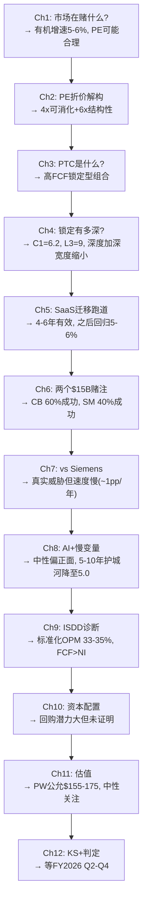

# PTC v2.0 叙事线路图 (Narrative Roadmap)
# Session 0产出 | 2026-03-20
# 核心问题: PTC是被合理定价的现金牛，还是被误定价的转型资产?

---

## 一、叙事设计原则

1. **侦探式叙事**: 不预设结论，从市场定价出发，逐层检验假设
2. **每章一个独立判定**: 章末必须有明确结论(不留"待观察")
3. **前章→后章因果链**: 每章的结论是下一章的前提
4. **3层证据标准**: 每个核心论点=数据+逻辑+反面

---

## 二、Phase 1结构 (12章, 目标100-120K, 单文件)

### 叙事主线

```
市场在赌什么? → 业务是什么? → 锁定有多深? → 增长从哪来? → 威胁是什么? → 钱赚得真不真?
     Ch1-2          Ch3-4         Ch5-6          Ch7-8         Ch9-10        Ch11-12
```

---

### Part 0: 市场信念检验 (Ch1-2, 目标20K)

**Ch1: 市场在$150定价什么 — Reverse DCF + 有机增速隔离** (目标10K)
- question: "市场隐含的增长/利润/终端假设是什么？这些假设合理吗？"
- data: 股价$150.67, EV $19.1B, FCF $857M, ARR $2.45B(CC+9%), GAAP Rev+19.2%
- argument:
  1. Reverse DCF反推隐含FCF CAGR → 4.5-5.5%
  2. 有机增速隔离: GAAP 19.2%剥离SaaS提价(3-4pp)+收购(2-3pp)+ASC606(4-5pp) → **纯有机仅5-6%**
  3. 市场隐含WACC ~10.5% → 可能高估了风险(PTC有95%经常性收入)
- counter: 纯有机5-6%与TAM增速一致→市场可能没有低估，而是正确定价
- conclusion: **市场定价方向基本合理但可能略偏保守** → 约束P1叙事为"中性"
- feeds_into: Ch2(与ADSK对标验证这个"基本合理"判断)
- hard_dm_target: ≥8 (FMP financial data)

**Ch2: PE折价解构 — 与ADSK/CDNS/DASTY的差距从哪来** (目标10K)
- question: "PTC 18x vs ADSK 28x的10x差距是结构性的还是暂时的？"
- data: 4家可比公司的PE/增速/OPM/FCF/R&D/市场地位矩阵
- argument:
  1. 10x差距的4因素分解(增速4x+地位2.5x+战略2x+R&D 1.5x)
  2. 其中~4x可消化(战略清晰度+部分增速差), ~6x结构性(市场地位+TAM)
  3. DASTY 32x作为"同类PLM公司参考"→PTC如果验证平台协同可向25-28x靠拢
- counter: CDNS 45x来自EDA寡占→PTC永远不可能; 工业软件有行业系统性折价
- conclusion: **PE 20-23x是可触及的合理区间** (前提: ARR加速+战略折价消化)
- feeds_into: Ch3(验证PTC的业务现实是否支持PE重估)
- hard_dm_target: ≥8 (FMP comparative data)

---

### Part I: 业务现实 (Ch3-6, 目标40K)

**Ch3: PTC是什么 — 身份定义与产品矩阵** (目标10K)
- question: "PTC的经济实质是什么？7个产品是平台还是组合？"
- data: CAD ARR $961M(39%), PLM ARR $1,533M(61%), 产品列表+收购价
- argument:
  1. 5种身份定义→5种估值: 最准确的是"高FCF工程锁定"(定义4, 70%权重)
  2. 7产品判定: Windchill(引擎)+Creo(现金牛)+Codebeamer(增长赌注)+ServiceMax(待观察)+Onshape(期权)
  3. CQ1组合vs平台: 跨产品证据仅个案级别→判定"组合"(5.8 vs 4.5)
  4. 飞轮悖论风险低(2/10)→与CRM(8/10)形成对比
- counter: 管理层GTM重组为行业垂直→真金白银赌协同→可能低估平台进展
- conclusion: **PTC="高FCF锁定型工业软件组合"** → 估值用FCF框架而非平台溢价
- feeds_into: Ch4(验证"锁定"有多深)
- hard_dm_target: ≥6 (10-K product revenue, ABI rankings)

**Ch4: 客户锁定深度 — 切换成本量化+C1五层嵌入** (目标10K)
- question: "PTC的客户锁定到底有多深？$12B锁定价值可信吗？"
- data: 4万客户, 平均ARR $60K, 航空/国防/医疗/汽车行业分布
- argument:
  1. 切换成本量化: 4万客户×5年ARR = $12B总锁定 → 占市值67%
  2. C1五层分层: L1监管(4.6/10)+L2合同(6)+L3数据(**9**)+L4标准(4)+L5偏好(7) → 加权6.2/10
  3. 定价权剪刀差: Tier1(Stage4/强)+Tier2(Stage3/中)+Tier3(Stage2/弱)
  4. 部署摩擦双面性: 护城河($12B) >> 天花板($3-5B) → 净正面
  5. 60-70%收入来自抗周期行业(航空国防+医疗)→下行保护
- counter: 护城河"宽度缩小"(Siemens在新项目蚕食~1pp/年)+L4标准层正在向Siemens迁移
- conclusion: **锁定极深(L3=9/10)但正在"深度加深+宽度缩小"的双向运动**
- feeds_into: Ch5(锁定深但增长从哪来？)
- hard_dm_target: ≥8 (10-K customer data, industry reports)

**Ch5: SaaS迁移提价 — 隐藏增长引擎的跑道有多长** (目标10K)
- question: "SaaS迁移提价1.5-2.5x能持续多久？跑完后增速会降到多少？"
- data: Windchill+/Creo+定价阶梯, SaaS渗透率推断, NRR间接推算
- argument:
  1. 三层云化经济学: 本地订阅→云托管(Windchill+)→云原生(Onshape)
  2. Creo定价阶梯: 永久维护$4-6K→订阅$8-10K→云混合$12-15K(3-4x路径)
  3. 迁移渗透率估算: 目前约15-25%→剩余75-85%→**至少4-6年跑道**
  4. NRR隔离: 含SaaS迁移NRR 100-110% → **排除迁移后NRR仅97-98%**(底层微收缩)
  5. "增长接力赛"风险: Windchill迁移完成(~FY2030)前Codebeamer必须接棒
- counter: 后期迁移者(大型F500)对提价更敏感→迁移速度可能放缓; Teamcenter X(云原生)是竞争替代
- conclusion: **SaaS提价是真实引擎(3-5年有效),但跑道有尽头→长期增速回归5-6%有机**
- feeds_into: Ch6(Codebeamer能否接棒？)
- hard_dm_target: ≥6 (earnings call pricing data, management commentary)

**Ch6: Codebeamer+ServiceMax — 两个$15亿赌注的命运** (目标10K)
- question: "Codebeamer和ServiceMax这两笔大收购会成功还是失败？"
- data: Codebeamer $15亿, ServiceMax $14.6亿, IoT剥离$6亿(失败先例)
- argument:
  1. **Codebeamer**: FICO式制度嵌入正在形成(ISO 26262/FDA)+SDV顺风+最大订单创纪录→回报期基准9年→**成功概率60-65%**
  2. **ServiceMax**: churn信号+Salesforce平台压力+FSM碎片化市场→**IoT 2.0风险类比**→管理层"not out of the woods"→成功概率**40-45%**
  3. IoT剥离作为历史教训: $1.5B投入→$0.6B卖出→$0.8B+战略损失
  4. 如果ServiceMax也失败: 两次大收购失败→管理层信任严重受损→PE可能降至15-16x
- counter: ServiceMax churn可能集中在非Windchill客户(反而支持平台协同); FSM市场仍在增长
- conclusion: **Codebeamer是合理赌注(SDV确定性高), ServiceMax是最大不确定性(需2-3季度确认)**
- feeds_into: Ch7(竞争环境中这些赌注的胜算)
- hard_dm_target: ≥8 (acquisition prices, churn commentary, SDV market data)

---

### Part II: 竞争与威胁 (Ch7-8, 目标20K)

**Ch7: PTC vs Siemens — 工业软件的终极对决** (目标10K)
- question: "Siemens的全栈优势会让PTC逐渐边缘化吗？"
- data: ABI PLM排名, Siemens $160B vs PTC $18B, 产品覆盖矩阵, R&D投入对比
- argument:
  1. 五赛道竞争定位: PTC仅PLM #2→其余#3-5→不是任何市场的垄断者
  2. Siemens全栈(PLM+MES+IoT+自动化) vs PTC(PLM+ALM+SLM)→IoT剥离扩大了差距
  3. 但PTC在离散制造(航空/医疗)的嵌入仍深→存量安全
  4. 新项目竞争: Siemens每年可能蚕食~1pp PLM份额→5年后PTC从9%→6-7%
  5. R&D差距: PTC 16.7% vs Siemens >25%→长期功能差距可能扩大
- counter: PTC的"开放生态"策略(不锁定全栈)可能吸引不想被Siemens绑定的客户
- conclusion: **Siemens是真实威胁但速度缓慢(~1pp/年)→5年内不致命但10年是存亡问题**
- feeds_into: Ch8(AI是否能改变竞争格局？)
- hard_dm_target: ≥6 (ABI reports, Siemens financials, R&D comparison)

**Ch8: 工业AI + 慢变量 — 3-10年的变化力量** (目标10K)
- question: "AI和其他慢变量会加强还是削弱PTC的护城河？"
- data: AI产品线(Creo GDX/Windchill AI/Codebeamer AI), 4个慢变量评估
- argument:
  1. 工业AI ≠ 通用AI: 竞争优势来自数据访问权→PTC的20年BOM数据是黄金矿藏
  2. AI的防守价值>进攻价值: 不做AI的损失(被Siemens超越)>做AI的收益(提价1-2pp)
  3. AI NPV估算: $150-300M(仅占市值1-2%)→**AI不会改变PTC的身份定义**
  4. 4个慢变量: PLM标准化(6/10,15年)+工程师代际(5/10,10年)+Onshape蚕食(4/10,5年)+AI降复杂度(3/10,7年)
  5. CEO沉默域分析: 5个沉默域均指向"运营优化>创新冒险"
- counter: 如果AI让PLM实施从24个月→3个月→部署摩擦护城河被削弱→颠覆性风险
- conclusion: **AI是中性偏正面(短期防守+长期不确定); 慢变量5-10年累积可能将护城河从6.2降至5.0-5.5**
- feeds_into: Ch9(综合以上，盈利能力的真实面貌是什么？)
- hard_dm_target: ≥5 (AI product launches, industry reports)

---

### Part III: 财务诚实检验 (Ch9-12, 目标30K)

**Ch9: ISDD利润表诊断 — OPM 36%的含金量** (目标10K)
- question: "OPM从14%到36%是结构性的还是含水分？"
- data: 6年P&L, 8季度P&L, 费用逐项分析
- argument: **完整ISDD β路径执行**(S0-S8)
  1. S0: 收入质量=中(价格驱动3:1, GAAP失真)
  2. S1β+S3: OPM+1,030bps中~50%来自Q4稀释(不可持续)→标准化OPM 33-35%
  3. S2: 盈利质量=高(GAAP vs归一化仅3.6%)
  4. S5: 核心引擎=PLM(65-70%利润), Codebeamer=放大器, ServiceMax=摆动因子
  5. S7: EPS增长88%经营贡献(高质量), 回购净效果仅0.4%
  6. S8: FCF/NI=117%(现金超利润→高度可信)
  7. 额外规则1: 应计膨胀指标-2.0%(盈利保守)
- counter: 如果IoT剥离后收入基数降→OPM可能短期波动
- conclusion: **盈利能力真实改善但标准化OPM 33-35%(非报告36%)→FCF>NI是最强质量信号**
- feeds_into: Ch10(这个现金怎么分配？)
- hard_dm_target: ≥15 (all P&L line items from FMP)
- python_required: EPS四因素分解, 经营杠杆倍数

**Ch10: 资本配置 — 从M&A到回购的战略转向** (目标7K)
- question: "PTC未来的FCF会怎么分配？回购能成为有效的EPS引擎吗？"
- data: 6年资本配置历史, SBC/回购对冲, 债务偿还轨迹
- argument:
  1. FY2020-2023: M&A扩张期(累计$2.3B收购+$1.1B加杠杆)
  2. FY2025: 转向期(去杠杆$553M+回购$300M→净回购仅0.4%因SBC抵消)
  3. FY2026+: 如果80% FCF→回购(~$680M/年)→净缩减2.5-3%/年→EPS增长12-13%(8%ARR+4%回购)
  4. 管理层激励: STI=ARR+FCF, LTI=TSR→与回购策略一致
- counter: 管理层可能重新启动M&A(收购比回购更刺激)→回购不一定持续
- conclusion: **回购潜力大但尚未证明(FY2025净效果仅0.4%)→FY2026是验证年**
- feeds_into: Ch11(综合估值)
- hard_dm_target: ≥8 (cashflow data, buyback/SBC details)

**Ch11: 综合估值框架 — Reverse DCF + SOTP + 可比 + 情景** (目标8K)
- question: "PTC的合理价值区间是多少？"
- data: 所有前序章节的结论
- argument:
  1. Reverse DCF: $155-195(取决于WACC/增速假设)
  2. SOTP: Windchill×PE + Creo×PE + Codebeamer期权 + ServiceMax(打折或剥离)
  3. 可比: PE 20-24x × EPS $6.20 = $124-149 | FCF 20-24x × FCF/share $7.14 = $143-171
  4. 5情景概率加权: 熊($110-130) / 偏熊($130-150) / 基准($150-170) / 偏牛($170-200) / 牛($200-230)
  5. 方法间离散度检验: 如果>30%→需要解释为什么
- counter: 各方法的假设敏感性不同→敏感性矩阵
- conclusion: **概率加权公允价值$155-175 → 当前$150.67处于合理区间低端 → 中性关注**
- feeds_into: Ch12
- hard_dm_target: ≥10
- python_required: DCF模型, SOTP, 敏感性矩阵, 概率加权

**Ch12: 追踪清单 + 判定总结** (目标5K)
- question: "投资者应该追踪什么？什么条件下改变判定？"
- data: 所有CQ闭环
- argument:
  1. CQ0-CQ8闭环总结表
  2. 5个关键KS(Key Signals): ARR增速/ServiceMax churn/Windchill+渗透/Codebeamer订单/回购执行
  3. 击穿条件: ARR<6% + ServiceMax churn扩大 → 评级降至审慎; ARR>11% + ServiceMax逆转 → 评级升至关注
  4. 护城河数据卡(Moat Data Card)YAML产出
- conclusion: **中性关注(偏积极)→等待FY2026 Q2-Q4数据确认方向**
- hard_dm_target: ≥3

---

## 三、章节因果链图



---

## 四、质量目标 (v2.0)

### 表面质量
| 指标 | 目标 | 门控 |
|------|------|------|
| 字符 | 100-120K | ≥100K |
| DM总数 | ≥120 | ≥100 |
| **硬DM比率** | **≥60%** | ≥50% |
| Mermaid | ≥20 | ≥15 |
| 因果密度 | ≥8.0/万字 | ≥5.0 |

### 深层质量 (v2新增)
| 指标 | 量化方法 | 目标 |
|------|---------|------|
| **章节独立度** | 每章有独立结论且不重复 | 12/12 (100%) |
| **证据链深度** | 核心论点中3层完整的占比 | ≥70% |
| **叙事一致性** | Ch1 Reverse DCF方向 vs Ch11估值方向偏差 | ≤1档 |
| **前后因果链** | 有明确前章引用的章节占比 | ≥80% (≥10/12章) |
| **文件连贯度** | Phase 1 = 1个文件, 零碎片 | 1.0 |
| **硬DM比率** | 硬数据DM / 总DM | ≥60% |

### Python验证清单
| 计算 | 章节 | 状态 |
|------|------|------|
| Reverse DCF(多WACC/多增速) | Ch1 | 待做 |
| EPS四因素分解 | Ch9 | 待做 |
| 经营杠杆倍数 | Ch9 | 待做 |
| DCF模型(10年) | Ch11 | 待做 |
| SOTP | Ch11 | 待做 |
| 敏感性矩阵(3D) | Ch11 | 待做 |
| 概率加权EV | Ch11 | 待做 |

---

## 五、写作规则 (执行纪律)

1. **逐章完成制**: Ch1写到≥8K + 自检PASS → 才进Ch2。不存在"先写骨架再扩写"
2. **自检标准(每章)**: 硬DM≥5 + 因果推理≥3处 + 反面考量≥1 + 字符≥目标80%
3. **零ext文件**: Phase 1产出=`phase1_v2.md`单文件。需要修改用Edit不用Write新文件
4. **数据先行**: 写每章前先查chapter_data_inventory确认数据就位。缺数据→先补数据再写
5. **估算诚实标注**: 如果一个数字是估算→在DM标注中写"[估算, 基于...]"→不伪装成硬数据

---

## 六、v1→v2保留的分析资产

| v1发现 | 保留? | 改进 |
|--------|:-----:|------|
| 有机增速5-6%隔离 | ✅ | 整合入Ch1(不单独成章) |
| 5种身份定义框架 | ✅ | 精简入Ch3(不占独立章) |
| 部署摩擦$12B量化 | ✅ | 整合入Ch4 |
| C1五层嵌入 | ✅ | 整合入Ch4 |
| PE折价4因素分解 | ✅ | 保留在Ch2 |
| CEO沉默域5项 | ✅ | 精简入Ch8(不独立成章) |
| 产品矩阵(7产品判定) | ✅ | 精简入Ch3(表格化, 不逐产品独立章) |
| 飞轮悖论检测 | ✅ | 精简入Ch3 |
| ISDD 8步诊断 | ✅ | 完整保留在Ch9 |
| 增长接力赛交接缺口 | ✅ | 整合入Ch5 |
| ServiceMax IoT 2.0类比 | ✅ | 整合入Ch6 |
| A-Score评分 | ⚠️ | 简化入Ch4(不独立成章) |
| Creo/Windchill/Onshape单独深拆 | ❌ | **删除** — 改为Ch3表格+Ch5/6重点深拆 |
| Arena/Servigistics深拆 | ❌ | **删除** — 体量太小不配独立分析 |
| Ch15-19前置(竞争/AI/管理层) | ❌ | **重组** — 分散到Ch7/Ch8/Ch10 |
