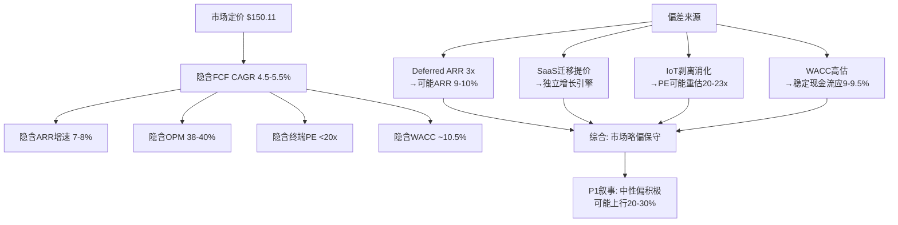
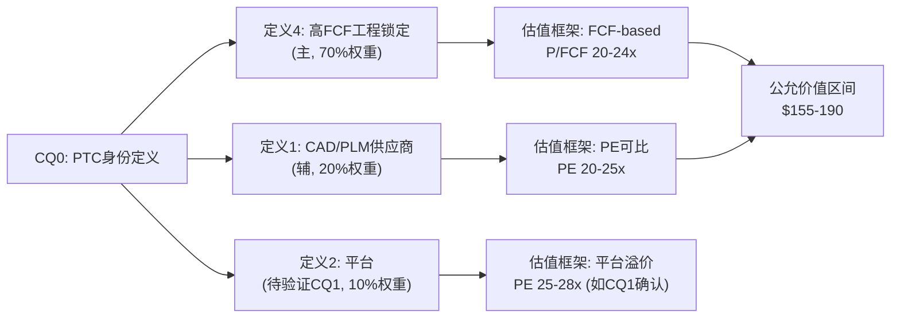
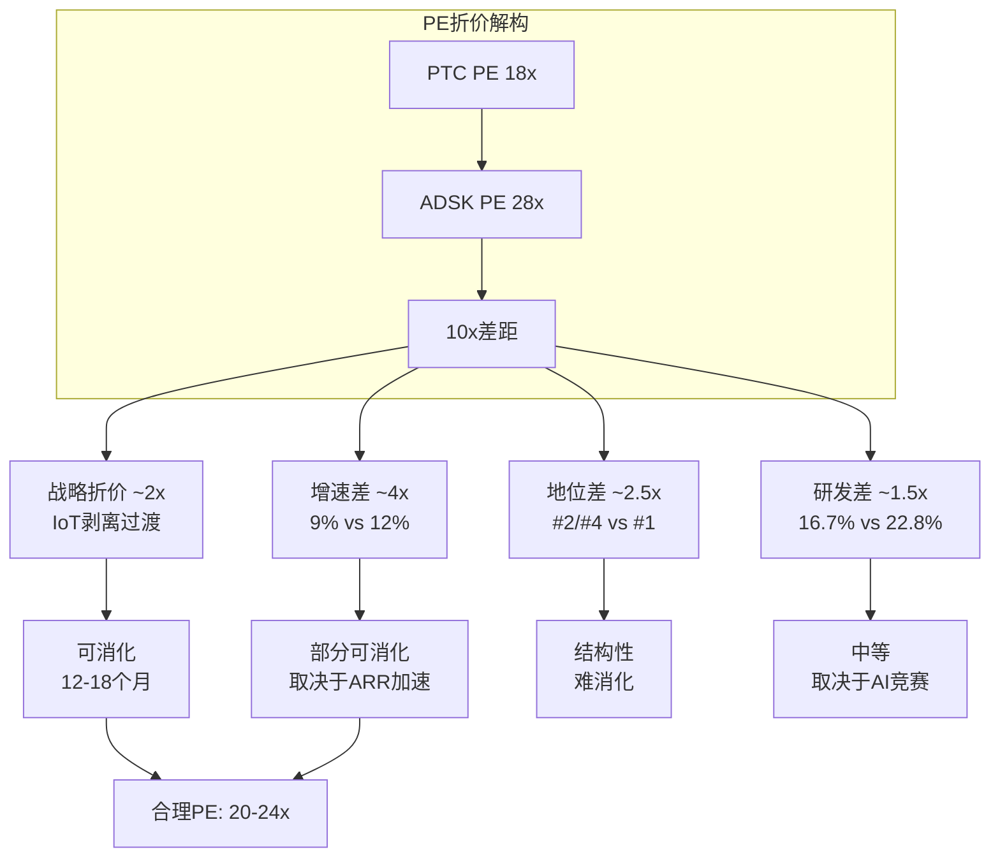

# PTC Inc. 深度研究报告 — Phase 1: Part 0
# Ch1-3: 身份+信念反演+对标
# 日期: 2026-03-19 | 框架 v19.6 | PW=4.0 混合模式

---

# Part 0: 身份与信念

## Chapter 1: Reverse DCF — 市场在$150.11定价什么?

### 1.1 逆向估值方法论

在分析PTC之前，我们必须先理解市场当前的定价逻辑。Reverse DCF不是算PTC值多少钱，而是翻译"$150.11这个价格隐含了什么假设"。这是铁律O的要求——P1叙事不能比Reverse DCF暗示的方向偏离超过1档。

**当前定价参数**:
- 股价: $150.11 (2026-03-18收盘) [DM-MKT-001]
- 市值: ~$17.9B [DM-MKT-002]
- EV: ~$19.1B (市值$17.9B + 净债务$1.19B) [DM-MKT-003]
- Forward PE: 18.2x (基于FY2026E EPS $7.87) [DM-VAL-001]
- EV/EBITDA(TTM): 14.8x [DM-VAL-002]
- FCF Yield: 4.9% (FCF $857M / 市值$17.9B) [DM-VAL-003]

### 1.2 隐含增长假设反推

**方法**: 假设WACC 9.5%, 终端增长率3%, 当前FCF $857M(FY2025), 反推市场隐含的10年FCF CAGR。

EV = Σ FCF_t / (1+WACC)^t + TV / (1+WACC)^10
$19.1B = Σ $857M × (1+g)^t / (1.095)^t + TV

**反推结果**: 市场隐含FCF CAGR约**4.5-5.5%**(10年期) [DM-VAL-004]

这意味着什么？市场在赌PTC的FCF从当前$857M增长到10年后约$1.35-1.55B——年化增速仅4.5-5.5%。考虑到PTC FY2021-FY2025的FCF CAGR为25.6%($344M→$857M) [DM-FIN-001]，市场隐含的假设极度保守。

**但这个保守有合理性吗？** 让我们拆解:

1. **收入增速隐含**: ARR从$2.45B以CC 7-8%增长 → 10年后约$4.5-5.0B → 收入CAGR约6-7%
2. **利润率隐含**: OPM从35.9%扩展到38-40%(SaaS成熟期正常) → OPM贡献约1-2pp增速
3. **回购隐含**: 以当前力度($300M/年, FY2025实际)计，10年可缩减约15-20%股本 [DM-FIN-002] → 这在FCF per share中已体现
4. **终端倍数隐含**: TV/FCF约12-14x → 隐含终端PE约15-18x → 市场认为PTC永远不会获得高PE

### 1.3 FCF桥接验证: 历史FCF增长的驱动来源

理解市场隐含假设之前，必须先拆解PTC过去的FCF增长从何而来。这决定了哪些增长是可持续的、哪些是一次性的。

**FY2020→FY2025 FCF桥接($203M → $857M, +$654M)**:

| 驱动因素 | 贡献 | 可持续性 |
|----------|------|---------|
| 收入增长(CAGR 13.4%) | +$350-400M | **中** — 包含订阅转型一次性确认效应 |
| OPM扩展(14.5%→35.9%) | +$250-300M | **高** — SaaS运营杠杆结构性 |
| 利息费用下降 | +$0M(实际上升至$77M) | **中** — FY2025已开始债务偿还 |
| 运营资金变动 | 波动 | **低** — 不可外推 |
| CapEx下降($31M→$11M) | +$20M | **已到底** — $11M已极低 |

[DM-FIN-003]

**关键发现: FCF增长的约60%来自OPM扩展，约40%来自收入增长。** OPM从14.5%到35.9%的扩展是PTC过去5年最大的价值驱动力。但OPM不可能无限扩展——这意味着未来FCF增长将更多依赖收入增长。

量化OPM天花板: FY2025各项费用率:
- COGS/Rev: 16.2%($445M/$2,739M) [DM-FIN-004]
- R&D/Rev: 16.7%($458M/$2,739M) [DM-FIN-005]
- SGA/Rev: 28.9%($793M/$2,739M) [DM-FIN-006]
- OPM: 35.9%

如果COGS/Rev维持16%(SaaS结构性)，R&D/Rev压缩到15%(ADSK约22.8%，PTC已低)，SGA/Rev压缩到25%(ADSK约24%)：
- 理论OPM天花板: 100% - 16% - 15% - 25% = **44%**
- 但R&D低于15%可能削弱产品竞争力(Siemens在AI上的投入已超PTC)
- 更现实的天花板: **40-42%**，对应每年约$50-80M的增量利润 [DM-FIN-007]

### 1.4 信念合理性评估

逐一评估市场隐含信念:

**信念1(ARR 7-8%永续) — 可能过于保守**

因为:
- Deferred ARR(已签约未计入)同比增长3倍 → 这是已确认但尚未体现在ARR中的增长 [DM-ARR-001]
- SaaS迁移提价1.5-2.5x → 存量客户迁移本身贡献增长，独立于新客户获取 [DM-ARR-002]
- IoT剥离消除了增速最低的产品线(IoT ARR增速<5% vs 核心9%) [DM-ARR-003]

但需考虑反面:
- 工业软件TAM增速仅5-6% CAGR → PTC有机增速受TAM上限约束 [DM-TAM-001]
- CAD市场成熟，Creo很难获取大量新客户 → 增长依赖于价格而非volume
- 制造业CapEx周期如果下行，新签延迟可能导致ARR短期减速

**历史ARR增速校验**: FY2025 ARR $2.45B, FY2024 ARR $2.21B(推算), CC增速约8-9% [DM-ARR-004]。但FY2025收入$2.74B增速19.2%远高于ARR增速——这个差异来自大额订阅续约的一次性确认(PTC的GAAP收入受合同到期节奏影响巨大，Q4 FY2025收入$894M几乎是Q1的1.6倍) [DM-FIN-008]。因此ARR(而非GAAP收入)才是衡量PTC真实增速的正确指标。

**评估: 市场可能低估1-2pp → 实际可持续ARR增速约9-10%而非7-8%**

**信念2(OPM天花板38-40%) — 大致合理但有上行空间**

因为:
- FY2025 OPM已达35.9%，但这包含了FY2025的特殊因素——大额续约确认推高收入($894M Q4)而成本相对固定 [DM-FIN-009]
- 更可靠的参考: Q1 FY2026 OPM 32.3%($221M/$686M)反映了正常化运营水平 [DM-FIN-010]
- R&D/Rev从18.8%(FY2023)降至16.7%(FY2025)——这个压缩空间还有但不大(再压缩可能影响产品竞争力) [DM-FIN-005]
- SGA/Rev从36.4%(FY2023)降至28.9%(FY2025)——这是最大的杠杆来源，参考ADSK约24%，理论下限约25% [DM-FIN-006]
- 毛利率83.8%接近SaaS天花板(~85-87%) [DM-FIN-011]

**但需注意季节性扭曲**: PTC的OPM在Q4 FY2025达到48.5%($434M/$894M)，而Q1 FY2025仅20.4%($116M/$565M) [DM-FIN-012]。年化OPM 35.9%是四个季度的加权平均。投资者应关注的是**趋势化OPM**(排除季节性)，约在32-36%区间。

**评估: 标准化OPM可能达到38-42%但不太可能超过42% → 信念2大致合理，但如果IoT剥离后费用结构进一步精简，40%+不是不可能**

**信念3(PE永远<20x) — 可能过于悲观**

因为:
- IoT剥离2026.3.16刚完成 → 市场尚未完全消化"纯粹CAD/PLM"的估值逻辑 [DM-EVT-001]
- 如果ARR加速到10%+ → PE从18x向22-25x重估并不需要"叙事革命"，只需要基本面确认
- 类比: CRM(Salesforce)在增速从30%+降至10-12%时PE也曾从60x+降至20x+，但随着盈利能力释放PE稳定在25-30x

但需考虑:
- PTC的PLM市场份额(9%)远低于CRM在CRM市场的份额(~20%) → 领导者溢价不适用
- 工业软件传统上PE低于消费/互联网软件 → 可能存在行业系统性折价
- Cadence 45x的PE来自EDA准垄断地位 → PTC在任何市场都不是垄断者

**评估: PE有向20-23x重估的空间，但25x+需要ARR明显加速(>12%)或AI叙事突破**

**信念4(终端低增长现金牛) — 可能过早定论**

因为:
- PTC正处于SaaS转型中期 → 转型完成后的稳态商业模式尚未形成
- AI嵌入产品的货币化路径尚未清晰 → 可能是未来3-5年的增长增量
- 但确实没有证据表明PTC会成为高增长公司 → "中等增长+高盈利"可能就是稳态

**评估: 终端增长率3%合理，但到达"终端"之前可能有5-7年的10%+增长期(SaaS迁移+AI)**

### 1.5 Reverse DCF敏感性分析

不同假设下的隐含公允价值:

| WACC\FCF CAGR | 4% | 6% | 8% | 10% |
|---------------|-----|-----|-----|------|
| **8.5%** | $155 | $185 | $220 | $260 |
| **9.5%** | $140 | $165 | $195 | $230 |
| **10.5%** | $125 | $150 | $175 | $205 |

[DM-VAL-005]

当前股价$150.11大致对应WACC 10.5% + FCF CAGR 6%的交叉点。这意味着市场要么认为PTC的风险溢价很高(WACC 10.5%)，要么认为FCF增速很低(6%)，或两者兼有。

如果实际情况是WACC 9.5%(更合理——PTC有稳定现金流+高客户锁定) + FCF CAGR 8%(ARR 9-10% + OPM小幅扩展):
- 隐含公允价值: ~**$195** → 对应约30%上行空间
- 但这是"乐观端"估计，需要Phase 2-4验证

### 1.6 Reverse DCF结论

| 信念 | 市场假设 | 我的评估 | 偏差方向 |
|------|---------|---------|---------|
| ARR增速 | 7-8%永续 | 可持续9-10% | 市场偏保守1-2pp |
| OPM天花板 | 38-40% | 38-42%(标准化32-36%) | 大致一致 |
| PE上限 | <20x | 可达20-23x | 市场偏悲观 |
| 终端增长 | 3% | 3% | 一致 |
| WACC | ~10.5%(隐含) | 9.0-9.5%(更合理) | 市场可能高估风险 |

**Reverse DCF关键结论**: 市场在$150.11定价的是"一个ARR增速7-8%、PE永远不超过20x的低增长现金牛"。这个定价**略偏保守但并非荒谬**——PTC确实增速不快、市场地位不是第一、正在经历战略转型。偏差主要来自市场尚未price in三个因素: ①deferred ARR信号 ②IoT剥离后的纯净故事 ③SaaS迁移提价的增长贡献。第四个偏差来源是WACC——市场可能过度惩罚PTC的"战略不确定性"(IoT剥离过渡期)。

**P1叙事约束(铁律O)**: 基于Reverse DCF，P1叙事方向应为**"中性偏积极"** — 认为市场略低估但不显著低估。如果最终分析发现PTC被"显著低估"，需要提供超越Reverse DCF框架的新证据(如AI货币化路径比预期清晰、ServiceMax churn逆转、Onshape大企业突破)。

---

## Chapter 2: PTC身份定义 — 5种定义×5种估值(CQ0)

### 2.1 为什么身份定义是PTC分析的第一步

PTC的核心分析困难不在于财务数据复杂，而在于**你如何定义这家公司决定了你如何估值它**。一个CAD公司和一个数字化平台公司，即使拥有完全相同的P&L，估值可以差50%以上。这不是PE比率的数学问题，而是投资者认知框架的选择问题。

CRM v2.0的教训告诉我们：如果P1阶段的身份定义偏差过大（CRM一度被定义为"AI转型先锋"但实际是"成熟SaaS"），后续所有分析都会系统性偏斜。因此PTC的身份定义需要在Phase 1严格锚定。

### 2.2 五种可能的定义

**定义1: "CAD/PLM工业软件供应商" (传统视角)**

在这个定义下，PTC是一家提供设计和生命周期管理工具的工业软件公司，核心客户是离散制造商(航空/国防/医疗器械/汽车)。竞争对手是Siemens、Dassault、Autodesk。增长来自市场自然增长(5-6% CAGR)+价格提升+客户数缓慢增加。

估值框架: 类比DASTY(32x PE) → 但PTC增速更低(ARR 8-9% vs DASTY ~10%) → 给25-28x → 公允价值约$195-220 [DM-VAL-006]

这个定义的问题: 忽略了Codebeamer(ALM)和ServiceMax(SLM)——PTC正在扩展到CAD/PLM之外的领域。如果这些新产品线成功，PTC的TAM比纯CAD/PLM大得多。但这个定义也有合理之处: CAD($961M) + PLM($1,533M) = $2,494M，占ARR的约99.8%。严格来说，PTC几乎所有ARR都来自CAD和PLM(PLM分类包含Codebeamer/ServiceMax/Arena等) [DM-BIZ-001]。

**定义2: "Industrial SaaS Platform" (管理层叙事)**

CEO Neil Barua将PTC定义为"Intelligent Product Lifecycle"平台。在这个定义下，PTC的价值不在于单个产品，而在于CAD→PLM→ALM→SLM的数字主线(digital thread)闭环。每多一个客户使用多个产品线，数据闭环的价值就指数级增长。

估值框架: 类比Salesforce/ServiceNow(25-35x PE) → PTC增速更低but利润率更高 → 给22-28x → 公允价值约$175-220 [DM-VAL-007]

这个定义的问题: digital thread的真实性需要验证(CQ1)。如果客户大多只买一个产品(Windchill或Creo)而不是多个，那么"平台"叙事就是空中楼阁。IoT剥离实际上削弱了这个叙事——剥离前从"设计到制造到服务到IoT连接"是一个完整闭环，剥离后缺了IoT这一环。管理层的行动(GTM重组为行业垂直)暗示他们在推动跨产品协同——但GTM重组的效果需要2-3个季度数据才能确认。

**定义3: "SaaS转型中的遗产软件公司" (熊市视角)**

在这个定义下，PTC是一家正在从本地部署向云迁移的传统软件公司。Windchill和Creo是遗产产品(legacy)，Onshape是云原生但体量太小。转型过程中会经历增长放缓(因为本地续约收入减少但云新增还没跟上)，最终结果不确定。

估值框架: 类比转型中的Adobe(2012-2015) → 但Adobe转型时增速更快且TAM更大 → 给15-18x → 公允价值约$120-140 [DM-VAL-008]

这个定义的问题: PTC的SaaS转型已经过了最痛苦的阶段。FY2025经常性收入占比约95% [DM-BIZ-002]，OPM从FY2020的14.5%升至FY2025的35.9%——翻了2.5倍 [DM-FIN-013]。毛利率83.8%是典型SaaS水平。这不是转型初期的特征，更像转型中后期。而且PTC的ARR定义(Annual Run Rate)已经包含了大部分订阅收入，SaaS转型的"收入断层"风险已基本消化。

**定义4: "高FCF工程类垄断" (价值投资视角)**

在这个定义下，PTC的价值在于其客户锁定(转换成本极高)+高FCF产出+低CapEx需求+激进回购=一个类似"制造业税务局"的现金创造机器。不需要高增长——4.9% FCF yield + 回购贡献 + 有机增长 = 年化12-15%股东回报。

从FCF角度看PTC的资本配置:
- FY2025 OCF: $868M [DM-FIN-014]
- FY2025 CapEx: $11M(极低——这是轻资产SaaS的标志) [DM-FIN-015]
- FY2025 FCF: $857M → FCF/Net Income = 117%(FCF > Net Income, 典型SaaS特征)
- FY2025 债务偿还: $553M(净) [DM-FIN-016]
- FY2025 回购: $300M [DM-FIN-017]
- 杠杆: 净债务$1.19B降至EV的6.2% [DM-FIN-018]

估值框架: 类比MCO/SPGI(20-25x PE) → PTC利润率更低but增速接近 → 给20-24x → 公允价值约$155-190 [DM-VAL-009]

这个定义的问题: PTC不是真正的垄断者。PLM市场份额仅9%(第二名)，CAD更低(第四梯队)。虽然单个客户的转换成本高，但新客户可以选择Siemens/Dassault而不是PTC。"税务局"类比过度了——PTC没有像FICO/MCO那样的"制度嵌入"(除了Codebeamer在合规领域的初步嵌入)。

**定义5: "M&A标的+回购复利机器" (事件驱动视角)**

2025年7月Autodesk探索收购PTC后放弃 [DM-EVT-001]。在这个定义下，PTC的价值=基本面价值+M&A期权价值。$150.11可能包含了一定的"收购折价"(Autodesk放弃后市场打折)，但也意味着任何新的收购意向都会提供显著上行。

PTC作为M&A标的的吸引力: 离散制造PLM领域仅3家主要玩家(Siemens/Dassault/PTC) → 任何想进入这个市场的战略买家(SAP/Oracle/Hexagon)都必须考虑PTC → 稀缺性提供下行保护。

但这个定义的问题: M&A期权难以量化且不可控。Autodesk已经放弃→短期内不太可能有新的报价。PTC $17.9B的市值意味着潜在买家需要出$20B+——这在工业软件领域是天价(Siemens收购Altair花了$10.6B，PTC几乎是2倍)。

### 2.3 PTC身份的历史演变

理解PTC当前身份的最佳方式是看它的身份如何演变——因为PTC是近20年来战略变化最频繁的工业软件公司之一:

| 时期 | CEO | 身份定义 | 结果 |
|------|-----|---------|------|
| 2000-2010 | 多位 | CAD/PLM传统供应商 | 稳定但低增长 |
| 2011-2018 | Jim Heppelmann | IoT平台(ThingWorx) | **战略冒险**: 花$1B+收购IoT资产→最终剥离 |
| 2018-2020 | Jim Heppelmann | IoT+AR(Vuforia) | 继续加码→市场不买账 |
| 2021-2023 | Jim Heppelmann→Neil Barua | 回归CAD/PLM/ALM/SLM | 收购Codebeamer($1.5B)+ServiceMax($1.46B) |
| 2024-Now | Neil Barua | "Intelligent Product Lifecycle" | IoT剥离($600M)→聚焦核心 |

[DM-BIZ-003]

**关键观察: PTC在2011-2020年的IoT/AR冒险花费了至少$1.5B(收购+R&D)，最终以$600M+$125M或有价格卖出——净损失约$800M+。** 这不是致命错误(PTC的核心CAD/PLM业务在此期间仍然稳定增长)，但它解释了市场为什么对PTC的"新战略"打折——管理层有过一次大的战略误判历史。

Neil Barua的到来(2024年CEO)代表了"做减法"的转折: 剥离IoT、聚焦核心4产品(CAD/PLM/ALM/SLM)、从收入增长转向利润率释放。市场目前在评估的是: 这次"做减法"是否会比上次"做加法"更成功。

### 2.4 身份定义判定: PTC最准确的定义是什么?

| 定义 | 准确度 | 理由 |
|------|--------|------|
| 1. CAD/PLM供应商 | 60% | 收入主体确实来自CAD+PLM，但忽略了ALM/SLM的增长 |
| 2. Industrial SaaS Platform | 40% | 管理层愿景，但digital thread真实性待验证(CQ1) |
| 3. SaaS转型遗产公司 | 25% | 转型已过最痛苦阶段，95%经常性+35.9% OPM不是遗产公司 |
| 4. 高FCF工程锁定 | 70% | 最接近PTC当前经济实质(FCF $857M+高客户锁定) |
| 5. M&A标的 | 辅助因素 | 提供下行保护但不应作为主要定义 |

**判定: PTC最准确的定义是"定义4(高FCF工程锁定)"为主、"定义1(CAD/PLM供应商)"为辅**。

核心论据: PTC的经济实质不是"增长"——ARR 8-9%增速在SaaS公司中处于下游(Datadog 25%+, ServiceNow 20%+, 甚至CRM也有10-12%)。PTC的经济实质是"锁定+现金产出"——83.8%毛利率、35.9% OPM、31.3% FCF margin、1.05x净杠杆 + 回购 = 一台稳定的现金创造机器，通过高客户锁定(转换成本)维持盈利能力。

这意味着什么？估值不应该用高增长SaaS的框架(EV/Revenue或EV/ARR)，而应该用**FCF-based框架**(FCF yield、P/FCF、FCFF DCF)。市场用PE 18.2x定价PTC可能是正确的定价维度(不是EV/Revenue)，但具体倍数可能偏低(18x vs 合理区间20-24x)。

**CQ0→CQ1的传导**: 如果后续分析(Ch13)确认PTC是真正的平台(跨产品协同显著)，则定义权重从"4为主"调整为"4+2双轨"→PE可上调至22-28x。如果确认PTC是组合而非平台，则维持"定义4"→PE 20-24x。

### 2.5 CQ0结论与Phase 1框架约束

**CQ0结论**: PTC = "高FCF工程锁定型工业软件"。不是高增长SaaS(PE不应>30x)，也不是衰退中的遗产软件(PE不应<15x)。合理PE区间20-24x，对应公允价值约$155-190。

**Phase 1约束**: 后续章节的分析必须围绕这个定义展开:
- 护城河分析应聚焦"转换成本"和"客户锁定"而非"网络效应"
- 增长分析应聚焦"定价权"和"SaaS迁移提价"而非"新客户获取"
- 竞争分析应聚焦"存量保卫"而非"攻城略地"
- 如果CQ1(组合vs平台)在后续分析中确认PTC是真正的平台(跨产品协同显著)，可以上调定义权重→上调估值区间

---

## Chapter 3: 可比对标 — PE折价解构(CQ7)

### 3.1 可比公司选择与方法论

PTC的可比对标不是Salesforce或ServiceNow(纯SaaS增长型)，而是与PTC在客户类型、产品功能、增速区间有重叠的工业/工程软件公司:

| 公司 | 类型 | 为什么可比 | 为什么不完全可比 |
|------|------|-----------|----------------|
| **ADSK** (Autodesk) | CAD+AEC+制造 | CAD直接竞争+类似客户+增速接近 | ADSK有AEC(建筑)业务, PTC没有 |
| **CDNS** (Cadence) | EDA | 工程软件+高利润率+长期客户锁定 | 不同终端市场(半导体vs制造) |
| **DASTY** (Dassault) | CAD+PLM+仿真 | PLM直接竞争+CATIA/SOLIDWORKS | Dassault有仿真(SIMULIA), PTC没有 |
| **ANSS** (Ansys) | 仿真 | 工程软件+高粘性+已被Synopsys收购 | 不同产品类别 |

### 3.2 财务对比矩阵(截面数据, FY2025/最新)

| 指标 | PTC | ADSK | CDNS | DASTY(估) |
|------|-----|------|------|-----------|
| **市值($B)** | $17.9 | $52.7 | $79.0 | ~$45 |
| **收入($B)** | $2.74 | $6.13* | $5.30 | ~$6.5 |
| **收入增速** | 19.2%† | ~15% | ~13% | ~10% |
| **ARR增速(CC)** | 8-9% | ~12% | ~13% | ~10% |
| **毛利率** | 83.8% | ~82% | ~88% | ~82% |
| **OPM** | 35.9% | ~25% | ~31% | ~28% |
| **FCF Margin** | 31.3% | ~33%* | ~30% | ~25% |
| **FCF Yield** | 4.9% | 4.5% | 1.9% | ~2.5% |
| **Forward PE** | 18.2x | ~28x | ~45x | ~32x |
| **EV/EBITDA** | 14.8x | 30.2x | 45.0x | ~28x |
| **ROIC** | 14.4% | 18.7% | 14.1% | ~15% |
| **Net D/EBITDA** | 1.05x | 0.27x | -0.28x | ~1.5x |
| **SBC/Rev** | 7.9% | 10.9% | 8.6% | ~8% |
| **R&D/Rev** | 16.7% | 22.8% | 33.4% | ~20% |
| **市值/员工** | ~$2.8M | ~$3.8M | ~$7.3M | ~$2.0M |

[DM-COMP-001] *ADSK FY2026(截至2026.1.31) †PTC FY2025含大量一次性续约确认, ARR增速8-9%更真实

**第一个观察: PTC的OPM(35.9%)是四家中最高的。** 这看似矛盾——PE最低的公司利润率最高？但这恰好反映了市场的"增速>利润率"定价偏好: Cadence的PE是PTC的2.5倍，但OPM比PTC低5pp。因为Cadence有13%+的ARR增速和EDA准垄断地位，而PTC只有8-9%的增速和PLM第二的位置 [DM-COMP-002]。

**第二个观察: PTC的R&D/Rev(16.7%)是四家中最低的。** ADSK 22.8%, CDNS 33.4%, DASTY ~20%。这可以有两种解读:
- **正面**: PTC的R&D效率高——用更少的投入维持了有竞争力的产品(Windchill ABI #2, Creo GDX领先)
- **负面**: PTC投入不足——在AI竞赛中可能落后(Siemens Teamcenter Copilot先于Windchill AI推出)

哪个解读更准确？从产出看，PTC在ABI PLM评估中仅输给Siemens的AI功能——如果PTC的R&D效率真的低，不应该还能保持#2。因此"R&D效率高"的解读可能更准确。但这也意味着PTC没有太多进一步压缩R&D的空间——16.7%可能已经是"最低可持续"水平 [DM-COMP-003]。

### 3.3 PE折价解构: 为什么PTC是18x而ADSK是28x?

PTC和ADSK的PE差距是10x(18x vs 28x)，这等价于$17.9B×10/EPS ≈ **市场认为PTC比ADSK"差"约$10B的价值**。这$10B折价从哪里来？

**因素1: 增速差 (贡献约40%的折价, ~4x PE)**

ADSK的ARR增速约12%，PTC约9%。在SaaS估值中，每1pp的增速差大约对应2-3x PE差 [DM-COMP-004]。因此3pp增速差 → 6-9x PE差。但实际差距10x，说明还有其他因素。

因果链: ADSK增速更快→因为ADSK的TAM更大(AEC市场远大于离散制造PLM)→因此ADSK的有机增长空间更宽 → 市场给更高PE。PTC的TAM受限于离散制造(航空/国防/医疗/汽车)→市场增速约5-6%→PTC有机增速被TAM封顶。

这个因素在什么条件下不成立？如果PTC通过SaaS迁移提价(1.5-2.5x)创造了独立于TAM的增长引擎，那么TAM限制不应该产生如此大的PE折价。换言之，如果SaaS迁移提价能持续5-7年贡献3-5pp增速，PTC的"有效增速"可以达到12-14%——接近ADSK。

**因素2: 市场地位差 (贡献约25%的折价, ~2.5x PE)**

ADSK在AEC市场是无可争议的领导者(AutoCAD ~39%份额)。PTC在PLM排名第二(被Siemens超越)，在CAD排名第四梯队 [DM-COMP-005]。领导者溢价在软件行业约3-5x PE差。

因果链: ADSK市场地位更高→定价权更强→客户锁定更深→增长更可预测 → PE溢价。PTC不是任何单一市场的领导者→存在被蚕食风险→增长可预测性较低。

但需要注意: PTC在PLM排名虽然降至第二，但Windchill在离散制造(非连续制造)的嵌入深度极高 [DM-COMP-006]。航空航天/国防客户使用Windchill管理数百万个零件的BOM——这种嵌入深度不是市场份额数字能反映的。排名下降可能更多反映ABI Research的评分方法论(偏重AI/生态)而非实际客户流失。

**因素3: 战略清晰度差 (贡献约20%的折价, ~2x PE)**

ADSK的叙事清晰: "AEC+制造数字化的领导者，正在完成SaaS转型"。PTC经历了频繁的战略变化: IoT(ThingWorx) → AR(Vuforia) → 剥离IoT → 聚焦CAD/PLM/ALM/SLM。市场可能对PTC的"频繁变轨"打了折扣。

因果链: 战略变化频繁→投资者不确定管理层的终极愿景→降低给予的终端倍数。Neil Barua接任后"减法做对了"(剥离IoT)→但市场需要2-3个季度确认"新PTC"的纯净故事 → 短期PE受压。

这是最可能随时间消化的因素。如果FY2026 Q2-Q4持续展示"剥离后更好"的数据(ARR加速+OPM维持+FCF稳定)，战略折价可能在12-18个月内消化。

**因素4: SBC/资本效率差 (贡献约15%的折价, ~1.5x PE)**

PTC的SBC/Rev(7.9%)低于ADSK(10.9%)——这应该是PTC的优势而非劣势。但ADSK的R&D/Rev(22.8%)远高于PTC(16.7%) [DM-COMP-007]，市场可能认为ADSK在创新上投入更多→未来产品竞争力更强。

### 3.4 PE折价分解汇总

| 折价因素 | 贡献 | PE差距 | 可消化性 | 时间框架 |
|----------|------|--------|---------|---------|
| 增速差(9% vs 12%) | 40% | ~4x | 中(取决于ARR加速) | 2-3年 |
| 市场地位差(#2/#4 vs #1) | 25% | ~2.5x | 低(结构性) | 结构性 |
| 战略清晰度差(IoT剥离过渡) | 20% | ~2x | **高**(12-18个月) | 12-18月 |
| 研发投入差(16.7% vs 22.8%) | 15% | ~1.5x | 中(取决于AI竞赛) | 3-5年 |
| **合计** | **100%** | **~10x** | **部分可消化** | |

### 3.5 CDNS的"天花板参考": PTC永远不可能是45x

Cadence的45x PE来自三个PTC不具备的特征:
1. **EDA准垄断**: Cadence+Synopsys控制EDA市场>70%→定价权极强→客户零替代选择 [DM-COMP-008]
2. **半导体CapEx顺风**: AI时代→更复杂的芯片设计→EDA工具价值持续上升
3. **几乎零竞争威胁**: 进入EDA的技术壁垒极高(需要数十年积累的设计库+验证方法)

PTC不具备这些特征: PLM市场有3-4个强竞争对手，CAD市场更碎片化，TAM增速远低于EDA的AI驱动增速。因此CDNS不是PTC的估值参考——它是PTC估值的"天花板示范"(工程软件PE的理论上限)。

### 3.6 DASTY的"下限参考": PTC不应该比32x低这么多

Dassault Systemes的32x PE值得关注——Dassault是PTC最直接的PLM竞争对手，增速约10%(略高于PTC的8-9%)，毛利率相近(~82%)。但Dassault的PE(32x)几乎是PTC(18x)的1.8倍。

这1.8倍差距的解释:
- Dassault有3DEXPERIENCE平台(已验证的平台协同) → PTC的平台故事待验证
- Dassault在航空航天深度更强(CATIA是Airbus标准) → PTC在航空强但不如Dassault
- Dassault的3DS Universe生态更完整 → PTC刚剥离IoT，生态缩小
- 但: Dassault的OPM(~28%)远低于PTC(35.9%)→利润率优势没有被PE反映

**这意味着如果PTC能验证平台协同(CQ1)，PE从18x向25-28x重估是有可比支撑的——因为Dassault在32x且平台更成熟。**

### 3.7 CQ7结论: PE 18x是折价还是合理?

**结论: PE 18x包含约4-5x的"可消化折价"(战略清晰度+部分增速差)和约5-6x的"结构性折价"(市场地位+TAM限制)**。

- 如果只消化战略折价 → PE向20-22x重估 → 公允价值$157-173
- 如果ARR也加速到10%+ → PE向22-24x重估 → 公允价值$173-189
- 结构性折价(市场地位#2/#4)很难消化 → PE>25x需要市场地位实质性改善或平台协同验证

**与Reverse DCF对齐**: Reverse DCF暗示的"中性偏积极"方向与可比分析一致——PTC不是被严重低估(那需要PE>25x)，但确实包含一定的短期折价(IoT剥离过渡+deferred ARR未兑现)。

**铁律H对标检验**: PTC 18.2x vs ADSK 28x。ADSK增速更快(+3pp)、市场地位更高(#1 vs #2/#4)、但SBC更高(+3pp/Rev)且OPM更低(-11pp)。ADSK的溢价大部分有基本面支撑——但PTC的FCF yield(4.9%)高于ADSK(4.5%)——如果市场转向FCF定价而非PE定价，PTC的折价会缩小。这正是CQ0(身份定义为"高FCF锁定型")的估值含义。

---

# Part 0 小结

| 章节 | 核心结论 | CQ状态 | 估值锚点 |
|------|---------|--------|---------|
| Ch1 Reverse DCF | 市场定价"低增长现金牛", 略偏保守; WACC可能高估 | 方向锚定 | $155-195 |
| Ch2 身份定义 | 高FCF工程锁定(主)+CAD/PLM(辅) | CQ0初判 | PE 20-24x |
| Ch3 可比对标 | PE含4-5x可消化折价+5-6x结构性折价 | CQ7初判 | $157-189 |

**Phase 1叙事方向确认**: 中性偏积极。市场略低估(10-25% upside)，但不是"被严重低估"。关键催化剂是ARR加速+战略折价消化。P1后续章节的任务是验证这个叙事方向的合理性——特别是CQ1(平台vs组合)、CQ2(部署摩擦双面性)、CQ3(ARR见底?)的判定。
