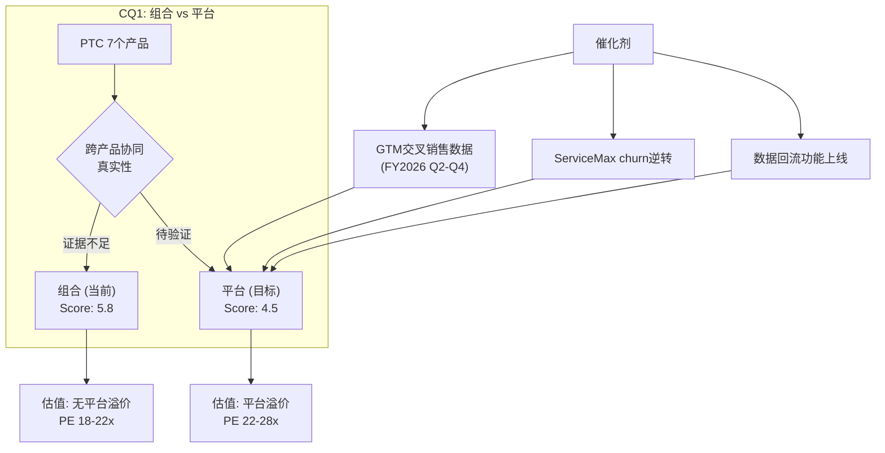
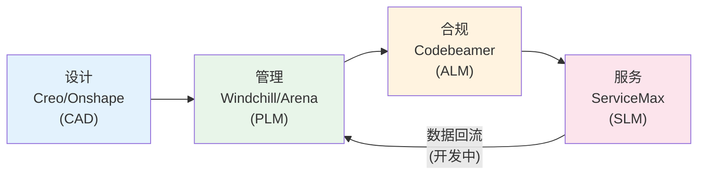
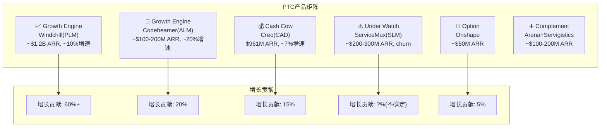

# PTC Inc. 深度研究报告 — Phase 1: Part 2
# Ch7-14: 产品深拆+组合vs平台+飞轮
# 日期: 2026-03-19 | CQ3-4.99/CQ3.5

---

# Part II: 产品深拆

## Chapter 7: Creo — CAD引擎深拆

### 7.1 Creo在PTC中的地位

Creo是PTC最古老的产品线(前身Pro/ENGINEER, 1987年)，也是PTC的"起家之本"。CAD ARR约$961M(Q1 FY2026)，占总ARR约39% [DM-CAD-001]。Creo的重要性不仅在于自身收入贡献——它是客户进入PTC生态的主要入口。很多客户先买Creo做设计，然后发现需要PLM管理设计数据→买Windchill，需要合规管理→买Codebeamer，需要现场服务→买ServiceMax。

因此Creo的健康程度直接影响PTC整个生态的客户获取漏斗。如果Creo的市场份额继续下滑(从~8%到<5%)，PTC的新客户入口会收窄——即使Windchill和Codebeamer很强，没有Creo的初始接触，客户可能一开始就选择了Siemens生态(NX→Teamcenter→Polarion)。

### 7.2 Creo的竞争定位矩阵

| 维度 | Creo | NX (Siemens) | CATIA (Dassault) | Fusion 360 (ADSK) | SOLIDWORKS |
|------|------|-------------|-----------------|-------------------|------------|
| **定位** | 高端离散制造 | 高端全制造 | 高端航空/汽车 | 中低端+SMB | 中端机械 |
| **架构** | 桌面+云混合(Creo+) | 桌面为主 | 桌面+3DEX云 | 云优先 | 桌面 |
| **价格/年/用户** | $8K-12K | $10K-15K | $12K-20K | $2K-3K | $4K-6K |
| **市场份额** | ~5-8% | ~10-15% | ~15-20% | ~25-30%† | ~20-25% |
| **AI能力** | GDX(生成式设计) | Convergent+Altair | 3DEX AI | Generative Design | 基础 |
| **参数化深度** | **最强** | 强 | 强 | 基础 | 中 |
| **大装配性能** | 强 | **最强** | 强 | 弱 | 中 |
| **曲面建模** | 中 | 强 | **最强** | 基础 | 中 |
| **Windchill集成** | **原生无缝** | 需要适配器 | 需要适配器 | 不支持 | 不支持 |

[DM-CAD-002] †含AutoCAD(非3D CAD)的广义份额

**Creo的核心差异化不是任何单一功能——而是"Windchill原生集成"。** Creo设计的零件可以直接在Windchill中管理BOM、追踪变更、自动生成合规文档，零数据转换损失。这个集成是25年持续开发的结果——竞争对手可以做类似的集成，但深度和无缝度不可能在短期内达到PTC水平 [DM-CAD-003]。

### 7.3 Creo的护城河来源: 设计数据锁定

**Creo的护城河不是市场份额——而是"设计数据锁定"。** 每一个用Creo设计的零件都以Creo原生格式(.prt/.asm)保存。虽然存在中性格式(STEP/IGES)用于交换，但中性格式会丢失约20-30%的设计意图信息(特征树/约束/参数) [DM-CAD-004]。

量化锁定效应: 一个拥有10万个Creo零件的中型制造商，如果要迁移到NX，需要:
1. 导出所有零件为中性格式(或使用转换器) → 1-2个月
2. 在NX中重建丢失的设计意图(人工) → 每个零件约0.5-2小时 → 5万-20万工时 → **$2.5-10M人工成本** [DM-CAD-005]
3. 更新所有引用这些零件的装配体 → 额外50%工作量
4. 重新训练所有工程师(Creo→NX的再培训约3-6个月) → 生产力损失$1-3M
5. **总迁移成本: $5-15M + 12-24个月** → 对于年ARR $500K的客户，切换成本是ARR的10-30倍

这解释了一个看似矛盾的现象: Creo的市场份额低(~5-8%)，但PTC的CAD客户流失率极低(GRR推断>92%)。因为市场份额反映的是"新客户选择概率"(Creo不是新项目的首选)，而GRR反映的是"存量客户留存"(已用Creo的客户不会走)。这两个指标可以同时为真。

### 7.4 Creo增长驱动与风险

**增长驱动**:
1. **SaaS迁移提价**: Creo→Creo+(云版本)提价1.5-2x → 存量客户迁移贡献ARR增长 [DM-CAD-006]
2. **生成式设计(GDX)**: ABI Research评为领导者 → 增加高端功能溢价 → 但AI功能尚未独立定价(bundled into Creo+)
3. **Creo+云协作**: 云版本支持实时协作+云端仿真 → 对分布式工程团队有吸引力(后疫情时代工程团队分布化趋势)
4. **仿真集成(Creo Simulation Live)**: 实时仿真嵌入CAD设计流程 → 减少对独立仿真工具(ANSYS)的依赖 → 增加Creo的"不可替代性"

**风险**:
1. **Fusion 360价格侵蚀**: Fusion 360价格仅Creo的1/4-1/3 → SMB客户可能直接选Fusion而非Creo [DM-CAD-007]
2. **Siemens NX+Altair整合**: Siemens 2025年收购Altair($10.6B) [DM-CAD-008] → NX+Altair的仿真集成可能超越Creo的独立仿真能力 → 这对PTC的"仿真集成"差异化是直接威胁
3. **市场份额停滞**: Creo在整体CAD市场份额约5-8%，没有增长趋势 → 新客户更多选择Fusion(低端)或NX(高端)
4. **R&D投入不对称**: PTC的R&D/Rev(16.7%)远低于竞争对手(ADSK 22.8%, CDNS 33.4%) → 长期可能导致产品功能落后

**风险1的量化检验**: Fusion 360对Creo的威胁有多大？关键是客户重叠度——Fusion瞄准的是SMB/创客/学生，Creo瞄准的是F500制造商。直接替代的场景有限，但存在"底部蚕食"风险: 今天用Fusion的初创公司，如果长成中型制造商，可能不会迁移到Creo(而是继续用Fusion或转到NX)。这意味着Creo的**未来客户池在缩小**，即使当前客户不流失。

**Creo判定**: 现金牛(Cash Cow)。稳定的ARR贡献+高粘性，但不太可能成为增长引擎。增长主要来自SaaS迁移提价(估计贡献ARR增长的2-3pp)，而非市占率扩张。CAD ARR $961M以~7-8%增速稳定增长——这是PTC收入的"稳定基座"。

---

## Chapter 8: Windchill — PLM引擎深拆

### 8.1 Windchill在PTC中的地位

Windchill是PTC最重要的产品——PLM ARR约$1,533M(Q1 FY2026)，占总ARR约62% [DM-PLM-001]。Windchill是PTC"高FCF工程锁定"身份定义的核心载体: 正是Windchill对客户BOM/设计数据/工程变更的深度管理，创造了PTC的高切换成本护城河。

**Windchill管理什么?**
- **BOM(物料清单)**: 每个产品的组件层级结构，从顶级装配到最小螺丝。一架商用飞机的BOM可能有300万+个零件
- **工程变更管理(ECM)**: 任何设计变更的审批流程+影响分析+版本控制。FDA监管的医疗器械每一次变更都需要审计追踪
- **文档管理**: CAD文件+技术规格+测试报告+合规文档+供应商文件
- **合规审计追踪**: FDA/ISO/ITAR要求的完整审计轨迹——谁在什么时间做了什么修改

一个典型的F500制造商可能在Windchill中管理100-500万个零件的数据 [DM-PLM-002]。这些数据是企业的"工程真相"(single source of truth)——如果Windchill宕机，工程团队无法发布新产品、无法管理变更、无法满足合规要求。这就是为什么PLM系统的切换成本如此之高——你不只是在换一个软件，你是在迁移整个企业的工程知识库。

### 8.2 Windchill的财务贡献量化

PLM是PTC的"双引擎"之一(与Codebeamer并列)。量化其贡献:

| 指标 | PLM(含Codebeamer/ServiceMax/Arena等) | CAD(Creo/Onshape) |
|------|-------|------|
| ARR(Q1 FY2026) | $1,533M (61.5%) | $961M (38.5%) |
| ARR增速(CC) | ~10% | ~7% |
| 毛利率(推断) | ~85-87% | ~82-84% |
| 增长驱动 | Windchill+迁移+Codebeamer SDV | Creo+迁移+Onshape |

[DM-PLM-003]

**PLM增速(~10%)高于CAD(~7%)——差异来自何处？** 三个因素:
1. Windchill+云迁移的提价幅度(1.5-2.5x)可能略高于Creo+(因为PLM的基础设施运维成本更高→客户为云托管付出的溢价更大)
2. Codebeamer的快速增长被归类在PLM下→拉高PLM增速
3. ServiceMax虽然有churn，但新签仍在增长→净增速正

### 8.3 Windchill的竞争地位变化(CQ5)

**ABI Research 2025评估结果标志着一个重要转折: Siemens Teamcenter首次超越Windchill成为PLM #1** [DM-PLM-004]。

| 排名维度 | Windchill优势 | Teamcenter优势 |
|----------|-------------|---------------|
| 数字线程创建 | ✅ 更完整(CAD→PLM→ALM→SLM) | ❌ 需要多产品集成 |
| Gen AI功能 | ❌ Windchill AI(2026.1刚发布) | ✅ Teamcenter Copilot(更早+更成熟) |
| 生态伙伴规模 | ❌ 较小 | ✅ 最大的生态伙伴系统 |
| 大型制造商份额 | 接近(离散制造强) | ✅ 略高(Volkswagen/BMW等) |
| 客户支持模式 | ✅ 更好(PTC直接支持) | 中等(依赖渠道) |
| 实时产品追踪 | ✅ 更强 | 中等 |
| 云化进度 | Windchill+(云托管) | Teamcenter X(云原生) |

[DM-PLM-005]

**CQ5初步判断: Siemens的PLM超越是真实的，但不是致命的。**

原因分析(因果链):
1. ABI排名变化的权重偏AI和生态——Teamcenter Copilot先于Windchill AI推出，这在评分中占了优势。但AI功能在PLM客户的实际购买决策中权重可能远低于"数据迁移成本"和"现有使用惯性" [DM-PLM-006]。因为PLM的核心价值是数据管理(BOM/ECM/合规)，AI是增值层而非核心层。
2. Siemens的大型制造商份额略高→但PTC在离散制造(航空/医疗)的细分中仍然强势。PLM不是一个单一市场——连续制造(化工/食品)和离散制造(航空/汽车)的需求截然不同，Windchill在离散制造的地位并未显著下降。
3. PLM市场不是零和博弈——PLM市场增速约9.7%(2024) [DM-PLM-007]，两家都在增长。Siemens"超越"PTC可能更多来自Siemens在PLM+IoT+MES的捆绑销售(PTC剥离IoT后缺了这一环)。

**真正的中长期威胁: Aras(开源PLM)从底部蚕食。** ABI评估Aras为"Gaining Momentum" [DM-PLM-008]。Aras的开源模式可以吸引预算有限的中型制造商，这些正是PTC试图从Tier 3扩展到Tier 2的目标客户群。如果Aras在Tier 2站稳脚跟，PTC的增长天花板会进一步降低——但Aras在企业级(合规/大规模BOM)的能力仍远不如Windchill。

### 8.4 Windchill+: 云迁移的关键杠杆

Windchill+(云托管版本)是PTC SaaS迁移战略的核心。Q1 FY2026管理层称Windchill+需求捕获创"可能的历史纪录" [DM-PLM-009]。

**Windchill→Windchill+迁移的经济学**:
- 客户从本地Windchill迁移到Windchill+ → ARR提升1.5-2.5x [DM-PLM-010]
- 提价合理性: 云版本包含基础设施托管+自动升级+SLA保障+安全补丁 → 客户省去了自建服务器/IT运维的成本
- 但客户实际节省的IT运维成本可能只有ARR提升的30-50% → 客户的总拥有成本(TCO)仍然上升20-50%
- **提价上限**: 客户不会无限期接受TCO上升。当前处于"甜蜜期"——早期迁移者通常是IT资源不足的客户(对云托管的价值感知最高)。后期迁移者(大型F500，有自己的IT团队)对提价更敏感

**迁移渗透率估算**: PTC尚未披露Windchill+的渗透率。但从管理层措辞("可能的历史纪录")推断，当前渗透率可能在10-20%——这意味着还有80%+的存量客户未迁移→**SaaS迁移提价至少还能持续3-5年** [DM-PLM-011]。这是PTC ARR增长最可预测的驱动力之一。

**Windchill判定**: 增长引擎(Growth Engine)。PLM ARR增速(~10%)高于公司平均(~9%)，Windchill+云迁移提供2-5年的增量增长。但Siemens竞争+Aras底部蚕食是中期风险。Windchill的最大优势不是任何单一功能，而是25年积累的客户数据锁定——这是新进入者无法复制的时间壁垒。

---

## Chapter 9: Onshape — 云原生CAD深拆(CQ6)

### 9.1 Onshape的战略定位

PTC于2019年以约$4.7亿收购Onshape [DM-ONS-002]——这是PTC进入"云原生"世界的战略赌注。Onshape是行业内唯一真正100%云原生的CAD+PDM: 没有本地安装、没有文件系统、所有数据在云端、实时多人协作(类似Google Docs)。

Onshape对PTC的三层战略意义:
1. **降低获客门槛**: 解决Creo/Windchill部署摩擦导致的新客户获取缓慢问题(Ch5)
2. **未来产品架构**: 如果CAD/PLM全面向云迁移(5-10年视角)，Onshape的云原生架构是"正确的技术选择"
3. **中小客户入口**: Onshape的低价+零部署可以获取SMB→未来升级到Creo/Windchill

### 9.2 Onshape vs Fusion 360: 不对称竞争

| 维度 | Onshape | Fusion 360 |
|------|---------|------------|
| **定价** | $2,500-3,000/年/用户 | $600-800/年/用户 |
| **架构** | 100%云原生(浏览器) | 云+本地混合(需要下载) |
| **协作** | 实时多人(Google Docs式) | 异步协作 |
| **制造** | 基础CAM | CAM+FEA+模具+PCB(更全面) |
| **用户社区** | 小(企业级用户为主) | 大(教育+业余+SMB+百万级用户) |
| **目标客户** | 中型制造商+教育+国防 | SMB+创客+学生+中型 |
| **市占率** | ~1-2%(估算) | ~15-20%(广义CAD) |

[DM-ONS-003]

**核心矛盾**: Onshape的技术架构可能更先进(真正云原生)，但Fusion 360的市场定位更有效(低价+全功能+大社区)。在中小客户市场，**价格是第一决策因素**——Onshape价格约为Fusion的3-4倍，这对价格敏感的SMB是决定性劣势 [DM-ONS-004]。

但Onshape有一个Fusion不具备的优势: **企业级安全和合规**。2026年推出的Government版支持ITAR/EAR合规，这打开了航空航天/国防渠道——Fusion 360无法进入这个市场(因为Autodesk没有ITAR认证的云基础设施)。

### 9.3 CQ6深度分析: Onshape能从中小渗透大企业吗?

Onshape向上渗透的证据:
- FY2025"有史以来最大Onshape订单" → 证明大型客户开始关注 [DM-ONS-005]
- 2026.3推出MBD功能 → 大企业必需的"模型驱动定义"功能补齐
- Government版(ITAR/EAR合规) → 打开航空航天/国防渠道
- CEO描述航空客户"默认选择云部署" → 行业趋势利好

但渗透障碍:
- 大企业的CAD标准化通常是10-20年周期 → Onshape要替换Creo/NX/CATIA需要极长时间
- Onshape的CAD能力仍然弱于Creo在复杂曲面/大型装配方面 [DM-ONS-006]
- "Onshape→Creo/Windchill升级漏斗"在架构上不连贯——两者数据格式不互通
- 大企业已经有PLM系统(Windchill/Teamcenter)→Onshape的PDM功能与之冗余

**Onshape的真实机会可能不是"替代Creo"——而是"补充Creo"**: 大企业的某些部门(概念设计团队/协作小组/远程团队)可能使用Onshape做轻量级设计，而核心详细设计仍用Creo。这种"双CAD战略"增加了PTC在单个客户内的渗透深度，而非替代。

**Onshape判定**: 期权(Option)。当前收入贡献微小(可能<5% CAD ARR, 即<$50M)，但如果云原生CAD成为行业标准(5-10年视角)，Onshape可能是PTC最有价值的资产。短期(3-5年)不太可能成为增长主力。

---

## Chapter 10: Arena — 云QMS/PLM深拆

### 10.1 Arena的定位与角色

PTC于2021年以约$7.15亿收购Arena Solutions [DM-ARN-001]——一个云原生的质量管理系统(QMS)+轻量级PLM，主要服务高科技和电子行业的中型客户。Arena的功能包括产品记录管理、质量流程管理、供应商协作、FDA合规文档管理。

**Arena与Windchill的区别**:
- Arena: 云原生、轻量级、面向中型高科技客户、QMS为主、部署周期1-3个月
- Windchill: 本地/混合、重量级、面向大型离散制造商、PLM为主、部署周期6-24个月

**Arena的战略角色**: 与Onshape类似，Arena是PTC在"轻量级云端"方向的另一个布局。Arena服务的客户通常不需要Windchill的全套PLM功能，但需要基本的产品数据管理+质量合规。Arena扮演的角色是**"轻量级Windchill替代"**——获取那些对Windchill来说太小但对Excel来说太大的客户。

### 10.2 Arena的竞争与增长

Arena在云QMS/PLM领域面临激烈竞争: Propel(Salesforce生态)、ETQ(Hexagon)、MasterControl、Veeva Vault(生命科学)。这个市场碎片化程度高，没有绝对领导者 [DM-ARN-002]。

Arena的主要价值: 作为PTC在医疗器械领域的"入门产品"——小型医疗器械公司用Arena管理FDA DHF(设计历史文件)→公司壮大后升级到Windchill+Codebeamer。但这个升级路径的实际转化率未知。

**Arena判定**: 补充(Complement)。收入贡献小(估计ARR $50-100M)、增速中等、竞争激烈。主要价值在于补齐PTC在"中型客户+高科技行业"的覆盖空白。不太可能成为独立增长引擎。

---

## Chapter 11: Codebeamer — ALM引擎深拆

### 11.1 Codebeamer的战略重要性

PTC于2023年以约$15亿收购Codebeamer [DM-ALM-001]——这是PTC近年来最大的一笔收购，反映了管理层对ALM(应用生命周期管理)赛道的重注。Codebeamer的核心价值在于**合规驱动的需求管理**:

在汽车行业(ISO 26262功能安全)和医疗器械行业(FDA 21 CFR Part 820/IEC 62304)，产品中的每个软件需求都必须有完整的追溯链: 需求→设计→测试→验证→合规文档。Codebeamer自动化了这个追溯链，使得合规不再是手工的纸质流程 [DM-ALM-002]。

**为什么PTC愿意花$15亿？** 这个收购价对应的估值倍数极高(如果Codebeamer ARR约$100-200M, 则EV/ARR=7.5-15x)。管理层的赌注是: SDV(软件定义汽车)趋势将使ALM市场以20%+ CAGR增长→Codebeamer能在这个快速增长的市场中获得领导者地位→$15亿在5-10年视角看是便宜的。

### 11.2 Codebeamer的FICO式制度嵌入

Codebeamer的护城河结构与FICO类似——不是因为产品技术上不可替代，而是因为**监管制度把产品嵌入了客户流程**:

| 嵌入维度 | FICO(信用评分) | Codebeamer(合规ALM) |
|----------|--------------|-------------------|
| 监管要求 | 银行必须用信用评分做贷款决策 | 汽车/医疗必须有需求追溯链 |
| 切换成本 | 更换评分模型需要重新验证(12-24月) | 更换ALM需要重新验证整个合规体系(6-18月) |
| 竞争对手 | VantageScore(弱) | Siemens Polarion(直接竞争) |
| 制度嵌入深度 | 极深(40年历史) | **正在加深**(汽车SDV趋势加速) |
| 阶段评估 | 成熟期(嵌入完成) | **增长期**(嵌入正在发生) |

[DM-ALM-003]

**关键区别**: FICO的制度嵌入已经完成——它是"已被嵌入的垄断者"。Codebeamer的制度嵌入正在发生——它是"正在被嵌入的候选者"。这意味着Codebeamer的护城河**正在加深但尚未到达FICO级别**——如果客户在嵌入完成前切换到Polarion，损失是可控的；但如果嵌入完成(全部安全需求在Codebeamer中管理+审计数据积累2-3年)，切换成本就会跳跃式上升。

### 11.3 汽车SDV: Codebeamer的结构性顺风

汽车SDV(Software-Defined Vehicle)趋势是Codebeamer最大的增长驱动:

- 一辆现代电动车的代码量可达**1亿行以上**(比F-35战斗机还多) [DM-ALM-004]
- ISO 26262(功能安全标准)要求每个安全相关的软件需求都有完整的追溯链
- 手工管理这些需求不再可行→ALM工具成为必需
- UNECE WP.29(网络安全法规)进一步增加了合规追溯要求
- SDV趋势不可逆——即使电动车增速放缓，汽车中的软件占比仍在持续增长

**量化SDV对Codebeamer的影响**: 如果全球Top 20汽车OEM中每家平均ALM开支$5-10M/年(保守估计)→仅顶级OEM就是$100-200M的TAM。加上Tier 1供应商(Bosch/Continental/Denso等)和医疗器械行业→Codebeamer的可寻址市场可能是$500M-1B [DM-ALM-005]。

PTC FY2025-26录得"有史以来最大Codebeamer订单"(汽车行业) [DM-ALM-006]→ 这验证了SDV趋势正在转化为Codebeamer的收入增长。

### 11.4 Codebeamer vs Polarion: PLM的"第二战场"

Siemens Polarion是Codebeamer的直接竞争对手——定位几乎完全重叠(合规ALM, 汽车ISO 26262/医疗IEC 62304)。

| 维度 | Codebeamer | Polarion |
|------|-----------|---------|
| **母公司** | PTC($17.9B) | Siemens($160B+) |
| **PLM集成** | Windchill(原生深度) | Teamcenter(原生深度) |
| **汽车客户** | BMW, Garrett, Continental | Volkswagen, Toyota |
| **品牌优势** | 中(PTC在ALM领域是新进入者) | **强**(Siemens在汽车行业深耕数十年) |
| **云化** | SaaS (Codebeamer+) | SaaS |
| **差异化** | Windchill集成(硬件BOM+软件需求) | Teamcenter集成+MES集成 |

[DM-ALM-007]

**Siemens在汽车行业的品牌优势不容小觑**: Siemens不仅是PLM供应商——它还提供工厂自动化(SIMATIC)、MES(Opcenter)、IoT(MindSphere)。一个汽车OEM可以从Siemens一家购买从设计到制造的全套软件——这种"一站式"便利是PTC做不到的(尤其在IoT剥离后)。

因此Codebeamer的增长很大程度上依赖于**非Siemens PLM客户**(使用Windchill或Dassault ENOVIA的汽车/医疗公司)——这些客户如果选择Polarion就需要集成Teamcenter→不如选Codebeamer集成现有的Windchill。这是Codebeamer的差异化核心——不是功能更好，而是**与Windchill的原生集成避免了客户更换整个PLM生态**。

### 11.5 Codebeamer增长前景与风险

**增长驱动**:
1. **汽车SDV**: 全球汽车行业向软件定义转型→ALM需求结构性增长→5-7年高增长窗口
2. **医疗器械**: FDA对软件医疗器械(SaMD)的监管趋严→Codebeamer合规价值增加
3. **与Windchill集成**: Codebeamer+Windchill打通硬件BOM+软件需求 → 竞争差异化

**风险**:
1. Siemens Polarion是直接竞争对手，且Siemens的品牌在汽车行业更强
2. $15亿收购价对应的回报期可能很长——如果Codebeamer ARR目前仅$100-200M, 需要15-20%增速5-7年才能收回
3. 如果SDV趋势延迟(经济衰退→汽车OEM削减数字化投资)，Codebeamer的增长可能不及预期

**Codebeamer判定**: 增长引擎(Growth Engine)。合规嵌入+SDV顺风+最大订单创纪录 = PTC产品组合中增速最快的引擎。$15亿收购价是一个大赌注——但如果SDV趋势兑现(高概率)，这可能是Neil Barua最成功的战略决策。

---

## Chapter 12: ServiceMax + Servigistics — SLM引擎深拆

### 12.1 ServiceMax: 现场服务管理(FSM)

PTC于2023年以约$14.6亿收购ServiceMax [DM-SLM-001]——定位是补齐数字主线的"售后服务"环节。ServiceMax帮助制造商管理现场技术员的派工、工单执行、备件库存、SLA管理。

### 12.2 ServiceMax的困境: "unexpected churn"分析

FY2025 Q4管理层在电话会议中承认ServiceMax出现"unexpected churn" [DM-SLM-002]。这是PTC当前最大的运营层面隐忧。分析可能的原因:

**原因1: 平台压力(最可能, 40%概率)**
Salesforce Field Service和Oracle FSM是平台型竞争对手——客户已经用Salesforce CRM→自然倾向用Salesforce的FSM → ServiceMax作为独立FSM面临"平台税" [DM-SLM-003]。这不是产品质量问题——而是"平台捆绑"的结构性劣势。

**原因2: 价值兑现延迟(30%概率)**
如Ch6分析，ServiceMax 2023年收购完成→2025年很多客户还在实施阶段→可能在价值兑现前就决定不续约。如果这是主因，churn会在FY2026-27随着客户进入"价值实现"阶段而自然逆转。

**原因3: 整合摩擦(20%概率)**
ServiceMax此前是独立公司(2024年前在Salesforce平台上)→被PTC收购后整合进入PTC生态→客户可能对"新东家"不适应→或PTC的销售团队不擅长卖FSM(此前是CAD/PLM专家)。GTM重组(行业垂直化)可能加剧了这个问题——行业销售代表需要同时精通Windchill和ServiceMax，但实际上可能只擅长其中一个。

**原因4: 市场结构(10%概率)**
FSM市场前5大厂商仅占34-36%份额 [DM-SLM-004] → 高度碎片化 → 客户的忠诚度和切换成本都低于PLM。FSM的切换成本可能只有PLM的1/5-1/10——这意味着ServiceMax天然就不如Windchill"粘"。

**管理层表态**: "not out of the woods"(尚未走出困境)，预期FY2026 Q2末改善 [DM-SLM-005]。

### 12.3 ServiceMax churn对CQ1(组合vs平台)的影响

这是一个关键传导链: 如果ServiceMax是平台的有机组件(平台假说)，客户应该因为"ServiceMax+Windchill的集成价值"而不会churn——因为迁移到Salesforce FSM意味着失去与Windchill的数据闭环。但ServiceMax出现churn→说明**客户不认为ServiceMax+Windchill的集成价值足以留住他们**→这是"组合"假说的证据 [DM-SLM-006]。

然而也有反面解释: churn可能集中在"非Windchill客户"(即独立购买ServiceMax而不使用Windchill的客户)。如果是这样，churn不否定平台协同——只是说明"没有平台协同的独立ServiceMax"没有竞争力(这反而支持了"平台协同有价值"的论点)。但PTC没有按客户分类披露churn数据，因此无法区分这两种情况。

### 12.4 Servigistics: 备件管理(稳定器)

Servigistics(PTC长期产品线)帮助制造商优化备件库存和服务供应链。这是一个相对niche的市场，但PTC在这个领域地位领先(Top 3)。制造商的备件库存往往占总库存成本的30-50%。Servigistics通过预测分析优化备件配置→减少过剩库存同时确保服务可用性。2025年9月PTC为Servigistics推出AI功能(服务供应链优化) [DM-SLM-007]。

**Servigistics判定**: 稳定贡献(Steady Contributor)。市场niche但PTC地位稳固、利润率高。

### 12.5 SLM整体判定

**ServiceMax判定**: 待观察(Under Watch)。$14.6亿收购价+churn信号+平台压力 = 需要2-3个季度数据确认方向。如果churn持续→可能需要在估值中计入$3-5B的减值风险(从$14.6B收购价计提30-40%)。如果churn逆转→ServiceMax+Windchill的跨产品协同验证"平台"叙事→上调CQ1(组合→平台)。

**这是Phase 3红队的重要对象**: ServiceMax是PTC估值中最大的不确定性来源之一。如果ServiceMax最终被证明是"无法融入平台的收购失败"(类似IoT/ThingWorx)，那么PTC的管理层战略判断力需要被重新评估——两次大收购($1.5B IoT + $14.6B ServiceMax)如果都失败，投资者的信任折价会显著加大。

---

## Chapter 13: 组合 vs 平台判定 (CQ1)

### 13.1 CQ1的核心问题

PTC拥有7个主要产品(Creo/Windchill/Onshape/Arena/Codebeamer/ServiceMax/Servigistics)。关键问题: 这7个产品是**真正的平台**(通过digital thread深度集成，1+1>2)还是**产品组合**(各自独立运行，1+1=2)?

| 判定 | 估值影响 | 类比 |
|------|---------|------|
| 平台 | 溢价10-20%PE → PE 22-28x → $170-220 | Salesforce(CRM+Service+Marketing+Commerce) |
| 组合 | 折价0-10%PE → PE 18-22x → $140-170 | 多元化集团折价(Conglomerate Discount) |

这个判定对PTC估值的影响约$30-50——是Phase 1中估值摆动最大的单一CQ。

### 13.2 平台证据(正面)

**证据1: GTM重组向行业垂直**
- FY2025起从产品线组织→行业垂直组织 [DM-PLT-001]
- 这意味着PTC自己在赌"跨产品协同"——如果管理层不相信协同存在，不会重组销售团队(GTM重组是昂贵的，短期执行风险高)
- 初步信号: 医疗器械客户Windchill+ServiceMax交叉销售案例

**证据2: Codebeamer+Windchill集成(最强证据)**
- Codebeamer管理软件需求 + Windchill管理硬件BOM → 在汽车/医疗领域这两者的集成是真实需求 [DM-PLT-002]
- 因果链: 一辆汽车既有硬件BOM(Windchill管理)又有软件需求(Codebeamer管理)→ISO 26262要求两者可追溯→单一供应商的集成优于跨供应商集成→PTC的Windchill+Codebeamer集成是真实价值
- Siemens Teamcenter+Polarion也有类似集成→但PTC的内部集成可能更深(同一技术栈 vs Siemens的多年收购整合)

**证据3: 数据回流愿景(弱)**
- ServiceMax正在构建"跨PTC产品的数据存储层" [DM-PLT-003]
- 理念: 现场服务数据(故障模式/维修记录)回流到PLM → 产品改进闭环
- 但这个功能目前还在开发中，尚未在客户端大规模验证

**证据4: Deferred ARR中的多产品合同(间接)**
- 管理层多次提及"Deferred ARR"中包含大量多产品合同
- 如果Deferred ARR增长3x且多产品合同占比高→跨产品协同正在发生

### 13.3 组合证据(负面)

**证据1: 客户跨产品采用率不明(最大问号)**
- PTC不披露"使用2个以上产品的客户占比" [DM-PLT-004]
- 如果大多数客户只买1个产品(Windchill或Creo)，那么"平台"是叙事而非现实
- 间接信号: PLM ARR($1,533M) + CAD ARR($961M) → 加和接近总ARR($2,494M) → 这暗示大多数客户的ARR主要来自PLM或CAD中的一个，跨产品贡献可能有限

**证据2: 产品架构不统一**
- Creo: 桌面原生(C++), Creo+云混合
- Windchill: Java, 本地+云托管
- Onshape: 云原生(完全不同的技术栈)
- Codebeamer: 独立技术栈(2023收购)
- ServiceMax: 从Salesforce平台脱离→PTC重构中
- **5个产品5种技术栈** → 深度集成的技术难度高→"无缝数据流"可能需要大量API集成→实际客户体验可能不如宣传 [DM-PLT-005]

**证据3: ServiceMax churn**
- 如果ServiceMax是平台的有机组件，客户应该因为"ServiceMax+Windchill的集成价值"而不会churn
- ServiceMax出现churn→暗示客户可能不认为ServiceMax与Windchill的集成价值足以留住他们 [DM-PLT-006]

**证据4: IoT剥离**
- IoT(ThingWorx/Kepware)被定义为"非核心" → 说明"全生命周期平台"叙事中的一环被管理层自己否定了
- 如果IoT是"非核心"，那么"CAD→PLM→ALM→SLM→IoT"的闭环就不是不可拆解的平台→而是可以分售的组合

### 13.4 CQ1判定

| 维度 | 平台得分(0-10) | 组合得分(0-10) | 关键证据 |
|------|--------------|--------------|---------|
| 技术集成深度 | 4 | 7 | 5种技术栈→深度集成难度高 |
| 客户跨产品采用 | 4 (数据缺失) | 5 | PLM+CAD加和≈总ARR→跨产品有限 |
| 管理层行为 | 7 (GTM重组) | 3 | $重组=真金白银下注协同 |
| 产品可拆解性 | 3 (IoT已拆) | 8 | IoT剥离证明可拆 |
| 数据闭环价值 | 6 | 4 | Windchill+Codebeamer=真实需求 |
| **加权** | **4.5** | **5.8** | **偏组合** |

**CQ1结论: PTC目前更接近"组合"(5.8) 而非"平台"(4.5)。**

但这是一个动态判断——有两个催化剂可以改变:
1. 如果GTM重组成功推动跨产品交叉销售(FY2026 Q2-Q4数据) → 2-3年内可能向平台移动
2. 如果ServiceMax churn逆转 + 数据回流功能上线 → 平台叙事得到实质性支持

**当前估值含义**: 不应包含"平台溢价"→ PE 18x的定价对于"组合公司"来说是合理的(组合公司不配平台PE)。但如果CQ1在Phase 2-3中向"平台"移动，PE可以上调2-5x。

---

## Chapter 14: 数字主线飞轮验证 (CQ3.5)

### 14.1 PTC的digital thread声称

PTC声称其产品组合形成"数字主线"(digital thread): 从产品概念(CAD)→开发管理(PLM)→合规验证(ALM)→现场服务(SLM)的完整数据闭环。这个闭环的价值主张是: 当客户使用PTC的全产品线时，产品数据在全生命周期中无缝流动，消除信息孤岛。

### 14.2 飞轮悖论检测(v19.6框架)

按CRM v2.0教训，需要检测PTC的飞轮是否存在"悖论"——即新产品/功能的成功是否蚕食核心产品?

| 新能力 | 如果成功... | 蚕食核心? | 严重度 |
|--------|-----------|-----------|--------|
| AI辅助设计(Creo AI) | 工程师设计效率↑→需要更少的CAD席位? | **低** — 设计任务总量不因AI减少(产品更复杂化), 每人产出↑但席位数稳定 | 2/10 |
| ServiceMax AI(Agentic) | 服务自动化→需要更少的现场技术员? | **低** — ServiceMax按企业许可定价，不按技术员数量 | 1/10 |
| Windchill AI(零件合理化) | 减少重复零件→BOM规模缩小→管理数据量减少? | **极低** — 零件合理化增加管理价值(减少冗余≠减少管理需求) | 0/10 |
| Onshape取代Creo | SMB用Onshape而不升级到Creo→CAD ARR停滞? | **中** — 如果Onshape功能足够好，部分客户确实不会升级到Creo | 5/10 |
| Codebeamer取代Windchill变更管理 | ALM的需求管理功能扩展→与PLM的ECM重叠? | **低** — 两者管理不同变更(软件需求 vs 硬件BOM) | 2/10 |

**飞轮悖论检测结论**: PTC的飞轮悖论风险**低**(加权约2/10)。与CRM(8/10: Agent成功→seat减少)和ADBE(6/10: Firefly成功→Creative Cloud被替代)形成鲜明对比。PTC的AI是"嵌入现有产品的增值层"而非"替代现有产品的新范式"——这是工业软件与消费/企业SaaS的结构性差异。

### 14.3 飞轮净强度评估

| 连接 | 强度 | 证据 | 持久性 |
|------|------|------|--------|
| CAD→PLM (Creo→Windchill) | **强(8/10)** | 设计数据自然流入PLM→25年集成历史→原生格式无缝传递 | 极高(25年积累) |
| PLM→ALM (Windchill→Codebeamer) | **中(6/10)** | 硬件BOM+软件需求集成→有真实需求(ISO 26262)→收购才2年 | 中(待验证2-3年) |
| PLM→SLM (Windchill→ServiceMax) | **弱(3/10)** | 数据回流功能开发中→churn暗示集成价值不够吸引客户 | 低(ServiceMax仍在脱离Salesforce平台) |
| CAD→ALM (Creo→Codebeamer) | **弱(2/10)** | 间接通过PLM连接→直接集成有限 | 低 |
| 整体闭环 | **中偏弱(4.5/10)** | CAD→PLM连接强→但PLM→SLM弱→闭环不完整 | 中 |

**飞轮验证的正面案例**:
- Garrett Motion: 同时选择Windchill+(PLM)和Codebeamer+(ALM) → PLM+ALM闭环在个案中存在 [DM-FLY-001]
- 医疗器械客户: Windchill+ServiceMax交叉销售 → PLM+SLM闭环在垂直行业中有价值
- 管理层强调"Deferred ARR"中包含大量多产品合同 → 跨产品协同正在发生

**飞轮验证的负面证据**:
- 无跨产品NRR数据 → 无法量化"使用2+产品的客户"vs"单产品客户"的NRR差异
- IoT剥离打断了"闭环"的最后一环(设备→云) → 数字主线实际上是"数字开线"(开放端)
- 5种技术栈 → 数据"无缝流动"可能需要大量API集成→实际客户体验可能不如宣传

### 14.4 CQ3.5结论与估值传导

**CQ3.5结论**: 数字主线是"半真半假"——CAD→PLM→ALM的部分是真实的(有客户证据+25年集成历史)，PLM→SLM的部分是期望(功能开发中+churn信号)。整体飞轮强度4.5/10——不足以支撑"平台溢价"(需要6/10+)，但足以避免"集团折价"(那需要<3/10)。

**估值传导**: 飞轮强度4.5/10 → 不加也不减PE → PE维持在20-24x(基础区间)。如果未来飞轮强度上升到6/10+(ServiceMax churn逆转+数据回流上线)→PE可以上调2-3x至22-27x。

---

# Part II 小结

| 章节 | 核心结论 | 产品判定 |
|------|---------|---------|
| Ch7 Creo | 现金牛, 高粘性+低增长, 份额低但锁定深(设计数据10-30x切换成本) | Cash Cow |
| Ch8 Windchill | 增长引擎, PLM #2但云迁移提价驱动增长, Siemens竞争真实但不致命 | Growth Engine |
| Ch9 Onshape | 期权, 云原生架构领先但市场渗透缓慢, 价格3x Fusion是硬伤 | Option |
| Ch10 Arena | 补充, 云QMS/PLM, 竞争激烈, 医疗入门产品 | Complement |
| Ch11 Codebeamer | 增长引擎, 合规嵌入+SDV顺风, 最大订单创纪录, FICO式制度嵌入正在形成 | Growth Engine |
| Ch12 ServiceMax | 待观察, churn信号+平台压力, 需2-3季度确认, Phase 3红队重点 | Under Watch |
| Ch13 组合vs平台 | 当前偏组合(5.8 vs 4.5), PE 18x合理(无平台溢价), 催化剂=GTM数据+churn逆转 | CQ1: 组合 |
| Ch14 飞轮验证 | 半真半假(4.5/10), CAD→PLM强(8/10)但PLM→SLM弱(3/10), 飞轮悖论风险低(2/10) | CQ3.5: 半闭环 |

**Part II最核心发现**: PTC的增长引擎不是7个产品齐头并进——而是**Windchill(SaaS迁移提价)驱动60%+增长, Codebeamer(合规嵌入)贡献20%增量**。

**关键风险**: 如果Windchill的SaaS迁移提价见顶(3-5年后存量客户迁移完毕)，PTC的增速可能进一步放缓到5-7%，除非Codebeamer/Onshape能接力。这是Phase 2-3需要深入分析的核心问题——PTC的"增长接力赛"能否成功完成Windchill→Codebeamer的交接。
