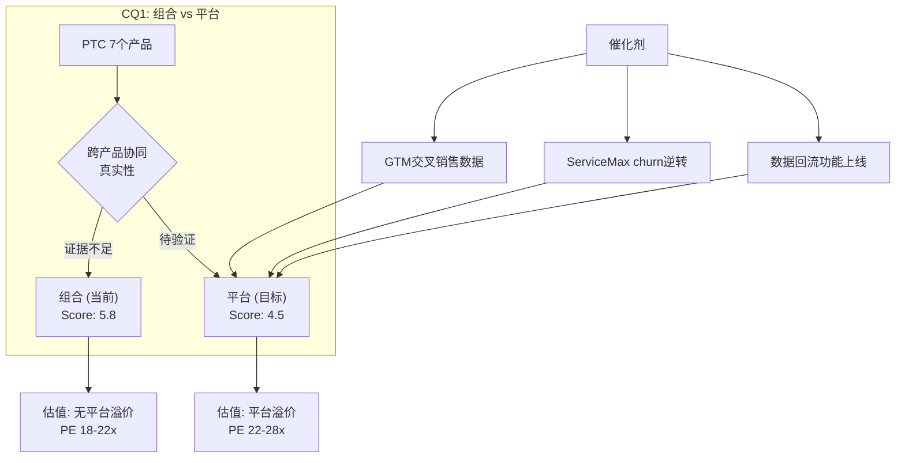
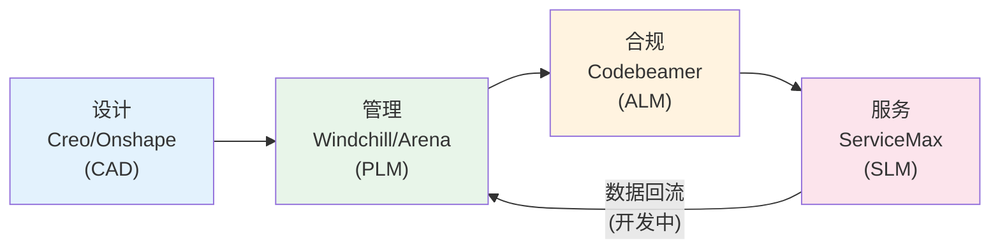
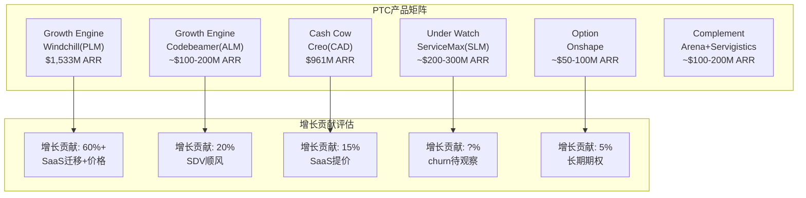

# PTC Inc. 深度研究报告 — Phase 1: Part 2
# Ch7-14: 产品深拆+组合vs平台+飞轮
# 日期: 2026-03-19 | CQ3-4.99/CQ3.5

---

# Part II: 产品深拆

## Chapter 7: Creo — CAD引擎深拆

### 7.1 Creo在PTC中的地位

Creo是PTC最古老的产品线(前身Pro/ENGINEER, 1987年)，也是PTC的"起家之本"。CAD ARR约$961M(Q1 FY2026)，占总ARR约39% [DM-CAD-001]。Creo的重要性不仅在于自身收入贡献——它是客户进入PTC生态的主要入口。很多客户先买Creo做设计，然后发现需要PLM管理设计数据→买Windchill，需要合规管理→买Codebeamer，需要现场服务→买ServiceMax。

因此Creo的健康程度直接影响PTC整个生态的客户获取漏斗。

### 7.2 Creo的竞争定位

| 维度 | Creo | NX (Siemens) | CATIA (Dassault) | Fusion 360 (ADSK) |
|------|------|-------------|-----------------|-------------------|
| **定位** | 高端离散制造 | 高端全制造 | 高端航空/汽车 | 中低端+SMB |
| **架构** | 桌面+云混合(Creo+) | 桌面为主 | 桌面+3DEX云 | 云优先 |
| **价格/年/用户** | $8K-12K | $10K-15K | $12K-20K | $2K-3K |
| **市场份额** | ~5-8% | ~10-15% | ~15-20% | ~25-30%† |
| **AI能力** | GDX(生成式设计) | Convergent+Altair | 3DEX AI | Generative Design |
| **优势** | 参数化深度+Windchill集成 | 仿真+PLM集成 | 航空航天深度 | 易用+低价+云 |
| **弱势** | 学习曲线+份额低 | 价格+复杂度 | 封闭生态+价格 | 复杂产品能力弱 |

[DM-CAD-002] †含AutoCAD(非3D CAD)的广义份额

**Creo的护城河来源不是市场份额——而是"设计数据锁定"。** 每一个用Creo设计的零件都以Creo原生格式(.prt/.asm)保存。虽然存在中性格式(STEP/IGES)用于交换，但中性格式会丢失约20-30%的设计意图信息(特征树/约束/参数) [DM-CAD-003]。因此一个拥有10万个Creo零件的公司，如果要迁移到NX，需要:
1. 导出所有零件为中性格式(或使用转换器)
2. 在NX中重建丢失的设计意图(人工)
3. 更新所有引用这些零件的装配体
4. 重新训练所有工程师

这个过程对于大型客户可能需要$2-5M和12-24个月 [DM-CAD-004]。

### 7.3 Creo增长驱动与风险

**增长驱动**:
1. **SaaS迁移提价**: Creo→Creo+(云版本)提价1.5-2x → 存量客户迁移贡献ARR增长 [DM-CAD-005]
2. **生成式设计(GDX)**: ABI Research评为领导者 → 增加高端功能溢价 → 但AI尚未独立定价
3. **Creo+云协作**: 云版本支持实时协作+云端仿真 → 对分布式工程团队有吸引力

**风险**:
1. **Fusion 360价格侵蚀**: Fusion 360价格仅Creo的1/4-1/3 → SMB客户可能直接选Fusion而非Creo [DM-CAD-006]
2. **Siemens NX+Altair**: Siemens 2025年收购Altair($10.6B) → NX+Altair的仿真集成可能超越Creo的独立仿真能力
3. **市场份额停滞**: Creo在整体CAD市场份额约5-8%，没有增长趋势

**Creo判定**: 现金牛(Cash Cow)。稳定的ARR贡献+高粘性，但不太可能成为增长引擎。增长主要来自SaaS迁移提价，而非市占率扩张。

---

## Chapter 8: Windchill — PLM引擎深拆

### 8.1 Windchill在PTC中的地位

Windchill是PTC最重要的产品——PLM ARR约$1,533M(Q1 FY2026)，占总ARR约62% [DM-PLM-001]。Windchill是PTC"高FCF工程锁定"身份定义的核心载体: 正是Windchill对客户BOM/设计数据/工程变更的深度管理，创造了PTC的高切换成本护城河。

**Windchill管理什么?**
- **BOM(物料清单)**: 每个产品的组件层级结构，从顶级装配到最小螺丝
- **工程变更管理(ECM)**: 任何设计变更的审批流程+影响分析+版本控制
- **文档管理**: CAD文件+技术规格+测试报告+合规文档
- **合规审计追踪**: FDA/ISO/ITAR要求的完整审计轨迹

一个典型的F500制造商可能在Windchill中管理100-500万个零件的数据 [DM-PLM-002]。这些数据是企业的"工程真相"(single source of truth)——如果Windchill宕机，工程团队无法发布新产品、无法管理变更、无法满足合规要求。

### 8.2 Windchill的竞争地位变化(CQ5)

**ABI Research 2025评估结果标志着一个重要转折: Siemens Teamcenter首次超越Windchill成为PLM #1** [DM-PLM-003]。

| 排名维度 | Windchill优势 | Teamcenter优势 |
|----------|-------------|---------------|
| 数字线程创建 | ✅ 更完整(CAD→PLM→ALM→SLM) | ❌ 需要多产品集成 |
| Gen AI功能 | ❌ Windchill AI(2026.1刚发布) | ✅ Teamcenter Copilot(更早) |
| 生态伙伴规模 | ❌ 较小 | ✅ 最大的生态伙伴系统 |
| 大型制造商份额 | 接近 | ✅ 略高 |
| 客户支持模式 | ✅ 更好 | 中等 |
| 实时产品追踪 | ✅ 更强 | 中等 |

**CQ5初步判断: Siemens的PLM超越是真实的，但不是致命的。**

原因分析:
1. ABI排名变化的权重偏AI和生态——Teamcenter Copilot先于Windchill AI推出，这在评分中占了优势。但AI功能在PLM客户的实际购买决策中权重可能远低于"数据迁移成本"和"现有使用惯性" [DM-PLM-004]
2. Siemens的大型制造商份额略高→但PTC在离散制造(航空/医疗)的细分中仍然强势
3. PLM市场不是零和博弈——PLM市场增速约9.7%(2024) [DM-PLM-005]，两家都在增长

**真正的威胁不是Siemens超越——而是Aras(开源PLM)从底部蚕食。** ABI评估Aras为"Gaining Momentum" [DM-PLM-006]。Aras的开源模式可以吸引预算有限的中型制造商，这些正是PTC试图从Tier 3扩展到Tier 2的目标客户群。如果Aras在Tier 2站稳脚跟，PTC的增长天花板会进一步降低。

### 8.3 Windchill+: 云迁移的关键杠杆

Windchill+(云托管版本)是PTC SaaS迁移战略的核心。Q1 FY2026管理层称Windchill+需求捕获创"可能的历史纪录" [DM-PLM-007]。

**Windchill→Windchill+迁移的经济学**:
- 客户从本地Windchill迁移到Windchill+ → ARR提升1.5-2.5x [DM-PLM-008]
- 提价合理性: 云版本包含基础设施托管+自动升级+SLA保障 → 客户省去了自建服务器/IT运维的成本
- 但客户实际节省的IT运维成本可能只有ARR提升的30-50% → 客户的总拥有成本(TCO)仍然上升20-50%
- 这意味着: SaaS迁移提价有上限——客户不会无限期接受TCO上升

**Windchill判定**: 增长引擎(Growth Engine)。PLM ARR增速(+10%)高于公司平均(+9%)，Windchill+云迁移提供2-5年的增量增长。但Siemens竞争+Aras底部蚕食是中期风险。

---

## Chapter 9: Onshape — 云原生CAD深拆(CQ6)

### 9.1 Onshape的战略定位

PTC于2019年以约$4.7亿收购Onshape [DM-ONS-002]——这是PTC进入"云原生"世界的战略赌注。Onshape是行业内唯一真正100%云原生的CAD+PDM: 没有本地安装、没有文件系统、所有数据在云端、实时多人协作。

Onshape对PTC的战略意义:
1. **降低获客门槛**: 解决Creo/Windchill部署摩擦导致的新客户获取缓慢问题
2. **未来产品架构**: 如果CAD/PLM全面向云迁移，Onshape的云原生架构是"正确的技术选择"
3. **中小客户入口**: Onshape的低价+零部署可以获取SMB→未来升级到Creo/Windchill

### 9.2 Onshape vs Fusion 360: 不对称竞争

| 维度 | Onshape | Fusion 360 |
|------|---------|------------|
| **定价** | $2,500-3,000/年/用户 | $600-800/年/用户 |
| **架构** | 100%云原生 | 云+本地混合 |
| **协作** | 实时多人(Google Docs式) | 异步协作 |
| **制造** | 基础 | CAM+FEA+模具+PCB(更全面) |
| **用户社区** | 小(企业级) | 大(教育+业余+SMB) |
| **目标客户** | 中型制造商+教育+国防 | SMB+创客+学生+中型 |
| **生态** | PTC(Windchill/Creo) | Autodesk(AutoCAD等) |

[DM-ONS-003]

**核心矛盾**: Onshape的技术架构可能更先进(真正云原生)，但Fusion 360的市场定位更有效(低价+全功能+大社区)。在中小客户市场，**价格是第一决策因素**——Onshape价格约为Fusion的3-4倍，这对价格敏感的SMB是决定性劣势 [DM-ONS-004]。

**CQ6(Onshape渗透大企业)分析**:

Onshape向上渗透的证据:
- FY2025"有史以来最大Onshape订单" → 证明大型客户开始关注
- 2026.3推出MBD功能 → 大企业必需的"模型驱动定义"功能补齐
- Government版(ITAR/EAR合规) → 打开航空航天/国防渠道
- CEO描述航空客户"默认选择云部署" → 行业趋势利好

但渗透障碍:
- 大企业的CAD标准化通常是10-20年周期 → Onshape要替换Creo/NX/CATIA需要极长时间
- Onshape的CAD能力仍然弱于Creo在复杂曲面/大型装配方面 [DM-ONS-005]
- "Onshape→Creo/Windchill升级漏斗"在架构上不连贯——两者数据格式不互通

**Onshape判定**: 期权(Option)。当前收入贡献微小(可能<5% CAD ARR)，但如果云原生CAD成为行业标准(5-10年视角)，Onshape可能是PTC最有价值的资产。短期(3-5年)不太可能成为增长主力。

---

## Chapter 10: Arena — 云QMS/PLM深拆

### 10.1 Arena的定位

PTC于2021年以约$7.15亿收购Arena Solutions [DM-ARN-001]——一个云原生的质量管理系统(QMS)+轻量级PLM，主要服务高科技和电子行业的中型客户。Arena的功能包括产品记录管理、质量流程管理、供应商协作。

**Arena与Windchill的区别**:
- Arena: 云原生、轻量级、面向中型高科技客户、QMS为主
- Windchill: 本地/混合、重量级、面向大型离散制造商、PLM为主

**Arena的战略角色**: 与Onshape类似，Arena是PTC在"轻量级云端"方向的另一个布局。Arena服务的客户通常不需要Windchill的全套PLM功能，但需要基本的产品数据管理+质量合规。

### 10.2 Arena的竞争与增长

Arena在云QMS/PLM领域面临竞争: Propel (Salesforce生态)、ETQ (Hexagon)、MasterControl、Veeva Vault (生命科学)。这个市场碎片化程度高，没有绝对领导者。

**Arena判定**: 补充(Complement)。收入贡献小、增速中等、竞争激烈。主要价值在于补齐PTC在"中型客户+高科技行业"的覆盖空白。

---

## Chapter 11: Codebeamer — ALM引擎深拆

### 11.1 Codebeamer的战略重要性

PTC于2023年以约$15亿收购Codebeamer [DM-ALM-001]——这是PTC近年来最大的一笔收购，反映了管理层对ALM(应用生命周期管理)赛道的重注。Codebeamer的核心价值在于**合规驱动的需求管理**:

在汽车行业(ISO 26262功能安全)和医疗器械行业(FDA 21 CFR Part 820/IEC 62304)，产品中的每个软件需求都必须有完整的追溯链: 需求→设计→测试→验证→合规文档。Codebeamer自动化了这个追溯链，使得合规不再是手工的纸质流程 [DM-ALM-002]。

### 11.2 Codebeamer的FICO式制度嵌入

Codebeamer的护城河结构与FICO类似——不是因为产品技术上不可替代，而是因为**监管制度把产品嵌入了客户流程**:

| 嵌入维度 | FICO(信用评分) | Codebeamer(合规ALM) |
|----------|--------------|-------------------|
| 监管要求 | 银行必须用信用评分做贷款决策 | 汽车/医疗必须有需求追溯链 |
| 切换成本 | 更换评分模型需要重新验证 | 更换ALM需要重新验证整个合规体系 |
| 竞争对手 | VantageScore(弱) | Siemens Polarion(直接竞争) |
| 制度嵌入深度 | 极深(40年历史) | **正在加深**(汽车SDV趋势加速) |

[DM-ALM-003]

**汽车SDV(Software-Defined Vehicle)趋势是Codebeamer的结构性顺风**:

随着汽车从"机械+电子"转向"软件定义"——一辆现代电动车的代码量可达1亿行以上——汽车OEM需要管理的软件需求数量指数级增长 [DM-ALM-004]。ISO 26262要求每个安全相关的软件需求都有完整的追溯链。手工管理这些需求不再可行→ALM工具成为必需→Codebeamer/Polarion是主要选择。

PTC FY2025-26录得"有史以来最大Codebeamer订单"(汽车行业) [DM-ALM-005]→ 这验证了SDV趋势正在转化为Codebeamer的收入增长。

### 11.3 Codebeamer的增长前景

**增长驱动**:
1. **汽车SDV**: 全球汽车行业向软件定义转型→ALM需求结构性增长
2. **医疗器械**: FDA对软件医疗器械(SaMD)的监管趋严→Codebeamer合规价值增加
3. **与Windchill集成**: Codebeamer+Windchill打通硬件BOM+软件需求 → 这是Siemens Polarion做不到的差异化(Polarion需要与Teamcenter集成，但集成深度不如PTC内部产品)

**风险**:
- Siemens Polarion是直接竞争对手，且Siemens的品牌在汽车行业更强(Siemens在工厂自动化中的地位)
- $15亿收购价对应的回报期可能很长(Codebeamer ARR可能目前仅$100-200M, 需要15-20%增速5-7年才能收回)

**Codebeamer判定**: 增长引擎(Growth Engine)。合规嵌入+SDV顺风+最大订单创纪录 = PTC产品组合中增速最快的引擎。但$15亿收购价需要持续高增速才能验证。

---

## Chapter 12: ServiceMax + Servigistics — SLM引擎深拆

### 12.1 ServiceMax: 现场服务管理(FSM)

PTC于2023年以约$14.6亿收购ServiceMax [DM-SLM-001]——定位是补齐数字主线的"售后服务"环节。ServiceMax帮助制造商管理现场技术员的派工、工单执行、备件库存、SLA管理。

**ServiceMax的困境: "unexpected churn"**

FY2025 Q4管理层在电话会议中承认ServiceMax出现"unexpected churn" [DM-SLM-002]。这是PTC当前最大的运营层面隐忧。分析可能的原因:

1. **平台压力**: Salesforce Field Service和Oracle FSM是平台型竞争对手——客户已经用Salesforce CRM→自然倾向用Salesforce的FSM → ServiceMax作为独立FSM面临"平台税" [DM-SLM-003]

2. **价值兑现周期**: 如Ch6分析，ServiceMax 2023年收购完成→2025年很多客户还在实施阶段→可能在价值兑现前就决定不续约

3. **整合摩擦**: ServiceMax此前是独立公司→被PTC收购后整合进入PTC生态→客户可能对"新东家"不适应→或PTC的销售团队不擅长卖FSM

4. **市场结构**: FSM市场前5大厂商仅占34-36%份额 [DM-SLM-004] → 高度碎片化 → 客户的忠诚度和切换成本都低于PLM

**管理层表态**: "not out of the woods"(尚未走出困境)，预期FY2026 Q2末改善 [DM-SLM-005]。但如果Q2继续churn，CQ1(组合vs平台)的"组合"判定将得到强化——ServiceMax可能被证明是"不融入平台的附加产品"而非"数字主线的有机组件"。

### 12.2 Servigistics: 备件管理(服务供应链)

Servigistics(PTC长期产品线)帮助制造商优化备件库存和服务供应链。这是一个相对niche的市场，但PTC在这个领域地位领先(Top 3)。

Servigistics的价值: 制造商的备件库存往往占总库存成本的30-50%。Servigistics通过预测分析优化备件配置→减少过剩库存同时确保服务可用性。2025年9月PTC为Servigistics推出AI功能(服务供应链优化) [DM-SLM-006]。

**Servigistics判定**: 稳定贡献(Steady Contributor)。市场niche但PTC地位稳固、利润率高。

### 12.3 SLM整体判定

**ServiceMax判定**: 待观察(Under Watch)。$14.6亿收购价+churn信号+平台压力 = 需要2-3个季度数据确认方向。如果churn持续→可能需要在估值中计入$3-5B的减值风险(从$14.6B收购价计提30-40%)。如果churn逆转→ServiceMax+Windchill的跨产品协同验证"平台"叙事→上调CQ1(组合→平台)。

---

## Chapter 13: 组合 vs 平台判定 (CQ1)

### 13.1 CQ1的核心问题

PTC拥有7个主要产品(Creo/Windchill/Onshape/Arena/Codebeamer/ServiceMax/Servigistics)。关键问题: 这7个产品是**真正的平台**(通过digital thread深度集成，1+1>2)还是**产品组合**(各自独立运行，1+1=2)?

| 判定 | 估值影响 | 类比 |
|------|---------|------|
| 平台 | 溢价10-20%PE → $170-200 | Salesforce(CRM+Service+Marketing+Commerce) |
| 组合 | 折价10-15%PE → $130-160 | 多元化集团折价(Conglomerate Discount) |

### 13.2 平台证据(正面)

**证据1: GTM重组向行业垂直**
- FY2025起从产品线组织→行业垂直组织 [DM-PLT-001]
- 这意味着PTC自己在赌"跨产品协同"——如果管理层不相信协同存在，不会重组销售团队
- 初步信号: 医疗器械客户Windchill+ServiceMax交叉销售案例

**证据2: Codebeamer+Windchill集成**
- Codebeamer管理软件需求 + Windchill管理硬件BOM → 在汽车/医疗领域这两者的集成是真实需求 [DM-PLT-002]
- Siemens Polarion+Teamcenter也有类似集成→但PTC的内部集成可能更深(同一技术栈 vs Siemens的多年收购整合)

**证据3: ServiceMax→Windchill数据回流**
- ServiceMax正在构建"跨PTC产品的数据存储层" [DM-PLT-003]
- 理念: 现场服务数据(故障模式/维修记录)回流到PLM → 产品改进闭环
- 但这个功能目前还在开发中,尚未在客户端大规模验证

**证据4: CEO的"Intelligent Product Lifecycle"愿景**
- Neil Barua将PTC定义为"智能产品生命周期"平台 → 设计(CAD) → 管理(PLM) → 合规(ALM) → 服务(SLM)
- IoT剥离虽然缩小了闭环(失去设备连接层)，但核心四环(CAD→PLM→ALM→SLM)仍然完整

### 13.3 组合证据(负面)

**证据1: 客户跨产品采用率不明**
- PTC不披露"使用2个以上产品的客户占比" [DM-PLT-004]
- 如果大多数客户只买1个产品(Windchill或Creo)，那么"平台"是叙事而非现实
- 间接信号: PLM ARR($1,533M) + CAD ARR($961M) → 加和接近总ARR($2,494M) → 这暗示大多数客户的ARR主要来自PLM或CAD中的一个，跨产品贡献可能有限

**证据2: 产品架构不统一**
- Creo: 桌面原生(C++), Creo+云混合
- Windchill: Java, 本地+云托管
- Onshape: 云原生(完全不同的技术栈)
- Codebeamer: 独立技术栈(2023收购)
- ServiceMax: Salesforce平台(已脱离)→PTC重构中
- 5个产品5种技术栈 → 深度集成的技术难度高

**证据3: ServiceMax churn**
- 如果ServiceMax是平台的有机组件，客户应该因为"ServiceMax+Windchill的集成价值"而不会churn
- ServiceMax出现churn→暗示客户可能不认为ServiceMax与Windchill的集成价值足以留住他们 [DM-PLT-005]

**证据4: IoT剥离**
- IoT(ThingWorx/Kepware)被定义为"非核心" → 说明"全生命周期平台"叙事中的一环被管理层自己否定了
- 如果IoT是"非核心"，那么"CAD→PLM→ALM→SLM→IoT"的闭环就不是不可拆解的平台→而是可以分售的组合

### 13.4 CQ1判定

| 维度 | 平台得分(0-10) | 组合得分(0-10) |
|------|--------------|--------------|
| 技术集成深度 | 4 | 7 |
| 客户跨产品采用 | 4 (数据缺失) | 5 |
| 管理层行为 | 7 (GTM重组) | 3 |
| 产品可拆解性 | 3 (IoT已拆) | 8 |
| 数据闭环价值 | 6 | 4 |
| **加权** | **4.5** | **5.8** |

**CQ1结论: PTC目前更接近"组合"(5.8) 而非"平台"(4.5)。**

但这是一个动态判断:
- 如果GTM重组成功推动跨产品交叉销售 → 2-3年内可能向平台移动
- 如果ServiceMax churn逆转 + 数据回流功能上线 → 平台叙事得到实质性支持
- 当前估值不应包含"平台溢价"→ PE 18x的定价是合理的(组合公司不配平台PE)

---

## Chapter 14: 数字主线飞轮验证 (CQ3.5)

### 14.1 PTC的digital thread声称

PTC声称其产品组合形成"数字主线"(digital thread): 从产品概念(CAD)→开发管理(PLM)→合规验证(ALM)→现场服务(SLM)的完整数据闭环。这个闭环的价值主张是: 当客户使用PTC的全产品线时，产品数据在全生命周期中无缝流动，消除信息孤岛。

### 14.2 飞轮悖论检测(v19.6框架)

按CRM v2.0教训，需要检测PTC的飞轮是否存在"悖论"——即新产品/功能的成功是否蚕食核心产品?

**PTC版飞轮悖论检查**:

| 新能力 | 如果成功... | 是否蚕食核心? | 悖论严重度 |
|--------|-----------|-------------|-----------|
| AI辅助设计(Creo AI) | 工程师设计效率↑→需要更少的CAD席位? | **低** — 设计任务总量不因AI减少(更复杂的产品)，但每人产出↑可能→席位数稳定而非增长 | 2/10 |
| ServiceMax AI(Agentic) | 服务自动化→需要更少的现场技术员? | **低** — ServiceMax按企业许可定价，不按技术员数 | 1/10 |
| Windchill AI(零件合理化) | 减少重复零件→BOM规模缩小→Windchill管理的数据量减少? | **极低** — 零件合理化增加管理价值(减少冗余≠减少管理需求) | 0/10 |
| Onshape取代Creo | SMB用Onshape而不升级到Creo→CAD ARR停滞? | **中** — 如果Onshape功能足够好，部分客户确实不会升级到Creo | 5/10 |
| Codebeamer取代Windchill变更管理 | Codebeamer的需求管理功能扩展→与Windchill ECM重叠? | **低** — 两者管理不同类型的变更(软件需求 vs 硬件BOM) | 2/10 |

**飞轮悖论检测结论**: PTC的飞轮悖论风险**低**(加权约2/10)。最大的内部蚕食风险来自Onshape vs Creo(5/10)——但考虑到Onshape目标客户(SMB)与Creo目标客户(F500)的重叠度低，实际蚕食效应可能远小于CRM的Agent vs 核心seat悖论。

**这与CRM(8/10)和ADBE(6/10)的飞轮悖论形成鲜明对比**: PTC的产品组合不像CRM/ADBE那样面临"AI成功→核心产品被替代"的自噬风险。因为PTC的AI是"嵌入现有产品的增值层"而非"替代现有产品的新范式"。

### 14.3 飞轮验证: 数据闭环是否真正存在?

**正面证据**:
1. Garrett Motion合同: 同时选择Windchill+(PLM)和Codebeamer+(ALM) → PLM+ALM闭环至少在个案中存在 [DM-FLY-001]
2. 医疗器械客户: Windchill+ServiceMax交叉销售 → PLM+SLM闭环在垂直行业中有价值
3. 管理层强调"Deferred ARR"中包含大量多产品合同 → 跨产品协同正在发生

**负面证据**:
1. 无跨产品NRR数据 → 无法量化"使用2+产品的客户"vs"单产品客户"的NRR差异
2. IoT剥离打断了"闭环"的最后一环(设备→云) → 数字主线实际上是"数字开线"(开放端)
3. 5种技术栈 → 数据"无缝流动"可能需要大量API集成→实际客户体验可能不如宣传

### 14.4 飞轮净强度评估

| 连接 | 强度 | 证据 |
|------|------|------|
| CAD→PLM (Creo→Windchill) | **强(8/10)** | 设计数据自然流入PLM管理→25年的集成历史 |
| PLM→ALM (Windchill→Codebeamer) | **中(6/10)** | 硬件BOM+软件需求集成→有真实需求→但集成深度待验证(收购才2年) |
| PLM→SLM (Windchill→ServiceMax) | **弱(3/10)** | 数据回流功能开发中→churn暗示集成价值不够吸引客户 |
| CAD→ALM (Creo→Codebeamer) | **弱(2/10)** | 间接通过PLM连接→直接集成有限 |
| 整体闭环 | **中偏弱(4.5/10)** | CAD→PLM连接强→但PLM→SLM弱→闭环不完整 |

**飞轮净强度结论**: PTC的数字主线飞轮在CAD→PLM环节强(8/10)，但在PLM→SLM环节弱(3/10)。整体飞轮强度4.5/10——不足以支撑"平台溢价"(需要6/10+)，但足以避免"集团折价"(那需要<3/10)。

**CQ3.5结论**: 数字主线是"半真半假"——CAD→PLM→ALM的部分是真实的(有客户证据)，PLM→SLM的部分是期望(功能开发中+churn信号)。投资者不应为完整闭环付溢价，但也不应因IoT剥离就否定全部协同价值。

---

# Part II 小结

| 章节 | 核心结论 | 产品判定 |
|------|---------|---------|
| Ch7 Creo | 现金牛, 高粘性+低增长, 份额低但锁定深 | Cash Cow |
| Ch8 Windchill | 增长引擎, PLM #2但云迁移提价驱动增长 | Growth Engine |
| Ch9 Onshape | 期权, 云原生架构领先但市场渗透缓慢 | Option |
| Ch10 Arena | 补充, 云QMS/PLM, 竞争激烈 | Complement |
| Ch11 Codebeamer | 增长引擎, 合规嵌入+SDV顺风, 最大订单创纪录 | Growth Engine |
| Ch12 ServiceMax | 待观察, churn信号+平台压力, 需2-3季度确认 | Under Watch |
| Ch13 组合vs平台 | 当前偏组合(5.8 vs 4.5), PE 18x合理(无平台溢价) | CQ1: 组合 |
| Ch14 飞轮验证 | 半真半假(4.5/10), CAD→PLM强但PLM→SLM弱 | CQ3.5: 半闭环 |

**Part II的关键发现**:

**最核心的发现**: PTC的增长引擎不是7个产品齐头并进——而是**Windchill(SaaS迁移提价)驱动60%+增长, Codebeamer(合规嵌入)贡献20%增量**。Creo是稳定器, ServiceMax是不确定因素, Onshape是长期期权。理解这个结构对估值至关重要——如果Windchill的SaaS迁移提价见顶(3-5年后存量客户迁移完毕)，PTC的增速可能进一步放缓到5-7%，除非Codebeamer/Onshape能接力。
