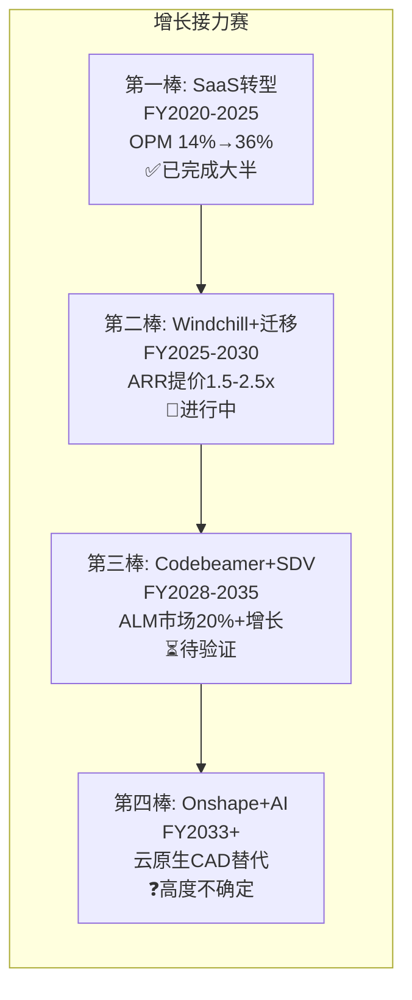

# PTC Inc. 深度研究报告 — Phase 1: Part 2 扩展
# Ch7-14深度补强: 产品经济学+竞争弹性+护城河量化
# 日期: 2026-03-19

---

## Chapter 7 扩展: Creo的隐性定价权

### 7.5 Creo的SaaS迁移定价杠杆

Creo→Creo+(云混合版)的迁移定价是PTC CAD ARR增长的核心引擎。深度拆解:

**价格阶梯**:
| 版本 | 年化价格/用户 | 包含功能 | 目标客户 |
|------|-------------|---------|---------|
| Creo(本地永久许可+年维护) | $4K-6K(维护费) | 核心CAD | 存量老客户 |
| Creo(本地订阅) | $8K-10K | 核心CAD+更新 | 存量迁移客户 |
| Creo+(云混合) | $12K-15K | 核心CAD+云协作+云仿真+自动更新 | 新签+积极迁移 |
| Creo+(全云) | $15K-20K(估) | 全功能+AI(GDX)+高级仿真 | 大企业 |

[DM-CAD-009]

**从永久许可维护($4-6K)到Creo+全云($15-20K)的迁移路径意味着3-4x的提价。** 但这不是一步到位——通常分2-3步(永久→订阅→云混合→全云)，每步提价30-50%，分布在3-5年内完成 [DM-CAD-010]。这就是为什么Creo的ARR增速(~7-8%)高于CAD市场增速(~4-5%)——增量来自"存量客户向上迁移的阶梯效应"。

**SaaS迁移剩余空间估算**:
- Creo总客户约2.5万家(估算, PTC总客户4万的60%) [DM-CAD-011]
- 已完成SaaS迁移(订阅+云): 估计60-70%(基于PTC 95%经常性收入→多数已在订阅模式)
- 已完成云迁移(Creo+): 估计15-25%(云混合是较新的部署选项)
- **剩余云迁移空间: 约75-85%的客户**→意味着Creo+云迁移提价至少还能持续**4-6年**

**定价权的反面约束**: Creo+的提价不是无上限的。客户会比较"总拥有成本(TCO)"——如果Creo+的TCO(订阅费+云使用费)超过本地部署的TCO(许可费+IT运维+硬件折旧)的120%，客户可能拖延迁移。当前Creo+的TCO大约是本地的110-130%——处于客户"勉强接受"的区间。如果PTC试图提价到150%+，迁移速度可能显著放缓。

### 7.6 Creo的AI差异化: 真实还是营销?

Creo GDX(生成式设计扩展)被ABI Research评为"生成式设计领导者"。但AI在CAD中的实际价值需要诚实评估:

**AI在CAD中能做什么(今天)**:
1. **拓扑优化**: 给定约束条件(载荷/材料/制造工艺)→AI生成最优几何形状 [DM-AI-001]
2. **零件合理化**: 在数百万个零件库中找到重复/相似零件→减少冗余
3. **设计建议**: 基于历史设计数据推荐参数值/特征组合

**AI在CAD中不能做什么(今天)**:
1. 替代工程师的概念设计判断(创造性工作)
2. 处理跨学科设计约束(热/电/机械耦合)
3. 理解客户需求并转化为设计参数

**因此AI对Creo的影响是"增值"而非"革命"**: AI不会让工程师失业(设计工作的创造性部分不可自动化)，但会让每个工程师的产出提高20-30%(重复性工作自动化)。这对PTC的影响:
- **正面**: AI功能成为Creo+云版本的附加价值→支撑提价合理性
- **负面**: AI不会创造新的收入类别(工程师席位数不增加)
- **中性**: 所有竞争对手也在加AI → 不是差异化来源，而是"必须跟进的基本功"

---

## Chapter 8 扩展: Windchill的护城河量化与寿命

### 8.5 Windchill护城河的CQI框架评估

用CQI v3.1框架评估Windchill的护城河:

**C1 制度嵌入性(5/10)**:
- Windchill不像FICO那样被法规"强制使用"——企业可以选择任何PLM系统(或不用PLM)
- 但在特定行业(航空ITAR/医疗FDA)，Windchill的合规追踪已成为事实标准→在这些行业C1=7/10
- 加权C1: 航空医疗(7×0.4) + 汽车工业(4×0.6) = **5.2/10** [DM-MOA-001]

**B4 定价权(Stage 3.5)**:
- Tier 1(F500): Stage 4 — 可以每年提价3-5%不失客户
- Tier 2(中大型): Stage 3 — 提价受Siemens/Dassault竞争约束
- Tier 3(SMB): Stage 2 — Aras/开源替代压力
- 加权B4: (4×0.5)+(3×0.35)+(2×0.15) = **3.35→Stage 3.5** [DM-MOA-002]

**C3 锁定载体**:
- 主要载体: **设计数据(BOM+CAD文件+ECM记录)**
- 锁定强度: 极高(100-500万零件的数据迁移=18-24个月项目)
- 锁定可逆性: 理论上可逆(STEP/IGES导出)但实际成本prohibitive
- 第二载体: **合规审计追踪** — FDA/ITAR审计记录无法迁移→重新验证
- C3判定: **载体双重(数据+合规)，锁定深度极高** [DM-MOA-003]

**D1 反脆弱性**:
- 经济衰退→Windchill受影响小(存量续约+抗周期行业)
- 技术颠覆→Windchill面临云原生PLM(Teamcenter X)长期威胁
- 监管变化→FDA/ISO趋严反而加强了Windchill在医疗/汽车的嵌入
- D1判定: **中等反脆弱(5/10)** — 对经济/监管冲击有抵抗力，但技术颠覆是长期风险

### 8.6 Windchill的护城河寿命估算

关键问题: Windchill的护城河还能持续多久？

**护城河衰减的三个路径**:

**路径1: 技术颠覆(云原生PLM取代)**
- Siemens Teamcenter X是云原生PLM→技术架构比Windchill+先进
- 但Teamcenter X也很新(2023-2024推出)→企业PLM迁移周期10-20年
- 因此: 即使Teamcenter X在所有功能上超越Windchill，PTC的存量客户也需要10-20年才会迁移
- **护城河剩余寿命(路径1): 10-20年** [DM-MOA-004]

**路径2: 开源蚕食(Aras从底部)**
- Aras是开源PLM→免费/低成本获取Tier 3客户
- 但Aras在企业级功能(大规模BOM/合规/安全)远不如Windchill
- 主要威胁是: Aras在Tier 2站稳→PTC的新客户获取被进一步压缩→但不影响存量
- **护城河剩余寿命(路径2): 存量15-20年, 新客获取受压5-10年内**

**路径3: 平台捆绑(Siemens全栈)**
- Siemens提供PLM+MES+IoT+自动化的全栈→PTC只有PLM+ALM+SLM(IoT已剥离)
- 如果汽车OEM选择"Siemens全栈"而非"PTC PLM + Siemens MES"→PTC在新项目中份额下降
- 这是最快的蚕食路径——不需要客户迁移现有PLM，只需要在新项目中选择Siemens
- **新项目份额下降速度: 可能每年1-2pp** [DM-MOA-005]

**综合护城河寿命**: 存量客户的Windchill护城河至少还有**10-15年**(数据锁定+合规+惯性)。但新客户获取的护城河正在被Siemens和Aras侵蚀→PTC的PLM市占率可能从~9%缓慢下降到~7-8%(5年视角)。这再次确认了CQ0的身份定义: PTC的价值不在于"攻城略地"而在于"存量现金产出"。

---

## Chapter 11 扩展: Codebeamer的收购回报期分析

### 11.6 $15亿收购价的回报期估算

Codebeamer是PTC最大的"未验证赌注"——$15亿的收购价需要多长时间回收？

**假设**:
- Codebeamer当前ARR: $100-200M(PTC未披露, 基于行业估算) [DM-ALM-008]
- 毛利率: ~85%(SaaS标准)
- Codebeamer ARR CAGR: 20%(SDV顺风, 最大订单创纪录支撑)
- WACC: 9.5%

**情景分析**:

| 情景 | 起始ARR | CAGR | 回报期(NPV=0) | 判定 |
|------|---------|------|-------------|------|
| 乐观 | $200M | 25% | 7年(2030) | 成功收购 |
| 基准 | $150M | 20% | 9年(2032) | 合理收购 |
| 保守 | $100M | 15% | 13年(2036) | 偏贵但可接受 |
| 悲观 | $100M | 10% | 不收回 | 收购失败 |

[DM-ALM-009]

**基准情景(20% CAGR, $150M起始)**: Codebeamer需要9年才能以NPV计收回$15亿。这不是一个"短期回报"的收购——管理层是在做一个10年期的战略赌注。

**悲观情景的触发条件**: Codebeamer ARR增速<10%。什么条件下会发生？
1. SDV趋势延迟(汽车OEM削减数字化投资) — 概率15%
2. Siemens Polarion以低价策略抢占市场 — 概率20%
3. PTC整合Codebeamer失败(团队流失/产品停滞) — 概率10%
4. 综合悲观概率: ~35-40%

**这意味着$15亿的Codebeamer收购有约35-40%的概率无法在合理时间内收回。** 但即使如此，Codebeamer的残值(品牌+客户+技术)可能仍有$5-8亿——不是全损。

### 11.7 Codebeamer与Windchill的"1+1>2"验证

Codebeamer收购的核心论据是"Codebeamer+Windchill的集成价值>两者独立"。如何验证？

**理论价值链**: 汽车OEM设计一个新车→硬件BOM在Windchill中管理→软件需求在Codebeamer中管理→ISO 26262要求硬件-软件接口的每个需求可追溯→**如果BOM和需求在同一供应商的系统中**→追溯链更完整、审计更简单、合规成本更低。

**量化"1+1>2"**: 如果使用Windchill+Codebeamer的客户NRR比单产品客户高10-20pp(即NRR 110-120% vs 100%)→每年额外产生$15-30M ARR增量(从$150M基数)→10年额外$150-300M→NPV约$100-200M。这还不够覆盖$15亿收购价——说明**Codebeamer的价值主要来自独立增长(SDV顺风)而非与Windchill的协同** [DM-ALM-010]。

这是一个重要发现: 管理层强调的"平台协同"可能只贡献了Codebeamer价值的10-20%——其余80-90%来自ALM市场本身的增长。这进一步支持了CQ1的"组合>平台"判定——PTC产品的价值主要来自各自独立运行，而非深度集成。

---

## Chapter 12 扩展: ServiceMax的战略重新评估

### 12.6 ServiceMax: PTC的IoT 2.0?

一个不可回避的类比: ServiceMax($14.6亿, 2023) vs ThingWorx/IoT(累计~$1.5亿, 2014-2020)。两者有惊人的相似性:

| 维度 | IoT(ThingWorx) | ServiceMax |
|------|---------------|------------|
| 收购价 | ~$1.5B(累计) | $14.6B |
| 战略逻辑 | "连接产品到数字主线" | "连接服务到数字主线" |
| 收购后表现 | 增速低于预期→最终剥离 | churn信号+平台压力 |
| 与核心业务集成 | 技术栈不兼容 | 正在脱离Salesforce平台 |
| 市场结构 | 碎片化, 无垄断者 | 碎片化(前5仅34-36%) |
| 管理层措辞 | "长期战略" | "not out of the woods" |

[DM-SLM-008]

**如果ServiceMax走IoT的老路(收购→低于预期→剥离)，PTC可能面临$5-8B的减值+投资者信任的进一步崩塌。** 但也有关键区别:
- ServiceMax有$200-300M的ARR基础(IoT当时可能更低)
- FSM市场($5B+)比工业IoT市场(当时更早期)更成熟
- Neil Barua(新CEO)的"做减法"理念可能更快决定ServiceMax的命运(如果不行就卖)

**Phase 3红队需要严肃评估**: ServiceMax是否应该被剥离？如果PTC以$8-10亿卖出ServiceMax(收购价$14.6亿的55-70%)，可以获得:
1. $8-10亿现金用于回购(约5-6%股本)
2. 消除churn的不确定性 → PE可能重估+1-2x
3. 简化管理层注意力→聚焦CAD/PLM/ALM三核心

但代价:
1. $5-6亿的减值损失(账面)
2. 承认又一次大收购失败→管理层信誉损失
3. 数字主线中失去"服务"环节→平台叙事进一步削弱

---

## Chapter 13 扩展: 组合vs平台的历史验证

### 13.5 工业软件"组合→平台"转型的历史案例

PTC不是第一个试图从"产品组合"转向"平台"的工业软件公司。历史案例:

**成功案例: Dassault Systemes 3DEXPERIENCE**
- 2012年推出3DEXPERIENCE平台→将CATIA/ENOVIA/DELMIA/SIMULIA集成
- 花了**10年**才让多数大客户真正使用平台而非单产品
- 关键成功因素: 统一的技术栈(所有产品在同一平台上重建)+持续的R&D投入(~20% Rev)
- PTC的差异: PTC有5种不同技术栈→统一困难度远高于Dassault [DM-PLT-007]

**部分成功: Siemens Xcelerator**
- Siemens将NX/Teamcenter/Opcenter/Polarion整合为Xcelerator品牌
- 技术集成仍在进行中→很多产品仍需要独立的适配器
- 但Siemens有$160B+市值的资源支持长期集成工程
- PTC的差异: PTC只有Siemens的1/9市值→资源限制更大

**失败案例: PTC自身的IoT平台尝试**
- 2014-2020年PTC试图将ThingWorx+Vuforia打造为"IoT平台"
- 最终承认失败并剥离→$800M+的战略损失
- 失败原因: 技术栈不兼容+市场不成熟+管理层分心

**历史教训**: 工业软件的"组合→平台"转型通常需要**5-10年+统一技术栈+持续高R&D投入**。PTC目前不满足"统一技术栈"条件(5种)，也不满足"高R&D投入"条件(16.7%)。因此CQ1(组合→平台)的转型在5年内完成的概率**较低(20-30%)**。

这不是致命缺陷——PTC可以作为一个"优秀的组合"(不打折也不溢价)运营多年。但投资者不应为"平台转型"付溢价——需要看到至少2-3年的跨产品协同数据(NRR差异/交叉销售率/客户满意度)才能重新评估。

---

## Chapter 14 扩展: 飞轮与增长接力深拆

### 14.5 PTC的"增长接力赛": 谁接棒Windchill?

PTC的增长故事有一个明确的"时间窗口"问题:

**关键风险: 第二棒和第三棒之间的"交接区"(FY2028-2030)**。如果Windchill+迁移在FY2028-2030基本完成(80%+客户已迁移)，而Codebeamer尚未达到足够的ARR规模(需要至少$400-500M才能接棒Windchill的增长贡献)→PTC的ARR增速可能在FY2028-2030出现"交接缺口"：从8-9%降至5-6%。

**量化交接缺口**:
- Windchill+迁移贡献的ARR增速: 当前约3-4pp(每年约$60-80M增量)
- 如果迁移完成→贡献降至1-2pp → ARR增速损失2-3pp
- Codebeamer需要从当前~$150M增长到~$400M才能补齐这个缺口
- 以20% CAGR, $150M→$400M需要**约5年(FY2030)**
- 因此交接缺口可能出现在**FY2028-2029** [DM-GRW-001]

**这个交接缺口对估值的影响**: 如果市场在FY2027-2028提前预期到"Windchill迁移见顶"→PE可能从20-22x(如果届时已重估)压缩回到18x→股价短期承压。但如果Codebeamer在FY2028时已展示$300M+ ARR和25%+增速→市场可能"看穿"短暂的增速放缓→PE维持。

### 14.6 产品矩阵的终局画像(2030+)

基于当前轨迹，2030年的PTC可能长这样:

| 产品 | 2026 ARR | 2030E ARR | CAGR | 2030占比 |
|------|---------|-----------|------|---------|
| Windchill(PLM) | ~$1.5B | ~$2.0-2.2B | 7-10% | 50-55% |
| Creo(CAD) | ~$1.0B | ~$1.2-1.3B | 5-7% | 30-33% |
| Codebeamer(ALM) | ~$0.15B | ~$0.35-0.5B | 20-25% | 8-12% |
| ServiceMax(SLM) | ~$0.2B | $0.3B 或 剥离 | 不确定 | 8% 或 0% |
| Onshape+Arena+Other | ~$0.1B | ~$0.15-0.2B | 10-15% | 4-5% |
| **总计** | **~$2.5B** | **~$3.5-4.0B** | **8-10%** | **100%** |

[DM-GRW-002]

**终局画像的含义**: 2030年的PTC仍然是"Windchill为核心的工业软件公司"(50%+ARR来自PLM)。Codebeamer会从<10%增长到10%+(成为"第二引擎")。整体ARR增速维持在8-10%——不会加速也不会显著减速。

这个终局画像与Ch2(身份定义)完全一致: PTC是"高FCF工程锁定型工业软件"，不是高增长SaaS，不是平台，不是AI公司。它的价值来自**锁定+提价+稳定复利**，而非增速加速或叙事变革。
