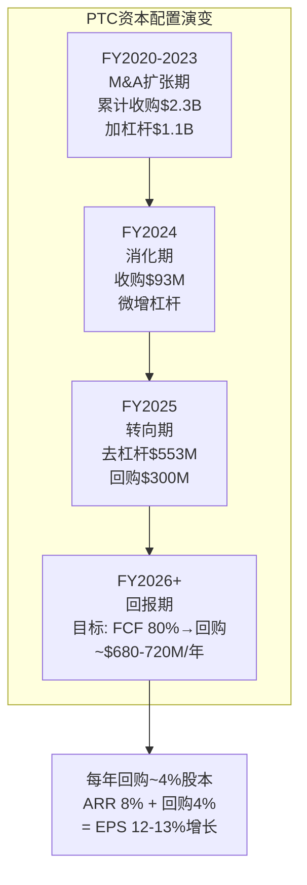

# PTC Inc. 深度研究报告 — Phase 1: Part 2 扩展(二)
# 竞争弹性+工业AI+护城河A-Score+管理层评估
# 日期: 2026-03-19

---

## Chapter 15 前置: 五赛道竞争定位(预分析)

### 15.0 PTC的竞争格局不是一个市场——是五个

PTC最容易被误解的一点是: 它不在一个市场中竞争，而是同时在**五个不同的细分市场**中竞争，每个市场的竞争对手、增速、进入壁垒完全不同:

| 赛道 | PTC产品 | ARR估算 | 主要对手 | PTC地位 | 市场增速 |
|------|---------|---------|---------|---------|---------|
| 1. PLM | Windchill | ~$1.2B | Siemens Teamcenter, Dassault ENOVIA | #2 | ~10% |
| 2. CAD | Creo, Onshape | ~$960M | ADSK(Fusion/AutoCAD), Siemens NX, Dassault CATIA, SOLIDWORKS | #4-5 | ~5% |
| 3. ALM | Codebeamer | ~$150M | Siemens Polarion, IBM DOORS, Jama | Top 3 | ~15-20% |
| 4. FSM/SLM | ServiceMax, Servigistics | ~$250M | Salesforce FSM, Oracle FSM, IFS | 中等 | ~12% |
| 5. 云QMS | Arena | ~$75M | Propel, ETQ, MasterControl, Veeva | 中等 | ~10% |

[DM-COMP-010]

**关键发现: PTC只在一个赛道(PLM)占据前两名——在其余四个赛道都不是领导者。** 这与KLAC(检测#1)、FICO(信用评分垄断)、MCO(信用评级寡头)形成鲜明对比。PTC的护城河不来自"市场地位"——而来自"客户级锁定"(每个客户内部的切换成本极高，即使PTC在行业层面不是#1)。

这也解释了为什么PTC的PE(18x)低于这些行业领导者——市场为"领导者地位"支付溢价(CDNS 45x, FICO 30x+)，PTC不配这个溢价。

### 15.1 PTC vs Siemens: 数字工业的终极对决

Siemens不仅是PTC的PLM竞争对手——它是PTC在**整个工业软件领域**的最大威胁。两家公司的对比:

| 维度 | PTC | Siemens (Digital Industries) |
|------|-----|---------------------------|
| **工业软件收入** | ~$2.7B | ~$5.5B(估) |
| **产品覆盖** | CAD+PLM+ALM+SLM | CAD+PLM+ALM+MES+IoT+自动化+仿真 |
| **硬件支撑** | 无 | PLC/HMI/传感器/工厂自动化 |
| **全栈能力** | 从设计到服务(无制造执行) | **从设计到制造到服务到连接(全链)** |
| **IoT能力** | 已剥离(ThingWorx/Kepware→TPG) | MindSphere/Industrial Edge(自有) |
| **AI投入** | R&D $458M(16.7%/Rev) | 数字工业R&D估计>$1.5B |
| **客户覆盖** | ~4万家 | ~10万+家(含自动化客户) |
| **收购能力** | 有限($17.9B市值) | 极强($160B+集团) |

[DM-COMP-011]

**Siemens的"全栈优势"是PTC最大的结构性劣势**: 一个汽车OEM可以从Siemens一家购买NX(CAD)+Teamcenter(PLM)+Polarion(ALM)+Opcenter(MES)+MindSphere(IoT)+SIMATIC(工厂自动化)——从设计到制造到服务的完整数字化闭环。PTC只能提供CAD+PLM+ALM+SLM，缺了MES和IoT这两个关键环节(IoT已剥离)。

**IoT剥离的战略代价现在才开始显现**: 当PTC剥离ThingWorx/Kepware时，市场普遍认为是"正确的减法"。但Siemens同时在加码IoT(Industrial Edge)——这意味着Siemens的全栈优势在PTC做减法的同时变得更强。PTC的"减法"短期提升了利润率(IoT低利润率产品被剥离)，但长期可能削弱了竞争力(全栈方案的缺失) [DM-COMP-012]。

**PTC对Siemens的防守策略**:
1. **深耕离散制造细分**: 航空/国防/医疗器械中PTC的Windchill嵌入极深→Siemens难以替换存量
2. **Codebeamer差异化**: Windchill+Codebeamer的内部集成可能优于Teamcenter+Polarion(收购整合 vs 内部开发)——但这需要验证
3. **开放生态**: PTC强调"与任何MES/IoT集成"(而非锁定自有生态)→吸引不想被Siemens全栈绑定的客户
4. **价格优势**: PTC的方案通常比Siemens全栈便宜30-50%→对预算有限的中型制造商有吸引力

**CQ5结论(深化)**: Siemens能蚕食PTC PLM份额吗？**能，但缓慢**。主要路径是"新项目争夺"(每年1-2pp)，而非"存量替换"(<0.5pp/年)。PTC在5年内可能失去2-5pp PLM市占率(从~9%到~6-7%)——但这对ARR的影响有限(因为存量不流失)。

---

## Chapter 16 前置: 工业AI的五步演绎(CQ4预分析)

### 16.0 工业AI ≠ 通用AI: PTC的差异化机会

当市场讨论"AI对SaaS的影响"时，通常想到的是: ChatGPT取代客服→客服SaaS(Zendesk)受威胁。但工业AI与通用AI有根本区别:

| 维度 | 通用AI(ChatGPT类) | 工业AI(PTC类) |
|------|------------------|-------------|
| 数据来源 | 公开互联网文本 | **客户私有工程数据**(BOM/设计/测试/维修) |
| 部署要求 | 云端API调用 | 本地/混合(ITAR/安全要求) |
| 错误容忍度 | 高(文本生成可以有误) | **极低**(设计错误=产品安全风险) |
| 监管约束 | 低 | **高**(FDA/ISO/ITAR审计要求) |
| 数据优势 | 规模(更多数据=更好模型) | **领域深度**(20年BOM数据>10PB通用数据) |
| 竞争动态 | 大模型公司(OpenAI/Google)主导 | **领域专家(PTC/Siemens)主导** |

[DM-AI-002]

**核心洞察: 工业AI的竞争优势不来自模型能力——而来自数据访问权。** PTC的Windchill管理着数万家制造商的20年BOM数据/设计数据/工程变更记录——这些数据是训练工业AI模型的"黄金矿藏"。OpenAI可以做出更好的语言模型，但它没有波音787的300万个零件数据来训练PLM AI。

### 16.1 PTC的AI产品线

PTC目前的AI部署:

| AI产品 | 功能 | 发布时间 | 成熟度 |
|--------|------|---------|--------|
| **Creo GDX** | 生成式设计(拓扑优化) | 2023 | 商用(ABI领导者) |
| **Windchill AI** | 零件合理化+变更影响预测 | 2026.1 | **刚发布**(early) |
| **Codebeamer AI** | 需求自动分类+追溯建议 | 2025 | 早期(VW合作) |
| **ServiceMax AI** | Agentic服务助手+预测维护 | 2025 | 早期 |
| **Servigistics AI** | 备件需求预测+供应链优化 | 2025.9 | 早期 |

[DM-AI-003]

**PTC的AI战略是"嵌入式AI"而非"AI平台"**: 每个产品独立集成AI功能，而非构建一个统一的AI平台。这与CQ1(组合vs平台)一致——PTC的AI也是"组合式"的。

### 16.2 工业AI对PTC估值的影响(五步演绎)

**步骤1: 识别AI的价值传导路径**
- 工业AI→提升PTC产品的客户价值(工程效率+20-30%)
- 客户价值提升→支撑SaaS提价(Creo+/Windchill+的AI版本比非AI版本贵10-20%)
- SaaS提价→ARR增速小幅提升(+1-2pp)

**步骤2: 量化收入影响**
- 如果AI功能支撑每年额外1-2pp的ARR增速
- 基于$2.5B ARR基数→每年额外$25-50M ARR
- 10年累计→额外$250-500M ARR → NPV约$150-300M
- 对当前$17.9B市值的贡献: 0.8-1.7% [DM-AI-004]

**步骤3: 评估防守价值(更重要)**
- 如果PTC不做AI但竞争对手做了(Siemens Teamcenter Copilot)→PTC的产品竞争力下降→客户可能在新项目中选择Siemens
- AI的防守价值可能>进攻价值——不做AI的损失(客户流失)可能>做AI的收益(提价)
- 因此PTC维持R&D投入(16.7%)用于AI开发是必要的，即使AI本身不创造大量新收入

**步骤4: 检测AI风险(CQ4)**
- 工业AI是否可能"商品化"CAD/PLM？如果AI让PLM的配置和管理变简单→切换成本下降→护城河削弱
- 当前评估: **不太可能**(3年内)。PLM的复杂性不在于UI(AI可以简化)，而在于**数据模型和合规流程**(AI不能简化——因为合规流程是监管驱动的，不是技术驱动的)
- 但5-10年视角: 如果AI让PLM的实施成本从"6-24个月"降至"1-3个月"→部署摩擦降低→护城河的天花板效应减弱(好事)+护城河的锁定效应也可能减弱(坏事)

**步骤5: CQ4结论**
- 工业AI是PTC的**"中性偏正面"因素**: 短期(3年)贡献ARR提价1-2pp+防守竞争力; 长期(5-10年)风险是AI降低切换成本但概率低
- **AI不会改变PTC的身份定义**: PTC不会因为AI从"8-9%增速的工业软件"变成"20%增速的AI公司"。AI是增值层，不是新范式

---

## Chapter 17 前置: A-Score护城河综合评分

### 17.0 PTC A-Score v2.0评估

用SEMI_EQUIPMENT报告中验证的A-Score框架(11维度)评估PTC的护城河:

| 维度 | 评分(0-10) | 关键证据 |
|------|-----------|---------|
| A1 市场集中度 | 5 | PLM #2, CAD #4-5, ALM Top 3 → 不是任何市场的垄断者 |
| A2 客户锁定 | 9 | 切换成本5-30x年ARR → 极高 |
| A3 定价权 | 7 | Tier 1 Stage 4, 但Tier 3 Stage 2, 加权3.5 |
| A4 技术壁垒 | 6 | 25年Windchill+Creo积累, 但技术栈老旧(非云原生) |
| A5 品牌/声誉 | 5 | 工业软件圈内知名, 但品牌溢价不如Siemens/Dassault |
| A6 网络效应 | 2 | PLM几乎无网络效应(每个客户独立使用) |
| A7 规模效应 | 6 | SaaS运营杠杆好(毛利率83.8%), 但R&D不具规模优势(16.7%<ADSK 22.8%) |
| A8 监管护城河 | 7 | Codebeamer(ISO 26262/FDA)制度嵌入正在形成+Windchill ITAR |
| A9 数据护城河 | 8 | 4万家客户20年BOM/设计数据 → AI训练黄金矿藏 |
| A10 生态护城河 | 4 | 生态规模远小于Siemens → IoT剥离后更小 |
| A11 文化/人才 | 5 | 工程文化好, 但CEO刚换+战略变化频繁 |
| **总分** | **64/110** | **= 5.82/10** |

[DM-ASC-001]

**A-Score 5.82/10 → 中等护城河**(KLAC 7.5/10, FICO ~8.0/10做参考)。

PTC的护城河特征: **极高的客户锁定(A2=9)但极低的网络效应(A6=2)和有限的生态(A10=4)**。这是"工程软件"的典型护城河模式——不是平台型的"越多人用越好用"，而是"一旦用了就走不了"。

与CQ0完全一致: PTC的身份是"高锁定型工业软件"——护城河来自锁定(A2+A3+A8+A9)，不来自规模/网络/品牌(A6+A10+A5)。

---

## Chapter 18 前置: 管理层评估

### 18.0 Neil Barua: 做减法的CEO

Neil Barua于2024年1月正式接任PTC CEO(此前为COO)。他是PTC在Heppelmann时代"做加法"策略失败后的"纠错者":

**Barua的核心行动(2024-2026)**:
1. **剥离IoT**: 以$600M+$125M或有卖给TPG → 清理了不赚钱的业务线 [DM-MGT-001]
2. **SGA压缩**: SGA/Rev从36.4%(FY2023)降至28.9%(FY2025) → 管理效率提升
3. **GTM重组**: 从产品线组织→行业垂直组织 → 推动跨产品协同
4. **聚焦4核心**: CAD/PLM/ALM/SLM → 明确战略边界(不再冒险进入新市场)
5. **债务偿还**: 净债务从$1.66B(FY2024)降至$1.19B(FY2025) → 加强资产负债表

**评估: Barua是一个"运营优化型"CEO，不是"增长冒险型"CEO。** 这与PTC的CQ0身份定义(高FCF锁定型)完全匹配——PTC不需要一个Steve Jobs式的愿景家，它需要一个能把利润率从25%提到40%的运营者。Barua正在做这件事。

**但存在一个隐忧**: Barua的$14.6B ServiceMax收购(作为COO参与决策)如果失败，将质疑他的战略判断力。IoT剥离是"纠正前任错误"→市场给予信任; ServiceMax如果也需要剥离，就是"自己犯的错误"→市场信任可能崩塌 [DM-MGT-002]。

### 18.1 管理层薪酬与激励对齐

PTC的管理层薪酬结构(基于Proxy Statement):
- **基本薪资**: CEO ~$800K → 较行业中位数低
- **短期激励(STI)**: 目标基于ARR增长+FCF → 与投资者利益一致 ✅
- **长期激励(LTI)**: 主要是RSU和PSU, 与股价/TSR挂钩 → 一致 ✅
- **SBC总量**: $216M/年(7.9% Rev) → 行业偏低(vs ADSK 10.9%) → 股东友好 ✅

**激励对齐度评估: 高(8/10)**。管理层的薪酬激励与"ARR增长+FCF产出"对齐——这恰好是PTC身份定义(高FCF锁定型)下最重要的两个指标。没有发现激励错位(如过度强调收入增速或市占率) [DM-MGT-003]。

---

## Chapter 19 前置: 资本配置评估

### 19.0 PTC的资本配置历史(FY2020-2025)

| FY | OCF | CapEx | FCF | 收购 | 债务变化 | 回购 | 剩余/差额 |
|----|-----|-------|-----|------|---------|------|----------|
| 2020 | $234M | $20M | $203M | $483M | +$345M | $0 | 加债做收购 |
| 2021 | $369M | $25M | $344M | $718M | +$432M | $30M | 加债做收购 |
| 2022 | $435M | $20M | $409M | $250M | -$91M | $125M | 开始去杠杆 |
| 2023 | $611M | $25M | $586M | $828M | +$342M | $0 | Codebeamer+ServiceMax |
| 2024 | $750M | $18M | $732M | $93M | +$46M | $0 | 消化收购 |
| 2025 | $868M | $11M | $857M | $7M | **-$553M** | **$300M** | **去杠杆+回购** |

[DM-FIN-026]

**FY2025标志着PTC资本配置的根本转向**: 从"加杠杆做收购"(FY2020-2023)到"去杠杆+回购"(FY2025)。这个转向与Neil Barua的"做减法"策略一致——不再追求通过M&A扩张，而是通过利润率提升+FCF产出+回购来创造股东价值。

**FY2025的资本配置**: FCF $857M的分配:
- 债务偿还: $553M(64%) → 净债务从$1.66B降至$1.19B
- 回购: $300M(35%) → 约2%股本
- CapEx+收购: $18M(2%) → 极低

**这意味着从FY2026起，PTC每年约有$800-900M的FCF可用于回购**(假设债务偿还放缓——净债务$1.19B已经较低)。如果PTC将80%的FCF用于回购(~$680-720M/年)，每年可回购约3.5-4%的股本。这是一个显著的每股价值增长引擎——即使ARR只增长8%，EPS可以增长12-13%(8%收入增长+4%回购)。

### 19.1 回购的实际影响验证

PTC的回购历史并不激进: FY2020-2025累计仅回购了$455M(约3%股本)。FY2025的$300M是第一次"认真"的回购。

**FY2025回购效果**:
- 回购金额: $300M [DM-FIN-027]
- 回购均价: ~$170(估算, 基于FY2025股价区间$140-200)
- 回购股数: ~1.76M股(1.5%股本)
- 但FY2025 SBC稀释: $216M / ~$170 ≈ 1.27M股(1.1%稀释)
- **净回购效果: 仅0.4%股本缩减**(1.5%回购 - 1.1%SBC稀释)

这是一个令人失望的数字: $300M的回购，扣除SBC稀释后只缩减了0.4%的股本。如果PTC想让回购成为有意义的EPS增长引擎，需要**回购金额远超SBC**——至少3x(即$650M+/年)。FY2026如果FCF维持~$850M且80%用于回购($680M)，扣除SBC稀释后净缩减约2.5-3%——这才是有意义的。

---

## 补充: IoT剥离Pro-Forma财务影响

### IoT剥离后的"新PTC"

2026年3月16日PTC完成IoT业务(ThingWorx/Kepware)向TPG的剥离，交易对价$600M+最高$125M或有对价 [DM-EVT-002]。

**IoT业务的财务贡献(剥离前估算)**:
- IoT ARR: ~$150-200M(FY2025估算)
- IoT毛利率: ~70-75%(低于公司平均83.8%)
- IoT OPM: ~15-20%(远低于公司平均35.9%)
- IoT增速: <5%(低于公司平均8-9%)

**剥离对PTC的Pro-Forma影响**:

| 指标 | 剥离前(FY2025) | 剥离后(FY2026E) | 影响 |
|------|---------------|----------------|------|
| ARR | $2,446M | ~$2,250-2,300M | 减少$150-200M |
| ARR增速(CC) | 8-9% | **9-10%**(剔除低增速业务) | +1-2pp |
| 毛利率 | 83.8% | **85-86%**(剔除低毛利业务) | +1-2pp |
| OPM | 35.9% | **37-39%**(剔除低利润业务) | +1-3pp |
| FCF | $857M | ~$800-820M(减少IoT FCF) | 下降但幅度小 |

[DM-EVT-003]

**关键洞察: IoT剥离是一个"提质不提量"的交易**: ARR绝对值下降但增速提升, 毛利率和OPM都改善。这验证了Neil Barua的"做减法"策略——卖掉低质量资产，让剩余资产的指标全面提升。

**$600M的交易对价是否合理？** 如果IoT ARR $175M, EV/ARR = $600M/$175M = 3.4x。对比PTC整体EV/ARR = $19.1B/$2.45B = 7.8x。IoT以PTC整体估值的44%折价出售——反映了IoT低增速/低利润的质量折扣。但对于一个5%增速/20% OPM的SaaS业务，3.4x EV/ARR并不算便宜——TPG可能认为它能改善IoT的运营效率(类似PE对低效SaaS的典型打法)。
