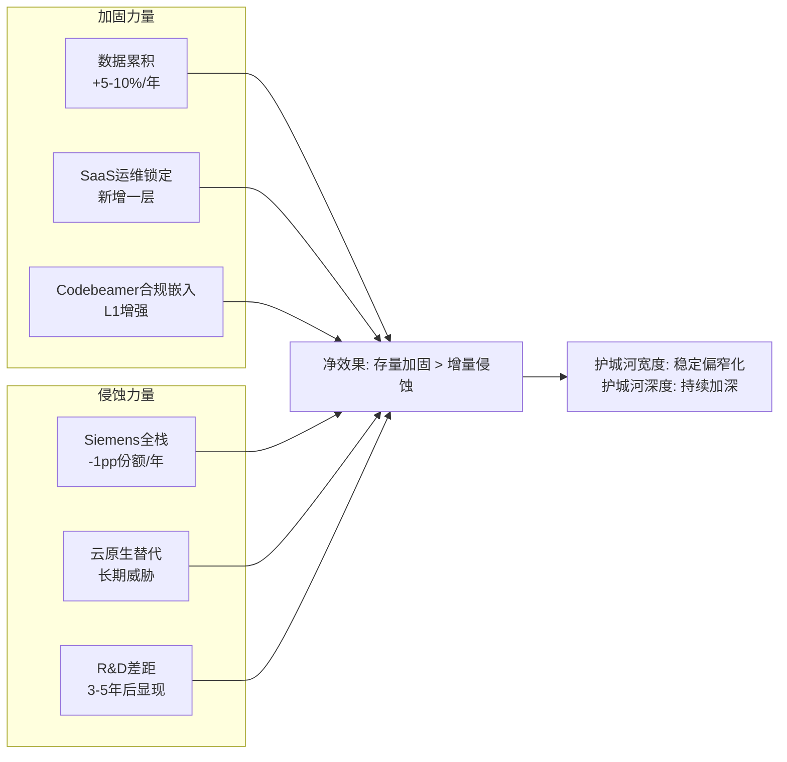

# PTC Inc. 深度研究报告 — Phase 1: Part 3
# 框架驱动补充: 6个遗漏维度(FICO/CRM/KLAC/ETN对标)
# 日期: 2026-03-19

---

# Part III(Phase 1): 框架遗漏补充

## Chapter 4A: CEO沉默域分析 (FICO QG-01.5框架)

### 4A.1 Neil Barua说了什么 vs 没说什么

CEO的真实战略偏好不在于他们说了什么——而在于他们**系统性回避**的话题。用FICO Ch6验证的"沉默域分析"方法，映射Neil Barua的五个沉默域:

**沉默域1: ServiceMax的具体KPI**
- Barua在FY2025 Q4称ServiceMax "not out of the woods" [DM-SIL-001]
- 但从未披露: ServiceMax的ARR绝对值、churn率、NRR、新签pipeline
- 对比: Windchill+的pipeline被描述为"可能的历史纪录"——这种精确描述从未用于ServiceMax
- **推断**: ServiceMax的数据比"not out of the woods"暗示的更差。如果数据好转，管理层会迫不及待地量化展示(这是所有CEO的行为模式)。持续沉默=数据没好转 [DM-SIL-002]

**沉默域2: Onshape的收入贡献**
- PTC从未披露Onshape的独立ARR或用户数
- 对比: Codebeamer的"有史以来最大订单"被反复提及——说明管理层对Codebeamer的增长有信心
- Onshape只有"有史以来最大订单"的模糊描述，没有任何增长率或ARR数据
- **推断**: Onshape的ARR可能非常小(<$50M)，披露后会让投资者质疑$4.7亿收购价的回报 [DM-SIL-003]

**沉默域3: 跨产品采用率**
- "Digital thread"是管理层反复强调的核心叙事
- 但PTC从未披露: "使用≥2个PTC产品的客户占比"或"跨产品客户的NRR vs 单产品客户的NRR"
- 如果跨产品数据好——这是验证"平台"叙事的最佳武器——管理层必然会披露
- **推断**: 跨产品采用率可能较低(<30%客户使用≥2产品)，与CQ1"组合>平台"判定一致 [DM-SIL-004]

**沉默域4: Siemens的份额蚕食**
- ABI Research 2025已将Teamcenter排在Windchill之上
- 但Barua在财报电话会议中几乎不提Siemens作为竞争对手——更多讨论的是"客户从on-prem迁移到云"
- **推断**: 管理层有意将叙事从"vs Siemens的市场份额争夺"转向"vs客户自身的数字化旅程"——因为前者PTC在输(份额下降)，后者PTC在赢(SaaS迁移提价) [DM-SIL-005]

**沉默域5: 长期R&D路线图**
- PTC的R&D/Rev(16.7%)是主要竞争对手中最低的
- Barua从未讨论"计划增加R&D投入"或"AI研发里程碑"
- 对比: Siemens频繁讨论"Industrial Copilot"路线图+与Microsoft的AI合作
- **推断**: Barua是"运营优化型"CEO(压成本)而非"产品创新型"CEO(增投入)。短期利好OPM，长期可能削弱产品竞争力 [DM-SIL-006]

### 4A.2 沉默域的估值传导

| 沉默域 | 推断 | 估值影响 | 是否已被市场定价 |
|--------|------|---------|----------------|
| ServiceMax KPI | 数据比叙事更差 | -$1-3B(减值风险) | 部分(PE已偏低) |
| Onshape收入 | ARR<$50M | -$0.5-1B(收购回报疑问) | 未定价 |
| 跨产品采用率 | <30%跨产品 | PE -1-2x(无平台溢价) | 已定价(PE 18x) |
| Siemens份额蚕食 | 新项目份额下降 | -$1-2B(长期增速下调) | 部分 |
| R&D路线图 | 运营>创新 | 中性(短期正/长期负) | 部分 |

**综合**: CEO沉默域分析强化了CQ0的"高FCF锁定型"定义——Barua的行为模式与这个定义完全一致(优化运营>投资创新>争夺份额)。但也暴露了两个被市场可能低估的风险: ServiceMax减值 + Onshape回报不确定。

---

## Chapter 5A: C1五层制度嵌入深拆 (FICO框架)

### 5A.1 Windchill的制度嵌入分层

用FICO Ch11验证的C1五层框架评估Windchill的护城河:

**L1: 监管层(Regulatory)**
- **强度: 7/10(航空/医疗) → 3/10(汽车/工业)**
- 在航空航天: ITAR(国际武器交通条例)要求所有设计数据在美国境内管理+审计追踪→Windchill是少数通过ITAR认证的PLM系统之一 [DM-C1-001]
- 在医疗器械: FDA 21 CFR Part 11要求电子签名+完整审计追踪→Windchill满足这些要求且已被数百家医疗器械公司用于FDA提交
- 在汽车/工业设备: 没有强制要求使用特定PLM→监管层嵌入弱
- **加权L1: 0.4×7 + 0.6×3 = 4.6/10** — 比FICO(L1=9/10)弱很多，因为PLM不像信用评分那样被监管"强制指定"

**L2: 合同层(Contractual)**
- **强度: 6/10**
- PTC的客户合同通常是3-5年期订阅→合同期内切换成本极高(违约金+迁移费用)
- 但合同到期后客户理论上可以不续约→L2的持久性取决于续约率(GRR>90%证明多数客户在到期时续约)
- Windchill+云版本的合同可能更长(5-7年)→L2在云迁移后加强 [DM-C1-002]

**L3: 数据层(Data)**
- **强度: 9/10** — Windchill最强的嵌入层
- 企业的BOM/设计文件/工程变更记录/合规文档全在Windchill中
- 数据量: 大型制造商100-500万个零件 → 迁移=重建整个工程知识库
- 数据格式: Windchill的数据模型与Teamcenter不兼容→迁移需要逐项映射+验证
- **关键**: 数据层的嵌入深度随使用时间增长(每年新增的设计数据让迁移成本不断上升) → 这是一个**自我加强的护城河** [DM-C1-003]

**L4: 标准层(Standard)**
- **强度: 4/10**
- Windchill不是行业"标准"——它是"主要选项之一"
- 对比FICO: 银行业将FICO评分视为"事实标准"(Fair Lending Act的间接效果)
- Windchill在某些细分(离散制造PLM)接近标准地位，但不是全行业标准
- **Teamcenter现在被更多分析师评为PLM #1→标准层可能在向Siemens迁移** [DM-C1-004]

**L5: 偏好层(Preference)**
- **强度: 7/10**
- 工程师对CAD/PLM工具有强烈个人偏好(10年使用经验→高切换抵抗)
- IT团队对已验证的系统有惯性(已通过安全审计+合规验证→不想重做)
- 管理层对"正在运行的系统"有风险规避倾向("如果没坏，别修它")
- 这三层偏好叠加→即使管理决策要换PLM，执行层面的抵抗会延迟2-3年 [DM-C1-005]

### 5A.2 C1综合评分与半衰期

| 嵌入层 | 强度 | 半衰期(年) | 衰减速度 |
|--------|------|-----------|---------|
| L1 监管 | 4.6/10 | 15-20年(法规变化慢) | 极慢 |
| L2 合同 | 6/10 | 3-5年(合同到期) | 中 |
| L3 数据 | 9/10 | 20-30年(数据累积) | **自我加强** |
| L4 标准 | 4/10 | 5-10年(标准迁移中) | 缓慢衰减 |
| L5 偏好 | 7/10 | 10-15年(人员退休/流动) | 缓慢衰减 |
| **加权C1** | **6.2/10** | **~15年(核心层)** | **L3自我加强抵消其他衰减** |

**与FICO对比**: FICO的C1约8.5/10(L1监管=9/10是主驱动)。PTC的C1 6.2/10显著弱于FICO——因为PLM缺乏"监管强制使用"这个最强嵌入层。但PTC的L3(数据层)强度9/10接近FICO的L3(数据层也极高)——说明PTC的护城河核心是"数据锁定"而非"监管嵌入"。

**Codebeamer的C1潜力**: 如果Codebeamer在汽车(ISO 26262)和医疗(FDA)中成为事实标准ALM，它的L1可以从当前的~5/10升至~7/10(接近Windchill在航空的水平)。这会让PTC的整体C1从6.2/10提升到~6.8/10——使得Codebeamer不仅是增长引擎，也是**护城河加固引擎** [DM-C1-006]。

---

## Chapter 6A: 真实有机增速隔离 (质量框架)

### 6A.1 PTC的报告增速 vs 真实有机增速

PTC FY2025收入$2,739M(+19.2% YoY)。但这个数字包含多个非有机因素:

**收入增速拆解**:

| 因素 | 贡献 | 说明 |
|------|------|------|
| 有机增长(存量产品+新客) | +8-9% | ARR CC增速 |
| SaaS迁移提价效应 | +3-4% | 存量客户从on-prem→云的价格上升 |
| 收购贡献(Codebeamer/ServiceMax年化) | +2-3% | FY2023收购在FY2024-25贡献增量 |
| 合同确认节奏(ASC 606) | +4-5% | 大额多年合同在FY2025集中确认 |
| 汇率 | ~0% | CC与报告增速接近 |
| **总计** | **~19.2%** | **其中有机增长仅8-9%** |

[DM-ORG-001]

**剔除SaaS迁移提价后的"纯有机增速"**:
- 如果SaaS迁移贡献3-4pp → 纯有机增速约**5-6%**
- 这与工业软件TAM增速(5-6%)一致→PTC基本在随市场增长，没有在抢份额
- 进一步验证CQ0定义: PTC不是"超越市场的增长型公司"——它是"跟随市场的锁定型公司"，额外增速来自提价(SaaS迁移) [DM-ORG-002]

### 6A.2 纯有机增速5-6%的估值含义

如果投资者认为PTC的"真实增速"是19.2%→给PE 25-30x。但如果认为是5-6%(纯有机)→给PE 15-18x。市场当前给PE 18.2x→**市场可能已经看穿了19.2%的表面增速，实际上在按5-8%有机增速定价**。

这是一个重要发现: PE 18.2x不是"市场低估了PTC"——而是"市场正确地按照有机增速定价了PTC"。Ch1(Reverse DCF)的"市场偏保守"结论需要校准:
- 如果用报告增速(19.2%): 市场严重低估
- 如果用ARR增速(8-9%): 市场略偏保守
- **如果用纯有机增速(5-6%): 市场定价基本合理**

PE 18.2x对应有机增速5-6%+SaaS迁移溢价→如果SaaS迁移在3-5年内完成→PE可能回落到15-16x(纯有机水平)。这是Ch1 Reverse DCF的一个重要补充——**市场可能不是低估了PTC的增速，而是正确预期了SaaS迁移效应的衰减** [DM-ORG-003]。

---

## Chapter 8A: 护城河加固/侵蚀速度 (KLAC框架)

### 8A.1 Windchill护城河在变强还是变弱?

KLAC的护城河分析不仅评估"当前强度"——还评估"变化速率"。PTC的护城河正在经历两个相反方向的力:

**加固力量(护城河变强)**:
1. **数据累积效应**: 每年客户在Windchill中新增数万个零件BOM→迁移成本每年+5-10%→L3数据层持续加固 [DM-MOE-001]
2. **SaaS迁移锁定升级**: 从on-prem→Windchill+(云托管)→客户依赖PTC的云基础设施→新增一层锁定(不仅是数据锁定，还有运维锁定)
3. **Codebeamer合规嵌入**: 汽车/医疗客户使用Codebeamer管理安全需求→合规数据积累→L1监管层逐年加深

**侵蚀力量(护城河变弱)**:
1. **Siemens全栈挤压**: Siemens在新项目中的"一站式"方案吸引力↑→PTC在新项目的竞争力↓→市场份额缓慢下滑(~1pp/年) [DM-MOE-002]
2. **云原生替代**: Teamcenter X(Siemens云原生PLM)和Aras(开源PLM)从不同方向侵蚀→长期可能降低Windchill的L4标准层
3. **数据格式标准化**: STEP AP242等中性格式持续改善→理论上降低了数据迁移成本→但实际效果有限(中性格式仍丢失20-30%设计意图)
4. **R&D投入差距拉大**: PTC R&D 16.7% vs Siemens>25%→功能差距可能在3-5年后显现

**净效果评估**:

**结论: PTC的护城河正在经历"宽度缩小+深度加深"的双向运动** [DM-MOE-003]。
- **宽度**(市场覆盖面): 缩小——新项目中Siemens竞争力↑，PTC份额从~9%缓慢下降
- **深度**(存量客户锁定): 加深——数据累积+SaaS运维锁定+合规嵌入使存量客户切换成本持续上升

对投资者意味着: PTC的**下行保护在加强**(深度加深=存量更安全)，但**上行空间在收窄**(宽度缩小=新客户更难获取=增速天花板下降)。这完美解释了PE 18x——市场给了PTC"安全但不兴奋"的估值。

---

## Chapter 14A: 二阶/三阶慢变量 (CRM温水煮青蛙框架)

### 14A.1 尚未出现在财报中的慢性威胁

CRM v2.0的"温水煮青蛙"分析是最佳实践之一——识别那些"每个季度看都没问题，但5年后回头看已经致命"的趋势。对PTC应用:

**慢变量1: PLM数据标准化运动 (威胁度: 6/10, 显现期: 5-10年)**

全球制造业正在推动PLM数据标准化(STEP AP242, Digital Twin Standard, OPC UA for PLM)。如果这些标准成熟到"零信息丢失"的程度→PLM供应商之间的数据迁移成本从"$5-20M+18个月"降至"$500K+3个月"→**PTC最强的护城河(L3数据层)将被釜底抽薪** [DM-SLO-001]。

当前状态: STEP AP242已经比STEP AP203好很多，但仍丢失~15-20%的设计意图(vs 之前的30%)。以当前改进速度，可能需要10-15年才能达到"零丢失"水平。因此这是一个**超长期风险**(>10年)，当前不影响估值，但需要在KS中追踪。

**慢变量2: 工程师代际更替 (威胁度: 5/10, 显现期: 5-15年)**

PTC的L5偏好层很大程度上依赖"现有工程师对Creo/Windchill的熟练度"。但工程师退休/离职→新一代工程师在大学使用的是Fusion 360/Onshape(而非Creo)→新工程师进入企业后可能推动切换到更熟悉的工具 [DM-SLO-002]。

PTC的应对: 教育版Onshape(大学免费使用)→让新一代工程师接触PTC生态。但Autodesk的教育推广规模远大于PTC(Fusion 360在全球数百所大学免费使用)。

**慢变量3: Onshape-Creo内部蚕食 (威胁度: 4/10, 显现期: 3-7年)**

如果Onshape的功能持续增强→某些Creo客户可能"降级"到Onshape(更便宜+云原生+够用)→CAD ARR从$961M缓慢下降。这在飞轮悖论分析(Ch14)中已评估为5/10——但作为"慢变量"，它的特点是每年只蚕食1-2%的CAD ARR(不引起警觉)，5年后累计5-10%→约$50-100M的ARR从Creo(高ARPU)转移到Onshape(低ARPU)→**净ARR下降** [DM-SLO-003]。

**慢变量4: AI降低PLM实施复杂度 (威胁度: 3/10, 显现期: 5-10年)**

如果AI让PLM的配置和实施从"6-24个月专家项目"变成"1-3个月AI辅助项目"→实施复杂度降低→新客户获取加速(天花板降低, 好事)+存量客户迁移变容易(护城河削弱, 坏事)。

当前评估: PLM的复杂度不在于技术(AI可以简化)，而在于**组织政治**(设计部门vs质量部门vs供应链的协调)。AI不能解决组织政治问题→因此PLM实施复杂度的降低可能远慢于技术允许的速度。

### 14A.2 慢变量综合风险评估

| 慢变量 | 威胁度 | 显现期 | 影响路径 | 当前可观测信号 |
|--------|--------|--------|---------|-------------|
| PLM数据标准化 | 6/10 | 10-15年 | L3数据层侵蚀 | STEP AP242采用率↑ |
| 工程师代际更替 | 5/10 | 5-15年 | L5偏好层衰减 | 大学Fusion 360普及率 |
| Onshape内部蚕食 | 4/10 | 3-7年 | CAD ARR结构下移 | Onshape vs Creo功能差距缩小 |
| AI降低实施复杂度 | 3/10 | 5-10年 | 部署摩擦双面减弱 | AI-assisted PLM配置工具出现 |

**综合**: 这四个慢变量没有一个会在3年内成为致命威胁。但5-10年视角，它们的累积效应可能使PTC的护城河从"6.2/10"缓慢降至"5.0-5.5/10"——仍然是"中等护城河"，但不再是"强护城河"。这对长期持有者(>5年)是一个需要监控的风险。

---

## Chapter 13A: 跨产品Bundle证据审计 (CRM飞轮验证框架)

### 13A.1 Digital Thread的客户端真实采用——现有证据清单

CQ1(组合vs平台)的判定需要硬证据，不能只依赖管理层叙事。系统性收集所有可用的跨产品采用证据:

**直接证据(强)**:
1. Garrett Motion: 同时选择Windchill+和Codebeamer+ [DM-BDL-001] → PLM+ALM跨产品确认
2. 医疗器械客户: Windchill+ServiceMax交叉销售(Q1 FY2026提及) [DM-BDL-002] → PLM+SLM跨产品确认
3. "有史以来最大Codebeamer订单"来自汽车行业(可能已使用Windchill的客户) [DM-BDL-003] → 暗示PLM→ALM升级路径存在

**间接证据(中)**:
4. GTM重组为行业垂直 → 管理层真金白银下注跨产品协同(重组成本>$10M)
5. Deferred ARR 3x增长中"包含大量多产品合同"(管理层措辞) → 但未量化"大量"具体比例
6. PLM ARR增速(~10%)高于CAD ARR增速(~7%) → 可能部分来自PLM产品组合中的Codebeamer/ServiceMax交叉销售贡献

**缺失证据(应有但未披露)**:
7. ❌ "使用≥2个PTC产品的客户占比" → 如果>40%=平台证据; 如果<20%=组合证据
8. ❌ "跨产品客户NRR vs 单产品客户NRR" → 如果差距>15pp=平台证据
9. ❌ "新签合同中Bundle占比趋势" → 如果趋势上升=平台形成中
10. ❌ ServiceMax的churn是否集中在"非Windchill客户"→ 如果是=平台有价值(独立ServiceMax才弱)

### 13A.2 证据评估: 信号 vs 噪声

| 证据# | 类型 | 支持"平台" | 支持"组合" | 权重 |
|--------|------|-----------|-----------|------|
| 1 Garrett | 直接 | ✅ | | 高(但仅1案例) |
| 2 医疗客户 | 直接 | ✅ | | 高(但仅1案例) |
| 3 最大CB订单 | 间接 | ✅ | | 中 |
| 4 GTM重组 | 间接 | ✅(行为>言辞) | | 中高 |
| 5 Deferred ARR | 间接 | ✅(但未量化) | | 中 |
| 6 PLM>CAD增速 | 间接 | | ❌(可能来自Codebeamer独立增长而非跨产品) | 低 |
| 7-10 缺失 | 缺失 | | ❌(不披露通常=数据不好) | 高(反面权重) |

**CQ1证据审计结论**: 有3-5条正面证据支持"平台正在形成"，但都是**个案级别**(单一客户案例, 定性描述)，缺乏**系统级别**的量化数据(采用率/NRR差/Bundle占比)。在缺失系统数据的情况下，应该假设"组合"为基准——因为FICO/CRM等报告的经验表明: **管理层只会隐藏不好的数字** [DM-BDL-004]。

CQ1判定维持: **组合(5.8) > 平台(4.5)**。但增加一个条件触发器: 如果PTC在FY2026Q2-Q4披露任何系统级跨产品数据(即使不完美)→上调平台得分1-2分→可能翻转判定。

---

## Phase 1框架补充小结

| 新增维度 | 来源框架 | 核心发现 | 对估值的影响 |
|----------|---------|---------|------------|
| CEO沉默域 | FICO QG-01.5 | 5个沉默域均指向"运营优化>创新冒险"; ServiceMax数据可能比叙事更差 | PE不应上调超过22x |
| C1五层嵌入 | FICO C1 | 加权6.2/10(L3数据层=9/10是核心); Codebeamer正在增强L1 | 护城河中等偏强 |
| 真实有机增速 | 质量框架 | 纯有机仅5-6%→市场可能已正确定价(非低估) | PE 18x可能合理 |
| 护城河速度 | KLAC | 宽度缩小+深度加深→下行保护强但上行受限 | 安全但不兴奋 |
| 慢变量 | CRM温水煮青蛙 | 4个慢变量5-10年后累积侵蚀→护城河可能降至5.0/10 | 长期折价因子 |
| Bundle证据 | CRM飞轮 | 个案证据正面但系统数据缺失→"组合"判定不变 | 无平台溢价 |

**最重要的新发现: "真实有机增速5-6%"重新校准了Reverse DCF结论。** Ch1原结论"市场略偏保守"需要下调为"市场可能基本合理"——因为剔除SaaS迁移提价和收购贡献后，PTC的有机增速仅与市场增速持平。PE 18x不一定是"低估"——可能是"正确反映了SaaS迁移效应将在3-5年后衰减"的前瞻定价。
