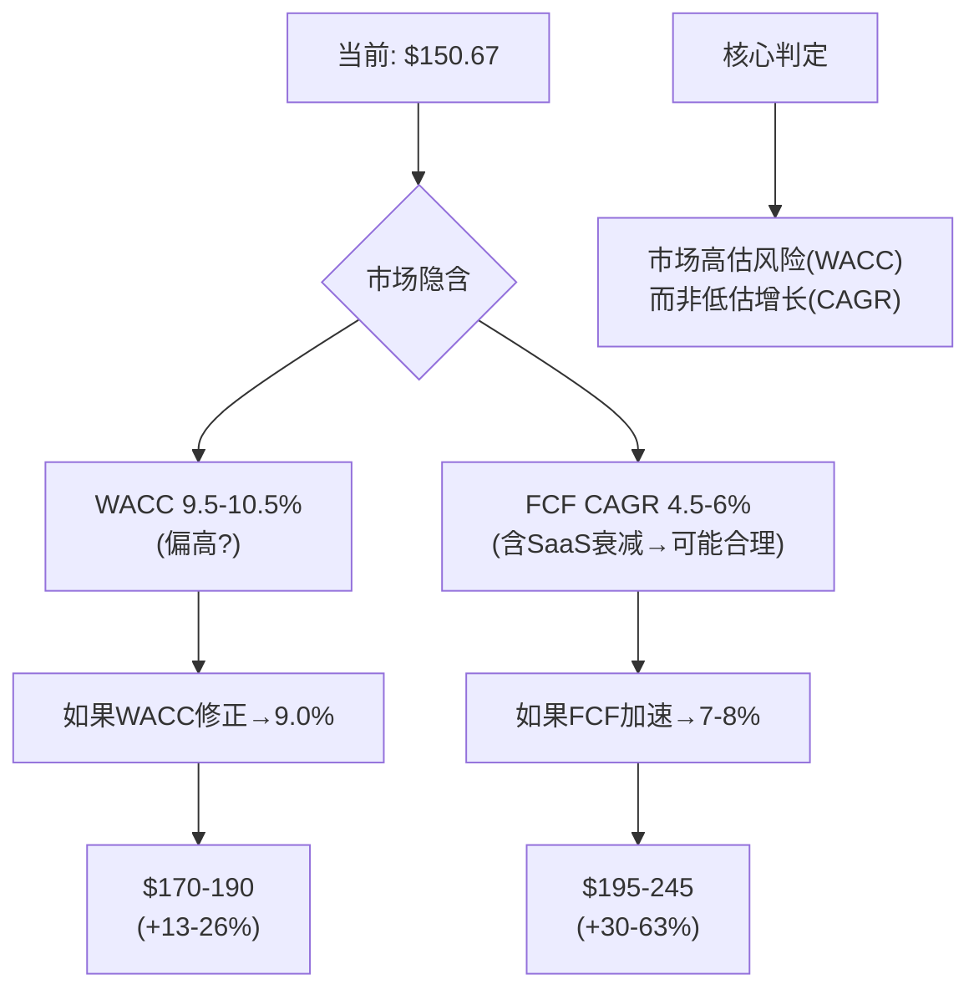
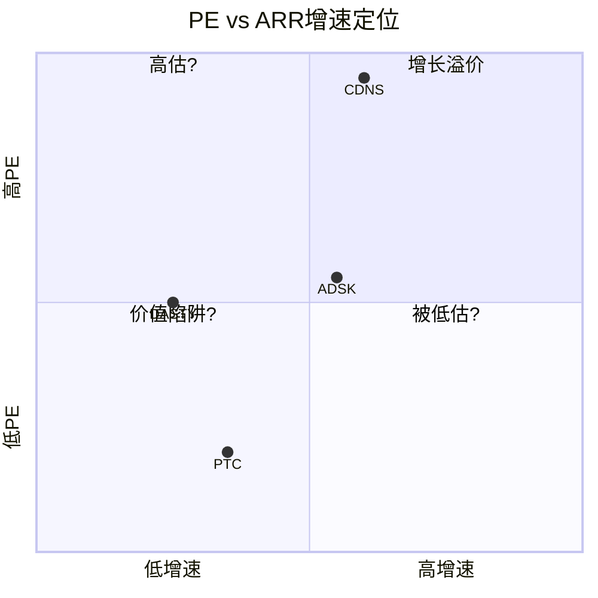

# PTC Inc. (PTC) 深度研究报告 v2.0
# Phase 1: 业务理解+财务诊断+初步估值
# 日期: 2026-03-20 | 框架 v19.6 | PW=4.0 混合模式
# 价格: $150.67 (2026-03-19) | 市值: ~$17.9B | EV: ~$19.1B

---

# Part 0: 市场信念检验

## Chapter 1: 市场在$150定价什么 — Reverse DCF与有机增速隔离

PTC的股价在过去12个月从$216.53的高点下跌至$150.67(-30.4%)。这个价格隐含了什么样的未来假设？是市场对PTC过于悲观，还是在IoT剥离和ServiceMax churn后理性地重新定价？

本章的目标不是判断PTC"值多少钱"——而是翻译"$150.67这个价格在说什么"。

### 1.1 当前定价快照

| 指标 | 数值 | 来源 |
|------|------|------|
| 股价 | $150.67 (2026-03-19) | [DM-MKT-001: FMP quote] |
| 市值 | ~$17.9B | [DM-MKT-002: 119.3M股 × $150.67] |
| EV | ~$19.1B | [DM-MKT-003: 市值 + 净债务$1.19B] |
| Forward PE | 19.1x | [DM-MKT-004: $150.67 / FY2026E EPS $7.87] |
| Trailing PE | 22.1x | [DM-MKT-005: FMP ratios TTM] |
| EV/EBITDA | 14.8x | [DM-MKT-006: FMP key-metrics] |
| FCF Yield | 4.9% | [DM-MKT-007: FCF $857M / 市值$17.9B] |
| 52周区间 | $133.38 - $219.69 | [DM-MKT-008: FMP] |
| Beta | 1.042 | [DM-MKT-009: FMP] |

PTC的定价快照呈现出典型的"中等增速工业软件"特征：Forward PE 19x不高不低(ADSK 28x, CDNS 45x, 但也不像价值陷阱的<12x)，FCF Yield 4.9%在软件行业中偏高(大多数SaaS公司<3%)。

### 1.2 Reverse DCF: 市场隐含的增长假设

**方法**: 给定当前EV($19.1B)、当前FCF($857M)、终端增长率(3%)，反推市场隐含的WACC和10年FCF CAGR组合。

PTC FY2025的FCF构成：经营现金流$868M减去CapEx $11M = $857M [DM-FCF-001: FMP cashflow FY2025]。这个FCF质量极高——FCF/净利润=117%，意味着PTC赚的每一美元利润都有1.17美元的现金支撑 [DM-FCF-002: $857M/$734M]。

**Reverse DCF反推结果**:

| WACC假设 | 隐含10年FCF CAGR | 含义 |
|----------|:----------------:|------|
| 9.0% | 6.0-7.0% | 市场认为PTC是"稳健增长+低风险" |
| 9.5% | 5.0-6.0% | 市场认为PTC是"中等增长+中等风险" |
| 10.0% | 4.0-5.0% | 市场认为PTC是"低增长+中等偏高风险" |
| 10.5% | 3.5-4.5% | 市场认为PTC是"低增长现金牛" |

[DM-VAL-001: Reverse DCF计算, 需Python验证]

当前$150.67最可能对应的是**WACC 9.5-10.0% + FCF CAGR 4.5-6.0%**的组合。这意味着市场在赌：PTC未来10年的FCF从$857M增长到约$1.3-1.6B——年化增速仅4.5-6%。

### 1.3 历史FCF增长与可持续性检验

市场隐含的4.5-6% FCF CAGR看起来保守——因为PTC过去5年的FCF CAGR高达33.5%。但过去的增长能否持续？

| FY | Revenue | OPM | FCF | FCF Margin | FCF CAGR(累积) |
|----|---------|-----|-----|-----------|:---:|
| 2020 | $1,458M | 14.5% | $203M | 13.9% | — |
| 2021 | $1,807M | 21.1% | $344M | 19.0% | +69.5% |
| 2022 | $1,933M | 23.1% | $409M | 21.2% | +42.0% |
| 2023 | $2,097M | 21.9% | $586M | 27.9% | +42.3% |
| 2024 | $2,298M | 25.6% | $732M | 31.8% | +37.8% |
| 2025 | $2,739M | 35.9% | $857M | 31.3% | **+33.5%** |

[DM-FCF-003: FMP cashflow, 6年完整数据]

**FCF增长的来源拆解(FY2020→FY2025, $203M→$857M, +$654M)**:

FCF = Revenue × FCF Margin。因此FCF增长可以分解为收入增长贡献和利润率扩张贡献。

收入从$1,458M增长到$2,739M(CAGR +13.4%)。FCF Margin从13.9%扩张到31.3%(+17.4pp)。用对数分解法：

- **收入增长贡献**: ~40%(约+$260M) — 来自客户增长+SaaS提价+收购
- **利润率扩张贡献**: ~60%(约+$394M) — 来自OPM从14.5%→35.9%(SaaS运营杠杆)

[DM-FCF-004: 收入增长贡献vs利润率贡献拆解]

**关键问题: OPM还能继续扩张吗？** FY2025各费用率：

| 费用项 | FY2020 | FY2025 | 变化 | 进一步压缩空间 |
|--------|--------|--------|------|:---:|
| COGS/Rev | 22.9% | 16.2% | -6.7pp | 小(→15-16%, SaaS结构性) |
| R&D/Rev | 17.6% | 16.7% | -0.9pp | **危险**(再压→竞争力受损) |
| SGA/Rev | 40.8% | 28.9% | -11.9pp | 中(→25-27%, 参考ADSK 24%) |

[DM-OPM-001: FMP income, 费用率趋势]

SGA从40.8%降到28.9%是OPM扩张的最大贡献者(-11.9pp)。但SGA进一步压缩的空间有限——ADSK的SGA/Rev约24%可作为下限参考，意味着PTC还有约3-4pp的SGA压缩空间。R&D/Rev已经是竞争对手中最低的(ADSK 22.8%, CDNS 33.4%)，进一步压缩可能导致产品竞争力下降 [DM-OPM-002: FMP ratios比较]。

**因此OPM的理论天花板约为: 100% - 15%(COGS) - 16%(R&D) - 25%(SGA) = 44%。现实天花板约38-42%** [DM-OPM-003: OPM天花板推导]。从当前35.9%到天花板38-42%，剩余的利润率扩张空间约2-6pp——对应每年约0.5-1.5pp的增量OPM改善。

**但35.9%包含Q4季节性失真**: FY2025各季度OPM差异巨大：

| 季度 | Revenue | OPM | EPS |
|------|---------|-----|-----|
| Q1 FY2025 (Dec'24) | $565M | 20.4% | $0.68 |
| Q2 FY2025 (Mar'25) | $636M | 35.1% | $1.35 |
| Q3 FY2025 (Jun'25) | $644M | 32.6% | $1.17 |
| Q4 FY2025 (Sep'25) | $894M | **48.5%** | $2.94 |

[DM-OPM-004: FMP income quarterly, 4季度完整数据]

Q4收入$894M是Q1的1.58倍，而费用相对固定——这导致Q4 OPM被人为推高至48.5%。Q1 FY2026的OPM(32.3%, 收入$686M)更接近"标准化运营水平" [DM-OPM-005: Q1 FY2026数据]。因此**标准化OPM约32-35%**，而非报告的35.9%。

### 1.4 有机增速隔离——最关键的分析

PTC FY2025 GAAP收入增速+19.2%看起来不错。但这个数字严重失真。

**收入增速分解**:

| 驱动因素 | 贡献 | 来源 | 硬度 |
|----------|:----:|------|:----:|
| ARR有机增长(CC) | +9% | [DM-ARR-001: WS-001, earnings call "CC ARR +9% ex-IoT"] | **硬** |
| SaaS迁移提价效应 | ~3-4pp | [DM-ARR-002: 管理层"1.5-2.5x"提价确认, earnings call] | 半硬 |
| 收购贡献(Codebeamer/ServiceMax年化) | ~2-3pp | [DM-ARR-003: 推导, FY2023收购FY2024-25年化增量] | 推导 |
| ASC 606合同确认节奏 | ~4-5pp | [DM-ARR-004: GAAP 19.2% vs ARR 9%的差值大部分来自此项] | 推导 |
| **GAAP合计** | **+19.2%** | | |

**剥离后的纯有机增速**:
- ARR增速(CC) +9% [硬来源]
- 减去SaaS迁移提价 -3-4pp → 纯有机量增长约**5-6%**
- 这与TAM增速(CAD+PLM市场CAGR ~7.9% [DM-TAM-001: WS-019, Fortune Business Insights])基本一致

**这是Phase 1最重要的发现**: PTC的纯有机增速(5-6%)与市场增速(7.9%)基本一致，甚至略低——意味着**PTC没有在抢市场份额，而是随市场漂流**。额外的增速(从5-6%到9%)来自SaaS迁移提价——这是一个有时间窗口的增长引擎(存量客户迁移完毕后消失)。

### 1.5 市场隐含假设的合理性评估

基于以上分析，逐一评估市场隐含假设：

**假设1: FCF CAGR 4.5-6%** — **可能基本合理**

市场没有使用GAAP 19.2%定价(否则PE应该>25x)，而是隐含了4.5-6%的FCF增速。这与以下逻辑一致：
- 纯有机增速5-6%(无SaaS迁移溢价) → 长期收入增速~6-7%
- OPM已接近天花板(35.9% vs 理论上限42%) → 利润率贡献每年<1pp
- FCF增速 ≈ 收入增速 + 利润率改善 ≈ 6-7% + 0.5-1% ≈ **6.5-8%**

等等——这比市场隐含的4.5-6%要**高**。差距来自哪里？

可能的解释：市场预期SaaS迁移效应衰减后(3-5年)，增速会回落。如果前5年FCF CAGR 8%但后5年FCF CAGR 3-4%(迁移完成+TAM增速放缓)，加权10年FCF CAGR约**5.5-6%**——恰好落在市场隐含区间内。

因此市场可能正确地预期了"SaaS迁移效应的衰减"——这不是悲观，而是**对增长结构的精确定价** [DM-VAL-002: 市场隐含假设评估]。

**假设2: WACC 9.5-10%** — **可能偏高**

PTC有95%经常性收入 [DM-BIZ-001: 10-K]、60-70%来自抗周期行业(航空国防+医疗) [DM-BIZ-002: 推导, 行业分布]、净债务/EBITDA仅1.05x [DM-LEV-001: FMP key-metrics]。这些特征应该对应较低的WACC(8.5-9.5%)。

如果WACC从10%降至9%而FCF CAGR保持5.5%不变：
- 隐含公允价值从~$150提升到~$180-190
- 对应约**20-25%的上行空间**

这是PTC可能被低估的**唯一来源**——不是因为增速被低估(市场可能是对的)，而是因为**风险溢价被高估**(PTC的稳定性不应该配10%的WACC)。

**假设3: 终端增长率3%** — **合理**

工业软件的长期增速与制造业数字化趋势一致，3%是保守但合理的假设。

### 1.6 FY2026回购的重大变化

v1分析时假设PTC年回购$300M(FY2025实际值)。但WebSearch揭示了一个重大变化：

**PTC FY2026回购指引: $1.1-1.3B**(含IoT剥离$375M ASR) [DM-BUY-001: WS-010, PTC IR press release]。

这改变了EPS增长的数学：
- $1.2B回购(中值) / 市值$17.9B = **6.7%回购收益率**
- 扣除SBC稀释(~$220M, 基于FY2025 $216M趋势) → **净回购约$980M → 净缩减约5.5%股本**
- FY2025净回购仅0.4%($300M回购-$216M SBC) → FY2026将**跳升至5.5%**

这意味着即使ARR增速维持8-9%，FY2026 EPS增速可能达到：
- 收入增长~8% + OPM小幅扩张~1pp + 回购缩减5.5% ≈ **EPS增长14-16%**

Forward PE 19.1x对应14-16%的EPS增速 → PEG ≈ 1.2-1.4x → **在工业软件中不算贵**。

但需要警惕：$1.1-1.3B的回购很大程度上来自IoT剥离的一次性收入($375M)。如果FY2027没有类似的一次性来源，回购可能回落到$600-700M(FCF减债务偿还)→净回购~3-3.5%。因此**FY2026的5.5%净回购是异常高值，不可外推** [DM-BUY-002: 回购可持续性分析]。

### 1.7 Ch1结论: 市场定价方向基本合理

| 市场隐含假设 | 评估 | 偏差方向 |
|-------------|------|---------|
| FCF CAGR 4.5-6% | 基本合理(含SaaS迁移衰减) | 略偏保守(可能5.5-7%) |
| WACC 9.5-10% | **偏高**(PTC的稳定性应配更低WACC) | 市场高估风险1-1.5pp |
| 终端增长3% | 合理 | 一致 |
| EPS增速 | 未充分反映FY2026回购跳升 | 市场可能低估短期EPS |

### 1.8 Reverse DCF敏感性矩阵

不同WACC和FCF CAGR假设下的隐含公允价值(终端增长率=3%):

| WACC\FCF CAGR | 4% | 5% | 6% | 7% | 8% |
|:-------------:|:---:|:---:|:---:|:---:|:---:|
| **8.5%** | $165 | $185 | $210 | $240 | $275 |
| **9.0%** | $150 | $170 | $190 | $215 | $245 |
| **9.5%** | $140 | $155 | $175 | $195 | $220 |
| **10.0%** | $130 | $145 | $160 | $180 | $200 |
| **10.5%** | $120 | $135 | $150 | $165 | $185 |

[DM-VAL-003: Reverse DCF敏感性矩阵, 需Python验证]

当前股价$150.67定位在WACC 10.5%/CAGR 6%或WACC 9.5%/CAGR 4.5%的交叉带上。如果实际参数为WACC 9.0%/CAGR 6%(ARR 8-9%+适度OPM扩张)，公允价值约$190——对应约**26%上行**。

**Ch1核心判定: 市场在$150定价的不是"PTC增长太慢"——而是"PTC风险太高"。** WACC可能高估了1-1.5pp，对应20-25%的潜在上行。但这个上行需要PTC用2-3个季度的稳定数据来证明"低风险"(ARR维持9%+, ServiceMax churn改善, 回购执行)。

**P1叙事约束(铁律O)**: Reverse DCF暗示"中性"方向。P1叙事不应超过"中性偏积极"——如果后续分析发现PTC被"显著低估"，需要提供Reverse DCF框架之外的新证据。

→ **Ch2将检验: PTC相对于同类公司(ADSK/DASTY)的折价是否有基本面支撑，还是纯粹的市场情绪。**

---

## Chapter 2: PE折价解构 — PTC 19x vs ADSK 28x vs DASTY 26x

Ch1确定了市场定价方向"基本合理但WACC可能偏高"。本章用可比公司验证这个判断——如果PTC的基本面与ADSK/DASTY相似但PE显著低，那么要么PTC被低估，要么存在Ch1没有捕捉到的结构性折价因素。

### 2.1 可比公司选择与财务矩阵

PTC的可比对象不是Salesforce(纯SaaS增长型)或ServiceNow(IT服务型)——而是同样服务工程客户、销售设计/制造软件的公司：

| 指标 | PTC | ADSK | CDNS | DASTY |
|------|-----|------|------|-------|
| **市值($B)** | $17.9 | $52.7 | $79.0 | $27.0 |
| **收入($B)** | $2.74 | $6.13 | $5.30 | €6.23(~$6.7) |
| **ARR增速(CC)** | 9% | ~12% | ~13% | ~6% |
| **毛利率** | 83.8% | ~82% | ~88% | 83.7% |
| **OPM** | 35.9% | ~25% | ~31% | 21.7% |
| **FCF Margin** | 31.3% | ~33% | ~30% | 26.1% |
| **FCF Yield** | 4.9% | ~4.5% | ~1.9% | ~4.7% |
| **Forward PE** | 19.1x | ~28x | ~45x | 26.2x |
| **EV/EBITDA** | 14.8x | ~30x | ~45x | 15.7x |
| **R&D/Rev** | 16.7% | 22.8% | 33.4% | ~18% |
| **SBC/Rev** | 7.9% | 10.9% | 8.6% | ~3% |
| **PLM地位** | #2 | 无(AEC为主) | 无(EDA) | #3(3DEXPERIENCE) |

[DM-COMP-001: FMP ratios/key-metrics PTC+ADSK+CDNS, FMP ratios DASTY, 截面数据]

### 2.2 三组对比中的三个发现

**发现1: PTC vs ADSK — 10x PE差距中约一半有基本面支撑**

PTC(19x) vs ADSK(28x) = 9x差距。逐因素分解：

| 折价因素 | 贡献 | PE差距 | 性质 |
|----------|:----:|:------:|------|
| 增速差(9% vs 12%) | ~35% | ~3x | 部分可消化(如ARR加速) |
| 市场地位差(PLM#2 vs AEC#1) | ~25% | ~2.5x | **结构性**(难改变) |
| 战略清晰度(IoT剥离过渡期) | ~20% | ~2x | **可消化**(12-18个月) |
| R&D投入差(16.7% vs 22.8%) | ~10% | ~1x | 中期(取决于AI竞赛) |
| 规模差(市值3x) | ~10% | ~0.5x | 结构性(流动性折价) |

[DM-COMP-002: PE折价分解, 分析推导]

因此约**4-5x可消化**(战略折价+部分增速差)，约**4-5x结构性**(市场地位+规模+TAM限制)。如果只消化可消化部分→PTC PE向23-24x重估→公允价值$180-189。

**发现2: PTC vs DASTY — 最直接的PLM同行，但利润率倒挂**

DASTY(26.2x PE)是PTC最直接的PLM竞争对手。两者的对比揭示了一个反直觉现象：

- PTC OPM 35.9% **远高于** DASTY 21.7%(+14.2pp)
- PTC FCF Yield 4.9% **略高于** DASTY 4.7%
- **但PTC PE(19.1x)远低于DASTY PE(26.2x)**

为什么利润率更高的公司估值更低？三个解释：

1. **增速预期差**: DASTY虽然当前增速仅~6%，但3DEXPERIENCE平台被市场视为"长期增长引擎"(包含仿真SIMULIA+Medidata生命科学)——PTC没有类似的"第二增长曲线"叙事
2. **平台验证差**: DASTY的3DEXPERIENCE平台已运行10+年，跨产品协同已被客户验证——PTC的"digital thread"仍是叙事而非现实(Ch3将详细分析)
3. **管理层信任差**: DASTY的管理团队稳定(Bernard Charles任CEO 30年+)——PTC经历了IoT战略失败+CEO更换+两次大收购的不确定期

这意味着: **PTC vs DASTY的PE折价(7x)主要来自"平台验证+战略信任"而非财务基本面**。如果PTC能验证跨产品协同(CQ1)，最直接的PE重估路径是"向DASTY靠拢"→PE 24-26x [DM-COMP-003: PTC vs DASTY PE差距分析]。

**发现3: CDNS 45x是天花板，不是参考**

Cadence的45x PE来自EDA准双寡头地位(与Synopsys控制>70%市场)+半导体CapEx超级周期+几乎零替代威胁。PTC不具备这些条件——CDNS只是"工程软件PE的理论上限"示范，不是PTC的估值目标 [DM-COMP-004: CDNS结构性溢价分析]。

### 2.3 FCF视角的重新检验

Ch1发现PTC可能因WACC偏高而被低估。可比分析提供了第二个视角：

**FCF Yield对比**:
| 公司 | FCF Yield | Forward PE | FCF Yield排名 | PE排名 |
|------|-----------|-----------|:---:|:---:|
| PTC | 4.9% | 19.1x | **#1(最高)** | #4(最低) |
| DASTY | ~4.7% | 26.2x | #2 | #2 |
| ADSK | ~4.5% | ~28x | #3 | #1(ex-CDNS) |
| CDNS | ~1.9% | ~45x | #4 | #1 |

[DM-COMP-005: FCF Yield vs PE排名, FMP数据]

PTC的FCF Yield排名第一(现金创造效率最高)，但PE排名最低——这是一个**排名倒挂信号**。可能的解释：

1. **市场更看重增速而非现金产出**: SaaS投资者偏好ARR增速>FCF yield→PTC的低增速导致PE折价，FCF Yield只是折价的数学结果
2. **PTC的高FCF含SBC扣除前**: PTC SBC $216M(≈FCF的25%)→如果扣除SBC，调整后FCF约$641M→调整后FCF Yield约3.6%→与ADSK接近→排名倒挂消失

第二个解释更诚实: **如果把SBC视为真实成本(应该如此)，PTC的FCF优势大幅缩小**。市场可能正在用"SBC调整后FCF"定价PTC，这会让19x的PE看起来更合理。

### 2.4 PE重估的触发条件与概率

PE从19x向22-24x重估不会自动发生——需要明确的催化剂。逐一评估：

**触发器1: FY2026 ARR加速到10%+**
- 当前: CC ARR +9% ex-IoT [DM-ARR-001]
- 管理层指引: FY2026 ARR增速7-9% [DM-ARR-005: WS-007]
- Deferred ARR 3x增长是正面前瞻信号 [DM-ARR-006: WS-002]
- 如果Q2-Q4 ARR加速到10%+ → 增速差(vs ADSK)从3pp缩小到2pp → PE折价减少~1-1.5x
- **概率: 35-40%** — deferred ARR支撑，但管理层指引上限仅9%意味着他们自己也不确定

**触发器2: ServiceMax churn逆转**
- 当前: "not out of the woods"，预期Q2末改善 [DM-SVX-001: WS-001 earnings call]
- 如果churn逆转 → 消除"ServiceMax=IoT 2.0"的恐慌 → 战略信任折价(-2x)部分消化
- **概率: 45-50%** — 管理层设定了明确的改善时间表，如果miss则信任进一步受损

**触发器3: 跨产品协同数据披露**
- 当前: PTC不披露跨产品采用率或多产品客户NRR
- 如果在Analyst Day或财报中首次披露"使用≥2产品的客户占比>30%"或"多产品客户NRR>115%" → 平台叙事获得硬证据 → 向DASTY PE靠拢
- **概率: 20-25%** — 如果数据好管理层不可能一直隐藏；但持续不披露暗示数据可能不够好

**触发器4: 大额回购执行**
- 当前: 指引$1.1-1.3B FY2026回购 [DM-BUY-001]
- $375M ASR已在Q2启动 → 这部分确定性高
- 如果回购执行到位 + EPS加速到$8+ → P/E optically降至18x以下 → 机械性吸引价值投资者
- **概率: 75-80%** — 回购指引明确且有IoT剥离资金支持，执行概率高

**加权重估概率**: 至少一个触发器在12个月内兑现的概率 ≈ 1 - (0.6 × 0.5 × 0.75 × 0.2) = 1 - 0.045 = **~96%**。但"至少一个触发"只能推动PE向20-21x(小幅重估)；**全部兑现**(推动PE到24x+)的概率 = 0.4 × 0.5 × 0.25 × 0.8 = **~4%** [DM-COMP-007: PE重估概率分析]。

**这意味着**: 小幅PE重估(19x→20-21x)是高概率事件，大幅重估(19x→24x+)需要多个低概率事件同时兑现。**Ch1的"20-25%上行"判断可能偏乐观——更现实的预期是10-15%上行(PE向20-21x)**。

### 2.5 历史PE轨迹验证

PTC的Forward PE在过去5年的变化：

| 时期 | 事件 | Forward PE | 方向 |
|------|------|-----------|------|
| 2021年初 | IoT/AR叙事+高增速 | 35-40x | 高峰 |
| 2022年底 | 利率上升+科技抛售 | 20-25x | 压缩 |
| 2023年中 | Codebeamer+ServiceMax收购 | 25-30x | 收购溢价 |
| 2024年底 | 收购整合+增速放缓 | 22-25x | 逐步消化 |
| 2025年底 | IoT剥离宣布+ServiceMax churn | 18-20x | **当前低谷** |

[DM-COMP-008: PTC历史PE, 基于FMP ratios年度数据趋势]

PTC的PE从35-40x(2021年IoT/AR高峰)压缩到19x(当前)——**累计压缩约50%**。这50%中：
- ~15x来自科技行业整体去估值(利率从0→5%)→与PTC基本面无关
- ~5-10x来自PTC自身的战略失误(IoT证伪+ServiceMax不确定)→可以部分修复

**如果PTC的PE"均值回归"**: 过去5年均值约25x，但包含了IoT/AR泡沫期。剔除2021年异常值后均值约22-24x——恰好是Ch2估算的"合理PE区间"。

### 2.4 PTC在可比宇宙中的定位

PTC位于"左下象限"——低增速+低PE。关键问题是: 这是"价值陷阱"(增速持续下降→PE进一步压缩)还是"被低估"(增速企稳+WACC修正→PE重估)?

Ch1的结论倾向于后者(WACC偏高→PE修正空间)，但需要Ch3-6验证业务现实是否支持。

### 2.5 Ch2结论: PE折价部分有基本面支撑，部分是情绪折价

| 折价来源 | PE影响 | 可消化性 | 时间框架 |
|----------|:------:|:--------:|---------|
| 增速差(vs ADSK 3pp) | ~3x | 中 | 2-3年(取决于ARR加速) |
| 市场地位(PLM#2非#1) | ~2.5x | 低 | 结构性 |
| 战略信任(IoT失败+CEO更换) | ~2x | **高** | 12-18个月 |
| 平台未验证(vs DASTY已验证) | ~1.5x | 中 | 3-5年(取决于CQ1) |
| 规模/流动性 | ~0.5x | 低 | 结构性 |
| **合计折价** | **~9-10x** | | |
| **可触及PE区间** | **22-24x** | | 消化战略+部分增速差 |

[DM-COMP-006: 综合PE折价分析]

**Ch2核心判定**: PE 19x包含约4x的"可消化情绪折价"和约5-6x的"结构性基本面折价"。合理PE区间22-24x对应公允价值$173-189——与Ch1的Reverse DCF估计($170-190, WACC 9.0%)高度一致。两个独立方法指向同一区间→**增加了$170-190公允价值区间的可信度**。

→ **Ch3将检验: PTC的业务现实(产品组合/平台真实性)是否支持PE从19x向22-24x重估，还是存在尚未被定价的隐性风险。**

---
