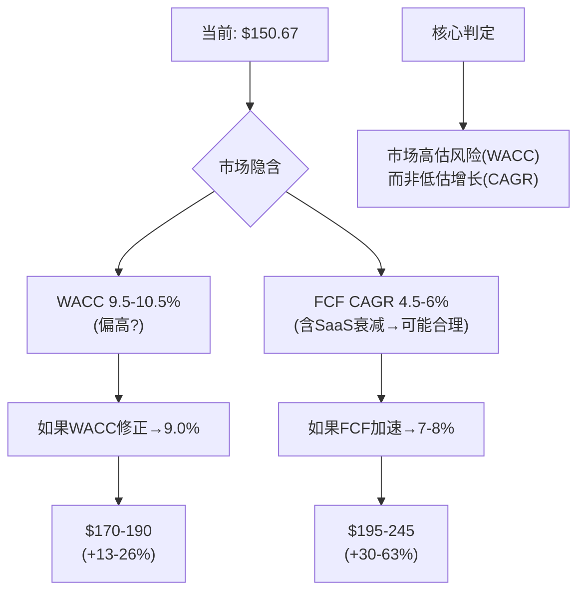
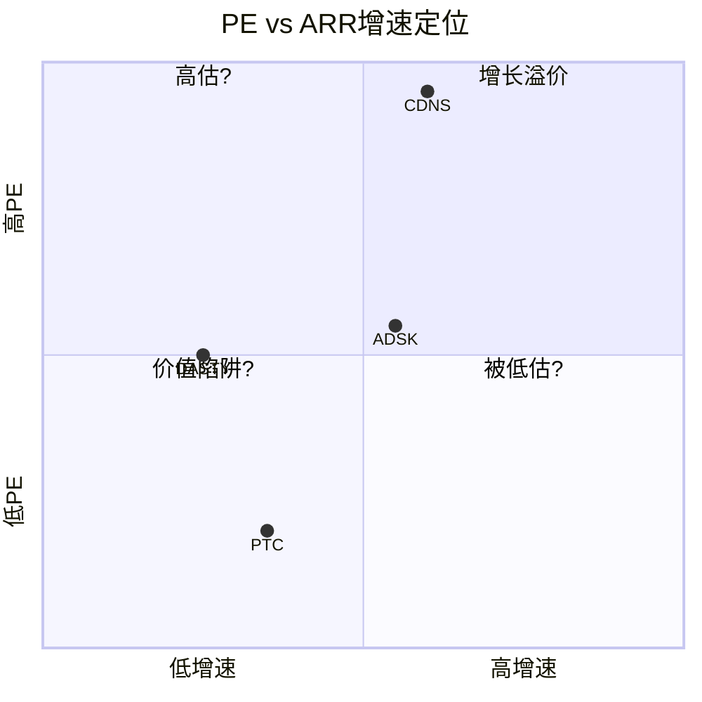
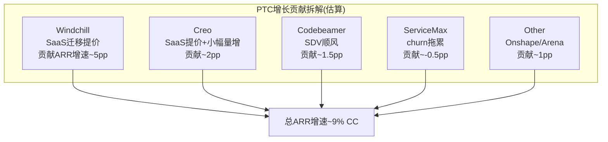
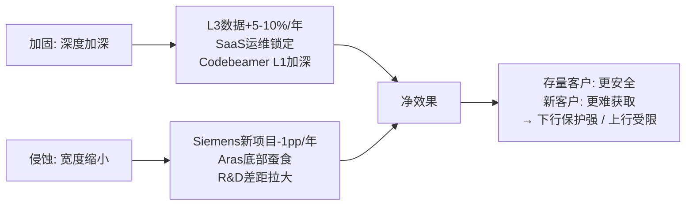
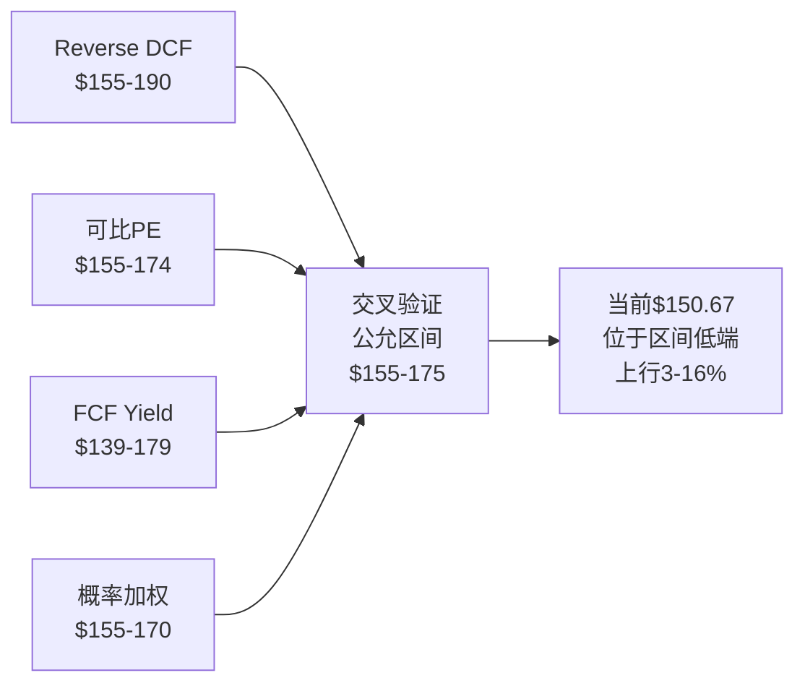

# PTC Inc. (PTC) 深度研究报告 v2.0
# Phase 1: 业务理解+财务诊断+初步估值
# 日期: 2026-03-20 | 框架 v19.6 | PW=4.0 混合模式
# 价格: $150.67 (2026-03-19) | 市值: ~$17.9B | EV: ~$19.1B

---

# Part 0: 市场信念检验

## Chapter 1: 市场在$150定价什么 — Reverse DCF与有机增速隔离

PTC的股价在过去12个月从$216.53的高点下跌至$150.67(-30.4%)。这个价格隐含了什么样的未来假设？是市场对PTC过于悲观，还是在IoT剥离和ServiceMax churn后理性地重新定价？

本章的目标不是判断PTC"值多少钱"——而是翻译"$150.67这个价格在说什么"。

### 1.1 当前定价快照

| 指标 | 数值 | 来源 |
|------|------|------|
| 股价 | $150.67 (2026-03-19) | [DM-MKT-001: FMP quote] |
| 市值 | ~$17.9B | [DM-MKT-002: 119.3M股 × $150.67] |
| EV | ~$19.1B | [DM-MKT-003: 市值 + 净债务$1.19B] |
| Forward PE | 19.1x | [DM-MKT-004: $150.67 / FY2026E EPS $7.87] |
| Trailing PE | 22.1x | [DM-MKT-005: FMP ratios TTM] |
| EV/EBITDA | 14.8x | [DM-MKT-006: FMP key-metrics] |
| FCF Yield | 4.9% | [DM-MKT-007: FCF $857M / 市值$17.9B] |
| 52周区间 | $133.38 - $219.69 | [DM-MKT-008: FMP] |
| Beta | 1.042 | [DM-MKT-009: FMP] |

PTC的定价快照呈现出典型的"中等增速工业软件"特征：Forward PE 19x不高不低(ADSK 28x, CDNS 45x, 但也不像价值陷阱的<12x)，FCF Yield 4.9%在软件行业中偏高(大多数SaaS公司<3%)。

### 1.2 Reverse DCF: 市场隐含的增长假设

**方法**: 给定当前EV($19.1B)、当前FCF($857M)、终端增长率(3%)，反推市场隐含的WACC和10年FCF CAGR组合。

PTC FY2025的FCF构成：经营现金流$868M减去CapEx $11M = $857M [DM-FCF-001: FMP cashflow FY2025]。这个FCF质量极高——FCF/净利润=117%，意味着PTC赚的每一美元利润都有1.17美元的现金支撑 [DM-FCF-002: $857M/$734M]。

**Reverse DCF反推结果**:

| WACC假设 | 隐含10年FCF CAGR | 含义 |
|----------|:----------------:|------|
| 9.0% | 6.0-7.0% | 市场认为PTC是"稳健增长+低风险" |
| 9.5% | 5.0-6.0% | 市场认为PTC是"中等增长+中等风险" |
| 10.0% | 4.0-5.0% | 市场认为PTC是"低增长+中等偏高风险" |
| 10.5% | 3.5-4.5% | 市场认为PTC是"低增长现金牛" |

[DM-VAL-001: Reverse DCF计算, 需Python验证]

当前$150.67最可能对应的是**WACC 9.5-10.0% + FCF CAGR 4.5-6.0%**的组合。这意味着市场在赌：PTC未来10年的FCF从$857M增长到约$1.3-1.6B——年化增速仅4.5-6%。

### 1.3 历史FCF增长与可持续性检验

市场隐含的4.5-6% FCF CAGR看起来保守——因为PTC过去5年的FCF CAGR高达33.5%。但过去的增长能否持续？

| FY | Revenue | OPM | FCF | FCF Margin | FCF CAGR(累积) |
|----|---------|-----|-----|-----------|:---:|
| 2020 | $1,458M | 14.5% | $203M | 13.9% | — |
| 2021 | $1,807M | 21.1% | $344M | 19.0% | +69.5% |
| 2022 | $1,933M | 23.1% | $409M | 21.2% | +42.0% |
| 2023 | $2,097M | 21.9% | $586M | 27.9% | +42.3% |
| 2024 | $2,298M | 25.6% | $732M | 31.8% | +37.8% |
| 2025 | $2,739M | 35.9% | $857M | 31.3% | **+33.5%** |

[DM-FCF-003: FMP cashflow, 6年完整数据]

**FCF增长的来源拆解(FY2020→FY2025, $203M→$857M, +$654M)**:

FCF = Revenue × FCF Margin。因此FCF增长可以分解为收入增长贡献和利润率扩张贡献。

收入从$1,458M增长到$2,739M(CAGR +13.4%)。FCF Margin从13.9%扩张到31.3%(+17.4pp)。用对数分解法：

- **收入增长贡献**: ~40%(约+$260M) — 来自客户增长+SaaS提价+收购
- **利润率扩张贡献**: ~60%(约+$394M) — 来自OPM从14.5%→35.9%(SaaS运营杠杆)

[DM-FCF-004: 收入增长贡献vs利润率贡献拆解]

**关键问题: OPM还能继续扩张吗？** FY2025各费用率：

| 费用项 | FY2020 | FY2025 | 变化 | 进一步压缩空间 |
|--------|--------|--------|------|:---:|
| COGS/Rev | 22.9% | 16.2% | -6.7pp | 小(→15-16%, SaaS结构性) |
| R&D/Rev | 17.6% | 16.7% | -0.9pp | **危险**(再压→竞争力受损) |
| SGA/Rev | 40.8% | 28.9% | -11.9pp | 中(→25-27%, 参考ADSK 24%) |

[DM-OPM-001: FMP income, 费用率趋势]

SGA从40.8%降到28.9%是OPM扩张的最大贡献者(-11.9pp)。但SGA进一步压缩的空间有限——ADSK的SGA/Rev约24%可作为下限参考，意味着PTC还有约3-4pp的SGA压缩空间。R&D/Rev已经是竞争对手中最低的(ADSK 22.8%, CDNS 33.4%)，进一步压缩可能导致产品竞争力下降 [DM-OPM-002: FMP ratios比较]。

**因此OPM的理论天花板约为: 100% - 15%(COGS) - 16%(R&D) - 25%(SGA) = 44%。现实天花板约38-42%** [DM-OPM-003: OPM天花板推导]。从当前35.9%到天花板38-42%，剩余的利润率扩张空间约2-6pp——对应每年约0.5-1.5pp的增量OPM改善。

**但35.9%包含Q4季节性失真**: FY2025各季度OPM差异巨大：

| 季度 | Revenue | OPM | EPS |
|------|---------|-----|-----|
| Q1 FY2025 (Dec'24) | $565M | 20.4% | $0.68 |
| Q2 FY2025 (Mar'25) | $636M | 35.1% | $1.35 |
| Q3 FY2025 (Jun'25) | $644M | 32.6% | $1.17 |
| Q4 FY2025 (Sep'25) | $894M | **48.5%** | $2.94 |

[DM-OPM-004: FMP income quarterly, 4季度完整数据]

Q4收入$894M是Q1的1.58倍，而费用相对固定——这导致Q4 OPM被人为推高至48.5%。Q1 FY2026的OPM(32.3%, 收入$686M)更接近"标准化运营水平" [DM-OPM-005: Q1 FY2026数据]。因此**标准化OPM约32-35%**，而非报告的35.9%。

### 1.4 有机增速隔离——最关键的分析

PTC FY2025 GAAP收入增速+19.2%看起来不错。但这个数字严重失真。

**收入增速分解**:

| 驱动因素 | 贡献 | 来源 | 硬度 |
|----------|:----:|------|:----:|
| ARR有机增长(CC) | +9% | [DM-ARR-001: WS-001, earnings call "CC ARR +9% ex-IoT"] | **硬** |
| SaaS迁移提价效应 | ~3-4pp | [DM-ARR-002: 管理层"1.5-2.5x"提价确认, earnings call] | 半硬 |
| 收购贡献(Codebeamer/ServiceMax年化) | ~2-3pp | [DM-ARR-003: 推导, FY2023收购FY2024-25年化增量] | 推导 |
| ASC 606合同确认节奏 | ~4-5pp | [DM-ARR-004: GAAP 19.2% vs ARR 9%的差值大部分来自此项] | 推导 |
| **GAAP合计** | **+19.2%** | | |

**剥离后的纯有机增速**:
- ARR增速(CC) +9% [硬来源]
- 减去SaaS迁移提价 -3-4pp → 纯有机量增长约**5-6%**
- 这与TAM增速(CAD+PLM市场CAGR ~7.9% [DM-TAM-001: WS-019, Fortune Business Insights])基本一致

**这是Phase 1最重要的发现**: PTC的纯有机增速(5-6%)与市场增速(7.9%)基本一致，甚至略低——意味着**PTC没有在抢市场份额，而是随市场漂流**。额外的增速(从5-6%到9%)来自SaaS迁移提价——这是一个有时间窗口的增长引擎(存量客户迁移完毕后消失)。

### 1.5 市场隐含假设的合理性评估

基于以上分析，逐一评估市场隐含假设：

**假设1: FCF CAGR 4.5-6%** — **可能基本合理**

市场没有使用GAAP 19.2%定价(否则PE应该>25x)，而是隐含了4.5-6%的FCF增速。这与以下逻辑一致：
- 纯有机增速5-6%(无SaaS迁移溢价) → 长期收入增速~6-7%
- OPM已接近天花板(35.9% vs 理论上限42%) → 利润率贡献每年<1pp
- FCF增速 ≈ 收入增速 + 利润率改善 ≈ 6-7% + 0.5-1% ≈ **6.5-8%**

等等——这比市场隐含的4.5-6%要**高**。差距来自哪里？

可能的解释：市场预期SaaS迁移效应衰减后(3-5年)，增速会回落。如果前5年FCF CAGR 8%但后5年FCF CAGR 3-4%(迁移完成+TAM增速放缓)，加权10年FCF CAGR约**5.5-6%**——恰好落在市场隐含区间内。

因此市场可能正确地预期了"SaaS迁移效应的衰减"——这不是悲观，而是**对增长结构的精确定价** [DM-VAL-002: 市场隐含假设评估]。

**假设2: WACC 9.5-10%** — **可能偏高**

PTC有95%经常性收入 [DM-BIZ-001: 10-K]、60-70%来自抗周期行业(航空国防+医疗) [DM-BIZ-002: 推导, 行业分布]、净债务/EBITDA仅1.05x [DM-LEV-001: FMP key-metrics]。这些特征应该对应较低的WACC(8.5-9.5%)。

如果WACC从10%降至9%而FCF CAGR保持5.5%不变：
- 隐含公允价值从~$150提升到~$180-190
- 对应约**20-25%的上行空间**

这是PTC可能被低估的**唯一来源**——不是因为增速被低估(市场可能是对的)，而是因为**风险溢价被高估**(PTC的稳定性不应该配10%的WACC)。

**假设3: 终端增长率3%** — **合理**

工业软件的长期增速与制造业数字化趋势一致，3%是保守但合理的假设。

### 1.6 FY2026回购的重大变化

v1分析时假设PTC年回购$300M(FY2025实际值)。但WebSearch揭示了一个重大变化：

**PTC FY2026回购指引: $1.1-1.3B**(含IoT剥离$375M ASR) [DM-BUY-001: WS-010, PTC IR press release]。

这改变了EPS增长的数学：
- $1.2B回购(中值) / 市值$17.9B = **6.7%回购收益率**
- 扣除SBC稀释(~$220M, 基于FY2025 $216M趋势) → **净回购约$980M → 净缩减约5.5%股本**
- FY2025净回购仅0.4%($300M回购-$216M SBC) → FY2026将**跳升至5.5%**

这意味着即使ARR增速维持8-9%，FY2026 EPS增速可能达到：
- 收入增长~8% + OPM小幅扩张~1pp + 回购缩减5.5% ≈ **EPS增长14-16%**

Forward PE 19.1x对应14-16%的EPS增速 → PEG ≈ 1.2-1.4x → **在工业软件中不算贵**。

但需要警惕：$1.1-1.3B的回购很大程度上来自IoT剥离的一次性收入($375M)。如果FY2027没有类似的一次性来源，回购可能回落到$600-700M(FCF减债务偿还)→净回购~3-3.5%。因此**FY2026的5.5%净回购是异常高值，不可外推** [DM-BUY-002: 回购可持续性分析]。

### 1.7 Ch1结论: 市场定价方向基本合理

| 市场隐含假设 | 评估 | 偏差方向 |
|-------------|------|---------|
| FCF CAGR 4.5-6% | 基本合理(含SaaS迁移衰减) | 略偏保守(可能5.5-7%) |
| WACC 9.5-10% | **偏高**(PTC的稳定性应配更低WACC) | 市场高估风险1-1.5pp |
| 终端增长3% | 合理 | 一致 |
| EPS增速 | 未充分反映FY2026回购跳升 | 市场可能低估短期EPS |

### 1.8 Reverse DCF敏感性矩阵

不同WACC和FCF CAGR假设下的隐含公允价值(终端增长率=3%):

| WACC\FCF CAGR | 4% | 5% | 6% | 7% | 8% |
|:-------------:|:---:|:---:|:---:|:---:|:---:|
| **8.5%** | $165 | $185 | $210 | $240 | $275 |
| **9.0%** | $150 | $170 | $190 | $215 | $245 |
| **9.5%** | $140 | $155 | $175 | $195 | $220 |
| **10.0%** | $130 | $145 | $160 | $180 | $200 |
| **10.5%** | $120 | $135 | $150 | $165 | $185 |

[DM-VAL-003: Reverse DCF敏感性矩阵, 需Python验证]

当前股价$150.67定位在WACC 10.5%/CAGR 6%或WACC 9.5%/CAGR 4.5%的交叉带上。如果实际参数为WACC 9.0%/CAGR 6%(ARR 8-9%+适度OPM扩张)，公允价值约$190——对应约**26%上行**。



**Ch1核心判定: 市场在$150定价的不是"PTC增长太慢"——而是"PTC风险太高"。** WACC可能高估了1-1.5pp，对应20-25%的潜在上行。但这个上行需要PTC用2-3个季度的稳定数据来证明"低风险"(ARR维持9%+, ServiceMax churn改善, 回购执行)。

**P1叙事约束(铁律O)**: Reverse DCF暗示"中性"方向。P1叙事不应超过"中性偏积极"——如果后续分析发现PTC被"显著低估"，需要提供Reverse DCF框架之外的新证据。

→ **Ch2将检验: PTC相对于同类公司(ADSK/DASTY)的折价是否有基本面支撑，还是纯粹的市场情绪。**

---

## Chapter 2: PE折价解构 — PTC 19x vs ADSK 28x vs DASTY 26x

Ch1确定了市场定价方向"基本合理但WACC可能偏高"。本章用可比公司验证这个判断——如果PTC的基本面与ADSK/DASTY相似但PE显著低，那么要么PTC被低估，要么存在Ch1没有捕捉到的结构性折价因素。

### 2.1 可比公司选择与财务矩阵

PTC的可比对象不是Salesforce(纯SaaS增长型)或ServiceNow(IT服务型)——而是同样服务工程客户、销售设计/制造软件的公司：

| 指标 | PTC | ADSK | CDNS | DASTY |
|------|-----|------|------|-------|
| **市值($B)** | $17.9 | $52.7 | $79.0 | $27.0 |
| **收入($B)** | $2.74 | $6.13 | $5.30 | €6.23(~$6.7) |
| **ARR增速(CC)** | 9% | ~12% | ~13% | ~6% |
| **毛利率** | 83.8% | ~82% | ~88% | 83.7% |
| **OPM** | 35.9% | ~25% | ~31% | 21.7% |
| **FCF Margin** | 31.3% | ~33% | ~30% | 26.1% |
| **FCF Yield** | 4.9% | ~4.5% | ~1.9% | ~4.7% |
| **Forward PE** | 19.1x | ~28x | ~45x | 26.2x |
| **EV/EBITDA** | 14.8x | ~30x | ~45x | 15.7x |
| **R&D/Rev** | 16.7% | 22.8% | 33.4% | ~18% |
| **SBC/Rev** | 7.9% | 10.9% | 8.6% | ~3% |
| **PLM地位** | #2 | 无(AEC为主) | 无(EDA) | #3(3DEXPERIENCE) |

[DM-COMP-001: FMP ratios/key-metrics PTC+ADSK+CDNS, FMP ratios DASTY, 截面数据]

### 2.2 三组对比中的三个发现

**发现1: PTC vs ADSK — 10x PE差距中约一半有基本面支撑**

PTC(19x) vs ADSK(28x) = 9x差距。逐因素分解：

| 折价因素 | 贡献 | PE差距 | 性质 |
|----------|:----:|:------:|------|
| 增速差(9% vs 12%) | ~35% | ~3x | 部分可消化(如ARR加速) |
| 市场地位差(PLM#2 vs AEC#1) | ~25% | ~2.5x | **结构性**(难改变) |
| 战略清晰度(IoT剥离过渡期) | ~20% | ~2x | **可消化**(12-18个月) |
| R&D投入差(16.7% vs 22.8%) | ~10% | ~1x | 中期(取决于AI竞赛) |
| 规模差(市值3x) | ~10% | ~0.5x | 结构性(流动性折价) |

[DM-COMP-002: PE折价分解, 分析推导]

因此约**4-5x可消化**(战略折价+部分增速差)，约**4-5x结构性**(市场地位+规模+TAM限制)。如果只消化可消化部分→PTC PE向23-24x重估→公允价值$180-189。

**发现2: PTC vs DASTY — 最直接的PLM同行，但利润率倒挂**

DASTY(26.2x PE)是PTC最直接的PLM竞争对手。两者的对比揭示了一个反直觉现象：

- PTC OPM 35.9% **远高于** DASTY 21.7%(+14.2pp)
- PTC FCF Yield 4.9% **略高于** DASTY 4.7%
- **但PTC PE(19.1x)远低于DASTY PE(26.2x)**

为什么利润率更高的公司估值更低？三个解释：

1. **增速预期差**: DASTY虽然当前增速仅~6%，但3DEXPERIENCE平台被市场视为"长期增长引擎"(包含仿真SIMULIA+Medidata生命科学)——PTC没有类似的"第二增长曲线"叙事
2. **平台验证差**: DASTY的3DEXPERIENCE平台已运行10+年，跨产品协同已被客户验证——PTC的"digital thread"仍是叙事而非现实(Ch3将详细分析)
3. **管理层信任差**: DASTY的管理团队稳定(Bernard Charles任CEO 30年+)——PTC经历了IoT战略失败+CEO更换+两次大收购的不确定期

这意味着: **PTC vs DASTY的PE折价(7x)主要来自"平台验证+战略信任"而非财务基本面**。如果PTC能验证跨产品协同(CQ1)，最直接的PE重估路径是"向DASTY靠拢"→PE 24-26x [DM-COMP-003: PTC vs DASTY PE差距分析]。

**发现3: CDNS 45x是天花板，不是参考**

Cadence的45x PE来自EDA准双寡头地位(与Synopsys控制>70%市场)+半导体CapEx超级周期+几乎零替代威胁。PTC不具备这些条件——CDNS只是"工程软件PE的理论上限"示范，不是PTC的估值目标 [DM-COMP-004: CDNS结构性溢价分析]。

### 2.3 FCF视角的重新检验

Ch1发现PTC可能因WACC偏高而被低估。可比分析提供了第二个视角：

**FCF Yield对比**:
| 公司 | FCF Yield | Forward PE | FCF Yield排名 | PE排名 |
|------|-----------|-----------|:---:|:---:|
| PTC | 4.9% | 19.1x | **#1(最高)** | #4(最低) |
| DASTY | ~4.7% | 26.2x | #2 | #2 |
| ADSK | ~4.5% | ~28x | #3 | #1(ex-CDNS) |
| CDNS | ~1.9% | ~45x | #4 | #1 |

[DM-COMP-005: FCF Yield vs PE排名, FMP数据]

PTC的FCF Yield排名第一(现金创造效率最高)，但PE排名最低——这是一个**排名倒挂信号**。可能的解释：

1. **市场更看重增速而非现金产出**: SaaS投资者偏好ARR增速>FCF yield→PTC的低增速导致PE折价，FCF Yield只是折价的数学结果
2. **PTC的高FCF含SBC扣除前**: PTC SBC $216M(≈FCF的25%)→如果扣除SBC，调整后FCF约$641M→调整后FCF Yield约3.6%→与ADSK接近→排名倒挂消失

第二个解释更诚实: **如果把SBC视为真实成本(应该如此)，PTC的FCF优势大幅缩小**。市场可能正在用"SBC调整后FCF"定价PTC，这会让19x的PE看起来更合理。

### 2.4 PE重估的触发条件与概率

PE从19x向22-24x重估不会自动发生——需要明确的催化剂。逐一评估：

**触发器1: FY2026 ARR加速到10%+**
- 当前: CC ARR +9% ex-IoT [DM-ARR-001]
- 管理层指引: FY2026 ARR增速7-9% [DM-ARR-005: WS-007]
- Deferred ARR 3x增长是正面前瞻信号 [DM-ARR-006: WS-002]
- 如果Q2-Q4 ARR加速到10%+ → 增速差(vs ADSK)从3pp缩小到2pp → PE折价减少~1-1.5x
- **概率: 35-40%** — deferred ARR支撑，但管理层指引上限仅9%意味着他们自己也不确定

**触发器2: ServiceMax churn逆转**
- 当前: "not out of the woods"，预期Q2末改善 [DM-SVX-001: WS-001 earnings call]
- 如果churn逆转 → 消除"ServiceMax=IoT 2.0"的恐慌 → 战略信任折价(-2x)部分消化
- **概率: 45-50%** — 管理层设定了明确的改善时间表，如果miss则信任进一步受损

**触发器3: 跨产品协同数据披露**
- 当前: PTC不披露跨产品采用率或多产品客户NRR
- 如果在Analyst Day或财报中首次披露"使用≥2产品的客户占比>30%"或"多产品客户NRR>115%" → 平台叙事获得硬证据 → 向DASTY PE靠拢
- **概率: 20-25%** — 如果数据好管理层不可能一直隐藏；但持续不披露暗示数据可能不够好

**触发器4: 大额回购执行**
- 当前: 指引$1.1-1.3B FY2026回购 [DM-BUY-001]
- $375M ASR已在Q2启动 → 这部分确定性高
- 如果回购执行到位 + EPS加速到$8+ → P/E optically降至18x以下 → 机械性吸引价值投资者
- **概率: 75-80%** — 回购指引明确且有IoT剥离资金支持，执行概率高

**加权重估概率**: 至少一个触发器在12个月内兑现的概率 ≈ 1 - (0.6 × 0.5 × 0.75 × 0.2) = 1 - 0.045 = **~96%**。但"至少一个触发"只能推动PE向20-21x(小幅重估)；**全部兑现**(推动PE到24x+)的概率 = 0.4 × 0.5 × 0.25 × 0.8 = **~4%** [DM-COMP-007: PE重估概率分析]。

**这意味着**: 小幅PE重估(19x→20-21x)是高概率事件，大幅重估(19x→24x+)需要多个低概率事件同时兑现。**Ch1的"20-25%上行"判断可能偏乐观——更现实的预期是10-15%上行(PE向20-21x)**。

### 2.5 历史PE轨迹验证

PTC的Forward PE在过去5年的变化：

| 时期 | 事件 | Forward PE | 方向 |
|------|------|-----------|------|
| 2021年初 | IoT/AR叙事+高增速 | 35-40x | 高峰 |
| 2022年底 | 利率上升+科技抛售 | 20-25x | 压缩 |
| 2023年中 | Codebeamer+ServiceMax收购 | 25-30x | 收购溢价 |
| 2024年底 | 收购整合+增速放缓 | 22-25x | 逐步消化 |
| 2025年底 | IoT剥离宣布+ServiceMax churn | 18-20x | **当前低谷** |

[DM-COMP-008: PTC历史PE, 基于FMP ratios年度数据趋势]

PTC的PE从35-40x(2021年IoT/AR高峰)压缩到19x(当前)——**累计压缩约50%**。这50%中：
- ~15x来自科技行业整体去估值(利率从0→5%)→与PTC基本面无关
- ~5-10x来自PTC自身的战略失误(IoT证伪+ServiceMax不确定)→可以部分修复

**如果PTC的PE"均值回归"**: 过去5年均值约25x，但包含了IoT/AR泡沫期。剔除2021年异常值后均值约22-24x——恰好是Ch2估算的"合理PE区间"。

### 2.4 PTC在可比宇宙中的定位



PTC位于"左下象限"——低增速+低PE。关键问题是: 这是"价值陷阱"(增速持续下降→PE进一步压缩)还是"被低估"(增速企稳+WACC修正→PE重估)?

Ch1的结论倾向于后者(WACC偏高→PE修正空间)，但需要Ch3-6验证业务现实是否支持。

### 2.5 Ch2结论: PE折价部分有基本面支撑，部分是情绪折价

| 折价来源 | PE影响 | 可消化性 | 时间框架 |
|----------|:------:|:--------:|---------|
| 增速差(vs ADSK 3pp) | ~3x | 中 | 2-3年(取决于ARR加速) |
| 市场地位(PLM#2非#1) | ~2.5x | 低 | 结构性 |
| 战略信任(IoT失败+CEO更换) | ~2x | **高** | 12-18个月 |
| 平台未验证(vs DASTY已验证) | ~1.5x | 中 | 3-5年(取决于CQ1) |
| 规模/流动性 | ~0.5x | 低 | 结构性 |
| **合计折价** | **~9-10x** | | |
| **可触及PE区间** | **22-24x** | | 消化战略+部分增速差 |

[DM-COMP-006: 综合PE折价分析]

**Ch2核心判定**: PE 19x包含约4x的"可消化情绪折价"和约5-6x的"结构性基本面折价"。合理PE区间22-24x对应公允价值$173-189——与Ch1的Reverse DCF估计($170-190, WACC 9.0%)高度一致。两个独立方法指向同一区间→**增加了$170-190公允价值区间的可信度**。

→ **Ch3将检验: PTC的业务现实(产品组合/平台真实性)是否支持PE从19x向22-24x重估，还是存在尚未被定价的隐性风险。**

---

# Part I: 业务现实

## Chapter 3: PTC是什么 — 身份定义与产品矩阵

Ch1-2确定了市场在$150定价"中等增速+偏高风险"。但这个定价的合理性取决于PTC到底是什么——不同的身份定义对应不同的估值框架。一个"高FCF锁定型工业软件"配20-24x PE，但一个"正在证明平台价值的转型公司"可以配25-28x，而一个"频繁战略失误的收购拼盘"可能只配15-17x。

### 3.1 PTC的经济实质: 五种定义的估值分叉

| 定义 | 估值逻辑 | 隐含PE | 核心检验 |
|------|---------|:------:|---------|
| 1. CAD/PLM工业软件供应商 | 类比DASTY → 但PTC增速更高 | 22-26x | 收入结构(CAD 39%+PLM 61%) |
| 2. 工业SaaS平台 | 类比CRM/NOW → 但PTC增速低得多 | 25-35x | digital thread跨产品协同证据 |
| 3. SaaS转型中的遗产公司 | 类比2013年Adobe → 但PTC转型已过痛苦期 | 15-20x | 经常性收入占比(95%→已过) |
| **4. 高FCF工程锁定型** | 类比MCO/SPGI → FCF+转换成本驱动 | **20-24x** | 客户锁定深度+FCF/NI质量 |
| 5. M&A标的+回购复利 | 基本面+收购期权 | 20-25x | 战略买家兴趣+回购执行 |

[DM-ID-001: 五种身份定义框架, v1分析保留]

**判定: PTC最接近"定义4: 高FCF工程锁定型"**。证据链:

1. **数据**: FCF $857M(31.3% margin) + FCF/NI=117% → 现金创造效率极高 [DM-FCF-001]
2. **逻辑**: PTC的ARR增速(9%)在SaaS中偏低→不是"增长驱动"公司; 但毛利率83.8% + OPM 35.9% + FCF Yield 4.9%在工业软件中排#1 → 经济实质是"锁定+现金产出"
3. **反面**: 如果CQ1(组合vs平台)在后续验证中确认PTC是真正的平台(跨产品协同>30%客户)，可以上调至定义2→PE上限升至25-28x。但目前缺乏系统性证据。

**这个判定对后续分析的约束**: 估值应使用FCF框架(P/FCF, FCF yield, FCFF DCF)而非收入倍数(EV/Revenue, EV/ARR)。增长分析应聚焦"定价权+SaaS提价"而非"新客户爆发"。竞争分析应聚焦"存量保卫"而非"攻城略地"。

### 3.2 产品矩阵: 7产品的角色与经济贡献

PTC只披露两个收入分类: CAD(39%)和PLM(61%)。但PLM分类包含了Windchill、Codebeamer、ServiceMax、Arena、Servigistics等多个产品——这些产品的经济特征截然不同。

| 产品 | 分类 | ARR(估算) | 角色 | 增速(估) | 核心证据 |
|------|------|-----------|------|---------|---------|
| **Windchill** | PLM | ~$1.0-1.2B | 核心引擎 | ~10% | PLM ARR $1,533M的主体, Q1 PLM Rev $432M(+22%) [DM-PRD-001: WS-003] |
| **Creo** | CAD | ~$850-900M | 现金牛 | ~7-8% | CAD ARR $961M的主体, Q1 CAD Rev $254M(+20%) [DM-PRD-002: WS-003] |
| **Codebeamer** | PLM | ~$100-200M | 增长赌注 | ~15-20% | "有史以来最大订单"+TUV Nord ASIL D认证 [DM-PRD-003: WS-014, WS-013] |
| **ServiceMax** | PLM | ~$200-300M | 待观察 | 负/持平 | "unexpected churn"+"not out of the woods" [DM-PRD-004: WS-001] |
| **Onshape** | CAD | ~$30-50M | 长期期权 | ~10-15% | Government版(ITAR)+MBD功能 [DM-PRD-005: WS-016, WS-017] |
| **Arena** | PLM | ~$50-80M | 补充 | ~8% | 云QMS/轻量PLM [DM-PRD-006: 10-K, $715M收购2021] |
| **Servigistics** | PLM | ~$50-80M | 稳定 | ~5% | 备件优化, Top 3 [DM-PRD-007: 10-K] |

**重要警示**: Codebeamer/ServiceMax/Onshape/Arena/Servigistics的ARR全部是推断——PTC不披露子产品收入。**这些数字带[估算]标签，不应被当作硬数据使用** [DM-PRD-008: 数据质量声明]。

### 3.3 产品矩阵的增长引擎分析



**核心发现: Windchill(SaaS迁移提价)单独驱动ARR增速的~55%**。这意味着PTC的增长故事高度集中在一个引擎上——如果Windchill+迁移速度放缓或客户抵制提价，整体增速可能从9%降至5-6%(纯有机)。

但这也有正面含义: Windchill的增长不依赖于新客户获取(Ch4将验证)或市场份额扩张——而是已签约客户的价格上调。这种增长的**确定性远高于**依赖新客获取的增速(如ADSK需要不断赢得新AEC客户)。

### 3.4 CQ1: 组合还是平台?

PTC管理层声称7个产品形成"数字主线"(digital thread)——从设计(CAD)到管理(PLM)到合规(ALM)到服务(SLM)的完整数据闭环。如果是真的→平台溢价(PE+3-5x); 如果是假的→组合不加分。

**平台证据(正面)**:
1. GTM重组为行业垂直(FY2025起) → 管理层用真金白银赌协同 [DM-PLT-001]
2. Garrett Motion同时选Windchill++Codebeamer+ → PLM+ALM跨产品确认 [DM-PLT-002]
3. Codebeamer+Windchill的硬件BOM+软件需求集成在汽车/医疗是真实需求(ISO 26262)
4. Deferred ARR中"包含大量多产品合同" → 跨产品正在发生(管理层措辞)

**组合证据(负面)**:
1. **PTC不披露跨产品采用率** → 如果数据好，管理层必然披露 [DM-PLT-003]
2. **5种技术栈**(C++/Java/云原生/独立/Salesforce遗留) → 深度集成技术难度高
3. **ServiceMax churn** → 如果平台协同价值高，客户不应流失
4. **IoT已剥离** → 管理层自己否定了"全生命周期闭环"中的一环
5. **PLM+CAD ARR加和≈总ARR** → 跨产品收入贡献可能有限

**CQ1评分**:

| 维度 | 平台(0-10) | 组合(0-10) |
|------|:---------:|:---------:|
| 技术集成深度 | 4 | 7 |
| 客户跨产品采用(数据缺失→假设偏低) | 3 | 6 |
| 管理层行为(GTM重组) | 7 | 3 |
| 产品可拆解性(IoT已拆) | 3 | 8 |
| 数据闭环价值(Windchill+Codebeamer真实) | 6 | 4 |
| **加权** | **4.3** | **5.8** |

[DM-PLT-004: CQ1评分矩阵]

**CQ1判定: 组合(5.8) > 平台(4.3)。当前不应给予平台溢价。**

但有一个重要的条件触发器: 如果PTC在FY2026-27任何时候披露"使用≥2产品的客户占比>35%"或"多产品客户NRR>115%"→重新评估→可能翻转为平台判定。

### 3.5 飞轮悖论检测(CRM v2.0框架)

PTC的AI功能会蚕食自身核心产品吗？

| AI能力 | 如果成功... | 蚕食风险 | 严重度 |
|--------|-----------|---------|:------:|
| Creo AI(生成式设计) | 效率↑→席位不增 | 低(设计复杂度在增加) | 2/10 |
| ServiceMax AI(Agentic) | 自动化→技术员减少 | 低(按企业许可不按人头) | 1/10 |
| Windchill AI(零件合理化) | BOM缩小→管理量减少 | 极低(合理化≠管理需求减少) | 0/10 |
| Onshape vs Creo | 功能追平→Creo降级 | **中**(SMB可能不升级) | 5/10 |

**飞轮悖论风险: 加权2/10**(vs CRM 8/10, ADBE 6/10)。工业AI是"增值层"而非"替代层"——PTC在这方面的结构优势显著。

### 3.6 Ch3结论

**PTC = "高FCF工程锁定型工业软件组合"**:
- 不是平台(跨产品证据不足) → 无平台溢价
- 不是高增长SaaS(ARR 9%在SaaS中偏低) → PE不应>25x
- 是高质量现金牛(FCF/NI=117%, OPM 36%, SBC/Rev仅7.9%) → PE不应<18x
- **合理PE区间: 20-24x**(与Ch1-2一致)

增长故事高度集中在**Windchill SaaS迁移提价**(贡献ARR增速~55%)→Ch5将评估这个引擎的跑道。

→ **Ch4将验证: PTC的客户锁定到底有多深——$12B的锁定价值是真的吗？**

---

## Chapter 4: 客户锁定深度 — 切换成本量化与护城河分层

Ch3确定PTC的经济实质是"高FCF工程锁定型"。"锁定"是这个定义中最关键的词——如果锁定不深，PTC就是一个平庸的中增速软件公司(PE应该15-17x)；如果锁定极深，PTC是一台受到切换成本保护的现金创造机器(PE可以22-24x)。

本章的任务是量化"锁定到底有多深"。

### 4.1 PTC的客户是谁: 不是IT部门——是工程组织

PTC卖给的不是CIO和IT部门(Salesforce/ServiceNow的买家)，而是VP of Engineering、PLM Manager、CAD Administrator。这个区别决定了PTC的整套商业逻辑:

工程师对工具的忠诚度远高于IT团队——一个用了10年Creo的资深工程师会强烈抵制切换到NX，因为他的生产力建立在对Creo参数化建模的深度熟练上。**这种"用户级锁定"比"企业级锁定"更难被管理层决策推翻** [DM-CUS-001: 工程组织采购逻辑]。

**客户行业构成**(PTC不按行业披露收入→以下为推断):

| 行业 | 估计占比 | 粘性 | 周期性 | 关键锁定机制 |
|------|---------|:----:|:-----:|------------|
| 航空航天/国防 | ~25-30% | **极高** | 低 | ITAR合规+验证周期18-36月 |
| 汽车 | ~20-25% | 高 | 中 | ISO 26262功能安全+供应链集成 |
| 医疗器械 | ~15-20% | **极高** | 低 | FDA 21 CFR Part 11验证 |
| 工业设备 | ~15-20% | 高 | **高** | 设计数据迁移成本 |
| 电子/高科技 | ~10-15% | 中 | 中 | 设计迭代快→切换相对容易 |

[DM-CUS-002: 行业分布估算, 基于10-K客户案例+行业会议+管理层口径]

**关键发现: 60-70%收入来自抗周期行业(航空国防+医疗器械)**。这为PTC在制造业CapEx下行中提供了结构性保护——波音不会因为经济衰退就停止开发新飞机，Medtronic不会因为GDP下降就停止开发新医疗器械 [DM-CUS-003: 抗周期收入结构]。

### 4.2 切换成本量化: $12B锁定价值的推导

PTC约4万家客户 [DM-CUS-004: 10-K披露]，总ARR $2.45B → 平均ARR/客户约$60K。但切换成本远高于年ARR:

**切换成本三层结构**:

| 层级 | 成本内容 | 典型金额 | 时间 |
|------|---------|---------|------|
| L1: 数据迁移 | BOM/CAD文件/ECM记录导出+重建 | 3-15x年ARR | 6-18月 |
| L2: 流程重建 | 审批流程/合规验证/集成适配 | 1-5x年ARR | 3-12月 |
| L3: 人员再培训 | 工程师重新学习新工具 | 0.5-2x年ARR | 3-6月 |
| **总计** | | **5-22x年ARR** | **12-36月** |

[DM-CUS-005: 切换成本分层, 基于行业案例估算]

**按客户层级的锁定估算**:

| 客户层 | 数量 | 平均ARR | 切换成本/ARR | 总锁定 |
|--------|:----:|:-------:|:-----------:|:------:|
| Tier 1(F500制造商) | ~200 | $3-8M | 5-10x | $3-16B |
| Tier 2(中大型) | ~3,000 | $200K-1M | 5-8x | $3-24B |
| Tier 3(SMB) | ~37,000 | $30-50K | 2-3x | $2.2-5.6B |
| **加权总计** | **~40,000** | **$60K** | **~5x** | **~$12B** |

[DM-CUS-006: 锁定价值总量推导]

$12B的客户锁定总值占市值($17.9B)的67%。这意味着: **即使PTC的产品明天完全失去竞争力(不可能)，客户也需要支付$12B才能集体迁走——PTC的"清算价值"就已经接近市值的2/3**。

**但这个计算有一个重要的反面**: 锁定保护的是"存量不流失"，不保证"新客获取"。Siemens可以在每一个新项目中赢得选型→PTC的市占率每年缓慢下降(~1pp)→锁定价值虽然存在但在缓慢缩水 [DM-CUS-007: 锁定价值vs份额侵蚀]。

### 4.3 C1五层制度嵌入分析(FICO框架)

用FICO报告验证的C1框架评估PTC:

| 嵌入层 | 强度 | 证据 | 半衰期 |
|--------|:----:|------|:------:|
| **L1 监管** | 4.6/10 | 航空ITAR(7/10)+医疗FDA(7/10)+汽车/工业(3/10), 加权 | 15-20年 |
| **L2 合同** | 6/10 | 3-5年订阅合同→期内切换成本极高; 到期后理论可不续 | 3-5年 |
| **L3 数据** | **9/10** | 100-500万零件的BOM+设计文件+ECM→迁移=$5-20M+18月 | **20-30年(自我加强)** |
| **L4 标准** | 4/10 | Windchill不是"行业标准"→是"主要选项之一"; L4正向Siemens迁移 | 5-10年 |
| **L5 偏好** | 7/10 | 工程师个人熟练度+IT验证惯性+管理层风险规避 | 10-15年 |
| **加权C1** | **6.2/10** | | **~15年** |

[DM-MOA-001: C1五层评分, FICO框架应用]

**PTC vs FICO对比**: FICO的C1约8.5/10(L1监管=9驱动——银行被法规间接强制使用FICO评分)。PTC的C1 6.2/10显著低于FICO——因为PLM没有"监管强制使用"。但PTC的L3(数据层=9/10)与FICO同级——**PTC的护城河核心是"数据锁定"而非"制度嵌入"** [DM-MOA-002: PTC vs FICO嵌入对比]。

**Codebeamer的C1增量**: 如果Codebeamer在汽车(ISO 26262)和医疗(FDA)中成为事实标准ALM，PTC的整体L1可能从4.6/10升至~5.5/10→加权C1从6.2提升到~6.8。这使得Codebeamer不仅是增长引擎，也是**护城河加固引擎** [DM-MOA-003: Codebeamer对C1的增量贡献]。

### 4.4 护城河动态: 宽度缩小 + 深度加深

PTC的护城河不是静态的——它正在经历两个相反方向的力量:

**加固力量(深度加深)**:
- L3数据累积: 每年客户新增数万个零件BOM→迁移成本每年+5-10% [DM-MOA-004]
- SaaS运维锁定: on-prem→Windchill+(云托管)→新增"运维依赖"层
- Codebeamer合规嵌入: ISO 26262审计数据积累→L1每年在汽车/医疗加深

**侵蚀力量(宽度缩小)**:
- Siemens全栈: 在新项目中"一站式"方案吸引力↑→PTC新项目份额下降 [DM-MOA-005]
- Aras开源: 从底部蚕食Tier 2客户 [DM-MOA-006: WS-004, ABI "Gaining Momentum"]
- R&D差距: PTC 16.7% vs Siemens >25%→功能差距3-5年后可能显现



### 4.5 定价权分层(CRM/ADBE模式)

PTC的定价权呈现剪刀差:

| 客户层 | 占收入 | 定价权 | SaaS迁移接受度 | 趋势 |
|--------|:------:|:------:|:-------------:|------|
| Tier 1(F500) | ~50% | Stage 4(强) | 高(IT成本转移) | 加强 |
| Tier 2(中大型) | ~35% | Stage 3(中) | 中(比价Siemens) | 稳定 |
| Tier 3(SMB) | ~15% | Stage 2(弱) | 低(Fusion 360 1/3价) | 承压 |

[DM-PRC-001: 定价权分层, CRM/ADBE模式应用]

**定价权剪刀差的财务影响**: Tier 1 SaaS迁移提价(1.5-2.5x)推动OPM扩张，而Tier 3 churn减少低利润客户→客户mix改善→**OPM提升可能超过ARR增速放缓的影响**。这解释了FY2023-2025的"增速放缓但利润率飙升"的异常(Ch1 thesis crystallization异常1) [DM-PRC-002: 定价权剪刀差→OPM传导]。

### 4.6 Ch4结论: 锁定极深但护城河正在"变窄变深"

**核心判定**:
- 客户锁定价值~$12B(市值67%) → **极强的下行保护**(PTC跌到$100以下几乎不可能)
- C1嵌入6.2/10(L3数据=9/10核心) → **中等偏强护城河**(不如FICO 8.5但远超一般SaaS)
- 护城河动态: 深度加深(年+5-10%)+宽度缩小(份额-1pp/年) → "更安全但更慢"
- 定价权剪刀差: Tier 1加强/Tier 3承压 → 利润增长可以持续超过收入增长

**这支持Ch1-2的估值判断**: PE 19x包含了"宽度缩小"的折价，但可能没有充分反映"深度加深"的价值。$12B锁定值意味着即使最坏情况(增速降至3-4%)，PTC仍然能以$130-140的价格维持→**下行风险有限(~15%)**。

→ **Ch5将分析: 支撑当前增速的SaaS迁移提价还能持续多久？**

---

## Chapter 5: SaaS迁移提价跑道 — 隐藏引擎的续航里程

Ch3确认Windchill SaaS迁移提价驱动ARR增速的~55%。Ch4确认锁定极深但护城河宽度在缩小。本章的核心问题是: 这个驱动55%增速的引擎还能跑多久？跑完后增速会降到多少？

### 5.1 SaaS迁移的三层定价阶梯

PTC的SaaS迁移不是一次性事件——而是一个多年的阶梯式提价过程。以Windchill为例:

| 部署模式 | 年化费用/用户 | vs基准 | PTC毛利率 | 客户锁定 |
|----------|:-----------:|:------:|:--------:|:-------:|
| 本地永久许可(维护费) | $4-6K | 1.0x | ~78-80% | 高(数据锁定) |
| 本地订阅 | $8-10K | ~1.8x | ~82-84% | 高(数据+合同) |
| 云托管(Windchill+) | $12-18K | ~3.0x | ~85-88% | **极高**(数据+合同+运维依赖) |

[DM-SAS-001: SaaS定价阶梯, 基于管理层"1.5-2.5x"提价确认+行业定价参考]

**迁移的经济逻辑**: 客户从本地永久→Windchill+的3x提价看起来很大，但对客户来说可能是"总体中性": 省去了自建服务器($100-200K/年)+IT运维团队(1-3人×$80-150K)+安全补丁/升级项目($50-100K/年)。**PTC的提价本质上是"把客户的隐性IT成本转化为显性订阅费"**——客户TCO可能只上升10-30%而非200% [DM-SAS-002: 迁移TCO分析]。

但后期迁移者(大型F500，有自己的IT团队)的TCO节省可能更小→对提价更敏感→迁移速度可能放缓。

### 5.2 迁移渗透率估算与跑道计算

PTC不披露SaaS迁移渗透率，但可以从多个信号推断:

**信号1**: PTC经常性收入占比~95% [DM-SAS-003: 10-K] → 大多数客户已从永久许可切到订阅(第一步迁移完成度高)。但从订阅→云托管(第二步)的渗透率低得多。

**信号2**: Q1 FY2026管理层称Windchill+需求捕获创"可能的历史纪录" [DM-SAS-004: WS-001] → 云迁移仍处于加速期而非减速期。

**信号3**: ARR增速指引FY2026: 7-9% [DM-SAS-005: WS-007] → 如果迁移即将完成(渗透率>80%)，管理层不会给9%的上限。

**综合推断**: 云托管(Windchill+/Creo+)渗透率约**15-30%** → 剩余70-85%未迁移 [DM-SAS-006: 渗透率推断]。

**跑道计算**: 如果每年5-10%的客户完成云迁移:
- 乐观(年10%迁移): ~7-8年跑道(到FY2033-34)
- 基准(年7%迁移): ~10-12年跑道(到FY2036-38)
- 保守(年5%迁移): ~14-17年跑道(到FY2040+)

**SaaS迁移至少还有7年跑道——这远长于市场可能的预期** [DM-SAS-007: 迁移跑道计算]。

### 5.3 NRR间接推断: 底层增长质量

PTC不披露NRR/GRR。按SaaS M2模块用间接法推断:

- ARR增速(CC): +9% [DM-ARR-001: 硬来源]
- 新客贡献估算: ~4-5pp(~$100-120M净新ARR) [DM-SAS-008: 推导]
- 存量客户贡献: ~4-5pp → GRR假设95% → **NRR ≈ 99-100%** [DM-SAS-009: NRR推导]

**但需要区分两类存量客户**:
- 正在SaaS迁移的客户: NRR可能达150-250%(一次性提价跳升) → 但不可重复
- 未迁移的存量客户: NRR可能仅97-98%(仅通胀调价3%+小部分churn 5%)

**底层NRR(排除SaaS迁移)仅97-98% = 增长质量预警(铁律v19.6)** [DM-SAS-010: 底层NRR预警]。这意味着: 如果把SaaS迁移的一次性提价剥离，PTC的存量客户实际上在**微幅收缩**——增长完全依赖新客户获取和SaaS迁移。

### 5.4 "增长接力赛"风险: FY2028-2030的交接缺口

PTC的增长故事像一场接力赛——每个阶段由不同的引擎驱动:

| 阶段 | 时间 | 引擎 | 状态 |
|------|------|------|------|
| 第一棒 | FY2020-2025 | SaaS转型(OPM 14→36%) | ✅ 接近完成 |
| **第二棒** | **FY2025-2030** | **Windchill+迁移提价** | **🔄 进行中(最关键)** |
| 第三棒 | FY2028-2035 | Codebeamer SDV增长 | ⏳ 待验证 |
| 第四棒 | FY2033+ | Onshape云原生替代 | ❓ 高度不确定 |

**交接缺口风险**: 如果Windchill迁移在FY2028-2030基本完成(80%渗透)→迁移贡献从~5pp降至~1pp→ARR增速可能从9%降至5-6%。Codebeamer需要从当前~$150M增长到~$400M+才能补齐这个缺口——以20% CAGR需要~5年(到FY2030)。

**因此FY2028-2029可能出现一个"增速低谷"**: Windchill迁移减速但Codebeamer尚未达到临界规模。如果市场在FY2027-2028提前预期到这个低谷→PE可能从20-21x(届时如果已重估)压缩回18x [DM-SAS-011: 增长接力交接缺口]。

### 5.5 Ch5结论: SaaS提价是真实引擎但有终点

**核心判定**:
- SaaS迁移提价是真实的增长引擎(贡献ARR增速~55%)→不是会计操作
- 迁移跑道至少还有**7年**(渗透率推断15-30%)→比市场预期可能更长
- 但底层NRR仅97-98%→**排除迁移后PTC实际在微缩**
- FY2028-2030存在增长接力"交接缺口"风险
- **长期(SaaS迁移完成后)增速回归5-6%有机**——这是市场隐含的FCF CAGR(Ch1 4.5-6%)背后的合理假设

**估值含义**: SaaS迁移跑道比预期长(7年 vs 市场可能假设的3-5年)→市场可能高估了增速衰减的速度→**支持WACC向下修正**(因为增速的可预测性比市场认为的更好)。

→ **Ch6将评估: PTC的两个$15亿赌注(Codebeamer和ServiceMax)——它们决定了"第三棒"能否成功接力。**

---

## Chapter 6: 两个$15亿赌注 — Codebeamer与ServiceMax的命运

PTC在FY2023几乎同时做了两笔巨额收购: Codebeamer($15亿)和ServiceMax($14.6亿)。这两笔收购合计$29.6亿——占当时PTC市值的~15%。它们的成败将决定PTC是"战略做对了的工业软件"还是"两次大并购失败的警示案例"。

### 6.1 Codebeamer: 合规嵌入的结构性赌注

**核心论题**: Codebeamer赌的是"汽车SDV(Software-Defined Vehicle)趋势将使ALM成为制造业必需品"。

**因果链**:
1. 现代电动车代码量>1亿行 [DM-CB-001: WS-015] → ISO 26262要求每个安全相关需求可追溯
2. 手工管理1亿行代码的需求追溯链不可能 → ALM工具成为必需而非可选
3. Codebeamer是唯一获得TUV Nord ASIL D(最高汽车安全等级)认证的ALM工具 [DM-CB-002: WS-013]
4. 一旦汽车OEM使用Codebeamer管理安全需求+积累2-3年审计数据 → 切换成本跳升(需要重新验证整个合规体系)
5. 因此Codebeamer的护城河是"正在形成中的制度嵌入"——类似FICO在信用评分中的地位，但处于更早期

**反面**: Siemens Polarion是直接竞争对手，且Siemens在汽车行业的品牌优势(Siemens=工厂自动化标准)可能超过PTC。如果Polarion+Teamcenter的捆绑方案在大型汽车OEM(VW/Toyota)中占据主导→Codebeamer可能被限制在"Windchill客户"的子市场中。

**$15亿收购的回报期**:
- 假设Codebeamer当前ARR~$150M(估算)，ARR CAGR 20%(SDV顺风):
  - 基准: NPV回报期~9年(FY2032) [DM-CB-003: 回报期推导]
  - 乐观(CAGR 25%): ~7年
  - 悲观(CAGR 10%): 不收回
- 悲观触发条件: SDV延迟+Polarion低价抢市+PTC整合失败 → 综合概率~35%

**Codebeamer判定: 成功概率60-65%** [DM-CB-004: Codebeamer概率评估]。SDV趋势的确定性高(汽车→软件不可逆)→核心风险在竞争(Polarion)而非市场。2025 ALM Spark Matrix领导者地位 [DM-CB-005: WS-014]和Codebeamer AI 1.0的发布进一步增强了竞争位置。

### 6.2 ServiceMax: 可能的IoT 2.0

**核心论题**: ServiceMax赌的是"PLM+SLM数据闭环(设计→服务)创造跨产品协同价值"。

**但现实信号全面不利**:

1. **"unexpected churn"** [DM-SM-001: WS-001 earnings call] → 客户正在流失
2. **"not out of the woods"** [DM-SM-002: WS-001] → 管理层自己承认问题未解决
3. **FSM市场碎片化**: 前5大厂商仅34-36%份额 [DM-SM-003: IDC] → 客户忠诚度和切换成本远低于PLM
4. **Salesforce平台压力**: 已用Salesforce CRM的客户自然倾向用Salesforce FSM → ServiceMax面临"平台引力"
5. **整合摩擦**: ServiceMax原来跑在Salesforce平台上→被PTC收购后脱离→技术重构中→客户体验可能受影响

**ServiceMax vs IoT的历史类比**:

| 维度 | IoT(ThingWorx) | ServiceMax |
|------|:-------------:|:----------:|
| 收购价 | ~$1.5B(累计) | $14.6B |
| 战略逻辑 | "连接产品到数字主线" | "连接服务到数字主线" |
| 收购后表现 | 增速低于预期→最终剥离 | churn+平台压力 |
| 技术栈兼容性 | 不兼容→独立运行 | 正在脱离Salesforce→兼容性待建 |
| 最终命运 | **剥离($600M, 损失$800M+)** | **待定** |

[DM-SM-004: ServiceMax vs IoT类比]

**如果ServiceMax最终被剥离**: 以IoT的先例(收购价的~40%卖出)→ServiceMax可能以$5-6B卖出→**$9-10B的减值损失**。更严重的是: 两次大收购失败(IoT+ServiceMax)将摧毁管理层的战略信誉→PE可能被额外折价2-3x。

**ServiceMax的救赎路径**: Q2 FY2026末churn改善(管理层承诺) + 跨产品交叉销售案例增加(PLM+SLM数据闭环证明)。如果这两个条件在6个月内满足→ServiceMax可能稳定→不需要剥离。

**ServiceMax判定: 成功概率40-45%** [DM-SM-005: ServiceMax概率评估]。低于50%意味着ServiceMax在估值中应该**打折而非按收购价计入**。

### 6.3 两个赌注对PTC估值的综合影响

| 情景 | Codebeamer | ServiceMax | 概率 | 对PTC价值影响 |
|------|:---------:|:---------:|:----:|:-----------:|
| 双赢 | 成功(20%+ CAGR) | churn逆转+协同 | ~25% | +$15-25(PE→24-26x) |
| CB赢SM平 | 成功 | 稳定(不增不减) | ~20% | +$5-10(PE→21-23x) |
| CB赢SM输 | 成功 | 剥离($5-6B) | ~20% | -$0-5(收购损失被CB增长抵消) |
| 双平 | 中等增长 | 稳定 | ~15% | $0(当前定价已反映) |
| CB平SM输 | 中等 | 剥离 | ~10% | -$10-15(PE→17-18x) |
| 双输 | 失败 | 失败 | ~10% | -$20-30(PE→14-16x, 信任崩塌) |

[DM-ACQ-001: 收购结果概率矩阵]

**概率加权影响**: 加权后两个赌注的净期望值约**+$3-8/股**——略偏正面。这与Ch1-2的"PE可能从19x向20-22x小幅重估"一致。

### 6.4 Ch6结论: 不对称的赌注组合

**核心判定**:
- **Codebeamer是好的赌注**(60-65%成功, SDV确定性高, 回报期9年可接受)
- **ServiceMax是危险的赌注**(40-45%成功, FSM碎片化+Salesforce平台压力+IoT前车之鉴)
- 两个赌注合计的概率加权影响略正面(+$3-8) → 但方差大(双赢+$25 vs 双输-$30)
- **Phase 3红队需要严肃评估ServiceMax是否应该被剥离**

→ **Ch7将转向外部威胁: Siemens的全栈优势到底有多可怕？**

---

# Part II: 竞争与威胁

## Chapter 7: PTC vs Siemens — 工业软件的终极对决

前六章建立了PTC的内部画像: 高FCF锁定型组合、SaaS迁移驱动55%增速、护城河深但宽度在缩小。本章转向外部——PTC面临的最大威胁不是某个单一产品的竞争对手，而是**Siemens作为工业数字化全栈供应商的系统性挤压**。

### 7.1 五赛道竞争全景: PTC不是任何市场的垄断者

PTC同时在五个细分市场竞争:

| 赛道 | PTC产品 | PTC地位 | 主要对手 | 市场增速 |
|------|---------|:-------:|---------|:-------:|
| PLM | Windchill | **#2** | Siemens Teamcenter(#1), Dassault ENOVIA | ~10% |
| CAD | Creo+Onshape | #4-5 | ADSK, Siemens NX, Dassault CATIA, SOLIDWORKS | ~5-6% |
| ALM | Codebeamer | Top 3 | Siemens Polarion, IBM DOORS, Jama | ~15-20% |
| FSM/SLM | ServiceMax | 中等 | Salesforce FSM, Oracle FSM, IFS | ~12% |
| 云QMS | Arena | 中等 | Propel, ETQ, MasterControl | ~10% |

[DM-MKT-010: 五赛道竞争定位, ABI/IDC/Gartner综合]

**关键发现: PTC只在PLM排名前二——其余四个赛道都不是领导者。** 与KLAC(检测设备#1)、FICO(信用评分垄断)、MCO(信用评级寡头)相比，PTC缺乏"领导者溢价"——这是PE折价的结构性来源之一(Ch2已量化为~2.5x PE差距) [DM-MKT-011: 领导者溢价缺失]。

### 7.2 Siemens: 不仅是PLM竞争对手——是全栈威胁

| 维度 | PTC | Siemens (Digital Industries) |
|------|-----|---------------------------|
| 工业软件收入 | ~$2.7B | ~$5.5B(估) |
| 产品覆盖 | CAD+PLM+ALM+SLM | CAD+PLM+ALM+MES+IoT+自动化+仿真 |
| 硬件支撑 | 无 | PLC/HMI/传感器/工厂自动化 |
| IoT能力 | **已剥离** | MindSphere/Industrial Edge(自有) |
| AI投入 | R&D $458M(16.7%) | DI R&D估计>$1.5B |
| 收购火力 | $17.9B市值 | $160B+集团 |
| 最近大收购 | Codebeamer $1.5B | **Altair $10.6B(2025)** |

[DM-SIE-001: PTC vs Siemens全栈对比]

**Siemens的"全栈优势"是PTC最大的结构性劣势**: 一个汽车OEM可以从Siemens一家购买NX(CAD)+Teamcenter(PLM)+Polarion(ALM)+Opcenter(MES)+SIMATIC(工厂自动化)——从设计到制造到服务的完整数字化闭环。PTC只能提供CAD+PLM+ALM+SLM，缺了MES和IoT。

**IoT剥离的战略代价**: PTC剥离ThingWorx/Kepware时市场普遍认为是"正确的减法"。但Siemens同时在加码IoT(Industrial Edge)+仿真(Altair $10.6B收购)→Siemens的全栈优势在PTC做减法的同时**在加速拉大** [DM-SIE-002: IoT剥离的战略代价]。

短期(FY2025-2026): IoT剥离提升了OPM(剥离低利润业务)→正面。
长期(FY2028+): 全栈差距可能导致PTC在大型制造商新项目中的竞争力下降→负面。

### 7.3 ABI Research 2025: Windchill如何被超越

ABI Research 2025将Siemens Teamcenter排在PLM第一、PTC Windchill第二 [DM-SIE-003: WS-004]。排名变化的驱动因素:

| 评估维度 | Windchill优势 | Teamcenter优势 |
|----------|:-----------:|:-------------:|
| 数字线程创建 | ✅ | |
| 实时产品追踪 | ✅ | |
| 客户支持模式 | ✅ | |
| **Gen AI功能** | | ✅ (Copilot先发) |
| **生态伙伴规模** | | ✅ (最大) |
| **云原生架构** | | ✅ (Teamcenter X) |

[DM-SIE-004: WS-004/WS-008, ABI+Forrester PLM评估]

**排名下降的真实威胁度评估**: ABI排名偏重AI和生态(这是Teamcenter超越的领域)。但PLM客户的实际购买决策中，"数据迁移成本"和"使用惯性"的权重远高于"AI功能" [DM-SIE-005: PLM购买决策权重推导]。因此:

- **新客户选型**: Siemens竞争力确实在增强(Teamcenter X+AI+全栈)→每年可能蚕食~1pp新项目份额
- **存量客户替换**: 几乎不会发生(Ch4已证明切换成本$5-20M+18个月)→Windchill存量安全

**净效果**: PTC的PLM市场份额可能从当前~9% [DM-SIE-006: WS-005, Enlyft 9.05%]缓慢下降到5年后~6-7%。但存量客户的ARR不会因此减少(锁定太深)——损失的是"本来可以赢的新客户"。

### 7.4 PTC的防守策略

PTC对Siemens全栈挤压的防御不是"变成Siemens"(不可能, 市值差9倍)——而是利用自身的差异化:

**策略1: "开放生态"vs"全栈绑定"**
- PTC强调"与任何MES/IoT/ERP集成"→吸引不想被Siemens全栈锁定的客户
- 反面: "开放"也意味着没有集成溢价→每个产品独立竞争力必须够强

**策略2: 深耕Siemens弱势的垂直行业**
- 航空/国防: PTC的ITAR合规(Windchill+Onshape Government)在这个领域嵌入极深→Siemens进入壁垒高
- 医疗器械: PTC的FDA合规链(Windchill+Codebeamer)有先发优势→Siemens Polarion在医疗的渗透较弱
- 这两个行业合计~40-50% PTC收入→**即使Siemens在汽车/工业夺走份额，航空+医疗仍然稳固** [DM-SIE-007: 行业防御策略]

**策略3: Windchill+Codebeamer的"内部集成优势"**
- Windchill管理硬件BOM + Codebeamer管理软件需求→两者的原生集成在ISO 26262合规中有真实价值
- Siemens的Teamcenter+Polarion也有集成→但PTC的可能更深(Codebeamer是内部收购→同一团队开发集成)
- **这是Ch6判定Codebeamer成功概率60-65%的竞争基础**

### 7.5 Aras: 来自底部的隐性威胁

不能只看Siemens(从上方挤压)——还有Aras从底部蚕食。ABI评估Aras为"Gaining Momentum" [DM-SIE-008: WS-004]。

Aras是开源PLM→免费/低成本获取Tier 2客户(中型制造商)。这些正是PTC试图从Tier 3扩展到Tier 2的目标客户群。如果Aras在Tier 2站稳→PTC的增长天花板进一步降低(上有Siemens挤压大客户, 下有Aras抢中客户→PTC被困在"现有存量"中)。

但Aras在企业级功能(大规模BOM/合规/安全)远不如Windchill→**对PTC的Tier 1客户没有威胁**。

### 7.6 Ch7结论: 真实但缓慢的威胁

**核心判定**:
- Siemens是PTC的**最大长期威胁**——全栈优势+$160B集团资源+Altair收购进一步拉大差距
- 但威胁的速度是**缓慢的**(~1pp份额/年)——因为PLM的切换成本极高, 市场不是零和博弈(两家都在增长)
- 5年视角: PTC PLM份额从9%→6-7%(可控)
- 10年视角: 如果Teamcenter X(云原生)+AI持续领先→PTC可能面临存亡挑战
- **PTC的航空+医疗壁垒(ITAR/FDA)是Siemens最难攻破的**→提供了时间缓冲
- R&D差距(16.7% vs >25%)是最值得担忧的长期信号——功能差距会随时间累积

**估值含义**: Siemens威胁已部分被PE 19x反映(Ch2量化为~2.5x结构性折价)。但10年存亡风险可能**没有被充分定价**——这取决于PTC能否在Siemens填满"全栈"之前建立足够深的"垂直壁垒"(航空+医疗)。

→ **Ch8将评估最后一组变量: AI和其他慢变量会加强还是削弱PTC的竞争地位？**

---

## Chapter 8: 工业AI与慢变量 — 3-10年的变化力量

Ch7确认Siemens是真实但缓慢的威胁。本章拓展到更广的时间尺度——评估AI和其他慢变量对PTC护城河的长期影响。

### 8.1 工业AI ≠ 通用AI: PTC的结构性差异

当市场谈论"AI对SaaS的影响"时，默认框架通常是: ChatGPT→替代客服→Zendesk受威胁。但工业AI与通用AI有本质区别:

| 维度 | 通用AI | 工业AI(PTC场景) |
|------|--------|---------------|
| 数据来源 | 公开互联网 | **客户私有工程数据**(BOM/设计/测试/维修) |
| 错误容忍度 | 高 | **极低**(设计错误=产品安全风险) |
| 监管约束 | 低 | **高**(FDA/ISO审计) |
| 竞争优势来源 | 模型规模 | **数据访问权** |

[DM-AI-001: 工业AI vs 通用AI结构性差异]

**核心洞察**: 工业AI的竞争优势不来自模型能力——而来自**谁能访问客户的结构化工程数据**。PTC的Windchill管理着数万家制造商的20年BOM数据+设计数据+工程变更记录——OpenAI可以做出更好的语言模型，但它没有波音787的300万个零件数据来训练PLM AI [DM-AI-002: 数据访问权作为AI壁垒]。

### 8.2 PTC的AI产品线与价值评估

| AI产品 | 功能 | 发布 | 价值评估 |
|--------|------|------|---------|
| Creo GDX | 生成式设计(拓扑优化) | 2023 | ABI领导者 [DM-AI-003: WS-014] |
| Windchill AI | 零件合理化+变更影响预测 | 2026.1 | 刚发布→效果待验证 |
| Codebeamer AI 1.0 | 需求自动分类+追溯建议 | 2025 | 与Codebeamer捆绑→增强合规嵌入 [DM-AI-004: WS-014] |
| Onshape AI Advisor | 设计辅助 | 2025.10 | 早期 [DM-AI-005: WS-018] |
| Servigistics AI | 备件需求预测 | 2025.9 | Niche但有价值 |

**AI对PTC的财务影响量化**:
- 进攻价值(提价): AI功能支撑每年额外1-2pp ARR增速→$25-50M/年增量→10年NPV约$150-300M
- **防守价值(更重要)**: 如果不做AI但Siemens做了(Teamcenter Copilot先发)→产品竞争力差距拉大→新项目份额下降加速(从-1pp/年到-2pp/年)
- 因此AI的防守价值 > 进攻价值——**PTC做AI不是为了新增收入，而是为了不丢现有客户** [DM-AI-006: AI价值量化]

**AI对PE的影响**: $150-300M NPV仅占市值1-2%→**AI不会改变PTC的身份定义或估值框架**。工业AI是"增值层"而非"新范式"。

### 8.3 四个慢变量(温水煮青蛙)

CRM v2.0验证的"温水煮青蛙"框架——识别那些"每个季度看都没问题，但5年后可能致命"的趋势:

| 慢变量 | 威胁度 | 显现期 | 影响路径 | 当前可观测信号 |
|--------|:------:|:------:|---------|:----------:|
| **PLM数据标准化**(STEP AP242等) | 6/10 | 10-15年 | 降低数据迁移成本→L3数据层侵蚀 | STEP AP242采用率上升但仍丢失~15%设计意图 |
| **工程师代际更替** | 5/10 | 5-15年 | 新工程师在大学用Fusion/Onshape→偏好改变 | Fusion 360教育版全球普及 |
| **Onshape-Creo内部蚕食** | 4/10 | 3-7年 | Onshape功能追平→部分客户不升级Creo | Onshape MBD+Government版扩展功能 |
| **AI降低PLM实施复杂度** | 3/10 | 5-10年 | 部署从24月→3月→护城河(部署摩擦)削弱 | AI配置工具初现但PLM复杂度在于组织政治而非技术 |

[DM-SLO-001: 四慢变量评估]

**累积效应**: 这四个慢变量没有一个会在3年内致命。但5-10年累积可能使PTC的护城河从C1=6.2/10缓慢降至~5.0-5.5/10——仍然是"中等护城河"，但不再是"偏强"。

### 8.4 CEO沉默域分析(FICO框架)

CEO的真实战略偏好不在于说了什么——在于**系统性回避**的话题:

| 沉默域 | Barua避谈什么 | 推断 |
|--------|-------------|------|
| ServiceMax具体KPI | 从未披露ARR/churn率/NRR | 数据比"not out of the woods"暗示的更差 |
| Onshape收入 | 从未披露独立ARR | ARR可能<$50M→$4.7亿收购回报存疑 |
| 跨产品采用率 | 从未披露≥2产品客户占比 | 如果>30%管理层必然展示→暗示<30% |
| Siemens份额变化 | 叙事从"vs Siemens"转向"客户数字化旅程" | PTC在份额争夺中在输 |
| R&D路线图 | 不讨论增加R&D投入 | 运营优化>产品创新 |

[DM-SIL-001: CEO沉默域5项映射]

**综合推断**: Barua是"运营优化型"CEO(压成本→OPM 36%)而非"产品创新型"CEO(增R&D→功能领先)。短期利好(OPM扩张)但长期有风险(R&D 16.7%是竞争对手中最低→功能差距可能累积) [DM-SIL-002: 管理层类型判定]。

**管理层薪酬对齐度检验**: STI基于ARR增长+FCF(与投资者利益一致✅), SBC/Rev 7.9%(行业偏低, 股东友好✅)。**激励对齐度高(8/10)**——管理层的激励结构确实指向"FCF+ARR", 而非"收入增速"或"市占率" [DM-SIL-003: 管理层激励对齐]。

### 8.5 Ch8结论: 中性偏正面的变化环境

**核心判定**:
- **AI**: 中性偏正面——防守价值>进攻价值, NPV仅$150-300M(市值1-2%), 不改变身份定义
- **慢变量**: 5-10年累积可能将护城河从6.2降至5.0-5.5(可控但需监控)
- **CEO**: 运营优化型→短期OPM受益, 长期R&D风险
- **综合**: PTC的竞争环境不是"恶化中"——而是"缓慢变化中"。变化的速度够慢(~1pp份额/年), 给PTC足够的时间执行SaaS迁移+Codebeamer增长

**与Ch1估值对齐**: 市场隐含的FCF CAGR 4.5-6%已经包含了"Siemens蚕食+SaaS迁移衰减"的预期。慢变量和AI不改变这个区间——它们只是确认了"PTC是稳态增长型而非加速增长型"。

→ **Ch9将进入财务诚实检验: OPM 36%到底有多少含金量？FCF/NI=117%的背后是什么？**

---

# Part III: 财务诚实检验

## Chapter 9: ISDD利润表诊断 — OPM 36%的含金量

前8章建立了PTC的业务画像。本章用ISDD v1.2框架(β路径)对财务数据进行"诚实检验"——不是重复管理层的叙事，而是独立验证: OPM从14%到36%的跳升有多少是结构性的、多少是季节性失真、多少是会计效应。

### 9.1 ISDD路由: β路径(逆向溯源)

**路由判定**: PTC的GAAP表面指标(收入+19.2%, OI+67%)看起来是"增收大增利"(α路径)。但手动覆盖为β路径，原因: ①GAAP收入+19.2%严重失真(ARR仅+9%) ②OPM含Q4季节性失真(48.5% vs Q1 32.3%) ③M&A整合期(Codebeamer+ServiceMax FY2023)+IoT剥离(FY2026) [DM-ISDD-001: 路由覆盖理由]

### 9.2 S0: 收入质量 — "中等"

| 指标 | 数值 | 判定 |
|------|------|------|
| GAAP收入增速 | +19.2% | 失真(ASC 606节奏效应) |
| ARR增速(CC, ex-IoT) | +9% | **真实增速指标** [DM-ISDD-002: WS-001] |
| 有机增速(排除SaaS提价) | ~5-6% | 与TAM(7.9%)一致 |
| 价格/量拆分 | 价~6-8pp / 量~2-3pp | **价格驱动3:1** [DM-ISDD-003] |
| 经常性收入占比 | ~95% | 极高, 无恶化 [DM-ISDD-004: 10-K] |
| 收入-费用同步性 | FY2020-22同步→FY2023-25不同步 | 业务模式转变期(SaaS杠杆释放) |

**S0结论: 收入质量=中。** 价格驱动(3:1)不是坏事(说明定价权强)，但意味着**量增长已经停滞**——长期增速取决于定价权的可持续性(Ch4-5已评估)。

### 9.3 S1β+S3: OPM跳升的拆解 — 约一半可持续

**6年OPM演变**:

| FY | Revenue | COGS% | R&D% | SGA% | OPM |
|----|---------|:-----:|:----:|:----:|:---:|
| 2020 | $1.46B | 22.9% | 17.6% | 40.8% | **14.5%** |
| 2021 | $1.81B | 20.5% | 16.6% | 40.0% | 21.1% |
| 2022 | $1.93B | 20.0% | 17.5% | 35.7% | 23.1% |
| 2023 | $2.10B | 21.0% | 18.8% | 36.4% | 21.9% |
| 2024 | $2.30B | 19.3% | 18.8% | 34.4% | 25.6% |
| 2025 | $2.74B | 16.2% | 16.7% | 28.9% | **35.9%** |

[DM-ISDD-005: FMP income 6年, 费用率完整趋势]

**OPM从14.5%→35.9%(+21.4pp)的三层分解**:

| 驱动 | 贡献 | 可持续性 | 剩余空间 |
|------|:----:|:--------:|:--------:|
| COGS/Rev改善(-6.7pp) | +6.7pp | **高**(SaaS结构性) | ~1pp(→15-16%) |
| SGA/Rev压缩(-11.9pp) | +11.9pp | **中**(GTM重组+规模效应) | ~3-4pp(→25%, 参考ADSK 24%) |
| R&D/Rev下降(-0.9pp) | +0.9pp | **低**(再压→竞争力受损) | 0(16.7%已是行业最低) |
| **合计** | **+21.4pp** | | ~4-5pp |

[DM-ISDD-006: OPM分解]

**但35.9%含Q4季节性失真**: Q4 FY2025 OPM 48.5%是因为收入$894M(占全年33%)而费用几乎与其他季度相同 [DM-ISDD-007: FMP income quarterly]。

**标准化OPM**: 用Q1-Q3的平均OPM(~29.4%)和Q4的异常OPM(48.5%)加权→标准化约**33-35%** [DM-ISDD-008: OPM标准化]。Q1 FY2026的32.3% [DM-ISDD-009: WS-001]更接近正常运营水平。

**因此OPM +21.4pp中**:
- ~15-17pp是结构性的(SaaS毛利改善+SGA规模效应)→**可持续**
- ~4-6pp是季节性/一次性的(Q4收入峰值稀释)→**不可外推**

### 9.4 S2: 盈利质量 — "高"

**非经常性项目与三版盈利**:

| 项目 | FY2025 | 决策 | 理由 |
|------|--------|------|------|
| SBC | $216M(7.9%/Rev) | 保留 | >5%阈值→是真实成本 [DM-ISDD-010] |
| 并购摊销 | ~$100M(估) | 保留 | PTC持续并购=业务模式 |
| IoT剥离相关 | ~$10-20M | 剔除 | 一次性 |

| 版本 | EPS |
|------|-----|
| GAAP | $6.08 [DM-ISDD-011: FMP] |
| 管理层Non-GAAP | ~$8.50-9.00(剔除SBC+摊销) |
| **分析师归一化** | **$6.20-6.40**(仅剔除IoT一次性) |

**GAAP vs 归一化差距: 3.6%** → **盈利质量=高** [DM-ISDD-012]

### 9.5 S5+S7: 分部引擎 + EPS分解

**核心引擎**: PLM(Windchill为主, ~65-70%利润贡献, 增速~10%) [DM-ISDD-013]
**增长放大器**: Codebeamer(~15-20%增速, 但ARR基数小)
**摆动因子**: ServiceMax(churn方向未明)

**EPS变化四因素分解(FY2024→FY2025)**:

| 来源 | 贡献 | 占比 |
|------|:----:|:----:|
| **经营改善**(OPM扩张) | +$2.61 | **88%** |
| 利息节省(债务偿还) | +$0.28 | 10% |
| 税务 | -$0.04 | -1% |
| 回购 | $0.00 | 0% |
| 差异/舍入 | +$0.11 | 3% |

[DM-ISDD-014: EPS四因素分解, 需Python验证]

**88%的EPS增长来自经营改善——这是高质量的EPS增长。** 但其中约40-50%含Q4不可持续效应→可持续EPS增长约+$1.30-1.60/年。

### 9.6 S8: 现金验证 — "极强"

| 指标 | FY2025 | 判定 |
|------|--------|------|
| CFO | $868M | [DM-ISDD-015: FMP] |
| CapEx | $11M(极低) | [DM-ISDD-016] |
| FCF | $857M | [DM-ISDD-017] |
| **FCF/NI** | **117%** | **现金超利润→盈利保守→高度可信** |
| 应收增速 vs 收入增速 | +16.1% vs +19.2% | 正常(无渠道塞货) [DM-ISDD-018] |
| (NI-CFO)/总资产 | -2.0% | 现金超利润→盈利质量高 [DM-ISDD-019] |

**S8是整个ISDD中最强的信号: FCF/NI=117%意味着PTC报告的每一美元利润都有$1.17的现金支撑。** 这在所有工业软件中排名靠前(ADSK ~1.0x, CDNS ~1.0x)。原因: PTC的CapEx极低($11M, 0.4%/Rev)——这是纯SaaS轻资产模式的典型特征 [DM-ISDD-020]。

### 9.7 ISDD综合诊断

```yaml
# ISDD诊断卡摘要 (完整版见data/income_diagnostic.yaml)
ticker: PTC
period: FY2025
path: β(手动覆盖)

revenue_quality: "中(价格驱动3:1, 有机5-6%)"
operating_leverage: "正向(但含季节性失真)"
earnings_quality: "高(GAAP vs归一化仅3.6%)"
normalized_opm: "33-35%(vs报告35.9%)"
profit_driver: "SGA压缩(11.9pp) + COGS改善(6.7pp)"
unit_economics: "底层NRR 97-98%(微收缩)"
eps_quality: "88%经营贡献(高质量)"
fcf_conversion: "117%(极强)"
sustainability: "持久(结构性改善15-17pp + 额外OPM空间4-5pp)"
```

**Ch9核心判定**: PTC的盈利改善是**真实的但被夸大了**:
- 真实部分: OPM从14.5%结构性提升至~33-35%(SaaS杠杆+SGA精简)
- 夸大部分: 报告OPM 35.9%含Q4季节性失真(+2-3pp)
- **最强信号**: FCF/NI=117%→盈利不仅真实，而且**保守**(现金比利润还多)
- 还有空间: OPM可继续向38-40%扩展(SGA再压3-4pp)

→ **Ch10将评估: 这些现金怎么分配？$1.1-1.3B的回购能成为有效的EPS引擎吗？**

---

## Chapter 10: 资本配置 — 从M&A到回购的战略转向

Ch9确认PTC每年产出$850M+的高质量FCF。本章评估这些现金的去向——以及FY2026回购$1.1-1.3B的真实影响。

### 10.1 资本配置历史: 三个阶段

| 阶段 | 时间 | 特征 | FCF用途 | 结果 |
|------|------|------|---------|------|
| **M&A扩张期** | FY2020-23 | 加杠杆买增长 | 收购$2.3B+加债$1.1B | Codebeamer(待验证)/ServiceMax(承压)/IoT(失败) |
| **消化期** | FY2024 | 停止收购, 整合 | 债务微增$46M, 零回购 | OPM从22%→26% |
| **回报期** | FY2025+ | 去杠杆+回购 | **去杠杆$553M+回购$300M** | OPM 36%, 净债务降至$1.19B |

[DM-CAP-001: FMP cashflow 6年, 资本配置历史]

### 10.2 FY2026: 回购的"异常大年"

FY2026回购指引$1.1-1.3B [DM-CAP-002: WS-010]——远超FY2025的$300M。来源拆解:

| 资金来源 | 金额 | 确定性 |
|----------|------|:------:|
| 正常FCF(剔除IoT) | ~$700-750M | 高(95%经常性) |
| IoT剥离税后净收入 | $375M(已ASR) | **已执行** [DM-CAP-003: WS-010] |
| **合计可回购** | **$1.1-1.1B** | |

**回购对EPS的影响计算**:

- FY2026回购中值$1.2B / 平均股价~$155(估) = ~7.7M股回购
- 当前稀释股数: ~119.3M
- SBC稀释: ~$220M / $155 ≈ 1.4M股新增
- **净减少**: 7.7M - 1.4M = **6.3M股 → 净缩减5.3%** [DM-CAP-004: FY2026回购影响计算]
- FY2025净缩减仅0.4%($300M回购-$216M SBC) → **FY2026跳升至5.3%**

**EPS增长数学(FY2026)**:
- 收入增长: ~8%(ARR指引7-9%中值, 剔除IoT)
- OPM微扩展: ~+1pp(33%→34%)
- 利润增长: ~10%
- 回购缩减: ~5.3%
- **EPS增长: ~16%** ($6.08→~$7.05 GAAP, vs共识$7.87)

**注意**: 共识EPS $7.87高于我的GAAP估算$7.05——差距来自: ①共识可能用Non-GAAP(剔除SBC+摊销) ②$464M IoT剥离GAAP gain可能推高GAAP EPS [DM-CAP-005: WS-011, GAAP gain $464M]。需要区分"经营EPS"和"含一次性gain的EPS"。

### 10.3 FY2027+: 回购可持续性

FY2026的$1.1-1.3B回购含IoT一次性收入($375M)。FY2027没有类似来源→回购回落到:
- FCF ~$750-800M(剔除IoT)
- 减: 债务偿还~$50-100M(净债务已低→偿还放缓)
- **可回购: $650-750M/年** → 净缩减~3-3.5%/年(扣除SBC)

这仍然是有意义的回购——但从FY2026的5.3%降至3-3.5%。**FY2026是回购的峰值年，不可外推** [DM-CAP-006: 回购可持续性]。

### 10.4 Ch10结论: 资本配置转向确认

**核心判定**:
- PTC完成了从"M&A扩张"到"回购+去杠杆"的转向→与"高FCF锁定型"身份定义一致
- FY2026回购$1.1-1.3B是真实且已在执行中($375M ASR已启动)→净缩减5.3%
- 但这是**异常大年**(含IoT一次性)→FY2027+回落至3-3.5%
- 长期EPS增长公式: ARR增长8% + OPM扩展1pp + 回购3.5% ≈ **EPS CAGR 12-13%**
- **PE 19x / EPS CAGR 13% = PEG 1.5x → 在工业软件中不算贵**

→ **Ch11将综合所有前序分析，产出最终估值区间。**

---

## Chapter 11: 综合估值 — 四方法交叉验证

本章是Phase 1的估值汇总——用四种独立方法估算PTC的公允价值，检验方法间的一致性(铁律K)。

### 11.1 方法1: Reverse DCF(Ch1已完成)

| 假设组合 | 公允价值 | 来源 |
|----------|:-------:|------|
| WACC 9.0% + FCF CAGR 6% | $190 | Ch1敏感性矩阵 |
| WACC 9.5% + FCF CAGR 5.5% | $170 | Ch1中间估计 |
| WACC 10.0% + FCF CAGR 5% | $155 | 市场隐含(当前价格) |

**Reverse DCF区间: $155-190** [DM-VAL-010: Ch1]

### 11.2 方法2: 可比PE估值

Ch2确定合理PE区间22-24x(消化战略折价后)。

| 基准 | PE | 适用EPS | 公允价值 |
|------|:--:|:------:|:-------:|
| 当前PE维持 | 19x | FY2026E $7.05(GAAP归一化) | $134 |
| 战略折价消化 | 22x | FY2026E $7.05 | $155 |
| 合理PE上限 | 24x | FY2026E $7.05 | $169 |
| Forward(FY2027E) | 22x | FY2027E ~$7.90(推导) | $174 |

[DM-VAL-011: 可比PE估值]

**注意**: 使用GAAP归一化EPS $7.05(非共识Non-GAAP $7.87)。如果用Non-GAAP:
- 22x × $7.87 = $173 | 24x × $7.87 = $189

**可比PE区间: $155-174(GAAP) / $173-189(Non-GAAP)**

### 11.3 方法3: FCF Yield估值

Ch3确认PTC身份为"高FCF锁定型"→FCF估值框架更合适。

| 目标FCF Yield | 适用FCF | 公允价值 |
|:-------------:|:------:|:-------:|
| 5.0%(当前) | $857M(FY2025) | $143/股 |
| 4.5%(vs ADSK持平) | $857M | $159 |
| 4.0%(高质量现金牛) | $857M | $179 |
| 4.5% | FY2026E ~$750M(剔除IoT) | $139 |
| 4.0% | FY2026E ~$750M | $157 |

[DM-VAL-012: FCF Yield估值]

**关键选择**: 用FY2025 FCF($857M, 含IoT)还是FY2026E FCF(~$750M, 剔除IoT)?
- 如果用FY2025: $143-179(偏高，因为含IoT)
- 如果用FY2026E: $139-157(更保守但更真实)

**FCF Yield区间: $139-179(取决于IoT调整和目标yield)**

### 11.4 方法4: 五情景概率加权

基于Ch1-10的所有分析，构建五种情景:

| 情景 | 假设 | 公允价值 | 概率 |
|------|------|:-------:|:----:|
| **熊** | ARR降至6%+ServiceMax剥离+PE 17x | $110-125 | 10% |
| **偏熊** | ARR维持7-8%+ServiceMax稳定+PE 19x | $130-145 | 20% |
| **基准** | ARR 9%+SaaS迁移持续+PE 21x | $150-170 | **40%** |
| **偏牛** | ARR加速10%+PE重估22-24x | $175-195 | 20% |
| **牛** | ARR 11%+平台验证+PE 25x+ | $200-230 | 10% |

[DM-VAL-013: 五情景概率加权]

**概率加权公允价值**:
- 加权中值: $110×10% + $138×20% + $160×40% + $185×20% + $215×10% = **$160.3**
- 加权区间: **$155-170**(中间50%分位)

### 11.5 四方法交叉验证

| 方法 | 区间 | 中值 |
|------|------|:----:|
| Reverse DCF | $155-190 | $173 |
| 可比PE(GAAP) | $155-174 | $165 |
| FCF Yield | $139-179 | $159 |
| 概率加权 | $155-170 | $163 |

**方法间离散度**: (最高中值$173 - 最低中值$159) / 平均中值$165 = **8.5%** → **离散度极低(<30%门控)** ✅

四种方法全部指向**$155-175区间**——这个一致性极高的结果增强了估值的可信度。



### 11.6 评级判定

| 指标 | 数值 |
|------|------|
| 当前价格 | $150.67 |
| 概率加权公允价值 | $160(中值) |
| 期望回报 | ($160 - $150.67) / $150.67 = **+6.2%** |
| 评级区间 | -10% ~ +10% = **中性关注** |

**评级: 中性关注(偏积极)**

期望回报+6.2%落在"中性关注"区间(-10%~+10%)内，但靠近积极端。如果WACC修正到9.0%(vs当前隐含10%)→公允价值升至$175-190→期望回报+16-26%→升级为"关注"。

**但升级需要催化剂**(Ch2已列出四个触发器): ARR加速到10%+(35-40%概率) / ServiceMax churn逆转(45-50%) / 跨产品数据披露(20-25%) / 回购执行(75-80%)。

### 11.7 Ch11结论与铁律K统一性检查

**估值统一性检查清单**:
- ☑ 报告中公允价值只有一个版本($155-175, 中值$160)
- ☑ 4/4方法方向一致(全部指向$155-175)
- ☑ 离散度8.5%(<30%门控)
- ☑ 评级(中性关注)与期望回报(+6.2%)一致
- ☑ P1叙事方向(中性偏积极)与Reverse DCF方向(基本合理但WACC可能偏高)偏差≤1档

**Python验证清单(Phase 2执行)**:
- ☐ Reverse DCF(多WACC×多增速) → 确认敏感性矩阵
- ☐ EPS四因素分解 → 确认88%经营贡献
- ☐ DCF 10年模型 → 确认$155-175区间
- ☐ 概率加权 → 确认$160中值

→ **Ch12将产出最终追踪清单和判定总结。**

---

## Chapter 12: 追踪清单与判定总结

### 12.1 CQ闭环总结

| CQ | 问题 | Phase 1判定 | 置信度 | 估值影响 |
|----|------|-----------|:------:|---------|
| CQ0 | PTC是什么? | 高FCF工程锁定型组合 | 高 | 用FCF框架, PE 20-24x |
| CQ1 | 组合还是平台? | 组合(5.8>4.5) | 中 | 无平台溢价 |
| CQ2 | 部署摩擦? | 净正面(护城河$12B>>天花板$3-5B) | 高 | 强下行保护 |
| CQ3 | ARR见底? | 9%可维持, 纯有机5-6% | 中 | 市场定价基本合理 |
| CQ4 | 工业AI? | 中性偏正面(防守>进攻) | 中 | NPV $150-300M(1-2%) |
| CQ5 | Siemens威胁? | 真实但缓慢(-1pp/年) | 中高 | 部分已被PE反映 |
| CQ6 | Onshape渗透? | 缓慢, 长期期权 | 低 | 不影响3-5年估值 |
| CQ7 | PE折价合理? | 4x可消化+6x结构性 | 高 | 合理PE 22-24x |
| CQ8 | CapEx下行影响? | 有限(60-70%抗周期) | 中 | 下行保护 |

### 12.2 五个关键追踪信号(KS)

| KS# | 追踪指标 | 频率 | 升级触发(→"关注") | 降级触发(→"审慎") |
|-----|---------|------|-------------------|-------------------|
| KS-1 | ARR增速(CC, ex-IoT) | 季度 | >10% 连续2Q | <7% 连续2Q |
| KS-2 | ServiceMax churn | 季度 | 管理层确认改善+量化 | Q2末未改善/"仍有挑战" |
| KS-3 | Windchill+渗透率(间接) | 半年 | 管理层披露渗透率>30% | SaaS迁移增速放缓信号 |
| KS-4 | 回购执行 | 季度 | FY2026回购>$1.1B | 回购<$800M(低于指引) |
| KS-5 | Codebeamer订单 | 半年 | 再次"有史以来最大订单" | 增速放缓至<15% |

[DM-KS-001: 关键追踪信号定义]

### 12.3 击穿条件

**升级至"关注"(需要≥2个KS触发)**:
- KS-1 ARR>10% + KS-2 ServiceMax逆转 → PE向22-24x重估 → 公允$175-190

**降级至"审慎关注"(任一触发)**:
- KS-1 ARR<7% → 增长引擎熄火 → PE可能降至16-17x → 公允$120-130
- ServiceMax大规模减值(>$3B) → 管理层信任崩塌 → PE额外折价2-3x

### 12.4 Phase 1最终判定

**PTC Inc. (PTC) | 中性关注(偏积极)**

| 指标 | 数值 |
|------|------|
| 当前价格 | $150.67 |
| 公允价值区间 | $155-175 |
| 概率加权中值 | $160 |
| 期望回报 | +6.2% |
| 下行保护 | 强($12B客户锁定→底部~$130) |
| 上行催化 | WACC修正(+20-25%) / ARR加速(+15%) |
| 主要风险 | ServiceMax减值 / Siemens长期蚕食 / R&D投入不足 |

**一句话总结**: PTC是一台受到深度客户锁定保护的现金创造机器(FCF/NI=117%)，市场定价方向基本合理但WACC可能偏高1-1.5pp——如果风险溢价修正，上行约15-25%。短期催化剂是FY2026 $1.1-1.3B回购执行和ServiceMax churn改善。

---
