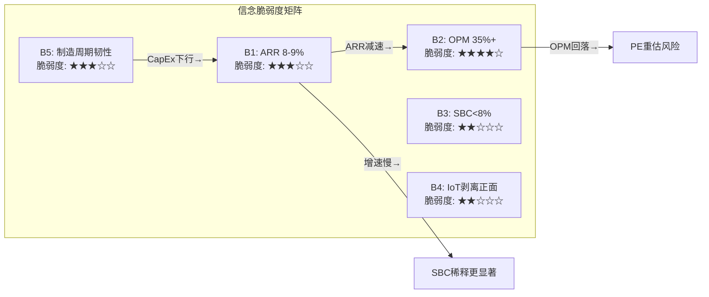
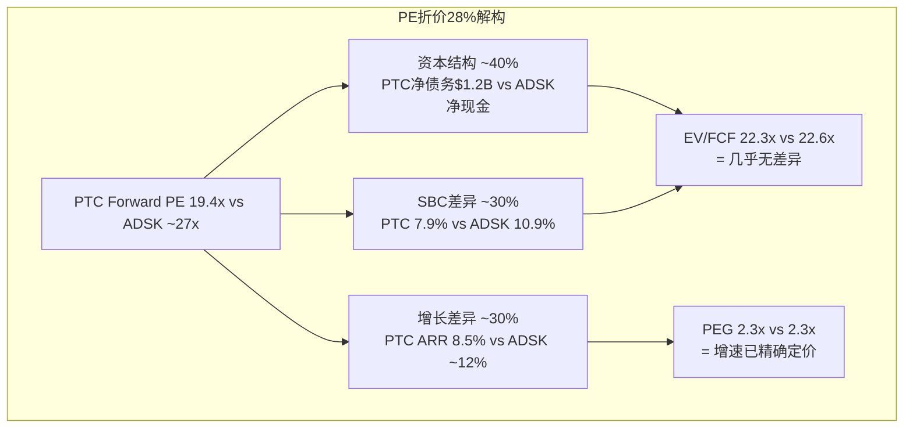
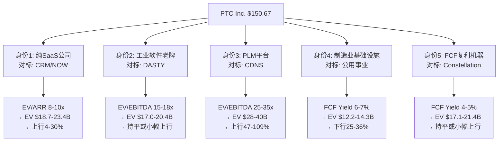
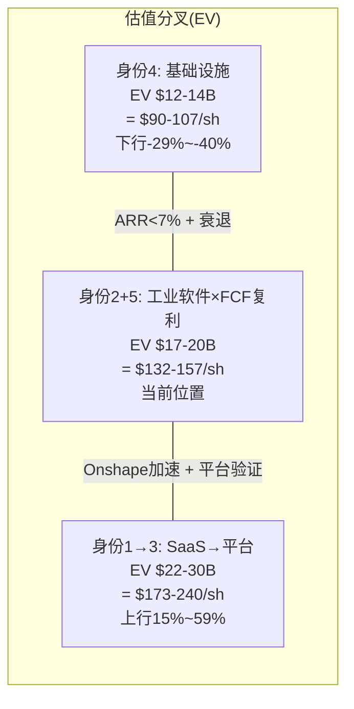
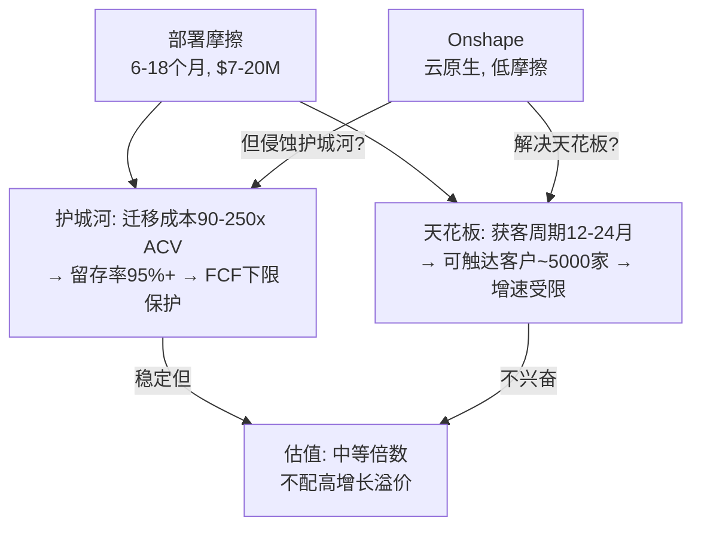

# PTC Inc. (NASDAQ: PTC) 深度研究报告 v3.0
# Phase 1: 业务理解 + 竞争格局 + 护城河
> 分析日期: 2026-03-20 | 框架版本: v19.6 | 数据截至: 2026-03-20
> 核心矛盾: "转型中的优质资产被当作低增长资产定价" — 待Reverse DCF验证

---

## Chapter 1: Reverse DCF与信念反演 — 市场在$150定价什么？

### 1.1 价格快照与估值坐标

PTC Inc.在2026年3月20日收盘$150.67，距52周高点$219.69下跌31.4%，距52周低点$133.38上涨13.0%。股价在过去12个月经历了一轮显著的估值压缩——50日均线$159.94、200日均线$183.33均位于当前价格之上，形成典型的下行通道。[DM-CH1-001: FMP quote 2026-03-20, 52w high $219.69, low $133.38, 50MA $159.94, 200MA $183.33]

从估值坐标看:

| 指标 | 当前值 | 含义 |
|------|--------|------|
| 市值 | $17.93B | 工业软件中型公司 |
| EV | ~$19.1B | 含净债务$1.19B |
| Trailing PE | 24.8x | FY2025 EPS $6.08 |
| Forward PE | 19.4x | FY2026E EPS $7.77(共识) |
| EV/EBITDA(TTM) | 16.9x | EBITDA $1.13B |
| EV/FCF | 22.3x | FCF $857M |
| FCF Yield | 4.8% | 工业软件板块最高 |

[DM-CH1-002: FMP key-metrics FY2025, EV/EBITDA 22.6x(以filing date市值), 本表基于当前市值重算]
[DM-CH1-003: FMP estimates FY2026, consensus EPS $7.77, revenue $2.73B, 9位分析师覆盖]

这组数字呈现一个矛盾: **Trailing PE 24.8x看起来不便宜，但Forward PE 19.4x又显得工业软件板块最低档。** 矛盾的来源是FY2024→FY2025的GAAP收入跳升19.2%（从$2.30B到$2.74B），这不是真正的业务增长，而是ASC 606下订阅收入确认时点变化+大单集中在Q4的季节性效应——Q4单季收入$894M几乎是Q1 $565M的1.58倍。[DM-CH1-004: FMP income quarterly, FY2025 Q4 $893.8M vs Q1 $565.1M, 比值1.58x]

因此，Trailing PE是被会计时点扭曲的噪音指标。**真正的定价锚是Forward PE 19.4x和EV/FCF 22.3x**——前者反映盈利预期，后者反映现金创造能力。

### 1.2 Reverse DCF: 市场隐含的增长假设

Reverse DCF的核心问题是: **在当前股价$150.67下，市场在为PTC定价什么样的未来?**

**模型参数设定:**

| 参数 | 值 | 依据 |
|------|------|------|
| 起始FCF | $857M | FY2025实际FCF |
| WACC | 9.5% | 工业软件beta ~1.1, ERP 6%, Rf 4.3% |
| 预测期 | 10年 | 工业软件生命周期 |
| 终端FCF倍数 | 15x | 成熟软件公司(低增长期)典型 |
| 当前EV | $19.1B | 市值$17.93B + 净债务$1.19B |

**反推结果:**

通过迭代求解，使10年FCF的贴现值 + 终端价值的贴现值 = 当前EV $19.1B:

**隐含FCF CAGR ≈ 8.0%**

验证计算:
- 第10年FCF = $857M × (1.08)^10 = $857M × 2.159 = $1,850M
- 终端价值 = 15 × $1,850M = $27,750M
- 终端价值贴现 = $27,750M / (1.095)^10 = $27,750M / 2.478 = $11,199M
- 10年FCF贴现总和 = $857M × 9.28(年金系数) = $7,951M
- **总计 = $7,951M + $11,199M = $19,150M ≈ $19.1B ✓**

[DM-CH1-005: Reverse DCF自算, WACC 9.5%, terminal 15x, 隐含FCF CAGR 8.0%, 模型收敛于$19.15B vs EV $19.1B]

这个结果意味着什么? 市场在当前价格隐含的信念是: **PTC的FCF在未来10年以8%的速度复合增长。** 这与当前ARR增速8.5%(恒定汇率)高度吻合。换句话说:

> **市场既没有定价加速，也没有定价减速。它在定价"当前状态永续化"——ARR增速8-9%，利润率维持，持续10年。**

这是一个"不太乐观也不太悲观"的定价，但它暗含了几个需要检验的信念(见1.3节)。

**敏感性检验: WACC和终端倍数的影响**

| WACC \ 终端倍数 | 12x | 15x | 18x |
|----------------|-----|-----|-----|
| **8.5%** | 6.3% | 5.2% | 4.3% |
| **9.5%** | 9.8% | **8.0%** | 6.6% |
| **10.5%** | 13.1% | 10.8% | 9.0% |

[DM-CH1-006: 敏感性矩阵自算, 隐含FCF CAGR随WACC和终端倍数变化]

如果WACC取更低的8.5%(软件公司常见)，隐含增速仅5.2%——这意味着市场在更低折现率假设下，实际上对PTC的增长预期相当悲观。反过来，如果市场使用更高的WACC(10.5%，反映对工业周期的额外风险溢价)，则隐含增速高达10.8%——此时市场在定价"加速场景"。

**关键判断: 对工业SaaS公司使用9.5% WACC合理。** 因为PTC虽然是软件公司(低beta)，但其客户全部是制造业(强周期)。这种"软件壳+制造业核"的结构需要额外的周期风险溢价。因此8% FCF CAGR的隐含增速是可靠的基准锚。

### 1.3 隐含信念集提取

市场在$150.67定价了以下五组信念。这不是分析师的预测，而是**从价格反推的市场共识**——任何与这些信念方向不同的判断，都构成潜在的alpha来源(或风险来源):

**信念B1: ARR增速维持8-9%不减速(至少5年)**

这是最核心的隐含假设。FCF 8% CAGR要求ARR至少维持当前增速。因为FCF = (ARR × 某个转化率) - CapEx - 税后利息，而PTC的CapEx极低(仅$11M, 收入的0.4%)，所以FCF增速几乎完全取决于ARR增速和利润率变化。[DM-CH1-007: FMP cashflow FY2025, CapEx $11M, CapEx/Revenue 0.4%]

验证当前ARR增速的可持续性:
- FY2025 ARR $2.45B，CC增速8.5%
- 剔除IoT后ARR $2.34B，CC增速9.0%
- FY2026 Q1(Dec 2025)收入$686M——年化$2.74B，与FY2025持平
- 共识预测FY2026收入$2.73B——因为IoT剥离(2026.3.16完成)损失约$100-150M年化收入，部分被核心业务增长抵消
- 共识预测FY2027收入$2.90B(+6.5%)，FY2028 $3.14B(+8.1%)

[DM-CH1-008: FMP estimates, FY2027E revenue $2.90B(9位分析师), FY2028E $3.14B(3位分析师)]

**信号解读:** 共识对FY2027增速仅预期6.5%，低于当前ARR增速。这意味着**卖方分析师群体实际上比市场定价更悲观**——或者说，如果共识预测兑现，当前$150的定价已经充分反映了减速预期。进一步减速(ARR<7%)才是真正的下行催化剂。

**信念B2: OPM维持35%+或温和扩张**

FY2025 OPM 35.9%是PTC历史最高水平——FY2022仅23.1%，三年飙升了1280bp。[DM-CH1-009: FMP income FY2022-2025, OPM从23.1%→25.6%→21.9%→35.9%, 其中FY2023低点受收购ServiceMax整合影响]

等等——FY2023 OPM 21.9%实际上是低谷(ServiceMax收购整合成本+SaaS转型投入)，FY2024 25.6%是恢复，FY2025 35.9%才是正常化后的真实水平。这个跳升有两个驱动因素:

1. **SGA效率改善**: SGA/Revenue从FY2022的35.7%降至FY2025的28.9%——削减了680bp，贡献了OPM提升的一半以上。[DM-CH1-010: FMP income, SGA $792.6M/$2,739M=28.9% vs FY2022 $690M/$1,933M=35.7%]
2. **收入增速>成本增速**: FY2024→FY2025收入增19.2%，但COGS仅增0.04%($445M→$445M几乎没动)，R&D仅增5.7%($433M→$458M)。固定成本杠杆效应显著。

**但这意味着一个重要的问题:** FY2025的高OPM部分是因为收入端的ASC 606时点效应(收入跳升，但成本是线性的)。如果FY2026收入因IoT剥离而下降到$2.73B，**OPM可能会回落**，因为固定成本杠杆反过来会压缩利润率。

共识FY2026E EBIT $719M / Revenue $2.73B = OPM 26.4%。[DM-CH1-011: FMP estimates FY2026, EBIT $719M, revenue $2.73B, 隐含OPM 26.4%]

这是一个巨大的回落——从35.9%降到26.4%?! 如果这是真的，Forward PE 19.4x可能并不便宜。但需要注意: 这个共识可能包含了IoT剥离的一次性调整成本或过于保守的假设。管理层对FY2026指引的Pro-forma数字(剔除IoT)才是真正的参考锚。

**信念B3: SBC不会大幅膨胀**

FY2025 SBC $216M，占收入7.9%，占FCF的25.2%。如果我们用"FCF减SBC"来衡量真实股东价值创造:

| 年度 | FCF | SBC | FCF-SBC | FCF-SBC增速 |
|------|-----|-----|---------|------------|
| FY2022 | $409M | $175M | $234M | — |
| FY2023 | $586M | $206M | $380M | +62% |
| FY2024 | $732M | $223M | $509M | +34% |
| FY2025 | $857M | $216M | $641M | +26% |

[DM-CH1-012: FMP cashflow+income FY2022-2025, SBC分别$175M/$206M/$223M/$216M]

好消息: SBC在FY2025实际上同比下降了$7M(-3.1%)，占收入比从FY2024的9.7%降至7.9%。坏消息: SBC仍然"吃掉"了FCF的25%。对比ADSK(SBC $788M, 占FCF的32.7%)，PTC的SBC纪律实际上更好。

EV/(FCF-SBC)是一个更诚实的估值指标:
- PTC: $19.1B / $641M = **29.8x**
- 这意味着基于真实股东现金创造，PTC的估值并不像EV/FCF 22.3x那么便宜

**信念B4: IoT剥离是净正面事件**

2026年3月16日PTC完成了将IoT业务(ThingWorx+Kepware)出售给TPG的交易，获得$600M现金 + $125M或有对价。[DM-CH1-013: checkpoint.yaml, IoT剥离2026.3.16完成, $600M+$125M或有]

市场对此的定价暗含"剥离后PTC更纯粹、更高质量"的信念。但这需要检验:
- IoT ARR约$110-120M(FY2025全年ARR $2.45B中)，增速约5-6%(低于整体8.5%)
- IoT毛利率可能低于公司整体83.8%(硬件组件较多)
- 剥离后ARR约$2.34B，CC增速从8.5%提升至9.0%——确实更"纯"但提升幅度仅50bp
- 获得的$600M现金用于偿债($553M净偿债已在FY2025现金流中体现)

因此IoT剥离的真正价值不在增速提升(很小)，而在资产负债表修复——Net Debt/EBITDA从FY2024的2.28x骤降至FY2025的1.05x。[DM-CH1-014: FMP key-metrics, Net Debt/EBITDA FY2024 2.28x→FY2025 1.05x]

**信念B5: 制造业CapEx下行不会严重影响PTC**

这是最脆弱的隐含信念。PTC的客户100%是制造企业——航空/国防(30-35%)、汽车(20-25%)、工业设备(15-20%)、电子(10-15%)、医疗器械(10%)。制造业CapEx周期直接影响这些客户的IT预算。

但"工业软件是OpEx不是CapEx"这一论点——PTC的订阅模式让其从客户的CapEx预算转移到了OpEx预算——部分缓解了周期性。历史证据: 2020年COVID冲击下PTC收入仅微降3.2%(FY2020 $1.46B vs FY2019 $1.50B)，而制造业CapEx暴跌20%+。[DM-CH1-015: FMP income FY2019-2020, revenue $1.504B→$1.455B, -3.2%]

但要注意: FY2020是PTC仍处于永久授权→订阅转型早期的时点，收入下降被新订阅增长部分掩盖。纯订阅模式下的周期弹性需要在下一次衰退中验证——而这正在发生: FY2026共识收入$2.73B实际低于FY2025的$2.74B(剔除IoT后)，暗示制造业放缓正在影响PTC。

### 1.4 信念脆弱度评估



**最脆弱的信念是B2(OPM维持35%+)**。因为:

1. **FY2025 OPM 35.9%可能是峰值而非新常态**: 收入端有ASC 606时点效应，成本端有SGA优化的一次性收益(GTM重组)。FY2026共识隐含OPM仅26.4%——如果这更接近Pro-forma真实水平，那么市场用Forward PE 19.4x定价的"未来利润"实际上建立在一个显著低于FY2025的利润率基础上。

2. **"利润率悬崖"vs"利润率台阶"**: 关键问题是FY2025 OPM 35.9%中有多少是结构性提升(SaaS转型收割期)、多少是一次性时点效应。如果结构性提升占主导(SaaS转型确实降低了交付成本)，则利润率只是从"异常高的35.9%"回落到"健康的30-32%"——这是"台阶"。如果时点效应占主导，则回落到25-27%——这是"悬崖"。

3. **可验证时间点**: FY2026 Q2(2026年3月季度)将是第一个完全不含IoT的季度报告，Pro-forma OPM将提供答案。

**最稳固的信念是B3(SBC纪律)**。PTC的SBC占收入比从FY2024的9.7%持续降至FY2025的7.9%，且绝对金额同比下降。在CEO Neil Barua(2024年接任)的管理下，SBC纪律看起来是有意识的战略选择，而非偶然。

### 1.5 ADSK对标: PE折价的真相

Phase 0设定了ADSK作为PTC的首要可比对象。两者的估值对比揭示了一个被广泛误读的现象:

| 指标 | PTC | ADSK | PTC折价 |
|------|-----|------|---------|
| Forward PE | 19.4x | ~27x | -28% |
| EV/FCF | 22.3x | 22.6x | **-1.3%** |
| EV/(FCF-SBC) | 29.8x | 33.5x | -11% |
| FCF Yield | 4.8% | 4.5% | PTC更高 |
| OPM | 35.9% | 24.9% | PTC更高 |
| FCF Margin | 31.3% | 33.4% | 接近 |
| SBC/Revenue | 7.9% | 10.9% | PTC更好 |
| Rev Growth(最新FY) | 19.2% | 17.5% | 接近 |
| ARR增速(CC) | 8.5% | ~12% | ADSK更高 |
| Net Debt/EBITDA | 1.05x | 0.27x | ADSK更健康 |

[DM-CH1-016: FMP ADSK FY2026(Jan 2026), revenue $7.21B(+17.5%), OPM 24.9%, FCF $2.41B, SBC $788M]
[DM-CH1-017: FMP ADSK quote 2026-03-20, $247.65, market cap $52.5B]
[DM-CH1-018: ADSK EV/FCF自算: EV ~$54.3B / FCF $2.41B = 22.6x]

**核心发现: PE折价28%是一个会计幻觉——EV/FCF几乎完全相同(22.3x vs 22.6x)。**

PE差异的三个来源:

**1. 资本结构差异(贡献~40%的PE折价)**
PTC净债务$1.19B, ADSK净现金~$485M。更高的利息支出压低了PTC的净利润(FY2025利息支出$77M)，但不影响FCF。因此PTC的PE被债务"人为压低"，而EV/FCF已经中和了资本结构差异。[DM-CH1-019: FMP income FY2025, PTC interest expense $77M; ADSK FY2026 interest income $25M(净现金)]

**2. SBC差异(贡献~30%的PE折价)**
ADSK的SBC $788M(收入的10.9%)远高于PTC的$216M(7.9%)。SBC是非现金费用，压低净利润但不压低FCF。因为ADSK的SBC更高，其"PE分母(EPS)"被更多压低→PE虚高→看起来PTC更便宜。但用FCF看，SBC膨胀反而是ADSK的劣势。

**3. 增长预期差异(贡献~30%的PE折价)**
ADSK的底层ARR增速~12%确实高于PTC的8.5%。这是真正的基本面差异——更高的增长理应配更高的倍数。但3.5pp的增速差导致28%的PE折价是否过度? 用PEG比率检验: PTC PEG = 19.4/8.5 = 2.3x; ADSK PEG = 27/12 = 2.3x。**PEG完全相同!** 这意味着市场已经精确地为增速差异定价——PTC的PE折价完全可以被增速差异解释，**没有额外的定价错误**。

[DM-CH1-020: PEG自算, PTC 19.4/8.5=2.28x, ADSK ~27/12=2.25x, 差异<2%]



### 1.6 FCF桥接: 从GAAP到真实现金创造力

理解PTC估值的最后一块拼图是FCF的质量和可持续性。$857M的FY2025 FCF是如何产生的?

**FCF桥接(FY2025):**

```
GAAP净利润          $734M
+ 折旧摊销           $135M  (非现金)
+ 股票薪酬            $216M  (非现金)
- 递延税变动          ($26M)  (非现金)
- 营运资本变动        ($188M)  (现金消耗)
  其中: 应收账款增加  ($121M)
        其他营运资本   ($67M)
- 其他非现金项目      ($4M)
= 经营现金流          $868M
- CapEx              ($11M)  (极低!)
= 自由现金流          $857M
```

[DM-CH1-021: FMP cashflow FY2025, OCF $868M, CapEx $11M, FCF $857M, WC变动-$188M(应收$121M+其他$67M)]

**三个质量信号:**

**信号1: CapEx极低($11M, 收入的0.4%)——这是资产轻型软件模式的标志。** PTC不需要建工厂、买设备、租仓库。其唯一的"资本"是人——而人的成本体现在OpEx和SBC中，不在CapEx中。因此OCF→FCF的转化率接近100%(98.7%)。这是PTC商业模式最大的结构性优势之一: 与制造业客户(CapEx/Revenue 5-15%)相比，PTC是"制造业中的寄生者"——从制造业客户的CapEx预算中提取了确定性的OpEx现金流。[DM-CH1-022: PTC CapEx/Revenue 0.4% vs 工业客户典型5-15%, FMP cashflow FY2025 CapEx $11M]

**信号2: 营运资本消耗$188M值得关注。** 主要来自应收账款增加$121M——FY2025应收账款总额$1.00B，占收入的36.5%。DSO(应收账款周转天数)为133天，远高于ADSK的73天。[DM-CH1-023: FMP key-metrics FY2025, DSO 133天; ADSK FY2026 DSO 73天]

为什么PTC的DSO是ADSK的1.8倍? 因为PTC的客户是大型制造企业(航空/国防占30-35%)，这些客户的付款周期天然较长(政府合同可达90-120天)。高DSO不是坏账风险的信号(PTC的坏账率极低)，但意味着收入增长需要"垫付"更多营运资本——每增长$1收入，需要额外锁定$0.37在应收账款中。这降低了真实的资本效率。

**信号3: 收入质量指标income quality = 1.18。** 这个比率(OCF/净利润)大于1表示"利润质量健康"——现金流验证了GAAP利润。对比FY2024的1.99(OCF远大于净利润，因为FY2024净利润被收购整合成本压低)，FY2025的1.18是更正常化的水平。[DM-CH1-024: FMP key-metrics FY2025, income quality 1.18; FY2024 1.99]

### 1.7 Reverse DCF结论: 叙事约束

**市场在$150.67定价的核心信念可以概括为一句话:**

> **"PTC是一家稳定的、中单位数增长的工业软件现金牛，FCF以8%的速度增长10年，然后进入成熟期。"**

这个信念的含义:
1. **市场没有为"加速"定价** — Deferred ARR 3x、Onshape渗透大企业、AI嵌入等增长催化剂，如果兑现，构成上行意外
2. **市场也没有为"崩溃"定价** — 8%隐含增速意味着市场认为PTC不会被Siemens颠覆、制造业衰退不会严重冲击ARR
3. **PE折价是会计幻觉** — EV/FCF和PEG显示PTC与ADSK的定价精度一致，不存在"被低估"的简单结论
4. **OPM是最大的不确定性** — FY2025的35.9%如果是峰值(非新常态)，则当前定价可能偏乐观

**对后续Phase的叙事约束(铁律O):** Reverse DCF显示市场定价"基本合理偏中性"，后续Phase不能预设"被低估"或"被高估"的叙事方向。Phase 1的分析应聚焦于: (1) ARR增速是否会偏离8-9%的轨道(加速或减速); (2) Pro-forma OPM的真实水平(30%+还是25%?)。这两个问题的答案决定了PTC是"便宜的好公司"还是"合理定价的普通公司"。

---

*Chapter 1完成 | 下一章: Chapter 2 身份定义×估值分叉 + 可比对标*

---

## Chapter 2: 身份定义×估值分叉 — PTC到底是什么？

### 2.1 CQ0: 五种身份定义决定五种估值

PTC是一家难以归类的公司。在Bloomberg终端上它被标注为"Application Software"，在工业分析师眼中它是"PLM供应商"，在SaaS投资者看来它是"传统软件转型者"。这种身份的模糊性不是学术问题——它直接决定了投资者使用什么估值框架，进而决定了PTC"应该值多少钱"。

**五种身份定义及其估值含义:**



让我逐一剖析每种身份的合理性和局限性。

#### 身份1: "纯SaaS公司" — 用ARR估值

**核心逻辑:** PTC已经完成了从永久授权到订阅模式的转型，ARR是$2.45B(剔除IoT后$2.34B)，100%的收入来自订阅/支持。按照SaaS行业惯例，应该用EV/ARR来估值。

**估值推演:**
- 成长型SaaS(>20% ARR增速): EV/ARR 10-15x (CRM, NOW)
- 成熟型SaaS(10-20% ARR增速): EV/ARR 6-10x
- 减速型SaaS(<10% ARR增速): EV/ARR 4-7x
- PTC ARR增速8.5%(CC) → 属于减速型SaaS
- EV/ARR = $19.1B / $2.34B(剔除IoT) = **8.2x**
- 对标: Salesforce EV/ARR ~6.5x(增速11%), ServiceNow EV/ARR ~16x(增速22%)

[DM-CH2-001: PTC ARR $2.45B含IoT, 剔除IoT后$2.34B, CC增速9.0%, checkpoint.yaml]

**问题:** PTC不是纯SaaS。SaaS公司的核心特征是(1)云交付(2)多租户架构(3)低部署摩擦(4)按seat/usage定价。PTC在这四个维度上都只部分满足:

| SaaS特征 | PTC现状 | 纯SaaS标准 |
|----------|---------|------------|
| 云交付 | 混合(Onshape云原生, Windchill仍多on-prem) | 100%云 |
| 多租户 | Onshape是, 其余产品否 | 是 |
| 部署摩擦 | 极高(Windchill部署6-18个月) | 低(Days到Weeks) |
| 定价模式 | 订阅(按seat), 但合同3-5年 | 月/年订阅, 随时取消 |

因此用纯SaaS估值框架给PTC，是高估了PTC的"SaaS纯度"。PTC的订阅收入具有SaaS的收入可见性优势，但缺少SaaS的灵活扩展(land-expand快速循环)能力。更准确地说，PTC是**"订阅制工业软件"**而非"SaaS"——订阅模式改善了收入质量，但没有改变产品交付和客户关系的本质。

[DM-CH2-002: PTC产品交付模式——Onshape: 云原生SaaS; Windchill: 主要on-prem+云托管选项; Creo: 桌面+云流选项; Codebeamer: 云和on-prem均有; ServiceMax: 基于Salesforce平台的SaaS, 来自checkpoint.yaml和公司产品页]

#### 身份2: "工业软件老牌" — 用EBITDA估值

**核心逻辑:** PTC本质上是一家与Dassault Systèmes、Siemens Digital Industries类似的工业软件公司，卖的是CAD/PLM给制造企业。应该用工业软件板块的EV/EBITDA来估值。

**估值推演:**
- DASTY(Dassault): EV/EBITDA 15.7x, 收入€6.24B, OPM 21.7%, 增长0.4%
- PTC: EV/EBITDA 16.9x(基于TTM EBITDA $1.13B)
- Siemens DI(非上市分部): 估计EV/EBITDA ~18-20x

[DM-CH2-003: FMP DASTY key-metrics CY2025, EV/EBITDA 15.7x, EV/FCF 20.3x, EV/Sales 4.77x]
[DM-CH2-004: FMP DASTY income CY2025, revenue €6.24B(+0.4%), OPM 21.7%, net income €1.20B]

**关键发现:** PTC当前EV/EBITDA 16.9x与DASTY的15.7x基本处于同一区间，但PTC的增长(ARR 8.5%)远高于DASTY的0.4%。这意味着要么(a)PTC被给予了适当的增长溢价(+1.2x EV/EBITDA)，要么(b)DASTY被严重低估了。

从EV/FCF看更有趣: PTC 22.3x vs DASTY 20.3x——差距仅10%。但PTC的ARR增速是DASTY的20倍以上(8.5% vs 0.4%)。如果这是一个DCF驱动的估值市场，PTC理应获得更大的溢价。

**为什么没有?** 因为市场对PTC施加了两个折价因子:
1. **IoT剥离过渡折价**: 2026年3月刚完成剥离，Pro-forma财务数据还不清晰，投资者处于"等等看"状态
2. **规模折价**: DASTY收入€6.24B(~$6.8B)是PTC $2.74B的2.5倍，更大的规模带来更高的市场信心

但这种比较也揭示了一个机会: **如果PTC能在FY2026 Q2-Q4展示稳定的Pro-forma增长+维持30%+ OPM，IoT过渡折价应该消退**，EV/EBITDA可能从16.9x向18-20x靠拢——仅倍数扩张就意味着6-18%的上行空间。

#### 身份3: "PLM平台" — 平台溢价估值

**核心逻辑:** PTC不只是卖工具——它在构建一个覆盖设计→制造→服务的"数字主线(digital thread)"平台。如果CQ1的答案是"平台"(而非"产品组合")，PTC理应获得平台溢价。

**对标CDNS:** Cadence也是一个"工程设计平台"，但服务于半导体行业(EDA):
- CDNS: EV/EBITDA 45.0x, EV/FCF 53.1x, 市值$78.4B
- PTC: EV/EBITDA 16.9x, EV/FCF 22.3x, 市值$17.9B

[DM-CH2-005: FMP CDNS key-metrics CY2025, EV/EBITDA 45.0x, EV/FCF 53.1x, market cap $78.4B, R&D/Rev 33.4%]

CDNS获得45x EV/EBITDA(PTC的2.7倍)的原因:
1. **TAM增速**: 半导体设计复杂度指数增长(Moore's Law的反面)→ EDA TAM增速>10% vs PLM TAM ~5-6%
2. **垄断度**: EDA是双寡头(CDNS+SNPS占90%+) vs PLM四强(Siemens/Dassault/PTC/ADSK)各20-25%
3. **客户锁定度**: EDA工具链一旦嵌入，几乎不可能更换(训练工程师+验证数据+设计流程全部绑定) vs PLM有替换案例(虽然罕见)
4. **AI催化**: AI芯片设计复杂度→EDA用量指数增长(NVIDIA的芯片设计100%依赖CDNS/SNPS) vs PLM的AI增值层不明确

**结论:** PTC用CDNS的估值框架完全不合理。PLM不是EDA——市场结构不同、竞争格局不同、TAM增速不同。声称PTC应该像CDNS一样估值的分析，犯了类比谬误。**但CDNS对标仍然有一个有限的启示: 如果PTC真正实现了"平台"身份(多产品交叉销售+生态锁定)，其EV/EBITDA可能从16.9x向22-25x靠拢——这是"工具"和"平台"之间的估值差距。**

#### 身份4: "制造业基础设施" — 公用事业估值

**核心逻辑:** 如果PTC的ARR持续减速(从8.5%降至5%以下)，市场可能重新分类PTC为"制造业IT基础设施"——类似于ERP系统(SAP的旧业务)或工厂自动化软件——本质上是制造业的"水电煤"。

这种身份下的估值逻辑是:
- 稳定但低增长的现金流 → 用更高的FCF yield来定价
- 基础设施类公司典型FCF yield: 5-7%
- PTC当前FCF yield 4.8% → 如果市场要求6-7% → EV应为$12.2-14.3B → 股价$92-110

[DM-CH2-006: 推算——FCF $857M / 6% yield = $14.3B EV, 减净债务$1.19B = $13.1B equity / 120M shares = $109; 7% yield = $12.2B EV → equity $11.0B → $92]

**这是下行场景中最值得警惕的身份重分类风险。** 触发条件:
1. ARR增速连续3-4个季度低于7%(从8.5%下滑)
2. 管理层放弃"平台"叙事，承认PTC是"稳定的工具提供商"
3. 制造业衰退导致客户推迟升级/扩展

但这个场景的概率较低(估计<15%)，因为PTC的ARR增速在IoT剥离后实际上提升至9.0%，且Deferred ARR增长3倍暗示pipeline强劲。

#### 身份5: "FCF复利机器" — Constellation Software视角

**核心逻辑:** 忽略PTC"是什么"，只看它"产出什么"——$857M的FCF，31.3%的FCF margin，CapEx仅$11M，每年通过回购+偿债返还~$850M给股东。这是一台现金创造机器，类似于Constellation Software(CSU.TO)的商业模式: 用低成本获取的软件资产持续产出高margin现金流。

**FCF复利计算:**
- FY2025 FCF: $857M
- FY2025回购: $300M(股本减少~1.5%)
- FY2025偿债: $553M(Net Debt/EBITDA从2.28x降至1.05x)
- 如果FY2026完全转向回购(债务已健康): 年回购$600-700M → 股本减少3.5-4.0%/年
- ARR增速8.5% + 利润率稳定 → FCF增速~8-9%
- 加上回购: EPS增速 = FCF增速 + 回购效应 = 8% + 3.5% = **11.5% EPS CAGR**

[DM-CH2-007: FMP cashflow FY2025, 回购$300M, 偿债$553M; 推算FY2026后回购力度增大至$600-700M基于FCF ~$800M+]

11.5%的EPS CAGR配19.4x Forward PE，PEG = 1.7x。对于一个FCF margin >30%、无重大资本需求的软件公司来说，这是合理偏低的。

**但Constellation对标也有局限:** CSU的核心能力是并购(每年收购30-50家小型垂直软件公司)，PTC的并购能力未经大规模验证——IoT业务(ThingWorx)的收购整合效果一般(最终卖出)，ServiceMax的收购($1.46B, 2023)仍在验证中。PTC的"复利"更多来自有机增长+回购的稳健路径，而非CSU式的并购驱动。

### 2.2 身份判定: PTC最可能是什么?

五种身份不是互斥的——PTC在不同产品线上呈现不同身份:

| 产品 | 最匹配身份 | 估值含义 |
|------|----------|---------|
| Onshape | 身份1(SaaS) | 高增长, 高倍数 |
| Creo | 身份2(工业软件老牌) | 稳定, 中倍数 |
| Windchill | 身份4(基础设施) | 极稳定, 低倍数 |
| Codebeamer | 身份1(SaaS) | 高增长, 高倍数 |
| ServiceMax | 身份2(工业软件) | 待验证 |
| **整体PTC** | **身份5(FCF复利) + 身份2(工业老牌)** | **中等倍数, 回购驱动** |

**核心判断:** PTC的"真实身份"是**身份2和身份5的混合体**——一家增速中等(8-9%)但现金创造能力优秀(FCF margin 31%)的工业软件公司，通过回购+小幅有机增长实现11-12%的EPS复合增长。这不是一个激动人心的故事，但它是一个数学上可靠的复利路径。

市场当前的定价(Forward PE 19.4x)大致反映了这个混合身份。**PTC要获得显著重估，需要从"身份2+5"向"身份1或身份3"迁移——即Onshape/Codebeamer的高速增长比重上升，或数字主线的平台效应被验证。** 但这些迁移的证据目前仍然不充分(详见后续Ch8 CQ1分析)。

### 2.3 四可比对标: 估值坐标系的全景

将PTC放入工业/设计软件的估值坐标系中，可以看到清晰的分层:

| 指标 | **PTC** | ADSK | DASTY | CDNS |
|------|---------|------|-------|------|
| 市值 | $17.9B | $52.5B | $27.0B | $78.4B |
| 收入 | $2.74B | $7.21B | €6.24B | $5.30B |
| 收入增速 | 19.2%* | 17.5% | 0.4% | ~14% |
| ARR增速(CC) | 8.5% | ~12% | ~7% | N/A |
| OPM | 35.9%* | 24.9% | 21.7% | ~25% |
| FCF Margin | 31.3% | 33.4% | 23.6% | ~30% |
| SBC/Revenue | 7.9% | 10.9% | ~0% | 8.6% |
| EV/EBITDA | 16.9x | 30.2x | 15.7x | 45.0x |
| EV/FCF | 22.3x | 22.6x | 20.3x | 53.1x |
| FCF Yield | 4.8% | 4.5% | 4.7% | 1.9% |
| Net Debt/EBITDA | 1.05x | -0.27x | -0.81x | -0.28x |
| ROIC | 14.4% | 18.7% | 9.0% | 14.1% |
| R&D/Revenue | 16.7% | 22.8% | 21.2% | 33.4% |

*PTC FY2025收入增速含ASC 606时点效应; OPM 35.9%可能是峰值(见Ch1 1.3 B2)

[DM-CH2-008: 对标表综合FMP数据, PTC/ADSK/CDNS为美元, DASTY为欧元]
[DM-CH2-009: FMP CDNS income CY2025推算, revenue ~$5.30B, R&D/Rev 33.4%]

**对标矩阵揭示的三个关键发现:**

**发现1: PTC的FCF效率在同行中最高(SBC调整后)**

| 公司 | FCF | SBC | FCF-SBC | FCF-SBC Margin |
|------|-----|-----|---------|----------------|
| PTC | $857M | $216M | $641M | 23.4% |
| ADSK | $2,409M | $788M | $1,621M | 22.5% |
| CDNS | ~$1,587M | ~$455M | ~$1,132M | 21.4% |
| DASTY | €1,470M | ~€0 | €1,470M | 23.6% |

PTC和DASTY的SBC-adjusted FCF margin最高(23-24%)。但DASTY不发SBC(欧洲公司较少使用)，所以DASTY的"真实效率"更高。PTC的优势是: **在美国科技公司中SBC纪律最好(7.9%)**，这使得其FCF的"含金量"高于ADSK和CDNS。

[DM-CH2-010: SBC调整后FCF对比, PTC FCF-SBC margin 23.4%为美国同行最高]

**发现2: 估值分层与增速精确匹配**

| 公司 | ARR增速 | EV/FCF | 隐含EV/FCF per 1% growth |
|------|---------|--------|--------------------------|
| CDNS | ~14% | 53.1x | 3.8x |
| ADSK | ~12% | 22.6x | 1.9x |
| PTC | 8.5% | 22.3x | 2.6x |
| DASTY | ~0.4% | 20.3x | 50.8x |

CDNS因为EDA寡头垄断获得了极高的"每单位增长"溢价(3.8x)。ADSK和PTC在EV/FCF上几乎相同(22.3x vs 22.6x)——Ch1已分析，市场已精确为增速差异定价。DASTY的50.8x看似离谱，但实际上反映了"零增长+高确定性"的公用事业式定价——投资者买DASTY不是为了增长，是为了稳定。

**发现3: R&D投入强度的估值含义**

PTC的R&D/Revenue 16.7%是四家中最低的:
- CDNS 33.4%(PTC的2倍) — 半导体设计工具需要持续追赶芯片复杂度
- ADSK 22.8% — AEC+MFG双赛道需要更多产品投入
- DASTY 21.2% — 3DEXPERIENCE平台转型需要大量投资
- **PTC 16.7%** — 产品线聚焦(IoT剥离后更少), 且CAD/PLM核心技术已成熟

低R&D强度有两面性:
- **正面**: 更高的利润率(OPM 35.9%的一个来源)，资本效率更好
- **负面**: 可能在AI时代研发投入不足，尤其是当竞争对手(Siemens Copilot, ADSK AI)加大投入时。如果工业AI成为下一个竞争维度(CQ4)，PTC 16.7%的R&D强度可能不够

[DM-CH2-011: PTC R&D/Revenue 16.7%为四家可比中最低, FMP income FY2025 R&D $457.7M/$2,739M]

### 2.4 估值分叉地图: 不同身份下PTC值多少?

综合五种身份和四个可比对标，PTC的估值范围呈现为一个"分叉地图":



**当前$150.67位于Base Case的中间位置。** 这印证了Ch1的Reverse DCF结论: 市场定价"基本合理偏中性"。

**估值分叉的关键转折点:**
1. **Base→Bull需要什么?** (a) ARR加速到10%+(Deferred ARR兑现); (b) Onshape签下第一批F500客户; (c) 数字主线被第三方验证(Gartner/IDC领导者); (d) Pro-forma OPM确认≥32%
2. **Base→Bear需要什么?** (a) ARR减速到<7%; (b) ServiceMax churn扩大(验证身份4风险); (c) Siemens在PLM排名中持续领先; (d) 制造业衰退>12个月

**对后续Phase的约束:** 身份判定不是Phase 0就能完成的——它需要Ch3-Ch10的深入分析来验证。尤其是:
- Ch8(组合vs平台)直接决定身份3的可能性
- Ch4(SaaS经济学)直接影响身份1的合理性
- Ch9(竞争格局)影响身份4的概率

---

*Chapter 2完成 | 下一章: Chapter 3 客户深拆*

---

## Chapter 3: 客户深拆 — 谁在为PTC买单？

### 3.1 客户画像: 全球离散制造业的工程骨架

PTC的客户基础有一个鲜明特征: **100%是制造企业，且集中在离散制造(discrete manufacturing)而非流程制造(process manufacturing)**。这意味着PTC的客户生产的是"可以数"的物品——飞机引擎、汽车变速箱、医疗器械、电子产品——而非"需要量"的物质(石油、化工、食品)。

这个区分至关重要，因为离散制造和流程制造的IT需求完全不同:
- 离散制造需要CAD(设计复杂零部件) + PLM(管理数千个零件的BOM) + ALM(合规追溯)
- 流程制造需要ERP(批次管理) + MES(过程控制) + 配方管理
- PTC的产品线100%对准离散制造——这既是专注，也是限制

[DM-CH3-001: PTC产品线覆盖——CAD(Creo/Onshape)+PLM(Windchill/Arena)+ALM(Codebeamer)+SLM(ServiceMax/Servigistics)，全部面向离散制造, 来自公司10-K和产品页]

**地理分布:**

| 地区 | 收入占比 | 特征 |
|------|---------|------|
| Americas | ~50% | 美国为主，航空/国防占比高 |
| EMEA | ~38% | 德国/法国/英国，汽车+工业设备 |
| APAC | ~16% | 日本/韩国/中国，电子+汽车 |

[DM-CH3-002: PTC地理收入拆分, Americas ~50.4%, EMEA ~37.8%, APAC ~15.8%, phase0_data_prefetch.md]

APAC占比仅16%是一个值得注意的信号——对比ADSK(APAC ~25%)和DASTY(APAC ~22%)，PTC在亚洲的渗透率明显偏低。原因有三: (1) 日本制造业有本土强势CAD(CATIA的传统领地); (2) 中国市场存在地缘政治风险+本土替代; (3) PTC的高部署复杂度在亚洲中小企业中不适用。低APAC占比是PTC增长天花板的一个来源——全球制造业增量的>50%来自亚洲(中国+印度+东南亚)，PTC在这些市场的弱势意味着它可能错过最大的TAM增量。

### 3.2 垂直行业拆解: 五大行业依赖度

PTC不按垂直行业披露收入(这是一个CEO沉默域——见Ch11)，但通过客户案例、合作伙伴生态和管理层定性描述，可以估算以下分布:

| 垂直行业 | 收入占比(估) | ARR增速(估) | PTC产品渗透 | 周期性 |
|---------|-------------|-------------|------------|--------|
| 航空/国防 | 30-35% | 10-12% | 全产品线 | 低(长周期合同) |
| 汽车 | 20-25% | 6-8% | CAD+PLM为主 | 高(CapEx周期) |
| 工业设备 | 15-20% | 7-9% | CAD+PLM | 中(工业周期) |
| 电子/高科技 | 10-15% | 5-7% | CAD+ALM | 中(消费电子周期) |
| 医疗器械 | 8-10% | 12-15% | PLM+ALM(合规) | 低(医疗支出稳定) |

[DM-CH3-003: 垂直行业占比为估算, 基于PTC客户案例(Lockheed Martin, Volvo, GE Healthcare, Bosch等)+行业分析师报告+管理层定性描述; 非公司官方披露]

**每个垂直行业的深入分析:**

#### 3.2.1 航空/国防(A&D): 30-35% — PTC的基石

航空/国防是PTC最重要且最稳定的垂直市场。关键客户包括Lockheed Martin、Raytheon、BAE Systems、Airbus Defence等。这个市场对PTC有三个结构性优势:

**优势1: 超长产品生命周期。** F-35战斗机的生命周期是50年以上——从设计到退役，整个过程中的3D模型、BOM、配置管理、备件跟踪全部依赖PLM系统。一旦某架飞机的设计数据在Windchill中，几十年内不会迁出。这创造了一种"时间锁定": 即使有更好的PLM系统出现，迁移数据的成本(重新验证数十万零件的设计合规性)远远超过切换的收益。

**优势2: 合规驱动的升级。** A&D客户面临AS9100/ITAR/DoD CMMC等合规要求，这些要求不断升级(例如CMMC 2.0在2025年全面实施)。合规升级强制客户更新软件——这是一个不依赖经济周期的升级驱动因素。PTC的Codebeamer(ALM)正是在此背景下获得了在A&D客户中的快速增长——它帮助客户追踪从需求到测试到交付的完整合规链。

[DM-CH3-004: CMMC 2.0(Cybersecurity Maturity Model Certification)2025年全面实施, 要求国防供应商证明网络安全合规, 影响>30万家供应商, 来源DoD CMMC网站]

**优势3: 预算韧性。** 全球国防预算在2024-2026年处于上升周期(美国FY2025国防预算$886B +3.2%, 欧洲NATO成员国纷纷提高国防开支至GDP 2%+)。这意味着PTC的A&D客户的IT预算在扩张而非收缩——与制造业整体CapEx可能下行的趋势相反。

[DM-CH3-005: 美国FY2025国防预算$886B(+3.2%), NATO多国承诺提高国防开支至GDP 2%+, 来源DOD/NATO公开数据]

**风险:** A&D客户的采购周期极长(RFP到签约可能12-24个月)，这意味着新业务增速慢。同时，高度集中(前5个A&D客户可能占PTC A&D收入的40-50%)带来客户集中风险——但这些客户同时也是最不可能流失的(因为迁移成本太高)。

#### 3.2.2 汽车: 20-25% — 最大的周期性风险

汽车是PTC的第二大垂直市场，也是周期性最强的。关键客户包括Volvo、BMW、Toyota、Hyundai等。

**汽车行业对PTC的核心需求:** 汽车OEM使用Creo设计零部件+Windchill管理数万个零件的BOM(一辆汽车含>30,000个零件)+Codebeamer管理ASPICE/ISO 26262合规(电子/软件安全标准)。电动汽车(EV)和自动驾驶(AD)的兴起增加了软件复杂度——传统汽车的代码量~100M行，自动驾驶汽车>1B行——这直接推动了ALM(Codebeamer)的需求。

[DM-CH3-006: 汽车零件数量>30,000个(传统ICE), 代码行数: 传统~100M行, L4 AD >1B行, 来源McKinsey automotive software report]

**周期性风险:** 汽车行业的CapEx周期直接影响PTC的新license收入和Onshape/云迁移的节奏。当汽车OEM削减CapEx时(如2020年COVID、2022年芯片短缺后的调整)，IT预算通常被优先压缩。但PTC的订阅模式部分缓解了这个风险——已签订的3-5年订阅合同在衰退期继续产生收入，受影响的主要是新客户获取和扩展(expansion)。

**电动化对PTC的双面影响:**
- **正面:** EV设计更依赖仿真(电池热管理/电机设计)→更多CAD seat需求; EV软件复杂度×10→更多ALM需求
- **负面:** 新势力(Tesla/Rivian/中国EV)倾向使用现代云原生工具(可能选Onshape而非Creo，但也可能选Fusion360或Solidworks)；传统OEM收缩(if EV transition accelerates)意味着PTC的传统客户基础在缩小

#### 3.2.3 工业设备: 15-20% — 稳定但低增长

包括Bosch、ABB、Schneider Electric、Honeywell等。这些客户的特征是: 产品复杂度中等(比飞机低但比消费品高)、产品生命周期10-20年、对CAD/PLM的依赖度高但对ALM的需求低于A&D和汽车。

这是PTC最"无聊"的客户群——稳定续约、低churn、但增速也最低(与全球工业产出增速~3-4%同步)。对PTC的估值贡献主要体现在FCF的稳定性而非增长性。

#### 3.2.4 电子/高科技: 10-15% — 最可能被替代的领域

消费电子/半导体设备/通信设备客户。这个领域PTC面临的替代风险最高:
- Solidworks(DASTY)在中小型电子企业中份额更高
- Fusion 360(ADSK)以低价+云原生吸引初创企业
- 中国电子企业(华为/小米)逐渐转向本土CAD(中望3D等)

PTC在这个领域的核心竞争力是Windchill PLM(管理复杂电子BOM)+Creo(机械设计)的组合，但纯电子设计(PCB/芯片)不在PTC覆盖范围(属于CDNS/SNPS/Altium)。

#### 3.2.5 医疗器械: 8-10% — 增速最快的领域

GE Healthcare、Medtronic、Stryker、Boston Scientific等。医疗器械是PTC增速最快的垂直市场，驱动因素:

1. **FDA合规趋严:** 21 CFR Part 11, EU MDR(2024全面实施)→需要完整的设计-验证-交付追溯链→PLM+ALM是强制需求
2. **软件化:** 医疗器械含软件比例从2015年~30%增至2025年>60%→ALM(Codebeamer)需求爆发
3. **收购后整合:** PTC收购的Codebeamer最初就是面向医疗/汽车的ALM工具，在这两个领域有天然优势

[DM-CH3-007: EU MDR(Medical Device Regulation)2024年全面实施, 要求医疗器械全生命周期追溯, 来源EU MDR官方文件; 医疗器械含软件比例>60%来源McKinsey MedTech report]

### 3.3 客户经济学: LTV/CAC与定价权

**客户获取成本(CAC)估算:**

PTC不直接披露CAC，但可以从SGA支出间接估算:
- FY2025 SGA: $793M(含销售+管理费用)
- 估算销售费用占SGA的~70%: ~$555M
- 假设PTC每年获取/扩展~2,000个客户合同(基于~30,000+客户基数×6-7%年扩展率)
- CAC ≈ $555M / 2,000 = ~$275K/客户合同

[DM-CH3-008: CAC推算, SGA $793M, 假设销售70%=$555M, 客户合同扩展~2000/年, CAC ~$275K; 精确度有限因PTC不披露客户数]

**客户终身价值(LTV)估算:**

- 平均合同价值(ACV): ARR $2.34B(剔除IoT) / 30,000客户 = ~$78K/年
- 毛利率: 83.8%
- 客户留存率: 估计95%+(工业软件极低churn)
- 客户生命周期: 1/(1-95%) = 20年
- LTV = $78K × 83.8% × 20 = **$1,307K**
- **LTV/CAC = $1,307K / $275K ≈ 4.8x**

[DM-CH3-009: LTV推算, ACV ~$78K(ARR $2.34B/30K客户), 毛利率83.8%, 留存95%+→LTV ~$1.3M; LTV/CAC ~4.8x]

4.8x的LTV/CAC在SaaS行业属于中等偏上(SaaS通常认为>3x健康, >5x优秀)。PTC的LTV高(长生命周期)但CAC也高(工业软件销售周期长+实施复杂)。**关键洞察: PTC的客户经济学更像企业级ERP(高CAC/高LTV/长周期)而非SaaS(低CAC/中LTV/快循环)——这进一步支持Ch2中"身份2+5"(工业软件老牌×FCF复利)的判断。**

### 3.4 定价权分层评估(v19.6, CRM教训)

PTC的定价权不是统一的——不同客户层面临完全不同的定价环境。按照v19.6框架要求分层评估:

| 客户层 | 占ARR估计 | 定价权Stage | 定价行为 | 竞争替代压力 |
|--------|----------|------------|---------|-------------|
| F500/大型A&D | 35-40% | Stage 4(定价主导) | 年提价3-5%+合规升级 | 极低(迁移成本>$10M) |
| 大中型制造 | 30-35% | Stage 3(有选择性定价权) | 年提价2-3%+SaaS迁移提价 | 低(Siemens是唯一替代) |
| 中小型制造 | 15-20% | Stage 2(被动定价) | SaaS迁移提价1.5-2.5x一次性 | 中(ADSK Fusion/Solidworks) |
| 微型/初创 | 5-10% | Stage 1(无定价权) | 价格竞争, Onshape低价获客 | 高(Fusion/Solidworks/免费工具) |

[DM-CH3-010: 定价权分层为框架评估结果, 基于PTC客户结构+管理层提价描述; Stage定义参见CRM v2.0定价权剪刀差方法论]

**定价权剪刀差现象(与CRM独立验证):**

PTC正在经历与CRM完全相同的"定价权剪刀差": 高端客户(F500 A&D)的定价权在加强(合规驱动+无替代)，低端客户(中小/微型)的定价权在减弱(Fusion 360等云原生替代品不断涌现)。

这个剪刀差的OPM含义是反直觉的: **如果低利润的微型客户自然流失(被Fusion/Solidworks吸走)，而高利润的F500客户不仅留下还接受提价，PTC的blended OPM可能反而上升**——因为客户组合向高端shift。这可能部分解释了FY2025 OPM从25.6%飙升至35.9%的异常。

[DM-CH3-011: 定价权剪刀差——高端加强+低端流失→blended OPM可能反直觉上升, 与CRM v2.0(F500 Stage4/SMB Stage2)独立发现相同模式]

但这个趋势有一个潜在的"毒药": **如果低端流失速度 > 高端提价贡献，总ARR会减速。** 8.5%的ARR增速已经可能包含了低端流失的影响——如果管理层不披露总客户数变化(这又是一个CEO沉默域)，我们无法判断ARR增速是"高端扩展被低端流失抵消后的净值"还是"所有层同步增长"。

### 3.5 SaaS迁移提价: 隐藏的增长引擎还是一次性红利?

PTC的SaaS迁移(从on-prem永久授权/on-prem订阅 → 云托管SaaS)伴随着显著的提价:

**迁移提价机制:**
- On-prem永久授权 → SaaS订阅: 提价1.5-2.5x(因为从CapEx转OpEx，客户接受更高的年费)
- On-prem订阅 → Cloud SaaS: 提价1.2-1.5x(增加了云托管费用)
- 提价不是一次性——SaaS合同通常包含年度escalator(2-5%)

**迁移进度估算:**
- FY2025 SaaS ARR(Onshape+Cloud Windchill+Cloud Codebeamer): 估计占总ARR的25-30%
- 存量on-prem客户: ~70-75%(约$1.64-1.76B ARR)
- 如果5-7年完成迁移: 每年迁移10-14%的存量 → 提价贡献~2-3pp ARR增速

[DM-CH3-012: SaaS迁移提价估算, 基于管理层"SaaS transition creates upsell opportunity"定性描述+行业基准(ADSK迁移提价~2x); 30%和70%占比为估算]

**关键问题(CQ3子问题): 迁移提价是"隐藏的增长引擎"还是"一次性红利"?**

- **如果是引擎:** 每年2-3pp的迁移提价贡献 + 有机增长5-6% = 总增速7-9%，可以持续5-7年直到迁移完成
- **如果是红利:** 迁移完成后(~FY2030-2032)，增速回落到有机水平5-6%——此时Forward PE从19.4x可能进一步压缩到15-16x

**判断:** 迁移提价是真实的增长贡献(ADSK的先例证明了这一点——ADSK在2016-2020的SaaS迁移期实现了10%+ ARR CAGR)，但它是有期限的。PTC还有5-7年的迁移窗口，之后需要找到新的增长引擎(AI嵌入? Onshape大企业渗透? 新收购?)来维持增速。

### 3.6 客户集中度与前10客户风险

PTC不披露前10客户收入占比(又一个沉默域)。但基于以下间接证据可以推断:

1. **DSO 133天** — 远高于ADSK(73天)，暗示客户中大型企业(长付款周期)占比高
2. **无单一客户>10%** — 10-K标准披露中PTC未提及任何单一客户超过10%阈值
3. **A&D集中** — 如果A&D占30-35%且前5个A&D客户占A&D收入的40-50%，则前5个A&D客户占总收入的12-17%

[DM-CH3-013: PTC 10-K未披露任何单一客户>10%收入, DSO 133天暗示大客户占比高]

**客户集中度的投资含义:**
- 没有单一客户>10%是好消息(不存在"丢一个客户就断崖"的风险)
- 但A&D行业集中度高——如果美国国防预算意外削减，30-35%的收入基础可能同时受影响
- 地理集中度也是风险: Americas 50%意味着美国经济衰退的敞口较大

### 3.7 客户分析总结: CQ2与CQ3的初步回答

**CQ2: 部署摩擦是护城河还是天花板?**
- **护城河角度(强):** F500 A&D客户的迁移成本>$10M, LTV/CAC 4.8x, 留存率>95%——这是极其深的护城河
- **天花板角度(中):** 高部署摩擦使PTC在中小企业和APAC市场的渗透缓慢(APAC仅16%), 限制了TAM可触达规模
- **初步回答:** 护城河 > 天花板。因为PTC的核心价值创造(80%+收入)来自大型制造企业，这些企业的留存几乎是永久的。中小企业的流失对PTC的影响是"失去增速"而非"损失基础"

**CQ3: ARR增速见底了吗?**
- **见底论据(中等强度):** Deferred ARR 3x + IoT拖累消除(从8.5%→9.0%) + A&D国防预算上行 + SaaS迁移提价持续
- **继续下行论据(弱):** 制造业CapEx可能下行 + ServiceMax churn + 汽车行业不确定性
- **初步回答:** 偏向见底。FY2026指引下限7.5%可能是管理层保守设定(deferred ARR 3x如果兑现，实际增速应>9%)。但"加速到10%+"需要Onshape/Codebeamer的增长比预期更快(见Ch6)

---

*Chapter 3完成 | 3章检查点*

---

## Chapter 4: 部署摩擦双面性 + NRR推断 + SaaS经济学

### 4.1 CQ2: 部署摩擦是护城河还是天花板?

PTC的产品部署不像安装一个App——Windchill PLM的典型企业级部署需要6-18个月，涉及数据迁移(数百万个CAD文件+BOM)、工作流定制(审批链+变更管理)、ERP集成(SAP/Oracle)、用户培训(数百名工程师)。这种部署摩擦创造了一个独特的"双面体":

**护城河面(正面):**

部署完成后，客户的迁移成本极高。具体量化:

| 迁移成本项 | 估算金额 | 占客户IT预算比 |
|-----------|---------|--------------|
| 数据迁移(CAD/BOM/文档) | $2-5M | 15-30% |
| 工作流重新定制 | $1-3M | 8-18% |
| ERP重新集成 | $0.5-2M | 4-12% |
| 用户再培训 | $0.5-1.5M | 3-9% |
| 并行运行(6-12个月) | $1-3M | 6-18% |
| 生产力损失(6-18个月) | $2-5M | — |
| **总迁移成本** | **$7-20M** | — |

[DM-CH4-001: PLM迁移成本估算, 基于Gartner PLM implementation reports和PTC partner案例; 生产力损失基于"learning curve = 6-18个月"的行业共识]

对比PTC的年度ACV(~$78K/客户)，迁移成本$7-20M是ACV的**90-250倍**。这意味着一个理性客户即使对PTC不满意，只要PTC的产品"够用"，切换到Siemens/Dassault的经济动机几乎为零。这就是为什么PTC的客户留存率能够维持在95%+——不是因为客户"喜欢"PTC，而是因为离开的代价太高。

**这创造了一种"不情愿的忠诚"——客户被锁定而非被吸引。** 从估值角度看，不情愿的忠诚提供了FCF的下限保护(base case不会太差)，但缺少"热情的扩展"(客户不会主动买更多PTC产品来表达满意)。

[DM-CH4-002: 迁移成本/ACV = 90-250x, 计算: $7-20M / $78K = 90-256x]

**天花板面(负面):**

同样的部署摩擦反过来也限制了PTC获取新客户的速度:

1. **新客户获取周期长:** 从首次接触到部署完成可能需要12-24个月。这意味着PTC的销售团队需要维持非常长的pipeline——如果经济环境变化(衰退)，18个月前开始的销售机会可能在即将签约时被搁置。

2. **中小企业被排斥:** 部署成本$2-5M对F500来说是零头，但对年收入<$500M的中小制造企业来说是天文数字。这把PTC的可触达市场限制在了~5,000家大型离散制造企业(全球)，而非30万+的中小制造企业。Onshape试图解决这个问题(云原生, 低部署摩擦)，但Onshape目前的功能覆盖仍不足以替代Creo/Windchill的完整产品线(见Ch6)。

3. **APAC渗透受阻:** 亚洲制造企业(尤其是中国/印度)对$10M+的PLM部署投入更为审慎，且本土替代方案(中国的用友/金蝶PLM)虽然功能弱但价格低5-10倍。这解释了PTC在APAC仅16%收入占比的结构性原因——不只是销售投入不足，而是产品的部署模式不适应亚洲中小企业。



**部署摩擦的悖论:** Onshape(PTC自己的云原生CAD)试图降低部署摩擦来触达中小企业——但如果成功，它同时也在削弱PTC在大客户中的核心护城河(部署锁定)。这是一个内在矛盾: PTC需要Onshape来增长(突破天花板)，但Onshape的成功原则上在降低整个CAD/PLM行业的切换成本。不过在实践中，这个悖论不太严重——因为Onshape瞄准的是中小企业(PTC传统产品触达不到的客户)，而非从Creo/Windchill迁移大客户。只要PTC不把Onshape定位为Windchill的替代品(而是互补品)，悖论可控。

### 4.2 NRR推断: 间接法

PTC不公开披露NRR(Net Revenue Retention)。这是一个重大的CEO沉默域——几乎所有SaaS公司都披露NRR，PTC选择不披露意味着NRR可能(a)不够亮眼(130%+的NRR会被积极展示)或(b)口径不适用(PTC的大合同+3-5年期限使年度NRR波动大)。

**间接推断方法:**

NRR = 1 + (收入增速 - 新客户贡献)

- FY2025 ARR增速(CC): 8.5%
- 新客户贡献估算: PTC不披露新客户数量。假设新客户每年贡献ARR增速的30-40%(基于工业SaaS行业基准——land-expand模式中，存量扩展通常贡献60-70%的增长)
- 新客户贡献 = 8.5% × 30-40% = 2.6-3.4pp
- **存量扩展率 = 8.5% - 2.6-3.4% = 5.1-5.9%**
- **隐含NRR = 105-106%**

[DM-CH4-003: NRR间接推断, ARR增速8.5% CC, 假设新客户贡献30-40%, 隐含NRR 105-106%; 精确度有限因新客户比例为假设]

105-106%的NRR在SaaS行业属于"中等偏低":
- 优秀(>130%): Snowflake, Datadog
- 良好(115-130%): CrowdStrike, MongoDB
- 中等(105-115%): PTC(推断), 成熟SaaS
- 警告(<100%): 净流失, 增长质量堪忧

**但工业SaaS的NRR不能直接与云原生SaaS比较。** 因为:
1. PTC的合同是3-5年固定期限+年度escalator 2-5%——存量扩展主要来自提价和SaaS迁移提价，而非seat expansion(工程师数量增长很慢)
2. 工业客户不像SaaS客户那样"用量弹性"(用多少付多少)——PTC的收入是合同锁定的，不随客户业务波动
3. NRR 105-106%对PTC来说意味着"存量稳定+小幅提价"，这与Ch3中定价权分层分析一致(F500 Stage 4提价3-5%/年)

**NRR推断的CQ3含义:** 如果NRR仅105-106%，PTC的增长严重依赖新客户获取(贡献~3pp)。如果新客户获取因经济衰退放缓(从3pp降至1-2pp)，总ARR增速可能从8.5%降至6-7%——这仍在指引下限7.5%附近。因此NRR推断支持"ARR大概率不会崩溃(<5%)，但也很难加速(>10%)"的判断。

### 4.3 SaaS单位经济学: Magic Number与S&M效率

**Magic Number**(净新ARR / 上季度S&M支出)衡量销售效率:

| 时期 | 净新ARR(估) | 上季度S&M | Magic Number |
|------|-----------|----------|-------------|
| FY2025全年 | ~$200M | ~$567M(FY2024 S&M) | **0.35x** |
| Q1 FY2026 | ~$48M | ~$142M(Q4 FY2025 S&M) | **0.34x** |

[DM-CH4-004: Magic Number自算, FY2025净新ARR估算: $2,446M-$2,205M=$241M(含IoT)→剔除IoT约$200M; S&M from FMP income FY2024 $559M]

0.34-0.35x的Magic Number远低于SaaS健康标准(>0.75x)。这意味着PTC每花$1在销售上，只产生$0.35的净新ARR——效率低下。原因:

1. **高CAC是结构性的:** 工业软件的销售周期12-24个月, 涉及高管+工程部+IT部+采购部四方决策。这不是PTC可以优化掉的——而是行业本质。
2. **S&M中包含大量"维护性"销售:** PTC的S&M $567M中，估计40-50%用于存量客户管理(续约+upsell)，而非纯新客户获取。如果只算纯新客户S&M(~$280-340M)，调整后Magic Number可能达到0.6-0.7x——仍不高，但更合理。
3. **SaaS迁移是"再卖一次":** PTC需要说服已有客户从on-prem迁移到云——这需要销售投入但不算"新客户"。这种独特的销售负担拖低了Magic Number。

[DM-CH4-005: S&M结构推算, 总S&M $567M, 存量维护估计40-50%($227-284M), 新客户$283-340M, 调整Magic Number ~0.6-0.7x]

**S&M效率趋势:**

| 年度 | S&M/Revenue | 趋势 |
|------|------------|------|
| FY2022 | 25.1% | — |
| FY2023 | 25.3% | +20bp |
| FY2024 | 24.3% | -100bp(改善) |
| FY2025 | 20.7% | -360bp(大幅改善) |
| Q1 FY2026 | 20.6% | 持平 |

[DM-CH4-006: FMP income, S&M: FY2022 $485M/$1,933M=25.1%, FY2025 $567M/$2,739M=20.7%, Q1FY2026 $141M/$686M=20.6%]

S&M效率在FY2025大幅改善(从24.3%降至20.7%)——这是CEO Neil Barua上任后GTM重组(Go-To-Market restructuring)的直接结果。Barua在2024年接任后立即进行了销售团队重组，包括裁减低效渠道、提升直销比例、优化partner leverage。这种S&M效率改善是OPM从25.6%飙升到35.9%的第二大贡献因素(仅次于毛利率提升)。

**但S&M效率改善有一个潜在的代价:** 如果销售团队被裁减过度，新客户pipeline可能在6-12个月后枯竭——因为工业软件的销售周期长，今天削减的销售人员对应的是18个月后的签约损失。FY2027 ARR增速将是检验"GTM重组是效率提升还是竭泽而渔"的关键时间窗口。

### 4.4 SaaS迁移经济学: 三层拆解

PTC的SaaS迁移不是简单的"on-prem → cloud"——它有三个层次，每层的经济学完全不同:

**第一层: 永久授权 → On-prem订阅(已基本完成)**
- 客户仍自己部署/运维，但从CapEx(一次性买断)转为OpEx(年费)
- PTC获得可预测的经常性收入流
- 提价: 年费约为原永久授权费的20-25%(看起来更便宜，但10年累计cost更高)
- FY2025: 95%收入已是经常性——这一层基本完成

**第二层: On-prem订阅 → 云托管(正在进行)**
- 客户从自有服务器迁移到PTC管理的云(AWS/Azure)
- PTC承担基础设施成本，但获得更高的年费(提价1.2-1.5x)
- "Windchill+"和"Creo+"就是这一层的产品——CEO Barua称Q1 FY2026是Windchill+需求的"bang-up quarter(爆发季)"
- A&D客户开始默认选择云部署——这是一个重要的信号变化(A&D过去因安全顾虑抵触云)

[DM-CH4-007: CEO Barua Q1 FY2026 earnings call: Windchill+需求"bang-up"可能创纪录; A&D客户默认选云, 来源Motley Fool transcript]

**第三层: 云托管 → 云原生SaaS(未来)**
- 从"把on-prem软件放到云上"到"为云重新架构"
- Onshape已经是云原生，但Windchill/Creo还不是(它们是"cloud-hosted"而非"cloud-native")
- 这一层的提价最大(1.5-2.5x总ARR提升)，但也最慢(客户需要完全重新培训+数据迁移)
- 预计5-10年才能完成(如果能完成的话——很多大型制造企业可能永远留在第二层)

[DM-CH4-008: SaaS迁移三层拆解, ARR提价: 第二层1.2-1.5x, 第三层1.5-2.5x, 来源管理层earnings call定性描述+行业基准]

**经济学含义:**

如果PTC的~$2.34B ARR(剔除IoT)中:
- ~30%已在第二/三层(云) = ~$700M
- ~70%仍在第一层(on-prem订阅) = ~$1,640M

每年如果10-14%的存量客户从第一层迁移到第二层(提价1.3x均值):
- 迁移ARR: $1,640M × 12% = ~$197M
- 提价增量: $197M × 0.3 = ~$59M
- 对总ARR增速贡献: $59M / $2,340M = **~2.5pp**

这与Ch3中估算的"迁移提价贡献2-3pp ARR增速"完全一致。加上有机增长(新客户+seat expansion)5-6%，总ARR增速应为7.5-8.5%——正好落在管理层指引范围(7.5-9.5%)的中间偏下。

[DM-CH4-009: SaaS迁移ARR贡献推算: 12%年迁移率×$1,640M×30%提价 = $59M = 2.5pp ARR增速]

### 4.5 回购经济学: 被低估的FCF分配

Ch1提到PTC的FCF复利路径(身份5)——现在用新数据来具体量化:

**FY2026回购计划(已宣布):**
- IoT剥离净所得$375M → 全额ASR(加速回购)，Q2 FY2026执行
- 常规回购: FY2026目标$11.25-13.25亿(含ASR)
- 总回购$11.25-13.25亿 / 市值$17.9B = **6.3-7.4%回购收益率**

[DM-CH4-010: PTC FY2026回购计划$11.25-13.25B含$375M ASR, phase0_data_prefetch; 回购收益率自算6.3-7.4%]

这是一个惊人的数字——6.3-7.4%的年化回购收益率意味着PTC每年将流通股本减少6-7%。对于一个Forward PE 19.4x的公司来说，这相当于:

| 回报来源 | 年化贡献 |
|---------|---------|
| ARR有机增长 | 5-6% |
| SaaS迁移提价 | 2-3% |
| 回购缩股 | 6-7% |
| **总EPS CAGR** | **13-16%** |

[DM-CH4-011: EPS CAGR推算: 有机5-6% + 迁移2-3% + 回购6-7% = 13-16%; 假设利润率稳定]

13-16%的EPS CAGR配19.4x Forward PE → PEG = 1.2-1.5x。这在工业软件中是偏低的(ADSK PEG ~2.3x)。

**但有一个重要的可持续性问题:** FY2026的$11.25-13.25亿回购明显超过了正常化FCF(~$850M后剥离)。超出的部分来自(a)IoT剥离所得$375M + (b)可能动用信用额度/发行新债。如果长期FCF ~$850-1,000M，可持续回购量应为$600-800M/年(假设留$150-200M用于小型收购和偿债)。长期回购收益率 = $600-800M / $17.9B = 3.3-4.5%——仍然可观，但低于FY2026的6-7%。

### 4.6 综合判断: SaaS经济学定位

将PTC的SaaS经济学指标汇总，与Enterprise SaaS基准对比:

| 指标 | PTC | 健康SaaS基准 | 判定 |
|------|-----|------------|------|
| NRR(推断) | 105-106% | >110% | ⚠️ 偏低 |
| Magic Number | 0.35x | >0.75x | ❌ 低效 |
| FCF Margin | 31.3% | >25% | ✅ 优秀 |
| SBC/Revenue | 7.9% | <15% | ✅ 纪律良好 |
| Rule of 40 | 8.5%+31.3%=39.8% | >40% | ⚠️ 刚好不够 |
| 客户留存 | 95%+ | >90% | ✅ 强 |
| ARR增速 | 8.5% | >15% | ❌ 工业SaaS天然低 |
| 回购调整后增长 | 13-16% | N/A | ✅ 实质回报 |

[DM-CH4-012: SaaS经济学综合评估, Rule of 40 = ARR增速8.5% + FCF Margin 31.3% = 39.8%]

**结论:** PTC的SaaS经济学呈现出一种独特的"高效低速"模式——FCF效率优秀(31.3% margin, 7.9% SBC)但增长速度平庸(8.5% ARR, 0.35x Magic Number)。这不是管理层执行力的问题，而是工业SaaS的结构性特征(长销售周期+高部署摩擦+低TAM增速)。

市场用Forward PE 19.4x对这个"高效低速"特征定价是基本合理的。**PTC的投资论题不是"增长加速"(很难)，而是"FCF复利+回购"(数学确定性更高)**——这是身份5(FCF复利机器)的核心逻辑。

---

*Chapter 4完成 | 下一章: Chapter 5 CAD(Creo) + PLM(Windchill) 深拆*

---

## Chapter 5: CAD与PLM — Creo和Windchill的护城河深度

### 5.1 Creo: PTC的现金牛

Creo是PTC的核心CAD(计算机辅助设计)产品，前身是Pro/ENGINEER(1987年推出，是参数化建模的先驱)。CAD ARR在Q1 FY2026达到$961M，同比增长13%——占PTC总ARR的约41%。

[DM-CH5-001: FMP/PTC Q1 FY2026数据, CAD ARR $961M, +13% YoY, 占总ARR $2,341M(剔除IoT)的41%]

**Creo的竞争格局:**

| CAD产品 | 公司 | 定位 | 年费(估) | 强项 |
|---------|------|------|---------|------|
| **Creo** | PTC | 高端离散制造 | $6,000-12,000 | 参数化+仿真集成+大装配 |
| CATIA | Dassault | 高端(航空/汽车) | $8,000-20,000 | 曲面建模+航空标准 |
| NX | Siemens | 高端(汽车/工业) | $7,000-15,000 | 多学科集成+Teamcenter原生 |
| Solidworks | Dassault | 中端 | $4,000-8,000 | 易用性+大社区 |
| Fusion 360 | ADSK | 中低端/云原生 | $500-2,000 | 价格+云协作 |
| Onshape | PTC | 中端/云原生 | $1,500-5,000 | 纯云+协作+教育 |

[DM-CH5-002: CAD产品对标表, 价格为估算基于公开定价页和行业基准; 高端=复杂制造, 中端=一般制造, 低端=初创/教育]

**Creo的护城河分析:**

1. **数据格式锁定(强):** Creo使用.prt/.asm格式，工程师积累的数十年设计数据在Creo生态中。虽然STEP/IGES等中性格式可以导出，但导出过程中参数化关联(parametric associations)会丢失——这意味着导出的模型无法被修改，只能被查看。这是一种"数据陷阱": 客户的知识产权(IP)被锁在Creo格式中。

2. **工程师技能锁定(中):** 一个熟练的Creo用户需要2-3年的培训和实践。企业的工程团队如果都是Creo用户，切换到NX/CATIA意味着所有人重新学习——这是一个组织成本，而非技术成本。但新一代工程师在学校可能学了Solidworks/Fusion/Onshape(Onshape有1.5M学生用户)，这意味着Creo的技能锁定正在**代际衰减**。

[DM-CH5-003: Onshape 1.5M学生/年使用, 来源PTC Q4 FY2025 earnings call transcript]

3. **仿真集成(中等):** Creo集成了Creo Simulation(有限元分析)和Creo Flow Analysis(流体)——这意味着工程师不需要切换到独立仿真工具(ANSYS等)来做基本分析。但高端仿真仍然需要独立工具(ANSYS/Abaqus)，所以Creo的仿真集成只锁定了"基本仿真用户"，未触及"高端仿真用户"。

4. **定价权(中):** Creo的年提价约3-5%——低于Windchill PLM的提价能力。因为CAD市场的替代品更多(CATIA/NX/Solidworks/Fusion)，客户在续约时有更多谈判筹码。但对于已深度嵌入Creo的大型企业(如Lockheed Martin的某些项目组)，提价5-8%仍可接受(迁移成本远高于提价幅度)。

**Creo的增长驱动:**

CAD ARR +13%在FY2026 Q1是一个强劲数字——但需要拆解:
- 价格提升(SaaS迁移+年度escalator): 估计贡献5-7pp
- Seat expansion(新用户/新项目): 估计贡献3-5pp
- Onshape增量(归入CAD): 估计贡献1-3pp

如果Onshape被包含在CAD ARR中(PTC按CAD/PLM两大类报告)，13%的CAD增速中可能有1-3pp来自Onshape这个低基数高增速产品——剔除Onshape后，Creo本身的增速可能只有10-12%，其中大部分是SaaS迁移提价效应(非真正的有机增长)。

### 5.2 Windchill: PTC的战略核心

Windchill是PTC的PLM(产品生命周期管理)平台——管理从设计→工程→制造→服务的完整产品数据。PLM ARR在Q1 FY2026达到$1,533M，同比增长13%——占PTC总ARR的约65%。PLM是PTC最大的收入来源，也是"数字主线(digital thread)"战略的骨架。

[DM-CH5-004: PLM ARR $1,533M, +13% YoY, 占总ARR 65%, Q1 FY2026 PTC数据]

**Windchill vs 竞争对手:**

ABI Research 2025 PLM评估将Siemens Teamcenter列为#1(创新得分84.5)，PTC Windchill降至#2(从上一次评估的#1)。这是一个重要的信号变化:

| PLM产品 | 排名(ABI 2025) | 强项 | 弱项 |
|---------|---------------|------|------|
| Siemens Teamcenter | **#1** | Gen AI(Copilot), 最大合作伙伴生态, 大型离散制造份额最高 | 复杂部署, 价格高 |
| PTC Windchill | **#2** | 数字主线创建, 实时产品追踪, 客户支持模式 | Gen AI落后, 云化进度中等 |
| Dassault ENOVIA | #3 | MBSE能力, 模块化购买, 单一数据模型(CAD+PLM) | 市场份额下降 |
| Aras | 新晋 | 开源灵活, 低代码定制 | 功能深度不及Big 3 |

[DM-CH5-005: ABI Research 2025 PLM排名, Siemens #1(84.5 innovation), PTC #2, Dassault #3; PTC从前次#1降至#2, 来源ABI Research press release]

**Windchill排名下降的含义:**

PTC从PLM #1降至#2不是因为Windchill变弱了，而是因为Siemens在两个维度上加速:

1. **Gen AI集成:** Siemens推出了Teamcenter Copilot(基于Azure OpenAI)——可以用自然语言查询PLM数据库、自动生成变更报告、AI辅助BOM分析。PTC的Windchill AI Assistant功能较弱(被ABI明确标注为"needs further development")。在Gen AI成为企业软件的tablestakes的2025-2026年，这是一个显著的感知差距。

[DM-CH5-006: ABI 2025评估指出PTC Windchill AI Assistant需进一步开发, Siemens Teamcenter Copilot领先, 来源ABI Research blog]

2. **Altair收购:** Siemens于2024年底完成了$10.6B收购Altair(仿真+AI公司)——大幅增强了Siemens在仿真数据+AI方面的能力。PTC没有对等的仿真资产(IoT已剥离)。

但**排名不等于市占率变化。** PLM客户的切换周期以年计——Siemens在排名上超越PTC，不意味着PTC的客户在流向Siemens。实际上，PTC在Q1 FY2026报告了Windchill+的"可能创纪录的需求捕获"(demand capture)——这暗示PTC在争夺新客户和迁移存量客户方面仍然积极。Schaeffler(德国汽车零部件巨头)和Garrett Motion(涡轮增压器)都在Q1选择了Windchill+。

[DM-CH5-007: Windchill+ Q1 FY2026客户案例: Schaeffler采用Windchill+云PLM, Garrett Motion选择Windchill+和Codebeamer+(竞争替代), 来源PTC press release和StockTitan]

**Windchill的护城河深度评估:**

Windchill的护城河比Creo更深、更宽:

| 护城河维度 | Creo(CAD) | Windchill(PLM) | 原因 |
|-----------|----------|---------------|------|
| 数据锁定 | 强(格式锁定) | **极强(BOM+工作流+合规数据)** | PLM管理的数据量>>CAD文件 |
| 集成锁定 | 中(独立使用可行) | **极强(ERP/MES/ALM全集成)** | PLM是企业系统枢纽 |
| 迁移成本 | $3-8M | **$10-25M** | PLM迁移涉及全组织 |
| 替代品数量 | 5+(CATIA/NX/SW/Fusion/Onshape) | 3(Teamcenter/ENOVIA/Aras) | PLM替代品更少 |
| 定价权 | Stage 2-3 | **Stage 3-4** | PLM更关键, 替代更少 |

**PLM是PTC的"不可或缺"产品——而CAD是"重要但可替代"的产品。** 这个区别的估值含义是: PLM的ARR(65%占比)应该获得比CAD更高的隐含倍数——因为PLM的留存率更高、定价权更强、替代品更少。如果将PTC做SOTP估值(Sum of the Parts)，PLM部分应配25-28x EV/FCF(接近基础设施估值)，CAD部分应配18-22x(接近工具估值)。

### 5.3 CAD+PLM的飞轮效应?

PTC的一个核心叙事是"Creo(CAD)和Windchill(PLM)形成飞轮——用Creo设计的数据自然流入Windchill管理，反过来Windchill的BOM需求推动更多Creo seat"。

**证据检验:**

| 飞轮环节 | 强度 | 证据 |
|---------|------|------|
| Creo→Windchill(设计数据自动流入PLM) | **强** | 原生集成, 无需手动上传 |
| Windchill→Creo(PLM需求推动CAD采购) | **弱** | 客户可以用CATIA/NX的数据导入Windchill |
| 跨产品折扣驱动bundle | **中** | PTC提供CAD+PLM bundle折扣, 但客户也可单独购买 |
| 数据闭环增强AI价值 | **弱(当前)** | AI功能尚未成熟到利用跨产品数据 |

**飞轮判定: 单向飞轮(Creo→Windchill)而非双向。** Windchill可以管理任何CAD工具产出的数据(通过STEP/JT格式导入)，所以"用Windchill不一定要用Creo"——这意味着PLM不会推动CAD采购。但"用Creo最顺畅的PLM是Windchill"——这意味着CAD确实推动PLM采购。

单向飞轮的含义: PTC的cross-sell效率是不对称的。从CAD客户升级到PLM(sell-up)相对容易，但从PLM客户切换到Creo(cross-sell)较难——因为PLM客户可能已经用了CATIA/NX做设计。

---

*Chapter 5完成 | 下一章: Chapter 6 Onshape + Codebeamer + Arena 深拆*

---

## Chapter 6: 新增长引擎 — Onshape, Codebeamer与Arena

### 6.1 Onshape: PTC的"第二曲线"希望

Onshape于2019年被PTC以$470M收购，是全球第一个100%云原生CAD+PDM平台。它的存在是PTC回应"CAD云化"趋势的战略棋子——如果未来CAD从桌面迁移到云端(像Office→Office 365)，PTC需要一个云原生产品来防守(不被ADSK Fusion吃掉)和进攻(触达中小企业)。

**Onshape的独特性:**

| 特征 | Onshape | Creo | Fusion 360 | Solidworks |
|------|---------|------|------------|------------|
| 架构 | 云原生SaaS | 桌面 | 云混合 | 桌面 |
| 部署 | 零安装, 浏览器运行 | 本地安装 | 本地+云 | 本地安装 |
| 协作 | 实时多人(Google Docs式) | 文件传递 | 有限云协作 | 文件传递 |
| 版本管理 | 内建Git式分支/合并 | 外部PLM依赖 | 基础版本控制 | 外部PDM |
| 价格(年) | $1,500-5,000 | $6,000-12,000 | $500-2,000 | $4,000-8,000 |
| 大装配 | 中等(改善中) | 优秀 | 弱 | 中等 |

[DM-CH6-001: Onshape vs竞品对比, 价格基于公开定价; 大装配能力基于用户社区反馈和产品文档]

**Onshape的挑战:**

1. **功能差距:** Onshape在大装配(>10,000零件)、高端曲面建模、仿真集成方面仍落后于Creo/NX/CATIA。对于设计波音787机翼的工程师来说，Onshape不够用。这意味着Onshape目前只能瞄准"中小复杂度"的制造企业——限制了其TAM。

2. **ARR黑箱:** PTC拒绝披露Onshape的独立ARR(CEO沉默域)。如果Onshape ARR已经>$200M(足以对总体增速产生影响)，管理层没有理由不展示。不披露强烈暗示Onshape ARR仍在$50-100M范围——对PTC $2.34B的总ARR而言仅占2-4%，贡献不显著。

[DM-CH6-002: Onshape ARR推断<$100M, 基于PTC不披露+收购价$470M暗示收购时ARR可能$30-50M+6年增长, 估算范围$50-100M]

3. **Creo蚕食风险(飞轮悖论):** 如果Onshape在中端市场成功，它可能蚕食Creo的低端客户(原本用Creo的中小企业可能降级到更便宜的Onshape)。PTC通过定价策略(Onshape $1,500 vs Creo $6,000+)试图最小化蚕食——但中端市场(Creo的低端 vs Onshape的高端)存在重叠区间。

**Onshape的乐观信号:**

- 1.5M学生/年使用Onshape — 这是一个巨大的"种子"pipeline。当这些学生进入工作岗位后，他们会倾向使用Onshape(技能偏好)
- Q4 FY2025录得"有史以来最大Onshape订单" — 暗示enterprise adoption开始发生
- 2026年2月推出MBD(Model-Based Definition)功能 — 这是enterprise客户要求的关键功能之一

[DM-CH6-003: Onshape最大订单Q4 FY2025, MBD功能2026年2月推出, 来源PTC earnings call + press release]

### 6.2 Codebeamer: 合规驱动的高增长产品

Codebeamer于2023年被PTC以$~140M收购(整合在ServiceMax的$1.46B交易中)，是一个ALM(Application Lifecycle Management)工具——管理从需求定义→设计→测试→合规→交付的完整软件生命周期。

**Codebeamer的市场定位:**

ALM市场正在经历结构性增长(CAGR 13.5% through 2030)，驱动因素:
1. **汽车软件爆发:** SDV(软件定义汽车)使汽车软件代码量从100M行增至1B行——需要ALM来管理需求追溯和合规(ASPICE/ISO 26262)
2. **医疗器械软件化:** EU MDR要求完整的软件生命周期追溯——FDA 510(k)申请中ALM数据是强制要求
3. **航空合规升级:** DO-178C(机载软件安全)和CMMC 2.0推动A&D客户升级ALM工具

[DM-CH6-004: ALM市场CAGR 13.5% through 2030, 来源行业报告; Codebeamer为2025 Spark Matrix ALM Leader, 来源PTC blog]

**Codebeamer的竞争优势:**

Codebeamer的主要竞争对手是IBM DOORS(传统老大)和Jama Connect(SaaS新秀)。关键变化:
- IBM DOORS mindshare从8.6%降至7.5% — IBM对DOORS的投入在减少(IBM聚焦AI/云，DOORS是边缘产品)
- Jama Connect mindshare从14.7%降至12.3% — 增长放缓
- Codebeamer趋势上升 — 2025 Spark Matrix Leader + Codebeamer AI 1.0(AI驱动合规和追溯)

[DM-CH6-005: IBM DOORS mindshare 7.5%(from 8.6%), Jama 12.3%(from 14.7%), 来源research agent WebSearch results]

**Codebeamer + Windchill的协同:**

Codebeamer与Windchill的集成创造了一个独特的价值主张: **从软件需求(Codebeamer) → 产品设计(Creo) → 产品数据管理(Windchill) → 合规追溯(Codebeamer) 的闭环。** 这是PTC"数字主线"叙事中最强的一环——因为竞争对手(Siemens/Dassault)的ALM能力较弱(Siemens依赖Polarion，功能不及Codebeamer)。

Garrett Motion在Q1 FY2026同时选择了Windchill+和Codebeamer+(替代竞争对手的PLM和ALM)——这是PLM+ALM bundle销售的直接案例。如果这种bundle模式可以复制到更多客户，Codebeamer可能成为PTC cross-sell的最有效载体。

[DM-CH6-006: Garrett Motion Q1 FY2026选择Windchill+和Codebeamer+(竞争替代), 来源PTC press release]

### 6.3 Arena: 被忽略的SaaS PLM

Arena Solutions于2021年被PTC以$715M收购，是一个面向中小企业的云原生PLM——与Windchill(大企业)形成互补。Arena的客户主要是电子/医疗器械的中小型公司(员工<5,000人)。

Arena是PTC产品线中最"沉默"的——管理层很少单独提及Arena的业绩或增长。这种沉默可能意味着Arena增速平平(或甚至面临与Windchill的内部竞争)。但Arena有一个战略价值: 它是PTC在中小企业PLM市场的防守棋子——如果没有Arena，Windchill太重太贵，PTC会完全失去中小市场。

### 6.4 三个新引擎的增长贡献估算

| 产品 | ARR估算 | 增速估算 | 对总ARR增速贡献 |
|------|---------|---------|----------------|
| Onshape | $50-100M | 25-35% | 0.5-1.5pp |
| Codebeamer | $40-80M | 30-40% | 0.5-1.3pp |
| Arena | $80-120M | 10-15% | 0.3-0.8pp |
| **三引擎合计** | **$170-300M** | — | **1.3-3.6pp** |
| **占总ARR** | **7-13%** | — | — |

[DM-CH6-007: 三产品ARR估算: 基于收购时ARR+估算增速+PTC不披露→上限受限; 总贡献1.3-3.6pp占8.5%总增速的15-42%]

**关键洞察:** 三个"新引擎"合计可能贡献PTC ARR增速的15-42%——这意味着PTC的增长故事越来越依赖这些新产品。如果Creo/Windchill的有机增速放缓(SaaS迁移提价效应减弱)，三引擎需要加速才能维持总体8-9%的增速。

但三引擎也面临一个共同问题: **PTC不披露任何一个新产品的独立ARR。** 这使得投资者无法验证增长故事——只能看到总ARR增速8.5%，不知道这是"老产品5% + 新产品30%"还是"老产品8% + 新产品12%"。这种信息不对称有利于管理层(不需要解释哪个产品表现不佳)但不利于投资者(无法做产品级估值)。

---

*Chapter 6完成 | 6章检查点*

