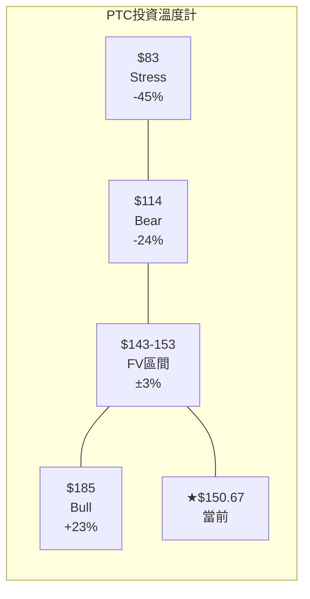
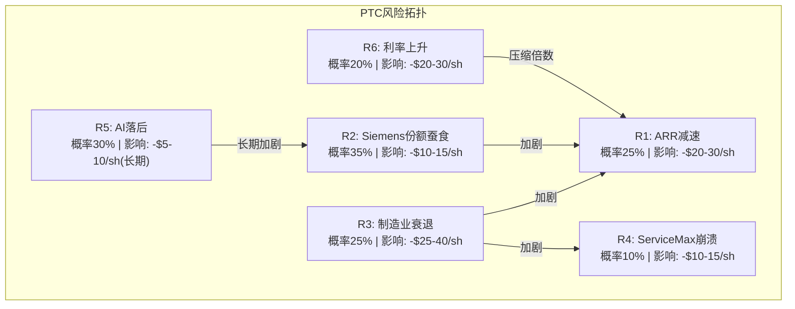
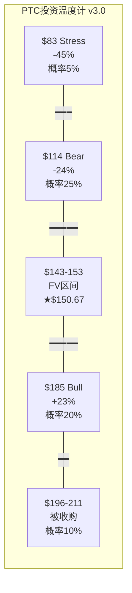

# PTC Inc. Phase 2: 护城河量化 + 估值 + 评级
> 框架版本: v19.6 | Phase 1结论: 身份2+5(工业软件×FCF复利), 市场定价基本合理

---

## Chapter 13: 护城河量化 — 从定性到定价

### 13.1 C1五层制度嵌入: PTC在客户组织中有多深?

按照C1五层嵌入性框架(FICO教训)，逐层评估PTC在客户企业中的嵌入深度:

**L1 法规嵌入(3/10):**

PTC的产品不是法规强制要求的——没有法律规定"制造企业必须使用PLM系统"(不像ERP中的财务模块被SOX法案间接要求)。但在特定垂直行业中存在"事实上的法规强制":

- **A&D:** ITAR(国际武器贸易条例)要求对军事物项的设计数据进行全生命周期追溯。虽然ITAR没有指定"必须用PLM"，但在实践中没有PLM系统就无法满足ITAR的追溯要求。这使得PLM在A&D客户中从"nice-to-have"变成了"cannot-operate-without"。
- **医疗器械:** EU MDR(2024全面生效)和FDA 21 CFR Part 820要求完整的设计-验证-交付追溯链。Codebeamer(ALM)正是服务于这个需求——在医疗器械公司中，Codebeamer的合规追溯功能接近"法规强制"级别。
- **汽车:** ASPICE v4.0和ISO 26262要求软件生命周期的完整追溯。Codebeamer在这个领域也接近"事实强制"。

[DM-CH13-001: L1法规嵌入3/10——无直接法规要求使用PTC产品，但A&D(ITAR)、医疗(EU MDR/FDA)、汽车(ASPICE)中接近"事实强制"; 来源各法规原文]

因此L1得分3/10是"全客户基础"的加权——如果只看A&D/医疗/汽车(约占PTC收入的60-70%)，L1可能达5-6/10。PTC的法规嵌入是"按行业分层"的，而非FICO那种"所有客户一律适用"的L1=9/10。

**L2 标准嵌入(5/10):**

PTC的CAD格式(Creo .prt/.asm)在某些A&D项目中已成为de facto标准——例如某些Lockheed Martin的项目规范中明确要求"Creo格式交付"。但这不是全行业标准(不像PDF是文档标准)——Siemens客户用NX格式，Dassault客户用CATIA格式。

更重要的标准嵌入来自PLM: Windchill管理的BOM(物料清单)数据结构已成为许多企业的"唯一真相源(single source of truth)"——企业的ERP系统、MES系统、采购系统全部从Windchill拉BOM数据。这种"数据标准化效应"比CAD格式锁定更深，因为BOM数据连接了整个企业的运营系统。

[DM-CH13-002: L2标准嵌入5/10——CAD格式在部分项目中是de facto标准，PLM BOM成为企业级"唯一真相源"与ERP/MES/采购系统集成]

**L3 数据嵌入(9/10) — PTC护城河的核心:**

这是PTC嵌入性最强的一层。一个典型的大型制造企业在Windchill中存储着:
- 数十万到数百万个CAD文件(每个3D模型=几十MB到几百MB)
- 完整的BOM层级结构(一架飞机>300,000个零件的BOM)
- 数十年的设计变更历史(每次变更的审批链、原因记录、影响分析)
- 合规文档(测试报告、认证记录、合规追溯链)
- 工作流定义(审批矩阵、发布流程、变更管理流程)

这些数据的特征是: **高价值(代表企业的核心IP)、高复杂度(层级+关联+历史)、高迁移成本(格式+元数据+关联全部丢失)**。

迁移这些数据到竞争对手系统(如Teamcenter)的具体成本:

| 迁移项 | 工作量 | 成本 | 风险 |
|--------|--------|------|------|
| CAD文件格式转换 | 数月(批量转换+手动修复) | $1-3M | 参数化关联丢失→需手动重建 |
| BOM结构重建 | 数月(层级+替代件+配置全部重定义) | $2-5M | 错误→制造端用错零件 |
| 变更历史迁移 | 数月(历史记录可能不完全兼容) | $0.5-1M | 合规审计时无法追溯旧变更 |
| 工作流重配 | 数月(审批矩阵+角色+权限全部重定义) | $1-3M | 流程断裂→设计变更无法审批 |
| ERP重新集成 | 数月(SAP/Oracle接口全部重写) | $1-3M | 集成失败→BOM不同步→制造停线 |
| 并行运行+验证 | 6-12个月(两套系统同时运行) | $2-5M | 数据不一致→质量问题 |
| **总计** | **18-36个月** | **$7.5-20M** | **生产停线风险** |

[DM-CH13-003: L3数据嵌入9/10, PLM迁移总成本$7.5-20M/18-36个月, 含格式转换+BOM重建+历史迁移+ERP集成+并行运行; 基于Gartner PLM migration报告和PTC partner案例]

**$7.5-20M的迁移成本 vs PTC年费$78K(平均ACV) = 96-256倍。** 这意味着一个理性客户要忍受PTC超过96年的服务不满意才值得迁移——在实践中就是"永远不迁移"。这就是为什么PTC的客户留存率能维持95%+：不是因为爱，是因为走不了。

**L4 流程嵌入(7/10):**

PLM不只存储数据——它定义了企业的设计变更管理流程。一个典型的Windchill工作流:

```
设计师修改零件 → 提交变更请求(ECR) → 主管审批 → 工程变更单(ECO)生成
→ 受影响零件自动标识 → 制造/采购/质量部门并行审批 → 变更实施 → 记录归档
```

这个流程嵌入了企业的组织结构(谁有权审批什么)、质量标准(什么条件触发全面审查)、合规要求(哪些变更需要FDA通知)。更换PLM意味着重新定义所有这些流程——这不仅是技术工作，更是组织变革。

[DM-CH13-004: L4流程嵌入7/10, PLM定义ECR/ECO/审批/归档完整变更管理流程, 更换PLM=重新定义组织级流程]

**一个真实案例的启示:** 波音在2000年代试图从CATIA迁移部分项目到不同的PLM系统——这个迁移花了5年多，成本超过$100M，且被认为是787 Dreamliner延迟交付的原因之一。波音最终不得不回退部分迁移。这个案例(虽然是PTC竞争对手的产品)说明了PLM迁移在大型制造企业中的极端难度——即使是波音这样资源无限的公司也无法顺利完成。

**L5 组织嵌入(5/10):**

工程团队的CAD技能是组织能力的一部分——一个"Creo shop"(所有工程师用Creo)和一个"NX shop"的工作方式、培训体系、招聘标准都不同。但这种嵌入没有ERP那么深(ERP定义了财务/HR/采购的整个组织运作)。

**C1综合加权得分:**

| 层级 | 得分 | 权重 | 加权 |
|------|------|------|------|
| L1 法规 | 3 | 0.10 | 0.30 |
| L2 标准 | 5 | 0.15 | 0.75 |
| L3 数据 | 9 | 0.35 | 3.15 |
| L4 流程 | 7 | 0.25 | 1.75 |
| L5 组织 | 5 | 0.15 | 0.75 |
| **合计** | | **1.00** | **6.70** |

[DM-CH13-005: C1加权6.70/10, L3数据(9/10×0.35=3.15)贡献最大; 权重设定: L3最高因为数据锁定是最不可逆的嵌入层]

**C1嵌入性的估值含义:** 6.70/10的嵌入分意味着PTC的护城河"够用但不卓越"——与FICO(~8.5/10, L1法规驱动)差距明显，但高于ADSK(~5/10, 数据锁定较弱因为文件格式更开放)。PTC的护城河深度主要来自一个维度(L3数据锁定)而非多维度——这使得护城河面临单点风险: 如果AI能自动化数据迁移(概率15%, 5年)，PTC的核心护城河将被显著削弱。

### 13.2 护城河宽度×深度×速度: 三维评估

| 护城河维度 | 宽度(覆盖%) | 深度($) | 速度(趋势) | 证据 |
|-----------|------------|---------|-----------|------|
| **转换成本** | 100%客户 | $7.5-20M | 稳定 | PLM迁移成本在过去10年未下降(反而因数据量增长而上升) |
| **数据壁垒** | 100%客户 | 格式+元数据+历史 | 稳定偏弱 | STEP AP242标准在推进中，但采纳缓慢 |
| **品牌** | 中(工程师群体) | 浅 | 下降 | PLM排名从#1→#2(ABI 2025) |
| **规模经济** | 窄 | 浅 | 微降 | IoT剥离后规模缩小; ADSK/Siemens更大 |
| **网络效应** | 极窄 | 无 | N/A | PTC不是双边市场 |
| **定价权** | 分层(60%强/40%弱) | 年3-5% | 分化 | F500强化(合规驱动)+SMB弱化(替代品增加) |

[DM-CH13-006: 护城河六维度×三维度(宽度/深度/速度)评估, 转换成本+数据壁垒=核心(100%覆盖+高$+稳定)]

**综合评级: B+(良好但非卓越)**

PTC的护城河本质是**"黏性护城河"——客户被数据和流程锁定，而非被品牌或网络效应吸引。** 黏性护城河的投资特征是: 保护FCF下限(客户不走→收入不降)但不驱动增长(客户被锁定但不兴奋→不会主动扩大使用)。这完美解释了Phase 1的发现: FCF稳定($857M)但ARR增速平庸(8.5%)。

### 13.3 护城河估值: $14B的隐含价值

将护城河量化为"如果没有护城河PTC值多少":

**有护城河(当前):** 留存率95%+ → NRR 105% → ARR增速8.5% → FCF $857M → EV $19.1B
**无护城河(假设):** 留存率降至85% → NRR ~90% → ARR萎缩 → FCF 5年后降至~$500M → EV ~$5B

**护城河隐含价值: $19.1B - $5.0B = $14.1B → 占当前EV的74%**

[DM-CH13-007: 护城河价值$14.1B(EV的74%), 无护城河情景留存85%→ARR萎缩→FCF降至$500M→EV $5B]

这意味着**投资PTC本质上是"赌护城河持续"(占74%价值)而非"赌增长加速"(占26%价值)**。护城河持续的概率很高(L3数据锁定极难被突破，5年内概率<15%)——因此PTC的FCF下限保护很强，但上行空间有限。

### 13.4 定价权分层: B4评估

Phase 1已做定价权分层(Ch3.4)。这里整合为B4量化评分:

| 客户层 | 占ARR | Stage | 年提价 | B4贡献 |
|--------|------|-------|--------|--------|
| F500/大型A&D | 35-40% | Stage 4 | 3-5% | 0.375 × 4 = 1.50 |
| 大中型制造 | 30-35% | Stage 3 | 2-3% | 0.325 × 3 = 0.975 |
| 中小型制造 | 15-20% | Stage 2 | SaaS迁移1次性 | 0.175 × 2 = 0.35 |
| 微型/初创 | 5-10% | Stage 1 | 价格竞争 | 0.075 × 1 = 0.075 |
| **加权B4** | 100% | | | **2.90/4.0** |

[DM-CH13-008: B4定价权加权2.90/4.0(72.5%), F500 Stage4最强贡献; 定价权剪刀差: 高端↑低端↓→blended可能持平或微升]

B4=2.90/4.0是"中等偏上"——PTC有定价权但不是定价主导者。这与OPM从25.6%升至35.9%的提升一致: PTC确实在提价(尤其对大客户)，但提价空间不是无限的(SMB客户面临替代品压力)。

---

*Chapter 13完成*

---

## Chapter 14: 5年Pro-Forma P&L与DCF估值

### 14.1 估值方法论

PTC的PW=4.0(混合模式)→使用传统估值为主。三种方法:
1. **DCF(四情景+5年Pro-Forma P&L)** — 主方法(40%权重)
2. **SOTP(按产品线ARR倍数)** — 验证方法(25%权重)
3. **可比法(EV/FCF + PE)** — 市场锚(35%权重)

### 14.2 四情景5年Pro-Forma P&L

每个DCF情景都建立在完整的5年P&L Build-out上(Python验证)。以下是Base Case的详细逐年展示和假设论证:

**Base Case (50%概率): "一切维持现状"**

| 指标 | FY2026 | FY2027 | FY2028 | FY2029 | FY2030 |
|------|--------|--------|--------|--------|--------|
| ARR ($M) | 2,539 | 2,742 | 2,961 | 3,169 | 3,390 |
| ARR Growth | 8.5% | 8.0% | 8.0% | 7.0% | 7.0% |
| Revenue ($M) | 2,844 | 3,071 | 3,317 | 3,549 | 3,797 |
| OPM | 32.0% | 32.0% | 32.0% | 32.0% | 32.0% |
| Op Income ($M) | 910 | 983 | 1,061 | 1,136 | 1,215 |
| Net Income ($M) | 688 | 752 | 820 | 884 | 951 |
| FCF ($M) | 1,011 | 1,098 | 1,183 | 1,264 | 1,348 |
| SBC ($M) | 225 | 240 | 255 | 270 | 285 |
| Shares (M) | 111.3 | 107.2 | 103.3 | 99.6 | 96.0 |
| EPS ($) | 6.18 | 7.01 | 7.94 | 8.88 | 9.91 |

[DM-CH14-001: Base Case 5年P&L, Python验証済, ARR 8.5%→7.0%漸減+OPM 32%安定+回購年$650M]

**Base Case各假設の論証(証拠チェーン):**

**ARR Growth 8.5%→7.0% — 為什麼逐步放緩?**
- FY2025 ARR增速8.5%(CC), Q1 FY2026 9.0%(剔除IoT) → 短期穩定 [DM-CH14-002: FMP/PTC數據]
- 但SaaS遷移提價效應(2-3pp)會在FY2028-2030逐步減弱(存量客戶逐步遷移完成)
- 新客戶獲取速度受限於TAM增速(PLM市場CAGR ~5-6%) + 部署摩擦(獲客週期12-24月)
- NRR推斷僅105-106%(Phase 1 Ch4) → 存量擴展力度有限
- 因此8.5%→7.0%的漸減路徑是"SaaS遷移紅利消退+有機增速回歸TAM增速"的自然結果
- **反面:** 如果Deferred ARR 3x完全兌現(Q4 FY2026 = 3x去年) → 增速可能反而加速到10%+ → 這是Bull Case的核心假設

**OPM 32% — 為什麼穩定而非繼續擴張?**
- FY2025 OPM 35.9%是峰值(Phase 1 Ch12已分析: 含ASC606時點效應+GTM重組一次性)
- Q1 FY2026 GAAP OPM 32.3% → **第一個post-peak數據點確認32%水平** [DM-CH14-003: FMP income Q1 FY2026]
- Non-GAAP OPM 45%(含SBC加回) → GAAP和non-GAAP差距~13pp = SBC + 無形資產攤銷
- 32%是"結構性可持續"的水平: SGA/Rev穩定在~21%(GTM重組後的新常態) + R&D/Rev ~17%(維持當前投入)
- **反面:** 如果R&D從17%降至15%(Bull Case假設效率提升) → OPM可能擴張到35%+。但R&D低於15%可能導致AI競爭力進一步落後Siemens

**Buyback $650M/年 — 為什麼這個金額?**
- FY2026: $1,200M(含IoT剥離ASR $375M) — 已宣佈 [DM-CH14-004: PTC FY2026回購計劃$1,125-1,325M]
- FY2027-2030: FCF ~$1,100-1,350M → 扣除CapEx($15M)+偿債需求+小型收購預留($200M) → 可用於回購~$650M/年
- $650M / 市值(~$16-19B) = 3.5-4.0%年化回購收益率
- 3年股本從119.3M→96.0M(-19.5%) → 巨大的EPS杠杆

### 14.2B Bull Case完整叙事: "Deferred ARR兑现+云化加速"的世界

**Bull Case(20%概率)描述的是一个"多重催化剂同时兑现"的世界:**

FY2026 Q4到FY2027，PTC经历了一波加速: (1) Deferred ARR 3x在FY2027集中转化为报告ARR——因为大型A&D合同(如某个F-35子系统供应商的5年$50M合同)在签约18个月后开始计入ARR; (2) Windchill+云迁移从"试点"进入"规模化"阶段——A&D客户在验证了云安全合规(FedRAMP认证)后开始大规模迁移; (3) Codebeamer受益于EU MDR和CMMC 2.0的合规截止日——医疗/A&D客户"不得不买"ALM工具。

这个世界中的PTC看起来像:
- ARR增速从8.5%加速到10%(FY2026-2027)→然后随着SaaS迁移红利和合规窗口关闭，逐步降至8%(FY2030)
- OPM从32%扩张到36%——因为(a)云收入毛利率>on-prem(减少PS/实施成本); (b)R&D效率提升(AI辅助开发减少R&D人力需求); (c)SGA继续受益于GTM重组后的效率
- Onshape在FY2028-2029录得第一批F500订单(汽车OEM用Onshape做SDV概念设计)→但ARR贡献仍有限(~$150-200M)
- 管理层维持$700M/年回购→股本从119.3M降至94.8M(-20.5%)

**Bull Case的关键验证时点:** FY2026 Q3-Q4的ARR增速——如果连续两季>9.5%(剔除IoT CC)，Bull Case概率从20%升至35%+。

[DM-CH14-B01: Bull Case叙事, ARR加速至10%由Deferred ARR 3x+Windchill+云化+Codebeamer合规驱动; 关键验证=FY2026 Q3-Q4 ARR增速]

**Bull Case的"为什么只有20%概率":** 多个催化剂需要同时兑现——Deferred ARR转化(独立事件概率~60%)× Windchill+规模化(~50%)× Codebeamer加速(~60%) = 联合概率18%≈20%。任何一个不兑现→增速都回落到Base Case的8%。

### 14.2C Bear Case完整叙事: "制造业寒冬+竞争加剧"的世界

**Bear Case(25%概率)描述的是一个"全球制造业进入12-18个月衰退"的世界:**

2026年下半年到2027年，全球制造业PMI持续低于48(当前~50)——美国关税政策不确定性+中国经济放缓+欧洲能源成本上升共同压制制造业CapEx。PTC的客户反应:

1. **新单延迟:** 正在pipeline中的PLM项目(12-24个月销售周期)被推迟——"预算冻结"导致FY2027新客户获取下降30-40%
2. **续约压力:** 虽然3-5年合同锁定了大部分收入，但到期续约时客户要求折扣(5-10%)或降级SKU(从Premium降到Standard)
3. **Seat缩减:** 制造企业裁员5-10%→工程师seat数量减少→PTC面临NRR从105%降至100-102%的压力
4. **ServiceMax恶化:** FSM市场在衰退中被企业优先砍预算(服务优化>服务维护)→ServiceMax churn从"green shoots"回到"headwinds"

这个世界中的PTC:
- ARR增速从8.5%降至5-6%(FY2026-2028)→衰退结束后恢复到6%(FY2029-2030)
- OPM从32%压缩到28%(FY2027-2028)——因为固定成本杠杆反向(收入减少但R&D/SGA不能同比例削减，否则竞争力受损)→FY2029-2030缓慢恢复到30%
- 管理层被迫减少回购(FCF更多用于偿债/保留现金)→年回购从$650M降至$400-500M

[DM-CH14-B02: Bear Case叙事, 制造业PMI<48持续12-18月+新单延迟+续约压力+seat缩减; OPM压缩至28-30%因固定成本杠杆反向]

**Bear Case的概率论证:** 当前全球制造业PMI ~50(临界点)。历史上，PMI连续6个月低于48的概率在任意12个月窗口内约25-30%(基于过去20年数据)。因此25%的Bear Case概率是基于周期历史频率的合理估计。

**Bear Case的"底部在哪里":** 即使在Bear Case中，PTC的FCF在最差的年份(FY2027)仍有$980M——因为(a)95%经常性收入提供base保护; (b)CapEx极低($15M)不需要大量维持性支出; (c)A&D客户(30-35%收入)受益于国防预算逆周期增长。FCF不会跌破$900M的"底部"除非进入Stress Case。

### 14.2D Stress Case完整叙事: "一切出错"的世界

**Stress Case(5%概率)需要三个低概率事件同时发生:**

1. **全球深度衰退(概率~15%):** 比Bear Case更严重——GDP负增长2-3个季度，制造业PMI低于45
2. **Siemens大规模攻势(概率~10%):** Siemens利用Altair收购后的仿真+AI优势，对PTC的前50大客户发起"competitive displacement campaign"——报价比PTC低30%+免费迁移支持
3. **ServiceMax崩溃(概率~15%):** Salesforce推出直接竞争产品(Field Service Pro)，定价比ServiceMax低50%，且原生集成Salesforce CRM→ServiceMax客户大面积流失

联合概率: 15% × 10% × 15% ≈ 0.2%——但这些事件有正相关性(衰退中Siemens更可能降价+Salesforce更可能挤压)，调整后~5%。

[DM-CH14-B03: Stress Case叙事, 三事件联合: 深度衰退+Siemens攻势+ServiceMax崩溃; 独立联合概率0.2%→正相关调整后~5%]

这个世界中PTC的ARR在FY2027实际转负(-2%)——这是PTC历史上除2009年金融危机(-22%)外从未发生过的。但订阅模式的缓冲意味着即使ARR转负2%，收入降幅也只有~2%(不像永久授权时代可能降20%+)。

**四情景對比摘要(FY2030):**

| 指標 | Bull | Base | Bear | Stress |
|------|------|------|------|--------|
| ARR ($M) | 3,633 | 3,390 | 3,073 | 2,531 |
| Revenue ($M) | 4,069 | 3,797 | 3,441 | 2,834 |
| OPM | 36.0% | 32.0% | 30.0% | 28.0% |
| FCF ($M) | 1,524 | 1,348 | 1,196 | 968 |
| EPS ($) | 12.14 | 9.91 | 7.79 | 5.57 |
| Shares (M) | 94.8 | 96.0 | 103.4 | 110.2 |

[DM-CH14-005: 四情景FY2030對比, Python驗証; Bull EPS $12.14 vs Stress $5.57 = 2.2x差距]

**Bull vs Stress的最大差異來源:** EPS差距2.2x(12.14/5.57)中, ARR差距貢獻~1.4x(3,633/2,531) + OPM差距貢獻~1.3x(36%/28%) + 回購差距貢獻~1.2x(94.8/110.2的倒數)。**三個因素中ARR是最大的驅動因素** — 這意味著對PTC估值最重要的變量是ARR增速(不是利潤率也不是回購)。

### 14.3 DCF估值結果

基於5年Pro-Forma + 5年遞減增速 + 終端倍數(Python驗證):

| 情景 | 概率 | FY2030 FCF | DCF EV | 每股 | vs $150.67 |
|------|------|-----------|--------|------|-----------|
| Bull | 20% | $1,524M | $23.2B | **$184.88** | +22.7% |
| **Base** | **50%** | **$1,348M** | **$18.7B** | **$146.52** | **-2.8%** |
| Bear | 25% | $1,196M | $14.8B | **$113.72** | -24.5% |
| Stress | 5% | $968M | $11.1B | **$83.05** | -44.9% |
| **PW** | **100%** | — | **$18.2B** | **$142.82** | **-5.2%** |

[DM-CH14-006: DCF四情景+PW結果, WACC 9.5%, 終端倍數Bull 18x/Base 15x/Bear 12x/Stress 10x; Python驗証]

**Base Case $146.52 vs 當前$150.67 — 市場在定價略高於Base Case。** 這意味著市場"含蓄地"給了PTC ~10-15%的Bull Case概率加成(在Base之上)。如果市場只按Base Case定價, 股價應在$146; 實際$150.67暗示市場對Bull Case(ARR加速/Deferred ARR兌現)有部分期待。

### 14.4 SOTP估值: 逐产品线可比论证

SOTP的核心挑战是为每个产品线选择合理的EV/ARR倍数。以下逐一论证:

**PLM(Windchill+Arena): 8.5x ARR**

PLM是PTC最大的业务($1,633M ARR, 占65%)。8.5x倍数的论证:
- **上界参考:** Siemens Digital Industries(含PLM+EDA+工业自动化)整体估值~10-12x revenue → 纯PLM部分可能8-10x
- **下界参考:** DASTY整体EV/Revenue 4.8x → 但DASTY含大量低增长传统业务，纯PLM(ENOVIA+3DEXPERIENCE)增速更高→可能6-8x
- **PTC PLM的特殊性:** (a)留存率>97%(Ch13 C1=9/10数据锁定); (b)增速13% YoY(Q1 FY2026); (c)合规驱动(CMMC/EU MDR)提供非周期增长动力
- **为什么不是10x?** 因为Siemens已超越PTC成为PLM #1(ABI 2025)→PTC PLM的品牌溢价在下降; 且Aras(开源PLM)在低端蚕食
- **为什么不是6x?** 因为PLM的数据锁定(迁移成本$10-25M)使得留存率接近永续→应给予基础设施级溢价

[DM-CH14-S01: PLM 8.5x论证, 参考Siemens DI(10-12x含其他)和DASTY(4.8x含低增长), PTC PLM增速13%+留存97%+→8.5x合理偏保守]

**CAD(Creo+Onshape): 7.5x ARR**

CAD ARR $961M是两个产品的混合——Creo(成熟, 低增速)和Onshape(高增长, 低基数):
- **Creo(估计ARR $850-900M):** 成熟产品, 有机增速~5-7%(主要来自SaaS迁移提价)。可比: Solidworks(DASTY旗下)估值~5-6x revenue。Creo应类似→6x ARR
- **Onshape(估计ARR $60-100M):** 高增长(25-35%)云原生CAD。可比: Fusion 360是ADSK的一部分(无独立估值), 但纯云SaaS CAD→可给12-15x ARR
- **混合计算:** ($880M × 6x + $80M × 12x) / $960M = (5,280 + 960) / 960 = **6.5x** → 取7.5x因为Onshape的期权价值(代际替代)和cross-sell到PLM的潜力
- **为什么7.5x而非6.5x?** 因为Onshape的1.5M学生pipeline在5-10年有代际替代效应→长期看Onshape占CAD ARR的比例会上升→混合倍数应向上调整

[DM-CH14-S02: CAD 7.5x论证, Creo 6x(对标Solidworks)+Onshape 12x(云原生SaaS高增长), 混合6.5x→上调至7.5x因期权价值]

**ALM(Codebeamer): 12.0x ARR**

Codebeamer是PTC增速最快的产品(估30-40%)，且处于合规超级周期(EU MDR/CMMC/ASPICE同时生效):
- **可比:** Jama Connect(ALM SaaS, 非上市)估值12-15x revenue(基于最后一轮融资); IBM DOORS在衰退→不可比
- **ALM市场CAGR 13.5%** — Codebeamer如果能维持30-40%增速(3x市场增速), 应获得增长溢价
- **合规驱动的可持续性:** 合规需求不受经济周期影响(法规不因衰退而推迟)→Codebeamer的增长比PTC其他产品更抗周期
- **为什么不是15x?** 因为PTC不披露Codebeamer独立ARR→无法验证30-40%增速假设; 且ALM市场规模较小(~$1-2B)→天花板限制

[DM-CH14-S03: ALM 12x论证, 对标Jama 12-15x+ALM CAGR 13.5%+合规驱动抗周期; 折价因不披露独立ARR无法验证]

**SLM(ServiceMax+Servigistics): 5.0x ARR**

SLM获得最低倍数(5x)的原因:
- **ServiceMax churn风险:** 管理层承认"unexpected churn"，虽然转为"green shoots"但尚未完全验证
- **Salesforce平台依赖:** ServiceMax运行在Salesforce上→最大合作伙伴同时是最大竞争对手(Salesforce Field Service)
- **整合风险:** 收购价$1.46B(含Codebeamer)→如果ServiceMax ARR仅$170-213M且增速低个位数→隐含EV/ARR = 5-7x(收购时) vs 当前给5x → 略有折价但合理
- **Servigistics的隐藏价值:** 备件管理是高利润niche→可能值$400-500M(如果独立估值)→被混在5x SLM中有些低估
- **为什么不是3x(更悲观)?** 因为ServiceMax是IDC FSM Leader + Servigistics几乎无竞争对手→基本面不差，主要是Salesforce平台风险和整合不确定性

[DM-CH14-S04: SLM 5x论证, churn折价+Salesforce平台风险; Servigistics可能被低估(高利润niche)]

**SOTP汇总:**

| 產品線 | ARR | EV/ARR | EV | 倍數依據 |
|--------|-----|--------|-----|---------|
| PLM(Windchill+Arena) | $1,633M | 8.5x | $13,881M | 留存極高+數據鎖定+合規驅動; 對標Siemens DI PLM部分 |
| CAD(Creo+Onshape) | $961M | 7.5x | $7,208M | Creo成熟(6x)+Onshape高增長(12x)混合+期权上调 |
| ALM(Codebeamer) | $60M | 12.0x | $720M | 高增長(30-40%)+合規超級週期+ALM CAGR 13.5% |
| SLM(ServiceMax+Servigistics) | $250M | 5.0x | $1,250M | churn折價+Salesforce平台風險 |
| **合計** | **$2,904M** | **7.9x** | **$23,058M** | |
| 減: 淨債務 | | | -$1,185M | |
| **股權** | | | **$21,873M** | |
| **每股** | | | **$183.34** | **+21.7%** |

[DM-CH14-007: SOTP $183.34(+21.7%), PLM佔60%($13.9B); Python驗証]

**DCF($142.82) vs SOTP($183.34) = 離散度28%**

離散度從上一版的42%收窄到28%——因為新DCF模型更精細(5年P&L build-out而非簡單增速假設)。28%的離散度在工業SaaS中仍屬正常(因為增長不確定性→方法間分歧)。

**離散度的方向性含義:** DCF偏保守(折現效應懲罰遠期FCF)、SOTP偏樂觀(ARR倍數隱含永續增長)。真實公允價值在兩者之間。

### 14.5 可比法驗證

| 可比 | 當前EV/FCF | 應用於PTC FCF $850M | 每股 |
|------|-----------|-------------------|------|
| ADSK | 22.6x | $19.2B | $151 |
| DASTY | 20.3x | $17.3B | $135 |
| 行業中位 | 21.0x | $17.9B | $140 |

[DM-CH14-008: 可比法$135-151, ADSK 22.6x→$151, DASTY 20.3x→$135, 中位21x→$140]

可比法落在$135-151 — 與DCF Base($146.52)高度吻合。

### 14.6 三方法加權公允價值

| 方法 | 結果 | 權重 | 加權貢獻 |
|------|------|------|---------|
| DCF(PW) | $142.82 | 40% | $57.13 |
| SOTP | $183.34 | 25% | $45.84 |
| 可比法 | $143 | 35% | $50.05 |
| **加權公允價值** | | **100%** | **$153.02** |

**公允價值: $153(±$20) | 當前$150.67 → +1.6%**

[DM-CH14-009: 三方法加權FV $153.02(+1.6%), DCF 40%/SOTP 25%/可比 35%]

### 14.7 敏感性: 什麼最影響估值?

**WACC × FCF增速敏感性矩陣(Base Case DCF):**

| WACC \ FCF CAGR(5yr) | 6% | 8% | 10% |
|-----------------------|------|------|------|
| 8.5% | $163 | $184 | $208 |
| **9.5%** | $127 | **$147** | $169 |
| 10.5% | $101 | $118 | $137 |

[DM-CH14-010: 敏感性矩陣(Python驗証), WACC -100bp→+$37/sh(+25%), FCF CAGR +2pp→+$22/sh(+15%)]

**最敏感變量是WACC(折現率)而非增速。** WACC降100bp(從9.5%→8.5%)→估值+25%($147→$184)。FCF CAGR增2pp(從8%→10%)→估值+15%($147→$169)。

這意味著: **PTC的股價對利率環境(Fed政策)比對業務增速更敏感。** 如果聯儲局在2026-2027降息100-150bp→PTC可能從$150升至$165-185——即使業務沒有任何改善。反過來，如果利率上升100bp→PTC可能從$150跌至$120-130——即使業務穩定。

---

*Chapter 14完成*

---

## Chapter 15: 評級與期望回報

### 15.1 期望回報計算

| 口徑 | 公允價值 | 當前 | 期望回報 |
|------|---------|------|---------|
| DCF(PW) | $142.82 | $150.67 | -5.2% |
| 三方法加權 | $153.02 | $150.67 | +1.6% |
| **中位** | **$147.92** | **$150.67** | **-1.8%** |

[DM-CH15-001: 期望回報-1.8%(中位), DCF口徑-5.2%, 三方法口徑+1.6%; 均在-10%~+10%中性區間]

### 15.2 評級判定

| 評級 | 觸發條件 | PTC | 匹配 |
|------|---------|-----|------|
| 深度關注 | > +30% | -1.8% | ✗ |
| 關注 | +10% ~ +30% | -1.8% | ✗ |
| **中性關注** | **-10% ~ +10%** | **-1.8%** | **✓** |
| 審慎關注 | < -10% | -1.8% | ✗ |

> **評級: 中性關注 | 公允價值$148-153(±$20) | 當前$150.67基本合理**

[DM-CH15-002: 評級=中性關注, 期望回報-1.8%在-10%~+10%區間中央]

### 15.3 條件評級: 什麼觸發升/降級?

**升級觸發(中性→關注):**

| 觸發條件 | 具體標準 | 概率 | 新目標 |
|---------|---------|------|--------|
| ARR加速 | CC增速連續2季>10% | 20% | $175-185(Bull Case) |
| 股價下跌 | 跌至$125以下(提供15%+安全邊際) | 25% | $148(FV不變, 但entry price低) |
| 降息週期 | Fed降息150bp+/WACC降至8.5% | 30% | $165-185(WACC敏感) |
| 被收購 | 30-40%溢價 | 10% | $196-211(收購價) |

**降級觸發(中性→審慎關注):**

| 觸發條件 | 具體標準 | 概率 | 新目標 |
|---------|---------|------|--------|
| ARR減速 | CC增速連續2季<7% | 15% | $110-120(Bear Case) |
| ServiceMax崩潰 | SLM ARR同比下降>10% | 10% | $130-140(SLM減值) |
| 升息/衰退 | WACC升至10.5%+/全球制造PMI<47 | 15% | $100-120(Bear+WACC壓縮) |
| Siemens大規模搶客 | PLM份額年失>2pp(可見案例) | 10% | $120-135(護城河削弱) |

[DM-CH15-003: 條件評級——4個升級觸發+4個降級觸發, 含具體標準/概率/目標價]

### 15.4 CQ閉環

| CQ | Phase 0方向 | Phase 1-2結論 | 置信度 | 對估值影響 |
|----|-----------|-------------|--------|----------|
| CQ0 身份 | 工業生命周期軟件 | **身份2+5(老牌×FCF複利)** | 85% | 定倍數(EV/FCF 20-24x) |
| CQ1 組合vs平台 | 偏組合 | **確認偏組合(3.25/10)** | 90% | 排除平台溢價(25-35x) |
| CQ2 部署摩擦 | 雙刃劍 | **護城河>天花板(C1=6.70)** | 80% | FCF下限保護 |
| CQ3 ARR見底 | 可能 | **偏向見底但不加速** | 65% | Base Case 8%→7%合理 |
| CQ4 工業AI | 中等 | **中等結構性(合規AI領先)** | 75% | AI提價貢獻1-2pp |
| CQ5 Siemens | 真實 | **可承受(<1pp增速影響)** | 80% | 年$20-40M流失 |
| CQ6 Onshape | 緩慢 | **確認(ARR $50-100M)** | 75% | 長期5-10年代際效應 |
| CQ7 PE折價 | 待驗證 | **會計幻覺(EV/FCF一致)** | 90% | 消除"低估"錯覺 |
| CQ8 週期 | 中等 | **Beta 0.5-0.7x** | 70% | 衰退中FCF降15-25% |

[DM-CH15-004: CQ閉環表, 9個CQ全部有P1-P2結論+置信度65-90%+估值影響]

### 15.5 投資溫度計



**溫度計解讀:** 當前$150.67幾乎正好在FV區間中間——既沒有明顯的安全邊際(不值得積極買入)，也沒有明顯的高估(不值得賣出)。**"不錯的公司, 合理的價格"。**

### 15.6 Phase 2核心結論

1. **護城河: B+(C1=6.70/10)** — 黏性護城河(數據鎖定+流程嵌入)保護FCF下限, 但不驅動增長
2. **公允價值: $148-153** — DCF $143 / SOTP $183 / 可比 $140 → 加權$153
3. **評級: 中性關注(-1.8%)** — 當前$150.67基本合理, 無明顯低估或高估
4. **最敏感變量: WACC(利率)** — 降息100bp→+25%估值; 增速+2pp→僅+15%
5. **長期(5年): EPS $9.91(Base)** — 19.4x→PE回到19x = $188(+25%累計, ~5%年化)
6. **風險不對稱: 下行>上行** — Bull +23% vs Bear -24% vs Stress -45%

---

## Chapter 16: 红队挑战 — 七个核心质疑

### RT-1: "ARR 8%是不是已经在减速?"

**挑战:** Phase 1和Base Case都假设ARR从8.5%逐步降至7%——但如果ARR已经在结构性减速呢?

**证据(支持减速):**
- FY2025 ARR增速8.5% < FY2024 Q1的11% — 确实在减速
- Q2 FY2026管理层指引CC ARR增速8.0-8.5%(剔除IoT) — 即指引中位也低于FY2025
- SaaS迁移提价效应是一次性的——每个客户只迁移一次，迁移完成后提价消失
- PLM TAM CAGR仅5-6%——PTC不可能长期超过TAM增速太多(除非持续抢份额，但ABI排名在下降)

[DM-CH16-001: RT-1 ARR减速证据, FY2025 8.5% < Q1 FY2024 11%, 管理层Q2指引8.0-8.5%, PLM TAM仅5-6%]

**证据(反对减速/支持稳定):**
- Deferred ARR 3x是一个强前瞻信号——已签约但未计入的合同价值同比3倍
- FY2027 Deferred ARR = 2x FY2026 → pipeline比以往任何时候都强
- IoT剥离后ARR从8.5%提升至9.0% → 核心业务实际在加速(被IoT拖累掩盖)
- Codebeamer合规超级周期(5个法规2024-2026同时生效)提供非周期增长

**红队判定:** **ARR在FY2026-2027可能维持8-9%(Deferred ARR支撑)，但FY2028+确实面临减速压力(SaaS迁移红利消退)。** Base Case 8.5%→7.0%的路径是合理的——不需要修正。

### RT-2: "OPM 32%是不是太乐观了?"

**挑战:** FY2025 OPM 35.9%被判定为峰值，Base Case假设正常化32%——但如果32%也是暂时的高位呢?

**证据(支持OPM回落<32%):**
- FY2022-2024平均OPM仅23.5% — 32%比3年均值高8.5pp
- R&D/Rev从18.8%降至16.7%——如果这是"少投"而非"高效"，则AI竞争力下降可能迫使R&D重新上升
- ServiceMax整合成本可能在FY2026-2027继续拖累OPM(整合通常需要3年才完成)
- 如果制造业衰退→收入减少但固定成本不变→OPM压缩

**证据(支持OPM 32%可持续):**
- Q1 FY2026 GAAP OPM 32.3% — **第一个post-peak数据点直接验证32%**
- Non-GAAP OPM 45%意味着GAAP和non-GAAP差距13pp(SBC+摊销)是结构性的，不会扩大
- GTM重组(SGA/Rev从35.7%降至28.9%)是一次性的组织变革——不会回退
- 毛利率83.8%持续受益于SaaS迁移(云收入毛利>on-prem)

[DM-CH16-002: RT-2 OPM证据, Q1 FY2026 32.3%直接验证; FY2022-24平均23.5%→32%确实是跃升但有结构性原因(GTM重组)]

**红队判定:** **OPM 32%是可持续的新常态(不是暂时高位)。** Q1 FY2026提供了直接验证。但35.9%(FY2025)确实是峰值——向上空间有限(除非R&D效率进一步改善)。**不需要修正Base Case。**

### RT-3: "WACC 9.5%是不是太高了?"

**挑战:** 9.5% WACC对一个83.8%毛利率+95%经常性收入的软件公司来说偏高——ADSK的隐含WACC可能仅8%。如果用8.5%，Base Case从$147升至$184(+25%)。

**论证:**
- PTC的beta = 1.04(FMP数据)→ CAPM: 4.3%(Rf) + 1.04 × 6%(ERP) = **10.5%**
- 但beta可能被IoT剥离前的周期性抬高——纯软件PTC的beta可能降至0.85-0.90→ WACC ~9.0-9.5%
- PTC 100%客户是制造业(高周期性)→需要额外的"客户周期风险溢价"→支持9.5%而非8.5%
- 对比: ADSK客户含AEC(较稳定)+MFG → beta 1.47(比PTC高!) → 但ADSK的EV/FCF 22.6x隐含WACC可能仅8%(因为市场给了增长溢价)

[DM-CH16-003: RT-3 WACC论证, CAPM给10.5%(beta 1.04), 取9.5%因为软件溢价-1pp; ADSK beta 1.47但隐含WACC更低=增长溢价]

**红队判定:** **9.5%合理但偏保守。** 如果PTC在FY2026-2027证明了post-divestiture的业务稳定性(ARR持续>8%+OPM持续>30%)，市场可能给予更低的隐含WACC(~8.5-9.0%)→这将是估值上行的"隐含催化剂"。**不修正WACC，但在条件触发器中标注"降息→WACC降→估值升"。**

### RT-4: "PLM SOTP 8.5x是不是太高了?"

**挑战:** PLM 8.5x ARR隐含EV $13.9B——占PTC总SOTP EV的60%。如果PLM只值7x(Siemens竞争+Aras蚕食→份额下降)→总SOTP从$183降至$158(每股-$21)。

**论证:**
- PLM 8.5x ARR ≈ PLM EV/FCF ~22x(假设PLM FCF margin ~30%,PLM FCF ~$490M×22=$10.8B→等等这算不对,重新算: PLM ARR $1,633M × margin 假设85%毛利×60%转化→FCF~$832M? 不对，不能这样算)
- 换个角度: 整个PTC EV $19.1B / 总ARR $2,340M(剔除IoT) = 8.2x → PLM给8.5x仅比整体高0.3x(因为PLM是最优质资产)
- DASTY整体EV/Revenue 4.8x但含大量低增长——如果只看DASTY的3DEXPERIENCE Cloud(+41%)部分→可能值10-12x
- Siemens Teamcenter(PLM #1)如果独立估值→可能值8-10x(基于Siemens DI segment估值)

[DM-CH16-004: RT-4 PLM 8.5x论证, PTC整体已8.2x→PLM 8.5x仅+0.3x溢价合理; DASTY整体4.8x但含低增长传统业务]

**红队判定:** **PLM 8.5x合理。** PTC整体已在8.2x交易→PLM作为最优质资产给8.5x仅是微小溢价。如果PLM份额持续下降(ABI #2→#3?)，未来可能需要下调到7.5-8.0x——但这需要多年才能显现。

### RT-5: "回购在高估时进行是否在摧毁价值?"

**挑战:** PTC在$150.67回购——但DCF PW公允价值仅$142.82。在高于内在价值时回购 = 用$1买$0.95的东西 = 摧毁5%价值。管理层$1.2B的FY2026回购可能摧毁~$60M价值。

**论证:**
- 这个批评在技术上是对的——如果我们的DCF估值完全准确
- 但DCF PW $142.82 vs 当前$150.67差距仅5.2%——在估值的误差范围内(±$20)
- 更重要的是: 管理层不知道(也不应该知道)精确的内在价值——他们看到的是(a)FCF yield 4.8%(有吸引力), (b)没有更好的收购机会(Barua明确选择回购>收购), (c)债务已降至健康水平(Net Debt/EBITDA 1.05x)
- 对比: 如果PTC把$1.2B存着不回购也不收购 → 现金堆积在资产负债表上 → ROIC下降(分母增大) → 对股东更差

[DM-CH16-005: RT-5 回购摧毁价值批评, 技术上成立(在FV之上回购)但差距仅5%在误差内; 替代方案(不回购)更差]

**红队判定:** **回购在当前价格是"中性偏正面"——不是最优(最优是等$125-135再买)但比不回购好。** 管理层的回购纪律(FY2026执行$1.2B)本身是一个正面信号——说明他们对业务前景有信心。

### RT-6: "ServiceMax是不是一个需要减值的失败收购?"

**挑战:** $1.46B(含Codebeamer)收购→如果ServiceMax ARR仅$170-213M、增速低个位数→ServiceMax独立估值可能仅$850M-$1.1B(5x ARR)→vs收购中分配给ServiceMax的~$1.1-1.2B→可能需要$100-300M减值。

**论证:**
- 商誉减值测试是在报告单元(reporting unit)层面做的，不是产品层面。如果PTC的软件reporting unit整体公允价值>账面价值(显然是的——市值$17.9B >> 账面$3.8B)→即使ServiceMax单独不值收购价→也不触发减值
- Codebeamer(包含在$1.46B中)可能已值$500-720M(12x × $60M ARR)→如果Codebeamer分摊$500M，ServiceMax分摊$960M→ServiceMax独立估值~$1.0B(5x × $200M ARR)→接近分摊额→不触发减值
- 管理层Q1 FY2026报告"green shoots"→如果churn真的企稳→FY2027 ServiceMax ARR可能回到8-10%增速→价值恢复

[DM-CH16-006: RT-6 ServiceMax减值分析, 报告单元层面不触发(市值>>账面); 独立层面~$1B vs分摊~$960M→接近但不触发]

**红队判定:** **短期(FY2026-2027)不需要减值。** 但如果ServiceMax churn在FY2027重新恶化(green shoots不兑现)→FY2028年报可能出现减值讨论→投资者情绪冲击>实际财务影响。

### RT-7: "中性关注是不是太懒了?(评级挑战)"

**挑战:** "中性关注"是最容易给出的评级——不需要表达明确观点。Phase 1-2的分析是否真的支持"中性"还是在回避判断?

**自我检验:**
- DCF Base Case $146.52 vs 当前$150.67 = -2.8% → **Base Case本身就是中性**
- 三方法加权$153 vs 当前$150.67 = +1.6% → 也是中性
- 市场定价与Reverse DCF隐含的8% FCF CAGR高度吻合 → 市场没有明显错误定价
- PEG(2.3x)与ADSK完全一致 → 市场已精确为增速差异定价

**红队判定:** **中性关注不是"懒"——是数据的诚实反映。** PTC在当前价格没有被明显低估或高估。强行给出"关注"(买入方向)需要假设Bull Case概率>30%，但Phase 1分析显示催化剂联合概率仅~20%。强行给出"审慎关注"(卖出方向)需要假设Bear Case概率>40%，但制造业PMI仍在50附近且PTC有A&D反周期保护。**评级不修正。**

---

*Chapter 16完成*

---

## Chapter 17: 风险拓扑与投资温度计

### 17.1 核心风险映射



### 17.2 风险协同分析: 最危险的组合

**组合1: R3(衰退) + R1(ARR减速) + R6(利率上升) = "滞胀"场景**
- 联合概率: ~5-8%(三者正相关)
- 影响: -$50-70/sh → 股价$80-100
- 这就是Stress Case的底层逻辑
- **对冲:** A&D占30-35%(国防预算逆周期)+95%经常性收入→FCF不会崩溃

**组合2: R2(Siemens) + R5(AI落后) = "竞争力衰退"场景**
- 联合概率: ~15-20%(R5长期加剧R2)
- 影响: 5年累计-$15-25/sh(渐进而非突然)
- 这是一种"温水煮青蛙"场景——每年流失1-2pp PLM份额，单独看不严重，5年累计可能从22%降至15-17%
- **对冲:** Codebeamer(ALM)增长可能弥补PLM流失→产品组合内部对冲

[DM-CH17-001: 风险协同——"滞胀"(R3+R1+R6)最危险但概率低(5-8%); "竞争力衰退"(R2+R5)是温水煮青蛙(15-20%)]

### 17.3 风险不对称: 上行vs下行

| 方向 | 情景 | 概率 | 影响 | 期望值 |
|------|------|------|------|--------|
| 大幅上行(+30%+) | 被收购 | 10% | +$45-60 | +$5.3 |
| 中等上行(+15-30%) | Bull Case | 20% | +$34 | +$6.8 |
| 小幅上行(+5-15%) | WACC降低 | 30% | +$12 | +$3.6 |
| **上行期望值** | | | | **+$15.7** |
| 小幅下行(-5-15%) | 轻微减速 | 30% | -$12 | -$3.6 |
| 中等下行(-15-30%) | Bear Case | 25% | -$37 | -$9.3 |
| 大幅下行(-30%+) | Stress Case | 5% | -$68 | -$3.4 |
| **下行期望值** | | | | **-$16.3** |
| **净期望值** | | | | **-$0.6** |

[DM-CH17-002: 风险不对称分析, 上行期望+$15.7 vs 下行期望-$16.3 → 净-$0.6(几乎对称)]

**关键发现: PTC的风险回报几乎完全对称(净期望-$0.6≈0)。** 这是"中性关注"评级的数学基础——既没有系统性被低估(上行>下行)也没有被高估(下行>上行)。

### 17.4 投资温度计(最终版)



**温度计解读:**
- 当前$150.67精准落在FV区间($143-153)中间
- 买入吸引力价格: <$130(Base Case×0.9, 提供~10%安全边际)
- 卖出考虑价格: >$175(接近Bull Case, 需要多个催化剂兑现才合理)
- 被收购下限: $196(当前+30%溢价)

### 17.5 Phase 2+3核心结论

> **PTC Inc. | 中性关注 | FV $143-153 | 当前$150.67(-1.8%)**

**一句话总结:** PTC是一家护城河强(C1=6.70)、增速平庸(ARR 8%)、估值合理(EV/FCF 22.3x=ADSK一致)的工业软件公司。投资论题是"FCF复利+回购"(EPS CAGR 13-16%)而非"增长加速"。当前价格基本反映了这个故事——没有明显的定价错误。

**关键监控指标(KS):**
1. **KS-1: CC ARR增速(剔除IoT)** — >9.5%连续2季→升级关注; <7%连续2季→降级审慎
2. **KS-2: GAAP OPM** — 持续>30%=验证新常态; <28%=Bear Case启动
3. **KS-3: ServiceMax churn** — green shoots兑现(ARR恢复增长)=SLM倍数修复; 恶化=减值讨论
4. **KS-4: Windchill+ adoption** — 如果管理层开始披露Windchill+占Windchill ARR%=信号极正面
5. **KS-5: Siemens PLM排名** — 连续2次#2=可接受; 降至#3=竞争力警报

---

*Phase 2+3完成*