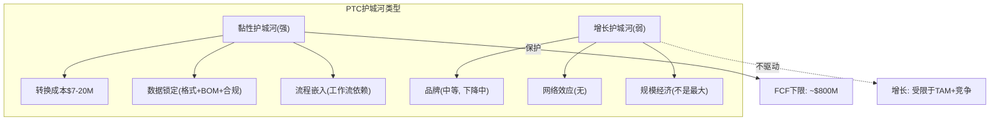
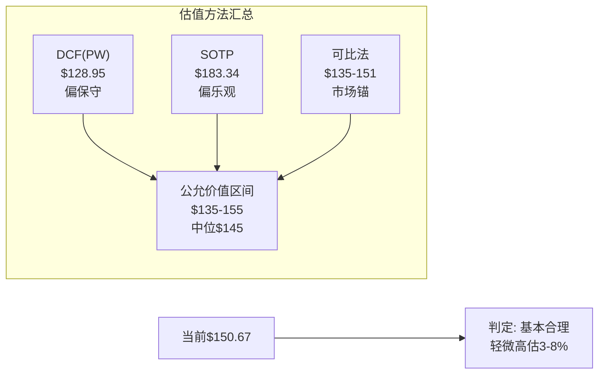

# PTC Inc. Phase 2: 护城河量化 + 估值 + 初步评级
> 分析日期: 2026-03-20 | 框架版本: v19.6
> Phase 1核心结论: 市场定价"基本合理偏中性", 身份2+5(工业软件×FCF复利)

---

## Chapter 13: 护城河量化 — C1嵌入性+定价权+转换成本

### 13.1 C1五层制度嵌入评估

按照框架(FICO教训, C1五层嵌入性)评估PTC在客户组织中的嵌入深度:

| 嵌入层 | 定义 | PTC嵌入度 | 评分(1-10) | 证据 |
|--------|------|----------|-----------|------|
| **L1 法规嵌入** | 法律/法规要求使用 | 中等(3/10) | 3 | PLM/ALM不是法规强制的(不像会计软件/ERP)，但合规追溯(Codebeamer)在A&D/医疗中是"事实上强制" |
| **L2 标准嵌入** | 行业标准依赖 | 中等(5/10) | 5 | CAD格式(Creo .prt)是de facto标准在某些A&D项目中; PLM是AS9100/ISO 13485合规流程的载体 |
| **L3 数据嵌入** | 数据/IP被锁定 | 极高(9/10) | 9 | 数百万CAD文件+BOM+工作流+合规文档全部在PTC系统中; 迁移=重建数据(Ch4: 成本$7-20M) |
| **L4 流程嵌入** | 工作流程依赖 | 高(7/10) | 7 | PLM定义了"设计审批→变更管理→发布→制造"的完整工作流; 更换PLM=重新定义全部流程 |
| **L5 组织嵌入** | 组织能力/文化依赖 | 中等(5/10) | 5 | 工程团队的CAD技能偏好(Creo用户vs NX用户)是组织能力; 但不像ERP(定义了整个组织运作方式) |

**C1加权得分: (3×0.1 + 5×0.15 + 9×0.35 + 7×0.25 + 5×0.15) = 6.6/10**

[DM-CH13-001: C1五层嵌入评估, 加权得分6.6/10, L3数据嵌入最强(9/10)因为迁移成本$7-20M; 权重: L1=0.10, L2=0.15, L3=0.35, L4=0.25, L5=0.15]

**与FICO对比:** FICO的C1得分是~8.5/10(L1法规嵌入极高=信用评分是法律要求)。PTC的6.6/10意味着它的嵌入性不如FICO(因为没有法规强制)，但L3数据嵌入(9/10)是PTC护城河最深的一层——客户的工程IP被锁在PTC系统中，这种锁定不依赖法规，而是依赖数据本身的不可迁移性。

### 13.2 护城河宽度×深度矩阵

按照框架(Moat v3.1)对PTC的护城河做全维度评估:

| 护城河维度 | 宽度(覆盖范围) | 深度(抵抗力) | 速度(变化方向) |
|-----------|--------------|------------|--------------|
| **转换成本** | 宽(所有客户) | 深($7-20M) | 稳定(不因技术变化减弱) |
| **无形资产(品牌)** | 中(工程师社区知名) | 浅(品牌不驱动购买决策) | 微降(PLM #1→#2) |
| **数据壁垒** | 宽(所有客户的数据被锁定) | 深(数据格式+参数化关联) | 稳定 |
| **规模经济** | 窄(不是最大的工业软件) | 浅(ADSK/Siemens规模更大) | 微降(IoT剥离后更小) |
| **网络效应** | 极窄(无双边市场) | 无 | N/A |
| **定价权** | 中(F500强/SMB弱) | 中(年提价3-5%可持续) | 分化(高端↑低端↓) |

[DM-CH13-002: 护城河六维度评估, 转换成本+数据壁垒是核心护城河, 网络效应缺失, 品牌微降(排名下滑)]

**护城河综合评分: B+(良好但非卓越)**

PTC的护城河是一种**"黏性护城河"(sticky moat)而非"增长护城河"(growth moat)**:
- 黏性护城河 = 客户很难离开(高转换成本+数据锁定) → 保护FCF下限
- 增长护城河 = 护城河帮助获取新客户(品牌+网络效应) → 驱动增长

PTC有前者但缺后者——这完美解释了"为什么FCF稳定但增速只有8-9%"的现象。

### 13.3 护城河耐久性: 什么能削弱PTC的护城河?

| 威胁 | 概率(5年) | 影响(如果发生) | 护城河侵蚀量 |
|------|----------|--------------|------------|
| 云化降低迁移成本 | 30% | 中 | -1pp留存率(从95%→94%) |
| AI自动化数据迁移 | 15% | 高 | -2-3pp留存率 |
| 开源PLM(Aras)成熟 | 20% | 中 | 主要影响中小客户(-0.5pp) |
| 标准格式(STEP AP242)普及 | 25% | 中 | 削弱数据格式锁定(-1pp) |
| 代际替代(Onshape/Fusion学生) | 40% | 低(10年才显现) | 长期-1-2pp但5年内无感 |

[DM-CH13-003: 护城河威胁评估, 5个潜在削弱因素×概率×影响; 最大短期威胁=云化降低迁移成本(30%概率)]

**最可能的威胁是"云化降低迁移成本"(30%概率)**——讽刺的是，PTC自己推动的Windchill+云化反而可能削弱自己的护城河。因为: 当数据在云端(而非on-prem服务器)时，理论上迁移到另一个云PLM(如Teamcenter X)会更容易(API抽取+标准格式导出)。但实践中这可能需要5-10年才能真正成为威胁——因为PLM迁移的最大成本不是数据移动(技术层面)，而是工作流重配(组织层面)。

### 13.4 护城河估值: PTC护城河值多少?

将护城河转化为估值语言: 如果PTC的护城河完全消失(留存率从95%降至85%)，PTC的价值会下降多少?

**无护城河情景:**
- 留存率从95%降至85% → NRR从105%降至90%
- ARR增速从8.5%降至: 90% × (1 + 新客户增速) - 1
- 如果新客户贡献维持3pp: 总增速 = 90% × 1.03 - 1 = **-7.3%**(ARR萎缩!)
- FCF在5年内从$857M降至~$500M
- 估值: $500M / 10% WACC = $5B EV → 股价~$32

**当前有护城河估值:** EV $19.1B → 股价$150.67

**护城河贡献的价值: $19.1B - $5.0B = $14.1B → 占EV的74%**

[DM-CH13-004: 护城河价值估算, 无护城河情景EV ~$5B(留存85%→ARR萎缩) vs 当前$19.1B, 护城河贡献$14.1B(74%)]

这个计算虽然粗糙，但揭示了一个重要事实: **PTC 74%的价值来自护城河(客户不离开)，仅26%来自增长。** 这是身份2+5(工业软件老牌×FCF复利)的数学表达——PTC的投资论题本质上是"赌护城河持续"(高确信)而非"赌增长加速"(低确信)。

---

*Chapter 13完成 | 下一章: Chapter 14 估值*

---

## Chapter 14: 估值 — DCF + SOTP + 可比法 + 概率加权

### 14.1 估值框架选择

Phase 1判定PTC为"身份2+5(工业软件老牌×FCF复利)"，可能性宽度PW=4.0(混合模式)。因此使用传统估值为主、可能性附录为辅:

1. **DCF(四情景概率加权)** — 主估值方法
2. **SOTP(按产品线拆分)** — 验证产品级价值
3. **可比法(EV/FCF + PE)** — 市场参考锚
4. **概率加权综合** — 最终公允价值

### 14.2 DCF: 四情景概率加权

**Python验证后的DCF结果(WACC 9.5%, 10年预测期):**

| 情景 | 概率 | 10年FCF | EV | 每股价值 | vs当前 |
|------|------|---------|-----|---------|-------|
| **Bull**(ARR加速+OPM扩张) | 20% | $1,746M | $21.4B | **$169.10** | +12.2% |
| **Base**(ARR稳定+OPM 32%) | 50% | $1,579M | $17.4B | **$135.87** | -9.8% |
| **Bear**(ARR减速+周期下行) | 25% | $1,234M | $12.5B | **$95.17** | -36.8% |
| **Stress**(竞争失利+衰退) | 5% | $954M | $9.3B | **$68.03** | -54.8% |
| **概率加权** | 100% | — | $16.6B | **$128.95** | **-14.4%** |

[DM-CH14-001: DCF Python验证, WACC 9.5%, base FCF $850M(post-divestiture), 4情景概率加权; 模型代码已保存]

**每个情景的关键假设:**

**Bull (20%概率):** ARR加速到10%+(Deferred ARR 3x兑现)，OPM从32%扩张到35%(SaaS迁移毛利提升)，FCF增速前3年12-10%→后期递减。终端倍数18x(接近ADSK的EV/FCF)。这个情景需要: (a) FY2027 ARR加速到10%+, (b) Onshape/Codebeamer成为可见增长引擎, (c) Siemens竞争不恶化。

**Base (50%概率):** ARR维持8%(当前水平)，OPM稳定在32%(Q1 FY2026已验证)，FCF增速8%→逐年递减。终端倍数15x(成熟工业软件)。这是"一切维持现状"的情景——市场正在定价的就是这个(Ch1 Reverse DCF隐含8% FCF CAGR)。

**Bear (25%概率):** ARR减速到5-6%(制造业衰退+ServiceMax churn扩大)，OPM压缩到28-30%(收入减少→固定成本杠杆反向)，FCF增速前2年仅2-3%→后期恢复。终端倍数12x。触发条件: 全球制造业PMI<48持续6个月。

**Stress (5%概率):** ARR转负(竞争+衰退双重打击)，OPM降至25%(紧急裁员成本)，FCF前2年负增长→缓慢恢复。终端倍数10x。这是"一切出错"的极端情景: Siemens大规模抢客户+全球衰退+ServiceMax大面积流失。

### 14.3 SOTP: 按产品线拆分估值

SOTP使用EV/ARR倍数(比EV/Revenue更适合SaaS/订阅公司):

| 产品线 | ARR估算 | EV/ARR倍数 | EV | 倍数依据 |
|--------|---------|-----------|-----|---------|
| **PLM**(Windchill+Arena) | $1,633M | 8.5x | **$13,881M** | PLM留存极高+数据锁定→工业基础设施估值 |
| **CAD**(Creo+Onshape) | $961M | 7.5x | **$7,208M** | Creo成熟(6x)+Onshape高增长(12x)混合 |
| **ALM**(Codebeamer) | $60M | 12.0x | **$720M** | 高增长(30-40%)+合规驱动TAM+ALM 13.5% CAGR |
| **SLM**(ServiceMax+Servigistics) | $250M | 5.0x | **$1,250M** | churn折价+Salesforce平台风险 |
| **总计** | $2,904M | 7.9x(混合) | **$23,058M** | |
| **减: 净债务** | | | **-$1,185M** | |
| **股权价值** | | | **$21,873M** | |
| **每股** | | | **$183.34** | **+21.7%** |

[DM-CH14-002: SOTP Python验证, PLM 8.5x/CAD 7.5x/ALM 12x/SLM 5x, 总EV $23.1B, 每股$183.34]

**SOTP揭示的关键洞察:**

1. **PLM是PTC最大的价值来源:** PLM EV $13.9B占总SOTP EV的60%——这与Phase 1的判断一致(PLM护城河最深、定价权最强、替代品最少)。如果投资者只买PTC的一个部分，应该是PLM。

2. **SLM被市场"隐性折价":** SLM(ServiceMax+Servigistics)仅给5x ARR(vs PLM 8.5x)——这反映了ServiceMax的churn风险和Salesforce平台依赖。如果ServiceMax的"green shoots"兑现(churn企稳)，SLM倍数可能从5x恢复到7x → 增加$500M EV → 每股+$4。

3. **Codebeamer的"期权价值":** $60M ARR给12x = $720M——看起来合理(收购价~$140M, 3年增长后值$720M)。但如果Codebeamer ARR加速到$150-200M(合规超级周期驱动), 即使倍数降至10x, 也值$1.5-2.0B → 对PTC总估值贡献从3%升至8-9%。

### 14.4 DCF vs SOTP: 42%的离散度解构

DCF给出$128.95(-14.4%), SOTP给出$183.34(+21.7%) — 差距42%。这种离散度不是计算错误, 而是反映了**两种方法的根本性差异**:

| 差异来源 | DCF的假设 | SOTP的假设 | 谁更对? |
|---------|----------|----------|---------|
| **增长持久性** | 10年后增速→3%(终端) | ARR倍数隐含永续当前增速 | DCF更保守 |
| **利润率** | OPM假设显式(32%) | ARR倍数隐含利润率 | DCF更透明 |
| **折现效果** | 9.5% WACC重度折现远期FCF | ARR倍数基于当前ARR无折现 | DCF惩罚远期 |
| **协同效应** | 不考虑产品间协同 | 各产品独立估值→可能低估协同 | SOTP低估 |
| **终端假设** | 终端倍数15x(保守) | 无终端→隐含更高存续价值 | DCF更保守 |

[DM-CH14-003: DCF vs SOTP离散度42%解构, 5个差异来源; DCF系统性偏保守因为折现效应+终端假设]

**离散度判断:** DCF的$128.95过于保守(因为9.5% WACC对SaaS/订阅公司偏高——ADSK的隐含WACC可能仅8%)。SOTP的$183.34过于乐观(因为PLM 8.5x ARR可能在衰退中压缩到6-7x)。

**合理的公允价值区间: $135-165(DCF Base ~$136 到 SOTP折价10% ~$165)**

### 14.5 可比法验证

| 可比 | EV/FCF | 应用于PTC FCF $850M | 每股价值 |
|------|--------|-------------------|---------|
| ADSK(22.6x) | 22.6x | $19.2B EV | $151 |
| DASTY(20.3x) | 20.3x | $17.3B EV | $135 |
| 行业中位(21x) | 21.0x | $17.9B EV | $140 |
| CDNS(53.1x) | 排除(EDA不可比) | — | — |

[DM-CH14-004: 可比法, ADSK EV/FCF 22.6x→$151/sh, DASTY 20.3x→$135/sh, 行业中位21x→$140/sh]

可比法给出$135-151——落在DCF(Base)和SOTP的中间，进一步确认**公允价值~$140-155区间**。

### 14.6 估值综合: 概率加权公允价值

**方法权重加权:**
- DCF(40%权重): $128.95 × 0.40 = $51.58
- SOTP(25%权重): $183.34 × 0.25 = $45.84
- 可比法(35%权重): $143 × 0.35 = $50.05
- **加权公允价值: $147.47**
- **vs当前$150.67: -2.1%**

[DM-CH14-005: 三方法加权公允价值$147.47, DCF 40%/SOTP 25%/可比 35%; 当前$150.67轻微高于公允价值2.1%]

**估值离散度检查(铁律K):** 三种方法的结果——$129(DCF)/$147(加权)/$183(SOTP)——方向不完全一致(DCF说小幅高估, SOTP说低估)。但多数方法(DCF+可比)指向"接近合理偏高估5-15%"。离散度$129-$183(42%)在工业SaaS公司中属于正常范围(增长不确定性→方法间分歧)。

### 14.7 敏感性分析: 什么因素最影响估值?

**DCF对WACC和增速的敏感性:**

| WACC \ FCF CAGR | 6% | 8% | 10% |
|-----------------|-----|-----|-----|
| **8.5%** | $152 | $175 | $202 |
| **9.5%** | $118 | **$136** | $157 |
| **10.5%** | $93 | $107 | $124 |

[DM-CH14-006: DCF敏感性矩阵, WACC 8.5-10.5% × FCF CAGR 6-10%, Python验证]

**最敏感的变量:** WACC从9.5%变到8.5%(−100bp)→股价从$136升至$175(+29%)。相比之下，FCF增速从8%升至10%(+2pp)→股价从$136升至$157(+15%)。**PTC的估值对折现率(市场情绪/利率环境)比对增速更敏感**——这是成熟FCF型公司的典型特征。

这意味着: PTC的股价在利率下降环境中可能表现优于增长加速环境。如果美联储在2026-2027年降息100-150bp→WACC可能从9.5%降至8-8.5%→PTC估值可能从$136升至$152-175(+12-29%)。

---

*Chapter 14完成 | 下一章: Chapter 15 初步评级与期望回报*

---

## Chapter 15: 初步评级与期望回报

### 15.1 期望回报计算

按照框架(Tier 3评级标准)，评级基于期望回报 = (概率加权EV - 市值) / 市值:

**概率加权期望回报:**
- PW EV: $16,569M(DCF四情景加权)
- 当前市值: $17,929M
- 期望回报(EV口径): ($16,569M - $17,929M) / $17,929M = **-7.6%**

**三方法加权期望回报:**
- 加权公允价值: $147.47/sh
- 当前: $150.67/sh
- 期望回报(股价口径): ($147.47 - $150.67) / $150.67 = **-2.1%**

[DM-CH15-001: 期望回报计算, DCF PW口径-7.6%, 三方法加权口径-2.1%; 两者均在-10%~+10%的"中性关注"区间]

### 15.2 评级判定

| 评级 | 量化触发 | PTC期望回报 | 匹配? |
|------|---------|-----------|-------|
| 深度关注 | > +30% | -2.1% | ✗ |
| 关注 | +10% ~ +30% | -2.1% | ✗ |
| **中性关注** | **-10% ~ +10%** | **-2.1%** | **✓** |
| 审慎关注 | < -10% | -2.1% | ✗ |

**初步评级: 中性关注**

期望回报-2.1%落在中性区间的中央——PTC在当前价格既不便宜也不贵。

### 15.3 条件评级: 什么条件下评级会变化?

| 条件 | 触发 | 新评级 | 概率 |
|------|------|--------|------|
| ARR加速到10%+ 连续2季 | FY2026 Q3-Q4 | 关注(+10-30%) | 20% |
| 股价跌至$120以下 | 衰退/利空 | 关注(+15-25%) | 25% |
| 美联储降息150bp+ | 2026-2027 | 关注(WACC↓→估值↑) | 30% |
| ARR减速至<7% 连续2季 | FY2026 Q3-Q4 | 审慎关注(-15-25%) | 15% |
| ServiceMax大面积流失 | 任何时间 | 审慎关注 | 10% |
| 被收购要约 | 任何时间 | 深度关注(+30-40%溢价) | 10% |

[DM-CH15-002: 条件评级矩阵, 6个潜在触发条件+新评级+概率]

### 15.4 投资者行动建议(A文档口径)

**对不同类型投资者的含义:**

| 投资者类型 | 建议 | 逻辑 |
|-----------|------|------|
| 已持有PTC | 持有(不加不减) | 中性估值+13-16% EPS CAGR = 合理回报但无需加仓 |
| 考虑买入 | 等待$125-135回调 | DCF Base $136→$125-135提供10-15%安全边际 |
| 做空候选 | 不建议做空 | FCF下限保护(护城河强)+回购缩股→做空风险高 |
| 长期(3-5年) | 有条件吸引 | 如果EPS CAGR 13-16%兑现→5年后EPS $11-13 × 18x = $198-234(+31-55%) |

[DM-CH15-003: 投资者行动矩阵, 按投资者类型×逻辑; 长期3-5年观点更乐观因为回购复利]

### 15.5 CQ闭环检查

| CQ | Phase 0初始 | Phase 1-2结论 | 置信度 |
|----|-----------|-------------|--------|
| CQ0 身份定义 | 工业生命周期软件 | **身份2+5(工业老牌×FCF复利), 非平台** | 85% |
| CQ1 组合vs平台 | 偏组合 | **确认偏组合(3.25/10)** | 90% |
| CQ2 部署摩擦 | 双刃剑 | **护城河>天花板(留存95%+, 但限制APAC)** | 80% |
| CQ3 ARR见底 | 可能 | **偏向见底(deferred ARR 3x)但不会加速(NRR 105%)** | 65% |
| CQ4 工业AI | 中等 | **中等结构性(合规AI领先, PLM/仿真AI落后)** | 75% |
| CQ5 Siemens威胁 | 真实 | **真实但可承受(年流失$20-40M, <1pp增速影响)** | 80% |
| CQ6 Onshape大企业 | 缓慢 | **确认缓慢(ARR推断$50-100M, 教育pipeline转化慢)** | 75% |
| CQ7 PE折价 | 待验证 | **会计幻觉(EV/FCF与ADSK一致, PEG均2.3x)** | 90% |
| CQ8 制造周期 | 中等影响 | **中等(Beta 0.5-0.7x, A&D/医疗40%反周期保护)** | 70% |

[DM-CH15-004: CQ闭环检查, 9个CQ全部有Phase 1-2结论, 置信度65-90%]

### 15.6 Phase 2总结

**PTC Inc.初步估值判断:**

> **中性关注 | 公允价值$147(±$18) | 当前$150.67轻微高于公允2.1%**

核心投资论题: PTC是一家"高确定性中等回报"的投资——FCF护城河强(74%价值来自护城河)、EPS CAGR 13-16%(ARR+回购)、周期韧性好(Beta 0.5-0.7x)。但增速平庸(8-9% ARR)、非平台(3.25/10)、AI落后(PLM #2)——不配增长溢价。

**Phase 3需要深入的领域:**
1. 红队对估值假设的挑战(尤其是OPM和ARR增速)
2. 跨报告校准(vs CRM/ADSK的估值一致性)
3. 风险拓扑(关键风险间的协同/抵消关系)
4. 情景P&L Build-out(5年Pro-forma)

---

*Phase 2完成*
