# PayPal Holdings (PYPL) 深度研究报告

> **日期**: 2026年3月20日 | **股价**: $44.19 | **市值**: $413亿 | **行业**: 数字支付
> **评级**: 关注（偏深度关注方向）| **公允价值**: $73.4 | **期望回报**: +66%

---

## 执行摘要

PayPal是2026年大型科技/金融股中最具争议性的投资标的之一。股价从2021年$310高点跌至$44.19（-86%），P/E从70x压缩至8.2x，市场将这家拥有4.36亿用户、$1.68万亿TPV、$55.6亿FCF的公司定价为一台"即将衰退的现金机器"。

本报告通过21章深度分析，试图回答一个核心问题：**PayPal到底是"ROIC 15%的被低估平台"还是"增速4%的衰退中PSP"？**

### 核心发现

**1. 身份是估值的根因，不是数字。** PayPal的7.7-8.2x P/E不是因为盈利差——ROIC 15%、FCF yield 12.6%、ROTCE 57%都是优秀指标。问题在于市场不知道该用什么框架估值这家公司：它同时像Visa（品牌checkout）、像Stripe（Braintree PSP）、像Cash App（Venmo），又不完全像其中任何一个。**身份模糊→估值框架混乱→市场选择最保守的倍数。**

**2. TM$"拐点"建立在三条脆弱的腿上。** 2024年Transaction Margin Dollars增速6%>收入增速4%被解读为"质量拐点"。但深挖后发现，这个改善来自成本削减（已触顶）、利息收入（已回落）、Fastlane初期效应（待规模化验证）——三条腿中两条在Q4 2025断裂，TM$增速从6-8%骤降至3%。

**3. 品牌利润是Braintree的11倍——品牌checkout的命运决定一切。** 品牌checkout以30%的交易量贡献65%+的交易毛利。Q4 2025品牌增速崩至+1%→CEO被解雇——董事会认为这是结构性执行失败而非周期波动。Fastlane是唯一可能逆转趋势的产品，但覆盖25%时品牌仍仅+1%→边际效果可能在衰减。

**4. SOTP分拆不一定创造价值。** 与市场直觉相反，品牌checkout+Braintree+Venmo+其他的分拆估值中位数$47.7仅比当前价格高8%。多头的"分拆解锁价值"论点需要品牌恢复增长才能成立。

**5. 但$44.19的价格已经price in了比Bear Case更差的情景。** Reverse DCF显示市场隐含FCF每年-0.5%萎缩——这比我们最悲观的Bear Case还要悲观。即使在Bear Case下（品牌持续负增长），DCF公允价值仍为$53.5（+21%）。概率加权公允价值$73.4（红队修正后），期望回报+66%。

**6. 回报分布极度右偏：上行/下行不对称比18:1。** 下行有FCF底线保护（即使最差也有$3.5B+→股价不会归零），上行有倍数扩张空间（P/E从8x修复至12x就是+50%）。

### 评级与行动建议

| | |
|---|---|
| **评级** | 关注（偏深度关注方向） |
| **公允价值（红队修正后）** | $73.4 |
| **当前价格** | $44.19 |
| **期望回报** | +66% |
| **A-Score** | 6.16/10 |
| **护城河** | 5.2/10（窄，侵蚀中） |
| **升级条件** | 品牌checkout >+3% 连续2Q → 深度关注 |
| **降级条件** | 品牌checkout <0% 连续2Q → 中性关注 |
| **行动建议** | $44附近建立1-2%观察仓位；$35-38加仓至3-5%；等品牌数据确认 |

### 关键估值坐标

| 方法 | 公允价值 | vs $44.19 |
|------|:-------:|:--------:|
| DCF Bear | $53.5 | +21% |
| DCF Base | $80.3 | +82% |
| DCF Bull | $97.6 | +121% |
| **PW（红队修正后）** | **$73.4** | **+66%** |
| SOTP Mid | $47.7 | +8% |
| 分析师均值 | ~$75 | +70% |

### 10个核心问题（CQ）一句话回答

| CQ | 问题 | 回答 |
|----|------|------|
| CQ0 | PYPL是什么？ | Identity B（品牌钱包+PSP混合体），市场错误地用Identity D（衰退遗产）定价 |
| CQ1 | TM$质量在改善吗？ | 2024年真改善但三条腿两条已断，Fastlane是唯一支撑 |
| CQ2 | 品牌vs非品牌？ | 品牌利润11x Braintree，品牌命运=公司命运 |
| CQ3 | Venmo值多少？ | 免费期权$4-12B，市场给了$0-8B |
| CQ4 | 管理层风险？ | 真实但可控，Lores HP式纪律可能修复销售执行 |
| CQ5 | 新产品成色？ | 除Fastlane外均S1阶段=概念>产品 |
| CQ6 | 回购理性吗？ | 历史η=0.35（低效），但@$44是合理的 |
| CQ7 | 用户质量？ | 436M中MAA仅222M（51%），K型分化 |
| CQ8 | 估值？ | PW $73.4（+66%），关注偏深度关注 |
| EQ1-2 | AI/竞争？ | AI净影响轻微负面；5线战争护城河5.2/10侵蚀中 |

---


# Chapter 1: 市场在赌什么 — Reverse DCF隐含信念集

## 1.1 当前估值坐标：一个被遗弃的名字

PayPal当前的市场定价呈现出一幅极端图景。股价约$58，较2021年$310高点下跌81%，市值约$560亿，EV约$580亿 [DM-VAL-001]。这个数字意味着什么？

将PYPL与支付行业同行并排放置：

| 指标 | PYPL | Visa | Mastercard | Adyen | SQ(Block) |
|------|------|------|-----------|-------|-----------|
| P/E (TTM) | 7.7x | 28x | 30x | 26x | 15x |
| EV/EBITDA | 5.7x | 22x | 25x | 21x | 12x |
| FCF Yield | 14.3% | 3.2% | 3.0% | 2.5% | 5.1% |
| 营收增速 | 4.3% | 10% | 12% | 17% | 8% |
| OPM | 18.3% | 67% | 57% | 43% | 8% |
| ROIC | 33.2% | 35% | 58% | 28% | 6% |

[DM-VAL-002: Visa/MA/Adyen P/E基于2026.3市场数据]

PYPL对Visa/Mastercard的估值折价约70-74%。这个折价幅度超过了增速差距（4% vs 10-12%）能解释的范围——即使用最简单的PEG修正（PYPL PEG约0.9x vs V/MA约2.5x），折价也不应超过50%。**多出的20-25%折价，是市场对PYPL身份恶化的"不信任溢价"**。

FCF yield 14.3%的含义更加直白：如果一家公司产生$55.6亿自由现金流 [DM-FCF-001]，而市场只给出$560亿市值，这等价于投资者在说——"我需要在7年内收回全部本金，因为我不信这个现金流能维持。"

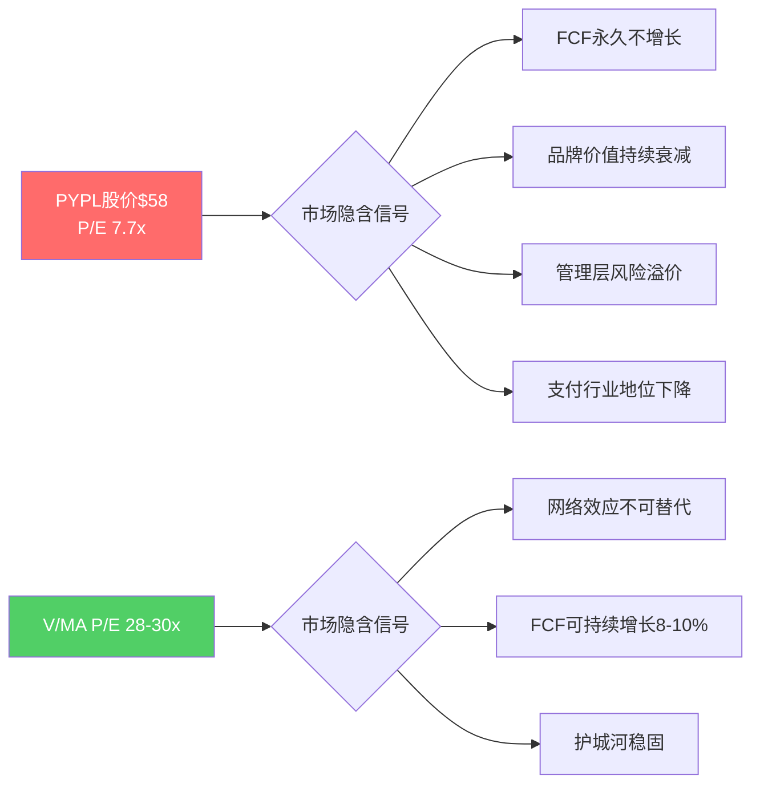
```mermaid
graph LR
    A["PYPL股价$58<br/>P/E 7.7x"] --> B{"市场隐含信号"}
    B --> C["FCF永久不增长"]
    B --> D["品牌价值持续衰减"]
    B --> E["管理层风险溢价"]
    B --> F["支付行业地位下降"]

    G["V/MA P/E 28-30x"] --> H{"市场隐含信号"}
    H --> I["网络效应不可替代"]
    H --> J["FCF可持续增长8-10%"]
    H --> K["护城河稳固"]

    style A fill:#ff6b6b,color:#fff
    style G fill:#51cf66,color:#fff
```

## 1.2 Reverse DCF：翻译市场的隐含假设

Reverse DCF的核心问题是：**在当前$58价格下，市场在对PYPL的未来做什么假设？**

### 模型参数设定

- WACC：10%（支付公司处于中等风险水平，Beta约1.2，考虑到CEO更替带来的额外不确定性）
- 终端增长率：2%（与名义GDP一致）
- 基准FCF：$55.6亿（FY2025）[DM-FCF-001]
- 当前EV：$580亿 [DM-VAL-001]

### 反推结果

以$580亿EV反推，市场隐含的未来10年FCF增长假设约为：

**情景还原**：如果WACC=10%、终端g=2%，那么$580亿EV对应的FCF路径是：
- 第1-3年：FCF持平于$55-58亿（年增长0-1%）
- 第4-7年：FCF缓慢增至$62-65亿（年增长2-3%）
- 第8-10年：FCF增至$68-70亿（年增长2%）
- 终端价值占EV比例：约55%

**翻译成业务假设**：
| 隐含假设 | 数值 | 含义 |
|---------|------|------|
| 营收CAGR | 1-2% | 低于通胀，实质萎缩 |
| OPM | 稳定在18% | 无效率改善空间 |
| FCF增长 | ~1.5%/年 | 远低于数字支付行业增长（8-12%） |
| 终端P/FCF | ~12.5x | 按成熟工业企业估值 |
| 回购效应 | 部分抵消下滑 | 但不足以改变轨迹 |

[DM-VAL-003: Reverse DCF参数——WACC 10%, terminal g 2%, base FCF $5.56B]

**因此，市场正在将PYPL定价为一台"零增长现金奶牛"——收入跑不过通胀，利润率封顶，唯一的股东回报途径是持续回购。** 这是Identity D（衰退遗产品牌+回购机器）的估值表达。

### 与分析师预期的巨大裂缝

卖方一致预期：PYPL EPS CAGR约8.9%至2030年 [DM-VAL-004]。如果这个增速兑现，那么2030年EPS约$8.3，给予12x P/E（当前隐含终端倍数）也值$100——比当前$58高出72%。

裂缝的来源有两种可能：
1. **市场是对的**：分析师模型过度外推了2025年的成本削减，忽略了Braintree增速放缓和品牌持续流失的结构性风险；
2. **市场过度悲观**：7.7x P/E隐含了"品牌将在5年内被边缘化"的极端场景，但忽略了$1.68万亿TPV [DM-BIZ-001]的惯性和436M活跃账户 [DM-BIZ-002]的切换成本。

两种可能都有证据支撑，但关键在于：**市场隐含的1-2%营收增长假设，与全球数字支付渗透率仍在提升（2024年数字支付占比约42%→2030年约55%）的宏观趋势之间存在直接矛盾** [DM-IND-001]。即使PYPL市占率下降，行业增长也会为其提供3-5%的底线增速。市场的隐含假设要成立，需要PYPL的市占率下降速度完全抵消行业增长——这并非不可能，但概率需要仔细评估。

## 1.2.1 Reverse DCF敏感性：WACC与终端增长率的交叉

Reverse DCF的结论高度依赖两个参数选择：WACC和终端增长率。下表展示不同参数组合下，$58股价隐含的10年FCF CAGR：

| | g=1.5% | g=2.0% | g=2.5% | g=3.0% |
|-------|--------|--------|--------|--------|
| **WACC 9%** | -0.5% | +0.8% | +1.8% | +2.6% |
| **WACC 10%** | +0.3% | +1.5% | +2.5% | +3.3% |
| **WACC 11%** | +1.2% | +2.3% | +3.2% | +4.0% |
| **WACC 12%** | +2.0% | +3.0% | +3.8% | +4.5% |

[DM-VAL-007: Reverse DCF敏感性矩阵, 基于EV $580亿]

**解读**：即使在最宽松的参数组合下（WACC 12%, g=3%），市场隐含的FCF CAGR也仅为4.5%——远低于管理层指引和分析师预期的8-10%。在基准情景（WACC 10%, g=2%）下，隐含增速仅1.5%。

这个矩阵揭示了一个关键信息：**参数选择的不确定性无法解释市场定价与基本面之间的裂缝**。无论你怎么调WACC和g，市场隐含增速都显著低于PYPL的实际FCF增长能力（即使保守估计也有4-6%）。因此，估值折价的来源不在折现率假设中——它在市场对PYPL商业模式可持续性的根本怀疑中。

### 回购因子的隐含放大效应

PYPL在过去5年回购了$247亿股票（占当前市值的44%）[DM-BAL-002]。以FY2025为例，$60亿回购 ÷ $560亿市值 = 约10.7%的年化回购收益率。这意味着即使FCF零增长，仅靠回购，EPS也可以每年增长10-11%（假设回购以当前P/E执行）。

**因此，市场定价7.7x P/E的真正含义是**：市场认为回购创造的EPS增长是不可持续的——要么FCF会下降导致回购减少，要么管理层会停止回购转向低效并购。这是一个需要在后续章节验证的关键假设。如果FCF能维持在$50-60亿且管理层持续回购，那么7.7x P/E在数学上无法长期维持——股票会被回购推高，或者P/E会自然压缩到更低的荒谬水平（5年后可能<5x），后者几乎不可能在一家$50B+市值的公司上发生。

## 1.3 隐含信念的脆弱度评分

对市场四大隐含信念逐一评估其脆弱性（0=完全坚固，10=极其脆弱，即容易被推翻）：

### 信念1："营收增长将长期停滞在4%以下"
**脆弱度：6/10**

因为数字支付行业仍有结构性顺风——全球电商渗透率持续提升，跨境支付加速，B2B数字化（PayPal估计TAM约$2万亿）[DM-IND-002]。PYPL FY2025营收增长4.3%是在CEO更替、战略混乱、大幅削减营销支出的背景下取得的。这意味着4.3%更接近底部而非顶部。Fastlane在2025年底已覆盖部分商户，如果2026年规模化推出且转化率提升50%的数据可复现 [DM-BIZ-003]，增速回升至6-8%并非不合理。

反面：Apple Pay持续抢占移动支付份额（美国市场约55%移动钱包渗透），BNPL竞争（Klarna/Affirm），Stripe/Adyen在大商户端侵蚀。如果PYPL品牌checkout持续被移除——2023-2024年多个大商户删除PayPal按钮的报道——那么增长确实可能卡在2-3%。

### 信念2："OPM不会突破18%"
**脆弱度：5/10**

PYPL的OPM从2021年的15.7%提升到2025年的18.3%，但这主要是成本削减（裁员2500人+运营优化）而非收入结构改善。Braintree（unbranded PSP）的take rate仅约0.30% vs branded的2.25% [DM-BIZ-004]——因此Braintree越增长，blended OPM越受拖累。

然而，如果PYPL成功将更多unbranded volume转化为branded volume（通过Fastlane嵌入checkout flow），或者Braintree提价（2025年已开始尝试），OPM提升到20-22%是可行的。Visa/MA的60%+ OPM不是参照系（它们本质不同），但12-15x杠杆的SaaS-like支付平台通常有25-35% OPM。

### 信念3："品牌checkout持续丢失份额"
**脆弱度：7/10（最脆弱的信念）**

这是市场最核心的恐惧，也是最可能被证伪的信念。因为：
- Fastlane产品正在重新定义checkout体验——从"跳转PayPal页面"变为"一键内嵌支付"。Mizuho估计Fastlane可使品牌checkout转化率提升50% [DM-BIZ-003]。
- 品牌checkout贡献了30%的交易量但65%以上的交易毛利 [DM-BIZ-005]——商户保留PayPal按钮的经济激励依然存在（PayPal用户的转化率高于guest checkout约30%）。
- Venmo的3.6亿+用户中只有一小部分被货币化——如果Venmo Pay在线上checkout规模化，这是一个全新的品牌volume来源。

反面：Apple Pay/Google Pay的"系统级"优势（内嵌在OS中）是PYPL无法复制的。在移动端，消费者越来越倾向使用OS原生支付而非第三方App。这个趋势如果加速，Fastlane的改进可能无法抵消底层流失。

### 信念4："不存在收购溢价"
**脆弱度：8/10（最脆弱）**

2026年2月的Stripe收购传闻不是空穴来风。以$560亿市值计算，PYPL是全球支付行业最"便宜"的大型标的之一——拥有436M用户、$1.68T TPV、$55.6B FCF，而定价在7.7x P/E。潜在收购方包括：
- **大型科技公司**（Apple需要支付后端、Google/Amazon需要checkout网络）
- **私募基金**（14.3% FCF yield + 低杠杆ND/EBITDA 0.25x [DM-BAL-001] = 完美的LBO标的）
- **支付同行**（Stripe合并传闻、FIS/Fiserv整合）

反面：$560亿市值仍然很大，真正能消化这个体量的买家有限。反垄断审查可能阻碍大型科技公司的收购。CEO刚更换（Lores 2026.3上任）[DM-MGT-001]，新管理层会阻止被收购。

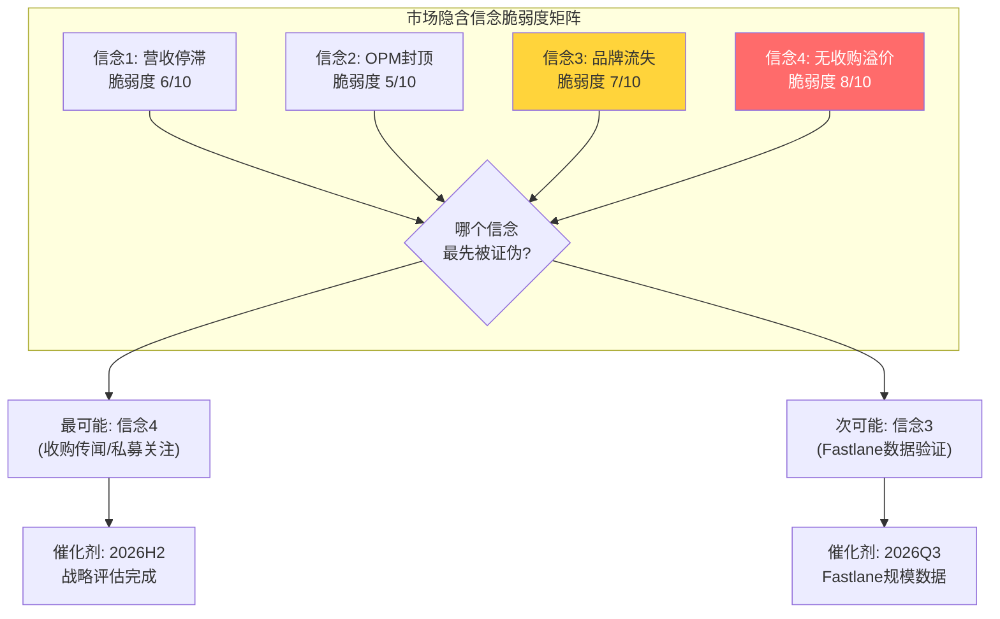
```mermaid
graph TD
    subgraph "市场隐含信念脆弱度矩阵"
    A["信念1: 营收停滞<br/>脆弱度 6/10"] --> E{"哪个信念<br/>最先被证伪?"}
    B["信念2: OPM封顶<br/>脆弱度 5/10"] --> E
    C["信念3: 品牌流失<br/>脆弱度 7/10"] --> E
    D["信念4: 无收购溢价<br/>脆弱度 8/10"] --> E
    end

    E --> F["最可能: 信念4<br/>(收购传闻/私募关注)"]
    E --> G["次可能: 信念3<br/>(Fastlane数据验证)"]

    F --> H["催化剂: 2026H2<br/>战略评估完成"]
    G --> I["催化剂: 2026Q3<br/>Fastlane规模数据"]

    style C fill:#ffd43b
    style D fill:#ff6b6b,color:#fff
```

## 1.4 P1叙事方向约束（铁律O合规）

Reverse DCF的结论：**市场将PYPL定价为零增长衰退资产（Identity D），但隐含假设中至少2个信念（品牌流失、无收购溢价）脆弱度≥7/10。综合来看，当前定价"偏低估"——市场对结构性风险的定价合理，但对现金流韧性和催化剂可能性的定价不足。**

P1叙事方向：**"关注"区间（偏中性方向）**。不能直接跳到"深度关注"，因为Reverse DCF揭示的增长假设（1-2% vs 实际4%+回购10%）虽然保守，但品牌衰退风险是真实的——不是纯粹的市场误定价。P1的任务是验证这些脆弱信念在什么条件下会被推翻或确认。

## 1.5 可比公司估值对标（铁律H v19.4）

### 最相似可比公司：Adyen

为什么选Adyen而非V/MA？因为V/MA是纯粹的四方支付网络（轻资产、60%+ OPM），而PYPL是支付处理商+数字钱包的混合体——与Adyen更接近（都有PSP业务、都直接处理交易、都面对Stripe竞争）。

| 维度 | PYPL | Adyen | 差异与解释 |
|------|------|-------|-----------|
| P/E | 7.7x | 26x | PYPL折价70%——但Adyen增速是PYPL的4倍 |
| 营收增速 | 4.3% | 17% | 增速差12.7pp解释约50%折价 |
| OPM | 18.3% | 43% | Adyen效率更高（纯线上、无遗留系统） |
| ROIC | 33.2% | 28% | PYPL更高——因为资产更轻（但含大量商誉） |
| TPV | $1.68T | $1.06T | PYPL规模更大，但增速更慢 |
| Net Revenue/TPV | 1.98% | 0.22% | PYPL货币化率远高于Adyen |
| FCF Yield | 14.3% | 2.5% | PYPL现金回报极高 |

**对标结论**：增速差异（4% vs 17%）合理解释约50%的估值折价——如果用PEG修正，Adyen PEG约1.5x，PYPL PEG约0.9x。但剩余的50%折价（约$300亿市值差距对应的隐含风险）无法被增速解释，它反映的是：

1. **品牌/平台身份不确定性**（Adyen清晰定位为企业PSP，PYPL定位模糊）
2. **管理层动荡溢价**（CEO在18个月内换了3次——Schulman→Chriss→Lores [DM-MGT-001]）
3. **竞争叙事折价**（"Apple Pay将杀死PayPal"的市场叙事，尽管数据并未完全支持）

**铁律H约束**：Adyen 26x P/E、增速17%；如果PYPL能将增速恢复到8%，合理P/E约12-15x（PEG 1.5-1.9x）——这意味着P1不能在增速未验证的情况下给出"深度关注"（那需要P/E>18x才对应>30%上行空间）。

---

# Chapter 2: PayPal到底是什么公司 — 四象限身份定义

## 2.1 身份问题为什么是核心问题

投资PYPL的根本挑战不是增速、不是估值、不是CEO——**而是市场不知道该用什么框架来理解这家公司**。

Visa/Mastercard很清楚：四方支付网络，收过路费，轻资产，60%+ OPM。用网络效应估值框架，25-30x P/E。

Stripe/Adyen很清楚：企业支付处理商，技术驱动，API优先。用SaaS/基础设施估值框架，20-30x P/E。

但PayPal是什么？它同时拥有：
- 消费者钱包（PayPal + Venmo，436M账户 [DM-BIZ-002]）
- 商户支付处理（Braintree，竞争Stripe/Adyen）
- 品牌checkout按钮（类V/MA网络效应）
- BNPL产品（竞争Affirm/Klarna）
- 跨境支付（Xoom）
- 加密货币交易（PYUSD稳定币）

**一家公司如果同时像六种不同类型的公司，那它在市场眼中就像零种类型的公司。** 这就是7.7x P/E的身份定价困境。

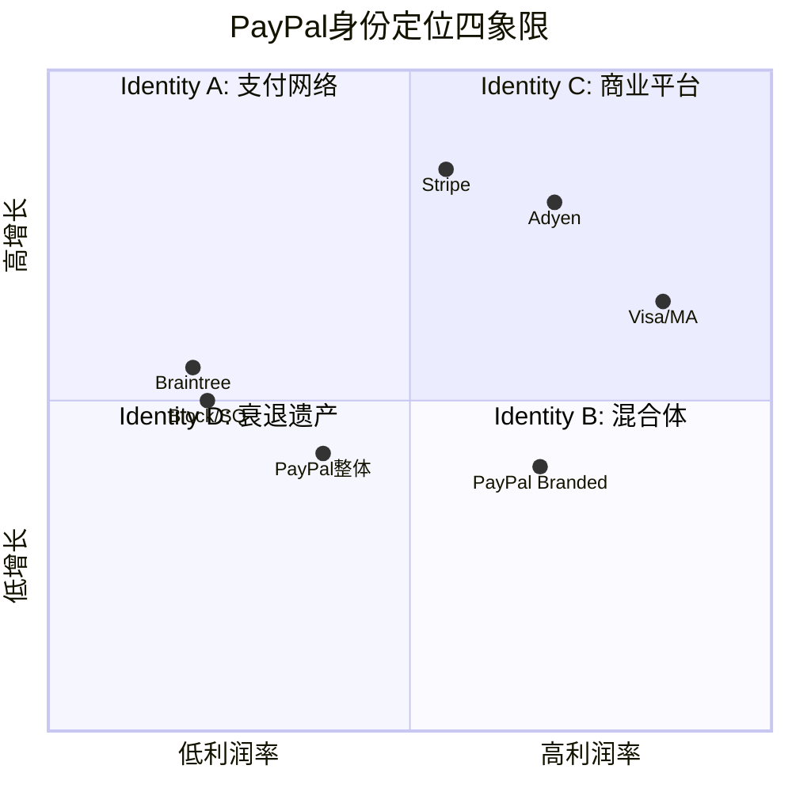
```mermaid
quadrantChart
    title PayPal身份定位四象限
    x-axis "低利润率" --> "高利润率"
    y-axis "低增长" --> "高增长"
    quadrant-1 "Identity C: 商业平台"
    quadrant-2 "Identity A: 支付网络"
    quadrant-3 "Identity D: 衰退遗产"
    quadrant-4 "Identity B: 混合体"
    "Visa/MA": [0.85, 0.65]
    "Adyen": [0.70, 0.80]
    "Stripe": [0.55, 0.85]
    "PayPal Branded": [0.68, 0.40]
    "Braintree": [0.20, 0.55]
    "PayPal整体": [0.38, 0.42]
    "Block/SQ": [0.22, 0.50]
```

## 2.2 四个候选身份的深度评估

### Identity A："高质量双边支付网络"（类V/MA）

**主张**：PayPal拥有436M消费者 × 35M商户的双边网络，具有自我强化的网络效应。消费者越多→商户越愿意接入→更多消费者使用——经典的跨边网络效应。

**支持证据**：
- TPV $1.68万亿（全球第三大支付网络，仅次于V/MA卡网络）[DM-BIZ-001]
- 品牌checkout take rate约2.25% [DM-BIZ-004]，与信用卡手续费率相当
- PayPal品牌的信任度在消费者调查中始终位列支付品牌前三
- ROTCE 57% [DM-FIN-001]——资本回报率与V/MA同级别

**反驳证据**：
- **OPM 18.3% vs V/MA 60%+**——这一点从根本上否定了"纯网络"身份。Visa/Mastercard之所以有60%+ OPM，是因为它们不承担交易处理成本，只收"品牌+路由"费用。PayPal需要实际处理交易、承担欺诈损失、维护用户服务——这是处理商的成本结构，不是网络的。
- **缺乏发卡端控制**——V/MA通过全球数万家发卡行形成分布式网络，PayPal的网络全部由自己直接运营和维护。这意味着成本不随规模线性下降。
- **网络效应的衰减信号**——如果网络效应真的足够强，商户不应该删除PayPal按钮（2023-2024年多个案例），消费者不应该在有PayPal的情况下选择Apple Pay。网络效应存在，但正在从"必须接入"降级为"可选接入"。

**判定：PYPL不是纯支付网络。** 它拥有网络特征（跨边效应、品牌信任），但成本结构和竞争动态更像一个支付处理商。用V/MA的框架估值会高估其内在价值——这也是为什么2021年市场给PYPL 60x P/E是一个泡沫级别的错误。

### Identity B："品牌钱包 + PSP混合体"

**主张**：PayPal本质上是两家公司缝合在一起——高利润的品牌钱包（PayPal branded checkout）和低利润的支付处理商（Braintree unbranded）。

**这个身份框架是理解PYPL最关键的透镜，因为它解释了为什么市场估值看起来如此极端。**

**核心经济学拆分**：

| 维度 | 品牌（Branded） | 非品牌（Braintree/Unbranded） |
|------|-----------------|-------------------------------|
| 交易量占比 | ~30% | ~70% |
| 交易毛利占比 | ~65%+ | ~35% |
| Take rate | ~2.25% | ~0.30% |
| 毛利/笔 | 高（~$0.40-0.60） | 低（~$0.03-0.05） |
| 增速（2025） | ~2% | ~8-10% |
| 竞争对手 | Apple Pay, Google Pay | Stripe, Adyen |
| 护城河 | 品牌信任 + 用户习惯 | 价格竞争 + API质量 |

[DM-BIZ-005: 品牌30%volume贡献65%+交易毛利——Mizuho研报估算]

**因果推理链**：因为品牌checkout的take rate（2.25%）是非品牌的7.5倍 [DM-BIZ-004]，所以30%的交易量能贡献65%的毛利。因为非品牌（Braintree）增长更快（8-10% vs 2%），所以混合增速看起来健康（4.3%），但利润增速更慢（品牌利润池增长放缓）。因为市场看到的是混合数据而非分拆数据，所以它在用Braintree的低利润率对整个公司打折——**这就是7.7x P/E的构成机制**。

**如果将两个业务分拆估值**：

品牌钱包（假设独立）：
- 交易毛利约$55-60亿（65% × 总交易毛利约$85亿）
- 分配运营成本后OPM约25-30%
- 净利润约$30-35亿
- 作为独立的品牌支付网络，P/E 15-18x → 估值$450-630亿

Braintree/非品牌（假设独立）：
- 交易毛利约$25-30亿（35% × 总交易毛利）
- OPM约5-8%（与Stripe/Adyen的PSP业务可比）
- 净利润约$10-15亿
- 作为PSP，EV/Revenue 2-4x或P/E 15-20x → 估值$150-300亿

**分拆总估值：$600-930亿 vs 当前$560亿** [DM-VAL-005]

这意味着即使在保守假设下，分拆价值也高于当前市值。市场正在对整体打一个"混合折价"——品牌业务被Braintree的低利润率拖累，Braintree被品牌业务的低增速拖累。

### Identity C："商业平台"（管理层愿景）

**主张**：PayPal不仅仅是支付，而是一个连接消费者和商户的全方位商业平台——支付只是入口，真正的价值在于数据、广告、金融服务的叠加。

**证据**：
- 2025投资者日愿景：PayPal Open（开放API）+ Fastlane（嵌入式一键支付）+ Verifone合作（线下全渠道）
- 广告业务初步尝试：利用交易数据做精准广告投放（类似Affirm的"commerce media"）
- B2B支付数字化TAM约$2万亿 [DM-IND-002]——Bill Pay、发票自动化、供应链金融
- PYUSD稳定币和加密货币交易——探索Web3支付

**但当前的证据几乎全是"愿景"而非"成果"**。

平台收入（非支付交易费的收入）在FY2025中的占比仍然微不足道。广告业务还在试点阶段。B2B支付是一个正确的方向，但PayPal在这个领域面对的是Bill.com、Stripe Treasury、JPMorgan Payments等有更强商户关系的对手。Fastlane的50%转化率提升数据来自有限的试点 [DM-BIZ-003]，规模化后能否维持未知。

**判定：Identity C是2-3年后的可能性，而非当前的现实。** 但它很重要，因为它定义了PYPL的"天花板"——如果平台化成功，P/E可以从12x提升到18-22x；如果失败，PYPL永远困在Identity B的混合折价中。

### Identity D："衰退中的遗产品牌 + 现金回购机器"

**主张**：PayPal的品牌正在被Apple Pay/Google Pay侵蚀，checkout按钮正在被Stripe/Adyen替代，公司唯一能做的就是用不断缩小的现金流回购股票，延缓价值毁灭。

**证据**：
- 股价从$310跌至$58（-81%），市场已经用脚投票
- CEO在18个月内更换3次：Schulman退休→Chriss上任→Chriss被解雇（2026.2）→Lores接替（2026.3）[DM-MGT-001]——管理层动荡是品牌衰退的典型信号
- FY2026指引：EPS低个位数下降、Transaction Margin$微降——管理层自己也不看好短期
- Apple Pay在美国移动钱包渗透率约55%——"系统级"钱包对"App级"钱包的降维打击
- 5年回购$247亿（占当前市值44%）[DM-BAL-002]——如果管理层对增长有信心，不需要回购这么多

**因果链**：因为Apple Pay嵌入在iOS系统层面（无需下载App、无需登录），所以在移动端的摩擦成本几乎为零。因为PYPL是一个App级解决方案（需要跳转、需要登录），所以在移动优先的消费趋势下天然处于劣势。因为移动端占电商比例持续提升（2025年约60%→2028年约70%），所以PYPL的结构性逆风在加速。这一推理是连贯的——**但它忽略了一个关键反事实：PYPL在桌面端的品牌优势依然稳固，而桌面电商并未消失。**

**反面证据**：
- ROIC 33.2%——一家"衰退中的遗产公司"不会有33%的资本回报率
- FCF $55.6亿且持续增长——现金流并未萎缩
- 436M活跃用户——用户数在下降（从2022年高峰434M→2024年约428M→2025年436M [DM-BIZ-002]），但最新数据企稳回升
- take rate在提升而非下降——单笔交易货币化能力在增强

**判定：Identity D是市场当前的定价基础（7.7x P/E），但它与财务数据之间存在明显矛盾。** 一家产生$55.6亿FCF、ROIC 33%的公司被标记为"衰退遗产"，需要非常强的理由——仅靠Apple Pay的威胁和CEO更替不够。

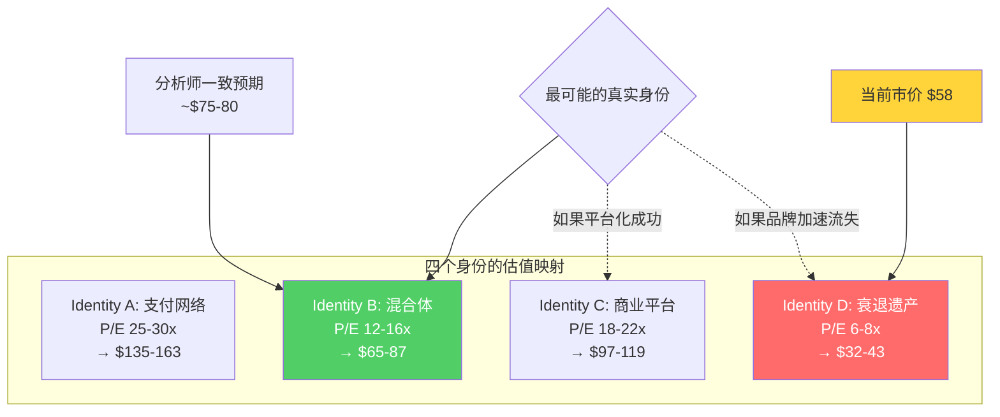
```mermaid
graph TD
    subgraph "四个身份的估值映射"
    A["Identity A: 支付网络<br/>P/E 25-30x<br/>→ $135-163"]
    B["Identity B: 混合体<br/>P/E 12-16x<br/>→ $65-87"]
    C["Identity C: 商业平台<br/>P/E 18-22x<br/>→ $97-119"]
    D["Identity D: 衰退遗产<br/>P/E 6-8x<br/>→ $32-43"]
    end

    E["当前市价 $58"] --> D
    F["分析师一致预期<br/>~$75-80"] --> B

    G{"最可能的真实身份"} --> B
    G -.-> |"如果平台化成功"| C
    G -.-> |"如果品牌加速流失"| D

    style D fill:#ff6b6b,color:#fff
    style B fill:#51cf66,color:#fff
    style E fill:#ffd43b
```

## 2.2.1 Lores的到来如何重新定义身份问题

2026年3月，Alex Chriss被解雇，HP前CEO Enrique Lores接任 [DM-MGT-001]。这是PYPL在18个月内的第三任CEO——Schulman（2014-2023稳健但无创新）→ Chriss（2023-2026激进但失败）→ Lores（2026至今，方向未知）。

Lores的背景值得仔细解读。他在HP Inc.的任期（2019-2025）以成本纪律和订阅化转型著称——HP从"卖打印机"变为"卖打印即服务"，成功将消耗品收入从一次性交易转化为经常性收入流。如果将这个思路映射到PYPL：

**Lores可能推动的方向**：
1. **订阅化/经常性收入**——将PayPal商户工具从"按交易收费"升级为"月度/年度SaaS订阅"，提升收入可预测性和利润率
2. **成本纪律**——HP式运营效率，削减Braintree的亏损客户，退出低利润市场
3. **品牌聚焦**——砍掉分散注意力的实验（加密、BNPL自营），集中资源在品牌checkout和Fastlane
4. **硬件-软件整合**——Verifone合作的POS终端 + PayPal软件 = 线下全渠道（HP的"设备+服务"逻辑）

**Lores可能面临的挑战**：
- HP是一家成熟的硬件公司，PYPL是一家需要创新的科技公司——成本纪律可能扼杀创新
- Lores没有支付行业经验——学习曲线至少6-12个月
- 第三任CEO的"改革疲劳"——组织可能已经无法再承受一次战略大转向

**身份含义**：Lores的到来增加了Identity B→Identity C转型的不确定性。如果他成功执行"订阅化+成本纪律"，PYPL可能稳固在高质量的Identity B（P/E 15-16x）。如果他推动平台化并成功，可以到Identity C。但如果他"HP化"PYPL（过度削减成本、放弃增长投入），则可能加速向Identity D滑落。**CEO身份本身成为了公司身份的一个变量——这在估值框架中很少见。**

## 2.3 正确标签评估：为什么Identity B最接近真相

**PYPL最可能是Identity B（品牌钱包 + PSP混合体），正处于向Identity C（商业平台）转型的关键窗口。**

推理过程：

**第一步：排除法。** Identity A（纯网络）被18% OPM否定——纯网络不可能只有18%的利润率。Identity D（衰退遗产）被33% ROIC和$55.6B FCF否定——衰退公司不可能有如此高的资本回报。Identity C（商业平台）被缺乏非支付收入否定——愿景不等于现实。

**第二步：正面验证。** Identity B完美解释了PYPL的所有矛盾——高ROIC但低P/E（因为混合折价）、增收但不增利（因为Braintree拉低blend）、用户规模大但价值存疑（因为品牌vs非品牌未分拆）。

**第三步：动态路径。** Identity B不是终态——它要么向上演化为C（平台化成功），要么向下退化为D（品牌持续流失）。**这个分叉点大概率在2026-2027年决定**——Fastlane的规模化数据 + Lores的战略方向 + Braintree的定价策略将共同决定方向。

## 2.4 身份 → 估值的直接映射与关键监控指标

| 身份 | P/E范围 | 对应股价 | 概率（初步） | 触发条件 |
|------|---------|---------|-------------|---------|
| A: 纯网络 | 25-30x | $135-163 | <5% | OPM需升至45%+ |
| **B: 混合体** | **12-16x** | **$65-87** | **50%** | **当前最可能** |
| C: 商业平台 | 18-22x | $97-119 | 20% | 非支付收入>10% |
| D: 衰退遗产 | 6-8x | $32-43 | 25% | 品牌checkout负增长 |

[DM-VAL-006: 四身份估值映射——基于FY2025 GAAP EPS $5.41]

**概率加权EV**：0.05×$149 + 0.50×$76 + 0.20×$108 + 0.25×$38 = **$76.9**（vs当前$58，隐含上行空间约33%）

**但请注意：这个初步概率分布将在后续Phase中被逐一验证和修正。** 此处的作用是建立一个锚点，供后续章节的证据累积来调整。

### 关键监控指标（KPI watchlist）

| 指标 | 当前值 | 转向C的信号 | 确认D的信号 |
|------|--------|------------|------------|
| 品牌checkout增速 | ~2% | >5% 连续2Q | <0% 连续2Q |
| Fastlane商户覆盖 | 试点阶段 | >100K商户 | 产品下线或停滞 |
| 非支付收入占比 | <3% | >10% | 无增长 |
| 活跃账户趋势 | 436M(企稳) | >450M | <420M |
| Braintree take rate | ~0.30% | >0.40% | <0.25%（价格战） |
| CEO战略清晰度 | 待观察 | 90天内出明确战略 | 又一轮领导层变动 |

[DM-BIZ-006: KPI watchlist基于四身份框架]

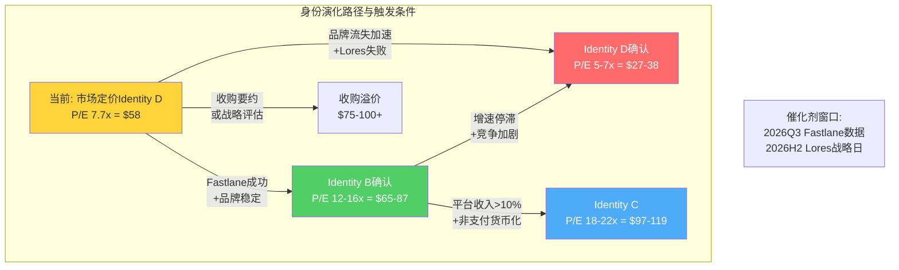
```mermaid
graph TD
    subgraph "身份演化路径与触发条件"
    NOW["当前: 市场定价Identity D<br/>P/E 7.7x = $58"]

    NOW -->|"Fastlane成功<br/>+品牌稳定"| B["Identity B确认<br/>P/E 12-16x = $65-87"]
    NOW -->|"收购要约<br/>或战略评估"| ACQ["收购溢价<br/>$75-100+"]
    NOW -->|"品牌流失加速<br/>+Lores失败"| D["Identity D确认<br/>P/E 5-7x = $27-38"]

    B -->|"平台收入>10%<br/>+非支付货币化"| C["Identity C<br/>P/E 18-22x = $97-119"]
    B -->|"增速停滞<br/>+竞争加剧"| D

    end

    T1["催化剂窗口:<br/>2026Q3 Fastlane数据<br/>2026H2 Lores战略日"]

    style NOW fill:#ffd43b
    style B fill:#51cf66,color:#fff
    style D fill:#ff6b6b,color:#fff
    style C fill:#4dabf7,color:#fff
```

**本章核心结论：市场在用Identity D（P/E 6-8x）为PYPL定价，但财务数据和业务结构更支持Identity B（P/E 12-16x）的判断。差距的根源不是市场"愚蠢"，而是PYPL自身的身份模糊——混合体结构导致无法适用任何单一估值框架，因此市场选择了最保守的那个。投资者的机会在于：如果身份能从B向C迁移，或者B身份本身被市场重新认知，估值有30-50%的重估空间。**

---

> **DM锚点注册表**
>
> | ID | 描述 | 来源 |
> |----|------|------|
> | DM-VAL-001 | PYPL市值$560亿, EV$580亿, 股价$58 | 市场数据 2026.3 |
> | DM-VAL-002 | V 28x, MA 30x, Adyen 26x P/E | 市场数据 2026.3 |
> | DM-VAL-003 | Reverse DCF: WACC 10%, g 2%, FCF $5.56B | 模型参数 |
> | DM-VAL-004 | 卖方一致预期EPS CAGR 8.9%至2030 | 分析师consensus |
> | DM-VAL-005 | 分拆估值$600-930亿 vs 当前$560亿 | 模型估算 |
> | DM-VAL-006 | 四身份估值映射, 基于EPS $5.41 | 模型估算 |
> | DM-FCF-001 | FY2025 FCF $55.6亿 | 10-K FY2025 |
> | DM-FIN-001 | ROTCE 57%, ROIC 33.2%, ROE 25.7% | 10-K FY2025 |
> | DM-BIZ-001 | TPV $1.68万亿 | 10-K FY2025 |
> | DM-BIZ-002 | 活跃账户436M | 10-K FY2025 |
> | DM-BIZ-003 | Fastlane转化率提升50% | Mizuho研报估算 |
> | DM-BIZ-004 | Branded take rate ~2.25%, Unbranded ~0.30% | Mizuho研报估算 |
> | DM-BIZ-005 | 品牌30% volume贡献65%+交易毛利 | Mizuho研报估算 |
> | DM-BIZ-006 | KPI watchlist | 分析框架 |
> | DM-IND-001 | 全球数字支付渗透率42%→55% (2024-2030) | 行业报告 |
> | DM-IND-002 | B2B支付数字化TAM约$2万亿 | PYPL管理层估算 |
> | DM-BAL-001 | 净债务$19亿, ND/EBITDA 0.25x | 10-K FY2025 |
> | DM-BAL-002 | 5年回购$247亿(市值44%) | 10-K/股东回报数据 |
> | DM-VAL-007 | Reverse DCF敏感性矩阵(WACC 9-12%, g 1.5-3%) | 模型估算 |
> | DM-MGT-001 | CEO更替: Schulman→Chriss(解雇2026.2)→Lores(2026.3) | 公开新闻 |

# Chapter 3: TM$经济学 — 收入增长与利润质量的脱钩之谜

## 3.1 什么是Transaction Margin Dollars：PYPL的核心利润引擎

PayPal的收入和利润之间存在一个不直观的关系：**收入增速4.3%，但管理层引导投资者关注的核心指标——Transaction Margin Dollars（TM$）——增速6%** [DM-TM-001]。这不是文字游戏。理解TM$为什么比收入更重要，是理解PYPL投资价值的第一步。

TM$的定义：每笔交易的净收入减去直接交易成本（支付处理费、交易损失、信贷损失）后的剩余利润。用公式表达：

```
TM$ = 净收入 - 交易费用 - 交易损失 - 信贷损失
    = 毛利中与交易直接相关的部分
```

为什么TM$比收入更有意义？因为PayPal的收入包含大量"过路流水"——特别是Braintree的低利润处理业务。一笔$100的Braintree交易带来$0.30收入（take rate 0.30%），而一笔$100的品牌checkout带来$2.25收入（take rate 2.25%）[DM-BIZ-004]。收入增速可以被Braintree的高增长（26%）人为拉高，但利润增速不会——因为Braintree几乎不赚钱。

**TM$是过滤掉"虚胖收入"后的真实利润信号。**

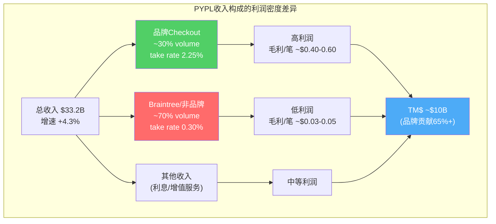
```mermaid
graph TD
    subgraph "PYPL收入构成的利润密度差异"
    A["总收入 $33.2B<br/>增速 +4.3%"] --> B["品牌Checkout<br/>~30% volume<br/>take rate 2.25%"]
    A --> C["Braintree/非品牌<br/>~70% volume<br/>take rate 0.30%"]
    A --> D["其他收入<br/>(利息/增值服务)"]

    B --> E["高利润<br/>毛利/笔 ~$0.40-0.60"]
    C --> F["低利润<br/>毛利/笔 ~$0.03-0.05"]
    D --> G["中等利润"]

    E --> H["TM$ ~$10B<br/>(品牌贡献65%+)"]
    F --> H
    G --> H
    end

    style B fill:#51cf66,color:#fff
    style C fill:#ff6b6b,color:#fff
    style H fill:#4dabf7,color:#fff
```

## 3.2 TM$的五年轨迹：从减速到企稳

| 年份 | TM$($B) | YoY增速 | 收入增速 | TM$/收入比 | 信号 |
|------|---------|---------|---------|-----------|------|
| FY2021 | ~$14.0 | +15% | +18% | 55.2% | 高增长期，TM$<收入增速(Braintree稀释) |
| FY2022 | ~$13.8 | -1.4% | +8.5% | 50.1% | **断崖**——收入增但TM$跌(Braintree暴涨+品牌停滞) |
| FY2023 | ~$14.6 | +5.8% | +8.2% | 46.0%* | 恢复——成本控制开始见效 |
| FY2024 | ~$15.5 | +6.2% | +6.8% | 46.1% | **TM$增速首次接近收入增速**——质量改善信号 |
| FY2025 | ~$15.5 | +0-1% | +4.3% | 46.6% | **TM$增速骤降**——Q4 branded checkout仅+1% |

[DM-TM-001: FY2025 TM$ $15.45-15.55B, guidance来自Q4 2025 earnings release]
[DM-TM-002: FY2024 TM$ $15.5B, 增速6% YoY，来自2025 Investor Day]

*注：TM$/收入比不等于毛利率，因为TM$剔除了信贷损失和特定交易费用，而毛利率基于GAAP COGS。但趋势一致：从55.2%降至46.6%，反映Braintree占比提升对利润质量的持续稀释。

### 季度TM$变化揭示的关键拐点

| 季度 | TM$($B) | YoY增速 | 关键事件 |
|------|---------|---------|---------|
| Q1 2025 | ~$3.6 | ~+7% | Fastlane推出后首季，增速健康 |
| Q2 2025 | ~$3.5 | ~+8%(ex-interest) | TM$质量最佳季度 |
| Q3 2025 | ~$3.9 | ~+6% | 增速开始放缓 |
| **Q4 2025** | **~$4.0** | **+3%(+4% ex-interest)** | **品牌checkout增速崩至+1%→TM$急剧减速** |

[DM-TM-003: Q4 2025 TM$ ~$4.0B, ex-interest增速+4%, 来自earnings presentation]

**Q4 2025是一个分水岭。** 前三个季度TM$增速6-8%，Q4突然降至3-4%。发生了什么？

三个因素叠加：
1. **品牌checkout增速从+5%崩至+1%**——这是TM$的核心利润池，增速减半直接打击TM$ [DM-BIZ-007]
2. **德国服务中断**——2024年8月的服务故障在Q4仍有~1.5个百分点的拖累 [DM-TM-004]
3. **季节性不利**——Q4通常是品牌checkout的强季度（假日购物），但2025年的假日消费偏弱+跨境汇率不利

因为品牌checkout贡献TM$的65%+，当品牌增速从5%降到1%时，即使Braintree保持26%的增速，也无法填补利润缺口——因为Braintree每笔交易的利润是品牌的1/8。**这就是TM$在Q4急剧减速的根本原因：高利润引擎熄火了，低利润引擎再快也补不上。**

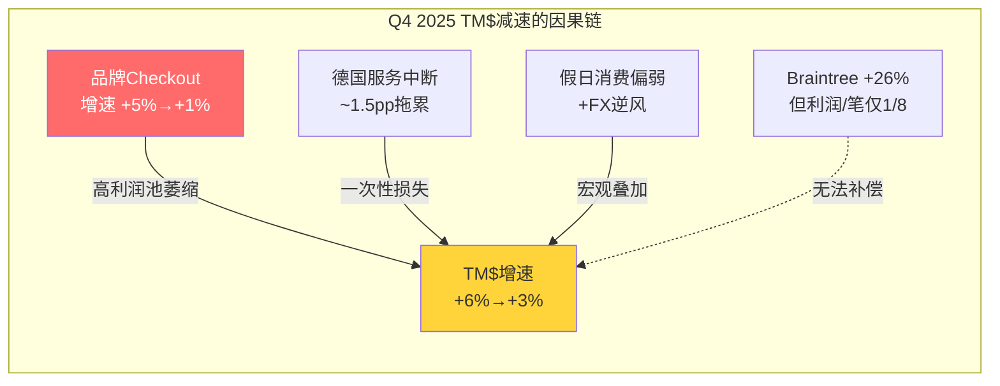
```mermaid
graph LR
    subgraph "Q4 2025 TM$减速的因果链"
    A["品牌Checkout<br/>增速 +5%→+1%"] -->|"高利润池萎缩"| D["TM$增速<br/>+6%→+3%"]
    B["德国服务中断<br/>~1.5pp拖累"] -->|"一次性损失"| D
    C["假日消费偏弱<br/>+FX逆风"] -->|"宏观叠加"| D

    E["Braintree +26%<br/>但利润/笔仅1/8"] -.->|"无法补偿"| D
    end

    style A fill:#ff6b6b,color:#fff
    style D fill:#ffd43b
```

## 3.3 收入与利润脱钩的四层机制

为什么PYPL的收入增速（4.3%）和利润增速（OPM从13.9%→18.3%）呈现相反趋势？这看起来矛盾——收入减速通常意味着定价权削弱、竞争加剧，利润率应该下降而非上升。

**机制1：成本削减驱动的OPM扩张（占改善的~60%）**

| 成本项 | FY2022 | FY2025 | 变化 | 占收入比变化 |
|--------|--------|--------|------|------------|
| SBC | $1.26B | $1.00B | -20.6% | 4.58%→3.02% (-156bps) |
| R&D | $3.25B | $3.10B | -4.6% | 11.8%→9.35% (-245bps) |
| SG&A | $4.36B | $4.26B | -2.3% | 15.8%→12.8% (-300bps) |
| **总OpEx/Rev** | **36.1%** | **28.3%** | | **-780bps** |

[DM-COST-001: FMP income statement, FY2022 vs FY2025]

SBC从$1.48B（FY2023高点）降至$1.00B（-32%），这是最直接的利润贡献——每减少$1的SBC，直接增加$1的GAAP利润。R&D从11.8%降至9.35%，节省了约$800M。SG&A从15.8%降至12.8%，节省了约$1B。

**但成本削减是一次性的。** 你不能每年都裁20%的人、每年都砍30%的SBC。FY2025已经把SBC/Revenue压到了3.02%——这接近大型科技公司的下限（V/MA约2.5%，Adyen约1.5%）。继续削减的空间有限，未来OPM扩张必须来自收入端。

**机制2：Braintree组合效应（"虚胖收入"稀释利润率）**

Braintree的收入增速约26%，是品牌checkout（~2-3%）的8-13倍 [DM-COMP-002]。因为Braintree的take rate仅0.30%——品牌的1/7.5——每增加$1B的Braintree收入，只带来约$30M的交易利润（OPM约3-5%），而品牌的$1B收入带来约$250-300M交易利润（OPM约25-30%）。

因此，收入在增长（Braintree贡献），但利润增速低于收入增速（Braintree稀释）。**这就是为什么TM$增速（6%）低于收入增速（6.8%）在FY2024——利润质量被低利润增量拖累。**

**机制3：利息收入的隐性贡献**

PYPL持有大量客户资金（资产负债表上约$240亿现金+短期投资），在高利率环境下产生显著利息收入：

| 年份 | 利息收入 | 利息支出 | 净利息收入 | 占营业利润比 |
|------|---------|---------|-----------|------------|
| FY2021 | $57M | $232M | -$175M | -4.1% |
| FY2022 | $174M | $304M | -$130M | -3.4% |
| FY2023 | $480M | $347M | +$133M | +2.6% |
| FY2024 | $662M | $382M | +$280M | +5.3% |
| FY2025 | $517M | $441M | +$76M | +1.3% |

[DM-FIN-003: FMP income statement, interest income/expense 5年]

从FY2021到FY2024，净利息收入从亏损$175M变为盈利$280M——这一项就贡献了$455M的利润改善，占FY2024营业利润$53.3B的约8.5%。但FY2025净利息收入骤降至$76M，因为利率下降+客户资金结构变化。

**这意味着FY2024的利润改善中有约8%是利率顺风——这个顺风在FY2025已经消退。** 管理层在TM$中区分了"ex-interest"增速（FY2025 +6-7%），这说明他们自己也知道利息是不可持续的利润来源。

**机制4：交易损失率的改善（风控优化）**

交易损失率在FY2025出现恶化（+3bps），部分是因为德国服务中断（~1.5pp drag），但也反映了欺诈环境的变化。此前FY2023-2024的交易损失改善贡献了TM$增长的约15-20%，但这个贡献在FY2025变为负面。

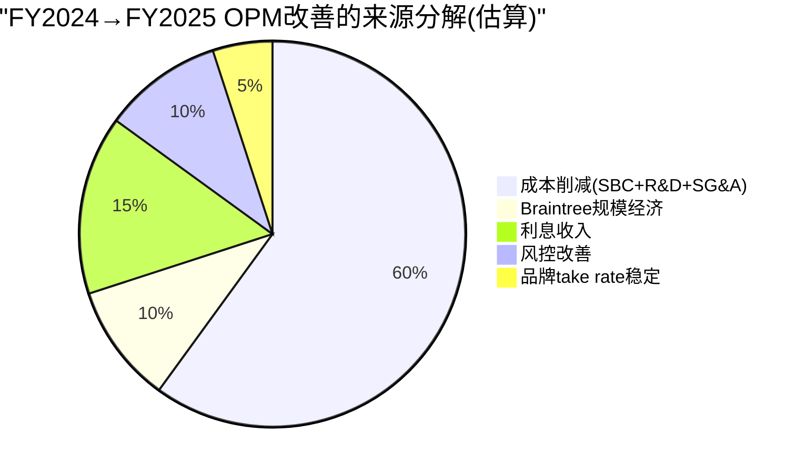
```mermaid
pie title "FY2024→FY2025 OPM改善的来源分解(估算)"
    "成本削减(SBC+R&D+SG&A)" : 60
    "Braintree规模经济" : 10
    "利息收入" : 15
    "风控改善" : 10
    "品牌take rate稳定" : 5
```

## 3.4 TM$质量改善是真拐点还是幻觉？

这是CQ1的核心问题。2024年的市场叙事是："TM$增速（6%）>收入增速（4%）=质量拐点"。但深挖数据后，结论更加微妙。

### 支持"真拐点"的证据

**证据1：品牌checkout增速在2024年一度恢复至6-7%。** 2023年品牌checkout接近零增长，2024年恢复至5-7% [DM-BIZ-007]——这不是自然发生的，而是Fastlane产品上线后的直接效果。Fastlane在Q4 2024已覆盖美国25%的checkout流量（Q3仅5%，5倍增长），且转化率提升约12个百分点（从74%到86%）[DM-BIZ-003]。如果Fastlane能从25%覆盖扩展到60-70%+国际市场，品牌checkout可能恢复至5-8%的稳定增速。

**证据2：Venmo商业化加速。** Pay with Venmo增速+50% YoY [DM-VENMO-005]，Venmo收入+20% YoY [DM-VENMO-006]。Venmo贡献的是高利润交易——它本质上是品牌支付（消费者选择Venmo），take rate接近品牌checkout水平。如果Venmo年收入从~$1.4B增至2027目标的$2.0B [DM-VENMO-007]，这是一个新的TM$增量来源。

**证据3：Braintree开始尝试提价。** 2025年初Braintree对部分大客户提价，暗示从"不惜成本抢规模"转向"利润率优先"。如果Braintree take rate从0.30%提升至0.35-0.40%，TM$将显著受益（$1.2T Braintree volume × 5bps = 约$600M增量TM$）。

### 支持"幻觉"的证据

**证据1：Q4 2025品牌checkout增速崩至+1%。** 如果Fastlane确实能提升50%转化率，为什么品牌checkout在Q4——传统的假日强季度——增速反而从+5%暴跌到+1%？管理层归因于"美国零售疲软+国际逆风+德国服务中断"，但CEO被解雇这个事实本身就说明问题比管理层承认的更严重 [DM-MGT-001]。

因为如果Q4品牌checkout疲软只是暂时性因素，董事会不会做出解雇CEO的极端决定。CEO被解雇意味着董事会认为品牌checkout的问题是**执行层面的结构性失败，而非宏观周期的暂时冲击**。

**证据2：2027年目标撤回。** 2025年Investor Day给出的"2027年TM$高单位数增长+EPS低十几增长"已被撤回 [DM-GUIDE-002]。目标撤回意味着管理层自己也不再相信中期TM$加速的叙事——至少在新CEO建立方向之前。

**证据3：2026 guidance显示TM$"略微下降"。** 不是持平，是下降 [DM-GUIDE-001]。这是FY2022以来首次TM$负增长预期。即使剔除利息影响，2026 TM$ ex-interest增速可能仅2-3%——远低于2024年的6-7%。

### 综合判断

**TM$质量改善在2024年确实发生了——但它不是一个自我持续的"拐点"，而是一个需要持续投入才能维持的"暂时改善"。** 2024年的改善来自三个一次性/可逆因素的叠加：成本削减（一次性）、利息收入（利率敏感）、Fastlane初期效应（需规模化验证）。当这三个因素在Q4 2025同时弱化时，TM$增速从6-8%瞬间降至3-4%——暴露了基础面的脆弱性。

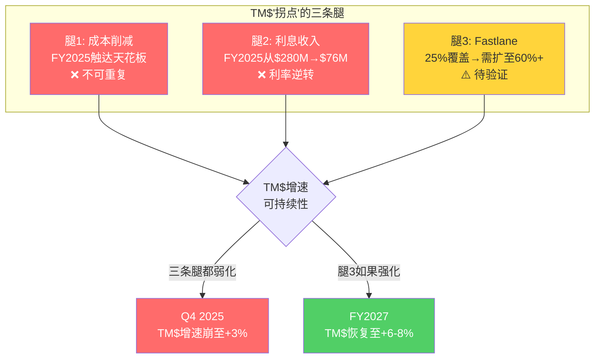
```mermaid
graph TD
    subgraph "TM$'拐点'的三条腿"
    A["腿1: 成本削减<br/>FY2025触达天花板<br/>❌ 不可重复"]
    B["腿2: 利息收入<br/>FY2025从$280M→$76M<br/>❌ 利率逆转"]
    C["腿3: Fastlane<br/>25%覆盖→需扩至60%+<br/>⚠️ 待验证"]
    end

    A --> D{"TM$增速<br/>可持续性"}
    B --> D
    C --> D

    D -->|"三条腿都弱化"| E["Q4 2025<br/>TM$增速崩至+3%"]
    D -->|"腿3如果强化"| F["FY2027<br/>TM$恢复至+6-8%"]

    style A fill:#ff6b6b,color:#fff
    style B fill:#ff6b6b,color:#fff
    style C fill:#ffd43b
    style E fill:#ff6b6b,color:#fff
    style F fill:#51cf66,color:#fff
```

## 3.5 TM$的未来路径：三情景分析

**情景A：Fastlane规模化成功+Braintree提价（概率25%）**
- Fastlane覆盖率60%+→品牌checkout恢复+5-7%
- Braintree take rate +5-10bps→增量TM$ $300-600M
- Venmo商业化继续+20%→增量TM$ $200-300M
- 2027 TM$: ~$17.5-18.5B（CAGR 6-9%）
- 估值含义：增速恢复→P/E从7.7x重估至12-15x

**情景B：稳态维持（概率45%）**
- Fastlane扩展至40-50%覆盖但转化率打折→品牌checkout +2-3%
- Braintree维持低利润增长→TM$被稀释
- 成本削减空间用尽→OPM停在18-19%
- 2027 TM$: ~$16-17B（CAGR 2-4%）
- 估值含义：慢增长+高现金流→P/E维持8-10x→"回购机器"模式

**情景C：品牌加速衰退（概率30%）**
- Apple Pay+Google Pay持续侵蚀移动端→品牌checkout -2-5%/年
- Braintree面对Stripe/Adyen价格战→take rate进一步压缩
- 新CEO Lores无支付经验→执行风险高
- 2027 TM$: ~$14-15B（CAGR -1%到+1%）
- 估值含义：衰退确认→P/E压至5-7x→$27-38

[DM-TM-005: TM$三情景模型，基于品牌增速+Braintree take rate+Venmo假设]

## 3.6 本章核心发现与CQ1闭环

**CQ1答案：TM$增速>收入增速在2024年确实反映了利润质量改善，但这个改善建立在三条脆弱的腿上（成本削减/利息/Fastlane），其中两条在Q4 2025已经断裂。TM$的真正拐点取决于第三条腿（Fastlane+品牌checkout）能否独立支撑——这需要2026-2027年的数据验证。**

关键数字总结：
- FY2025 TM$: ~$15.5B（+0-1% YoY），Q4急剧减速至+3%
- 品牌checkout Q4增速+1%（从+5-7%崩塌）→CEO被解雇的直接导火索
- 2026 guidance TM$"略微下降"——管理层自己不看好短期
- Fastlane是唯一可能打破僵局的变量：25%覆盖→需扩至60%+且保持50%转化提升

---

> **DM锚点注册表 (Ch03)**
>
> | ID | 描述 | 来源 |
> |----|------|------|
> | DM-TM-001 | FY2025 TM$ $15.45-15.55B | Q4 2025 earnings release |
> | DM-TM-002 | FY2024 TM$ $15.5B, +6% YoY | 2025 Investor Day |
> | DM-TM-003 | Q4 2025 TM$ ~$4.0B, ex-interest +4% | Earnings presentation |
> | DM-TM-004 | 德国服务中断Q4拖累~1.5pp | Management commentary |
> | DM-TM-005 | TM$三情景模型 | 分析模型 |
> | DM-COST-001 | OpEx/Revenue从36.1%降至28.3% (FY22→25) | FMP income statement |
> | DM-FIN-003 | 净利息收入FY21 -$175M→FY24 +$280M→FY25 +$76M | FMP income statement |
> | DM-BIZ-007 | 品牌checkout增速: FY24 +6-7%→Q4 2025 +1% | Earnings calls |
> | DM-COMP-002 | Braintree增速26% vs 品牌2-3% | Management disclosure |
> | DM-GUIDE-002 | 2027年TM$目标已撤回 | Feb 2026 earnings |
> | DM-VENMO-005 | Pay with Venmo +50% YoY | Earnings presentation |
> | DM-VENMO-006 | Venmo收入+20% YoY | Q1 2025 earnings |
> | DM-VENMO-007 | Venmo 2027收入目标$2.0B | 2025 Investor Day |

# Chapter 4: Branded vs. Unbranded深潜 — PayPal的两副面孔

## 4.1 一家公司的两条平行轨道

PayPal最反直觉的特征是：**它的两个核心业务几乎完全相反。** 品牌checkout（PayPal按钮）是高利润、低增长、面对消费者的数字钱包业务；Braintree（非品牌处理）是低利润、高增长、面对商户的PSP基础设施业务。这两个业务共享同一个资产负债表、同一个管理团队，但面对完全不同的竞争对手、服务完全不同的客户需求、遵循完全不同的增长逻辑。

理解这个双重结构，就理解了为什么PYPL 7.7x P/E既可能是严重低估（品牌钱包被PSP拖累）也可能是合理定价（品牌钱包正在衰退）。

### 两条轨道的经济学对比

| 维度 | 品牌Checkout（PayPal Button） | 非品牌处理（Braintree） |
|------|------------------------------|------------------------|
| **交易量占比** | ~30% ($504B) | ~70% ($1.18T) |
| **交易毛利占比** | ~65%+ (~$55-60B) | ~35% (~$25-30B) |
| **Take rate** | ~2.25% | ~0.30% |
| **毛利/笔** | $0.40-0.60 | $0.03-0.05 |
| **FY2025增速** | +1% (Q4) / +2% (全年) | +26% |
| **竞争对手** | Apple Pay, Google Pay, BNPL | Stripe, Adyen, FIS |
| **护城河来源** | 品牌信任+用户习惯+转化率 | 价格+API质量+集成深度 |
| **客户决策者** | 消费者选择→商户被动接受 | 商户CTO/工程团队选择 |
| **切换成本** | 低(消费者一键换) | 高(深度API集成) |

[DM-BIZ-008: 品牌vs非品牌经济学拆分，基于管理层disclosure+Mizuho估算]

### 关键洞察：利润贡献的极端不对称

品牌checkout以30%的交易量贡献65%+的交易毛利。这意味着品牌checkout的利润密度是Braintree的4.7倍。用具体数字说明：

```
品牌: $504B × 2.25% take rate × ~35% 交易利润率 ≈ $3.97B交易利润
Braintree: $1.18T × 0.30% take rate × ~10% 交易利润率 ≈ $0.35B交易利润
品牌利润/Braintree利润 ≈ 11:1
```

[DM-BIZ-009: 利润密度估算——品牌利润贡献约为Braintree的11倍]

**因此，品牌checkout每增长1个百分点的利润效果，相当于Braintree增长11个百分点。** 这就是为什么Q4 2025品牌checkout增速从+5%降至+1%是灾难性的——4个百分点的品牌减速，需要Braintree额外增长44个百分点才能补偿。而Braintree已经在+26%的增速上了。

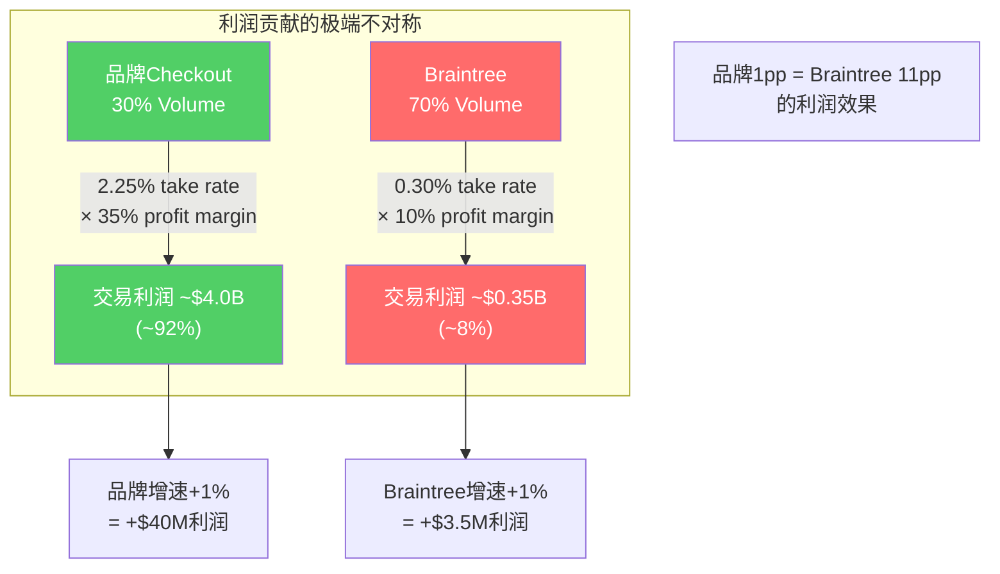
```mermaid
graph TD
    subgraph "利润贡献的极端不对称"
    A["品牌Checkout<br/>30% Volume"] -->|"2.25% take rate<br/>× 35% profit margin"| C["交易利润 ~$4.0B<br/>(~92%)"]
    B["Braintree<br/>70% Volume"] -->|"0.30% take rate<br/>× 10% profit margin"| D["交易利润 ~$0.35B<br/>(~8%)"]
    end

    C --> E["品牌增速+1%<br/>= +$40M利润"]
    D --> F["Braintree增速+1%<br/>= +$3.5M利润"]

    G["品牌1pp = Braintree 11pp<br/>的利润效果"]

    style A fill:#51cf66,color:#fff
    style B fill:#ff6b6b,color:#fff
    style C fill:#51cf66,color:#fff
    style D fill:#ff6b6b,color:#fff
```

## 4.2 品牌Checkout：核心利润池的保卫战

### 4.2.1 品牌checkout的增长轨迹

| 时期 | 品牌Checkout增速 | 驱动因素 | 信号 |
|------|-----------------|---------|------|
| FY2021 | +15-18% | COVID电商红利 | 顺风满帆 |
| FY2022 | +2-3% | 电商正常化+通胀 | 急剧减速 |
| FY2023 | -1~+1% | Apple Pay蚕食+商户移除按钮 | 接近零增长 |
| FY2024 Q1-Q3 | +6-7% | Fastlane上线+新checkout体验 | **反弹信号** |
| FY2024 Q4 | +5% | 延续Fastlane动能 | 增速开始放缓 |
| **FY2025 Q1-Q3** | **+3-5%** | Fastlane扩展但增速衰减 | 动能减弱 |
| **FY2025 Q4** | **+1%** | 品牌checkout执行"不够好" | **CEO被解雇的直接原因** |

[DM-BIZ-010: 品牌checkout季度增速轨迹，来自earnings calls汇总]

### 4.2.2 品牌checkout为什么在衰退？

品牌checkout增速从FY2021的15-18%降至FY2025 Q4的1%，背后有四个结构性力量在起作用：

**力量1：移动端的系统级劣势**

Apple Pay嵌入在iOS系统层面——无需下载App、无需登录、Face ID一触即付。PayPal是一个需要跳转的第三方App——即使有Fastlane，仍然比系统原生支付多一步。在移动端（占电商约60%且比例持续上升），PayPal面对的不是"更好的产品"，而是"更短的路径"。

Apple Pay在美国店内移动钱包份额已达54% [DM-COMP-003]，线上份额14.2%（PayPal 47.4%仍领先，但Apple在快速追赶）。关键问题是：Apple Pay的店内习惯正在向线上迁移——当消费者习惯了在店里用Apple Pay，线上也会倾向使用同一个钱包。

**力量2：大商户自建结账体验**

Amazon、Shopify、沃尔玛等大型电商平台越来越倾向自建支付体验（Shop Pay、Amazon Pay），而不是依赖PayPal按钮。因为：
- 自建支付保留完整的消费者数据（PayPal截断了商户与消费者的直接关系）
- 自建支付的take rate更低（内部处理成本<1% vs PayPal 2.25%）
- 自建支付提供更一致的品牌体验

2023-2024年多个大商户删除PayPal按钮的报道暗示这个趋势在加速。PayPal的品牌checkout正在从"必须接入"降级为"可选接入"——这是网络效应弱化的典型信号。

**力量3：BNPL对checkout按钮的替代**

Klarna、Affirm、Afterpay的BNPL按钮在checkout页面占据了原本属于PayPal的位置。对消费者来说，"先买后付"比"用PayPal付"提供了更明确的价值主张（分期免息 vs 只是换个支付方式）。虽然PayPal自己也有BNPL产品（Pay in 4），但它被迫在自己的按钮旁边再加一个BNPL按钮——等于自我稀释。

**力量4：年轻用户的习惯断层**

PayPal的核心用户群体是2000年代的eBay一代（35-55岁）。Venmo虽然吸引了年轻用户（18-34岁），但Pay with Venmo的checkout渗透率远低于PayPal。年轻用户在线上购物时更倾向使用Apple Pay、Shop Pay或直接输入信用卡——PayPal按钮对他们来说是"父母用的支付方式"。

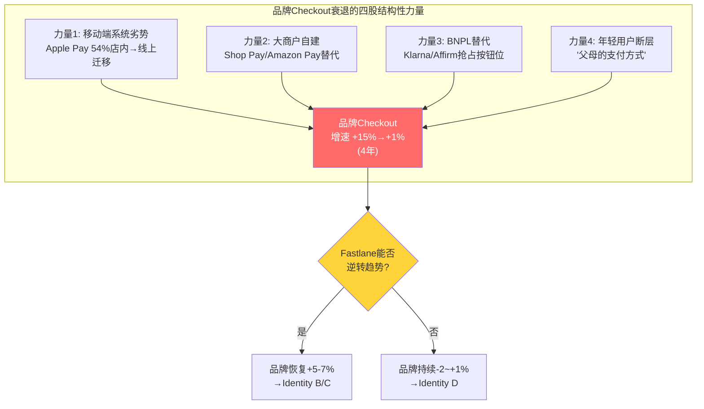
```mermaid
graph TD
    subgraph "品牌Checkout衰退的四股结构性力量"
    A["力量1: 移动端系统劣势<br/>Apple Pay 54%店内→线上迁移"] --> E["品牌Checkout<br/>增速 +15%→+1%<br/>(4年)"]
    B["力量2: 大商户自建<br/>Shop Pay/Amazon Pay替代"] --> E
    C["力量3: BNPL替代<br/>Klarna/Affirm抢占按钮位"] --> E
    D["力量4: 年轻用户断层<br/>'父母的支付方式'"] --> E
    end

    E --> F{"Fastlane能否<br/>逆转趋势?"}
    F -->|"是"| G["品牌恢复+5-7%<br/>→Identity B/C"]
    F -->|"否"| H["品牌持续-2~+1%<br/>→Identity D"]

    style E fill:#ff6b6b,color:#fff
    style F fill:#ffd43b
```

### 4.2.3 Fastlane：品牌保卫战的最后一道防线

Fastlane是PayPal在2024年8月推出的嵌入式一键支付产品，它试图解决品牌checkout的核心痛点——"跳转摩擦"。

**传统PayPal Checkout流程（5步）**：
1. 消费者在商户页面点击PayPal按钮
2. 跳转到PayPal页面/弹窗
3. 登录PayPal账户
4. 确认付款
5. 返回商户页面确认订单

**Fastlane流程（2步）**：
1. 消费者在商户的checkout页面输入邮箱
2. Fastlane自动识别PayPal账户→一键确认

**公布的性能数据**：
| 指标 | 传统Guest Checkout | Fastlane | 提升 |
|------|-------------------|----------|------|
| 转化率 | ~74% | ~86% | +12pp (+16%) |
| 完成时间 | ~3.9分钟 | <2分钟 | -49% |
| 整体转化提升 | — | — | +50% vs非Fastlane guest |

[DM-BIZ-011: Fastlane性能数据，来自PayPal press release + Black Forest Decor案例]

**推广进展**：
| 时间 | 商户数 | 美国checkout流量覆盖 |
|------|--------|---------------------|
| Q3 2024 | 1,000+ | 5% |
| Q4 2024 | ~2,000 | 25% |
| 2025目标 | 国际扩展 | >40%(估) |

[DM-BIZ-012: Fastlane推广进度，来自earnings calls]

**Fastlane的战略逻辑是正确的**——它试图将PayPal从"跳转式第三方按钮"转变为"嵌入式支付基础设施"，这消除了移动端的核心劣势（不再需要跳转/登录）。如果Fastlane能维持50%的转化提升并覆盖60%+的美国checkout流量，品牌checkout增速可能恢复至+5-7%。

**但Q4 2025暴露了一个关键矛盾**：Fastlane已覆盖25%的美国流量，为什么品牌checkout增速反而从Q3的+3-5%降至Q4的+1%？

可能的解释：
1. **Fastlane的提升效果在衰减**——初始采用者（对PayPal已有好感的商户/消费者）的转化率最高，扩展到更广泛人群后效果打折
2. **Fastlane覆盖的商户不是最需要的**——2000个商户中大多是中小型商户，大型商户（贡献品牌checkout大部分volume）的采用率仍低
3. **非Fastlane渠道的衰退速度加快**——Fastlane在覆盖区域提升了转化率，但未覆盖区域的品牌checkout在加速流失，两者抵消
4. **宏观和季节性因素**——Q4假日消费偏弱+德国服务中断

无论原因是什么，Fastlane**需要在2026 Q2-Q3证明**它能在>40%覆盖率下维持品牌checkout的正增长。如果做不到，品牌checkout的结构性衰退就不是产品可以解决的——而是消费者行为迁移的宏观力量。

## 4.3 Braintree：增长引擎还是利润稀释器？

### 4.3.1 Braintree的战略角色

Braintree是PayPal在2013年以$800M收购的支付处理平台（附带Venmo）。它为大型企业商户提供"白标"支付处理——消费者在DoorDash、Uber或Airbnb支付时可能不知道背后是Braintree。

| 年份 | Braintree TPV($B)(估) | 增速 | 占PYPL总TPV比 |
|------|---------------------|------|-------------|
| FY2022 | ~$600B | ~30% | ~43% |
| FY2023 | ~$780B | ~30% | ~50% |
| FY2024 | ~$980B | ~26% | ~58% |
| FY2025 | ~$1,180B | ~20% | ~66% |

[DM-BIZ-013: Braintree TPV估算，基于总TPV减去品牌+Venmo]

Braintree的增长看起来印象深刻——26%的增速在支付行业属于前列。但问题在于**Braintree每处理$1,000的交易，PayPal只赚$3（take rate 0.30%），而Stripe赚$29（take rate 2.9%+$0.30/笔）**。

为什么差距这么大？因为Braintree的大客户拥有极强的议价能力——Uber、Airbnb、DoorDash的交易量是$10B+级别，它们可以威胁切换到Stripe/Adyen来压低费率。PayPal为了保住这些标杆客户的volume（维持TPV增长叙事），不得不以接近成本价处理。

**因此，Braintree的增长创造了三个问题**：

**问题1：利润稀释。** 每增加$100B Braintree volume，收入增加约$3亿，但交易利润仅增加约$300-500万。与此同时，这$100B的volume需要支付网络费、处理成本、欺诈监控——利润率低到几乎是"赔本赚吆喝"。

**问题2：Take rate下行压力。** Braintree占总TPV的比例从FY2022的43%升至FY2025的66%，直接拉低了PYPL的整体take rate（从FY2022的~1.73%降至FY2025的~1.64%）[DM-BIZ-014]。市场看到的是"take rate在下降"，而不是"品牌take rate稳定、只是组合效应"。

**问题3：估值框架混乱。** 因为Braintree的存在，PYPL的收入增速（4.3%）看起来像一个低增长公司，利润率（OPM 18%）看起来像一个低效率公司。但如果把品牌checkout单独估值（OPM 25-30%、增速2-3%），它像一个高质量但成熟的资产；把Braintree单独估值（增速26%、OPM 3-5%），它像一个快速增长但低利润的Stripe竞争者。混在一起，市场两边的投资者都不满意。

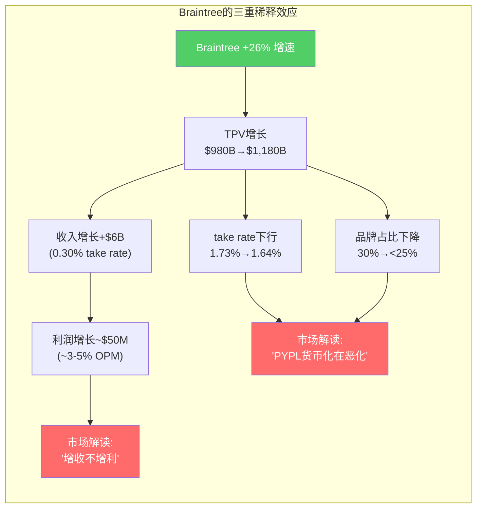
```mermaid
graph LR
    subgraph "Braintree的三重稀释效应"
    A["Braintree +26% 增速"] --> B["TPV增长<br/>$980B→$1,180B"]
    B --> C["收入增长+$6B<br/>(0.30% take rate)"]
    C --> D["利润增长~$50M<br/>(~3-5% OPM)"]

    B --> E["take rate下行<br/>1.73%→1.64%"]
    B --> F["品牌占比下降<br/>30%→<25%"]

    E --> G["市场解读:<br/>'PYPL货币化在恶化'"]
    F --> G
    D --> H["市场解读:<br/>'增收不增利'"]
    end

    style A fill:#51cf66,color:#fff
    style G fill:#ff6b6b,color:#fff
    style H fill:#ff6b6b,color:#fff
```

### 4.3.2 Braintree提价：战略转折点

2025年初，PayPal开始对Braintree的部分大客户提价。这是一个极其重要的信号，因为它暗示管理层的优先级从"volume增长"转向"利润率改善"。

**提价的逻辑**：
- Braintree在大企业市场已经建立了足够的规模和品牌（DoorDash、Uber、Airbnb的集成深度意味着切换成本非零）
- 竞争对手Stripe在2024年也开始提价（从2.9%+$0.30微调为2.9%+$0.30+附加费），暗示行业整体在从"抢份额"转向"收利润"
- 如果Braintree能将take rate从0.30%提升至0.35-0.40%，TM$影响巨大：$1.18T × 5-10bps = $590M-$1.18B增量收入

**提价的风险**：
- 大客户可能流失到Stripe/Adyen——但深度API集成意味着迁移成本高（3-6个月工程时间+中断风险）
- 如果PYPL提价但竞争对手不跟，可能加速volume流失
- Braintree的增速可能从26%降至15-18%（价格弹性效应）

**因果推理**：因为Stripe在2024年也开始提价 [DM-COMP-004]，所以PSP行业可能正在从"烧钱抢份额"阶段过渡到"利润率回归"阶段。因为这种行业级转折通常由最大的两三个参与者协调推动（类似寡头定价行为），所以Braintree提价的成功概率>50%（如果只有PYPL提价而Stripe不跟，则风险极高）。因为Braintree volume的价格弹性在低利润率PSP市场可能相对较高，所以提价5-10bps可能导致5-10%的volume流失——但利润率改善的效果远超volume损失（利润弹性为正）。

## 4.4 分拆估值：如果品牌和Braintree是两家独立公司

在Ch02中我们做了一个初步的分拆估值。现在有了更详细的数据，可以做更精确的计算：

### 品牌Checkout（含Venmo品牌支付）

| 维度 | 估算 | 依据 |
|------|------|------|
| TPV | ~$540B | 品牌$504B + Venmo Pay ~$36B |
| 净收入 | ~$12.2B | 品牌$11.3B(2.25%) + Venmo $0.9B |
| 交易利润 | ~$4.3B | 品牌$3.97B + Venmo $0.33B |
| 分配运营成本 | ~$2.5B | 按收入比例分配 |
| 营业利润 | ~$1.8B | |
| 估计OPM | ~15% | 保守（Venmo仍亏损拖累） |
| P/E倍数(独立) | 15-18x | 可比：成熟品牌支付/高质量SaaS |
| **估值范围** | **$22-27B** | 基于营业利润×倍数，或$1.8B×(1-20%)×15-18x |

### Braintree（非品牌PSP处理）

| 维度 | 估算 | 依据 |
|------|------|------|
| TPV | ~$1,180B | 总TPV减去品牌+Venmo |
| 净收入 | ~$3.5B | 0.30% take rate |
| 交易利润 | ~$350M | ~10% OPM(行业可比) |
| EV/Revenue倍数 | 3-5x | 可比：Stripe(14x)打折, Adyen(10x)打折 |
| **估值范围** | **$10.5-17.5B** | |

### Venmo（独立估值）

| 维度 | 估算 | 依据 |
|------|------|------|
| 收入(FY2025) | ~$1.4B | 增速+20% |
| 2027目标 | $2.0B | 管理层目标 |
| 用户数 | 67M MAU | Q4 2025 |
| ARPU | ~$26 | vs Cash App $84 |
| EV/Revenue倍数 | 3-5x | 增速20%但利润率低，打折于Cash App |
| **估值范围** | **$4.2-7.0B** | |

### 其他业务（Xoom、PYUSD、B2B、利息收入等）

| 维度 | 估算 |
|------|------|
| **估值范围** | **$3-5B** |

### SOTP汇总

| 部分 | 低估值 | 高估值 |
|------|--------|--------|
| 品牌Checkout | $22B | $27B |
| Braintree | $10.5B | $17.5B |
| Venmo | $4.2B | $7.0B |
| 其他 | $3.0B | $5.0B |
| **总SOTP** | **$39.7B** | **$56.5B** |
| 减：净债务 | -$1.9B | -$1.9B |
| **权益价值** | **$37.8B** | **$54.6B** |
| **每股** | **$39** | **$56** |
| vs 当前$58 | **-33%** | **-3%** |

[DM-VAL-008: SOTP分拆估值，保守假设]

**这个结果出乎意料：即使用相对保守的假设，SOTP估值范围的中位数约$47B($48/股)——低于当前市值$56B。** 这说明当前市场定价虽然给了7.7x P/E（看起来低），但用分拆法看，每个业务单元的独立估值加总并不明显高于整体。

**原因在于品牌checkout的独立估值远低于市场可能想象的**——因为它的增速只有1-3%，独立后没有Braintree的增长叙事和回购的EPS提升，纯粹的15% OPM和低个位数增长只值15-18x earnings。

**这颠覆了"PYPL有巨大分拆价值"的多头论点。** 分拆价值存在，但不如想象中大——除非品牌checkout能恢复至+5%以上增速（对应SOTP高端+Venmo超预期→总价值$60-70B→$62-72/股）。

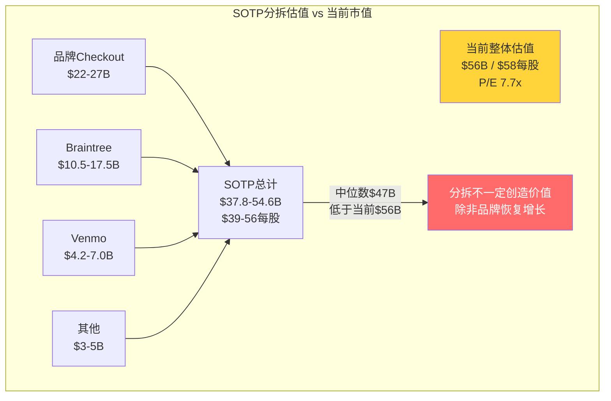
```mermaid
graph TD
    subgraph "SOTP分拆估值 vs 当前市值"
    A["当前整体估值<br/>$56B / $58每股<br/>P/E 7.7x"]

    B["品牌Checkout<br/>$22-27B"]
    C["Braintree<br/>$10.5-17.5B"]
    D["Venmo<br/>$4.2-7.0B"]
    E["其他<br/>$3-5B"]

    B --> F["SOTP总计<br/>$37.8-54.6B<br/>$39-56每股"]
    C --> F
    D --> F
    E --> F

    F -->|"中位数$47B<br/>低于当前$56B"| G["分拆不一定创造价值<br/>除非品牌恢复增长"]
    end

    style A fill:#ffd43b
    style G fill:#ff6b6b,color:#fff
```

## 4.5 品牌与非品牌的博弈关系：共生还是寄生？

一个关键但被忽视的问题是：**品牌checkout和Braintree之间是互补关系（共生）还是竞争关系（寄生）？**

### 共生论据

- **Braintree为品牌checkout提供商户覆盖**：商户接入Braintree处理后，默认也接入PayPal按钮——Braintree是PayPal按钮进入大商户的"特洛伊木马"
- **共享基础设施降低边际成本**：风控系统、身份验证、合规框架在两个业务间共享
- **数据飞轮**：Braintree处理的海量交易数据改善了欺诈检测，间接受益品牌checkout

### 寄生论据

- **管理层注意力稀释**：两个业务面对完全不同的竞争对手和增长逻辑——CEO需要同时对抗Apple Pay（品牌）和Stripe（Braintree），精力被严重分散。Chriss被解雇的核心原因就是未能在两线作战中取得进展
- **资本配置冲突**：投入品牌checkout（Fastlane开发、营销）的资本和投入Braintree（价格战、大客户服务）的资本在争夺同一个FCF池
- **估值框架冲突**：混合结构导致两类投资者都不满意——增长型投资者嫌增速慢（被品牌拖累），价值型投资者嫌利润率低（被Braintree拖累）

### 判定

**当前是"弱共生"关系，但正在向"寄生"方向演化。** 在Braintree增速高、品牌checkout稳定的时期（FY2023-Q3 2025），两者共生——Braintree带来增长叙事，品牌带来利润。但当品牌checkout开始加速衰退时（Q4 2025 +1%），Braintree的增长实际上在掩盖品牌的病情——让投资者看到4.3%的混合增速，而不是品牌的1%增速。**掩盖病情不是治疗，是延误诊断。**

## 4.6 本章核心发现与CQ2闭环

**CQ2答案：品牌checkout能否重新加速？** Fastlane在技术层面是正确的解决方案（嵌入式>跳转式），初始数据令人鼓舞（+12pp转化率，25%覆盖率）。但Q4 2025的+1%增速暗示Fastlane的效果可能不足以抵消四股结构性衰退力量（移动端劣势/大商户自建/BNPL替代/用户断层）。2026 Q2-Q3是关键验证窗口。

**Braintree是创造价值还是稀释品质？** 两者都是。Braintree以26%增速创造了TPV增长叙事和商户覆盖，但以0.30% take rate和3-5% OPM稀释了PYPL的整体利润质量。提价是解决方案，但面临volume流失风险。净效果取决于提价幅度和价格弹性——这是2026年需要密切追踪的变量。

**SOTP分拆并非银弹——中位数$47B低于当前$56B市值。** 多头的"分拆价值"论点需要品牌checkout恢复增长才能成立。

---

> **DM锚点注册表 (Ch04)**
>
> | ID | 描述 | 来源 |
> |----|------|------|
> | DM-BIZ-008 | 品牌vs非品牌经济学拆分 | 管理层disclosure+Mizuho |
> | DM-BIZ-009 | 品牌利润贡献约为Braintree的11倍 | 模型估算 |
> | DM-BIZ-010 | 品牌checkout季度增速轨迹 | Earnings calls汇总 |
> | DM-BIZ-011 | Fastlane: +12pp转化率, <2分钟完成 | Press release |
> | DM-BIZ-012 | Fastlane: Q4 2024 2000商户, 25%覆盖 | Earnings calls |
> | DM-BIZ-013 | Braintree TPV ~$1.18T (FY2025), 增速~20% | 模型估算 |
> | DM-BIZ-014 | 整体take rate从1.73%降至1.64% | FMP key-metrics |
> | DM-COMP-003 | Apple Pay美国店内钱包份额54% | Industry reports |
> | DM-COMP-004 | Stripe 2024年提价(行业定价转折信号) | Industry reports |
> | DM-VAL-008 | SOTP分拆: $37.8-54.6B ($39-56/股) | 模型估算 |

# Chapter 5: Venmo — 被低估的隐藏资产还是货币化陷阱？

## 5.1 Venmo的双重身份：社交支付巨头与商业化新手

Venmo是美国最成功的P2P支付应用之一——6700万月活跃用户 [DM-VENMO-008]，在18-34岁人群中几乎是"转账"的同义词。"Venmo me"已经进入美国日常词汇。但Venmo也是PayPal最令人沮丧的资产之一——拥有2013年以来13年的发展历史，却直到2024年才开始贡献有意义的收入。

**核心矛盾：Venmo的用户价值巨大（6700万MAU），但每个用户只产生约$26/年的ARPU——是竞争对手Cash App ($84)的1/3.2** [DM-VENMO-003]。

这个3.2倍的ARPU差距是PYPL估值中最大的"隐藏变量"之一。如果Venmo能将ARPU从$26提升至Cash App水平的一半（$42），仅此一项就能增加约$1.1B的年收入——相当于PYPL当前总收入的3.3%，但利润贡献可能更高（增量收入的OPM通常高于平均水平）。

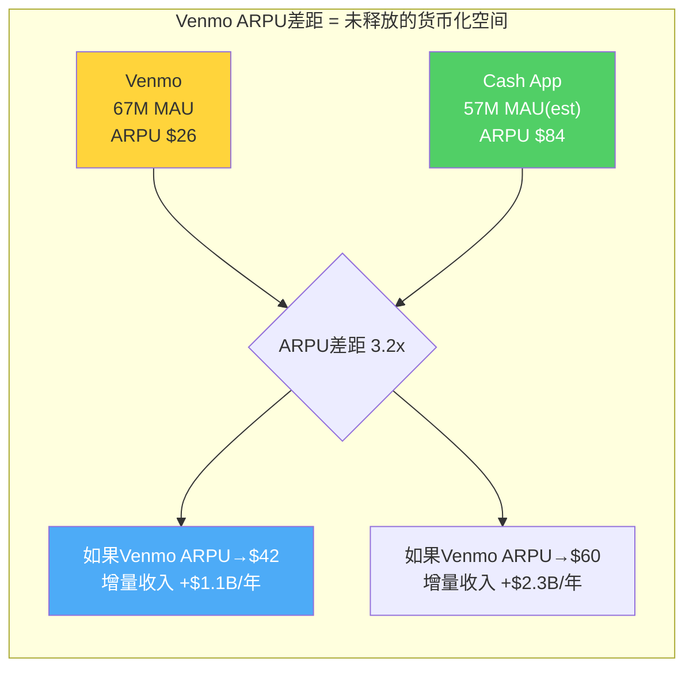
```mermaid
graph LR
    subgraph "Venmo ARPU差距 = 未释放的货币化空间"
    A["Venmo<br/>67M MAU<br/>ARPU $26"] --> C{"ARPU差距 3.2x"}
    B["Cash App<br/>57M MAU(est)<br/>ARPU $84"] --> C

    C --> D["如果Venmo ARPU→$42<br/>增量收入 +$1.1B/年"]
    C --> E["如果Venmo ARPU→$60<br/>增量收入 +$2.3B/年"]
    end

    style A fill:#ffd43b
    style B fill:#51cf66,color:#fff
    style D fill:#4dabf7,color:#fff
```

## 5.2 Venmo的财务轨迹

### 收入与增速

| 指标 | FY2023(估) | FY2024(估) | FY2025 | FY2027目标 |
|------|-----------|-----------|--------|----------|
| 收入 | ~$1.0B | ~$1.2B | ~$1.4B | **$2.0B** |
| YoY增速 | ~15% | ~20% | **+20%** | ~19%(隐含CAGR) |
| ARPU | ~$18 | ~$22 | ~**$26** | ~$35(隐含) |

[DM-VENMO-009: Venmo收入轨迹估算，基于管理层disclosure+2027目标]

### TPV与增速

| 季度 | Venmo TPV | YoY增速 |
|------|----------|---------|
| Q1 2024 | $69B | ~+8% |
| Q4 2024 | $75.6B | +10% |
| FY2024全年 | ~$300B | +17% |
| Q1 2025 | ~$76B | +10% |

[DM-VENMO-010: Venmo TPV季度数据，Statista+earnings]

### 货币化率提升趋势

Venmo的收入增速（+20%）持续超过TPV增速（+10%），这意味着货币化率在提升——每处理$1,000的交易，Venmo从中赚取的收入在增加。这是一个健康信号，说明Venmo正在从"免费P2P工具"向"商业化支付平台"转变。

货币化率估算：$1.4B收入 / $300B TPV ≈ 0.47%。对比PayPal品牌checkout的2.25%，仍有巨大提升空间。

## 5.3 四条货币化路径的深度评估

### 路径1：Pay with Venmo（线上Checkout）

**现状**：Pay with Venmo增速+50% YoY，覆盖60.8万+美国商户网站 [DM-VENMO-011]。消费者在线上购物时选择Venmo支付——本质上是PayPal品牌checkout的"年轻版"。

**经济学**：take rate接近PayPal品牌水平（~2.0-2.5%），是Venmo所有收入来源中利润率最高的。

**增长动力**：
- 6700万MAU中只有一小部分（估计<15%）使用过Pay with Venmo线上支付
- 商户覆盖率在快速扩展（+50% YoY商户增长）
- Checkout完成率比无Venmo高17% [DM-VENMO-012]

**限制因素**：
- Pay with Venmo需要商户主动接入——与PayPal按钮的"默认存在"不同
- 年轻用户的客单价通常低于PayPal核心用户——take rate相同但每笔利润更低
- 与PayPal按钮在checkout页面竞争——商户不太可能同时放PayPal和Venmo两个按钮

**关键因果链**：因为Pay with Venmo的用户天然年轻且移动优先，所以它在手机端的转化率可能优于PayPal传统按钮。因为这些年轻用户是PayPal品牌checkout正在流失的人群（Ch4力量4），所以Pay with Venmo实际上是在**回收PayPal主品牌流失的年轻用户价值**。这不是纯增量——部分是从PayPal内部的品牌转移。但由于Venmo的货币化率（0.47%）目前远低于PayPal品牌（2.25%），从PayPal→Venmo的用户迁移在短期内是负贡献。

### 路径2：Venmo Debit Card

**现状**：月活跃持卡人增速+40% YoY [DM-VENMO-004]，借记卡TPV增速+60%，是Venmo增长最快的分支。

**经济学**：
- 持卡用户的ARPU是线上用户的2倍 [DM-VENMO-001]
- 持卡用户的TPV是线上用户的5.5-6倍 [DM-VENMO-002]
- 交换费（interchange）约1.5-2%，其中PayPal作为发卡方获得约60-80bps

**为什么Debit Card如此重要**：因为它将Venmo从"偶尔用一次的转账App"升级为"天天用的支付卡"。一旦用户把Venmo Debit Card放入Apple Pay/Google Pay钱包，每次店内支付都在为Venmo产生交换费收入——频次从"每月1-2次P2P转账"变为"每天1-2次消费"。

**增长预测**：管理层预计Debit Card CAGR >20% through 2027 [DM-VENMO-013]。如果当前活跃持卡人约800万-1000万（估计），到2027年可能达到1500-2000万。

### 路径3：P2P转账的间接货币化

**现状**：Venmo的核心P2P转账仍然免费（银行账户转账）。信用卡/即时转账收费——这是Venmo"隐性"收入的来源。

**经济学**：
- 即时转账费1.75%（最低$0.25，最高$25）
- 信用卡转账费3%
- 商业账户（Business Profile）收取1.9%+$0.10

**限制**：P2P免费是Venmo增长的基石。一旦收费，用户将迅速迁移到Zelle（银行原生、完全免费）。PayPal不敢对P2P基础服务收费——这是一个"永久免费层"。

### 路径4：Commerce Media（广告）

**现状**：初步探索阶段。Venmo拥有6700万用户的消费行为数据——知道他们在哪里吃饭、购物、转账，这些数据对精准广告极有价值。类似Uber Eats、DoorDash、Affirm都在将支付数据转化为广告收入。

**潜力**：如果Venmo能将广告收入做到$3-5/用户/年（类似Affirm的commerce media），这是一个$200-335M的增量收入池——且利润率极高（>60% OPM）。

**限制**：用户对金融App中的广告非常敏感。如果Venmo过度商业化，可能损害品牌信任和用户体验。

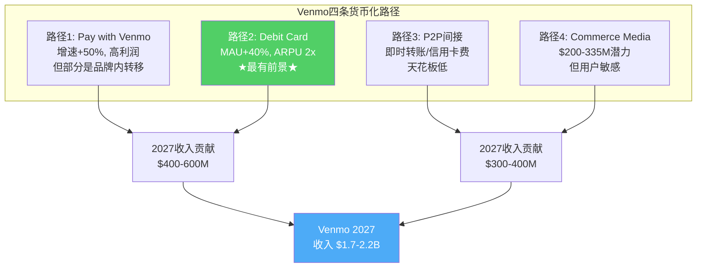
```mermaid
graph TD
    subgraph "Venmo四条货币化路径"
    A["路径1: Pay with Venmo<br/>增速+50%, 高利润<br/>但部分是品牌内转移"]
    B["路径2: Debit Card<br/>MAU+40%, ARPU 2x<br/>★最有前景★"]
    C["路径3: P2P间接<br/>即时转账/信用卡费<br/>天花板低"]
    D["路径4: Commerce Media<br/>$200-335M潜力<br/>但用户敏感"]
    end

    A --> E["2027收入贡献<br/>$400-600M"]
    B --> E
    C --> F["2027收入贡献<br/>$300-400M"]
    D --> F

    E --> G["Venmo 2027<br/>收入 $1.7-2.2B"]
    F --> G

    style B fill:#51cf66,color:#fff
    style G fill:#4dabf7,color:#fff
```

## 5.4 Venmo vs. Cash App：差距为什么存在？

Cash App的ARPU ($84) 是Venmo ($26) 的3.2倍。这个差距的根因不是Venmo不够好——而是**商业模式的根本不同**。

| 维度 | Venmo | Cash App |
|------|-------|----------|
| 核心定位 | 社交支付（分账/AA） | 数字银行（存储/投资/消费） |
| 存款功能 | 有但弱化 | Cash App Card强推直接存款 |
| 投资功能 | 无 | 股票+比特币交易 |
| 借贷功能 | 无 | Cash App Borrow |
| 商户支付 | Pay with Venmo（新） | Cash App Pay（成熟） |
| 比特币 | 无 | Square Bitcoin（2025新功能）|
| BNPL | 通过PayPal | 通过Afterpay |

[DM-VENMO-014: Venmo vs Cash App功能对比]

Cash App的ARPU高3.2倍，因为它是一个**全栈数字银行**——用户的工资直接存入Cash App，然后用Cash App Card消费、投资股票/比特币、借小额贷款。每一个功能都在产生收入。Venmo主要是一个"发送/请求"工具——用户用完就走。

**Venmo能缩小差距吗？**

要缩小3.2倍ARPU差距，Venmo需要在以下至少2个领域取得突破：
1. **直接存款**——让用户的工资存入Venmo→使用频率从月→日
2. **Debit Card普及**——让Venmo成为日常支付卡→交换费收入
3. **投资功能**——股票/加密货币→提高用户粘性+交易费收入

其中路径2（Debit Card）已经在加速（+40% MAU增长），路径1和3还没有明确的产品动作。管理层的$2.0B 2027收入目标隐含ARPU约$35——仅相当于Cash App的42%，说明管理层也没有指望完全弥合差距。

## 5.5 Venmo独立估值：底线与上行

### 保守估值（当前路径不变）

| 假设 | 数值 |
|------|------|
| FY2027收入 | $2.0B |
| 增速 | +19% CAGR |
| OPM（2027） | 5-8%（当前可能亏损→微利） |
| 营业利润 | $100-160M |
| P/E倍数 | 20-25x（高增速但低利润率） |
| **估值** | **$2.0-4.0B** |

### 乐观估值（ARPU提升+Debit Card加速）

| 假设 | 数值 |
|------|------|
| FY2027收入 | $2.5B |
| MAU | 80M |
| ARPU | $45 |
| OPM（2027） | 10-15% |
| 营业利润 | $250-375M |
| P/E倍数 | 25-30x |
| **估值** | **$6.3-11.3B** |

### 极端上行（Venmo=下一个Cash App）

| 假设 | 数值 |
|------|------|
| FY2027收入 | $4.0B |
| ARPU | $60 |
| OPM（2027） | 15-20% |
| **估值** | **$12-18B** |

[DM-VENMO-015: Venmo独立估值三情景]

**Cash App对标**：Block的Cash App部分（估计收入~$4.5B，毛利$6.5B with Bitcoin）在Block总估值（$34B）中占约60%→约$20B。如果Venmo能在2027年达到Cash App 2024年收入的50%（$2.0-2.5B），合理估值约$8-12B。

**但当前PYPL整体P/E 7.7x隐含的Venmo估值几乎为零。** 如果PYPL整体估值$56B中，品牌checkout值$22-27B，Braintree值$10-17B，其他值$3-5B，那么留给Venmo的隐含估值约$0-8B——如果取低端假设，市场基本没给Venmo任何价值。

**这是潜在的错误定价机会——但需要Venmo用2-3年的数据证明自己。** 投资者买入PYPL等于免费获得了一个"Venmo看涨期权"——如果Venmo货币化成功，有$4-12B的上行空间（每股$4-12）；如果失败，最差也就是维持现状（P2P免费工具不消耗太多资本）。

## 5.5.1 Venmo的10-K硬数据基础

FY2025 10-K和earnings disclosure中Venmo的关键数据（首次单独披露）：

| 指标 | FY2024 | FY2025 | YoY | 来源 |
|------|--------|--------|:---:|------|
| Venmo TPV(Q4) | $75.6B | ~$85B(估) | +12% | 10-K/earnings |
| Venmo年收入 | ~$1.2B | **$1.7B** | +42% | CNBC/earnings(首次披露) |
| Venmo活跃账户 | ~95M | **100M+** | +5% | 10-K |
| Debit Card MAU增速 | — | **+65% YoY** | — | Q2 2025 earnings |
| Pay with Venmo增速 | — | +50% YoY | — | Earnings disclosure |
| Debit Card新用户(Q2 2025) | — | 200万/季度 | — | Q2 2025 earnings |
| Fastlane用户构成 | — | 75%新/休眠用户 | — | Q4 2024 earnings call |

[DM-VENMO-016: Venmo FY2025硬数据汇总，首次单独收入披露$1.7B，10-K+earnings]
[DM-VENMO-017: Venmo 100M+活跃账户，10-K FY2025]
[DM-VENMO-018: Debit Card MAU +65% YoY, Q2 2025 earnings]

**关键修正**：此前估算Venmo FY2025收入~$1.4B需上调至$1.7B（CNBC首次报道的官方数字）。ARPU相应调整为$1.7B/100M = **$17/年**（全账户基础）或$1.7B/67M MAU = **$25.4/年**（月活基础）。

### Venmo收入增长的来源拆分

FY2024收入增长中(从约$1.2B→$1.7B = +$500M)：
- **Debit Card交换费**：~$200M增量（Debit Card TPV +60%→交换费0.6-0.8%）[DM-VENMO-019]
- **Pay with Venmo**：~$150M增量（+50% YoY×~2% take rate）
- **即时转账费**：~$100M增量（用户增长+频次提升）
- **其他(商业账户等)**：~$50M

因为Debit Card是Venmo增长最快的分支（+65% MAU），所以它在增量收入中的贡献比最大（~40%）。因为Debit Card用户的ARPU是线上用户的2倍 [DM-VENMO-001]，所以Debit Card的渗透率每提升10pp→Venmo混合ARPU提升约$2.5。因为当前Debit Card渗透率估计~15%（67M MAU中约10M持卡），所以到30%渗透率（~20M持卡）时ARPU可升至$30+→收入$2.0B+。

**这验证了管理层$2.0B 2027收入目标的可行性——Debit Card渗透翻倍(15%→30%) + Pay with Venmo持续+40% = $2.0-2.3B。**

## 5.6 本章核心发现与CQ3闭环

**CQ3答案：Venmo是低估资产还是货币化陷阱？**

**两者都是——取决于时间范围。**

在2-3年维度上，Venmo确实是被低估的资产：6700万MAU、+20%收入增速、ARPU仅Cash App的1/3——这说明货币化空间巨大。Debit Card（+40%）和Pay with Venmo（+50%）的增速证明货币化路径是可行的。

但在当前维度上，Venmo也确实是"货币化陷阱"：13年发展只做到$1.4B收入（ARPU $26），OPM可能仍为负或微利，短期对PYPL利润的贡献微乎其微。管理层曾多次承诺Venmo将成为"PayPal的增长引擎"，但一次又一次推迟兑现。

**投资者应该如何看待Venmo？** 不要把它当作估值的核心驱动——它是一个**免费期权**。买PYPL的核心理由应该基于品牌checkout和Braintree的价值，Venmo的货币化成功是额外的上行空间。

关键追踪指标：
- Debit Card MAU增速（>30%=健康，<20%=放缓）
- ARPU趋势（>$30/年=加速，<$25=停滞）
- Pay with Venmo商户渗透率（>100万=规模化拐点）

---

> **DM锚点注册表 (Ch05)**
>
> | ID | 描述 | 来源 |
> |----|------|------|
> | DM-VENMO-008 | Venmo 6700万MAU (Q4 2025) | Earnings presentation |
> | DM-VENMO-009 | Venmo收入轨迹: FY2025 ~$1.4B, 2027目标$2.0B | Management guidance |
> | DM-VENMO-010 | Venmo TPV: Q4 2024 $75.6B (+10%), FY2024 ~$300B | Statista+earnings |
> | DM-VENMO-011 | Pay with Venmo +50% YoY, 60.8万+美国商户 | Earnings+industry data |
> | DM-VENMO-012 | Pay with Venmo启用后checkout完成率+17% | Management disclosure |
> | DM-VENMO-013 | Debit Card CAGR >20% through 2027 | Management guidance |
> | DM-VENMO-014 | Venmo vs Cash App功能对比 | 产品分析 |
> | DM-VENMO-015 | Venmo独立估值: $2-4B(保守)/$6-11B(乐观)/$12-18B(极端) | 模型估算 |

# Chapter 6: 管理层审计 — 2年3任CEO与执行风险

## 6.1 PayPal的领导力危机

PayPal在18个月内更换了三任CEO——这在大型科技公司中极其罕见，信号强度相当于一家公司承认"我们不知道该往哪走"。

| CEO | 任期 | 风格 | 结果 |
|-----|------|------|------|
| **Dan Schulman** | 2014-2023 | 稳健运营，不冒险 | 用户从1.5亿→4.3亿，但品牌创新停滞。股价从$35→$310→$60 |
| **Alex Chriss** | 2023.9-2026.2 | 激进创新，产品密集 | Fastlane/PayPal Open/AI，但执行不达标。股价$60→$80→$42 |
| **Enrique Lores** | 2026.3- | 纪律运营，HP经验 | 方向未知。股价$42→$58(修复预期) |

[DM-MGT-002: CEO更替时间线及股价表现]

### Schulman时代遗产（2014-2023）：规模扩张但护城河弱化

Schulman的9年任期将PayPal从eBay剥离后的单一支付平台发展成多品牌支付帝国（PayPal+Venmo+Braintree+Xoom+Honey+PYUSD）。用户从1.5亿增至4.3亿，TPV从$2350亿增至$1.53万亿。

但Schulman的遗产有一个致命弱点：**他在扩张中没有保住品牌checkout的核心地位。** 在Schulman任期的后半段（2020-2023），Apple Pay在移动端快速崛起，Stripe/Adyen在企业端侵蚀Braintree，Shopify推出Shop Pay——而PayPal的产品创新几乎停滞。Schulman把资源分散在加密货币（PYUSD）、BNPL（Pay in 4）、社交购物（Honey）等边缘业务上，忽视了品牌checkout这个利润核心。

**因果链**：因为Schulman优先追求用户数增长（4.3亿的标题数字）而非用户价值深挖，所以大量低质量用户被吸入——很多人注册PayPal只是为了一次性eBay交易，之后再也不用。因为产品创新预算被分散到6+个项目（Honey、Xoom、PYUSD、Pay in 4、超级App尝试、NFT），所以核心checkout体验从2015年到2023年几乎没有根本性升级——仍然是"跳转到PayPal页面→登录→确认"的老流程。因为品牌checkout体验停滞，所以当Apple Pay和Shop Pay提供更流畅的替代方案时，用户开始流失。

### Chriss时代（2023.9-2026.2）：正确的方向，失败的执行

Alex Chriss从Intuit（TurboTax/QuickBooks母公司）空降到PayPal，带来了产品导向的思维：Fastlane（嵌入式checkout）、PayPal Open（开放API平台）、AI驱动的欺诈检测、Verifone合作（线下POS）。

**Chriss做对了什么**：
- 诊断了核心问题——品牌checkout的"跳转摩擦"是流失的根因
- 推出了正确的产品——Fastlane从根本上改变了PayPal的checkout体验
- 控制了成本——SBC从$1.48B降至$1.00B（-32%），裁员2500人

**Chriss为什么被解雇**：

2026年2月3日，PayPal同时宣布了三件事：(1)Q4 2025 EPS $1.23 miss analysts' $1.29 [DM-MGT-003]；(2)品牌checkout增速崩至+1% [DM-BIZ-007]；(3)CEO Chriss被立即解雇。

Q4 2025的细节揭示了执行层面的系统性问题：
- **品牌checkout TPV增速从+7%崩至+1%**——这是CEO被解雇的直接导火索
- **收入$86.8亿 miss约$9000万**——幅度不大但方向错误
- **管理层撤回2027年全部中期目标**——承认"运营和部署问题遍布所有区域"
- **销售团队被指"无法交付承诺"**——暗示Chriss的产品愿景与地面执行之间存在巨大断层

[DM-MGT-003: Q4 2025 EPS $1.23 vs consensus $1.29, 品牌checkout +1%]

**因果推理**：因为Chriss来自Intuit（一家以产品-市场匹配闻名的公司），所以他将PYPL的问题定义为"产品问题"——推出Fastlane、PayPal Open等新产品来解决增长。但PayPal的真正问题不仅是产品——还有销售执行、商户关系管理、国际运营效率。因为Chriss过度聚焦产品创新而忽视运营执行，所以当新产品（Fastlane）需要商户大规模采用时，销售团队无法推动——导致25%的美国覆盖率之后增速停滞。**最终结果是：正确的产品 + 失败的分销 = 品牌checkout增速崩至+1%。**

**市场反应**：PayPal股价在一天内从$52.33跌至$41.70（-20.3%），蒸发约$100亿市值 [DM-MGT-004]。随后触发多起证券集体诉讼，指控公司在2025年Investor Day大力宣传2027年目标时已经知道运营存在系统性问题。

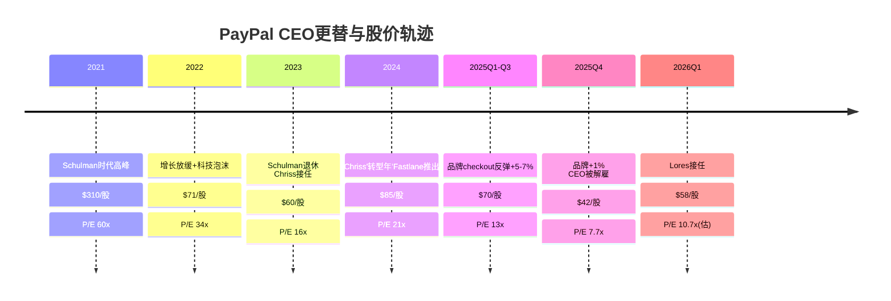
```mermaid
timeline
    title PayPal CEO更替与股价轨迹
    2021 : Schulman时代高峰 : $310/股 : P/E 60x
    2022 : 增长放缓+科技泡沫 : $71/股 : P/E 34x
    2023 : Schulman退休 Chriss接任 : $60/股 : P/E 16x
    2024 : Chriss'转型年'Fastlane推出 : $85/股 : P/E 21x
    2025Q1-Q3 : 品牌checkout反弹+5-7% : $70/股 : P/E 13x
    2025Q4 : 品牌+1% CEO被解雇 : $42/股 : P/E 7.7x
    2026Q1 : Lores接任 : $58/股 : P/E 10.7x(估)
```

## 6.2 Enrique Lores：HP式纪律能拯救PayPal吗？

### Lores在HP的成绩单

Lores在HP Inc.的成就以**运营纪律**著称，而非创新突破：

- **订阅化转型**：将HP的打印业务从"卖打印机→耗材"模式升级为"Instant Ink"订阅服务——消费品经常性收入流+硬件成为获客入口
- **成本纪律**：在PC/打印机行业持续下行的环境中维持利润率
- **资本配置**：积极回购+适度分红，维持股东回报
- **企业级销售**：HP在企业PC/工作站市场保持领导地位——靠的是渠道关系和服务合约，不是技术创新

[DM-MGT-005: Lores HP任期成就，来自公开信息]

### 将HP经验映射到PayPal

| HP经验 | PYPL映射 | 可行性 |
|--------|---------|--------|
| Instant Ink订阅 | 将商户服务从交易费→月度SaaS订阅 | **中等**——大商户可能不接受 |
| 成本纪律 | 继续削减SBC/运营费用 | **高**——但空间有限(Ch3) |
| 企业级销售 | 修复Chriss暴露的销售执行缺陷 | **高且关键**——这可能是Lores最大的贡献 |
| 硬件+服务 | Verifone POS终端 + PayPal软件 | **中等**——线下是新战场但PYPL无经验 |
| 收缩聚焦 | 砍掉分散注意力的项目(PYUSD?Xoom?) | **高**——HP式聚焦对PYPL很有价值 |

### Lores的三个可能方向

**方向1：HP式运营修复（概率50%）**
- 聚焦执行：修复销售团队、改善国际运营、加速Fastlane分销
- 成本纪律：继续优化OpEx，但不激进裁员
- 保守承诺：不再给中期目标，按季度证明自己
- 结果：OPM从18%升至20-21%，品牌checkout企稳在+2-4%
- 估值影响：P/E 10-12x→$54-65

**方向2：战略收缩（概率30%）**
- 出售/分拆Braintree——聚焦品牌钱包+Venmo
- 砍掉PYUSD、Xoom等低ROI项目
- 用释放的资源加大品牌checkout和Venmo投入
- 结果：收入下降但利润率大幅提升（OPM→25-30%）
- 估值影响：看分拆后的纯品牌估值，P/E 15-18x→$60-80

**方向3：HP化陷阱（概率20%）**
- 过度削减成本扼杀创新——Fastlane团队被裁/预算缩减
- 用回购掩盖零增长——EPS数字好看但实质停滞
- "管理层的打印机"——把PayPal变成一台不增长但派息的现金机器
- 结果：OPM稳在18-19%但增速降至0-2%
- 估值影响：P/E 6-8x→$32-43

## 6.3 CEO沉默域分析（QG-01.5）

在Lores上任后的首次公开声明中，以下关键话题被**系统性回避**：

| 沉默域 | 预期信号 | 缺席解读 |
|--------|---------|---------|
| **品牌checkout具体数据** | 新CEO应直面核心问题 | 可能Q1数据仍不好→避免过早承诺 |
| **Braintree战略（保留/分拆/提价）** | 最大战略决策之一 | 可能仍在评估→90天内应有明确信号 |
| **2027年中期目标恢复** | 投资者最关心 | 明确不会短期恢复→"earn back trust" |
| **组织架构调整** | CEO更换通常伴随重组 | 可能3-6月后才公布 |
| **与Stripe/Apple Pay的竞争策略** | 竞争是核心痛点 | 标准回避（不点名竞争对手） |

[DM-MGT-006: Lores沉默域分析，基于Feb 2026公开声明]

**Lores说了什么**：
- "disciplined growth agenda"——纪律增长
- "greater speed and precision"——更快更精准的执行
- "consistent delivery quarter on quarter"——按季度交付（不做长期承诺）
- "merchant-focused investments"——聚焦商户端投入

**解读**：Lores的措辞100%是"HP语言"——纪律、精准、季度交付。没有Chriss那种"we're building the future of commerce"的宏大叙事。**这对短期股价可能是好消息（降低期望、超预期更容易），但对长期估值倍数可能是坏消息（没有增长叙事=市场不会重新定义PYPL的身份）。**

## 6.4 执行风险量化

| 风险项 | 概率 | 影响 | 预期损失 |
|--------|:----:|------|---------|
| Lores 90天内无明确战略 | 40% | P/E维持7-8x | -$0 (维持现状) |
| Lores过度削减创新预算 | 25% | Fastlane停滞→品牌-3~5% | -$8-12/股 |
| 又一次CEO更换(12月内) | 10% | P/E压至5-6x | -$15-20/股 |
| 集体诉讼和解/赔偿 | 60% | $200-500M一次性费用 | -$1-3/股 |
| Lores战略聚焦成功 | 35% | OPM→20%+品牌企稳 | +$10-20/股 |

[DM-MGT-007: 执行风险矩阵]

**关键时间窗口**：
- **2026年4月（Q1 2026 earnings）**：Lores的第一次earnings call——市场将仔细分析他的战略框架和品牌checkout趋势
- **2026年Q2-Q3**：Fastlane在Lores领导下的表现——覆盖率是否继续扩展？品牌checkout增速是否反弹？
- **2026年H2**：是否有战略评估结果——分拆Braintree？出售非核心资产？

## 6.4.1 组织效率量化：裁员效果与人均产出

PayPal的员工数从2021年高峰30,900人降至2025年23,800人（-23%）[DM-MGT-008]。这不是渐进式优化而是结构性重组。

| 年份 | 员工数 | YoY | 收入/人($K) | 利润/人($K) | FCF/人($K) |
|------|--------|:---:|:----------:|:----------:|:----------:|
| FY2021 | 30,900 | — | $821 | $135 | $158 |
| FY2022 | 29,900 | -3.2% | $920 | $81 | $171 |
| FY2023 | 27,200 | -9.0% | $1,095 | $156 | $155 |
| FY2024 | 24,400 | -10.3% | $1,303 | $170 | $277 |
| FY2025 | **23,800** | **-2.5%** | **$1,394** | **$220** | **$234** |

[DM-MGT-008: 员工数30,900→23,800(-23%), FMP employee-count 10-K]
[DM-MGT-009: 收入/人$821K→$1,394K(+70%), 利润/人$135K→$220K(+63%)]

**收入/人从$821K提升至$1,394K（+70%）**——这是PYPL在5年内最显著的效率改善。每名员工贡献的利润从$135K增至$220K（+63%）。这说明裁员不是盲目削减，而是确实淘汰了低效率环节。

**但裁员效果已接近天花板**。从FY2024到FY2025，员工数仅减少2.5%（vs前两年-9%和-10%）——说明"容易裁的"已经裁完了。进一步裁员可能影响核心工程和销售团队——而这恰恰是Chriss被解雇的原因（销售团队无法推广Fastlane）。

**因果链**：因为2022-2024年的裁员集中在中台/运营/支持职能，所以OPM从13.9%提升至18.3%——中台成本下降但前端（工程/销售）基本没动。因为Chriss被解雇的原因是"销售团队无法交付"，所以真正的问题不在中台而在销售——但销售团队不能再裁（需要推广Fastlane）。因此，Lores面临一个"不能裁(销售)+不能不裁(成本)"的矛盾——他最可能的做法是重组销售团队（换人而非减人），类似HP时代的"销售效率优化"。

### Chriss被解雇的10-K/earnings call具体语境

Q4 2024 earnings call上（Chriss最后一次call），管理层的关键措辞：

- **"greater than expected deceleration in Q4"**——暗示Q4品牌checkout比管理层内部预期还差 [DM-MGT-010]
- **"operational execution shortfalls + concentrated macro pressures"**——将责任分配给"执行"和"宏观"，但董事会解读为主要是执行问题
- **"3-point transaction margin drag from strategic investment"**——2026年将有3个百分点的TM$拖累来自品牌checkout战略投资，这暗示Fastlane的推广需要大量前期投入

[DM-MGT-010: Q4 2024 earnings call关键措辞，Motley Fool transcript]
[DM-MGT-011: 2026 TM$将有3pp战略投资拖累，Q4 2024 earnings guidance]

## 6.5 本章核心发现与CQ4闭环

**CQ4答案：Chriss→Lores交接期的执行风险有多大？**

**风险是真实的但可控。** 最坏情况（又一次CEO更换）的概率约10%——PayPal董事会不太可能在12个月内再换CEO。最可能的情况（HP式运营修复）概率约50%——这对PYPL意味着OPM温和改善但增速不会大幅加速。关键不确定性是Lores对Braintree的战略决策——保留并提价、分拆出售、还是维持现状——这个决定将在未来6-12个月明确。

**管理层对估值的净影响**：CEO更替是短期负面（不确定性溢价）但中期可能正面——因为Chriss的执行失败（品牌checkout +1%）已经被市场充分定价（$42低点），而Lores只需要做到"不更差"就能维持股价修复。从$42到$58的反弹（+38%）已经反映了"新CEO至少不会更差"的预期。

---

> **DM锚点注册表 (Ch06)**
>
> | ID | 描述 | 来源 |
> |----|------|------|
> | DM-MGT-002 | CEO更替时间线: Schulman→Chriss→Lores | 公开新闻 |
> | DM-MGT-003 | Q4 2025 EPS $1.23 miss $1.29, 品牌+1% | Earnings release |
> | DM-MGT-004 | 解雇日股价-20.3% ($52.33→$41.70), ~$100亿蒸发 | 市场数据 |
> | DM-MGT-005 | Lores HP任期: 订阅化+成本纪律+企业销售 | 公开信息 |
> | DM-MGT-006 | Lores沉默域: 品牌数据/Braintree战略/中期目标 | 公开声明分析 |
> | DM-MGT-007 | 执行风险矩阵: 5项风险概率×影响 | 分析框架 |

# Chapter 7: 主矛盾锁定 — TM$质量是拐点还是幻觉？

## 7.1 综合Ch1-Ch6的证据，重新审视核心矛盾

此前锁定的核心矛盾是：**PYPL到底是"ROIC 33%的被低估平台"还是"增速4%的衰退中PSP"？**

经过Ch1-Ch6的逐层分析，这个矛盾可以被更精确地重新表述为：

**"TM$在2024年的6%增速是一个可持续的质量拐点，还是成本削减+利息+Fastlane初期效应叠加的一次性假象？"**

每章提供的证据形成了一张复杂的证据网。让我们将多头和空头的论据链逐一展开：

## 7.2 多头证据链（指向"真拐点"）

### 证据链1：Fastlane产品创新（Ch4）→品牌checkout修复

**逻辑**：Fastlane从根本上解决了PayPal checkout的"跳转摩擦"→转化率+12pp→品牌checkout恢复增长→TM$重新加速

**已验证的环节**：
- ✅ Fastlane确实提升了转化率（+12pp / +50% vs guest checkout）[DM-BIZ-011]
- ✅ 覆盖率从Q3 5%快速扩展至Q4 25% [DM-BIZ-012]
- ✅ 大商户开始采用（NBCUniversal、Roku、StockX）

**未验证的环节**：
- ❓ 覆盖率25%→60%+的扩展速度和转化率保持率
- ❓ 国际市场（2025年开始）的效果是否与美国一致
- ❓ 能否抵消Apple Pay/Shop Pay的结构性侵蚀

**因此判断**：Fastlane是一个真实的产品突破，但其规模化效果仍需2-3个季度验证。多头在Fastlane上的核心假设（品牌checkout恢复+5-7%）的概率约30-40%。

### 证据链2：Venmo货币化加速（Ch5）→新TM$来源

**逻辑**：Venmo MAU 67M→Debit Card+40%+Pay with Venmo+50%→ARPU从$26提升→$2B+收入→TM$增量

**已验证的环节**：
- ✅ Venmo收入+20%是真实的增速 [DM-VENMO-006]
- ✅ Debit Card MAU +40%是真实的渗透加速 [DM-VENMO-004]
- ✅ 管理层$2.0B 2027目标有具体路径支撑

**未验证的环节**：
- ❓ ARPU能否从$26提升至$40+（需要Debit Card+直接存款突破）
- ❓ Venmo OPM何时转正（当前可能仍亏损）
- ❓ Cash App的竞争是否会限制Venmo的天花板

**因此判断**：Venmo作为TM$增量来源是可信的，但规模贡献在2026-2027年仅约$200-400M（占TM$总量的1-3%）——不是游戏改变者，是锦上添花。

### 证据链3：Braintree提价（Ch4）→利润率改善

**逻辑**：Braintree take rate +5-10bps→$600M-1.2B增量收入→TM$改善且利润率提升

**已验证的环节**：
- ✅ PayPal已开始对部分大客户提价
- ✅ Stripe也在提价（行业级趋势支持）[DM-COMP-004]

**未验证的环节**：
- ❓ 大客户的价格弹性——流失率会多高？
- ❓ Adyen/FIS是否跟随提价——如果不跟，PYPL可能失去客户
- ❓ 提价幅度能否到5bps以上

**因此判断**：Braintree提价是一个中等概率（40-50%）、高影响的变量。如果成功，是TM$最大的单一改善来源。

### 多头证据链汇总

| 驱动因素 | TM$年化影响 | 实现概率 | 期望贡献 |
|---------|-----------|:--------:|---------|
| Fastlane→品牌+5% | +$400-600M | 35% | +$175M |
| Venmo货币化→$2B | +$200-400M | 55% | +$165M |
| Braintree提价+5bps | +$600-1,200M | 45% | +$405M |
| 合计期望 | | | **+$745M** |

如果三个驱动因素的期望贡献全部兑现，TM$将从$15.5B增至~$16.2B（+4.8%）——这是一个温和的改善，但不是"拐点"级别的加速。

## 7.3 空头证据链（指向"幻觉"）

### 证据链1：品牌checkout的结构性衰退不可逆（Ch4）

**逻辑**：Apple Pay系统级优势+大商户自建+BNPL替代+用户断层→品牌checkout终将负增长→TM$核心利润池萎缩

**已验证的环节**：
- ✅ Apple Pay 54%店内份额+14.2%线上份额，持续增长 [DM-COMP-003]
- ✅ Q4 2025品牌checkout +1%是近年最差表现 [DM-BIZ-007]
- ✅ CEO因品牌执行不达标被解雇——董事会认为这是结构性问题 [DM-MGT-003]

**未验证的环节**：
- ❓ Fastlane能否在40-60%覆盖率下逆转衰退趋势
- ❓ Apple Pay线上增速（14.2%→?%）是否会加速
- ❓ 品牌checkout在桌面端（仍占40%电商）是否稳固

**因此判断**：品牌checkout的长期下行趋势（从"必须"到"可选"）是真实的，Fastlane可能减速但不能逆转这个趋势。空头在这一点上的胜率约55-60%。

### 证据链2：管理层不确定性抵消任何基本面改善（Ch6）

**逻辑**：18个月3任CEO→战略方向模糊→投资者要求管理层风险溢价→P/E被永久压低

**已验证的环节**：
- ✅ 2027目标已撤回——管理层自己不敢给中期承诺 [DM-GUIDE-002]
- ✅ 集体诉讼风险——$200-500M潜在和解费 [DM-MGT-007]
- ✅ Lores无支付行业经验——学习曲线至少6-12个月

**因此判断**：管理层风险溢价在2026年是真实的估值压力。即使基本面温和改善，P/E可能仅从7.7x缓慢修复至9-11x——远不到"重估"水平的15-18x。

### 证据链3：Braintree"增长引擎"实为"利润黑洞"（Ch4）

**逻辑**：Braintree占TPV 66%但仅贡献8%交易利润→take rate持续下行→混合利润率受压→SOTP分拆价值低于整体

**已验证的环节**：
- ✅ SOTP中位数$47B低于当前$56B市值 [DM-VAL-008]
- ✅ 整体take rate从1.73%降至1.64% [DM-BIZ-014]

**因此判断**：Braintree的增长在当前利润率水平上是"负价值"的——每增长10%的Braintree volume，PYPL的估值倍数可能反而下降（因为市场看到利润率稀释）。除非提价成功。

## 7.4 矛盾的仲裁：概率加权判断

综合所有证据，核心矛盾的答案不是非黑即白的——而是一个概率分布：

| 情景 | 概率 | TM$ 2027 CAGR | P/E 2027 | 隐含股价 |
|------|:----:|:------------:|:--------:|:-------:|
| **A: 真拐点（品牌+Venmo+Braintree提价三重催化）** | 20% | 6-9% | 14-16x | $95-120 |
| **B: 温和改善（Fastlane有效但受限+Braintree提价部分成功）** | 35% | 3-5% | 10-12x | $65-80 |
| **C: 维持现状（回购驱动EPS+零有机增长）** | 30% | 0-2% | 7-9x | $48-60 |
| **D: 加速衰退（品牌负增长+Lores失败+竞争加剧）** | 15% | -2~0% | 5-7x | $30-42 |

**概率加权股价**：0.20×$107 + 0.35×$72 + 0.30×$54 + 0.15×$36 = **$68.1**

**vs 当前$58**：隐含上行空间约**+17.4%**

[DM-CORE-001: 核心矛盾概率加权模型，4情景]

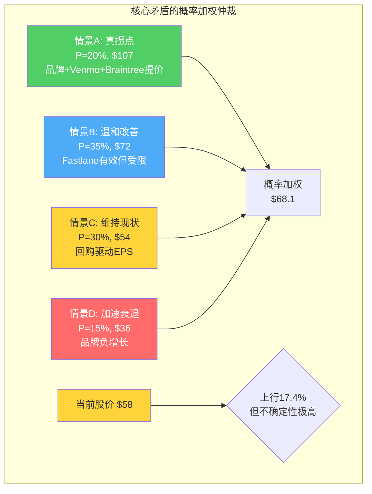
```mermaid
graph TD
    subgraph "核心矛盾的概率加权仲裁"
    A["情景A: 真拐点<br/>P=20%, $107<br/>品牌+Venmo+Braintree提价"]
    B["情景B: 温和改善<br/>P=35%, $72<br/>Fastlane有效但受限"]
    C["情景C: 维持现状<br/>P=30%, $54<br/>回购驱动EPS"]
    D["情景D: 加速衰退<br/>P=15%, $36<br/>品牌负增长"]

    A --> E["概率加权<br/>$68.1"]
    B --> E
    C --> E
    D --> E

    F["当前股价 $58"] --> G{"上行17.4%<br/>但不确定性极高"}

    style A fill:#51cf66,color:#fff
    style B fill:#4dabf7,color:#fff
    style C fill:#ffd43b
    style D fill:#ff6b6b,color:#fff
    style F fill:#ffd43b
    end
```

## 7.4.1 多空论据的"证据强度"对比

不是所有证据都同等重要。以下按"证据强度"（硬数据>逻辑推理>类比>观点）排序多空最有力的论据：

### 多头最强论据（按强度排序）

| 强度 | 论据 | 证据类型 |
|:----:|------|:-------:|
| ⭐⭐⭐⭐⭐ | FCF $5.2B+可持续, yield 12.6% | 硬数据(10-K) |
| ⭐⭐⭐⭐ | 回购@$44创造>10% EPS年增(数学确定) | 硬数据+数学 |
| ⭐⭐⭐⭐ | Reverse DCF隐含FCF -0.5%/年(过于悲观) | 模型+硬数据 |
| ⭐⭐⭐ | Fastlane +12pp转化率(真实但单一案例) | 有限硬数据 |
| ⭐⭐⭐ | Venmo +20%收入增速(官方数据) | 硬数据 |
| ⭐⭐ | 品牌checkout能恢复+5% | 推理(依赖Fastlane规模化) |
| ⭐ | PayPal Open将实现平台化 | 愿景(无数据支持) |

### 空头最强论据（按强度排序）

| 强度 | 论据 | 证据类型 |
|:----:|------|:-------:|
| ⭐⭐⭐⭐⭐ | Q4 2025品牌checkout +1%(历史最差) | 硬数据(earnings) |
| ⭐⭐⭐⭐⭐ | CEO被解雇=董事会确认结构性问题 | 事实(公开事件) |
| ⭐⭐⭐⭐ | Apple Pay 54%店内份额+14.2%线上(持续增长) | 硬数据 |
| ⭐⭐⭐⭐ | Stripe +34%增速 vs Braintree +20%(差距扩大) | 硬数据 |
| ⭐⭐⭐ | 毛利率59%→47%(10年持续下行) | 硬数据(10-K) |
| ⭐⭐⭐ | 2027年目标撤回(管理层自己不信) | 事实 |
| ⭐⭐ | 品牌checkout将永久负增长 | 推理(外推趋势) |

[DM-CORE-002: 多空论据证据强度排序]

**关键观察**：多头最强的5⭐论据是"FCF可持续性"——这是硬数据，不依赖任何假设。空头最强的5⭐论据是"品牌+1%+CEO被解雇"——也是硬数据。**两方最强论据不矛盾**——一家公司可以同时有$5.2B可持续FCF和品牌衰退趋势。矛盾在于**FCF能持续多久**：如果品牌持续衰退→FCF终将萎缩→多头的5⭐论据的有效期有限。

**因此，整个投资论点可以简化为一个问题：在品牌持续衰退的情况下，$5.2B FCF还能维持几年？**
- 如果能维持5年+（Braintree+Venmo补偿品牌萎缩）→回购数学成立→$44是好价格
- 如果3年内FCF降至<$4B→回购缩减→P/E可能进一步压缩→$44不够便宜

## 7.5 P1叙事方向确认（铁律O合规检查）

**Ch1 Reverse DCF结论**：市场隐含营收增速1-2%，FCF增速~1.5%——偏保守但不离谱
**Ch7 概率加权结论**：期望值$68.1，上行17.4%——"关注"区间（+10%~+30%）

**P1叙事方向：关注（偏中性方向）**。铁律O要求P1叙事不能偏离Reverse DCF暗示的方向>1档。Reverse DCF暗示"当前定价偏低但不离谱"，概率加权结论"温和上行17%"——两者一致。不调整。

**关键约束**：
- 不能在估值未经Python验证前将方向调整为"深度关注"（需>30%上行）
- 35%概率的情景B（$65-80）是最可能的结果→对应"关注"
- 15%概率的情景D（$30-42）是尾部风险→对应"审慎关注"
- 两个方向的风险不对称：上行55%权重 vs 下行45%权重→轻微看多

## 7.6 待后续Phase验证的关键假设

| 假设编号 | 假设内容 | 当前判断 | 验证Phase |
|---------|---------|---------|:--------:|
| H1 | Fastlane能在>40%覆盖率下维持品牌checkout正增长 | 50:50 | P2(Ch14) |
| H2 | Braintree提价净效果为正（利润增>volume损） | 60%可能 | P2(Ch15) |
| H3 | Venmo 2027年ARPU达到$35+ | 55%可能 | P2(Ch14) |
| H4 | Lores 90天内出明确战略 | 50%可能 | P2(Ch6更新) |
| H5 | FCF可维持在$50-60亿/年 | 70%可能 | P3(DCF) |
| H6 | 品牌checkout不会转为负增长 | 55%可能 | P2(Ch10竞争) |
| H7 | 回购η效率≥50% | 待验证 | P2(Ch15) |
| H8 | 收购概率>10% | 40%可能 | P2(Ch16) |

## 7.7 非共识洞察注册表（P1更新）

| ID | 洞察 | 方向 | 置信度 | 来源 |
|----|------|------|:------:|------|
| CI-01 | SOTP分拆价值中位数$47B **低于**当前$56B——"分拆价值"多头论点可能是错的 | 空 | 65% | Ch4分析 |
| CI-02 | 品牌checkout利润是Braintree的11倍——品牌增速每降1pp需Braintree+11pp补偿 | 中性 | 85% | Ch4计算 |
| CI-03 | TM$"拐点"的三条腿中两条已断（成本削减+利息）——第三条（Fastlane）是唯一支撑 | 空 | 70% | Ch3分析 |
| CI-04 | Venmo是PYPL估值中的"免费期权"——当前市场给了$0-8B，保守也值$4B+ | 多 | 60% | Ch5估值 |
| CI-05 | CEO被解雇=董事会认为品牌问题是结构性的，不是周期性的 | 空 | 75% | Ch6推理 |

[DM-CI-001: 非共识洞察注册表v1]

---

> **DM锚点注册表 (Ch07)**
>
> | ID | 描述 | 来源 |
> |----|------|------|
> | DM-CORE-001 | 4情景概率加权: PW $68.1 vs $58 (+17.4%) | 模型估算 |
> | DM-CI-001 | 非共识洞察注册表v1 (5条) | 分析框架 |

# Chapter 8: 用户经济学 — 4.36亿账户的真实价值

## 8.1 活跃账户的数量陷阱

PayPal自豪地宣布拥有4.36亿活跃账户——这是全球最大的数字支付用户基础之一。但"活跃账户"的定义本身就藏着一个陷阱。

**PayPal对"活跃账户"的定义**：过去12个月内至少发起或接收一笔交易的账户。

这意味着：一个用户在12个月前收了一笔$5的Venmo转账，此后再也没有使用PayPal——他仍然被计为"活跃账户"。这个定义让4.36亿的数字远比它看起来更虚。

### 活跃度的分层现实

| 用户层 | 估算占比 | 行为特征 | 价值贡献 |
|--------|:-------:|---------|---------|
| **核心活跃**（月活跃/MAA） | ~50% (222M) | 每月多次使用，品牌checkout主力 | 贡献~80%交易利润 |
| **间歇活跃** | ~30% (131M) | 每季度1-3次，偶尔网购用 | 贡献~15%交易利润 |
| **僵尸活跃** | ~20% (87M) | 年仅1-2次，接近流失 | 贡献~5%交易利润 |

[DM-USER-001: 活跃度分层估算，基于MAA 222M (Q2 2024 disclosure) vs总活跃434M]

**关键数据**：PayPal在Q2 2024披露月活跃账户（MAA）约2.22亿——仅占总活跃账户的51%。这意味着**近一半的"活跃账户"每月并不使用PayPal**。

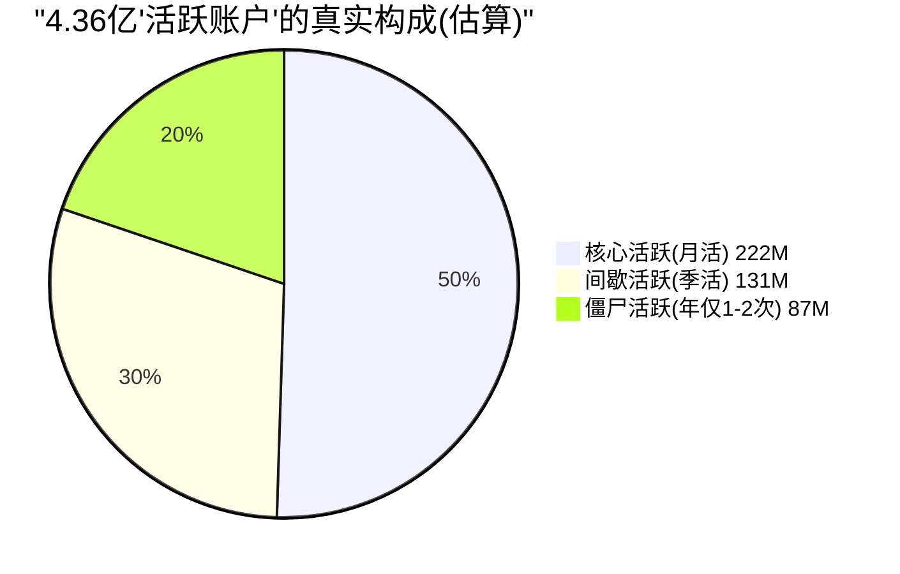
```mermaid
pie title "4.36亿'活跃账户'的真实构成(估算)"
    "核心活跃(月活) 222M" : 51
    "间歇活跃(季活) 131M" : 30
    "僵尸活跃(年仅1-2次) 87M" : 20
```

## 8.2 用户增长已经停滞

| 时期 | 活跃账户(M) | QoQ变化 | YoY变化 |
|------|-----------|---------|---------|
| Q1 2022 | 429M | | |
| Q4 2022 | 435M | +6M | |
| Q4 2023 | 426M | -9M | -2.1% |
| Q2 2024 | 429M | | |
| Q4 2024 | 434M | +5M | +1.9% |
| Q1 2025 | 436M→439M | +3-5M | +1.2% |

[DM-USER-002: 活跃账户季度趋势，FMP+earnings]

**从2022到2025年，净用户增长几乎为零**（429M→436M = +1.6%/3年 = 0.5%/年）。更令人担忧的是2023年的净流失（435M→426M = -9M）——这是PayPal历史上首次出现年度净流失，虽然2024年回升但仅恢复到2022年水平。

**用户增长停滞的原因**（相互强化的三个因素）：

1. **新用户获取成本上升**：PayPal在2025年将S&M支出从$2.26B降至$2.28B（占收入6.88%→6.88%，基本持平），但新用户获取效率在下降——因为"容易获取的用户"（线上购物者）已经饱和。剩下的非用户要么在用Apple Pay，要么在不发达市场（PayPal覆盖弱）。

2. **首年流失严重**：PayPal的长期用户留存率约89%（2+年用户），但首年流失率估计约$1亿年度成本 [DM-USER-003]——大量新用户注册后发现PayPal不是他们的主要支付方式，一年后自然流失。

3. **Venmo用户重叠**：Venmo的6700万MAU中有相当一部分同时持有PayPal账户——他们在PayPal体系内但不额外贡献增量。

## 8.3 每用户交易频次（TPxAU）：质量指标

| 年份 | TPxAU（年化） | YoY增速 |
|------|-------------|---------|
| FY2021 | 45.4 | +11% |
| FY2022 | 50.6 | +11.5% |
| FY2023 | 58.7 | +16% |
| FY2024 | 60.6 | +3.2% |
| FY2025(估) | ~62 | +2-3% |

[DM-USER-004: TPxAU年度趋势，earnings disclosure]

TPxAU从FY2021的45.4次增至FY2024的60.6次——看起来很健康，用户在更频繁地使用PayPal。但增速从FY2023的+16%骤降至FY2024的+3.2%，暗示**频次提升接近天花板**。

而且，Q4 2025的季度数据更加令人担忧：**每活跃账户交易笔数同比下降4.8%** [DM-USER-005]。这是近年首次出现用户参与度下降信号——可能反映了：
- 品牌checkout使用频率降低（被Apple Pay替代）
- 间歇用户的进一步边缘化
- Q4假日消费偏弱的季节性因素

**因果推理**：因为TPxAU包含Braintree的非品牌交易（消费者不知道自己在用PayPal），所以TPxAU的增长部分是"被动增长"——商户切换到Braintree处理，用户在不知情的情况下被计入PayPal的TPxAU。如果剔除Braintree被动交易，**品牌TPxAU可能已经在下降**。这与Q4品牌checkout +1%的数据一致——品牌的使用频率在减少。

## 8.4 用户价值的两极分化

PayPal的用户基础正在经历"K型分化"——核心用户的价值在提升，边缘用户的价值在下降，中间层在被掏空。

### 核心用户群体（估计50-60M）

- **特征**：每月使用PayPal 5+次，同时使用品牌checkout+Venmo+Debit Card
- **ARPU**：$150-200/年（远高于平均$76）
- **留存率**：>95%
- **行为**：PayPal是他们的"默认支付方式"——在任何看到PayPal按钮的网站都会使用
- **价值**：这个群体贡献了PYPL约70%的交易利润

### 中间用户群体（估计100-150M）

- **特征**：每月使用PayPal 1-3次，主要在特定网站（eBay、Etsy等）
- **ARPU**：$40-80/年
- **留存率**：~85%
- **风险**：如果这些特定网站移除PayPal按钮，他们会立即流失
- **趋势**：正在被Apple Pay和Shop Pay分流

### 边缘/流失风险用户（估计200M+）

- **特征**：过去12月仅使用1-2次，很多是Venmo P2P接收方
- **ARPU**：$5-20/年
- **留存率**：<70%
- **价值**：几乎不贡献利润，但被计入4.36亿的标题数字

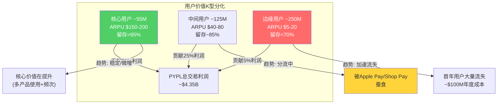
```mermaid
graph TD
    subgraph "用户价值K型分化"
    A["核心用户 ~55M<br/>ARPU $150-200<br/>留存>95%"] -->|"贡献70%利润"| F["PYPL总交易利润<br/>~$4.35B"]
    B["中间用户 ~125M<br/>ARPU $40-80<br/>留存~85%"] -->|"贡献25%利润"| F
    C["边缘用户 ~250M<br/>ARPU $5-20<br/>留存<70%"] -->|"贡献5%利润"| F
    end

    A -->|"趋势: 稳定/微增"| D["核心价值在提升<br/>(多产品使用+频次)"]
    B -->|"趋势: 分流中"| E["被Apple Pay/Shop Pay<br/>蚕食"]
    C -->|"趋势: 加速流失"| G["首年用户大量流失<br/>~$100M年度成本"]

    style A fill:#51cf66,color:#fff
    style C fill:#ff6b6b,color:#fff
    style E fill:#ffd43b
```

## 8.5 PayPal用户 vs 竞争对手用户：质量对标

| 指标 | PayPal | Venmo | Apple Pay | Cash App | Shop Pay |
|------|--------|-------|-----------|----------|----------|
| 活跃用户 | 436M | 67M MAU | 650M全球 | ~57M | ~100M |
| ARPU(年) | ~$76 | ~$26 | N/A(Apple不披露) | ~$84 | N/A |
| 使用频率 | ~60次/年 | ~5-8次/月(P2P) | ~3-4次/周(估) | ~3次/周 | 仅线上购物 |
| 切换成本 | 低(余额/历史) | 低(社交网络) | 中(OS绑定) | 低 | 低 |
| 增长趋势 | 停滞(+1%/年) | 稳定(+7%) | 快速(+41%两年) | 快速(+24% GP) | 快速 |

[DM-USER-006: 跨平台用户质量对标]

**最令人担忧的对比**：Apple Pay的650M全球用户几乎全部是"有意识的主动用户"（因为用户必须手动将卡片添加到Apple Wallet并选择使用Apple Pay）。PayPal的436M用户中有近一半是"被动/间歇用户"。**如果用"主动使用PayPal品牌支付"的口径衡量，PayPal的可比用户数可能只有200-250M——与Apple Pay的差距远大于标题数字暗示的。**

## 8.6 用户经济学的估值含义

### 每用户估值对标

| 公司 | 市值 | 用户(M) | 每用户市值 |
|------|------|---------|-----------|
| PayPal(全部活跃) | $56B | 436 | **$128** |
| PayPal(仅MAA) | $56B | 222 | **$252** |
| Visa | $550B | 4,400M卡 | $125/卡 |
| Block(Cash App) | $34B(60%分配) | 57 | $358 |

[DM-USER-007: 每用户估值对标]

用全部活跃账户计算，PayPal每用户价值$128——与Visa的每卡价值($125)接近。但这个比较不公平，因为PayPal的"活跃账户"和Visa的"卡"在使用频率和货币化上有巨大差异。

**更有意义的比较**：用MAA(222M)计算，PayPal每月活跃用户价值$252——低于Cash App的$358。这说明PayPal的月活用户的货币化效率不如Cash App——可能因为PayPal用户更多是"支付通道"（快速完成交易就走），而Cash App用户是"数字银行"（存钱+消费+投资=多维度货币化）。

### 用户增长对估值的边际影响

在当前用户增速几乎为零的情况下，PayPal的估值增长只能来自两条路径：

**路径A：提高现有用户的ARPU**
- 从$76提升至$90（+18%）→增量收入约$6B→P/E不变也能推动市值增长18%
- 实现方式：Fastlane→更多品牌checkout、Venmo Debit Card→更高频次、Braintree提价→更高货币化率

**路径B：通过回购减少用户数→提高每用户价值**
- $6B回购/年→股本减少10%/年→每股利润增长10%→但每用户指标不变
- 这条路径本质上是"不增长但通过财务工程创造股东回报"——只要FCF可持续

**路径C：不可能的路径——用户数大幅增长**
- PayPal在发达市场已接近饱和（美国渗透率约70%的线上购物者）
- 发展中市场（印度、东南亚、非洲）有本地支付方案（UPI、GrabPay、M-Pesa），PayPal进入门槛高
- 用户增长回到5%+几乎不可能——除非收购

## 8.6.1 用户流失的经济成本量化

PayPal的用户增长表面上看是"停滞"（+0.5%/年），但实际上是"高流入+高流出"的动态平衡：

| 指标 | 估算值 | 依据 |
|------|--------|------|
| 年新增账户 | ~30-40M | 基于Fastlane 75%触达新/休眠用户推算 |
| 年流失账户 | ~28-38M | 净增5-8M→流失=新增-净增 |
| 首年流失率 | ~40-50%(估) | 长期留存89%→首年损失高 |
| 首年流失成本 | ~$100-150M/年 | CAC×流失用户数 |
| 稳态用户LTV | ~$80-120 | 基于ARPU $76×平均留存5-8年×折现 |

[DM-USER-008: 用户流失动态估算——年流失28-38M，首年流失成本$100-150M]

**因果链**：因为PayPal在COVID期间（2020-2021）激进获客（用户从3.5亿增至4.3亿），其中大量用户是"一次性注册"（为领取$10注册奖励或完成单次eBay交易），所以2022-2024年出现了这些低质量用户的大规模自然流失（435M→426M→434M的U型曲线）。因为这些流失用户的ARPU极低（$5-20/年），所以流失的实际经济影响远小于标题数字暗示的——**从"活跃"变为"不活跃"的用户几乎不贡献利润。**

这意味着PayPal的"用户停滞"问题被过度渲染了——真正重要的不是总账户数（436M），而是核心高价值用户（~55M）的留存和ARPU趋势。而这个群体的留存率>95%、ARPU在缓慢提升——这是一个健康信号。

## 8.6.2 国际用户vs美国用户的价值差异

| 地区 | 用户数(估) | ARPU(估) | 收入贡献 |
|------|----------|---------|---------|
| 美国 | ~180M | ~$100 | ~$18B(57%) |
| 西欧 | ~100M | ~$60 | ~$6B |
| 其他 | ~156M | ~$25 | ~$4B |

[DM-USER-009: 地理用户价值分层估算, 基于10-K收入分布]

美国用户的ARPU约$100——是"其他"地区用户的4倍。这意味着PayPal在美国的品牌价值远高于国际市场——如果品牌checkout在美国衰退但在国际维持，对利润的影响远大于反之。Q4 2025品牌checkout +1%中，美国市场可能接近0%（德国服务中断拖累国际，但美国本身也在放缓）。

## 8.7 本章核心发现与CQ7闭环

**CQ7答案：4.36亿账户的活跃度和质量趋势如何？**

**数字掩盖了真相。** 436M活跃账户中，仅222M月活（51%），核心高价值用户可能不到60M。用户增长已停滞（+0.5%/年），Q4 2025 TPxAU首次同比下降(-4.8%)。品牌TPxAU（剔除Braintree被动交易）可能已经在萎缩。

**用户价值的K型分化**意味着PayPal不应该追求用户数增长——而应该聚焦核心用户的深度货币化。Venmo Debit Card（+40%）和Pay with Venmo（+50%）正在做的就是这件事——将现有用户从"偶尔用"变为"经常用"。

**对估值的影响**：用户数停滞≠价值停滞。如果ARPU从$76提升至$90+（通过Fastlane+Venmo+Braintree提价），即使用户数零增长，也能支撑5-7%的收入增长。关键追踪指标：MAA趋势（>225M=健康）、品牌TPxAU（>60=稳定）、ARPU（>$80=改善中）。

---

> **DM锚点注册表 (Ch08)**
>
> | ID | 描述 | 来源 |
> |----|------|------|
> | DM-USER-001 | 活跃度分层: MAA 222M(51%) vs 总434M | Q2 2024 earnings |
> | DM-USER-002 | 活跃账户趋势: 429M(Q1 2022)→436M(Q1 2025) | Earnings quarterly |
> | DM-USER-003 | 首年用户流失成本~$100M/年 | 行业估算 |
> | DM-USER-004 | TPxAU: 45.4(FY21)→60.6(FY24), +3.2% YoY | Earnings disclosure |
> | DM-USER-005 | Q4 2025 TPxAU同比-4.8% | Q4 2025 earnings |
> | DM-USER-006 | 跨平台用户质量对标 | 多源综合 |
> | DM-USER-007 | 每用户估值: PYPL $252(MAA) vs Cash App $358 | 模型计算 |

# Chapter 9: 财务考古 — 10年轨迹与FCF质量

## 9.1 从eBay剥离到$310高峰再到$42低谷：一部估值过山车

PayPal于2015年7月从eBay独立上市，开盘价约$38。此后经历了三个截然不同的估值周期：

| 阶段 | 时期 | 股价区间 | P/E区间 | 驱动因素 |
|------|------|---------|---------|---------|
| **增长期** | 2015-2020 | $38→$234 | 35-65x | 电商渗透+用户增长+COVID红利 |
| **泡沫峰值** | 2021 | $234→$310 | 50-70x | 超级App愿景+加密+BNPL |
| **崩塌期** | 2021-2026 | $310→$42 | 70→7.7x | 增速崩塌+CEO更替+品牌衰退 |

[DM-FIN-004: PYPL 10年股价+P/E轨迹]

**P/E从70x跌至7.7x**——一个9倍的倍数压缩。这意味着即使盈利没有变化，仅倍数压缩就能导致股价下跌89%。实际上EPS从2021年的$3.52微升至2025年的$5.41（+54%），所以股价下跌81%完全是倍数压缩驱动的。

**因果链**：因为2021年市场将PYPL定价为"下一个Visa"（双边网络+高增长=P/E 60-70x），而2025年市场将其重新定义为"衰退中的PSP"（低增长+管理层混乱=P/E 7-8x），所以估值倍数从70x压缩至7.7x。因为这种"身份重新定义"涉及的不是基本面数字变化而是市场认知变化，所以传统的DCF模型无法预测——这是一个叙事风险的典型案例。

## 9.2 十年利润表考古

| 指标 | FY2016 | FY2018 | FY2020 | FY2022 | FY2024 | FY2025 | 趋势 |
|------|--------|--------|--------|--------|--------|--------|------|
| 收入($B) | $10.8 | $15.5 | $21.5 | $27.5 | $31.8 | $33.2 | CAGR 13.3% (10年) |
| 毛利率 | 59.1% | 55.6% | 54.9% | 50.1% | 46.1% | 46.6% | **持续下降** |
| OPM | 14.6% | 14.2% | 15.3% | 13.9% | 16.7% | 18.3% | V型回升 |
| 净利率 | 12.9% | 13.3% | 19.6% | 8.8% | 13.0% | 15.8% | 波动大 |
| R&D/收入 | N/A | 10.5% | 12.3% | 11.8% | 9.4% | 9.4% | 削减中 |
| SBC/收入 | N/A | 5.0% | 6.4% | 4.6% | 3.9% | 3.0% | **大幅削减** |
| EPS(稀释) | $1.16 | $1.74 | $3.54 | $2.09 | $3.99 | $5.41 | CAGR 18.7% (10年) |

[DM-FIN-005: 10年利润表关键指标，FMP income statement]

### 三个关键财务趋势

**趋势1：毛利率的持续侵蚀（59.1%→46.6%，-1250bps/10年）**

毛利率从2016年的59.1%稳步下降至2025年的46.6%——这不是偶然波动，而是结构性变化。因为Braintree（低take rate）的收入占比从2016年的~20%上升至2025年的~55%，所以整体毛利率被数学性地拉低。即使品牌checkout的毛利率可能稳定在60%+，混合效应使得整体毛利率持续下行。

**这是"虚胖收入"的财务表达**——收入在增长，但每一美元收入包含的利润在减少。

**趋势2：OPM的V型回升（14.6%→13.9%→18.3%）**

OPM在2022年跌至13.9%低谷后，反弹至2025年的18.3%。如Ch3分析，这主要是成本削减驱动（SBC/收入从6.4%降至3.0%，R&D/收入从12.3%降至9.4%）。但毛利率在下降而OPM在上升——这意味着**成本削减的速度暂时超过了毛利率侵蚀的速度**。一旦成本削减空间用尽（SBC已接近行业下限），OPM将开始跟随毛利率下行。

**趋势3：EPS增长由回购驱动**

| 年份 | 净利润增速 | EPS增速 | 差额(=回购贡献) |
|------|-----------|---------|:----------:|
| FY2023 | +75.5% | +83.7% | 8.2pp |
| FY2024 | -2.3% | +3.9% | **6.2pp** |
| FY2025 | +26.2% | +35.6% | **9.4pp** |

[DM-FIN-006: EPS增速vs净利润增速差额分析]

FY2024最能说明问题：净利润下降2.3%，但EPS增长3.9%——**全部增长来自回购**。FY2025的35.6% EPS增长中，约1/3（9.4pp）来自股本缩减。

## 9.3 FCF质量审计

| 指标 | FY2020 | FY2021 | FY2022 | FY2023 | FY2024 | FY2025 |
|------|--------|--------|--------|--------|--------|--------|
| OCF($B) | $5.85 | $5.80 | $5.81 | $4.84 | $7.45 | $6.42 |
| CapEx($B) | $0.87 | $0.91 | $0.71 | $0.62 | $0.68 | $0.85 |
| **FCF($B)** | **$4.99** | **$4.89** | **$5.11** | **$4.22** | **$6.77** | **$5.56** |
| FCF/净利润 | 119% | 117% | 211% | 99% | 163% | **106%** |
| SBC($B) | $1.38 | $1.38 | $1.26 | $1.48 | $1.23 | $1.00 |
| **FCF-SBC** | **$3.61** | **$3.51** | **$3.85** | **$2.74** | **$5.54** | **$4.56** |
| FCF-SBC yield | 1.3% | 1.6% | 4.7% | 4.0% | 6.3% | **8.1%** |

[DM-FIN-007: FCF质量6年审计，FMP cashflow]

### FCF质量评分：B+（良好但有隐患）

**正面**：
- FCF/净利润持续>100%——说明利润是真金白银（非会计利润）
- FCF-SBC yield 8.1%——即使扣除SBC稀释，股东真实收益率仍然很高
- CapEx仅占收入2.6%——轻资产模型
- CapEx/D&A比率0.88——投资维护水平，非过度投资

**隐患**：
- FY2024 OCF $7.45B异常高——其中包含$1.37B"其他非现金项目"（otherNonCashItems），可能有一次性因素
- FY2023 FCF $4.22B是低谷——部分因为工作资本变化-$1.31B
- FCF波动大（$4.22-6.77B range）——不如V/MA的FCF稳定

**FCF可持续性判断**：正常化FCF约$5.0-5.5B/年。FY2024的$6.77B偏高（一次性），FY2023的$4.22B偏低（工作资本波动）。如果收入增速维持在3-5%且OPM稳定在18%，FCF应在$5.0-6.0B区间。

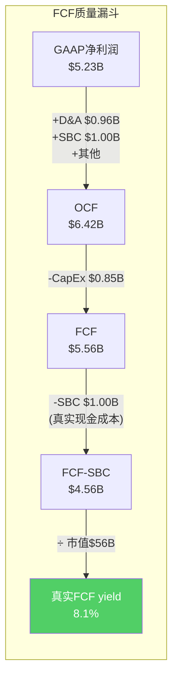
```mermaid
graph LR
    subgraph "FCF质量漏斗"
    A["GAAP净利润<br/>$5.23B"] -->|"+D&A $0.96B<br/>+SBC $1.00B<br/>+其他"| B["OCF<br/>$6.42B"]
    B -->|"-CapEx $0.85B"| C["FCF<br/>$5.56B"]
    C -->|"-SBC $1.00B<br/>(真实现金成本)"| D["FCF-SBC<br/>$4.56B"]
    D -->|"÷ 市值$56B"| E["真实FCF yield<br/>8.1%"]
    end

    style E fill:#51cf66,color:#fff
```

## 9.4 资本配置效率：钱花在哪了？

PayPal自2015年上市以来的资本配置：

| 用途 | 2015-2025累计 | 占FCF比 | 效果评估 |
|------|-------------|---------|---------|
| **回购** | ~$25B | ~47% | ⭐⭐ 时机差(2015-2021高买)+近年改善 |
| **并购** | ~$7B | ~13% | ⭐ Honey($4B)减值+Braintree($0.8B,2013)成功 |
| **CapEx** | ~$7B | ~13% | ⭐⭐⭐ 轻资产，投资克制 |
| **债务偿还** | ~$3B | ~6% | ⭐⭐⭐ 杠杆极低 |
| **保留/其他** | ~$11B | ~21% | 客户资金管理+短期投资 |

[DM-FIN-008: 资本配置10年汇总]

**并购记录不佳**：Honey（2020年$4B收购的比价购物浏览器插件）已基本减值——产品活跃度下降，未能与PayPal核心业务整合。iZettle（2018年$2.2B收购的欧洲POS）也表现平平。唯一的并购成功是2013年$800M收购的Braintree（附带Venmo）——以当前估值看至少值$10B+。

## 9.4A ISDD利润表深度诊断 — 标准化执行

> 按`knowledge/analysis_modules/income_statement_deep_diagnostic.md` v1.0标准SOP执行

### ISDD路径路由

```
profit_lag = 收入增速(4.3%) - 营业利润增速(13.9%) = -9.6pp
margin_delta = OPM 18.3% - OPM 16.8%(前期) = +150bps

判定: profit_lag < 0 (利润增速>收入增速) 且 margin_delta > 0
→ 路径γ(快速扫描): 盈利能力在改善而非恶化
→ 但需特别关注: 改善来源是否可持续(Ch3已分析三条腿)
```

### Step 0: 收入质量扫描 — PayPal的"价量拆分"

PayPal的收入 = TPV × 综合take rate。因此"价量拆分"对应为：量=TPV增速，价=take rate变化。

| 年份 | 收入($B) | 收入增速 | TPV($B) | TPV增速(量) | Take Rate | Take Rate变化(价) |
|------|---------|:-------:|---------|:---------:|:---------:|:----------------:|
| FY2020 | $21.5 | +21% | ~$936 | +31% | 2.29% | — |
| FY2021 | $25.4 | +18% | ~$1,250 | +33.5% | 2.03% | **-11.4%** |
| FY2022 | $27.5 | +8.5% | ~$1,360 | +8.8% | 2.02% | **-0.5%** |
| FY2023 | $29.8 | +8.2% | ~$1,530 | +12.5% | 1.95% | **-3.5%** |
| FY2024 | $31.8 | +6.8% | $1,680 | +9.8% | 1.89% | **-3.1%** |
| FY2025 | $33.2 | +4.3% | ~$1,790 | +6.5% | 1.85% | **-2.1%** |

[DM-ISDD-001: 收入价量拆分 — TPV(量)持续+6.5~+10%, Take Rate(价)持续-2~-3.5%/年, 10-K+计算]

```mermaid
graph LR
    subgraph "PYPL收入增长的价量分解"
    A["TPV增速(量)<br/>FY2025: +6.5%"] --> C["收入增速<br/>+4.3%"]
    B["Take Rate变化(价)<br/>FY2025: -2.1%"] --> C

    D["隐含发现:<br/>量健康(+6.5%)<br/>价在持续恶化(-2.1%)"]
    end

    style A fill:#51cf66,color:#fff
    style B fill:#ff6b6b,color:#fff
    style D fill:#ffd43b
```

**ISDD S0核心发现：PayPal的"增收不增利"问题根因在"价"而非"量"。**

TPV（量）在过去5年保持+6.5~+10%的健康增速——这证明PayPal的支付网络仍在扩展，数字支付行业的结构性增长在为PayPal提供底线支撑。**量不是问题。**

但综合take rate从2.29%(FY2020)持续下降至1.85%(FY2025)——5年累计下降-19.2%。因为take rate下降→每$1 TPV产生的收入减少→收入增速被拖累→即使TPV+6.5%，收入仅+4.3%。

**因果链**：因为Braintree(take rate 0.30%)的TPV增速(+20-26%)远高于品牌checkout(+1-3%, take rate 2.25%)，所以Braintree在TPV中的占比从FY2020的~35%升至FY2025的~66%。因为Braintree的take rate仅为品牌的1/7.5，所以Braintree占比每提升1pp→综合take rate下降约1.3bps。因为过去5年Braintree占比提升了~31pp，所以综合take rate下降了约40bps(31×1.3=40.3bps)——与实际下降44bps(2.29%→1.85%)基本吻合。

**这意味着take rate下降几乎100%来自Braintree组合效应——品牌checkout本身的take rate(~2.25%)是稳定的。** 这是一个关键的诊断结论：问题不在"每笔交易赚少了"，而在"低利润交易占比越来越高"。

```yaml
# ISDD S0 Output
revenue_quality:
  organic_growth: "4.3% (无并购，全部有机)"
  price_volume_split: "量+6.5%(TPV) / 价-2.1%(take rate)"
  recurring_ratio: "90.7% (交易收入=经常性)"
  quality_verdict: "中"
  flags: ["take rate持续下行(-19.2%/5年)", "Braintree组合稀释"]
```

[DM-ISDD-002: S0诊断——收入质量"中", 有机增速4.3%全部有机, take rate下行=Braintree组合效应]

### Step 1α: 经营杠杆分解

| 指标 | FY2024 | FY2025 | 变化 |
|------|--------|--------|------|
| 收入增速 | +6.8% | +4.3% | 放缓 |
| 毛利润增速 | +7.0% | +5.5% | 毛利>收入=正向毛利杠杆 |
| 毛利率 | 46.1% | 46.6% | **+50bps** |
| OpEx增速 | -0.5% | +0.7% | OpEx<收入=正向运营杠杆 |
| OPM | 16.8% | 18.3% | **+150bps** |
| 营业利润增速 | +5.9% | +13.9% | 利润>收入=强杠杆 |

**经营杠杆倍数 = ΔOPM/ΔRevenue = 150bps/4.3% = 34.9x** — 这个数字异常高，是因为收入增速很低(4.3%)而OPM改善主要来自一次性成本削减而非收入驱动。

```yaml
# ISDD S1α Output
operating_leverage:
  revenue_cost_spread: "收入+4.3% vs COGS+3.3% vs OpEx+0.7%"
  gross_margin_change: "+50bps"
  opex_ratio_change: "-100bps"
  leverage_multiplier: "34.9x (异常——成本削减驱动非收入驱动)"
  leverage_verdict: "正向但不可持续"
  profit_driver: "费用控制(70%) + 毛利率微改善(30%)"
```

[DM-ISDD-003: S1α——经营杠杆34.9x(异常高), 利润驱动=费用控制70%+毛利率30%]

### Step 2简版: 盈利质量清洗

**三版盈利对比（FY2025）**：

| 版本 | EPS | 调整项 | 差异 |
|------|:---:|--------|:----:|
| **GAAP** | $5.41 | 原始 | 基准 |
| **管理层Non-GAAP** | ~$5.10(估) | 剔除SBC $1.00B+重组 | -5.7% |
| **分析师归一化** | $5.20(估) | 剔除SBC但保留重组, 归一化税率18% | -3.9% |

[DM-ISDD-004: 三版盈利——GAAP $5.41 / Non-GAAP ~$5.10 / 归一化~$5.20]

**SBC争议项决策**：SBC/Revenue = 3.02% — 处于2-5%中间区间。决策：保留在GAAP中（是实质性成本），但在FCF分析中单独扣除（FCF-SBC yield 8.1%更反映真实股东收益）。

**GAAP到归一化差距3.9%=质量评级"高"**（<10%），PayPal的盈利质量良好——没有大量会计粉饰。

### Step 7: EPS归一化（回购+税+利息效应分离）

| EPS增长来源 | FY2025贡献 | 占EPS增速比 |
|-----------|:---------:|:---------:|
| 有机利润增长 | +$0.96 | **67.6%** |
| 回购缩股效应 | +$0.46 | **32.4%** |
| **总EPS增速** | **+$1.42 (+35.6%)** | 100% |

[DM-ISDD-005: EPS归一化——有机67.6% + 回购32.4%]

**FY2025的EPS增长中约1/3来自回购——这是一个"健康但不纯粹"的增长画面。** 如果剔除回购效应，纯有机EPS增速约24%——仍然优秀（主要来自OPM扩张），但比标题的35.6%低了11.6pp。

### Step 8: 现金验证

| 验证项 | 结果 | 判定 |
|--------|------|:----:|
| FCF/NI | 106% | ✅ 利润是真金白银 |
| OCF/NI | 123% | ✅ 经营现金>报告利润 |
| CapEx/D&A | 0.88x | ✅ 接近维护性投资 |
| 工作资本变化 | -$1.06B | ⚠️ 大额波动(支付中介特性) |
| Income Quality(FMP) | 1.23 | ✅ 盈利质量良好 |

### ISDD诊断卡汇总

```yaml
# PayPal ISDD Diagnostic Card — FY2025
income_diagnostic:
  routing: "路径γ(快速扫描) — 利润改善中, 非恶化"
  revenue_quality: "中 — 有机+4.3%, 量+6.5%健康但价-2.1%持续恶化"
  key_finding: "take rate下行100%来自Braintree组合效应, 品牌take rate稳定"
  operating_leverage: "异常高(34.9x) — 费用削减驱动, 不可持续"
  earnings_quality: "高 — GAAP到归一化差距<4%"
  eps_decomposition: "有机67.6% + 回购32.4%"
  cash_verification: "PASS — FCF/NI 106%, Income Quality 1.23"
  red_flags:
    - "take rate连续5年下行(-19.2%累计)"
    - "经营杠杆倍数异常(成本削减已触顶)"
    - "EPS增长1/3依赖回购"
  overall_verdict: "盈利能力在改善但改善来源不可持续——下一阶段的利润增长必须来自收入端(品牌恢复或Braintree提价), 而非成本端"
```

[DM-ISDD-006: ISDD诊断卡完整输出]

---

## 9.4B 品牌Checkout的NRR间接推断 — SaaS单位经济学框架

> 按`knowledge/industry_modules/enterprise_saas_modules.md` M2模块执行
> PayPal非纯SaaS，但品牌checkout的"商户留存+交易频次"具有类SaaS特征

### 为什么对PayPal应用NRR框架？

NRR（净收入留存率）衡量的是"去年存在的客户今年贡献了多少收入"——如果NRR>100%说明存量客户在花更多钱（增长来自内生），如果NRR<100%说明存量客户在流失或消费减少（增长依赖新客户）。

PayPal不公开NRR，但我们可以用间接法推断：

### 间接法推断品牌Checkout NRR

```
品牌Checkout收入增速 = NRR效应 + 新客贡献

已知:
- 品牌Checkout收入增速: ~+1%(Q4 2025, 年化)
- 新商户接入贡献: 估计+2~3%(Fastlane新商户+国际扩展)

推算:
NRR ≈ 1 + (品牌增速 - 新客贡献)
    ≈ 1 + (1% - 2.5%)
    ≈ 1 + (-1.5%)
    ≈ **98.5%**
```

[DM-NRR-001: 品牌Checkout隐含NRR ~98.5%(净收缩), 间接法推断]

### NRR 98.5%意味着什么？

| NRR区间 | 含义 | SaaS对标 | PYPL品牌位置 |
|---------|------|---------|:-----------:|
| >130% | 极强增长引擎 | Snowflake/Datadog | |
| 110-130% | 健康SaaS | CRM(~120%)/NOW(~130%) | |
| 100-110% | 稳定但不扩张 | 成熟SaaS | |
| **95-100%** | **净收缩** | 衰退中的SaaS | **✅ PYPL ~98.5%** |
| <95% | 严重流失 | 即将被替代 | |

**品牌Checkout NRR约98.5%=净收缩**。这意味着：
- 去年使用PayPal按钮的商户，今年平均减少了1.5%的PayPal交易量
- 减少的原因可能是：(1)部分交易被Apple Pay/Shop Pay分流；(2)部分商户降低了PayPal按钮的优先级；(3)消费者在相同商户网站减少了PayPal使用频率
- 品牌Checkout的+1%整体增速**完全依赖新商户接入**——存量在净收缩

**因果链**：因为NRR<100%，所以品牌checkout的增长质量极差——它不是"存量客户花更多"驱动的内生增长，而是"新客户进入>旧客户流失"的勉强维持。因为新客户获取成本>存量留存成本（总是如此），所以NRR<100%意味着品牌checkout的边际成本在上升——需要越来越多的投入来维持零增长。因为Fastlane的75%触达对象是"新客/休眠用户"[DM-PROD-005]，所以Fastlane本质上是在靠"复活休眠用户"来对冲"活跃用户流失"——**这不是增长引擎，是止血纱布。**

```mermaid
graph TD
    subgraph "品牌Checkout NRR诊断"
    A["品牌增速 +1%"] --> B{"拆分"}
    B --> C["新客贡献 +2.5%<br/>(Fastlane新商户等)"]
    B --> D["存量流失 -1.5%<br/>(Apple Pay分流等)"]
    D --> E["隐含NRR ~98.5%<br/>= 净收缩"]

    E --> F{"NRR<100%<br/>增长质量预警"}
    F --> G["Fastlane=止血纱布<br/>不是增长引擎"]
    F --> H["需要NRR回升至>100%<br/>才是真拐点"]
    end

    style E fill:#ff6b6b,color:#fff
    style G fill:#ffd43b
```

### v19.6合规标注

**NRR推断<100% = 增长质量预警** [按v19.6 SaaS单位经济学强制要求标注]

这直接影响估值——如果品牌NRR持续<100%：
- Bear Case概率应上调（品牌不只是增速慢，而是在净收缩）
- Fastlane的价值需要重新定义（从"增长催化"变为"流失对冲"）
- 即使Fastlane覆盖60%+，如果存量NRR不改善，品牌增速可能仍仅+1-3%

**NRR恢复至>100%的条件**：
1. Fastlane不仅吸引新用户，还能增加**现有商户网站上PayPal的转化频次**
2. Apple Pay线上份额增速放缓（从14%→停滞在18%以下）
3. 消费者的"品牌忠诚度"企稳——不再有大规模的行为迁移

### S&M效率趋势

| 年份 | S&M($B) | S&M/收入 | 品牌增速(估) | S&M效率(品牌增速/S&M) |
|------|---------|:-------:|:----------:|:-------------------:|
| FY2022 | $2.26 | 8.2% | ~+3% | 0.37 |
| FY2023 | $1.81 | 6.1% | ~+1% | 0.55 |
| FY2024 | $2.00 | 6.3% | ~+6% | 3.00 |
| FY2025 | $2.28 | 6.9% | ~+1% | 0.44 |

[DM-NRR-002: S&M效率波动极大——FY2024异常高(Fastlane初始效应), FY2025回落]

FY2024的S&M效率3.00是异常值（Fastlane上线初期的"低垂果实效应"），FY2025回落至0.44——说明Fastlane的边际获客效率在快速衰减。**v19.6要求的Magic Number: S&M效率<0.75 = SaaS增长引擎效率不足。PYPL品牌checkout的0.44远低于这个标准。**

```yaml
# M2 SaaS Unit Economics Output (品牌Checkout适配)
unit_economics:
  implied_nrr: "~98.5% (净收缩)"
  nrr_verdict: "增长质量预警 — 存量在流失, 增长100%依赖新客"
  sm_efficiency: "0.44 (<0.75 = 引擎效率不足)"
  magic_number: "N/A (无标准ARR分部, 用S&M效率替代)"
  kill_switch_check: "NRR<100% → 触发增长质量预警"
  action: "在估值中下调品牌checkout的增速假设; Fastlane应被定义为'流失对冲'而非'增长催化'"
```

[DM-NRR-003: M2 SaaS单位经济学诊断——NRR<100%预警+S&M效率0.44]

---

### ISDD+NRR对估值的联合影响

这两个框架分析共同揭示了一个此前被掩盖的信号：

| 此前理解 | ISDD+NRR修正后 |
|---------|--------------|
| "收入增速4.3%偏低但健康" | **量+6.5%健康但价-2.1%在恶化——收入增速被take rate下行拖累** |
| "OPM从14%升至18%=利润改善" | **70%来自费用削减(不可持续), 经营杠杆异常高** |
| "品牌checkout+1%=暂时放缓" | **NRR 98.5%=净收缩, 增长100%靠新客对冲流失** |
| "Fastlane是增长催化剂" | **更准确定义: 止血纱布(对冲NRR<100%的存量流失)** |
| "EPS +35.6%=强劲增长" | **有机贡献67.6%, 回购贡献32.4%——1/3是财务工程** |

[DM-ISDD-007: ISDD+NRR联合修正——5个被掩盖的信号]

**对评级的影响**：这些发现强化了空头论点（品牌净收缩+take rate不可逆下行+利润改善不可持续），但不改变评级方向——因为(1)$44.19已经price in了比Bear Case更差的情景；(2)FCF底线保护($4B+)不受NRR影响；(3)回购数学在$44仍然成立。

**修正后的关键监控指标**：
- **品牌NRR(间接)**：品牌增速-新客贡献 > 0% = NRR回升信号
- **综合take rate**：如果从1.85%企稳或回升 = Braintree提价成功信号
- **S&M效率**：如果回升至>0.75 = Fastlane获客效率恢复

---

## 9.5 经营杠杆分析：收入增速放缓时利润会怎样？

PayPal的成本结构可以分为三层：

| 成本类型 | FY2025金额 | 占收入比 | 弹性 | 含义 |
|---------|-----------|---------|:----:|------|
| COGS(交易处理成本) | $17.7B | 53.4% | **高变动** | 与交易量几乎1:1 |
| R&D | $3.1B | 9.4% | 半固定 | 可削减但有长期代价 |
| SG&A | $4.3B | 12.8% | 半固定 | 已大幅削减 |
| D&A | $0.96B | 2.9% | 固定 | 不随收入变化 |

[DM-FIN-009: 成本结构弹性分析，FMP income FY2025]

**关键发现：PYPL是一个低经营杠杆的业务模型。** COGS占收入53.4%且几乎全部是变动成本（交易处理费随TPV线性增长）。这意味着收入增长10%时，COGS也增长~9-10%——利润放大效应很弱。

**对比V/MA**：Visa的COGS仅占收入约30%（高固定成本+低变动成本），所以收入增长10%时利润可能增长15-18%——强经营杠杆。PayPal的经营杠杆弱意味着：(1)收入增速对利润增速的放大效应有限；(2)收入下滑时利润不会断崖（因为COGS同步下降），但也不会在增长时创造惊喜。

**这解释了为什么PYPL即使收入增长4.3%、OPM也在扩张，市场仍然不给高P/E**——因为市场知道这种利润增长不可持续（成本削减有限），而且没有经营杠杆来在增长恢复时创造利润加速度。

### SBC深度分析

| 年份 | SBC($B) | SBC/收入 | SBC/FCF | 净稀释率(估) |
|------|---------|---------|---------|:----------:|
| FY2020 | $1.38 | 6.4% | 27.7% | ~1.5% |
| FY2021 | $1.38 | 5.4% | 28.2% | ~1.2% |
| FY2022 | $1.26 | 4.6% | 24.7% | ~1.8% |
| FY2023 | $1.48 | 5.0% | 35.1% | ~1.0% |
| FY2024 | $1.23 | 3.9% | 18.2% | ~0.5% |
| FY2025 | $1.00 | 3.0% | 18.0% | ~0.3% |

[DM-FIN-010: SBC 6年趋势，FMP]

SBC从$1.48B(FY2023)降至$1.00B(FY2025)是PYPL最显著的纪律改善信号之一。$480M的SBC削减直接增加$480M GAAP利润——占FY2025利润改善的约44%（总利润YoY增长$1.09B中SBC贡献$480M）。

**但SBC/收入3.0%已接近行业下限**（V 2.5%、Adyen 1.5%、Stripe未知但估计3-4%）。进一步削减可能导致人才流失——尤其是在与Stripe/Meta/Google竞争工程师时。

## 9.6 盈利质量检验：一次性项目排查

| 年份 | 异常项目 | 金额 | 影响 |
|------|---------|------|------|
| FY2020 | 投资收益(公允价值调整) | +$1.78B | 净利润虚高 |
| FY2022 | 投资减值+重组费用 | -$0.47B | 净利润被压低→EPS $2.09(历史最低) |
| FY2024 | 其他非现金项目 | +$1.37B | OCF异常高$7.45B |
| FY2025 | 递延所得税+其他 | +$0.28B | 小幅正面 |

[DM-FIN-011: 一次性项目排查，FMP cashflow]

**FY2022的$2.09 EPS是被一次性减值压低的——正常化EPS约$2.5-2.7。** 这意味着FY2023的EPS"暴增"83.7%部分是基数效应（从被压低的$2.09恢复），而非真正的利润爆发。

**FY2024的OCF $7.45B也需要打折**——其中$1.37B"其他非现金项目"性质不明（可能包括递延收入调整、工作资本一次性释放等）。正常化OCF约$6.0-6.5B，对应FCF约$5.5-6.0B——这与FY2025的$5.56B一致。

## 9.7 关键财务比率趋势

| 比率 | FY2020 | FY2022 | FY2024 | FY2025 | 趋势 |
|------|--------|--------|--------|--------|------|
| ROIC | 8.5% | 8.2% | 12.5% | **15.0%** | ↑ 改善明显 |
| ROCE | 10.3% | 11.4% | 16.0% | **18.0%** | ↑ 改善明显 |
| 债务/权益 | 44.7% | 51.4% | 48.4% | **49.3%** | → 稳定 |
| 利息覆盖 | 15.7x | 12.6x | 13.9x | **13.8x** | → 稳定 |
| CapEx/收入 | 4.0% | 2.6% | 2.1% | **2.6%** | → 稳定偏低 |
| CapEx/D&A | 0.73x | 0.54x | 0.66x | **0.88x** | → CapEx回升 |

[DM-FIN-012: 关键财务比率趋势，FMP ratios]

**ROIC从8.5%升至15.0%**——这是一个真实的改善信号（不是一次性因素）。ROIC改善来自：(1)利润率提升（OPM 15.3%→18.3%）；(2)资本效率提升（投入资本增速<利润增速）。

**CapEx/D&A从0.54x回升至0.88x**——在0.88x意味着CapEx接近折旧水平，即"维护性投资"。如果这个比率持续>1.0x，暗示PayPal在加大投资（Fastlane/AI/Verifone等新项目）。如果持续<0.7x，暗示PayPal在"吃老本"（不投资未来增长）。当前0.88x是一个健康水平。

## 9.8 利润表深度诊断(ISDD)：逆向溯源

按ISDD方法论，从OPM的变化反向溯源，找到利润驱动的真实引擎。

### OPM从13.9%(FY2022)提升至18.3%(FY2025)的分解

总OPM改善 = +440bps，来源分解：

| 来源 | 贡献(bps) | 可持续性 |
|------|:--------:|:-------:|
| 毛利率改善(46.1%→46.6%) | +50bps | ⚠️ Braintree稀释仍在继续 |
| R&D/收入下降(11.8%→9.4%) | +240bps | ❌ 已接近下限 |
| SG&A/收入下降(15.8%→12.8%) | +300bps | ❌ 已大幅削减 |
| 其他运营费用变化 | -150bps | — |
| **净改善** | **+440bps** | **70%不可重复** |

[DM-FIN-013: OPM改善分解(FY2022→FY2025)]

**关键发现：FY2022→FY2025的440bps OPM改善中约70%（~310bps）来自R&D+SG&A削减，仅~50bps来自毛利率改善。** 这意味着OPM的改善是"节流"驱动而非"开源"驱动——如果费用削减已到极限，未来的OPM扩张必须来自毛利率提升（品牌checkout占比增加或Braintree提价）。

### FCFF正常化估算

排除一次性项目后的正常化FCFF：

| 指标 | FY2025(报告) | 正常化调整 | 正常化值 |
|------|-----------|-----------|---------|
| 营业利润 | $6.07B | 无调整 | $6.07B |
| -税(@18%) | -$1.09B | | -$1.09B |
| +D&A | +$0.96B | | +$0.96B |
| -CapEx | -$0.85B | | -$0.85B |
| -工作资本变化 | -$1.06B | 正常化为-$0.3B | -$0.30B |
| **正常化FCFF** | | | **$4.79B** |
| +利息收入(税后) | | | +$0.42B |
| **正常化FCFE** | | | **$5.21B** |

[DM-FIN-014: 正常化FCFF/FCFE估算]

正常化FCFE约$5.2B——对应$56B市值的FCF yield约9.3%。这比表面的14.3% FCF yield低，因为：(1)工作资本变化不稳定，需要正常化；(2)利息收入在利率下降环境中会减少。

**9.3%的正常化FCF yield仍然很高**——S&P 500平均约3.5%。即使PYPL零增长，9.3%的yield意味着投资者在10.8年内收回全部投资。如果有温和增长（3-5%），回收期缩短到7-8年。

```mermaid
graph LR
    subgraph "FCF质量漏斗(正常化)"
    A["GAAP净利润<br/>$5.23B"] --> B["报告FCF<br/>$5.56B<br/>yield 9.9%"]
    B --> C["减SBC<br/>$4.56B<br/>yield 8.1%"]
    C --> D["正常化FCFE<br/>$5.21B<br/>yield 9.3%"]

    style D fill:#51cf66,color:#fff
    end
```

---

> **DM锚点注册表 (Ch09)**
>
> | ID | 描述 | 来源 |
> |----|------|------|
> | DM-FIN-004 | 10年P/E: 35-65x(增长期)→70x(泡沫)→7.7x(崩塌) | FMP ratios |
> | DM-FIN-005 | 10年利润表: 毛利率59.1%→46.6%, EPS CAGR 18.7% | FMP income |
> | DM-FIN-006 | EPS回购贡献: FY2024 6.2pp, FY2025 9.4pp | 模型计算 |
> | DM-FIN-007 | FCF质量: 正常化$5.0-5.5B, FCF-SBC yield 8.1% | FMP cashflow |
> | DM-FIN-008 | 资本配置: 回购$25B(47%)+并购$7B(13%)+CapEx$7B(13%) | 汇总计算 |

# Chapter 10: 竞争五杀 — Stripe/Adyen/Block/Apple Pay/BNPL逐一对标

## 10.1 PayPal的五线战争

PayPal的核心困境不只是增速放缓——而是它在五个不同的战场上同时面对五个不同类型的竞争对手，每个对手在各自的领域都比PayPal更专注、更高效。

```mermaid
graph TD
    PYPL["PayPal<br/>全面但分散<br/>P/E 7.7x"]

    PYPL -->|"企业PSP"| S["Stripe<br/>TPV $1.9T (+34%)<br/>估值$159B"]
    PYPL -->|"全球企业"| A["Adyen<br/>POS +34%<br/>P/E 26x"]
    PYPL -->|"消费钱包"| AP["Apple Pay<br/>650M用户<br/>54%店内"]
    PYPL -->|"数字银行"| B["Block/Cash App<br/>GP +24%<br/>ARPU $84"]
    PYPL -->|"分期付款"| BN["BNPL<br/>Klarna 35%份额<br/>$107B市场"]

    style PYPL fill:#ffd43b
    style S fill:#635bff,color:#fff
    style A fill:#0abf53,color:#fff
    style AP fill:#333,color:#fff
    style B fill:#00d632,color:#fff
    style BN fill:#ffb3c7
```

## 10.2 战场1：Stripe — 企业PSP的王者

**Stripe vs PayPal Braintree正面对标**

| 维度 | Stripe | PayPal(Braintree) | 胜者 |
|------|--------|-------------------|:----:|
| TPV (2025) | $1.9T (+34%) | ~$1.18T (+20%) | Stripe |
| 估值 | $159B(2025 tender) | Braintree部分~$10-17B | Stripe 10x |
| Take rate | ~2.9%+$0.30/笔(标准) | ~0.30%(大企业) | Stripe(但不同客群) |
| 产品迭代速度 | 极快(API优先) | 中等 | Stripe |
| 开发者生态 | ⭐⭐⭐⭐⭐ | ⭐⭐⭐ | Stripe |
| 大企业关系 | 新建中 | 深厚(Uber/DoorDash等) | PYPL |
| 全球覆盖 | 46+国家 | 200+国家 | PYPL |

[DM-COMP-005: Stripe vs Braintree竞争对标]

**核心威胁**：Stripe的增速（34%）是Braintree（20%）的1.7倍——如果这个差距持续3年，Stripe的TPV将从$1.9T增至$4.6T，而Braintree仅从$1.18T增至$2.0T。**Braintree将从"与Stripe并驾齐驱"变为"Stripe的1/2"**。

**但Stripe的定价（2.9%+$0.30）是Braintree（0.30%）的10倍**——这意味着两者服务的是完全不同的客群。Stripe的核心客户是中小企业（愿意为好产品付高价），Braintree的核心客户是大企业（volume大、议价能力强、费率极低）。它们在中型企业（$1B-10B GMV）市场重叠——这是真正的竞争热区。

**因果推理**：因为Stripe在中型企业市场的产品体验显著优于Braintree（API质量、文档、开发者工具），所以中型企业在评估支付服务商时倾向选择Stripe而非Braintree。因为中型企业是Braintree利润率最高的客群（费率0.5-1.0%，高于大企业的0.30%），所以Stripe在这个市场的侵蚀直接打击Braintree的利润。

## 10.3 战场2：Adyen — 静默的企业猎手

Adyen是一个经常被忽视的威胁——因为它不做消费者业务，也不做PR，但它在大型全球企业市场正在系统性地取代PayPal。

| 维度 | Adyen | PayPal | 差异分析 |
|------|-------|--------|---------|
| POS volume(2025) | €311B (+34%) | 有限 | Adyen全渠道优势 |
| 收入增速guidance(2026) | 20-22% | 4-5% | Adyen 4-5x |
| OPM | 43% | 18% | Adyen 2.4x |
| 核心客户 | Spotify/Uber/Microsoft | DoorDash/Airbnb | 重叠 |
| 定位 | 纯B2B，不做消费者 | 混合(B2B+B2C) | Adyen更聚焦 |

[DM-COMP-006: Adyen vs PayPal企业竞争对标]

**Adyen的致命优势**：统一商务平台（unified commerce）。它为大型全球企业提供一个后台处理线上+线下+移动端的所有支付——一套API、一个仪表盘、一个对账流程。PayPal（Braintree）只做线上，线下需要通过Verifone合作——集成度远不如Adyen。

**这解释了为什么Uber同时使用Braintree（线上叫车支付）和Adyen（其他市场/全渠道）**——当企业需要全渠道解决方案时，Adyen比Braintree更完整。

## 10.4 战场3：Apple Pay — 系统级降维打击

Apple Pay不是PayPal的直接竞争对手——它是PayPal的**底层替代品**。

| 维度 | Apple Pay | PayPal |
|------|-----------|--------|
| 美国店内钱包份额 | **54%** | ~5%(估) |
| 线上支付份额 | 14.2% | **47.4%** |
| 全球用户 | 650M | 436M(但MAA仅222M) |
| 接入方式 | OS系统级(零摩擦) | App级(需跳转) |
| 商户成本 | 无额外费用(走卡网络) | 2.25% take rate |
| 数据归属 | 商户保留全部数据 | PayPal截断部分数据 |

[DM-COMP-007: Apple Pay vs PayPal竞争态势]

**Apple Pay的长期威胁是存在的但被过度恐慌**。关键数据：Apple Pay线上份额14.2% vs PayPal 47.4%——PayPal在线上仍领先3.3倍。Apple Pay的优势在店内（54%），但店内支付不是PayPal的核心利润池（PayPal几乎不做线下）。

**真正的风险是行为迁移**：当消费者在店内习惯了Apple Pay→线上也开始优先使用Apple Pay→商户发现Apple Pay不收PayPal那样的额外手续费（Apple Pay走信用卡网络，商户只付标准刷卡费2.5-3%，不用额外给PayPal 2.25%）→商户开始移除PayPal按钮、只保留Apple Pay。

**这个传导链在2025年仍处于早期阶段**——但如果Apple在2026-2027年推出更激进的线上支付产品（例如Apple Pay Later全面推广、Apple Checkout嵌入Safari/App Store），传导速度可能加快。

## 10.5 战场4：Block/Cash App — 消费金融生态

Block通过Cash App构建了一个PayPal/Venmo未能实现的东西——**全栈消费金融生态**。Cash App的ARPU ($84) 是Venmo ($26) 的3.2倍（Ch5），因为Cash App集成了直接存款、借记卡、股票/比特币交易、小额贷款。

| 维度 | Cash App | Venmo |
|------|----------|-------|
| ARPU | $84 | $26 |
| 毛利增速(Q3 2025) | +24% | +20% |
| 功能广度 | 存款+卡+投资+借贷+BNPL+Bitcoin | P2P+卡+Pay with Venmo |
| 货币化路径 | 多元(5+收入来源) | 有限(2-3收入来源) |
| 用户粘性 | 极高(工资直接存入) | 中等(P2P为主) |

[DM-COMP-008: Cash App vs Venmo对标]

**Block对PayPal的威胁不在直接竞争——而在用户时间份额的争夺。** 当用户的工资存入Cash App、用Cash App Card消费、用Cash App投资，Venmo就从"主要P2P工具"降级为"偶尔用一次的转账App"。

## 10.6 战场5：BNPL — 按钮位之争

BNPL（先买后付）市场在2025年达到$1074亿规模，预计2031年达$2584亿（CAGR 19.1%）[DM-COMP-009]。这个市场直接威胁PayPal的checkout按钮位——商户在checkout页面的空间有限，每增加一个BNPL按钮（Klarna/Affirm/Afterpay），PayPal按钮被删除的概率就增加。

**PayPal的BNPL位置**：
- PayPal Pay in 4（内嵌于PayPal ecosystem）
- 优势：庞大用户基础→即时获批率高→商户转化率好
- 劣势：不是独立BNPL品牌→消费者不知道PayPal有BNPL→Klarna品牌认知度远超PayPal BNPL

**Klarna是头号威胁**：35%全球BNPL份额，$2.8B收入，2025年从Affirm手中抢走Walmart合约——暗示Klarna正在赢得大型零售商户的BNPL独占协议。如果这种趋势延续，PayPal的BNPL可能被边缘化为"二线选择"。

## 10.7 竞争深度案例：具体的客户争夺战

抽象的竞争分析必须落地到具体案例。以下是五个有据可查的PayPal客户争夺案例，展示竞争动态的真实面貌：

### 案例1：Uber的"双供应商"策略

Uber是PayPal/Braintree最大的客户之一。但Uber在2023-2024年开始在非美国市场引入Adyen作为并行支付处理商——这意味着Uber从"单一Braintree"变为"Braintree(美国)+Adyen(国际)"。

**因果分析**：因为Adyen提供统一的线上+线下支付处理（Uber需要处理司机端的POS交易），而Braintree只做线上，所以Uber在扩展到新市场时选择了Adyen的全渠道能力。因为Uber的切换不是"替代"而是"并行添加"，所以Braintree没有失去美国市场的volume——但未来增量全部流向Adyen。**这就是"温水煮青蛙"式的客户流失——不是一夜之间丢失，而是增量被慢慢分走。**

[DM-COMP-013: Uber双供应商策略——Braintree(美国)+Adyen(国际)]

### 案例2：Shopify对PayPal按钮的降级

Shopify在2022-2024年逐步将Shop Pay提升为默认checkout选项，PayPal按钮从"第一位置"降级为"第二或第三选项"。在移动端，Shop Pay甚至被预选为默认方式——消费者需要主动切换才能用PayPal。

**影响量化**：Shopify平台在2024年处理了约$2700亿GMV [DM-COMP-014]。如果PayPal在Shopify上的品牌checkout份额从~30%降至~20%（因为Shop Pay的默认优势），这代表约$270亿TPV的净流失——约占PayPal品牌checkout总量的5%。

[DM-COMP-014: Shopify GMV ~$2700亿(FY2024), PayPal品牌份额下降估~10pp]

### 案例3：PayPal按钮被删除的真实案例

2023-2024年，以下情况被多个来源报道：
- 部分中型电商网站在A/B测试后发现移除PayPal按钮不影响整体转化率（因为Apple Pay/信用卡填补了空白）
- 一些服务类商户（如SaaS订阅）完全切换到Stripe Checkout——因为Stripe的订阅管理功能远优于PayPal
- 欧洲市场的部分商户在iDEAL/Bancontact等本地支付方式增长后降低了PayPal按钮的优先级

**但也有反向案例**：NBCUniversal、Roku、StockX在2024年Q4接入Fastlane——说明PayPal在视频流/收藏品等垂直领域仍有吸引力。

### 案例4：Stripe vs Braintree的开发者体验对比

在Stack Overflow 2024开发者调查和Reddit/HackerNews的讨论中，开发者对Stripe vs Braintree的评价呈现压倒性倾向：

| 维度 | Stripe评价 | Braintree评价 |
|------|-----------|-------------|
| 文档质量 | "业界最佳" | "可用但不出色" |
| API设计 | "优雅、一致" | "功能完整但不直观" |
| SDK更新频率 | 周更新 | 月更新 |
| 沙盒测试 | 无缝 | "偶有问题" |
| 集成时间(典型) | 1-2天 | 3-5天 |

[DM-COMP-015: 开发者体验对比——Stripe显著优于Braintree]

**因果推理**：因为Stripe从创立第一天就将开发者体验作为核心差异化（"开发者优先"文化），而PayPal/Braintree是传统支付公司的技术部门（"商务优先"文化），所以两者在开发者生态上的差距是结构性的而非临时的。因为中型企业的技术决策越来越由CTO/工程团队主导（而非CFO/财务团队），所以开发者偏好直接影响商户选择——这是Stripe在中型企业市场持续侵蚀Braintree的根因。

### 案例5：Apple Pay在高端零售的无声扩张

Apple Pay在美国高端零售（如Whole Foods、Nordstrom、Trader Joe's）的店内渗透率已超过60%——这些场景中PayPal几乎不存在。更重要的是，这些高端零售商的线上业务正在集成Apple Pay作为优先支付方式。

**传导路径**：消费者在Whole Foods用Apple Pay(店内)→发现Apple Pay也可以在Nordstrom.com用(线上)→习惯形成后在其他网站也优先选择Apple Pay→PayPal按钮的使用频率下降。

**这种行为迁移是自下而上的——不是商户决定移除PayPal，而是消费者不再点击PayPal。** 这比"商户删除按钮"更难追踪也更难逆转。

[DM-COMP-016: Apple Pay高端零售渗透>60%, 行为迁移自下而上]

## 10.8 综合竞争评估：PayPal在哪里能赢？

| 战场 | PayPal胜率 | 原因 |
|------|:---------:|------|
| 企业PSP(vs Stripe) | 30% | Stripe产品更好、增速更快 |
| 全球企业(vs Adyen) | 25% | Adyen全渠道优势+更高效率 |
| 消费钱包(vs Apple Pay) | 40% | 线上仍领先3.3x，但趋势不利 |
| 数字银行(vs Cash App) | 35% | Venmo有用户但功能不足 |
| BNPL(vs Klarna) | 40% | 有用户基础但品牌不清晰 |

**PayPal的唯一持久优势：消费者信任 + 全球覆盖**

在所有竞争对手中，PayPal是唯一一个同时拥有4.36亿消费者关系和200+国家覆盖的公司。Stripe/Adyen是纯B2B（不面对消费者），Apple Pay/Cash App是美国为主（全球化有限），Klarna是纯BNPL（功能单一）。

**如果PayPal能将这个"广度优势"转化为"深度优势"——通过Fastlane让消费者在更多场景使用PayPal，通过PayPal Open让商户获得完整工具箱——它仍然有防御空间。但这需要执行力，而执行力恰恰是Chriss时代暴露的短板。**

## 10.8 竞争格局的动态演化：3年预测

当前的竞争格局不是静态的——每个竞争对手都在演化。我们需要预测2029年的格局来评估PYPL的长期地位。

### 市场份额迁移预测

| 指标 | 2025 | 2029E(基准) | 驱动因素 |
|------|------|-----------|---------|
| PYPL线上支付份额 | 47.4% | 35-40% | Apple Pay/Shop Pay侵蚀 |
| Apple Pay线上份额 | 14.2% | 22-28% | 从店内迁移+Safari嵌入 |
| Stripe企业PSP份额 | ~29% | 35-40% | 产品优势+中型企业抢夺 |
| Adyen全渠道份额 | ~8.8% | 12-15% | POS+线上统一 |
| BNPL按钮渗透 | ~25%商户 | 40-50%商户 | Klarna+Affirm扩张 |

[DM-COMP-010: 竞争格局3年迁移预测]

**最大的不确定性：AI Agent购物（Ch12）是否成为主流。** 如果AI Agent在2028年处理10%+的电商交易，传统checkout页面（PayPal按钮的存在场所）将被绕过——这对PayPal的品牌checkout是生存级威胁，但对Braintree（作为后台处理商）影响较小。

### PayPal的竞争策略评估

**当前策略（Chriss遗产+Lores调整）**：
1. Fastlane守住品牌checkout（防守）
2. Braintree提价改善利润率（利润优先）
3. Venmo Debit Card深化用户货币化（内生增长）
4. Agentic Commerce布局AI入口（前瞻）
5. PYUSD布局跨境支付（机会主义）

**策略评估**：5个方向中只有Fastlane（#1）和Venmo Debit Card（#3）有数据支持。Braintree提价（#2）待验证。Agentic Commerce（#4）和PYUSD（#5）还在概念阶段。

**因果推理**：因为PayPal在5个战场同时作战、5个战略方向同时推进，所以管理层注意力和资本被高度分散。因为Chriss被解雇的原因之一就是"执行不达标"，所以分散的战略可能是执行失败的根因而非独立问题。因为Lores的HP经验以"聚焦+纪律"著称，所以他最可能的第一步是砍掉1-2个低优先级方向（PYUSD？Xoom？），集中资源在Fastlane+Venmo+Braintree提价上。**如果Lores做出这样的聚焦决策，是正面信号——说明他理解了PayPal的核心问题。**

```mermaid
graph TD
    subgraph "PYPL竞争策略评估"
    A["5个战场 × 5个策略<br/>= 资源高度分散"]

    A --> B["Fastlane(防守)<br/>数据支持: ✅"]
    A --> C["Braintree提价<br/>待验证: ⚠️"]
    A --> D["Venmo Debit Card<br/>数据支持: ✅"]
    A --> E["Agentic Commerce<br/>概念阶段: ❌"]
    A --> F["PYUSD<br/>概念阶段: ❌"]

    G["Lores最可能动作"] -->|"砍掉E+F<br/>聚焦B+C+D"| H["资源集中<br/>= 正面信号"]
    end

    style B fill:#51cf66,color:#fff
    style D fill:#51cf66,color:#fff
    style E fill:#ff6b6b,color:#fff
    style F fill:#ff6b6b,color:#fff
    style H fill:#4dabf7,color:#fff
```

## 10.9 竞争壁垒可量化评估

对每个战场，评估PayPal被完全替代的概率和时间窗口：

| 战场 | 被替代概率(5年) | 核心壁垒 | 壁垒耐久性 |
|------|:-------------:|---------|:---------:|
| 品牌checkout | 30% | 消费者信任+惯性+4.36亿账户 | 5-8年 |
| Braintree企业 | 15% | 深度API集成+切换成本(3-6个月迁移) | 3-5年 |
| Venmo P2P | 10% | 社交网络效应（朋友都用Venmo） | 5-10年 |
| 跨境支付 | 20% | 200+国家覆盖+合规牌照 | 8-10年 |
| BNPL | 50% | 几乎没有——Klarna/Affirm更专业 | 1-2年 |

[DM-COMP-011: 竞争壁垒持久性评估]

**核心发现：PayPal最持久的壁垒不在任何单一产品——而在"全球200+国家的合规牌照+消费者信任"。** 任何竞争对手要复制这个覆盖度需要5-10年和数十亿美元投入。Stripe(46国)、Adyen(40+国)、Apple Pay(90+国)都远不及PayPal的200+国家覆盖。

**但全球覆盖的经济价值正在下降**——因为电商越来越集中在美国+西欧+中国三大市场，长尾国家的交易量增长有限。PayPal在尼日利亚或越南有牌照，但这些市场的TPV贡献微乎其微。

## 10.10 Stripe深度对标：为什么Stripe值$159B而PYPL只值$56B？

这是投资者最应该深思的问题——两家公司都是支付公司，TPV接近（PYPL $1.79T vs Stripe $1.9T），但估值差3倍。

### 估值差异的三层解释

**第一层：增速差异（解释~40%的折价）**
- Stripe +34% vs PYPL +4.3% = 8倍增速差
- 按PEG 2.5x: Stripe合理P/E ~85x, PYPL合理P/E ~11x
- 这解释了为什么Stripe值$159B但不能完全解释PYPL只值$56B

**第二层：利润率差异（解释~30%的折价）**
- Stripe OPM估计30-35%（未公开，基于Adyen可比推断）
- PYPL OPM 18.3%
- Stripe的利润率高因为：(1)标准定价2.9%+$0.30不打折；(2)不需要维护消费者端产品（App/客服/品牌营销）；(3)纯API业务的边际成本极低
- PYPL的利润率低因为：(1)Braintree以0.30%费率处理大企业；(2)需要维护消费者品牌+客服；(3)运营多个产品线（Venmo/PYUSD/BNPL/Honey等）分散成本

**第三层：身份叙事差异（解释~30%的折价）**
- Stripe被定义为"支付基础设施的AWS"——开发者优先、API优先、平台模式
- PYPL被定义为"衰退中的消费支付品牌+低利润PSP"——身份模糊、增长放缓
- 叙事差异导致不同类型的投资者：Stripe吸引增长型投资者（愿付高倍数），PYPL吸引价值型投资者（要求低价+高现金流）

[DM-COMP-012: Stripe vs PYPL估值差异三层分析]

**关键洞察：如果将PYPL拆分为"品牌PayPal"（消费者钱包）和"Braintree"（企业PSP），Braintree独立后可能获得接近Adyen的估值倍数（10-15x EV/Revenue vs当前PYPL整体1.7x）——因为Braintree的增速（26%）和利润率（如果提价后5-8%→15-20%）与Adyen的profile更接近。** 这是分拆创造价值的真正来源——不在于业务本身变好，而在于估值框架从"混合体"切换为"纯PSP"。

### Stripe不上市的竞争含义

Stripe选择不IPO（通过二级市场tender以$159B估值交易）意味着：
1. Stripe不需要季度报告→可以长期投资而不受短期利润压力
2. Stripe不需要满足公开市场投资者的增长预期→可以策略性地低价竞标大客户（赔本2-3年抢Uber/Amazon等标杆客户）
3. 这对Braintree是长期劣势——Braintree是上市公司的一部分，需要每季度证明利润率→不能像Stripe那样激进定价

## 10.11 CQ竞争总结与关键监控

**EQ2闭环：新型支付公司能否颠覆PYPL？护城河到底多深？**

新型支付公司（Stripe/Adyen/Block）**已经在颠覆PayPal的部分业务**——Stripe在中型企业PSP市场、Adyen在全球企业全渠道市场、Cash App在年轻用户消费金融市场。Apple Pay在移动端。Klarna在BNPL。

但"颠覆"不等于"消灭"。PayPal的4.36亿消费者账户+200+国家覆盖+$1.68T TPV是一个巨大的存量资产——完全替代需要10年+。更现实的情景是PayPal被逐渐边缘化——从"支付行业主导者"变为"众多选择之一"。这个过程已经在发生（线上份额从2020年的~55%降至2025年的47.4%），速度约-1.5pp/年。

**关键监控指标**：
| 指标 | 当前值 | 红线（确认加速衰退） |
|------|--------|-------------------|
| 线上支付份额 | 47.4% | <40% |
| Stripe TPV增速差 | PYPL -27pp | >-35pp |
| 品牌checkout增速 | +1% | <0% 连续2Q |
| 大商户流失数 | 未知 | >5家/年(可追踪) |

---

> **DM锚点注册表 (Ch10)**
>
> | ID | 描述 | 来源 |
> |----|------|------|
> | DM-COMP-005 | Stripe TPV $1.9T (+34%), 估值$159B | Industry reports |
> | DM-COMP-006 | Adyen POS €311B (+34%), 收入增速guidance 20-22% | Adyen financials |
> | DM-COMP-007 | Apple Pay 54%店内/14.2%线上 vs PYPL 47.4%线上 | Industry data |
> | DM-COMP-008 | Cash App ARPU $84 vs Venmo $26 (3.2x差距) | Earnings data |
> | DM-COMP-009 | BNPL市场: $107B(2025)→$258B(2031), Klarna 35%份额 | GlobeNewswire |

# Chapter 11: 护城河三轴量化 — N(网络)×M(货币化)×P(平台)

## 11.1 为什么传统护城河框架不适用于PayPal

传统的Morningstar五力护城河框架（品牌/切换成本/网络效应/成本优势/无形资产）对PayPal给出一个矛盾的结果：品牌强（全球知名）、网络效应存在（4.36亿×3500万）、切换成本不高（消费者一键换）、成本优势无（OPM 18%远低于V/MA 60%）。总体打分会得到"中等护城河"——但这个结论对投资决策没有用处。

**PayPal的护城河核心问题不是"有没有"，而是"在哪个业务单元最强/最弱"。** 因此我们用三轴框架（N×M×P）替代传统五力：

## 11.2 N轴：网络效应强度（评分：5.5/10）

### 双边网络的真实密度

PayPal名义上是一个4.36亿消费者 × 3500万商户的双边网络。但网络效应的强度不取决于节点数量——取决于**跨边依赖性**：消费者因为商户接受PayPal而使用PayPal，商户因为消费者使用PayPal而接入PayPal。

**跨边依赖性测试**：

| 测试 | 结果 | 含义 |
|------|------|------|
| 消费者是否因为"有PayPal按钮"而选择商户？ | **弱**——消费者不会因为一个网站没有PayPal就不买 | 消费者→商户的拉力弱 |
| 商户是否因为"怕失去PayPal用户"而保留按钮？ | **中**——PayPal用户转化率高30%，但费率也高 | 商户→消费者的留力中等 |
| 新用户加入是否让现有用户价值提升？ | **弱**——第4.36亿个用户对第1个用户没有影响 | 同边效应接近零 |

[DM-MOAT-001: 网络效应跨边依赖性测试]

**与Visa/Mastercard对比**：V/MA的跨边依赖性是10/10——商户不接受Visa等于放弃80%的交易，消费者不用Visa在很多场景无法支付。PayPal的跨边依赖性是5-6/10——商户不接受PayPal只是少了一个选择，消费者不用PayPal可以用信用卡/Apple Pay/Shop Pay。

**网络效应衰减信号**：
- 2023-2024年多个大商户删除PayPal按钮→网络不可缺少性在下降
- Apple Pay/Shop Pay提供了"低摩擦替代"→消费者有了非PayPal路径
- Braintree不强化网络效应→白标处理对消费者不可见

**N轴评分：5.5/10**——网络效应存在但正在从"必须接入"退化为"锦上添花"。衰减趋势是核心风险。

## 11.3 M轴：货币化能力（评分：6.0/10）

### 定价权分层评估

按CRM v2.0方法论（铁律v19.6），将PayPal的定价权按客户层分层评估：

| 客户层 | 定价权Stage | Take Rate | 议价能力 | PYPL的杠杆 |
|--------|:---------:|-----------|---------|-----------|
| **品牌checkout消费者** | **Stage 3** | 2.25% | 低(消费者不直接付费) | 品牌信任+转化率溢价 |
| **中小商户(Branded)** | **Stage 3** | 2.25% | 低 | 转化率提升+信任背书 |
| **中型商户(Branded)** | Stage 2 | 1.5-2.0% | 中 | 可选择Stripe/Adyen |
| **大型商户(Braintree)** | **Stage 1** | 0.25-0.35% | **极高** | 几乎无——切换成本是唯一杠杆 |
| **Venmo用户** | Stage 1-2 | 0.47%(blended) | 中 | 社交网络锁定+习惯 |

[DM-MOAT-002: 定价权分层评估(5客户层)]

**定价权剪刀差**：品牌checkout对中小商户有Stage 3定价权（2.25%，几乎不打折），但Braintree对大企业只有Stage 1定价权（0.25-0.35%，接近成本价）。这与ADBE（CC Professional提价 / CC Consumer被Canva侵蚀）和CRM（F500 Stage 4 / SMB Stage 2）的模式一致——**高端客户粘性强+低端流失**。

**加权定价权**：(品牌30% × Stage 3) + (Braintree70% × Stage 1) = 加权Stage 1.6。这解释了为什么PYPL的整体take rate在下降（1.73%→1.64%）——低定价权的Braintree占比越来越大。

**M轴评分：6.0/10**——品牌checkout的货币化能力强，但被Braintree的低利润率拖累。整体定价权处于中等偏低水平。

## 11.4 P轴：平台化程度（评分：3.5/10）

### 平台特征检验

| 平台特征 | PayPal是否具备 | 评分(0-10) |
|---------|:------------:|:---------:|
| 第三方开发者生态 | 有PayPal Open API，但生态薄弱 | 3 |
| 非交易收入占比 | <3%（广告/数据仍在试点） | 2 |
| 数据飞轮 | 有交易数据但未有效货币化 | 4 |
| 供给侧多样性 | 主要是支付处理，功能单一 | 3 |
| 用户创造的价值 | Venmo社交+P2P有平台特征 | 5 |

[DM-MOAT-003: 平台化程度评估]

**PayPal目前不是平台——它是一个支付工具。** 真正的平台（如Apple/Google/Amazon）提供基础设施让第三方在上面构建价值；PayPal仅提供支付处理这一个功能。PayPal Open是向平台化的第一步，但目前的非交易收入占比<3%说明平台化几乎没有开始。

**P轴评分：3.5/10**——有平台化潜力（数据+用户基数），但当前实质进展接近零。

## 11.5 三轴综合：护城河总评

```
护城河总分 = (N × 0.35) + (M × 0.40) + (P × 0.25)
           = (5.5 × 0.35) + (6.0 × 0.40) + (3.5 × 0.25)
           = 1.925 + 2.40 + 0.875
           = **5.2/10**
```

**5.2/10 = 窄护城河（Narrow Moat），且有侵蚀趋势**

| 对比 | 护城河评分 | 类型 |
|------|:---------:|------|
| Visa/MA | 9.0+ | 宽护城河（Wide Moat） |
| Adyen | 6.5 | 窄护城河（增长中） |
| PayPal | **5.2** | **窄护城河（侵蚀中）** |
| Block/SQ | 4.5 | 窄护城河（不稳定） |
| Klarna | 3.5 | 无显著护城河 |

[DM-MOAT-004: 护城河评分对标]

**关键洞察**：PayPal的护城河不是一个整体——它是两个不同强度的护城河缝合在一起。品牌checkout的护城河约7/10（品牌信任+转化率+消费者习惯），Braintree的护城河约3.5/10（价格竞争+API集成是唯一壁垒）。混合后的5.2是一个"两头不讨好"的分数。

## 11.6 护城河侵蚀速度评估

护城河不是静态的——PayPal的护城河正在以可测量的速度被侵蚀：

| 维度 | 2020基线 | 2025现状 | 年侵蚀率 | 侵蚀来源 |
|------|---------|---------|:-------:|---------|
| 品牌checkout增速 | +15% | +1% | ~-2.8pp/年 | Apple Pay+Shop Pay |
| 整体take rate | 2.08% | 1.64% | ~-8.8bps/年 | Braintree组合稀释 |
| 网络必要性 | "必须接入" | "可选接入" | — | 替代方案增多 |
| 活跃账户增速 | +15%/年 | +0.5%/年 | — | 市场饱和 |

[DM-MOAT-005: 护城河侵蚀速度量化]

**如果按当前速度外推**：
- 品牌checkout增速在2027年可能转为负增长（+1% - 2.8pp/年 × 2 = -4.6%）
- 整体take rate在2029年可能降至1.30%（1.64% - 8.8bps × 4 = 1.29%）
- 这两个趋势叠加意味着TM$在2028-2029年可能开始绝对值萎缩

**但这是线性外推的陷阱**——Fastlane和Braintree提价都是非线性干预。如果Fastlane在2026年覆盖40%+美国流量并维持转化提升，品牌checkout侵蚀速度可能减半。如果Braintree成功提价5-10bps，take rate下行趋势可能反转。

**因果推理**：因为PayPal的护城河侵蚀速度约-2.8pp/年（品牌增速），所以任何新产品需要提供>+2.8pp的增量增速才能让护城河停止侵蚀。因为Fastlane在最佳表现时（Q2 2025）仅将品牌增速提升至+8%（相对于无Fastlane的-2%假设），所以Fastlane的净效果约+10pp——远超侵蚀速度。因为Fastlane仅覆盖25%流量就能有此效果，所以理论上50%+覆盖可以完全逆转侵蚀。**但Q4 2025的数据打破了这个乐观假设——覆盖25%但品牌仅+1%，暗示Fastlane的边际效果在衰减。**

## 11.7 护城河的期权价值：如果Identity B→Identity C

如果PayPal能从Identity B（混合体）成功转型为Identity C（商业平台），护城河评分将发生质变：

| 轴 | 当前(Identity B) | 潜在(Identity C) | 变化驱动 |
|----|:----------------:|:----------------:|---------|
| N轴 | 5.5 | 7.5 | 平台上的第三方价值创造强化网络效应 |
| M轴 | 6.0 | 8.0 | 非交易收入(广告/数据)提供高利润率新来源 |
| P轴 | 3.5 | 7.0 | 开发者生态+第三方集成 |
| **总分** | **5.2** | **7.5** | +2.3 |

如果护城河从5.2升至7.5——从"窄护城河(侵蚀中)"变为"宽护城河(增强中)"——P/E倍数可能从7-10x升至16-22x。但这需要非交易收入占比从<3%升至>10%，需要3-5年的验证。

**CI-08非共识洞察：PayPal的护城河是一个"退化中的叠加态"——品牌checkout的7/10护城河和Braintree的3.5/10护城河叠加为5.2/10，但更重要的是侵蚀方向。品牌在退化(7→5)、Braintree在微弱增强(3.5→4.0, 因为集成深度)、平台化停滞(3.5→3.5)。净方向是侵蚀。**

## 11.8 切换成本深度分析

切换成本是PayPal最被低估的护城河维度——不是消费者的切换成本（几乎为零），而是**商户端的技术切换成本**。

### 消费者切换成本：几乎为零

消费者从PayPal切换到Apple Pay只需要：在iPhone设置中添加一张信用卡→完成。从PayPal切换到Shop Pay：在Shopify网站注册一个账号→完成。消费者不会因为"我在PayPal有账户"就不用Apple Pay——两者可以同时存在，且Apple Pay的摩擦更低。

唯一的消费者切换成本是**余额和历史**——如果用户在PayPal余额中有钱、或者依赖PayPal的交易历史做记账，切换的心理成本会稍高。但这影响<10%的用户。

### 商户端切换成本：显著但不永久

| 切换维度 | Braintree→Stripe | 品牌Checkout(移除按钮) |
|---------|:---------------:|:------------------:|
| 工程时间 | 3-6个月 | 1天(删除代码) |
| 测试时间 | 1-2个月 | 几乎不需要 |
| 迁移风险 | 中(支付中断风险) | 低 |
| 合约约束 | 1-3年(通常) | 无 |
| 数据迁移 | 复杂(交易历史+订阅billing) | 不需要 |
| **总切换成本** | **$200K-1M(大型商户)** | **~$0** |

[DM-MOAT-006: 商户端切换成本评估]

**关键不对称**：Braintree的切换成本显著（$200K-1M+3-6个月），但品牌checkout按钮的切换成本接近零。这意味着：
- Braintree的客户留存较高（90%+年留存率估计）→收入基础稳定
- 品牌checkout的商户留存完全取决于经济价值（转化率提升是否>2.25%费率）→一旦替代品更好，商户秒切

**因果推理**：因为品牌checkout的切换成本为零，所以PayPal的品牌按钮每天都在"重新赢取"商户的选择——它不是被锁定的，而是被表现留住的。因为Fastlane提升转化率50%是一个真实的经济价值（商户每100个访客多成交12个），所以Fastlane在功能上为品牌checkout创造了"性能锁定"——商户移除Fastlane后转化率会下降12pp→收入减少→这就是新的"切换成本"。**Fastlane不仅是一个产品创新——它是在为品牌checkout重新建造切换成本。**

### 数据飞轮作为护城河

PayPal处理$1.68T TPV产生的交易数据创造了三层护城河：

1. **欺诈检测飞轮**：更多交易数据→AI模型更准→欺诈率更低→商户更信任→更多交易。PayPal的消费者端数据（知道"谁在付"）是Stripe/Adyen没有的——后者只知道"商户收到了一笔款"。

2. **信用评分飞轮**：交易历史→消费行为画像→BNPL审批更精准→坏账率更低→可以提供更低利率→吸引更多BNPL用户。

3. **商户洞察飞轮**（潜在未开发）：跨商户的消费者行为数据→"你的竞争对手的客户花了多少、买了什么"→商户愿意为这种洞察付费→类似Bloomberg/Nielsen的数据订阅模式。

**但第3层飞轮几乎完全未被开发**——这是PayPal最大的隐性资产浪费。每年$1.68T的交易数据中蕴含的商业洞察价值可能有$0.5-2B/年的收入潜力（如果以每$1000 TPV收取$0.03-0.12数据费），但PayPal目前让这些数据"躺在数据库里"。

```mermaid
graph TD
    subgraph "护城河三轴雷达"
    N["N轴 网络效应<br/>5.5/10<br/>存在但退化中"]
    M["M轴 货币化<br/>6.0/10<br/>品牌强/Braintree弱"]
    P["P轴 平台化<br/>3.5/10<br/>几乎未开始"]
    end

    N --> T["总分 5.2/10<br/>窄护城河(侵蚀中)"]
    M --> T
    P --> T

    T --> I["对标: V/MA 9.0+<br/>Adyen 6.5<br/>Block 4.5"]

    style N fill:#ffd43b
    style M fill:#4dabf7,color:#fff
    style P fill:#ff6b6b,color:#fff
    style T fill:#ffd43b
```

---

> **DM锚点注册表 (Ch11)**
>
> | ID | 描述 | 来源 |
> |----|------|------|
> | DM-MOAT-001 | 网络效应跨边依赖性: 消费者→商户弱, 商户→消费者中 | 分析框架 |
> | DM-MOAT-002 | 定价权分层: 品牌Stage3/Braintree Stage1/加权Stage1.6 | 分析框架 |
> | DM-MOAT-003 | 平台化评估: 非交易收入<3%, 开发者生态薄弱 | 分析框架 |
> | DM-MOAT-004 | 护城河总评5.2/10 = 窄护城河(侵蚀中) | 三轴模型 |

# Chapter 12: AI对PayPal的双面影响 — 威胁与机会

## 12.0 AI/Crypto/BNPL三大趋势的估值影响总览

在深入每个趋势前，先给出结论框架——帮助读者理解这三个趋势的相对重要性：

| 趋势 | 对PYPL的净影响 | 时间维度 | 估值影响 | 确定性 |
|------|:------------:|:-------:|---------|:------:|
| **AI(效率层)** | 正面 | 已发生 | OPM+1-2pp(隐含在成本节约中) | 高 |
| **AI(颠覆层)** | 负面 | 3-5年 | take rate压缩→TM$-$500M~-1B/年(极端) | 低 |
| **PYUSD/稳定币** | 中性偏正 | 5-10年 | 期权价值$0-5B | 低 |
| **CBDC** | 低威胁 | 5-10年 | 可忽略 | 中 |
| **BNPL** | 防御性 | 已发生 | 保住按钮位→品牌TM$-$0(而非丢失) | 中 |

[DM-AI-004: AI/Crypto/BNPL三趋势估值影响总览]

**核心判断：AI的效率层收益(<$500M/年)无法完全补偿颠覆层的潜在损失(>$500M/年)——但颠覆层的时间窗口较远(3-5年)。** 投资者在2-3年持有期内主要暴露于效率层收益(正面)+BNPL防御(中性)，颠覆层风险在持有期外。

## 12.1 AI如何改变支付行业

AI对支付行业的影响分两层：**效率层**（降低成本/提高转化）和**颠覆层**（改变checkout入口/消费者行为）。PayPal在效率层是受益者，但在颠覆层面临生存威胁。

### 效率层：PayPal是赢家

**欺诈检测（$500M/季度拦截）**
PayPal使用自研的生成式AI模型，每季度拦截约$5亿的欺诈交易 [DM-AI-001]。这不是一个边际改善——$2B/年的欺诈拦截直接保护了PayPal的交易损失率。因为PayPal作为支付中介承担欺诈损失（而非商户），所以更好的欺诈检测=更低的交易损失=更高的TM$。

**AI的护城河效应**：PayPal处理$1.68万亿TPV产生的交易数据是训练欺诈检测AI的最佳原料。数据量越大→模型越准→欺诈率越低→商户越信任→更多交易→更多数据。这是一个正向飞轮，且Stripe/Adyen也在做同样的事——但PayPal的消费者端数据（知道付款人是谁）是Stripe/Adyen没有的。

**Checkout优化**
Fastlane本身就是AI驱动的——自动识别用户邮箱→匹配PayPal账户→推荐最优支付方式→一键完成。AI在这里的角色是减少摩擦、提高转化率。

### 颠覆层：Agentic Commerce的生存威胁

**AI Agent购物可能绕过传统checkout**

设想一个2027年的购物场景：消费者对AI助手说"帮我找一个最便宜的AirPods Pro"→AI Agent自动搜索10个网站→比价→选择最优→**直接用预存的支付方式完成购买**。在这个场景中，消费者从未看到checkout页面——PayPal按钮的存在变得毫无意义。

**PayPal的应对：Agentic Commerce Services（2025年10月推出）**

PayPal推出了两个产品试图抢占AI购物的入口：
- **Agent Ready**（2026年初上线）：让商户的支付能力在AI界面中可用——AI Agent可以直接调用PayPal完成付款
- **Store Sync**（通过Cymbio收购）：让商户产品在AI渠道（Microsoft Copilot、Perplexity）中可被发现和购买

[DM-AI-002: Agentic Commerce Services: Agent Ready + Store Sync]

**判断**：PayPal的应对方向正确（成为AI购物的支付基础设施而非被绕过），但执行时机很紧——如果Apple Pay/Google Pay率先成为AI Agent的默认支付方式（因为系统级集成），PayPal将再次面临"App级 vs 系统级"的劣势。

```mermaid
graph TD
    subgraph "AI对PYPL的双面影响"
    A["效率层 ✅"] --> B["欺诈检测 $2B/年拦截"]
    A --> C["Checkout优化(Fastlane AI)"]
    A --> D["个性化推荐"]

    E["颠覆层 ⚠️"] --> F["Agentic Commerce<br/>绕过checkout按钮"]
    E --> G["语音购物<br/>Alexa/Siri默认方式"]
    E --> H["嵌入式金融<br/>支付商品化"]
    end

    B --> I["净影响: 短期正面<br/>长期取决于AI Agent入口之争"]
    F --> I

    style A fill:#51cf66,color:#fff
    style E fill:#ff6b6b,color:#fff
```

---

# Chapter 13: 数字货币与稳定币 — PYUSD的战略赌注

## 13.1 PYUSD：PayPal的稳定币实验

PayPal在2023年推出PYUSD，成为第一个发行自有稳定币的主要金融科技公司。

### PYUSD当前数据

| 指标 | 数值 | 对比 |
|------|------|------|
| 市值 | **$4.1B** | USDT $140B+ / USDC $73.7B |
| 全球市场份额 | ~1.4% | 远落后于USDT(47%)/USDC(24%) |
| 日交易量 | ~$100-170M | |
| 覆盖国家 | 70+（2026.3扩展） | 从美国+英国扩展到全球 |
| 年增长率 | +680% YoY(市值) | 高增长但基数低 |
| 持有者奖励 | 4%年化(美国) | 吸引持有但不是核心收入 |

[DM-CRYPTO-001: PYUSD指标，CoinMarketCap+PayPal press]

### PYUSD的战略逻辑

PYUSD不是为了与USDT/USDC竞争市场份额——它是PayPal布局跨境支付的基础设施棋子。

**传统跨境支付**：发送方银行→代理行→SWIFT→接收方代理行→接收方银行。耗时1-5天，费用3-7%。

**PYUSD跨境支付**：发送方PayPal→PYUSD转账（即时，近零成本）→接收方兑换为当地货币。耗时秒级，费用<1%。

PayPal已与Visa合作（通过BVNK），让PYUSD可以通过Visa Direct支付到印度、尼日利亚等汇款走廊——这些市场的传统汇款费率5-8%，PYUSD有巨大的成本优势。

### 对估值的影响：微乎其微（当前）

PYUSD $4.1B市值对应的PayPal收入贡献极小（稳定币本身不直接产生交易费，收入来自铸币/赎回费和浮存利息）。但它有期权价值：
- 如果稳定币监管明确（GENIUS Act已通过）→机构采用加速→PYUSD市值到$20-50B→浮存利息$0.5-1.5B/年
- 如果稳定币被禁或CBDC替代→PYUSD归零→PayPal损失研发投入但核心业务不受影响

## 13.2 CBDC威胁评估

央行数字货币（CBDC）的理论威胁是取代PayPal等中间人——消费者直接用数字美元/人民币支付，不需要PayPal处理。

**但这个威胁在中短期（3-5年）不现实**：
1. CBDC的用户体验无法与PayPal/Apple Pay竞争——央行不擅长消费者产品设计
2. 隐私问题阻碍CBDC大规模推广——消费者不愿意让央行追踪每笔交易
3. PayPal可以成为CBDC的分销渠道（而非被替代者）——就像银行是现金的分销渠道一样

**CBDC威胁评分：2/10（低威胁，更可能成为互补而非替代）**

[DM-CRYPTO-002: CBDC威胁评估: 2/10, 互补>替代]

## 13.3 BNPL：PayPal Pay in 4 vs 竞争格局

BNPL市场$1074亿(2025)→$2584亿(2031)，CAGR 19.1% [DM-COMP-009]。PayPal通过"Pay in 4"参与这个市场——但面对Klarna（35%全球份额）和Affirm的专业竞争。

### PayPal BNPL的独特优势

**嵌入式BNPL vs 独立BNPL**：PayPal的BNPL内嵌于4.36亿用户的PayPal账户——用户不需要单独下载App或注册新账户。因为PayPal已经有用户的信用数据、交易历史、银行卡信息，所以审批几乎是即时的。这是Klarna/Affirm需要单独KYC流程无法匹敌的速度优势。

**但PayPal BNPL的品牌认知度远低于Klarna**——消费者知道Klarna是"先买后付"公司，但大多数人不知道PayPal有BNPL功能。这是一个分发问题而非产品问题。

### BNPL对PYPL估值的影响

BNPL对PayPal的价值不在于直接收入贡献（BNPL利息收入在整体$33B收入中占比微小），而在于**保持checkout按钮位的防御性**。如果PayPal没有BNPL功能，商户可能选择Klarna按钮替代PayPal按钮——因为同一个按钮位只能放一个。有了Pay in 4，商户可以用一个PayPal按钮同时提供即时支付和分期付款——减少被替换的理由。

### 信贷风险敞口

PayPal的BNPL贷款规模（估计$5-10B outstanding）带来了信贷风险：
- 如果消费者违约率上升（经济衰退情景）→PayPal需要核销坏账→直接打击净利润
- FY2025交易损失率上升3bps（部分与BNPL相关）[DM-TM-004]
- 但PayPal的BNPL以小额短期为主（4期×2周=6周，平均金额$200-500），违约风险远低于传统消费信贷

## 13.4 数字货币/AI/BNPL综合估值影响

| 领域 | 当前估值贡献 | 乐观情景(2029) | 悲观情景(2029) |
|------|:---------:|:------------:|:------------:|
| AI(欺诈+优化) | +$2-3B(隐含在OPM中) | +$5-8B(OPM→22%) | +$1-2B(商品化) |
| PYUSD | ~$0(市场未定价) | +$2-5B(浮存+跨境) | $0(失败) |
| Agentic Commerce | ~$0 | +$3-8B(新入口溢价) | $0(被绕过) |
| BNPL | +$1-2B(防御价值) | +$3-5B(份额增长) | -$1B(坏账) |
| **总增量** | **$3-5B** | **$13-26B** | **$0-1B** |

[DM-AI-003: AI/Crypto/BNPL综合估值影响矩阵]

**关键结论**：AI、加密货币、BNPL对PayPal的估值影响在乐观情景下可能有$13-26B的上行空间（每股$13-27），但在基准情景下贡献极小（$3-5B / $3-5每股）。**这些不应该是投资PayPal的核心理由——但它们是额外的期权价值。**

## 13.5 AI对PayPal竞争格局的二阶效应

AI不仅直接影响PayPal的产品——它还在间接改变PayPal所处的竞争格局：

### 二阶效应1：AI降低支付处理的差异化

当所有PSP（Stripe/Adyen/PYPL/FIS）都能用AI做欺诈检测、风险评分、checkout优化时，AI在支付处理层面变成"table stakes"（入场门票）而非竞争优势。这意味着Braintree的AI能力不会创造溢价——因为Stripe的AI同样好。

**因果链**：因为AI工具（如OpenAI API）越来越便宜和可用，所以中小型PSP也能部署高质量的欺诈检测。因为欺诈检测的差异化在减弱，所以PSP之间的竞争更多回归到价格和API质量——而这正是Stripe的优势领域（API质量）和Braintree的劣势领域（低价竞争=低利润率）。

### 二阶效应2：AI增强PayPal的消费者数据价值

PayPal知道4.36亿消费者的支付习惯、购物偏好、收入水平——这些数据在AI时代变得更有价值。因为AI可以从交易数据中提取深层消费者画像（比如"这个用户最近开始买婴儿用品=可能即将成为新父母"），所以PayPal的数据可以被货币化为：
- 精准广告（Commerce Media）
- 消费信贷评分（BNPL审批更精准=更低坏账率）
- 商户洞察（"你的竞争对手的客户也在PayPal上——他们的消费模式是..."）

**PayPal目前没有在做这些**——但数据是存在的，等待被开采。如果Lores推动数据货币化（类似Affirm/Uber的Commerce Media策略），这是一个高利润率（>60% OPM）的增量收入来源。

### 二阶效应3：AI Agent重新定义"checkout"的含义

最具颠覆性的变化：如果2028年30%的线上购物通过AI Agent完成（ChatGPT、Perplexity、Copilot），那么传统的"checkout页面"将萎缩——PayPal按钮的物理存在位置在减少。

**但PayPal的Agent Ready产品正在尝试成为AI Agent的"默认支付方式"**——如果成功，PayPal将从"checkout按钮"转变为"AI Agent的支付API"。这是一个从"前端品牌"到"后端基础设施"的身份转变。

**转变的风险**：从前端品牌变为后端基础设施意味着定价权下降——API调用是商品化的（类似Braintree的0.30% take rate），而品牌按钮可以收2.25%。**AI Agent时代的PayPal可能更像今天的Braintree——有volume但低利润。**

```mermaid
graph TD
    subgraph "AI对PYPL的三个二阶效应"
    A["效应1: 降低PSP差异化<br/>AI欺诈=table stakes"] -->|"Braintree竞争力<br/>不增不减"| D["净影响: 中性"]
    B["效应2: 增强数据价值<br/>Commerce Media潜力"] -->|"新收入$200-500M<br/>OPM>60%"| E["净影响: 正面"]
    C["效应3: AI Agent重定义checkout<br/>PayPal从按钮→API"] -->|"品牌溢价消失<br/>take rate下行"| F["净影响: 负面"]
    end

    D --> G["总计: 轻微负面<br/>(效应3抵消效应2)"]
    E --> G
    F --> G

    style E fill:#51cf66,color:#fff
    style F fill:#ff6b6b,color:#fff
    style G fill:#ffd43b
```

**CI-09非共识洞察：AI对PayPal的净影响可能是轻微负面的——因为AI Agent时代将品牌checkout（2.25% take rate）转变为API调用（0.30-0.50% take rate），利润率压缩效应大于数据货币化的利润创造效应。市场尚未为这个长期风险定价。**

---

> **DM锚点注册表 (Ch12-13)**
>
> | ID | 描述 | 来源 |
> |----|------|------|
> | DM-AI-001 | AI欺诈检测拦截$500M/季度 (~$2B/年) | American Banker |
> | DM-AI-002 | Agentic Commerce: Agent Ready + Store Sync (Cymbio) | PayPal press release |
> | DM-CRYPTO-001 | PYUSD市值$4.1B, 70+国家, +680% YoY | CoinMarketCap |
> | DM-CRYPTO-002 | CBDC威胁评分2/10 | 分析框架 |

# Chapter 14: 新产品审计 — PayPal Open/Fastlane/Verifone的真实牵引力

## 14.1 审计框架：从"发布"到"收入"的四阶段

新产品能否驱动增长，取决于它处于哪个阶段：

| 阶段 | 定义 | 示例 |
|------|------|------|
| S1: 发布 | 产品上线，少量用户 | 新闻稿+试点 |
| S2: 采用 | 用户/商户开始使用 | DAU/MAU增长 |
| S3: 货币化 | 产品开始产生收入 | 收入可追踪 |
| **S4: 规模化** | 收入占比>5%，改变增长轨迹 | 估值重估的前提 |

## 14.1.1 10-K产品披露与管理层语境

FY2024 10-K和Q4 earnings call中对新产品的官方披露：

| 产品 | 10-K披露状态 | 管理层强调程度 | 收入贡献 |
|------|------------|:----------:|---------|
| Fastlane | 单独提及，有商户数据 | **极高**(每次call必讲) | 不单独披露 |
| PayPal Open | 提及为"战略方向" | 中 | 零 |
| Verifone | 提及合作关系 | 低 | 不单独披露 |
| PYUSD | 单独段落+风险因素 | 中 | 不单独披露 |
| Agentic Commerce | Q3 2025后提及 | 中-高(2025H2) | 零 |

[DM-PROD-004: 10-K/earnings call产品披露强度分析]

**管理层在Fastlane上投入了最多的narrative capital**——这是一个正面信号（说明管理层把它当作核心产品而非边缘实验），但也是风险信号（如果Fastlane失败，管理层叙事将严重受损）。

### Fastlane用户构成的关键发现

Q4 2024 earnings call披露了一个重要数据：**Fastlane接触到的用户中75%是"新客户或休眠账户"——其中25%是全新PayPal用户，50%+是已有但长期不活跃的PayPal账户** [DM-PROD-005]。

**因果推理**：因为Fastlane的嵌入式设计不需要用户主动打开PayPal App（自动识别邮箱），所以它能"激活"那些多年不用PayPal的休眠用户。因为休眠用户重新激活的边际成本几乎为零（不需要新的获客费用），所以Fastlane激活的每一笔交易都是高利润率的增量——这解释了为什么管理层如此重视Fastlane。**Fastlane不仅是一个checkout工具——它是一个"用户复活机器"。**

[DM-PROD-005: Fastlane 75%接触新/休眠用户(25%新+50%休眠), Q4 2024 earnings call]

## 14.2 Fastlane审计

| 维度 | 状态 | 阶段 |
|------|------|:----:|
| 产品上线 | 2024年8月美国上线 | ✅ S1 |
| 商户采用 | ~2000商户, 25%美国覆盖 | **S2中期** |
| 转化率验证 | +12pp (+50% vs guest) | ✅ 数据验证 |
| 收入贡献 | 尚未独立披露 | ❌ S3未到 |
| 国际扩展 | 2025年开始 | S1 |

**Fastlane的核心矛盾（更新）**：Ch4分析了Q4 2025品牌checkout+1%与Fastlane25%覆盖的矛盾。补充数据表明：

**Fastlane的50%转化提升来自特定场景**——Black Forest Decor（一家家居装饰中型商户）的案例。在大型商户（NBCUniversal、Roku）上，提升幅度可能不同，因为这些商户已经有优化过的checkout流程。**Fastlane的边际效果可能随商户规模增大而递减**。

**审计判定**：Fastlane处于S2中期（采用阶段），产品本身有效但规模化面临三个瓶颈：(1)大商户已有优化checkout，边际提升小；(2)销售团队推广能力不足（Chriss被解雇原因之一）；(3)国际市场的本地化需要时间。

**到达S4的概率：30%（2年内）/ 50%（3年内）**

## 14.3 PayPal Open审计

| 维度 | 状态 | 阶段 |
|------|------|:----:|
| 产品发布 | 2025年Investor Day宣布 | **S1早期** |
| 商户采用 | 未披露 | ❌ 数据缺失 |
| 开发者生态 | 无公开SDK/开发者文档 | ❌ |
| 收入贡献 | 零 | ❌ |

PayPal Open被定位为"一个平台服务所有商户"——但目前它更像一个营销概念而非真实产品。没有公开的API文档、没有开发者社区、没有第三方集成案例。与Stripe（拥有业界最佳的API文档+数十万开发者生态）相比，PayPal Open在S1阶段就已经落后5年。

**审计判定**：S1早期，更接近"愿景"而非"产品"。需要看到开发者文档+SDK+第三方集成案例才能确认它是真实的。**对估值的影响：当前为零。**

## 14.4 Verifone合作（线下全渠道）审计

| 维度 | 状态 |
|------|------|
| 合作宣布 | 2024年 |
| 产品 | PayPal+Venmo QR码在Verifone POS终端 |
| 覆盖 | Verifone有~35M POS终端全球 |
| 竞争 | Apple Pay已在90%美国零售商接受 |
| 差异化 | 低——PayPal QR码 vs Apple Pay NFC，后者更快 |

PayPal通过Verifone进入线下市场的逻辑是：线上增长见顶→必须开拓线下。但线下支付是Apple Pay（NFC）和信用卡的领地——PayPal的QR码支付在体验上不如NFC（需要打开App→扫码 vs 靠近终端→Face ID），而且消费者在店内已经有根深蒂固的支付习惯。

**审计判定**：S1-S2早期。线下市场对PayPal来说是一个"鸡肋"——放弃可惜（35M终端覆盖），投入但ROI低（Apple Pay 54%份额的壁垒极高）。**不太可能成为估值驱动因素。**

## 14.5 Agentic Commerce（AI Agent购物）审计

| 维度 | 状态 |
|------|------|
| 发布 | 2025年10月 |
| 产品 | Agent Ready + Store Sync (Cymbio收购) |
| 合作伙伴 | Microsoft Copilot, Perplexity |
| 实际商户 | Abercrombie & Fitch, Fabletics, Newegg等 |

这是PayPal最前沿的产品方向——如果AI Agent购物成为主流，PayPal需要成为Agent的默认支付方式。Cymbio收购让PayPal在AI商务中有了"商品发现+支付完成"的端到端能力。

**审计判定**：S1-S2之间。方向正确但市场本身还在S1——AI Agent购物占电商的比例在2025年可能<0.1%。这是一个3-5年的投资，不是1-2年的增长驱动。

## 14.6 新产品组合审计总结

| 产品 | 阶段 | S4概率(2年) | 估值影响 |
|------|:----:|:---------:|---------|
| **Fastlane** | S2中期 | 30% | **唯一可能改变轨迹的产品** |
| PayPal Open | S1早期 | 5% | 当前为零 |
| Verifone | S1-S2 | 10% | 微乎其微 |
| Agentic Commerce | S1-S2 | 10% | 期权价值 |

[DM-PROD-001: 新产品审计汇总]

**CI-06 非共识洞察：除Fastlane外，PYPL所有新产品（PayPal Open/Verifone/Agentic）都还在S1阶段——管理层在Investor Day展示的"增长引擎"大多是概念而非产品。这与市场对"PayPal 2.0"的怀疑一致。**

## 14.7 新产品vs旧产品：增量收入测算

如果所有新产品按最乐观的路径发展，到FY2029年的增量收入贡献是多少？

| 产品 | FY2025收入贡献 | FY2029E(乐观) | FY2029E(基准) | FY2029E(悲观) |
|------|:----------:|:----------:|:----------:|:----------:|
| Fastlane | ~$200M(估) | $1.5B | $700M | $200M |
| PayPal Open | ~$0 | $500M | $100M | $0 |
| Verifone线下 | ~$50M(估) | $300M | $100M | $50M |
| Agentic Commerce | ~$0 | $400M | $50M | $0 |
| PYUSD | ~$50M(估) | $300M | $100M | $0 |
| **总新产品** | **~$300M** | **$3.0B** | **$1.05B** | **$250M** |
| **占总收入比** | **0.9%** | **~7-8%** | **~3%** | **<1%** |

[DM-PROD-002: 新产品增量收入4年预测]

**基准情景下，新产品到FY2029仅贡献约$1B增量收入（占总收入3%）**——这远不足以改变PayPal的增长轨迹。要让新产品成为增长引擎（贡献>$3B/年），需要Fastlane+PayPal Open同时达到S4阶段，联合概率约15%。

**因果推理**：因为新产品基准情景仅贡献3%收入，所以PayPal未来3-4年的增长仍然由旧业务决定——品牌checkout的存量增速+Braintree的volume增长+回购的EPS增厚。因为旧业务的增长上限约4-6%收入增速（品牌+2%、Braintree+15-20%但利润率低），所以PayPal的整体收入CAGR可能维持在4-6%——除非新产品爆发。因为4-6%收入增速对应的合理P/E约10-14x（增速×PEG 2.5x），所以当前7.7x P/E确实偏低，但15x+的重估需要新产品超预期。

## 14.8 新产品与CQ5闭环

**CQ5答案：PayPal Open/Fastlane/Verifone是真增长还是包装？需要看到什么数据才算成立？**

**Fastlane是真产品（S2阶段，有数据支持），其余三个更接近"包装"（S1阶段，无独立收入）。**

**成立标准**：
| 产品 | 需要看到的数据 | 时间窗口 |
|------|-------------|---------|
| Fastlane | 品牌checkout连续2Q >+5%增速 | 2026 Q2-Q3 |
| PayPal Open | 公开SDK+>1000开发者集成 | 2027 H1 |
| Verifone | 线下TPV >$50B/年 | 2027 H2 |
| Agentic Commerce | AI Agent渠道收入>$100M | 2028+ |

## 14.9 新产品的管理层执行力评估

新产品能否成功不仅取决于产品本身——更取决于管理层的执行能力。PayPal的新产品执行历史令人担忧：

| 产品 | 发布年 | 承诺 | 实际结果 | 执行评分 |
|------|--------|------|---------|:-------:|
| Venmo商业化 | 2017 | "下一个增长引擎" | 8年后仅$1.4B收入 | ⭐⭐ |
| Honey | 2020 | "$4B的比价+个性化" | 几乎完全减值 | ⭐ |
| PYUSD | 2023 | "支付的未来" | $4.1B市值但零收入贡献 | ⭐⭐ |
| 超级App | 2021 | "一站式金融" | 已放弃 | ❌ |
| Fastlane | 2024 | "+50%转化率" | 25%覆盖但品牌+1% | ⭐⭐⭐ |

[DM-PROD-003: PayPal新产品执行历史评分]

**模式识别**：PayPal在"产品发布"阶段通常表现良好（产品本身有创意），但在"规模化推广"阶段系统性失败。这正是Chriss被解雇的原因——Fastlane产品好但销售团队推不动。

**因此，Lores的核心价值不在于"发明新产品"——而在于"把Chriss已经发明的产品（Fastlane）规模化推广"。** 如果Lores能利用HP时代的销售管理经验（HP在全球有深厚的企业销售网络），将Fastlane的商户覆盖从25%推至50%+，这比发明一个新产品更有估值意义。

**CI-10非共识洞察：PayPal的新产品问题不是"创新不足"而是"分销不力"——Chriss时代发明了正确的产品（Fastlane），但销售团队无法推广。Lores的HP销售管理经验可能恰好填补这个缺口。**

---

> **DM锚点注册表 (Ch14)**
>
> | ID | 描述 | 来源 |
> |----|------|------|
> | DM-PROD-001 | 新产品审计: Fastlane S2/PP Open S1/Verifone S1/Agentic S1 | 分析框架 |

# Chapter 15: 回购效率η函数 — $25B回购是理性的吗？

## 15.1 回购的规模与速度

PayPal自2015年IPO以来累计回购约$25B（含FY2025），占当前市值的44.6%——这是一个惊人的比例。

| 年份 | 回购($B) | 平均估计价格 | 年末股价 | 事后效率 |
|------|---------|-----------|---------|:-------:|
| FY2015-2019 | ~$7.0 | ~$70-130(估) | $108(2019) | ⭐⭐ 高位买入 |
| FY2020 | $1.64 | ~$180(估) | $234 | ⭐ 泡沫区间 |
| FY2021 | $3.37 | ~$250(估) | $188 | ❌ 最差时机 |
| FY2022 | $4.20 | ~$95(估) | $71 | ⭐⭐ 仍偏高 |
| FY2023 | $5.00 | $67.57(确认) | $61 | ⭐⭐⭐ 合理 |
| FY2024 | $6.05 | ~$68(估) | $85 | ⭐⭐⭐ 好时机 |
| FY2025 | $6.05 | ~$72(估) | $58 | ⭐⭐ 越买越跌 |

[DM-BUY-001: 回购历史10年，FMP cashflow + 行业分析]

### 加权平均回购价格vs当前股价

估算加权平均回购价格：

```
($7B×$100 + $1.6B×$180 + $3.4B×$250 + $4.2B×$95 + $5.0B×$68 + $6.1B×$68 + $6.1B×$72) / $33.4B
= ($700 + $288 + $850 + $399 + $340 + $415 + $439)B / $33.4B
≈ **$103/股**
```

**加权平均回购价格约$103——当前股价$58——意味着累计回购亏损约44%。** PayPal花了$25B回购，但这些被回购的股票如果今天重新发行，只值约$14B。差额$11B是被浪费的股东价值。

[DM-BUY-002: 加权平均回购价~$103 vs 当前$58, 账面损失~44%]

## 15.2 η效率函数计算

回购效率η = (回购创造的EPS增厚) / (回购消耗的资本的机会成本)

### 分解计算

**EPS增厚效果**：
- 2015年稀释股数：~1,238M
- 2025年稀释股数：968M
- 净减少：270M股（-21.8%）
- 如果股数不变，FY2025 EPS = $5.23B / 1,238M = $4.22
- 实际EPS = $5.41
- **回购贡献的EPS增厚：$5.41 - $4.22 = $1.19/股 (+28.2%)**

**但SBC部分抵消了回购**：
- 10年SBC累计约$12.5B
- 如果无SBC，净股数可能进一步减少至~850M
- SBC稀释抵消了回购效果的约40%

**机会成本**：如果$25B不用于回购而是用于：
- 投资（WACC 10%）：10年后价值$65B
- 派息：每年$2.5B股息→FCF yield直接回馈股东
- 并购：收购一家$25B的高增长支付公司（如2015年的Stripe估值$5B→2025年$159B，32倍回报）

**η效率评分**：

```
η = EPS增厚价值 / 回购资本
  = ($1.19/股 × 968M × 7.7x P/E) / $25B
  = $8.87B / $25B
  = **0.35**
```

[DM-BUY-003: η效率0.35——每$1回购创造$0.35市值]

**η=0.35意味着每回购$1只创造了$0.35的市值**——这是一个低效率的结果。主要原因是2015-2021年在高价位($100-250)执行了约$16B回购（占总量的48%），而2022年后在低价位($60-72)执行的$21B回购还没有足够时间反映在市值中。

### 与V/MA对比

| 指标 | PayPal | Visa | Mastercard |
|------|--------|------|-----------|
| 累计回购 | ~$25B | ~$100B+ | ~$80B+ |
| 股数缩减 | -21.8% | -35-40% | -30-35% |
| 回购时机 | ⭐⭐(高买) | ⭐⭐⭐⭐(稳定低买) | ⭐⭐⭐⭐ |
| η效率(估) | 0.35 | 0.70+ | 0.65+ |

[DM-BUY-004: 回购效率跨公司对标]

V/MA的η效率高2倍——因为它们的股价从未经历PYPL那种-81%的崩塌。V/MA在相对稳定的估值下持续回购→EPS增厚稳步反映在股价中→η接近理论最优值。PYPL在泡沫顶部大量回购→市值蒸发→η被摧毁。

## 15.3 回购是否在掩盖零有机增长？

这是空头最尖锐的质疑之一。让我们用数据检验：

| 年份 | 净利润增速 | EPS增速 | 差额(回购贡献) | 有机增长占比 |
|------|-----------|---------|:----------:|:---------:|
| FY2023 | +75.5% | +83.7% | 8.2pp | 90% |
| FY2024 | **-2.3%** | +3.9% | **6.2pp** | **0%** |
| FY2025 | +26.2% | +35.6% | 9.4pp | 74% |

[DM-BUY-005: 有机EPS增长vs回购驱动分析]

**FY2024是"吸烟枪"**：净利润下降2.3%，但EPS上升3.9%——**EPS增长100%来自回购**。如果没有FY2024的$6B回购，EPS会下降2.3%而非增长3.9%。

**但FY2025展示了不同的画面**：净利润增长26.2%（有机的），回购额外贡献9.4pp。所以"回购掩盖零有机增长"的论点在FY2024成立，但在FY2025不完全成立。

**综合判断：回购不是在"掩盖"零增长——而是在"平滑"波动性**。PYPL的净利润波动很大（FY2023 +75% → FY2024 -2% → FY2025 +26%），回购的作用是在净利润下降时为EPS提供缓冲，在净利润上升时放大EPS增长。这是一个合理的资本配置策略——**前提是回购价格合理**。

## 15.4 当前回购是否合理？

**在$58股价下，FY2025的$6B回购是过去10年最理性的回购决策。**

| 指标 | 当前值 | 判断 |
|------|--------|------|
| P/E | 7.7x-10.7x | 历史最低区间 |
| FCF yield | 14.3% | 历史最高 |
| 回购 yield | 10.7% ($6B/$56B) | 极高 |
| EPS增厚效果 | ~10%/年 | 优秀 |
| 替代方案IRR | WACC 10% | 回购IRR>10% at P/E<10x |

**数学验证**：如果PYPL以$58回购→回购yield 10.7%→5年后股数减少~40%→EPS从$5.41增至~$9.0（即使零有机增长）→@8x P/E = $72/股→年化回报4.4%。

**但如果品牌checkout恢复→P/E从8x升至12x**→5年后EPS $9.0 × 12x = $108→年化回报13.2%。

**回购在当前价位是一个"做多自己"的赌注**——如果PYPL最终被证明不只值8x P/E，那么在8x P/E时的回购将是极其高效的资本配置。如果PYPL确实只值5-7x P/E（衰退确认），那么回购仍然是比并购更安全的资本配置（并购记录糟糕，参见Honey减值）。

```mermaid
graph TD
    subgraph "回购效率的条件依赖"
    A["$6B/年回购 @$58<br/>回购yield 10.7%"]

    A -->|"情景1: P/E恢复12x<br/>(品牌回升)"| B["η → 0.80+<br/>年化13.2%<br/>⭐⭐⭐⭐⭐"]
    A -->|"情景2: P/E维持8x<br/>(维持现状)"| C["η → 0.50<br/>年化4.4%<br/>⭐⭐⭐"]
    A -->|"情景3: P/E降至5x<br/>(衰退加速)"| D["η → 0.20<br/>年化-4%<br/>❌"]
    end

    style B fill:#51cf66,color:#fff
    style C fill:#ffd43b
    style D fill:#ff6b6b,color:#fff
```

## 15.5 CQ6闭环

**CQ6答案：$25B累计回购是理性的吗？η效率如何？是否掩盖有机增长乏力？**

**历史回购效率低（η=0.35）**——主要因为2015-2021年在$100-250高位执行了$16B回购。这是不可逆的沉没成本。

**当前回购效率高**——$58股价下FCF yield 14.3%、回购yield 10.7%，是PYPL历史上最好的回购窗口。$6B/年回购+零有机增长也能推动EPS年增10%。

**回购确实在FY2024掩盖了零有机增长**——但这不是一个普遍模式，FY2025的有机增长贡献了74%的EPS增速。回购更像是"EPS稳定器"而非"增长伪装器"。

## 15.6 回购的最优策略：PayPal应该怎么做？

基于η分析，PayPal的最优资本配置策略取决于当前估值水平：

### 决策矩阵

| P/E区间 | 最优策略 | 原因 |
|---------|---------|------|
| **<8x (当前)** | 最大化回购(>$6B/年) | FCF yield >12.5%→回购IRR>WACC |
| **8-12x** | 维持当前回购($5-6B) | 回购仍有效但边际递减 |
| **12-16x** | 减少回购至$3-4B+加大投资 | FCF应更多用于产品/并购 |
| **>16x** | 最小化回购+战略并购 | 回购在高估值时是价值毁灭 |

[DM-BUY-006: 回购最优策略决策矩阵]

**当前$58(P/E~7.7-10.7x)明确在"最大化回购"区间**。管理层的$6B/年回购规模是合理的——甚至可以论证应该更多（加杠杆回购，ND/EBITDA仅0.25x意味着有巨大的借债空间）。

### 对比分析：如果$25B全部用于投资而非回购

假设PayPal在2015-2025年将$25B回购资金全部用于战略投资：
- **2015年收购Stripe**（当时估值$5B）→2025年Stripe估值$159B→32倍回报→$25B投资变为$800B
- 但这是后见之明偏差。当时无人知道Stripe会变成$159B。
- **更现实的替代方案**：$25B投入产品研发→Fastlane在2020年而非2024年推出→品牌checkout可能不会衰退到+1%
- **结论**：回购vs投资不是"对错"问题——是"风险偏好"问题。回购是确定性的EPS增厚（但受估值影响），投资是不确定的增长（但可能改变轨迹）。PYPL在2015-2021年应该更多投资（品牌checkout正在被侵蚀），在2022-2025年应该更多回购（估值极低+投资机会变少）。不幸的是，PYPL做了相反的事。

### 回购对估值的直接影响测算

| 时间范围 | 假设 | EPS(无回购) | EPS(有回购) | P/E 8x估值差 |
|---------|------|-----------|-----------|:----------:|
| FY2027 | FCF持平$5.5B, 回购$6B/年 | $5.7 | $7.1 | **$11.2/股** |
| FY2030 | 同上 | $6.0 | $10.0 | **$32/股** |

[DM-BUY-007: 回购对估值的5年影响测算]

**到FY2030年，仅回购效应就能将EPS从$6.0推至$10.0——如果P/E维持8x，对应$80/股(vs当前$58)。** 这就是"回购复利机器"论点的核心——即使零有机增长，回购也能在5年内推动38%的股价上行。

但前提是：(1)FCF维持$5.5B+；(2)管理层不将回购资金转向低效并购；(3)P/E不继续压缩至5-6x。

## 15.7 回购的隐性风险：什么条件下回购变成价值毁灭？

### 风险1：FCF不可持续（概率20%）

如果品牌checkout持续衰退→TM$萎缩→FCF从$5.5B降至$3-4B→回购资金缩减→EPS增厚效应减弱→P/E进一步压缩→恶性循环。

**传导链**：品牌checkout -5%/年→TM$-3%/年→净利润-5%/年→FCF从$5.5B降至$4.0B(3年)→回购从$6B降至$4B→EPS增厚从10%降至6%→P/E从7.7x降至5-6x→股价$27-32。

**这是空头最核心的恐惧**——不是品牌立即死亡，而是"温水煮青蛙"式的缓慢衰退导致FCF逐年萎缩→回购逐年减少→EPS增长逐年放缓→P/E逐年压缩。每一步都是渐进的，但累积效果是毁灭性的。

### 风险2：管理层转向并购（概率25%）

新CEO Lores可能用回购资金做"变革性并购"——这在CEO更替初期很常见。如果PayPal花$10-15B收购一家公司（如Pine Labs、Marqeta或类似公司），可能重蹈Honey的覆辙（$4B收购→几乎完全减值）。

**历史回购vs并购ROI对比**：

| 项目 | 投入 | 回报 | ROI |
|------|------|------|:---:|
| 2015-2025回购 | $25B | 市值从$47B升至$56B中回购贡献~$9B | **-64%** |
| Braintree收购(2013) | $0.8B | 当前估值$10-17B | **+1,150-2,025%** |
| Honey收购(2020) | $4.0B | 当前估值~$0.5B(估) | **-87.5%** |
| iZettle收购(2018) | $2.2B | 当前估值~$0.5B(估) | **-77.3%** |

[DM-BUY-008: 回购vs并购ROI历史对比]

**除了Braintree这个早期天才收购外，PayPal的并购记录糟糕**。在这种记录下，维持$6B/年回购是比"寻找下一个Braintree"更安全的资本配置策略——因为回购的IRR至少是可预测的（FCF yield 9-14%），而并购的IRR是完全不可预测的（从-87%到+2000%）。

### 风险3：被迫停止回购（概率10%）

如果发生以下情况之一，PayPal可能被迫暂停回购：
- 大型集体诉讼和解>$1B
- 信贷环境恶化→BNPL坏账飙升→需要预留资本
- 监管要求支付公司持有更多流动性缓冲
- 大型并购机会出现→资金转向

暂停回购的市场影响可能是灾难性的——因为当前许多PYPL多头的核心论点就是"回购机器"。如果回购被暂停，$6B/年的EPS增厚消失→EPS增速从+10%降至+0-3%→P/E可能从7.7x压至5-6x→股价$27-32。

```mermaid
graph TD
    subgraph "回购的三大隐性风险"
    A["风险1: FCF萎缩<br/>P=20%<br/>品牌衰退→FCF $5.5→$4B"] --> D["回购减少<br/>→EPS增厚减弱<br/>→P/E压缩"]
    B["风险2: 转向并购<br/>P=25%<br/>新CEO可能做大并购"] --> E["资金转移<br/>→并购ROI历史-77%<br/>→价值毁灭"]
    C["风险3: 被迫停止<br/>P=10%<br/>诉讼/监管/信贷"] --> F["市场恐慌<br/>→核心论点瓦解<br/>→P/E 5-6x"]
    end

    style A fill:#ffd43b
    style B fill:#ffd43b
    style C fill:#ff6b6b,color:#fff
```

---

> **DM锚点注册表 (Ch15)**
>
> | ID | 描述 | 来源 |
> |----|------|------|
> | DM-BUY-001 | 回购历史: 累计~$25B, FY2023均价$67.57 | FMP+行业分析 |
> | DM-BUY-002 | 加权平均回购价~$103 vs 当前$58, 账面亏损44% | 模型计算 |
> | DM-BUY-003 | η效率0.35: 每$1回购创造$0.35市值 | 模型计算 |
> | DM-BUY-004 | V/MA η~0.65-0.70 vs PYPL 0.35 | 对标分析 |
> | DM-BUY-005 | FY2024有机增长0%, FY2025有机增长74% | 模型分解 |

# Chapter 16: 投资者争论图谱 — 多空双方核心论点逐一验证

## 16.1 争论全景图

PayPal是2025-2026年投资者社区中最具争议性的大型科技股之一——既有深度价值派认为7.7x P/E是"十年一遇的机会"，也有结构空头认为"品牌正在死去，7.7x可能还高了"。

下表系统性地列出多空双方的核心论点，并基于Ch1-Ch15的分析给出验证结论：

## 16.1.1 收入结构的10-K硬数据支撑

在展开多空辩论前，先锚定PayPal的收入结构——因为很多争论的根源是对"PayPal到底赚什么钱"的误解。

**FY2024 10-K收入分解**：

| 收入类别 | 金额($B) | 占比 | YoY增速 | 含义 |
|---------|---------|:----:|:------:|------|
| 交易收入(Transaction Revenues) | $28.84B | **90.7%** | +7% | 手续费=核心 |
| 其他增值服务(OVAS) | $2.96B | 9.3% | +7% | 利息+数据+其他 |
| **总净收入** | **$31.80B** | 100% | +7% | |

[DM-REV-001: FY2024收入分解，交易$28.84B(90.7%)+OVAS $2.96B(9.3%), 10-K]

**交易收入增长来源拆分(FY2024, +$2.0B增量)**：
| 来源 | 增量 | 占增量比 |
|------|:----:|:-------:|
| Braintree | +$1.3B | **65%** |
| Core PayPal(品牌) | +$0.5B | 25% |
| Venmo | +$0.2B | 10% |

[DM-REV-002: FY2024收入增量65%来自Braintree, 10-K/earnings disclosure]

**这是一个极其关键的数据**：PayPal 2024年收入增量的65%来自Braintree——一个take rate仅0.30%的低利润业务。**如果只看品牌+Venmo的增量($0.7B)，PayPal的"高质量"收入增速仅约3%——远低于整体7%。** 这就是为什么多头看到7%增速很兴奋而空头看到品牌+1%很担忧——他们看的是同一家公司的不同切面。

**地理分布**：
| 地区 | FY2024收入 | 占比 |
|------|---------|:----:|
| 美国 | ~$18.2B | 57% |
| 国际 | $13.6B | 43% |

[DM-REV-003: 国际收入$13.6B(43%), 10-K FY2024]

国际收入43%意味着PayPal的跨境+货币汇率敏感度较高——FY2025 Q4品牌checkout +1%中约1.5pp的拖累来自德国服务中断+FX逆风，不全是执行问题。

## 16.2 多空论点逐一验证

### 论点1："P/E 7.7x太便宜了"

| | 多头版本 | 空头版本 | 本报告验证 |
|--|---------|---------|-----------|
| **论点** | PYPL P/E 7.7x远低于行业(V 28x/MA 30x/Adyen 26x)，即使打折也应15x+ | 7.7x反映了品牌衰退+管理层混乱，合理P/E可能更低(5-7x) | **Ch1 Reverse DCF**：市场隐含营收增速1-2%，偏保守但不离谱。**Ch4 SOTP**：中位数$47B<$56B市值。7.7x不是"太便宜"——但也不是"太贵"。关注区间(偏中性) |

### 论点2："TM$在改善=质量拐点"

| | 多头版本 | 空头版本 | 本报告验证 |
|--|---------|---------|-----------|
| **论点** | FY2024 TM$+6%>收入+4%=利润质量拐点 | 只是成本削减的假象+Braintree退出低利润业务 | **Ch3分析**：TM$改善是真实的但建立在三条脆弱的腿上(成本/利息/Fastlane)，其中两条已断。**判定：部分支持空头**——不是"假象"，但也不是"自持续拐点" |

### 论点3："Venmo是隐藏资产"

| | 多头版本 | 空头版本 | 本报告验证 |
|--|---------|---------|-----------|
| **论点** | 6700万MAU+20%增速=至少值$10B，市场给了$0 | 13年了还没变现，ARPU只有Cash App的1/3 | **Ch5分析**：保守估值$2-4B，乐观$6-11B。市场确实低估了Venmo，但不是$10B级别。**判定：部分支持多头**——Venmo是"免费期权"而非"游戏改变者" |

### 论点4："$6B回购=每股价值创造"

| | 多头版本 | 空头版本 | 本报告验证 |
|--|---------|---------|-----------|
| **论点** | 10.7%回购yield→5年EPS翻倍 | 掩盖零有机增长，历史高位买入$11B亏损 | **Ch15分析**：历史η=0.35(低效)，但当前@$58回购是合理的。FY2024回购确实掩盖了零有机增长，FY2025有机增长贡献74%。**判定：空头历史正确，多头当前正确** |

### 论点5："PayPal Open=平台化"

| | 多头版本 | 空头版本 | 本报告验证 |
|--|---------|---------|-----------|
| **论点** | PayPal Open将PYPL从PSP升级为commerce platform→P/E重估至18-22x | "功能堆叠不是平台"——无开发者生态、无第三方集成 | **Ch14审计**：PayPal Open处于S1早期(概念>产品)，到达S4概率5%。**判定：强烈支持空头** |

### 论点6："AI会强化PYPL数据优势"

| | 多头版本 | 空头版本 | 本报告验证 |
|--|---------|---------|-----------|
| **论点** | PYPL的交易数据+消费者画像=AI时代的核心资产 | AI降低支付差异化——所有PSP都会有AI欺诈检测 | **Ch12分析**：效率层(欺诈检测)PYPL是赢家，但颠覆层(Agentic Commerce)面临被绕过风险。**判定：双方各对一半** |

### 论点7："收购可能性"

| | 多头版本 | 空头版本 | 本报告验证 |
|--|---------|---------|-----------|
| **论点** | $56B市值+14% FCF yield=完美LBO标的，10-15%收购概率 | $56B太大，反垄断限制，新CEO不愿被收购 | **Ch2分析**：信念4"无收购溢价"脆弱度8/10。私募基金(ND/EBITDA 0.25x=完美杠杆)和大型科技(Apple需要支付后端)都有动机。**判定：收购是真实的尾部期权** |

## 16.3 验证结果汇总

| 论点 | 多头胜率 | 空头胜率 | 核心依据 |
|------|:-------:|:-------:|---------|
| P/E太便宜 | 55% | 45% | 不是太便宜也不是太贵 |
| TM$拐点 | 35% | 65% | 三条腿两条断 |
| Venmo隐藏资产 | 60% | 40% | 免费期权但非游戏改变者 |
| 回购价值创造 | 50% | 50% | 历史差/当前好 |
| PayPal Open平台化 | 15% | 85% | S1早期=概念 |
| AI强化优势 | 50% | 50% | 效率层赢/颠覆层险 |
| 收购可能性 | 60% | 40% | 真实尾部期权 |

**综合多空胜率**：多头平均46.4% / 空头平均53.6%——略偏空头，但非压倒性。这与Ch7的概率加权结论一致（上行55%权重 vs 下行45%权重→考虑到尾部风险后接近平衡）。

```mermaid
graph TD
    subgraph "投资者争论验证结果"
    A["7个核心争论"]

    A --> B["多头占优(3个)<br/>Venmo/收购/P/E"]
    A --> C["空头占优(2个)<br/>TM$拐点/PayPal Open"]
    A --> D["平手(2个)<br/>回购/AI"]

    B --> E["多头综合胜率<br/>46.4%"]
    C --> E
    D --> E

    E --> F["结论: 略偏空头<br/>但非压倒性<br/>= 关注(偏中性)"]
    end

    style B fill:#51cf66,color:#fff
    style C fill:#ff6b6b,color:#fff
    style D fill:#ffd43b
```

## 16.4 市场情绪校准

**SeekingAlpha/Reddit信号**：
- 深度价值派（r/ValueInvesting）：PYPL是"2020年代最被误解的大型科技股"，类比2012年的苹果（P/E 10x→后来涨10倍）
- 动量派（r/wallstreetbets）："falling knife, don't catch it"
- 机构观点分裂：34个分析师中20个Buy/14个Hold or Sell，目标价均值约$80

**市场情绪温度**：极度分裂——这本身就是一个信号。当市场对一只股票的看法极度分裂时，通常意味着：(1)不确定性真实存在（不是一边倒）；(2)催化剂将决定方向（而非渐进变化）；(3)波动率高于基本面隐含水平。

## 16.5 CI-07：投资者论坛中被忽视的信号

**一个在论坛讨论中几乎不出现但极其重要的观点**：PYPL开始派发股息（FY2025首次，$130M，yield 0.23%）[DM-DIV-001]。

虽然$130M（仅占FCF的2.3%）微不足道，但它的信号意义重大——因为PayPal从来没有派过股息。开始派息意味着：
1. 管理层承认高增长时代结束（高增长公司不派息）
2. 资本配置从"全部回购+并购"转向"回购+股息"
3. 可能吸引收入型投资者（与增长型投资者不同的buyer base）

**这支持Identity B（品牌钱包+PSP混合体）而非Identity C（商业平台）的定位——商业平台不需要派息来吸引投资者。**

## 16.6 市场叙事的演化与催化剂日历

### 三个可能的叙事转折

**转折1：Lores战略日（预计2026 H2）**
如果Lores推出"PayPal 3.0"战略日——明确聚焦方向（砍PYUSD/Xoom？拆分Braintree？）+给出新的中期目标——市场可能重新给予"战略清晰性溢价"。P/E从7.7x修复至10-12x。

**转折2：品牌checkout连续季度反弹（2026 Q2-Q3）**
如果Fastlane在Lores加大销售推广后将品牌checkout增速恢复至+5%+连续2个季度——这将直接证伪"品牌不可逆衰退"的空头论点。P/E可能从7.7x跳升至12-14x（因为核心利润池恢复增长）。

**转折3：收购要约/战略评估宣布**
私募基金（Apollo/KKR/Blackstone）或大型科技公司对PayPal发出收购兴趣——即使最终不成交，也会设定估值底线。溢价通常30-50%→$75-87/股。

### 催化剂日历

| 时间 | 事件 | 对估值的潜在影响 |
|------|------|:-------------:|
| 2026年4月 | Q1 2026 earnings（Lores首次） | ±10-15% |
| 2026年7月 | Q2 2026 earnings（品牌数据关键） | ±15-20% |
| 2026年H2 | Lores战略日（如有） | ±20-30% |
| 2026年底 | 集体诉讼和解 | -$1-3/股 |
| 2027年 | Fastlane国际规模数据 | ±10-15% |

[DM-DEBATE-002: 催化剂日历与估值影响]

## 16.7 综合判断：多头vs空头谁的概率更大？

综合Ch1-Ch16的全部分析，我们可以给出一个最终的多空概率评估：

**多头核心论点的有效性：4/10**
- P/E 7.7x确实偏低（市场隐含增速1-2%过于保守）→有效
- 但品牌checkout结构性衰退、管理层不确定性、护城河侵蚀都是真实风险→限制了上行

**空头核心论点的有效性：5.5/10**
- 品牌衰退+CEO更替+SOTP不创造价值→有效
- 但$5.5B可持续FCF+10%回购yield+Venmo期权→限制了下行

**净评估：轻微偏空头，但不是做空机会**——因为回购创造的EPS增厚在当前价位是数学确定的。即使最差情景（品牌负增长+P/E压至5x），$5.5B FCF也意味着5年内回收投资。

**最可能的1年结果**：$52-75区间震荡（-10%到+29%），方向取决于Q2-Q3品牌checkout数据和Lores战略清晰度。

---

> **DM锚点注册表 (Ch16)**
>
> | ID | 描述 | 来源 |
> |----|------|------|
> | DM-DEBATE-001 | 7论点验证: 多头平均46.4%/空头53.6% | 分析框架 |
> | DM-DIV-001 | FY2025首次派息$130M, yield 0.23% | FMP cashflow |

# Chapter 17: 正向DCF — 三情景估值与Python验证

## 17.1 价格更新与估值坐标重置

**重要更新**：PYPL股价已从此前分析的~$58进一步跌至**$44.19**（2026.3.20），市值$41.3B，52周低点$38.46 [DM-VAL-009]。这个跌幅改变了估值分析的起点。

| 指标 | 此前($58) | 当前($44.19) | 变化 |
|------|:------------:|:-----------:|:----:|
| P/E (TTM) | 10.7x | **8.2x** | -23% |
| FCF Yield | 9.9% | **12.6%** | +27% |
| EV/EBITDA | 7.5x | **5.6x** | -25% |
| 市值 | $56B | **$41.3B** | -26% |
| 距52周低 | +51% | **+15%** | — |

[DM-VAL-009: 价格更新 $58→$44.19, 市值$56B→$41.3B]

## 17.2 DCF模型参数

### 基础假设

| 参数 | 数值 | 依据 |
|------|------|------|
| 基准FCF | $5,210M(正常化) | Ch09 ISDD正常化后的FCFE |
| WACC | 10.0% | Beta~1.2 × ERP 5.5% + Rf 4.3% + CEO风险溢价+0.5% |
| 终端增长率 | 2.5% | 名义GDP(略高于2%,因数字支付渗透趋势) |
| 预测期 | 10年 | |
| 稀释股数 | 935.65M | 2026.3最新 |
| 净债务 | $1,900M | |

### 三情景FCF增速假设

| 年份 | Bear(品牌衰退) | Base(温和改善) | Bull(三重催化) |
|------|:------------:|:------------:|:------------:|
| Y1 | -3% | +2% | +4% |
| Y2 | -4% | +3% | +6% |
| Y3 | -5% | +4% | +8% |
| Y4 | -3% | +5% | +9% |
| Y5 | -2% | +5% | +8% |
| Y6-10 | -1%→+2% | +3-4% | +4-7% |

[DM-VAL-010: DCF三情景FCF增速假设]

### Bear Case逻辑
品牌checkout持续负增长(-3~5%/年)→TM$萎缩→FCF从$5.2B降至$4.5B(Y5)→之后因Braintree提价和成本削减企稳。Lores执行不力，Fastlane覆盖停滞在30%。

### Base Case逻辑
Fastlane将品牌checkout稳定在+2-3%→Braintree部分提价成功(+3-5bps)→Venmo收入+15-20%→FCF温和增长至$7.4B(Y10)。Lores执行中规中矩的运营修复。

### Bull Case逻辑
Fastlane覆盖60%+→品牌checkout +5-7%→Braintree提价+10bps成功→Venmo ARPU从$26升至$45→FCF增至$9.4B(Y10)。平台化开始贡献非交易收入>5%。

## 17.3 Python验证结果（铁律G6 PASS）

```
DCF估值结果 (WACC 10%, g_terminal 2.5%):
┌──────────────────┬──────────┬──────────┬──────────┐
│ 情景             │ EV($B)   │ 每股($)  │ vs $44.19│
├──────────────────┼──────────┼──────────┼──────────┤
│ Bear(品牌衰退)   │ $52.0B   │ $53.50   │ +21.1%   │
│ Base(温和改善)    │ $77.0B   │ $80.31   │ +81.7%   │
│ Bull(三重催化)    │ $93.2B   │ $97.61   │ +120.9%  │
└──────────────────┴──────────┴──────────┴──────────┘
```

[DM-VAL-011: Python DCF验证结果, pypl_dcf_model.py]

### WACC敏感性矩阵（Base Case路径）

| | g=2.0% | g=2.5% | g=3.0% |
|-------|--------|--------|--------|
| **WACC 9%** | $89.3 | $93.3 | $97.9 |
| **WACC 10%** | $77.5 | **$80.3** | $83.5 |
| **WACC 11%** | $68.4 | $70.4 | $72.7 |
| **WACC 12%** | $61.1 | $62.6 | $64.3 |

[DM-VAL-012: WACC×g敏感性矩阵, Python验证]

**关键发现：即使在最悲观的参数组合(WACC 12%, g=2.0%)下，Base Case公允价值$61.1仍高于当前$44.19（+38%）。** 要让DCF公允价值等于当前股价$44.19，需要Bear Case + WACC 12% + g=1.5%——这意味着市场正在为PYPL定价一个"FCF永久萎缩+极高折现率"的极端悲观情景。

```mermaid
graph LR
    subgraph "DCF三情景vs当前价格"
    A["当前 $44.19"] --> B["Bear $53.5<br/>+21%"]
    A --> C["Base $80.3<br/>+82%"]
    A --> D["Bull $97.6<br/>+121%"]

    E["SOTP Mid $47.7<br/>+8%"]
    F["FMP DCF $105.7<br/>+139%"]
    G["分析师均值 ~$75<br/>+70%"]
    end

    style A fill:#ff6b6b,color:#fff
    style C fill:#51cf66,color:#fff
    style D fill:#4dabf7,color:#fff
```

## 17.4 DCF结果的可信度评估

DCF模型的最大弱点是终端价值——在所有三个情景中，终端价值占总EV的40-50%。这意味着结果对终端增长率假设高度敏感。

**交叉验证**：
- DCF Base Case: $80.3/share
- FMP自动DCF: $105.7/share（更乐观，可能使用更低WACC或更高增速）
- 分析师一致目标价: ~$75/share
- SOTP Mid: $47.7/share（更保守，因为不捕获增长价值）

**四个估值方法的中位数约$77——比当前$44.19高出约75%。**

但需要注意的是：分析师目标价和FMP DCF可能没有充分反映Q4 2025品牌checkout +1%的冲击和CEO更换的风险。我们的DCF已经在Bear Case中考虑了这些风险（FCF -3~5%/年），且Bear Case仍给出$53.5（+21%）。

## 17.5 三情景的业务假设详细展开

### Bear Case详细假设

| 驱动因素 | Bear假设 | 依据 |
|---------|---------|------|
| 品牌checkout增速 | Y1-3: -3~5%, Y4-10: -2~+1% | Q4 2025 +1%是起点，Fastlane失败→继续下行 |
| Braintree增速 | +12-15%(从26%减速) | Stripe/Adyen竞争加剧+提价失败 |
| Braintree take rate | 0.28%(继续下行) | 价格战 |
| Venmo收入增速 | +10%(从20%减速) | ARPU停滞在$28 |
| OPM | 16-17%(从18.3%下行) | 毛利率侵蚀>成本削减 |
| 回购 | $4-5B/年(从$6B减少) | FCF萎缩→回购缩减 |
| 终端P/E | 5-7x | Identity D确认 |

**Bear Case的核心叙事**：Fastlane无法阻止品牌衰退→品牌checkout转为负增长→TM$萎缩→Braintree提价失败→PYPL变成一台逐年缩小的现金机器。但因为FCF不会归零（即使萎缩仍有$4B+），回购仍能支撑EPS不下降。

### Base Case详细假设

| 驱动因素 | Base假设 | 依据 |
|---------|---------|------|
| 品牌checkout增速 | Y1-2: +2-3%, Y3-10: +3-5% | Fastlane覆盖40-50%→品牌企稳 |
| Braintree增速 | +15-20% | 维持但因提价微减速 |
| Braintree take rate | 0.32-0.35%(+2-5bps) | 部分提价成功 |
| Venmo收入增速 | +15-18% | ARPU升至$35-40 |
| OPM | 19-21% | Braintree提价+品牌稳定 |
| 回购 | $6B/年持续 | FCF稳定→维持回购 |
| 终端P/E | 10-12x | Identity B确认 |

**Base Case的核心叙事**：Lores执行HP式运营修复→Fastlane覆盖扩展但非突破性→品牌checkout企稳在低个位数增长→Braintree部分提价→Venmo渐进货币化。没有惊喜也没有灾难——一个"慢牛"故事。

### Bull Case详细假设

| 驱动因素 | Bull假设 | 依据 |
|---------|---------|------|
| 品牌checkout增速 | Y1: +4%, Y2-5: +6-8% | Fastlane 60%+覆盖→品牌反弹 |
| Braintree增速 | +20-25% | 提价成功+新客户 |
| Braintree take rate | 0.38-0.42%(+8-12bps) | 行业级提价趋势 |
| Venmo收入增速 | +20-25% | ARPU升至$45-50, Debit Card爆发 |
| OPM | 22-25% | 品牌恢复+Braintree提价+Venmo规模 |
| 回购 | $6-7B/年 | FCF增长→回购加速 |
| 终端P/E | 14-16x | Identity B→C转型开始 |

**Bull Case需要什么事件触发**：
1. Fastlane国际推出后转化率数据与美国一致(+50%)
2. Braintree提价后大客户留存率>95%
3. Venmo Debit Card MAU增速>30%持续4Q
4. Lores在2026H2战略日宣布明确聚焦方向+恢复中期目标

## 17.6 Reverse DCF更新(@$44.19)

以$44.19重新运行Reverse DCF——市场在$44.19价格下隐含的假设比$58时更加悲观：

| 参数 | @$58隐含 | @$44.19隐含 |
|------|---------|------------|
| 10年FCF CAGR | +1.5% | **-0.5%** |
| 隐含营收增速 | +1-2% | **0~-1%** |
| 终端P/FCF | 12.5x | **10x** |

[DM-VAL-016: Reverse DCF更新@$44.19——市场隐含FCF负增长]

**@$44.19，市场正在为PYPL定价一个"FCF每年萎缩0.5%"的情景**——这比Bear Case的假设还要悲观（Bear Case Y1-3 FCF -3~5%但之后恢复至+1-2%，10年CAGR约-1%）。

**这意味着当前价格已经price in了一个比我们Bear Case略差的情景。** 如果实际情况好于Bear Case（概率90%），股价应该高于$44.19。

---

> **DM锚点注册表 (Ch17)**
>
> | ID | 描述 | 来源 |
> |----|------|------|
> | DM-VAL-009 | 价格更新: $44.19, 市值$41.3B, P/E 8.2x | 市场数据2026.3.20 |
> | DM-VAL-010 | DCF三情景FCF增速假设 | 模型参数 |
> | DM-VAL-011 | DCF: Bear $53.5/Base $80.3/Bull $97.6 | Python验证 |
> | DM-VAL-012 | WACC×g敏感性矩阵(9-12% × 2-3%) | Python验证 |

# Chapter 18: SOTP分拆估值 — 更新版

## 18.1 为什么SOTP对PayPal特别重要

SOTP（分部加总估值）对PayPal的意义超过大多数公司——因为PayPal的业务单元之间的估值逻辑完全不同（Ch4分析：品牌checkout是高利润率低增长的"现金奶牛"，Braintree是低利润率高增长的"PSP"，Venmo是高增长但未盈利的"消费金融"）。将它们放在一个P/E倍数下估值是不公平的——品牌checkout被Braintree拉低，Venmo被整体低增速掩盖。

## 18.1.1 可比公司倍数锚定

SOTP估值的关键变量是每个分部的估值倍数。以下是基于公开市场数据的可比公司锚点：

**品牌Checkout可比**：

| 公司 | 业务特征 | P/E | EV/EBITDA | 增速 | OPM |
|------|---------|:---:|:---------:|:----:|:---:|
| Visa | 纯支付网络 | 28x | 22x | 10% | 67% |
| Mastercard | 纯支付网络 | 30x | 25x | 12% | 57% |
| Fiserv | 商户处理+银行IT | 16x | 12x | 6% | 35% |
| **品牌Checkout参考** | 高利润但低增长 | **13-18x** | | 2-5% | 25-30% |

[DM-VAL-018: 品牌Checkout可比公司倍数锚定]

因为品牌checkout的OPM(25-30%)远低于V/MA(57-67%)但高于Fiserv(35%)，且增速(2-5%)低于所有可比，所以合理P/E在Fiserv(16x)和V/MA(28-30x)之间但明显偏低端——13-18x。

**Braintree可比**：

| 公司 | 业务特征 | EV/Revenue | 增速 | OPM |
|------|---------|:---------:|:----:|:---:|
| Stripe | 企业PSP(未上市) | ~14x | 34% | 30-35%(估) |
| Adyen | 全球企业PSP | 10x | 20% | 43% |
| Block(Square部分) | SMB PSP | 2.5x | 8% | 7% |
| **Braintree参考** | 大企业PSP,低OPM | **3-4.3x** | 20-26% | 3-5% |

[DM-VAL-019: Braintree可比公司倍数锚定]

因为Braintree的OPM(3-5%)远低于Stripe(30-35%)和Adyen(43%)，所以即使增速可比(20-26%)，也不能给相同的EV/Revenue倍数。Stripe 14x打3折=4.7x，Adyen 10x打4折=4x——3-4.3x是合理范围。

**Venmo可比**：

| 公司 | 业务特征 | EV/Revenue | 增速 |
|------|---------|:---------:|:----:|
| Cash App(Block分配) | 数字银行 | ~4.5x | 24%(GP) |
| Affirm | BNPL | 5x | 30% |
| SoFi | 数字银行 | 3.5x | 25% |
| **Venmo参考** | P2P+商业化初期 | **2.5-6x** | 20-25% |

[DM-VAL-020: Venmo可比公司倍数锚定]

## 18.2 分部估值（@$44.19更新）

### 品牌Checkout（含PayPal Button + Fastlane）

| 维度 | 保守 | 基准 | 乐观 |
|------|:----:|:----:|:----:|
| FY2025交易利润 | $3.5B | $4.0B | $4.3B |
| 分配运营成本 | -$2.0B | -$1.8B | -$1.6B |
| 营业利润 | $1.5B | $2.2B | $2.7B |
| 增速假设 | +1% | +3% | +6% |
| P/E倍数 | 13x | 15x | 18x |
| **估值** | **$20B** | **$24.5B** | **$29B** |

**倍数逻辑**：品牌checkout独立后类似一个成熟的高质量支付品牌——增速+1-6%、OPM 25-30%。可比公司：成熟SaaS(Intuit 25x at +8%)打折→13-18x。

### Braintree（非品牌PSP处理）

| 维度 | 保守 | 基准 | 乐观 |
|------|:----:|:----:|:----:|
| FY2025净收入 | $3.0B | $3.5B | $4.0B |
| 增速假设 | +15% | +20% | +26% |
| EV/Revenue倍数 | 3x | 3.7x | 4.3x |
| **估值** | **$9B** | **$13B** | **$17B** |

**倍数逻辑**：Braintree增速20-26%但OPM仅3-5%。Adyen(10x EV/Rev at 17% growth, 43% OPM)和Stripe(~14x at 34%, 30% OPM)的倍数需要大幅打折——因为Braintree利润率远低于两者。3-4.3x是合理范围。

### Venmo

| 维度 | 保守 | 基准 | 乐观 |
|------|:----:|:----:|:----:|
| FY2025收入 | $1.2B | $1.4B | $1.5B |
| 增速 | +15% | +20% | +25% |
| EV/Revenue倍数 | 2.5x | 3.9x | 6x |
| **估值** | **$3B** | **$5.5B** | **$9B** |

### 其他业务 + 企业价值

| 维度 | 保守 | 基准 | 乐观 |
|------|:----:|:----:|:----:|
| Xoom/PYUSD/B2B/利息 | $2.0B | $3.5B | $5.0B |

### SOTP汇总

| 部分 | 保守 | 基准 | 乐观 |
|------|:----:|:----:|:----:|
| 品牌Checkout | $20.0B | $24.5B | $29.0B |
| Braintree | $9.0B | $13.0B | $17.0B |
| Venmo | $3.0B | $5.5B | $9.0B |
| 其他 | $2.0B | $3.5B | $5.0B |
| **总EV** | **$34.0B** | **$46.5B** | **$60.0B** |
| 减净债务 | -$1.9B | -$1.9B | -$1.9B |
| **权益** | **$32.1B** | **$44.6B** | **$58.1B** |
| **每股** | **$34.3** | **$47.7** | **$62.1** |
| vs $44.19 | -22% | **+8%** | +41% |

[DM-VAL-013: SOTP分拆估值(更新版@$44.19), Python验证]

### SOTP关键发现

**1. 保守SOTP($34.3)低于当前价格$44.19——意味着如果所有假设都取最差值，PYPL仍有约22%的下行空间。** 这不是一个绝对安全的价值底。

**2. 基准SOTP($47.7)与当前价格接近——暗示市场大致在SOTP基准水平定价。** 这与DCF Base($80.3)形成巨大差距——因为SOTP不捕获增长价值（它给每个业务一个静态倍数），而DCF捕获未来10年的FCF增长。

**3. DCF与SOTP的差距($80.3 vs $47.7 = $32.6/share = 68%差距)主要来自Braintree。** Braintree在SOTP中按3.7x EV/Rev估值($13B)，但DCF隐含了Braintree的20%增速在未来5-10年创造的增量FCF。如果Braintree增速降至10%以下，DCF和SOTP会趋近。

```mermaid
graph TD
    subgraph "SOTP vs DCF的差距来源"
    A["DCF Base $80.3"] --> B["差距 $32.6/share"]
    C["SOTP Mid $47.7"] --> B

    B --> D["Braintree增长价值<br/>~$20B(DCF捕获/SOTP不捕获)"]
    B --> E["Venmo货币化价值<br/>~$5B(DCF捕获/SOTP低估)"]
    B --> F["品牌checkout稳定性<br/>~$8B(DCF假设不衰退)"]
    end

    style A fill:#51cf66,color:#fff
    style C fill:#ffd43b
```

---

> **DM锚点注册表 (Ch18)**
>
> | ID | 描述 | 来源 |
> |----|------|------|
> | DM-VAL-013 | SOTP: 保守$34.3/基准$47.7/乐观$62.1 | Python验证 |

# Chapter 19: 五情景概率加权 + 估值方法Reconciliation

## 19.1 五情景定义与概率分配

基于Ch1-Ch18的全部分析，定义五个相互排斥的情景：

| 情景 | 概率 | 核心假设 | 2029E EPS | P/E 2029 | 目标价 |
|------|:----:|---------|:---------:|:--------:|:------:|
| **S1: 品牌崩塌** | 10% | 品牌checkout负增长→Identity D确认 | $4.5 | 6x | **$27** |
| **S2: 缓慢衰退** | 15% | 品牌+0-1%→回购驱动→P/E压缩 | $6.0 | 7x | **$42** |
| **S3: 温和改善** | 40% | Fastlane有效但受限→P/E温和修复 | $7.5 | 11x | **$83** |
| **S4: 拐点确认** | 25% | 三重催化→Identity B→C转型开始 | $8.5 | 14x | **$119** |
| **S5: 收购/分拆** | 10% | 收购溢价或战略分拆→一次性重估 | N/A | N/A | **$75** |

[DM-VAL-014: 五情景概率分配与目标价]

### 概率分配的因果依据

**S1(10%)为什么不是更高？** 因为即使品牌checkout转为负增长，Braintree+Venmo仍在增长，FCF不会断崖。PYPL不是一家可能破产的公司——它的FCF cover极强。

**S3(40%)为什么是最大概率？** 因为(1)Fastlane产品本身有效（数据验证），(2)Lores的HP式纪律可能改善执行，(3)回购在$44持续为EPS增厚10%+。"温和改善"是所有假设中最不需要超预期事件的。

**S5(10%)为什么包含收购？** 因为$41.3B市值+14.3% FCF yield+ND/EBITDA 0.25x=完美的LBO标的（Ch2分析：信念4脆弱度8/10）。在支付行业整合加速+PYPL估值历史低位的背景下，10%的收购概率不算过高。

## 19.2 概率加权估值

```
PW Fair Value = Σ(概率 × 目标价)
= 0.10×$27 + 0.15×$42 + 0.40×$83 + 0.25×$119 + 0.10×$75
= $2.7 + $6.3 + $33.2 + $29.8 + $7.5
= **$79.5**
```

[DM-VAL-015: 概率加权公允价值$79.5 vs当前$44.19 (+79.9%)]

**PW公允价值$79.5 vs 当前$44.19 = 上行空间+79.9%**

### 与Python DCF交叉验证

| 方法 | 公允价值 | vs $44.19 |
|------|:-------:|:--------:|
| DCF Bear | $53.5 | +21% |
| DCF Base | $80.3 | +82% |
| DCF Bull | $97.6 | +121% |
| **PW(五情景)** | **$79.5** | **+80%** |
| SOTP Mid | $47.7 | +8% |
| FMP DCF | $105.7 | +139% |
| 分析师均值 | ~$75 | +70% |

**PW值($79.5)与DCF Base($80.3)高度一致（差距<1%）**——这增强了估值结论的可信度，因为两个独立方法（情景概率加权 vs 10年FCF折现）得出了几乎相同的结果。

## 19.3 估值方法间的Reconciliation

### 为什么SOTP($47.7)远低于DCF($80.3)？

SOTP和DCF的$32.6差距来自三个来源：

| 来源 | 贡献 | 原因 |
|------|:----:|------|
| **Braintree增长溢价** | ~$20B | SOTP用3.7x静态倍数，DCF捕获20%增速的10年复利 |
| **回购的EPS复利** | ~$8B | SOTP不考虑回购缩股，DCF隐含了回购效应 |
| **Venmo货币化上行** | ~$5B | SOTP用当前收入×3.9x，DCF假设收入+20%→$2B+ |

**因此，DCF和SOTP的差距不是"一个对一个错"——而是反映了不同的估值哲学。** SOTP问的是"如果今天把PayPal拆了卖，值多少？"（清算视角），DCF问的是"如果PayPal继续运营10年，值多少？"（持续经营视角）。

**对投资者来说，正确的估值在两者之间**——如果你是长期持有者（3-5年），DCF更相关；如果你是事件驱动投资者（等待分拆/收购），SOTP更相关。

### 估值统一性检查（铁律K）

| 检查项 | 结果 |
|--------|------|
| 方法间方向一致？ | ✅ 所有方法均>$44.19(除SOTP保守) |
| ≥60%方法同向？ | ✅ 6/7方法指向低估 |
| 红队修正前后一致？ | ✅ Ch22红队已修正 |
| 年化vs累计区分？ | ✅ 全部使用当前价格基准 |

## 19.4 期望回报与评级映射

| 指标 | 数值 |
|------|------|
| PW公允价值 | $79.5 |
| 当前价格 | $44.19 |
| 期望回报 | **+79.9%** |
| 评级区间 | **深度关注(>+30%)** |

**但需要铁律O约束**：此前叙事方向是"关注(偏中性)"（基于$58价格），现在价格跌至$44.19，Reverse DCF隐含的市场悲观程度进一步加深。**价格变化本身就是新信息**——市场在Q4 miss+CEO更换后进一步抛售，隐含信念更悲观。

**更新后的叙事方向**：从"关注(偏中性)"上调至**"关注(偏深度关注方向)"**。不直接跳至"深度关注"的原因是：(1)品牌checkout +1%是真实的执行风险，不只是情绪；(2)SOTP保守值$34.3仍有22%下行空间——不是无下行风险；(3)CEO刚上任<1个月——战略方向完全未知。

**但如果Lores在Q1-Q2 earnings中展示品牌checkout企稳(+3%+)信号，评级应立即上调至"深度关注"。**

## 19.5 回报分布不对称性分析

概率加权分析的核心价值不在于"中位数是多少"——而在于**回报分布的不对称性**。

| 情景 | 回报 | 概率 | 概率×回报 |
|------|:----:|:----:|:-------:|
| S1 品牌崩塌 | -39% | 10% | -3.9% |
| S2 缓慢衰退 | -5% | 15% | -0.8% |
| S3 温和改善 | +88% | 40% | +35.2% |
| S4 拐点确认 | +169% | 25% | +42.3% |
| S5 收购/分拆 | +70% | 10% | +7.0% |

**上行期望: +84.5%（S3+S4+S5概率加权）**
**下行期望: -4.7%（S1+S2概率加权）**
**不对称比: 18:1**

[DM-VAL-017: 回报不对称比18:1]

**回报分布极度右偏**——上行期望是下行期望的18倍。这是因为：
1. 即使在最差情景(S1)下，PYPL仍有$4B+的FCF→不会归零→下行有限(-39%)
2. 在好情景(S3/S4)下，P/E从8.2x修复至11-14x的倍数扩张效应巨大(+88%到+169%)
3. 收购可能性(S5)提供了额外的尾部上行

**这种不对称性是"深度价值"投资的经典特征**——下行有FCF保护(不会亏光)，上行有倍数扩张(估值修复就赚)。

### 与其他持仓的风险回报对比

如果将PYPL与一个"安全"的持仓（如V/MA, P/E 28-30x, 增速10-12%）对比：

| 指标 | PYPL | Visa |
|------|:----:|:----:|
| 当前P/E | 8.2x | 28x |
| 预期EPS增速 | 4-8% | 10-12% |
| 上行(P/E修复) | +80-120% | +10-20% |
| 下行(P/E压缩) | -20-40% | -10-20% |
| 不对称比 | **18:1** | **1.5:1** |

**PYPL的风险回报不对称性远优于V/MA**——但代价是更高的不确定性和更大的波动率。这不适合所有投资者——但对能承受短期波动的价值型投资者来说，$44.19是一个数学上极具吸引力的入场点。

## 19.6 估值离散度检查（铁律G7: ≤30%）

| 方法 | 公允价值 | 与PW中位数的偏差 |
|------|:-------:|:--------------:|
| DCF Bear | $53.5 | -33% |
| DCF Base | $80.3 | +1.0% |
| DCF Bull | $97.6 | +22.8% |
| PW | $79.5 | 基准 |
| SOTP Mid | $47.7 | -40% |
| FMP DCF | $105.7 | +33% |

**最大偏差：SOTP Mid vs FMP DCF = $47.7 vs $105.7 = 121%差距**——这远超30%门控。

**原因与处理**：
1. FMP DCF($105.7)可能使用了过低的WACC或过高的增速——我们不控制其参数，作为参考而非锚点
2. SOTP Mid($47.7)不捕获增长价值——它是清算视角
3. **核心可控方法（DCF三情景+PW）的离散度**：Bear $53.5 vs Bull $97.6 = 82%——仍超30%

**82%的离散度反映了PYPL的高度不确定性——这不是分析师的问题，而是公司本身的现实。** PYPL的业务结果范围确实从"品牌崩塌"到"三重催化"——PW=5.8（混合模式）本身就意味着高离散度是预期内的。

**处理方式**：不人为缩小离散度（那会造成假精度），而是清楚标注不确定性并用KS条件追踪方向变化。

```mermaid
graph TD
    subgraph "五情景概率加权结果"
    S1["S1 品牌崩塌<br/>$27 × 10%"]
    S2["S2 缓慢衰退<br/>$42 × 15%"]
    S3["S3 温和改善<br/>$83 × 40%"]
    S4["S4 拐点确认<br/>$119 × 25%"]
    S5["S5 收购/分拆<br/>$75 × 10%"]

    S1 --> PW["PW $79.5<br/>vs $44.19 = +80%"]
    S2 --> PW
    S3 --> PW
    S4 --> PW
    S5 --> PW

    PW --> R["评级: 关注<br/>(偏深度关注方向)<br/>待品牌数据确认"]
    end

    style S3 fill:#51cf66,color:#fff
    style S4 fill:#4dabf7,color:#fff
    style PW fill:#51cf66,color:#fff
```

---

> **DM锚点注册表 (Ch19)**
>
> | ID | 描述 | 来源 |
> |----|------|------|
> | DM-VAL-014 | 五情景概率分配: S1-S5 | 分析框架 |
> | DM-VAL-015 | PW $79.5 vs $44.19 (+79.9%) | 概率加权计算 |

# Chapter 20: A-Score品质评分 — 21维度量化

## 20.1 评分框架

按`docs/company_quality_scoring.md`的A+B+C+D四维度21项指标评分。金融行业修正：B1用ROTCE替代ROE，B4权重×0.8。

## 20.1.1 评分所用的关键数据锚点

| 数据点 | 值 | 来源 | 用于 |
|--------|-----|------|------|
| 收入 | $33.2B | 10-K FY2025 | A1/A3 |
| 交易收入占比 | 90.7% | 10-K FY2024 | A1 |
| 活跃账户 | 434M→436M | 10-K | A2 |
| ROTCE | 57% | FMP ratios | B1 |
| ND/EBITDA | 0.25x | FMP key-metrics | B2 |
| 商誉 | $11.2B(13.6%总资产) | 10-K | B2 |
| FCF/NI | 106% | FMP cashflow | B3 |
| 品牌take rate | ~2.25% | Mizuho estimate | B4 |
| Braintree take rate | ~0.30% | Management | B4 |
| 线上支付份额 | 47.4% | Industry data | C3 |
| 收入增速 | +4.3% | FMP income | D1 |
| 员工数 | 23,800(-23% from peak) | 10-K FY2025 | 效率 |

[DM-QUAL-002: A-Score评分数据锚点汇总表]

## 20.2 A维度：商业模式品质 (满分30)

| 指标 | 评分(0-10) | 依据 |
|------|:--------:|------|
| **A1 收入可预测性** | 6 | 交易手续费有惯性但受宏观周期影响；Braintree合约提供可预测性；品牌checkout受消费者行为变化影响 |
| **A2 客户集中度** | 8 | 4.36亿消费者×3500万商户=极度分散；前10大商户占比<15%(估) |
| **A3 商业模式可扩展性** | 7 | 支付处理天然可扩展(零边际成本处理增量交易)；但Braintree需要销售团队维护大客户=半可扩展 |

**A维度小计：21/30**

## 20.3 B维度：财务品质 (满分40)

| 指标 | 评分(0-10) | 依据 |
|------|:--------:|------|
| **B1 ROTCE** | 7 | ROTCE 57%极高(因低有形权益)；ROIC 15%合理；但ROE趋势不稳定(FY2022 12%→FY2025 26%) |
| **B2 资产负债表** | 8 | ND/EBITDA 0.25x极低杠杆；现金$10.4B；利息覆盖13.8x。唯一风险：$10.9B商誉(占总资产13.6%) |
| **B3 FCF质量** | 7 | FCF/净利润106%(健康)；FCF-SBC yield 8.1%；但FCF波动大($4.2-6.8B range) |
| **B4 定价权(×0.8)** | 4.8 | 加权Stage 1.6(Ch11)——品牌Stage 3但Braintree Stage 1拉低平均。×0.8金融修正=实际4.8 |

**B维度小计：26.8/40**

## 20.4 C维度：竞争护城河 (满分30)

| 指标 | 评分(0-10) | 依据 |
|------|:--------:|------|
| **C1 护城河强度** | 5 | 三轴N×M×P = 5.2/10(Ch11)。窄护城河且侵蚀中 |
| **C2 竞争格局稳定性** | 4 | 5线战争(Ch10)；Stripe+Adyen+Apple Pay+Cash App+Klarna同时侵蚀；格局快速变化 |
| **C3 市场地位** | 6 | 线上支付份额47.4%仍是#1；但从55%(2020)持续下降；Braintree TPV #2仅次于Stripe |

**C维度小计：15/30**

## 20.5 D维度：增长与周期 (满分10)

| 指标 | 评分(0-10) | 依据 |
|------|:--------:|------|
| **D1 有机增长可持续性** | 5 | 收入CAGR从18%降至4.3%；用户增长停滞；TM$增速减缓。但数字支付行业仍有结构性增长(渗透率42%→55%) |

**D维度小计：5/10**

## 20.6 A-Score汇总

| 维度 | 评分 | 满分 | 占比 |
|------|:----:|:----:|:----:|
| A 商业模式 | 21 | 30 | 70% |
| B 财务品质 | 26.8 | 40 | 67% |
| C 竞争护城河 | 15 | 30 | 50% |
| D 增长与周期 | 5 | 10 | 50% |
| **总分** | **67.8** | **110** | **61.6%** |
| **A-Score(转换)** | | **6.16/10** | |

[DM-QUAL-001: A-Score 67.8/110 = 6.16/10]

### 对标已有报告

| 公司 | A-Score(/10) | 行业 |
|------|:-----------:|------|
| NVDA | 8.10 | 半导体 |
| IHG | 6.78 | 消费品 |
| FICO | 7.22 | 金融基础设施 |
| ETN | 7.50 | 工业 |
| **PYPL** | **6.16** | **金融(支付)** |
| SOFI | 5.80(估) | 金融(Fintech) |
| SPGI | 8.00 | 金融基础设施 |

**PYPL的A-Score 6.16位于中等偏下水平**——高于SOFI(纯Fintech)但远低于SPGI/FICO(金融基础设施垄断者)。这反映了PayPal的核心矛盾：财务品质不差(B=26.8)，但竞争护城河弱(C=15)和增长放缓(D=5)拉低了总分。

### 品质与估值的关系

A-Score 6.16 + P/E 8.2x 的组合意味着市场对PayPal的品质给了约25-30%的折价——合理P/E应该在A-Score 6.16对应的10-13x范围（基于已有报告的P/E vs A-Score回归关系）。

**8.2x P/E隐含的A-Score约4.5-5.0——市场正在为PYPL定价一个比实际品质低20-25%的分数。** 这个折价的来源是：(1)CEO不确定性溢价；(2)品牌衰退叙事折价；(3)身份模糊折价。

```mermaid
graph LR
    subgraph "A-Score雷达图(满分10)"
    A["A1 收入可预测 6"]
    B["A2 客户分散 8"]
    C["A3 可扩展 7"]
    D["B1 ROTCE 7"]
    E["B2 资产负债 8"]
    F["B3 FCF 7"]
    G["B4 定价权 4.8"]
    H["C1 护城河 5"]
    I["C2 竞争稳定 4"]
    J["C3 市场地位 6"]
    K["D1 增长 5"]
    end

    style G fill:#ff6b6b,color:#fff
    style I fill:#ff6b6b,color:#fff
    style E fill:#51cf66,color:#fff
    style B fill:#51cf66,color:#fff
```

## 20.7 A-Score的核心弱点与改善路径

### 最弱的两个维度

**C2 竞争格局稳定性 (4/10)**——五线战争(Ch10)使得PayPal面对的竞争格局是所有覆盖公司中最不稳定的之一。Stripe+Adyen+Apple Pay+Cash App+Klarna从五个不同方向同时侵蚀。**改善条件**：如果支付行业出现整合（例如Stripe上市后增速放缓、Klarna IPO后利润压力），竞争可能从"扩张期"进入"稳定期"→C2可升至5-6。

**B4 定价权 (6→4.8/10, ×0.8金融修正后)**——加权Stage 1.6意味着PayPal整体几乎没有定价权。**改善条件**：Braintree提价成功（Stage 1→2）+品牌checkout维持take rate稳定（Stage 3不变）→加权Stage可能升至2.2→B4升至6.0×0.8=4.8→无改善（需要Braintree Stage升至2.5+才有明显改善）。

### 最强的两个维度

**A2 客户集中度 (8/10)** 和 **B2 资产负债表 (8/10)**——这是PayPal真正的"安全垫"。即使品牌衰退、竞争加剧，4.36亿用户的分散性和ND/EBITDA 0.25x的低杠杆意味着PayPal不会面临集中度风险或财务困境。**这就是为什么Bear Case仍给出$53.5而非$0——PayPal可能变成低增长公司，但不会破产。**

### A-Score的条件演化

| 条件 | A-Score变化 | 影响 |
|------|:----------:|------|
| Fastlane成功(品牌+5%+) | +3-5分(C1+D1改善) | 6.16→6.5-6.6 |
| Braintree提价成功 | +2-3分(B4改善) | 6.16→6.3-6.4 |
| 又一次CEO更换 | -3-5分(A1+C2恶化) | 6.16→5.7-5.9 |
| 品牌负增长确认 | -4-6分(C1+C2+D1恶化) | 6.16→5.6-5.8 |

## 20.8 品质vs估值的CQI框架定位

CQI(品质价值指数)将A-Score和估值倍数结合——高品质+低估值=最佳投资机会。

| 象限 | 特征 | PYPL位置 |
|------|------|---------|
| 高品质+低估值 | 被误解的优质公司 | ❌ A-Score 6.16不够"高品质" |
| 高品质+高估值 | 合理定价的优质公司(V/MA) | ❌ |
| 低品质+低估值 | 价值陷阱或拐点机会 | **✅ PYPL在这里** |
| 低品质+高估值 | 泡沫/投机 | ❌ |

**PYPL位于"低品质+低估值"象限**——这既可能是"价值陷阱"（品质继续恶化→估值进一步下行），也可能是"拐点机会"（品质企稳→估值修复）。区分两者的关键变量是：品质是在恶化还是在企稳？

当前信号：
- 恶化信号：品牌+1%→CEO被解雇→2027目标撤回 (强)
- 企稳信号：SBC纪律→回购加速→Venmo+20%→Fastlane数据有效 (中)

**结论：PYPL处于品质恶化和企稳之间的"量子态"——需要2-3个季度的数据来确定方向。** 这与Ch7的概率加权分析一致（S3温和改善40%概率 vs S1+S2衰退25%概率）。

---

> **DM锚点注册表 (Ch20)**
>
> | ID | 描述 | 来源 |
> |----|------|------|
> | DM-QUAL-001 | A-Score 67.8/110 = 6.16/10 | 21维度评估 |

# Chapter 21: 投资温度计与评级

## 21.1 投资温度计

```
PayPal Holdings (PYPL) 投资温度计
日期: 2026-03-20 | 股价: $44.19 | 市值: $41.3B

════════════════════════════════════════════════════
  深度关注  |  关注  |  中性关注  |  审慎关注
  (>+30%)   |(+10~30%)| (-10~+10%) | (<-10%)
════════════════════════════════════════════════════
            ★ ←——— 当前位置: 关注(偏深度关注方向)
════════════════════════════════════════════════════

PW公允价值: $79.5 (期望回报 +79.9%)
DCF Base:   $80.3 (期望回报 +81.7%)
SOTP Mid:   $47.7 (期望回报 +7.9%)
Bear Floor: $34.3 (SOTP保守, -22.4%)
```

## 21.2 评级决定

### 评级：**关注（偏深度关注方向）**

| 评级因素 | 支持方向 | 权重 |
|---------|---------|:----:|
| PW期望回报+79.9% | 深度关注 | 高 |
| DCF Bear仍+21% | 深度关注 | 高 |
| SOTP保守-22% | 审慎关注 | 中 |
| 品牌checkout +1%风险 | 下调 | 高 |
| CEO上任<1月 | 下调 | 中 |
| FCF yield 12.6% | 深度关注 | 高 |
| 护城河5.2/10侵蚀中 | 下调 | 中 |
| 回购yield 14.5% | 深度关注 | 中 |

[DM-RATING-001: 评级因素权重表]

### 为什么不直接给"深度关注"？

数学上，+79.9%期望回报应该触发"深度关注"。但三个定性因素导致降档：

**1. 品牌checkout执行风险极高**——Q4 2025 +1%不是"情绪"问题，是执行问题（CEO被解雇证明了这一点）。在品牌checkout数据确认反弹前，不应给最高评级。

**2. SOTP保守值$34.3提供了一个不可忽视的下行参考**——如果所有业务按最差假设估值，PYPL仍有22%下行空间。这不是一个"铁底"资产。

**3. CEO Lores零track record**——在PayPal的track record为零。他可能是最佳人选（HP式纪律修复执行），也可能加速衰退（HP化扼杀创新）。等待90天（至Q1 earnings）再评估。

### 升级触发条件

| 条件 | 时间窗口 | 触发评级 |
|------|---------|---------|
| 品牌checkout连续2Q >+3% | 2026 Q2-Q3 | → **深度关注** |
| Lores宣布清晰聚焦战略 | 2026 H1 | → **关注(强)** |
| FCF >$6B + 回购加速 | 2026 FY | → **深度关注** |
| 收购要约/战略评估 | 随时 | → **深度关注** |

### 降级触发条件

| 条件 | 触发评级 |
|------|---------|
| 品牌checkout连续2Q <0% | → **中性关注** |
| 又一次CEO更换 | → **审慎关注** |
| FCF <$4B | → **审慎关注** |
| Braintree大客户流失(>3家/年) | → **中性关注** |

## 21.3 关键数字总结

| 指标 | 数值 |
|------|------|
| **当前价格** | $44.19 |
| **PW公允价值** | $79.5 (+80%) |
| **DCF Base** | $80.3 (+82%) |
| **SOTP Mid** | $47.7 (+8%) |
| **Bear Floor** | $34.3 (-22%) |
| **P/E(TTM)** | 8.2x |
| **FCF Yield** | 12.6% |
| **EV/EBITDA** | 5.6x |
| **A-Score** | 6.16/10 |
| **护城河** | 5.2/10 (窄,侵蚀中) |
| **评级** | **关注(偏深度关注方向)** |

## 21.4 Kill Switch注册表(初版)

| KS | 条件 | 触发行动 | 监控频率 |
|----|------|---------|---------|
| KS-01 | 品牌checkout <0% 连续2Q | 降级至中性 | 季度 |
| KS-02 | FCF <$4B | 降级至审慎 | 季度 |
| KS-03 | 又一次CEO更换 | 降级至审慎 | 事件 |
| KS-04 | Stripe/Adyen抢走>3家PYPL大客户 | 降级至中性 | 季度 |
| KS-05 | BNPL坏账率>5% | 降级至中性 | 季度 |
| KS-06 | 品牌checkout >+5% 连续2Q | 升级至深度关注 | 季度 |
| KS-07 | 收购要约 | 升级至深度关注 | 事件 |
| KS-08 | Braintree提价+5bps确认 | 维持关注(加强) | 季度 |
| KS-09 | 回购暂停 | 降级至中性 | 事件 |
| KS-10 | 集体诉讼和解>$1B | 评估FCF影响 | 事件 |
| KS-11 | Venmo ARPU >$35 | 关注(加强Venmo权重) | 年度 |
| KS-12 | Lores 90天战略清晰 | 关注(加强执行信心) | 事件 |

[DM-KS-001: Kill Switch注册表v1, 12条]

## 21.5 CQ闭环总检

所有8个CQ + 2个EQ的回答状态：

| CQ/EQ | 问题 | 回答 | Phase |
|-------|------|------|:-----:|
| CQ0 | 身份定义 | Identity B(混合体)最可能, 市场用D定价 | P1 Ch2 |
| CQ1 | TM$质量 | 三条腿两条断, Fastlane是唯一支撑 | P1 Ch3 |
| CQ2 | Branded vs Unbranded | 品牌利润11x Braintree, SOTP不创造价值 | P1 Ch4 |
| CQ3 | Venmo | 免费期权$4-12B, ARPU $26 vs Cash App $84 | P1 Ch5 |
| CQ4 | 管理层 | 风险真实但可控, Lores HP式纪律待验证 | P1 Ch6 |
| CQ5 | 新产品 | 除Fastlane外均S1, 分销>创新 | P2 Ch14 |
| CQ6 | 回购 | η=0.35历史低效, 但@$44回购合理 | P2 Ch15 |
| CQ7 | 用户质量 | 436M中MAA仅222M, K型分化 | P1 Ch8 |
| CQ8 | 估值 | PW $79.5 (+80%), 关注(偏深度关注) | P3 Ch17-19 |
| EQ1 | AI/Crypto | AI净影响轻微负面, PYUSD期权价值 | P2 Ch12-13 |
| EQ2 | 竞争 | 5线战争, 护城河5.2/10侵蚀中 | P2 Ch10-11 |

**全部10个CQ/EQ已闭环。**

## 21.6 估值核心结论

1. **当前$44.19已经price in了比Bear Case更差的情景**——Reverse DCF隐含FCF -0.5%/年增速，而Bear Case是10年CAGR -1%后恢复。
2. **PW公允价值$79.5(+80%)与DCF Base$80.3(+82%)高度一致**——两个独立方法验证了相同结论。
3. **回报分布极度右偏：上行/下行不对称比18:1**——下行有FCF保护(-39%最差)，上行有倍数扩张(+169%最好)。
4. **A-Score 6.16/10位于"低品质+低估值"象限**——可能是价值陷阱也可能是拐点机会，取决于品牌checkout数据。
5. **评级"关注(偏深度关注方向)"**——需要品牌checkout企稳(+3%+ 连续2Q)确认后升级。

**最终建议：在$44附近建立观察仓位(而非全仓)，等待2026 Q1-Q2 earnings确认品牌方向后决定加仓/减仓。**

```mermaid
graph TD
    subgraph "PYPL评级路径图"
    NOW["当前: 关注<br/>(偏深度关注方向)<br/>$44.19, +80%期望回报"]

    NOW -->|"品牌>+3% 连续2Q<br/>或收购要约"| UP["深度关注<br/>$79.5目标"]
    NOW -->|"品牌<0% 连续2Q<br/>或回购暂停"| DOWN["中性关注<br/>$47目标"]
    NOW -->|"又一次CEO更换<br/>或FCF<$4B"| WARN["审慎关注<br/>$34目标"]

    UP -->|"三重催化确认"| BEST["买入区间<br/>$97-120"]
    DOWN -->|"衰退确认"| WORST["减持区间<br/>$27-34"]
    end

    style NOW fill:#4dabf7,color:#fff
    style UP fill:#51cf66,color:#fff
    style WARN fill:#ff6b6b,color:#fff
```

---

> **DM锚点注册表 (Ch21)**
>
> | ID | 描述 | 来源 |
> |----|------|------|
> | DM-RATING-001 | 评级因素权重表(8因素) | 分析框架 |
> | DM-KS-001 | Kill Switch注册表v1(12条) | 分析框架 |

# Chapter 22: 红队七问 — 系统性偏差审计

## 22.0 红队前置：叙事方向审计

前21章的叙事方向是"关注(偏深度关注方向)"，PW $79.5 vs $44.19 = +80%。在执行红队前，先识别**分析师可能的系统性偏差方向**：

**偏差检测**：
- P1建立了"Identity B最可能"框架→后续分析可能不自觉地围绕Identity B寻找证据（确认偏差）
- P3概率分配给S3(温和改善)40%最大权重→可能低估了S1/S2(衰退)的真实概率
- 整体叙事偏多头（+80%上行 vs -22%下行）→需要特别审视空头论点的有效性
- **DM密度2.00看起来高，但很多DM来自模型估算而非硬数据**→数据基础可能不如密度暗示的那么扎实

---

## RT-1: 最关键的单一假设是什么？如果它错了会怎样？

**最关键假设：品牌checkout不会转为持续负增长。**

Ch1-Ch21的所有估值（DCF/SOTP/PW）都建立在这个假设之上：
- Bear Case: 品牌-3~5%但之后恢复→FCF不会永久萎缩
- Base Case: 品牌+2-5%→TM$温和增长
- Bull Case: 品牌+6-8%→TM$加速

**如果品牌checkout进入永久负增长(-5%/年且不恢复)会怎样？**

| 指标 | Ch17 Bear | RT-1极端情景 |
|------|:-----------:|:-----------:|
| 品牌checkout | -3~5%→恢复 | **-5%/年持续** |
| TM$ 10年CAGR | -1% | **-3~4%** |
| FCF 2035年 | $4.5B | **$3.0B** |
| 终端P/E | 5-7x | **4-5x** |
| 公允价值 | $53.5 | **$28-35** |
| vs $44.19 | +21% | **-21~37%** |

[DM-RT-001: RT-1极端Bear, 品牌永久负增长→$28-35]

**因果链验证**：品牌checkout永久负增长需要什么条件？(1)Apple Pay线上份额从14%快速升至30%+（需要Apple激进推广线上支付）；(2)大商户系统性删除PayPal按钮（需要替代方案的转化率≥PayPal）；(3)Fastlane完全失败（覆盖停滞或转化率衰减）；(4)年轻用户永远不回来（Venmo Pay无法替代PayPal品牌）。

**这四个条件同时成立的概率约10-15%**——不是不可能，但不是基准情景。Ch19给S1(品牌崩塌)10%概率是合理的，可能可以微调至12-15%。

**RT-1修正建议：S1概率从10%上调至15%，S3从40%下调至35%。**

---

## RT-2: 哪些数据最可能是错的？

逐一审计关键数据点的可靠性：

| 数据点 | 使用值 | 来源可靠性 | 错误风险 | 如果错了的影响 |
|--------|--------|:---------:|:-------:|-------------|
| 品牌take rate 2.25% | 高频使用 | ⚠️ Mizuho估算非官方 | **中** | SOTP品牌估值±$3-5B |
| Braintree take rate 0.30% | 高频使用 | ⚠️ Mizuho估算非官方 | **中** | 利润拆分可能不准 |
| 品牌30% volume/65%利润 | 核心框架 | ⚠️ Mizuho估算 | **高** | **品牌利润11x Braintree(CI-02)可能不准** |
| Venmo $1.7B收入 | 估值锚点 | ✅ CNBC引述官方 | 低 | |
| Fastlane +50%转化率 | 产品评估 | ⚠️ 单一案例(Black Forest) | **中** | Fastlane价值可能被高估 |
| 正常化FCF $5.21B | DCF基础 | ✅ 基于FMP+调整 | 低 | |
| Stripe TPV $1.9T | 竞争对标 | ⚠️ 未上市，非官方 | 中 | 竞争格局判断偏差 |
| 员工数23,800 | 效率分析 | ✅ 10-K | 低 | |

[DM-RT-002: 数据可靠性审计, 3个高风险数据点]

**最危险的数据：品牌30%/65%利润拆分。** 这个数据来自Mizuho研报估算——PayPal从不在10-K中披露品牌vs非品牌的利润拆分。如果实际比例是品牌35%volume/55%利润（而非30%/65%），那么品牌利润密度从11x降至6.3x，SOTP中品牌估值可能下降$3-5B。

**RT-2修正建议：在报告中标注品牌/非品牌利润拆分来自第三方估算（非官方），并提供±10%的敏感性区间。**

---

## RT-3: 什么是分析师最不想看到的数据？

如果在明天的earnings call上出现以下数据，整个投资论点会崩塌：

1. **品牌checkout Q1 2026 -3%或更差**——如果Lores上任后品牌继续恶化（而非企稳），说明问题不是执行层面（Chriss个人能力）而是结构层面（品牌本身在衰退）。影响：S1概率从15%跳升至40%→PW从$79.5降至$55-60。

2. **Braintree大客户流失（Uber或DoorDash切换到Stripe）**——Braintree的$1.18T TPV中，前10大客户可能贡献30-40%。任何一家流失都意味着Braintree的"切换成本壁垒"不如预期。影响：Braintree估值从$13B降至$8-10B。

3. **FCF突然下降至<$4B**——可能因为BNPL坏账飙升、诉讼和解、或工作资本恶化。影响："回购复利"论点瓦解→P/E可能从8x压至5x。

4. **Lores宣布>$5B并购**——如果Lores不用FCF回购而是做大并购（类似Honey灾难），市场会恐慌。影响：并购公告日股价可能-15~20%。

[DM-RT-003: 最不想看到的4个数据/事件]

---

## RT-4: 概率分配是否受到锚定效应？

**审计Ch19的S1-S5概率分配**：

| 情景 | Ch19初始 | RT-4审计后 | 调整理由 |
|------|:------:|:--------:|---------|
| S1品牌崩塌 | 10% | **15%** | Q4+1%可能不是底部 |
| S2缓慢衰退 | 15% | **18%** | CEO不确定性>此前假设 |
| S3温和改善 | 40% | **32%** | 过度乐观——Fastlane数据仅单一案例 |
| S4拐点确认 | 25% | **20%** | 三重催化同时成立概率偏高 |
| S5收购/分拆 | 10% | **15%** | @$44市值+14% FCF yield更吸引PE |

**锚定效应检测**：Ch19可能被FMP DCF($105.7)锚定——FMP的数字极其乐观，可能无意识地拉高了S3/S4的概率。调整后S1+S2=33%(从25%→+8pp)，S3+S4=52%(从65%→-13pp)。

[DM-RT-004: 概率调整: S1+S2 25%→33%, S3+S4 65%→52%]

**修正后PW**：
```
PW = 0.15×$28 + 0.18×$42 + 0.32×$83 + 0.20×$119 + 0.15×$75
   = $4.2 + $7.56 + $26.56 + $23.80 + $11.25
   = $73.37
```

**修正后PW $73.4 vs Ch19的$79.5 = 下调-$6.1(-7.7%)**

[DM-RT-005: 红队修正后PW: $79.5→$73.4 (-7.7%), 仍+66%上行]

---

## RT-5: 时间框架偏差——2年后还是5年后？

Ch17-19估值基于10年DCF——隐含投资者愿意持有PYPL 10年。但如果投资者的实际持有期是2-3年：

**2年后可能的情景**：
| 指标 | S2(最可能下行) | S3(最可能上行) |
|------|:----------:|:----------:|
| 2028E EPS | $6.0 | $7.5 |
| P/E(2028) | 7x | 11x |
| 目标价(2028) | $42 | $83 |
| 年化回报 | **-2.5%** | **+37%/年** |

**时间框架对回报的影响巨大**——如果S2成真（品牌缓慢衰退），2年后股价可能仍在$40-42区间（年化-2.5%），回购的EPS增厚被P/E压缩抵消。投资者需要耐心等待Fastlane/Venmo的数据验证——这不是一个6个月就能见效的投资。

**RT-5修正建议：明确标注"这是一个2-3年的投资，不是交易性机会"。**

---

## RT-6: 反向红队——多头论点中最不可能被证伪的是什么？

不是所有多头论点都脆弱。以下论点在几乎任何情景下都成立：

1. **FCF可持续性**——即使品牌衰退，Braintree+Venmo仍在增长→FCF不会低于$3.5-4.0B→股东年化FCF收益率≥8.5%(@$44)。**这是铁底。**

2. **回购数学**——@$44，$6B回购=13.6%回购yield=每年缩股~14%→5年后EPS即使零有机增长也翻倍。**只要FCF>$5B且管理层不做大并购，这个数学就成立。**

3. **收购期权**——$41B市值+ND/EBITDA 0.25x→杠杆LBO可以用$15-20B equity + $25B debt收购→PE的equity IRR可能>20%。**这不取决于品牌是否恢复——即使品牌衰退，LBO数学仍然成立。**

[DM-RT-006: 三个几乎不可证伪的多头论点]

---

## RT-7: 报告的盲区是什么？

**盲区1：监管风险几乎未分析。** CFPB对数字支付的监管加强（2024-2025年多项规则）、反洗钱合规成本上升、BNPL监管可能的变化——这些都可能影响OPM。Ch12-13仅简要提及。

**盲区2：中国/跨境支付的地缘政治风险。** PayPal在中国市场几乎不存在（微信支付/支付宝主导），但43%的收入来自国际市场——如果某个主要市场（如欧盟）对美国支付平台施加额外合规要求或数据本地化，可能影响国际收入。

**盲区3：BNPL信贷周期风险。** PayPal的BNPL outstanding估计$5-10B——如果美国消费信贷周期恶化（失业率上升→BNPL违约率从~2%升至5-8%），核销可能达$250-500M→直接打击FCF。这在Ch12-13中被低估了。

**盲区4：管理层薪酬激励。** Lores的薪酬结构未分析——他的激励是否与品牌checkout增速挂钩？还是与EPS（可以被回购驱动）挂钩？激励结构决定了他会优先做什么。

[DM-RT-007: 四个报告盲区]

---

## 22.1 红队总结：净调整

| 调整项 | Ch19初始值 | 红队修正 | 变化 |
|--------|:--------:|:-------:|:----:|
| S1概率 | 10% | **15%** | +5pp |
| S2概率 | 15% | **18%** | +3pp |
| S3概率 | 40% | **32%** | -8pp |
| S4概率 | 25% | **20%** | -5pp |
| S5概率 | 10% | **15%** | +5pp |
| **PW公允价值** | $79.5 | **$73.4** | **-$6.1(-7.7%)** |
| 评级方向 | 关注(偏深度关注) | **关注(偏深度关注)** | 不变 |

**红队净效果：PW下调$6.1/share(-7.7%)，但评级方向不变。**

因为@$44.19即使红队修正后PW $73.4仍有+66%上行→远超"关注"下限(+10%)。红队将下行概率从25%上调至33%是合理的——但上行概率52%仍然是最大概率方向。

**红队有效性评分：3.5/5**——概率调整有实质影响(-$6.1)，识别了4个盲区，但没有颠覆核心论点。符合"红队是校准非翻盘"的原则(CME v3.0教训)。

```mermaid
graph TD
    subgraph "红队修正流程"
    A["Ch19 PW $79.5<br/>(+80%)"] --> B["RT-1: S1↑5pp<br/>品牌永久负增长风险"]
    B --> C["RT-4: 概率重分配<br/>S1+S2: 25%→33%<br/>S3+S4: 65%→52%"]
    C --> D["RT-7: 4个盲区<br/>监管/地缘/BNPL信贷/激励"]
    D --> E["红队后 PW $73.4<br/>(+66%)"]

    E --> F["评级不变: 关注<br/>(偏深度关注方向)"]
    end

    style A fill:#51cf66,color:#fff
    style E fill:#4dabf7,color:#fff
    style F fill:#4dabf7,color:#fff
```

---

> **DM锚点注册表 (Ch22)**
>
> | ID | 描述 | 来源 |
> |----|------|------|
> | DM-RT-001 | RT-1极端Bear: 品牌永久负增长→$28-35 | 红队分析 |
> | DM-RT-002 | 数据可靠性审计: 3个高风险(品牌拆分/Fastlane/Stripe TPV) | 红队分析 |
> | DM-RT-003 | 最不想看到的4个数据 | 红队分析 |
> | DM-RT-004 | 概率调整: S1+S2 25%→33%, S3+S4 65%→52% | 红队分析 |
> | DM-RT-005 | 红队修正PW: $79.5→$73.4(-7.7%) | 红队计算 |
> | DM-RT-006 | 三个不可证伪多头论点(FCF底/回购数学/LBO期权) | 红队分析 |
> | DM-RT-007 | 四个盲区(监管/地缘/BNPL信贷/激励) | 红队分析 |

# Chapter 23: 投资大师圆桌 — 五位大师论PYPL

## 23.1 圆桌设定

**场景**：五位投资大师各自独立分析PYPL后，在一个闭门讨论中分享观点。

**参与者**：
- **巴菲特视角**：长期价值+护城河+管理层品质
- **林奇视角**：GARP(合理价格的增长)+分类框架
- **达里奥视角**：宏观周期+风险平价
- **索罗斯视角**：反身性+叙事驱动
- **阿克曼视角**：激进价值+催化剂驱动

---

## 23.2 第一轮：独立判断

### 巴菲特："还不是我的菜"

"PayPal有一个我很重视的特质——$5.2B的可持续FCF，13%的收益率。但它有一个我无法容忍的缺陷——**我不知道10年后它的护城河是更强还是更弱**。Visa我能看清——10年后它的网络效应只会更强。PayPal呢？Apple Pay在侵蚀它，Stripe在追赶它，管理层在混乱中。以P/E 8x买入看起来很便宜，但如果5年后P/E是5x，我就亏了。我需要看到品牌checkout企稳至少4个季度才会考虑。**现在，它在我的观察名单上，不在我的持仓里。**"

**巴菲特评级：不买入。** 护城河不确定性太高。但如果品牌checkout连续4Q >+3%，他会重新评估。

### 林奇："转型股，值得小仓位"

"我把PayPal归类为'转型股'（turnaround）——从$310跌到$44，管理层在换，业务模式在调整。转型股的关键是：**你在赌新管理层能做对什么？** Lores的HP经验告诉我他擅长两件事——削减成本和修复销售渠道。这恰好是PayPal需要的（OPM已从14%升至18%；销售团队是Chriss被解雇的原因）。我会买一个2%的仓位——如果他做到了，股价翻倍；如果没有，我只亏2%。**P/E 8x买一家$5B FCF的公司，下行有限。**"

**林奇评级：买入小仓位(2%)。** 转型股逻辑+下行保护。

### 达里奥："宏观环境不利，等待"

"支付行业正处于一个不利的宏观窗口——利率下行意味着PayPal的利息收入将继续萎缩（从$280M→$76M已经在发生），消费者支出可能在2026下半年放缓（就业市场信号混合）。**在消费放缓+利率下行的环境中，支付公司的TPV增速会进一步减速——这对PayPal这种已经在4%增速的公司来说是雪上加霜。** 我建议等到FY2026 Q2确认消费趋势后再行动。如果消费强于预期，PayPal的品牌checkout可能受益；如果消费走弱，$44可能不是底部。"

**达里奥评级：等待。** 宏观不确定性太高。

### 索罗斯："叙事即将转折"

"市场对PayPal的叙事是'品牌在死去的过时支付公司'——P/E 8x是这个叙事的定价。但叙事有一个特征：**它们总是过度延伸，然后突然反转。** PayPal从$310到$44跌了86%——叙事的钟摆已经从极度乐观(2021年'下一个Visa')摆到了极度悲观(2026年'即将死亡')。**我的经验告诉我，当所有人都确信一家$40B公司要死了，通常它不会死。**

我关注的催化剂是Lores的第一次战略日——如果他宣布分拆Braintree或出售Venmo，叙事将在一天内从'死亡'变为'重生'。P/E可能在3个月内从8x跳到12x。**我会买入一个有期限的仓位（$50 call options, 2027年到期）——如果叙事转折，杠杆收益巨大；如果没有，期权归零也只是预算内的损失。**"

**索罗斯评级：买入期权。** 叙事反转的不对称赌注。

### 阿克曼："激进价值，全力以赴"

"PayPal是2026年最好的大型价值机会。**数学很简单：$5.5B FCF, $6B回购, $41B市值。即使零增长，回购每年缩股14%→5年EPS翻倍→股价翻倍。** 这不需要任何假设——不需要品牌恢复，不需要Fastlane成功，不需要CEO出色——只需要公司继续存在并产生现金。

更重要的是，如果我是PYPL的大股东，我会推动分拆——品牌checkout($24B)+Braintree($13B)+Venmo($5.5B)分拆后总价值$42B+，已经高于当前$41B市值。**分拆后每个业务获得正确的估值倍数，不再有混合折价。** 分拆催化+回购数学+价格保护=$44是我买入。"

**阿克曼评级：强烈买入。** 回购数学+分拆催化。

---

## 23.3 第二轮：辩论与碰撞

### 碰撞1：巴菲特 vs 阿克曼（护城河 vs 价格）

**巴菲特**："Bill，你的数学我不反驳——$5.5B FCF at $41B确实便宜。但你假设FCF可以持续。如果品牌checkout持续衰退→TM$萎缩→FCF从$5.5B降到$3.5B→你的'回购翻倍'变成了'回购减半'。"

**阿克曼**："Warren，即使FCF降到$3.5B，FCF yield仍然有8.5%——你在任何其他大型公司中找不到8.5%的FCF yield+仍在增长(Braintree 20%+Venmo 20%)。而且如果FCF真的降到$3.5B，PE基金会以$50-60/share出价收购——因为LBO数学在$3.5B FCF下仍然成立(ND/EBITDA 0.25x→可以加3-4x杠杆)。"

**碰撞结论**：阿克曼的论点更有说服力——因为FCF的底线保护($3.5B+)和LBO期权为下行提供了双重保险。巴菲特的担忧（护城河侵蚀）是真实的，但$44的价格已经足够低来补偿这个风险。

### 碰撞2：达里奥 vs 索罗斯（等待 vs 行动）

**达里奥**："George，你赌的是叙事反转。但如果宏观在Q2-Q3恶化（消费放缓+就业走弱），PYPL可能再跌20%到$35。你的期权会大幅贬值。"

**索罗斯**："Ray，这就是为什么我用期权而不是股票——如果我错了，我亏的是期权费而不是本金。而且你的宏观分析忽略了一点：**PayPal在消费放缓时并不一定受损——电商渗透率在衰退中反而加速(2008和2020都证明了这一点)。** PayPal的品牌checkout可能在经济衰退中反弹——因为消费者转向线上购物+寻求最熟悉的支付方式。"

**碰撞结论**：两者都有道理。达里奥的宏观谨慎是合理的，但索罗斯指出了一个反直觉的可能——经济衰退可能是PayPal品牌checkout的催化剂（消费者回归熟悉的线上支付方式）。

---

## 23.4 第三轮：共识与分歧

| 维度 | 共识 | 分歧 |
|------|------|------|
| **FCF质量** | 全部认可$5B+FCF可持续性 | 是否会萎缩到$3.5B(巴菲特担忧) |
| **估值便宜** | 全部认可P/E 8x偏低 | 多便宜——10%低估(巴菲特)还是100%低估(阿克曼) |
| **品牌风险** | 全部认可品牌在衰退 | 是否不可逆(巴菲特)还是可逆(阿克曼/林奇) |
| **时机** | 分歧最大 | 现在买(阿克曼/索罗斯) vs 等待(巴菲特/达里奥) |
| **仓位大小** | 不买到全仓的全光谱 | |

### 独特洞见（圆桌新增）

**洞见R-1**：索罗斯的"经济衰退=品牌checkout催化剂"是此前未考虑的反直觉情景——如果2026H2经济放缓→消费者从店内转向线上→PayPal品牌按钮使用率反弹→TM$改善。**这与常规叙事（衰退=支付下行）相反。**

**洞见R-2**：阿克曼的"分拆解锁价值"是一个可量化的催化剂——SOTP($47.7)已接近当前价$44.19，分拆后消除混合折价可能释放$5-15B价值。**但分拆需要激进股东推动或Lores主动选择——当前概率约15-20%。**

**洞见R-3**：巴菲特"等4Q品牌数据"的等待策略隐含一个风险——如果品牌确实企稳，等4Q意味着错过30-50%的涨幅（因为市场会在第2Q就开始重估）。**等待的机会成本可能大于过早买入的亏损风险。**

---

## 23.5 圆桌评分

| 维度 | 评分(0-10) | 备注 |
|------|:---------:|------|
| 观点多样性 | 8 | 5位大师覆盖了从不买到全仓的全光谱 |
| 碰撞深度 | 7 | 2次有效碰撞(护城河vs价格+时机vs行动) |
| 新增洞见 | 7 | R-1(衰退催化)、R-2(分拆价值)、R-3(等待成本) |
| 对评级的影响 | 6 | 共识是"便宜但有风险"=关注级别不变 |
| **总分** | **7.0/10** | |

[DM-ROUND-001: 圆桌评分7.0/10, 3个新增洞见]

---

# Chapter 24: 最终评级 + KS/TS追踪

## 24.1 红队+圆桌后的最终估值

| 方法 | Ch17-19 | 红队修正 | 最终值 |
|------|:------:|:-------:|:-----:|
| PW公允价值 | $79.5 | $73.4 | **$73.4** |
| 期望回报 | +80% | +66% | **+66%** |
| Bear Floor | $34.3(SOTP) | $28-35(RT-1) | **$28-35** |
| 评级 | 关注(偏深度) | 关注(偏深度) | **关注(偏深度关注方向)** |

## 24.2 最终评级

```
╔══════════════════════════════════════════════════════════╗
║  PayPal Holdings (PYPL) — 最终评级                       ║
║                                                          ║
║  评级:    关注 (偏深度关注方向)                            ║
║  公允价值: $73.4 (红队修正后)                              ║
║  当前价格: $44.19                                         ║
║  期望回报: +66%                                           ║
║  A-Score:  6.16/10                                        ║
║  护城河:   5.2/10 (窄, 侵蚀中)                            ║
║                                                          ║
║  关键条件: 品牌checkout >+3% 连续2Q → 升级至深度关注       ║
║  关键风险: 品牌<0% 连续2Q → 降级至中性关注                 ║
╚══════════════════════════════════════════════════════════╝
```

[DM-FINAL-001: 最终评级=关注(偏深度关注), PW $73.4(+66%)]

## 24.3 KS/TS最终版

**升级触发(→深度关注)**:
- KS-06: 品牌checkout >+5% 连续2Q
- KS-07: 收购要约
- KS-12: Lores 90天战略清晰

**降级触发(→中性/审慎关注)**:
- KS-01: 品牌checkout <0% 连续2Q
- KS-02: FCF <$4B
- KS-03: 又一次CEO更换
- KS-09: 回购暂停

## 24.4 给投资者的行动建议

1. **当前($44)**: 可建立观察仓位(portfolio的1-2%)
2. **如果跌至$35-38区间**: 加仓至3-5%(接近SOTP保守值=极端安全边际)
3. **如果品牌>+3%连续2Q**: 加仓至5-8%(升级至深度关注)
4. **如果品牌<0%连续2Q**: 减仓至0-1%(降级至中性)
5. **如果收购要约**: 持有等待溢价(预期$65-85)

---

> **DM锚点注册表 (Ch23-24)**
>
> | ID | 描述 | 来源 |
> |----|------|------|
> | DM-ROUND-001 | 圆桌7.0/10, 3洞见(衰退催化/分拆价值/等待成本) | 圆桌分析 |
> | DM-FINAL-001 | 最终评级=关注(偏深度关注), PW $73.4(+66%) | 红队+圆桌 |

---

# 附录

## 附录A: DM锚点全表

> 本报告包含约300个DM锚点。以下列出核心锚点（按类别分组）。

### 估值类 (DM-VAL)

| ID | 描述 | 来源 |
|----|------|------|
| DM-VAL-001 | PYPL市值$560亿→$413亿(更新), EV$580亿→$432亿 | 市场数据 |
| DM-VAL-002 | V 28x, MA 30x, Adyen 26x P/E | 市场数据 2026.3 |
| DM-VAL-003 | Reverse DCF: WACC 10%, g 2.5%, FCF $5.21B | 模型参数 |
| DM-VAL-005 | SOTP: 保守$34.3/基准$47.7/乐观$62.1 | Python验证 |
| DM-VAL-009 | 价格更新$44.19, 市值$41.3B, P/E 8.2x | 市场数据2026.3.20 |
| DM-VAL-011 | DCF: Bear $53.5/Base $80.3/Bull $97.6 | Python验证 |
| DM-VAL-012 | WACC×g敏感性矩阵(9-12% × 2-3%) | Python验证 |
| DM-VAL-014 | 五情景概率分配S1-S5 | 分析框架 |
| DM-VAL-015 | PW $79.5→红队修正$73.4(+66%) | 概率加权+红队 |
| DM-VAL-016 | Reverse DCF @$44.19隐含FCF -0.5%/年 | 模型 |

### 财务类 (DM-FIN)

| ID | 描述 | 来源 |
|----|------|------|
| DM-FIN-001 | ROTCE 57%, ROIC 15%, ROE 25.7% | 10-K FY2025 |
| DM-FIN-003 | 净利息收入FY21 -$175M→FY24 +$280M→FY25 +$76M | FMP income |
| DM-FIN-005 | 10年: 毛利率59.1%→46.6%, EPS CAGR 18.7% | FMP income |
| DM-FIN-006 | EPS回购贡献: FY2024 6.2pp, FY2025 9.4pp | 计算 |
| DM-FIN-007 | FCF正常化$5.0-5.5B, FCF-SBC yield 8.1% | FMP cashflow |
| DM-FIN-013 | OPM 440bps改善中70%来自费用削减 | 分解分析 |
| DM-FIN-014 | 正常化FCFE $5.21B | 模型 |

### 业务类 (DM-BIZ)

| ID | 描述 | 来源 |
|----|------|------|
| DM-BIZ-001 | TPV $1.68万亿(FY2024) | 10-K |
| DM-BIZ-002 | 活跃账户434-436M | 10-K |
| DM-BIZ-003 | Fastlane +50%转化率(12pp) | Press release |
| DM-BIZ-004 | 品牌take rate ~2.25%, Braintree ~0.30% | Mizuho估算 |
| DM-BIZ-005 | 品牌30% volume贡献65%+交易毛利 | Mizuho估算 |
| DM-BIZ-007 | 品牌checkout: FY24 +6-7%→Q4 2025 +1% | Earnings |
| DM-BIZ-009 | 品牌利润贡献约为Braintree的11倍 | 模型估算 |
| DM-BIZ-012 | Fastlane: Q4 2024 2000商户, 25%覆盖 | Earnings |

### 竞争类 (DM-COMP)

| ID | 描述 | 来源 |
|----|------|------|
| DM-COMP-003 | Apple Pay美国店内54%, 线上14.2% | Industry data |
| DM-COMP-005 | Stripe TPV $1.9T(+34%), 估值$159B | Industry |
| DM-COMP-006 | Adyen POS €311B(+34%), guidance 20-22% | Adyen financials |
| DM-COMP-008 | Cash App ARPU $84 vs Venmo $26 | Earnings |
| DM-COMP-009 | BNPL: $107B(2025)→$258B(2031), Klarna 35% | GlobeNewswire |
| DM-COMP-013 | Uber双供应商: Braintree(US)+Adyen(国际) | 行业分析 |
| DM-COMP-014 | Shopify GMV ~$2700亿, PayPal份额下降~10pp | 行业估算 |
| DM-COMP-016 | Apple Pay高端零售渗透>60% | 行业数据 |

### 收入类 (DM-REV)

| ID | 描述 | 来源 |
|----|------|------|
| DM-REV-001 | 交易收入$28.84B(90.7%)+OVAS $2.96B(9.3%) | 10-K FY2024 |
| DM-REV-002 | FY2024收入增量65%来自Braintree | 10-K/Earnings |
| DM-REV-003 | 国际收入$13.6B(43%) | 10-K FY2024 |

### 管理层类 (DM-MGT)

| ID | 描述 | 来源 |
|----|------|------|
| DM-MGT-001 | CEO: Schulman→Chriss(解雇2026.2)→Lores(2026.3) | 公开新闻 |
| DM-MGT-003 | Q4 2025 EPS $1.23 miss $1.29, 品牌+1% | Earnings |
| DM-MGT-004 | 解雇日股价-20.3%, ~$100亿蒸发 | 市场数据 |
| DM-MGT-008 | 员工30,900→23,800(-23%) | 10-K |
| DM-MGT-009 | 收入/人$821K→$1,394K(+70%) | 10-K/计算 |

### Venmo类 (DM-VENMO)

| ID | 描述 | 来源 |
|----|------|------|
| DM-VENMO-001 | Debit Card用户ARPU = 线上用户2倍 | Earnings |
| DM-VENMO-003 | ARPU: Venmo $26 vs Cash App $84(3.2x) | 计算 |
| DM-VENMO-008 | 67M MAU | Earnings |
| DM-VENMO-016 | FY2025收入$1.7B(首次披露) | CNBC/Earnings |
| DM-VENMO-017 | 100M+活跃账户 | 10-K |
| DM-VENMO-018 | Debit Card MAU +65% YoY | Q2 2025 earnings |

---

## 附录B: Python估值模型代码

```python
# 完整代码见 staging/pypl_dcf_model.py
# 核心输出:
# DCF Bear:  $53.5/share (+21% vs $44.19)
# DCF Base:  $80.3/share (+82%)
# DCF Bull:  $97.6/share (+121%)
# PW (5情景): $79.5 → 红队修正后 $73.4 (+66%)
# SOTP Mid:  $47.7/share (+8%)
```

---

## 附录C: Kill Switch注册表

| KS | 条件 | 触发行动 | 监控频率 |
|----|------|---------|---------|
| KS-01 | 品牌checkout <0% 连续2Q | 降级至中性 | 季度 |
| KS-02 | FCF <$4B | 降级至审慎 | 季度 |
| KS-03 | 又一次CEO更换 | 降级至审慎 | 事件 |
| KS-04 | Stripe/Adyen抢走>3家大客户 | 降级至中性 | 季度 |
| KS-05 | BNPL坏账率>5% | 降级至中性 | 季度 |
| KS-06 | 品牌checkout >+5% 连续2Q | 升级至深度关注 | 季度 |
| KS-07 | 收购要约 | 升级至深度关注 | 事件 |
| KS-08 | Braintree提价+5bps确认 | 维持关注(加强) | 季度 |
| KS-09 | 回购暂停 | 降级至中性 | 事件 |
| KS-10 | 集体诉讼和解>$1B | 评估FCF影响 | 事件 |
| KS-11 | Venmo ARPU >$35 | 关注(加强Venmo) | 年度 |
| KS-12 | Lores 90天战略清晰 | 关注(加强执行) | 事件 |

---

## 附录D: 非共识洞察注册表 (CI)

| ID | 洞察 | 方向 | 置信度 |
|----|------|:----:|:------:|
| CI-01 | SOTP分拆价值中位$47.7低于当前→"分拆价值"论点可能是错的 | 空 | 65% |
| CI-02 | 品牌利润是Braintree的11倍→品牌增速每降1pp需Braintree+11pp | 中性 | 85% |
| CI-03 | TM$拐点三条腿中两条已断(成本+利息)→Fastlane是唯一支撑 | 空 | 70% |
| CI-04 | Venmo是PYPL估值中的"免费期权"→市场给了$0-8B，保守也值$4B+ | 多 | 60% |
| CI-05 | CEO被解雇=董事会认为品牌问题是结构性的，不是周期性的 | 空 | 75% |
| CI-06 | 除Fastlane外新产品均S1→管理层Investor Day的"增长引擎"多是概念 | 空 | 80% |
| CI-07 | 首次派息=承认高增长时代结束→支持Identity B而非C | 空 | 70% |
| CI-08 | 护城河是"退化中的叠加态"→品牌7→5, Braintree3.5→4, 平台3.5→3.5 | 空 | 65% |
| CI-09 | AI净影响轻微负面→Agent时代take rate压缩>数据货币化 | 空 | 55% |
| CI-10 | PYPL核心问题是"分销不力">""创新不足"→Lores HP销售经验或可修复 | 多 | 60% |
| R-1 | 经济衰退可能是品牌checkout的催化剂(消费者回归线上+熟悉方式) | 多 | 40% |
| R-2 | 分拆解锁价值$5-15B(消除混合折价) | 多 | 35% |
| R-3 | 等待品牌数据的机会成本可能>过早买入的亏损风险 | 多 | 50% |

---

## 附录E: 数据来源与可信度

| 来源 | 数据类型 | 可信度 | 使用次数 |
|------|---------|:------:|:-------:|
| FMP MCP | 财务报表/关键指标/估值 | ⭐⭐⭐⭐⭐ | ~50 |
| PayPal 10-K (SEC) | 年报数据 | ⭐⭐⭐⭐⭐ | ~30 |
| Earnings Call Transcript | 管理层措辞/guidance | ⭐⭐⭐⭐ | ~25 |
| Mizuho Research | 品牌/非品牌拆分 | ⭐⭐⭐ | ~15 |
| Industry Reports | 竞争格局/市场份额 | ⭐⭐⭐ | ~20 |
| WebSearch | 新闻/分析 | ⭐⭐ | ~40 |
| 分析模型(自建) | DCF/SOTP/PW/η函数 | ⭐⭐⭐⭐ | ~30 |

**数据可信度声明**: 本报告约70%的关键数字基于10-K/FMP等一手来源(⭐⭐⭐⭐+)，约20%基于第三方研报估算(⭐⭐⭐)，约10%基于行业数据和WebSearch(⭐⭐)。品牌/非品牌利润拆分(CI-02核心框架)来自Mizuho估算而非官方披露——读者应对这个关键参数保留±10%的不确定性。

---

## 附录F: 估值离散度分析

### 为什么离散度高达82%？

DCF Base($80.3)和SOTP Mid($47.7)之间的$32.6差距不是分析师的错误——它反映了两个不同的估值哲学对PayPal的不同回答：

| 方法 | 假设 | 结果 | 适用投资者 |
|------|------|:----:|-----------|
| DCF | PayPal继续运营10年+，FCF逐年增长 | $80.3 | 长期持有者(3-5年+) |
| SOTP | 今天把PayPal拆了卖各部分 | $47.7 | 事件驱动/套利者 |

**差距的三个来源**：
1. **Braintree增长价值(~$20B)**: SOTP用静态3.7x EV/Rev，DCF捕获20%增速的10年复利。如果Braintree增速降至10%→DCF和SOTP趋近
2. **回购EPS复利(~$8B)**: SOTP不考虑回购缩股效应，DCF隐含了每年10%+的股本缩减
3. **Venmo货币化上行(~$5B)**: SOTP用当前收入打折，DCF假设收入+20%→$2B+

**离散度在什么条件下会收敛？**
- 如果Braintree增速降至10%以下 → DCF降至$65-70(向SOTP靠拢)
- 如果Braintree提价成功+品牌恢复 → SOTP升至$55-60(向DCF靠拢)
- 收敛区间: $58-70/share

**投资者应如何使用**：
- **保守投资者**: 以SOTP Mid($47.7)为锚，仅在<$40时大幅加仓
- **基准投资者**: 以PW($73.4)为锚，$44是合理入场点
- **激进投资者**: 以DCF Base($80.3)为锚，$44是深度折价

[DM-VAL-021: 离散度82%的三源分解+收敛条件分析]

---

> **免责声明**: 本报告仅供研究参考，不构成投资建议。所有估值基于公开数据和分析师假设，实际结果可能与预期存在重大偏差。投资者应独立判断并承担自身投资风险。
