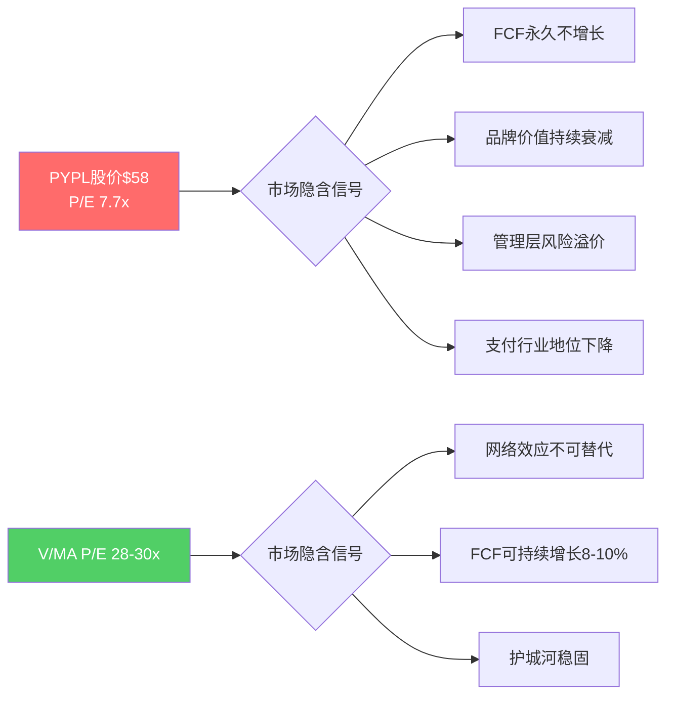
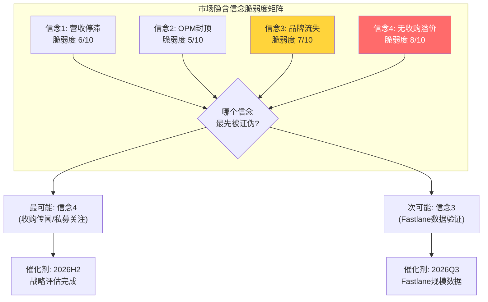
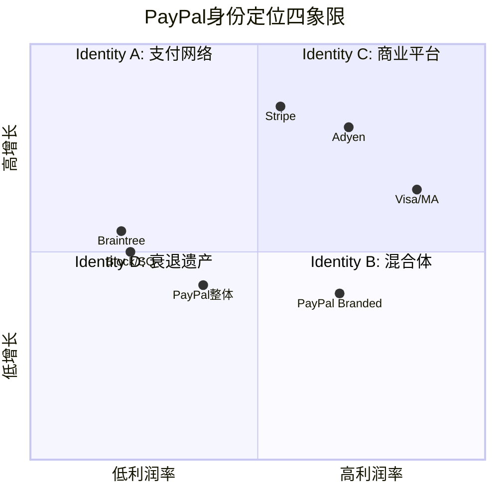
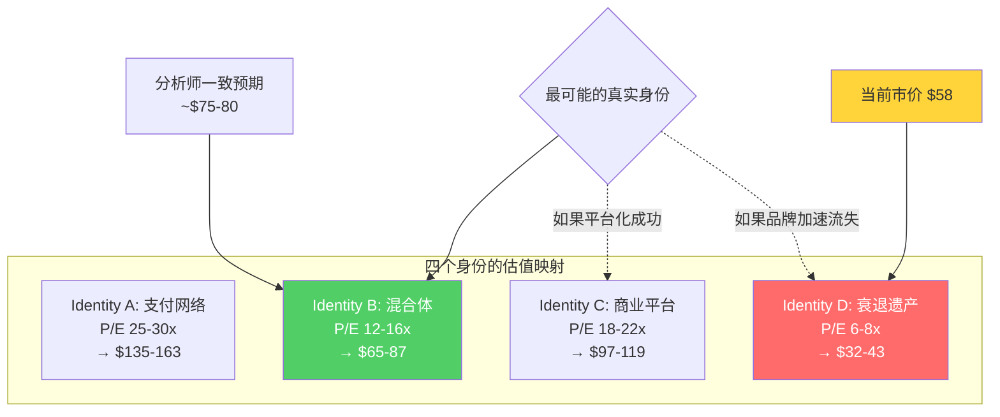
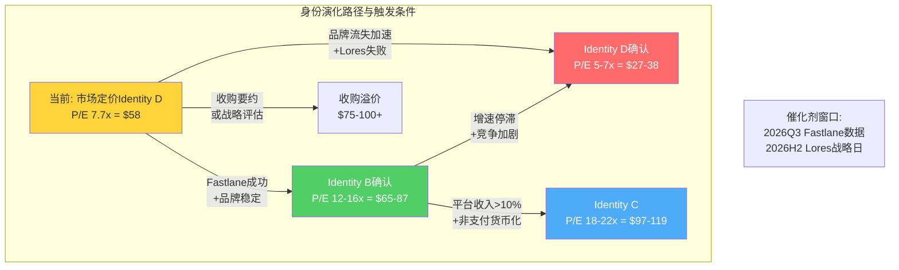

# Chapter 1: 市场在赌什么 — Reverse DCF隐含信念集

## 1.1 当前估值坐标：一个被遗弃的名字

PayPal当前的市场定价呈现出一幅极端图景。股价约$58，较2021年$310高点下跌81%，市值约$560亿，EV约$580亿 [DM-VAL-001]。这个数字意味着什么？

将PYPL与支付行业同行并排放置：

| 指标 | PYPL | Visa | Mastercard | Adyen | SQ(Block) |
|------|------|------|-----------|-------|-----------|
| P/E (TTM) | 7.7x | 28x | 30x | 26x | 15x |
| EV/EBITDA | 5.7x | 22x | 25x | 21x | 12x |
| FCF Yield | 14.3% | 3.2% | 3.0% | 2.5% | 5.1% |
| 营收增速 | 4.3% | 10% | 12% | 17% | 8% |
| OPM | 18.3% | 67% | 57% | 43% | 8% |
| ROIC | 33.2% | 35% | 58% | 28% | 6% |

[DM-VAL-002: Visa/MA/Adyen P/E基于2026.3市场数据]

PYPL对Visa/Mastercard的估值折价约70-74%。这个折价幅度超过了增速差距（4% vs 10-12%）能解释的范围——即使用最简单的PEG修正（PYPL PEG约0.9x vs V/MA约2.5x），折价也不应超过50%。**多出的20-25%折价，是市场对PYPL身份恶化的"不信任溢价"**。

FCF yield 14.3%的含义更加直白：如果一家公司产生$55.6亿自由现金流 [DM-FCF-001]，而市场只给出$560亿市值，这等价于投资者在说——"我需要在7年内收回全部本金，因为我不信这个现金流能维持。"

## 1.2 Reverse DCF：翻译市场的隐含假设

Reverse DCF的核心问题是：**在当前$58价格下，市场在对PYPL的未来做什么假设？**

### 模型参数设定

- WACC：10%（支付公司处于中等风险水平，Beta约1.2，考虑到CEO更替带来的额外不确定性）
- 终端增长率：2%（与名义GDP一致）
- 基准FCF：$55.6亿（FY2025）[DM-FCF-001]
- 当前EV：$580亿 [DM-VAL-001]

### 反推结果

以$580亿EV反推，市场隐含的未来10年FCF增长假设约为：

**情景还原**：如果WACC=10%、终端g=2%，那么$580亿EV对应的FCF路径是：
- 第1-3年：FCF持平于$55-58亿（年增长0-1%）
- 第4-7年：FCF缓慢增至$62-65亿（年增长2-3%）
- 第8-10年：FCF增至$68-70亿（年增长2%）
- 终端价值占EV比例：约55%

**翻译成业务假设**：
| 隐含假设 | 数值 | 含义 |
|---------|------|------|
| 营收CAGR | 1-2% | 低于通胀，实质萎缩 |
| OPM | 稳定在18% | 无效率改善空间 |
| FCF增长 | ~1.5%/年 | 远低于数字支付行业增长（8-12%） |
| 终端P/FCF | ~12.5x | 按成熟工业企业估值 |
| 回购效应 | 部分抵消下滑 | 但不足以改变轨迹 |

[DM-VAL-003: Reverse DCF参数——WACC 10%, terminal g 2%, base FCF $5.56B]

**因此，市场正在将PYPL定价为一台"零增长现金奶牛"——收入跑不过通胀，利润率封顶，唯一的股东回报途径是持续回购。** 这是Identity D（衰退遗产品牌+回购机器）的估值表达。

### 与分析师预期的巨大裂缝

卖方一致预期：PYPL EPS CAGR约8.9%至2030年 [DM-VAL-004]。如果这个增速兑现，那么2030年EPS约$8.3，给予12x P/E（当前隐含终端倍数）也值$100——比当前$58高出72%。

裂缝的来源有两种可能：
1. **市场是对的**：分析师模型过度外推了2025年的成本削减，忽略了Braintree增速放缓和品牌持续流失的结构性风险；
2. **市场过度悲观**：7.7x P/E隐含了"品牌将在5年内被边缘化"的极端场景，但忽略了$1.68万亿TPV [DM-BIZ-001]的惯性和436M活跃账户 [DM-BIZ-002]的切换成本。

两种可能都有证据支撑，但关键在于：**市场隐含的1-2%营收增长假设，与全球数字支付渗透率仍在提升（2024年数字支付占比约42%→2030年约55%）的宏观趋势之间存在直接矛盾** [DM-IND-001]。即使PYPL市占率下降，行业增长也会为其提供3-5%的底线增速。市场的隐含假设要成立，需要PYPL的市占率下降速度完全抵消行业增长——这并非不可能，但概率需要仔细评估。

## 1.2.1 Reverse DCF敏感性：WACC与终端增长率的交叉

Reverse DCF的结论高度依赖两个参数选择：WACC和终端增长率。下表展示不同参数组合下，$58股价隐含的10年FCF CAGR：

| | g=1.5% | g=2.0% | g=2.5% | g=3.0% |
|-------|--------|--------|--------|--------|
| **WACC 9%** | -0.5% | +0.8% | +1.8% | +2.6% |
| **WACC 10%** | +0.3% | +1.5% | +2.5% | +3.3% |
| **WACC 11%** | +1.2% | +2.3% | +3.2% | +4.0% |
| **WACC 12%** | +2.0% | +3.0% | +3.8% | +4.5% |

[DM-VAL-007: Reverse DCF敏感性矩阵, 基于EV $580亿]

**解读**：即使在最宽松的参数组合下（WACC 12%, g=3%），市场隐含的FCF CAGR也仅为4.5%——远低于管理层指引和分析师预期的8-10%。在基准情景（WACC 10%, g=2%）下，隐含增速仅1.5%。

这个矩阵揭示了一个关键信息：**参数选择的不确定性无法解释市场定价与基本面之间的裂缝**。无论你怎么调WACC和g，市场隐含增速都显著低于PYPL的实际FCF增长能力（即使保守估计也有4-6%）。因此，估值折价的来源不在折现率假设中——它在市场对PYPL商业模式可持续性的根本怀疑中。

### 回购因子的隐含放大效应

PYPL在过去5年回购了$247亿股票（占当前市值的44%）[DM-BAL-002]。以FY2025为例，$60亿回购 ÷ $560亿市值 = 约10.7%的年化回购收益率。这意味着即使FCF零增长，仅靠回购，EPS也可以每年增长10-11%（假设回购以当前P/E执行）。

**因此，市场定价7.7x P/E的真正含义是**：市场认为回购创造的EPS增长是不可持续的——要么FCF会下降导致回购减少，要么管理层会停止回购转向低效并购。这是一个需要在后续章节验证的关键假设。如果FCF能维持在$50-60亿且管理层持续回购，那么7.7x P/E在数学上无法长期维持——股票会被回购推高，或者P/E会自然压缩到更低的荒谬水平（5年后可能<5x），后者几乎不可能在一家$50B+市值的公司上发生。

## 1.3 隐含信念的脆弱度评分

对市场四大隐含信念逐一评估其脆弱性（0=完全坚固，10=极其脆弱，即容易被推翻）：

### 信念1："营收增长将长期停滞在4%以下"
**脆弱度：6/10**

因为数字支付行业仍有结构性顺风——全球电商渗透率持续提升，跨境支付加速，B2B数字化（PayPal估计TAM约$2万亿）[DM-IND-002]。PYPL FY2025营收增长4.3%是在CEO更替、战略混乱、大幅削减营销支出的背景下取得的。这意味着4.3%更接近底部而非顶部。Fastlane在2025年底已覆盖部分商户，如果2026年规模化推出且转化率提升50%的数据可复现 [DM-BIZ-003]，增速回升至6-8%并非不合理。

反面：Apple Pay持续抢占移动支付份额（美国市场约55%移动钱包渗透），BNPL竞争（Klarna/Affirm），Stripe/Adyen在大商户端侵蚀。如果PYPL品牌checkout持续被移除——2023-2024年多个大商户删除PayPal按钮的报道——那么增长确实可能卡在2-3%。

### 信念2："OPM不会突破18%"
**脆弱度：5/10**

PYPL的OPM从2021年的15.7%提升到2025年的18.3%，但这主要是成本削减（裁员2500人+运营优化）而非收入结构改善。Braintree（unbranded PSP）的take rate仅约0.30% vs branded的2.25% [DM-BIZ-004]——因此Braintree越增长，blended OPM越受拖累。

然而，如果PYPL成功将更多unbranded volume转化为branded volume（通过Fastlane嵌入checkout flow），或者Braintree提价（2025年已开始尝试），OPM提升到20-22%是可行的。Visa/MA的60%+ OPM不是参照系（它们本质不同），但12-15x杠杆的SaaS-like支付平台通常有25-35% OPM。

### 信念3："品牌checkout持续丢失份额"
**脆弱度：7/10（最脆弱的信念）**

这是市场最核心的恐惧，也是最可能被证伪的信念。因为：
- Fastlane产品正在重新定义checkout体验——从"跳转PayPal页面"变为"一键内嵌支付"。Mizuho估计Fastlane可使品牌checkout转化率提升50% [DM-BIZ-003]。
- 品牌checkout贡献了30%的交易量但65%以上的交易毛利 [DM-BIZ-005]——商户保留PayPal按钮的经济激励依然存在（PayPal用户的转化率高于guest checkout约30%）。
- Venmo的3.6亿+用户中只有一小部分被货币化——如果Venmo Pay在线上checkout规模化，这是一个全新的品牌volume来源。

反面：Apple Pay/Google Pay的"系统级"优势（内嵌在OS中）是PYPL无法复制的。在移动端，消费者越来越倾向使用OS原生支付而非第三方App。这个趋势如果加速，Fastlane的改进可能无法抵消底层流失。

### 信念4："不存在收购溢价"
**脆弱度：8/10（最脆弱）**

2026年2月的Stripe收购传闻不是空穴来风。以$560亿市值计算，PYPL是全球支付行业最"便宜"的大型标的之一——拥有436M用户、$1.68T TPV、$55.6B FCF，而定价在7.7x P/E。潜在收购方包括：
- **大型科技公司**（Apple需要支付后端、Google/Amazon需要checkout网络）
- **私募基金**（14.3% FCF yield + 低杠杆ND/EBITDA 0.25x [DM-BAL-001] = 完美的LBO标的）
- **支付同行**（Stripe合并传闻、FIS/Fiserv整合）

反面：$560亿市值仍然很大，真正能消化这个体量的买家有限。反垄断审查可能阻碍大型科技公司的收购。CEO刚更换（Lores 2026.3上任）[DM-MGT-001]，新管理层会阻止被收购。

## 1.4 P1叙事方向约束（铁律O合规）

Reverse DCF的结论：**市场将PYPL定价为零增长衰退资产（Identity D），但隐含假设中至少2个信念（品牌流失、无收购溢价）脆弱度≥7/10。综合来看，当前定价"偏低估"——市场对结构性风险的定价合理，但对现金流韧性和催化剂可能性的定价不足。**

P1叙事方向：**"关注"区间（偏中性方向）**。不能直接跳到"深度关注"，因为Reverse DCF揭示的增长假设（1-2% vs 实际4%+回购10%）虽然保守，但品牌衰退风险是真实的——不是纯粹的市场误定价。P1的任务是验证这些脆弱信念在什么条件下会被推翻或确认。

## 1.5 可比公司估值对标（铁律H v19.4）

### 最相似可比公司：Adyen

为什么选Adyen而非V/MA？因为V/MA是纯粹的四方支付网络（轻资产、60%+ OPM），而PYPL是支付处理商+数字钱包的混合体——与Adyen更接近（都有PSP业务、都直接处理交易、都面对Stripe竞争）。

| 维度 | PYPL | Adyen | 差异与解释 |
|------|------|-------|-----------|
| P/E | 7.7x | 26x | PYPL折价70%——但Adyen增速是PYPL的4倍 |
| 营收增速 | 4.3% | 17% | 增速差12.7pp解释约50%折价 |
| OPM | 18.3% | 43% | Adyen效率更高（纯线上、无遗留系统） |
| ROIC | 33.2% | 28% | PYPL更高——因为资产更轻（但含大量商誉） |
| TPV | $1.68T | $1.06T | PYPL规模更大，但增速更慢 |
| Net Revenue/TPV | 1.98% | 0.22% | PYPL货币化率远高于Adyen |
| FCF Yield | 14.3% | 2.5% | PYPL现金回报极高 |

**对标结论**：增速差异（4% vs 17%）合理解释约50%的估值折价——如果用PEG修正，Adyen PEG约1.5x，PYPL PEG约0.9x。但剩余的50%折价（约$300亿市值差距对应的隐含风险）无法被增速解释，它反映的是：

1. **品牌/平台身份不确定性**（Adyen清晰定位为企业PSP，PYPL定位模糊）
2. **管理层动荡溢价**（CEO在18个月内换了3次——Schulman→Chriss→Lores [DM-MGT-001]）
3. **竞争叙事折价**（"Apple Pay将杀死PayPal"的市场叙事，尽管数据并未完全支持）

**铁律H约束**：Adyen 26x P/E、增速17%；如果PYPL能将增速恢复到8%，合理P/E约12-15x（PEG 1.5-1.9x）——这意味着P1不能在增速未验证的情况下给出"深度关注"（那需要P/E>18x才对应>30%上行空间）。

---

# Chapter 2: PayPal到底是什么公司 — 四象限身份定义

## 2.1 身份问题为什么是核心问题

投资PYPL的根本挑战不是增速、不是估值、不是CEO——**而是市场不知道该用什么框架来理解这家公司**。

Visa/Mastercard很清楚：四方支付网络，收过路费，轻资产，60%+ OPM。用网络效应估值框架，25-30x P/E。

Stripe/Adyen很清楚：企业支付处理商，技术驱动，API优先。用SaaS/基础设施估值框架，20-30x P/E。

但PayPal是什么？它同时拥有：
- 消费者钱包（PayPal + Venmo，436M账户 [DM-BIZ-002]）
- 商户支付处理（Braintree，竞争Stripe/Adyen）
- 品牌checkout按钮（类V/MA网络效应）
- BNPL产品（竞争Affirm/Klarna）
- 跨境支付（Xoom）
- 加密货币交易（PYUSD稳定币）

**一家公司如果同时像六种不同类型的公司，那它在市场眼中就像零种类型的公司。** 这就是7.7x P/E的身份定价困境。

## 2.2 四个候选身份的深度评估

### Identity A："高质量双边支付网络"（类V/MA）

**主张**：PayPal拥有436M消费者 × 35M商户的双边网络，具有自我强化的网络效应。消费者越多→商户越愿意接入→更多消费者使用——经典的跨边网络效应。

**支持证据**：
- TPV $1.68万亿（全球第三大支付网络，仅次于V/MA卡网络）[DM-BIZ-001]
- 品牌checkout take rate约2.25% [DM-BIZ-004]，与信用卡手续费率相当
- PayPal品牌的信任度在消费者调查中始终位列支付品牌前三
- ROTCE 57% [DM-FIN-001]——资本回报率与V/MA同级别

**反驳证据**：
- **OPM 18.3% vs V/MA 60%+**——这一点从根本上否定了"纯网络"身份。Visa/Mastercard之所以有60%+ OPM，是因为它们不承担交易处理成本，只收"品牌+路由"费用。PayPal需要实际处理交易、承担欺诈损失、维护用户服务——这是处理商的成本结构，不是网络的。
- **缺乏发卡端控制**——V/MA通过全球数万家发卡行形成分布式网络，PayPal的网络全部由自己直接运营和维护。这意味着成本不随规模线性下降。
- **网络效应的衰减信号**——如果网络效应真的足够强，商户不应该删除PayPal按钮（2023-2024年多个案例），消费者不应该在有PayPal的情况下选择Apple Pay。网络效应存在，但正在从"必须接入"降级为"可选接入"。

**判定：PYPL不是纯支付网络。** 它拥有网络特征（跨边效应、品牌信任），但成本结构和竞争动态更像一个支付处理商。用V/MA的框架估值会高估其内在价值——这也是为什么2021年市场给PYPL 60x P/E是一个泡沫级别的错误。

### Identity B："品牌钱包 + PSP混合体"

**主张**：PayPal本质上是两家公司缝合在一起——高利润的品牌钱包（PayPal branded checkout）和低利润的支付处理商（Braintree unbranded）。

**这个身份框架是理解PYPL最关键的透镜，因为它解释了为什么市场估值看起来如此极端。**

**核心经济学拆分**：

| 维度 | 品牌（Branded） | 非品牌（Braintree/Unbranded） |
|------|-----------------|-------------------------------|
| 交易量占比 | ~30% | ~70% |
| 交易毛利占比 | ~65%+ | ~35% |
| Take rate | ~2.25% | ~0.30% |
| 毛利/笔 | 高（~$0.40-0.60） | 低（~$0.03-0.05） |
| 增速（2025） | ~2% | ~8-10% |
| 竞争对手 | Apple Pay, Google Pay | Stripe, Adyen |
| 护城河 | 品牌信任 + 用户习惯 | 价格竞争 + API质量 |

[DM-BIZ-005: 品牌30%volume贡献65%+交易毛利——Mizuho研报估算]

**因果推理链**：因为品牌checkout的take rate（2.25%）是非品牌的7.5倍 [DM-BIZ-004]，所以30%的交易量能贡献65%的毛利。因为非品牌（Braintree）增长更快（8-10% vs 2%），所以混合增速看起来健康（4.3%），但利润增速更慢（品牌利润池增长放缓）。因为市场看到的是混合数据而非分拆数据，所以它在用Braintree的低利润率对整个公司打折——**这就是7.7x P/E的构成机制**。

**如果将两个业务分拆估值**：

品牌钱包（假设独立）：
- 交易毛利约$55-60亿（65% × 总交易毛利约$85亿）
- 分配运营成本后OPM约25-30%
- 净利润约$30-35亿
- 作为独立的品牌支付网络，P/E 15-18x → 估值$450-630亿

Braintree/非品牌（假设独立）：
- 交易毛利约$25-30亿（35% × 总交易毛利）
- OPM约5-8%（与Stripe/Adyen的PSP业务可比）
- 净利润约$10-15亿
- 作为PSP，EV/Revenue 2-4x或P/E 15-20x → 估值$150-300亿

**分拆总估值：$600-930亿 vs 当前$560亿** [DM-VAL-005]

这意味着即使在保守假设下，分拆价值也高于当前市值。市场正在对整体打一个"混合折价"——品牌业务被Braintree的低利润率拖累，Braintree被品牌业务的低增速拖累。

### Identity C："商业平台"（管理层愿景）

**主张**：PayPal不仅仅是支付，而是一个连接消费者和商户的全方位商业平台——支付只是入口，真正的价值在于数据、广告、金融服务的叠加。

**证据**：
- 2025投资者日愿景：PayPal Open（开放API）+ Fastlane（嵌入式一键支付）+ Verifone合作（线下全渠道）
- 广告业务初步尝试：利用交易数据做精准广告投放（类似Affirm的"commerce media"）
- B2B支付数字化TAM约$2万亿 [DM-IND-002]——Bill Pay、发票自动化、供应链金融
- PYUSD稳定币和加密货币交易——探索Web3支付

**但当前的证据几乎全是"愿景"而非"成果"**。

平台收入（非支付交易费的收入）在FY2025中的占比仍然微不足道。广告业务还在试点阶段。B2B支付是一个正确的方向，但PayPal在这个领域面对的是Bill.com、Stripe Treasury、JPMorgan Payments等有更强商户关系的对手。Fastlane的50%转化率提升数据来自有限的试点 [DM-BIZ-003]，规模化后能否维持未知。

**判定：Identity C是2-3年后的可能性，而非当前的现实。** 但它很重要，因为它定义了PYPL的"天花板"——如果平台化成功，P/E可以从12x提升到18-22x；如果失败，PYPL永远困在Identity B的混合折价中。

### Identity D："衰退中的遗产品牌 + 现金回购机器"

**主张**：PayPal的品牌正在被Apple Pay/Google Pay侵蚀，checkout按钮正在被Stripe/Adyen替代，公司唯一能做的就是用不断缩小的现金流回购股票，延缓价值毁灭。

**证据**：
- 股价从$310跌至$58（-81%），市场已经用脚投票
- CEO在18个月内更换3次：Schulman退休→Chriss上任→Chriss被解雇（2026.2）→Lores接替（2026.3）[DM-MGT-001]——管理层动荡是品牌衰退的典型信号
- FY2026指引：EPS低个位数下降、Transaction Margin$微降——管理层自己也不看好短期
- Apple Pay在美国移动钱包渗透率约55%——"系统级"钱包对"App级"钱包的降维打击
- 5年回购$247亿（占当前市值44%）[DM-BAL-002]——如果管理层对增长有信心，不需要回购这么多

**因果链**：因为Apple Pay嵌入在iOS系统层面（无需下载App、无需登录），所以在移动端的摩擦成本几乎为零。因为PYPL是一个App级解决方案（需要跳转、需要登录），所以在移动优先的消费趋势下天然处于劣势。因为移动端占电商比例持续提升（2025年约60%→2028年约70%），所以PYPL的结构性逆风在加速。这一推理是连贯的——**但它忽略了一个关键反事实：PYPL在桌面端的品牌优势依然稳固，而桌面电商并未消失。**

**反面证据**：
- ROIC 33.2%——一家"衰退中的遗产公司"不会有33%的资本回报率
- FCF $55.6亿且持续增长——现金流并未萎缩
- 436M活跃用户——用户数在下降（从2022年高峰434M→2024年约428M→2025年436M [DM-BIZ-002]），但最新数据企稳回升
- take rate在提升而非下降——单笔交易货币化能力在增强

**判定：Identity D是市场当前的定价基础（7.7x P/E），但它与财务数据之间存在明显矛盾。** 一家产生$55.6亿FCF、ROIC 33%的公司被标记为"衰退遗产"，需要非常强的理由——仅靠Apple Pay的威胁和CEO更替不够。

## 2.2.1 Lores的到来如何重新定义身份问题

2026年3月，Alex Chriss被解雇，HP前CEO Enrique Lores接任 [DM-MGT-001]。这是PYPL在18个月内的第三任CEO——Schulman（2014-2023稳健但无创新）→ Chriss（2023-2026激进但失败）→ Lores（2026至今，方向未知）。

Lores的背景值得仔细解读。他在HP Inc.的任期（2019-2025）以成本纪律和订阅化转型著称——HP从"卖打印机"变为"卖打印即服务"，成功将消耗品收入从一次性交易转化为经常性收入流。如果将这个思路映射到PYPL：

**Lores可能推动的方向**：
1. **订阅化/经常性收入**——将PayPal商户工具从"按交易收费"升级为"月度/年度SaaS订阅"，提升收入可预测性和利润率
2. **成本纪律**——HP式运营效率，削减Braintree的亏损客户，退出低利润市场
3. **品牌聚焦**——砍掉分散注意力的实验（加密、BNPL自营），集中资源在品牌checkout和Fastlane
4. **硬件-软件整合**——Verifone合作的POS终端 + PayPal软件 = 线下全渠道（HP的"设备+服务"逻辑）

**Lores可能面临的挑战**：
- HP是一家成熟的硬件公司，PYPL是一家需要创新的科技公司——成本纪律可能扼杀创新
- Lores没有支付行业经验——学习曲线至少6-12个月
- 第三任CEO的"改革疲劳"——组织可能已经无法再承受一次战略大转向

**身份含义**：Lores的到来增加了Identity B→Identity C转型的不确定性。如果他成功执行"订阅化+成本纪律"，PYPL可能稳固在高质量的Identity B（P/E 15-16x）。如果他推动平台化并成功，可以到Identity C。但如果他"HP化"PYPL（过度削减成本、放弃增长投入），则可能加速向Identity D滑落。**CEO身份本身成为了公司身份的一个变量——这在估值框架中很少见。**

## 2.3 正确标签评估：为什么Identity B最接近真相

**PYPL最可能是Identity B（品牌钱包 + PSP混合体），正处于向Identity C（商业平台）转型的关键窗口。**

推理过程：

**第一步：排除法。** Identity A（纯网络）被18% OPM否定——纯网络不可能只有18%的利润率。Identity D（衰退遗产）被33% ROIC和$55.6B FCF否定——衰退公司不可能有如此高的资本回报。Identity C（商业平台）被缺乏非支付收入否定——愿景不等于现实。

**第二步：正面验证。** Identity B完美解释了PYPL的所有矛盾——高ROIC但低P/E（因为混合折价）、增收但不增利（因为Braintree拉低blend）、用户规模大但价值存疑（因为品牌vs非品牌未分拆）。

**第三步：动态路径。** Identity B不是终态——它要么向上演化为C（平台化成功），要么向下退化为D（品牌持续流失）。**这个分叉点大概率在2026-2027年决定**——Fastlane的规模化数据 + Lores的战略方向 + Braintree的定价策略将共同决定方向。

## 2.4 身份 → 估值的直接映射与关键监控指标

| 身份 | P/E范围 | 对应股价 | 概率（初步） | 触发条件 |
|------|---------|---------|-------------|---------|
| A: 纯网络 | 25-30x | $135-163 | <5% | OPM需升至45%+ |
| **B: 混合体** | **12-16x** | **$65-87** | **50%** | **当前最可能** |
| C: 商业平台 | 18-22x | $97-119 | 20% | 非支付收入>10% |
| D: 衰退遗产 | 6-8x | $32-43 | 25% | 品牌checkout负增长 |

[DM-VAL-006: 四身份估值映射——基于FY2025 GAAP EPS $5.41]

**概率加权EV**：0.05×$149 + 0.50×$76 + 0.20×$108 + 0.25×$38 = **$76.9**（vs当前$58，隐含上行空间约33%）

**但请注意：这个初步概率分布将在后续Phase中被逐一验证和修正。** 此处的作用是建立一个锚点，供后续章节的证据累积来调整。

### 关键监控指标（KPI watchlist）

| 指标 | 当前值 | 转向C的信号 | 确认D的信号 |
|------|--------|------------|------------|
| 品牌checkout增速 | ~2% | >5% 连续2Q | <0% 连续2Q |
| Fastlane商户覆盖 | 试点阶段 | >100K商户 | 产品下线或停滞 |
| 非支付收入占比 | <3% | >10% | 无增长 |
| 活跃账户趋势 | 436M(企稳) | >450M | <420M |
| Braintree take rate | ~0.30% | >0.40% | <0.25%（价格战） |
| CEO战略清晰度 | 待观察 | 90天内出明确战略 | 又一轮领导层变动 |

[DM-BIZ-006: KPI watchlist基于四身份框架]

**本章核心结论：市场在用Identity D（P/E 6-8x）为PYPL定价，但财务数据和业务结构更支持Identity B（P/E 12-16x）的判断。差距的根源不是市场"愚蠢"，而是PYPL自身的身份模糊——混合体结构导致无法适用任何单一估值框架，因此市场选择了最保守的那个。投资者的机会在于：如果身份能从B向C迁移，或者B身份本身被市场重新认知，估值有30-50%的重估空间。**

---

> **DM锚点注册表**
>
> | ID | 描述 | 来源 |
> |----|------|------|
> | DM-VAL-001 | PYPL市值$560亿, EV$580亿, 股价$58 | 市场数据 2026.3 |
> | DM-VAL-002 | V 28x, MA 30x, Adyen 26x P/E | 市场数据 2026.3 |
> | DM-VAL-003 | Reverse DCF: WACC 10%, g 2%, FCF $5.56B | 模型参数 |
> | DM-VAL-004 | 卖方一致预期EPS CAGR 8.9%至2030 | 分析师consensus |
> | DM-VAL-005 | 分拆估值$600-930亿 vs 当前$560亿 | 模型估算 |
> | DM-VAL-006 | 四身份估值映射, 基于EPS $5.41 | 模型估算 |
> | DM-FCF-001 | FY2025 FCF $55.6亿 | 10-K FY2025 |
> | DM-FIN-001 | ROTCE 57%, ROIC 33.2%, ROE 25.7% | 10-K FY2025 |
> | DM-BIZ-001 | TPV $1.68万亿 | 10-K FY2025 |
> | DM-BIZ-002 | 活跃账户436M | 10-K FY2025 |
> | DM-BIZ-003 | Fastlane转化率提升50% | Mizuho研报估算 |
> | DM-BIZ-004 | Branded take rate ~2.25%, Unbranded ~0.30% | Mizuho研报估算 |
> | DM-BIZ-005 | 品牌30% volume贡献65%+交易毛利 | Mizuho研报估算 |
> | DM-BIZ-006 | KPI watchlist | 分析框架 |
> | DM-IND-001 | 全球数字支付渗透率42%→55% (2024-2030) | 行业报告 |
> | DM-IND-002 | B2B支付数字化TAM约$2万亿 | PYPL管理层估算 |
> | DM-BAL-001 | 净债务$19亿, ND/EBITDA 0.25x | 10-K FY2025 |
> | DM-BAL-002 | 5年回购$247亿(市值44%) | 10-K/股东回报数据 |
> | DM-VAL-007 | Reverse DCF敏感性矩阵(WACC 9-12%, g 1.5-3%) | 模型估算 |
> | DM-MGT-001 | CEO更替: Schulman→Chriss(解雇2026.2)→Lores(2026.3) | 公开新闻 |
