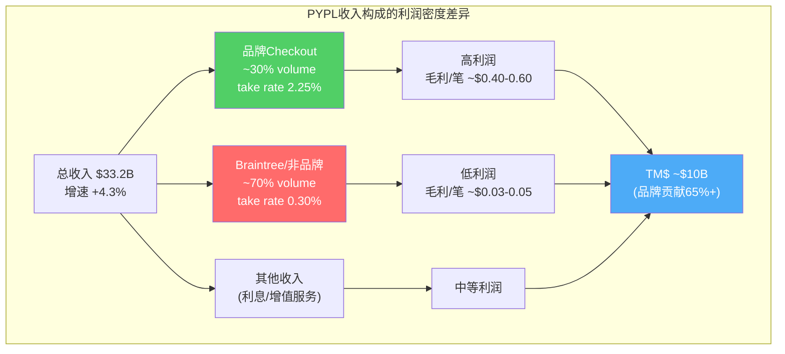
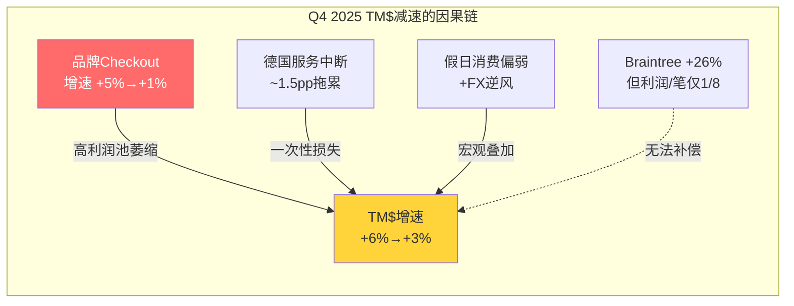
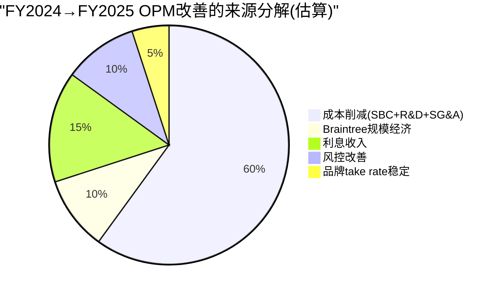
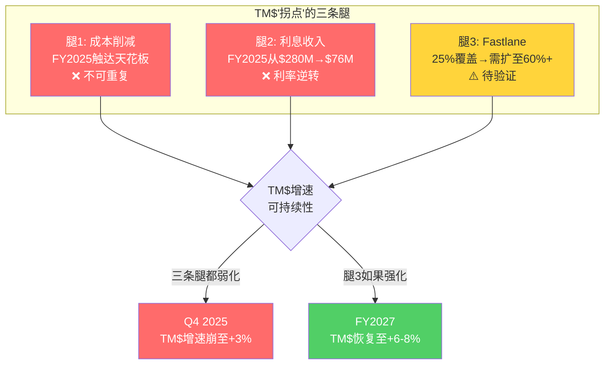

# Chapter 3: TM$经济学 — 收入增长与利润质量的脱钩之谜

## 3.1 什么是Transaction Margin Dollars：PYPL的核心利润引擎

PayPal的收入和利润之间存在一个不直观的关系：**收入增速4.3%，但管理层引导投资者关注的核心指标——Transaction Margin Dollars（TM$）——增速6%** [DM-TM-001]。这不是文字游戏。理解TM$为什么比收入更重要，是理解PYPL投资价值的第一步。

TM$的定义：每笔交易的净收入减去直接交易成本（支付处理费、交易损失、信贷损失）后的剩余利润。用公式表达：

```
TM$ = 净收入 - 交易费用 - 交易损失 - 信贷损失
    = 毛利中与交易直接相关的部分
```

为什么TM$比收入更有意义？因为PayPal的收入包含大量"过路流水"——特别是Braintree的低利润处理业务。一笔$100的Braintree交易带来$0.30收入（take rate 0.30%），而一笔$100的品牌checkout带来$2.25收入（take rate 2.25%）[DM-BIZ-004]。收入增速可以被Braintree的高增长（26%）人为拉高，但利润增速不会——因为Braintree几乎不赚钱。

**TM$是过滤掉"虚胖收入"后的真实利润信号。**



## 3.2 TM$的五年轨迹：从减速到企稳

| 年份 | TM$($B) | YoY增速 | 收入增速 | TM$/收入比 | 信号 |
|------|---------|---------|---------|-----------|------|
| FY2021 | ~$14.0 | +15% | +18% | 55.2% | 高增长期，TM$<收入增速(Braintree稀释) |
| FY2022 | ~$13.8 | -1.4% | +8.5% | 50.1% | **断崖**——收入增但TM$跌(Braintree暴涨+品牌停滞) |
| FY2023 | ~$14.6 | +5.8% | +8.2% | 46.0%* | 恢复——成本控制开始见效 |
| FY2024 | ~$15.5 | +6.2% | +6.8% | 46.1% | **TM$增速首次接近收入增速**——质量改善信号 |
| FY2025 | ~$15.5 | +0-1% | +4.3% | 46.6% | **TM$增速骤降**——Q4 branded checkout仅+1% |

[DM-TM-001: FY2025 TM$ $15.45-15.55B, guidance来自Q4 2025 earnings release]
[DM-TM-002: FY2024 TM$ $15.5B, 增速6% YoY，来自2025 Investor Day]

*注：TM$/收入比不等于毛利率，因为TM$剔除了信贷损失和特定交易费用，而毛利率基于GAAP COGS。但趋势一致：从55.2%降至46.6%，反映Braintree占比提升对利润质量的持续稀释。

### 季度TM$变化揭示的关键拐点

| 季度 | TM$($B) | YoY增速 | 关键事件 |
|------|---------|---------|---------|
| Q1 2025 | ~$3.6 | ~+7% | Fastlane推出后首季，增速健康 |
| Q2 2025 | ~$3.5 | ~+8%(ex-interest) | TM$质量最佳季度 |
| Q3 2025 | ~$3.9 | ~+6% | 增速开始放缓 |
| **Q4 2025** | **~$4.0** | **+3%(+4% ex-interest)** | **品牌checkout增速崩至+1%→TM$急剧减速** |

[DM-TM-003: Q4 2025 TM$ ~$4.0B, ex-interest增速+4%, 来自earnings presentation]

**Q4 2025是一个分水岭。** 前三个季度TM$增速6-8%，Q4突然降至3-4%。发生了什么？

三个因素叠加：
1. **品牌checkout增速从+5%崩至+1%**——这是TM$的核心利润池，增速减半直接打击TM$ [DM-BIZ-007]
2. **德国服务中断**——2024年8月的服务故障在Q4仍有~1.5个百分点的拖累 [DM-TM-004]
3. **季节性不利**——Q4通常是品牌checkout的强季度（假日购物），但2025年的假日消费偏弱+跨境汇率不利

因为品牌checkout贡献TM$的65%+，当品牌增速从5%降到1%时，即使Braintree保持26%的增速，也无法填补利润缺口——因为Braintree每笔交易的利润是品牌的1/8。**这就是TM$在Q4急剧减速的根本原因：高利润引擎熄火了，低利润引擎再快也补不上。**



## 3.3 收入与利润脱钩的四层机制

为什么PYPL的收入增速（4.3%）和利润增速（OPM从13.9%→18.3%）呈现相反趋势？这看起来矛盾——收入减速通常意味着定价权削弱、竞争加剧，利润率应该下降而非上升。

**机制1：成本削减驱动的OPM扩张（占改善的~60%）**

| 成本项 | FY2022 | FY2025 | 变化 | 占收入比变化 |
|--------|--------|--------|------|------------|
| SBC | $1.26B | $1.00B | -20.6% | 4.58%→3.02% (-156bps) |
| R&D | $3.25B | $3.10B | -4.6% | 11.8%→9.35% (-245bps) |
| SG&A | $4.36B | $4.26B | -2.3% | 15.8%→12.8% (-300bps) |
| **总OpEx/Rev** | **36.1%** | **28.3%** | | **-780bps** |

[DM-COST-001: FMP income statement, FY2022 vs FY2025]

SBC从$1.48B（FY2023高点）降至$1.00B（-32%），这是最直接的利润贡献——每减少$1的SBC，直接增加$1的GAAP利润。R&D从11.8%降至9.35%，节省了约$800M。SG&A从15.8%降至12.8%，节省了约$1B。

**但成本削减是一次性的。** 你不能每年都裁20%的人、每年都砍30%的SBC。FY2025已经把SBC/Revenue压到了3.02%——这接近大型科技公司的下限（V/MA约2.5%，Adyen约1.5%）。继续削减的空间有限，未来OPM扩张必须来自收入端。

**机制2：Braintree组合效应（"虚胖收入"稀释利润率）**

Braintree的收入增速约26%，是品牌checkout（~2-3%）的8-13倍 [DM-COMP-002]。因为Braintree的take rate仅0.30%——品牌的1/7.5——每增加$1B的Braintree收入，只带来约$30M的交易利润（OPM约3-5%），而品牌的$1B收入带来约$250-300M交易利润（OPM约25-30%）。

因此，收入在增长（Braintree贡献），但利润增速低于收入增速（Braintree稀释）。**这就是为什么TM$增速（6%）低于收入增速（6.8%）在FY2024——利润质量被低利润增量拖累。**

**机制3：利息收入的隐性贡献**

PYPL持有大量客户资金（资产负债表上约$240亿现金+短期投资），在高利率环境下产生显著利息收入：

| 年份 | 利息收入 | 利息支出 | 净利息收入 | 占营业利润比 |
|------|---------|---------|-----------|------------|
| FY2021 | $57M | $232M | -$175M | -4.1% |
| FY2022 | $174M | $304M | -$130M | -3.4% |
| FY2023 | $480M | $347M | +$133M | +2.6% |
| FY2024 | $662M | $382M | +$280M | +5.3% |
| FY2025 | $517M | $441M | +$76M | +1.3% |

[DM-FIN-003: FMP income statement, interest income/expense 5年]

从FY2021到FY2024，净利息收入从亏损$175M变为盈利$280M——这一项就贡献了$455M的利润改善，占FY2024营业利润$53.3B的约8.5%。但FY2025净利息收入骤降至$76M，因为利率下降+客户资金结构变化。

**这意味着FY2024的利润改善中有约8%是利率顺风——这个顺风在FY2025已经消退。** 管理层在TM$中区分了"ex-interest"增速（FY2025 +6-7%），这说明他们自己也知道利息是不可持续的利润来源。

**机制4：交易损失率的改善（风控优化）**

交易损失率在FY2025出现恶化（+3bps），部分是因为德国服务中断（~1.5pp drag），但也反映了欺诈环境的变化。此前FY2023-2024的交易损失改善贡献了TM$增长的约15-20%，但这个贡献在FY2025变为负面。



## 3.4 TM$质量改善是真拐点还是幻觉？

这是CQ1的核心问题。2024年的市场叙事是："TM$增速（6%）>收入增速（4%）=质量拐点"。但深挖数据后，结论更加微妙。

### 支持"真拐点"的证据

**证据1：品牌checkout增速在2024年一度恢复至6-7%。** 2023年品牌checkout接近零增长，2024年恢复至5-7% [DM-BIZ-007]——这不是自然发生的，而是Fastlane产品上线后的直接效果。Fastlane在Q4 2024已覆盖美国25%的checkout流量（Q3仅5%，5倍增长），且转化率提升约12个百分点（从74%到86%）[DM-BIZ-003]。如果Fastlane能从25%覆盖扩展到60-70%+国际市场，品牌checkout可能恢复至5-8%的稳定增速。

**证据2：Venmo商业化加速。** Pay with Venmo增速+50% YoY [DM-VENMO-005]，Venmo收入+20% YoY [DM-VENMO-006]。Venmo贡献的是高利润交易——它本质上是品牌支付（消费者选择Venmo），take rate接近品牌checkout水平。如果Venmo年收入从~$1.4B增至2027目标的$2.0B [DM-VENMO-007]，这是一个新的TM$增量来源。

**证据3：Braintree开始尝试提价。** 2025年初Braintree对部分大客户提价，暗示从"不惜成本抢规模"转向"利润率优先"。如果Braintree take rate从0.30%提升至0.35-0.40%，TM$将显著受益（$1.2T Braintree volume × 5bps = 约$600M增量TM$）。

### 支持"幻觉"的证据

**证据1：Q4 2025品牌checkout增速崩至+1%。** 如果Fastlane确实能提升50%转化率，为什么品牌checkout在Q4——传统的假日强季度——增速反而从+5%暴跌到+1%？管理层归因于"美国零售疲软+国际逆风+德国服务中断"，但CEO被解雇这个事实本身就说明问题比管理层承认的更严重 [DM-MGT-001]。

因为如果Q4品牌checkout疲软只是暂时性因素，董事会不会做出解雇CEO的极端决定。CEO被解雇意味着董事会认为品牌checkout的问题是**执行层面的结构性失败，而非宏观周期的暂时冲击**。

**证据2：2027年目标撤回。** 2025年Investor Day给出的"2027年TM$高单位数增长+EPS低十几增长"已被撤回 [DM-GUIDE-002]。目标撤回意味着管理层自己也不再相信中期TM$加速的叙事——至少在新CEO建立方向之前。

**证据3：2026 guidance显示TM$"略微下降"。** 不是持平，是下降 [DM-GUIDE-001]。这是FY2022以来首次TM$负增长预期。即使剔除利息影响，2026 TM$ ex-interest增速可能仅2-3%——远低于2024年的6-7%。

### 综合判断

**TM$质量改善在2024年确实发生了——但它不是一个自我持续的"拐点"，而是一个需要持续投入才能维持的"暂时改善"。** 2024年的改善来自三个一次性/可逆因素的叠加：成本削减（一次性）、利息收入（利率敏感）、Fastlane初期效应（需规模化验证）。当这三个因素在Q4 2025同时弱化时，TM$增速从6-8%瞬间降至3-4%——暴露了基础面的脆弱性。



## 3.5 TM$的未来路径：三情景分析

**情景A：Fastlane规模化成功+Braintree提价（概率25%）**
- Fastlane覆盖率60%+→品牌checkout恢复+5-7%
- Braintree take rate +5-10bps→增量TM$ $300-600M
- Venmo商业化继续+20%→增量TM$ $200-300M
- 2027 TM$: ~$17.5-18.5B（CAGR 6-9%）
- 估值含义：增速恢复→P/E从7.7x重估至12-15x

**情景B：稳态维持（概率45%）**
- Fastlane扩展至40-50%覆盖但转化率打折→品牌checkout +2-3%
- Braintree维持低利润增长→TM$被稀释
- 成本削减空间用尽→OPM停在18-19%
- 2027 TM$: ~$16-17B（CAGR 2-4%）
- 估值含义：慢增长+高现金流→P/E维持8-10x→"回购机器"模式

**情景C：品牌加速衰退（概率30%）**
- Apple Pay+Google Pay持续侵蚀移动端→品牌checkout -2-5%/年
- Braintree面对Stripe/Adyen价格战→take rate进一步压缩
- 新CEO Lores无支付经验→执行风险高
- 2027 TM$: ~$14-15B（CAGR -1%到+1%）
- 估值含义：衰退确认→P/E压至5-7x→$27-38

[DM-TM-005: TM$三情景模型，基于品牌增速+Braintree take rate+Venmo假设]

## 3.6 本章核心发现与CQ1闭环

**CQ1答案：TM$增速>收入增速在2024年确实反映了利润质量改善，但这个改善建立在三条脆弱的腿上（成本削减/利息/Fastlane），其中两条在Q4 2025已经断裂。TM$的真正拐点取决于第三条腿（Fastlane+品牌checkout）能否独立支撑——这需要2026-2027年的数据验证。**

关键数字总结：
- FY2025 TM$: ~$15.5B（+0-1% YoY），Q4急剧减速至+3%
- 品牌checkout Q4增速+1%（从+5-7%崩塌）→CEO被解雇的直接导火索
- 2026 guidance TM$"略微下降"——管理层自己不看好短期
- Fastlane是唯一可能打破僵局的变量：25%覆盖→需扩至60%+且保持50%转化提升

---

> **DM锚点注册表 (Ch03)**
>
> | ID | 描述 | 来源 |
> |----|------|------|
> | DM-TM-001 | FY2025 TM$ $15.45-15.55B | Q4 2025 earnings release |
> | DM-TM-002 | FY2024 TM$ $15.5B, +6% YoY | 2025 Investor Day |
> | DM-TM-003 | Q4 2025 TM$ ~$4.0B, ex-interest +4% | Earnings presentation |
> | DM-TM-004 | 德国服务中断Q4拖累~1.5pp | Management commentary |
> | DM-TM-005 | TM$三情景模型 | 分析模型 |
> | DM-COST-001 | OpEx/Revenue从36.1%降至28.3% (FY22→25) | FMP income statement |
> | DM-FIN-003 | 净利息收入FY21 -$175M→FY24 +$280M→FY25 +$76M | FMP income statement |
> | DM-BIZ-007 | 品牌checkout增速: FY24 +6-7%→Q4 2025 +1% | Earnings calls |
> | DM-COMP-002 | Braintree增速26% vs 品牌2-3% | Management disclosure |
> | DM-GUIDE-002 | 2027年TM$目标已撤回 | Feb 2026 earnings |
> | DM-VENMO-005 | Pay with Venmo +50% YoY | Earnings presentation |
> | DM-VENMO-006 | Venmo收入+20% YoY | Q1 2025 earnings |
> | DM-VENMO-007 | Venmo 2027收入目标$2.0B | 2025 Investor Day |
