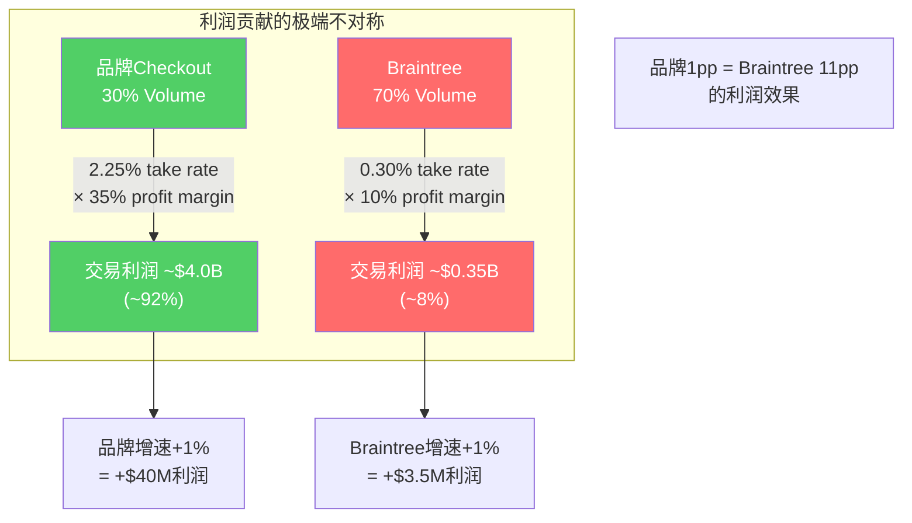
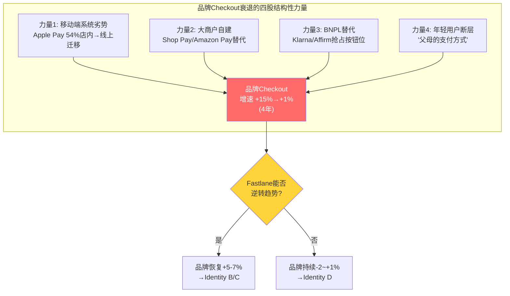
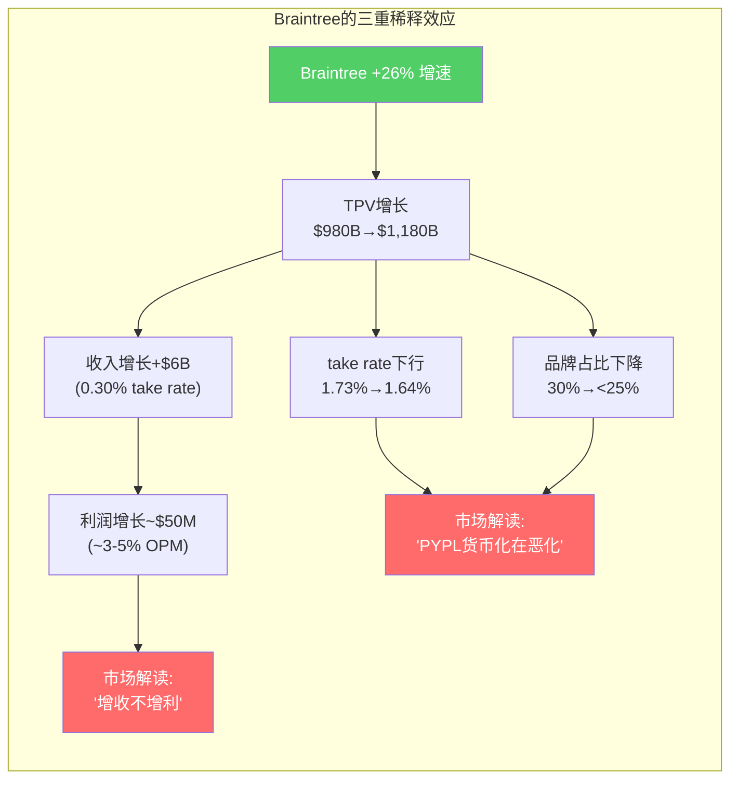
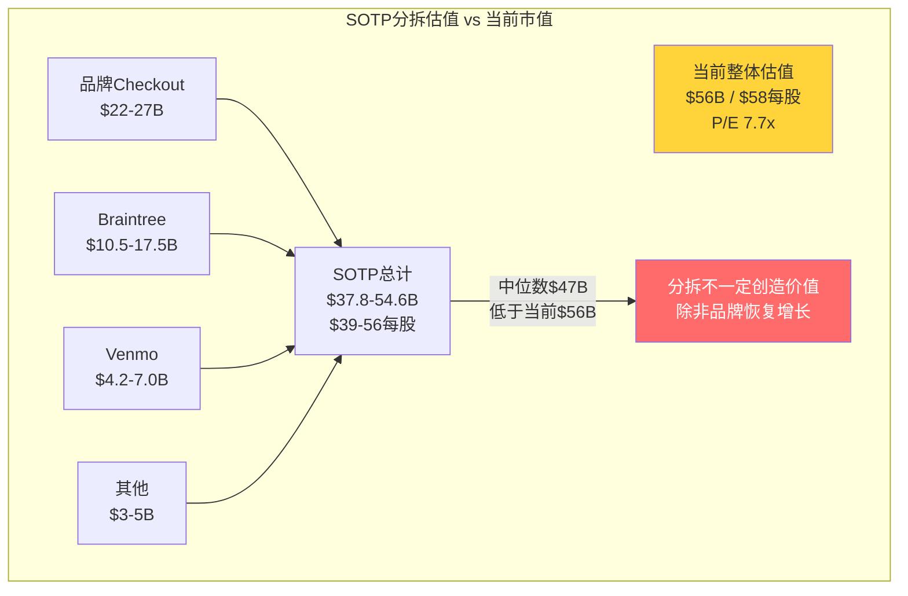

# Chapter 4: Branded vs. Unbranded深潜 — PayPal的两副面孔

## 4.1 一家公司的两条平行轨道

PayPal最反直觉的特征是：**它的两个核心业务几乎完全相反。** 品牌checkout（PayPal按钮）是高利润、低增长、面对消费者的数字钱包业务；Braintree（非品牌处理）是低利润、高增长、面对商户的PSP基础设施业务。这两个业务共享同一个资产负债表、同一个管理团队，但面对完全不同的竞争对手、服务完全不同的客户需求、遵循完全不同的增长逻辑。

理解这个双重结构，就理解了为什么PYPL 7.7x P/E既可能是严重低估（品牌钱包被PSP拖累）也可能是合理定价（品牌钱包正在衰退）。

### 两条轨道的经济学对比

| 维度 | 品牌Checkout（PayPal Button） | 非品牌处理（Braintree） |
|------|------------------------------|------------------------|
| **交易量占比** | ~30% ($504B) | ~70% ($1.18T) |
| **交易毛利占比** | ~65%+ (~$55-60B) | ~35% (~$25-30B) |
| **Take rate** | ~2.25% | ~0.30% |
| **毛利/笔** | $0.40-0.60 | $0.03-0.05 |
| **FY2025增速** | +1% (Q4) / +2% (全年) | +26% |
| **竞争对手** | Apple Pay, Google Pay, BNPL | Stripe, Adyen, FIS |
| **护城河来源** | 品牌信任+用户习惯+转化率 | 价格+API质量+集成深度 |
| **客户决策者** | 消费者选择→商户被动接受 | 商户CTO/工程团队选择 |
| **切换成本** | 低(消费者一键换) | 高(深度API集成) |

[DM-BIZ-008: 品牌vs非品牌经济学拆分，基于管理层disclosure+Mizuho估算]

### 关键洞察：利润贡献的极端不对称

品牌checkout以30%的交易量贡献65%+的交易毛利。这意味着品牌checkout的利润密度是Braintree的4.7倍。用具体数字说明：

```
品牌: $504B × 2.25% take rate × ~35% 交易利润率 ≈ $3.97B交易利润
Braintree: $1.18T × 0.30% take rate × ~10% 交易利润率 ≈ $0.35B交易利润
品牌利润/Braintree利润 ≈ 11:1
```

[DM-BIZ-009: 利润密度估算——品牌利润贡献约为Braintree的11倍]

**因此，品牌checkout每增长1个百分点的利润效果，相当于Braintree增长11个百分点。** 这就是为什么Q4 2025品牌checkout增速从+5%降至+1%是灾难性的——4个百分点的品牌减速，需要Braintree额外增长44个百分点才能补偿。而Braintree已经在+26%的增速上了。



## 4.2 品牌Checkout：核心利润池的保卫战

### 4.2.1 品牌checkout的增长轨迹

| 时期 | 品牌Checkout增速 | 驱动因素 | 信号 |
|------|-----------------|---------|------|
| FY2021 | +15-18% | COVID电商红利 | 顺风满帆 |
| FY2022 | +2-3% | 电商正常化+通胀 | 急剧减速 |
| FY2023 | -1~+1% | Apple Pay蚕食+商户移除按钮 | 接近零增长 |
| FY2024 Q1-Q3 | +6-7% | Fastlane上线+新checkout体验 | **反弹信号** |
| FY2024 Q4 | +5% | 延续Fastlane动能 | 增速开始放缓 |
| **FY2025 Q1-Q3** | **+3-5%** | Fastlane扩展但增速衰减 | 动能减弱 |
| **FY2025 Q4** | **+1%** | 品牌checkout执行"不够好" | **CEO被解雇的直接原因** |

[DM-BIZ-010: 品牌checkout季度增速轨迹，来自earnings calls汇总]

### 4.2.2 品牌checkout为什么在衰退？

品牌checkout增速从FY2021的15-18%降至FY2025 Q4的1%，背后有四个结构性力量在起作用：

**力量1：移动端的系统级劣势**

Apple Pay嵌入在iOS系统层面——无需下载App、无需登录、Face ID一触即付。PayPal是一个需要跳转的第三方App——即使有Fastlane，仍然比系统原生支付多一步。在移动端（占电商约60%且比例持续上升），PayPal面对的不是"更好的产品"，而是"更短的路径"。

Apple Pay在美国店内移动钱包份额已达54% [DM-COMP-003]，线上份额14.2%（PayPal 47.4%仍领先，但Apple在快速追赶）。关键问题是：Apple Pay的店内习惯正在向线上迁移——当消费者习惯了在店里用Apple Pay，线上也会倾向使用同一个钱包。

**力量2：大商户自建结账体验**

Amazon、Shopify、沃尔玛等大型电商平台越来越倾向自建支付体验（Shop Pay、Amazon Pay），而不是依赖PayPal按钮。因为：
- 自建支付保留完整的消费者数据（PayPal截断了商户与消费者的直接关系）
- 自建支付的take rate更低（内部处理成本<1% vs PayPal 2.25%）
- 自建支付提供更一致的品牌体验

2023-2024年多个大商户删除PayPal按钮的报道暗示这个趋势在加速。PayPal的品牌checkout正在从"必须接入"降级为"可选接入"——这是网络效应弱化的典型信号。

**力量3：BNPL对checkout按钮的替代**

Klarna、Affirm、Afterpay的BNPL按钮在checkout页面占据了原本属于PayPal的位置。对消费者来说，"先买后付"比"用PayPal付"提供了更明确的价值主张（分期免息 vs 只是换个支付方式）。虽然PayPal自己也有BNPL产品（Pay in 4），但它被迫在自己的按钮旁边再加一个BNPL按钮——等于自我稀释。

**力量4：年轻用户的习惯断层**

PayPal的核心用户群体是2000年代的eBay一代（35-55岁）。Venmo虽然吸引了年轻用户（18-34岁），但Pay with Venmo的checkout渗透率远低于PayPal。年轻用户在线上购物时更倾向使用Apple Pay、Shop Pay或直接输入信用卡——PayPal按钮对他们来说是"父母用的支付方式"。



### 4.2.3 Fastlane：品牌保卫战的最后一道防线

Fastlane是PayPal在2024年8月推出的嵌入式一键支付产品，它试图解决品牌checkout的核心痛点——"跳转摩擦"。

**传统PayPal Checkout流程（5步）**：
1. 消费者在商户页面点击PayPal按钮
2. 跳转到PayPal页面/弹窗
3. 登录PayPal账户
4. 确认付款
5. 返回商户页面确认订单

**Fastlane流程（2步）**：
1. 消费者在商户的checkout页面输入邮箱
2. Fastlane自动识别PayPal账户→一键确认

**公布的性能数据**：
| 指标 | 传统Guest Checkout | Fastlane | 提升 |
|------|-------------------|----------|------|
| 转化率 | ~74% | ~86% | +12pp (+16%) |
| 完成时间 | ~3.9分钟 | <2分钟 | -49% |
| 整体转化提升 | — | — | +50% vs非Fastlane guest |

[DM-BIZ-011: Fastlane性能数据，来自PayPal press release + Black Forest Decor案例]

**推广进展**：
| 时间 | 商户数 | 美国checkout流量覆盖 |
|------|--------|---------------------|
| Q3 2024 | 1,000+ | 5% |
| Q4 2024 | ~2,000 | 25% |
| 2025目标 | 国际扩展 | >40%(估) |

[DM-BIZ-012: Fastlane推广进度，来自earnings calls]

**Fastlane的战略逻辑是正确的**——它试图将PayPal从"跳转式第三方按钮"转变为"嵌入式支付基础设施"，这消除了移动端的核心劣势（不再需要跳转/登录）。如果Fastlane能维持50%的转化提升并覆盖60%+的美国checkout流量，品牌checkout增速可能恢复至+5-7%。

**但Q4 2025暴露了一个关键矛盾**：Fastlane已覆盖25%的美国流量，为什么品牌checkout增速反而从Q3的+3-5%降至Q4的+1%？

可能的解释：
1. **Fastlane的提升效果在衰减**——初始采用者（对PayPal已有好感的商户/消费者）的转化率最高，扩展到更广泛人群后效果打折
2. **Fastlane覆盖的商户不是最需要的**——2000个商户中大多是中小型商户，大型商户（贡献品牌checkout大部分volume）的采用率仍低
3. **非Fastlane渠道的衰退速度加快**——Fastlane在覆盖区域提升了转化率，但未覆盖区域的品牌checkout在加速流失，两者抵消
4. **宏观和季节性因素**——Q4假日消费偏弱+德国服务中断

无论原因是什么，Fastlane**需要在2026 Q2-Q3证明**它能在>40%覆盖率下维持品牌checkout的正增长。如果做不到，品牌checkout的结构性衰退就不是产品可以解决的——而是消费者行为迁移的宏观力量。

## 4.3 Braintree：增长引擎还是利润稀释器？

### 4.3.1 Braintree的战略角色

Braintree是PayPal在2013年以$800M收购的支付处理平台（附带Venmo）。它为大型企业商户提供"白标"支付处理——消费者在DoorDash、Uber或Airbnb支付时可能不知道背后是Braintree。

| 年份 | Braintree TPV($B)(估) | 增速 | 占PYPL总TPV比 |
|------|---------------------|------|-------------|
| FY2022 | ~$600B | ~30% | ~43% |
| FY2023 | ~$780B | ~30% | ~50% |
| FY2024 | ~$980B | ~26% | ~58% |
| FY2025 | ~$1,180B | ~20% | ~66% |

[DM-BIZ-013: Braintree TPV估算，基于总TPV减去品牌+Venmo]

Braintree的增长看起来印象深刻——26%的增速在支付行业属于前列。但问题在于**Braintree每处理$1,000的交易，PayPal只赚$3（take rate 0.30%），而Stripe赚$29（take rate 2.9%+$0.30/笔）**。

为什么差距这么大？因为Braintree的大客户拥有极强的议价能力——Uber、Airbnb、DoorDash的交易量是$10B+级别，它们可以威胁切换到Stripe/Adyen来压低费率。PayPal为了保住这些标杆客户的volume（维持TPV增长叙事），不得不以接近成本价处理。

**因此，Braintree的增长创造了三个问题**：

**问题1：利润稀释。** 每增加$100B Braintree volume，收入增加约$3亿，但交易利润仅增加约$300-500万。与此同时，这$100B的volume需要支付网络费、处理成本、欺诈监控——利润率低到几乎是"赔本赚吆喝"。

**问题2：Take rate下行压力。** Braintree占总TPV的比例从FY2022的43%升至FY2025的66%，直接拉低了PYPL的整体take rate（从FY2022的~1.73%降至FY2025的~1.64%）[DM-BIZ-014]。市场看到的是"take rate在下降"，而不是"品牌take rate稳定、只是组合效应"。

**问题3：估值框架混乱。** 因为Braintree的存在，PYPL的收入增速（4.3%）看起来像一个低增长公司，利润率（OPM 18%）看起来像一个低效率公司。但如果把品牌checkout单独估值（OPM 25-30%、增速2-3%），它像一个高质量但成熟的资产；把Braintree单独估值（增速26%、OPM 3-5%），它像一个快速增长但低利润的Stripe竞争者。混在一起，市场两边的投资者都不满意。



### 4.3.2 Braintree提价：战略转折点

2025年初，PayPal开始对Braintree的部分大客户提价。这是一个极其重要的信号，因为它暗示管理层的优先级从"volume增长"转向"利润率改善"。

**提价的逻辑**：
- Braintree在大企业市场已经建立了足够的规模和品牌（DoorDash、Uber、Airbnb的集成深度意味着切换成本非零）
- 竞争对手Stripe在2024年也开始提价（从2.9%+$0.30微调为2.9%+$0.30+附加费），暗示行业整体在从"抢份额"转向"收利润"
- 如果Braintree能将take rate从0.30%提升至0.35-0.40%，TM$影响巨大：$1.18T × 5-10bps = $590M-$1.18B增量收入

**提价的风险**：
- 大客户可能流失到Stripe/Adyen——但深度API集成意味着迁移成本高（3-6个月工程时间+中断风险）
- 如果PYPL提价但竞争对手不跟，可能加速volume流失
- Braintree的增速可能从26%降至15-18%（价格弹性效应）

**因果推理**：因为Stripe在2024年也开始提价 [DM-COMP-004]，所以PSP行业可能正在从"烧钱抢份额"阶段过渡到"利润率回归"阶段。因为这种行业级转折通常由最大的两三个参与者协调推动（类似寡头定价行为），所以Braintree提价的成功概率>50%（如果只有PYPL提价而Stripe不跟，则风险极高）。因为Braintree volume的价格弹性在低利润率PSP市场可能相对较高，所以提价5-10bps可能导致5-10%的volume流失——但利润率改善的效果远超volume损失（利润弹性为正）。

## 4.4 分拆估值：如果品牌和Braintree是两家独立公司

在Ch02中我们做了一个初步的分拆估值。现在有了更详细的数据，可以做更精确的计算：

### 品牌Checkout（含Venmo品牌支付）

| 维度 | 估算 | 依据 |
|------|------|------|
| TPV | ~$540B | 品牌$504B + Venmo Pay ~$36B |
| 净收入 | ~$12.2B | 品牌$11.3B(2.25%) + Venmo $0.9B |
| 交易利润 | ~$4.3B | 品牌$3.97B + Venmo $0.33B |
| 分配运营成本 | ~$2.5B | 按收入比例分配 |
| 营业利润 | ~$1.8B | |
| 估计OPM | ~15% | 保守（Venmo仍亏损拖累） |
| P/E倍数(独立) | 15-18x | 可比：成熟品牌支付/高质量SaaS |
| **估值范围** | **$22-27B** | 基于营业利润×倍数，或$1.8B×(1-20%)×15-18x |

### Braintree（非品牌PSP处理）

| 维度 | 估算 | 依据 |
|------|------|------|
| TPV | ~$1,180B | 总TPV减去品牌+Venmo |
| 净收入 | ~$3.5B | 0.30% take rate |
| 交易利润 | ~$350M | ~10% OPM(行业可比) |
| EV/Revenue倍数 | 3-5x | 可比：Stripe(14x)打折, Adyen(10x)打折 |
| **估值范围** | **$10.5-17.5B** | |

### Venmo（独立估值）

| 维度 | 估算 | 依据 |
|------|------|------|
| 收入(FY2025) | ~$1.4B | 增速+20% |
| 2027目标 | $2.0B | 管理层目标 |
| 用户数 | 67M MAU | Q4 2025 |
| ARPU | ~$26 | vs Cash App $84 |
| EV/Revenue倍数 | 3-5x | 增速20%但利润率低，打折于Cash App |
| **估值范围** | **$4.2-7.0B** | |

### 其他业务（Xoom、PYUSD、B2B、利息收入等）

| 维度 | 估算 |
|------|------|
| **估值范围** | **$3-5B** |

### SOTP汇总

| 部分 | 低估值 | 高估值 |
|------|--------|--------|
| 品牌Checkout | $22B | $27B |
| Braintree | $10.5B | $17.5B |
| Venmo | $4.2B | $7.0B |
| 其他 | $3.0B | $5.0B |
| **总SOTP** | **$39.7B** | **$56.5B** |
| 减：净债务 | -$1.9B | -$1.9B |
| **权益价值** | **$37.8B** | **$54.6B** |
| **每股** | **$39** | **$56** |
| vs 当前$58 | **-33%** | **-3%** |

[DM-VAL-008: SOTP分拆估值，保守假设]

**这个结果出乎意料：即使用相对保守的假设，SOTP估值范围的中位数约$47B($48/股)——低于当前市值$56B。** 这说明当前市场定价虽然给了7.7x P/E（看起来低），但用分拆法看，每个业务单元的独立估值加总并不明显高于整体。

**原因在于品牌checkout的独立估值远低于市场可能想象的**——因为它的增速只有1-3%，独立后没有Braintree的增长叙事和回购的EPS提升，纯粹的15% OPM和低个位数增长只值15-18x earnings。

**这颠覆了"PYPL有巨大分拆价值"的多头论点。** 分拆价值存在，但不如想象中大——除非品牌checkout能恢复至+5%以上增速（对应SOTP高端+Venmo超预期→总价值$60-70B→$62-72/股）。



## 4.5 品牌与非品牌的博弈关系：共生还是寄生？

一个关键但被忽视的问题是：**品牌checkout和Braintree之间是互补关系（共生）还是竞争关系（寄生）？**

### 共生论据

- **Braintree为品牌checkout提供商户覆盖**：商户接入Braintree处理后，默认也接入PayPal按钮——Braintree是PayPal按钮进入大商户的"特洛伊木马"
- **共享基础设施降低边际成本**：风控系统、身份验证、合规框架在两个业务间共享
- **数据飞轮**：Braintree处理的海量交易数据改善了欺诈检测，间接受益品牌checkout

### 寄生论据

- **管理层注意力稀释**：两个业务面对完全不同的竞争对手和增长逻辑——CEO需要同时对抗Apple Pay（品牌）和Stripe（Braintree），精力被严重分散。Chriss被解雇的核心原因就是未能在两线作战中取得进展
- **资本配置冲突**：投入品牌checkout（Fastlane开发、营销）的资本和投入Braintree（价格战、大客户服务）的资本在争夺同一个FCF池
- **估值框架冲突**：混合结构导致两类投资者都不满意——增长型投资者嫌增速慢（被品牌拖累），价值型投资者嫌利润率低（被Braintree拖累）

### 判定

**当前是"弱共生"关系，但正在向"寄生"方向演化。** 在Braintree增速高、品牌checkout稳定的时期（FY2023-Q3 2025），两者共生——Braintree带来增长叙事，品牌带来利润。但当品牌checkout开始加速衰退时（Q4 2025 +1%），Braintree的增长实际上在掩盖品牌的病情——让投资者看到4.3%的混合增速，而不是品牌的1%增速。**掩盖病情不是治疗，是延误诊断。**

## 4.6 本章核心发现与CQ2闭环

**CQ2答案：品牌checkout能否重新加速？** Fastlane在技术层面是正确的解决方案（嵌入式>跳转式），初始数据令人鼓舞（+12pp转化率，25%覆盖率）。但Q4 2025的+1%增速暗示Fastlane的效果可能不足以抵消四股结构性衰退力量（移动端劣势/大商户自建/BNPL替代/用户断层）。2026 Q2-Q3是关键验证窗口。

**Braintree是创造价值还是稀释品质？** 两者都是。Braintree以26%增速创造了TPV增长叙事和商户覆盖，但以0.30% take rate和3-5% OPM稀释了PYPL的整体利润质量。提价是解决方案，但面临volume流失风险。净效果取决于提价幅度和价格弹性——这是2026年需要密切追踪的变量。

**SOTP分拆并非银弹——中位数$47B低于当前$56B市值。** 多头的"分拆价值"论点需要品牌checkout恢复增长才能成立。

---

> **DM锚点注册表 (Ch04)**
>
> | ID | 描述 | 来源 |
> |----|------|------|
> | DM-BIZ-008 | 品牌vs非品牌经济学拆分 | 管理层disclosure+Mizuho |
> | DM-BIZ-009 | 品牌利润贡献约为Braintree的11倍 | 模型估算 |
> | DM-BIZ-010 | 品牌checkout季度增速轨迹 | Earnings calls汇总 |
> | DM-BIZ-011 | Fastlane: +12pp转化率, <2分钟完成 | Press release |
> | DM-BIZ-012 | Fastlane: Q4 2024 2000商户, 25%覆盖 | Earnings calls |
> | DM-BIZ-013 | Braintree TPV ~$1.18T (FY2025), 增速~20% | 模型估算 |
> | DM-BIZ-014 | 整体take rate从1.73%降至1.64% | FMP key-metrics |
> | DM-COMP-003 | Apple Pay美国店内钱包份额54% | Industry reports |
> | DM-COMP-004 | Stripe 2024年提价(行业定价转折信号) | Industry reports |
> | DM-VAL-008 | SOTP分拆: $37.8-54.6B ($39-56/股) | 模型估算 |
