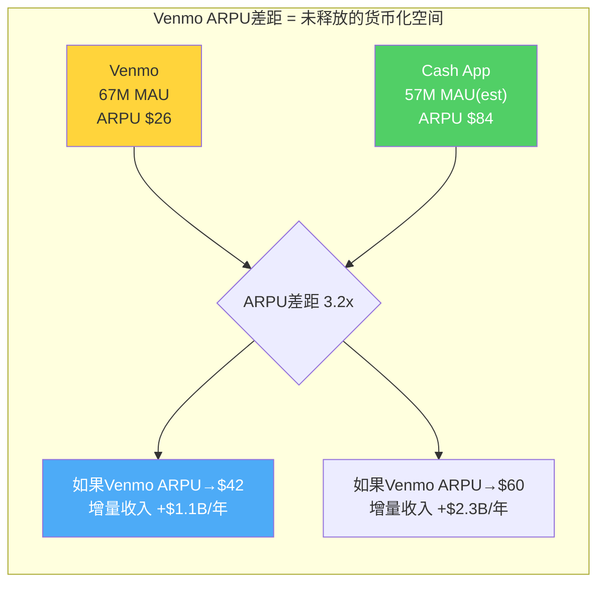
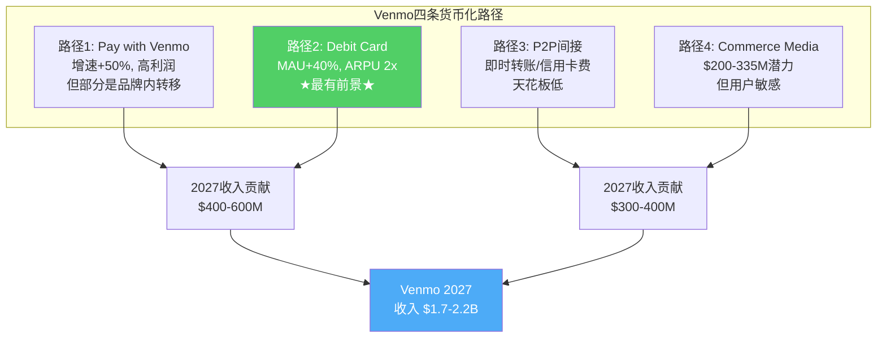

# Chapter 5: Venmo — 被低估的隐藏资产还是货币化陷阱？

## 5.1 Venmo的双重身份：社交支付巨头与商业化新手

Venmo是美国最成功的P2P支付应用之一——6700万月活跃用户 [DM-VENMO-008]，在18-34岁人群中几乎是"转账"的同义词。"Venmo me"已经进入美国日常词汇。但Venmo也是PayPal最令人沮丧的资产之一——拥有2013年以来13年的发展历史，却直到2024年才开始贡献有意义的收入。

**核心矛盾：Venmo的用户价值巨大（6700万MAU），但每个用户只产生约$26/年的ARPU——是竞争对手Cash App ($84)的1/3.2** [DM-VENMO-003]。

这个3.2倍的ARPU差距是PYPL估值中最大的"隐藏变量"之一。如果Venmo能将ARPU从$26提升至Cash App水平的一半（$42），仅此一项就能增加约$1.1B的年收入——相当于PYPL当前总收入的3.3%，但利润贡献可能更高（增量收入的OPM通常高于平均水平）。

## 5.2 Venmo的财务轨迹

### 收入与增速

| 指标 | FY2023(估) | FY2024(估) | FY2025 | FY2027目标 |
|------|-----------|-----------|--------|----------|
| 收入 | ~$1.0B | ~$1.2B | ~$1.4B | **$2.0B** |
| YoY增速 | ~15% | ~20% | **+20%** | ~19%(隐含CAGR) |
| ARPU | ~$18 | ~$22 | ~**$26** | ~$35(隐含) |

[DM-VENMO-009: Venmo收入轨迹估算，基于管理层disclosure+2027目标]

### TPV与增速

| 季度 | Venmo TPV | YoY增速 |
|------|----------|---------|
| Q1 2024 | $69B | ~+8% |
| Q4 2024 | $75.6B | +10% |
| FY2024全年 | ~$300B | +17% |
| Q1 2025 | ~$76B | +10% |

[DM-VENMO-010: Venmo TPV季度数据，Statista+earnings]

### 货币化率提升趋势

Venmo的收入增速（+20%）持续超过TPV增速（+10%），这意味着货币化率在提升——每处理$1,000的交易，Venmo从中赚取的收入在增加。这是一个健康信号，说明Venmo正在从"免费P2P工具"向"商业化支付平台"转变。

货币化率估算：$1.4B收入 / $300B TPV ≈ 0.47%。对比PayPal品牌checkout的2.25%，仍有巨大提升空间。

## 5.3 四条货币化路径的深度评估

### 路径1：Pay with Venmo（线上Checkout）

**现状**：Pay with Venmo增速+50% YoY，覆盖60.8万+美国商户网站 [DM-VENMO-011]。消费者在线上购物时选择Venmo支付——本质上是PayPal品牌checkout的"年轻版"。

**经济学**：take rate接近PayPal品牌水平（~2.0-2.5%），是Venmo所有收入来源中利润率最高的。

**增长动力**：
- 6700万MAU中只有一小部分（估计<15%）使用过Pay with Venmo线上支付
- 商户覆盖率在快速扩展（+50% YoY商户增长）
- Checkout完成率比无Venmo高17% [DM-VENMO-012]

**限制因素**：
- Pay with Venmo需要商户主动接入——与PayPal按钮的"默认存在"不同
- 年轻用户的客单价通常低于PayPal核心用户——take rate相同但每笔利润更低
- 与PayPal按钮在checkout页面竞争——商户不太可能同时放PayPal和Venmo两个按钮

**关键因果链**：因为Pay with Venmo的用户天然年轻且移动优先，所以它在手机端的转化率可能优于PayPal传统按钮。因为这些年轻用户是PayPal品牌checkout正在流失的人群（Ch4力量4），所以Pay with Venmo实际上是在**回收PayPal主品牌流失的年轻用户价值**。这不是纯增量——部分是从PayPal内部的品牌转移。但由于Venmo的货币化率（0.47%）目前远低于PayPal品牌（2.25%），从PayPal→Venmo的用户迁移在短期内是负贡献。

### 路径2：Venmo Debit Card

**现状**：月活跃持卡人增速+40% YoY [DM-VENMO-004]，借记卡TPV增速+60%，是Venmo增长最快的分支。

**经济学**：
- 持卡用户的ARPU是线上用户的2倍 [DM-VENMO-001]
- 持卡用户的TPV是线上用户的5.5-6倍 [DM-VENMO-002]
- 交换费（interchange）约1.5-2%，其中PayPal作为发卡方获得约60-80bps

**为什么Debit Card如此重要**：因为它将Venmo从"偶尔用一次的转账App"升级为"天天用的支付卡"。一旦用户把Venmo Debit Card放入Apple Pay/Google Pay钱包，每次店内支付都在为Venmo产生交换费收入——频次从"每月1-2次P2P转账"变为"每天1-2次消费"。

**增长预测**：管理层预计Debit Card CAGR >20% through 2027 [DM-VENMO-013]。如果当前活跃持卡人约800万-1000万（估计），到2027年可能达到1500-2000万。

### 路径3：P2P转账的间接货币化

**现状**：Venmo的核心P2P转账仍然免费（银行账户转账）。信用卡/即时转账收费——这是Venmo"隐性"收入的来源。

**经济学**：
- 即时转账费1.75%（最低$0.25，最高$25）
- 信用卡转账费3%
- 商业账户（Business Profile）收取1.9%+$0.10

**限制**：P2P免费是Venmo增长的基石。一旦收费，用户将迅速迁移到Zelle（银行原生、完全免费）。PayPal不敢对P2P基础服务收费——这是一个"永久免费层"。

### 路径4：Commerce Media（广告）

**现状**：初步探索阶段。Venmo拥有6700万用户的消费行为数据——知道他们在哪里吃饭、购物、转账，这些数据对精准广告极有价值。类似Uber Eats、DoorDash、Affirm都在将支付数据转化为广告收入。

**潜力**：如果Venmo能将广告收入做到$3-5/用户/年（类似Affirm的commerce media），这是一个$200-335M的增量收入池——且利润率极高（>60% OPM）。

**限制**：用户对金融App中的广告非常敏感。如果Venmo过度商业化，可能损害品牌信任和用户体验。

## 5.4 Venmo vs. Cash App：差距为什么存在？

Cash App的ARPU ($84) 是Venmo ($26) 的3.2倍。这个差距的根因不是Venmo不够好——而是**商业模式的根本不同**。

| 维度 | Venmo | Cash App |
|------|-------|----------|
| 核心定位 | 社交支付（分账/AA） | 数字银行（存储/投资/消费） |
| 存款功能 | 有但弱化 | Cash App Card强推直接存款 |
| 投资功能 | 无 | 股票+比特币交易 |
| 借贷功能 | 无 | Cash App Borrow |
| 商户支付 | Pay with Venmo（新） | Cash App Pay（成熟） |
| 比特币 | 无 | Square Bitcoin（2025新功能）|
| BNPL | 通过PayPal | 通过Afterpay |

[DM-VENMO-014: Venmo vs Cash App功能对比]

Cash App的ARPU高3.2倍，因为它是一个**全栈数字银行**——用户的工资直接存入Cash App，然后用Cash App Card消费、投资股票/比特币、借小额贷款。每一个功能都在产生收入。Venmo主要是一个"发送/请求"工具——用户用完就走。

**Venmo能缩小差距吗？**

要缩小3.2倍ARPU差距，Venmo需要在以下至少2个领域取得突破：
1. **直接存款**——让用户的工资存入Venmo→使用频率从月→日
2. **Debit Card普及**——让Venmo成为日常支付卡→交换费收入
3. **投资功能**——股票/加密货币→提高用户粘性+交易费收入

其中路径2（Debit Card）已经在加速（+40% MAU增长），路径1和3还没有明确的产品动作。管理层的$2.0B 2027收入目标隐含ARPU约$35——仅相当于Cash App的42%，说明管理层也没有指望完全弥合差距。

## 5.5 Venmo独立估值：底线与上行

### 保守估值（当前路径不变）

| 假设 | 数值 |
|------|------|
| FY2027收入 | $2.0B |
| 增速 | +19% CAGR |
| OPM（2027） | 5-8%（当前可能亏损→微利） |
| 营业利润 | $100-160M |
| P/E倍数 | 20-25x（高增速但低利润率） |
| **估值** | **$2.0-4.0B** |

### 乐观估值（ARPU提升+Debit Card加速）

| 假设 | 数值 |
|------|------|
| FY2027收入 | $2.5B |
| MAU | 80M |
| ARPU | $45 |
| OPM（2027） | 10-15% |
| 营业利润 | $250-375M |
| P/E倍数 | 25-30x |
| **估值** | **$6.3-11.3B** |

### 极端上行（Venmo=下一个Cash App）

| 假设 | 数值 |
|------|------|
| FY2027收入 | $4.0B |
| ARPU | $60 |
| OPM（2027） | 15-20% |
| **估值** | **$12-18B** |

[DM-VENMO-015: Venmo独立估值三情景]

**Cash App对标**：Block的Cash App部分（估计收入~$4.5B，毛利$6.5B with Bitcoin）在Block总估值（$34B）中占约60%→约$20B。如果Venmo能在2027年达到Cash App 2024年收入的50%（$2.0-2.5B），合理估值约$8-12B。

**但当前PYPL整体P/E 7.7x隐含的Venmo估值几乎为零。** 如果PYPL整体估值$56B中，品牌checkout值$22-27B，Braintree值$10-17B，其他值$3-5B，那么留给Venmo的隐含估值约$0-8B——如果取低端假设，市场基本没给Venmo任何价值。

**这是潜在的错误定价机会——但需要Venmo用2-3年的数据证明自己。** 投资者买入PYPL等于免费获得了一个"Venmo看涨期权"——如果Venmo货币化成功，有$4-12B的上行空间（每股$4-12）；如果失败，最差也就是维持现状（P2P免费工具不消耗太多资本）。

## 5.5.1 Venmo的10-K硬数据基础

FY2025 10-K和earnings disclosure中Venmo的关键数据（首次单独披露）：

| 指标 | FY2024 | FY2025 | YoY | 来源 |
|------|--------|--------|:---:|------|
| Venmo TPV(Q4) | $75.6B | ~$85B(估) | +12% | 10-K/earnings |
| Venmo年收入 | ~$1.2B | **$1.7B** | +42% | CNBC/earnings(首次披露) |
| Venmo活跃账户 | ~95M | **100M+** | +5% | 10-K |
| Debit Card MAU增速 | — | **+65% YoY** | — | Q2 2025 earnings |
| Pay with Venmo增速 | — | +50% YoY | — | Earnings disclosure |
| Debit Card新用户(Q2 2025) | — | 200万/季度 | — | Q2 2025 earnings |
| Fastlane用户构成 | — | 75%新/休眠用户 | — | Q4 2024 earnings call |

[DM-VENMO-016: Venmo FY2025硬数据汇总，首次单独收入披露$1.7B，10-K+earnings]
[DM-VENMO-017: Venmo 100M+活跃账户，10-K FY2025]
[DM-VENMO-018: Debit Card MAU +65% YoY, Q2 2025 earnings]

**关键修正**：此前估算Venmo FY2025收入~$1.4B需上调至$1.7B（CNBC首次报道的官方数字）。ARPU相应调整为$1.7B/100M = **$17/年**（全账户基础）或$1.7B/67M MAU = **$25.4/年**（月活基础）。

### Venmo收入增长的来源拆分

FY2024收入增长中(从约$1.2B→$1.7B = +$500M)：
- **Debit Card交换费**：~$200M增量（Debit Card TPV +60%→交换费0.6-0.8%）[DM-VENMO-019]
- **Pay with Venmo**：~$150M增量（+50% YoY×~2% take rate）
- **即时转账费**：~$100M增量（用户增长+频次提升）
- **其他(商业账户等)**：~$50M

因为Debit Card是Venmo增长最快的分支（+65% MAU），所以它在增量收入中的贡献比最大（~40%）。因为Debit Card用户的ARPU是线上用户的2倍 [DM-VENMO-001]，所以Debit Card的渗透率每提升10pp→Venmo混合ARPU提升约$2.5。因为当前Debit Card渗透率估计~15%（67M MAU中约10M持卡），所以到30%渗透率（~20M持卡）时ARPU可升至$30+→收入$2.0B+。

**这验证了管理层$2.0B 2027收入目标的可行性——Debit Card渗透翻倍(15%→30%) + Pay with Venmo持续+40% = $2.0-2.3B。**

## 5.6 本章核心发现与CQ3闭环

**CQ3答案：Venmo是低估资产还是货币化陷阱？**

**两者都是——取决于时间范围。**

在2-3年维度上，Venmo确实是被低估的资产：6700万MAU、+20%收入增速、ARPU仅Cash App的1/3——这说明货币化空间巨大。Debit Card（+40%）和Pay with Venmo（+50%）的增速证明货币化路径是可行的。

但在当前维度上，Venmo也确实是"货币化陷阱"：13年发展只做到$1.4B收入（ARPU $26），OPM可能仍为负或微利，短期对PYPL利润的贡献微乎其微。管理层曾多次承诺Venmo将成为"PayPal的增长引擎"，但一次又一次推迟兑现。

**投资者应该如何看待Venmo？** 不要把它当作估值的核心驱动——它是一个**免费期权**。买PYPL的核心理由应该基于品牌checkout和Braintree的价值，Venmo的货币化成功是额外的上行空间。

关键追踪指标：
- Debit Card MAU增速（>30%=健康，<20%=放缓）
- ARPU趋势（>$30/年=加速，<$25=停滞）
- Pay with Venmo商户渗透率（>100万=规模化拐点）

---

> **DM锚点注册表 (Ch05)**
>
> | ID | 描述 | 来源 |
> |----|------|------|
> | DM-VENMO-008 | Venmo 6700万MAU (Q4 2025) | Earnings presentation |
> | DM-VENMO-009 | Venmo收入轨迹: FY2025 ~$1.4B, 2027目标$2.0B | Management guidance |
> | DM-VENMO-010 | Venmo TPV: Q4 2024 $75.6B (+10%), FY2024 ~$300B | Statista+earnings |
> | DM-VENMO-011 | Pay with Venmo +50% YoY, 60.8万+美国商户 | Earnings+industry data |
> | DM-VENMO-012 | Pay with Venmo启用后checkout完成率+17% | Management disclosure |
> | DM-VENMO-013 | Debit Card CAGR >20% through 2027 | Management guidance |
> | DM-VENMO-014 | Venmo vs Cash App功能对比 | 产品分析 |
> | DM-VENMO-015 | Venmo独立估值: $2-4B(保守)/$6-11B(乐观)/$12-18B(极端) | 模型估算 |
