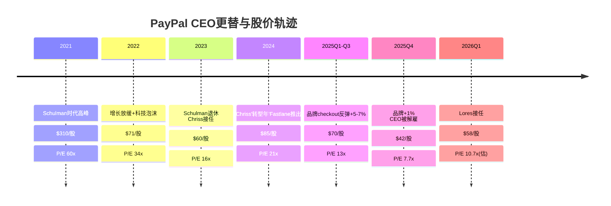

# Chapter 6: 管理层审计 — 2年3任CEO与执行风险

## 6.1 PayPal的领导力危机

PayPal在18个月内更换了三任CEO——这在大型科技公司中极其罕见，信号强度相当于一家公司承认"我们不知道该往哪走"。

| CEO | 任期 | 风格 | 结果 |
|-----|------|------|------|
| **Dan Schulman** | 2014-2023 | 稳健运营，不冒险 | 用户从1.5亿→4.3亿，但品牌创新停滞。股价从$35→$310→$60 |
| **Alex Chriss** | 2023.9-2026.2 | 激进创新，产品密集 | Fastlane/PayPal Open/AI，但执行不达标。股价$60→$80→$42 |
| **Enrique Lores** | 2026.3- | 纪律运营，HP经验 | 方向未知。股价$42→$58(修复预期) |

[DM-MGT-002: CEO更替时间线及股价表现]

### Schulman时代遗产（2014-2023）：规模扩张但护城河弱化

Schulman的9年任期将PayPal从eBay剥离后的单一支付平台发展成多品牌支付帝国（PayPal+Venmo+Braintree+Xoom+Honey+PYUSD）。用户从1.5亿增至4.3亿，TPV从$2350亿增至$1.53万亿。

但Schulman的遗产有一个致命弱点：**他在扩张中没有保住品牌checkout的核心地位。** 在Schulman任期的后半段（2020-2023），Apple Pay在移动端快速崛起，Stripe/Adyen在企业端侵蚀Braintree，Shopify推出Shop Pay——而PayPal的产品创新几乎停滞。Schulman把资源分散在加密货币（PYUSD）、BNPL（Pay in 4）、社交购物（Honey）等边缘业务上，忽视了品牌checkout这个利润核心。

**因果链**：因为Schulman优先追求用户数增长（4.3亿的标题数字）而非用户价值深挖，所以大量低质量用户被吸入——很多人注册PayPal只是为了一次性eBay交易，之后再也不用。因为产品创新预算被分散到6+个项目（Honey、Xoom、PYUSD、Pay in 4、超级App尝试、NFT），所以核心checkout体验从2015年到2023年几乎没有根本性升级——仍然是"跳转到PayPal页面→登录→确认"的老流程。因为品牌checkout体验停滞，所以当Apple Pay和Shop Pay提供更流畅的替代方案时，用户开始流失。

### Chriss时代（2023.9-2026.2）：正确的方向，失败的执行

Alex Chriss从Intuit（TurboTax/QuickBooks母公司）空降到PayPal，带来了产品导向的思维：Fastlane（嵌入式checkout）、PayPal Open（开放API平台）、AI驱动的欺诈检测、Verifone合作（线下POS）。

**Chriss做对了什么**：
- 诊断了核心问题——品牌checkout的"跳转摩擦"是流失的根因
- 推出了正确的产品——Fastlane从根本上改变了PayPal的checkout体验
- 控制了成本——SBC从$1.48B降至$1.00B（-32%），裁员2500人

**Chriss为什么被解雇**：

2026年2月3日，PayPal同时宣布了三件事：(1)Q4 2025 EPS $1.23 miss analysts' $1.29 [DM-MGT-003]；(2)品牌checkout增速崩至+1% [DM-BIZ-007]；(3)CEO Chriss被立即解雇。

Q4 2025的细节揭示了执行层面的系统性问题：
- **品牌checkout TPV增速从+7%崩至+1%**——这是CEO被解雇的直接导火索
- **收入$86.8亿 miss约$9000万**——幅度不大但方向错误
- **管理层撤回2027年全部中期目标**——承认"运营和部署问题遍布所有区域"
- **销售团队被指"无法交付承诺"**——暗示Chriss的产品愿景与地面执行之间存在巨大断层

[DM-MGT-003: Q4 2025 EPS $1.23 vs consensus $1.29, 品牌checkout +1%]

**因果推理**：因为Chriss来自Intuit（一家以产品-市场匹配闻名的公司），所以他将PYPL的问题定义为"产品问题"——推出Fastlane、PayPal Open等新产品来解决增长。但PayPal的真正问题不仅是产品——还有销售执行、商户关系管理、国际运营效率。因为Chriss过度聚焦产品创新而忽视运营执行，所以当新产品（Fastlane）需要商户大规模采用时，销售团队无法推动——导致25%的美国覆盖率之后增速停滞。**最终结果是：正确的产品 + 失败的分销 = 品牌checkout增速崩至+1%。**

**市场反应**：PayPal股价在一天内从$52.33跌至$41.70（-20.3%），蒸发约$100亿市值 [DM-MGT-004]。随后触发多起证券集体诉讼，指控公司在2025年Investor Day大力宣传2027年目标时已经知道运营存在系统性问题。

## 6.2 Enrique Lores：HP式纪律能拯救PayPal吗？

### Lores在HP的成绩单

Lores在HP Inc.的成就以**运营纪律**著称，而非创新突破：

- **订阅化转型**：将HP的打印业务从"卖打印机→耗材"模式升级为"Instant Ink"订阅服务——消费品经常性收入流+硬件成为获客入口
- **成本纪律**：在PC/打印机行业持续下行的环境中维持利润率
- **资本配置**：积极回购+适度分红，维持股东回报
- **企业级销售**：HP在企业PC/工作站市场保持领导地位——靠的是渠道关系和服务合约，不是技术创新

[DM-MGT-005: Lores HP任期成就，来自公开信息]

### 将HP经验映射到PayPal

| HP经验 | PYPL映射 | 可行性 |
|--------|---------|--------|
| Instant Ink订阅 | 将商户服务从交易费→月度SaaS订阅 | **中等**——大商户可能不接受 |
| 成本纪律 | 继续削减SBC/运营费用 | **高**——但空间有限(Ch3) |
| 企业级销售 | 修复Chriss暴露的销售执行缺陷 | **高且关键**——这可能是Lores最大的贡献 |
| 硬件+服务 | Verifone POS终端 + PayPal软件 | **中等**——线下是新战场但PYPL无经验 |
| 收缩聚焦 | 砍掉分散注意力的项目(PYUSD?Xoom?) | **高**——HP式聚焦对PYPL很有价值 |

### Lores的三个可能方向

**方向1：HP式运营修复（概率50%）**
- 聚焦执行：修复销售团队、改善国际运营、加速Fastlane分销
- 成本纪律：继续优化OpEx，但不激进裁员
- 保守承诺：不再给中期目标，按季度证明自己
- 结果：OPM从18%升至20-21%，品牌checkout企稳在+2-4%
- 估值影响：P/E 10-12x→$54-65

**方向2：战略收缩（概率30%）**
- 出售/分拆Braintree——聚焦品牌钱包+Venmo
- 砍掉PYUSD、Xoom等低ROI项目
- 用释放的资源加大品牌checkout和Venmo投入
- 结果：收入下降但利润率大幅提升（OPM→25-30%）
- 估值影响：看分拆后的纯品牌估值，P/E 15-18x→$60-80

**方向3：HP化陷阱（概率20%）**
- 过度削减成本扼杀创新——Fastlane团队被裁/预算缩减
- 用回购掩盖零增长——EPS数字好看但实质停滞
- "管理层的打印机"——把PayPal变成一台不增长但派息的现金机器
- 结果：OPM稳在18-19%但增速降至0-2%
- 估值影响：P/E 6-8x→$32-43

## 6.3 CEO沉默域分析（QG-01.5）

在Lores上任后的首次公开声明中，以下关键话题被**系统性回避**：

| 沉默域 | 预期信号 | 缺席解读 |
|--------|---------|---------|
| **品牌checkout具体数据** | 新CEO应直面核心问题 | 可能Q1数据仍不好→避免过早承诺 |
| **Braintree战略（保留/分拆/提价）** | 最大战略决策之一 | 可能仍在评估→90天内应有明确信号 |
| **2027年中期目标恢复** | 投资者最关心 | 明确不会短期恢复→"earn back trust" |
| **组织架构调整** | CEO更换通常伴随重组 | 可能3-6月后才公布 |
| **与Stripe/Apple Pay的竞争策略** | 竞争是核心痛点 | 标准回避（不点名竞争对手） |

[DM-MGT-006: Lores沉默域分析，基于Feb 2026公开声明]

**Lores说了什么**：
- "disciplined growth agenda"——纪律增长
- "greater speed and precision"——更快更精准的执行
- "consistent delivery quarter on quarter"——按季度交付（不做长期承诺）
- "merchant-focused investments"——聚焦商户端投入

**解读**：Lores的措辞100%是"HP语言"——纪律、精准、季度交付。没有Chriss那种"we're building the future of commerce"的宏大叙事。**这对短期股价可能是好消息（降低期望、超预期更容易），但对长期估值倍数可能是坏消息（没有增长叙事=市场不会重新定义PYPL的身份）。**

## 6.4 执行风险量化

| 风险项 | 概率 | 影响 | 预期损失 |
|--------|:----:|------|---------|
| Lores 90天内无明确战略 | 40% | P/E维持7-8x | -$0 (维持现状) |
| Lores过度削减创新预算 | 25% | Fastlane停滞→品牌-3~5% | -$8-12/股 |
| 又一次CEO更换(12月内) | 10% | P/E压至5-6x | -$15-20/股 |
| 集体诉讼和解/赔偿 | 60% | $200-500M一次性费用 | -$1-3/股 |
| Lores战略聚焦成功 | 35% | OPM→20%+品牌企稳 | +$10-20/股 |

[DM-MGT-007: 执行风险矩阵]

**关键时间窗口**：
- **2026年4月（Q1 2026 earnings）**：Lores的第一次earnings call——市场将仔细分析他的战略框架和品牌checkout趋势
- **2026年Q2-Q3**：Fastlane在Lores领导下的表现——覆盖率是否继续扩展？品牌checkout增速是否反弹？
- **2026年H2**：是否有战略评估结果——分拆Braintree？出售非核心资产？

## 6.5 本章核心发现与CQ4闭环

**CQ4答案：Chriss→Lores交接期的执行风险有多大？**

**风险是真实的但可控。** 最坏情况（又一次CEO更换）的概率约10%——PayPal董事会不太可能在12个月内再换CEO。最可能的情况（HP式运营修复）概率约50%——这对PYPL意味着OPM温和改善但增速不会大幅加速。关键不确定性是Lores对Braintree的战略决策——保留并提价、分拆出售、还是维持现状——这个决定将在未来6-12个月明确。

**管理层对估值的净影响**：CEO更替是短期负面（不确定性溢价）但中期可能正面——因为Chriss的执行失败（品牌checkout +1%）已经被市场充分定价（$42低点），而Lores只需要做到"不更差"就能维持股价修复。从$42到$58的反弹（+38%）已经反映了"新CEO至少不会更差"的预期。

---

> **DM锚点注册表 (Ch06)**
>
> | ID | 描述 | 来源 |
> |----|------|------|
> | DM-MGT-002 | CEO更替时间线: Schulman→Chriss→Lores | 公开新闻 |
> | DM-MGT-003 | Q4 2025 EPS $1.23 miss $1.29, 品牌+1% | Earnings release |
> | DM-MGT-004 | 解雇日股价-20.3% ($52.33→$41.70), ~$100亿蒸发 | 市场数据 |
> | DM-MGT-005 | Lores HP任期: 订阅化+成本纪律+企业销售 | 公开信息 |
> | DM-MGT-006 | Lores沉默域: 品牌数据/Braintree战略/中期目标 | 公开声明分析 |
> | DM-MGT-007 | 执行风险矩阵: 5项风险概率×影响 | 分析框架 |
