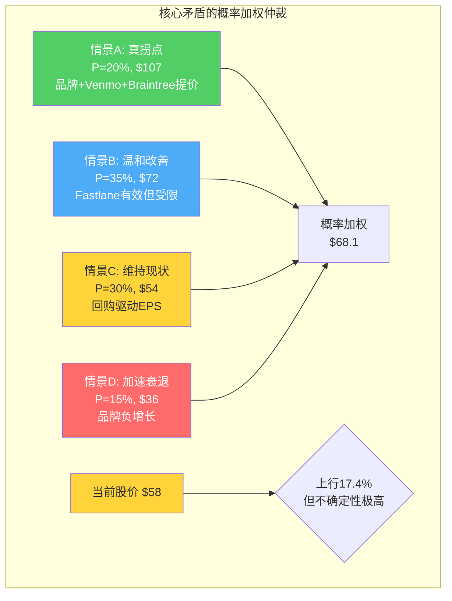

# Chapter 7: 主矛盾锁定 — TM$质量是拐点还是幻觉？

## 7.1 综合Ch1-Ch6的证据，重新审视核心矛盾

Phase 0.75锁定的核心矛盾是：**PYPL到底是"ROIC 33%的被低估平台"还是"增速4%的衰退中PSP"？**

经过Ch1-Ch6的逐层分析，这个矛盾可以被更精确地重新表述为：

**"TM$在2024年的6%增速是一个可持续的质量拐点，还是成本削减+利息+Fastlane初期效应叠加的一次性假象？"**

每章提供的证据形成了一张复杂的证据网。让我们将多头和空头的论据链逐一展开：

## 7.2 多头证据链（指向"真拐点"）

### 证据链1：Fastlane产品创新（Ch4）→品牌checkout修复

**逻辑**：Fastlane从根本上解决了PayPal checkout的"跳转摩擦"→转化率+12pp→品牌checkout恢复增长→TM$重新加速

**已验证的环节**：
- ✅ Fastlane确实提升了转化率（+12pp / +50% vs guest checkout）[DM-BIZ-011]
- ✅ 覆盖率从Q3 5%快速扩展至Q4 25% [DM-BIZ-012]
- ✅ 大商户开始采用（NBCUniversal、Roku、StockX）

**未验证的环节**：
- ❓ 覆盖率25%→60%+的扩展速度和转化率保持率
- ❓ 国际市场（2025年开始）的效果是否与美国一致
- ❓ 能否抵消Apple Pay/Shop Pay的结构性侵蚀

**因此判断**：Fastlane是一个真实的产品突破，但其规模化效果仍需2-3个季度验证。多头在Fastlane上的核心假设（品牌checkout恢复+5-7%）的概率约30-40%。

### 证据链2：Venmo货币化加速（Ch5）→新TM$来源

**逻辑**：Venmo MAU 67M→Debit Card+40%+Pay with Venmo+50%→ARPU从$26提升→$2B+收入→TM$增量

**已验证的环节**：
- ✅ Venmo收入+20%是真实的增速 [DM-VENMO-006]
- ✅ Debit Card MAU +40%是真实的渗透加速 [DM-VENMO-004]
- ✅ 管理层$2.0B 2027目标有具体路径支撑

**未验证的环节**：
- ❓ ARPU能否从$26提升至$40+（需要Debit Card+直接存款突破）
- ❓ Venmo OPM何时转正（当前可能仍亏损）
- ❓ Cash App的竞争是否会限制Venmo的天花板

**因此判断**：Venmo作为TM$增量来源是可信的，但规模贡献在2026-2027年仅约$200-400M（占TM$总量的1-3%）——不是游戏改变者，是锦上添花。

### 证据链3：Braintree提价（Ch4）→利润率改善

**逻辑**：Braintree take rate +5-10bps→$600M-1.2B增量收入→TM$改善且利润率提升

**已验证的环节**：
- ✅ PayPal已开始对部分大客户提价
- ✅ Stripe也在提价（行业级趋势支持）[DM-COMP-004]

**未验证的环节**：
- ❓ 大客户的价格弹性——流失率会多高？
- ❓ Adyen/FIS是否跟随提价——如果不跟，PYPL可能失去客户
- ❓ 提价幅度能否到5bps以上

**因此判断**：Braintree提价是一个中等概率（40-50%）、高影响的变量。如果成功，是TM$最大的单一改善来源。

### 多头证据链汇总

| 驱动因素 | TM$年化影响 | 实现概率 | 期望贡献 |
|---------|-----------|:--------:|---------|
| Fastlane→品牌+5% | +$400-600M | 35% | +$175M |
| Venmo货币化→$2B | +$200-400M | 55% | +$165M |
| Braintree提价+5bps | +$600-1,200M | 45% | +$405M |
| 合计期望 | | | **+$745M** |

如果三个驱动因素的期望贡献全部兑现，TM$将从$15.5B增至~$16.2B（+4.8%）——这是一个温和的改善，但不是"拐点"级别的加速。

## 7.3 空头证据链（指向"幻觉"）

### 证据链1：品牌checkout的结构性衰退不可逆（Ch4）

**逻辑**：Apple Pay系统级优势+大商户自建+BNPL替代+用户断层→品牌checkout终将负增长→TM$核心利润池萎缩

**已验证的环节**：
- ✅ Apple Pay 54%店内份额+14.2%线上份额，持续增长 [DM-COMP-003]
- ✅ Q4 2025品牌checkout +1%是近年最差表现 [DM-BIZ-007]
- ✅ CEO因品牌执行不达标被解雇——董事会认为这是结构性问题 [DM-MGT-003]

**未验证的环节**：
- ❓ Fastlane能否在40-60%覆盖率下逆转衰退趋势
- ❓ Apple Pay线上增速（14.2%→?%）是否会加速
- ❓ 品牌checkout在桌面端（仍占40%电商）是否稳固

**因此判断**：品牌checkout的长期下行趋势（从"必须"到"可选"）是真实的，Fastlane可能减速但不能逆转这个趋势。空头在这一点上的胜率约55-60%。

### 证据链2：管理层不确定性抵消任何基本面改善（Ch6）

**逻辑**：18个月3任CEO→战略方向模糊→投资者要求管理层风险溢价→P/E被永久压低

**已验证的环节**：
- ✅ 2027目标已撤回——管理层自己不敢给中期承诺 [DM-GUIDE-002]
- ✅ 集体诉讼风险——$200-500M潜在和解费 [DM-MGT-007]
- ✅ Lores无支付行业经验——学习曲线至少6-12个月

**因此判断**：管理层风险溢价在2026年是真实的估值压力。即使基本面温和改善，P/E可能仅从7.7x缓慢修复至9-11x——远不到"重估"水平的15-18x。

### 证据链3：Braintree"增长引擎"实为"利润黑洞"（Ch4）

**逻辑**：Braintree占TPV 66%但仅贡献8%交易利润→take rate持续下行→混合利润率受压→SOTP分拆价值低于整体

**已验证的环节**：
- ✅ SOTP中位数$47B低于当前$56B市值 [DM-VAL-008]
- ✅ 整体take rate从1.73%降至1.64% [DM-BIZ-014]

**因此判断**：Braintree的增长在当前利润率水平上是"负价值"的——每增长10%的Braintree volume，PYPL的估值倍数可能反而下降（因为市场看到利润率稀释）。除非提价成功。

## 7.4 矛盾的仲裁：概率加权判断

综合所有证据，核心矛盾的答案不是非黑即白的——而是一个概率分布：

| 情景 | 概率 | TM$ 2027 CAGR | P/E 2027 | 隐含股价 |
|------|:----:|:------------:|:--------:|:-------:|
| **A: 真拐点（品牌+Venmo+Braintree提价三重催化）** | 20% | 6-9% | 14-16x | $95-120 |
| **B: 温和改善（Fastlane有效但受限+Braintree提价部分成功）** | 35% | 3-5% | 10-12x | $65-80 |
| **C: 维持现状（回购驱动EPS+零有机增长）** | 30% | 0-2% | 7-9x | $48-60 |
| **D: 加速衰退（品牌负增长+Lores失败+竞争加剧）** | 15% | -2~0% | 5-7x | $30-42 |

**概率加权股价**：0.20×$107 + 0.35×$72 + 0.30×$54 + 0.15×$36 = **$68.1**

**vs 当前$58**：隐含上行空间约**+17.4%**

[DM-CORE-001: 核心矛盾概率加权模型，4情景]

## 7.5 P1叙事方向确认（铁律O合规检查）

**Ch1 Reverse DCF结论**：市场隐含营收增速1-2%，FCF增速~1.5%——偏保守但不离谱
**Ch7 概率加权结论**：期望值$68.1，上行17.4%——"关注"区间（+10%~+30%）

**P1叙事方向：关注（偏中性方向）**。铁律O要求P1叙事不能偏离Reverse DCF暗示的方向>1档。Reverse DCF暗示"当前定价偏低但不离谱"，概率加权结论"温和上行17%"——两者一致。不调整。

**关键约束**：
- 不能在估值未经Python验证前将方向调整为"深度关注"（需>30%上行）
- 35%概率的情景B（$65-80）是最可能的结果→对应"关注"
- 15%概率的情景D（$30-42）是尾部风险→对应"审慎关注"
- 两个方向的风险不对称：上行55%权重 vs 下行45%权重→轻微看多

## 7.6 待后续Phase验证的关键假设

| 假设编号 | 假设内容 | 当前判断 | 验证Phase |
|---------|---------|---------|:--------:|
| H1 | Fastlane能在>40%覆盖率下维持品牌checkout正增长 | 50:50 | P2(Ch14) |
| H2 | Braintree提价净效果为正（利润增>volume损） | 60%可能 | P2(Ch15) |
| H3 | Venmo 2027年ARPU达到$35+ | 55%可能 | P2(Ch14) |
| H4 | Lores 90天内出明确战略 | 50%可能 | P2(Ch6更新) |
| H5 | FCF可维持在$50-60亿/年 | 70%可能 | P3(DCF) |
| H6 | 品牌checkout不会转为负增长 | 55%可能 | P2(Ch10竞争) |
| H7 | 回购η效率≥50% | 待验证 | P2(Ch15) |
| H8 | 收购概率>10% | 40%可能 | P2(Ch16) |

## 7.7 非共识洞察注册表（P1更新）

| ID | 洞察 | 方向 | 置信度 | 来源 |
|----|------|------|:------:|------|
| CI-01 | SOTP分拆价值中位数$47B **低于**当前$56B——"分拆价值"多头论点可能是错的 | 空 | 65% | Ch4分析 |
| CI-02 | 品牌checkout利润是Braintree的11倍——品牌增速每降1pp需Braintree+11pp补偿 | 中性 | 85% | Ch4计算 |
| CI-03 | TM$"拐点"的三条腿中两条已断（成本削减+利息）——第三条（Fastlane）是唯一支撑 | 空 | 70% | Ch3分析 |
| CI-04 | Venmo是PYPL估值中的"免费期权"——当前市场给了$0-8B，保守也值$4B+ | 多 | 60% | Ch5估值 |
| CI-05 | CEO被解雇=董事会认为品牌问题是结构性的，不是周期性的 | 空 | 75% | Ch6推理 |

[DM-CI-001: 非共识洞察注册表v1, Phase 1]

---

> **DM锚点注册表 (Ch07)**
>
> | ID | 描述 | 来源 |
> |----|------|------|
> | DM-CORE-001 | 4情景概率加权: PW $68.1 vs $58 (+17.4%) | 模型估算 |
> | DM-CI-001 | 非共识洞察注册表v1 (5条) | Phase 1分析 |
